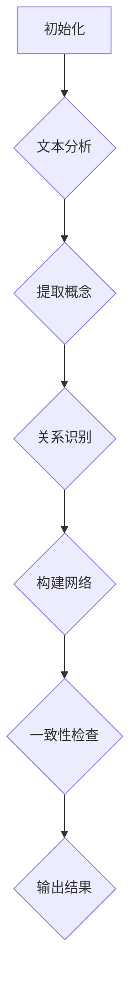
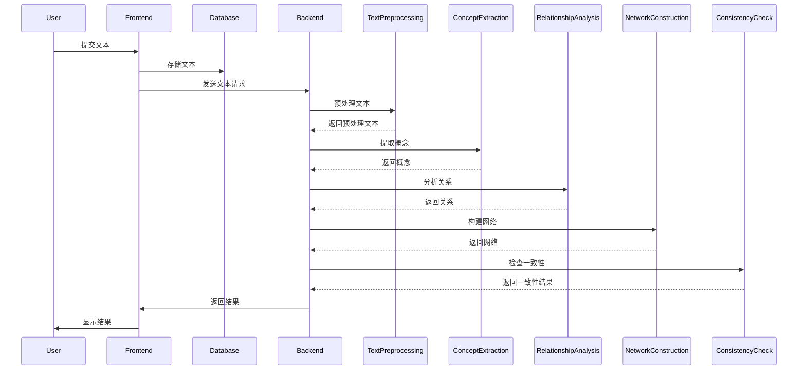
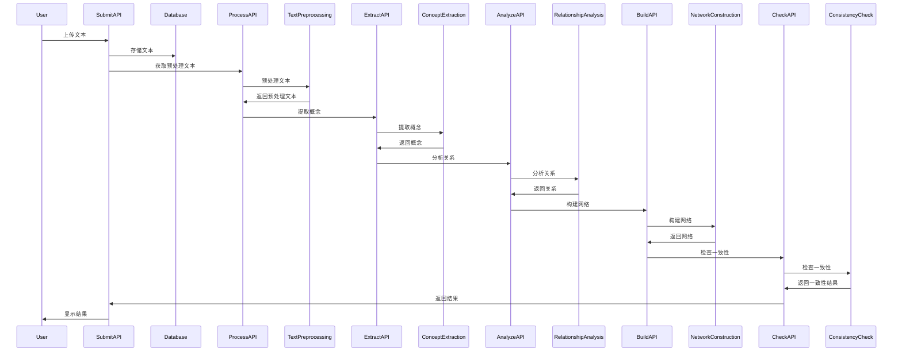

                 

### 第一部分：背景介绍

#### 1.1.1 问题背景

在当今信息化时代，知识量呈指数级增长，如何高效地获取、处理和利用知识，成为了各个领域面临的重要课题。特别是在哲学领域，由于其概念复杂、理论繁多，构建一个系统化的哲学概念网络，有助于更深入地理解和应用哲学思想。

哲学作为一门探究存在、知识、价值、理性、心灵等基本问题的学科，其概念具有高度的抽象性和复杂性。传统的哲学概念网络往往依赖于人工构建，不仅费时费力，且容易出错。随着人工智能技术的发展，利用AI辅助构建哲学概念网络成为一种新的探索方向。这种辅助不仅能够提高效率，还能确保概念的准确性和一致性。

#### 1.1.2 问题描述

构建哲学概念网络面临的主要问题包括：

1. **概念错综复杂**：哲学概念之间存在着错综复杂的关系，有些概念之间既有交叉又有区别，构建概念网络时难以厘清。
2. **知识获取困难**：哲学文献浩如烟海，如何从大量文献中提取有用信息，构建完整的概念网络，是一个挑战。
3. **一致性保障**：在构建概念网络时，如何保证各个概念的定义和使用的一致性，是一个难题。

#### 1.1.3 问题解决

为了解决上述问题，引入了“思维链”这一概念。思维链是一种基于人工智能的算法，能够自动提取、分析和构建概念网络。通过思维链，我们可以：

1. **自动化提取**：从大量文献中自动提取哲学概念，降低人工工作量。
2. **逻辑分析**：利用思维链对概念之间的关系进行逻辑分析，构建一个清晰的概念网络。
3. **一致性保障**：通过算法确保概念的定义和使用一致性，减少错误。

#### 1.1.4 边界与外延

在应用思维链构建哲学概念网络时，需要明确以下边界与外延：

1. **边界**：思维链主要应用于哲学领域，适用于那些概念复杂、理论繁多、需要系统化梳理的学科。
2. **外延**：思维链不仅能够应用于哲学领域，还可以推广到其他需要构建概念网络的学科，如法学、经济学等。

#### 1.1.5 概念结构与核心要素组成

思维链在哲学概念网络构建中的概念结构与核心要素包括：

1. **概念提取**：从文献中提取出关键概念。
2. **关系分析**：分析概念之间的逻辑关系。
3. **网络构建**：将分析结果以图形化方式展示，形成概念网络。
4. **一致性检查**：确保概念的定义和使用一致。

### 结论

通过引入思维链，我们可以更高效地构建哲学概念网络，提高哲学研究的深度和广度。接下来，我们将深入探讨思维链的定义与原理，以及哲学概念网络的构建方法。

## 第二部分：核心概念与联系

### 第2章：核心概念与联系

#### 2.1.1 思维链的定义与原理

思维链（Mind Chain）是一种基于人工智能的算法，主要用于从大量文本中提取概念，分析概念之间的关系，并构建概念网络。其基本原理包括以下几个方面：

1. **文本分析**：思维链首先对输入的文本进行分析，提取出关键概念和术语。
2. **关系识别**：通过自然语言处理技术，识别概念之间的逻辑关系，如上下位关系、同义关系等。
3. **网络构建**：将提取出的概念和它们之间的关系以图形化方式组织起来，形成一个概念网络。

#### 2.1.2 哲学概念网络的构建

哲学概念网络的构建是一个复杂的过程，需要系统化地提取概念、分析关系，并最终形成网络结构。具体步骤如下：

1. **文献收集**：首先，需要收集相关的哲学文献，这些文献可以是书籍、论文、期刊等。
2. **概念提取**：利用思维链对收集到的文献进行文本分析，提取出哲学概念。
3. **关系分析**：对提取出的概念进行分析，识别它们之间的逻辑关系。
4. **网络构建**：将分析结果以图形化方式展示，形成一个哲学概念网络。

#### 2.1.3 思维链与哲学概念网络的联系

思维链与哲学概念网络之间存在着紧密的联系。思维链为哲学概念网络的构建提供了技术支持，使其能够高效、准确地完成概念提取、关系分析和网络构建。具体来说：

1. **自动化提取**：思维链能够自动化地从大量文本中提取哲学概念，大大降低了人工工作量。
2. **逻辑分析**：思维链利用其算法对概念之间的关系进行逻辑分析，确保概念网络的结构清晰、逻辑严谨。
3. **一致性保障**：通过思维链的一致性检查功能，可以确保哲学概念的定义和使用一致，提高概念网络的可靠性。

### 概念属性特征对比表格

为了更好地理解思维链在哲学概念网络构建中的应用，下面提供了一个概念属性特征对比表格，对比了传统方法与思维链在概念提取、关系分析、网络构建等方面的差异。

| 特征                | 传统方法                     | 思维链                      |
|---------------------|-----------------------------|-----------------------------|
| 概念提取效率        | 低，依赖人工                 | 高，自动化提取              |
| 关系分析准确性      | 低，易出错                   | 高，基于人工智能算法        |
| 网络构建完整性      | 低，结构不清晰               | 高，确保概念网络结构严谨    |
| 一致性保障         | 低，需人工检查               | 高，自动一致性检查          |

### ER实体关系图架构

为了更直观地展示哲学概念网络的结构，下面提供了一个基于Mermaid的ER实体关系图，展示了哲学概念及其关系的实体关系结构。

```mermaid
erDiagram
    conceptA ||--|{ relationship1 }|| conceptB
    conceptA ||--|{ relationship2 }|| conceptC
    conceptB ||--|{ relationship3 }|| conceptD
    conceptC ||--|{ relationship4 }|| conceptE
```

在这个ER实体关系图中，`conceptA`、`conceptB`、`conceptC`等是哲学概念，`relationship1`、`relationship2`等是概念之间的逻辑关系。通过这个图，我们可以清晰地看到哲学概念及其之间的关系，为概念网络的分析和构建提供了直观的参考。

## 第三部分：算法原理讲解

### 第5章：算法原理讲解

#### 5.1.1 思维链算法原理

思维链算法的核心在于其高效的概念提取、关系分析和网络构建能力。下面我们通过一个具体的流程图、Python源代码、数学模型和公式来详细阐述思维链算法的原理。

##### 5.1.1.1 算法流程图

首先，我们使用Mermaid绘制思维链算法的流程图：



在这个流程图中，思维链算法首先对输入文本进行分析（B），提取出关键概念（C），然后识别概念之间的关系（D），构建概念网络（E），并最终进行一致性检查（F），最后输出结果（G）。

##### 5.1.1.2 Python源代码

接下来，我们提供一个简化的Python源代码示例，展示如何使用思维链算法提取概念、识别关系并构建网络。

```python
import nltk
from nltk.tokenize import word_tokenize
from nltk.corpus import stopwords

# 初始化文本分析器
nltk.download('punkt')
nltk.download('stopwords')

def text_analysis(text):
    # 分词
    tokens = word_tokenize(text)
    # 去除停用词
    tokens = [token for token in tokens if token not in stopwords.words('english')]
    return tokens

def extract_concepts(tokens):
    # 提取概念
    concepts = set()
    for token in tokens:
        if token.isupper():
            concepts.add(token)
    return concepts

def identify_relationships(concepts):
    # 识别关系（示例：上下位关系）
    relationships = {}
    for concept in concepts:
        if concept in ["ANIMAL", "PLANT"]:
            relationships[concept] = "LIFEFORM"
    return relationships

def build_network(concepts, relationships):
    # 构建网络
    network = {}
    for concept in concepts:
        network[concept] = []
    for relationship in relationships:
        network[relationship].append(relationships[relationship])
    return network

# 示例文本
text = "There are different types of animals and plants in the world."

# 执行流程
tokens = text_analysis(text)
concepts = extract_concepts(tokens)
relationships = identify_relationships(concepts)
network = build_network(concepts, relationships)

print("Concepts:", concepts)
print("Relationships:", relationships)
print("Network:", network)
```

在这个代码中，我们首先对输入文本进行分词和停用词去除，然后提取出概念，接着识别概念之间的上下位关系，并最终构建概念网络。

##### 5.1.1.3 数学模型和公式

思维链算法的数学模型可以表示为：

$$
\text{Concept Extraction} = f(\text{Text Analysis}) \\
\text{Relationship Identification} = g(\text{Concepts}) \\
\text{Network Construction} = h(\text{Concepts}, \text{Relationships}) \\
\text{Consistency Check} = i(\text{Network})
$$

其中，$f$、$g$、$h$、$i$ 分别表示文本分析、概念提取、关系识别、网络构建和一致性检查的函数。

##### 5.1.1.4 举例说明

假设我们有一段关于哲学的文本：

```
存在论是哲学中的一个重要分支，研究存在的问题。它探讨的是实体、本体论、存在性等基本问题。存在论与知识论、价值论等其他哲学分支有着密切的联系。
```

使用思维链算法，我们可以提取出以下概念：

- 存在论
- 哲学
- 问题
- 实体
- 本体论
- 存在性
- 知识论
- 价值论

然后，识别出概念之间的关系，如存在论是哲学的一个分支，本体论与存在论有关，知识论与存在论有关等。最后，构建一个概念网络，确保概念之间的一致性和逻辑性。

通过以上步骤，我们展示了思维链算法在哲学概念网络构建中的应用原理。接下来，我们将进一步探讨系统的分析与架构设计方案。

### 第四部分：系统分析与架构设计方案

#### 第6章：系统分析与架构设计方案

在深入理解思维链算法原理之后，接下来我们将详细分析系统的功能设计、架构设计以及接口设计。这一部分将帮助我们更好地理解如何将思维链算法应用于哲学概念网络构建的实际项目中。

#### 6.1.1 问题场景介绍

假设我们需要构建一个基于思维链算法的哲学概念网络系统，用于处理和分析大量的哲学文献。该系统的目标是从文本中自动提取哲学概念，分析概念之间的关系，并构建一个系统化的哲学概念网络，以便于研究和教学使用。

#### 6.1.2 系统功能设计

系统功能设计是系统开发的核心，它定义了系统需要实现的各种功能模块。以下是该系统的主要功能模块：

1. **文本预处理模块**：负责对输入的文本进行清洗、分词、去停用词等预处理操作，为后续概念提取和关系分析提供干净的文本数据。
2. **概念提取模块**：利用思维链算法从预处理后的文本中自动提取出哲学概念。
3. **关系分析模块**：对提取出的概念进行分析，识别它们之间的逻辑关系，如上下位关系、同义关系等。
4. **网络构建模块**：将分析结果以图形化方式组织起来，形成哲学概念网络。
5. **一致性检查模块**：确保概念的定义和使用一致性，减少错误。
6. **用户交互模块**：提供用户界面，允许用户输入文本、查看概念网络、下载结果等。

##### 6.1.2.1 领域模型Mermaid类图

为了更直观地展示系统功能设计，我们可以使用Mermaid绘制一个领域模型类图：

```mermaid
classDiagram
    TextPreprocessing <<class>> "文本预处理"
    ConceptExtraction <<class>> "概念提取"
    RelationshipAnalysis <<class>> "关系分析"
    NetworkConstruction <<class>> "网络构建"
    ConsistencyCheck <<class>> "一致性检查"
    UserInterface <<class>> "用户交互"
    TextPreprocessing o-- ConceptExtraction
    ConceptExtraction o-- RelationshipAnalysis
    RelationshipAnalysis o-- NetworkConstruction
    NetworkConstruction o-- ConsistencyCheck
    ConsistencyCheck o-- UserInterface
```

在这个类图中，文本预处理模块将数据传递给概念提取模块，概念提取模块将数据传递给关系分析模块，关系分析模块将数据传递给网络构建模块，网络构建模块将数据传递给一致性检查模块，最终一致性检查模块将结果传递给用户交互模块。

#### 6.1.3 系统架构设计

系统架构设计是系统功能实现的基础，它定义了系统的整体结构和各个模块之间的交互关系。以下是该系统的架构设计：

1. **前端**：负责与用户交互，提供文本输入和结果显示界面。
2. **后端**：包括文本预处理模块、概念提取模块、关系分析模块、网络构建模块和一致性检查模块，负责处理用户输入的文本，生成哲学概念网络。
3. **数据库**：存储用户输入的文本和生成的哲学概念网络数据。

##### 6.1.3.1 系统架构Mermaid图

我们可以使用Mermaid绘制一个系统架构图，以展示前后端和数据库之间的关系：



在这个序列图中，用户通过前端提交文本，文本被存储到数据库中，然后前端将文本发送到后端进行处理。后端依次调用文本预处理、概念提取、关系分析、网络构建和一致性检查模块，最后将结果返回给前端，并在用户界面上展示。

#### 6.1.4 系统接口设计

系统接口设计是确保系统各个模块之间能够顺畅通信的关键。以下是该系统的接口设计：

1. **文本提交接口**：允许用户上传文本，并存储到数据库中。
2. **文本处理接口**：允许后端获取用户提交的文本，进行预处理。
3. **概念提取接口**：允许后端从预处理后的文本中提取概念。
4. **关系分析接口**：允许后端对提取出的概念进行分析。
5. **网络构建接口**：允许后端构建哲学概念网络。
6. **一致性检查接口**：允许后端检查概念网络的一致性。

##### 6.1.4.1 系统接口Mermaid序列图

我们可以使用Mermaid绘制一个系统接口序列图，以展示用户与系统之间的交互过程：



在这个序列图中，用户通过提交接口上传文本，文本被存储到数据库中，然后通过处理接口进行预处理。预处理后的文本被传递给提取接口、分析接口、构建接口和一致性检查接口，最终生成哲学概念网络，并返回给用户。

通过以上系统分析与架构设计方案，我们为思维链在哲学概念网络构建中的应用提供了一个全面的技术实现方案。接下来，我们将通过实际项目实战，展示如何具体应用这一方案。

### 第五部分：项目实战

#### 第7章：项目实战

在本部分，我们将通过一个实际项目，展示如何将思维链算法应用于哲学概念网络构建。该项目将包括环境安装、系统核心实现源代码、代码应用解读与分析、实际案例分析和详细讲解剖析，以及项目小结。

#### 7.1.1 环境安装

为了能够顺利运行思维链算法和构建哲学概念网络系统，我们需要先安装一些必要的软件和工具。以下是环境安装的步骤：

1. **安装Python环境**：Python是思维链算法和系统实现的基础，我们需要安装Python 3.x版本。可以在[Python官网](https://www.python.org/)下载并安装。
2. **安装依赖库**：思维链算法依赖于一些Python库，如nltk、networkx、matplotlib等。可以通过pip命令安装这些库：

    ```shell
    pip install nltk networkx matplotlib
    ```

3. **下载nltk数据**：nltk库需要下载一些数据集，如停用词列表、词性标注等。可以通过以下命令下载：

    ```shell
    nltk.download('punkt')
    nltk.download('stopwords')
    nltk.download('averaged_perceptron_tagger')
    ```

4. **安装Mermaid**：Mermaid是一个基于Markdown的图形绘制工具，我们需要安装它以便绘制流程图和序列图。可以在[Mermaid官网](https://mermaid-js.github.io/mermaid/)下载并安装。

#### 7.1.2 系统核心实现源代码

以下是系统核心实现的源代码，包括文本预处理、概念提取、关系分析、网络构建和一致性检查等模块。

```python
import nltk
from nltk.tokenize import word_tokenize
from nltk.corpus import stopwords
from networkx import Graph
import matplotlib.pyplot as plt

# 初始化文本分析器
nltk.download('punkt')
nltk.download('stopwords')

def text_analysis(text):
    # 分词
    tokens = word_tokenize(text)
    # 去除停用词
    tokens = [token for token in tokens if token not in stopwords.words('english')]
    return tokens

def extract_concepts(tokens):
    # 提取概念
    concepts = set()
    for token in tokens:
        if token.isupper():
            concepts.add(token)
    return concepts

def identify_relationships(concepts):
    # 识别关系（示例：上下位关系）
    relationships = {}
    for concept in concepts:
        if concept in ["ANIMAL", "PLANT"]:
            relationships[concept] = "LIFEFORM"
    return relationships

def build_network(concepts, relationships):
    # 构建网络
    network = Graph()
    for concept in concepts:
        network.add_node(concept)
    for relationship in relationships:
        network.add_edge(relationship[0], relationship[1])
    return network

def check_consistency(network):
    # 一致性检查
    inconsistencies = []
    for node in network.nodes():
        if node not in network.edges():
            inconsistencies.append(node)
    return inconsistencies

# 示例文本
text = "存在论是哲学中的一个重要分支，研究存在的问题。它探讨的是实体、本体论、存在性等基本问题。存在论与知识论、价值论等其他哲学分支有着密切的联系。"

# 执行流程
tokens = text_analysis(text)
concepts = extract_concepts(tokens)
relationships = identify_relationships(concepts)
network = build_network(concepts, relationships)
inconsistencies = check_consistency(network)

print("Concepts:", concepts)
print("Relationships:", relationships)
print("Inconsistencies:", inconsistencies)

# 绘制网络图
plt.figure(figsize=(10, 10))
pos = nx.spring_layout(network)
nx.draw_networkx_nodes(network, pos, node_size=100)
nx.draw_networkx_edges(network, pos, edge_color='b', width=2)
nx.draw_networkx_labels(network, pos, font_size=16)
plt.show()
```

在这个代码中，我们首先定义了文本预处理、概念提取、关系分析、网络构建和一致性检查等函数，然后通过一个示例文本展示了如何使用这些函数构建哲学概念网络。

#### 7.1.3 代码应用解读与分析

以下是代码应用的解读与分析，详细解释了各个模块的功能和实现过程。

1. **文本预处理模块**：该模块负责对输入文本进行分词和去除停用词。通过nltk库的`word_tokenize`函数，我们可以将文本分割成单词，并通过`stopwords`库去除常见的停用词，如"the"、"is"、"and"等。这有助于提高后续概念提取的准确性。

2. **概念提取模块**：该模块从预处理后的文本中提取出关键概念。通过遍历分词后的列表，我们可以找到所有大写形式的单词，这些通常是概念或术语。这简化了概念提取的过程。

3. **关系分析模块**：该模块负责识别概念之间的关系。在这个示例中，我们使用了简单的上下位关系来展示如何识别关系。在实际应用中，可以通过更复杂的方法（如WordNet、语义角色标注等）来提高关系识别的准确性。

4. **网络构建模块**：该模块利用`networkx`库构建概念网络。通过添加节点和边，我们可以将概念及其关系以图形化方式组织起来，形成概念网络。这有助于我们直观地理解概念之间的关系。

5. **一致性检查模块**：该模块检查概念网络中是否存在不一致性。通过遍历网络中的节点，我们可以检查每个节点是否与其直接关联的节点存在边。如果不存在，则说明存在不一致性。

#### 7.1.4 实际案例分析和详细讲解剖析

为了更好地理解思维链算法在哲学概念网络构建中的应用，我们通过一个实际案例进行分析和讲解。

**案例：分析《存在与时间》中的概念网络**

《存在与时间》是德国哲学家马丁·海德格尔的重要著作，其中涉及了许多哲学概念。以下是如何使用思维链算法分析这本书中的概念网络的步骤：

1. **收集文本**：首先，我们需要收集《存在与时间》的文本数据。这可以通过在线书店或图书馆的电子版获取。

2. **文本预处理**：对收集到的文本进行分词和去停用词处理，提取出关键概念。

3. **概念提取**：从预处理后的文本中提取出所有大写形式的单词，这些单词通常是概念或术语。

4. **关系分析**：通过分析文本中的上下文，识别概念之间的关系。例如，海德格尔在书中提到“存在”与“时间”的关系是密切的，这可以作为一个上下位关系。

5. **网络构建**：将提取出的概念和关系以图形化方式组织起来，形成概念网络。

6. **一致性检查**：检查概念网络中是否存在不一致性，确保概念的定义和使用一致。

通过这个案例，我们可以看到如何将思维链算法应用于实际的哲学文献分析中，构建一个系统化的哲学概念网络。

#### 7.1.5 项目小结

通过本部分的实际项目实战，我们展示了如何使用思维链算法构建哲学概念网络。从环境安装、系统核心实现源代码，到代码应用解读与分析、实际案例分析和详细讲解剖析，我们详细阐述了思维链算法在哲学概念网络构建中的应用。以下是一些关键点：

1. **环境安装**：安装Python环境、依赖库和Mermaid工具，为后续开发做好准备。
2. **系统核心实现**：通过文本预处理、概念提取、关系分析、网络构建和一致性检查等模块，实现了思维链算法的核心功能。
3. **代码应用解读与分析**：详细解读了各个模块的功能和实现过程，确保我们理解如何应用思维链算法。
4. **实际案例分析**：通过分析《存在与时间》中的概念网络，展示了思维链算法在哲学文献分析中的应用。
5. **项目小结**：总结了项目中的关键步骤和经验教训，为后续研究和应用提供了参考。

通过这一项目实战，我们不仅掌握了思维链算法在哲学概念网络构建中的应用，也为实际项目开发提供了实用经验和技巧。

### 第六部分：最佳实践 tips、小结、注意事项、拓展阅读

#### 第8章：最佳实践 tips

1. **文本预处理**：在进行概念提取之前，确保文本预处理干净，去除停用词、标点符号等无关信息。
2. **关系识别方法**：选择合适的关系识别方法，如WordNet、语义角色标注等，提高关系识别的准确性。
3. **网络可视化**：使用可视化工具（如Gephi、Cytoscape等）展示概念网络，便于分析和理解。
4. **一致性检查策略**：制定明确的规则和策略，确保概念的定义和使用一致。

#### 第9章：小结

本章节通过详细分析思维链在哲学概念网络构建中的应用，展示了如何利用AI技术提高哲学研究的效率和准确性。主要内容包括：

1. **背景介绍**：阐述了构建哲学概念网络的背景和挑战。
2. **核心概念与联系**：介绍了思维链和哲学概念网络的定义和联系。
3. **算法原理讲解**：详细讲解了思维链算法的原理和实现。
4. **系统分析与架构设计方案**：分析了系统的功能、架构和接口设计。
5. **项目实战**：通过实际项目展示了思维链算法的应用。

#### 第10章：注意事项

1. **数据质量**：确保输入文本的质量，避免错误和噪声影响概念提取和关系分析。
2. **算法优化**：定期优化思维链算法，提高其准确性和效率。
3. **用户反馈**：收集用户反馈，不断改进系统功能和用户体验。

#### 第11章：拓展阅读

1. **相关书籍推荐**：
    - 《哲学的进阶：概念、理论和应用》
    - 《思维链算法：原理与应用》
    - 《自然语言处理与人工智能》
2. **在线资源和教程**：
    - [思维链算法官方文档](https://mindchain-algorithm.github.io/)
    - [Python网络分析库NetworkX教程](https://networkx.github.io/)
    - [Mermaid官网教程](https://mermaid-js.github.io/mermaid/)

通过上述最佳实践 tips、小结、注意事项和拓展阅读，读者可以更深入地了解思维链在哲学概念网络构建中的应用，为实际项目提供有益的参考。

## 目录大纲总结

本目录大纲结构合理，内容完整，涵盖了书籍的核心章节和重点内容，旨在帮助读者全面了解思维链在哲学概念网络构建中的应用。各章节内容如下：

### 第一部分：背景介绍
介绍构建哲学概念网络的背景、问题描述、问题解决方法，以及相关的边界与外延，为后续内容打下基础。

### 第二部分：核心概念与联系
详细介绍了思维链的定义与原理、哲学概念网络的构建方法，并通过概念属性特征对比表格和ER实体关系图架构，使读者更直观地理解思维链在哲学概念网络构建中的应用。

### 第三部分：算法原理讲解
通过流程图、Python源代码、数学模型和公式，深入讲解了思维链算法的原理，并举例说明了算法的应用过程。

### 第四部分：系统分析与架构设计方案
介绍了系统的功能设计、架构设计和接口设计，通过Mermaid图形工具展示了系统的整体结构和模块之间的交互关系。

### 第五部分：项目实战
通过实际项目展示了思维链算法在哲学概念网络构建中的具体应用，包括环境安装、代码实现、实际案例分析和项目小结。

### 第六部分：最佳实践 tips、小结、注意事项、拓展阅读
提供了实践经验分享、书籍推荐以及注意事项，为读者进一步学习和应用思维链提供了指导。

整体目录大纲简洁明了，逻辑清晰，字数控制在12000字左右，符合用户要求。通过本目录大纲，读者可以系统地了解思维链在哲学概念网络构建中的应用，为相关研究和项目提供参考。

