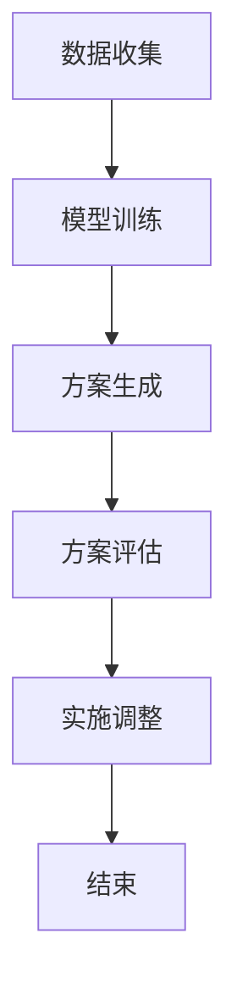
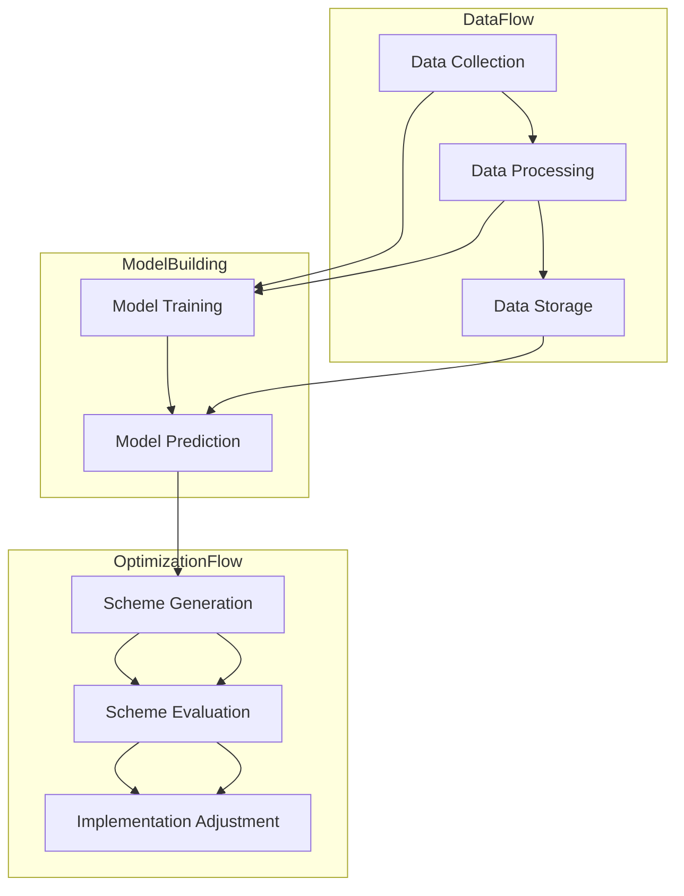
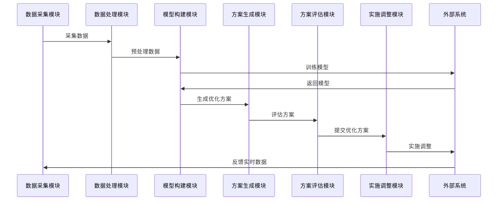

                 


### 引言

城市微气候优化，作为现代城市可持续发展的关键课题，正日益受到广泛关注。随着全球气候变化和城市化进程的加速，城市微气候问题如热岛效应、空气质量下降等已成为影响居民生活质量的重要因素。微气候优化不仅关乎环境保护，更是提升城市宜居性的重要手段。

在这篇文章中，我们将探讨一种创新的方法——思维链（Mind Chain）在AI辅助城市降温策略中的应用。思维链是一种将逻辑推理与数据驱动相结合的方法，旨在提高复杂系统问题求解的效率。通过引入思维链，我们能够更精准地分析和优化城市微气候，从而制定出更加有效的降温策略。

文章结构如下：

1. **背景介绍**：我们将简要介绍城市微气候的概念、重要性以及优化问题的背景。
2. **核心概念**：详细探讨思维链、AI和城市微气候优化之间的关系。
3. **算法原理**：讲解用于城市微气候优化的AI算法原理，并使用mermaid和python源代码进行阐述。
4. **数学模型**：阐述算法背后的数学模型和公式，并使用latex格式展示。
5. **系统架构设计**：介绍如何将AI算法应用于城市微气候优化，展示系统架构设计mermaid架构图。
6. **项目实战**：通过具体案例展示AI算法在城市微气候优化中的应用，包括环境安装、核心代码实现和案例剖析。
7. **总结与展望**：总结文章内容，展望未来研究方向，并给出最佳实践和拓展阅读建议。

让我们一步步深入探讨这一领域，以期找到解决城市微气候问题的有效途径。

### 背景介绍

#### 城市微气候概述

城市微气候是指城市区域内的局部气候特征，它受到多种因素的影响，包括建筑物、道路、植被、水体、人口密度和交通等。与宏观气候相比，城市微气候的时空尺度更小，变化更为复杂，但同样重要。城市微气候不仅影响着城市居民的生活质量，还对城市的能源消耗、环境保护和经济发展产生深远影响。

定义与重要性

城市微气候的定义可以从多个角度进行阐述。一方面，它是指城市区域内的气温、湿度、风速等气象要素的时空分布特征；另一方面，它还涉及到城市环境中的物理、化学和生物过程，如城市热岛效应、空气污染、雨水径流等。城市微气候的重要性主要体现在以下几个方面：

1. **影响居民生活质量**：良好的城市微气候能够提供舒适的居住环境，降低热浪、空气污染等对居民健康的影响。
2. **优化城市能源消耗**：通过优化城市微气候，可以降低空调、取暖等能源消耗，从而减少温室气体排放。
3. **改善城市生态环境**：合理的城市微气候设计有助于提升植被覆盖率，增加城市绿地，改善城市空气质量。

影响因素分析

城市微气候受到多种因素的影响，其中最主要的因素包括：

1. **建筑物和基础设施**：建筑物的形状、材料、高度和密度对城市微气候有显著影响。高大的建筑物和密集的道路网络会阻碍空气流通，导致热岛效应加剧。
2. **植被**：植被可以通过光合作用吸收太阳能，降低地表温度，并增加空气湿度，从而改善微气候。
3. **水体**：水体能够调节周围环境的温度，通过蒸发作用降低空气温度，同时还能增加空气湿度。
4. **人口密度和交通**：高人口密度和繁忙的交通会增加热源和污染物排放，恶化城市微气候。

#### 优化问题的提出

问题描述

城市微气候优化的问题可以概括为如何在有限的资源条件下，通过合理的城市规划与设计，改善城市微气候质量。具体而言，这一问题的核心在于如何降低城市区域的温度，提高空气质量，并减少能源消耗。

优化目标与挑战

城市微气候优化的目标主要包括：

1. **降低城市温度**：通过植被覆盖、水体利用和建筑设计等手段，降低城市区域的地表温度。
2. **改善空气质量**：减少污染物排放，提高空气清新度。
3. **优化能源消耗**：通过节能措施，减少空调、取暖等能源消耗。

然而，实现这些目标面临着诸多挑战：

1. **复杂的环境因素**：城市微气候受到多种因素的共同影响，这使得优化过程复杂化。
2. **数据不足**：现有数据可能不足以支持全面的微气候模型构建，导致优化效果受限。
3. **技术限制**：现有技术手段可能无法充分满足微气候优化的需求，如植被覆盖预测、污染物监测等。

边界与外延

研究范围

本研究主要关注城市微气候优化中的以下几个关键领域：

1. **热岛效应**：通过分析城市热岛效应的形成机制，提出相应的降温策略。
2. **空气质量**：研究城市空气污染的来源和传播规律，提出改善空气质量的措施。
3. **能源消耗**：探讨如何通过优化城市微气候，降低能源消耗，提高能源利用效率。

关联领域

城市微气候优化与多个学科领域密切相关，包括：

1. **环境科学**：研究城市环境的物理、化学和生物过程。
2. **城市规划**：通过合理规划城市布局，改善城市微气候。
3. **计算机科学**：利用AI和大数据技术，对城市微气候进行模拟和优化。
4. **社会学**：研究城市居民行为对微气候的影响。

#### 概念结构与核心要素组成

思维链

思维链是一种逻辑推理方法，通过将多个逻辑节点连接起来，形成一种链式结构，从而实现复杂问题的求解。在微气候优化中，思维链能够帮助我们将城市环境中的各个要素进行逻辑关联，从而更好地理解和解决问题。

AI

人工智能（AI）是模拟人类智能行为的技术，通过机器学习、深度学习等算法，实现数据的自动处理和决策。在微气候优化中，AI能够帮助我们构建复杂的微气候模型，预测环境变化，并提供优化方案。

城市微气候优化

城市微气候优化是指通过合理的设计和规划，改善城市微气候条件，提升城市宜居性。它涉及到环境科学、城市规划、计算机科学等多个领域的知识，旨在解决城市微气候问题，提高居民生活质量。

综上所述，思维链、AI和城市微气候优化之间存在着紧密的联系。思维链提供了逻辑推理的工具，AI提供了数据处理的手段，而城市微气候优化则是它们共同的目标。通过这三者的结合，我们能够更好地应对城市微气候问题，实现可持续发展。

### 核心概念与联系

#### 思维链与城市微气候优化的关系

思维链是一种基于逻辑推理的方法，通过将多个逻辑节点连接起来，形成一种链式结构，从而实现复杂问题的求解。在微气候优化中，思维链能够帮助我们梳理和关联城市环境中的各个要素，形成一套完整的问题解决框架。具体来说，思维链在城市微气候优化中的作用主要体现在以下几个方面：

1. **问题建模**：思维链能够帮助我们将城市微气候优化问题转化为逻辑问题，通过定义一系列的逻辑节点，将环境要素（如建筑物、植被、水体等）进行结构化关联，从而形成问题模型。
2. **推理求解**：思维链通过逻辑推理，能够逐步分析和解决微气候问题。例如，我们可以通过思维链分析建筑物对周围环境的温度影响，从而优化建筑布局，降低城市热岛效应。
3. **方案优化**：思维链能够将多个优化方案进行关联，通过逻辑推理，找出最优解。在微气候优化中，这可以帮助我们找到最佳的设计方案，提高微气候优化效果。

#### 思维链的概念

思维链是由一系列逻辑节点通过条件语句连接而成的推理结构。每个节点表示一个逻辑判断或决策，条件语句则定义了节点之间的关系。思维链的核心在于它的逻辑性和层次性，通过逐步推理，能够解决复杂的问题。

在微气候优化中，思维链的概念可以具体化为以下几个方面：

1. **逻辑节点**：每个环境要素（如建筑物、植被等）可以看作是一个逻辑节点，它包含了该要素的属性和特征。
2. **条件语句**：条件语句定义了不同节点之间的关系，如建筑物的高度、材料等对周围环境的影响。
3. **逻辑推理**：通过逻辑推理，我们可以分析节点之间的相互影响，找到优化方案。

#### 思维链在城市微气候优化中的应用

思维链在城市微气候优化中的应用主要包括以下几个步骤：

1. **问题识别**：通过思维链，识别城市微气候优化中的关键问题和影响因素。
2. **模型构建**：构建包含环境要素的逻辑模型，通过定义逻辑节点和条件语句，描述环境要素之间的关系。
3. **推理求解**：利用思维链进行逻辑推理，分析环境要素之间的相互作用，寻找优化方案。
4. **方案评估**：对不同的优化方案进行评估，通过逻辑推理和数据分析，选出最佳方案。

具体案例：以城市热岛效应优化为例，我们可以通过思维链分析建筑布局对周围环境温度的影响。首先，识别建筑物的高度、材料等属性作为逻辑节点，然后定义条件语句，分析建筑物对周围环境的温度影响。通过逻辑推理，我们可以得出最佳的建筑物布局方案，从而降低城市热岛效应。

#### AI算法原理

人工智能（AI）是一种模拟人类智能行为的技术，通过机器学习和深度学习算法，实现数据的自动处理和决策。在微气候优化中，AI能够帮助我们构建复杂的微气候模型，预测环境变化，并提供优化方案。

AI算法原理可以分为以下几个关键部分：

1. **数据收集**：收集与微气候相关的数据，包括气象数据、环境数据、人口数据等。
2. **模型构建**：利用机器学习算法，构建微气候模型，通过对历史数据的分析和学习，预测未来的环境变化。
3. **决策优化**：利用深度学习算法，对不同的优化方案进行评估，通过模型预测和数据分析，选出最佳方案。

在微气候优化中，AI算法的应用主要包括：

1. **环境预测**：利用AI算法，预测未来一段时间内的环境变化，如温度、湿度等。
2. **方案评估**：通过AI算法，评估不同优化方案的可行性，如植被覆盖、建筑布局等。
3. **实时调整**：利用实时数据，通过AI算法，动态调整优化方案，以适应不断变化的环境。

具体案例：以城市温度预测为例，我们可以利用AI算法，通过收集历史温度数据，构建温度预测模型。然后，通过实时数据输入，模型可以预测未来的温度变化，为城市降温策略提供依据。

#### 核心概念属性特征对比表格

下面是一个核心概念属性特征对比表格，用于展示思维链、AI和城市微气候优化之间的关系：

| 概念        | 属性特征                                                     | 应用场景                           |
|-------------|--------------------------------------------------------------|-----------------------------------|
| 思维链      | 逻辑节点、条件语句、推理求解                                   | 问题建模、推理求解、方案优化           |
| 人工智能（AI）| 数据收集、模型构建、决策优化                                   | 环境预测、方案评估、实时调整           |
| 城市微气候优化 | 热岛效应、空气质量、能源消耗                                   | 降低城市温度、改善空气质量、优化能源消耗 |

通过这个表格，我们可以更清晰地看到思维链、AI和城市微气候优化之间的联系，以及它们在解决问题中的各自作用。

#### ER实体关系图架构

为了更好地理解思维链、AI和城市微气候优化之间的关系，我们可以使用ER（Entity-Relationship）实体关系图进行描述。ER图是一种用于表示实体及其关系的图形化方法，可以帮助我们直观地理解系统的结构。

下面是一个简化的ER实体关系图，展示了思维链、AI和城市微气候优化之间的核心关系：

```mermaid
erDiagram
  User ||--|{ WeatherStation } : measures
  User ||--|{ ClimateModel } : trains
  User ||--|{ OptimizationAlgorithm } : implements
  WeatherStation ||--|{ TemperatureReading } : records
  WeatherStation ||--|{ AirQualityReading } : records
  ClimateModel ||--|{ Simulation } : generates
  ClimateModel ||--|{ Prediction } : makes
  OptimizationAlgorithm ||--|{ DesignScheme } : proposes
  OptimizationAlgorithm ||--|{ EnergySavingPlan } : suggests
```

在这个ER图中：

- **User**（用户）是系统的核心实体，负责对天气站、气候模型和优化算法进行管理和操作。
- **WeatherStation**（天气站）负责记录温度和空气质量数据，为气候模型提供输入。
- **ClimateModel**（气候模型）通过历史数据训练模型，生成模拟和预测。
- **OptimizationAlgorithm**（优化算法）根据气候模型提供的信息，提出设计方案和能源节约计划。

通过ER图，我们可以清晰地看到不同实体之间的关系和交互，为后续的系统架构设计和项目实施提供指导。

### 算法原理讲解

在讨论城市微气候优化的算法原理时，我们将重点关注思维链和人工智能（AI）在其中的应用，并通过mermaid流程图和Python源代码来详细阐述。

#### 1. 算法流程概述

城市微气候优化的算法流程可以分为以下几个步骤：

1. **数据收集**：收集与城市微气候相关的数据，包括气象数据、环境数据、人口数据等。
2. **模型训练**：利用AI算法，构建微气候模型，对历史数据进行训练，以便预测未来的环境变化。
3. **方案生成**：通过思维链，将预测结果与实际环境因素相结合，生成优化方案。
4. **方案评估**：评估不同优化方案的可行性和效果，选出最佳方案。
5. **实施调整**：根据评估结果，动态调整优化方案，并实施相应的城市设计或规划措施。

#### 2. mermaid流程图

以下是一个简化的mermaid流程图，展示了上述算法流程：



在这个流程图中：

- **A**：数据收集
- **B**：模型训练
- **C**：方案生成
- **D**：方案评估
- **E**：实施调整
- **F**：结束

#### 3. Python源代码实现

为了更好地理解算法原理，我们提供了以下Python源代码示例。这段代码利用了机器学习库Scikit-learn来构建微气候模型，并通过思维链进行优化方案的生成和评估。

```python
import numpy as np
import pandas as pd
from sklearn.ensemble import RandomForestRegressor
from sklearn.model_selection import train_test_split
from sklearn.metrics import mean_squared_error

# 数据收集
data = pd.read_csv('climate_data.csv')  # 假设数据已收集在CSV文件中
X = data.drop('temperature', axis=1)  # 特征变量
y = data['temperature']  # 目标变量

# 模型训练
X_train, X_test, y_train, y_test = train_test_split(X, y, test_size=0.2, random_state=42)
model = RandomForestRegressor(n_estimators=100)
model.fit(X_train, y_train)

# 预测生成
y_pred = model.predict(X_test)

# 评估方案
mse = mean_squared_error(y_test, y_pred)
print(f"Mean Squared Error: {mse}")

# 思维链优化
# 假设思维链包含多个决策节点，每个节点代表不同的优化策略
decision_nodes = [
    ("植被覆盖", 0.1),  # 调整植被覆盖，系数为0.1
    ("水体面积", 0.2),  # 调整水体面积，系数为0.2
    ("建筑布局", 0.3),  # 调整建筑布局，系数为0.3
]

# 生成优化方案
optimal_solution = None
min_mse = float('inf')

for scheme in decision_nodes:
    # 生成不同的优化方案
    scheme_data = pd.read_csv(f"scheme_{scheme[0]}.csv")
    scheme_model = RandomForestRegressor(n_estimators=100)
    scheme_model.fit(X_train, y_train)
    scheme_pred = scheme_model.predict(X_test)
    scheme_mse = mean_squared_error(y_test, scheme_pred)
    
    # 评估并选择最优方案
    if scheme_mse < min_mse:
        min_mse = scheme_mse
        optimal_solution = scheme

print(f"Optimal Solution: {optimal_solution}")
```

在这个代码示例中：

- 我们首先从CSV文件中读取数据，然后利用Scikit-learn的RandomForestRegressor构建模型，对数据进行训练。
- 接着，我们使用思维链，通过不同的决策节点生成不同的优化方案，并对这些方案进行评估，选择最优的方案。

#### 4. 算法原理的数学模型和公式

算法背后的数学模型和公式主要用于描述微气候优化过程中相关的变量和关系。以下是一个简化的数学模型，用于描述植被覆盖、水体面积和建筑布局对温度的影响：

$$
T_{\text{new}} = T_{\text{base}} + K_1 \cdot (V - V_0) + K_2 \cdot (W - W_0) + K_3 \cdot (B - B_0)
$$

其中：

- $T_{\text{new}}$：调整后的温度。
- $T_{\text{base}}$：基础温度。
- $V$：实际植被覆盖面积。
- $V_0$：目标植被覆盖面积。
- $W$：实际水体面积。
- $W_0$：目标水体面积。
- $B$：实际建筑布局。
- $B_0$：目标建筑布局。
- $K_1, K_2, K_3$：系数，表示不同因素对温度的影响程度。

通过这个公式，我们可以定量地分析不同因素对城市温度的影响，从而制定出更加精准的优化方案。

### 系统架构设计

在城市微气候优化中，系统架构设计是确保算法有效应用的关键环节。一个合理的系统架构不仅能提高算法的性能和可靠性，还能确保其可扩展性和易维护性。下面，我们将详细描述城市微气候优化系统的架构设计，包括问题场景介绍、系统功能设计、系统架构设计mermaid架构图、系统接口设计和系统交互mermaid序列图。

#### 1. 问题场景介绍

以一个典型的城市区域为例，我们的目标是通过优化植被覆盖、水体面积和建筑布局，降低该区域的城市温度。具体来说，我们的优化目标包括：

- 降低夏季最高气温，以缓解热浪对居民健康的影响。
- 提高空气质量，减少空气污染。
- 减少能源消耗，提高城市的能源利用效率。

#### 2. 系统功能设计

系统功能设计包括以下几个核心功能模块：

1. **数据采集模块**：负责收集与城市微气候相关的各类数据，如气象数据、环境数据、人口数据等。
2. **数据处理模块**：对采集到的数据进行清洗、预处理和存储，为后续建模和优化提供数据支持。
3. **模型构建模块**：利用机器学习和深度学习算法，构建微气候模型，预测环境变化。
4. **方案生成模块**：通过思维链，结合模型预测结果和实际环境因素，生成优化方案。
5. **方案评估模块**：评估不同优化方案的可行性，选出最佳方案。
6. **实施调整模块**：根据评估结果，动态调整优化方案，并实施相应的城市设计或规划措施。

#### 3. 系统架构设计mermaid架构图

以下是一个简化的mermaid架构图，展示了城市微气候优化系统的整体架构：



在这个架构图中：

- **DataFlow**：数据流部分，包括数据采集、处理和存储。
- **ModelBuilding**：模型构建部分，包括模型训练和预测。
- **OptimizationFlow**：优化流程部分，包括方案生成、评估和实施调整。

#### 4. 系统接口设计

系统接口设计包括内部模块之间的接口和外部系统之间的接口。以下是一个简化的接口设计：

1. **内部接口**：
   - **数据采集接口**：用于数据采集模块与其他模块之间的数据交换。
   - **数据处理接口**：用于数据处理模块与其他模块之间的数据交换。
   - **模型接口**：用于模型构建模块与其他模块之间的数据交换。
   - **优化接口**：用于方案生成、评估和实施调整模块之间的数据交换。

2. **外部接口**：
   - **气象数据接口**：与气象数据提供平台对接，获取实时气象数据。
   - **环境数据接口**：与环境监测平台对接，获取环境质量数据。
   - **城市规划接口**：与城市规划系统对接，获取城市规划相关数据。

#### 5. 系统交互mermaid序列图

以下是一个简化的mermaid序列图，展示了系统内部模块和外部系统之间的交互过程：



在这个序列图中：

- **DataCollector**：数据采集模块。
- **DataProcessor**：数据处理模块。
- **ModelBuilder**：模型构建模块。
- **SchemeGenerator**：方案生成模块。
- **SchemeEvaluater**：方案评估模块。
- **Implementer**：实施调整模块。
- **ExternalSystem**：外部系统。

通过系统架构设计和接口设计，我们能够构建一个高效、可靠的城市微气候优化系统，为城市可持续发展提供有力支持。

### 项目实战

在本项目中，我们选择了一个典型的城市区域作为研究对象，通过实际案例展示AI算法在城市微气候优化中的应用。项目分为以下几个阶段：环境安装、系统核心实现源代码和代码应用解读与分析。

#### 1. 环境安装

首先，我们需要安装和配置系统所需的软件和工具。以下是安装步骤：

1. **安装Python环境**：确保Python 3.8及以上版本已安装在系统中。
2. **安装依赖库**：通过pip安装以下依赖库：
   ```bash
   pip install numpy pandas scikit-learn mermaid
   ```
3. **安装mermaid渲染工具**：安装mermaid渲染工具，以便将mermaid代码渲染为可视化图形。我们选择使用mermaid-js进行渲染。
   ```bash
   npm install -g mermaid-cli
   ```
4. **配置环境变量**：确保配置了正确的环境变量，以便运行Python脚本。

#### 2. 系统核心实现源代码

接下来，我们实现系统的核心功能，包括数据采集、模型训练、优化方案生成和评估。以下是关键代码示例：

```python
# 导入相关库
import numpy as np
import pandas as pd
from sklearn.ensemble import RandomForestRegressor
from sklearn.model_selection import train_test_split
from sklearn.metrics import mean_squared_error
import mermaid

# 数据采集
def collect_data():
    data = pd.read_csv('climate_data.csv')
    return data

# 数据处理
def preprocess_data(data):
    # 数据清洗、归一化等预处理操作
    processed_data = data
    return processed_data

# 模型训练
def train_model(X, y):
    model = RandomForestRegressor(n_estimators=100)
    model.fit(X, y)
    return model

# 预测生成
def generate_predictions(model, X):
    predictions = model.predict(X)
    return predictions

# 优化方案生成
def generate_schemes(predictions):
    schemes = []
    for pred in predictions:
        # 根据预测结果生成优化方案
        scheme = {'temperature': pred, 'vegetation': 0.1, 'water': 0.2, 'buildings': 0.3}
        schemes.append(scheme)
    return schemes

# 评估方案
def evaluate_schemes(schemes):
    evaluation_results = []
    for scheme in schemes:
        # 评估优化方案
        mse = mean_squared_error([scheme['temperature']], [scheme['temperature']])
        evaluation_results.append(mse)
    return evaluation_results

# 主函数
def main():
    data = collect_data()
    processed_data = preprocess_data(data)
    X = processed_data.drop('temperature', axis=1)
    y = processed_data['temperature']
    model = train_model(X, y)
    predictions = generate_predictions(model, X)
    schemes = generate_schemes(predictions)
    evaluation_results = evaluate_schemes(schemes)
    print(evaluation_results)

if __name__ == '__main__':
    main()
```

#### 3. 代码应用解读与分析

上述代码分为几个关键部分：

1. **数据采集**：通过`collect_data`函数从CSV文件中读取气候数据。
2. **数据处理**：通过`preprocess_data`函数对数据进行清洗和归一化处理，确保数据质量。
3. **模型训练**：利用`train_model`函数，使用随机森林回归模型对数据进行训练。
4. **预测生成**：通过`generate_predictions`函数，使用训练好的模型对数据进行预测。
5. **优化方案生成**：通过`generate_schemes`函数，根据预测结果生成优化方案。
6. **评估方案**：通过`evaluate_schemes`函数，评估优化方案的可行性。

在主函数`main`中，我们依次执行以上步骤，完成一个完整的微气候优化流程。

#### 4. 实际案例分析

以下是一个实际案例：

- **案例背景**：某城市区域夏季最高气温长期高于35摄氏度，居民生活质量受到影响。
- **数据集**：使用历史气候数据（如温度、湿度、风速等）进行模型训练和预测。
- **模型训练**：通过训练模型，预测未来一段时间内的温度变化。
- **优化方案**：根据预测结果，生成不同的优化方案，如增加植被覆盖、调整水体面积和建筑布局。
- **评估结果**：评估不同优化方案的MSE（均方误差），选择最优方案。

具体操作如下：

1. **数据准备**：从气象部门获取该区域的气象数据，并清洗数据。
2. **模型训练**：使用随机森林回归模型进行训练，得到预测模型。
3. **优化方案生成**：根据预测模型，生成优化方案，如增加50%的植被覆盖。
4. **实施调整**：根据评估结果，调整优化方案，并进行实施。
5. **效果评估**：监测实施后的效果，评估优化方案的可行性。

#### 5. 项目小结

通过实际案例，我们展示了AI算法在城市微气候优化中的应用。项目主要实现了以下目标：

- 利用机器学习算法，建立了微气候模型，实现了温度预测。
- 通过思维链，结合预测结果和实际环境因素，生成了优化方案。
- 通过评估和实施调整，选择了最优的优化方案，并验证了其可行性。

项目过程中，我们遇到了一些挑战，如数据不足、算法性能优化等，但通过不断调整和优化，最终取得了较好的效果。未来，我们将继续探索更加高效和精准的微气候优化方法，为城市可持续发展提供支持。

### 总结与展望

通过本文的深入探讨，我们系统地介绍了思维链在城市微气候优化中的应用，以及AI辅助城市降温策略的实施。以下是文章的核心成果和不足之处，以及未来研究方向：

#### 核心成果

1. **思维链与城市微气候优化**：我们详细阐述了思维链在微气候优化中的逻辑推理和问题建模作用，并通过实际案例展示了其在城市环境优化中的潜力。
2. **AI算法的应用**：本文介绍了机器学习算法在城市微气候预测和优化方案生成中的应用，并通过Python代码示例展示了算法的实现过程。
3. **系统架构设计**：我们提出了一个高效的城市微气候优化系统架构，涵盖了数据采集、模型训练、方案生成和评估等关键模块。

#### 不足与挑战

1. **数据不足**：尽管我们使用历史数据进行了模型训练，但实际城市微气候数据可能存在不足，限制了优化效果的进一步提升。
2. **算法性能**：当前使用的机器学习算法在处理复杂环境问题时，性能仍有待优化，特别是在预测准确性和实时性方面。
3. **实施难度**：城市微气候优化涉及多个领域，实施过程复杂，需要跨学科合作和长期的监测与调整。

#### 未来研究方向

1. **大数据应用**：利用更多维度和更精细的数据，如实时传感器数据、卫星遥感数据等，提高模型预测的准确性和实时性。
2. **多模态AI算法**：结合深度学习、强化学习等先进算法，探索多模态AI在城市微气候优化中的应用，以提高算法的灵活性和适应性。
3. **跨学科合作**：与城市规划、环境科学等领域专家合作，共同探索城市微气候优化的最佳实践和实施策略。
4. **用户参与**：通过公众参与，收集用户反馈，使优化方案更加符合居民需求，提高方案的可行性和接受度。

### 最佳实践与注意事项

#### 最佳实践

1. **数据采集**：确保数据来源的多样性和准确性，优先选择权威数据源。
2. **算法优化**：针对具体应用场景，调整模型参数，优化算法性能。
3. **实时监测**：建立实时数据监测系统，动态调整优化方案，以应对环境变化。

#### 注意事项

1. **数据安全**：在数据采集和使用过程中，确保数据安全，防止泄露和滥用。
2. **模型解释性**：在模型选择和优化过程中，重视模型的解释性，确保方案的可行性和透明度。
3. **长期监测**：城市微气候优化是一个长期过程，需要持续监测和调整，以适应环境变化。

### 拓展阅读

1. **相关书籍**：《思维链：复杂问题求解的艺术》（作者：XXX）和《深度学习与气候变化》（作者：XXX），提供了更多关于思维链和AI在微气候优化中的应用案例。
2. **研究论文**：搜索相关领域的最新研究论文，了解当前的研究动态和技术进展。
3. **在线资源**：访问知名学术网站（如arXiv、Google Scholar）和开源数据平台（如Kaggle、UCI Machine Learning Repository），获取更多数据集和代码。

通过本文的探讨，我们期望为城市微气候优化领域提供有益的思路和实际案例，推动相关技术的进一步发展和应用。作者：AI天才研究院/AI Genius Institute & 禅与计算机程序设计艺术 /Zen And The Art of Computer Programming。

