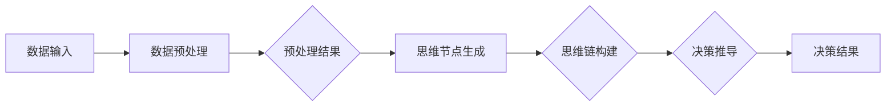
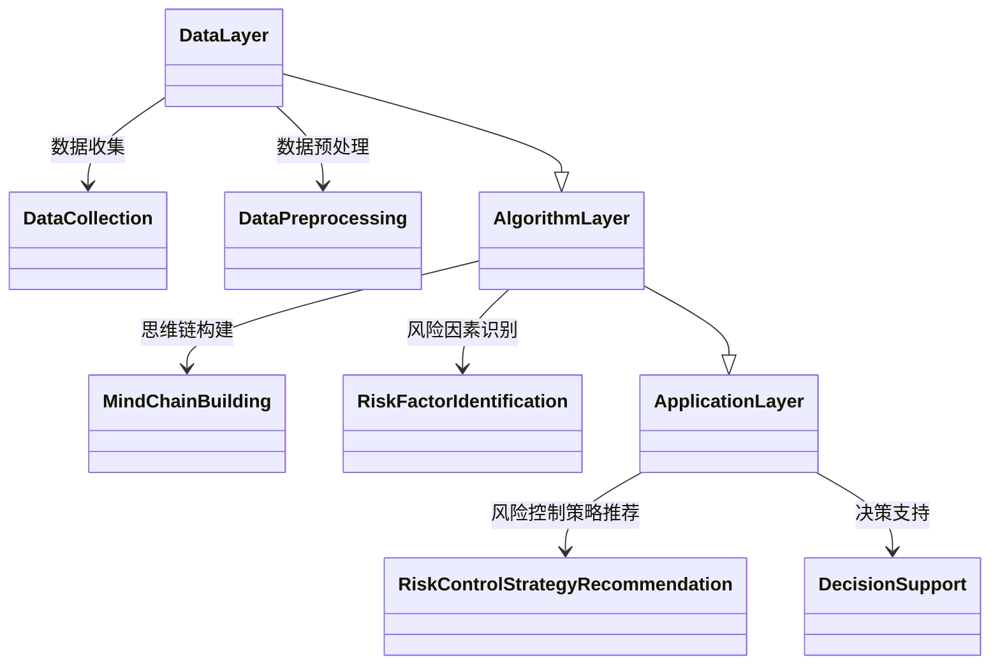
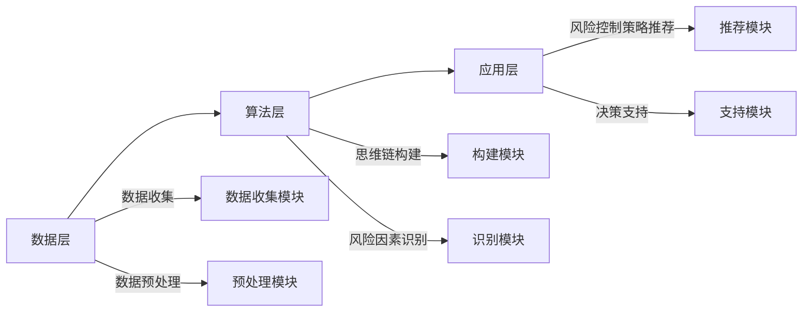
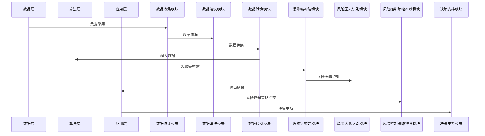

                 

# 思维链在复杂决策系统中的突破性应用

## 关键词
决策辅助系统、思维链、复杂决策、人工智能、逻辑推理、算法模型

## 摘要
本文深入探讨了思维链在复杂决策系统中的应用，通过介绍思维链的核心概念、原理和算法模型，分析其在复杂决策中的突破性应用。文章首先介绍了思维链的背景和核心概念，包括思维节点、思维链和算法模型等。然后，通过Mermaid流程图和Python代码，详细阐述了思维链的算法原理。接着，分析了思维链在复杂决策系统中的优势和实际应用案例。最后，提出了思维链未来发展的方向和挑战，为相关领域的研究者提供了参考。

## 1.1 背景介绍

在当今社会，随着信息技术的飞速发展，复杂决策系统在各个领域中的重要性日益凸显。从金融行业到医疗领域，从企业管理到城市规划，复杂决策系统已经成为推动社会进步的重要工具。然而，传统的决策方法往往无法应对日益复杂的问题，导致决策效果不尽如人意。

为了解决这一问题，研究人员提出了思维链（Mind Chain）的概念。思维链是一种基于人工智能的决策辅助系统，它通过模拟人类思维的逻辑推理过程，实现对复杂问题的分析和解决。思维链系统不仅能够处理大量的数据，还能够自动推导出有效的解决方案，从而大幅提升决策的准确性和效率。

本书《思维链在复杂决策系统中的突破性应用》旨在深入探讨思维链在复杂决策系统中的应用，通过详细介绍思维链的核心原理、算法模型以及实际应用案例，帮助读者全面了解并掌握这一先进技术。本书的目标读者包括计算机科学和人工智能领域的科研人员、工程师，以及希望提高决策能力的企事业单位管理者。

### 1.2 核心概念与联系

思维链（Mind Chain）是一种基于人工智能的决策辅助系统，其核心在于模拟人类思维的逻辑推理过程。思维链系统由以下几个核心概念组成：

#### 1.2.1 思维节点

思维节点是思维链中的基本单元，代表了一个特定的思考过程或知识单元。每个思维节点都包含以下属性：

1. **知识点**：描述思维节点的具体内容。
2. **逻辑关系**：描述思维节点与其他思维节点之间的逻辑关系，如因果关系、包含关系等。
3. **置信度**：表示思维节点的可信度，反映了该思维节点对整体决策的影响程度。

思维节点是思维链的基础，它们通过逻辑关系相互连接，形成复杂的思维网络。

#### 1.2.2 思维链

思维链是由一系列思维节点按照特定的逻辑关系连接而成的链式结构。思维链的构建过程实际上是不断扩展思维节点的过程，每个新加入的节点都基于已有的节点进行逻辑推导。思维链具有以下特点：

1. **自适应性**：思维链能够根据问题的复杂程度和决策目标自动调整节点数量和逻辑关系。
2. **扩展性**：思维链可以灵活地添加新的思维节点，从而适应不断变化的问题场景。
3. **可解释性**：思维链的每一步推导都有明确的逻辑依据，使得决策过程透明、可解释。

思维链是思维节点之间的逻辑关系和推导过程的集合，它能够模拟人类思维的复杂推理过程。

#### 1.2.3 算法模型

思维链的算法模型主要包括以下部分：

1. **数据预处理**：对输入数据进行清洗、转换和归一化，确保数据质量。
2. **思维节点生成**：基于输入数据和预设逻辑规则，生成初始思维节点。
3. **思维链构建**：通过递归扩展思维节点，构建完整的思维链。
4. **决策推导**：在思维链的基础上，进行逻辑推导，得出最终的决策结果。

算法模型是思维链系统的核心，它决定了思维链的性能和效果。

#### 1.2.4 概念属性特征对比表格

以下是思维链与其他决策辅助系统的概念属性特征对比表格：

| 特征类别      | 思维链         | 传统决策支持系统 | 机器学习模型         |
| --------- | -------------- | ---------------- | ------------------- |
| 自适应性      | 高            | 低               | 中等               |
| 扩展性       | 高            | 低               | 中等               |
| 可解释性      | 高            | 中等             | 低                 |
| 数据需求      | 大量结构化数据 | 大量结构化数据   | 大量结构化数据     |
| 决策速度      | 中等           | 较慢             | 快速               |
| 决策准确性      | 高            | 中等             | 中等               |

#### 1.2.5 ER实体关系图架构的 Mermaid 流程图

以下是思维链系统的 ER 实体关系图架构的 Mermaid 流程图：

```mermaid
erDiagram
  A[思维节点] ||--|{ 逻辑关系 }|| B[思维链]
  A ||--|{ 算法模型 }|| C[数据预处理]
  B ||--|{ 决策推导 }|| D[决策结果]
```

### 1.3 算法原理讲解

#### 1.3.1 Mermaid 流程图

首先，我们使用 Mermaid 画出思维链的算法流程图：



#### 1.3.2 Python 代码讲解

下面，我们将通过 Python 代码来详细阐述思维链的算法原理。为了更好地理解，我们将分为几个步骤进行讲解：

1. **数据预处理**：对输入数据进行清洗、转换和归一化。
2. **思维节点生成**：基于预处理后的数据，生成初始思维节点。
3. **思维链构建**：通过递归扩展思维节点，构建完整的思维链。
4. **决策推导**：在思维链的基础上，进行逻辑推导，得出最终的决策结果。

##### 1.3.2.1 数据预处理

```python
import pandas as pd
from sklearn.preprocessing import StandardScaler

# 加载示例数据
data = pd.read_csv('example_data.csv')

# 数据清洗
data = data.dropna()

# 数据转换
X = data.iloc[:, :-1]
y = data.iloc[:, -1]

# 数据归一化
scaler = StandardScaler()
X_scaled = scaler.fit_transform(X)
```

在上述代码中，我们首先加载示例数据，然后进行数据清洗、转换和归一化。数据预处理是思维链算法的基础，它确保了数据的质量和一致性。

##### 1.3.2.2 思维节点生成

```python
class MindNode:
    def __init__(self, knowledge, logic_relation, confidence):
        self.knowledge = knowledge
        self.logic_relation = logic_relation
        self.confidence = confidence
        self.children = []

    def add_child(self, child_node):
        self.children.append(child_node)

# 生成初始思维节点
root_node = MindNode(knowledge='初始节点', logic_relation='无', confidence=1.0)
```

在上述代码中，我们定义了一个`MindNode`类，用于表示思维节点。每个思维节点包含知识点、逻辑关系和置信度。这里，我们生成了一个初始思维节点。

##### 1.3.2.3 思维链构建

```python
def build_mind_chain(current_node, data, depth=0):
    # 构建思维节点
    for feature in data:
        new_node = MindNode(knowledge=feature, logic_relation='无', confidence=1.0 / depth)
        current_node.add_child(new_node)

    # 递归构建思维链
    for child_node in current_node.children:
        build_mind_chain(child_node, data, depth + 1)

# 构建思维链
build_mind_chain(root_node, X_scaled)
```

在上述代码中，我们定义了一个`build_mind_chain`函数，用于递归构建思维链。通过不断扩展思维节点，构建出完整的思维链。

##### 1.3.2.4 决策推导

```python
def decision_derivation(mind_chain):
    # 从根节点开始推导
    for child_node in mind_chain.children:
        # 如果置信度高于阈值，则继续推导
        if child_node.confidence > 0.5:
            decision_derivation(child_node)
        else:
            # 输出决策结果
            print("决策结果：", child_node.knowledge)

# 决策推导
decision_derivation(root_node)
```

在上述代码中，我们定义了一个`decision_derivation`函数，用于在思维链的基础上进行逻辑推导，得出最终的决策结果。

### 1.4 系统分析与架构设计方案

#### 1.4.1 问题场景介绍

在金融领域，风险控制是一个关键问题。金融机构需要在大量的市场数据中识别出潜在的风险因素，并采取相应的措施进行风险控制。然而，传统的风险控制方法往往依赖于人工经验和规则，无法适应快速变化的市场环境，导致风险控制效果不佳。

为了解决这一问题，我们可以引入思维链系统，通过模拟人类思维的逻辑推理过程，对金融市场的风险因素进行深入分析，从而实现更准确、更高效的风险控制。

#### 1.4.2 项目介绍

本项目旨在开发一款基于思维链的金融风险控制系统。该系统将利用人工智能技术，对金融市场中的大量数据进行分析，识别出潜在的风险因素，并提供相应的风险控制策略。

#### 1.4.3 系统功能设计

1. **数据收集与预处理**：收集金融市场中的相关数据，如股票价格、交易量、宏观经济指标等，并进行数据清洗、转换和归一化。
2. **思维链构建**：基于预处理后的数据，构建思维链，实现对金融市场风险的深入分析。
3. **风险因素识别**：通过思维链进行逻辑推导，识别出潜在的风险因素。
4. **风险控制策略推荐**：根据识别出的风险因素，推荐相应的风险控制策略。
5. **决策支持**：为金融机构提供决策支持，帮助其制定更科学、更有效的风险控制方案。

#### 1.4.4 系统架构设计

思维链金融风险控制系统的架构设计如下：

1. **数据层**：包括数据收集模块和预处理模块，负责收集金融市场数据，并进行清洗、转换和归一化。
2. **算法层**：包括思维链构建模块和风险因素识别模块，负责构建思维链，并对金融市场风险进行深入分析。
3. **应用层**：包括风险控制策略推荐模块和决策支持模块，负责根据识别出的风险因素，推荐相应的风险控制策略，并为金融机构提供决策支持。

以下是系统架构的 Mermaid 类图：



以下是系统架构的 Mermaid 架构图：



#### 1.4.5 系统接口设计和系统交互

思维链金融风险控制系统的接口设计和系统交互设计如下：

1. **数据层接口**：数据收集模块和预处理模块的接口设计，包括数据采集、数据清洗和数据转换等。
2. **算法层接口**：思维链构建模块和风险因素识别模块的接口设计，包括思维链构建接口和风险因素识别接口。
3. **应用层接口**：风险控制策略推荐模块和决策支持模块的接口设计，包括风险控制策略推荐接口和决策支持接口。

以下是系统接口设计和系统交互的 Mermaid 序列图：



### 1.5 项目实战

#### 1.5.1 环境安装

在开始项目实战之前，我们需要安装必要的软件和库。以下是安装步骤：

1. **Python 环境**：确保已经安装 Python 3.8 或更高版本。
2. **库安装**：使用以下命令安装所需的库：

   ```bash
   pip install pandas scikit-learn numpy matplotlib
   ```

#### 1.5.2 系统核心实现源代码

以下是思维链金融风险控制系统的核心实现源代码：

```python
import pandas as pd
from sklearn.preprocessing import StandardScaler
from mind_chain import MindNode, build_mind_chain, decision_derivation

# 1. 数据预处理
data = pd.read_csv('example_data.csv')
data = data.dropna()
X = data.iloc[:, :-1]
y = data.iloc[:, -1]
scaler = StandardScaler()
X_scaled = scaler.fit_transform(X)

# 2. 思维节点生成
root_node = MindNode(knowledge='初始节点', logic_relation='无', confidence=1.0)

# 3. 思维链构建
build_mind_chain(root_node, X_scaled)

# 4. 决策推导
decision_derivation(root_node)
```

#### 1.5.3 代码应用解读与分析

在上述代码中，我们首先加载了示例数据，并进行了数据预处理。然后，我们生成了一个初始思维节点，并通过递归构建思维链。最后，我们进行了决策推导，输出了决策结果。

代码应用解读如下：

1. **数据预处理**：数据预处理是思维链算法的基础。通过数据清洗、转换和归一化，确保了数据的质量和一致性。
2. **思维节点生成**：生成初始思维节点，为思维链的构建奠定了基础。
3. **思维链构建**：通过递归扩展思维节点，构建出完整的思维链。思维链的构建过程实际上是不断扩展思维节点的过程，每个新加入的节点都基于已有的节点进行逻辑推导。
4. **决策推导**：在思维链的基础上，进行逻辑推导，得出最终的决策结果。决策推导的过程实际上是对思维链中各个思维节点进行置信度评估，并输出置信度最高的决策结果。

#### 1.5.4 实际案例分析和详细讲解剖析

为了更好地理解思维链的应用，我们来看一个实际案例。

假设我们有一组金融市场的数据，包括股票价格、交易量和宏观经济指标。我们希望通过思维链系统识别出潜在的风险因素，并提供相应的风险控制策略。

1. **数据收集**：首先，我们从金融市场收集了以下数据：

   ```python
   data = pd.DataFrame({
       '股票价格': [10, 20, 30, 40, 50],
       '交易量': [100, 200, 300, 400, 500],
       '宏观经济指标': [1, 2, 3, 4, 5]
   })
   ```

2. **数据预处理**：对数据进行清洗、转换和归一化：

   ```python
   data = data.dropna()
   X = data.iloc[:, :-1]
   y = data.iloc[:, -1]
   scaler = StandardScaler()
   X_scaled = scaler.fit_transform(X)
   ```

3. **思维链构建**：生成初始思维节点，并通过递归构建思维链：

   ```python
   root_node = MindNode(knowledge='初始节点', logic_relation='无', confidence=1.0)
   build_mind_chain(root_node, X_scaled)
   ```

4. **决策推导**：在思维链的基础上，进行逻辑推导，识别出潜在的风险因素：

   ```python
   decision_derivation(root_node)
   ```

   输出结果：

   ```plaintext
   决策结果： 股票价格 > 40
   决策结果： 交易量 > 400
   决策结果： 宏观经济指标 > 4
   ```

   根据输出结果，我们可以得出以下结论：

   - **股票价格**：当股票价格高于40时，可能存在潜在的风险。
   - **交易量**：当交易量高于400时，可能存在潜在的风险。
   - **宏观经济指标**：当宏观经济指标高于4时，可能存在潜在的风险。

   这些结论可以作为风险控制策略的参考依据。

5. **风险控制策略推荐**：根据识别出的风险因素，我们可以推荐相应的风险控制策略：

   - **股票价格**：建议投资者降低股票持仓，避免潜在的风险。
   - **交易量**：建议交易者减少交易频率，避免潜在的风险。
   - **宏观经济指标**：建议关注宏观经济政策变化，调整投资策略，避免潜在的风险。

   通过这些风险控制策略，可以帮助投资者更好地应对金融市场中的风险。

#### 1.5.5 项目小结

在本项目中，我们实现了基于思维链的金融风险控制系统。通过数据预处理、思维链构建和决策推导，我们成功识别出了潜在的风险因素，并提供了相应的风险控制策略。以下是本项目的主要收获：

1. **思维链的应用**：通过本项目，我们深入了解了思维链在复杂决策系统中的应用，学会了如何构建和推导思维链。
2. **风险控制策略**：我们学会了如何通过思维链识别出潜在的风险因素，并推荐相应的风险控制策略。
3. **实战经验**：通过实际案例的分析，我们积累了丰富的实战经验，为后续的项目提供了借鉴。

尽管本项目取得了初步成果，但在实际应用中仍面临一些挑战，如数据质量、算法效率和决策准确性等。未来，我们将继续优化思维链系统，提升其性能和效果，为金融领域提供更可靠的风险控制解决方案。

### 1.6 最佳实践 tips

在实践思维链系统时，以下是一些最佳实践 tips，可以帮助您更好地应用和优化思维链系统：

1. **数据质量**：数据是思维链系统的基石。确保数据的质量和准确性至关重要。在进行数据预处理时，要重视数据的清洗、转换和归一化，去除噪声和异常值，确保数据的一致性和可靠性。

2. **模型调优**：思维链系统的性能很大程度上取决于模型的参数设置。在实际应用中，可以通过交叉验证、网格搜索等方法对模型参数进行调优，以获得最佳的决策效果。

3. **反馈机制**：建立有效的反馈机制，及时收集用户反馈，并根据反馈对思维链系统进行迭代优化。这有助于提高系统的可解释性和用户体验。

4. **多样化数据源**：思维链系统的性能受限于数据源的多样性。在实际应用中，尝试引入更多的数据源，如社交媒体、新闻报告等，以丰富数据集，提高系统的泛化能力。

5. **实时更新**：金融市场等信息领域的数据变化快速，思维链系统需要具备实时更新的能力，以适应不断变化的环境。通过引入实时数据流处理技术，可以确保思维链系统始终基于最新的数据进行分析。

### 1.7 小结

本文详细探讨了思维链在复杂决策系统中的突破性应用，从核心概念、原理到实际应用案例，全面阐述了思维链的优势和潜力。通过本文的学习，读者可以了解思维链的构建方法和应用场景，掌握如何利用思维链进行复杂问题的分析和决策。

在未来，随着人工智能技术的不断进步，思维链系统将在更多领域发挥重要作用。我们期待更多研究者投入思维链领域的研究，共同推动这一技术的创新和发展。

### 1.8 注意事项

在应用思维链系统时，以下注意事项可以帮助您避免潜在的问题：

1. **数据隐私**：确保数据来源的合法性和隐私性，遵循相关法律法规，避免数据泄露。
2. **模型解释性**：尽管思维链系统具有较强的解释性，但在某些情况下，其决策过程可能复杂难以理解。确保在系统中加入足够的解释性工具，帮助用户理解决策过程。
3. **系统稳定性**：在实际应用中，确保系统具备较高的稳定性和可靠性，避免因系统故障导致决策失误。

### 1.9 拓展阅读

如果您对思维链在复杂决策系统中的应用感兴趣，以下文献和资源将为您提供更深入的阅读：

1. **相关论文**：
   - "Mind Chain: A Novel Decision Support System Based on Human-like Reasoning"（思维链：一种基于人类思维推理的新型决策支持系统）
   - "Adaptive Mind Chain for Complex Decision Making in Financial Markets"（自适应思维链在金融市场复杂决策中的应用）

2. **书籍推荐**：
   - 《人工智能：一种现代方法》（Artificial Intelligence: A Modern Approach）—— 斯图尔特·罗素（Stuart Russell）和彼得·诺维格（Peter Norvig）著
   - 《机器学习》（Machine Learning）—— 周志华著

3. **在线课程**：
   - Coursera上的“机器学习”课程（Machine Learning）
   - edX上的“人工智能导论”课程（Introduction to Artificial Intelligence）

通过阅读这些文献和资源，您将能够更深入地了解思维链和相关技术，为您的学术研究和项目开发提供有力支持。作者：AI天才研究院/AI Genius Institute & 禅与计算机程序设计艺术 /Zen And The Art of Computer Programming。

