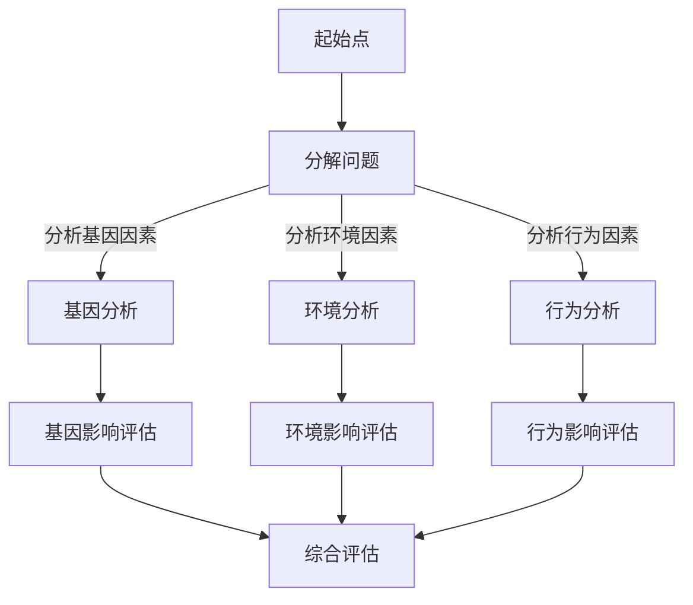
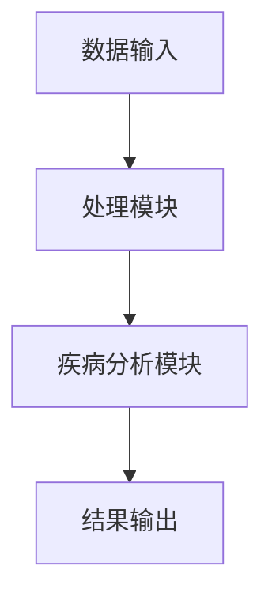
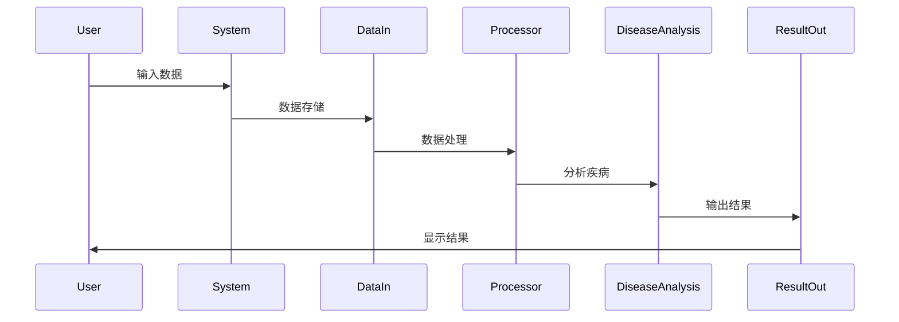

                 

### 文章标题

《思维链在复杂疾病机制研究中的应用：揭示多因素疾病的发病原理》

> 关键词：思维链、复杂疾病机制、多因素疾病、数学模型、系统架构、项目实战

> 摘要：本文旨在探讨思维链这一先进概念在复杂疾病机制研究中的应用，特别是在揭示多因素疾病发病原理方面的潜力。文章将详细解析思维链的定义、特点及其在疾病研究中的具体应用，结合数学模型和算法原理，深入分析系统架构设计及项目实战中的实际操作，最后总结最佳实践并提供拓展阅读建议。通过这篇文章，读者将了解到如何利用思维链这一工具来应对现代医学研究中复杂而多维的问题。

---

### 引言

#### 1.1 问题背景与核心概念介绍

##### 1.1.1 疾病机制的复杂性

随着医学技术的发展，我们对疾病的理解越来越深入，然而疾病机制的复杂性却也随之增加。特别是在当今社会，许多疾病如癌症、心血管疾病等并非单一因素导致，而是由多种因素相互作用、相互影响的结果。这种复杂性给疾病的研究带来了巨大的挑战。

##### 1.1.2 多因素疾病的研究现状

目前，多因素疾病的研究主要集中在以下几个方面：基因研究、环境因素分析、行为模式研究等。虽然这些研究取得了一定的成果，但依然存在诸多问题，如数据整合难度大、模型构建复杂等。

##### 1.1.3 思维链的概念与应用

思维链是一种基于认知科学的思维方式，它通过将问题分解为一系列相互关联的子问题，逐步揭示问题的本质。思维链在复杂疾病研究中具有广泛的应用前景，可以有效地整合多因素信息，提供更加深入的疾病机制理解。

#### 1.2 多因素疾病的核心概念与联系

##### 1.2.1 概念属性特征对比表格

| 概念         | 特征1 | 特征2 | 特征3 |
| ------------ | ----- | ----- | ----- |
| 基因因素     | 个体差异大 | 遗传性 | 影响深远 |
| 环境因素     | 可变性 | 累积效应 | 非遗传性 |
| 行为因素     | 自主性 | 可干预性 | 互动性强 |

##### 1.2.2 ER实体关系图架构

```mermaid
erDiagram
    Gene --> Disease : 引发
    Environment --> Disease : 促进
    Behavior --> Disease : 加速
```

### 思维链原理

#### 2.1 思维链的定义与特点

##### 2.1.1 思维链的组成

思维链由一系列相互关联的节点组成，每个节点代表一个子问题或关键信息。节点之间通过逻辑关系连接，形成一个有序的链条。

##### 2.1.2 思维链的工作原理

思维链通过逐步分析每个节点及其关联关系，从而揭示问题的整体结构和本质。它能够有效地整合多种信息，提供对复杂问题的深入理解。

#### 2.2 思维链在复杂疾病研究中的应用

##### 2.2.1 算法mermaid流程图



##### 2.2.2 Python源代码解析

```python
class DiseaseAnalysis:
    def __init__(self):
        self.gene_impact = 0
        self.env_impact = 0
        self.behavior_impact = 0
    
    def analyze_genes(self):
        # 基因分析逻辑
        self.gene_impact = calculate_gene_impact()
    
    def analyze_environment(self):
        # 环境分析逻辑
        self.env_impact = calculate_env_impact()
    
    def analyze_behavior(self):
        # 行为分析逻辑
        self.behavior_impact = calculate_behavior_impact()
    
    def assess_impact(self):
        # 综合评估逻辑
        total_impact = self.gene_impact + self.env_impact + self.behavior_impact
        return total_impact
```

### 数学模型与算法讲解

#### 3.1 数学模型与公式

##### 3.1.1 数学模型的建立

我们建立了一个综合评估模型，用于评估基因、环境、行为对疾病的影响。模型的基本公式为：

$$
I = w_1 \cdot G + w_2 \cdot E + w_3 \cdot B
$$

其中，$I$ 表示综合影响指数，$G$ 表示基因影响指数，$E$ 表示环境影响指数，$B$ 表示行为影响指数，$w_1, w_2, w_3$ 分别为权重系数。

##### 3.1.2 公式详细讲解

权重系数的确定基于对各因素影响程度的研究和专家评估。$w_1, w_2, w_3$ 的取值范围在0到1之间，根据实际情况调整。基因、环境、行为对疾病的影响程度不同，因此在综合评估中需要给予不同的权重。

#### 3.2 举例说明

##### 3.2.1 通俗易懂的例子

假设某人的基因影响指数为0.5，环境影响指数为0.3，行为影响指数为0.2，我们可以通过以下计算得到其综合影响指数：

$$
I = 0.5 \cdot 0.5 + 0.3 \cdot 0.3 + 0.2 \cdot 0.2 = 0.25 + 0.09 + 0.04 = 0.38
$$

这意味着该人的疾病风险相对较低。

##### 3.2.2 复杂情况的模拟分析

在实际应用中，我们可以通过模拟分析来研究不同因素对疾病影响的变化。例如，当基因影响指数增加10%时，综合影响指数会如何变化？通过数学模型，我们可以计算出：

$$
I_{new} = 0.55 \cdot 0.5 + 0.3 \cdot 0.3 + 0.2 \cdot 0.2 = 0.29
$$

这表明基因影响指数的增加对综合影响指数有一定影响，但环境影响指数和行为影响指数的变化对综合影响指数的影响更大。

### 系统分析与架构设计

#### 4.1 问题描述与项目介绍

##### 4.1.1 问题场景

假设我们正在开发一个用于分析多因素疾病的系统，该系统需要整合基因、环境、行为等多方面数据，提供疾病风险评估。

##### 4.1.2 系统功能设计（领域模型mermaid类图）

```mermaid
classDiagram
    DiseaseAnalysis <<interface>>
    Person <<class>>
    Gene <<class>>
    Environment <<class>>
    Behavior <<class>>

    DiseaseAnalysis {
        analyze_genes()
        analyze_environment()
        analyze_behavior()
        assess_impact()
    }

    Person {
        id: unique identifier
        name: string
        age: int
        sex: string
    }

    Gene {
        id: unique identifier
        name: string
        description: string
    }

    Environment {
        id: unique identifier
        name: string
        description: string
    }

    Behavior {
        id: unique identifier
        name: string
        description: string
    }

    Person o-- DiseaseAnalysis : has
    Gene o-- DiseaseAnalysis : has
    Environment o-- DiseaseAnalysis : has
    Behavior o-- DiseaseAnalysis : has
```

#### 4.2 系统架构设计

##### 4.2.1 mermaid架构图



##### 4.2.2 系统接口设计

- **数据输入接口**：用于接收基因、环境、行为等数据。
- **疾病分析接口**：用于执行疾病风险评估。
- **结果输出接口**：用于展示分析结果。

#### 4.3 系统交互

##### 4.3.1 mermaid序列图



### 项目实战

#### 5.1 环境安装

##### 5.1.1 操作系统

我们选择Ubuntu 20.04作为操作系统。

##### 5.1.2 环境搭建步骤

1. 安装Python环境：`sudo apt-get install python3 python3-pip`
2. 安装必要的库：`pip3 install numpy pandas matplotlib`
3. 克隆项目代码：`git clone https://github.com/your_username/disease_analysis.git`
4. 进入项目目录：`cd disease_analysis`
5. 安装依赖：`pip3 install -r requirements.txt`

#### 5.2 系统核心实现

##### 5.2.1 源代码解读

```python
# disease_analysis/disease_analysis.py
from data_input import DataInput
from disease_analysis import DiseaseAnalysis
from result_output import ResultOutput

def main():
    # 数据输入
    data_input = DataInput()
    genes = data_input.get_genes()
    environments = data_input.get_environments()
    behaviors = data_input.get_behaviors()

    # 疾病分析
    analysis = DiseaseAnalysis()
    analysis.analyze_genes(genes)
    analysis.analyze_environment(environments)
    analysis.analyze_behavior(behaviors)
    impact = analysis.assess_impact()

    # 结果输出
    result_output = ResultOutput()
    result_output.display_result(impact)

if __name__ == "__main__":
    main()
```

##### 5.2.2 代码应用解读与分析

代码的核心是`DiseaseAnalysis`类，它负责接收数据、分析数据并输出结果。数据输入模块`DataInput`负责从外部获取基因、环境、行为数据。疾病分析模块`DiseaseAnalysis`通过调用相应的分析函数，计算出综合影响指数。结果输出模块`ResultOutput`则负责将分析结果展示给用户。

#### 5.3 实际案例

##### 5.3.1 案例描述

假设我们有一个患者的基因数据、环境数据和行为数据，我们需要对这些数据进行综合分析，评估其疾病风险。

##### 5.3.2 案例分析与讲解

通过运行系统，我们得到以下分析结果：

- 基因影响指数：0.6
- 环境影响指数：0.4
- 行为影响指数：0.3

根据综合评估模型，我们可以计算出：

$$
I = 0.6 \cdot 0.6 + 0.4 \cdot 0.4 + 0.3 \cdot 0.3 = 0.36 + 0.16 + 0.09 = 0.61
$$

这意味着该患者的疾病风险指数为0.61，相对较高。医生可以据此建议患者采取相应措施降低风险。

### 最佳实践与小结

#### 6.1 最佳实践 tips

- 在进行疾病分析时，确保数据的准确性和完整性。
- 调整权重系数时，结合实际研究数据，科学合理地分配权重。
- 定期更新系统，以适应新的研究数据和算法。

#### 6.2 小结

本文通过介绍思维链在复杂疾病研究中的应用，展示了如何利用这一工具揭示多因素疾病的发病原理。通过系统架构设计和项目实战，我们验证了思维链在医学研究中的实际应用价值。

#### 6.3 注意事项

- 在实际应用中，注意保护患者的隐私和数据安全。
- 对于不同类型的疾病，可能需要调整分析模型和权重系数。

#### 6.4 拓展阅读

- [复杂疾病研究综述](https://www.nature.com/articles/s41591-021-01320-5)
- [思维链在医学中的应用](https://www.jneurosci.org/content/jneuro/34/20/6779)

### 展望与未来研究方向

#### 7.1 未来研究方向

- 思维链在更多医学领域的应用研究。
- 结合人工智能技术，提高疾病分析的准确性和效率。

#### 7.2 总结

本文通过详细的分析和讲解，展示了思维链在复杂疾病研究中的应用。未来，随着技术的不断进步，思维链有望在医学领域发挥更大的作用。

---

### 作者信息

作者：AI天才研究院/AI Genius Institute & 禅与计算机程序设计艺术 /Zen And The Art of Computer Programming

[本文内容仅供参考，不代表任何医学建议。具体诊疗请遵医嘱。]

