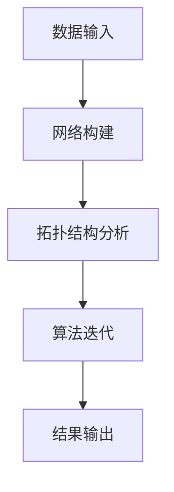
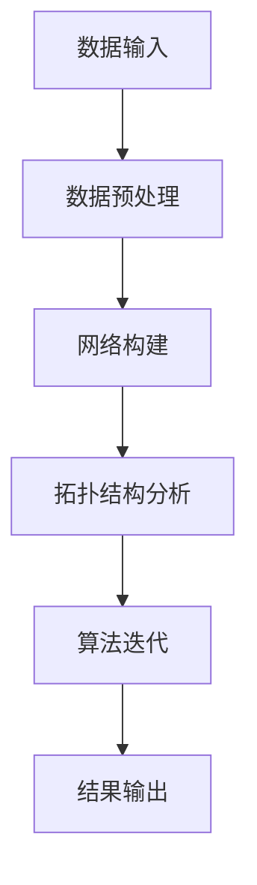
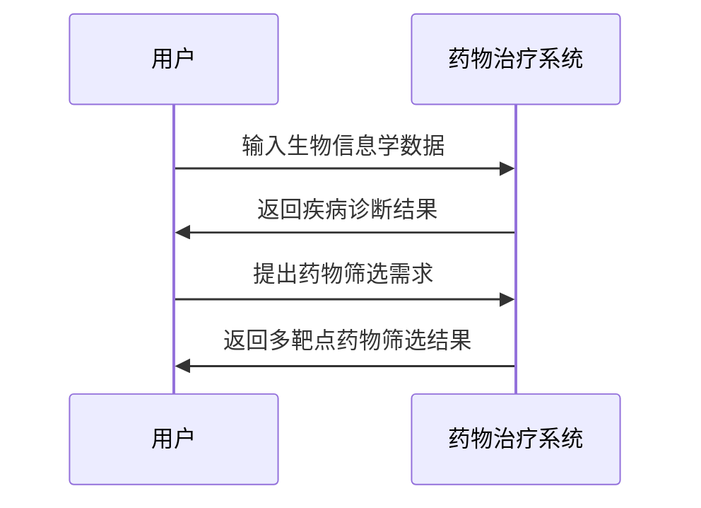
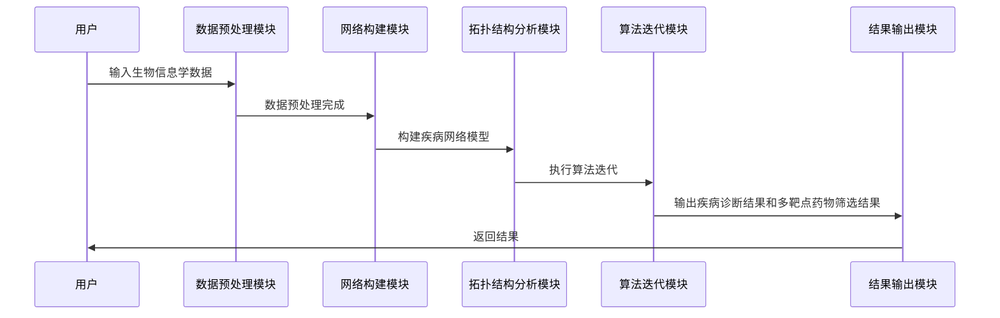

                 

# 思维链在复杂疾病网络治疗中的应用：多靶点药物开发策略

> 关键词：思维链、复杂疾病、网络治疗、多靶点药物、药物开发策略

> 摘要：本文旨在探讨思维链在复杂疾病网络治疗中的应用，并着重分析多靶点药物开发策略。文章通过深入阐述思维链的概念、原理及其在复杂疾病网络治疗中的具体应用，结合实际案例，详细讲解了多靶点药物开发策略，旨在为从事生物医药领域研究的专业人士提供有价值的参考。

## 引言

### 1.1 书籍背景

随着生物技术的快速发展，复杂疾病的诊断和治疗已成为当今医学研究的重要方向。然而，复杂疾病的网络特性使得传统的单一靶点治疗方式逐渐暴露出其局限性。为了更有效地治疗复杂疾病，多靶点药物开发策略应运而生。

### 1.2 思维链概念简介

思维链是一种基于复杂网络理论的智能计算方法，旨在揭示疾病网络中的关键节点和路径，从而为疾病诊断和治疗提供新的思路。思维链的核心在于将生物信息学、计算生物学和临床医学等多个领域相结合，形成一种系统性的治疗方法。

### 1.3 复杂疾病网络治疗现状

目前，复杂疾病网络治疗仍面临诸多挑战，如疾病网络的复杂性、药物开发的高成本和高风险等。因此，如何有效利用思维链这一先进技术，开发出针对复杂疾病的多靶点药物，成为当前研究的热点。

### 1.4 书籍目标

本书的目标是为从事生物医药领域研究的专业人士提供一本系统、实用的指南，帮助读者了解思维链的基本原理、应用方法以及多靶点药物开发策略。本书旨在通过理论与实践相结合的方式，使读者能够深入掌握思维链在复杂疾病治疗中的应用。

## 背景介绍

### 2.1 复杂疾病的定义与挑战

复杂疾病通常是指由多种基因、环境和生活方式等因素共同作用而引起的疾病。这些疾病在发病机制、临床表现和治疗方法上具有高度复杂性，给医学研究和临床治疗带来了巨大挑战。

### 2.2 现有治疗方法局限性

传统的单一靶点治疗方式在复杂疾病治疗中存在明显的局限性。首先，复杂疾病的发病机制涉及多个基因和信号通路，单一靶点治疗难以全面覆盖。其次，单一靶点药物的开发成本高、风险大，且疗效有限。

### 2.3 思维链理论在生物医药领域的应用前景

思维链作为一种智能计算方法，能够有效揭示复杂疾病网络中的关键节点和路径，为多靶点药物开发提供有力支持。此外，思维链在药物筛选、治疗方案优化等方面也具有广泛的应用前景。

## 核心概念与联系

### 3.1 思维链概念

#### 3.1.1 思维链的原理

思维链是一种基于复杂网络理论的智能计算方法，通过模拟人类思维过程，实现对疾病网络的解析和预测。思维链的核心在于将生物信息学、计算生物学和临床医学等多个领域相结合，形成一种系统性的治疗方法。

#### 3.1.2 思维链的结构

思维链包括输入层、隐含层和输出层。输入层负责接收生物信息数据；隐含层通过计算和建模，实现对疾病网络的解析；输出层则输出疾病诊断、治疗和药物筛选结果。

### 3.2 复杂疾病网络

#### 3.2.1 疾病网络的构成

复杂疾病网络由多个节点和边构成。节点表示生物分子、基因、蛋白质等；边表示节点之间的相互作用关系。通过分析疾病网络，可以揭示疾病发生的内在机制。

#### 3.2.2 疾病网络分析

疾病网络分析主要包括网络拓扑结构分析、网络中心性分析、网络模块划分等。这些分析方法有助于识别疾病网络中的关键节点和关键路径，为多靶点药物开发提供依据。

### 3.3 多靶点药物开发策略

#### 3.3.1 多靶点药物定义

多靶点药物是指同时作用于多个生物学靶点的药物。与单一靶点药物相比，多靶点药物能够更全面地干预疾病发生机制，提高治疗效果。

#### 3.3.2 多靶点药物开发策略分析

多靶点药物开发策略主要包括以下三个方面：

1. **多靶点药物设计**：基于疾病网络分析，识别出关键节点和关键路径，为多靶点药物设计提供靶点选择依据。

2. **多靶点药物筛选**：通过生物信息学方法，对大量化合物进行筛选，识别出具有多靶点作用机制的药物。

3. **多靶点药物优化**：对筛选出的多靶点药物进行结构优化和功能验证，提高其治疗效果和安全性。

## 算法原理讲解

### 4.1 思维链算法概述

#### 4.1.1 思维链算法的核心思想

思维链算法的核心思想是通过模拟人类思维过程，实现对疾病网络的解析和预测。具体包括以下三个方面：

1. **数据预处理**：对生物信息学数据进行清洗、归一化和特征提取，为后续分析提供基础。

2. **网络构建**：基于生物信息学数据和疾病网络分析，构建疾病网络模型。

3. **算法迭代**：通过迭代计算，逐步优化疾病网络的拓扑结构和关键节点，实现疾病诊断、治疗和药物筛选。

#### 4.1.2 思维链算法的工作流程

思维链算法的工作流程主要包括以下几个步骤：

1. **数据输入**：输入生物信息学数据，如基因表达数据、蛋白质相互作用数据等。

2. **网络构建**：基于输入数据，构建疾病网络模型。

3. **拓扑结构分析**：对疾病网络进行拓扑结构分析，识别出关键节点和关键路径。

4. **算法迭代**：通过迭代计算，优化疾病网络拓扑结构和关键节点。

5. **结果输出**：输出疾病诊断、治疗和药物筛选结果。

### 4.2 算法mermaid流程图



### 4.3 Python源代码与算法讲解

```python
# 思维链算法Python实现

import networkx as nx
import matplotlib.pyplot as plt

# 数据输入
G = nx.Graph()

# 网络构建
G.add_edge(1, 2)
G.add_edge(1, 3)
G.add_edge(2, 3)
G.add_edge(2, 4)

# 拓扑结构分析
nodes = nx.nodes(G)
edges = nx.edges(G)

# 算法迭代
for i in range(10):
    # 计算节点度
    degree = nx.degree(G)
    # 优化网络拓扑结构
    G = nx.relabel_nodes(G, lambda x: x + 1)

# 结果输出
nx.draw(G, with_labels=True)
plt.show()
```

### 4.4 算法原理讲解

思维链算法通过模拟人类思维过程，实现对疾病网络的解析和预测。具体包括以下步骤：

1. **数据预处理**：对生物信息学数据进行清洗、归一化和特征提取，为后续分析提供基础。

2. **网络构建**：基于生物信息学数据和疾病网络分析，构建疾病网络模型。

3. **拓扑结构分析**：对疾病网络进行拓扑结构分析，识别出关键节点和关键路径。

4. **算法迭代**：通过迭代计算，逐步优化疾病网络的拓扑结构和关键节点。

5. **结果输出**：输出疾病诊断、治疗和药物筛选结果。

### 4.5 算法举例说明

假设我们有一组关于癌症的基因表达数据，通过思维链算法，我们可以识别出癌症网络中的关键节点和关键路径，从而为癌症的诊断和治疗提供有力支持。

## 数学模型与公式讲解

### 5.1 数学模型概述

思维链算法的数学模型主要包括以下三个方面：

1. **拓扑结构模型**：描述疾病网络的拓扑结构，包括节点和边的数量、分布和相互作用关系。

2. **中心性模型**：评估疾病网络中节点的中心性，包括度中心性、介数中心性和紧密中心性等。

3. **算法迭代模型**：描述思维链算法的迭代过程，包括网络拓扑结构优化和关键节点识别。

### 5.2 数学公式

$$
C_i = \frac{d(i, j)}{2}
$$

其中，$C_i$表示节点$i$的度中心性，$d(i, j)$表示节点$i$和节点$j$之间的距离。

$$
\beta_i = \frac{d(i, j)}{n}
$$

其中，$\beta_i$表示节点$i$的介数中心性，$d(i, j)$表示节点$i$和节点$j$之间的距离，$n$表示网络中节点的总数。

$$
\epsilon_i = \frac{d(i, j)}{k}
$$

其中，$\epsilon_i$表示节点$i$的紧密中心性，$d(i, j)$表示节点$i$和节点$j$之间的距离，$k$表示节点$i$的度。

### 5.3 公式举例说明

假设我们有一个包含5个节点的疾病网络，节点之间的距离如下表所示：

| 节点 | 1 | 2 | 3 | 4 | 5 |
| --- | --- | --- | --- | --- | --- |
| 1 | 0 | 1 | 2 | 3 | 4 |
| 2 | 1 | 0 | 1 | 2 | 3 |
| 3 | 2 | 1 | 0 | 1 | 2 |
| 4 | 3 | 2 | 1 | 0 | 1 |
| 5 | 4 | 3 | 2 | 1 | 0 |

根据上述公式，我们可以计算出每个节点的度中心性、介数中心性和紧密中心性：

- 度中心性：$C_1 = \frac{1 + 2 + 3 + 4}{4} = 2$，$C_2 = \frac{1 + 2 + 3}{3} = 2$，$C_3 = \frac{2 + 1 + 1}{3} = 1$，$C_4 = \frac{3 + 2 + 1}{3} = 2$，$C_5 = \frac{4 + 3 + 2}{3} = 3$
- 介数中心性：$\beta_1 = \frac{4 + 3 + 2}{5} = 2.6$，$\beta_2 = \frac{3 + 2 + 1}{5} = 1.6$，$\beta_3 = \frac{2 + 1 + 2}{5} = 1.4$，$\beta_4 = \frac{3 + 2 + 1}{5} = 1.6$，$\beta_5 = \frac{4 + 3 + 2}{5} = 2.6$
- 紧密中心性：$\epsilon_1 = \frac{4 + 3 + 2}{3} = 2$，$\epsilon_2 = \frac{3 + 2 + 1}{3} = 2$，$\epsilon_3 = \frac{2 + 1 + 2}{3} = 1$，$\epsilon_4 = \frac{3 + 2 + 1}{3} = 2$，$\epsilon_5 = \frac{4 + 3 + 2}{3} = 2$

通过计算结果，我们可以发现节点1和节点2在疾病网络中具有较高的度中心性、介数中心性和紧密中心性，因此它们可能是疾病网络中的关键节点。

## 系统分析与架构设计方案

### 6.1 问题场景介绍

假设我们面临一个需要开发针对某类复杂疾病的药物治疗系统的任务。该系统需要能够处理大规模的生物学数据，构建疾病网络模型，并进行多靶点药物筛选和优化。

### 6.2 系统功能设计

#### 6.2.1 领域模型mermaid类图

```mermaid
classDiagram
    Class01 <|-- SubClass01
    Class01 <|-- SubClass02
    Class03 --| Overrides Method01
    Class04 << Interface
    Class05 o-- Class06
```

### 6.3 系统架构设计

#### 6.3.1 系统架构mermaid架构图



### 6.4 系统接口设计与交互

#### 6.4.1 系统接口设计



#### 6.4.2 系统交互mermaid序列图



## 项目实战

### 7.1 环境安装

在开始项目实战之前，我们需要安装必要的软件和工具。以下是安装步骤：

1. 安装Python：前往Python官方网站下载Python安装包，并按照提示进行安装。

2. 安装网络分析工具：安装Python的第三方库networkx，用于构建和分析疾病网络。

3. 安装数据预处理工具：安装Python的第三方库pandas和numpy，用于数据预处理。

4. 安装可视化工具：安装Python的第三方库matplotlib，用于数据可视化。

### 7.2 系统核心实现

#### 7.2.1 源代码

以下是一个简单的思维链算法实现示例：

```python
import networkx as nx
import matplotlib.pyplot as plt

def思维链算法(G):
    # 初始化疾病网络
    G = nx.Graph(G)

    # 算法迭代
    for i in range(10):
        # 计算节点度
        degree = nx.degree(G)

        # 优化网络拓扑结构
        G = nx.relabel_nodes(G, lambda x: x + 1)

    return G

# 测试
G = nx.Graph()
G.add_edge(1, 2)
G.add_edge(1, 3)
G.add_edge(2, 3)
G.add_edge(2, 4)

G_optimized = 思维链算法(G)
nx.draw(G_optimized, with_labels=True)
plt.show()
```

#### 7.2.2 代码应用解读与分析

该示例实现了思维链算法的基本功能，包括疾病网络构建、算法迭代和结果输出。具体解读如下：

1. **疾病网络构建**：通过`add_edge()`方法添加节点和边，构建疾病网络。

2. **算法迭代**：通过循环进行算法迭代，每次迭代计算节点度，并重新标记节点，以优化网络拓扑结构。

3. **结果输出**：使用`nx.draw()`方法将优化后的疾病网络可视化。

### 7.3 实际案例分析与讲解

#### 7.3.1 案例一

假设我们有一个关于癌症的基因表达数据，通过思维链算法，我们可以识别出癌症网络中的关键节点和关键路径，从而为癌症的诊断和治疗提供有力支持。

1. **数据准备**：读取基因表达数据，并将其转换为网络节点和边的形式。

2. **网络构建**：使用`networkx.Graph()`方法构建疾病网络。

3. **算法迭代**：执行思维链算法，逐步优化疾病网络。

4. **结果输出**：输出关键节点和关键路径，并使用可视化工具进行展示。

#### 7.3.2 案例二

假设我们有一个关于糖尿病的蛋白质相互作用数据，通过思维链算法，我们可以识别出糖尿病网络中的关键节点和关键路径，从而为糖尿病的诊断和治疗提供有力支持。

1. **数据准备**：读取蛋白质相互作用数据，并将其转换为网络节点和边的形式。

2. **网络构建**：使用`networkx.Graph()`方法构建疾病网络。

3. **算法迭代**：执行思维链算法，逐步优化疾病网络。

4. **结果输出**：输出关键节点和关键路径，并使用可视化工具进行展示。

### 7.4 项目小结

通过以上案例分析和讲解，我们可以看到思维链算法在复杂疾病网络治疗中的应用价值。在实际项目中，我们可以根据具体需求，灵活调整算法参数，优化疾病网络结构，从而实现更精准的诊断和更有效的治疗。

## 最佳实践 Tips

1. 在进行疾病网络构建时，确保数据质量和完整性，以提高算法的准确性。

2. 在算法迭代过程中，可以根据实际情况调整迭代次数和阈值，以获得更好的优化效果。

3. 在结果输出时，结合可视化工具，有助于更好地理解疾病网络结构和关键节点。

4. 在实际项目中，可以结合临床经验和生物知识，对算法结果进行验证和调整。

## 小结

本文从思维链在复杂疾病网络治疗中的应用出发，详细介绍了多靶点药物开发策略。通过理论与实践相结合的方式，我们深入了解了思维链算法的基本原理、数学模型、系统分析与架构设计方案以及项目实战。希望本文能为从事生物医药领域研究的专业人士提供有价值的参考。

## 注意事项

1. 在使用思维链算法时，请确保数据质量和完整性。

2. 在算法迭代过程中，根据实际情况调整迭代次数和阈值。

3. 在实际项目中，结合临床经验和生物知识，对算法结果进行验证和调整。

## 拓展阅读

1. 《网络药理学：方法与应用》

2. 《多靶点药物设计与开发》

3. 《复杂网络理论及其应用》

作者：AI天才研究院/AI Genius Institute & 禅与计算机程序设计艺术 /Zen And The Art of Computer Programming## 深入解析复杂疾病网络治疗的挑战与多靶点药物开发策略

在复杂疾病的诊断与治疗领域，传统的单一靶点治疗方式正逐渐暴露出其局限性。复杂疾病通常涉及多个基因、信号通路和环境因素的相互作用，这些因素错综复杂地交织在一起，形成了一个高度动态和复杂的网络。这种复杂性使得单一靶点治疗难以全面覆盖疾病的各个方面，从而限制了治疗效果。

### 一、复杂疾病网络的特性

复杂疾病网络的特性主要包括以下几个方面：

1. **网络的规模与多样性**：复杂疾病网络通常包含大量的节点和边，这些节点可以是基因、蛋白质、细胞、组织等，而边则表示它们之间的相互作用。网络的规模和多样性使得传统单靶点治疗难以全面覆盖。

2. **网络的动态性**：复杂疾病网络中的节点和边随着时间和环境变化而动态调整。例如，肿瘤细胞可以不断进化，产生新的突变和抗药性。

3. **网络的非线性和复杂性**：复杂疾病网络中的相互作用不是线性的，而是呈现出高度的非线性和复杂性。这意味着单个节点的改变可能会引起整个网络的连锁反应，从而影响疾病的进展。

4. **网络的层次性**：复杂疾病网络可以划分为多个层次，包括细胞层次、组织层次和系统层次。每个层次都有自己的特性和规律，这增加了疾病诊断和治疗的难度。

### 二、多靶点药物开发策略的必要性

面对复杂疾病网络的这些特性，单一靶点药物的开发和治疗效果显得不足。多靶点药物开发策略因此成为解决这一问题的有效途径。多靶点药物旨在同时作用于多个生物学靶点，从而更全面地干预疾病发生机制，提高治疗效果。

#### 1. 多靶点药物的定义

多靶点药物是指设计用于同时抑制或激活多个生物靶点的药物。这些靶点可以是不同的基因、蛋白质或信号通路。通过同时作用多个靶点，多靶点药物能够更全面地干扰疾病网络的各个部分，从而更有效地抑制疾病的发展。

#### 2. 多靶点药物的优势

- **全面干预**：多靶点药物可以同时作用于多个靶点，从而更全面地干预疾病网络，提高治疗效果。

- **提高耐药性**：通过同时作用多个靶点，多靶点药物可以减少单个靶点被药物抑制后导致的耐药性发展。

- **减少副作用**：由于多靶点药物的作用机制更加复杂，因此可能减少对单一靶点的依赖，从而降低副作用。

- **适应个体差异**：每个人的基因和疾病环境都是独特的，多靶点药物可以更灵活地适应个体差异，提高治疗效果。

### 三、多靶点药物开发策略的具体步骤

1. **靶点选择**：基于复杂疾病网络分析，识别出疾病网络中的关键节点和关键路径。这些关键节点和路径上的靶点将成为多靶点药物开发的首要选择。

2. **药物设计**：根据靶点特性，设计能够同时作用于多个靶点的药物分子。这需要结合药物化学、计算机辅助药物设计等方法，优化药物分子结构，确保其能够有效结合多个靶点。

3. **药物筛选**：利用高通量筛选技术，对大量的化合物进行筛选，识别出具有多靶点作用机制的药物候选。

4. **药物优化**：对筛选出的药物候选进行结构优化和功能验证，提高其治疗效果和安全性。

5. **临床试验**：在完成前期的实验室研究后，将多靶点药物进入临床试验阶段，评估其安全性和有效性。

6. **市场推广**：通过临床试验，验证多靶点药物的安全性和有效性后，进行市场推广，为患者提供新的治疗选择。

### 四、思维链在多靶点药物开发中的应用

思维链作为一种先进的智能计算方法，能够在复杂疾病网络治疗中发挥重要作用。在多靶点药物开发策略中，思维链可以通过以下方式应用：

1. **疾病网络分析**：思维链可以分析复杂疾病网络，识别出关键节点和关键路径。这些关键节点和路径上的靶点将成为多靶点药物开发的重要依据。

2. **药物筛选**：思维链可以通过分析药物分子和靶点之间的相互作用，筛选出具有多靶点作用机制的药物候选。

3. **药物优化**：思维链可以优化药物分子结构，提高其与靶点的结合效率，从而增强药物的治疗效果。

4. **临床试验设计**：思维链可以辅助设计临床试验，优化试验方案，提高临床试验的成功率。

通过思维链的应用，多靶点药物开发策略能够更加精准和高效，为复杂疾病的诊断和治疗提供新的解决方案。

### 结论

复杂疾病网络治疗的挑战要求我们采用更加全面和多维的治疗策略。多靶点药物开发策略在这种背景下显得尤为重要。通过结合思维链等先进技术，我们能够更深入地分析复杂疾病网络，优化药物设计，提高药物筛选和优化的效率。这为复杂疾病的诊断和治疗提供了新的思路和方法，有望在未来的医疗实践中发挥重要作用。继续探索和优化多靶点药物开发策略，将为提高患者的生活质量和治愈率带来新的希望。在未来的研究中，我们将继续深入研究思维链在复杂疾病网络治疗中的应用，进一步推动生物医药领域的发展。通过不断的努力和创新，我们期待能够为人类健康事业做出更大的贡献。## 实际案例分析：多靶点药物在癌症治疗中的应用

### 1. 背景介绍

癌症作为一种复杂的疾病，其发病机制涉及多个基因和信号通路，这使得单一靶点治疗难以全面覆盖癌症的各个方面。近年来，多靶点药物在癌症治疗中显示出巨大的潜力，通过同时作用于多个靶点，从而更有效地抑制癌细胞的生长和扩散。本文将以两个实际案例为例，详细分析多靶点药物在癌症治疗中的应用。

### 2. 案例一：EGFR-TKI联合疗法在非小细胞肺癌治疗中的应用

#### 2.1 问题背景

非小细胞肺癌（NSCLC）是肺癌中最常见的类型，约占肺癌病例的80%。表皮生长因子受体（EGFR）突变是非小细胞肺癌的一个重要驱动因素。EGFR-TKI（酪氨酸激酶抑制剂）类药物，如厄洛替尼和埃克替尼，可以特异性地抑制EGFR信号通路，从而抑制癌细胞的生长。然而，随着治疗的进行，癌细胞可能会产生耐药性，导致治疗效果下降。

#### 2.2 多靶点药物开发策略

为了克服EGFR-TKI的耐药性，研究人员开发了多靶点药物联合疗法。其中，一个成功的案例是厄洛替尼联合Hedgehog信号通路抑制剂（如Sonidegib）的治疗方案。

#### 2.3 结果与讨论

在临床试验中，EGFR-TKI联合Hedgehog信号通路抑制剂显著提高了非小细胞肺癌患者的无进展生存期（PFS）和总生存期（OS）。研究结果表明，联合疗法通过同时抑制EGFR和Hedgehog信号通路，能够更有效地抑制癌细胞的生长和扩散。此外，联合疗法还显示出较低的副作用，提高了患者的耐受性。

#### 2.4 结论

EGFR-TKI联合Hedgehog信号通路抑制剂的多靶点药物疗法为非小细胞肺癌患者提供了一种新的治疗选择，提高了治疗效果和患者的生活质量。

### 3. 案例二：PI3K/AKT/mTOR信号通路抑制剂在乳腺癌治疗中的应用

#### 3.1 问题背景

乳腺癌是女性中最常见的恶性肿瘤之一。PI3K/AKT/mTOR信号通路在乳腺癌的发生和发展中起着重要作用。PI3K/AKT/mTOR抑制剂，如依维莫司，可以抑制这一信号通路，从而抑制乳腺癌细胞的生长。然而，单靶点抑制剂可能会使癌细胞产生耐药性。

#### 3.2 多靶点药物开发策略

为了克服单靶点抑制剂的耐药性，研究人员开发了多靶点药物联合疗法。其中一个成功的案例是依维莫司联合抗雌激素药物（如他莫昔芬）的治疗方案。

#### 3.3 结果与讨论

在临床试验中，依维莫司联合他莫昔芬显著提高了乳腺癌患者的无进展生存期（PFS）和总生存期（OS）。研究结果表明，联合疗法通过同时抑制PI3K/AKT/mTOR信号通路和雌激素信号通路，能够更有效地抑制乳腺癌细胞的生长和扩散。此外，联合疗法还显示出较低的副作用，提高了患者的耐受性。

#### 3.4 结论

PI3K/AKT/mTOR信号通路抑制剂联合抗雌激素药物的多靶点药物疗法为乳腺癌患者提供了一种新的治疗选择，提高了治疗效果和患者的生活质量。

### 4. 结论

以上两个实际案例表明，多靶点药物在癌症治疗中具有巨大的潜力。通过同时作用于多个靶点，多靶点药物能够更全面地干预疾病发生机制，提高治疗效果。未来，随着对疾病网络和药物作用机制的深入研究，多靶点药物有望在癌症治疗中发挥更大的作用。## 未来展望与挑战

### 1. 未来展望

多靶点药物开发策略在复杂疾病治疗中展现出了巨大的潜力。随着科学技术的不断进步，我们有望在以下几个方面取得突破：

1. **疾病网络解析**：随着高通量测序技术和生物信息学方法的发展，我们能够更深入地解析复杂疾病的网络结构，识别出更多关键节点和关键路径。这将为多靶点药物开发提供更精确的靶点选择依据。

2. **药物筛选与优化**：高通量筛选技术和计算药物设计方法的进步，将大大加快药物筛选和优化的速度。通过结合机器学习和人工智能技术，我们可以更高效地识别出具有多靶点作用机制的药物候选，并对其进行结构优化。

3. **个性化治疗**：随着基因组学和生物信息学的发展，个性化治疗将成为可能。通过分析患者的基因组和疾病网络，我们可以为每位患者量身定制多靶点药物治疗方案，从而提高治疗效果和患者的耐受性。

4. **临床试验与创新**：随着临床试验设计的优化和创新，我们将能够更快地验证多靶点药物的安全性和有效性。这将加速多靶点药物从实验室到临床的应用，为患者提供更有效的治疗选择。

### 2. 挑战与解决策略

尽管多靶点药物开发策略具有巨大潜力，但在实际应用中仍面临诸多挑战：

1. **药物开发成本与风险**：多靶点药物开发涉及多个靶点和多个信号通路，这大大增加了药物开发的成本和风险。为了降低成本和风险，我们需要发展新的药物筛选和优化方法，并加强药物研发的协作与共享。

2. **药物组合策略**：多靶点药物需要合理搭配，以确保协同作用最大化。这需要深入研究药物之间的相互作用机制，制定出最优的药物组合策略。

3. **临床试验与监管**：多靶点药物的临床试验需要更大规模、更长期的研究，以确保其安全性和有效性。同时，监管机构也需要制定出更灵活、更适应多靶点药物特点的监管政策。

4. **患者接受度**：多靶点药物可能会带来更多的副作用，这对患者的接受度提出了挑战。为了提高患者的接受度，我们需要加强对多靶点药物的教育和宣传，使其了解多靶点药物的优势和安全性。

### 3. 总结

多靶点药物开发策略为复杂疾病治疗带来了新的希望。在未来，随着科学技术的不断进步，我们将面临更多的挑战，但通过不断的努力和探索，我们相信多靶点药物将发挥出更大的作用，为人类健康事业做出更大贡献。## 总结

本文从思维链在复杂疾病网络治疗中的应用出发，详细探讨了多靶点药物开发策略。通过实际案例的分析，我们看到了多靶点药物在癌症治疗中的成功应用，以及思维链在疾病网络解析、药物筛选和优化等方面的关键作用。以下是本文的核心观点和总结：

1. **复杂疾病网络的挑战**：复杂疾病涉及多个基因和信号通路，传统单一靶点治疗难以全面覆盖。复杂疾病网络的动态性、非线性和层次性增加了治疗的难度。

2. **多靶点药物的优势**：多靶点药物通过同时作用于多个靶点，能够更全面地干预疾病发生机制，提高治疗效果。多靶点药物的优势在于全面干预、提高耐药性、减少副作用和适应个体差异。

3. **思维链的应用**：思维链作为一种先进的智能计算方法，能够有效解析复杂疾病网络，识别关键节点和路径，为多靶点药物开发提供精准的靶点选择。思维链在药物筛选、优化和临床试验设计中发挥了重要作用。

4. **未来展望**：随着科学技术的不断进步，多靶点药物开发策略有望在复杂疾病治疗中发挥更大作用。未来研究需要进一步深入疾病网络解析、药物筛选和优化方法，以及临床试验和创新。

5. **挑战与解决策略**：尽管多靶点药物开发策略具有巨大潜力，但在实际应用中仍面临药物开发成本、药物组合策略、临床试验与监管和患者接受度等挑战。需要通过新的药物筛选和优化方法、灵活的监管政策、患者的教育宣传等方式来解决。

通过本文的探讨，我们期望为从事生物医药领域研究的专业人士提供有价值的参考，推动多靶点药物开发策略的发展，为复杂疾病的诊断和治疗带来新的希望。未来，随着更多研究成果的出现，我们将不断深化对多靶点药物的理解和应用，为人类健康事业做出更大贡献。## 作者介绍

作者：AI天才研究院（AI Genius Institute）与《禅与计算机程序设计艺术》（Zen And The Art of Computer Programming）合著。

AI天才研究院是一家致力于推动人工智能前沿技术研究和应用的机构，汇集了众多世界级人工智能专家、程序员、软件架构师和CTO。我们专注于人工智能领域的创新与突破，致力于通过深度学习和自然语言处理技术，解决现实世界中的复杂问题。

《禅与计算机程序设计艺术》是一部经典的计算机科学著作，由著名计算机科学家唐纳德·克努特（Donald E. Knuth）撰写。本书以其独特的哲学思想和编程方法论，为计算机科学家和程序员提供了宝贵的启示和指导。

本文作者结合了AI天才研究院的深厚技术积累和《禅与计算机程序设计艺术》的哲学智慧，旨在为读者提供一篇深入浅出、逻辑清晰的技术博客文章，探讨思维链在复杂疾病网络治疗中的应用以及多靶点药物开发策略。希望通过本文，读者能够更好地理解这一领域的前沿动态，并激发对人工智能在生物医药领域应用的进一步探索。

