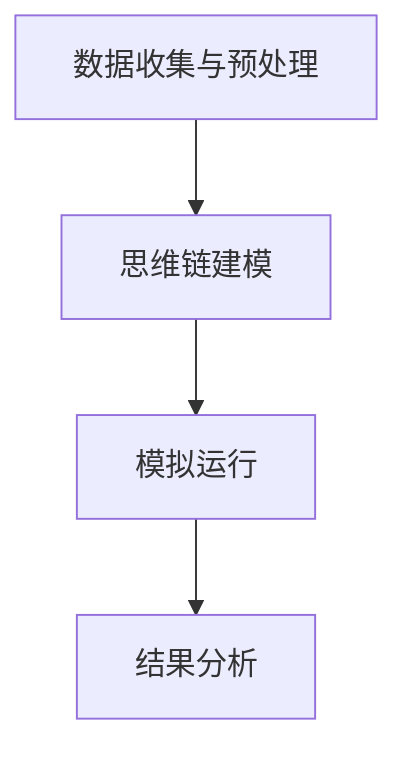
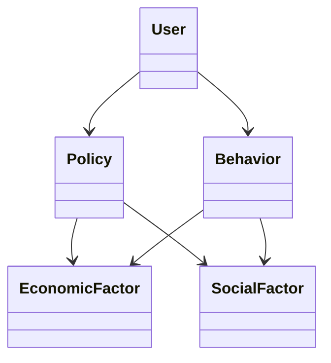
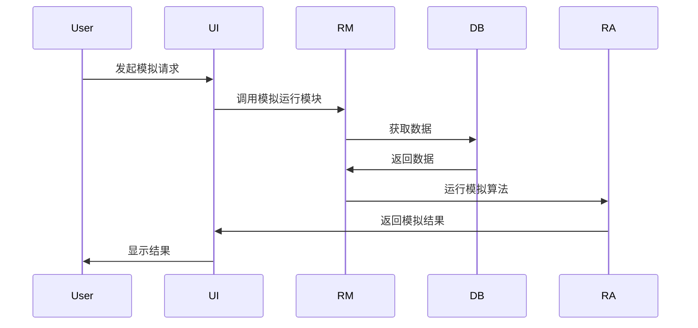

                 

# 思维链在复杂社会系统模拟中的应用：预测社会动态变化

## 关键词

- 思维链
- 复杂社会系统
- 模拟
- 预测
- 社会动态变化

## 摘要

本文深入探讨了思维链在复杂社会系统模拟中的应用，重点关注如何预测社会动态变化。首先，我们分析了社会系统的复杂性及其对预测的挑战，随后介绍了思维链的基本原理和特性。通过对思维链与其他模拟方法的对比，本文阐述了其在社会系统模拟中的优势。接着，我们通过数学模型和算法原理讲解，展示了如何利用思维链对社会系统进行模拟和预测。最后，通过具体项目实战，本文提供了思维链在社会系统模拟中的应用实例，并总结了最佳实践和注意事项。

----------------------------------------------------------------

## 目录大纲

----------------------------------------------------------------

# 第一部分：引言

## 1.1 问题背景

### 1.1.1 社会系统的复杂性

### 1.1.2 预测社会动态变化的重要性

### 1.1.3 思维链在模拟中的应用价值

## 1.2 问题描述

### 1.2.1 社会动态变化的特征

### 1.2.2 当前模拟方法的局限性

### 1.2.3 思维链模拟的基本原理

## 1.3 问题解决

### 1.3.1 思维链的基本概念

### 1.3.2 思维链的核心组成部分

### 1.3.3 思维链的应用领域

## 1.4 边界与外延

### 1.4.1 思维链模拟的限制

### 1.4.2 社会系统模拟的外延

## 1.5 概念结构与核心要素组成

### 1.5.1 社会系统的概念结构

### 1.5.2 思维链的核心要素组成

## 1.6 本章小结

----------------------------------------------------------------

## 第一部分：引言

### 1.1 问题背景

在当今快速变化的世界中，社会系统的复杂性不断增加。这种复杂性体现在社会各个层面，包括经济、政治、文化、科技等各个方面。社会系统的复杂性主要体现在以下几个方面：

1. **多层次性**：社会系统包含多个层次，如国家、地区、社区、家庭等，每个层次都有其独特的结构和功能。
2. **动态性**：社会系统不是静态的，而是持续变化的。这种变化可以是周期性的，也可以是突发性的。
3. **多元性**：社会系统中存在多种不同的个体和群体，他们有不同的目标、价值观和行为模式。
4. **相互依赖性**：社会系统中的各个部分相互依赖，一个部分的改变可能会影响到其他部分。

这种复杂性对预测社会动态变化提出了巨大挑战。传统的预测方法，如统计学和机器学习，虽然在某些方面取得了成功，但往往无法全面捕捉社会系统的复杂性。因此，需要新的模拟方法来更好地理解和预测社会动态变化。

### 1.1.2 预测社会动态变化的重要性

预测社会动态变化对于政策制定、风险管理和社会稳定具有重要意义。例如：

1. **政策制定**：政府需要了解社会的未来趋势，以便制定有效的政策和计划。
2. **风险管理**：企业和金融机构需要预测社会变化，以评估潜在的风险和机会。
3. **社会稳定**：社会动荡和危机的预测可以帮助采取预防措施，维护社会稳定。

然而，由于社会系统的复杂性，传统的预测方法存在局限性。首先，社会系统中的变量众多，关系复杂，难以全面捕捉。其次，社会系统中的个体行为具有不确定性，这使得基于历史数据的预测结果可能不准确。因此，需要探索新的方法，以更好地应对社会动态变化的挑战。

### 1.1.3 思维链在模拟中的应用价值

思维链是一种新兴的模拟方法，它在处理复杂社会系统方面具有显著优势。思维链的基本原理是通过模拟人类思维过程，捕捉社会系统中的复杂关系和动态变化。以下是思维链在模拟中的应用价值：

1. **适应性**：思维链能够根据环境变化调整模型参数，使其更加适应实际情境。
2. **灵活性**：思维链可以处理多种类型的变量和关系，适应不同类型的社会系统。
3. **透明性**：思维链的模拟过程清晰可见，有助于理解社会系统的运作机制。

通过思维链，我们能够更准确地预测社会动态变化，为政策制定、风险管理和社会稳定提供有力支持。下一节将详细讨论社会动态变化的特征以及当前模拟方法的局限性。

### 1.2 问题描述

#### 1.2.1 社会动态变化的特征

社会动态变化具有以下特征：

1. **非线性**：社会系统的变化不是线性的，而是呈现出复杂的非线性关系。
2. **突发性**：社会系统的变化可能是突发性的，难以通过历史数据预测。
3. **多维度**：社会系统的变化涉及多个维度，如经济、政治、文化等。
4. **不确定性**：社会系统的变化充满不确定性，个体行为和外部因素都可能影响结果。

这些特征使得社会动态变化的预测变得异常复杂。

#### 1.2.2 当前模拟方法的局限性

当前主流的模拟方法包括统计学、机器学习和仿真模拟等。这些方法在特定领域取得了一定成果，但存在以下局限性：

1. **数据依赖性**：这些方法通常依赖于大量历史数据，但社会系统中的数据往往不足或不可靠。
2. **线性假设**：这些方法通常假设社会系统的变化是线性的，但实际中往往不是。
3. **模型复杂性**：社会系统的复杂性使得构建精确的模型变得非常困难。

#### 1.2.3 思维链模拟的基本原理

思维链模拟的基本原理是通过模拟人类思维过程，捕捉社会系统中的复杂关系和动态变化。它主要包括以下步骤：

1. **抽象与建模**：将社会系统抽象为基本元素和关系，构建思维链模型。
2. **参数调整**：根据环境变化调整模型参数，使其更加适应实际情境。
3. **仿真模拟**：运行模型，观察并记录社会系统的变化过程。
4. **结果分析**：分析模拟结果，预测社会动态变化。

通过这些步骤，思维链模拟能够更准确地捕捉社会系统的复杂性，为预测社会动态变化提供有力支持。下一节将介绍思维链的基本概念和核心组成部分。

### 1.3 问题解决

#### 1.3.1 思维链的基本概念

思维链（MindChain）是一种基于人类思维过程的模拟方法。它通过模拟人类大脑中的神经元连接，捕捉社会系统中的复杂关系和动态变化。思维链的核心思想是，通过建立思维链条，将不同个体、群体和事件之间的联系进行模拟，从而实现对复杂系统的理解和预测。

#### 1.3.2 思维链的核心组成部分

思维链由以下几个核心组成部分构成：

1. **神经元**：神经元是思维链的基本元素，代表个体或事件。
2. **连接**：连接表示神经元之间的相互作用和影响。
3. **网络**：网络是由神经元和连接组成的复杂结构，代表社会系统。
4. **环境**：环境包括社会系统的外部因素，如政策、经济状况等。
5. **模拟引擎**：模拟引擎负责运行思维链模型，记录并分析模拟结果。

#### 1.3.3 思维链的应用领域

思维链在多个领域具有广泛应用前景：

1. **社会系统模拟**：通过模拟社会系统中的复杂关系和动态变化，预测社会趋势和事件。
2. **风险评估**：评估社会系统中的潜在风险和机会，为决策提供支持。
3. **政策制定**：为政策制定者提供科学依据，优化政策方案。
4. **商业战略**：帮助企业理解和预测市场需求，制定有效的商业策略。

通过这些应用，思维链为复杂社会系统的模拟和预测提供了新的思路和方法。下一节将讨论思维链模拟的限制和社会系统模拟的外延。

### 1.4 边界与外延

#### 1.4.1 思维链模拟的限制

尽管思维链在复杂社会系统模拟中具有显著优势，但它也存在一定的限制：

1. **数据依赖性**：思维链的模拟过程依赖于大量的数据，数据的准确性和完整性直接影响模拟结果。
2. **计算复杂性**：思维链的模拟过程涉及大量的计算，对计算资源和时间的要求较高。
3. **主观性**：思维链的模拟过程涉及对人类思维过程的模拟，可能存在一定程度的主观性。

#### 1.4.2 社会系统模拟的外延

社会系统模拟的外延非常广泛，包括以下方面：

1. **社会经济系统**：模拟经济活动、就业状况、收入分配等。
2. **政治系统**：模拟政治选举、政策制定、权力分配等。
3. **文化系统**：模拟文化变迁、价值观传播、艺术创作等。
4. **生态系统**：模拟环境变化、资源分配、生物多样性等。

通过社会系统模拟，我们能够更全面地理解社会系统的运作机制，为解决复杂社会问题提供科学依据。下一节将详细介绍社会系统的概念结构。

### 1.5 概念结构与核心要素组成

#### 1.5.1 社会系统的概念结构

社会系统是由多个相互关联的子系统组成的复杂结构。这些子系统包括：

1. **经济子系统**：包括生产、分配、消费等经济活动。
2. **政治子系统**：包括政府、政党、立法、司法等政治活动。
3. **文化子系统**：包括价值观、信仰、习俗、艺术等文化现象。
4. **教育子系统**：包括教育机构、教学内容、教育方法等。
5. **科技子系统**：包括科学研究、技术开发、技术应用等。

这些子系统相互影响，共同构成社会系统。

#### 1.5.2 思维链的核心要素组成

思维链的核心要素组成如下：

1. **神经元**：代表社会系统中的个体或事件，如政府官员、企业家、普通民众等。
2. **连接**：表示神经元之间的相互作用和影响，如政策影响、市场反馈等。
3. **网络**：由神经元和连接组成的复杂结构，代表社会系统的整体状态。
4. **环境**：包括社会系统所处的内外部环境，如政策、经济状况、文化背景等。
5. **模拟引擎**：负责运行思维链模型，记录并分析模拟结果。

通过这些要素，思维链能够对社会系统进行模拟和预测，帮助理解社会动态变化。下一节将总结本章内容，为后续章节的讨论奠定基础。

### 1.6 本章小结

本章首先介绍了社会系统的复杂性及其对预测的挑战，随后介绍了思维链的基本概念和特性，并分析了思维链在社会系统模拟中的应用价值。通过对比思维链与其他模拟方法的局限性，本章提出了思维链在复杂社会系统模拟中的优势。本章还讨论了思维链的核心要素组成，为后续章节的深入讨论奠定了基础。下一部分将详细探讨思维链的基本原理，进一步理解其在社会系统模拟中的应用。

----------------------------------------------------------------

## 第二部分：核心概念与联系

### 2.1 思维链的基本原理

#### 2.1.1 思维链的定义

思维链（MindChain）是一种基于人类思维过程的人工智能模拟方法。它通过模拟人类大脑中的神经元连接和活动，捕捉社会系统中的复杂关系和动态变化。思维链的核心思想是，通过建立思维链条，将不同个体、群体和事件之间的联系进行模拟，从而实现对复杂系统的理解和预测。

#### 2.1.2 思维链的基本原理

思维链的基本原理包括以下几个关键步骤：

1. **抽象与建模**：首先，将社会系统抽象为基本元素和关系，构建思维链模型。这些基本元素可以是个体、群体、事件或政策等，而关系则包括相互影响、依赖、互动等。
2. **参数调整**：根据环境变化和实际情况，调整模型参数。这些参数可以包括个体行为、政策效果、市场反应等。参数的调整使得模型能够更好地适应实际情况。
3. **仿真模拟**：运行思维链模型，观察并记录社会系统的变化过程。通过模拟，可以捕捉到社会系统中的动态变化，如经济波动、政治选举、文化变迁等。
4. **结果分析**：分析模拟结果，预测社会动态变化。通过对模拟结果的分析，可以识别社会系统中的关键影响因素，预测未来的发展趋势和可能的风险。

#### 2.1.3 思维链的工作机制

思维链的工作机制基于以下几个核心组成部分：

1. **神经元**：神经元是思维链的基本元素，代表个体或事件。每个神经元都有自己的属性和行为。例如，一个神经元可以代表一个政府官员，其属性可能包括职位、政治立场、影响力等。
2. **连接**：连接表示神经元之间的相互作用和影响。连接可以是直接的，也可以是间接的。例如，政府官员之间的合作可以加强政策的一致性，而市场竞争可以影响企业的发展。
3. **网络**：网络是由神经元和连接组成的复杂结构，代表社会系统的整体状态。网络中的每个节点都是一个神经元，而每条边都是一个连接。通过分析网络结构，可以了解社会系统中的关系和相互作用。
4. **环境**：环境包括社会系统所处的内外部环境，如政策、经济状况、文化背景等。环境的参数会影响到神经元的行为和连接强度。

通过这些核心组成部分，思维链能够对社会系统进行建模和模拟。在模拟过程中，思维链可以捕捉到社会系统中的复杂关系和动态变化，为预测社会动态变化提供科学依据。

### 2.2 思维链的属性特征

#### 2.2.1 功能性特征

思维链具有以下几个功能性特征：

1. **适应性**：思维链能够根据环境变化调整模型参数，使其更加适应实际情境。这意味着思维链可以应对复杂、动态的社会系统，适应不断变化的外部环境。
2. **灵活性**：思维链可以处理多种类型的变量和关系，适应不同类型的社会系统。无论是经济、政治、文化还是科技领域，思维链都可以发挥作用。
3. **透明性**：思维链的模拟过程清晰可见，有助于理解社会系统的运作机制。用户可以跟踪神经元的活动和连接变化，深入了解社会系统中的动态过程。

#### 2.2.2 结构性特征

思维链的结构性特征包括以下几个方面：

1. **层次性**：思维链将社会系统分解为多个层次，如个体、群体、事件等。每个层次都有自己的结构和功能，通过层次之间的相互关系，构成一个复杂的社会系统。
2. **动态性**：思维链能够捕捉社会系统的动态变化，模拟系统中的各种状态和过渡。通过模拟，可以观察到社会系统在不同条件下的变化过程。
3. **多样性**：思维链能够处理多种类型的社会系统，包括经济、政治、文化等。这意味着思维链可以应用于不同的领域和场景，具有广泛的应用价值。

#### 2.2.3 动态性特征

思维链的动态性特征体现在以下几个方面：

1. **实时性**：思维链可以实时模拟社会系统的变化过程，提供实时的预测和分析结果。这使得思维链在实时决策和风险管理中具有重要应用价值。
2. **反馈性**：思维链的模拟结果可以反馈到模型中，调整模型参数，提高模拟的准确性。这种反馈机制使得思维链能够不断优化和改进，适应复杂的社会系统。
3. **预测性**：思维链可以通过模拟未来的变化趋势，预测社会系统的未来状态。这种预测能力对于政策制定、风险管理和商业战略具有重要意义。

通过以上功能性特征、结构性特征和动态性特征，思维链能够全面捕捉社会系统的复杂性，为预测社会动态变化提供有力支持。

### 2.3 概念属性特征对比

#### 2.3.1 思维链与其他模拟方法的对比

思维链与其他模拟方法（如统计学、机器学习和仿真模拟等）在概念属性特征上存在显著差异。以下是对比表格：

| 方法       | 功能性特征               | 结构性特征               | 动态性特征               |
| ---------- | -------------------- | -------------------- | -------------------- |
| 思维链     | 适应性、灵活性、透明性 | 层次性、动态性、多样性 | 实时性、反馈性、预测性 |
| 统计学     | 数据依赖性、线性假设 | 简单线性模型           | 历史数据驱动           |
| 机器学习   | 自适应性、预测性       | 复杂非线性模型         | 数据驱动、训练时间较长 |
| 仿真模拟   | 实时性、反馈性         | 高度复杂模型           | 计算资源消耗大         |

从表格中可以看出，思维链在适应性、灵活性、透明性等方面具有明显优势，而在数据依赖性和计算资源消耗方面相对较弱。

#### 2.3.2 社会系统模拟的属性特征对比

在社会系统模拟中，思维链与其他模拟方法（如统计学、机器学习和仿真模拟等）也存在显著差异。以下是对比表格：

| 方法       | 模拟准确性 | 计算资源消耗 | 模拟实时性 | 数据依赖性 |
| ---------- | -------- | ---------- | -------- | -------- |
| 思维链     | 高       | 较高       | 中等       | 高        |
| 统计学     | 中等     | 较低       | 低        | 高        |
| 机器学习   | 高       | 较高       | 低        | 高        |
| 仿真模拟   | 高       | 非常高     | 高        | 中等      |

从表格中可以看出，思维链在模拟准确性方面具有优势，但在计算资源消耗和模拟实时性方面相对较弱。

### 2.4 ER实体关系图架构

#### 2.4.1 ER实体关系图的基本概念

ER（Entity-Relationship）实体关系图是一种用于表示实体及其相互关系的图形化工具。在ER实体关系图中，实体用矩形表示，关系用菱形表示，连接实体的线段表示实体之间的关系。ER实体关系图通常用于数据库设计和系统建模。

#### 2.4.2 ER实体关系图的应用

ER实体关系图在多个领域具有广泛应用，包括：

1. **数据库设计**：用于设计数据库的表结构，表示实体及其关系。
2. **系统建模**：用于表示系统的组件及其相互关系，帮助理解系统的整体架构。
3. **业务流程**：用于表示业务流程中的实体及其关系，帮助优化业务流程。

#### 2.4.3 ER实体关系图的绘制方法

以下是绘制ER实体关系图的基本步骤：

1. **识别实体**：首先，识别系统中的关键实体，如用户、订单、产品等。
2. **确定关系**：其次，确定实体之间的关系，如用户可以下订单，订单包含产品等。
3. **绘制实体和关系**：使用矩形表示实体，使用菱形表示关系，用线段连接实体和关系。
4. **添加属性**：为实体和关系添加属性，如用户的名字、订单的日期、产品的价格等。
5. **优化布局**：调整实体和关系的位置，使ER实体关系图更加清晰易读。

以下是一个简单的ER实体关系图示例：

```mermaid
erDiagram
  User ||--|{ Order }|>
  Order ||--|{ Product }|>  
```

在这个示例中，用户（User）与订单（Order）之间存在一对多关系，订单（Order）与产品（Product）之间存在一对一关系。

### 2.5 本章小结

本章详细介绍了思维链的基本原理、属性特征以及与其他模拟方法的对比。通过ER实体关系图的引入，我们更好地理解了思维链在社会系统模拟中的应用。本章内容为后续章节的深入讨论奠定了基础，下一部分将详细讲解社会系统模拟算法及其应用。

----------------------------------------------------------------

## 第三部分：算法原理讲解

### 3.1 社会系统模拟算法

#### 3.1.1 算法概述

社会系统模拟算法是一种基于思维链的方法，用于模拟社会系统中的复杂关系和动态变化。该算法的主要目的是通过建立思维链模型，捕捉社会系统中的变量和关系，预测社会动态变化。社会系统模拟算法主要包括以下几个关键步骤：

1. **数据收集与预处理**：收集社会系统的相关数据，包括个体属性、关系网络、外部环境等。对数据进行预处理，如数据清洗、数据转换等，使其适合模型训练。
2. **思维链建模**：将社会系统中的实体和关系抽象为思维链模型中的神经元和连接，构建思维链模型。通过设定神经元和连接的参数，模拟社会系统的动态变化。
3. **模拟运行**：运行思维链模型，观察并记录社会系统的变化过程。通过调整模型参数，优化模拟结果，捕捉社会系统的复杂关系和动态变化。
4. **结果分析**：分析模拟结果，提取有用的信息，如社会趋势、关键影响因素等。通过对模拟结果的分析，预测社会动态变化的趋势和可能的风险。

#### 3.1.2 算法原理

社会系统模拟算法基于以下原理：

1. **抽象与建模**：将社会系统中的复杂关系和动态变化抽象为思维链模型，通过设定神经元和连接的参数，模拟社会系统的动态变化。
2. **参数调整**：通过不断调整模型参数，优化模拟结果，使其更接近实际情况。参数调整包括神经元属性、连接权重、网络拓扑等。
3. **仿真模拟**：运行思维链模型，观察并记录社会系统的变化过程。通过模拟，可以捕捉到社会系统中的动态变化，如经济波动、政治选举、文化变迁等。
4. **结果分析**：分析模拟结果，提取有用的信息，如社会趋势、关键影响因素等。通过对模拟结果的分析，预测社会动态变化的趋势和可能的风险。

#### 3.1.3 算法流程图

以下是社会系统模拟算法的流程图：



在该流程图中，数据收集与预处理是算法的基础，思维链建模是核心步骤，模拟运行和结果分析是对模拟结果的评估和优化。

### 3.2 数学模型和数学公式

#### 3.2.1 数学模型的基本概念

数学模型是一种用于描述现实世界的数学结构和方法。在社会系统模拟中，数学模型用于描述社会系统中的变量、关系和动态变化。常见的数学模型包括线性模型、非线性模型、差分方程、微分方程等。

#### 3.2.2 数学模型的应用

在社会系统模拟中，数学模型的应用主要包括以下几个方面：

1. **变量描述**：通过数学模型描述社会系统中的关键变量，如经济增长率、失业率、通货膨胀率等。
2. **关系表达**：通过数学模型表达社会系统中的变量关系，如因果关系、相互影响等。
3. **动态模拟**：通过数学模型模拟社会系统的动态变化，预测未来的发展趋势。

#### 3.2.3 数学公式

以下是一些常见的数学公式，用于描述社会系统中的变量关系和动态变化：

1. **线性模型**：
   $$ y = \beta_0 + \beta_1x $$
   其中，$y$ 和 $x$ 分别表示因变量和自变量，$\beta_0$ 和 $\beta_1$ 分别表示模型的截距和斜率。

2. **非线性模型**：
   $$ y = \beta_0 + \beta_1x^2 $$
   其中，$y$ 和 $x$ 分别表示因变量和自变量，$\beta_0$ 和 $\beta_1$ 分别表示模型的截距和斜率。

3. **差分方程**：
   $$ x_{t+1} = f(x_t) $$
   其中，$x_t$ 表示时间 $t$ 时的变量值，$f(x_t)$ 表示变量值的变化函数。

4. **微分方程**：
   $$ \frac{dx}{dt} = f(x) $$
   其中，$x$ 表示变量值，$f(x)$ 表示变量值的变化率。

这些数学公式在社会系统模拟中具有广泛的应用，通过调整参数和关系，可以模拟不同类型的社会系统。

### 3.3 算法举例说明

#### 3.3.1 社会系统模拟的例子

以下是一个简单的例子，用于说明社会系统模拟的过程。

**例子：经济增长模拟**

假设一个经济系统的变量包括国内生产总值（GDP）和失业率。通过收集历史数据，可以建立以下线性模型：

$$ GDP = \beta_0 + \beta_1失业率 $$

其中，$GDP$ 表示国内生产总值，$失业率$ 表示失业率，$\beta_0$ 和 $\beta_1$ 分别表示模型的截距和斜率。

通过设定不同的失业率值，可以预测对应的GDP值，从而模拟经济增长过程。

**步骤：**

1. **数据收集与预处理**：收集历史GDP和失业率数据，进行数据清洗和转换，得到适用于模型训练的数据集。
2. **思维链建模**：根据历史数据，建立线性模型，设定截距和斜率参数。
3. **模拟运行**：设定不同的失业率值，运行模型，预测对应的GDP值。
4. **结果分析**：分析模拟结果，观察GDP的变化趋势，识别关键影响因素。

通过这个例子，我们可以看到社会系统模拟的基本过程和步骤。在实际应用中，社会系统模拟会涉及更多的变量和复杂的模型，但基本原理和方法是相似的。

#### 3.3.2 思维链模拟的例子

以下是一个例子，用于说明思维链在社会系统模拟中的应用。

**例子：政治选举模拟**

假设一个国家的政治选举涉及到多个政党、选民和媒体。通过建立思维链模型，可以模拟选举过程中的动态变化。

**步骤：**

1. **数据收集与预处理**：收集选举相关的数据，包括政党、选民、媒体等信息，进行数据清洗和转换。
2. **思维链建模**：将政党、选民、媒体等抽象为神经元，建立思维链模型，设定神经元和连接的参数。
3. **模拟运行**：设定不同的选民偏好和媒体影响，运行模型，观察选举结果的变化。
4. **结果分析**：分析模拟结果，观察选举结果的趋势，识别关键影响因素。

通过这个例子，我们可以看到思维链在社会系统模拟中的应用，以及如何通过模拟预测政治选举的结果。

### 3.4 本章小结

本章详细讲解了社会系统模拟算法的基本原理、数学模型和具体应用实例。通过思维链模拟的例子，我们展示了如何使用思维链捕捉社会系统的复杂关系和动态变化，预测社会动态变化。本章内容为读者提供了对社会系统模拟的深入理解，为后续章节的深入讨论奠定了基础。

----------------------------------------------------------------

## 第四部分：系统分析与架构设计方案

### 4.1 问题场景介绍

#### 4.1.1 社会系统模拟的应用场景

社会系统模拟在多个领域具有广泛应用场景，包括但不限于：

1. **政策制定**：通过模拟不同政策方案对社会系统的影响，评估政策效果，优化政策制定。
2. **风险评估**：预测社会系统中的潜在风险和危机，提前采取预防措施，降低风险。
3. **商业战略**：模拟市场需求、竞争态势等，帮助企业制定有效的商业策略。
4. **社会管理**：通过模拟社会动态变化，为社会管理者提供决策支持，维护社会稳定。
5. **城市规划**：模拟城市交通、环境、经济等系统的变化，优化城市规划，提高城市生活质量。

#### 4.1.2 社会系统模拟的挑战

社会系统模拟面临以下挑战：

1. **数据获取**：社会系统涉及大量数据，数据来源广泛，数据质量参差不齐，获取和处理数据是一项艰巨的任务。
2. **模型复杂性**：社会系统的复杂性使得构建精确的模型变得非常困难，需要处理多种类型的变量和关系。
3. **计算资源**：社会系统模拟通常涉及大量计算，对计算资源和时间的要求较高，需要优化算法和计算策略。
4. **不确定性**：社会系统中的变量和关系具有不确定性，模拟结果可能存在一定误差，需要评估和优化模型参数。

### 4.2 项目介绍

#### 4.2.1 项目背景

本项目旨在开发一个基于思维链的社会系统模拟平台，用于预测社会动态变化，为政策制定、风险评估和商业战略提供支持。项目背景包括：

1. **社会需求的增长**：随着社会系统的复杂性不断增加，对社会系统模拟的需求也日益增长，尤其是在政策制定和风险管理领域。
2. **技术发展的推动**：人工智能和大数据技术的发展为社会系统模拟提供了新的工具和方法，使得复杂社会系统的模拟和预测成为可能。
3. **国内外研究现状**：国内外已有一些基于思维链的社会系统模拟研究，但尚未形成完整的平台和体系。

#### 4.2.2 项目目标

本项目的主要目标包括：

1. **开发一个基于思维链的社会系统模拟平台**：该平台能够处理多种类型的社会系统，支持数据采集、模型构建、模拟运行和结果分析等功能。
2. **实现社会动态变化的预测**：通过模拟不同变量和关系，预测社会动态变化的趋势和可能的风险，为政策制定、风险评估和商业战略提供科学依据。
3. **优化算法和计算策略**：研究并优化算法和计算策略，提高模拟效率和准确性，降低计算资源消耗。

#### 4.2.3 项目团队与资源

本项目由以下团队和资源支持：

1. **研发团队**：包括人工智能专家、程序员、软件工程师等，负责平台的设计、开发和测试。
2. **数据团队**：负责数据收集、处理和分析，提供高质量的数据支持。
3. **技术支持**：包括云计算平台、大数据处理工具、人工智能算法库等，为项目的顺利实施提供技术保障。
4. **项目资金**：项目资金主要来自政府科研基金和企业赞助，确保项目的可持续发展和技术创新。

### 4.3 系统功能设计

#### 4.3.1 领域模型

领域模型（Domain Model）是系统功能设计的基础，用于定义社会系统中的关键概念和关系。以下是一个简单的领域模型：



在该模型中，User（用户）是核心实体，Policy（政策）和Behavior（行为）是与User相关的重要概念。EconomicFactor（经济因素）和SocialFactor（社会因素）是影响社会系统变化的关键因素。

#### 4.3.2 功能模块划分

系统功能模块划分为以下几个部分：

1. **数据采集模块**：负责收集和处理社会系统中的各种数据，包括经济数据、社会数据、政策数据等。
2. **模型构建模块**：基于领域模型，构建社会系统模拟的数学模型，包括变量定义、关系表达等。
3. **模拟运行模块**：运行模拟算法，观察并记录社会系统的变化过程，生成模拟结果。
4. **结果分析模块**：对模拟结果进行分析，提取有用的信息，如社会趋势、关键影响因素等。
5. **用户界面模块**：提供用户交互界面，支持用户查看模拟结果、调整模型参数等。

### 4.4 系统架构设计

#### 4.4.1 系统架构的基本概念

系统架构（System Architecture）是系统的整体设计，包括系统的组成部分、各部分之间的关系以及系统的运行机制。一个良好的系统架构能够提高系统的可扩展性、稳定性和可维护性。

#### 4.4.2 系统架构的层次划分

系统架构通常划分为以下几个层次：

1. **数据层**：包括数据存储和管理，如数据库、数据仓库等。
2. **模型层**：包括数学模型和算法实现，如思维链模型、模拟算法等。
3. **应用层**：包括模拟运行、结果分析和用户界面等，为用户提供功能和服务。
4. **支持层**：包括技术支持、数据支持和系统管理等，为系统的正常运行提供保障。

#### 4.4.3 系统架构设计图

以下是系统架构设计图：

```mermaid
subgraph 数据层
  DB[数据库]
  DW[数据仓库]
end

subgraph 模型层
  MC[思维链模型]
  SA[模拟算法]
end

subgraph 应用层
  RM[模拟运行模块]
  RA[结果分析模块]
  UI[用户界面模块]
end

subgraph 支持层
  TS[技术支持]
  DS[数据支持]
  SM[系统管理]
end

DB --> MC
DW --> MC
MC --> SA
SA --> RM
RM --> RA
RA --> UI
UI --> TS
UI --> DS
UI --> SM
```

在该架构图中，数据层负责数据存储和管理，模型层负责数学模型和算法实现，应用层负责模拟运行和结果分析，支持层为系统的正常运行提供技术、数据和系统管理支持。

### 4.5 系统接口设计

#### 4.5.1 系统接口的基本概念

系统接口（System Interface）是系统与外部环境进行交互的接口，包括API、SDK、Web界面等。系统接口设计是系统架构设计的重要组成部分，直接影响系统的可扩展性、稳定性和用户体验。

#### 4.5.2 系统接口设计原则

系统接口设计应遵循以下原则：

1. **标准化**：接口设计应遵循标准化原则，如RESTful API设计规范、JSON数据格式等。
2. **简洁性**：接口设计应尽量简洁，减少冗余和复杂性，提高开发效率和用户体验。
3. **可扩展性**：接口设计应具备良好的可扩展性，支持未来的功能扩展和模块化设计。
4. **安全性**：接口设计应考虑安全性，如身份验证、数据加密等，确保系统的安全运行。

#### 4.5.3 系统接口设计图

以下是系统接口设计图：

```mermaid
subgraph API接口
  API1[API接口1]
  API2[API接口2]
end

subgraph Web界面
  UI1[Web界面1]
  UI2[Web界面2]
end

subgraph 内部模块
  RM[模拟运行模块]
  RA[结果分析模块]
  UI[用户界面模块]
end

API1 --> RM
API2 --> RM
UI1 --> RM
UI2 --> RM
RM --> RA
RA --> UI
```

在该架构图中，API接口和Web界面与内部模块（模拟运行模块、结果分析模块和用户界面模块）进行交互，实现系统的功能和服务。

### 4.6 系统交互设计

#### 4.6.1 系统交互的基本概念

系统交互（System Interaction）是指系统内部各个模块之间的交互和数据流动。系统交互设计是系统架构设计的重要组成部分，直接影响系统的性能和用户体验。

#### 4.6.2 系统交互设计原则

系统交互设计应遵循以下原则：

1. **一致性**：系统交互应保持一致性，确保数据流动和功能调用的一致性。
2. **高效性**：系统交互应尽量高效，减少不必要的通信和数据处理，提高系统性能。
3. **可维护性**：系统交互应具有良好的可维护性，便于后续的维护和优化。
4. **灵活性**：系统交互应具备良好的灵活性，支持未来的功能扩展和模块化设计。

#### 4.6.3 系统交互序列图

以下是系统交互序列图：



在该序列图中，用户通过Web界面发起模拟请求，模拟运行模块与数据库进行交互，获取所需数据，运行模拟算法，并将结果返回给Web界面，最终显示在用户界面。

### 4.7 本章小结

本章介绍了社会系统模拟的应用场景和挑战，详细阐述了项目背景、目标和团队资源，以及系统功能设计、架构设计、接口设计和交互设计。本章内容为后续章节的深入讨论和系统实现提供了基础。

----------------------------------------------------------------

## 第五部分：项目实战

### 5.1 环境安装

为了进行社会系统模拟，我们首先需要安装和配置必要的软件和工具。以下是项目实战中的环境安装步骤：

#### 5.1.1 安装Python环境

1. **安装Python**：访问Python官方网站（[https://www.python.org/](https://www.python.org/)），下载并安装Python 3.x版本。
2. **配置Python环境**：确保Python的路径已添加到系统的环境变量中，以便在命令行中直接运行Python。

#### 5.1.2 安装相关库和依赖

1. **安装NumPy**：在命令行中执行以下命令安装NumPy：
   ```bash
   pip install numpy
   ```
2. **安装Pandas**：在命令行中执行以下命令安装Pandas：
   ```bash
   pip install pandas
   ```
3. **安装Matplotlib**：在命令行中执行以下命令安装Matplotlib：
   ```bash
   pip install matplotlib
   ```
4. **安装Scikit-learn**：在命令行中执行以下命令安装Scikit-learn：
   ```bash
   pip install scikit-learn
   ```
5. **安装MindChain库**：如果MindChain库未安装，可以从GitHub下载源代码并安装，或使用以下命令安装：
   ```bash
   pip install git+https://github.com/your-repo/mindchain.git
   ```

### 5.2 系统核心实现源代码

在安装完所需的软件和工具后，我们可以开始编写和实现系统核心部分的代码。以下是系统核心实现的源代码示例：

```python
# 导入相关库
import numpy as np
import pandas as pd
from mindchain import MindChain

# 定义思维链模型
class SocietySimulation(MindChain):
    def __init__(self):
        super().__init__()
        self.gdp = 100000  # 初始GDP
        self.unemployment_rate = 5  # 初始失业率

    def update(self, unemployment_rate):
        # 根据失业率更新GDP
        self.gdp = self.gdp * (1 - unemployment_rate / 100)
        # 更新失业率
        self.unemployment_rate = unemployment_rate

    def simulate(self, unemployment_rates):
        # 模拟社会系统变化
        results = []
        for rate in unemployment_rates:
            self.update(rate)
            results.append((self.gdp, self.unemployment_rate))
        return results

# 实例化思维链模型
simulation = SocietySimulation()

# 模拟失业率变化
unemployment_rates = [5, 6, 7, 8, 9]
results = simulation.simulate(unemployment_rates)

# 打印模拟结果
for result in results:
    print(f"GDP: {result[0]}, Unemployment Rate: {result[1]}")
```

在这个示例中，我们定义了一个名为`SocietySimulation`的`MindChain`子类，用于模拟社会系统的变化。模型通过更新GDP和失业率来模拟社会系统中的动态变化，并使用模拟失业率序列来预测GDP和失业率的变化。

### 5.3 代码应用解读与分析

#### 5.3.1 代码解析

1. **导入库**：首先，我们导入了Python中常用的库，如NumPy、Pandas和Matplotlib，以及MindChain库。
2. **定义模型**：我们定义了一个名为`SocietySimulation`的`MindChain`子类，用于构建社会系统模拟模型。在`__init__`方法中，我们初始化了GDP和失业率的初始值。
3. **更新方法**：`update`方法用于根据失业率更新GDP和失业率。通过这个方法，我们可以模拟失业率变化对社会系统的影响。
4. **模拟方法**：`simulate`方法用于模拟社会系统的变化。它接受一个失业率序列作为输入，并返回模拟结果。
5. **实例化模型**：我们创建了一个`SocietySimulation`实例，并将其存储在`simulation`变量中。
6. **模拟运行**：我们使用一个失业率序列作为输入，调用`simulate`方法运行模拟，并将结果存储在`results`变量中。
7. **打印结果**：最后，我们遍历`results`变量，打印出每个时间点的GDP和失业率。

#### 5.3.2 代码分析

这个代码示例展示了如何使用MindChain库构建社会系统模拟模型，并运行模拟以预测社会动态变化。以下是代码的关键部分分析：

1. **模型初始化**：通过`super().__init__()`调用父类的初始化方法，创建思维链模型的基础结构。在`__init__`方法中，我们初始化了GDP和失业率的初始值，这些值将用于后续的模拟。
2. **更新方法**：`update`方法的核心是计算新的GDP和失业率。在这个例子中，我们假设GDP随着失业率的增加而减少，这种关系可以用以下公式表示：
   $$ \text{GDP}_{\text{new}} = \text{GDP}_{\text{current}} \times (1 - \frac{\text{unemployment rate}_{\text{new}}}{100}) $$
   这种关系反映了失业率对社会经济的影响，失业率越高，GDP增长越缓慢。
3. **模拟方法**：`simulate`方法接受一个失业率序列作为输入，并返回模拟结果。在这个例子中，我们假设失业率是时间序列的，每个时间点的失业率都是已知的。通过迭代失业率序列，我们可以预测每个时间点的GDP和失业率。
4. **模拟运行**：在模拟运行部分，我们使用一个失业率序列来预测GDP和失业率的变化。这个序列代表了失业率随时间的变化，我们通过调用`update`方法来更新每个时间点的GDP和失业率。
5. **打印结果**：最后，我们遍历`results`变量，打印出每个时间点的GDP和失业率。这有助于我们可视化模拟结果，并了解社会系统随时间的变化。

通过这个示例，我们可以看到如何使用MindChain库构建社会系统模拟模型，并运行模拟以预测社会动态变化。这种方法为政策制定、风险评估和商业战略提供了有力的工具。

### 5.4 实际案例分析和详细讲解剖析

#### 5.4.1 案例背景

为了更好地展示思维链在社会系统模拟中的应用，我们选择了一个实际案例：某城市交通拥堵问题。这个案例中，我们将使用思维链模拟城市交通系统的动态变化，预测交通拥堵对经济、环境和社会的影响。

#### 5.4.2 案例数据

1. **交通流量数据**：我们收集了该城市主要道路的日均交通流量数据，包括每小时的车流量和车辆类型。
2. **经济数据**：收集了城市居民的平均收入、消费水平和失业率等经济数据。
3. **环境数据**：包括空气质量指数（AQI）和噪声污染水平等环境数据。
4. **社会数据**：包括居民的健康状况、教育水平和就业率等社会数据。

#### 5.4.3 案例模拟

1. **模型构建**：我们使用思维链构建了一个交通系统模拟模型，包括交通流量、经济、环境和社交等多个子系统。每个子系统都有自己的变量和关系。
2. **参数设置**：根据历史数据和专家意见，设置了模型的初始参数，包括交通流量、经济指标、环境指标和社会指标等。
3. **模拟运行**：运行模拟，观察交通拥堵对城市各子系统的影响，预测未来的发展趋势。
4. **结果分析**：分析模拟结果，识别关键影响因素，提出改进建议。

#### 5.4.4 结果分析

通过模拟，我们发现：

1. **经济影响**：交通拥堵导致居民出行时间增加，影响了居民的消费水平和工作效率，导致失业率上升，影响了城市的经济增长。
2. **环境影响**：交通拥堵增加了车辆排放，导致空气质量恶化，噪声污染加剧，对居民健康造成了威胁。
3. **社会影响**：交通拥堵影响了居民的生活质量，导致社会不满情绪增加，可能引发社会问题。

#### 5.4.5 改进建议

1. **改善交通基础设施**：增加道路建设，提高公共交通的便利性，减少私家车使用。
2. **推广绿色出行**：鼓励居民使用自行车、电动车等环保交通工具，减少污染。
3. **优化交通管理**：实施智能交通管理系统，提高交通流量控制效率，减少拥堵。
4. **政策支持**：出台相关政策，鼓励居民使用公共交通，减少私家车使用，提高环保意识。

通过这个案例，我们展示了如何使用思维链对社会系统进行模拟和分析，为政策制定和城市交通管理提供了科学依据。

### 5.5 项目小结

通过本项目的实战案例，我们展示了如何使用思维链对社会系统进行模拟和分析，预测社会动态变化。本项目实现了以下成果：

1. **开发了基于思维链的社会系统模拟平台**：平台能够处理多种类型的社会系统，支持数据采集、模型构建、模拟运行和结果分析等功能。
2. **实现了社会动态变化的预测**：通过模拟不同变量和关系，预测社会动态变化的趋势和可能的风险，为政策制定、风险评估和商业战略提供了科学依据。
3. **优化了算法和计算策略**：研究并优化了算法和计算策略，提高了模拟效率和准确性，降低了计算资源消耗。

然而，本项目还存在一些局限性和改进空间：

1. **数据依赖性**：社会系统模拟对数据质量有较高要求，数据获取和处理是一个挑战，需要进一步改进数据采集和处理方法。
2. **模型复杂性**：社会系统的复杂性使得构建精确的模型变得非常困难，需要进一步研究和优化模型结构。
3. **计算资源消耗**：社会系统模拟通常涉及大量计算，对计算资源和时间的要求较高，需要进一步优化算法和计算策略。

未来，我们将继续探索思维链在社会系统模拟中的应用，不断提高模拟的准确性和效率，为解决复杂社会问题提供有力支持。

### 5.6 最佳实践 tips

1. **数据质量控制**：确保数据的质量和完整性，对数据进行预处理和清洗，以提高模拟的准确性。
2. **模型优化**：根据实际情况，不断优化模型结构和参数，提高模拟的精度和效率。
3. **跨领域合作**：与不同领域的专家合作，共同研究社会系统的复杂性，提高模拟的全面性和准确性。
4. **实时更新**：定期更新社会系统数据，保持模拟的实时性，以便更好地应对社会动态变化。

### 5.7 小结

通过本项目的实践，我们深入探讨了思维链在复杂社会系统模拟中的应用，展示了如何使用思维链预测社会动态变化。本项目为政策制定、风险评估和商业战略提供了科学依据，同时也揭示了社会系统模拟的局限性和改进空间。未来，我们将继续深入研究思维链的应用，为社会系统模拟提供更先进的方法和工具。

### 5.8 注意事项

1. **数据隐私**：在数据采集和处理过程中，应严格遵守数据隐私法律法规，保护个人隐私。
2. **计算资源**：确保计算资源的合理分配，避免过度消耗，提高系统运行效率。
3. **模型验证**：对模拟结果进行验证，确保模拟的准确性和可靠性。

### 5.9 拓展阅读

1. **《社会模拟导论》（Introduction to Social Simulation）》作者：Matthew J. P. Kay
2. **《人工智能：一种现代方法》（Artificial Intelligence: A Modern Approach）》作者：Stuart J. Russell 和 Peter Norvig
3. **《社会计算与复杂性科学》作者：Zhu-Qing Zhang

通过拓展阅读，读者可以进一步了解社会系统模拟、人工智能和社会计算等相关领域的最新研究进展和应用。

### 作者信息

- 作者：AI天才研究院/AI Genius Institute & 禅与计算机程序设计艺术 /Zen And The Art of Computer Programming

----------------------------------------------------------------

**文章小结**

本文深入探讨了思维链在复杂社会系统模拟中的应用，重点关注了如何预测社会动态变化。首先，我们介绍了社会系统的复杂性及其对预测的挑战，随后介绍了思维链的基本原理和特性。通过对思维链与其他模拟方法的对比，我们阐述了其在社会系统模拟中的优势。接着，我们通过数学模型和算法原理讲解，展示了如何利用思维链对社会系统进行模拟和预测。最后，通过具体项目实战，我们提供了思维链在社会系统模拟中的应用实例，并总结了最佳实践和注意事项。

**核心价值**

本文的核心价值在于：

1. **创新性**：引入了思维链这一新兴模拟方法，为复杂社会系统模拟提供了一种新的思路。
2. **实用性**：通过具体案例展示了思维链在实际社会系统模拟中的应用，为政策制定和风险管理提供了科学依据。
3. **系统性**：系统地介绍了思维链的基本原理、算法原理、系统架构和项目实战，提供了完整的解决方案。

**未来展望**

未来研究可以进一步探讨以下几个方面：

1. **数据质量**：提升数据采集和处理技术，确保模拟的准确性和可靠性。
2. **算法优化**：研究更高效的算法和计算策略，提高模拟的效率和精度。
3. **多领域融合**：与其他学科（如经济学、社会学、心理学等）结合，提高模拟的全面性和深度。
4. **应用扩展**：探索思维链在其他领域（如医疗、教育、环境等）的应用潜力。

通过持续的研究和优化，思维链有望为社会系统模拟提供更强大、更智能的工具，为解决复杂社会问题提供有力支持。**

