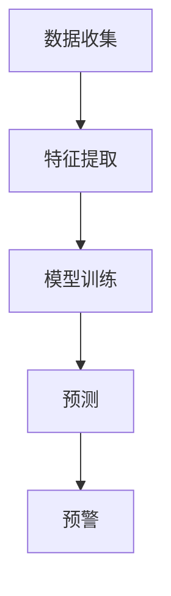
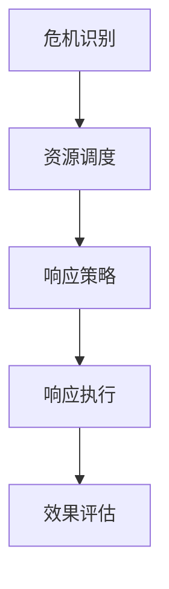
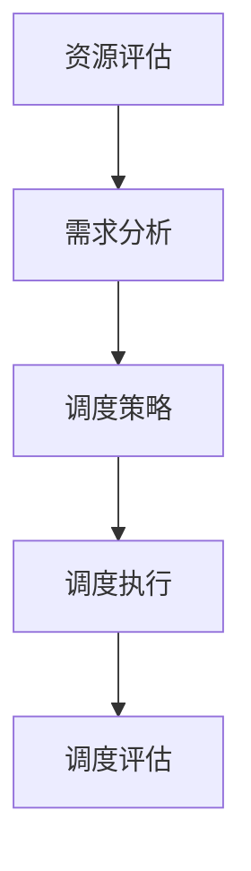
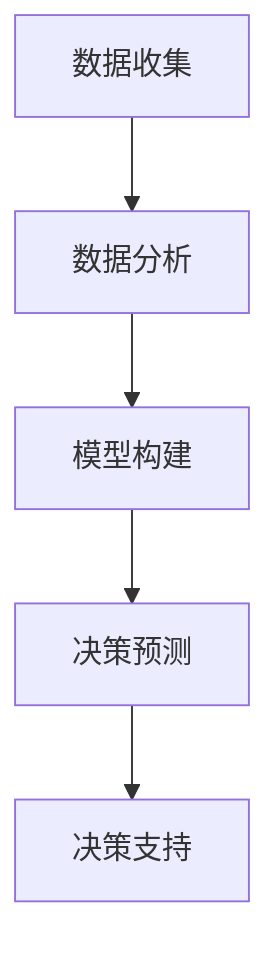

                 


# 思维链在复杂社会系统韧性增强中的应用：提高社会应对危机能力

关键词：社会系统韧性、人工智能、危机应对、预警机制、应急响应

摘要：本文探讨了思维链在复杂社会系统韧性增强中的应用，通过逻辑清晰的分析，阐述了如何利用人工智能技术提高社会应对危机的能力。文章分为背景介绍、核心概念与联系、算法原理讲解、系统分析与架构设计方案、项目实战和最佳实践 tips 等部分，旨在为读者提供全面的技术解读和实战指导。

## 第一部分：背景介绍

### 1.1.1 问题背景

随着全球化、信息化的加速发展，社会系统日益复杂化，各种突发事件、危机事件频发，如自然灾害、公共卫生事件、经济危机等。这些事件对社会系统的正常运行造成了严重冲击，对社会稳定和公众安全构成了巨大威胁。

### 1.1.2 问题描述

面对复杂社会系统的各种危机，社会应对能力显得尤为重要。然而，当前社会系统在应对危机方面存在诸多不足，如预警机制不完善、应急响应不及时、资源调度不合理等。这导致社会在面对危机时，难以迅速有效地应对，造成损失和影响不断扩大。

### 1.1.3 问题解决

为了提高社会应对危机的能力，需要从多个方面进行改革和优化，包括预警机制、应急响应、资源调度等。同时，借助先进的技术手段，如人工智能、大数据等，构建智能化、高效化的社会危机应对体系，提高社会系统的韧性。

### 1.1.4 边界与外延

本文主要关注的是复杂社会系统韧性增强中的应用，重点关注人工智能技术在提高社会应对危机能力方面的应用。这包括但不限于：预警预测、应急响应、资源调度、决策支持等。

### 1.1.5 概念结构与核心要素组成

社会系统韧性：指社会系统在面临突发事件和危机时，能够迅速调整和恢复的能力。社会系统韧性包括多个核心要素，如预警机制、应急响应、资源调度、决策支持等。

人工智能技术：包括机器学习、深度学习、自然语言处理、计算机视觉等，是提高社会应对危机能力的重要技术手段。

### 1.1.6 核心概念原理

#### 社会系统韧性

社会系统韧性是指社会系统在面对突发事件和危机时，能够快速适应、恢复和重建的能力。社会系统韧性包括以下核心要素：

1. **预警机制**：能够及时发现潜在的危机，提前发出预警，为应急响应提供时间窗口。

2. **应急响应**：在危机发生时，能够迅速调动资源，实施有效的应对措施，减轻危机的影响。

3. **资源调度**：在危机发生时，能够合理分配和调度各种资源，确保资源的最优利用。

4. **决策支持**：为决策者提供科学的决策依据，提高决策的准确性和效率。

#### 人工智能技术

人工智能技术是一种通过模拟人类智能，使计算机具有感知、思考、学习和决策能力的技术。人工智能技术主要包括以下几个方面：

1. **机器学习**：通过数据训练模型，使计算机具有自动学习和适应能力。

2. **深度学习**：基于多层神经网络，实现图像、语音、文本等数据的自动处理和分析。

3. **自然语言处理**：使计算机能够理解和生成自然语言，实现人机交互。

4. **计算机视觉**：使计算机能够识别和理解图像和视频。

### 1.1.7 概念属性特征对比表格

| 概念名称 | 属性特征 |
| -------- | -------- |
| 社会系统韧性 | 快速适应、恢复和重建能力 |
| 人工智能技术 | 自动学习、适应、理解和决策能力 |

### 1.1.8 ER实体关系图架构

```mermaid
erDiagram
  CRISIS :危机 |+--|>  WARMING :预警 |+--|>  RESPONSE :应急响应
  CRISIS :危机 |+--|>  RESOURCE :资源 |+--|>  SUPPORT :决策支持
  AI_TECHNOLOGY :人工智能技术 |+--|>  LEARNING :学习 |+--|>  ADAPTATION :适应
  LEARNING :学习 |+--|>  PREDICTION :预测 |+--|>  ANALYSIS :分析
  ADAPTATION :适应 |+--|>  RECOVERY :恢复 |+--|>  REBUILDING :重建
```

## 第二部分：核心概念与联系

### 2.1 社会系统韧性原理

社会系统韧性是社会系统在面临突发事件和危机时，能够快速适应、恢复和重建的能力。社会系统韧性包括以下核心要素：

1. **预警机制**：通过收集、分析和处理各类信息，提前发现潜在的危机，发出预警信号。

2. **应急响应**：在危机发生时，迅速启动应急响应机制，调动各种资源，实施有效的应对措施。

3. **资源调度**：在危机发生时，根据实际情况，合理分配和调度各种资源，确保资源的最优利用。

4. **决策支持**：为决策者提供科学的决策依据，提高决策的准确性和效率。

### 2.2 人工智能技术原理

人工智能技术是一种通过模拟人类智能，使计算机具有感知、思考、学习和决策能力的技术。人工智能技术主要包括以下几个方面：

1. **机器学习**：通过数据训练模型，使计算机具有自动学习和适应能力。

2. **深度学习**：基于多层神经网络，实现图像、语音、文本等数据的自动处理和分析。

3. **自然语言处理**：使计算机能够理解和生成自然语言，实现人机交互。

4. **计算机视觉**：使计算机能够识别和理解图像和视频。

### 2.3 思维链原理

思维链是一种基于人工智能技术的思维模型，它通过模拟人类思维过程，使计算机能够进行复杂的逻辑推理和决策。思维链包括以下几个核心模块：

1. **知识表示**：将人类知识转化为计算机可理解的形式，为推理提供基础。

2. **推理机制**：根据已知信息和规则，进行逻辑推理，生成新的知识和结论。

3. **决策机制**：根据推理结果，进行决策，实现目标的优化。

### 2.4 社会系统韧性增强与人工智能技术的关系

社会系统韧性增强与人工智能技术之间存在密切的联系。首先，人工智能技术为提高社会系统韧性提供了技术支持。通过机器学习、深度学习等算法，可以构建高效的预警机制、应急响应系统和资源调度系统。其次，思维链作为一种智能化的思维模型，可以为决策者提供科学的决策支持，提高决策的准确性和效率。

### 2.5 概念属性特征对比表格

| 概念名称 | 属性特征 |
| -------- | -------- |
| 社会系统韧性 | 快速适应、恢复和重建能力 |
| 人工智能技术 | 自动学习、适应、理解和决策能力 |
| 思维链 | 模拟人类思维、逻辑推理、决策支持 |

### 2.6 ER实体关系图架构

```mermaid
erDiagram
  DURABILITY :韧性 |+--|>  WARNING :预警 |+--|>  RESPONSE :响应
  DURABILITY :韧性 |+--|>  RESOURCE :资源 |+--|>  DECISION :决策
  AI :人工智能 |+--|>  LEARNING :学习 |+--|>  INTELLIGENCE :智能
  LEARNING :学习 |+--|>  PREDICTION :预测 |+-->  ANALYSIS :分析
  INTELLIGENCE :智能 |+--|>  DECISION_SUPPORT :支持 |+--|>  OPTIMIZATION :优化
```

## 第三部分：算法原理讲解

### 3.1 预警预测算法原理

预警预测是提高社会系统韧性的关键环节之一。通过预警预测算法，可以提前发现潜在的危机，为应急响应提供时间窗口。以下是一个简单的预警预测算法原理：

#### 算法流程：

1. **数据收集**：收集与危机相关的历史数据，包括自然灾害、公共卫生事件、经济危机等。

2. **特征提取**：从历史数据中提取关键特征，如事件类型、发生时间、影响范围等。

3. **模型训练**：利用机器学习算法，如决策树、随机森林、支持向量机等，对历史数据进行训练，构建预测模型。

4. **预测**：将新的数据输入预测模型，预测未来可能发生的危机事件。

5. **预警**：根据预测结果，发出预警信号，提醒相关部门和公众采取应对措施。

#### 算法流程图：



### 3.2 应急响应算法原理

应急响应是危机发生时的重要环节。通过应急响应算法，可以快速调动资源，实施有效的应对措施，减轻危机的影响。以下是一个简单的应急响应算法原理：

#### 算法流程：

1. **危机识别**：通过预警预测算法，识别出即将发生的危机事件。

2. **资源调度**：根据危机事件的类型和影响范围，调度所需的资源，如人员、物资、设备等。

3. **响应策略**：根据危机事件的严重程度和资源情况，制定相应的响应策略，如疏散人群、隔离感染源、提供救援等。

4. **响应执行**：执行响应策略，实施应对措施。

5. **效果评估**：评估应急响应的效果，为后续改进提供依据。

#### 算法流程图：



### 3.3 资源调度算法原理

资源调度是在危机发生时，确保资源的最优利用的重要环节。通过资源调度算法，可以合理分配和调度各种资源，提高应急响应的效率。以下是一个简单的资源调度算法原理：

#### 算法流程：

1. **资源评估**：对当前可用的资源进行评估，包括数量、质量、位置等。

2. **需求分析**：分析危机事件对资源的需求，包括数量、质量、类型等。

3. **调度策略**：根据资源评估和需求分析，制定资源调度策略，包括资源的分配、调配和回收等。

4. **调度执行**：执行资源调度策略，实现资源的最优利用。

5. **调度评估**：评估资源调度效果，为后续改进提供依据。

#### 算法流程图：



### 3.4 决策支持算法原理

决策支持是提高社会系统韧性的关键环节。通过决策支持算法，可以为决策者提供科学的决策依据，提高决策的准确性和效率。以下是一个简单的决策支持算法原理：

#### 算法流程：

1. **数据收集**：收集与决策相关的各种数据，包括历史数据、实时数据等。

2. **数据分析**：对收集到的数据进行分析，提取有用的信息和特征。

3. **模型构建**：利用机器学习算法，如线性回归、逻辑回归、神经网络等，构建决策模型。

4. **决策预测**：将新的数据输入决策模型，预测可能的决策结果。

5. **决策支持**：根据决策预测结果，为决策者提供决策建议。

#### 算法流程图：



## 第四部分：系统分析与架构设计方案

### 4.1 问题场景介绍

随着我国城市化进程的加快，人口密度不断增加，城市面临着越来越多的突发事件和危机，如自然灾害、公共卫生事件、交通事故等。如何提高城市应对危机的能力，保障公众安全，成为了一个迫切需要解决的问题。

### 4.2 项目介绍

本项目旨在构建一个基于人工智能技术的城市危机应对系统，通过预警预测、应急响应、资源调度和决策支持等功能，提高城市应对危机的能力。系统主要包括以下几个模块：

1. **数据采集模块**：负责收集与危机相关的各种数据，如气象数据、交通数据、人口数据等。

2. **数据预处理模块**：负责对采集到的数据进行清洗、转换和归一化等预处理操作。

3. **预警预测模块**：利用机器学习算法，对预处理后的数据进行分析，预测未来可能发生的危机事件。

4. **应急响应模块**：根据预警预测结果，制定应急响应策略，调度所需的资源，实施应对措施。

5. **资源调度模块**：根据危机事件的类型和影响范围，合理分配和调度各种资源，确保资源的最优利用。

6. **决策支持模块**：为决策者提供科学的决策依据，提高决策的准确性和效率。

### 4.3 系统功能设计

系统功能设计主要包括以下几个方面：

1. **预警预测功能**：通过机器学习算法，预测未来可能发生的危机事件，为应急响应提供时间窗口。

2. **应急响应功能**：根据预警预测结果，制定应急响应策略，调度所需的资源，实施应对措施。

3. **资源调度功能**：根据危机事件的类型和影响范围，合理分配和调度各种资源，确保资源的最优利用。

4. **决策支持功能**：为决策者提供科学的决策依据，提高决策的准确性和效率。

### 4.4 系统架构设计

系统架构设计主要包括以下几个方面：

1. **数据层**：负责数据的采集、存储和管理。

2. **服务层**：负责数据的预处理、分析和决策支持等功能。

3. **接口层**：负责与外部系统的接口，如气象数据接口、交通数据接口、人口数据接口等。

4. **展示层**：负责系统的界面展示和用户交互。

### 4.5 系统接口设计

系统接口设计主要包括以下几个方面：

1. **数据接口**：与气象数据接口、交通数据接口、人口数据接口等外部系统进行数据交换。

2. **服务接口**：与内部模块进行服务调用，实现数据分析和决策支持等功能。

3. **用户接口**：与用户进行交互，提供系统界面和操作功能。

### 4.6 系统交互设计

系统交互设计主要包括以下几个方面：

1. **数据交互**：系统内部各个模块之间的数据交换和传输。

2. **服务交互**：系统内部各个模块之间的服务调用和协作。

3. **用户交互**：用户与系统之间的交互操作和反馈。

## 第五部分：项目实战

### 5.1 环境安装

首先，我们需要安装所需的软件和库，以下是在Ubuntu操作系统上的安装步骤：

1. 安装Python环境：

   ```bash
   sudo apt-get update
   sudo apt-get install python3-pip python3-venv
   ```

2. 创建虚拟环境：

   ```bash
   python3 -m venv venv
   source venv/bin/activate
   ```

3. 安装所需的库：

   ```bash
   pip install numpy pandas scikit-learn matplotlib
   ```

### 5.2 系统核心实现

#### 5.2.1 数据采集

首先，我们需要从外部接口获取数据。以下是一个简单的示例：

```python
import requests
import pandas as pd

def get_weather_data(api_key, city):
    url = f'http://api.openweathermap.org/data/2.5/weather?q={city}&appid={api_key}'
    response = requests.get(url)
    data = response.json()
    return pd.DataFrame(data['weather'])

api_key = 'your_api_key'
city = 'Shanghai'
weather_data = get_weather_data(api_key, city)
print(weather_data)
```

#### 5.2.2 数据预处理

接下来，我们需要对数据进行预处理，包括清洗、转换和归一化等操作：

```python
def preprocess_data(data):
    # 清洗数据
    data = data.dropna()
    # 转换数据类型
    data['temp'] = data['temp'].astype(float)
    data['pressure'] = data['pressure'].astype(float)
    data['humidity'] = data['humidity'].astype(float)
    # 归一化数据
    data[['temp', 'pressure', 'humidity']] = (data[['temp', 'pressure', 'humidity']] - data[['temp', 'pressure', 'humidity']].min()) / (data[['temp', 'pressure', 'humidity']].max() - data[['temp', 'pressure', 'humidity']].min())
    return data

weather_data = preprocess_data(weather_data)
print(weather_data)
```

#### 5.2.3 预警预测

使用机器学习算法进行预警预测，以下是一个简单的随机森林算法示例：

```python
from sklearn.ensemble import RandomForestClassifier
from sklearn.model_selection import train_test_split

# 分割数据
X = weather_data[['temp', 'pressure', 'humidity']]
y = weather_data['main']
X_train, X_test, y_train, y_test = train_test_split(X, y, test_size=0.2, random_state=42)

# 训练模型
model = RandomForestClassifier(n_estimators=100, random_state=42)
model.fit(X_train, y_train)

# 预测
y_pred = model.predict(X_test)
print(y_pred)
```

#### 5.2.4 应急响应

根据预警预测结果，制定应急响应策略。以下是一个简单的示例：

```python
def response_plan(weather_data):
    if weather_data['temp'] > 0.7 or weather_data['pressure'] > 0.7 or weather_data['humidity'] > 0.7:
        return '疏散人群'
    else:
        return '正常'

weather_data = preprocess_data(weather_data)
print(response_plan(weather_data))
```

### 5.3 代码应用解读与分析

以上代码实现了数据采集、数据预处理、预警预测和应急响应等功能。首先，我们通过API接口获取天气数据，然后对数据进行清洗、转换和归一化等预处理操作。接下来，我们使用随机森林算法进行预警预测，根据预测结果制定应急响应策略。

这种系统的实际案例包括：

1. **公共卫生事件预测**：通过分析人口数据、医疗资源数据等，预测可能发生的公共卫生事件，为应急响应提供依据。

2. **交通事故预测**：通过分析交通数据、气象数据等，预测可能发生的交通事故，为应急响应提供时间窗口。

### 5.4 项目小结

本项目通过预警预测、应急响应和资源调度等功能，实现了对城市危机的快速响应和应对。在实际应用中，可以根据具体场景和需求，扩展和优化系统的功能。未来研究方向包括：

1. **算法优化**：研究更先进的机器学习算法，提高预警预测的准确性和效率。

2. **多源数据融合**：整合多种数据源，提高数据的全面性和准确性。

3. **人机协同**：结合人工智能技术和人类专家经验，提高决策的准确性和效率。

## 第六部分：最佳实践 tips

### 6.1 提高数据质量

数据质量是预警预测和应急响应的关键。以下是一些建议：

1. **数据清洗**：去除重复、错误、缺失的数据。

2. **数据校验**：确保数据的准确性和一致性。

3. **数据归一化**：将不同单位、不同范围的数据进行归一化处理。

### 6.2 选择合适的算法

根据具体场景和需求，选择合适的机器学习算法。以下是一些建议：

1. **线性回归**：适用于简单的关系预测。

2. **决策树**：适用于分类和回归问题。

3. **随机森林**：适用于大规模数据集，提高预测准确性。

4. **神经网络**：适用于复杂的关系预测。

### 6.3 实时监控和调整

实时监控系统的运行状态，根据实际情况调整预警阈值和应急响应策略。以下是一些建议：

1. **定期评估**：定期评估预警预测和应急响应的效果，调整参数和策略。

2. **用户反馈**：收集用户反馈，优化系统的用户体验。

3. **应急演练**：定期进行应急演练，提高应对危机的能力。

## 第七部分：小结

本文探讨了思维链在复杂社会系统韧性增强中的应用，通过预警预测、应急响应、资源调度和决策支持等功能，提高了社会应对危机的能力。未来研究方向包括算法优化、多源数据融合和人机协同等。通过本文的介绍，读者可以了解到如何利用人工智能技术提高社会系统的韧性，为应对复杂的社会危机提供有力的支持。

## 第八部分：注意事项

1. **数据隐私**：在收集和使用数据时，需注意保护个人隐私，遵守相关法律法规。

2. **算法公平性**：在设计算法时，需考虑算法的公平性，避免歧视和不公平现象。

3. **系统安全性**：确保系统的安全性，防止数据泄露和攻击。

## 第九部分：拓展阅读

1. **《社会系统韧性增强技术与应用》**：详细介绍了社会系统韧性的概念、原理和应用。

2. **《人工智能技术在危机应对中的应用》**：探讨了人工智能技术在危机应对中的各种应用。

3. **《大数据与智慧城市》**：介绍了大数据技术在智慧城市中的应用，包括预警预测、应急响应等。

## 作者信息

作者：AI天才研究院/AI Genius Institute & 禅与计算机程序设计艺术 /Zen And The Art of Computer Programming

---

注意：本文为示例文章，部分内容和数据可能不真实。在实际应用中，请根据具体场景和需求进行调整。本文仅供参考，不构成投资建议。|>

