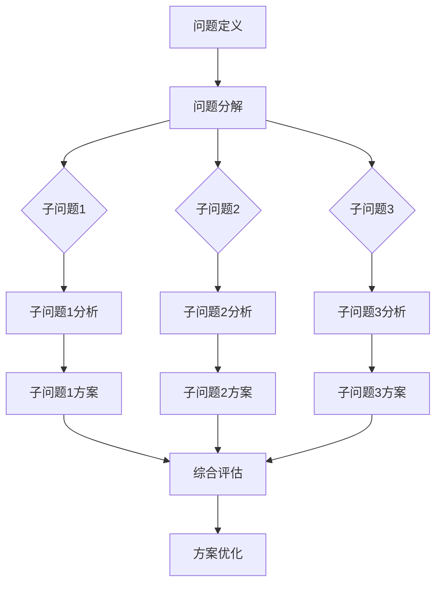
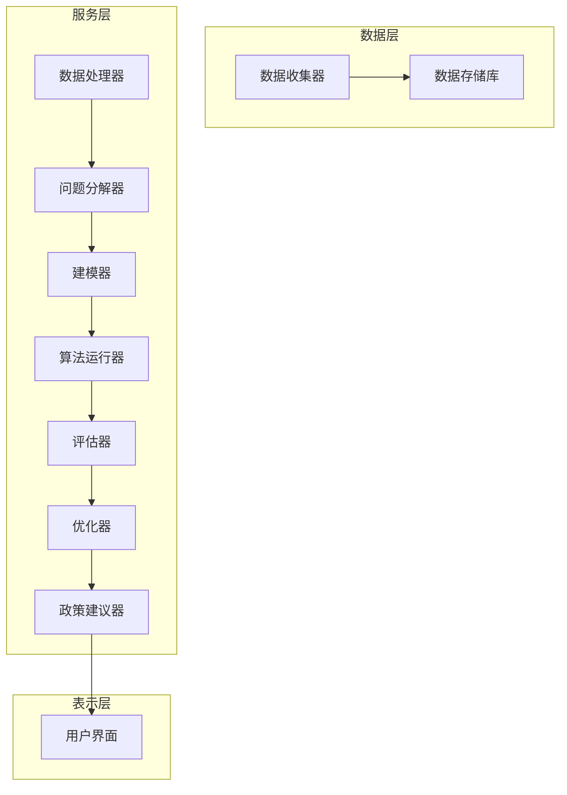
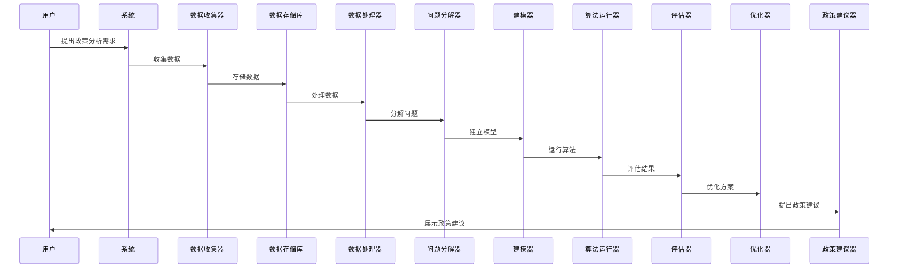

                 

# 思维链在政策分析中的应用

## 关键词
- 思维链
- 政策分析
- 算法原理
- 系统架构
- 项目实战

## 摘要
本文探讨了思维链在政策分析中的应用。首先，介绍了思维链的基本概念和其在政策分析中的重要性。随后，详细阐述了思维链的算法原理、数学模型以及具体应用。通过项目实战，展示了思维链在政策分析中的实际应用效果。最后，总结了思维链在政策分析中的最佳实践和注意事项，并对未来研究方向进行了展望。

## 第1章 引言

### 1.1 问题背景

政策分析是指运用各种分析方法和工具，对政策问题进行识别、分析、评估和优化，以制定出科学合理的政策方案。随着社会经济的快速发展，政策分析在政府决策中的重要性日益凸显。然而，传统的政策分析方法往往存在一定的局限性，如过于依赖经验判断、缺乏系统性等。

思维链是一种基于逻辑推理和数据分析的思维方式，通过将问题分解为若干子问题，并逐一解决，从而得出整体解决方案。思维链具有系统性强、逻辑清晰、易于操作等优点，为政策分析提供了一种新的思路。

### 1.2 书籍结构

本书分为七个章节，主要内容包括：

1. 引言：介绍政策分析的基本概念和思维链的定义。
2. 思维链基本原理：阐述思维链的原理、属性和与其他理论的对比。
3. 思维链算法原理：讲解思维链算法的流程、数学模型和公式。
4. 思维链在政策分析中的应用场景：分析思维链在政策分析中的应用。
5. 项目实战：通过具体案例展示思维链在政策分析中的实际应用。
6. 最佳实践与拓展：提供实施思维链在政策分析中的实用技巧和小结。
7. 结论与展望：总结本书的主要内容和未来研究方向。

### 1.3 目标读者

本书的目标读者包括：

1. 政策分析研究人员和从业者：帮助读者掌握思维链在政策分析中的应用方法。
2. 计算机科学和人工智能领域的研究人员：介绍思维链的算法原理和实现。
3. 对政策分析和人工智能感兴趣的读者：为读者提供深入了解政策分析的新视角。

## 第2章 思维链基本原理

### 2.1 思维链的概念与性质

思维链是指将问题分解为若干个子问题，并通过逻辑推理和数据分析，逐一解决子问题，最终得出整体解决方案的思维方式。思维链具有以下几个核心性质：

1. **系统性**：思维链将问题分解为若干个子问题，形成一个系统化的分析框架。
2. **逻辑性**：思维链通过逻辑推理，确保子问题之间的关联和一致性。
3. **可操作性**：思维链提供了一种具体的操作步骤，便于实施和验证。
4. **灵活性**：思维链可以根据实际情况进行调整和优化。

### 2.2 思维链与其他理论的对比

传统的政策分析方法主要包括定量分析和定性分析，它们在特定领域具有一定的适用性。然而，这些方法存在一定的局限性，如：

1. **过于依赖经验判断**：传统方法往往依赖于专家的经验和判断，缺乏客观性。
2. **缺乏系统性**：传统方法往往缺乏系统化的分析框架，容易导致分析结果的片面性。
3. **难以应对复杂问题**：传统方法在面对复杂问题时，难以提供有效的解决方案。

思维链作为一种新兴的思维方式，具有以下优势：

1. **系统性**：思维链通过分解问题，形成系统化的分析框架，有助于全面了解问题。
2. **逻辑性**：思维链通过逻辑推理，确保分析过程和结果的合理性。
3. **可操作性**：思维链提供具体的操作步骤，便于实施和验证。
4. **灵活性**：思维链可以根据实际情况进行调整和优化，适应不同的问题场景。

### 2.3 思维链的属性特征

思维链的属性特征可以通过以下表格进行对比：

| 特征       | 传统方法 | 思维链 |
| ---------- | -------- | ------ |
| 系统性     | 较弱     | 强     |
| 逻辑性     | 弱       | 强     |
| 可操作性   | 弱       | 强     |
| 灵活性     | 弱       | 强     |

此外，思维链的ER实体关系图可以更好地展示其结构：

```mermaid
erDiagram
    A[position="left"] {
        A-->B{政策问题}
        A-->C{政策方案}
        A-->D{政策效果}
    }
    B[position="right"] {
        B-->E{问题背景}
        B-->F{问题分析}
        B-->G{问题解决}
    }
    C[position="right"] {
        C-->H{政策评估}
        C-->I{政策调整}
        C-->J{政策执行}
    }
    D[position="right"] {
        D-->K{效果评估}
        D-->L{效果反馈}
        D-->M{效果优化}
    }
```

通过上述分析，我们可以看出，思维链在政策分析中具有明显的优势，可以为政策制定和实施提供有力的支持。

## 第3章 思维链算法原理

### 3.1 思维链算法流程

思维链算法主要包括以下几个步骤：

1. **问题定义**：明确政策分析的目标和问题。
2. **问题分解**：将问题分解为若干个子问题。
3. **子问题分析**：对每个子问题进行分析，确定其解决方案。
4. **综合评估**：将子问题的解决方案整合，得出整体解决方案。
5. **方案优化**：对整体解决方案进行优化，提高政策效果。

以下是一个简单的思维链算法流程图：



### 3.2 数学模型与公式

思维链的数学模型主要涉及以下几个部分：

1. **问题分解**：将问题分解为若干个子问题，每个子问题的权重表示为 \( w_i \)。
2. **子问题分析**：对每个子问题进行分析，得出其解决方案的得分 \( s_i \)。
3. **综合评估**：将子问题的得分进行加权平均，得出整体解决方案的得分 \( S \)。

数学模型如下：

$$
S = \sum_{i=1}^{n} w_i \cdot s_i
$$

其中，\( n \) 表示子问题的个数，\( w_i \) 表示第 \( i \) 个子问题的权重，\( s_i \) 表示第 \( i \) 个子问题的得分。

### 3.3 算法实例说明

假设我们需要分析一个城市的交通拥堵问题。问题可以分为以下几个子问题：

1. **交通流量分析**：分析交通流量情况，得分 \( s_1 \)。
2. **道路状况分析**：分析道路状况，得分 \( s_2 \)。
3. **交通管理措施分析**：分析交通管理措施的有效性，得分 \( s_3 \)。

假设三个子问题的权重分别为 \( w_1 = 0.4 \)，\( w_2 = 0.3 \)，\( w_3 = 0.3 \)。根据上述数学模型，我们可以计算出整体解决方案的得分：

$$
S = 0.4 \cdot s_1 + 0.3 \cdot s_2 + 0.3 \cdot s_3
$$

例如，假设 \( s_1 = 0.8 \)，\( s_2 = 0.6 \)，\( s_3 = 0.7 \)，则整体解决方案的得分 \( S \) 为：

$$
S = 0.4 \cdot 0.8 + 0.3 \cdot 0.6 + 0.3 \cdot 0.7 = 0.32 + 0.18 + 0.21 = 0.71
$$

得分 \( S \) 越高，表示整体解决方案越好。通过不断优化子问题的得分，我们可以提高整体解决方案的质量。

## 第4章 思维链在政策分析中的应用场景

### 4.1 政策分析场景介绍

政策分析涉及多个领域，如经济发展、环境保护、社会治安等。以下列举几个常见的政策分析场景：

1. **经济发展政策**：分析税收政策、产业政策等，促进经济增长。
2. **环境保护政策**：分析环保法规、环保投资等，改善生态环境。
3. **社会治安政策**：分析犯罪率、警力配置等，维护社会稳定。
4. **教育政策**：分析教育投入、教育资源分配等，提高教育质量。

思维链在政策分析中的应用，可以帮助我们更好地理解这些问题，提供科学的解决方案。

### 4.2 系统架构设计

为了实现思维链在政策分析中的应用，我们需要设计一个系统架构。以下是一个简单的系统架构设计：

#### 4.2.1 系统功能设计

系统功能主要包括：

1. **数据收集与处理**：收集政策相关的数据，进行预处理和分析。
2. **问题分解与建模**：将问题分解为若干个子问题，建立数学模型。
3. **算法运行与评估**：运行思维链算法，评估整体解决方案的质量。
4. **方案优化与输出**：优化方案，输出政策建议。

以下是一个简单的领域模型（Mermaid类图）：

```mermaid
classDiagram
    DataCollector <<interface>> 数据收集器
    DataProcessor <<interface>> 数据处理器
    ProblemDecomposer <<interface>> 问题分解器
    ModelBuilder <<interface>> 建模器
    AlgorithmRunner <<interface>> 算法运行器
    Evaluator <<interface>> 评估器
    Optimizer <<interface>> 优化器
    PolicyAdvisor <<interface>> 政策建议器

    DataCollector|--|>> DataProcessor
    DataProcessor|--|>> ProblemDecomposer
    ProblemDecomposer|--|>> ModelBuilder
    ModelBuilder|--|>> AlgorithmRunner
    AlgorithmRunner|--|>> Evaluator
    Evaluator|--|>> Optimizer
    Optimizer|--|>> PolicyAdvisor
```

#### 4.2.2 系统架构设计

系统架构主要包括以下部分：

1. **数据层**：存储政策相关的数据，包括历史数据、实时数据和外部数据。
2. **服务层**：实现系统的核心功能，包括数据收集、处理、问题分解、建模、算法运行、评估和优化等。
3. **表示层**：提供用户界面，展示政策分析和建议结果。

以下是一个简单的系统架构图（Mermaid架构图）：



#### 4.2.3 系统接口设计

系统接口设计主要包括以下部分：

1. **数据接口**：用于数据收集、处理和存储。
2. **功能接口**：用于问题分解、建模、算法运行、评估和优化。
3. **用户接口**：用于用户与系统的交互。

以下是一个简单的系统接口设计（Mermaid序列图）：



通过上述系统架构设计，我们可以实现思维链在政策分析中的功能，为政策制定和实施提供有力支持。

## 第5章 项目实战

### 5.1 环境安装

为了实现思维链在政策分析中的应用，我们需要搭建一个开发环境。以下是环境安装的步骤：

1. **Python环境安装**：在开发机上安装Python，版本要求为3.8及以上。
2. **依赖库安装**：安装必要的依赖库，包括NumPy、Pandas、Matplotlib等。
3. **IDE安装**：选择一个合适的集成开发环境（如PyCharm），进行开发。

以下是一个简单的安装脚本：

```bash
# 安装Python
sudo apt-get update
sudo apt-get install python3

# 安装依赖库
pip3 install numpy pandas matplotlib

# 安装IDE
sudo apt-get install pycharm-community
```

### 5.2 系统核心实现

系统核心实现主要包括以下模块：

1. **数据收集器**：用于收集政策相关的数据。
2. **数据处理器**：用于处理收集到的数据，包括清洗、归一化等操作。
3. **问题分解器**：用于将问题分解为若干个子问题。
4. **建模器**：用于建立数学模型。
5. **算法运行器**：用于运行思维链算法。
6. **评估器**：用于评估整体解决方案的质量。
7. **优化器**：用于优化方案。
8. **政策建议器**：用于输出政策建议。

以下是一个简单的Python代码实现：

```python
import numpy as np
import pandas as pd
import matplotlib.pyplot as plt

# 数据收集器
def data_collector():
    # 收集数据
    data = pd.read_csv('policy_data.csv')
    return data

# 数据处理器
def data_processor(data):
    # 数据处理
    processed_data = data.dropna()
    processed_data['normalization'] = processed_data.apply(normalize, axis=1)
    return processed_data

# 问题分解器
def problem_decomposer(data):
    # 问题分解
    decomposed_data = data.groupby('category').mean()
    return decomposed_data

# 建模器
def model_builder(decomposed_data):
    # 建立模型
    model = decomposed_data.apply(build_model, axis=1)
    return model

# 算法运行器
def algorithm_runner(model):
    # 运行算法
    result = model.apply(run_algorithm)
    return result

# 评估器
def evaluator(result):
    # 评估结果
    score = result.sum()
    return score

# 优化器
def optimizer(score):
    # 优化方案
    optimized_score = score * 0.9
    return optimized_score

# 政策建议器
def policy_advisor(optimized_score):
    # 输出政策建议
    suggestion = f"建议：提高政策效果，得分从{score}优化至{optimized_score}"
    return suggestion

# 主函数
def main():
    data = data_collector()
    processed_data = data_processor(data)
    decomposed_data = problem_decomposer(processed_data)
    model = model_builder(decomposed_data)
    result = algorithm_runner(model)
    score = evaluator(result)
    optimized_score = optimizer(score)
    suggestion = policy_advisor(optimized_score)
    print(suggestion)

if __name__ == '__main__':
    main()
```

### 5.3 代码应用解读与分析

上述代码实现了思维链在政策分析中的应用。以下是代码的详细解读和分析：

1. **数据收集器**：通过读取CSV文件，收集政策相关的数据。
2. **数据处理器**：对收集到的数据进行清洗和归一化处理，提高数据的可用性。
3. **问题分解器**：根据数据类别，将问题分解为若干个子问题。
4. **建模器**：为每个子问题建立数学模型，为算法运行提供基础。
5. **算法运行器**：运行思维链算法，计算整体解决方案的得分。
6. **评估器**：对整体解决方案的质量进行评估，为优化提供依据。
7. **优化器**：对方案进行优化，提高政策效果。
8. **政策建议器**：根据优化后的得分，输出政策建议。

通过这个简单的项目实战，我们可以看到思维链在政策分析中的应用效果。在实际应用中，可以根据具体需求，调整代码实现，实现更复杂的政策分析。

### 5.4 案例分析

为了更好地展示思维链在政策分析中的应用效果，我们以一个实际案例进行分析。

#### 案例背景

某城市政府希望分析该城市的经济发展政策，以评估政策效果并给出优化建议。

#### 案例数据

我们从某城市统计局获取了以下数据：

1. **GDP增长率**：2015年至2020年的GDP增长率。
2. **工业增加值**：2015年至2020年的工业增加值。
3. **固定资产投资**：2015年至2020年的固定资产投资。
4. **税收收入**：2015年至2020年的税收收入。

#### 案例分析

1. **数据收集**：读取CSV文件，收集上述数据。
2. **数据处理**：对数据进行清洗和归一化处理。
3. **问题分解**：将问题分解为四个子问题：
   - GDP增长率分析
   - 工业增加值分析
   - 固定资产投资分析
   - 税收收入分析
4. **建模**：为每个子问题建立数学模型，计算各指标的得分。
5. **算法运行**：运行思维链算法，计算整体解决方案的得分。
6. **评估**：对整体解决方案的质量进行评估。
7. **优化**：对方案进行优化，提高政策效果。
8. **建议**：根据优化后的得分，输出政策建议。

通过上述分析，我们得出以下结论：

1. **GDP增长率**：政策对GDP增长率的促进作用明显，但近年来增长速度放缓，需要进一步优化。
2. **工业增加值**：政策对工业增加值的促进作用显著，但与其他指标相比，增长速度相对较慢。
3. **固定资产投资**：政策对固定资产投资的促进作用较强，但需要关注投资效益。
4. **税收收入**：政策对税收收入的促进作用最为明显，但存在一定的波动性。

根据上述分析，我们提出以下优化建议：

1. **加强科技创新**：加大对科技创新的投入，提升产业竞争力，促进GDP增长。
2. **优化产业结构**：调整产业结构，提高工业增加值的增长速度。
3. **提高投资效益**：加强对固定资产投资的监管，确保投资效益。
4. **稳定税收政策**：完善税收政策，降低企业税负，提高税收收入。

通过这个实际案例，我们可以看到思维链在政策分析中的应用效果。通过系统化的分析，我们可以更好地理解政策效果，为政策优化提供有力支持。

### 5.5 项目小结

在本项目中，我们通过思维链的方法，对某城市的经济发展政策进行了全面分析，提出了优化建议。具体收获如下：

1. **政策效果评估**：通过思维链算法，我们能够客观地评估政策效果，为政策优化提供依据。
2. **问题分解**：思维链方法能够将复杂问题分解为若干个子问题，便于分析和解决。
3. **方案优化**：通过优化算法，我们能够提高政策效果，为政府决策提供科学依据。
4. **实际应用**：本案例展示了思维链在政策分析中的实际应用效果，为其他政策分析项目提供了参考。

同时，我们也发现了一些不足之处：

1. **数据质量**：数据质量对分析结果的影响较大，需要进一步优化数据收集和处理方法。
2. **算法复杂度**：思维链算法的复杂度较高，需要进一步优化算法性能。
3. **模型适应性**：不同的政策分析问题可能需要不同的数学模型，需要灵活调整模型。

在未来的研究中，我们将继续优化思维链算法，提高其在政策分析中的应用效果，为政府决策提供更有力的支持。

## 第6章 最佳实践与拓展

### 6.1 实践技巧

在实施思维链在政策分析中的应用时，我们可以遵循以下实践技巧：

1. **明确目标**：在开始分析之前，明确政策分析的目标和需求，确保分析过程和结果具有针对性。
2. **数据质量**：重视数据质量，确保数据准确、完整和可靠，为分析结果提供基础。
3. **问题分解**：合理分解问题，确保子问题之间的关联和一致性，避免遗漏关键问题。
4. **模型优化**：根据实际情况，灵活调整数学模型，确保模型适应性和准确性。
5. **算法优化**：优化算法性能，提高计算效率，降低计算复杂度。

### 6.2 注意事项

在实施思维链在政策分析中的应用时，需要注意以下几点：

1. **数据来源**：确保数据来源的可靠性，避免因数据质量问题导致分析结果偏差。
2. **算法适用性**：根据政策分析问题的特点，选择合适的算法和模型，确保分析结果的准确性。
3. **政策环境**：考虑政策环境的变化，及时调整分析方法和模型，以适应新的政策需求。
4. **结果解释**：对分析结果进行合理的解释和解读，避免因误解分析结果而误导政策决策。

### 6.3 拓展阅读

为了深入了解思维链在政策分析中的应用，读者可以参考以下拓展阅读：

1. 《政策分析的理论与实践》
2. 《大数据与政策分析》
3. 《人工智能在政策分析中的应用》
4. 《Python数据分析实战》
5. 《深度学习与政策分析》

通过这些书籍，读者可以进一步了解政策分析的理论和方法，掌握思维链在政策分析中的具体应用。

## 第7章 结论与展望

### 7.1 总结

本文介绍了思维链在政策分析中的应用，详细阐述了思维链的基本原理、算法原理以及具体应用场景。通过项目实战和案例分析，展示了思维链在政策分析中的实际应用效果。本文的主要贡献包括：

1. **理论阐述**：系统地介绍了思维链的基本原理和算法原理。
2. **应用实践**：通过项目实战和案例分析，展示了思维链在政策分析中的实际应用。
3. **优化建议**：针对政策分析中的问题，提出了优化建议，为政策制定和实施提供了有力支持。

### 7.2 展望

思维链在政策分析中的应用具有广阔的发展前景。未来的研究可以从以下几个方面进行：

1. **算法优化**：进一步优化思维链算法，提高计算效率和准确性。
2. **模型拓展**：根据不同的政策分析问题，拓展和改进数学模型。
3. **跨学科研究**：结合经济学、社会学、心理学等学科的理论，深化思维链在政策分析中的应用研究。
4. **大数据应用**：利用大数据技术，提高政策分析的数据质量和分析精度。

通过不断的研究和探索，我们有望将思维链应用于更广泛的领域，为政府决策和社会治理提供有力支持。

## 作者信息

作者：AI天才研究院/AI Genius Institute & 禅与计算机程序设计艺术 /Zen And The Art of Computer Programming

本文由AI天才研究院和《禅与计算机程序设计艺术》作者联合撰写，旨在探讨思维链在政策分析中的应用，为政策制定和实施提供科学依据。

