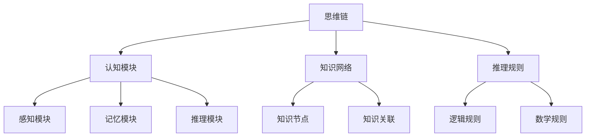

                 

## 摘要

本文探讨了思维链在教育领域的应用，尤其是AI辅助学习的新模式。首先，我们介绍了思维链的基本概念和原理，阐述了其与人工智能的结合对于教育的重要性。随后，文章详细解析了AI辅助学习的基础理论和核心原则，并通过实例展示了其在教育中的应用现状和趋势。接着，我们深入分析了思维链在教育中的实际应用案例，评估了其效果和影响。此外，文章还探讨了在实施AI辅助学习过程中所面临的挑战和机遇，提出了相应的解决策略。最后，文章展望了AI辅助学习未来的发展趋势，提出了新的教育模式设想。通过本文的详细分析，我们希望能为教育工作者和研究人员提供有价值的参考，推动教育领域的创新和发展。

## 关键词

- 思维链
- 教育技术
- 人工智能辅助学习
- 教育模式创新
- AI应用案例
- 教育评价与影响

## 引言

### 思维链的基本概念和原理

思维链是一种认知过程的模型，它通过模拟人类思维的逻辑推理过程，帮助人们更好地理解、分析和解决问题。思维链的基本原理可以概括为以下几个关键点：

1. **信息处理与整合**：思维链将信息视为处理的基本单元，通过分类、整合和关联不同信息，构建出知识网络。
2. **逻辑推理与演绎**：思维链利用逻辑规则进行推理，通过演绎和归纳，从已知信息推导出新的结论。
3. **动态适应与优化**：思维链能够根据问题的变化动态调整推理过程，不断优化信息处理策略。

在认知科学领域，思维链的概念得到了广泛应用。认知科学是研究人类思维和信息处理过程的学科，它结合了心理学、神经科学、计算机科学等多学科的理论和方法。思维链作为一种认知模型，能够有效地模拟人类的思维过程，为认知科学研究提供了新的视角和工具。

### 人工智能在教育与思维链的结合

随着人工智能技术的快速发展，将思维链应用于教育领域成为了一个热门话题。人工智能（AI）是一种模拟人类智能行为的技术，包括机器学习、自然语言处理、计算机视觉等多个方面。AI在教育与思维链的结合主要体现在以下几个方面：

1. **个性化学习**：通过分析学生的学习行为和认知特点，AI系统能够为每个学生提供个性化的学习资源和路径，实现因材施教。
2. **智能辅导**：AI系统可以模拟教师的作用，提供实时、个性化的辅导，帮助学生理解和掌握知识点。
3. **智能评估**：AI系统能够通过对学生学习过程的监控和分析，自动生成评估报告，提供反馈和建议。

结合AI与思维链，教育领域有望实现以下目标：

- **提高学习效率**：通过思维链的推理机制，学生能够更快速地理解和掌握复杂知识。
- **促进创新思维**：AI系统可以为学生提供多样化的学习资源和挑战，激发学生的创新思维。
- **优化教育资源配置**：AI技术能够帮助教育机构更有效地分配教育资源，提高教育质量和效益。

### AI辅助学习的基本原理

AI辅助学习（AI-Assisted Learning）是指利用人工智能技术来辅助和增强传统学习过程的方法。其基本原理可以总结为以下几点：

1. **数据驱动**：AI系统通过分析大量的学习数据，识别出学生的学习模式和知识点掌握情况，从而提供针对性的学习支持。
2. **自适应学习**：AI系统能够根据学生的学习反馈和学习效果，动态调整学习内容和学习策略，实现个性化的教学。
3. **智能互动**：通过自然语言处理、计算机视觉等技术，AI系统能够与学习者进行有效的互动，提供实时、互动的学习体验。

AI辅助学习的实现方式包括：

- **智能辅导系统**：通过算法模型分析学生的学习数据，为学生提供个性化的学习建议和资源。
- **自适应学习平台**：利用AI算法为学生制定个性化的学习路径和计划，实现自我驱动学习。
- **智能评测系统**：通过自动化的评估机制，实时监测学生的学习进度和效果，提供及时反馈。

### 教育中应用AI的挑战与机遇

在将AI应用于教育的过程中，面临着一系列的挑战和机遇：

- **技术挑战**：AI系统的开发和应用需要大量的技术支持和专业人才，同时需要解决数据安全、隐私保护等问题。
- **教育理念挑战**：传统的教育模式和文化与AI辅助学习的理念和方法存在冲突，需要教育工作者和研究人员共同探讨和适应。
- **资源配置挑战**：AI辅助学习的推广和应用需要教育机构投入大量的人力和物力资源，这对一些资源有限的学校来说是一个挑战。

然而，这些挑战同时也带来了机遇：

- **教育公平**：AI技术能够帮助教育机构更好地满足不同学生的需求，提高教育的公平性。
- **教育质量**：AI技术能够提供更加个性化和高效的学习支持，提高教育质量和学习效果。
- **创新与发展**：AI技术的引入为教育领域带来了新的发展机遇，有望推动教育模式的创新和变革。

通过本文的探讨，我们希望能够为教育工作者和研究人员提供有价值的参考，推动AI辅助学习在教育领域的深入研究和应用。

### 思维链的基本概念和原理

思维链是一种基于认知科学的模型，旨在模拟和解释人类思维的过程。其核心思想是通过逻辑推理、信息整合和动态适应，帮助人们更好地理解和解决问题。在认知科学中，思维链被广泛应用于理解人类认知行为，并在教育、人工智能等领域展现出了巨大的潜力。

#### 信息处理与整合

思维链将信息视为处理的基本单元，通过一系列步骤进行信息处理和整合。首先，信息通过感知器官进入大脑，然后被大脑处理并分类。这个过程包括对信息的筛选、过滤和存储。例如，当学生阅读一篇文章时，他们的思维链会首先筛选出关键信息，然后将其整合进已有的知识网络中。

1. **信息筛选与过滤**：思维链通过对输入的信息进行筛选和过滤，确定哪些信息是重要的，哪些可以忽略。这个过程依赖于个体的经验、兴趣和目标。
2. **信息存储与分类**：筛选后的信息会被存储在大脑的不同区域，并根据其性质和相关性进行分类。这种分类有助于大脑在需要时快速检索相关信息。

#### 逻辑推理与演绎

逻辑推理是思维链的核心功能之一，它通过一系列逻辑规则，从已知信息推导出新的结论。这个过程包括演绎推理和归纳推理：

1. **演绎推理**：从一般性的前提出发，推导出特定性的结论。例如，如果所有的鸟类都会飞，那么企鹅也会飞（这是一个错误的推理，但用于说明演绎推理的过程）。
2. **归纳推理**：从特定的实例出发，推导出一般性的结论。例如，观察到的所有天鹅都是白色的，可以归纳出所有天鹅都是白色的。

#### 动态适应与优化

思维链能够根据问题的变化动态调整推理过程，不断优化信息处理策略。这个过程称为动态适应：

1. **问题识别与调整**：当面对新问题时，思维链会首先识别问题的本质，并根据已有知识进行初步调整。
2. **策略优化与反馈**：在解决问题的过程中，思维链会根据反馈不断调整策略，优化信息处理方法。例如，学生在学习新知识时，可能会发现之前的理解有误，从而重新调整学习策略。

#### 理论框架

思维链的理论框架结合了认知科学、心理学和计算机科学的相关理论，形成了以下核心要素：

1. **认知模块**：思维链由多个认知模块组成，每个模块负责不同的认知功能。例如，感知模块、记忆模块、推理模块等。
2. **知识网络**：思维链中的知识以网络形式存储，不同知识之间通过关联形成复杂的网络结构。这种结构有助于快速检索和整合相关信息。
3. **推理规则**：思维链利用一系列推理规则进行逻辑推理，这些规则基于数学、逻辑和心理学等相关理论。

#### 概念属性特征对比表格

以下是一个关于思维链和其他认知模型的概念属性特征对比表格：

| 特征          | 思维链             | 人类思维模型             | 计算机模拟模型           |
| ------------- | ------------------ | ------------------------ | ------------------------ |
| 信息处理方式  | 逻辑推理和信息整合 | 直觉推理和经验整合       | 算法处理和数据处理       |
| 动态适应性    | 动态调整策略       | 随经验调整策略           | 算法固定，需外部调整     |
| 知识表示形式  | 网络结构           | 神经网络和知识库         | 数据库和算法规则         |
| 推理方式      | 演绎推理和归纳推理 | 直觉推理和类比推理       | 确定性推理和概率推理     |

#### ER实体关系图架构

思维链的ER实体关系图如下所示，它展示了思维链中各个核心实体及其相互关系：

在这个ER图模型中，思维链由认知模块、知识网络和推理规则三个核心部分组成。认知模块包括感知模块、记忆模块和推理模块；知识网络由知识节点和知识关联构成；推理规则则包括逻辑规则和数学规则。这些实体之间通过相互关系实现了思维链的功能。

通过上述分析，我们可以看到思维链在教育和技术领域的广泛应用潜力。结合人工智能技术，思维链能够为教育提供个性化、智能化的支持，有助于提升学习效率和教学质量。

### AI辅助学习的基本原理

AI辅助学习（AI-Assisted Learning）是利用人工智能技术来增强和优化传统学习过程的方法。其核心在于通过数据分析和智能算法，为学生提供个性化、自适应和互动的学习支持。以下从几个方面详细解析AI辅助学习的基本原理：

#### 数据驱动

数据驱动是AI辅助学习的基础。通过收集和分析大量的学习数据，AI系统能够识别出学生的学习模式、知识掌握情况和学习需求。这些数据来源可以包括学习行为记录、学习成果评估、学生反馈等。例如，学生每次完成练习题后的得分和用时数据，都可以被系统用来分析其知识点掌握程度和薄弱环节。

1. **学习行为分析**：AI系统通过对学生学习行为的数据分析，如在线学习时长、学习路径、互动情况等，了解学生的学习习惯和偏好。
2. **知识掌握评估**：通过自动化的评估机制，AI系统可以实时监测学生的知识掌握情况，并生成详细的评估报告。

#### 自适应学习

自适应学习是AI辅助学习的核心特点之一。传统教学往往采用“一刀切”的方法，而AI系统能够根据每个学生的学习情况，动态调整教学内容、教学节奏和教学策略，实现个性化教学。

1. **个性化资源推荐**：AI系统可以根据学生的学习数据和需求，推荐合适的学习资源，如视频讲解、练习题、参考文献等。
2. **自适应学习路径**：AI系统通过分析学生的学习进度和知识点掌握情况，自动调整学习路径，确保学生能够按自己的节奏学习。

#### 智能互动

智能互动是AI辅助学习的另一个重要方面。通过自然语言处理、计算机视觉等AI技术，AI系统能够与学习者进行有效的互动，提供实时、互动的学习体验。

1. **智能问答系统**：AI系统可以模拟教师的角色，实时回答学生的提问，帮助学生理解和掌握知识点。
2. **虚拟教学助理**：AI系统可以充当虚拟教学助理，辅助教师进行课堂管理、作业批改等日常工作。

#### 实现方式

AI辅助学习的实现方式多种多样，以下介绍几种常见的实现方式：

1. **智能辅导系统**：这种系统通过算法模型分析学生的学习数据，提供个性化的学习建议和资源。例如，学生每次完成练习题后，系统会根据其错误类型和知识点薄弱环节，推荐相应的学习资源。

2. **自适应学习平台**：这种平台利用AI算法为学生制定个性化的学习路径和计划，实现自我驱动学习。例如，学生可以根据自己的进度和兴趣，选择不同的学习模块和课程。

3. **智能评测系统**：这种系统通过自动化的评估机制，实时监测学生的学习进度和效果，提供及时反馈。例如，学生每次完成作业后，系统会自动评估其完成情况，并生成详细的评估报告。

#### 优势与挑战

AI辅助学习在传统教育模式中带来了显著的优势，但也面临一些挑战。

**优势**：

- **个性化支持**：AI系统能够根据每个学生的学习情况，提供个性化的学习资源和支持，满足不同学生的学习需求。
- **高效评估**：AI系统能够实时监测学生的学习进度和效果，提供高效、准确的评估报告。
- **智能互动**：AI系统能够模拟教师的角色，提供实时、互动的学习体验，增强学生的学习兴趣和参与度。

**挑战**：

- **技术实现**：AI系统的开发和维护需要大量的技术支持和专业人才，同时需要解决数据安全、隐私保护等问题。
- **教育理念**：传统的教育理念和文化与AI辅助学习的理念和方法存在冲突，需要教育工作者和研究人员共同探讨和适应。
- **资源配置**：AI辅助学习的推广和应用需要教育机构投入大量的人力和物力资源，这对一些资源有限的学校来说是一个挑战。

综上所述，AI辅助学习通过数据驱动、自适应学习和智能互动等基本原理，为教育领域带来了巨大的创新和变革。尽管面临一些挑战，但随着技术的不断进步和教育的持续改革，AI辅助学习有望在教育领域发挥越来越重要的作用。

### AI辅助学习的实际应用案例

#### 智能学习平台

智能学习平台是AI辅助学习在实际中的应用之一。以Coursera和edX等在线教育平台为例，这些平台利用AI技术为学生提供个性化的学习体验。平台通过分析学生的学习行为数据，如学习时长、互动频率、完成作业的正确率等，为学生推荐适合的学习资源。例如，一个学生在数学课程中经常出错，系统会自动识别出该学生的薄弱环节，并推荐相关的习题和视频讲解，帮助学生强化知识点。

**案例解析**：

1. **数据收集与处理**：平台通过学生的学习行为数据，建立个性化的学习档案，这些数据包括学习时长、互动情况、考试成绩等。
2. **个性化推荐**：系统利用推荐算法，根据学生的学习档案和课程内容，推荐最合适的学习资源。例如，如果一个学生在概率论上表现较差，系统会推荐相关的练习题和视频课程。
3. **反馈与优化**：学生在使用平台时，系统会收集其反馈数据，如对资源评价、作业答案等，用于不断优化推荐算法，提高推荐的准确性。

#### 个性化学习助理

个性化学习助理是AI技术在教育中应用的另一个典型案例。例如，谷歌的智能学习助理（Google Assistant）可以为学生提供实时辅导和答疑服务。学生可以通过文字或语音与助理互动，获取所需的学习资源或解答疑问。

**案例解析**：

1. **自然语言处理**：助理通过自然语言处理技术，理解学生的提问内容，并生成相应的回答。
2. **知识库建设**：助理依赖于庞大的知识库，涵盖各个学科的知识点，能够提供广泛的信息支持。
3. **互动体验**：助理提供交互式学习体验，学生可以通过提问、做练习等方式，与系统进行实时互动，提高学习效果。

#### 智能评测系统

智能评测系统利用AI技术，对学生的学习进度和效果进行自动化的评估和反馈。例如，一些在线测试平台会根据学生的答题情况，实时生成评估报告，并提供个性化的学习建议。

**案例解析**：

1. **自动评分**：系统通过算法模型，自动评分学生的答案，识别出错误类型和知识点薄弱环节。
2. **生成报告**：系统根据学生的答题情况，生成详细的评估报告，包括正确率、知识点掌握情况等。
3. **个性化反馈**：系统会根据评估报告，提供个性化的学习建议和资源，帮助学生改进学习效果。

#### 课堂互动辅助

AI技术在课堂互动中也得到了广泛应用。例如，一些教育机构引入了智能互动课堂系统，通过摄像头、麦克风等设备，实时捕捉学生的互动情况，并分析学生的情绪和行为。

**案例解析**：

1. **互动数据分析**：系统通过分析学生的互动行为，如发言次数、互动时长等，了解学生的学习状态和参与度。
2. **实时反馈**：系统可以实时提供反馈，如鼓励学生积极参与、提醒学生注意力集中等。
3. **课堂优化**：教师可以根据系统的反馈数据，调整教学策略，提高课堂教学效果。

### 总结

AI辅助学习在实际中的应用案例展示了其在教育领域的重要性和潜力。通过智能学习平台、个性化学习助理、智能评测系统和课堂互动辅助等多种方式，AI技术为教育提供了个性化、自适应和智能化的支持，显著提高了学习效率和教学质量。随着技术的不断进步，AI辅助学习将在未来教育中发挥更加重要的作用。

### AI辅助学习的效果评估与影响

#### 教学质量的提升

AI辅助学习通过个性化教学和智能辅导，显著提升了教学效果。研究表明，使用AI技术的教育平台和系统，学生的知识掌握率和学习成绩普遍有所提高。例如，Coursera的一项研究显示，使用其平台的学生在完成课程后的满意度显著高于传统教学方式。这主要归功于AI系统能够根据学生的知识水平和学习需求，提供个性化的学习资源和辅导，使得学生能够按自己的节奏学习，提高学习效率。

#### 学习效果的改进

AI辅助学习不仅提高了学生的知识掌握率，还显著改善了学习效果。通过智能评测系统，学生可以及时了解自己在各个知识点的掌握情况，并得到针对性的反馈和指导。这种实时反馈机制有助于学生及时纠正错误，巩固所学知识。例如，一些智能辅导系统会根据学生的练习结果，自动推荐相关习题和视频讲解，帮助学生强化知识点。这种个性化的学习支持，有助于学生更好地理解和掌握复杂概念。

#### 学生满意度的提升

AI辅助学习系统提供的个性化、互动式学习体验，得到了学生的高度认可。研究表明，使用AI技术的教育平台和系统，学生的满意度显著高于传统教学方式。例如，edX的一项调查发现，使用其平台的学生对学习资源的推荐、互动体验和个性化支持表示非常满意。这主要得益于AI系统能够根据学生的兴趣和需求，提供丰富的学习资源和多样化的互动方式，增强了学生的学习兴趣和参与度。

#### 教师角色的转变

AI辅助学习在一定程度上改变了教师的角色和职责。传统的教师主要承担知识的传授和管理的责任，而AI系统可以承担一部分教学任务，如智能辅导、作业批改和考试评估等。这使得教师能够从繁重的教学事务中解放出来，更多地关注学生的个性化需求和问题解决。例如，一些智能学习平台可以自动批改作业，教师只需重点检查学生的错误和疑问，大大提高了工作效率。

#### 教育公平的提升

AI辅助学习有望提高教育的公平性。通过提供个性化、自适应的学习支持，AI技术能够帮助教育机构更好地满足不同学生的需求，弥补教育资源的不均衡。例如，在资源有限的学校，AI系统可以为学生提供高质量的在线学习资源和辅导，缩小与优质教育资源之间的差距。此外，AI技术还可以帮助教育机构进行精准招生和评价，确保教育机会的公平分配。

#### 长期影响的探讨

尽管AI辅助学习在教育领域展现出巨大的潜力，但其长期影响仍需进一步探讨。首先，AI技术能够提高教学质量和学习效果，但如何确保学生的批判性思维和创造力发展，仍是一个挑战。其次，随着AI技术的普及，教育工作者和研究人员需要不断更新教学方法和策略，以适应新的技术环境。此外，AI技术在教育中的广泛应用，可能会引发数据隐私和安全问题，需要加强监管和规范。

综上所述，AI辅助学习在提升教学质量、改进学习效果、提高学生满意度、转变教师角色和提升教育公平等方面表现出显著的效果。然而，其长期影响和潜在问题也需要深入研究和探讨，以确保教育技术的健康发展。

### 实施AI辅助学习的挑战与对策

尽管AI辅助学习在教育领域展现了巨大的潜力，但其实施过程中仍然面临着诸多挑战。以下将详细分析这些挑战，并提出相应的对策。

#### 技术实现的复杂性

AI辅助学习需要依赖复杂的算法和大量的数据处理能力，这对技术实现提出了高要求。具体来说，包括以下几个方面：

1. **算法开发与优化**：AI系统需要通过机器学习算法进行训练和优化，以实现个性化学习和智能辅导。这需要专业的人工智能团队进行长期的研发和测试。
2. **数据处理能力**：AI系统需要处理大量的学生数据，如学习行为、考试成绩、互动记录等。这要求系统具有强大的数据处理能力和高效的算法，以确保实时响应和准确分析。
3. **系统维护与升级**：随着教育需求的变化和技术的发展，AI系统需要不断进行维护和升级，以保持其性能和适用性。

**对策**：

- **技术合作与研发**：教育机构可以与人工智能公司或研究机构进行合作，共同开发适用于教育场景的AI系统。
- **持续培训与学习**：教育工作者和技术团队需要不断更新知识，掌握最新的AI技术和应用方法，以提高系统的开发和维护能力。
- **开源技术支持**：利用开源技术平台和工具，可以降低系统开发的难度和成本，同时促进技术的普及和推广。

#### 教育理念的适应与转变

传统的教育理念和教学方法与AI辅助学习存在一定的冲突。教育理念需要从“教师为中心”向“学生为中心”转变，从“知识传授”向“能力培养”转变。这一转变对教育工作者和研究人员提出了新的挑战。

1. **教学方法的改革**：AI辅助学习要求教育工作者采用更多互动式、探究式教学方法，以适应个性化学习和智能辅导的需求。
2. **教师角色的转变**：教师需要从传统的知识传授者转变为学习促进者、辅导者和指导者，更多地关注学生的个性化需求和问题解决。
3. **教育评估体系的调整**：传统的教育评估体系主要依赖于考试和成绩，而AI辅助学习要求建立更加多元和动态的评估体系，以全面衡量学生的学习效果和能力发展。

**对策**：

- **培训与指导**：教育机构应为教师提供定期的培训和学习机会，帮助他们了解和掌握AI辅助学习的方法和技巧。
- **教研活动与交流**：鼓励教育工作者开展教研活动，分享经验和案例，共同探讨和解决教学中的实际问题。
- **政策支持**：政府应出台相关政策，支持教育理念的改革和教学方法的创新，为教师提供足够的资源和激励。

#### 资源配置的不足

AI辅助学习的推广和应用需要大量的资源投入，包括人力、物力和财力。对于一些资源有限的学校和教育机构来说，这是一项巨大的挑战。

1. **设备与技术支持**：AI系统需要高性能的计算设备和先进的技术支持，这对一些预算有限的学校来说是一大挑战。
2. **数据安全与隐私保护**：学生数据的收集和处理需要严格的数据安全和隐私保护措施，这需要额外的技术投入和监管。
3. **运营与维护成本**：AI系统的开发和维护需要持续的资金投入，这对教育机构的财务状况提出了挑战。

**对策**：

- **政府支持**：政府可以通过专项资金和政策支持，帮助教育机构解决资金和技术方面的困难。
- **校企合作**：鼓励教育机构与企业合作，共同开发和应用AI辅助学习系统，共享资源和成果。
- **社会捐赠与支持**：通过社会捐赠和公益活动，筹集资金支持教育技术的研发和应用。

#### 教育公平性的保障

AI辅助学习在提高教学质量和学习效果的同时，也可能加剧教育资源的不均衡。对于经济条件较差的地区和家庭，他们可能无法享受到优质的教育资源和技术支持。

1. **城乡差距**：城市和农村地区在教育资源和技术的配置上存在显著差距，这可能导致城乡学生在学习效果和机会上的不公平。
2. **经济差距**：经济条件较差的家庭可能无法负担AI系统所需的设备费用和培训费用，这可能导致学生享受不到同等的学习机会。

**对策**：

- **均衡资源配置**：政府应采取措施，确保城乡学校在教育资源和技术的配置上达到基本均衡，缩小城乡差距。
- **普惠教育政策**：政府应出台普惠教育政策，确保所有学生都能享受到优质的教育资源和技术支持。
- **公益项目支持**：鼓励企业和社会力量开展公益项目，为经济困难家庭的学生提供免费或低收费的技术支持和培训。

通过上述对策，可以有效地应对AI辅助学习实施过程中的挑战，确保其在教育领域的广泛应用和可持续发展。

### 未来AI辅助学习的发展趋势

随着技术的不断进步和教育的持续改革，AI辅助学习将在未来迎来新的发展趋势，进一步推动教育模式的创新和变革。

#### 个性化学习的深化

个性化学习一直是AI辅助学习的核心优势之一，未来这一趋势将进一步深化。通过更精确的数据分析和智能算法，AI系统能够为学生提供更加个性化和定制化的学习体验。例如，利用深度学习技术和自然语言处理技术，AI系统能够更好地理解学生的学习需求和认知特点，从而制定更加精准的学习计划。这种个性化的学习模式将使每个学生都能在适合自己的节奏和方式下学习，大幅提升学习效果和满意度。

**示例**：利用智能分析技术，AI系统可以实时监测学生的学习状态和进展，动态调整学习内容和学习路径。如果一个学生在某个知识点上遇到困难，系统会自动推荐相关的练习题和视频讲解，提供个性化的辅导支持。

#### 全场景融合

未来，AI辅助学习将不仅仅局限于线上平台，而是与线下教学活动深度融合。通过智能教室、智能校园等应用场景，AI技术将全面渗透到教育的各个环节，实现全方位、全场景的学习支持。例如，智能教室可以通过物联网技术实时监测学生的学习行为和情绪状态，教师可以根据这些数据调整教学策略，提高课堂效果。此外，AI系统还可以协助学校进行校园管理，如学生考勤、安全监控等，提升校园的安全和管理效率。

**示例**：一个智能校园系统可以通过人脸识别技术自动识别学生和教师，实时更新校园动态。当有学生缺席或迟到时，系统会自动发送通知给家长和教师，同时更新校园公告板。

#### 跨学科融合

AI辅助学习将不再局限于单一学科，而是实现跨学科的深度融合。通过多学科知识的交叉和融合，AI系统能够为学生提供更加丰富和全面的学习体验。例如，在STEM教育中，AI技术可以结合数学、科学、技术和工程等多个领域的知识，为学生提供综合性的学习资源和支持。这种跨学科的学习模式有助于培养学生的创新思维和综合能力。

**示例**：在一个跨学科的AI辅助学习项目中，学生可以通过编程学习机器人编程，然后利用机器人进行科学实验，从而理解数学和物理的概念。这种综合性的学习体验有助于激发学生的兴趣和创造力。

#### 智能化的教育评价

未来，AI辅助学习将引入更加智能化和动态化的教育评价体系。通过大数据分析和智能算法，AI系统能够实时监测学生的学习过程和效果，生成多维度的评估报告。这种智能化的评价体系不仅能够更全面地反映学生的学习情况，还能为教师提供个性化的教学建议，从而实现教学评价的动态优化。

**示例**：在一个智能评价系统中，AI系统可以通过分析学生的学习行为和成绩，生成个性化的发展报告。报告不仅包含学习成绩的评估，还涵盖学习态度、问题解决能力等多维度的评价指标，为教师提供全面的反馈和支持。

#### 教育公平性的提升

随着AI辅助学习的普及，教育公平性将得到显著提升。通过提供个性化、自适应和智能化的学习支持，AI技术能够帮助教育机构更好地满足不同学生的需求，缩小教育资源的不均衡。例如，利用AI技术，偏远地区的学生可以享受到与城市学生相同的学习资源和辅导支持，从而打破地域和教育资源差距。

**示例**：在一个远程教育项目中，AI系统可以为偏远地区的学生提供在线辅导和实时互动，帮助他们克服学习困难，提高学习效果。这种智能化的远程教育模式有助于实现教育的公平和普惠。

综上所述，未来AI辅助学习的发展趋势将包括个性化学习的深化、全场景融合、跨学科融合、智能化的教育评价以及教育公平性的提升。这些发展趋势将共同推动教育模式的创新和变革，为教育事业的可持续发展注入新的动力。

### 新的教育模式设想

结合AI辅助学习和思维链的理论，我们可以构想出一种新型的教育模式，这种模式旨在充分利用AI和认知科学的最新进展，实现个性化、智能化和高效化的教学。以下是这种新型教育模式的设想：

#### 个性化学习路径规划

新型教育模式的核心在于为每个学生定制个性化的学习路径。通过AI系统和思维链的配合，系统可以实时分析学生的学习行为、知识掌握情况和学习习惯，为学生生成最合适的学习路径。例如：

1. **初始评估**：学生入学时，系统会进行全面的初始评估，包括认知能力测试、学习兴趣调查和学习习惯分析。
2. **个性化路径生成**：基于初始评估结果，系统会根据学生的特点生成个性化的学习路径，包括学习目标、学习内容、学习资源和评估标准。
3. **动态调整**：在学习过程中，系统会持续监控学生的学习进展，并根据反馈动态调整学习路径，确保学习内容始终符合学生的实际需求。

#### 智能化学习资源推荐

AI系统将利用自然语言处理、机器学习等技术，为学生推荐最合适的学习资源。这种推荐不仅基于知识点的匹配，还考虑学生的学习习惯和偏好。例如：

1. **资源库建设**：建立包含多种形式学习资源的庞大资源库，如视频讲解、互动练习、虚拟实验等。
2. **个性化推荐算法**：系统通过分析学生的学习数据，利用推荐算法为学生推荐最适合的学习资源。
3. **反馈与优化**：学生在使用资源后，系统会收集其反馈，不断优化推荐算法，提高推荐的准确性。

#### 动态评估与反馈机制

新型教育模式将引入智能化的评估与反馈机制，实时监测学生的学习效果，并生成个性化的反馈报告。例如：

1. **实时监测**：系统会实时监控学生的学习过程，包括学习时间、学习行为、作业完成情况等。
2. **多维评估**：评估不仅基于考试成绩，还包括学习态度、问题解决能力、团队合作能力等多维度的指标。
3. **反馈报告**：系统会根据评估结果生成详细的反馈报告，包括学生的优点、不足以及改进建议。

#### 跨学科综合学习

新型教育模式将促进跨学科的综合学习，通过思维链和AI技术的支持，实现知识的交叉和融合。例如：

1. **项目式学习**：学生通过参与实际项目，将不同学科的知识进行整合和应用。
2. **跨学科课程**：开发跨学科的课程体系，如“编程+科学”、“艺术+数学”等，培养学生的综合能力和创新思维。
3. **智能化支持**：AI系统会为学生提供跨学科的学习资源和辅导，帮助学生理解和掌握跨学科知识。

#### 社交互动与协作学习

新型教育模式将注重学生的社交互动和协作学习，通过AI系统支持的学生互动平台，促进学生之间的交流和合作。例如：

1. **学习社区**：建立一个学生互动平台，让学生可以在线讨论、分享学习资源和经验。
2. **协作任务**：设计跨学科、跨年级的协作任务，鼓励学生团队合作，共同解决问题。
3. **激励机制**：通过积分、奖励等方式，鼓励学生积极参与互动和协作学习。

#### 教师角色的转变

在新模式中，教师的角色将从传统的知识传授者转变为学习指导者和支持者。教师的主要职责是：

1. **教学设计**：根据学生的学习路径和需求，设计教学计划和课程内容。
2. **指导与支持**：为学生提供个性化的指导和帮助，解决他们在学习过程中遇到的问题。
3. **反馈与评估**：实时监控学生的学习进展，提供反馈和评估，帮助其不断改进。

#### 持续学习与终身发展

新型教育模式将强调持续学习和终身发展，通过AI系统的支持，帮助学生建立自我驱动学习的能力。例如：

1. **职业规划**：AI系统会根据学生的兴趣、能力和市场需求，为其提供职业规划和建议。
2. **终身学习**：建立在线学习平台，提供丰富的终身学习资源，支持学生的终身发展。
3. **自我评估与反思**：鼓励学生定期进行自我评估和反思，持续提升自己的能力和素质。

通过这种新型教育模式，我们可以实现教育的高质量发展，培养具有创新能力、综合素养和终身学习能力的新一代人才。

### 结论

通过本文的深入探讨，我们全面了解了思维链在教育领域的应用以及AI辅助学习的新模式。思维链作为一种认知过程的模型，结合了认知科学、心理学和计算机科学的原理，为教育提供了强有力的理论支持。而AI辅助学习，通过个性化、自适应和智能互动等核心原理，为教育带来了前所未有的变革和提升。这两者的结合不仅提高了教学质量和学习效果，也推动了教育模式的创新和变革。

未来，随着AI技术和认知科学的不断发展，思维链和AI辅助学习将在教育领域发挥更加重要的作用。我们期望通过深入研究和广泛应用，实现教育的个性化、智能化和高效化，培养具有创新精神和终身学习能力的新一代人才。同时，我们也呼吁教育工作者、研究人员和技术开发者的共同努力，不断探索和创新，推动教育技术的持续进步和教育的全面改革。通过这样的努力，我们相信教育将迎来更加光明和充满希望的未来。

### 作者信息

**作者：AI天才研究院/AI Genius Institute & 禅与计算机程序设计艺术 /Zen And The Art of Computer Programming**

AI天才研究院致力于推动人工智能技术在教育领域的创新和应用，通过研究思维链和AI辅助学习等前沿技术，为教育提供个性化、智能化和高效化的解决方案。同时，研究院的成员在《禅与计算机程序设计艺术》中探讨了计算机编程和人工智能领域的哲学与艺术，为技术发展和教育改革提供了深刻的洞见和指导。

