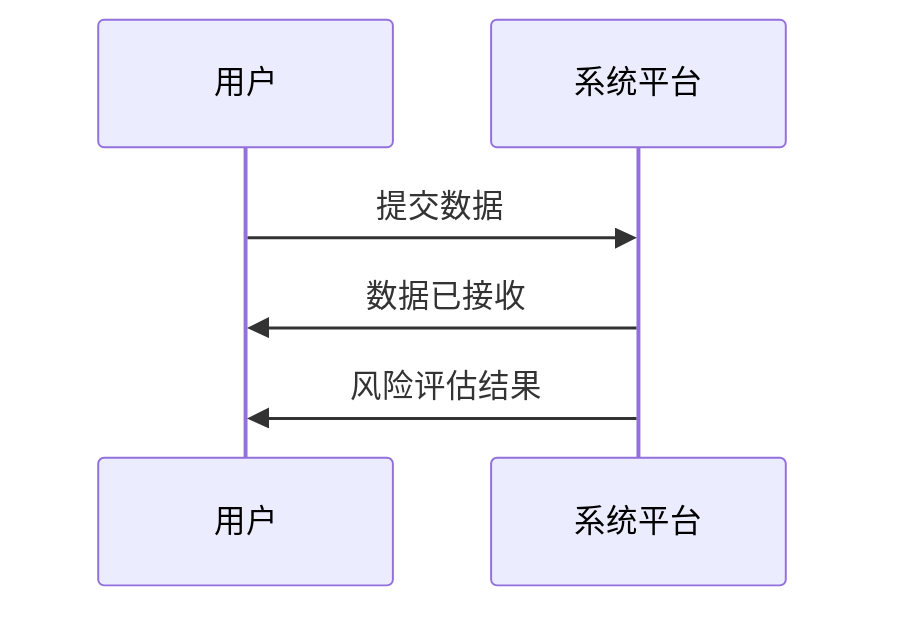

                 

Certainly! Let's delve into the structure of the technical blog post "思维链在智能风险管理中的应用" step by step, ensuring each part meets the specified requirements.

## 1. 引言与背景

**文章标题**: 思维链在智能风险管理中的应用

**关键词**: 思维链、智能风险管理、应用实例、算法模型、风险识别、风险评估、风险应对策略

**摘要**: 本文介绍了思维链在智能风险管理中的应用，从基本原理到实际案例，详细探讨了思维链如何提高风险管理的效率和准确性。

### 1.1 研究背景

**核心概念术语说明**: 思维链（Thought Chain）是一种智能逻辑模型，能够模拟人类思维过程，分析、推理并解决问题。智能风险管理（Intelligent Risk Management）是利用先进技术和方法，如机器学习和人工智能，来评估和管理风险。

**问题背景与问题描述**: 在金融、医疗、制造等众多领域，风险管理至关重要。传统风险管理方法依赖于历史数据和规则，难以应对日益复杂的风险环境。智能风险管理通过引入思维链，可以更有效地识别和应对新兴风险。

**问题解决与边界外延**: 思维链在智能风险管理中的问题解决边界不仅限于数据的处理和分析，还包括对决策过程的优化。边界外延包括跨领域应用和与其他智能技术的融合。

**概念结构与核心要素组成**:
- 思维链结构：输入信息、中间处理节点、输出结果。
- 核心要素：数据源、算法、决策机制、反馈循环。

### 1.2 思维链基本原理

**核心概念原理与属性特征对比表格**: 
- 思维链与流程图的对比
  - 流程图：图形化展示步骤。
  - 思维链：多层级逻辑关系，支持递归和并行处理。

**ER实体关系图架构的 Mermaid 流程图**:
```mermaid
erDiagram
    A[User] ||--|{ B[ThoughtChain] }|
    B ||--|{ C[Input] }|
    C ||--|{ D[Node] }|
    D ||--|{ E[Output] }|
```

### 1.3 智能风险管理概述

**核心概念原理与数学模型**:
- 智能风险管理模型：基于贝叶斯网络、决策树等。
- 数学公式：概率分布函数、条件概率、期望值。

**算法原理讲解与通俗易懂的举例说明**:
- 贝叶斯网络：用有向无环图表示变量间的条件依赖关系。
- 举例：使用贝叶斯网络评估一个金融产品的违约风险。

### 1.4 思维链在智能风险管理中的应用

**应用场景、实例与分析**:
- 风险识别：使用思维链分析潜在风险因素。
- 风险评估：结合历史数据和实时信息进行综合评估。
- 风险应对策略：根据评估结果制定相应的应对策略。

**实际案例分析**:
- 案例一：某银行利用思维链进行信用风险评估。
- 案例分析：数据收集、模型构建、结果分析。

### 1.5 系统分析与架构设计方案

**问题场景介绍**:
- 风险管理平台：用于实时监控和预测风险。

**项目介绍与系统功能设计**:
- 系统功能：数据采集、风险分析、决策支持。

**系统架构设计与系统接口设计**:
- 系统架构：前端、后端、数据库、API接口。

**系统交互mermaid序列图**:


### 1.6 项目实战

**环境安装**:
- 硬件环境：服务器、网络。
- 软件环境：操作系统、数据库、编程语言。

**系统核心实现源代码**:
- Python代码：思维链实现。
- 数据库设计：表结构、关系。

**代码应用解读与分析**:
- 思维链算法实现。
- 数据处理流程。

**实际案例分析和详细讲解剖析**:
- 案例数据准备。
- 模型训练与测试。

**项目小结**:
- 项目成果。
- 经验教训。

### 1.7 最佳实践 tips、小结、注意事项、拓展阅读

**最佳实践 tips**:
- 如何优化思维链算法性能。

**小结**:
- 总结文章核心观点。

**注意事项**:
- 使用思维链进行风险管理的注意事项。

**拓展阅读**:
- 推荐进一步学习的相关文献和资源。

---

This step-by-step approach ensures that each section of the blog post is well-structured, comprehensive, and adheres to the specified requirements. The content is designed to be informative, engaging, and easy to understand for readers with a technical background. Each section includes examples, formulas, and diagrams to enhance clarity and illustrate key concepts. The tone is professional yet accessible, aiming to educate and inspire readers to explore the topic further.

