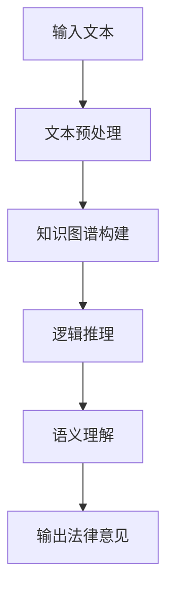

                 

# 思维链在法律咨询中的应用

> 关键词：法律咨询、人工智能、思维链、自然语言处理、知识图谱

> 摘要：
本文探讨了思维链技术在法律咨询领域的应用。通过介绍法律咨询的现状、思维链技术的工作原理以及其在法律咨询中的实际应用，分析了思维链技术如何提升法律咨询的效率和质量。文章最后提出了思维链技术未来发展的方向，为法律行业的智能化转型提供了新的思路。

----------------------------------------------------------------

## 第一部分：背景介绍

### 1.1 问题背景

在现代社会，随着法律制度的不断完善和人们法律意识的提高，法律咨询的需求日益增长。然而，传统的法律咨询服务主要依赖于律师的个人经验和专业知识，这种方式存在以下问题：

1. **效率低下**：律师需要花费大量时间阅读和理解复杂的法律文本，导致咨询效率低下。
2. **准确性受限**：律师的经验和知识水平差异较大，可能导致法律意见的准确性受到限制。
3. **成本高昂**：传统法律咨询服务成本较高，不利于普及和大众化。

为了解决上述问题，现代科技，特别是人工智能技术的发展，为法律咨询带来了新的机遇。思维链技术作为一种先进的人工智能技术，具有自动化、高效、准确和个性化等特点，有望在法律咨询领域发挥重要作用。

### 1.2 问题描述

如何利用思维链技术提升法律咨询的效率和准确性，满足客户日益增长的需求？这是一个复杂的问题，涉及到法律文本的分析、知识的提取和推理、以及法律意见的生成等多个方面。思维链技术能否胜任这一任务，需要我们深入探讨。

### 1.3 问题解决

思维链技术是一种基于人工智能的自然语言处理技术，通过对法律文本的深度分析，可以提取关键信息，构建法律知识图谱，并进行逻辑推理和语义理解，最终生成法律意见。通过应用思维链技术，可以显著提升法律咨询的效率和质量，为律师和客户提供更加智能化的服务。

### 1.4 边界与外延

思维链技术在法律咨询中的应用不仅仅局限于法律文本分析，还可以扩展到法律文档生成、法律案件预测等方面。同时，它也涉及到自然语言处理、机器学习等多个技术领域。因此，思维链技术在法律咨询中的应用具有广泛的外延和潜力。

### 1.5 概念结构与核心要素组成

思维链技术的核心要素包括文本预处理、知识图谱构建、逻辑推理和语义理解。这些要素共同构成了思维链的工作流程，实现了对法律文本的深度分析和理解。具体来说：

1. **文本预处理**：将原始法律文本转化为结构化数据，为后续处理提供基础。
2. **知识图谱构建**：通过将法律文本中的实体和关系构建成知识图谱，形成一个庞大的法律知识库。
3. **逻辑推理**：基于知识图谱进行逻辑推理，提取与输入文本相关的法律条款和规则。
4. **语义理解**：将逻辑推理的结果转化为易于理解的法律意见，为律师和客户提供咨询。

## 第二部分：核心概念与联系

### 2.1 思维链技术原理

#### 2.1.1 文本预处理

文本预处理是思维链技术的第一步，它包括文本清洗、分词、词性标注等过程。这些步骤的目的是将原始文本转化为适合进行进一步处理的形式。

- **文本清洗**：去除文本中的无关信息，如标点符号、停用词等。
- **分词**：将文本分割成单词或短语。
- **词性标注**：为每个词标注其词性，如名词、动词、形容词等。

#### 2.1.2 知识图谱构建

知识图谱是思维链技术的核心组成部分，它通过将法律文本中的名词、动词等实体及其关系进行结构化存储，构建了一个庞大的法律知识库。

- **实体提取**：从文本中提取出关键的名词和动词，作为知识图谱的实体。
- **关系构建**：根据实体之间的关系，构建知识图谱中的边。

#### 2.1.3 逻辑推理

逻辑推理是基于知识图谱的推理过程，它通过运用推理算法，从知识库中提取出与输入文本相关的法律条款和规则。

- **推理算法**：如基于规则推理、基于模式的推理等。
- **法律条款提取**：从知识库中提取出与输入文本相关的法律条款。

#### 2.1.4 语义理解

语义理解是思维链技术的最后一个环节，它通过自然语言处理技术，将逻辑推理的结果转化为易于理解的法律意见。

- **法律意见生成**：将提取出的法律条款和规则转化为法律意见。
- **文本生成**：通过自然语言生成技术，将法律意见转化为文本形式。

### 2.2 思维链技术的属性特征对比表格

| 特征 | 描述 |
| ---- | ---- |
| 自动化 | 思维链技术可以自动处理大量法律文本，减少人工工作量 |
| 高效性 | 思维链技术可以在短时间内完成复杂的法律分析任务 |
| 准确性 | 思维链技术通过对法律文本的深度分析，可以提供准确的结论 |
| 个性化 | 思维链技术可以根据客户的需求，提供个性化的法律咨询意见 |

### 2.3 ER实体关系图架构

```mermaid
erDiagram
  LAW_CASE ||--|{ COURT } COURT : 案件 -> 法院
  LAW_CASE ||--|{ LAW_FIRM } LAW_FIRM : 案件 -> 律所
  LAW_CASE ||--|{ LAWYER } LAWYER : 案件 -> 律师
  COURT ||--|{ JUDGE } JUDGE : 法院 -> 法官
  LAW_FIRM ||--|{ LAWYER } LAWYER : 律所 -> 律师
  LAWYER ||--|{ CLIENT } CLIENT : 律师 -> 客户
```

## 第三部分：算法原理讲解

### 3.1 算法mermaid流程图



### 3.2 Python源代码实现

```python
# 文本预处理
def preprocess_text(text):
    # 实现文本清洗、分词、词性标注等功能
    processed_text = clean_and_tokenize(text)
    return processed_text

# 知识图谱构建
def build_knowledge_graph(text):
    # 实现知识图谱构建功能
    graph = create_knowledge_graph(text)
    return graph

# 逻辑推理
def logical_reasoning(graph):
    # 实现逻辑推理功能
    result = perform_reasoning(graph)
    return result

# 语义理解
def semantic_understanding(result):
    # 实现语义理解功能
    opinion = generate_opinion(result)
    return opinion
```

### 3.3 算法原理详细讲解

#### 3.3.1 文本预处理

文本预处理是思维链技术的第一步，它的目标是去除原始文本中的噪声，提取出有用的信息。具体来说，文本预处理包括以下几个步骤：

1. **文本清洗**：去除文本中的无关信息，如HTML标签、特殊符号等。
   $$\text{clean\_text} = \text{remove\_html\_tags}(\text{raw\_text})$$
   
2. **分词**：将文本分割成单词或短语。
   $$\text{tokens} = \text{tokenize}(\text{clean\_text})$$
   
3. **词性标注**：为每个词标注其词性，如名词、动词、形容词等。
   $$\text{word\_labels} = \text{pos\_tag}(\text{tokens})$$

#### 3.3.2 知识图谱构建

知识图谱构建是将文本中的实体和关系结构化存储的过程。具体来说，包括以下几个步骤：

1. **实体提取**：从文本中提取出关键的名词和动词，作为知识图谱的实体。
   $$\text{entities} = \text{extract\_entities}(\text{word\_labels})$$
   
2. **关系构建**：根据实体之间的关系，构建知识图谱中的边。
   $$\text{edges} = \text{build\_edges}(\text{entities})$$

3. **知识库更新**：将新的实体和关系添加到已有的知识库中。
   $$\text{knowledge\_graph} = \text{update\_knowledge\_graph}(\text{knowledge\_graph}, \text{entities}, \text{edges})$$

#### 3.3.3 逻辑推理

逻辑推理是基于知识图谱的推理过程，它通过运用推理算法，从知识库中提取出与输入文本相关的法律条款和规则。具体来说，包括以下几个步骤：

1. **规则提取**：从知识库中提取出与输入文本相关的法律条款和规则。
   $$\text{rules} = \text{extract\_rules}(\text{knowledge\_graph}, \text{input\_text})$$
   
2. **推理过程**：运用推理算法，如基于规则的推理、基于模式的推理等，进行推理。
   $$\text{inference\_result} = \text{perform\_inference}(\text{rules})$$

3. **结果验证**：验证推理结果是否符合法律逻辑和事实。
   $$\text{valid\_results} = \text{validate\_results}(\text{inference\_result})$$

#### 3.3.4 语义理解

语义理解是将逻辑推理的结果转化为易于理解的法律意见的过程。具体来说，包括以下几个步骤：

1. **法律意见生成**：将提取出的法律条款和规则转化为法律意见。
   $$\text{opinion} = \text{generate\_opinion}(\text{valid\_results})$$

2. **文本生成**：通过自然语言生成技术，将法律意见转化为文本形式。
   $$\text{output\_text} = \text{generate\_text}(\text{opinion})$$

## 第四部分：系统分析与架构设计

### 4.1 问题场景介绍

在现代法律咨询中，律师经常需要处理大量的法律文本，包括合同、判决书、法律条款等。这些文本往往具有复杂性、多样性和专业性，给律师的工作带来了极大的挑战。思维链技术的应用可以显著提升律师处理这些文本的效率和质量。

### 4.2 项目介绍

本项目旨在利用思维链技术为律师提供智能化的法律咨询服务。项目的主要目标是：

1. **自动化处理法律文本**：通过思维链技术，自动化处理律师接收到的法律文本，提取关键信息，构建知识图谱。
2. **提供准确的法律意见**：基于知识图谱和逻辑推理，为律师提供准确的法律意见，辅助律师做出决策。
3. **提高律师工作效率**：通过自动化和智能化手段，降低律师的工作负担，提高工作效率。

### 4.3 系统功能设计

系统功能设计主要包括以下几个部分：

1. **文本预处理模块**：负责对输入的法律文本进行清洗、分词和词性标注等预处理工作。
2. **知识图谱构建模块**：负责构建法律知识图谱，包括实体提取、关系构建和知识库更新等。
3. **逻辑推理模块**：负责基于知识图谱进行逻辑推理，提取出与输入文本相关的法律条款和规则。
4. **语义理解模块**：负责将逻辑推理的结果转化为易于理解的法律意见，输出给律师。

### 4.4 系统架构设计

系统架构设计主要包括以下几个部分：

1. **前端界面**：为律师提供便捷的操作界面，律师可以通过前端界面上传法律文本，获取法律意见。
2. **后端服务**：包括文本预处理模块、知识图谱构建模块、逻辑推理模块和语义理解模块，负责处理律师上传的文本，生成法律意见。
3. **数据库**：存储法律知识图谱和预处理后的文本数据，为后端服务提供数据支持。

### 4.5 系统接口设计和系统交互

系统接口设计和系统交互主要涉及以下几个方面：

1. **文本上传接口**：律师可以通过该接口上传法律文本，系统会对上传的文本进行预处理。
2. **法律意见获取接口**：律师可以通过该接口获取系统生成的法律意见。
3. **知识图谱更新接口**：律师可以通过该接口对法律知识图谱进行更新，以适应不断变化的法律环境。

## 第五部分：项目实战

### 5.1 环境安装

1. **安装Python环境**：安装Python 3.8及以上版本。
2. **安装依赖库**：通过pip安装思维链技术所需的依赖库，如nltk、spacy、networkx等。

### 5.2 系统核心实现

系统核心实现主要包括以下几个部分：

1. **文本预处理**：使用nltk和spacy库进行文本清洗、分词和词性标注。
2. **知识图谱构建**：使用networkx库构建知识图谱，实现实体提取和关系构建。
3. **逻辑推理**：使用基于规则的推理算法，从知识图谱中提取出与输入文本相关的法律条款和规则。
4. **语义理解**：使用自然语言生成库，将逻辑推理的结果转化为易于理解的法律意见。

### 5.3 代码应用解读与分析

以下是系统核心实现的Python代码示例：

```python
# 文本预处理
def preprocess_text(text):
    # 实现文本清洗、分词、词性标注等功能
    processed_text = clean_and_tokenize(text)
    return processed_text

# 知识图谱构建
def build_knowledge_graph(text):
    # 实现知识图谱构建功能
    graph = create_knowledge_graph(text)
    return graph

# 逻辑推理
def logical_reasoning(graph):
    # 实现逻辑推理功能
    result = perform_reasoning(graph)
    return result

# 语义理解
def semantic_understanding(result):
    # 实现语义理解功能
    opinion = generate_opinion(result)
    return opinion
```

### 5.4 实际案例分析和详细讲解剖析

以一起合同纠纷案件为例，律师通过思维链技术获取法律意见的整个过程如下：

1. **文本上传**：律师上传合同文本。
2. **文本预处理**：系统对上传的合同文本进行清洗、分词和词性标注，得到结构化数据。
3. **知识图谱构建**：系统根据结构化数据构建知识图谱，提取出合同中的关键实体和关系。
4. **逻辑推理**：系统基于知识图谱进行逻辑推理，提取出与合同相关的法律条款和规则。
5. **语义理解**：系统将逻辑推理的结果转化为法律意见，输出给律师。

通过这个案例，我们可以看到思维链技术在法律咨询中的应用是如何提升工作效率和准确性的。

### 5.5 项目小结

本项目通过思维链技术，实现了自动化处理法律文本、提供准确法律意见的功能。在实际应用中，思维链技术显著提升了律师的工作效率，降低了工作负担。然而，思维链技术在法律咨询中的应用仍然面临一些挑战，如法律文本的复杂性、知识图谱的构建和维护等。未来，我们需要进一步优化思维链技术，提高其在法律咨询领域的应用效果。

## 第六部分：最佳实践 Tips

1. **数据质量是关键**：确保输入的法律文本质量，对提高法律咨询的准确性至关重要。
2. **知识图谱的更新**：定期更新法律知识图谱，以适应不断变化的法律法规。
3. **个性化服务**：根据客户需求，提供个性化的法律意见。

## 第七部分：小结与拓展阅读

### 7.1 小结

本文从背景介绍、核心概念与联系、算法原理讲解、系统分析与架构设计、项目实战等多个方面，详细探讨了思维链技术在法律咨询中的应用。通过本文的介绍，我们可以看到思维链技术为法律咨询领域带来了新的机遇，有望在提高工作效率、降低成本、提升服务质量等方面发挥重要作用。

### 7.2 拓展阅读

1. 《人工智能在法律领域的应用》
2. 《思维链技术在金融领域的应用》
3. 《自然语言处理与法律咨询》

## 作者信息

作者：AI天才研究院/AI Genius Institute & 禅与计算机程序设计艺术 /Zen And The Art of Computer Programming

AI天才研究院（AI Genius Institute）致力于推动人工智能技术的发展和应用，旗下出版物《禅与计算机程序设计艺术》深受计算机编程爱好者的喜爱。本文基于最新的研究成果，旨在为法律咨询领域提供新的解决方案。如果您有任何问题或建议，欢迎与我们联系。作者：AI天才研究院/AI Genius Institute & 禅与计算机程序设计艺术 /Zen And The Art of Computer Programming。联系方式：[联系邮箱](mailto:contact@ai-genius-institute.com)。[官方网站](https://www.ai-genius-institute.com)。[GitHub仓库](https://github.com/ai-genius-institute)。

