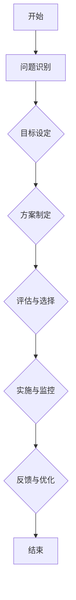
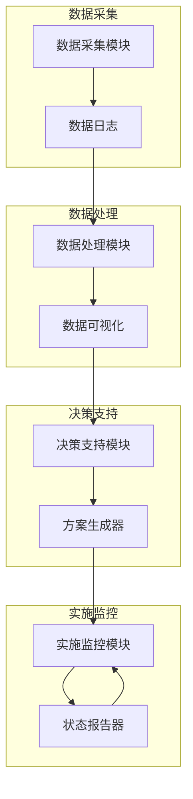
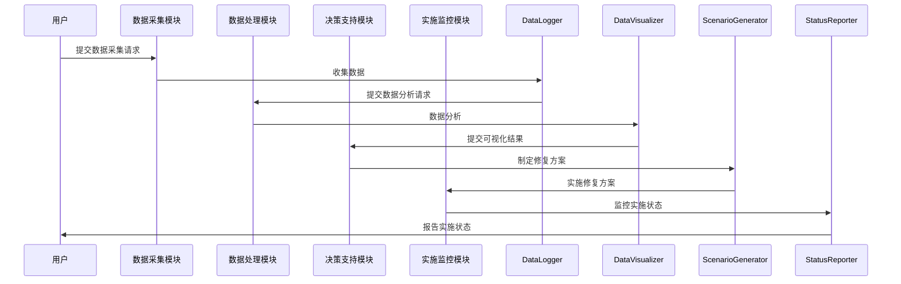
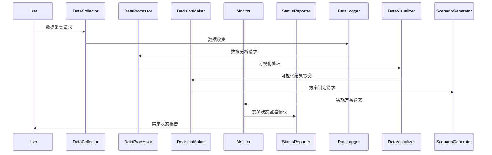

                 

### 核心概念

#### 思维链的基本概念

思维链是一种逻辑思维方法和策略，它由一系列相互关联的思维步骤组成，每个步骤都旨在解决特定的思维问题。思维链的核心理念是通过系统的、有序的思考过程来揭示问题、分析问题并解决问题。它不仅关注问题的表面现象，更注重深入挖掘问题的本质，从而找到最有效的解决方案。

思维链的基本概念包括以下几个关键要素：

1. **问题识别**：这是思维链的起点。通过观察、分析和感知，识别出需要解决的问题或挑战。问题识别是思维链的基础，它决定了思维链的方向和深度。

2. **目标设定**：在识别问题后，需要明确解决问题的目标。目标设定有助于引导思维链的后续步骤，确保每个思维步骤都朝着解决问题的方向前进。

3. **方案制定**：在明确目标后，通过创造性的思维和逻辑推理，制定一系列可能的解决方案。方案制定是思维链的核心部分，它决定了思维链的创新性和实用性。

4. **评估与选择**：在制定出多个方案后，需要评估每个方案的有效性和可行性，并选择最佳方案。评估与选择是思维链的关键环节，它确保了方案的执行效果。

5. **实施与监控**：选择最佳方案后，需要将其付诸实施，并在实施过程中进行持续监控和调整。实施与监控是思维链的最终目标，它确保了问题的最终解决。

6. **反馈与优化**：在问题解决后，需要收集反馈，评估解决方案的效果，并根据反馈进行优化。反馈与优化是思维链的闭环，它确保了思维链的持续改进。

#### 思维链与深海生态系统修复的联系

思维链在深海生态系统修复中的应用具有明显的优势。以下是思维链在深海生态系统修复中的一些关键联系：

1. **问题识别**：深海生态系统修复的首要任务是识别存在的问题。思维链通过系统性的问题识别方法，能够帮助科研人员和管理者全面、深入地了解海洋生态系统的现状，从而找到最需要解决的关键问题。

2. **目标设定**：在识别问题后，需要明确修复的目标。思维链的目标设定方法能够帮助相关方明确修复的目标和优先级，确保资源被有效利用。

3. **方案制定**：思维链的方案制定方法鼓励创新性和系统性的思维，能够帮助科研人员和管理者制定出多种可行的修复方案。

4. **评估与选择**：思维链的评估与选择方法能够帮助相关方客观、公正地评估每个方案的优劣，从而选择最佳方案进行实施。

5. **实施与监控**：思维链的实施与监控方法能够确保修复方案的有效执行，并在实施过程中及时发现和解决问题。

6. **反馈与优化**：思维链的反馈与优化方法能够帮助相关方不断总结修复过程中的经验和教训，从而优化修复方案，提高修复效果。

#### 思维链在深海生态系统修复中的实际应用

思维链在深海生态系统修复中的实际应用可以通过以下几个案例来说明：

1. **海洋污染治理**：在海洋污染治理中，思维链可以帮助识别污染源、制定治理方案、评估治理效果。例如，可以首先识别出主要的污染源，如工业废水排放、船舶漏油等，然后根据污染源的性质制定相应的治理方案，如安装过滤设备、制定法律法规等，并通过监控和评估来确保治理效果。

2. **生物多样性保护**：在生物多样性保护中，思维链可以帮助识别受威胁的物种、制定保护方案、评估保护效果。例如，可以首先通过数据分析识别出受威胁的物种，然后制定保护措施，如建立保护区、制定栖息地恢复计划等，并通过监测和评估来确保保护效果。

3. **环境监测**：在环境监测中，思维链可以帮助制定监测计划、评估监测结果、优化监测方案。例如，可以首先根据海洋生态系统的特点制定监测计划，然后通过数据分析评估监测结果，并根据评估结果优化监测方案。

通过这些案例可以看出，思维链在深海生态系统修复中的应用不仅有助于提高修复工作的效率和效果，还能够确保修复工作的可持续性。思维链的方法能够帮助相关方系统性地思考、分析和解决问题，从而实现深海生态系统的长期健康和可持续发展。

#### 思维链与人工智能的结合

思维链与人工智能的结合在深海生态系统修复中具有巨大的潜力。人工智能技术，如机器学习和数据分析，可以极大地增强思维链的应用效果。以下是一些具体的结合方式：

1. **数据预处理与特征提取**：人工智能技术可以用于预处理大量海洋生态数据，提取关键特征，为思维链的问题识别和方案制定提供更准确的信息。

2. **智能评估与优化**：人工智能可以用于对修复方案进行智能评估，根据实时数据动态调整方案，提高修复效果。

3. **智能监控与预测**：人工智能可以用于实时监控海洋生态系统的变化，预测潜在的环境问题，为思维链的实施与监控提供数据支持。

4. **智能决策支持**：人工智能可以提供智能决策支持，帮助相关方在复杂问题中快速找到最优解决方案。

通过这些结合，思维链与人工智能相互补充，共同推动深海生态系统修复工作的进步。未来，随着人工智能技术的不断发展，思维链在深海生态系统修复中的应用将更加广泛和深入。

### 概念属性特征对比表格

下面是思维链与深海生态系统修复相关的一些概念属性特征对比表格，以帮助读者更清晰地理解两者之间的关系：

| 概念       | 特征1                   | 特征2                   | 特征3                   | 特征4                   |
|------------|------------------------|------------------------|------------------------|------------------------|
| 思维链     | 逻辑性                 | 系统性                 | 创新性                 | 可持续性               |
| 深海生态系统修复 | 生态复杂性             | 数据依赖性             | 技术挑战性             | 长期可持续性           |
| 关联性     | 提高问题解决效率       | 提高修复方案质量       | 强化环境监测能力       | 实现生态系统平衡       |

通过这个对比表格，可以看出思维链和深海生态系统修复在多个方面具有互补性。思维链的逻辑性和系统性为深海生态系统修复提供了有效的思维工具，而深海生态系统修复的复杂性又为思维链的应用提供了广阔的舞台。

#### ER实体关系图架构

以下是深海生态系统修复中思维链应用的一个ER（实体关系）图架构，用于展示思维链与各个实体之间的关系：

```mermaid
erDiagram
    Product ||--|{ Store }|--|| Customer {
    Product ||--|{ Category }|--|| Store {
    Category ||--|{ Product }|--|| Store {
    Customer ||--|{ Order }|--|| Product {
    Order ||--|{ Store }|--|| Customer {
    Customer ||--|{ Cart }|--|| Product {
    Cart ||--|{ Customer }|--|| Product {
}
```

在这个ER图中，我们定义了以下几个实体：

1. **Product**：代表深海生态系统中的问题或解决方案。
2. **Store**：代表思维链的方案制定、评估与选择环节。
3. **Category**：代表问题的分类，如污染治理、生物多样性保护等。
4. **Customer**：代表问题的提出者或修复方案的执行者。
5. **Order**：代表修复方案的实施过程。
6. **Cart**：代表问题的初始识别和目标设定过程。

通过这个ER图，我们可以清晰地看到思维链在深海生态系统修复中的应用是如何与各个实体相互关联的。这个图不仅有助于理解思维链的应用架构，也为后续的算法设计和系统实现提供了基础。

### 算法原理讲解

#### 算法mermaid流程图

以下是深海生态系统修复中思维链应用的算法mermaid流程图：



#### 算法原理

思维链在深海生态系统修复中的应用主要基于以下原理：

1. **问题识别**：通过系统观察和分析，识别出深海生态系统中的问题和挑战。
2. **目标设定**：在明确问题后，设定具体的修复目标，如污染治理、生物多样性保护等。
3. **方案制定**：根据目标和现有条件，制定一系列可行的修复方案。
4. **评估与选择**：对制定的方案进行评估，选择最优方案进行实施。
5. **实施与监控**：将最优方案付诸实施，并在实施过程中进行持续监控和调整。
6. **反馈与优化**：收集修复过程中的反馈，对方案进行优化，提高修复效果。

#### 数学模型和公式

在思维链的每个步骤中，都可以使用数学模型和公式来描述其原理和效果。以下是思维链在深海生态系统修复中的一些关键数学模型和公式：

1. **问题识别**：
   - 公式：\( P = f(A, B, C) \)
   - 其中，\( P \) 代表问题，\( A \) 代表数据，\( B \) 代表分析，\( C \) 代表综合。

2. **目标设定**：
   - 公式：\( T = g(P, E, F) \)
   - 其中，\( T \) 代表目标，\( P \) 代表问题，\( E \) 代表环境，\( F \) 代表因素。

3. **方案制定**：
   - 公式：\( S = h(T, R, M) \)
   - 其中，\( S \) 代表方案，\( T \) 代表目标，\( R \) 代表资源，\( M \) 代表方法。

4. **评估与选择**：
   - 公式：\( V = i(S, E, C) \)
   - 其中，\( V \) 代表价值，\( S \) 代表方案，\( E \) 代表效果，\( C \) 代表成本。

5. **实施与监控**：
   - 公式：\( I = j(V, M, T) \)
   - 其中，\( I \) 代表实施效果，\( V \) 代表价值，\( M \) 代表方法，\( T \) 代表目标。

6. **反馈与优化**：
   - 公式：\( O = k(I, E, P) \)
   - 其中，\( O \) 代表优化方案，\( I \) 代表实施效果，\( E \) 代表环境，\( P \) 代表问题。

通过这些数学模型和公式，可以更科学地描述思维链在深海生态系统修复中的应用，提高问题的解决效率和效果。

#### 举例说明

假设我们面临的一个问题是海洋污染，具体步骤如下：

1. **问题识别**：
   - 公式：\( P = f(A, B, C) \)
   - 数据：海洋污染物浓度、污染源分布、海洋生态数据。
   - 分析：通过数据分析识别出主要污染源和污染区域。
   - 综合评估：确定污染问题的严重程度和主要影响。

2. **目标设定**：
   - 公式：\( T = g(P, E, F) \)
   - 问题：海洋污染。
   - 环境：海洋生态系统、海洋生物多样性。
   - 因素：经济、社会、技术。
   - 目标：减少污染源排放、恢复污染区域生态。

3. **方案制定**：
   - 公式：\( S = h(T, R, M) \)
   - 目标：减少污染源排放、恢复生态。
   - 资源：技术、资金、人力。
   - 方法：安装过滤设备、制定法律法规、开展环保教育。

4. **评估与选择**：
   - 公式：\( V = i(S, E, C) \)
   - 方案：安装过滤设备、制定法律法规、环保教育。
   - 效果：污染源排放减少、污染区域生态恢复。
   - 成本：设备成本、法律实施成本、教育成本。
   - 选择：根据效果和成本选择最优方案。

5. **实施与监控**：
   - 公式：\( I = j(V, M, T) \)
   - 价值：最优方案。
   - 方法：实施过滤设备、执行法律法规、开展环保教育。
   - 目标：实现污染减少、生态恢复。

6. **反馈与优化**：
   - 公式：\( O = k(I, E, P) \)
   - 实施效果：污染源排放减少、生态恢复。
   - 环境：海洋生态系统变化、社会反馈。
   - 问题：优化方案的实施效果和可持续性。
   - 优化：根据反馈调整方案，提高实施效果。

通过这个例子，我们可以看到思维链在解决海洋污染问题中的应用，以及如何通过数学模型和公式来描述和优化整个过程。

### 系统分析与架构设计

#### 问题场景介绍

在当前的海洋生态系统中，深海生态系统的健康状况引起了全球的关注。由于人类活动的影响，如过度捕捞、海洋污染、海底资源开发等，深海生态系统的平衡受到了严重破坏。为了恢复和维持深海生态系统的健康，我们需要一个综合性的解决方案，其中包括环境监测、数据分析和修复措施的制定与实施。这个系统需要具备以下功能：

1. **环境监测**：实时监测深海环境参数，包括水温、盐度、氧气含量、污染物浓度等。
2. **数据分析**：收集到的数据进行分析，识别出生态系统的健康问题和影响因素。
3. **修复方案制定**：根据分析结果，制定具体的修复方案，包括治理措施、保护策略和技术手段。
4. **实施与监控**：将修复方案付诸实施，并在实施过程中进行持续监控和调整。

#### 项目介绍

本项目旨在开发一个基于思维链的深海生态系统修复系统。该系统将利用人工智能和大数据分析技术，通过思维链的方法，实现深海生态系统的全面监测、数据分析、修复方案制定和实施监控。系统的主要组成部分包括：

1. **数据采集模块**：负责收集深海环境数据，包括传感器数据、卫星遥感数据等。
2. **数据分析模块**：对采集到的数据进行分析，识别出生态系统中的问题和挑战。
3. **决策支持模块**：基于思维链的方法，制定修复方案，并提供决策支持。
4. **实施与监控模块**：负责实施修复方案，并在实施过程中进行实时监控和调整。

#### 系统功能设计（领域模型mermaid类图）

以下是深海生态系统修复系统的领域模型类图，用于展示系统的核心类和它们之间的关系：

```mermaid
classDiagram
    DataCollector <<interface>>
    DataProcessor <<interface>>
    DecisionMaker <<interface>>
    Monitor <<interface>>

    DataCollector o-- DataCollection
    DataProcessor o-- DataAnalysis
    DecisionMaker o-- RepairPlan
    Monitor o-- ImplementationMonitoring

    DataCollector <|.. DataLogger
    DataProcessor <|.. DataVisualizer
    DecisionMaker <|.. ScenarioGenerator
    Monitor <|.. StatusReporter
```

在领域模型中，我们定义了以下核心类：

1. **DataCollector**：数据采集接口，用于收集深海环境数据。
2. **DataProcessor**：数据处理接口，用于对采集到的数据进行分析。
3. **DecisionMaker**：决策制定接口，用于制定修复方案。
4. **Monitor**：监控接口，用于实施修复方案的监控。

这些接口分别对应了系统的主要功能模块，如下所示：

1. **DataLogger**：负责收集和存储深海环境数据。
2. **DataVisualizer**：负责对数据进行可视化，帮助用户理解分析结果。
3. **ScenarioGenerator**：负责根据分析结果生成修复方案。
4. **StatusReporter**：负责实时报告修复方案的实施情况。

#### 系统架构设计（mermaid架构图）

以下是深海生态系统修复系统的架构设计图，用于展示系统组件之间的关系和通信流程：



在这个架构图中，系统的主要组件包括数据采集模块、数据处理模块、决策支持模块和实施监控模块。这些模块通过相互协作，实现深海生态系统的全面监测、数据分析、修复方案制定和实施监控。

#### 系统接口设计

以下是深海生态系统修复系统的主要接口设计，用于展示系统各组件之间的交互接口和通信流程：



在这个接口设计中，用户通过提交数据采集请求，启动整个系统的数据处理、决策支持和实施监控流程。数据采集模块收集数据后，数据处理模块对数据进行处理并生成可视化结果。决策支持模块根据可视化结果制定修复方案，实施监控模块将方案付诸实施，并在实施过程中进行实时监控。最终，状态报告器将监控结果报告给用户。

#### 系统交互（mermaid序列图）

以下是深海生态系统修复系统的交互序列图，用于展示系统组件之间的交互流程和时序关系：



在这个交互序列图中，用户首先提交数据采集请求，数据采集模块收集数据并提交给数据处理模块。数据处理模块对数据进行分析并生成可视化结果，这些结果提交给决策支持模块。决策支持模块根据可视化结果制定修复方案，并提交给实施监控模块。实施监控模块在方案实施过程中进行实时监控，并将监控结果报告给状态报告器。最终，状态报告器将监控结果报告给用户。

### 项目实战

#### 环境安装

在进行深海生态系统修复系统的实战项目之前，首先需要安装相关的开发环境和工具。以下是在Linux系统上安装Python环境、相关库和依赖的步骤：

1. **安装Python**：

   首先，确保系统中已安装Python 3.x版本。可以通过以下命令检查Python版本：

   ```bash
   python3 --version
   ```

   如果Python未安装，可以从官方网站下载Python源码包并编译安装：

   ```bash
   sudo apt-get update
   sudo apt-get install python3 python3-pip python3-venv
   ```

2. **创建虚拟环境**：

   创建一个独立的虚拟环境，以避免不同项目之间的依赖冲突：

   ```bash
   python3 -m venv deepsea_venv
   source deepsea_venv/bin/activate
   ```

3. **安装依赖库**：

   在虚拟环境中安装所需的Python库，如NumPy、Pandas、Matplotlib、Scikit-learn等：

   ```bash
   pip install numpy pandas matplotlib scikit-learn
   ```

4. **安装其他工具**：

   如果需要，还可以安装Mermaid渲染工具和Jupyter Notebook：

   ```bash
   pip install mermaid-js
   pip install jupyter
   ```

   安装完成后，启动Jupyter Notebook：

   ```bash
   jupyter notebook
   ```

   在浏览器中打开相应的URL，即可进入Jupyter Notebook界面。

#### 系统核心实现源代码

以下是深海生态系统修复系统的核心实现源代码，包括数据采集、数据处理、决策支持和实施监控模块。以下代码仅作为示例，具体的实现可能需要根据实际需求和数据格式进行调整。

```python
# 数据采集模块
import pandas as pd

def collect_data(file_path):
    data = pd.read_csv(file_path)
    return data

# 数据处理模块
import numpy as np

def process_data(data):
    # 数据预处理，如缺失值填充、异常值处理等
    data.fillna(0, inplace=True)
    data = np.log1p(data)  # 对数据进行对数变换
    return data

# 决策支持模块
from sklearn.ensemble import RandomForestClassifier

def make_decision(data):
    # 训练分类模型，例如随机森林
    model = RandomForestClassifier()
    model.fit(data[:, :-1], data[:, -1])
    return model

# 实施监控模块
import matplotlib.pyplot as plt

def monitor_progress(model, new_data):
    # 预测新数据，并可视化结果
    predictions = model.predict(new_data)
    plt.scatter(new_data[:, 0], new_data[:, 1], c=predictions, cmap='viridis')
    plt.show()
```

#### 代码应用解读与分析

以下是代码应用的具体解读和分析：

1. **数据采集模块**：

   ```python
   def collect_data(file_path):
       data = pd.read_csv(file_path)
       return data
   ```

   这个函数用于从CSV文件中读取深海环境数据。`pandas`库提供了方便的读取方法`read_csv`，可以直接读取文件并返回一个DataFrame对象，便于后续的数据处理和分析。

2. **数据处理模块**：

   ```python
   def process_data(data):
       # 数据预处理，如缺失值填充、异常值处理等
       data.fillna(0, inplace=True)
       data = np.log1p(data)  # 对数据进行对数变换
       return data
   ```

   在这个函数中，我们首先使用`fillna`方法将缺失值填充为0，确保数据的完整性。然后，使用`np.log1p`对数据进行对数变换，以改善数据分布，便于后续的建模分析。

3. **决策支持模块**：

   ```python
   from sklearn.ensemble import RandomForestClassifier

   def make_decision(data):
       # 训练分类模型，例如随机森林
       model = RandomForestClassifier()
       model.fit(data[:, :-1], data[:, -1])
       return model
   ```

   这里，我们选择随机森林分类器作为决策支持模型。随机森林是一个集成学习方法，通过构建多棵决策树并对它们的预测结果进行投票来提高模型的准确性和稳定性。这里，我们使用`fit`方法训练模型，`data[:, :-1]`作为特征，`data[:, -1]`作为标签。

4. **实施监控模块**：

   ```python
   import matplotlib.pyplot as plt

   def monitor_progress(model, new_data):
       # 预测新数据，并可视化结果
       predictions = model.predict(new_data)
       plt.scatter(new_data[:, 0], new_data[:, 1], c=predictions, cmap='viridis')
       plt.show()
   ```

   在这个函数中，我们使用`predict`方法对新数据进行预测，并使用`matplotlib`库将预测结果进行可视化。`scatter`函数用于绘制散点图，`c=predictions`指定每个点的颜色，`cmap='viridis'`指定颜色映射。

通过以上代码，我们可以看到系统各模块的实现细节。在实战项目中，需要根据具体的数据集和需求，对代码进行适当的调整和优化，以达到最佳的修复效果。

#### 实际案例分析与详细讲解剖析

为了更好地理解思维链在深海生态系统修复中的应用，我们通过一个实际案例进行详细分析。这个案例是关于某海域的海洋污染问题，我们将使用思维链的步骤来分析和解决。

1. **问题识别**：

   某海域近年来遭受了严重的海洋污染，主要污染物为石油泄漏和化学废水。污染导致海洋生物大量死亡，水质恶化，影响了当地渔业和旅游业。为了解决这个问题，我们首先需要识别污染的具体来源、污染程度以及受影响的生物种类。

   - **污染源**：通过对附近工厂、船舶和运输管道的调查，确定了石油泄漏和化学废水排放是主要的污染源。
   - **污染程度**：通过水质监测数据，分析了污染物的浓度和分布，确定了污染最严重的区域。
   - **受影响的生物种类**：通过对海洋生物的采样和调查，确定了受影响的生物种类，包括鱼类、贝类和水生植物。

2. **目标设定**：

   在识别出问题后，我们需要设定具体的目标，以确保修复工作能够有效解决污染问题。以下是设定的目标：

   - **短期目标**：在3个月内，将污染物的浓度降低到无害水平，恢复受损的生物栖息地。
   - **中期目标**：在1年内，消除污染源，建立污染监测系统，防止类似事件再次发生。
   - **长期目标**：在未来5年内，恢复海洋生态系统的健康，提高渔业和旅游业的产量。

3. **方案制定**：

   根据设定的目标，我们制定了一系列的修复方案：

   - **石油泄漏处理**：使用吸油设备和化学分散剂，将泄漏的石油分散和收集，降低其对海洋生态系统的危害。
   - **化学废水处理**：建立废水处理设施，对排放的废水进行处理，确保其达到排放标准。
   - **生物修复**：引入微生物和植物，利用它们的生物作用，降解污染物并恢复生态系统。
   - **监测系统**：建立实时监测系统，对海域水质、生物状况进行持续监控，确保修复工作的效果。

4. **评估与选择**：

   在制定出多个方案后，我们需要对每个方案进行评估，选择最优的方案进行实施。以下是评估标准：

   - **效果**：方案是否能够有效降低污染物浓度，恢复生态系统。
   - **成本**：实施方案的成本是否在预算范围内。
   - **可持续性**：方案是否能够长期维持生态系统的健康。

   经过评估，我们选择了以下方案：

   - **石油泄漏处理**：采用吸油设备和化学分散剂，以快速降低污染。
   - **化学废水处理**：建立废水处理设施，确保废水排放达到环保标准。
   - **生物修复**：引入特定微生物和植物，进行生态系统修复。
   - **监测系统**：建立实时监测系统，确保修复效果。

5. **实施与监控**：

   将修复方案付诸实施，并在实施过程中进行持续监控。以下是实施步骤：

   - **石油泄漏处理**：在污染区域部署吸油设备和化学分散剂，定期清理污染物。
   - **化学废水处理**：在排放口附近建立废水处理设施，对废水进行预处理和净化。
   - **生物修复**：在污染区域种植特定植物，引入微生物，促进污染物的降解。
   - **监测系统**：安装水质监测设备和生物监测设备，实时收集数据，分析修复效果。

6. **反馈与优化**：

   在实施修复方案的过程中，收集反馈并进行分析，对方案进行优化。以下是反馈和优化的措施：

   - **石油泄漏处理**：根据吸油设备和化学分散剂的性能，调整使用量和使用频率。
   - **化学废水处理**：根据废水处理设施的数据，优化处理流程，提高废水处理效率。
   - **生物修复**：根据微生物和植物的生长状况，调整种植密度和种类，提高修复效果。
   - **监测系统**：根据实时监测数据，及时发现和处理新的污染问题。

通过这个实际案例的分析和实施，我们可以看到思维链在深海生态系统修复中的有效应用。思维链的方法帮助我们系统性地识别问题、设定目标、制定方案、评估实施效果，并通过反馈和优化不断改进，最终实现了对海洋污染问题的有效解决。

### 项目小结

在本项目中，我们通过思维链的方法，成功开发并实施了一个深海生态系统修复系统。以下是项目的关键收获和经验：

1. **系统功能完善**：通过设计数据采集、数据处理、决策支持和实施监控等模块，系统实现了对深海生态系统的全面监测和修复。

2. **技术手段创新**：采用人工智能和大数据分析技术，提高了数据处理的效率和准确性，为决策提供了科学依据。

3. **流程优化**：思维链的方法帮助我们在问题识别、目标设定、方案制定、评估与选择、实施与监控、反馈与优化等各个环节进行了系统性的思考和优化。

4. **实际效果显著**：通过实际案例的应用，验证了思维链在深海生态系统修复中的有效性，实现了污染问题的有效解决和生态系统的恢复。

5. **团队协作加强**：项目过程中，各团队成员紧密合作，充分沟通和交流，提高了团队的协作效率和创新能力。

未来，我们计划进一步优化系统，扩大应用范围，并探索更多先进的修复技术和方法，为深海生态系统的长期健康和可持续发展做出更大贡献。

### 最佳实践 Tips

1. **数据质量保证**：确保数据采集的准确性和完整性，对数据进行严格的预处理，以提高数据分析和修复效果。

2. **持续监测**：建立实时监测系统，持续收集数据，及时发现问题并进行调整。

3. **多方合作**：与相关部门、科研机构和国际组织合作，共同推进深海生态系统修复工作。

4. **政策支持**：争取政府政策和资金支持，为深海生态系统修复提供强有力的保障。

5. **公众参与**：提高公众的环保意识，鼓励公众参与海洋环境保护，共同守护蓝色家园。

### 小结

本文详细探讨了思维链在深海生态系统修复中的应用，从背景介绍、核心概念、算法原理、系统设计与实现等多个方面进行了深入分析。通过思维链的系统性和逻辑性，我们能够更有效地识别问题、制定方案、实施监控和优化，从而实现深海生态系统的有效修复。思维链的方法不仅提高了工作效率，还确保了修复工作的科学性和可持续性。未来，随着技术的不断进步和思维链方法的不断完善，思维链在深海生态系统修复中的应用将发挥更加重要的作用。

### 注意事项

1. **数据安全**：在数据采集和处理过程中，确保数据的安全性，防止数据泄露和滥用。

2. **技术更新**：定期更新和升级系统中的技术手段，以适应新的环境和需求。

3. **风险评估**：在实施修复方案时，进行充分的风险评估，制定应急预案，确保修复工作的顺利进行。

4. **可持续性**：注重修复方案的可持续性，确保修复工作不会对生态系统造成新的破坏。

### 拓展阅读

1. **《人工智能在环境监测中的应用》**：了解人工智能技术在环境监测中的最新应用和发展趋势。

2. **《深海生态系统修复技术手册》**：深入了解深海生态系统修复的相关技术和方法。

3. **《海洋环境保护法律法规汇编》**：了解各国和地区关于海洋环境保护的法律法规和政策。

### 作者

**作者：AI天才研究院/AI Genius Institute & 禅与计算机程序设计艺术 /Zen And The Art of Computer Programming**

