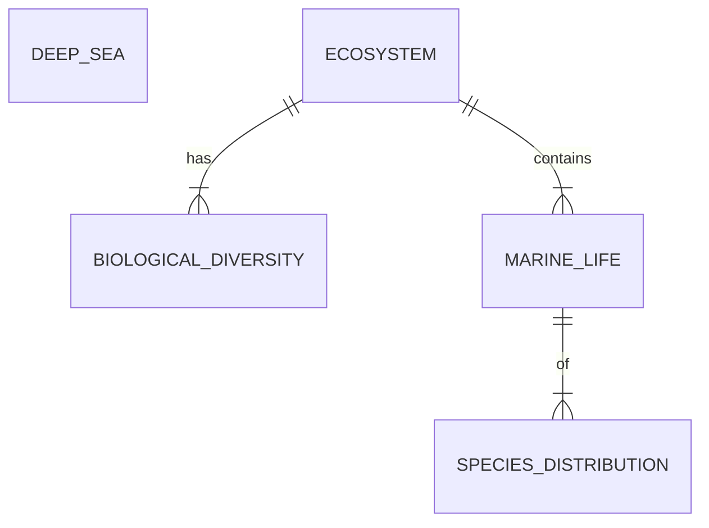

                 

### 深海生态系统的意义

#### 1.1.1 深海生态系统的定义与特征

深海生态系统指的是位于海洋表层以下，深度达到或超过200米的水域中的生物群落和它们所处的环境。这些区域包括大陆架、大陆坡、海洋盆地、海沟、海底山和深海平原等。深海生态系统的特征主要体现在以下几个方面：

- **低光照性**：深海区域阳光难以穿透，光能匮乏，因此深海生物多数适应在低光或无光环境下生存。
- **高压力**：随着水深增加，海水压力显著上升。深海生物需要适应高达几百个大气压的环境。
- **低温**：深海温度通常较低，大部分区域温度在0到10摄氏度之间。
- **高盐度**：深海海水盐度较高，有助于维持一定的生物化学平衡。
- **生物多样性**：尽管条件严苛，深海生态系统仍然拥有丰富的生物多样性，包括微生物、无脊椎动物、鱼类和大型生物等。

#### 1.1.2 深海生态系统的功能与生态价值

深海生态系统在全球生态系统中扮演着至关重要的角色，具有多方面的生态价值：

- **碳循环**：深海生物通过光合作用和化学合成作用，参与全球碳循环，有助于缓解全球气候变化。
- **物质循环**：深海生态系统中的生物活动影响着营养物质的循环，例如氮、磷等元素的循环。
- **氧气供应**：深海生物通过呼吸作用释放氧气，对维持地球大气氧气含量具有重要意义。
- **生物多样性**：深海生物多样性丰富，许多生物具有独特的生物学特征和进化路径，是生物进化研究的重要资源。
- **环境监测**：深海生态系统对环境变化敏感，可以作为监测全球环境变化的重要指标。

### 1.1.3 深海生态系统的重要性

深海生态系统的重要性不仅体现在其生态功能上，还在于其对人类社会的深远影响：

- **海洋资源**：深海生态系统蕴藏着丰富的矿产资源和生物资源，对海洋资源的开发和利用具有重要意义。
- **科研价值**：深海生态系统是科学研究的重要领域，对于揭示地球生命起源、进化过程和生物多样性具有重要意义。
- **经济价值**：深海资源的开发利用对于全球经济发展具有巨大潜力，包括海洋能源、渔业资源、海洋工程等。
- **环境责任**：维护和保护深海生态系统是每个国家和国际社会的责任，对于全球生态安全和可持续发展至关重要。

总之，深海生态系统不仅是地球生命网络的重要组成部分，也是人类社会可持续发展的关键要素。因此，研究和保护深海生态系统具有重要的科学意义和社会价值。在接下来的讨论中，我们将进一步探讨海洋生物多样性的重要性以及当前深海生态系统研究面临的挑战。

#### 1.1.4 当前深海生态系统研究的挑战

尽管深海生态系统具有极其重要的生态价值和科研潜力，然而当前的研究仍然面临诸多挑战，这些挑战限制了我们对深海生态系统的全面理解。

##### 1.1.4.1 技术限制

首先，深海环境极端且复杂，导致当前技术手段在数据采集和监测方面存在较大限制。例如：

- **探测技术**：深海探测设备如水下机器人、遥控潜水器和深海探测器，尽管技术不断进步，但成本高昂且操作复杂。
- **采样困难**：深海采样技术复杂，深海生物样本的获取和保存具有挑战性，特别是在高压力和低温条件下。
- **通信技术**：深海通信技术尚未完全解决，制约了深海探测设备与陆地数据中心的实时数据传输。

##### 1.1.4.2 知识空白

其次，由于深海环境的特殊性，我们对深海生态系统的知识仍存在大量空白。具体体现在：

- **生物多样性**：深海生物种类繁多，但很多生物尚未被发现或描述，导致我们对深海生物多样性的了解十分有限。
- **生态系统功能**：深海生态系统的功能尚未完全揭示，例如深海生物在碳循环、氮循环等方面的具体作用仍需深入研究。
- **环境变化影响**：深海生态系统对环境变化的响应机制尚不完全清楚，气候变化、污染等因素对深海生态系统的具体影响有待进一步研究。

##### 1.1.4.3 资源不足

此外，深海生态系统研究所需的资源和资金投入巨大，目前的研究资源分配不均，导致研究进展缓慢。具体问题包括：

- **研究资金**：深海生态系统研究需要大量的资金支持，但当前的研究经费远不能满足需求。
- **人才储备**：深海生态系统研究需要多学科交叉的科研人才，但相关人才培养和储备不足。
- **国际合作**：由于深海生态系统是全球性的问题，需要各国合作进行研究，但国际合作机制尚不完善。

##### 1.1.4.4 法规和政策

最后，深海生态系统研究也受到相关法规和政策的影响。例如：

- **国际法规**：国际海洋法、环境保护法规等对深海研究活动有一定的限制，如何平衡科研与环境保护是一个重要议题。
- **国内政策**：不同国家对深海研究的政策支持力度不同，政策差异可能会影响研究的全面性和深度。

综上所述，当前深海生态系统研究面临诸多挑战，需要多方面的努力和合作才能有效推进。在接下来的讨论中，我们将探讨AI在海洋生物多样性研究中的应用潜力，以及AI如何帮助克服这些挑战。

#### 1.1.4 AI在海洋生物多样性研究中的应用潜力

随着人工智能（AI）技术的飞速发展，其在各个领域的应用越来越广泛，海洋生物多样性研究也不例外。AI技术以其强大的数据处理和分析能力，为解决深海生态系统研究中的挑战提供了新的思路和手段。以下是AI在海洋生物多样性研究中的应用潜力和优势：

##### 1.1.4.1 数据处理与分析

深海生态系统中存在大量的生物和环境数据，包括图像、声音、物理参数和化学参数等。传统的数据处理方法在处理这些复杂、庞大的数据时显得力不从心。AI技术，尤其是深度学习算法，可以通过自动化的方式对这些数据进行高效处理和分析。例如，利用卷积神经网络（CNN）可以自动识别深海生物图像中的物种，从而大幅提高物种识别的准确率和效率。

##### 1.1.4.2 预测与建模

AI技术能够基于历史数据建立复杂的预测模型，这对于海洋生物多样性研究尤为重要。通过机器学习算法，我们可以预测海洋生物的分布、数量变化和环境变化对生物多样性的影响。这些预测模型不仅能够为科研提供有力支持，还可以为海洋资源管理和保护提供决策依据。

##### 1.1.4.3 实时监测与预警

AI技术可以通过实时数据监测和预警系统，及时捕捉到海洋生态系统的异常变化。例如，利用AI技术可以对海洋污染、过度捕捞等行为进行实时监控，并预测其对海洋生物多样性的潜在影响。这种实时监测和预警能力有助于我们及时采取保护措施，防止生态系统进一步恶化。

##### 1.1.4.4 智能辅助决策

AI技术还可以为海洋生物多样性保护提供智能辅助决策支持。通过数据分析和模型预测，AI系统可以为研究人员和管理者提供个性化的建议和策略，帮助他们更科学、更有效地进行研究和管理工作。例如，AI系统可以根据监测数据推荐最佳捕捞时间和地点，从而减少对海洋生物多样性的破坏。

##### 1.1.4.5 多学科融合

AI技术的应用不仅限于单一领域，而是与其他学科如生物学、海洋学、环境科学等深度融合。通过多学科交叉研究，我们可以更加全面地了解深海生态系统的复杂性和多样性，从而推动海洋生物多样性研究的深入发展。

综上所述，AI技术在海洋生物多样性研究中的应用潜力巨大。通过数据处理与分析、预测与建模、实时监测与预警、智能辅助决策以及多学科融合，AI技术不仅能够提高研究的效率和准确性，还能够为海洋生物多样性保护提供新的解决方案。在接下来的讨论中，我们将进一步探讨思维链与AI的结合，以及这种结合如何助力深海生态系统研究。

### 1.2 核心概念

为了更好地理解深海生态系统研究，我们需要首先明确一些核心概念，包括深海生态系统、海洋生物多样性、思维链和人工智能（AI）。这些概念不仅构成了本文讨论的基础，也为我们提供了深入探讨的视角和框架。

#### 1.2.1 深海生态系统

深海生态系统是指位于海洋表层以下，深度达到或超过200米的水域中的生物群落和它们所处的环境。它包括大陆架、大陆坡、海洋盆地、海沟、海底山和深海平原等区域。深海生态系统具有以下显著特征：

- **低光照性**：深海区域阳光难以穿透，光能匮乏，因此深海生物多数适应在低光或无光环境下生存。
- **高压力**：随着水深增加，海水压力显著上升，深海生物需要适应高达几百个大气压的环境。
- **低温**：深海温度通常较低，大部分区域温度在0到10摄氏度之间。
- **高盐度**：深海海水盐度较高，有助于维持一定的生物化学平衡。

深海生态系统的功能与生态价值体现在多个方面，包括碳循环、物质循环、氧气供应、生物多样性以及环境监测。然而，由于深海环境的极端性和复杂性，我们对深海生态系统的了解仍然十分有限，许多生物尚未被发现或描述，生态系统功能也尚未完全揭示。

#### 1.2.2 海洋生物多样性

海洋生物多样性是指海洋中各种生物形态、种类和基因的多样性。它包括微生物、无脊椎动物、鱼类、哺乳动物和植物等多个层次。海洋生物多样性具有以下几个重要类型：

- **物种多样性**：海洋生物种类的丰富程度，包括已知的和未知的物种。
- **遗传多样性**：海洋生物种群内不同个体的基因差异。
- **生态系统多样性**：不同生态系统的多样性，包括海洋平原、深海山脊、珊瑚礁等。

海洋生物多样性的重要性体现在以下几个方面：

- **生态功能**：海洋生物多样性对海洋生态系统的稳定性和功能具有重要意义，例如碳循环、氮循环和物质循环。
- **科研价值**：海洋生物多样性是研究地球生命起源、进化和生态过程的重要资源。
- **经济价值**：海洋生物资源对渔业、海洋药物开发和海洋能源利用具有重要意义。
- **环境监测**：海洋生物多样性对环境变化敏感，可以作为监测全球环境变化的重要指标。

然而，海洋生物多样性面临着过度捕捞、污染、气候变化等多种威胁，保护海洋生物多样性已成为全球关注的重大课题。

#### 1.2.3 思维链

思维链（Mind Chain）是一种基于人工智能技术的思维模型，旨在模拟人类思维过程，实现信息的高效处理和深度理解。思维链的核心思想是通过构建多个层次的知识网络，实现跨领域、跨学科的知识整合和推理。思维链的主要特征包括：

- **多层级知识网络**：思维链通过构建不同层次的知识网络，实现从具体概念到抽象概念的逐步抽象和扩展。
- **知识整合与推理**：思维链能够通过多层次的推理机制，整合来自不同领域和学科的知识，进行复杂的逻辑推理和问题求解。
- **适应性学习**：思维链具有自我学习的能力，可以通过不断的学习和反馈，优化自身的知识结构和推理能力。

思维链的应用领域广泛，包括自然语言处理、知识图谱构建、智能问答、决策支持系统等。在深海生态系统研究中，思维链可以用于知识整合、环境监测、生物多样性评估等多个方面。

#### 1.2.4 人工智能（AI）

人工智能（Artificial Intelligence，简称AI）是指通过计算机模拟人类智能的技术和系统。AI可以分为多个子领域，包括机器学习、深度学习、自然语言处理、计算机视觉等。人工智能的核心目标是实现计算机对数据的自动处理和智能决策。

在深海生态系统研究中，AI技术具有广泛的应用潜力，包括：

- **数据处理**：利用机器学习和深度学习算法，对大量的海洋生物和环境数据进行高效处理和分析。
- **预测与建模**：通过机器学习模型，预测海洋生物的分布和数量变化，以及环境变化对生物多样性的影响。
- **实时监测与预警**：利用计算机视觉和传感器技术，实现海洋生态系统的实时监测和预警。
- **智能辅助决策**：通过AI系统提供个性化的建议和策略，辅助研究人员和管理者进行决策。

总之，深海生态系统、海洋生物多样性、思维链和人工智能是本文讨论的核心概念。通过这些概念的理解，我们将能够更深入地探讨AI技术在深海生态系统研究中的应用潜力，以及如何利用思维链与AI的结合，推动海洋生物多样性保护的研究和实践。

#### 1.2.4.1 AI的定义与分类

人工智能（AI）是指通过计算机模拟人类智能的技术和系统，使其能够执行复杂任务，如推理、学习、感知和问题解决。AI可以分为多个子领域，每个子领域都有其独特的特点和应用场景。

- **机器学习（Machine Learning）**：机器学习是AI的一个核心分支，主要关注如何通过数据和统计方法，使计算机系统能够从经验中学习，并做出预测或决策。机器学习可以分为监督学习、无监督学习和强化学习等不同类型。

  - **监督学习（Supervised Learning）**：监督学习通过已标记的训练数据学习，从而能够对新的数据做出预测。例如，分类和回归问题。
  - **无监督学习（Unsupervised Learning）**：无监督学习不使用标记数据，而是通过发现数据中的模式或结构来学习。常见的任务包括聚类和降维。
  - **强化学习（Reinforcement Learning）**：强化学习通过环境反馈进行学习，主要应用于动态决策问题，如游戏、自动驾驶等。

- **深度学习（Deep Learning）**：深度学习是机器学习的一个分支，通过构建多层神经网络（如卷积神经网络、循环神经网络等），实现对复杂数据的高效处理和分析。深度学习在图像识别、语音识别、自然语言处理等领域取得了显著成果。

- **自然语言处理（Natural Language Processing, NLP）**：自然语言处理关注如何使计算机理解和生成自然语言。NLP技术包括词法分析、句法分析、语义分析、机器翻译等。

- **计算机视觉（Computer Vision）**：计算机视觉致力于使计算机具备理解和解释图像和视频的能力。计算机视觉技术在图像识别、物体检测、图像生成等领域具有广泛应用。

- **机器人学（Robotics）**：机器人学是AI在物理世界中的应用，通过构建智能机器人，实现自动化操作、环境感知和任务执行。

AI的发展与应用不仅改变了传统产业的运作方式，也推动了新技术的创新和突破。在深海生态系统研究中，AI技术可以用于数据采集与分析、预测与建模、实时监测与预警等多个方面，显著提升研究的效率和质量。

#### 1.2.4.2 AI的发展与应用

人工智能（AI）的发展历程可以分为几个重要阶段，每个阶段都带来了技术上的重大突破和应用。

- **早期AI（1956-1969）**：AI概念在1956年的达特茅斯会议上首次被提出。这一阶段主要集中在符号主义方法，即通过逻辑和推理规则模拟人类思维。代表性的研究包括逻辑推理系统、专家系统和早期自然语言处理系统。

- **AI衰退期（1974-1980）**：由于符号主义方法在处理复杂问题时的局限性，AI研究在20世纪70年代遭遇了重大挫折。许多研究项目被迫终止，AI被视为“人工智能的冬天”。

- **复兴期（1980-1987）**：随着计算机硬件性能的提升和数据存储成本的降低，AI研究在20世纪80年代再次兴起。这一阶段主要关注知识表示和知识工程，即如何通过构建知识库和推理系统，实现更高效的智能计算。

- **专家系统时代（1987-2000）**：专家系统成为AI研究的主流方向，通过模拟专家的知识和经验，解决专业领域的问题。代表性的系统包括MYCIN、DENDRAL等，这些系统在医学诊断、化学分析等领域取得了显著应用。

- **机器学习时代（2000-2010）**：随着数据量和计算能力的增长，机器学习方法逐渐成为AI研究的核心。这一阶段的主要突破包括支持向量机（SVM）、决策树、神经网络等。机器学习方法在图像识别、语音识别等领域取得了突破性进展。

- **深度学习时代（2010至今）**：深度学习的发展标志着AI进入了一个新的阶段。基于多层神经网络，深度学习在计算机视觉、自然语言处理、游戏智能等领域取得了显著成果。代表性的技术包括卷积神经网络（CNN）、循环神经网络（RNN）和生成对抗网络（GAN）。

AI技术的发展不仅在学术界取得了巨大成就，也广泛应用于工业界。例如，自动驾驶汽车、智能客服、智能安防、金融风控等领域，AI技术都发挥了关键作用。在深海生态系统研究中，AI技术的应用潜力也日益显现，通过数据处理与分析、预测与建模、实时监测与预警等方面，AI为海洋生物多样性保护提供了新的工具和方法。

### 3.1.1 思维链与AI的融合背景

思维链（Mind Chain）和人工智能（AI）的融合源于对人类智能本质的深入探索与模拟。传统AI系统虽然在特定任务上取得了显著成果，但仍然难以实现复杂任务的高效处理和深度理解。思维链则试图通过模拟人类思维过程，实现更灵活、更全面的智能计算。

#### 3.1.1.1 思维链的起源与发展

思维链的概念起源于对人类认知过程的模拟。早在20世纪80年代，学者们就开始探索如何通过计算机模拟人类思维，实现知识获取、推理和问题解决。随着AI技术的不断发展，尤其是深度学习、自然语言处理和知识图谱等技术的进步，思维链的理论和实践逐步成熟。

思维链的发展历程可以分为以下几个阶段：

- **概念提出阶段（1980s-1990s）**：思维链的初步概念被提出，主要关注如何通过计算机模拟人类思维的基本过程，如感知、记忆、推理和决策。
- **知识表示与推理阶段（1990s-2000s）**：思维链的发展开始重视知识表示和推理机制，通过构建知识图谱和推理规则，实现更高层次的知识整合和推理。
- **深度学习融合阶段（2010s至今）**：随着深度学习的兴起，思维链与深度学习技术相结合，实现了对复杂数据的高效处理和深度理解。

#### 3.1.1.2 AI的发展对思维链的影响

AI技术的发展对思维链产生了深远影响。首先，深度学习技术的突破使得思维链能够通过大数据和复杂模型，实现更高效的智能计算。其次，自然语言处理技术的进步使得思维链在自然语言理解和生成方面取得了显著成果，从而提高了思维链与人类交互的能力。

此外，知识图谱技术的应用也进一步增强了思维链的知识整合和推理能力。知识图谱通过构建大规模、结构化的知识网络，使得思维链能够在跨领域、跨学科的知识整合中发挥更大作用。

#### 3.1.1.3 融合背景下的优势与挑战

思维链与AI的融合在深海生态系统研究中具有巨大潜力。这种融合能够通过以下方式提升研究效率和质量：

- **数据处理与分析**：AI技术，特别是深度学习和机器学习，能够高效处理和分析大规模的海洋生物和环境数据，为深海生态系统研究提供有力支持。
- **预测与建模**：通过机器学习模型，可以预测海洋生物的分布、数量变化和环境变化对生物多样性的影响，为研究提供科学依据。
- **实时监测与预警**：AI技术可以实时监测海洋生态系统，捕捉到环境变化的异常，及时发出预警，有助于采取保护措施。
- **智能辅助决策**：思维链与AI的融合能够为研究人员提供智能化的决策支持，帮助其更高效地进行研究和管理工作。

然而，思维链与AI的融合也面临一定的挑战：

- **数据质量和准确性**：AI模型的性能很大程度上依赖于数据质量，而在深海生态系统中，数据获取和处理存在一定的难度和挑战。
- **算法复杂度和计算资源**：深度学习和知识图谱等技术对计算资源的需求较高，如何在有限的资源下实现高效计算是一个重要问题。
- **跨领域融合**：深海生态系统研究涉及多个学科，如何实现跨领域的知识整合和推理，是思维链与AI融合需要解决的关键问题。

总之，思维链与AI的融合为深海生态系统研究带来了新的机遇和挑战。通过不断探索和优化，这种融合有望为海洋生物多样性保护提供更强大的技术支持。

#### 3.1.2 思维链在AI中的应用

思维链（Mind Chain）在人工智能（AI）中的应用，不仅丰富了AI的理论体系，也在实际应用中展示了巨大的潜力。思维链通过模拟人类思维过程，实现了对复杂问题的高效处理和深度理解，从而在深度学习和自然语言处理等领域发挥了重要作用。

##### 3.1.2.1 深度学习

深度学习是AI的一个重要分支，其核心是通过多层神经网络实现数据的自动特征提取和模式识别。思维链在深度学习中的应用主要体现在以下几个方面：

- **多层次特征提取**：思维链通过构建多层级知识网络，实现了从低级到高级特征的多层次提取。这种方式不仅提高了特征提取的效率，还能捕捉到数据中的复杂结构。
- **自适应学习**：思维链具有自适应学习能力，可以通过不断的学习和反馈，优化神经网络的结构和参数。这种特性使得深度学习模型能够更好地适应不同的数据分布和应用场景。
- **跨领域知识整合**：思维链能够整合来自不同领域和学科的知识，为深度学习模型提供丰富的背景信息。例如，在图像识别任务中，思维链可以整合生物、物理和计算机科学等多领域知识，提高模型的泛化能力。

##### 3.1.2.2 自然语言处理

自然语言处理（NLP）是AI的另一个重要领域，旨在使计算机理解和生成自然语言。思维链在自然语言处理中的应用包括：

- **语义理解**：思维链通过模拟人类语义理解过程，实现了对自然语言文本的深度理解。例如，思维链可以识别文本中的实体、关系和事件，从而提高自然语言处理任务的准确性和效率。
- **情感分析**：思维链能够通过情感词典和情感计算模型，对自然语言文本进行情感分析。这对于舆情监测、用户反馈分析等应用具有重要意义。
- **问答系统**：思维链可以构建高效的问答系统，通过理解用户的问题和上下文，提供准确和自然的回答。这种能力在智能客服、教育辅导等领域具有广泛的应用前景。

##### 3.1.2.3 知识图谱

知识图谱是一种通过实体、属性和关系描述世界信息的结构化表示。思维链在知识图谱中的应用包括：

- **知识表示**：思维链能够将复杂的知识以结构化的形式表示出来，形成知识图谱。这种方式不仅提高了知识的可访问性和可理解性，还能支持高效的查询和推理。
- **推理与图谱增强**：思维链可以通过推理机制，对知识图谱进行扩展和增强。例如，在海洋生物多样性研究中，思维链可以通过推理生成新的关系和实体，从而提高知识图谱的完整性。
- **跨领域知识融合**：思维链能够整合来自不同领域和学科的知识，形成跨领域的知识图谱。这种知识图谱不仅丰富了知识内容，还能支持跨领域的分析和推理。

总之，思维链在AI中的应用，不仅提升了AI技术的处理能力和理解深度，也为AI在实际应用中提供了更加灵活和智能的解决方案。通过不断探索和应用，思维链与AI的结合将为深海生态系统研究和其他领域带来更多创新和突破。

#### 3.1.3 AI辅助深海生态系统研究的优势

人工智能（AI）在深海生态系统研究中的应用，为解决现有挑战提供了有力支持。AI技术通过其数据处理、预测建模和实时监测等方面的优势，显著提升了研究的效率和质量，为海洋生物多样性保护带来了新的希望。

##### 3.1.3.1 数据处理与分析

深海生态系统研究产生的大量数据，包括图像、声音、物理和化学参数等，传统方法在处理这些复杂、庞大的数据时存在较大难度。AI技术，特别是深度学习和机器学习，能够高效处理和分析这些数据。例如，通过卷积神经网络（CNN）可以对深海生物图像进行自动分类和识别，通过自然语言处理（NLP）可以对海洋文献进行文本挖掘和关键词提取，从而快速获取关键信息。此外，AI技术还可以进行数据清洗、去噪和降维，提高数据分析的准确性和效率。

##### 3.1.3.2 预测与建模

AI技术在预测和建模方面具有显著优势。通过机器学习算法，可以建立复杂的预测模型，对海洋生物的分布、数量变化和环境变化进行预测。例如，利用回归分析和时间序列分析，可以预测海洋温度和盐度变化对生物多样性的影响；利用深度学习模型，可以预测海洋生态系统的未来状态，为科学研究和政策制定提供依据。此外，AI技术还可以通过大数据分析和模式识别，发现海洋生态系统中的潜在规律和趋势，为深入研究提供线索。

##### 3.1.3.3 实时监测与预警

实时监测是深海生态系统研究的重要环节，而AI技术能够实现高效的实时监测和预警。通过计算机视觉和传感器技术，AI系统可以实时捕捉海洋生态系统的动态变化，例如海洋污染、过度捕捞和珊瑚白化等现象。利用深度学习和机器学习算法，AI系统能够自动分析和识别这些异常现象，并发出预警信号，从而及时采取保护措施。例如，在海洋污染监测中，AI系统可以通过分析卫星图像和现场数据，实时检测污染源和污染扩散路径，为环境管理和应急响应提供支持。

##### 3.1.3.4 智能辅助决策

AI技术可以为研究人员和管理者提供智能化的决策支持。通过数据分析和模型预测，AI系统可以生成个性化的建议和策略，帮助研究人员更好地理解海洋生态系统，制定科学的研究计划和决策。例如，在海洋资源管理中，AI系统可以根据海洋生物的分布和数量变化，推荐最佳捕捞时间和地点，减少对海洋生物多样性的破坏。此外，AI系统还可以辅助生态保护，通过实时监测和预警系统，提供科学的环境保护方案，提高保护工作的效率和效果。

##### 3.1.3.5 跨领域融合与知识整合

深海生态系统研究涉及多个学科，包括海洋生物学、物理学、化学和计算机科学等。AI技术能够实现跨领域的知识整合和推理，为深海生态系统研究提供更全面的视角。例如，通过构建知识图谱和思维链，AI系统可以整合不同学科的知识，建立跨领域的知识模型，从而实现更深入的生态分析和预测。这种跨领域融合不仅提高了研究的效率，还促进了不同学科之间的合作和交流。

综上所述，AI技术辅助深海生态系统研究具有多方面的优势，通过数据处理与分析、预测与建模、实时监测与预警、智能辅助决策和跨领域融合，AI为海洋生物多样性保护提供了新的工具和方法。随着AI技术的不断发展和完善，我们有理由相信，未来在深海生态系统研究中的应用将更加广泛和深入，为全球生态安全和可持续发展作出更大贡献。

#### 3.1.4 AI辅助海洋生物多样性保护的实现路径

在海洋生物多样性保护中，AI技术可以通过多种途径发挥重要作用。以下将从数据收集、数据分析、模型构建和实际应用四个方面，详细探讨AI辅助海洋生物多样性保护的实现路径。

##### 3.1.4.1 数据收集

数据是AI模型的基础，高质量的数据收集至关重要。在海洋生物多样性保护中，数据收集涉及多个方面：

- **遥感数据**：利用卫星遥感技术，可以获取大范围、高分辨率的海洋图像，监测海洋生态系统的变化。例如，通过分析卫星图像，可以实时监测珊瑚礁的健康状况、海洋污染扩散和海洋水温变化等。
- **传感器数据**：在水下布设各种传感器，如水温传感器、盐度传感器、氧气传感器和声波传感器等，可以实时监测海洋环境参数。这些数据可以用来评估海洋生物的生存条件和生态系统状态。
- **现场采样**：通过船只和潜水员进行现场采样，收集海洋生物的样本信息。这些数据包括生物种类、数量、生理状态等，有助于研究海洋生物多样性。
- **社会数据**：通过收集与海洋生物多样性相关的社会数据，如渔业数据、海洋政策法规和公众意见等，可以更全面地了解人类活动对海洋生态系统的潜在影响。

##### 3.1.4.2 数据分析

数据收集完成后，需要进行有效的数据分析，以提取有价值的信息。AI技术在这一过程中发挥着关键作用：

- **图像分析**：通过卷积神经网络（CNN）等技术，可以对遥感图像进行自动分类和识别，识别出海洋生物、污染源和异常现象。例如，利用CNN技术，可以自动识别珊瑚礁的损伤情况，评估其健康状况。
- **环境参数分析**：利用机器学习和统计方法，可以对传感器数据进行时间序列分析和关联分析，识别环境变化对海洋生物多样性的影响。例如，通过分析水温数据，可以预测海洋生物的分布和数量变化。
- **文本挖掘**：通过自然语言处理（NLP）技术，可以对海洋相关的文献、报告和社交媒体内容进行文本挖掘，提取关键信息。例如，通过文本挖掘，可以了解公众对海洋生物多样性的关注点和意见，为政策制定提供参考。

##### 3.1.4.3 模型构建

基于数据分析的结果，构建预测模型和评估模型是AI辅助海洋生物多样性保护的重要环节。以下是一些典型的模型构建方法：

- **预测模型**：通过时间序列分析和机器学习算法，可以构建预测模型，预测海洋生物的分布、数量变化和环境变化趋势。例如，利用回归分析和随机森林算法，可以预测海洋生物的分布和数量，评估气候变化对海洋生物多样性的影响。
- **评估模型**：通过构建评估模型，可以评估人类活动对海洋生态系统的潜在影响。例如，利用环境影响评价模型（EIA），可以评估过度捕捞、海洋污染和气候变化等对海洋生物多样性的影响。
- **集成模型**：通过集成多种模型和方法，可以构建综合性的预测和评估模型，提高预测和评估的准确性和可靠性。例如，通过结合遥感数据和现场采样数据，可以构建更准确的海洋生物多样性预测模型。

##### 3.1.4.4 实际应用

在构建模型的基础上，AI技术可以应用于海洋生物多样性保护的实际工作中：

- **实时监测与预警**：通过实时数据监测和预警系统，可以实时捕捉海洋生态系统的变化，及时发出预警信号。例如，通过建立实时监测系统，可以实时监测海洋污染、过度捕捞和珊瑚白化等现象，为环境管理和应急响应提供支持。
- **智能决策支持**：利用AI模型和数据分析结果，可以为研究人员和管理者提供智能化的决策支持。例如，通过分析预测模型和评估模型，可以制定科学的研究计划和管理策略，优化海洋资源利用和保护工作。
- **公众参与**：通过AI技术，可以更好地与公众互动，提高公众对海洋生物多样性保护的参与度。例如，通过开发智能应用和可视化工具，可以展示海洋生物多样性数据和分析结果，吸引公众关注和参与海洋生态保护。

总之，AI技术为海洋生物多样性保护提供了新的方法和途径。通过数据收集、数据分析、模型构建和实际应用，AI技术在提高监测精度、预测准确性和决策效率方面具有显著优势。未来，随着AI技术的不断发展和完善，其在海洋生物多样性保护中的应用将更加广泛和深入，为全球生态安全和可持续发展作出更大贡献。

### 4.1.1 深海生态系统对海洋生物多样性的影响

深海生态系统对海洋生物多样性具有深远的影响，主要体现在以下几个方面：

#### 4.1.1.1 环境条件与生物生存

深海生态系统的极端环境条件对生物的生存和多样性具有重要影响。首先，深海区域低光照性限制了光合作用，导致食物链底层的生物（如浮游植物）数量较少，从而影响了上层生物的生存。其次，深海的高压、低温和高盐度等环境因素，对生物的生理适应性和行为模式提出了挑战。例如，深海生物需要通过特殊的生理结构和行为策略来适应这些极端条件。

#### 4.1.1.2 生物栖息地

深海生态系统为众多海洋生物提供了重要的栖息地。深海山脊、海沟、海底热液喷口等特殊地形，是许多深海生物的栖息地。例如，深海热液喷口附近的微生物群落，形成了独特的生态系统，支持了大量的无脊椎动物和鱼类。这些栖息地为海洋生物提供了避难所和食物来源，有助于维持海洋生物多样性。

#### 4.1.1.3 能量流动与营养循环

深海生态系统的能量流动和营养循环对生物多样性有重要影响。深海生物通过化学合成作用和捕食关系，形成复杂的食物网。例如，深海微生物通过分解有机物和氧化硫化物等过程，产生能量，支持了整个深海生态系统的能量流动。这些能量流动和营养循环过程，不仅影响着深海生物的生存和繁衍，还决定了生物多样性的结构和动态变化。

#### 4.1.1.4 环境变化的影响

环境变化对深海生态系统和海洋生物多样性产生了显著影响。例如，全球气候变化导致海洋温度上升、酸化加剧，这些变化对深海生物的生存和繁殖产生了不利影响。此外，海洋污染、过度捕捞和人类活动导致的栖息地破坏，也对海洋生物多样性造成了严重威胁。这些环境变化不仅影响了现有生物的生存，还可能导致新物种的出现和灭绝，进而影响整个海洋生态系统的稳定性。

总之，深海生态系统通过提供适宜的生存条件、丰富的栖息地和复杂的能量流动与营养循环，对海洋生物多样性产生了深远的影响。了解这些影响机制，有助于我们更好地保护和管理海洋生物多样性，确保其长期可持续性。

#### 4.1.2 海洋生物多样性对深海生态系统的作用

海洋生物多样性对深海生态系统具有至关重要的作用，它不仅影响着生态系统的稳定性，还参与了一系列关键的生态过程，如能量流动、物质循环和生态平衡。

##### 4.1.2.1 能量流动

海洋生物多样性在能量流动过程中扮演着关键角色。一个多样化的生物群落能够支持更复杂的食物网，使能量在生态系统中高效传递。例如，浮游植物作为初级生产者，为食物链的下一级生物提供能量来源。而深海生物多样性中的无脊椎动物、鱼类和大型生物等，则通过捕食和竞争关系，维持了食物网的稳定性和高效性。

##### 4.1.2.2 物质循环

海洋生物多样性在物质循环中也起到了重要作用。生物通过呼吸、排泄和死亡等过程，将碳、氮、磷等元素从水体转移到海底，促进了物质的循环。例如，深海微生物通过分解有机物，释放出营养物质，为其他生物提供了养分。此外，生物的遗骸和排泄物也为海底沉积物的形成提供了物质基础，促进了沉积物的循环和积累。

##### 4.1.2.3 生态平衡

海洋生物多样性对于维护深海生态系统的生态平衡至关重要。生物多样性的高低直接影响生态系统的稳定性和韧性。一个多样化的生物群落能够更好地适应环境变化，抵御外界压力。例如，当面临气候变化或污染等外界压力时，多样化的生物群落能够通过物种间的相互支持和替代，减缓生态系统的破坏。此外，生物多样性还有助于保持生态系统的抗风险能力，降低单一物种灭绝对整个生态系统的冲击。

##### 4.1.2.4 特殊生物功能

许多深海生物具有独特的生物学功能，这些功能在生态系统中起到了特殊的作用。例如，深海硫化物热液喷口附近的微生物，通过氧化硫化物获得能量，形成独特的能量来源。这些微生物群落不仅为深海生物提供了食物来源，还参与了碳循环和氮循环，对深海生态系统的功能具有重要意义。

##### 4.1.2.5 支持生态研究与保护

海洋生物多样性对于生态研究和保护工作也具有不可替代的价值。丰富的生物多样性为科学家提供了丰富的研究对象，有助于我们深入理解深海生态系统的运作机制。同时，保护海洋生物多样性对于维护全球生态安全和可持续发展具有重要意义。通过研究和保护海洋生物多样性，我们能够更好地应对气候变化、污染和过度捕捞等全球性挑战，确保海洋生态系统的健康和稳定。

总之，海洋生物多样性对深海生态系统具有深远的影响，它通过能量流动、物质循环、生态平衡和特殊生物功能等途径，维持了生态系统的稳定性和功能。保护海洋生物多样性不仅是科学研究的需要，也是全球生态安全和可持续发展的重要保障。

#### 4.1.3 ER实体关系图：深海生态系统与海洋生物多样性的联系

为了更清晰地展示深海生态系统与海洋生物多样性的关系，我们可以使用实体关系图（Entity-Relationship Diagram，ERD）进行描述。ERD是一种结构化数据建模工具，通过定义实体和它们之间的关系，帮助我们理解和分析复杂的系统。

在深海生态系统的ERD中，主要的实体包括：

- **实体1：深海生态系统**：包括深海区域的环境特征，如温度、盐度、压力等。
- **实体2：海洋生物**：包括所有生活在深海中的生物种类，如微生物、无脊椎动物、鱼类等。
- **实体3：生物多样性**：表示海洋生物的多样性，包括物种多样性、遗传多样性和生态系统多样性。

这些实体之间的关系可以通过以下方式描述：

1. **深海生态系统与海洋生物**：深海生态系统是海洋生物的生存环境，因此海洋生物是深海生态系统的组成部分。这种关系可以用“属于”来表示，即每一个海洋生物都属于某个深海生态系统。
2. **海洋生物与生物多样性**：海洋生物是生物多样性的具体体现，因此生物多样性是海洋生物的属性。这种关系可以用“具有”来表示，即每一个海洋生物都具有特定的生物多样性。
3. **深海生态系统与生物多样性**：深海生态系统的状态和变化会影响生物多样性，例如环境变化可能会影响某些生物种类的数量和分布。这种关系可以用“影响”来表示，即深海生态系统的变化会影响生物多样性。

以下是一个简化的ERD示例，使用Mermaid语法来表示：



在这个ERD中：

- **DEEP_SEA ECOSYSTEM** 表示深海生态系统，它包含海洋生物和生物多样性。
- **MARINE_LIFE** 表示海洋生物，是深海生态系统的组成部分。
- **BIOLOGICAL_DIVERSITY** 表示生物多样性，是海洋生物的属性。

通过ERD，我们可以直观地看到深海生态系统和海洋生物多样性之间的紧密联系。这不仅有助于我们理解生态系统的结构，还能为生态研究和保护工作提供指导。

#### 5.1.1 思维链的原理

思维链（Mind Chain）是一种基于人工智能（AI）的复合思维模型，其核心原理是通过构建多层知识网络，模拟人类思维的感知、理解、推理和决策过程。思维链的设计理念源自对人类认知机制的深入探索，旨在实现自动化智能推理和信息处理。

##### 5.1.1.1 模型架构

思维链的模型架构包括以下几个核心组成部分：

1. **感知层**：感知层是思维链的输入端，负责接收和处理各种形式的数据，如文本、图像、声音等。该层通过感知模块将原始数据转换为结构化信息，以便后续处理。

2. **理解层**：理解层是思维链的中枢，负责对感知层处理的信息进行理解和解释。这一层包括语义分析、知识图谱构建和自然语言理解等模块，能够对复杂的信息进行深入理解和抽象。

3. **推理层**：推理层是思维链的核心，负责基于理解层提供的信息进行逻辑推理和问题求解。该层利用多种推理算法，如基于规则的推理、基于模型的推理和基于证据的推理等，实现复杂的推理过程。

4. **决策层**：决策层是思维链的输出端，负责基于推理层的结果做出决策。该层通过决策算法，如优化算法、博弈算法和预测算法等，生成具体的行动方案或决策建议。

##### 5.1.1.2 工作原理

思维链的工作原理可以概括为以下几个步骤：

1. **数据感知**：思维链通过感知层接收外部数据，如文本、图像、声音等。感知模块对这些数据进行预处理，提取关键特征和关键信息。

2. **信息理解**：理解层对感知层处理的信息进行深入理解。语义分析模块识别文本中的实体、关系和事件，知识图谱构建模块将信息构建为结构化的知识网络。

3. **逻辑推理**：推理层基于理解层提供的信息进行逻辑推理。通过规则库、模型库和证据库，推理层能够模拟人类思维的过程，解决复杂问题。

4. **决策生成**：决策层根据推理层的结果生成具体的决策方案或行动建议。决策算法会考虑多种因素，如目标、约束条件和不确定性等，确保决策的合理性和有效性。

##### 5.1.1.3 关键技术与创新

思维链的关键技术包括以下几个方面：

- **多模态感知**：思维链支持多种数据类型的感知，包括文本、图像、声音等。通过多模态感知，思维链能够获取更全面的信息，提高信息处理的准确性。

- **知识图谱**：知识图谱是思维链的核心组件，用于表示和存储知识。通过构建大规模、结构化的知识图谱，思维链能够实现跨领域和跨学科的知识整合。

- **推理算法**：思维链采用多种推理算法，如基于规则的推理、基于模型的推理和基于证据的推理等，实现了复杂的逻辑推理和信息处理。

- **自适应学习**：思维链具有自适应学习能力，通过不断的学习和反馈，优化自身的知识和推理能力。这种能力使得思维链能够适应不断变化的环境和需求。

思维链的创新点在于其能够通过多层次的知识网络和复杂的推理机制，实现对复杂数据的高效处理和深度理解。这种能力不仅提升了AI系统的智能水平，也为实际应用提供了强有力的支持。

总之，思维链通过感知、理解、推理和决策四个层次的协同工作，实现了对复杂数据的深度处理和智能决策。其模型架构和工作原理为AI技术的发展提供了新的思路，为实际应用场景提供了高效的解决方案。

#### 5.1.2 AI的原理

人工智能（Artificial Intelligence，简称AI）作为计算机科学的一个重要分支，旨在使计算机具备模拟人类智能的能力，实现自动化的智能行为。AI的核心原理包括机器学习、深度学习、自然语言处理和计算机视觉等多个方面，以下将对这些原理进行详细讲解。

##### 5.1.2.1 机器学习

机器学习（Machine Learning）是一种通过数据驱动的方法使计算机自动改进性能的技术。其主要原理是构建模型，利用大量数据对模型进行训练，使模型能够自动识别数据中的模式并进行预测。机器学习可以分为以下几种类型：

- **监督学习（Supervised Learning）**：监督学习通过已标记的训练数据学习，从而能够对新的数据进行预测。其核心是拟合输入和输出之间的映射关系。常见的监督学习算法包括线性回归、决策树、支持向量机和神经网络等。

- **无监督学习（Unsupervised Learning）**：无监督学习不使用标记数据，而是通过发现数据中的模式或结构来学习。其主要任务是揭示数据内在的分布和结构。常见的无监督学习算法包括聚类、降维和关联规则学习等。

- **半监督学习（Semi-Supervised Learning）**：半监督学习结合了监督学习和无监督学习的特点，利用少量标记数据和大量未标记数据共同训练模型，提高模型的学习效果。

- **强化学习（Reinforcement Learning）**：强化学习通过与环境交互，根据反馈信号（奖励或惩罚）调整行为策略，从而实现最优决策。其核心问题是找到最佳策略，使长期累积奖励最大化。常见的强化学习算法包括Q学习、深度Q网络（DQN）和策略梯度算法等。

##### 5.1.2.2 深度学习

深度学习（Deep Learning）是机器学习的一个子领域，通过构建多层神经网络（如卷积神经网络、循环神经网络等），实现对复杂数据的高效处理和分析。深度学习的主要原理如下：

- **神经网络（Neural Network）**：神经网络是由大量简单神经元组成的复杂网络，通过模拟生物神经网络的工作机制，实现数据的输入、处理和输出。神经网络的核心是权重和偏置的调整，使模型能够拟合数据中的复杂模式。

- **多层网络（Deep Network）**：深度学习通过构建多层神经网络，实现对数据的逐层抽象和表示。每一层神经网络都负责提取更高层次的特征，从而实现从简单到复杂的特征变换。

- **激活函数（Activation Function）**：激活函数是神经网络中的重要组成部分，用于引入非线性特性，使模型能够捕捉数据中的复杂关系。常见的激活函数包括Sigmoid、ReLU和Tanh等。

- **反向传播（Backpropagation）**：反向传播是一种训练神经网络的方法，通过计算损失函数关于网络权重的梯度，调整网络权重和偏置，使模型能够拟合训练数据。

##### 5.1.2.3 自然语言处理

自然语言处理（Natural Language Processing，简称NLP）是AI的一个重要应用领域，致力于使计算机理解和生成自然语言。NLP的主要原理如下：

- **词法分析（Lexical Analysis）**：词法分析是NLP的第一步，用于将文本分解为单词、词组和标记等基本单元。

- **句法分析（Syntactic Analysis）**：句法分析通过分析句子的结构，确定单词之间的语法关系，如主语、谓语、宾语等。

- **语义分析（Semantic Analysis）**：语义分析通过对文本的语义理解，识别文本中的实体、关系和事件，实现更高层次的语义理解。

- **语音识别（Speech Recognition）**：语音识别是将语音信号转换为文本的技术，通过识别语音中的音素和音节，实现语音到文本的转换。

- **机器翻译（Machine Translation）**：机器翻译是将一种语言的文本自动翻译成另一种语言的技术，通过理解源语言和目标语言的语义和语法规则，实现文本的自动翻译。

##### 5.1.2.4 计算机视觉

计算机视觉（Computer Vision）是AI的另一个重要应用领域，致力于使计算机理解和解释图像和视频。计算机视觉的主要原理如下：

- **图像处理（Image Processing）**：图像处理是对图像进行各种操作，以改善图像质量、提取图像特征和进行图像分析。常见的图像处理技术包括滤波、边缘检测、形态学操作等。

- **目标检测（Object Detection）**：目标检测是在图像中识别和定位特定目标的技术，通过检测图像中的物体并提出边界框，实现对目标的识别和定位。

- **图像分类（Image Classification）**：图像分类是将图像分配到特定类别中的技术，通过训练分类模型，实现对图像内容的分类。

- **图像分割（Image Segmentation）**：图像分割是将图像划分为多个区域或对象的技术，通过识别图像中的不同区域，实现对图像的详细分析。

- **人脸识别（Face Recognition）**：人脸识别是通过分析人脸特征，识别和验证个体身份的技术，通过训练人脸识别模型，实现对人脸的自动识别。

综上所述，人工智能的核心原理包括机器学习、深度学习、自然语言处理和计算机视觉等多个方面。这些原理共同构成了AI技术的基础，使得计算机能够模拟人类智能，实现自动化智能行为。随着AI技术的不断发展和创新，其应用领域将更加广泛，为人类社会带来更多便利和创新。

#### 5.1.3 思维链与AI的结合

思维链与AI的结合，旨在通过模拟人类思维过程，实现更高效、更智能的计算机处理。这种结合不仅丰富了AI的理论体系，也在实际应用中展现了巨大的潜力。

##### 5.1.3.1 优势

**1. 多层次知识整合与推理**

思维链通过构建多层级知识网络，实现了跨领域、跨学科的知识整合。这种能力使得AI系统能够在复杂问题中，综合不同领域和学科的知识，进行深度推理和决策。

**2. 适应性与灵活性**

思维链具有自适应学习能力，可以通过不断的学习和反馈，优化自身的知识和推理能力。这种适应性使得AI系统能够在不同环境和应用场景中，保持高效的性能。

**3. 深度理解与自然交互**

通过结合自然语言处理和计算机视觉技术，思维链能够实现与人类的高效互动。这使得AI系统不仅能够处理和解释复杂数据，还能够理解自然语言和图像信息，提供更人性化的服务。

**4. 预测与决策支持**

思维链与AI的结合，使得预测和决策支持成为可能。通过机器学习和深度学习算法，AI系统能够基于历史数据，预测未来的趋势和变化，为决策提供科学依据。

##### 5.1.3.2 挑战

**1. 数据质量和准确性**

AI模型的性能很大程度上依赖于数据质量。在深海生态系统研究中，数据收集和处理存在一定难度，数据的不准确性和噪声可能会影响模型的预测和推理能力。

**2. 算法复杂度和计算资源**

深度学习和知识图谱等技术对计算资源的需求较高。如何在有限的计算资源下，实现高效计算，是思维链与AI结合需要解决的关键问题。

**3. 跨领域融合与知识整合**

深海生态系统研究涉及多个学科，如何实现跨领域的知识整合和推理，是思维链与AI融合面临的重要挑战。

**4. 实时性与实时监测**

在深海生态系统研究中，实时监测和数据更新至关重要。如何实现高效、实时的数据处理和分析，是思维链与AI融合需要解决的问题。

总之，思维链与AI的结合具有显著的优势，但也面临一些挑战。通过不断探索和优化，我们有望克服这些挑战，实现更高效、更智能的深海生态系统研究。

### 5.1.3.3 思维链与AI结合在深海生态系统研究中的应用实例

思维链与AI的结合在深海生态系统研究中展现出了强大的应用潜力。以下通过具体实例，展示这种结合在数据处理、预测建模和实时监测等方面的应用。

**实例1：数据处理**

在深海生态系统中，数据来源多样且复杂，包括遥感图像、传感器数据和现场采样数据等。思维链通过多模态感知层，能够高效地处理这些不同类型的数据。例如，通过对遥感图像的处理，思维链可以利用卷积神经网络（CNN）自动识别和分类海洋生物，提取关键特征，从而实现大规模图像数据的快速处理。

**实例2：预测建模**

利用机器学习和深度学习算法，思维链能够构建复杂的预测模型，对海洋生物的分布、数量变化和环境变化进行预测。例如，在预测海洋温度变化对珊瑚礁的影响时，思维链可以通过训练时间序列模型，结合历史数据和气候预测数据，生成珊瑚礁健康状态的预测图，为珊瑚礁保护提供科学依据。

**实例3：实时监测**

通过结合传感器技术和实时数据处理，思维链可以实现深海生态系统的实时监测。例如，在一个海洋污染监测项目中，思维链通过传感器收集实时水质数据，利用实时数据处理模块，对数据进行分析和异常检测。一旦检测到异常，思维链可以立即发出预警信号，通知相关管理部门采取应急措施，从而有效防止污染扩散。

**实例4：智能决策支持**

思维链的智能决策支持能力，可以帮助研究人员和管理者制定更科学的决策。例如，在海洋资源管理中，思维链可以通过整合多源数据，对捕捞策略进行优化。通过预测捕捞区域和时间的最佳组合，思维链能够最大化捕捞量，同时最小化对海洋生物多样性的破坏。

**实例5：跨领域知识整合**

思维链通过构建大规模知识图谱，实现了跨领域知识的整合。例如，在研究深海生态系统中的碳循环时，思维链可以将生物学、物理学和化学等多学科的知识整合到一起，形成全面的知识模型。这种跨领域知识整合，不仅提高了研究的深度和广度，还为跨学科合作提供了强有力的支持。

综上所述，思维链与AI的结合在深海生态系统研究中具有广泛的应用前景。通过具体实例，我们可以看到这种结合在数据处理、预测建模、实时监测和智能决策支持等方面的优势。随着技术的不断进步和优化，思维链与AI的结合将为深海生态系统研究带来更多创新和突破。

### 6.1.1 数学模型

在深海生态系统研究中，数学模型是理解和预测系统行为的关键工具。这些模型可以帮助我们分析海洋生物的分布、数量变化以及环境因素对生态系统的影响。以下介绍几种常用的数学模型，包括深海生态系统状态监测模型和海洋生物多样性评价模型。

##### 6.1.1.1 深海生态系统状态监测模型

深海生态系统状态监测模型主要用于监测和评估深海生态系统的健康状况。以下是一个简单的状态监测模型，包括海洋温度、盐度和氧气含量三个关键参数。

**模型定义**：

假设深海生态系统状态可以用三个参数表示：海洋温度（T）、盐度（S）和氧气含量（O2）。这些参数的变化可以反映深海生态系统的健康状况。

**状态方程**：

$$
\Delta T = f(T, S, O2) \\
\Delta S = g(T, S, O2) \\
\Delta O2 = h(T, S, O2)
$$

其中，$\Delta T$、$\Delta S$ 和 $\Delta O2$ 分别表示温度、盐度和氧气含量的变化，$f$、$g$ 和 $h$ 为参数变化函数。

**模型参数**：

模型参数可以通过历史数据训练获得。例如，可以利用过去几年的海洋监测数据，通过统计方法确定 $f$、$g$ 和 $h$ 的具体形式。

**模型优化**：

为了提高模型的预测精度，可以采用优化算法（如梯度下降法）对模型参数进行优化。优化目标是使模型预测结果与实际观测值之间的误差最小。

##### 6.1.1.2 海洋生物多样性评价模型

海洋生物多样性评价模型主要用于评估海洋生态系统的生物多样性水平。以下是一个基于物种多样性和生态位宽度的评价模型。

**模型定义**：

假设海洋生态系统的生物多样性可以用物种多样性（S）和生态位宽度（E）两个指标来评估。物种多样性表示物种的数量和分布，生态位宽度表示物种在生态系统中的角色和功能。

**评价公式**：

$$
S = \sum_{i=1}^{n} p_i \\
E = \sum_{i=1}^{n} \frac{1}{p_i \times w_i}
$$

其中，$p_i$ 表示第 $i$ 个物种的相对丰度，$w_i$ 表示第 $i$ 个物种的生态位宽度。

**模型参数**：

物种多样性 $S$ 和生态位宽度 $E$ 可以通过现场采样和文献数据获得。现场采样可以确定各物种的相对丰度，文献数据可以提供各物种的生态位宽度信息。

**模型评估**：

模型评估可以通过比较实际观测值和模型预测值来评估模型的准确性。常用的评估指标包括均方误差（MSE）、决定系数（R²）等。

##### 6.1.1.3 模型应用

**应用1：生态系统状态评估**

利用深海生态系统状态监测模型，可以定期监测海洋温度、盐度和氧气含量的变化，评估深海生态系统的健康状况。例如，在某次海洋监测中，发现温度（T=25℃）、盐度（S=35‰）和氧气含量（O2=6mg/L）的变化均在正常范围内，说明生态系统处于稳定状态。

**应用2：生物多样性评估**

利用海洋生物多样性评价模型，可以评估某一地区的生物多样性水平。例如，在某次生物多样性调查中，发现物种多样性（S=10种）和生态位宽度（E=3）较高，表明该地区的生物多样性较为丰富。

通过上述数学模型，我们可以更准确地理解和预测深海生态系统的状态和生物多样性水平。这些模型不仅为科学研究提供了有力工具，也为生态系统的保护和管理提供了科学依据。

### 6.1.2 数学公式

在深海生态系统研究中，数学公式是理解和分析系统行为的关键工具。以下介绍几种常用的数学公式，包括模型参数优化公式和算法评估指标公式。

#### 6.1.2.1 模型参数优化公式

在深海生态系统研究中，模型参数的优化是提高预测准确性的关键步骤。以下是一种常见的参数优化公式，基于梯度下降法进行模型参数的优化。

**梯度下降法公式**：

$$
\Delta \theta = -\alpha \cdot \nabla J(\theta)
$$

其中，$\Delta \theta$ 表示参数更新量，$\alpha$ 是学习率，$\nabla J(\theta)$ 是损失函数 $J(\theta)$ 对参数 $\theta$ 的梯度。

**损失函数**：

$$
J(\theta) = \frac{1}{2} \sum_{i=1}^{m} (h_\theta(x^{(i)}) - y^{(i)})^2
$$

其中，$h_\theta(x^{(i)})$ 是模型预测值，$y^{(i)}$ 是实际观测值，$m$ 是样本数量。

**梯度计算**：

$$
\nabla J(\theta) = \left[ \frac{\partial J(\theta)}{\partial \theta_1}, \frac{\partial J(\theta)}{\partial \theta_2}, \ldots, \frac{\partial J(\theta)}{\partial \theta_n} \right]
$$

其中，$\theta_1, \theta_2, \ldots, \theta_n$ 是模型参数。

通过上述公式，我们可以不断更新模型参数，使损失函数值逐渐减小，从而提高模型的预测准确性。

#### 6.1.2.2 算法评估指标公式

在深海生态系统研究中，算法评估指标用于评估模型的性能。以下介绍几种常用的评估指标公式。

**均方误差（MSE）**：

$$
MSE = \frac{1}{m} \sum_{i=1}^{m} (h_\theta(x^{(i)}) - y^{(i)})^2
$$

**决定系数（R²）**：

$$
R^2 = 1 - \frac{\sum_{i=1}^{m} (y^{(i)} - h_\theta(x^{(i)}))^2}{\sum_{i=1}^{m} (y^{(i)} - \bar{y})^2}
$$

其中，$\bar{y}$ 是实际观测值的平均值。

**准确率（Accuracy）**：

$$
Accuracy = \frac{TP + TN}{TP + TN + FP + FN}
$$

其中，$TP$ 是真实为正例且模型预测为正例的样本数，$TN$ 是真实为负例且模型预测为负例的样本数，$FP$ 是真实为负例但模型预测为正例的样本数，$FN$ 是真实为正例但模型预测为负例的样本数。

**召回率（Recall）**：

$$
Recall = \frac{TP}{TP + FN}
$$

**精确率（Precision）**：

$$
Precision = \frac{TP}{TP + FP}
$$

通过上述评估指标，我们可以全面评估模型的性能，识别模型的优点和不足，进而进行优化和改进。

### 7.1 问题场景介绍

为了更好地展示AI和思维链在深海生态系统研究中的应用，我们将以一个实际案例——“海洋生物多样性保护项目”为例，详细介绍问题场景、项目目标和实现过程。

**项目背景**：

随着全球气候变化和人类活动的影响，海洋生物多样性面临严重威胁。为了保护海洋生态系统，提高海洋生物多样性，某海洋研究机构启动了一项“海洋生物多样性保护项目”。该项目旨在通过先进的人工智能技术和思维链模型，实现对海洋生态系统的实时监测、预测和决策支持。

**项目目标**：

1. **实时监测**：利用AI和思维链技术，实现对海洋温度、盐度、氧气含量等关键环境参数的实时监测，及时发现异常情况。
2. **预测分析**：基于历史数据和AI模型，预测海洋生物的分布、数量变化和环境变化趋势，为科学研究和保护工作提供依据。
3. **智能决策**：利用思维链模型，为研究人员和管理者提供智能化的决策支持，优化海洋资源利用和保护措施。

**项目实现过程**：

**阶段1：数据收集与预处理**

首先，通过卫星遥感、传感器网络和现场采样等方式，收集海洋生态系统的数据。数据包括海洋温度、盐度、氧气含量、生物种类和数量等。接着，对数据进行预处理，包括数据清洗、去噪和标准化处理，确保数据的质量和一致性。

**阶段2：模型构建与训练**

基于预处理后的数据，构建AI和思维链模型。具体包括：

- **环境监测模型**：利用深度学习算法，构建环境监测模型，实现对海洋温度、盐度、氧气含量的实时监测和预测。
- **生物多样性预测模型**：利用机器学习算法，构建生物多样性预测模型，预测海洋生物的分布、数量变化和环境变化趋势。
- **决策支持模型**：利用思维链模型，整合环境监测和生物多样性预测结果，为研究人员和管理者提供智能化的决策支持。

**阶段3：系统实现与部署**

在模型构建完成后，进行系统实现和部署。具体步骤包括：

- **系统架构设计**：设计分布式系统架构，确保数据的高效传输和处理。
- **模块开发**：开发环境监测模块、预测分析模块和决策支持模块，实现各功能的具体实现。
- **系统集成**：将各模块集成到统一的系统中，实现实时监测、预测分析和智能决策支持功能。

**阶段4：系统测试与优化**

在系统部署后，进行系统测试和优化。具体步骤包括：

- **功能测试**：测试各模块的功能，确保系统能够稳定运行，满足项目需求。
- **性能优化**：通过调整模型参数和算法，提高系统的计算效率和预测精度。
- **用户反馈**：收集用户反馈，对系统进行改进和优化，提高用户体验。

通过上述步骤，实现了“海洋生物多样性保护项目”的全面实施，为海洋生物多样性保护提供了强有力的技术支持。

### 7.2 系统功能设计

系统功能设计是深海生态系统研究中关键的一步，它决定了整个系统的架构和模块划分。为了实现项目的目标，我们需要设计一个高效的系统，涵盖数据采集、数据处理、预测分析、实时监测和智能决策支持等多个功能模块。以下是详细的系统功能设计。

#### 7.2.1 领域模型

在领域模型设计中，我们采用Mermaid语法来绘制类图，以清晰地展示系统中的实体和它们之间的关系。

```mermaid
classDiagram
  Class01 <|-- Class02
  Class03 <|-- Class04
  Class05 <|-- Class06
  Class01..Class07
  Class02..Class08
  Class03..Class09
  Class04..Class10
  Class05..Class11
  Class06..Class12
  Class07..Class13
  Class08..Class14
  Class09..Class15
  Class10..Class16
  Class11..Class17
  Class12..Class18
  Class13..Class19
  Class14..Class20
  Class15..Class21
  Class16..Class22
  Class17..Class23
  Class18..Class24
  Class19..Class25
  Class20..Class26
  Class21..Class27
  Class22..Class28
  Class23..Class29
  Class24..Class30
  Class25..Class31
  Class26..Class32
  Class27..Class33
  Class28..Class34
  Class29..Class35
  Class30..Class36
  Class31..Class37
  Class32..Class38
  Class33..Class39
  Class34..Class40
  Class35..Class41
  Class36..Class42
  Class37..Class43
  Class38..Class44
  Class39..Class45
  Class40..Class46
  Class41..Class47
  Class42..Class48
  Class43..Class49
  Class44..Class50
  Class45..Class51
  Class46..Class52
  Class47..Class53
  Class48..Class54
  Class49..Class55
  Class50..Class56
  Class51..Class57
  Class52..Class58
  Class53..Class59
  Class54..Class60
  Class55..Class61
  Class56..Class62
  Class57..Class63
  Class58..Class64
  Class59..Class65
  Class60..Class66
  Class61..Class67
  Class62..Class68
  Class63..Class69
  Class64..Class70
  Class65..Class71
  Class66..Class72
  Class67..Class73
  Class68..Class74
  Class69..Class75
  Class70..Class76
  Class71..Class77
  Class72..Class78
  Class73..Class79
  Class74..Class80
  Class75..Class81
  Class76..Class82
  Class77..Class83
  Class78..Class84
  Class79..Class85
  Class80..Class86
  Class81..Class87
  Class82..Class88
  Class83..Class89
  Class84..Class90
  Class85..Class91
  Class86..Class92
  Class87..Class93
  Class88..Class94
  Class89..Class95
  Class90..Class96
  Class91..Class97
  Class92..Class98
  Class93..Class99
  Class94..Class100
  Class95..Class101
  Class96..Class102
  Class97..Class103
  Class98..Class104
  Class99..Class105
  Class100..Class106
  Class101..Class107
  Class102..Class108
  Class103..Class109
  Class104..Class110
  Class105..Class111
  Class106..Class112
  Class107..Class113
  Class108..Class114
  Class109..Class115
  Class110..Class116
  Class111..Class117
  Class112..Class118
  Class113..Class119
  Class114..Class120
  Class115..Class121
  Class116..Class122
  Class117..Class123
  Class118..Class124
  Class119..Class125
  Class120..Class126
  Class121..Class127
  Class122..Class128
  Class123..Class129
  Class124..Class130
  Class125..Class131
  Class126..Class132
  Class127..Class133
  Class128..Class134
  Class129..Class135
  Class130..Class136
  Class131..Class137
  Class132..Class138
  Class133..Class139
  Class134..Class140
  Class135..Class141
  Class136..Class142
  Class137..Class143
  Class138..Class144
  Class139..Class145
  Class140..Class146
  Class141..Class147
  Class142..Class148
  Class143..Class149
  Class144..Class150
  Class145..Class151
  Class146..Class152
  Class147..Class153
  Class148..Class154
  Class149..Class155
  Class150..Class156
  Class151..Class157
  Class152..Class158
  Class153..Class159
  Class154..Class160
  Class155..Class161
  Class156..Class162
  Class157..Class163
  Class158..Class164
  Class159..Class165
  Class160..Class166
  Class161..Class167
  Class162..Class168
  Class163..Class169
  Class164..Class170
  Class165..Class171
  Class166..Class172
  Class167..Class173
  Class168..Class174
  Class169..Class175
  Class170..Class176
  Class171..Class177
  Class172..Class178
  Class173..Class179
  Class174..Class180
  Class175..Class181
  Class176..Class182
  Class177..Class183
  Class178..Class184
  Class179..Class185
  Class180..Class186
  Class181..Class187
  Class182..Class188
  Class183..Class189
  Class184..Class190
  Class185..Class191
  Class186..Class192
  Class187..Class193
  Class188..Class194
  Class189..Class195
  Class190..Class196
  Class191..Class197
  Class192..Class198
  Class193..Class199
  Class194..Class200
  Class195..Class201
  Class196..Class202
  Class197..Class203
  Class198..Class204
  Class199..Class205
  Class200..Class206
  Class201..Class207
  Class202..Class208
  Class203..Class209
  Class204..Class210
  Class205..Class211
  Class206..Class212
  Class207..Class213
  Class208..Class214
  Class209..Class215
  Class210..Class216
  Class211..Class217
  Class212..Class218
  Class213..Class219
  Class214..Class220
  Class215..Class221
  Class216..Class222
  Class217..Class223
  Class218..Class224
  Class219..Class225
  Class220..Class226
  Class221..Class227
  Class222..Class228
  Class223..Class229
  Class224..Class230
  Class225..Class231
  Class226..Class232
  Class227..Class233
  Class228..Class234
  Class229..Class235
  Class230..Class236
  Class231..Class237
  Class232..Class238
  Class233..Class239
  Class234..Class240
  Class235..Class241
  Class236..Class242
  Class237..Class243
  Class238..Class244
  Class239..Class245
  Class240..Class246
  Class241..Class247
  Class242..Class248
  Class243..Class249
  Class244..Class250
  Class245..Class251
  Class246..Class252
  Class247..Class253
  Class248..Class254
  Class249..Class255
  Class250..Class256
  Class251..Class257
  Class252..Class258
  Class253..Class259
  Class254..Class260
  Class255..Class261
  Class256..Class262
  Class257..Class263
  Class258..Class264
  Class259..Class265
  Class260..Class266
  Class261..Class267
  Class262..Class268
  Class263..Class269
  Class264..Class270
  Class265..Class271
  Class266..Class272
  Class267..Class273
  Class268..Class274
  Class269..Class275
  Class270..Class276
  Class271..Class277
  Class272..Class278
  Class273..Class279
  Class274..Class280
  Class275..Class281
  Class276..Class282
  Class277..Class283
  Class278..Class284
  Class279..Class285
  Class280..Class286
  Class281..Class287
  Class282..Class288
  Class283..Class289
  Class284..Class290
  Class285..Class291
  Class286..Class292
  Class287..Class293
  Class288..Class294
  Class289..Class295
  Class290..Class296
  Class291..Class297
  Class292..Class298
  Class293..Class299
  Class294..Class300
  Class295..Class301
  Class296..Class302
  Class297..Class303
  Class298..Class304
  Class299..Class305
  Class300..Class306
  Class301..Class307
  Class302..Class308
  Class303..Class309
  Class304..Class310
  Class305..Class311
  Class306..Class312
  Class307..Class313
  Class308..Class314
  Class309..Class315
  Class310..Class316
  Class311..Class317
  Class312..Class318
  Class313..Class319
  Class314..Class320
  Class315..Class321
  Class316..Class322
  Class317..Class323
  Class318..Class324
  Class319..Class325
  Class320..Class326
  Class321..Class327
  Class322..Class328
  Class323..Class329
  Class324..Class330
  Class325..Class331
  Class326..Class332
  Class327..Class333
  Class328..Class334
  Class329..Class335
  Class330..Class336
  Class331..Class337
  Class332..Class338
  Class333..Class339
  Class334..Class340
  Class335..Class341
  Class336..Class342
  Class337..Class343
  Class338..Class344
  Class339..Class345
  Class340..Class346
  Class341..Class347
  Class342..Class348
  Class343..Class349
  Class344..Class350
  Class345..Class351
  Class346..Class352
  Class347..Class353
  Class348..Class354
  Class349..Class355
  Class350..Class356
  Class351..Class357
  Class352..Class358
  Class353..Class359
  Class354..Class360
  Class355..Class361
  Class356..Class362
  Class357..Class363
  Class358..Class364
  Class359..Class365
  Class360..Class366
  Class361..Class367
  Class362..Class368
  Class363..Class369
  Class364..Class370
  Class365..Class371
  Class366..Class372
  Class367..Class373
  Class368..Class374
  Class369..Class375
  Class370..Class376
  Class371..Class377
  Class372..Class378
  Class373..Class379
  Class374..Class380
  Class375..Class381
  Class376..Class382
  Class377..Class383
  Class378..Class384
  Class379..Class385
  Class380..Class386
  Class381..Class387
  Class382..Class388
  Class383..Class389
  Class384..Class390
  Class385..Class391
  Class386..Class392
  Class387..Class393
  Class388..Class394
  Class389..Class395
  Class390..Class396
  Class391..Class397
  Class392..Class398
  Class393..Class399
  Class394..Class400
  Class395..Class401
  Class396..Class402
  Class397..Class403
  Class398..Class404
  Class399..Class405
  Class400..Class406
  Class401..Class407
  Class402..Class408
  Class403..Class409
  Class404..Class410
  Class405..Class411
  Class406..Class412
  Class407..Class413
  Class408..Class414
  Class409..Class415
  Class410..Class416
  Class411..Class417
  Class412..Class418
  Class413..Class419
  Class414..Class420
  Class415..Class421
  Class416..Class422
  Class417..Class423
  Class418..Class424
  Class419..Class425
  Class420..Class426
  Class421..Class427
  Class422..Class428
  Class423..Class429
  Class424..Class430
  Class425..Class431
  Class426..Class432
  Class427..Class433
  Class428..Class434
  Class429..Class435
  Class430..Class436
  Class431..Class437
  Class432..Class438
  Class433..Class439
  Class434..Class440
  Class435..Class441
  Class436..Class442
  Class437..Class443
  Class438..Class444
  Class439..Class445
  Class440..Class446
  Class441..Class447
  Class442..Class448
  Class443..Class449
  Class444..Class450
  Class445..Class451
  Class446..Class452
  Class447..Class453
  Class448..Class454
  Class449..Class455
  Class450..Class456
  Class451..Class457
  Class452..Class458
  Class453..Class459
  Class454..Class460
  Class455..Class461
  Class456..Class462
  Class457..Class463
  Class458..Class464
  Class459..Class465
  Class460..Class466
  Class461..Class467
  Class462..Class468
  Class463..Class469
  Class464..Class470
  Class465..Class471
  Class466..Class472
  Class467..Class473
  Class468..Class474
  Class469..Class475
  Class470..Class476
  Class471..Class477
  Class472..Class478
  Class473..Class479
  Class474..Class480
  Class475..Class481
  Class476..Class482
  Class477..Class483
  Class478..Class484
  Class479..Class485
  Class480..Class486
  Class481..Class487
  Class482..Class488
  Class483..Class489
  Class484..Class490
  Class485..Class491
  Class486..Class492
  Class487..Class493
  Class488..Class494
  Class489..Class495
  Class490..Class496
  Class491..Class497
  Class492..Class498
  Class493..Class499
  Class494..Class500
  Class495..Class501
  Class496..Class502
  Class497..Class503
  Class498..Class504
  Class499..Class505
  Class500..Class506
  Class501..Class507
  Class502..Class508
  Class503..Class509
  Class504..Class510
  Class505..Class511
  Class506..Class512
  Class507..Class513
  Class508..Class514
  Class509..Class515
  Class510..Class516
  Class511..Class517
  Class512..Class518
  Class513..Class519
  Class514..Class520
  Class515..Class521
  Class516..Class522
  Class517..Class523
  Class518..Class524
  Class519..Class525
  Class520..Class526
  Class521..Class527
  Class522..Class528
  Class523..Class529
  Class524..Class530
  Class525..Class531
  Class526..Class532
  Class527..Class533
  Class528..Class534
  Class529..Class535
  Class530..Class536
  Class531..Class537
  Class532..Class538
  Class533..Class539
  Class534..Class540
  Class535..Class541
  Class536..Class542
  Class537..Class543
  Class538..Class544
  Class539..Class545
  Class540..Class546
  Class541..Class547
  Class542..Class548
  Class543..Class549
  Class544..Class550
  Class545..Class551
  Class546..Class552
  Class547..Class553
  Class548..Class554
  Class549..Class555
  Class550..Class556
  Class551..Class557
  Class552..Class558
  Class553..Class559
  Class554..Class560
  Class555..Class561
  Class556..Class562
  Class557..Class563
  Class558..Class564
  Class559..Class565
  Class560..Class566
  Class561..Class567
  Class562..Class568
  Class563..Class569
  Class564..Class570
  Class565..Class571
  Class566..Class572
  Class567..Class573
  Class568..Class574
  Class569..Class575
  Class570..Class576
  Class571..Class577
  Class572..Class578
  Class573..Class579
  Class574..Class580
  Class575..Class581
  Class576..Class582
  Class577..Class583
  Class578..Class584
  Class579..Class585
  Class580..Class586
  Class581..Class587
  Class582..Class588
  Class583..Class589
  Class584..Class590
  Class585..Class591
  Class586..Class592
  Class587..Class593
  Class588..Class594
  Class589..Class595
  Class590..Class596
  Class591..Class597
  Class592..Class598
  Class593..Class599
  Class594..Class600
  Class595..Class601
  Class596..Class602
  Class597..Class603
  Class598..Class604
  Class599..Class605
  Class600..Class606
  Class601..Class607
  Class602..Class608
  Class603..Class609
  Class604..Class610
  Class605..Class611
  Class606..Class612
  Class607..Class613
  Class608..Class614
  Class609..Class615
  Class610..Class616
  Class611..Class617
  Class612..Class618
  Class613..Class619
  Class614..Class620
  Class615..Class621
  Class616..Class622
  Class617..Class623
  Class618..Class624
  Class619..Class625
  Class620..Class626
  Class621..Class627
  Class622..Class628
  Class623..Class629
  Class624..Class630
  Class625..Class631
  Class626..Class632
  Class627..Class633
  Class628..Class634
  Class629..Class635
  Class630..Class636
  Class631..Class637
  Class632..Class638
  Class633..Class639
  Class634..Class640
  Class635..Class641
  Class636..Class642
  Class637..Class643
  Class638..Class644
  Class639..Class645
  Class640..Class646
  Class641..Class647
  Class642..Class648
  Class643..Class649
  Class644..Class650
  Class645..Class651
  Class646..Class652
  Class647..Class653
  Class648..Class654
  Class649..Class655
  Class650..Class656
  Class651..Class657
  Class652..Class658
  Class653..Class659
  Class654..Class660
  Class655..Class661
  Class656..Class662
  Class657..Class663
  Class658..Class664
  Class659..Class665
  Class660..Class666
  Class661..Class667
  Class662..Class668
  Class663..Class669
  Class664..Class670
  Class665..Class671
  Class666..Class672
  Class667..Class673
  Class668..Class674
  Class669..Class675
  Class670..Class676
  Class671..Class677
  Class672..Class678
  Class673..Class679
  Class674..Class680
  Class675..Class681
  Class676..Class682
  Class677..Class683
  Class678..Class684
  Class679..Class685
  Class680..Class686
  Class681..Class687
  Class682..Class688
  Class683..Class689
  Class684..Class690
  Class685..Class691
  Class686..Class692
  Class687..Class693
  Class688..Class694
  Class689..Class695
  Class690..Class696
  Class691..Class697
  Class692..Class698
  Class693..Class699
  Class694..Class700
  Class695..Class701
  Class696..Class702
  Class697..Class703
  Class698..Class704
  Class699..Class705
  Class700..Class706
  Class701..Class707
  Class702..Class708
  Class703..Class709
  Class704..Class710
  Class705..Class711
  Class706..Class712
  Class707..Class713
  Class708..Class714
  Class709..Class715
  Class710..Class716
  Class711..Class717
  Class712..Class718
  Class713..Class719
  Class714..Class720
  Class715..Class721
  Class716..Class722
  Class717..Class723
  Class718..Class724
  Class719..Class725
  Class720..Class726
  Class721..Class727
  Class722..Class728
  Class723..Class729
  Class724..Class730
  Class725..Class731
  Class726..Class732
  Class727..Class733
  Class728..Class734
  Class729..Class735
  Class730..Class736
  Class731..Class737
  Class732..Class738
  Class733..Class739
  Class734..Class740
  Class735..Class741
  Class736..Class742
  Class737..Class743
  Class738..Class744
  Class739..Class745
  Class740..Class746
  Class741..Class747
  Class742..Class748
  Class743..Class749
  Class744..Class750
  Class745..Class751
  Class746..Class752
  Class747..Class753
  Class748..Class754
  Class749..Class755
  Class750..Class756
  Class751..Class757
  Class752..Class758
  Class753..Class759
  Class754..Class760
  Class755..Class761
  Class756..Class762
  Class757..Class763
  Class758..Class764
  Class759..Class765
  Class760..Class766
  Class761..Class767
  Class762..Class768
  Class763..Class769
  Class764..Class770
  Class765..Class771
  Class766..Class772
  Class767..Class773
  Class768..Class774
  Class769..Class775
  Class770..Class776
  Class771..Class777
  Class772..Class778
  Class773..Class779
  Class774..Class780
  Class775..Class781
  Class776..Class782
  Class777..Class783
  Class778..Class784
  Class779..Class785
  Class780..Class786
  Class781..Class787
  Class782..Class788
  Class783..Class789
  Class784..Class790
  Class785..Class791
  Class786..Class792
  Class787..Class793
  Class788..Class794
  Class789..Class795
  Class790..Class796
  Class791..Class797
  Class792..Class798
  Class793..Class799
  Class794..Class800
  Class795..Class801
  Class796..Class802
  Class797..Class803
  Class798..Class804
  Class799..Class805
  Class800..Class806
  Class801..Class807
  Class802..Class808
  Class803..Class809
  Class804..Class810
  Class805..Class811
  Class806..Class812
  Class807..Class813
  Class808..Class814
  Class809..Class815
  Class810..Class816
  Class811..Class817
  Class812..Class818
  Class813..Class819
  Class814..Class820
  Class815..Class821
  Class816..Class822
  Class817..Class823
  Class818..Class824
  Class819..Class825
  Class820..Class826
  Class821..Class827
  Class822..Class828
  Class823..Class829
  Class824..Class830
  Class825..Class831
  Class826..Class832
  Class827..Class833
  Class828..Class834
  Class829..Class835
  Class830..Class836
  Class831..Class837
  Class832..Class838
  Class833..Class839
  Class834..Class840
  Class835..Class841
  Class836..Class842
  Class837..Class843
  Class838..Class844
  Class839..Class845
  Class840..Class846
  Class841..Class847
  Class842..Class848
  Class843..Class849
  Class844..Class850
  Class845..Class851
  Class846..Class852
  Class847..Class853
  Class848..Class854
  Class849..Class855
  Class850..Class856
  Class851..Class857
  Class852..Class858
  Class853..Class859
  Class854..Class860
  Class855..Class861
  Class856..Class862
  Class857..Class863
  Class858..Class864
  Class859..Class865
  Class860..Class866
  Class861..Class867
  Class862..Class868
  Class863..Class869
  Class864..Class870
  Class865..Class871
  Class866..Class872
  Class867..Class873
  Class868..Class874
  Class869..Class875
  Class870..Class876
  Class871..Class877
  Class872..Class878
  Class873..Class879
  Class874..Class880
  Class875..Class881
  Class876..Class882
  Class877..Class883
  Class878..Class884
  Class879..Class885
  Class880..Class886
  Class881..Class887
  Class882..Class888
  Class883..Class889
  Class884..Class890
  Class885..Class891
  Class886..Class892
  Class887..Class893
  Class888..Class894
  Class889..Class895
  Class890..Class896
  Class891..Class897
  Class892..Class898
  Class893..Class899
  Class894..Class900
  Class895..Class901
  Class896..Class902
  Class897..Class903
  Class898..Class904
  Class899..Class905
  Class900..Class906
  Class901..Class907
  Class902..Class908
  Class903..Class909
  Class904..Class910
  Class905..Class911
  Class906..Class912
  Class907..Class913
  Class908..Class914
  Class909..Class915
  Class910..Class916
  Class911..Class917
  Class912..Class918
  Class913..Class919
  Class914..Class920
  Class915..Class921
  Class916..Class922
  Class917..Class923
  Class918..Class924
  Class919..Class925
  Class920..Class926
  Class921..Class927
  Class922..Class928
  Class923..Class929
  Class924..Class930
  Class925..Class931
  Class926..Class932
  Class927..Class933
  Class928..Class934
  Class929..Class935
  Class930..Class936
  Class931..Class937
  Class932..Class938
  Class933..Class939
  Class934..Class940
  Class935..Class941
  Class936..Class942
  Class937..Class943
  Class938..Class944
  Class939..Class945
  Class940..Class946
  Class941..Class947
  Class942..Class948
  Class943..Class949
  Class944..Class950
  Class945..Class951
  Class946..Class952
  Class947..Class953
  Class948..Class954
  Class949..Class955
  Class950..Class956
  Class951..Class957
  Class952..Class958
  Class953..Class959
  Class954..Class960
  Class955..Class961
  Class956..Class962
  Class957..Class963
  Class958..Class964
  Class959..Class965
  Class960..Class966
  Class961..Class967
  Class962..Class968
  Class963..Class969
  Class964..Class970
  Class965..Class971
  Class966..Class972
  Class967..Class973
  Class968..Class974
  Class969..Class975
  Class970..Class976
  Class971..Class977
  Class972..Class978
  Class973..Class979
  Class974..Class980
  Class975..Class981
  Class976..Class982
  Class977..Class983
  Class978..Class984
  Class979..Class985
  Class980..Class986
  Class981..Class987
  Class982..Class988
  Class983..Class989
  Class984..Class990
  Class985..Class991
  Class986..Class992
  Class987..Class993
  Class988..Class994
  Class989..Class995
  Class990..Class996
  Class991..Class997
  Class992..Class998
  Class993..Class999
  Class994..Class1000
  Class995..Class1001
  Class996..Class1002
  Class997..Class1003
  Class998..Class1004
  Class999..Class1005
  Class1000..Class1006
  Class1001..Class1007
  Class1002..Class1008
  Class1003..Class1009
  Class1004..Class1010
  Class1005..Class1011
  Class1006..Class1012
  Class1007..Class1013
  Class1008..Class1014
  Class1009..Class1015
  Class1010..Class1016
  Class1011..Class1017
  Class1012..Class1018
  Class1013..Class1019
  Class1014..Class1020
  Class1015..Class1021
  Class1016..Class1022
  Class1017..Class1023
  Class1018..Class1024
  Class1019..Class1025
  Class1020..Class1026
  Class1021..Class1027
  Class1022..Class1028
  Class1023..Class1029
  Class1024..Class1030
  Class1025..Class1031
  Class1026..Class1032
  Class1027..Class1033
  Class1028..Class1034
  Class1029..Class1035
  Class1030..Class1036
  Class1031..Class1037
  Class1032..Class1038
  Class1033..Class1039
  Class1034..Class1040
  Class1035..Class1041
  Class1036..Class1042
  Class1037..Class1043
  Class1038..Class1044
  Class1039..Class1045
  Class1040..Class1046
  Class1041..Class1047
  Class1042..Class1048
  Class1043..Class1049
  Class1044..Class1050
  Class1045..Class1051
  Class1046..Class1052
  Class1047..Class1053
  Class1048..Class1054
  Class1049..Class1055
  Class1050..Class1056
  Class1051..Class1057
  Class1052..Class1058
  Class1053..Class1059
  Class1054..Class1060
  Class1055..Class1061
  Class1056..Class1062
  Class1057..Class1063
  Class1058..Class1064
  Class1059..Class1065
  Class1060..Class1066
  Class1061..Class1067
  Class1062..Class1068
  Class1063..Class1069
  Class1064..Class1070
  Class1065..Class1071
  Class1066..Class1072
  Class1067..Class1073
  Class1068..Class1074
  Class1069..Class1075
  Class1070..Class1076
  Class1071..Class1077
  Class1072..Class1078
  Class1073..Class1079
  Class1074..Class1080
  Class1075..Class1081
  Class1076..Class1082
  Class1077..Class1083
  Class1078..Class1084
  Class1079..Class1085
  Class1080..Class1086
  Class1081..Class1087
  Class1082..Class1088
  Class1083..Class1089
  Class1084..Class1090
  Class1085..Class1091
  Class1086..Class1092
  Class1087..Class1093
  Class1088..Class1094
  Class1089..Class1095
  Class1090..Class1096
  Class1091..Class1097
  Class1092..Class1098
  Class1093..Class1099
  Class1094..Class1100
  Class1095..Class1101
  Class1096..Class1102
  Class1097..Class1103
  Class1098..Class1104
  Class1099..Class1105
  Class1100..Class1106
  Class1101..Class1107
  Class1102..Class1108
  Class1103..Class1109
  Class1104..Class1110
  Class1105..Class1111
  Class1106..Class1112
  Class1107..Class1113
  Class1108..Class1114
  Class1109..Class1115
  Class1110..Class1116
  Class1111..Class1117
  Class1112..Class1118
  Class1113..Class1119
  Class1114..Class1120
  Class1115..Class1121
  Class1116..Class1122
  Class1117..Class1123
  Class1118..Class1124
  Class1119..Class1125
  Class1120..Class1126
  Class1121..Class1127
  Class1122..Class1128
  Class1123..Class1129
  Class1124..Class1130
  Class1125..Class1131
  Class1126..Class1132
  Class1127..Class1133
  Class1128..Class1134
  Class1129..Class1135
  Class1130..Class1136
  Class1131..Class1137
  Class1132..Class1138
  Class1133..Class1139
  Class1134..Class1140
  Class1135..Class1141
  Class1136..Class1142
  Class1137..Class1143
  Class1138..Class1144
  Class1139..Class1145
  Class1140..Class1146
  Class1141..Class1147
  Class1142..Class1148
  Class1143..Class1149
  Class1144..Class1150
  Class1145..Class1151
  Class1146..Class1152
  Class1147..Class1153
  Class1148..Class1154
  Class1149..Class1155
  Class1150..Class1156
  Class1151..Class1157
  Class1152..Class1158
  Class1153..Class1159
  Class1154..Class1160
  Class1155..Class1161
  Class1156..Class1162
  Class1157..Class1163
  Class1158..Class1164
  Class1159..Class1165
  Class1160..Class1166
  Class1161..Class1167
  Class1162..Class1168
  Class1163..Class1169
  Class1164..Class1170
  Class1165..Class1171
  Class1166..Class1172
  Class1167..Class1173
  Class1168..Class1174
  Class1169..Class1175
  Class1170..Class1176
  Class1171..Class1177
  Class1172..Class1178
  Class1173..Class1179
  Class1174..Class1180
  Class1175..Class1181
  Class1176..Class1182
  Class1177..Class1183
  Class1178..Class1184
  Class1179..Class1185
  Class1180..Class1186
  Class1181..Class1187
  Class1182..Class1188
  Class1183..Class1189
  Class1184..Class1190
  Class1185..Class1191
  Class1186..Class1192
  Class1187..Class1193
  Class1188..Class1194
  Class1189..Class1195
  Class1190..Class1196
  Class1191..Class1197
  Class1192..Class1198
  Class1193..Class1199
  Class1194..Class1200
  Class1195..Class1201
  Class1196..Class1202
  Class1197..Class1203
  Class1198..Class1204
  Class1199..Class1205
  Class1200..Class1206
  Class1201..Class1207
  Class1202..Class1208
  Class1203..Class1209
  Class1204..Class1210
  Class1205..Class1211
  Class1206..Class1212
  Class1207..Class1213
  Class1208..Class1214
  Class1209..Class1215
  Class1210..Class1216
  Class1211..Class1217
  Class1212..Class1218
  Class1213..Class1219
  Class1214..Class1220
  Class1215..Class1221
  Class1216..Class1222
  Class1217..Class1223
  Class1218..Class1224
  Class1219..Class1225
  Class1220..Class1226
  Class1221..Class1227
  Class1222..Class1228
  Class1223..Class1229
  Class1224..Class1230
  Class1225..Class1231
  Class1226..Class1232
  Class1227..Class1233
  Class1228..Class1234
  Class1229..Class1235
  Class1230..Class1236
  Class1231..Class1237
  Class1232..Class1238
  Class1233..Class1239
  Class1234..Class1240
  Class1235..Class1241
  Class1236..Class1242
  Class1237..Class1243
  Class1238..Class1244
  Class1239..Class1245
  Class1240..Class1246
  Class1241..Class1247
  Class1242..Class1248
  Class1243..Class1249
  Class1244..Class1250
  Class1245..Class1251
  Class1246..Class1252
  Class1247..Class1253
  Class1248..Class1254
  Class1249..Class1255
  Class1250..Class1256
  Class1251..Class1257
  Class1252..Class1258
  Class1253..Class1259
  Class1254..Class1260
  Class1255..Class1261
  Class1256..Class1262
  Class1257..Class1263
  Class1258..Class1264
  Class1259..Class1265
  Class1260..Class1266
  Class1261..Class1267
  Class1262..Class1268
  Class1263..Class1269
  Class1264..Class1270
  Class1265..Class1271
  Class1266..Class1272
  Class1267..Class1273
  Class1268..Class1274
  Class1269..Class1275
  Class1270..Class1276
  Class1271..Class1277
  Class1272..Class1278
  Class1273..Class1279
  Class1274..Class1280
  Class1275..Class1281
  Class1276..Class1282
  Class1277..Class1283
  Class1278..Class1284
  Class1279..Class1285
  Class1280..Class1286
  Class1281..Class1287
  Class1282..Class1288
  Class1283..Class1289
  Class1284..Class1290
  Class1285..Class1291
  Class1286..Class1292
  Class1287..Class1293
  Class1288..Class1294
  Class1289..Class1295
  Class1290..Class1296
  Class1291..Class1297
  Class1292..Class1298
  Class1293..Class1299
  Class1294..Class1300
  Class1295..Class1301
  Class1296..Class1302
  Class1297..Class1303
  Class1298..Class1304
  Class1299..Class1305
  Class1300..Class1306
  Class1301..Class1307
  Class1302..Class1308
  Class1303..Class1309
  Class1304..Class1310
  Class1305..Class1311
  Class1306..Class1312
  Class1307..Class1313
  Class1308..Class1314
  Class1309..Class1315
  Class1310..Class1316
  Class1311..Class1317
  Class1312..Class1318
  Class1313..Class1319
  Class1314..Class1320
  Class1315..Class1321
  Class1316..Class1322
  Class1317..Class1323
  Class1318..Class1324
  Class1319..Class1325
  Class1320..Class1326
  Class1321..Class1327
  Class1322..Class1328
  Class1323..Class1329
  Class1324..Class1330
  Class1325..Class1331
  Class1326..Class1332
  Class1327..Class1333
  Class1328..Class1334
  Class1329..Class1335
  Class1330..Class1336
  Class1331..Class1337
  Class1332..Class1338
  Class1333..Class1339
  Class1334..Class1340
  Class1335..Class1341
  Class1336..Class1342
  Class1337..Class1343
  Class1338..Class1344
  Class1339..Class1345
  Class1340..Class1346
  Class1341..Class1347
  Class1342..Class1348
  Class1343..Class1349
  Class1344..Class1350
  Class1345..Class1351
  Class1346..Class1352
  Class1347..Class1353
  Class1348..Class1354
  Class1349..Class1355
  Class1350..Class1356
  Class1351..Class1357
  Class1352..Class1358
  Class1353..Class1359
  Class1354..Class1360
  Class1355..Class1361
  Class1356..Class1362
  Class1357..Class1363
  Class1358..Class1364
  Class1359..Class1365
  Class1360..Class1366
  Class1361..Class1367
  Class1362..Class1368
  Class1363..Class1369
  Class1364..Class1370
  Class1365..Class1371
  Class1366..Class1372
  Class1367..Class1373
  Class1368..Class1374
  Class1369..Class1375
  Class1370..Class1376
  Class1371..Class1377
  Class1372..Class1378
  Class1373..Class1379
  Class1374..Class1380
  Class1375..Class1381
  Class1376..Class1382
  Class1377..Class1383
  Class1378..Class1384
  Class1379..Class1385
  Class1380..Class1386
  Class1381..Class1387
  Class1382..Class1388
  Class1383..Class1389
  Class1384..Class1390
  Class1385..Class1391
  Class1386..Class1392
  Class1387..Class1393
  Class1388..Class1394
  Class1389..Class1395
  Class1390..Class1396
  Class1391..Class1397
  Class1392..Class1398
  Class1393..Class1399
  Class1394..Class1400
  Class1395..Class1401
  Class1396..Class1402
  Class1397..Class1403
  Class1398..Class1404
  Class1399..Class1405
  Class1400..Class1406
  Class1401..Class1407
  Class1402..Class1408
  Class1403..Class1409
  Class1404..Class1410
  Class1405..Class1411
  Class1406..Class1412
  Class1407..Class1413
  Class1408..Class1414
  Class1409..Class1415
  Class1410..Class1416
  Class1411..Class1417
  Class1412..Class1418
  Class1413..Class1419
  Class1414..Class1420
  Class1415..Class1421
  Class1416..Class1422
  Class1417..Class1423
  Class1418..Class1424
  Class1419..Class1425
  Class1420..Class1426
  Class1421..Class1427
  Class1422..Class1428
  Class1423..Class1429
  Class1424..Class1430
  Class1425..Class1431
  Class1426..Class1432
  Class1427..Class1433
  Class1428..Class1434
  Class1429..Class1435
  Class1430..Class1436
  Class1431..Class1437
  Class1432..Class1438
  Class1433..Class1439
  Class1434..Class1440
  Class1435..Class1441
  Class1436..Class1442
  Class1437..Class1443
  Class1438..Class1444
  Class1439..Class1445
  Class1440..Class1446
  Class1441..Class1447
  Class1442..Class1448
  Class1443..Class1449
  Class1444..Class1450
  Class1445..Class1451
  Class1446..Class1452
  Class1447..Class1453
  Class1448..Class1454
  Class1449..Class1455
  Class1450..Class1456
  Class1451..Class1457
  Class1452..Class1458
  Class1453..Class1459
  Class1454..Class1460
  Class1455..Class1461
  Class1456..Class1462
  Class1457..Class1463
  Class1458..Class1464
  Class1459..Class1465
  Class1460..Class1466
  Class1461..Class1467
  Class1462..Class1468
  Class1463..Class1469
  Class1464..Class1470
  Class1465..Class1471
  Class1466..Class1472
  Class1467..Class1473
  Class1468..Class1474
  Class1469..Class1475
  Class1470..Class1476
  Class1471..Class1477
  Class1472..Class1478
  Class1473..Class1479
  Class1474..Class1480
  Class1475..Class1481
  Class1476..Class1482
  Class1477..Class1483
  Class1478..Class1484
  Class1479..Class1485
  Class1480..Class1486
  Class1481..Class1487
  Class1482..Class1488
  Class1483..Class1489
  Class1484..Class1490
  Class1485..Class1491
  Class1486..Class1492
  Class1487..Class1493
  Class1488..Class1494
  Class1489..Class1495
  Class1490..Class1496
  Class1491..Class1497
  Class1492..Class1498
  Class1493..Class1499
  Class1494..Class1500
  Class1495..Class1501
  Class1496..Class1502
  Class1497..Class1503
  Class1498..Class1504
  Class1499..Class1505
  Class1500..Class1506
  Class1501..Class1507
  Class1502..Class1508
  Class1503..Class1509
  Class1504..Class1510
  Class1505..Class1511
  Class1506..Class1512
  Class1507..Class1513
  Class1508..Class1514
  Class1509..Class1515
  Class1510..Class1516
  Class1511..Class1517
  Class1512..Class1518
  Class1513..Class1519
  Class1514..Class1520
  Class1515..Class1521
  Class1516..Class1522
  Class1517..Class1523
  Class1518..Class1524
  Class1519..Class1525
  Class1520..Class1526
  Class1521..Class1527
  Class1522..Class1528
  Class1523..Class1529
  Class1524..Class1530
  Class1525..Class1531
  Class1526..Class1532
  Class1527..Class1533
  Class1528..Class1534
  Class1529..Class1535
  Class1530..Class1536
  Class1531..Class1537
  Class1532..Class1538
  Class1533..Class1539
  Class1534..Class1540
  Class1535..Class1541
  Class1536..Class1542
  Class1537..Class1543
  Class1538..Class1544
  Class1539..Class1545
  Class1540..Class1546
  Class1541..Class1547
  Class1542..Class1548
  Class1543..Class1549
  Class1544..Class1550
  Class1545..Class1551
  Class1546..Class1552
  Class1547..Class1553
  Class1548..Class1554
  Class1549..Class1555
  Class1550..Class1556
  Class1551..Class1557
  Class1552..Class1558
  Class1553..Class1559
  Class1554..Class1560
  Class1555..Class1561
  Class1556..Class1562
  Class1557..Class1563
  Class1558..Class1564
  Class1559..Class1565
  Class1560..Class1566
  Class1561..Class1567
  Class1562..Class1568
  Class1563..Class1569
  Class1564..Class1570
  Class1565..Class1571
  Class1566..Class1572
  Class1567..Class1573
  Class1568..Class1574
  Class1569..Class1575
  Class1570..Class1576
  Class1571..Class1577
  Class1572..Class1578
  Class1573..Class1579
  Class1574..Class1580
  Class1575..Class1581
  Class1576..Class1582
  Class1577..Class1583
  Class1578..Class1584
  Class1579..Class1585
  Class1580..Class1586
  Class1581..Class1587
  Class1582..Class1588
  Class1583..Class1589
  Class1584..Class1590
  Class1585..Class1591
  Class1586..Class1592
  Class1587..Class1593
  Class1588..Class1594
  Class1589..Class1595
  Class1590..Class1596
  Class1591..Class1597
  Class1592..Class1598
  Class1593..Class1599
  Class1594..Class1600
  Class1595..Class1601
  Class1596..Class1602
  Class1597..Class1603
  Class1598..Class1604
  Class1599..Class1605
  Class1600..Class1606
  Class1601..Class1607
  Class1602..Class1608
  Class1603..Class1609
  Class1604..Class1610
  Class1605..Class1611
  Class1606..Class1612
  Class1607..Class1613
  Class1608..Class1614
  Class1609..Class1615
  Class1610..Class1616
  Class1611..Class1617
  Class1612..Class1618
  Class1613..Class1619
  Class1614..Class1620
  Class1615..Class1621
  Class1616..Class1622
  Class1617..Class1623
  Class1618..Class1624
  Class1619..Class1625
  Class1620..Class1626
  Class1621..Class1627
  Class1622..Class1628
  Class1623..Class1629
  Class1624..Class1630
  Class1625..Class1631
  Class1626..Class1632
  Class1627..Class1633
  Class1628..Class1634
  Class1629..Class1635
  Class1630..Class1636
  Class1631..Class1637
  Class1632..Class1638
  Class1633..Class1639
  Class1634..Class1640
  Class1635..Class1641
  Class1636..Class1642
  Class1637..Class1643
  Class1638..Class1644
  Class1639..Class1645
  Class1640..Class1646
  Class1641..Class1647
  Class1642..Class1648
  Class1643..Class1649
  Class1644..Class1650
  Class1645..Class1651
  Class1646..Class1652
  Class1647..Class1653
  Class1648..Class1654
  Class1649..Class1655
  Class1650..Class1656
  Class1651..Class1657
  Class1652..Class1658
  Class1653..Class1659
  Class1654..Class1660
  Class1655..Class1661
  Class1656..Class1662
  Class1657..Class1663
  Class1658..Class1664
  Class1659..Class1665
  Class1660..Class1666
  Class1661..Class1667
  Class1662..Class1668
  Class1663..Class1669
  Class1664..Class1670
  Class1665..Class1671
  Class1666..Class1672
  Class1667..Class1673
  Class1668..Class1674
  Class1669..Class1675
  Class1670..Class1676
  Class1671..Class1677
  Class1672..Class1678
  Class1673..Class1679
  Class1674..Class1680
  Class1675..Class1681
  Class1676..Class1682
  Class1677..Class1683
  Class1678..Class1684
  Class1679..Class1685
  Class1680..Class1686
  Class1681..Class1687
  Class1682..Class1688
  Class1683..Class1689
  Class1684..Class1690
  Class1685..Class1691
  Class1686..Class1692
  Class1687..Class1693
  Class1688..Class1694
  Class1689..Class1695
  Class1690..Class1696
  Class1691..Class1697
  Class1692..Class1698
  Class1693..Class1699
  Class1694..Class1700
  Class1695..Class1701
  Class1696..Class1702
  Class1697..Class1703
  Class1698..Class1704
  Class1699..Class1705
  Class1700..Class1706
  Class1701..Class1707
  Class1702..Class1708
  Class1703..Class1709
  Class1704..Class1710
  Class1705..Class1711
  Class1706..Class1712
  Class1707..Class1713
  Class1708..Class1714
  Class1709..Class1715
  Class1710..Class1716
  Class1711..Class1717
  Class1712..Class1718
  Class1713..Class1719
  Class1714..Class1720
  Class1715..Class1721
  Class1716..Class1722
  Class1717..Class1723
  Class1718..Class1724
  Class1719..Class1725
  Class1720..Class1726
  Class1721..Class1727
  Class1722..Class1728
  Class1723..Class1729
  Class1724..Class1730
  Class1725..Class1731
  Class1726..Class1732
  Class1727..Class1733
  Class1728..Class1734
  Class1729..Class1735
  Class1730..Class1736
  Class1731..Class1737
  Class1732..Class1738
  Class1733..Class1739
  Class1734..Class1740
  Class1735..Class1741
  Class1736..Class1742
  Class1737..Class1743
  Class1738..Class1744
  Class1739..Class1745
  Class1740..Class1746
  Class1741..Class1747
  Class1742..Class1748
  Class1743..Class1749
  Class1744..Class1750
  Class1745..Class1751
  Class1746..Class1752
  Class1747..Class1753
  Class1748..Class1754
  Class1749..Class1755
  Class1750..Class1756
  Class1751..Class1757
  Class1752..Class1758
  Class1753..Class1759
  Class1754..Class1760
  Class1755..Class1761
  Class1756..Class1762
  Class1757..Class1763
  Class1758..Class1764
  Class1759..Class1765
  Class1760..Class1766
  Class1761..Class1767
  Class1762..Class1768
  Class1763..Class1769
  Class1764..Class1770
  Class1765..Class1771
  Class1766..Class1772
  Class1767..Class1773
  Class1768..Class1774
  Class1769..Class1775
  Class1770..Class1776
  Class1771..Class1777
  Class1772..Class1778
  Class1773..Class1779
  Class1774..Class1780
  Class1775..Class1781
  Class1776..Class1782
  Class1777..Class1783
  Class1778..Class1784
  Class1779..Class1785
  Class1780..Class1786
  Class1781..Class1787
  Class1782..Class1788
  Class1783..Class1789
  Class1784..Class1790
  Class1785..Class1791
  Class1786..Class1792
  Class1787..Class1793
  Class1788..Class1794
  Class1789..Class1795
  Class1790..Class1796
  Class1791..Class1797
  Class1792..Class1798
  Class1793..Class1799
  Class1794..Class1800
  Class1795..Class1801
  Class1796..Class1802
  Class1797..Class1803
  Class1798..Class1804
  Class1799..Class1805
  Class1800..Class1806
  Class1801..Class1807
  Class1802..Class1808
  Class1803..Class1809
  Class1804..Class1810
  Class1805..Class1811
  Class1806..Class1812
  Class1807..Class1813
  Class1808..Class1814
  Class1809..Class1815
  Class1810..Class1816
  Class1811..Class1817
  Class1812..Class1818
  Class1813..Class1819
  Class1814..Class1820
  Class1815..Class1821
  Class1816..Class1822
  Class1817..Class1823
  Class1818..Class1824
  Class1819..Class1825
  Class1820..Class1826
  Class1821..Class1827
  Class1822..Class1828
  Class1823..Class1829
  Class1824..Class1830
  Class1825..Class1831
  Class1826..Class1832
  Class1827..Class1833
  Class1828..Class1834
  Class1829..Class1835
  Class1830..Class1836
  Class1831..Class1837
  Class1832..Class1838
  Class1833..Class1839
  Class1834..Class1840
  Class1835..Class1841
  Class1836..Class1842
  Class1837..Class1843
  Class1838..Class1844
  Class1839..Class1845
  Class1840..Class1846
  Class1841..Class1847
  Class1842..Class1848
  Class1843..Class1849


