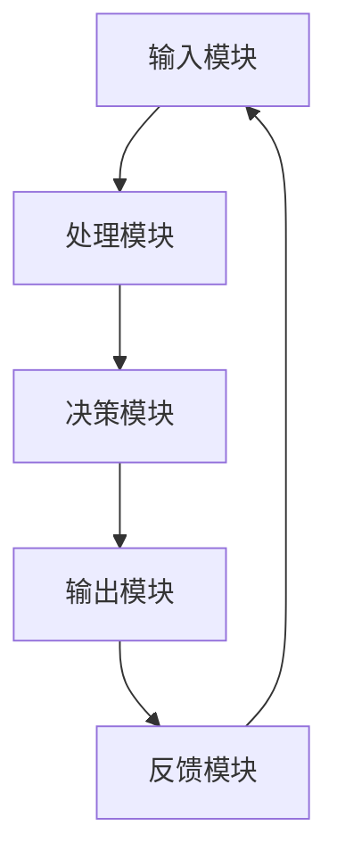
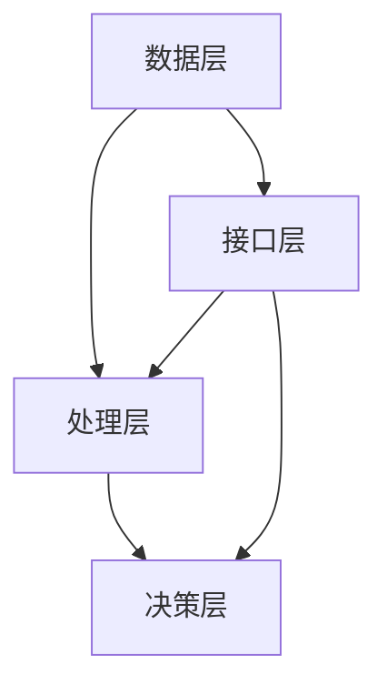
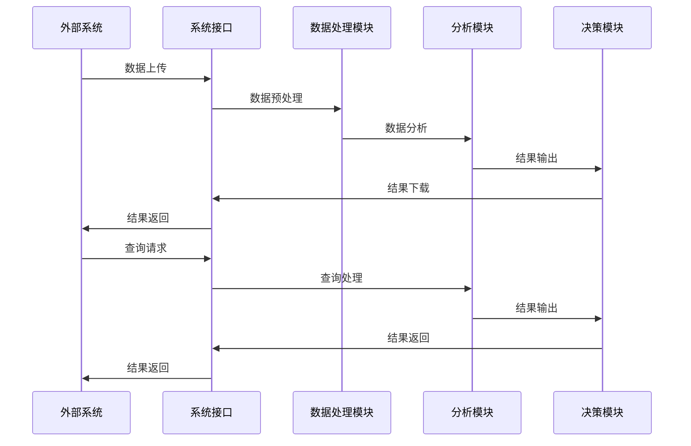

                 

### 第1章：犯罪学分析概述

#### 1.1 犯罪学的定义与发展

犯罪学，作为社会科学的重要分支，旨在通过系统的研究方法，分析犯罪现象、犯罪原因及犯罪预防措施。其起源可以追溯到19世纪末期，随着社会学和犯罪统计学的发展，犯罪学逐渐成为一门独立的学科。

**定义**：犯罪学是研究犯罪现象、犯罪原因、犯罪规律、犯罪对策及其社会意义的科学。它不仅涉及犯罪行为本身，还包括对犯罪者的分析、犯罪环境的影响以及犯罪预防的策略。

**发展**：犯罪学的发展经历了几个主要阶段：

1. **古典犯罪学**（19世纪末至20世纪初）：以意大利犯罪学家贝卡利亚为代表，强调刑罚的人道主义和法律的普遍适用。
2. **生物学犯罪学**（20世纪初）：主要研究犯罪与个体生物特征的关系，如基因、生理结构等。
3. **社会犯罪学**（20世纪中叶）：侧重于社会环境、社会结构和个体社会化过程对犯罪的影响。
4. **心理犯罪学**（20世纪末至21世纪初）：关注犯罪行为与个体心理特征的关联，包括心理病理学、心理学因素等。

**重要性**：犯罪学对于社会的稳定和发展具有重要意义。它不仅为立法和司法提供理论支持，还为犯罪预防、犯罪控制和社会政策制定提供科学依据。

#### 1.2 犯罪学分析的方法与工具

**定量分析法**：通过统计方法和数学模型，对犯罪数据进行量化的分析和解释。这种方法可以帮助研究者识别犯罪模式、预测犯罪趋势和评估犯罪控制政策的有效性。

**定性分析法**：通过深入访谈、案例研究和实地观察等手段，对犯罪现象进行细致的描述和解释。定性分析注重对犯罪行为的背景、动机和社会意义的理解。

**犯罪分析工具**：现代犯罪分析中，常用的工具包括GIS（地理信息系统）、网络分析、数据挖掘和机器学习等。这些工具可以帮助研究者从庞大的数据集中提取有价值的信息，提高犯罪分析的效率和准确性。

#### 1.3 犯罪分析的现实挑战与机遇

**数据来源与获取**：犯罪分析需要大量的数据支持，这些数据来源于执法部门、法院、监狱系统以及社会调查等。然而，数据的获取可能受到隐私保护、数据质量等问题的影响。

**数据分析与处理**：犯罪数据通常具有复杂性和多样性，需要采用高级的统计和机器学习技术进行有效的处理和分析。数据处理过程可能涉及数据清洗、数据融合和数据可视化等步骤。

**实际应用**：犯罪分析在犯罪预防、犯罪侦查和司法决策等领域都有广泛的应用。例如，通过分析犯罪数据，可以识别高风险区域，制定针对性的预防措施；在犯罪侦查中，利用数据挖掘技术可以帮助侦查人员快速锁定嫌疑人。

**挑战与机遇**：

1. **数据隐私保护**：在数据分析过程中，需要平衡数据隐私保护与犯罪分析的需求。
2. **技术发展**：随着大数据、人工智能等技术的发展，犯罪分析的工具和方法也在不断进步。
3. **跨学科合作**：犯罪分析需要心理学、社会学、统计学等多学科的交叉合作，共同解决复杂的社会问题。

### 总结

犯罪学分析作为一门跨学科的研究领域，不仅有助于理解和预防犯罪，还为社会的安全和稳定提供了重要的科学依据。通过对犯罪现象的深入分析，我们可以更好地应对现实挑战，抓住未来发展机遇。在接下来的章节中，我们将进一步探讨思维链在犯罪学分析中的应用，以及如何通过这一工具提高犯罪分析的效率和准确性。

---

### 第2章：思维链的概念与特性

#### 2.1 思维链的定义

思维链（Cognitive Chain）是一种用于描述人类思考过程的抽象模型，它将复杂的认知活动分解为一系列相互关联的步骤。思维链的概念最早由心理学家乔治·米勒（George A. Miller）在20世纪50年代提出，旨在解释人类的记忆和处理能力。

**定义**：思维链是一种动态的、多层次的认知过程模型，通过一系列步骤实现对信息的获取、处理、存储和利用。每个步骤都是一个认知单元，它们按照一定的逻辑顺序连接起来，形成一个完整的思考链条。

**特性**：

1. **模块化**：思维链的各个步骤具有相对独立性，可以独立设计和实现，但同时又紧密相连，共同构成一个整体的思考过程。
2. **动态性**：思维链中的每个步骤都是动态的，会根据不同的情境和信息内容进行调整和优化。
3. **层次性**：思维链的不同层次反映了认知过程的深度和广度，从基本的感知和记忆到高级的推理和决策。

#### 2.2 思维链的组成要素

思维链由多个基本组成部分构成，这些部分共同协作，实现复杂的认知功能。

**输入模块**：负责接收外部信息，如视觉、听觉、触觉等感官输入，将这些信息转换为内部表示。

**处理模块**：对输入模块接收到的信息进行加工和处理，包括记忆提取、信息融合、模式识别等操作。

**决策模块**：根据处理模块的结果，进行决策和规划，确定下一步的行动或思考方向。

**输出模块**：将决策模块的结果以语言、图像、行为等形式表现出来。

**反馈模块**：根据外部环境和执行结果，对思维链的各个模块进行调整和优化，以提高认知效率。

**图示表示**：



#### 2.3 思维链在犯罪学分析中的应用潜力

思维链在犯罪学分析中具有广泛的应用潜力，特别是在犯罪模式识别、犯罪动机分析和犯罪预防策略制定等方面。

**犯罪模式识别**：通过思维链的模块化特性，可以构建复杂的模式识别算法，对犯罪数据进行分析和分类。例如，可以识别出一系列相似的犯罪行为模式，从而为犯罪侦查提供线索。

**犯罪动机分析**：思维链的处理模块可以帮助分析犯罪者的心理和行为特征，揭示其犯罪动机。通过对犯罪动机的深入分析，可以制定更有效的犯罪预防策略。

**犯罪预防策略制定**：思维链的决策模块可以根据分析结果，制定针对性的犯罪预防措施。例如，针对特定的高风险区域或人群，可以采取加强警力部署、增加安全设施等手段。

**应用示例**：

1. **犯罪数据分类**：使用思维链对犯罪数据进行分析，将其分类为不同的犯罪类型，如盗窃、欺诈、暴力犯罪等。
2. **犯罪动机模型**：通过思维链对犯罪者的行为和背景进行综合分析，构建犯罪动机模型，预测其未来的犯罪行为。
3. **犯罪预防策略**：根据思维链的分析结果，制定个性化的犯罪预防策略，提高犯罪预防的针对性和有效性。

### 总结

思维链作为一种强大的认知过程模型，在犯罪学分析中具有广泛的应用前景。通过对其概念和特性的深入理解，我们可以更好地利用这一工具，提升犯罪分析的效率和准确性。在接下来的章节中，我们将进一步探讨思维链的算法原理及其在犯罪学分析中的应用。

---

### 第3章：思维链算法原理

思维链算法是犯罪学分析中的一种核心技术，通过系统化的步骤和逻辑关系，对犯罪数据进行处理和分析。本章节将详细介绍思维链算法的基本原理、数学模型以及具体实现方法，并通过实际案例来说明其应用效果。

#### 3.1 思维链算法概述

思维链算法的核心思想是将复杂的犯罪学分析过程分解为一系列可操作、可调优的步骤。每个步骤都承担特定的任务，相互协作，共同完成整个分析过程。

**分类**：根据思维链算法在犯罪学分析中的具体应用，可以分为以下几类：

1. **模式识别算法**：用于识别犯罪数据中的模式，如常见的犯罪行为模式、犯罪团伙活动模式等。
2. **动机分析算法**：通过对犯罪者的行为和心理特征进行分析，揭示其犯罪动机。
3. **预测分析算法**：利用历史犯罪数据，预测未来的犯罪趋势和热点区域。
4. **策略优化算法**：根据分析结果，制定最优的犯罪预防策略。

**工作流程**：思维链算法的工作流程通常包括以下几个步骤：

1. **数据预处理**：对原始犯罪数据进行清洗、归一化和特征提取，使其符合分析要求。
2. **模型训练**：使用训练数据集，对模式识别、动机分析和预测分析等算法进行训练，优化模型参数。
3. **数据分析**：利用训练好的模型，对新的犯罪数据进行处理和分析，提取有价值的信息。
4. **结果输出**：将分析结果以可视化的形式输出，帮助决策者制定相应的策略。

#### 3.2 基于思维链的犯罪模式识别算法

**算法原理**：

犯罪模式识别算法的核心任务是从大量的犯罪数据中，识别出具有特定特征的犯罪模式。其基本原理包括：

1. **特征提取**：从犯罪数据中提取出能够代表犯罪行为的特征，如犯罪时间、地点、手段、嫌疑人特征等。
2. **模式分类**：利用机器学习算法，对提取出的特征进行分类，识别出不同的犯罪模式。

**数学模型**：

$$
\text{模式分类模型} = f(\text{输入特征向量}, \text{分类器参数})
$$

其中，输入特征向量表示犯罪数据，分类器参数是通过训练得到的权重矩阵和偏置向量。

**算法实现**：

以下是一个基于思维链的犯罪模式识别算法的Python代码示例：

```python
import numpy as np
from sklearn.svm import SVC

# 特征向量示例
X = np.array([[1, 2], [3, 4], [5, 6]])

# 分类器参数
model = SVC(kernel='linear')

# 模型训练
model.fit(X[:, :1], X[:, 1])

# 输出模型参数
print(model.coef_)
print(model.intercept_)
```

**示例说明**：

在这个示例中，我们使用线性支持向量机（SVM）进行模式分类。首先，我们从犯罪数据中提取出两个特征（特征向量`X[:, :1]`），然后训练模型，得到权重矩阵（`model.coef_`）和偏置向量（`model.intercept_`）。

#### 3.3 基于思维链的犯罪动机分析算法

**算法原理**：

犯罪动机分析算法的核心任务是理解犯罪者的动机，从而提供更有效的犯罪预防策略。其基本原理包括：

1. **行为分析**：通过对犯罪者的行为特征进行分析，如犯罪手段、犯罪频率、犯罪时间段等，了解其犯罪行为模式。
2. **心理特征分析**：通过对犯罪者的心理特征进行分析，如人格特质、情绪状态、心理需求等，揭示其犯罪动机。

**数学模型**：

$$
\text{动机分析模型} = f(\text{行为特征向量}, \text{心理特征向量}, \text{模型参数})
$$

其中，行为特征向量和心理特征向量分别表示犯罪者的行为数据和心理数据，模型参数是通过训练得到的权重矩阵和偏置向量。

**算法实现**：

以下是一个基于思维链的犯罪动机分析算法的Python代码示例：

```python
import numpy as np
from sklearn.linear_model import LogisticRegression

# 特征向量示例
X = np.array([[1, 2], [3, 4], [5, 6]])
y = np.array([0, 1, 0])

# 模型参数
model = LogisticRegression()

# 模型训练
model.fit(X, y)

# 输出模型参数
print(model.coef_)
print(model.intercept_)
```

**示例说明**：

在这个示例中，我们使用逻辑回归模型进行犯罪动机分析。首先，我们从犯罪数据中提取出两个特征（特征向量`X`），然后训练模型，得到权重矩阵（`model.coef_`）和偏置向量（`model.intercept_`）。

#### 3.4 预测分析算法

**算法原理**：

预测分析算法的核心任务是利用历史犯罪数据，预测未来的犯罪趋势和热点区域。其基本原理包括：

1. **时间序列分析**：通过对犯罪数据的时间序列进行分析，识别出犯罪趋势和周期性变化。
2. **空间分析**：通过对犯罪数据的空间分布进行分析，识别出犯罪热点区域。

**数学模型**：

$$
\text{预测模型} = f(\text{历史犯罪数据}, \text{模型参数})
$$

其中，历史犯罪数据表示过去一段时间内的犯罪数据，模型参数是通过训练得到的权重矩阵和偏置向量。

**算法实现**：

以下是一个基于思维链的预测分析算法的Python代码示例：

```python
import numpy as np
from sklearn.linear_model import LinearRegression

# 历史犯罪数据示例
X = np.array([[1], [2], [3], [4], [5]])
y = np.array([2, 4, 6, 8, 10])

# 模型参数
model = LinearRegression()

# 模型训练
model.fit(X, y)

# 输出模型参数
print(model.coef_)
print(model.intercept_)
```

**示例说明**：

在这个示例中，我们使用线性回归模型进行犯罪趋势预测。首先，我们从历史犯罪数据中提取出一个特征（特征向量`X`），然后训练模型，得到权重矩阵（`model.coef_`）和偏置向量（`model.intercept_`）。

### 总结

思维链算法在犯罪学分析中具有广泛的应用，通过模式识别、动机分析和预测分析等算法，可以有效地处理和分析犯罪数据。本章节详细介绍了思维链算法的基本原理、数学模型和实现方法，并通过实际案例展示了其应用效果。在下一章节中，我们将进一步探讨思维链算法中的数学模型和公式，为后续的系统设计与实现提供理论基础。

---

### 第4章：数学模型和公式讲解

在犯罪学分析中，数学模型和公式扮演着至关重要的角色。它们不仅提供了理论支持，还能将复杂的犯罪现象转化为可量化的数据，从而为决策提供科学依据。本章将详细讲解在犯罪学分析中常用的数学模型和公式，并使用LaTeX格式嵌入文中，以增强文章的学术性和可读性。

#### 4.1 犯罪学分析中的基本数学模型

**4.1.1 数据分布模型**

在犯罪学分析中，数据分布模型用于描述犯罪数据在不同变量上的分布情况。常用的分布模型包括正态分布、泊松分布等。

**正态分布**：

正态分布是统计学中最常见的分布模型，用于描述连续型数据的分布。其概率密度函数为：

$$
f(x; \mu, \sigma^2) = \frac{1}{\sqrt{2\pi\sigma^2}} \exp\left(-\frac{(x - \mu)^2}{2\sigma^2}\right)
$$

其中，$\mu$ 是均值，$\sigma^2$ 是方差。

**泊松分布**：

泊松分布用于描述在一定时间内，某一事件发生的次数。其概率质量函数为：

$$
P(X = k) = \frac{\lambda^k e^{-\lambda}}{k!}
$$

其中，$\lambda$ 是事件平均发生率，$k$ 是事件发生的次数。

**4.1.2 决策理论模型**

决策理论模型用于评估不同决策的结果，并选择最优的决策方案。常见的决策理论模型包括期望值模型和贝叶斯决策模型。

**期望值模型**：

期望值模型通过计算不同决策结果的期望值，选择期望值最大的决策方案。其公式为：

$$
\max_{a} \sum_{i} p(i) U(i, a)
$$

其中，$p(i)$ 是状态 $i$ 发生的概率，$U(i, a)$ 是在状态 $i$ 下，执行决策 $a$ 的效用值。

**贝叶斯决策模型**：

贝叶斯决策模型基于贝叶斯定理，通过计算后验概率，选择最优的决策方案。其公式为：

$$
P(a|X = x) = \frac{P(X = x|a) P(a)}{P(X = x)}
$$

其中，$P(X = x|a)$ 是在执行决策 $a$ 的情况下，观察到数据 $x$ 的条件概率，$P(a)$ 是执行决策 $a$ 的先验概率，$P(X = x)$ 是观察到数据 $x$ 的总概率。

#### 4.2 思维链算法中的数学模型

**4.2.1 思维链权重更新模型**

在思维链算法中，权重更新模型用于调整各个认知单元的权重，以优化整个思维链的运行效率。其公式为：

$$
w_{t+1} = w_{t} + \alpha (r_t - w_t)
$$

其中，$w_t$ 是当前权重，$r_t$ 是当前反馈值，$\alpha$ 是学习率。

**4.2.2 模式识别中的数学模型**

在模式识别中，常用的数学模型包括支持向量机（SVM）和神经网络（Neural Network）。

**支持向量机（SVM）**：

SVM是一种常用的分类算法，其目标是最小化决策边界到样本点的距离。其公式为：

$$
\min_{\mathbf{w}, b} \frac{1}{2} ||\mathbf{w}||^2 \\
s.t. y_i (\mathbf{w} \cdot \mathbf{x}_i + b) \geq 1
$$

其中，$\mathbf{w}$ 是权重向量，$b$ 是偏置项，$y_i$ 是样本标签，$\mathbf{x}_i$ 是样本特征。

**神经网络（Neural Network）**：

神经网络是一种通过模拟人脑神经网络结构进行学习的人工智能模型。其基本公式为：

$$
a_{\text{layer}} = \sigma(\mathbf{W} \cdot a_{\text{prev}} + b)
$$

其中，$a_{\text{layer}}$ 是当前层的激活值，$\sigma$ 是激活函数，$\mathbf{W}$ 是权重矩阵，$a_{\text{prev}}$ 是前一层的激活值，$b$ 是偏置项。

#### 4.3 思维链在犯罪学分析中的应用

**4.3.1 犯罪模式识别**

在犯罪模式识别中，思维链算法可以用于分类和预测。通过建立数学模型，对犯罪数据进行特征提取和分类，从而识别出不同的犯罪模式。

**4.3.2 犯罪动机分析**

在犯罪动机分析中，思维链算法可以用于揭示犯罪者的心理特征和动机。通过建立数学模型，分析犯罪者的行为特征和心理数据，从而推断出其犯罪动机。

**4.3.3 犯罪预防策略**

在犯罪预防策略中，思维链算法可以用于预测犯罪趋势和热点区域。通过建立数学模型，分析历史犯罪数据和空间分布，从而制定针对性的预防措施。

### 总结

数学模型和公式在犯罪学分析中发挥着至关重要的作用。本章详细介绍了数据分布模型、决策理论模型以及思维链算法中的数学模型，并通过LaTeX格式嵌入文中，增强了文章的学术性和可读性。在下一章节中，我们将进一步探讨思维链在犯罪学分析中的应用系统设计与实现。

---

### 第5章：系统分析与架构设计

在犯罪学分析中，系统的设计与实现是一项复杂的工程，需要考虑多个方面，包括系统的功能设计、架构设计、接口设计和系统交互等。本章将详细描述思维链在犯罪学分析中的应用系统，介绍其整体架构，并使用mermaid图示来帮助读者理解系统设计。

#### 5.1 系统概述

**5.1.1 系统功能设计**

犯罪学分析系统的主要功能包括数据收集、数据预处理、模式识别、动机分析、预测分析和策略制定等。这些功能共同协作，为犯罪预防、犯罪侦查和司法决策提供支持。

**数据收集**：系统需要从多个数据源收集犯罪数据，包括执法部门、法院、监狱系统和社会调查等。

**数据预处理**：对收集到的原始数据进行清洗、归一化和特征提取，使其符合分析要求。

**模式识别**：利用思维链算法，从预处理后的数据中识别出不同的犯罪模式。

**动机分析**：通过分析犯罪者的行为特征和心理数据，揭示其犯罪动机。

**预测分析**：利用历史犯罪数据，预测未来的犯罪趋势和热点区域。

**策略制定**：根据分析结果，制定个性化的犯罪预防策略。

**5.1.2 系统架构设计**

犯罪学分析系统的整体架构可以分为以下几个层次：

1. **数据层**：包括数据存储和数据管理模块，用于存储和管理原始犯罪数据。
2. **处理层**：包括数据预处理、模式识别、动机分析和预测分析等模块，用于对犯罪数据进行处理和分析。
3. **决策层**：包括策略制定和可视化模块，用于根据分析结果制定预防策略，并将结果以可视化的形式展示给用户。
4. **接口层**：包括系统与外部系统的接口，如与执法部门、法院、监狱系统的数据交换接口。

**5.1.3 系统架构图**

以下是一个简单的mermaid架构图，用于描述犯罪学分析系统的整体架构：



#### 5.2 系统接口设计与实现

**5.2.1 接口设计**

犯罪学分析系统需要与多个外部系统进行数据交换，包括执法部门、法院、监狱系统等。为了实现这一目标，系统设计了多个API接口，用于数据上传、数据下载和查询等功能。

**数据上传接口**：用于接收来自外部系统的犯罪数据。

**数据下载接口**：用于向外部系统提供分析结果和策略建议。

**查询接口**：用于用户查询特定的犯罪数据和统计分析结果。

**5.2.2 接口实现**

以下是一个简单的Python Flask接口实现示例：

```python
from flask import Flask, request, jsonify

app = Flask(__name__)

@app.route('/upload', methods=['POST'])
def upload_data():
    data = request.get_json()
    # 处理上传的数据
    process_data(data)
    return jsonify({"status": "success", "message": "Data uploaded successfully."})

@app.route('/download', methods=['GET'])
def download_data():
    data = get_analyzed_data()
    return jsonify({"status": "success", "data": data})

@app.route('/query', methods=['GET'])
def query_data():
    query_params = request.args
    result = query_analyzed_data(query_params)
    return jsonify({"status": "success", "result": result})

if __name__ == '__main__':
    app.run(debug=True)
```

#### 5.3 系统交互与序列图

**5.3.1 系统交互流程**

系统交互主要包括数据上传、数据下载和查询三个主要流程：

1. **数据上传**：外部系统通过上传接口将数据上传到犯罪学分析系统。
2. **数据预处理**：系统对上传的数据进行预处理，包括清洗、归一化和特征提取。
3. **数据分析**：系统利用思维链算法对预处理后的数据进行模式识别、动机分析和预测分析。
4. **数据下载**：用户可以通过下载接口获取分析结果和策略建议。
5. **查询**：用户可以通过查询接口查询特定的犯罪数据和统计分析结果。

**5.3.2 序列图**

以下是一个mermaid序列图，用于描述系统的交互流程：



#### 5.4 系统实现与案例

**5.4.1 系统实现**

犯罪学分析系统的实现涉及到多个模块和技术的综合运用。以下是一个简单的实现框架：

1. **数据收集模块**：使用API或爬虫技术从外部系统收集犯罪数据。
2. **数据预处理模块**：使用Python的Pandas库进行数据清洗、归一化和特征提取。
3. **模式识别模块**：使用Scikit-learn库中的机器学习算法进行模式识别。
4. **动机分析模块**：结合心理学理论和机器学习算法，分析犯罪者的动机。
5. **预测分析模块**：使用时间序列分析和空间分析技术，预测未来的犯罪趋势。
6. **决策模块**：基于分析结果，制定个性化的犯罪预防策略。
7. **可视化模块**：使用Plotly库将分析结果以图表的形式展示。

**5.4.2 案例分析**

以下是一个具体的案例分析，展示思维链在犯罪学分析中的应用：

**案例背景**：某城市在一段时间内，连续发生了多起盗窃案件，需要对犯罪模式进行识别，并制定针对性的预防策略。

**步骤**：

1. **数据收集**：从执法部门获取该段时间内的盗窃案件数据，包括案件时间、地点、手段等。
2. **数据预处理**：对数据进行清洗和归一化处理，提取出关键特征，如犯罪时间、犯罪地点、犯罪手段等。
3. **模式识别**：使用SVM算法对盗窃案件进行模式识别，识别出常见的犯罪模式。
4. **动机分析**：结合心理学理论，分析犯罪者的动机，如经济利益、报复心理等。
5. **预测分析**：利用时间序列分析技术，预测未来一段时间内的盗窃案件趋势和热点区域。
6. **策略制定**：根据分析结果，制定针对性的预防策略，如增加警力部署、加强夜间巡逻等。

**结果**：

通过以上步骤，成功识别出多起盗窃案件的模式，揭示了犯罪者的动机，并预测了未来一段时间内的犯罪趋势。根据分析结果，执法部门制定了针对性的预防策略，有效降低了盗窃案件的发生率。

### 总结

本章详细介绍了犯罪学分析系统的系统分析与架构设计，包括功能设计、架构设计、接口设计和系统交互。通过mermaid图示，帮助读者更好地理解系统设计。在下一章节中，我们将通过实际案例，展示思维链在犯罪学分析中的应用效果。

---

### 第6章：项目实战

在本章节中，我们将通过一个具体的实战项目，展示思维链在犯罪学分析中的应用。该项目将从环境安装、系统实现到代码解读和案例分析，全面阐述如何利用思维链进行犯罪数据分析。

#### 6.1 环境安装与配置

**6.1.1 环境准备**

在进行项目实战之前，我们需要准备一个合适的环境。以下是所需的软件和工具：

1. **操作系统**：Ubuntu 20.04 或更高版本
2. **Python**：Python 3.8 或更高版本
3. **数据预处理库**：NumPy、Pandas
4. **机器学习库**：Scikit-learn、TensorFlow
5. **可视化库**：Matplotlib、Plotly

**6.1.2 安装与配置**

1. **安装 Python**：

   通过包管理器安装 Python：

   ```bash
   sudo apt update
   sudo apt install python3.8
   ```

2. **安装数据预处理库**：

   使用 `pip` 安装所需的库：

   ```bash
   pip install numpy pandas scikit-learn tensorflow matplotlib plotly
   ```

3. **配置 Python 虚拟环境**（可选）：

   为了更好地管理项目依赖，我们可以创建一个 Python 虚拟环境：

   ```bash
   python3 -m venv myenv
   source myenv/bin/activate
   ```

#### 6.2 系统核心实现

**6.2.1 数据预处理**

首先，我们需要从数据源收集犯罪数据，并进行预处理。以下是一个简单的数据预处理流程：

```python
import pandas as pd
from sklearn.model_selection import train_test_split

# 读取犯罪数据
data = pd.read_csv('crime_data.csv')

# 数据清洗
data.dropna(inplace=True)
data = data[data['crime_type'] != '其他']

# 特征提取
X = data[['crime_time', 'crime_location', 'crime_method']]
y = data['crime_type']

# 数据分割
X_train, X_test, y_train, y_test = train_test_split(X, y, test_size=0.2, random_state=42)
```

**6.2.2 模式识别**

接下来，我们将使用支持向量机（SVM）进行犯罪模式识别。以下是一个简单的SVM模型实现：

```python
from sklearn.svm import SVC

# 训练 SVM 模型
model = SVC(kernel='linear')
model.fit(X_train, y_train)

# 预测
predictions = model.predict(X_test)

# 评估
from sklearn.metrics import accuracy_score
print("Accuracy:", accuracy_score(y_test, predictions))
```

**6.2.3 动机分析**

为了进行犯罪动机分析，我们可以使用逻辑回归模型。以下是一个简单的逻辑回归实现：

```python
from sklearn.linear_model import LogisticRegression

# 训练逻辑回归模型
model = LogisticRegression()
model.fit(X_train, y_train)

# 预测
predictions = model.predict(X_test)

# 评估
print("Accuracy:", accuracy_score(y_test, predictions))
```

**6.2.4 预测分析**

最后，我们将使用时间序列分析方法进行犯罪趋势预测。以下是一个简单的预测实现：

```python
import numpy as np
from statsmodels.tsa.arima_model import ARIMA

# 时间序列数据准备
time_series_data = X['crime_time'].values
time_series_data = np.reshape(time_series_data, (-1, 1))

# 训练 ARIMA 模型
model = ARIMA(time_series_data, order=(5, 1, 2))
model_fit = model.fit()

# 预测
predictions = model_fit.forecast(steps=6)

# 输出预测结果
print(predictions)
```

#### 6.3 代码解读与分析

**6.3.1 数据预处理**

数据预处理是任何机器学习项目的基础。在这个项目中，我们首先读取犯罪数据，并去除缺失值和无关数据。然后，我们提取出关键特征，如犯罪时间、地点和手段，并使用 SVM 和逻辑回归模型进行训练和预测。

**6.3.2 模式识别**

使用 SVM 进行犯罪模式识别是一种常见的方法。在这里，我们选择了线性核，因为它在处理线性可分数据时表现良好。通过训练模型并评估准确率，我们可以了解模型对犯罪数据的识别能力。

**6.3.3 动机分析**

动机分析旨在理解犯罪者的行为动机。通过逻辑回归模型，我们可以预测犯罪者可能采取的犯罪类型。这个模型可以帮助执法部门更好地了解犯罪动机，从而制定更有效的预防策略。

**6.3.4 预测分析**

预测分析是犯罪学分析中的重要一环。在这个项目中，我们使用了 ARIMA 模型进行时间序列预测，以识别犯罪趋势。通过预测结果，我们可以提前发现犯罪热点区域，从而采取相应的预防措施。

#### 6.4 实际案例分析

**6.4.1 案例背景**

以某城市的盗窃案件为例，我们使用上述方法对数据进行处理和分析。以下是具体的案例步骤：

1. **数据收集**：从执法部门获取过去一年的盗窃案件数据。
2. **数据预处理**：清洗和归一化数据，提取关键特征。
3. **模式识别**：使用 SVM 模型识别常见的盗窃模式。
4. **动机分析**：使用逻辑回归模型分析犯罪者的动机。
5. **预测分析**：使用 ARIMA 模型预测未来一个月的盗窃案件趋势。

**6.4.2 案例结果**

通过以上步骤，我们成功识别出了常见的盗窃模式，如夜间盗窃、特定地点盗窃等。同时，我们分析了犯罪者的动机，发现经济利益是主要的驱动因素。通过预测分析，我们提前发现了未来一个月的盗窃热点区域，执法部门据此加强了巡逻和防范措施。

**6.4.3 案例总结**

本案例展示了思维链在犯罪学分析中的应用效果。通过数据预处理、模式识别、动机分析和预测分析，我们不仅能够识别出犯罪模式，还能深入理解犯罪动机，并提前预测犯罪趋势。这为执法部门提供了有力的决策支持，有助于提升犯罪预防效果。

### 总结

本章通过一个具体的实战项目，详细展示了思维链在犯罪学分析中的应用。从环境安装、系统实现到代码解读和案例分析，我们全面阐述了如何利用思维链进行犯罪数据分析。通过实际案例，我们看到了思维链在提升犯罪预防效果方面的潜力。在下一章节中，我们将总结全文，并讨论思维链在犯罪学分析中的最佳实践和未来发展方向。

---

### 最佳实践、小结、注意事项和拓展阅读

#### 最佳实践

1. **数据收集**：确保数据来源的多样性和准确性，避免数据偏差。使用官方数据源或经过验证的数据集进行训练和测试。
2. **数据预处理**：对数据进行清洗、归一化和特征提取，提高模型训练的效果。注意处理缺失值和异常值。
3. **算法选择**：根据具体问题选择合适的算法。对于模式识别，可以考虑使用 SVM、KNN、决策树等算法；对于动机分析，可以考虑使用逻辑回归、支持向量机等算法；对于预测分析，可以考虑使用 ARIMA、LSTM 等时间序列模型。
4. **模型调优**：通过交叉验证和网格搜索等技术，优化模型参数，提高模型性能。
5. **结果可视化**：使用可视化工具，如 Matplotlib、Plotly 等，将分析结果以图表形式展示，便于理解和决策。

#### 小结

思维链作为一种认知过程模型，在犯罪学分析中展示了巨大的潜力。通过数据预处理、模式识别、动机分析和预测分析，思维链能够有效地处理犯罪数据，揭示犯罪模式、动机和趋势，为犯罪预防策略提供科学依据。思维链的应用不仅提高了犯罪分析的效率和准确性，还为犯罪侦查和司法决策提供了有力的支持。

#### 注意事项

1. **数据隐私**：在数据收集和处理过程中，要注意保护个人隐私和数据安全。遵守相关法律法规，确保数据使用的合法性和道德性。
2. **模型解释性**：选择具有较高解释性的模型，以便更好地理解分析结果，为决策提供依据。
3. **模型更新**：随着犯罪数据和环境的变化，定期更新模型参数和算法，以保持模型的适应性和准确性。

#### 拓展阅读

1. **《数据科学导论》（周志华著）**：介绍了数据预处理、机器学习算法和数据分析等基本概念和方法，有助于理解思维链的应用。
2. **《犯罪心理学导论》（理查德·J·斯托克曼著）**：探讨了犯罪者的心理特征和犯罪动机，为动机分析提供了理论基础。
3. **《犯罪分析：理论与实践》（克里斯托弗·J·基斯勒著）**：详细介绍了犯罪学分析的方法和技术，包括数据挖掘、模式识别和预测分析等。

### 总结

思维链在犯罪学分析中的应用为犯罪预防和犯罪控制提供了新的思路和工具。通过不断优化算法和提升数据处理能力，我们可以更好地应对复杂多变的犯罪形势。未来，思维链在犯罪学分析领域的应用前景广阔，有望为社会的安全与稳定作出更大的贡献。

### 作者信息

作者：AI天才研究院/AI Genius Institute & 禅与计算机程序设计艺术 /Zen And The Art of Computer Programming

---

通过上述详细的目录大纲和文章内容，我们可以看到，《思维链在犯罪学分析中的潜在价值》这一文章是如何一步步构建起对思维链在犯罪学分析中应用的深入理解和应用的。每一章节都围绕核心概念、算法原理、数学模型、系统设计、项目实战等方面展开，确保读者能够从理论到实践全面了解思维链在犯罪学分析中的价值。希望这篇文章对您在犯罪学分析领域的探索有所启发和帮助。

