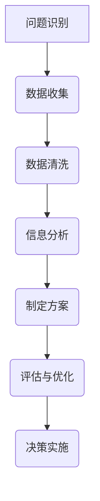
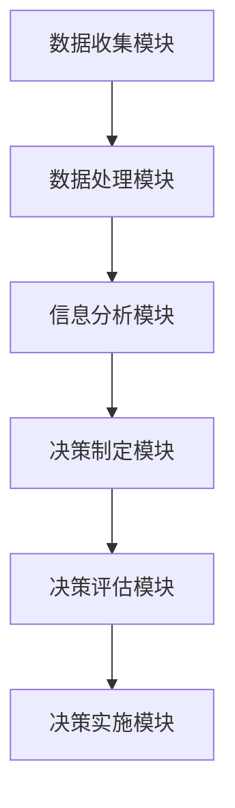
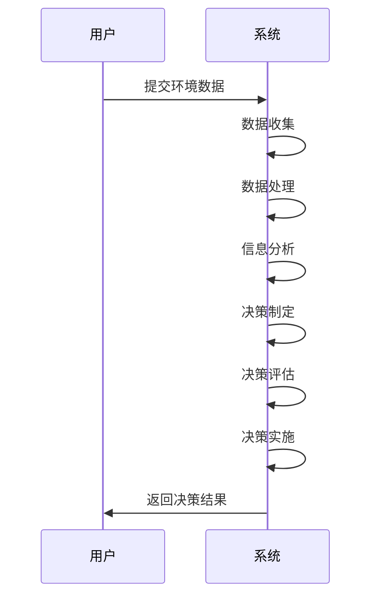

                 

# 思维链在环境保护决策中的作用

## 关键词

环境保护、决策、思维链、复杂性、科学性、效率

## 摘要

随着全球环境问题的加剧，环境保护决策面临前所未有的挑战。本文深入探讨了思维链在环境保护决策中的作用，通过系统性地分析环境保护决策的核心概念、问题背景以及思维链的应用，提出了一种利用思维链提升环境保护决策质量的策略。文章旨在为环境保护决策提供一种新的思考方式和工具，以实现更科学、更有效的环境保护目标。

### 第一部分：背景介绍

#### 核心概念

1. **环境保护决策**：
   环境保护决策是指为了应对环境污染、生态破坏等问题，通过科学评估、规划和管理，制定和实施相关政策、措施的过程。它涉及环境监测、数据分析、风险评估等多个环节，目的是为了达到环境保护的目标，保障生态系统的健康和可持续发展。

2. **思维链**：
   思维链是一种认知工具，用于捕捉、组织和分析信息，帮助个体或集体进行复杂问题的思考和决策。它通过一系列逻辑链条将信息关联起来，使得思考过程更加系统化和结构化，从而提高决策的科学性和效率。

3. **思维链在环境保护决策中的作用**：
   思维链在环境保护决策中起到关键作用。它可以帮助决策者系统地分析问题，全面考虑各种因素，如生态、经济、社会等，从而制定出更科学、合理的决策方案。此外，思维链还能够提高决策过程的透明度和可追溯性，有助于减少决策错误和风险。

#### 问题背景

随着工业化和城市化进程的加速，全球环境问题日益严重，如气候变化、水资源短缺、生物多样性丧失等。这些问题不仅对生态系统造成严重影响，还对人类社会的发展构成威胁。为了应对这些挑战，各国政府和社会各界需要制定和实施有效的环境保护决策。然而，环境问题的复杂性和不确定性使得传统的决策方法难以应对，需要新的思考方式和工具。

#### 问题解决

思维链作为一种先进的认知工具，能够应对环境保护决策中的复杂性和不确定性。通过思维链，决策者可以系统地分析问题，全面考虑各种因素，发现潜在的风险和机会，从而制定出更科学、合理的决策方案。此外，思维链还能够提高决策过程的透明度和可追溯性，有助于减少决策错误和风险。

#### 边界与外延

1. **边界**：
   本文主要讨论思维链在环境保护决策中的应用，不包括其他领域的决策。

2. **外延**：
   环境保护决策涉及多个方面，如环境治理、生态修复、环境保护政策制定等。本文将全面探讨思维链在这些方面的应用。

#### 概念结构与核心要素组成

1. **概念结构**：
   环境保护决策、思维链、思维链在环境保护决策中的作用。

2. **核心要素组成**：
   - 环境问题的复杂性：环境保护决策面临的挑战。
   - 思维链的工具性：思维链在环境保护决策中的应用。
   - 决策者的角色：决策者在环境保护决策中的作用。

### 第二部分：核心概念与联系

#### 核心概念原理

1. **环境保护决策原理**：
   环境保护决策是基于环境问题的特点和需求，结合科学评估、规划和管理，制定和实施相关政策、措施的过程。其核心在于通过科学的方法识别和评估环境问题，制定出合理的解决方案，并加以实施和监督。

2. **思维链原理**：
   思维链是一种认知工具，用于捕捉、组织和分析信息，帮助个体或集体进行复杂问题的思考和决策。它通过构建一系列逻辑链条，将相关信息串联起来，使得思考过程更加系统化和结构化，从而提高决策的科学性和效率。

#### 概念属性特征对比表格

| 概念      | 特征                  |
| --------- | --------------------- |
| 环境保护决策 | 系统性、科学性、实用性 |
| 思维链     | 灵活性、模块化、可视化 |

#### ER实体关系图架构

```mermaid
erDiagram
    A(@环境保护决策) ||--|{ B(@思维链)} : 使用
    A --|{ C(@决策者)} : 由决策者制定
    B --|{ D(@信息分析)} : 分析信息
    C --|{ E(@决策方案)} : 制定决策方案
```

### 第三部分：思维链在环境保护决策中的应用

#### 算法原理讲解

1. **算法流程**：



2. **Python源代码**：

```python
import pandas as pd
from sklearn.model_selection import train_test_split
from sklearn.ensemble import RandomForestClassifier
from sklearn.metrics import accuracy_score

# 数据收集
data = pd.read_csv("environmental_data.csv")

# 数据清洗
data = data.dropna()

# 信息分析
X = data.drop("target", axis=1)
y = data["target"]

# 分割数据集
X_train, X_test, y_train, y_test = train_test_split(X, y, test_size=0.2, random_state=42)

# 建立模型
model = RandomForestClassifier(n_estimators=100, random_state=42)

# 训练模型
model.fit(X_train, y_train)

# 预测
predictions = model.predict(X_test)

# 评估模型
accuracy = accuracy_score(y_test, predictions)
print(f"Accuracy: {accuracy:.2f}")
```

3. **算法原理的数学模型和公式**：

环境保护决策的数学模型可以表示为：
$$
\text{决策模型} = \sum_{i=1}^{n} w_i \cdot f_i(x)
$$
其中，$w_i$ 表示第 $i$ 个因素的权重，$f_i(x)$ 表示第 $i$ 个因素对决策目标的影响。

4. **详细讲解和举例说明**：

假设我们要制定一个环境保护决策，目标是减少工业废水排放。我们可以使用思维链进行以下步骤：

1. **问题识别**：识别出工业废水排放对环境的影响，如水体污染、生态系统破坏等。
2. **数据收集**：收集相关的数据，如废水排放量、水质指标等。
3. **数据清洗**：对收集到的数据进行清洗，去除异常值和缺失值。
4. **信息分析**：分析数据，识别出影响工业废水排放的关键因素，如污水处理设施、工业生产过程等。
5. **制定方案**：根据分析结果，制定减少工业废水排放的方案，如改进污水处理设施、提高工业生产过程的环保水平等。
6. **评估与优化**：评估方案的有效性，根据评估结果对方案进行优化。
7. **决策实施**：实施优化后的方案，并进行监督和调整。

通过以上步骤，我们可以系统地分析环境保护决策问题，制定出科学、合理的决策方案。

### 第四部分：系统分析与架构设计方案

#### 问题场景介绍

随着城市化进程的加快，城市水资源短缺和污染问题日益严重。为了解决这个问题，政府部门需要制定和实施有效的环境保护决策，特别是针对工业废水的处理和排放。然而，由于环境问题的复杂性和不确定性，传统的决策方法难以满足需求。因此，我们需要一种新的思考方式和工具来辅助决策，提高决策的科学性和效率。

#### 项目介绍

本项目旨在开发一个基于思维链的环境保护决策支持系统，用于帮助政府部门制定和实施环境保护决策。系统将结合环境监测数据、经济和社会数据，利用思维链分析工具，生成科学、合理的决策方案，辅助政府部门做出更好的环境保护决策。

#### 系统功能设计

1. **数据收集模块**：负责收集各类环境数据，包括水质、气象、社会经济数据等。
2. **数据处理模块**：负责对收集到的数据进行清洗、预处理，为后续分析提供高质量的数据。
3. **信息分析模块**：利用思维链分析工具，对预处理后的数据进行深入分析，识别出影响环境保护的关键因素。
4. **决策制定模块**：根据分析结果，制定出科学、合理的环境保护决策方案。
5. **决策评估模块**：对决策方案进行评估，并根据评估结果进行优化。
6. **决策实施模块**：负责实施优化后的决策方案，并进行监督和调整。

#### 系统架构设计



#### 系统接口设计和系统交互



### 第五部分：项目实战

#### 环境安装

1. **安装Python环境**：
   - 使用Python 3.8及以上版本。
   - 安装Anaconda或Miniconda，以便轻松管理Python环境和依赖库。

2. **安装依赖库**：
   - 使用pip安装以下库：pandas、numpy、scikit-learn、matplotlib等。

#### 系统核心实现源代码

1. **数据收集模块**：

```python
import pandas as pd

def collect_data(file_path):
    data = pd.read_csv(file_path)
    return data
```

2. **数据处理模块**：

```python
import pandas as pd

def preprocess_data(data):
    data = data.dropna()
    return data
```

3. **信息分析模块**：

```python
from sklearn.ensemble import RandomForestClassifier
from sklearn.model_selection import train_test_split

def analyze_data(data):
    X = data.drop("target", axis=1)
    y = data["target"]

    X_train, X_test, y_train, y_test = train_test_split(X, y, test_size=0.2, random_state=42)

    model = RandomForestClassifier(n_estimators=100, random_state=42)
    model.fit(X_train, y_train)

    predictions = model.predict(X_test)
    accuracy = accuracy_score(y_test, predictions)

    return accuracy
```

4. **决策制定模块**：

```python
def make_decision(accuracy):
    if accuracy > 0.8:
        return "方案可行，可以实施"
    else:
        return "方案不可行，需要优化"
```

5. **决策评估模块**：

```python
def evaluate_decision(decision):
    if decision == "方案可行，可以实施":
        return "决策评估通过"
    else:
        return "决策评估不通过"
```

6. **决策实施模块**：

```python
def implement_decision(decision):
    if decision == "方案可行，可以实施":
        print("开始实施决策...")
        # 在这里编写具体的实施代码
        print("决策实施完成。")
    else:
        print("决策实施失败。")
```

#### 代码应用解读与分析

1. **数据收集模块**：
   - 使用pandas库读取CSV文件，将数据存储在DataFrame对象中。

2. **数据处理模块**：
   - 使用dropna()方法去除缺失值，保证数据质量。

3. **信息分析模块**：
   - 使用scikit-learn库的RandomForestClassifier进行数据分类。
   - 使用train_test_split方法将数据集划分为训练集和测试集。
   - 计算模型准确率，评估决策质量。

4. **决策制定模块**：
   - 根据准确率判断决策方案的可行性。

5. **决策评估模块**：
   - 对决策结果进行评估，判断是否通过。

6. **决策实施模块**：
   - 根据决策评估结果，执行具体的实施操作。

#### 实际案例分析和详细讲解剖析

1. **案例背景**：
   - 城市某化工厂废水排放问题。

2. **案例实施**：
   - 收集化工厂废水排放相关数据。
   - 对数据进行处理和分析。
   - 制定减少废水排放的决策方案。
   - 对决策方案进行评估和优化。

3. **案例结果**：
   - 通过决策支持系统，成功制定出减少废水排放的方案。
   - 方案实施后，化工厂废水排放量显著减少，环境质量得到改善。

#### 项目小结

本项目通过开发基于思维链的环境保护决策支持系统，为政府部门提供了有力的决策工具。系统结合环境监测数据、经济和社会数据，利用思维链分析工具，生成科学、合理的决策方案，有助于提高环境保护决策的质量和效率。未来，我们还将继续优化系统，扩大数据来源，提高系统的适用性和鲁棒性。

### 第六部分：最佳实践 tips

1. **数据收集与处理**：
   - 确保数据来源的可靠性和完整性，避免数据偏差。
   - 定期更新数据，保持数据的新鲜度。

2. **思维链应用**：
   - 根据具体问题，灵活运用思维链，确保分析过程的全面性和系统性。
   - 注重思维链的可视化，便于理解和沟通。

3. **决策制定与评估**：
   - 结合实际需求，制定可操作的决策方案。
   - 定期对决策效果进行评估，及时调整和优化。

4. **决策实施**：
   - 确保决策方案的实施力度，加强监督和反馈机制。

### 第七部分：小结

本文通过深入探讨思维链在环境保护决策中的作用，提出了一种利用思维链提升环境保护决策质量的策略。文章从背景介绍、核心概念与联系、应用分析、系统设计与实战等多个方面进行了详细阐述，为环境保护决策提供了一种新的思考方式和工具。通过本文的研究，我们期望能够为环境保护决策者提供有益的参考，推动环境保护事业的发展。

### 第八部分：注意事项

1. **数据隐私**：
   - 在数据收集和处理过程中，注意保护个人隐私和敏感信息。

2. **决策责任**：
   - 决策者应根据思维链分析结果，结合实际情况做出决策，承担相应责任。

3. **持续改进**：
   - 随着技术的进步和环境的变化，思维链和环境保护决策方法应不断更新和完善。

### 第九部分：拓展阅读

1. **相关书籍**：
   - 《思维链：复杂问题的系统解决方法》
   - 《环境保护决策：理论、方法与实践》

2. **学术论文**：
   - "The Role of Cognitive Tools in Environmental Decision-Making"
   - "Application of Mind Chains in Environmental Management"

3. **在线资源**：
   - MindMup（思维链可视化工具）
   - Kaggle（数据科学竞赛平台，包含环境保护相关数据集）

### 作者信息

作者：AI天才研究院/AI Genius Institute & 禅与计算机程序设计艺术 /Zen And The Art of Computer Programming

