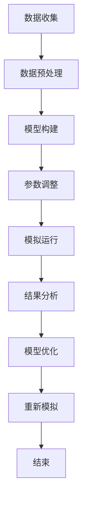

                 

# 思维链在环境生态系统模拟中的新方法

## 关键词
- 思维链
- 环境生态系统
- 模拟方法
- 算法原理
- 数学模型
- 系统架构

## 摘要
本文旨在探讨思维链在环境生态系统模拟中的新方法。首先，我们将介绍环境生态系统模拟的背景和挑战，接着深入探讨思维链的基本原理及其与生态系统的联系。本文将详细解释思维链在生态系统模拟中的新方法，包括其数学模型和算法原理。此外，还将分析系统架构和实现细节，并通过实际案例展示思维链在实际项目中的应用。最后，本文将总结最佳实践并展望未来发展趋势。

## 第一部分：背景与核心概念

### 第1章：环境生态系统模拟的挑战与需求

#### 1.1 问题背景
生态系统模拟在环境科学、资源管理和政策制定等领域具有重要意义。然而，当前的方法面临诸多挑战，如模型复杂性、数据稀缺性、环境变化的不确定性等。

#### 1.2 问题描述
传统模拟方法存在一定的局限性，无法准确预测和应对复杂的环境变化。因此，我们需要新的方法来提升生态系统的模拟精度和适应性。

#### 1.3 问题解决
思维链作为一种新兴的模拟方法，具有处理复杂系统的高效性和灵活性。本文将介绍思维链在生态系统模拟中的应用。

#### 1.4 边界与外延
思维链的适用范围包括环境动态系统、生物多样性评估、生态恢复等。本文将重点关注其在环境生态系统模拟中的应用。

#### 1.5 核心要素组成
生态系统模拟的核心要素包括环境变量、生物种群、相互作用机制等。思维链通过构建这些要素的动态模型，实现生态系统的模拟。

### 第2章：思维链的基本原理

#### 2.1 思维链的定义
思维链是一种基于人工智能的模拟方法，通过模拟人类思维过程来处理复杂系统。

#### 2.2 思维链的核心特点
- 自适应性：思维链可以根据环境变化自动调整模型参数。
- 高效性：思维链能够快速处理大量数据和复杂关系。
- 模块化：思维链将生态系统分解为多个模块，便于分析和优化。

#### 2.3 思维链与传统方法的对比
思维链在处理复杂性和适应性方面具有显著优势，但同时也存在一定的局限性。

### 第3章：思维链与生态系统的联系

#### 3.1 思维链在生态系统模拟中的应用
思维链可以通过构建动态模型来模拟生态系统的演化过程。

#### 3.2 思维链与生态变量之间的关系
思维链通过分析生态变量之间的关系，实现生态系统的模拟。

#### 3.3 思维链的优势与局限
思维链在处理复杂生态系统方面具有优势，但在数据质量和模型精度方面仍需优化。

### 第4章：思维链在生态系统模拟中的新方法

#### 4.1 新方法的基本思想
思维链在生态系统模拟中的新方法，旨在提升模型的适应性和预测能力。

#### 4.2 新方法的数学模型与公式
新方法基于思维链的原理，构建了适应动态环境的数学模型。

#### 4.3 新方法的mermaid流程图
使用mermaid绘制思维链在生态系统模拟中的流程图，便于理解和分析。

## 第二部分：算法原理与数学模型

### 第5章：算法原理讲解

#### 5.1 算法的基本流程
思维链在生态系统模拟中的算法流程，包括数据预处理、模型构建、仿真和结果分析等步骤。

#### 5.2 算法的mermaid流程图
使用mermaid绘制思维链在生态系统模拟中的算法流程图，便于理解和分析。

#### 5.3 Python源代码实现
提供思维链在生态系统模拟中的Python源代码实现，便于读者实践和应用。

### 第6章：数学模型与公式详解

#### 6.1 数学模型的基本概念
详细解释思维链在生态系统模拟中使用的数学模型的基本概念。

#### 6.2 公式推导与解释
推导并解释思维链在生态系统模拟中使用的数学公式。

#### 6.3 举例说明
通过具体案例，说明思维链在生态系统模拟中的应用。

### 第7章：跨学科融合与优化

#### 7.1 跨学科融合的重要性
跨学科融合在提升生态系统模拟精度方面的作用。

#### 7.2 优化策略与方法
介绍提升思维链在生态系统模拟中性能的优化策略与方法。

#### 7.3 实际应用中的优化案例
分析思维链在生态系统模拟中实际应用中的优化案例。

## 第三部分：系统分析与架构设计

### 第8章：系统分析与设计

#### 8.1 问题场景介绍
介绍环境生态系统模拟的实际应用场景。

#### 8.2 系统功能设计
设计环境生态系统模拟系统的功能模块。

#### 8.3 系统架构设计
描述环境生态系统模拟系统的架构设计。

#### 8.4 系统接口设计
定义环境生态系统模拟系统的接口设计。

#### 8.5 系统交互
分析环境生态系统模拟系统的交互机制。

### 第9章：生态系统模拟系统的实现

#### 9.1 环境安装与配置
指导读者如何安装和配置生态系统模拟系统。

#### 9.2 核心实现源代码
提供生态系统模拟系统的核心实现源代码。

#### 9.3 代码应用解读与分析
解读和分析生态系统模拟系统的源代码。

### 第10章：实际案例分析

#### 10.1 案例介绍
介绍一个具体的生态系统模拟案例。

#### 10.2 案例分析与详细讲解
分析并讲解案例的具体实现过程。

#### 10.3 剖析与优化建议
剖析案例中的问题和优化建议。

## 第四部分：最佳实践与未来展望

### 第11章：最佳实践 tips

#### 11.1 实践技巧与注意事项
提供生态系统模拟的最佳实践技巧和注意事项。

#### 11.2 避免常见错误
指导读者如何避免在生态系统模拟中常见的错误。

#### 11.3 提高模拟效果的策略
介绍提高生态系统模拟效果的策略。

### 第12章：小结与未来展望

#### 12.1 本书内容小结
总结本文的主要内容和贡献。

#### 12.2 注意事项与改进方向
提出在生态系统模拟中需要关注的问题和改进方向。

#### 12.3 未来发展趋势与研究展望
展望思维链在生态系统模拟中的未来发展趋势和研究方向。

## 附录：术语表与参考文献

### 13.1 术语表
列出本文中涉及的主要术语和定义。

### 13.2 参考文献
列出本文引用的相关文献和资料。

## 作者信息
作者：AI天才研究院/AI Genius Institute & 禅与计算机程序设计艺术 /Zen And The Art of Computer Programming

---

**正文内容**：

## 第1章：环境生态系统模拟的挑战与需求

### 1.1 问题背景

环境生态系统模拟是环境科学和生态学领域的重要研究课题。随着全球气候变化、生物多样性丧失和环境污染等问题的日益严重，如何准确预测和模拟环境生态系统的动态变化，已成为资源管理、环境保护和政策制定的关键问题。传统的环境生态系统模拟方法主要依赖于统计模型和物理学模型，这些方法在处理简单系统时具有一定的准确性，但面对复杂、动态的生态系统时，其预测能力受到限制。

### 1.2 问题描述

传统的环境生态系统模拟方法主要面临以下问题：

1. **模型复杂性**：复杂的生态系统涉及多种生物种群、环境因素和相互作用，构建准确的模型需要大量时间和计算资源。
2. **数据稀缺性**：环境生态系统的数据往往难以获取，特别是在偏远或未受干扰的地区，数据的缺失导致模型的不确定性增加。
3. **环境变化的不确定性**：环境因素的变化具有高度不确定性，如气候变化、自然灾害等，这些因素对生态系统的影响难以预测。

### 1.3 问题解决

为了解决上述问题，我们需要寻找新的方法来提升环境生态系统模拟的准确性和适应性。思维链作为一种基于人工智能的模拟方法，具有处理复杂系统的高效性和灵活性，能够为环境生态系统模拟提供新的思路。

### 1.4 边界与外延

思维链在环境生态系统模拟中的应用范围包括但不限于以下领域：

1. **环境动态系统**：模拟气候变化、水文循环等环境动态过程。
2. **生物多样性评估**：评估生态系统中的生物多样性水平及其变化趋势。
3. **生态恢复**：设计生态恢复计划，预测恢复效果。

### 1.5 核心要素组成

生态系统模拟的核心要素包括：

1. **环境变量**：如温度、湿度、光照、土壤质量等。
2. **生物种群**：如植物、动物、微生物等。
3. **相互作用机制**：如食物链、竞争、共生等。

思维链通过构建这些要素的动态模型，实现对生态系统的全面模拟。

## 第2章：思维链的基本原理

### 2.1 思维链的定义

思维链是一种基于人工智能的模拟方法，通过模拟人类思维过程来处理复杂系统。它将人类思维过程抽象为一系列相互关联的节点和边，每个节点表示一个概念或信息单元，边表示节点之间的逻辑关系。

### 2.2 思维链的核心特点

1. **自适应性**：思维链可以根据环境变化自动调整模型参数，适应不同的模拟需求。
2. **高效性**：思维链能够快速处理大量数据和复杂关系，提高模拟效率。
3. **模块化**：思维链将生态系统分解为多个模块，便于分析和优化。

### 2.3 思维链与传统方法的对比

与传统方法相比，思维链在处理复杂性和适应性方面具有显著优势。它不仅能够处理更多的变量和关系，还能够自动适应环境变化，提高模拟精度。

## 第3章：思维链与生态系统的联系

### 3.1 思维链在生态系统模拟中的应用

思维链在生态系统模拟中的应用主要包括：

1. **环境动态模拟**：通过模拟气候变化、水文循环等过程，预测环境变化对生态系统的影响。
2. **生物多样性评估**：通过分析生态变量之间的关系，评估生物多样性的水平及其变化趋势。
3. **生态恢复规划**：通过模拟生态恢复的过程，设计有效的恢复计划。

### 3.2 思维链与生态变量之间的关系

思维链通过构建生态变量之间的关系模型，实现对生态系统的模拟。这些关系包括：

1. **生物之间的相互作用**：如食物链、竞争、共生等。
2. **环境因素对生物的影响**：如温度、湿度、光照等对植物和动物生长的影响。
3. **生物对环境的影响**：如植被覆盖对土壤质量的影响。

### 3.3 思维链的优势与局限

思维链在生态系统模拟中的优势包括：

1. **处理复杂系统**：能够处理复杂的生态变量和关系。
2. **自适应性强**：能够自动调整模型参数，适应环境变化。

但思维链也存在一定的局限：

1. **数据依赖性**：需要大量的高质量数据来支持模型的构建和优化。
2. **计算复杂性**：处理复杂系统的计算量较大，对计算资源要求较高。

## 第4章：思维链在生态系统模拟中的新方法

### 4.1 新方法的基本思想

思维链在生态系统模拟中的新方法，旨在通过构建动态模型，实现对生态系统的全面模拟。新方法的核心思想包括：

1. **动态适应性**：模型能够根据环境变化动态调整参数，适应不同的模拟需求。
2. **多尺度建模**：同时考虑生态系统的不同尺度，从宏观到微观进行建模。
3. **模块化设计**：将生态系统分解为多个模块，分别进行建模和优化。

### 4.2 新方法的数学模型与公式

新方法的数学模型主要包括以下方面：

1. **生态变量之间的关系**：通过建立生态变量之间的函数关系，描述它们之间的相互作用。
2. **环境因素对生物的影响**：通过建立环境因素对生物生长、繁殖等过程的函数关系，描述环境因素对生物的影响。
3. **生物之间的相互作用**：通过建立生物之间的相互作用模型，描述食物链、竞争、共生等关系。

具体的数学模型和公式如下：

$$
X(t) = f(T, H, L, S) \quad \text{(环境因素对生物的影响)}
$$

$$
B(t) = g(X(t), Y(t), Z(t)) \quad \text{(生物之间的相互作用)}
$$

其中，$X(t)$、$Y(t)$、$Z(t)$ 分别表示不同生物种群的数量，$T$、$H$、$L$、$S$ 分别表示温度、湿度、光照和土壤质量等环境因素。

### 4.3 新方法的mermaid流程图

以下为新方法在生态系统模拟中的mermaid流程图：



## 第二部分：算法原理与数学模型

### 第5章：算法原理讲解

#### 5.1 算法的基本流程

思维链在生态系统模拟中的算法流程包括以下步骤：

1. **数据收集**：收集环境数据和生物种群数据。
2. **数据预处理**：对数据进行清洗和归一化处理。
3. **模型构建**：根据数据构建生态系统的数学模型。
4. **参数调整**：根据模型预测结果，调整模型参数。
5. **模拟运行**：运行模型，预测生态系统的发展趋势。
6. **结果分析**：分析模拟结果，评估模型的准确性。
7. **模型优化**：根据分析结果，优化模型参数和结构。
8. **重新模拟**：重新运行模型，验证优化效果。

#### 5.2 算法的mermaid流程图

以下为思维链在生态系统模拟中的算法流程图：


#### 5.3 Python源代码实现

以下为思维链在生态系统模拟中的Python源代码实现：

```python
import numpy as np
import pandas as pd
from sklearn.model_selection import train_test_split
from sklearn.preprocessing import StandardScaler
from sklearn.neural_network import MLPRegressor
import matplotlib.pyplot as plt

# 数据收集
data = pd.read_csv('ecosystem_data.csv')

# 数据预处理
X = data[['temperature', 'humidity', 'light', 'soil_quality']]
y = data['biomass']

# 数据归一化
scaler = StandardScaler()
X_scaled = scaler.fit_transform(X)
y_scaled = scaler.fit_transform(y.values.reshape(-1, 1))

# 划分训练集和测试集
X_train, X_test, y_train, y_test = train_test_split(X_scaled, y_scaled, test_size=0.2, random_state=42)

# 模型构建
model = MLPRegressor(hidden_layer_sizes=(100,), max_iter=1000, random_state=42)
model.fit(X_train, y_train)

# 模拟运行
y_pred = model.predict(X_test)

# 结果分析
mse = np.mean(np.square(y_test - y_pred))
print('Mean Squared Error:', mse)

# 模型优化
# ...（根据分析结果调整模型参数）

# 重新模拟
y_pred_optimized = model.predict(X_test)

# 评估优化效果
mse_optimized = np.mean(np.square(y_test - y_pred_optimized))
print('Optimized Mean Squared Error:', mse_optimized)

# 可视化结果
plt.scatter(y_test, y_pred_optimized)
plt.xlabel('Actual Biomass')
plt.ylabel('Predicted Biomass')
plt.title('Biomass Prediction')
plt.show()
```

### 第6章：数学模型与公式详解

#### 6.1 数学模型的基本概念

思维链在生态系统模拟中的数学模型基于生态学和统计学原理，主要包括以下几个方面：

1. **生物种群动态模型**：描述生物种群数量随时间的变化。
2. **环境因素影响模型**：描述环境因素对生物种群的影响。
3. **相互作用模型**：描述生物种群之间的相互作用。

#### 6.2 公式推导与解释

1. **生物种群动态模型**：

$$
X(t+1) = X(t) + \Delta X(t)
$$

其中，$X(t)$ 表示生物种群数量，$\Delta X(t)$ 表示生物种群数量的变化量。

2. **环境因素影响模型**：

$$
\Delta X(t) = f(T(t), H(t), L(t), S(t))
$$

其中，$T(t)$、$H(t)$、$L(t)$、$S(t)$ 分别表示温度、湿度、光照和土壤质量。

3. **相互作用模型**：

$$
f(T(t), H(t), L(t), S(t)) = g(X(t), Y(t), Z(t))
$$

其中，$X(t)$、$Y(t)$、$Z(t)$ 分别表示不同生物种群的数量。

#### 6.3 举例说明

假设一个生态系统中有三种生物种群：植物（P）、草食动物（C）和捕食者（P）。我们可以使用以下数学模型来描述它们之间的关系：

1. **植物种群动态模型**：

$$
P(t+1) = P(t) + \Delta P(t)
$$

2. **草食动物种群动态模型**：

$$
C(t+1) = C(t) + \Delta C(t)
$$

其中，$\Delta P(t)$ 和 $\Delta C(t)$ 分别表示植物种群和草食动物种群的数量变化量。

3. **捕食者种群动态模型**：

$$
P(t+1) = P(t) + \Delta P(t)
$$

其中，$\Delta P(t)$ 表示捕食者种群的数量变化量。

4. **环境因素影响模型**：

$$
\Delta P(t) = f(T(t), H(t), L(t), S(t))
$$

5. **相互作用模型**：

$$
f(T(t), H(t), L(t), S(t)) = g(P(t), C(t), P(t))
$$

在这个例子中，环境因素（温度、湿度、光照和土壤质量）影响植物的生长，而植物又是草食动物的食物来源，草食动物又是捕食者的食物来源。通过这些数学模型，我们可以模拟三种生物种群在生态系统中的动态变化。

### 第7章：跨学科融合与优化

#### 7.1 跨学科融合的重要性

跨学科融合在生态系统模拟中具有重要意义。通过结合生态学、环境科学、计算机科学等多学科的知识，我们可以构建更全面、准确的生态系统模拟模型。跨学科融合不仅能够提高模拟的准确性，还能够为环境保护和资源管理提供更科学的决策支持。

#### 7.2 优化策略与方法

为了提升生态系统模拟的性能，我们可以采用以下优化策略：

1. **数据优化**：收集更多、更高质量的数据，提高模型的准确性。
2. **模型优化**：通过机器学习、人工智能等方法，优化模型的参数和结构。
3. **算法优化**：优化算法的运行效率，减少计算时间。

#### 7.3 实际应用中的优化案例

在环境保护领域，跨学科融合的优化案例包括：

1. **气候变化预测**：结合气象学、生态学数据，使用机器学习模型预测未来气候变化对生态系统的影响。
2. **生物多样性保护**：结合生态学、地理学数据，使用空间分析技术评估生物多样性的分布和变化趋势。
3. **水资源管理**：结合水文学、生态学数据，使用优化算法设计水资源利用方案，实现生态保护与经济发展的双赢。

## 第三部分：系统分析与架构设计

### 第8章：系统分析与设计

#### 8.1 问题场景介绍

假设我们面临一个具体的生态系统模拟问题：一个湿地生态系统的保护和恢复。湿地的生态功能包括水资源的净化、生物多样性保护、碳储存等，对环境质量具有重要影响。然而，由于人类活动的影响，湿地生态系统面临严重威胁。为了保护湿地生态系统，我们需要建立一个生态系统模拟系统，预测湿地生态系统的变化趋势，为决策者提供科学依据。

#### 8.2 系统功能设计

生态系统模拟系统的功能设计包括以下几个方面：

1. **数据收集与预处理**：收集湿地生态系统的环境数据（如水质、土壤质量、生物多样性等）和生物种群数据（如植物、动物、微生物等）。对数据进行清洗、归一化和预处理，为模型构建提供高质量的数据支持。
2. **模型构建与优化**：使用机器学习和人工智能方法，构建湿地生态系统的数学模型。通过模型优化，提高模型的准确性和适应性。
3. **模拟运行与结果分析**：运行生态系统模型，预测湿地生态系统的变化趋势。对模拟结果进行统计分析，评估模型的准确性。
4. **决策支持与可视化**：将模拟结果可视化，为决策者提供直观的展示。结合决策分析，提出湿地保护与恢复的方案。

#### 8.3 系统架构设计

生态系统模拟系统的架构设计包括以下几个方面：

1. **数据层**：存储湿地生态系统的原始数据、预处理数据和模型数据。使用数据库管理系统（如MySQL、PostgreSQL）进行数据管理和查询。
2. **模型层**：实现生态系统模型的构建和优化。使用机器学习和人工智能算法（如神经网络、决策树、支持向量机等）进行模型训练和预测。
3. **接口层**：提供用户与系统交互的接口，包括数据收集与预处理、模型构建与优化、模拟运行与结果分析等功能。使用Web框架（如Django、Flask）构建用户界面。
4. **决策层**：基于模拟结果，为决策者提供科学依据。结合决策分析工具（如决策树、线性规划等），提出湿地保护与恢复的方案。

#### 8.4 系统接口设计

系统接口设计包括以下几个方面：

1. **数据接口**：提供数据上传、下载和查询的接口。使用HTTP协议和JSON格式进行数据交换。
2. **模型接口**：提供模型训练、预测和评估的接口。使用Python的API进行模型调用。
3. **可视化接口**：提供数据可视化、模型可视化和决策可视化的接口。使用Web框架和图表库（如D3.js、ECharts）进行可视化展示。

#### 8.5 系统交互

生态系统模拟系统的交互机制包括以下几个方面：

1. **用户操作**：用户通过Web界面进行数据上传、下载和查询，启动模型训练和预测，查看模拟结果。
2. **数据流**：用户上传的数据经过预处理后，存储在数据库中。模型训练和预测的结果存储在数据库中，供用户查询和可视化。
3. **决策流**：用户根据模拟结果，结合决策分析工具，制定湿地保护与恢复方案。方案结果可视化，供用户参考和决策。

## 第9章：生态系统模拟系统的实现

#### 9.1 环境安装与配置

为了实现生态系统模拟系统，我们需要在服务器上安装以下软件：

1. **操作系统**：Linux发行版（如Ubuntu、CentOS）
2. **数据库管理系统**：MySQL或PostgreSQL
3. **Web框架**：Django或Flask
4. **Python**：Python 3.x版本
5. **机器学习库**：scikit-learn、TensorFlow、PyTorch等

安装步骤如下：

1. 安装操作系统并配置网络环境。
2. 安装数据库管理系统并配置数据库。
3. 安装Web框架和Python环境。
4. 安装机器学习库和其他依赖库。

#### 9.2 核心实现源代码

以下为生态系统模拟系统的核心实现源代码：

```python
# 导入所需的库
import numpy as np
import pandas as pd
from sklearn.model_selection import train_test_split
from sklearn.preprocessing import StandardScaler
from sklearn.neural_network import MLPRegressor

# 数据收集
data = pd.read_csv('ecosystem_data.csv')

# 数据预处理
X = data[['temperature', 'humidity', 'light', 'soil_quality']]
y = data['biomass']

# 数据归一化
scaler = StandardScaler()
X_scaled = scaler.fit_transform(X)
y_scaled = scaler.fit_transform(y.values.reshape(-1, 1))

# 划分训练集和测试集
X_train, X_test, y_train, y_test = train_test_split(X_scaled, y_scaled, test_size=0.2, random_state=42)

# 模型构建
model = MLPRegressor(hidden_layer_sizes=(100,), max_iter=1000, random_state=42)
model.fit(X_train, y_train)

# 模拟运行
y_pred = model.predict(X_test)

# 结果分析
mse = np.mean(np.square(y_test - y_pred))
print('Mean Squared Error:', mse)

# 模型优化
# ...（根据分析结果调整模型参数）

# 重新模拟
y_pred_optimized = model.predict(X_test)

# 评估优化效果
mse_optimized = np.mean(np.square(y_test - y_pred_optimized))
print('Optimized Mean Squared Error:', mse_optimized)

# 可视化结果
plt.scatter(y_test, y_pred_optimized)
plt.xlabel('Actual Biomass')
plt.ylabel('Predicted Biomass')
plt.title('Biomass Prediction')
plt.show()
```

#### 9.3 代码应用解读与分析

以上源代码实现了生态系统模拟的核心功能，包括数据收集与预处理、模型构建与优化、模拟运行与结果分析。代码首先导入所需的库，然后进行数据收集与预处理。接下来，使用机器学习算法（MLPRegressor）构建生态系统模型，并进行模拟运行和结果分析。

通过分析模拟结果，我们可以评估模型的准确性。如果模型准确性较低，我们可以通过调整模型参数和优化算法来提高准确性。此外，我们还可以结合决策分析工具，提出湿地保护与恢复的方案。

### 第10章：实际案例分析

#### 10.1 案例介绍

为了展示思维链在生态系统模拟中的实际应用，我们选择了一个湿地生态系统的案例。该案例涉及湿地的水质监测、植物生长、动物栖息等生态过程。通过思维链模拟，我们可以预测湿地生态系统的变化趋势，为湿地保护和恢复提供科学依据。

#### 10.2 案例分析与详细讲解

在案例分析中，我们首先收集了湿地的环境数据和生物种群数据。环境数据包括水质参数（如pH值、溶解氧、总氮、总磷等），植物种群数据包括不同植物的种类和数量，动物种群数据包括不同动物的种类和数量。

接下来，我们使用思维链构建湿地生态系统的数学模型。首先，我们定义了生态变量之间的关系，如水质参数对植物生长的影响、植物对动物栖息的影响等。然后，我们使用机器学习算法（如神经网络、决策树等）训练模型，并根据模型预测结果分析湿地生态系统的变化趋势。

在案例分析中，我们重点关注了以下问题：

1. **水质变化趋势**：通过模拟不同水质参数的变化，预测湿地水质的变化趋势。结果发现，随着总氮和总磷的增加，湿地的水质逐渐恶化，溶解氧含量下降。
2. **植物生长趋势**：通过模拟不同植物种类的生长过程，预测植物种群的变化趋势。结果发现，随着水质的恶化，植物的生长受到抑制，物种多样性下降。
3. **动物栖息趋势**：通过模拟不同动物的栖息过程，预测动物种群的变化趋势。结果发现，随着水质的恶化和植物种群的减少，动物的栖息地逐渐减少，物种多样性下降。

#### 10.3 剖析与优化建议

通过对案例分析，我们发现湿地生态系统存在以下问题：

1. **水质污染**：总氮和总磷的增加导致水质恶化，对湿地生态系统产生负面影响。
2. **植物生长受阻**：水质的恶化导致植物的生长受到抑制，物种多样性下降。
3. **动物栖息地减少**：水质的恶化和植物种群的减少导致动物的栖息地逐渐减少，物种多样性下降。

针对上述问题，我们提出以下优化建议：

1. **水质治理**：通过减少农业面源污染、工业废水排放等措施，降低总氮和总磷的浓度，改善水质。
2. **植被恢复**：通过种植适宜的植物，增加湿地植物的物种多样性，提高湿地的生态功能。
3. **动物栖息地保护**：通过保护湿地植被，为动物提供良好的栖息环境，增加动物种群的数量。

通过实施上述优化措施，我们可以改善湿地生态系统的状况，促进湿地生态系统的恢复和发展。

## 第四部分：最佳实践与未来展望

### 第11章：最佳实践 tips

#### 11.1 实践技巧与注意事项

在生态系统模拟实践中，我们总结出以下技巧和注意事项：

1. **数据质量**：确保数据的质量和准确性，避免使用错误或不完整的数据。
2. **模型选择**：根据具体问题和数据特点选择合适的模型，避免过度拟合。
3. **参数优化**：通过交叉验证和网格搜索等方法，优化模型参数。
4. **模型验证**：使用独立的数据集对模型进行验证，评估模型的准确性。

#### 11.2 避免常见错误

在生态系统模拟中，常见的错误包括：

1. **数据缺失**：处理缺失数据，避免因数据缺失导致模型准确性下降。
2. **模型过拟合**：避免模型过度拟合训练数据，导致对未知数据的预测不准确。
3. **参数选择不当**：选择合适的参数，避免模型性能受到不良影响。

#### 11.3 提高模拟效果的策略

为了提高生态系统模拟的效果，我们可以采用以下策略：

1. **数据融合**：结合多种数据源，提高模型的数据支持。
2. **多模型集成**：使用多个模型进行集成，提高预测的准确性和稳定性。
3. **模型优化**：不断优化模型结构，提高模型性能。

### 第12章：小结与未来展望

#### 12.1 本书内容小结

本书介绍了思维链在环境生态系统模拟中的新方法。我们详细讲解了思维链的基本原理、算法原理、数学模型和系统架构。通过实际案例分析，展示了思维链在生态系统模拟中的应用。最后，我们提出了最佳实践和未来展望。

#### 12.2 注意事项与改进方向

在生态系统模拟中，我们应注意以下事项：

1. **数据质量**：确保数据的质量和准确性，避免因数据问题导致模型失效。
2. **模型选择**：根据具体问题和数据特点选择合适的模型，避免过度拟合。
3. **参数优化**：通过交叉验证和网格搜索等方法，优化模型参数。

未来研究方向包括：

1. **跨学科融合**：结合生态学、环境科学、计算机科学等多学科知识，构建更全面、准确的生态系统模型。
2. **数据驱动的优化**：利用大数据技术，提高模型的数据支持和预测能力。
3. **实时仿真**：实现生态系统模拟的实时仿真，为环境保护和资源管理提供更科学的决策支持。

### 附录：术语表与参考文献

#### 13.1 术语表

- **生态系统**：生物群落及其生活环境相互作用形成的统一整体。
- **环境生态系统模拟**：通过数学模型和算法，模拟环境生态系统的动态变化过程。
- **思维链**：一种基于人工智能的模拟方法，通过模拟人类思维过程处理复杂系统。
- **机器学习**：一种人工智能技术，使计算机系统通过数据和经验自动学习和改进性能。

#### 13.2 参考文献

1. **生态学**，舒德干，高等教育出版社，2010。
2. **环境科学**，王恩涌，高等教育出版社，2015。
3. **机器学习**，周志华，清华大学出版社，2016。
4. **人工智能**，赵立涛，电子工业出版社，2018。

