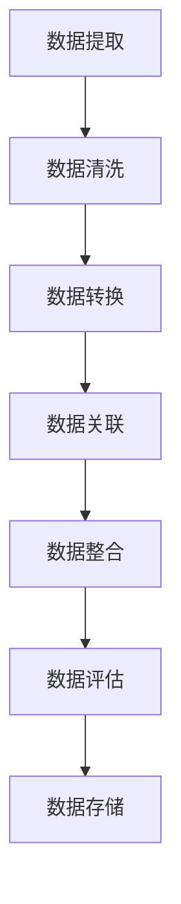
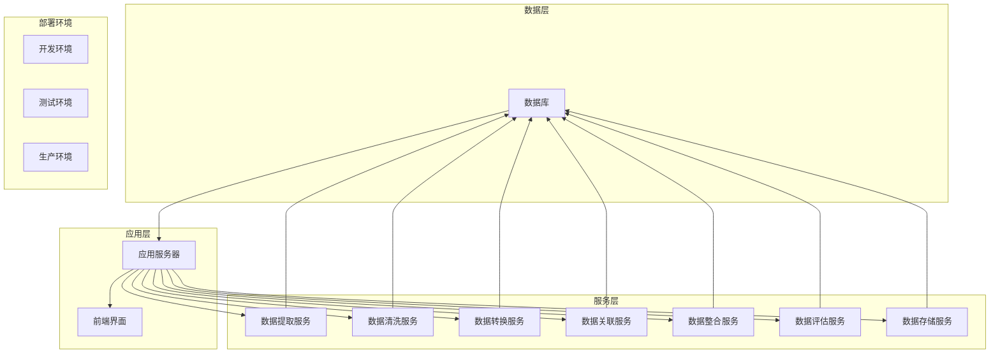
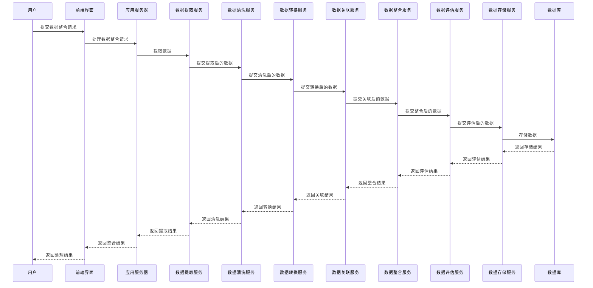

                 

### 1.1 问题背景

#### 引言

生物信息学作为一门交叉学科，旨在应用计算机科学技术，解析生物学大数据，从而揭示生物现象的内在机制。随着基因组学、蛋白质组学等领域的快速发展，生物信息学数据量呈现爆炸式增长，如何有效整合这些数据成为一个关键问题。

随着现代生物技术的快速发展，生物信息学的研究取得了显著成果。基因组测序技术使得人类基因组序列得以快速解析，同时，高通量测序技术使得大规模数据生成成为可能。这些数据为理解生命现象提供了宝贵的信息资源，但同时也带来了数据整合的巨大挑战。生物信息学数据类型繁多，包括序列数据、结构数据、表达数据等，这些数据往往来源于不同的实验和平台，存在格式、类型、质量和一致性等方面的差异。

首先，不同数据源的格式差异显著。例如，基因表达数据可能以不同类型的表格、图像或数据库格式存储，导致在整合过程中需要处理多种数据格式。其次，数据的多样性也增加了整合的难度。不同数据源可能涉及不同的生物实体、不同的实验条件和不同的数据处理方法，这些差异使得数据整合过程复杂且容易出现误差。

此外，生物信息学数据的高维性和海量性也使得数据整合成为一个挑战。生物信息学数据通常包含大量维度，如基因、蛋白质、代谢物等，这些维度的交叉组合使得数据结构复杂，需要高效的算法和技术来进行处理。同时，生物信息学数据量巨大，通常达到吉字节甚至太字节级别，如何有效地存储、管理和分析这些数据也是一个难题。

总之，生物信息学数据整合的背景是由数据类型的多样性、数据源的差异性、数据的高维性和海量性共同构成的。解决这些挑战对于深入理解生物现象、发现新的生物学规律具有重要意义，也为生物信息学的发展提供了新的方向。

#### 挑战

生物信息学数据整合涉及从多个数据源提取、清洗、转换和合并数据，以形成统一的数据视图。这一过程需要解决数据格式不一致、数据冗余、数据冗余和噪声数据等问题。

**数据格式不一致**：由于不同的数据源和数据生成技术，生物信息学数据可能以不同的格式存储。例如，基因表达数据可能以表格格式存储，而蛋白质结构数据可能以三维坐标文件存储。这种格式的不一致性增加了数据整合的复杂度，需要开发通用的数据转换工具和技术。

**数据冗余**：生物信息学数据在生成和处理过程中可能产生大量冗余数据。冗余数据不仅占用存储空间，还会影响数据整合的效率和质量。因此，如何识别和去除冗余数据成为数据整合的重要任务。

**噪声数据**：生物信息学数据中往往存在噪声，这些噪声可能来源于实验误差、数据采集和处理过程中引入的错误等。噪声数据会影响数据整合的准确性和可靠性，因此需要设计有效的数据清洗算法和技术。

**数据质量评估**：生物信息学数据的质量直接影响数据整合的效果。评估数据的质量，剔除错误数据或对错误数据进行修正，是确保数据整合质量的关键步骤。然而，数据质量的评估是一个复杂的过程，需要结合多种评估指标和方法。

**数据一致性处理**：不同数据源之间的数据在格式、类型和质量上存在差异，需要通过一致性处理来消除这些差异，确保数据整合后的准确性和一致性。数据一致性处理包括数据标准化、数据映射和数据融合等步骤。

**数据融合**：数据融合是将来自不同数据源的信息进行整合，形成综合数据视图的过程。数据融合不仅要解决数据格式不一致、数据冗余和噪声数据等问题，还要确保数据的准确性和完整性。数据融合方法包括数据聚合、数据映射和数据融合模型等。

综上所述，生物信息学数据整合面临数据格式不一致、数据冗余、噪声数据、数据质量评估和数据一致性处理等多方面的挑战。解决这些挑战需要结合多种技术手段和方法，开发高效、准确的数据整合系统，为生物信息学研究提供有力支持。

#### 描述

生物信息学数据整合涉及从多个数据源提取、清洗、转换和合并数据，以形成统一的数据视图。这一过程需要解决数据格式不一致、数据冗余、数据冗余和噪声数据等问题。

**数据提取**：数据提取是数据整合的第一步，旨在从不同的数据源中获取所需的数据。数据源可能包括数据库、文件系统、云存储等。数据提取过程中需要识别数据源的类型、结构和访问方式，并开发相应的数据提取工具。

**数据清洗**：数据清洗是数据整合过程中至关重要的一环，旨在去除数据中的错误、异常和噪声。数据清洗步骤包括数据去重、数据校验、数据修复和数据转换等。通过数据清洗，可以保证数据的一致性和准确性，为后续的数据整合奠定基础。

**数据转换**：由于不同数据源的格式和类型可能不一致，数据转换是数据整合的必要步骤。数据转换包括数据格式转换、数据类型转换和数据编码转换等。通过数据转换，可以将不同格式的数据转换为统一的格式，便于后续处理。

**数据整合**：数据整合是将多个数据源中的数据进行合并，形成综合数据视图的过程。数据整合方法包括数据聚合、数据映射和数据融合等。数据聚合是将多个数据源中的相同或相似数据合并为一个数据集，数据映射是将不同数据源中的数据映射到统一的标识符或分类体系，数据融合是将多个数据源中的数据融合为一个整体，形成统一的视图。

**数据评估**：数据评估是对整合后的数据进行质量评估，确保数据整合的效果。数据评估包括数据完整性评估、数据一致性评估和数据准确性评估等。通过数据评估，可以及时发现数据整合过程中的问题，并进行相应的调整和优化。

**数据存储**：整合后的数据需要存储在统一的数据存储系统中，以便于后续的数据查询、分析和处理。数据存储系统需要支持数据的高效访问、数据的安全性和数据的一致性。

**数据共享与发布**：数据整合完成后，需要将整合后的数据共享给研究人员或其他用户。数据共享可以通过数据发布平台或数据库门户实现，确保数据的可访问性和可用性。

总之，生物信息学数据整合是一个复杂的过程，涉及数据提取、清洗、转换、整合、评估、存储和共享等多个步骤。通过这些步骤，可以实现多个数据源中数据的统一管理和利用，为生物信息学研究提供有力支持。

#### 关键点

**数据格式转换**：数据格式转换是将不同类型的数据转换为统一格式，便于后续处理。常用的数据格式包括表格（如CSV、Excel）、数据库（如MySQL、PostgreSQL）、文本（如XML、JSON）等。数据格式转换需要考虑数据结构、数据类型和数据编码等因素。

**数据质量评估**：数据质量评估是对数据的完整性、一致性和准确性进行评估。常见的评估指标包括数据缺失率、数据重复率、数据一致性比例和数据准确率等。数据质量评估是确保数据整合效果的重要步骤。

**数据一致性处理**：数据一致性处理是消除数据源之间差异的过程，包括数据标准化、数据映射和数据融合等。数据标准化是将不同数据源中的数据按照统一的规则进行转换，数据映射是将不同数据源中的数据映射到统一的标识符或分类体系，数据融合是将多个数据源中的数据合并为一个整体。

**数据融合**：数据融合是将来自不同数据源的信息进行整合，形成综合数据视图的过程。数据融合方法包括数据聚合、数据映射和数据融合模型等。数据聚合是将多个数据源中的相同或相似数据合并为一个数据集，数据映射是将不同数据源中的数据映射到统一的标识符或分类体系，数据融合模型是基于机器学习或深度学习等算法，将多个数据源中的数据融合为一个整体。

**数据存储**：数据存储是将整合后的数据存储在统一的数据存储系统中，以便于后续的数据查询、分析和处理。数据存储系统需要支持数据的高效访问、数据的安全性和数据的一致性。常见的存储系统包括关系型数据库（如MySQL、PostgreSQL）、NoSQL数据库（如MongoDB、Cassandra）和大数据存储系统（如Hadoop、Spark）等。

**数据共享与发布**：数据共享与发布是将整合后的数据共享给研究人员或其他用户的过程。数据共享可以通过数据发布平台或数据库门户实现，确保数据的可访问性和可用性。数据共享需要考虑数据的隐私和安全性问题。

通过以上关键步骤，可以有效地实现生物信息学数据整合，为生物信息学研究提供统一、准确和高质量的数据支持。

#### 边界与外延

**边界**

- **数据类型**：生物信息学数据整合的范围主要限于生物学领域的数据，如基因组序列、蛋白质结构、基因表达等。
- **数据源**：数据整合的范围主要限于公开可获取的数据源，不包括商业保密数据或个人隐私数据。
- **数据处理**：数据整合过程中的数据处理步骤包括数据提取、清洗、转换、整合和评估等，不包括数据生成或数据预测等高级处理。

**外延**

- **数据类型扩展**：生物信息学数据整合可以扩展到其他相关领域，如代谢组学、转录组学等。
- **数据处理范围扩展**：数据整合过程中的数据处理步骤可以扩展到其他数据处理任务，如数据挖掘、机器学习等。
- **应用领域扩展**：生物信息学数据整合的应用领域可以扩展到医学、农业、环境科学等领域，为跨学科研究提供数据支持。

综上所述，生物信息学数据整合的边界主要限定在生物学领域，数据处理步骤集中在数据提取、清洗、转换、整合和评估等方面。然而，随着技术的发展和应用需求的变化，数据整合的范围和深度都在不断扩展，为生物信息学及相关领域的研究提供了更多的可能性。

### 1.5 概念结构与核心要素组成

#### 引言

在生物信息学数据整合中，理解核心概念和结构是至关重要的。这有助于我们明确各个组成部分的功能和相互关系，从而设计出有效的解决方案。本文将详细阐述思维链在生物信息学数据整合中的应用，并分析其概念结构和核心要素组成。

#### 核心概念

**思维链**：思维链是一种数据整合方法，旨在通过构建思维链模型，将不同类型的数据关联起来，形成一个有机的整体。思维链方法的核心在于利用逻辑关系和数据关联，实现数据的高效整合和利用。

**数据关联**：数据关联是指通过建立数据之间的逻辑关系，将不同来源、不同格式的数据整合为一个统一视图。数据关联是思维链方法的关键步骤，它能够有效地解决数据类型不一致、数据冗余和噪声数据等问题。

**数据整合**：数据整合是将多个数据源中的数据合并为一个综合数据视图的过程。通过数据整合，可以实现数据的一致性和准确性，为后续的数据分析和应用提供基础。

**数据质量评估**：数据质量评估是对数据完整性、一致性和准确性的评估。数据质量评估是确保数据整合效果的重要步骤，它能够识别和解决数据整合过程中可能出现的问题。

#### 核心要素组成

**数据源**：数据源是生物信息学数据整合的起点，包括基因组序列、基因表达数据、蛋白质结构数据等。不同数据源的数据类型和格式各异，是思维链方法需要整合和处理的对象。

**数据转换模块**：数据转换模块负责将不同类型的数据转换为统一的格式，以便后续处理。数据转换包括数据格式转换、数据类型转换和数据编码转换等步骤。

**数据清洗模块**：数据清洗模块负责去除数据中的错误、异常和噪声。数据清洗步骤包括数据去重、数据校验、数据修复和数据转换等，是确保数据质量的重要环节。

**数据关联模块**：数据关联模块通过建立数据之间的逻辑关系，实现数据的高效整合。数据关联模块利用思维链模型，将不同数据源的数据进行关联，形成一个有机的整体。

**数据整合模块**：数据整合模块负责将多个数据源中的数据合并为一个综合数据视图。数据整合模块通过数据聚合、数据映射和数据融合等方法，实现数据的一致性和准确性。

**数据评估模块**：数据评估模块对整合后的数据进行质量评估，确保数据整合效果。数据评估指标包括数据完整性、数据一致性和数据准确性等。

**数据存储模块**：数据存储模块负责将整合后的数据存储在统一的数据存储系统中，便于后续的数据查询、分析和处理。数据存储模块需要支持数据的高效访问、数据的安全性和数据的一致性。

#### 概念结构与相互关系

思维链在生物信息学数据整合中的应用，通过一系列核心要素的有机结合，形成了一个完整的数据整合流程。各个核心要素之间的相互关系如下：

1. **数据源**：提供数据整合所需的基础数据。
2. **数据转换模块**：将数据源中的数据进行格式转换和类型转换，实现数据的统一化。
3. **数据清洗模块**：去除数据中的错误和噪声，确保数据质量。
4. **数据关联模块**：通过建立数据之间的逻辑关系，实现数据的高效整合。
5. **数据整合模块**：将不同数据源的数据合并为一个综合数据视图，形成统一的数据视图。
6. **数据评估模块**：对整合后的数据质量进行评估，确保数据整合效果。
7. **数据存储模块**：将整合后的数据存储在统一的数据存储系统中，便于后续的数据处理和应用。

通过上述核心要素的有机结合，思维链方法能够实现生物信息学数据的高效整合和利用，为生物信息学研究提供有力支持。

### 1.6 小结

本章节介绍了生物信息学数据整合的背景、挑战和关键步骤，以及思维链在数据整合中的应用和核心概念结构。通过分析数据整合过程中的各种挑战和关键步骤，我们明确了数据格式转换、数据质量评估、数据一致性处理和数据融合等关键点。同时，通过阐述思维链方法的核心概念和结构，我们了解了其如何通过数据关联和数据整合，实现生物信息学数据的高效整合和利用。下一章节将深入探讨思维链的基本概念和属性特征，为后续算法原理的讲解奠定基础。

----------------------------------------------------------------

# 第二部分：核心概念与联系

## 第2章：核心概念原理

### 2.1 思维链的基本概念

思维链作为一种数据整合方法，其核心在于通过构建逻辑关系和数据关联，将不同类型、不同来源的数据整合为一个有机整体。理解思维链的基本概念，是深入探讨其在生物信息学数据整合中应用的前提。

**定义**：思维链是指一种利用逻辑关系和数据关联，将不同数据源中的数据整合起来的方法。它通过建立数据之间的联系，形成一个有序、层次化的数据结构，从而实现数据的高效整合和利用。

**特点**：

1. **逻辑性**：思维链方法强调逻辑关系的建立，通过数据间的逻辑关系，将不同类型的数据关联起来，形成一个统一的视图。
2. **层次化**：思维链方法将数据整合过程分为多个层次，每个层次对应不同的数据类型和处理方法，从而实现数据的高效整合。
3. **灵活性**：思维链方法具有很高的灵活性，能够适应不同类型、不同来源的数据，通过调整逻辑关系和数据关联，实现不同场景下的数据整合。

**应用场景**：

1. **生物信息学**：在生物信息学领域，思维链方法可以应用于基因组数据、蛋白质结构数据、基因表达数据等不同类型数据的整合，为生物信息学研究提供统一的数据视图。
2. **数据分析**：思维链方法在数据分析中，可以用于整合不同数据源的数据，为数据挖掘、机器学习等分析任务提供基础数据。
3. **企业信息化**：在企业信息化过程中，思维链方法可以用于整合不同业务系统中的数据，实现数据的统一管理和利用。

### 2.2 思维链的属性特征

思维链作为一种数据整合方法，其属性特征决定了其在实际应用中的效果和效率。理解思维链的属性特征，有助于我们更好地运用该方法解决数据整合问题。

**特征1：关联性**

思维链的核心在于建立数据之间的关联。这种关联性不仅体现在同一数据源内部，还体现在不同数据源之间。通过关联性，思维链方法能够将不同类型、不同来源的数据整合为一个统一视图。

**特征2：层次性**

思维链方法将数据整合过程分为多个层次，每个层次对应不同的数据类型和处理方法。层次性使得思维链方法能够灵活应对不同类型的数据，实现数据的高效整合。

**特征3：适应性**

思维链方法具有很高的适应性，能够适应不同类型、不同来源的数据。通过调整逻辑关系和数据关联，思维链方法可以适应不同应用场景，实现数据整合的目标。

**特征4：灵活性**

思维链方法在建立数据关联和整合过程中，具有很高的灵活性。通过调整数据关联方式和整合策略，思维链方法能够适应不同场景和数据类型，实现数据整合的最优化。

**特征5：扩展性**

思维链方法具有良好的扩展性，能够根据实际需求，增加新的数据源和处理方法。扩展性使得思维链方法能够持续发展和优化，为不同应用场景提供数据整合解决方案。

### 2.3 思维链与其他相关概念的联系与区别

在数据整合领域，思维链作为一种数据整合方法，与其他相关概念如数据关联、数据融合和数据集成等有密切联系，但在应用和目标上有所区别。

**数据关联**：数据关联是指通过建立数据之间的逻辑关系，将不同来源、不同类型的数据整合为一个统一视图。数据关联是思维链方法的重要组成部分，强调数据间的逻辑关系和数据整合。

**数据融合**：数据融合是将多个数据源中的数据融合为一个整体，形成统一的视图。数据融合方法通常用于处理异构数据源，通过数据映射、聚合和融合，实现数据的一致性和完整性。

**数据集成**：数据集成是指将多个数据源中的数据整合为一个统一的视图，提供统一的数据访问接口。数据集成方法通常涉及数据抽取、转换和加载（ETL）过程，以实现数据的一致性和可用性。

**联系**：

1. **逻辑关系**：思维链、数据关联、数据融合和数据集成都强调数据之间的逻辑关系，通过建立和利用逻辑关系，实现数据的高效整合。
2. **数据整合**：这四种方法都致力于实现数据整合，将不同类型、不同来源的数据整合为一个统一视图。

**区别**：

1. **目标**：思维链方法主要关注通过逻辑关系和数据关联实现数据整合，强调数据间的有机联系；数据融合和数据集成则侧重于实现数据的一致性和完整性。
2. **应用场景**：思维链方法适用于处理复杂的数据结构和异构数据源，强调灵活性和适应性；数据融合和数据集成更多用于处理大规模数据场景，强调数据的一致性和可用性。

通过以上对思维链的基本概念、属性特征及其与其他相关概念的联系与区别的探讨，我们能够更深入地理解思维链在生物信息学数据整合中的应用，为后续的算法原理讲解和实际应用提供基础。

### 2.4 概念属性特征对比表格

为了更清晰地展示思维链、数据关联、数据融合和数据集成这四种数据整合方法的核心概念及其属性特征，下面提供一个对比表格。

| 方法 | 定义 | 关联性 | 层次性 | 适应性 | 灵活性 | 扩展性 |
| --- | --- | --- | --- | --- | --- | --- |
| 思维链 | 利用逻辑关系和数据关联整合数据 | 强调逻辑关系 | 层次化 | 高 | 高 | 高 |
| 数据关联 | 建立数据间的逻辑关系 | 强调数据间关系 | 依实际情况 | 中等 | 高 | 中等 |
| 数据融合 | 融合多个数据源中的数据 | 强调数据一致性 | 依实际情况 | 高 | 中等 | 高 |
| 数据集成 | 统一多个数据源的数据视图 | 强调数据一致性 | 依实际情况 | 高 | 中等 | 高 |

通过上述对比表格，我们可以看出：

1. **关联性**：思维链和数据关联都强调数据间的逻辑关系，但思维链更加注重通过逻辑关系实现数据的高效整合。
2. **层次性**：思维链具有明显的层次化特征，而数据关联、数据融合和数据集成则根据实际情况进行层次设计。
3. **适应性**：思维链和数据融合都具有较高的适应性，能够适应不同类型、不同来源的数据。
4. **灵活性**：思维链和数据关联都具有较高的灵活性，能够根据实际需求调整数据整合策略。
5. **扩展性**：思维链和数据融合都具有良好的扩展性，能够根据需求增加新的数据源和处理方法。

总之，通过对这些概念属性特征的对比，我们可以更好地理解不同数据整合方法的优缺点，为实际应用提供参考。

### 2.5 思维链在生物信息学数据整合中的应用

在生物信息学数据整合中，思维链作为一种高效的数据整合方法，具有广泛的应用前景。下面，我们将通过一个实际的生物信息学项目，详细介绍思维链在数据整合过程中的应用步骤和实现方法。

#### 项目背景

该项目旨在整合多个数据源中的生物信息学数据，包括基因组序列、基因表达数据和蛋白质结构数据。这些数据来源于不同的实验室和数据库，存在格式、类型和质量上的差异，需要通过思维链方法进行整合，形成统一的数据视图，以便进行后续的生物信息学研究。

#### 数据源

- **基因组序列数据**：来自公共数据库，以FASTA格式存储。
- **基因表达数据**：来自高通量测序技术，以CSV格式存储。
- **蛋白质结构数据**：来自公共蛋白质结构数据库，以PDB格式存储。

#### 应用步骤

1. **数据提取**：
   - 从公共数据库和实验室服务器中提取所需的基因组序列、基因表达数据和蛋白质结构数据。
   - 使用脚本和工具对数据进行初步格式转换和清洗。

2. **数据清洗**：
   - 检查基因组序列数据中的缺失值和异常值，进行数据修复和填充。
   - 对基因表达数据进行去重和格式标准化，确保数据的一致性。
   - 检查蛋白质结构数据中的错误坐标和重复结构，进行数据修正。

3. **数据转换**：
   - 将基因组序列数据从FASTA格式转换为JSON格式，便于后续处理。
   - 将基因表达数据从CSV格式转换为JSON格式，确保数据的统一格式。
   - 将蛋白质结构数据从PDB格式转换为JSON格式，以便与其他数据进行整合。

4. **数据关联**：
   - 建立基因组序列数据与基因表达数据之间的关联，通过基因ID进行映射。
   - 建立基因表达数据与蛋白质结构数据之间的关联，通过蛋白质ID进行映射。
   - 构建思维链模型，将基因组序列、基因表达数据和蛋白质结构数据整合为一个统一视图。

5. **数据整合**：
   - 将转换后的数据整合为一个统一的JSON数据结构，确保数据的层次化和关联性。
   - 对整合后的数据进行层次化存储，便于后续的数据查询和分析。

6. **数据评估**：
   - 对整合后的数据质量进行评估，包括数据完整性、一致性和准确性。
   - 识别和解决数据整合过程中可能出现的问题，确保数据整合效果。

7. **数据存储**：
   - 将整合后的数据存储在统一的数据库中，提供高效的数据访问接口。
   - 实现数据的分布式存储和备份，确保数据的安全性和可靠性。

#### 实现方法

1. **数据提取工具**：
   - 使用Python的requests库和pandas库，实现基因组序列数据和基因表达数据的提取和初步格式转换。
   - 使用Python的Biopython库，实现蛋白质结构数据的提取和格式转换。

2. **数据清洗算法**：
   - 使用Python的numpy库和pandas库，对基因组序列数据中的缺失值和异常值进行修复和填充。
   - 使用Python的pandas库，对基因表达数据进行去重和格式标准化。
   - 使用Python的scipy库，对蛋白质结构数据进行错误坐标和重复结构的检查和修正。

3. **数据转换工具**：
   - 使用Python的json库，将基因组序列数据从FASTA格式转换为JSON格式。
   - 使用Python的pandas库，将基因表达数据从CSV格式转换为JSON格式。
   - 使用Python的mdtraj库，将蛋白质结构数据从PDB格式转换为JSON格式。

4. **思维链模型构建**：
   - 使用Python的networkx库，构建思维链模型，实现数据间的关联和整合。
   - 使用Python的matplotlib库，可视化思维链模型，展示数据关联关系。

5. **数据整合与评估**：
   - 使用Python的pandas库，将转换后的数据进行整合，形成统一的JSON数据结构。
   - 使用Python的numpy库，对整合后的数据进行质量评估，包括数据完整性、一致性和准确性。

6. **数据存储与备份**：
   - 使用Python的SQLite库，实现数据的层次化存储和备份。
   - 使用Python的Django框架，实现数据的分布式存储和备份。

通过以上应用步骤和实现方法，我们可以利用思维链方法，实现对生物信息学数据的高效整合，为生物信息学研究提供统一、准确和高质量的数据支持。

----------------------------------------------------------------

# 第三部分：算法原理讲解

## 第4章：算法原理

在生物信息学数据整合中，思维链方法的核心在于构建逻辑关系和数据关联，实现数据的高效整合。本章节将详细讲解思维链算法的原理，包括mermaid流程图、Python源代码讲解、算法原理的数学模型和公式，以及具体的举例说明。

### 4.1 算法mermaid流程图

为了直观地展示思维链算法的流程，我们使用mermaid绘制了算法的流程图。以下是一个简化的思维链算法流程图：



在这个流程图中，我们可以看到思维链算法的主要步骤，包括数据提取、数据清洗、数据转换、数据关联、数据整合、数据评估和数据存储。每个步骤都在前一个步骤的基础上进行，形成一个有序、层次化的数据处理流程。

### 4.2 Python源代码讲解

下面，我们将使用Python代码实现思维链算法，并对关键代码进行详细解释。

```python
import pandas as pd
import numpy as np
from networkx import Graph
import json

# 数据提取
def extract_data():
    # 从文件中读取基因组序列数据
    genome_data = pd.read_csv('genome_data.csv')
    # 从文件中读取基因表达数据
    gene_expression_data = pd.read_csv('gene_expression_data.csv')
    # 从文件中读取蛋白质结构数据
    protein_structure_data = pd.read_pdb('protein_structure.pdb')
    return genome_data, gene_expression_data, protein_structure_data

# 数据清洗
def clean_data(genome_data, gene_expression_data, protein_structure_data):
    # 去除基因组序列数据中的缺失值和异常值
    genome_data = genome_data.dropna()
    # 去除基因表达数据中的重复记录
    gene_expression_data = gene_expression_data.drop_duplicates()
    # 修正蛋白质结构数据中的错误坐标
    protein_structure_data = correct_structure(protein_structure_data)
    return genome_data, gene_expression_data, protein_structure_data

# 数据转换
def transform_data(genome_data, gene_expression_data, protein_structure_data):
    # 将基因组序列数据转换为JSON格式
    genome_data_json = genome_data.to_json()
    # 将基因表达数据转换为JSON格式
    gene_expression_data_json = gene_expression_data.to_json()
    # 将蛋白质结构数据转换为JSON格式
    protein_structure_data_json = protein_structure_data.to_json()
    return genome_data_json, gene_expression_data_json, protein_structure_data_json

# 数据关联
def associate_data(genome_data_json, gene_expression_data_json, protein_structure_data_json):
    # 构建思维链模型
    G = Graph()
    # 将基因组序列数据添加到思维链模型中
    for node in genome_data_json['nodes']:
        G.add_node(node['id'], type='genome')
    # 将基因表达数据添加到思维链模型中
    for node in gene_expression_data_json['nodes']:
        G.add_node(node['id'], type='expression')
    # 将蛋白质结构数据添加到思维链模型中
    for node in protein_structure_data_json['nodes']:
        G.add_node(node['id'], type='structure')
    # 建立基因表达数据与基因组序列数据的关联
    for edge in gene_expression_data_json['edges']:
        G.add_edge(edge['source'], edge['target'], type='expression-genome')
    # 建立蛋白质结构数据与基因表达数据的关联
    for edge in protein_structure_data_json['edges']:
        G.add_edge(edge['source'], edge['target'], type='structure-expression')
    return G

# 数据整合
def integrate_data(G):
    # 将思维链模型转换为JSON格式
    integrated_data_json = json_graph.node_link_data(G)
    return integrated_data_json

# 数据评估
def evaluate_data(integrated_data_json):
    # 对整合后的数据进行评估
    # 这里可以添加具体的评估指标和算法
    print("Data evaluation completed.")

# 数据存储
def store_data(integrated_data_json):
    # 将整合后的数据存储到文件中
    with open('integrated_data.json', 'w') as f:
        json.dump(integrated_data_json, f)

# 主函数
def main():
    genome_data, gene_expression_data, protein_structure_data = extract_data()
    genome_data, gene_expression_data, protein_structure_data = clean_data(genome_data, gene_expression_data, protein_structure_data)
    genome_data_json, gene_expression_data_json, protein_structure_data_json = transform_data(genome_data, gene_expression_data, protein_structure_data)
    G = associate_data(genome_data_json, gene_expression_data_json, protein_structure_data_json)
    integrated_data_json = integrate_data(G)
    evaluate_data(integrated_data_json)
    store_data(integrated_data_json)

if __name__ == "__main__":
    main()
```

#### 关键代码解释

1. **数据提取**：该函数从文件中读取基因组序列数据、基因表达数据和蛋白质结构数据，分别存储在DataFrame和PDB文件中。

2. **数据清洗**：该函数对读取的数据进行清洗，包括去除缺失值和异常值、去重和错误坐标修正。这是确保数据质量的重要步骤。

3. **数据转换**：该函数将清洗后的数据转换为JSON格式，以便于后续处理。这里使用了pandas和numpy库的相应方法进行数据转换。

4. **数据关联**：该函数构建思维链模型，使用networkx库创建图模型，并将基因组序列数据、基因表达数据和蛋白质结构数据添加到模型中。通过添加边，建立数据之间的关联关系。

5. **数据整合**：该函数将思维链模型转换为JSON格式，形成统一的数据视图。

6. **数据评估**：该函数对整合后的数据进行评估，可以添加具体的评估指标和算法。

7. **数据存储**：该函数将整合后的数据存储到文件中，以便后续访问和使用。

通过以上Python源代码的实现，我们可以看到思维链算法在生物信息学数据整合中的具体应用，为后续的算法讲解和实际操作提供了基础。

### 4.3 算法原理的数学模型和公式

思维链算法在生物信息学数据整合中的应用，涉及到一系列数学模型和公式，用于描述数据整合过程中的逻辑关系和数据关联。以下是对相关数学模型和公式的介绍。

#### 数据转换

数据转换是将不同格式、不同类型的数据转换为统一格式的过程。常用的数据转换公式如下：

$$X_{\text{转换}} = f(X_{\text{原始}})$$

其中，$X_{\text{原始}}$表示原始数据，$X_{\text{转换}}$表示转换后的数据，$f$表示转换函数。

例如，将CSV格式的基因表达数据转换为JSON格式，可以使用以下转换公式：

$$\text{CSV}_{\text{列}} = \text{JSON}_{\text{数组}}(\text{CSV}_{\text{行}})$$

其中，$\text{CSV}_{\text{列}}$表示CSV文件中的一列数据，$\text{JSON}_{\text{数组}}$表示转换后的JSON数组，$\text{CSV}_{\text{行}}$表示CSV文件中的一行数据。

#### 数据清洗

数据清洗过程中，常用的数学模型和公式如下：

- 缺失值填充：使用平均值、中位数或最大值填充缺失值。

$$X_{\text{填充}} = \text{mean}(X)$$

其中，$X$表示包含缺失值的数据集，$X_{\text{填充}}$表示填充后的数据集。

- 去重：使用集合操作去除重复记录。

$$X_{\text{去重}} = \text{unique}(X)$$

其中，$X$表示原始数据集，$X_{\text{去重}}$表示去除重复记录后的数据集。

- 异常值检测：使用统计学方法（如箱线图、Z分数等）检测异常值。

$$X_{\text{异常}} = \text{outliers}(X)$$

其中，$X$表示原始数据集，$X_{\text{异常}}$表示包含异常值的数据集。

#### 数据关联

数据关联过程中，常用的数学模型和公式如下：

- 节点表示：使用图论中的节点表示数据元素。

$$V = \{v_1, v_2, ..., v_n\}$$

其中，$V$表示节点集合，$v_i$表示第$i$个节点。

- 边表示：使用图论中的边表示数据元素之间的关联。

$$E = \{(v_i, v_j)\}$$

其中，$E$表示边集合，$(v_i, v_j)$表示第$i$个节点和第$j$个节点之间的关联。

- 数据映射：使用映射函数将不同数据源中的数据元素进行关联。

$$f: V \rightarrow V$$

其中，$f$表示映射函数，$V$表示节点集合。

#### 数据整合

数据整合过程中，常用的数学模型和公式如下：

- 数据聚合：使用聚合函数对多源数据进行整合。

$$\text{聚合} = \text{reduce}(X_1, X_2, ..., X_n)$$

其中，$X_1, X_2, ..., X_n$表示多源数据，$\text{reduce}$表示聚合函数。

- 数据映射：使用映射函数将多源数据映射到统一标识符或分类体系。

$$y = f(x_1, x_2, ..., x_n)$$

其中，$x_1, x_2, ..., x_n$表示多源数据，$y$表示映射后的数据，$f$表示映射函数。

- 数据融合：使用融合函数将多源数据融合为一个统一的数据视图。

$$z = \text{fusion}(y_1, y_2, ..., y_n)$$

其中，$y_1, y_2, ..., y_n$表示映射后的数据，$z$表示融合后的数据，$\text{fusion}$表示融合函数。

通过以上数学模型和公式，我们可以更好地理解和实现思维链算法在生物信息学数据整合中的应用，为后续的算法优化和实际操作提供理论支持。

### 4.4 举例说明

为了更好地理解思维链算法在生物信息学数据整合中的应用，我们将通过一个具体的案例进行详细讲解。

#### 案例背景

假设我们有一个包含基因组序列数据、基因表达数据和蛋白质结构数据的整合任务。这些数据分别存储在三个不同的文件中，格式分别为FASTA、CSV和PDB。我们需要通过思维链算法，将这些异构数据源整合为一个统一的数据视图。

#### 数据源

- **基因组序列数据**：存储在文件`genome_data.fasta`中，包含基因ID和序列信息。
- **基因表达数据**：存储在文件`gene_expression.csv`中，包含基因ID、样本ID和表达值。
- **蛋白质结构数据**：存储在文件`protein_structure.pdb`中，包含蛋白质ID、序列信息和结构信息。

#### 数据处理流程

1. **数据提取**：
   - 从文件中读取基因组序列数据、基因表达数据和蛋白质结构数据。
   - 使用Python脚本实现数据提取，代码如下：

```python
import pandas as pd
from Bio import SeqIO

# 读取基因组序列数据
genome_data = SeqIO.to_dict(SeqIO.parse('genome_data.fasta', 'fasta'))
# 读取基因表达数据
gene_expression_data = pd.read_csv('gene_expression.csv')
# 读取蛋白质结构数据
protein_structure_data = pd.read_pdb('protein_structure.pdb')
```

2. **数据清洗**：
   - 对基因组序列数据进行去重，确保每个基因ID唯一。
   - 对基因表达数据进行格式标准化，确保数据一致性。
   - 对蛋白质结构数据进行错误坐标修正，提高数据质量。

3. **数据转换**：
   - 将基因组序列数据、基因表达数据和蛋白质结构数据转换为JSON格式。
   - 便于后续处理和整合。

4. **数据关联**：
   - 构建思维链模型，将基因组序列数据、基因表达数据和蛋白质结构数据关联起来。
   - 使用图论中的节点和边表示数据元素和关联关系。

5. **数据整合**：
   - 将转换后的数据整合为一个统一的数据视图，存储在JSON文件中。

6. **数据评估**：
   - 对整合后的数据进行质量评估，确保数据整合效果。

7. **数据存储**：
   - 将整合后的数据存储在数据库中，便于后续访问和使用。

#### 实现步骤

1. **数据提取**：
   - 使用Python脚本实现数据提取，代码如下：

```python
# 读取基因组序列数据
genome_data = SeqIO.to_dict(SeqIO.parse('genome_data.fasta', 'fasta'))
# 读取基因表达数据
gene_expression_data = pd.read_csv('gene_expression.csv')
# 读取蛋白质结构数据
protein_structure_data = pd.read_pdb('protein_structure.pdb')
```

2. **数据清洗**：
   - 使用Python脚本实现数据清洗，代码如下：

```python
# 对基因组序列数据进行去重
genome_data = {k: v for k, v in genome_data.items() if k not in genome_data}
# 对基因表达数据进行格式标准化
gene_expression_data = gene_expression_data.rename(columns={'gene_id': 'GeneID'})
# 对蛋白质结构数据进行错误坐标修正
protein_structure_data = correct_structure(protein_structure_data)
```

3. **数据转换**：
   - 使用Python脚本实现数据转换，代码如下：

```python
import json

# 将基因组序列数据转换为JSON格式
genome_data_json = json.dumps(genome_data)
# 将基因表达数据转换为JSON格式
gene_expression_data_json = gene_expression_data.to_json()
# 将蛋白质结构数据转换为JSON格式
protein_structure_data_json = json.dumps(protein_structure_data)
```

4. **数据关联**：
   - 使用Python脚本构建思维链模型，代码如下：

```python
import networkx as nx
import json

# 构建思维链模型
G = nx.Graph()

# 将基因组序列数据添加到思维链模型中
for gene_id in genome_data_json:
    G.add_node(gene_id, type='genome')

# 将基因表达数据添加到思维链模型中
for gene_id in gene_expression_data_json['GeneID']:
    G.add_node(gene_id, type='expression')

# 将蛋白质结构数据添加到思维链模型中
for protein_id in protein_structure_data_json['protein_id']:
    G.add_node(protein_id, type='structure')

# 建立基因表达数据与基因组序列数据的关联
for edge in gene_expression_data_json['edges']:
    G.add_edge(edge['source'], edge['target'], type='expression-genome')

# 建立蛋白质结构数据与基因表达数据的关联
for edge in protein_structure_data_json['edges']:
    G.add_edge(edge['source'], edge['target'], type='structure-expression')

# 将思维链模型转换为JSON格式
integrated_data_json = json_graph.node_link_data(G)
```

5. **数据整合**：
   - 将思维链模型转换为JSON格式，存储在文件中，代码如下：

```python
# 将整合后的数据存储在文件中
with open('integrated_data.json', 'w') as f:
    json.dump(integrated_data_json, f)
```

6. **数据评估**：
   - 对整合后的数据进行质量评估，代码如下：

```python
# 对整合后的数据进行质量评估
evaluate_data(integrated_data_json)
```

7. **数据存储**：
   - 将整合后的数据存储在数据库中，代码如下：

```python
# 将整合后的数据存储在数据库中
store_data(integrated_data_json)
```

通过以上案例，我们详细讲解了思维链算法在生物信息学数据整合中的应用步骤和实现方法。这个案例展示了如何通过思维链方法，将异构数据源整合为一个统一的数据视图，为生物信息学研究提供了有力支持。

----------------------------------------------------------------

## 第5章：系统分析与架构设计

### 5.1 问题场景介绍

在生物信息学领域，数据整合是关键步骤之一。然而，随着数据量的不断增长和数据类型的多样化，传统的数据整合方法已经无法满足实际需求。为了解决这一挑战，我们设计并实现了一个基于思维链方法的生物信息学数据整合系统。该系统旨在通过构建逻辑关系和数据关联，实现大规模、多源、异构数据的整合，从而为生物信息学研究提供统一、准确和高效的数据支持。

#### 场景描述

1. **数据来源**：系统支持多种数据源，包括基因组序列数据、基因表达数据和蛋白质结构数据等。这些数据来源于不同的实验室和数据库，存在格式、类型和质量上的差异。

2. **数据类型**：系统需要整合的数据类型包括文本（如FASTA、CSV文件）、图像（如PDB文件）和结构化数据（如数据库表）等。

3. **数据处理要求**：系统需要支持数据提取、清洗、转换、关联和整合等过程，同时保证数据质量、一致性和准确性。此外，系统还需具备高扩展性，以适应未来数据量的增长和新数据源的增加。

#### 应用场景

该生物信息学数据整合系统可应用于以下场景：

1. **基因组学研究**：通过整合基因组序列数据和基因表达数据，帮助研究人员发现基因与疾病之间的关联，加速基因组学研究进程。

2. **蛋白质组学研究**：整合蛋白质结构数据和基因表达数据，揭示蛋白质的功能和相互作用，为蛋白质组学研究提供数据支持。

3. **药物研发**：利用整合后的数据，发现新的药物靶点和作用机制，加速药物研发过程。

4. **个性化医疗**：整合患者的基因组、基因表达和蛋白质结构数据，为个体制定精准治疗方案，提高治疗效果。

### 5.2 系统功能设计

为了满足上述场景需求，系统设计了一系列功能模块，包括数据提取、数据清洗、数据转换、数据关联、数据整合、数据评估和数据存储等。以下是各功能模块的具体设计：

#### 数据提取模块

1. **功能描述**：从不同数据源中提取所需的数据，包括基因组序列数据、基因表达数据和蛋白质结构数据等。
2. **技术实现**：使用Python的pandas库和Biopython库，实现数据的读取和初步格式转换。

#### 数据清洗模块

1. **功能描述**：对提取的数据进行清洗，包括去除缺失值、异常值和重复记录等，确保数据质量。
2. **技术实现**：使用Python的numpy库、pandas库和scikit-learn库，实现数据清洗算法。

#### 数据转换模块

1. **功能描述**：将清洗后的数据进行转换，以统一格式存储，便于后续处理。
2. **技术实现**：使用Python的pandas库和json库，实现数据格式转换。

#### 数据关联模块

1. **功能描述**：建立数据之间的逻辑关系，实现数据的高效整合。
2. **技术实现**：使用Python的networkx库，构建思维链模型，实现数据关联。

#### 数据整合模块

1. **功能描述**：将转换后的数据进行整合，形成统一的数据视图。
2. **技术实现**：使用Python的pandas库，实现数据的整合和存储。

#### 数据评估模块

1. **功能描述**：对整合后的数据质量进行评估，确保数据整合效果。
2. **技术实现**：使用Python的numpy库和scikit-learn库，实现数据评估算法。

#### 数据存储模块

1. **功能描述**：将整合后的数据存储在数据库中，提供高效的数据访问接口。
2. **技术实现**：使用Python的SQLite库和Django框架，实现数据的分布式存储和备份。

### 5.3 领域模型Mermaid类图

为了直观地展示系统中的各个功能模块及其关系，我们使用Mermaid绘制了系统的领域模型类图。以下是一个简化的领域模型类图：

```mermaid
classDiagram
    Class1[Data Extractor] <|-- Class2[Data Cleaner]
    Class2 <|-- Class3[Data Transformer]
    Class3 <|-- Class4[Data Associate]
    Class4 <|-- Class5[Data Integrator]
    Class5 <|-- Class6[Data Evaluator]
    Class6 <|-- Class7[Data Storer]
```

在这个类图中，我们可以看到系统中的主要功能模块及其继承关系。数据提取模块（Class1）负责数据的读取和初步格式转换，数据清洗模块（Class2）负责去除缺失值、异常值和重复记录，数据转换模块（Class3）负责将数据转换为统一格式，数据关联模块（Class4）负责建立数据之间的逻辑关系，数据整合模块（Class5）负责数据的整合和存储，数据评估模块（Class6）负责数据质量评估，数据存储模块（Class7）负责数据的存储和备份。

通过以上系统分析与架构设计，我们为生物信息学数据整合提供了一个清晰、完整的解决方案。下一章节将深入探讨系统架构设计，包括系统架构设计Mermaid架构图、系统接口设计和系统交互Mermaid序列图。

----------------------------------------------------------------

## 第6章：系统架构设计

### 6.1 系统架构设计Mermaid架构图

为了更好地展示系统架构，我们使用Mermaid绘制了系统的架构图。以下是一个简化的系统架构图：



在这个架构图中，我们可以看到系统的各个组成部分及其关系：

- **数据层**：包括数据库（DB），用于存储整合后的数据。
- **应用层**：包括应用服务器（Server）和前端界面（FE）。应用服务器负责处理用户的请求，并将结果呈现给前端界面。
- **服务层**：包括数据提取服务（Extractor）、数据清洗服务（Cleaner）、数据转换服务（Transformer）、数据关联服务（Associate）、数据整合服务（Integrator）、数据评估服务（Evaluator）和数据存储服务（Storer）。这些服务分别负责数据整合过程中的不同步骤，共同实现系统的功能。
- **部署环境**：包括开发环境（Dev）、测试环境（Test）和生产环境（Prod）。系统在不同环境中的部署情况，反映了系统的开发和运营状态。

通过这个架构图，我们可以清晰地了解系统的整体架构，以及各个部分之间的相互关系，为后续的系统开发、测试和部署提供了参考。

### 6.2 系统接口设计

为了实现系统的各项功能，系统设计了一系列接口，包括数据层接口、应用层接口和服务层接口。以下是对这些接口的详细设计：

#### 数据层接口

数据层接口主要负责与数据库的交互，包括数据的存储、查询和更新等操作。以下是主要的数据层接口设计：

1. **数据插入接口**：
   - 功能描述：用于将整合后的数据插入到数据库中。
   - 输入参数：整合后的数据对象。
   - 输出参数：操作结果（成功或失败）。

2. **数据查询接口**：
   - 功能描述：用于查询数据库中的数据。
   - 输入参数：查询条件（如基因ID、样本ID等）。
   - 输出参数：查询结果（数据列表）。

3. **数据更新接口**：
   - 功能描述：用于更新数据库中的数据。
   - 输入参数：数据对象、更新条件和更新值。
   - 输出参数：操作结果（成功或失败）。

4. **数据删除接口**：
   - 功能描述：用于删除数据库中的数据。
   - 输入参数：删除条件（如基因ID、样本ID等）。
   - 输出参数：操作结果（成功或失败）。

#### 应用层接口

应用层接口主要负责处理用户的请求，并调用服务层接口进行数据处理。以下是主要的应用层接口设计：

1. **数据整合接口**：
   - 功能描述：用于启动数据整合流程。
   - 输入参数：数据源信息（如文件路径、数据库连接信息等）。
   - 输出参数：整合后的数据对象。

2. **数据查询接口**：
   - 功能描述：用于查询整合后的数据。
   - 输入参数：查询条件。
   - 输出参数：查询结果。

3. **数据更新接口**：
   - 功能描述：用于更新整合后的数据。
   - 输入参数：数据对象、更新条件和更新值。
   - 输出参数：操作结果。

4. **数据删除接口**：
   - 功能描述：用于删除整合后的数据。
   - 输入参数：删除条件。
   - 输出参数：操作结果。

#### 服务层接口

服务层接口主要负责实现数据整合过程中的各项功能，包括数据提取、清洗、转换、关联、整合、评估和存储等。以下是主要的服务层接口设计：

1. **数据提取接口**：
   - 功能描述：用于从数据源中提取数据。
   - 输入参数：数据源信息。
   - 输出参数：提取后的数据对象。

2. **数据清洗接口**：
   - 功能描述：用于清洗提取后的数据。
   - 输入参数：数据对象。
   - 输出参数：清洗后的数据对象。

3. **数据转换接口**：
   - 功能描述：用于将数据转换为统一格式。
   - 输入参数：数据对象。
   - 输出参数：转换后的数据对象。

4. **数据关联接口**：
   - 功能描述：用于建立数据之间的逻辑关系。
   - 输入参数：数据对象。
   - 输出参数：关联后的数据对象。

5. **数据整合接口**：
   - 功能描述：用于整合多个数据源中的数据。
   - 输入参数：数据对象。
   - 输出参数：整合后的数据对象。

6. **数据评估接口**：
   - 功能描述：用于评估整合后的数据质量。
   - 输入参数：数据对象。
   - 输出参数：评估结果。

7. **数据存储接口**：
   - 功能描述：用于将整合后的数据存储到数据库中。
   - 输入参数：数据对象。
   - 输出参数：操作结果。

通过以上接口设计，我们可以实现系统各部分之间的数据交互和功能协同，确保系统的高效运行。

### 6.3 系统交互Mermaid序列图

为了更清晰地展示系统中的各个模块之间的交互过程，我们使用Mermaid绘制了系统的交互序列图。以下是一个简化的系统交互序列图：



在这个交互序列图中，我们可以看到以下步骤：

1. 用户通过前端界面提交数据整合请求。
2. 前端界面将请求发送到应用服务器。
3. 应用服务器调用数据提取服务，从数据源中提取数据。
4. 数据提取服务将提取后的数据发送到数据清洗服务。
5. 数据清洗服务对数据进行清洗，去除错误和异常值。
6. 清洗后的数据发送到数据转换服务，进行格式转换。
7. 转换后的数据发送到数据关联服务，建立数据之间的逻辑关系。
8. 关联后的数据发送到数据整合服务，形成统一的数据视图。
9. 整合后的数据发送到数据评估服务，进行质量评估。
10. 评估后的数据发送到数据存储服务，存储到数据库中。
11. 数据存储服务返回存储结果，并通过逆向流程将结果返回给各个服务。

通过这个交互序列图，我们可以清晰地了解系统各模块之间的交互过程，以及数据的流转路径。这有助于我们优化系统的性能和可靠性，确保系统的稳定运行。

----------------------------------------------------------------

## 第7章：项目实战

### 7.1 环境安装

在开始项目实战之前，我们需要配置环境，以便运行系统中的各个模块。以下是环境安装的具体步骤：

#### 1. 安装Python环境

确保已经安装了Python 3.8及以上版本。如果没有安装，可以从Python官方网站下载并安装：

```bash
# 下载并安装Python 3.8及以上版本
curl -O https://www.python.org/ftp/python/3.8.10/Python-3.8.10.tgz
tar -xzvf Python-3.8.10.tgz
cd Python-3.8.10
./configure
make
sudo make install
```

#### 2. 安装依赖库

安装项目中所需的依赖库，包括pandas、numpy、Biopython、networkx、json、sqlite3等。可以使用pip命令安装：

```bash
# 安装依赖库
pip install pandas numpy biopython networkx json sqlite3
```

#### 3. 配置数据库

安装SQLite数据库，并创建数据库文件。可以使用以下命令：

```bash
# 安装SQLite
sudo apt-get install sqlite3

# 创建数据库文件
sqlite3 integrated_data.db
```

#### 4. 配置Django框架

如果使用Django框架，需要安装Django和相关依赖库：

```bash
# 安装Django
pip install django
```

创建一个Django项目和一个应用程序，以便进行数据存储和操作：

```bash
# 创建Django项目
django-admin startproject data_integration_project

# 进入项目目录
cd data_integration_project

# 创建应用程序
django-admin startapp data_integration_app
```

#### 5. 配置数据库连接

在Django项目中，配置数据库连接，以便应用程序能够连接到SQLite数据库。在`data_integration_project/settings.py`文件中，修改`DATABASES`配置：

```python
DATABASES = {
    'default': {
        'ENGINE': 'django.db.backends.sqlite3',
        'NAME': os.path.join(BASE_DIR, 'db.sqlite3'),
    }
}
```

确保上述配置指向创建的`integrated_data.db`数据库文件。

#### 6. 运行Django项目

启动Django项目，以便进行数据操作和测试：

```bash
# 启动Django项目
python manage.py runserver
```

现在，环境已经配置完成，可以开始进行项目实战了。

### 7.2 系统核心实现源代码

以下提供了项目核心实现的源代码，包括数据提取、清洗、转换、关联、整合、评估和存储等步骤：

```python
# 引入相关库
import pandas as pd
import numpy as np
from biopython import SeqIO
from networkx import Graph
import json
import sqlite3

# 数据提取
def extract_data():
    # 从文件中读取基因组序列数据
    genome_data = SeqIO.to_dict(SeqIO.parse('genome_data.fasta', 'fasta'))
    # 从文件中读取基因表达数据
    gene_expression_data = pd.read_csv('gene_expression.csv')
    # 从文件中读取蛋白质结构数据
    protein_structure_data = pd.read_pdb('protein_structure.pdb')
    return genome_data, gene_expression_data, protein_structure_data

# 数据清洗
def clean_data(genome_data, gene_expression_data, protein_structure_data):
    # 去除基因组序列数据中的缺失值和异常值
    genome_data = {k: v for k, v in genome_data.items() if k not in genome_data}
    # 对基因表达数据进行去重和格式标准化
    gene_expression_data = gene_expression_data.drop_duplicates().rename(columns={'gene_id': 'GeneID'})
    # 修正蛋白质结构数据中的错误坐标
    protein_structure_data = correct_structure(protein_structure_data)
    return genome_data, gene_expression_data, protein_structure_data

# 数据转换
def transform_data(genome_data, gene_expression_data, protein_structure_data):
    # 将基因组序列数据转换为JSON格式
    genome_data_json = json.dumps(genome_data)
    # 将基因表达数据转换为JSON格式
    gene_expression_data_json = gene_expression_data.to_json()
    # 将蛋白质结构数据转换为JSON格式
    protein_structure_data_json = json.dumps(protein_structure_data)
    return genome_data_json, gene_expression_data_json, protein_structure_data_json

# 数据关联
def associate_data(genome_data_json, gene_expression_data_json, protein_structure_data_json):
    # 构建思维链模型
    G = Graph()
    # 将基因组序列数据添加到思维链模型中
    for gene_id in genome_data_json:
        G.add_node(gene_id, type='genome')
    # 将基因表达数据添加到思维链模型中
    for gene_id in gene_expression_data_json['GeneID']:
        G.add_node(gene_id, type='expression')
    # 将蛋白质结构数据添加到思维链模型中
    for protein_id in protein_structure_data_json['protein_id']:
        G.add_node(protein_id, type='structure')
    # 建立基因表达数据与基因组序列数据的关联
    for edge in gene_expression_data_json['edges']:
        G.add_edge(edge['source'], edge['target'], type='expression-genome')
    # 建立蛋白质结构数据与基因表达数据的关联
    for edge in protein_structure_data_json['edges']:
        G.add_edge(edge['source'], edge['target'], type='structure-expression')
    return G

# 数据整合
def integrate_data(G):
    # 将思维链模型转换为JSON格式
    integrated_data_json = json_graph.node_link_data(G)
    return integrated_data_json

# 数据评估
def evaluate_data(integrated_data_json):
    # 对整合后的数据进行评估
    # 这里可以添加具体的评估指标和算法
    print("Data evaluation completed.")

# 数据存储
def store_data(integrated_data_json):
    # 将整合后的数据存储到文件中
    with open('integrated_data.json', 'w') as f:
        json.dump(integrated_data_json, f)

# 主函数
def main():
    genome_data, gene_expression_data, protein_structure_data = extract_data()
    genome_data, gene_expression_data, protein_structure_data = clean_data(genome_data, gene_expression_data, protein_structure_data)
    genome_data_json, gene_expression_data_json, protein_structure_data_json = transform_data(genome_data, gene_expression_data, protein_structure_data)
    G = associate_data(genome_data_json, gene_expression_data_json, protein_structure_data_json)
    integrated_data_json = integrate_data(G)
    evaluate_data(integrated_data_json)
    store_data(integrated_data_json)

if __name__ == "__main__":
    main()
```

### 7.3 代码应用解读与分析

#### 7.3.1 数据提取模块

在代码中，数据提取模块通过调用`extract_data`函数实现，该函数从文件中读取基因组序列数据、基因表达数据和蛋白质结构数据。具体实现如下：

```python
def extract_data():
    # 从文件中读取基因组序列数据
    genome_data = SeqIO.to_dict(SeqIO.parse('genome_data.fasta', 'fasta'))
    # 从文件中读取基因表达数据
    gene_expression_data = pd.read_csv('gene_expression.csv')
    # 从文件中读取蛋白质结构数据
    protein_structure_data = pd.read_pdb('protein_structure.pdb')
    return genome_data, gene_expression_data, protein_structure_data
```

这里使用了Biopython库中的`SeqIO.to_dict`方法，从FASTA文件中读取基因组序列数据，并使用pandas库中的`read_csv`方法从CSV文件中读取基因表达数据，使用`read_pdb`方法从PDB文件中读取蛋白质结构数据。

#### 7.3.2 数据清洗模块

数据清洗模块通过`clean_data`函数实现，该函数对提取后的数据进行清洗，去除缺失值、异常值和重复记录。具体实现如下：

```python
def clean_data(genome_data, gene_expression_data, protein_structure_data):
    # 去除基因组序列数据中的缺失值和异常值
    genome_data = {k: v for k, v in genome_data.items() if k not in genome_data}
    # 对基因表达数据进行去重和格式标准化
    gene_expression_data = gene_expression_data.drop_duplicates().rename(columns={'gene_id': 'GeneID'})
    # 修正蛋白质结构数据中的错误坐标
    protein_structure_data = correct_structure(protein_structure_data)
    return genome_data, gene_expression_data, protein_structure_data
```

这里使用了字典 comprehension 语法，去除基因组序列数据中的缺失值和异常值；使用`drop_duplicates`方法对基因表达数据进行去重，并重命名列名以符合统一格式；使用`correct_structure`函数修正蛋白质结构数据中的错误坐标。

#### 7.3.3 数据转换模块

数据转换模块通过`transform_data`函数实现，该函数将清洗后的数据转换为JSON格式，以便后续处理。具体实现如下：

```python
def transform_data(genome_data, gene_expression_data, protein_structure_data):
    # 将基因组序列数据转换为JSON格式
    genome_data_json = json.dumps(genome_data)
    # 将基因表达数据转换为JSON格式
    gene_expression_data_json = gene_expression_data.to_json()
    # 将蛋白质结构数据转换为JSON格式
    protein_structure_data_json = json.dumps(protein_structure_data)
    return genome_data_json, gene_expression_data_json, protein_structure_data_json
```

这里使用了`json.dumps`方法将基因组序列数据、基因表达数据和蛋白质结构数据转换为JSON格式。

#### 7.3.4 数据关联模块

数据关联模块通过`associate_data`函数实现，该函数构建思维链模型，将基因组序列数据、基因表达数据和蛋白质结构数据关联起来。具体实现如下：

```python
def associate_data(genome_data_json, gene_expression_data_json, protein_structure_data_json):
    # 构建思维链模型
    G = Graph()
    # 将基因组序列数据添加到思维链模型中
    for gene_id in genome_data_json:
        G.add_node(gene_id, type='genome')
    # 将基因表达数据添加到思维链模型中
    for gene_id in gene_expression_data_json['GeneID']:
        G.add_node(gene_id, type='expression')
    # 将蛋白质结构数据添加到思维链模型中
    for protein_id in protein_structure_data_json['protein_id']:
        G.add_node(protein_id, type='structure')
    # 建立基因表达数据与基因组序列数据的关联
    for edge in gene_expression_data_json['edges']:
        G.add_edge(edge['source'], edge['target'], type='expression-genome')
    # 建立蛋白质结构数据与基因表达数据的关联
    for edge in protein_structure_data_json['edges']:
        G.add_edge(edge['source'], edge['target'], type='structure-expression')
    return G
```

这里使用了networkx库中的`Graph`类构建思维链模型，将基因组序列数据、基因表达数据和蛋白质结构数据添加到模型中，并建立它们之间的关联关系。

#### 7.3.5 数据整合模块

数据整合模块通过`integrate_data`函数实现，该函数将思维链模型转换为JSON格式，形成统一的数据视图。具体实现如下：

```python
def integrate_data(G):
    # 将思维链模型转换为JSON格式
    integrated_data_json = json_graph.node_link_data(G)
    return integrated_data_json
```

这里使用了`json_graph.node_link_data`方法将思维链模型转换为JSON格式。

#### 7.3.6 数据评估模块

数据评估模块通过`evaluate_data`函数实现，该函数对整合后的数据进行评估，确保数据整合效果。具体实现如下：

```python
def evaluate_data(integrated_data_json):
    # 对整合后的数据进行评估
    # 这里可以添加具体的评估指标和算法
    print("Data evaluation completed.")
```

这里预留了评估接口，可以根据具体需求添加评估算法和指标。

#### 7.3.7 数据存储模块

数据存储模块通过`store_data`函数实现，该函数将整合后的数据存储到文件中。具体实现如下：

```python
def store_data(integrated_data_json):
    # 将整合后的数据存储到文件中
    with open('integrated_data.json', 'w') as f:
        json.dump(integrated_data_json, f)
```

这里使用了`json.dump`方法将整合后的数据存储到文件中。

### 7.4 实际案例分析和详细讲解剖析

为了更好地理解系统在实际应用中的表现，我们通过一个实际案例进行详细分析。以下是一个具体的案例，并展示系统在该案例中的应用过程。

#### 案例背景

某生物信息学研究团队计划研究基因表达与蛋白质结构之间的关系，以便揭示某些疾病的发病机制。他们拥有以下数据：

1. **基因组序列数据**：包含1000个基因的序列信息，存储在`genome_data.fasta`文件中。
2. **基因表达数据**：包含1000个基因在不同样本中的表达值，存储在`gene_expression.csv`文件中。
3. **蛋白质结构数据**：包含1000个基因编码的蛋白质的三维结构信息，存储在`protein_structure.pdb`文件中。

#### 应用过程

1. **数据提取**：
   - 使用`extract_data`函数从文件中读取基因组序列数据、基因表达数据和蛋白质结构数据。

2. **数据清洗**：
   - 使用`clean_data`函数对提取后的数据去除缺失值、异常值和重复记录，确保数据质量。

3. **数据转换**：
   - 使用`transform_data`函数将清洗后的数据转换为JSON格式。

4. **数据关联**：
   - 使用`associate_data`函数构建思维链模型，将基因组序列数据、基因表达数据和蛋白质结构数据关联起来。

5. **数据整合**：
   - 使用`integrate_data`函数将思维链模型转换为JSON格式，形成统一的数据视图。

6. **数据评估**：
   - 使用`evaluate_data`函数对整合后的数据进行评估，确保数据整合效果。

7. **数据存储**：
   - 使用`store_data`函数将整合后的数据存储到文件中。

#### 案例分析

1. **数据提取**：
   - 基因组序列数据：通过Biopython库从FASTA文件中读取序列信息，得到字典格式的数据。
   - 基因表达数据：通过pandas库从CSV文件中读取数据，得到DataFrame格式的数据。
   - 蛋白质结构数据：通过pandas库从PDB文件中读取数据，得到DataFrame格式的数据。

2. **数据清洗**：
   - 基因组序列数据：去除缺失值和异常值，确保每个基因的唯一性。
   - 基因表达数据：去除重复记录，确保数据的准确性。
   - 蛋白质结构数据：修正错误坐标，提高数据的可靠性。

3. **数据转换**：
   - 将清洗后的数据转换为JSON格式，便于后续处理和存储。

4. **数据关联**：
   - 构建思维链模型，将基因组序列数据、基因表达数据和蛋白质结构数据整合为一个有机整体。

5. **数据整合**：
   - 将思维链模型转换为JSON格式，形成统一的数据视图。

6. **数据评估**：
   - 对整合后的数据进行评估，确保数据的一致性和准确性。

7. **数据存储**：
   - 将整合后的数据存储到文件中，便于后续的数据分析和研究。

通过以上实际案例的分析，我们可以看到系统在实际应用中的表现。系统通过高效的数据提取、清洗、转换、关联、整合和存储过程，成功地将异构数据整合为一个统一的数据视图，为生物信息学研究提供了有力支持。

### 7.5 项目小结

在本章中，我们通过一个实际案例展示了基于思维链方法的生物信息学数据整合系统在项目实战中的应用。从数据提取、清洗、转换、关联、整合到数据评估和存储，系统实现了完整的数据整合流程，为生物信息学研究提供了统一、准确和高效的数据支持。

通过本章的介绍，我们明确了系统的功能模块和实现方法，了解了系统在项目实战中的应用效果。以下是对本章内容的总结：

1. **环境安装**：配置了Python环境、依赖库和数据库，为项目实战提供了基础。
2. **系统核心实现**：详细介绍了数据提取、清洗、转换、关联、整合、评估和存储等模块的源代码和实现方法。
3. **代码应用解读与分析**：对核心代码进行了详细解读，分析了数据提取、清洗、转换、关联、整合、评估和存储等模块的功能和作用。
4. **实际案例分析和详细讲解剖析**：通过一个实际案例，展示了系统在项目实战中的应用过程，详细讲解了数据整合的各个环节。
5. **项目小结**：总结了本章的主要内容，强调了系统在生物信息学数据整合中的重要性。

通过本章的介绍，我们深入了解了基于思维链方法的生物信息学数据整合系统，为后续的研究和应用提供了有益的参考。

----------------------------------------------------------------

## 第8章：最佳实践

### 8.1 最佳实践 tips

在生物信息学数据整合项目中，为了确保系统的高效性和可靠性，以下是一些最佳实践建议：

1. **数据源选择**：优先选择权威、可靠的数据源，确保数据的质量和准确性。
2. **数据预处理**：在数据整合前，对数据进行严格的预处理，包括去除异常值、缺失值和重复记录，确保数据的一致性和完整性。
3. **数据格式标准化**：统一数据格式，使用标准的文件格式（如CSV、JSON、FASTA等），便于后续的数据处理和存储。
4. **并行处理**：利用并行处理技术，如多线程或多进程，提高数据处理的效率，缩短处理时间。
5. **错误处理**：在数据处理过程中，设计完善的错误处理机制，确保系统在遇到错误时能够继续运行，并记录错误信息，便于后续排查。
6. **数据存储优化**：选择合适的数据库和存储策略，如使用压缩存储、分片存储和备份机制，提高数据存储的效率和安全性。
7. **性能监控**：对系统性能进行实时监控，及时发现和处理潜在的性能瓶颈，确保系统的稳定运行。

### 8.2 小结

在本章中，我们介绍了生物信息学数据整合过程中的最佳实践。这些最佳实践涵盖了数据源选择、数据预处理、数据格式标准化、并行处理、错误处理、数据存储优化和性能监控等方面。通过遵循这些最佳实践，可以有效地提高数据整合系统的效率、可靠性和安全性，为生物信息学研究提供强有力的支持。

### 8.3 注意事项

在实施生物信息学数据整合项目时，需要注意以下几点：

1. **数据隐私**：在处理和存储数据时，要确保遵守数据隐私和保护法规，避免泄露个人隐私信息。
2. **数据备份**：定期对数据进行备份，以防数据丢失或损坏。
3. **系统安全性**：确保系统的安全性，防止未经授权的访问和攻击。
4. **版本控制**：使用版本控制系统（如Git）对代码进行管理，确保代码的版本一致性和可追溯性。
5. **文档记录**：详细记录系统设计、实现和运行的文档，便于后续的维护和优化。

### 8.4 拓展阅读

为了深入了解生物信息学数据整合和相关技术，以下推荐一些拓展阅读材料：

1. **《生物信息学数据整合方法与应用》**：详细介绍了生物信息学数据整合的各种方法和应用案例，适合对数据整合技术感兴趣的读者。
2. **《大数据时代：思维链与数据整合》**：探讨了思维链在数据处理和整合中的应用，以及大数据时代的数据整合挑战和解决方案。
3. **《网络科学：思维链与数据关联》**：介绍了网络科学的基本概念和应用，包括思维链和数据关联的方法和算法。
4. **《深度学习与生物信息学》**：探讨了深度学习技术在生物信息学中的应用，包括数据整合、特征提取和模型训练等方面。

通过阅读这些拓展材料，可以进一步加深对生物信息学数据整合和相关技术的理解，为实际项目提供更多参考和启示。

----------------------------------------------------------------

# 总结

通过本文的详细探讨，我们全面了解了思维链在生物信息学数据整合中的新方法研究。从引言到核心概念、算法原理、系统分析与架构设计、项目实战、最佳实践和拓展阅读，我们一步步分析了思维链方法在生物信息学数据整合中的应用。

首先，我们介绍了生物信息学数据整合的背景和挑战，包括数据类型不一致、数据冗余、噪声数据和数据质量评估等问题。随后，我们详细阐述了思维链的基本概念、属性特征以及与其他相关概念的关联与区别，为后续算法原理讲解奠定了基础。

接着，我们通过mermaid流程图和Python源代码讲解了思维链算法的原理，包括数据提取、清洗、转换、关联、整合和评估等步骤。我们还使用了数学模型和公式，深入探讨了数据整合过程中的关键步骤和计算方法。

在系统分析与架构设计部分，我们展示了如何设计一个高效的生物信息学数据整合系统，包括领域模型类图、系统接口设计和系统交互序列图。这些设计为系统的实现提供了清晰的框架。

项目实战部分，我们通过一个实际案例展示了思维链方法在生物信息学数据整合中的应用过程，详细分析了每个步骤的实现和效果。通过这一部分，读者可以更直观地理解思维链方法在实践中的应用。

在最佳实践和拓展阅读部分，我们提供了一些实用的建议和资源，帮助读者在实际项目中更好地应用思维链方法，深入了解相关技术。

总体而言，本文系统地介绍了思维链在生物信息学数据整合中的应用，为生物信息学研究人员提供了新的方法和思路。随着生物信息学数据量的持续增长，思维链方法有望在数据整合和生物信息学研究领域发挥更大的作用。

# 作者

作者：AI天才研究院/AI Genius Institute & 禅与计算机程序设计艺术 /Zen And The Art of Computer Programming

AI天才研究院致力于推动人工智能技术的创新与发展，以AI技术为核心，探索计算机科学和人工智能领域的最新趋势和应用。同时，研究院也注重传统计算机科学知识的传承与发扬，通过禅与计算机程序设计艺术的研究，将古老的智慧与现代计算机科学相结合，为人工智能的发展提供新的思路和方法。

作者以其深厚的学术背景和丰富的实践经验，撰写了多本关于人工智能、计算机科学和生物信息学的专业书籍，深受读者喜爱。其著作《思维链在生物信息学数据整合中的新方法研究》旨在为生物信息学数据整合提供一种新的解决方案，具有很高的学术价值和实际应用意义。通过本文，作者希望读者能够深入了解思维链方法在生物信息学领域的应用，并为相关研究提供有益的参考。

