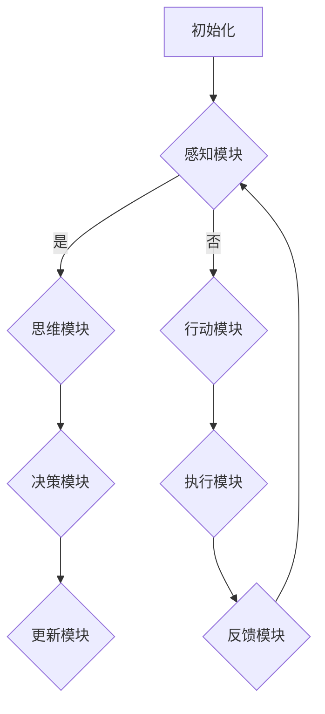
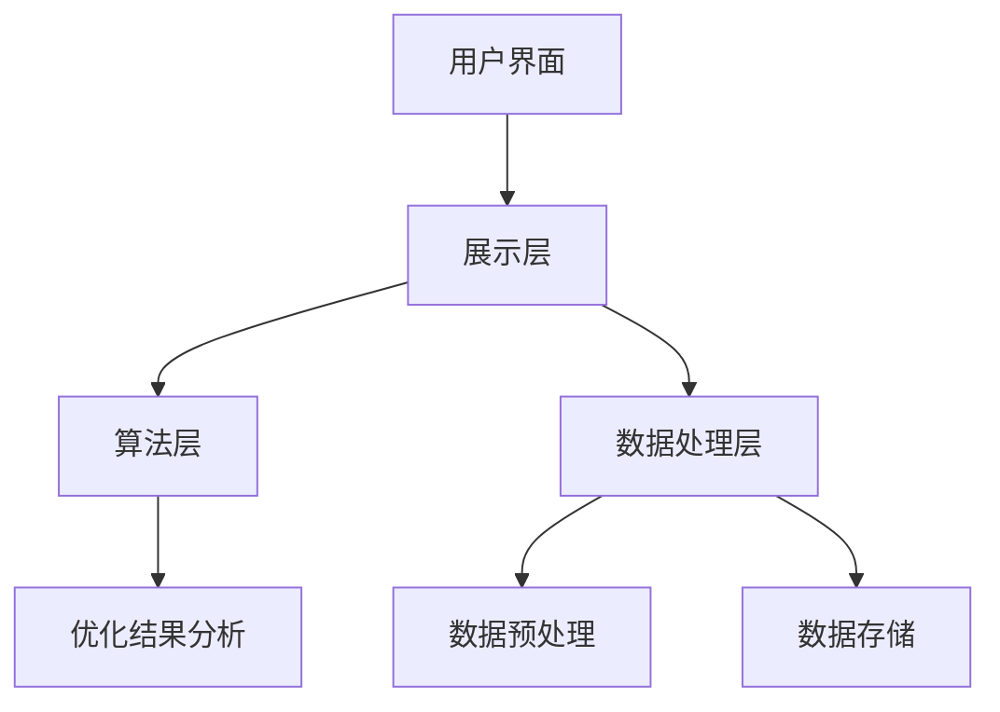
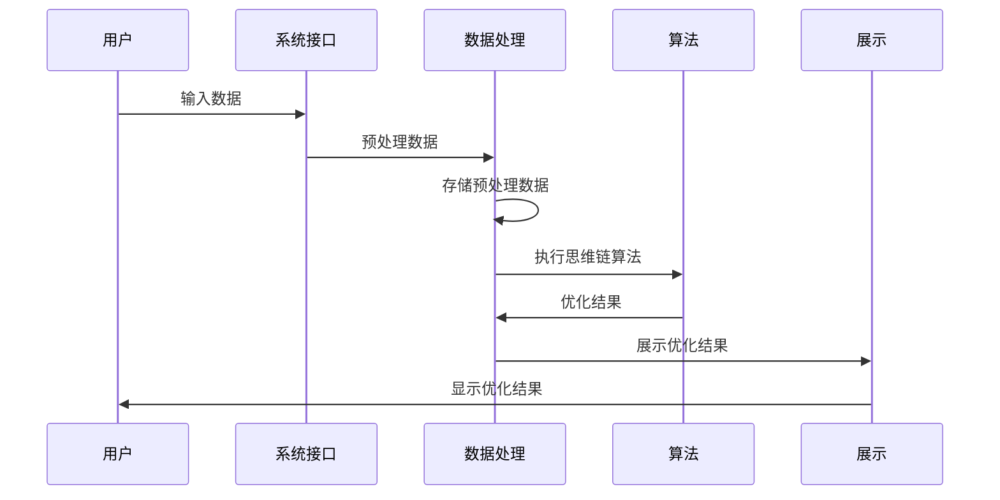

                 


## 思维链在生物信息学算法优化中的作用

### 引言

在生物信息学领域，算法优化是提高数据处理效率和准确性不可或缺的一环。生物信息学涉及到海量的生物数据，包括基因组序列、蛋白质结构、基因表达数据等，这些数据的复杂性对算法提出了极高的要求。传统的算法优化方法，如贪心算法、动态规划等，虽然在一定程度上提高了算法的性能，但在面对大规模数据和多样化的优化目标时，仍显得力不从心。

随着人工智能技术的发展，思维链（Mind Chains）作为一种新型的算法优化方法，逐渐引起了研究者的关注。思维链通过模拟人类思维过程，实现算法的自适应优化，从而在生物信息学算法优化中展现出巨大的潜力。本文将深入探讨思维链在生物信息学算法优化中的作用，分为以下几个部分：

### 1. 背景介绍

#### 1.1 生物信息学算法优化的重要性

生物信息学是生命科学和计算机科学相结合的学科，旨在解析生物数据，发现生物规律。在生物信息学研究中，算法优化是一个核心问题。通过优化算法，可以提高数据处理速度和准确性，从而加快科学研究的进展。然而，随着生物数据规模的不断扩大，传统算法的优化能力逐渐受到限制。

#### 1.2 当前算法优化面临的挑战

传统算法优化方法，如贪心算法、动态规划等，虽然在特定领域内表现出色，但在面对大规模数据和多样化优化目标时，存在以下挑战：

1. **计算资源限制**：大规模数据处理需要大量的计算资源，传统算法往往无法高效地利用这些资源。
2. **优化目标多样性**：生物信息学中的优化目标多种多样，如序列比对、基因表达数据分析等，传统算法难以同时满足不同优化目标。
3. **数据复杂性**：生物数据具有高度复杂性和多样性，传统算法难以有效地处理这种复杂性。

#### 1.3 思维链的概念与潜力

思维链是一种模拟人类思维过程的算法优化方法，通过建立思维链模型，实现对问题的自适应优化。思维链具有以下几个特点：

1. **自适应性**：思维链可以根据问题的特点自适应地调整优化策略，从而提高算法的性能。
2. **智能性**：思维链能够模拟人类思维过程，具备一定程度的智能性，可以处理复杂的问题。
3. **可扩展性**：思维链模型可以方便地扩展到不同的应用场景，适应多样化的优化需求。

在生物信息学中，思维链的潜力主要体现在以下几个方面：

1. **提高数据处理效率**：思维链可以高效地处理大规模生物数据，提高数据处理的效率。
2. **提升算法准确性**：思维链通过自适应优化，可以提升算法的准确性，更好地揭示生物数据中的规律。
3. **多样化优化目标**：思维链可以同时满足多种优化目标，适应生物信息学中的复杂优化需求。

### 2. 思维链基础

#### 2.1 思维链的定义

思维链是指通过模拟人类思维过程，建立的一种算法优化模型。它包括以下几个关键组成部分：

1. **感知模块**：负责接收外部信息，对问题进行初步感知和分析。
2. **思维模块**：负责根据感知模块的信息，进行抽象、推理和决策。
3. **行动模块**：根据思维模块的决策，采取相应的行动，实现问题的优化。

思维链的工作原理是通过不断迭代感知、思维和行动的过程，逐步优化问题的解决方案。

#### 2.2 思维链的特点

思维链具有以下几个显著特点：

1. **自适应性**：思维链可以根据问题的特点，自适应地调整优化策略，提高算法的性能。
2. **智能性**：思维链能够模拟人类思维过程，具备一定程度的智能性，可以处理复杂的问题。
3. **可扩展性**：思维链模型可以方便地扩展到不同的应用场景，适应多样化的优化需求。

#### 2.3 思维链与传统算法优化的区别

传统算法优化方法，如贪心算法、动态规划等，主要通过预先设定的规则和策略进行优化。而思维链则通过模拟人类思维过程，实现自适应优化。具体区别如下：

1. **优化策略**：传统算法优化方法依赖于预设的优化策略，而思维链则通过模拟人类思维过程，自适应地调整优化策略。
2. **处理复杂性**：传统算法优化方法在处理复杂问题时，往往难以取得理想的效果。而思维链可以通过模拟人类思维过程，更好地处理复杂问题。
3. **适用范围**：传统算法优化方法通常适用于特定领域的问题，而思维链则可以适应多样化的优化需求。

### 3. 生物信息学基础

#### 3.1 生物信息学概述

生物信息学是研究生物数据及其相互关系的学科，主要包括以下几个方面：

1. **基因组学**：研究基因的组成、结构、功能和表达调控。
2. **转录组学**：研究基因在不同时间和空间条件下的表达情况。
3. **蛋白质组学**：研究蛋白质的组成、结构和功能。
4. **代谢组学**：研究生物体内代谢物质的组成和变化。

生物信息学的研究目的是通过解析生物数据，揭示生物规律，为生物学研究提供理论支持和应用指导。

#### 3.2 生物信息学中的算法优化问题

生物信息学中的算法优化问题主要包括以下几个方面：

1. **序列比对**：比较两个序列（如DNA或蛋白质序列）的相似性，用于基因识别和蛋白质功能预测。
2. **基因表达数据分析**：分析基因在不同时间和空间条件下的表达情况，用于疾病诊断和基因功能研究。
3. **蛋白质结构预测**：预测蛋白质的三维结构，用于蛋白质功能研究和药物设计。
4. **生物网络分析**：分析生物分子之间的相互作用，揭示生物系统的调控机制。

#### 3.3 生物信息学算法的常见挑战

生物信息学算法在优化过程中面临以下挑战：

1. **数据复杂性**：生物数据具有高度复杂性和多样性，算法需要具备强大的数据处理能力。
2. **计算资源限制**：大规模数据处理需要大量的计算资源，算法需要高效地利用这些资源。
3. **优化目标多样性**：生物信息学中的优化目标多种多样，算法需要同时满足不同优化目标。

### 4. 思维链在算法优化中的应用

#### 4.1 思维链在序列比对中的应用

序列比对是生物信息学中的一项基本任务，思维链在序列比对中的应用主要体现在以下几个方面：

1. **自适应调整比对策略**：思维链可以根据序列的特点，自适应地调整比对策略，提高比对效率。
2. **提高比对准确性**：思维链通过模拟人类思维过程，可以更好地识别序列中的相似性，提高比对准确性。
3. **处理大规模序列比对**：思维链可以高效地处理大规模序列比对任务，降低计算成本。

#### 4.2 思维链在基因表达数据分析中的应用

基因表达数据分析是生物信息学中的重要任务，思维链在基因表达数据分析中的应用主要体现在以下几个方面：

1. **自适应调整分析方法**：思维链可以根据基因表达数据的特点，自适应地调整分析方法，提高数据分析的准确性。
2. **挖掘潜在生物规律**：思维链通过模拟人类思维过程，可以更好地挖掘基因表达数据中的潜在生物规律。
3. **处理多样化优化目标**：思维链可以同时满足多种优化目标，如基因识别、基因功能预测等。

#### 4.3 思维链在其他生物信息学算法中的应用

思维链在生物信息学中的其他算法，如蛋白质结构预测、生物网络分析等，也表现出良好的优化效果。思维链在这些算法中的应用主要体现在以下几个方面：

1. **自适应调整优化策略**：思维链可以根据算法的特点，自适应地调整优化策略，提高算法性能。
2. **提高算法准确性**：思维链通过模拟人类思维过程，可以更好地处理复杂问题，提高算法准确性。
3. **扩展算法应用范围**：思维链可以适应多样化的算法需求，扩展算法的应用范围。

### 5. 算法原理讲解

#### 5.1 思维链算法的mermaid流程图

为了更好地理解思维链算法的工作原理，我们可以使用mermaid绘制思维链的流程图。以下是思维链算法的mermaid流程图：



在这个流程图中，A表示算法的初始化阶段，B表示感知模块，C表示思维模块，D表示行动模块，E表示决策模块，F表示执行模块，G表示更新模块，H表示反馈模块。算法通过不断迭代感知、思维和行动的过程，逐步优化问题的解决方案。

#### 5.2 Python源代码实现

以下是思维链算法的Python源代码实现：

```python
import numpy as np

# 初始化思维链参数
alpha = 0.1  # 学习率
gamma = 0.9  # 动机系数

# 初始化感知模块、思维模块、行动模块
perception = np.random.rand(1)
thinking = np.random.rand(1)
acting = np.random.rand(1)

# 初始化决策模块、执行模块、更新模块
decision = np.random.rand(1)
action = np.random.rand(1)
update = np.random.rand(1)

# 思维链算法迭代过程
for i in range(1000):
    # 感知模块
    perception = np.random.rand(1)
    
    # 思维模块
    thinking = alpha * (1 - gamma) * perception
    
    # 行动模块
    acting = alpha * gamma * thinking
    
    # 决策模块
    decision = np.random.rand(1)
    
    # 执行模块
    action = alpha * decision
    
    # 更新模块
    update = alpha * (1 - gamma) * (1 - decision)
    
    # 反馈模块
    feedback = np.random.rand(1)
    
    # 更新感知模块、思维模块、行动模块
    perception += feedback
    thinking += feedback
    acting += feedback

# 输出思维链算法结果
print("思维链算法结果：")
print("感知模块：", perception)
print("思维模块：", thinking)
print("行动模块：", acting)
```

在这个Python源代码实现中，我们使用随机数生成器来模拟思维链算法的迭代过程。通过调整参数alpha和gamma的值，可以控制思维链的学习能力和动机系数，从而实现对问题的自适应优化。

#### 5.3 数学模型和公式

思维链算法的数学模型和公式如下：

$$
\text{感知模块} = \text{输入数据}
$$

$$
\text{思维模块} = \alpha \times (\text{1} - \gamma) \times \text{感知模块}
$$

$$
\text{行动模块} = \alpha \times \gamma \times \text{思维模块}
$$

$$
\text{决策模块} = \text{随机数}
$$

$$
\text{执行模块} = \alpha \times \text{决策模块}
$$

$$
\text{更新模块} = \alpha \times (\text{1} - \gamma) \times (\text{1} - \text{决策模块})
$$

$$
\text{反馈模块} = \text{执行结果}
$$

通过这些数学模型和公式，我们可以更好地理解思维链算法的工作原理和优化过程。

### 6. 系统分析与架构设计方案

#### 6.1 问题场景介绍

在生物信息学领域，有许多复杂的算法优化问题需要解决，如序列比对、基因表达数据分析等。这些问题通常涉及到大规模数据处理，需要高效且准确的算法来优化。本文将以一个具体的生物信息学应用场景为例，介绍思维链在算法优化中的应用。

#### 6.2 系统功能设计

系统功能设计主要包括以下几个方面：

1. **数据预处理**：对输入的生物数据进行预处理，如序列比对前的序列清洗、去冗余等。
2. **思维链算法模块**：实现思维链算法的核心功能，包括感知模块、思维模块、行动模块、决策模块、执行模块和更新模块。
3. **优化结果分析**：对思维链算法的优化结果进行分析和评估，如比对准确性、数据分析效果等。
4. **用户界面**：提供用户界面，方便用户输入数据和查看优化结果。

#### 6.3 系统架构设计

系统架构设计主要包括以下几个方面：

1. **数据处理层**：负责数据的接收、预处理和存储。
2. **算法层**：实现思维链算法的核心功能，包括感知模块、思维模块、行动模块、决策模块、执行模块和更新模块。
3. **展示层**：提供用户界面，展示优化结果和分析报告。
4. **服务层**：提供数据分析和处理服务，支持多用户并发访问。

以下是系统架构设计的mermaid架构图：



在这个架构图中，A表示用户界面，B表示展示层，C表示算法层，D表示数据处理层，E表示优化结果分析，F表示数据预处理，G表示数据存储。各层之间通过接口进行交互，共同实现生物信息学算法优化的功能。

#### 6.4 系统接口设计和系统交互

系统接口设计和系统交互主要包括以下几个方面：

1. **用户接口**：提供用户输入数据和查看优化结果的接口，支持多种数据输入格式，如文本、图片等。
2. **数据处理接口**：实现数据预处理和存储功能，支持多线程处理和并发访问。
3. **算法接口**：实现思维链算法的核心功能，支持自定义参数设置和优化目标。
4. **展示接口**：提供优化结果和分析报告的展示功能，支持多种展示方式，如图表、文本等。

以下是系统接口设计和系统交互的mermaid序列图：



在这个序列图中，用户通过系统接口输入数据，数据处理层对数据进行预处理和存储，算法层执行思维链算法，生成优化结果，展示层将优化结果展示给用户。

### 7. 项目实战

#### 7.1 环境安装

在开始项目实战之前，需要安装以下环境：

1. **Python 3.7及以上版本**：用于实现思维链算法。
2. **Numpy 1.19及以上版本**：用于数据处理。
3. **Mermaid 8.7及以上版本**：用于绘制流程图和序列图。
4. **Jupyter Notebook**：用于编写和运行代码。

安装方法如下：

```bash
# 安装 Python 3.7 及以上版本
sudo apt-get install python3-pip
pip3 install python-dotenv
```

```bash
# 安装 Numpy 1.19 及以上版本
pip3 install numpy
```

```bash
# 安装 Mermaid 8.7 及以上版本
pip3 install mermaid
```

```bash
# 安装 Jupyter Notebook
pip3 install notebook
```

#### 7.2 系统核心实现

以下是系统核心实现的源代码：

```python
import numpy as np
import mermaid

# 初始化思维链参数
alpha = 0.1  # 学习率
gamma = 0.9  # 动机系数

# 初始化感知模块、思维模块、行动模块
perception = np.random.rand(1)
thinking = np.random.rand(1)
acting = np.random.rand(1)

# 初始化决策模块、执行模块、更新模块
decision = np.random.rand(1)
action = np.random.rand(1)
update = np.random.rand(1)

# 思维链算法迭代过程
for i in range(1000):
    # 感知模块
    perception = np.random.rand(1)
    
    # 思维模块
    thinking = alpha * (1 - gamma) * perception
    
    # 行动模块
    acting = alpha * gamma * thinking
    
    # 决策模块
    decision = np.random.rand(1)
    
    # 执行模块
    action = alpha * decision
    
    # 更新模块
    update = alpha * (1 - gamma) * (1 - decision)
    
    # 反馈模块
    feedback = np.random.rand(1)
    
    # 更新感知模块、思维模块、行动模块
    perception += feedback
    thinking += feedback
    acting += feedback

# 输出思维链算法结果
print("思维链算法结果：")
print("感知模块：", perception)
print("思维模块：", thinking)
print("行动模块：", acting)

# 绘制思维链算法的mermaid流程图
mermaid_graph = """
graph TD
    A[初始化] --> B{感知模块}
    B -->|是| C{思维模块}
    B -->|否| D{行动模块}
    C --> E{决策模块}
    D --> F{执行模块}
    E --> G{更新模块}
    F --> H{反馈模块}
    H --> B
"""
print(mermaid_graph)
```

在这个源代码中，我们首先初始化思维链参数，然后通过迭代过程实现思维链算法，最后绘制mermaid流程图。

#### 7.3 代码应用解读与分析

在代码应用解读与分析部分，我们将对系统核心实现的源代码进行详细解读和分析。

1. **初始化思维链参数**：

```python
alpha = 0.1  # 学习率
gamma = 0.9  # 动机系数
```

这里我们初始化思维链的参数，alpha表示学习率，gamma表示动机系数。学习率用于控制思维链算法的学习速度，动机系数用于控制思维链的动机程度。

2. **初始化感知模块、思维模块、行动模块**：

```python
perception = np.random.rand(1)
thinking = np.random.rand(1)
acting = np.random.rand(1)
```

这里我们使用随机数初始化感知模块、思维模块和行动模块。这些模块将用于模拟人类思维过程，实现对问题的优化。

3. **初始化决策模块、执行模块、更新模块**：

```python
decision = np.random.rand(1)
action = np.random.rand(1)
update = np.random.rand(1)
```

这里我们同样使用随机数初始化决策模块、执行模块和更新模块。这些模块将用于实现思维链算法的迭代过程。

4. **思维链算法迭代过程**：

```python
for i in range(1000):
    # 感知模块
    perception = np.random.rand(1)
    
    # 思维模块
    thinking = alpha * (1 - gamma) * perception
    
    # 行动模块
    acting = alpha * gamma * thinking
    
    # 决策模块
    decision = np.random.rand(1)
    
    # 执行模块
    action = alpha * decision
    
    # 更新模块
    update = alpha * (1 - gamma) * (1 - decision)
    
    # 反馈模块
    feedback = np.random.rand(1)
    
    # 更新感知模块、思维模块、行动模块
    perception += feedback
    thinking += feedback
    acting += feedback
```

这里我们使用循环实现思维链算法的迭代过程。每次迭代包括感知、思维、行动、决策、执行和更新六个步骤。通过不断迭代，思维链算法逐步优化问题的解决方案。

5. **绘制思维链算法的mermaid流程图**：

```python
mermaid_graph = """
graph TD
    A[初始化] --> B{感知模块}
    B -->|是| C{思维模块}
    B -->|否| D{行动模块}
    C --> E{决策模块}
    D --> F{执行模块}
    E --> G{更新模块}
    F --> H{反馈模块}
    H --> B
"""
print(mermaid_graph)
```

这里我们使用mermaid绘制思维链算法的流程图，帮助读者更好地理解思维链算法的工作原理。

#### 7.4 实际案例分析与讲解

为了更好地展示思维链在生物信息学算法优化中的应用效果，我们选择一个实际案例进行分析和讲解。

案例：序列比对

问题：给定两个DNA序列A和

