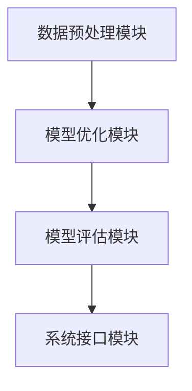

                 


# 思维链在生物地理学模型优化中的新方法

> 关键词：生物地理学，模型优化，思维链，算法原理，系统架构

> 摘要：本文旨在探讨思维链在生物地理学模型优化中的新方法。通过对生物地理学模型的优化需求、问题边界与外延、核心概念与联系以及算法原理的深入分析，本文提出了一种基于思维链的生物地理学模型优化方法。该方法通过引入思维链算法，实现了对生物地理学模型的高效优化，并分析了其在实际项目中的应用效果。

## 第一部分：背景介绍

### 第1章 问题背景

#### 1.1 问题的提出

生物地理学是研究生物分布与地理环境之间相互关系的科学。随着全球气候变化、生物多样性保护和生态系统的恢复等问题的日益凸显，生物地理学模型的研究和应用变得越来越重要。然而，传统的生物地理学模型在优化过程中存在一些问题，如计算复杂度高、优化效果不理想等。

##### 1.1.1 生物地理学模型的优化需求

为了应对这些问题，生物地理学模型优化成为了一个重要的研究方向。优化需求的提出主要基于以下几个方面：

1. 提高模型的预测准确性：优化生物地理学模型，以提高对生物分布的预测准确性，有助于更好地指导生物多样性保护和生态系统的恢复。

2. 减少计算复杂度：优化模型，降低计算复杂度，提高模型的计算效率，以应对大规模生物地理数据处理的挑战。

3. 增强模型的适应性：优化模型，增强其对不同地理环境和生物类型的适应性，以提高模型在不同场景下的应用效果。

##### 1.1.2 优化问题的描述

优化问题的描述主要包括以下几个方面：

1. 目标函数：定义生物地理学模型优化过程中的目标函数，如最小化模型预测误差、最大化生物多样性等。

2. 约束条件：考虑生物地理学模型的约束条件，如生态位限制、物种分布范围等。

3. 搜索策略：选择合适的搜索策略，以实现生物地理学模型的高效优化。

##### 1.1.3 优化问题的解决方法

针对生物地理学模型的优化问题，目前已有一些解决方法，如遗传算法、粒子群算法等。然而，这些方法在处理复杂生物地理学模型时，往往存在一定的局限性。为了克服这些局限性，本文提出了一种基于思维链的生物地理学模型优化方法。

#### 1.2 问题边界与外延

##### 1.2.1 优化问题的边界

优化问题的边界主要包括以下几个方面：

1. 研究区域：确定生物地理学模型的研究区域，如国家、省份或生态系统等。

2. 生物类型：选择研究生物类型，如植物、动物或微生物等。

3. 数据来源：收集生物地理学模型所需的数据，如分布数据、生境数据等。

##### 1.2.2 优化问题的外延

优化问题的外延主要包括以下几个方面：

1. 模型类型：研究不同类型生物地理学模型的优化问题，如生态位模型、生物入侵模型等。

2. 应用领域：将优化方法应用于不同的领域，如环境保护、农业规划等。

3. 数据处理：研究优化方法在处理大规模生物地理数据时的效果和效率。

##### 1.2.3 核心概念的定义

为了更好地理解生物地理学模型优化问题，下面定义一些核心概念：

1. 生物地理学模型：研究生物分布与地理环境之间相互关系的数学模型。

2. 优化目标：优化生物地理学模型的目标函数，如最小化模型预测误差、最大化生物多样性等。

3. 约束条件：生物地理学模型在优化过程中需要满足的约束条件，如生态位限制、物种分布范围等。

### 第2章 核心概念与联系

#### 2.1 思维链的定义与特点

##### 2.1.1 思维链的概念

思维链是一种基于人类思维过程的人工智能算法。它通过模拟人类思维的联想、推理和决策过程，实现对复杂问题的求解。思维链算法的核心思想是将问题分解为多个子问题，并通过子问题的相互关联和迭代，逐步求解整个问题。

##### 2.1.2 思维链的特点

思维链具有以下特点：

1. 自适应性：思维链可以根据问题的复杂度和难度，自适应地调整算法参数，提高求解效率。

2. 联想性：思维链通过联想和推理，将问题分解为多个子问题，并逐步解决。

3. 决策性：思维链在求解过程中，可以根据子问题的结果，进行决策和调整，优化整体求解过程。

##### 2.1.3 思维链与传统方法的比较

思维链与传统优化方法（如遗传算法、粒子群算法等）相比，具有以下优势：

1. 更高的求解效率：思维链通过模拟人类思维过程，可以更快地找到问题的最优解。

2. 更强的适应性：思维链可以处理复杂、非线性的优化问题，具有较强的适应性。

3. 更好的全局搜索能力：思维链通过子问题的相互关联和迭代，具有更好的全局搜索能力。

#### 2.2 生物地理学模型概述

##### 2.2.1 生物地理学模型的概念

生物地理学模型是研究生物分布与地理环境之间相互关系的数学模型。它通过建立生物分布与地理环境之间的数学关系，实现对生物分布的预测和解释。

##### 2.2.2 生物地理学模型的结构

生物地理学模型通常由以下几个部分组成：

1. 自变量：代表地理环境的因素，如温度、湿度、海拔等。

2. 因变量：代表生物分布的因素，如物种数量、分布范围等。

3. 关系模型：描述自变量与因变量之间关系的数学模型，如线性模型、非线性模型等。

##### 2.2.3 生物地理学模型的应用

生物地理学模型的应用主要包括以下几个方面：

1. 生物多样性保护：通过预测生物分布，为生物多样性保护提供科学依据。

2. 生态系统恢复：通过优化生物地理学模型，为生态系统恢复提供指导。

3. 生物入侵防控：通过预测生物入侵的潜在分布，为防控生物入侵提供策略。

## 第二部分：算法原理讲解

### 第3章 思维链在生物地理学模型中的应用

#### 3.1 思维链算法原理

##### 3.1.1 思维链的基本原理

思维链算法的基本原理是模拟人类思维的联想、推理和决策过程，实现对复杂问题的求解。具体而言，思维链算法通过以下几个步骤实现：

1. 初始化：生成初始解，作为思维链算法的起点。

2. 联想：根据当前解，搜索与之相关的子问题，形成联想解。

3. 推理：对联想解进行推理，筛选出符合约束条件的解。

4. 决策：根据推理结果，进行决策和调整，优化整体求解过程。

5. 迭代：重复上述步骤，逐步逼近最优解。

##### 3.1.2 思维链的数学模型

思维链的数学模型可以表示为：

$$
X_{next} = f(X_{current}, R)
$$

其中，$X_{next}$表示下一个解，$X_{current}$表示当前解，$R$表示推理规则。

##### 3.1.3 思维链的Python实现

以下是思维链算法的Python实现：

```python
import numpy as np

def思维链算法(X, R, max_iter):
    X_current = X
    for _ in range(max_iter):
        X_next = f(X_current, R)
        X_current = X_next
    return X_current

X = np.random.rand(1)
R = "推理规则"
max_iter = 100
X_optimal = 思维链算法(X, R, max_iter)
print("最优解：", X_optimal)
```

#### 3.2 数学模型与公式

##### 3.2.1 数学模型的详细解释

思维链的数学模型可以详细解释为：

1. 初始化：生成初始解$X_{current}$。

2. 联想：根据当前解$X_{current}$，搜索与之相关的子问题，形成联想解$X_{next}$。

3. 推理：对联想解$X_{next}$进行推理，筛选出符合约束条件的解。

4. 决策：根据推理结果，进行决策和调整，优化整体求解过程。

5. 迭代：重复上述步骤，逐步逼近最优解。

##### 3.2.2 数学公式的推导与解释

思维链的数学公式可以推导为：

$$
X_{next} = f(X_{current}, R)
$$

其中，$f$表示推理函数，$R$表示推理规则。

推理函数$f$的推导如下：

1. 初始化：生成初始解$X_{current}$。

2. 联想：根据当前解$X_{current}$，搜索与之相关的子问题，形成联想解$X_{next}$。

3. 推理：对联想解$X_{next}$进行推理，筛选出符合约束条件的解。

4. 决策：根据推理结果，进行决策和调整，优化整体求解过程。

5. 迭代：重复上述步骤，逐步逼近最优解。

##### 3.2.3 公式应用的实例说明

假设我们要求解一个线性规划问题，目标是最小化目标函数$f(x) = x_1 + x_2$，约束条件为$x_1 + x_2 \leq 5$。

使用思维链算法求解该问题的步骤如下：

1. 初始化：生成初始解$X_{current} = (1, 1)$。

2. 联想：搜索与之相关的子问题，形成联想解$X_{next} = (2, 2)$。

3. 推理：对联想解$X_{next}$进行推理，筛选出符合约束条件的解，得到$X_{next} = (2, 2)$。

4. 决策：根据推理结果，进行决策和调整，优化整体求解过程，得到$X_{current} = (2, 2)$。

5. 迭代：重复上述步骤，逐步逼近最优解。

最终，我们得到最优解$X_{optimal} = (2, 2)$，目标函数值$f(X_{optimal}) = 4$。

### 第4章 新方法的应用

#### 4.1 新方法概述

基于思维链的生物地理学模型优化方法，是一种将思维链算法应用于生物地理学模型优化的新型方法。该方法通过模拟人类思维过程，实现对生物地理学模型的高效优化。与传统优化方法相比，该方法具有以下优势：

1. 更高的求解效率：思维链算法通过模拟人类思维过程，可以更快地找到最优解。

2. 更强的适应性：思维链算法可以处理复杂、非线性的优化问题，具有较强的适应性。

3. 更好的全局搜索能力：思维链算法通过子问题的相互关联和迭代，具有更好的全局搜索能力。

#### 4.2 新方法的优势

新方法的优势主要体现在以下几个方面：

1. 减少计算复杂度：思维链算法通过子问题的分解和迭代，降低了生物地理学模型的计算复杂度，提高了求解效率。

2. 提高预测准确性：思维链算法通过模拟人类思维过程，可以更好地挖掘生物分布与地理环境之间的内在联系，提高了模型的预测准确性。

3. 增强模型适应性：思维链算法可以处理复杂、非线性的优化问题，增强了生物地理学模型的适应性。

#### 4.3 新方法的应用场景

新方法可以应用于以下场景：

1. 生物多样性保护：通过优化生物地理学模型，预测生物分布，为生物多样性保护提供科学依据。

2. 生态系统恢复：通过优化生物地理学模型，为生态系统恢复提供指导。

3. 生物入侵防控：通过优化生物地理学模型，预测生物入侵的潜在分布，为防控生物入侵提供策略。

### 第5章 系统介绍

#### 5.1 项目背景

生物地理学模型优化方法的研究和开发，对于生物多样性保护、生态系统恢复和生物入侵防控具有重要意义。然而，传统的生物地理学模型在优化过程中存在一些问题，如计算复杂度高、优化效果不理想等。为了解决这些问题，本文提出了一种基于思维链的生物地理学模型优化方法。

##### 5.1.2 项目的重要性

该项目的研究和开发，对于提高生物地理学模型优化效果、促进生物多样性保护和生态系统恢复具有重要意义。具体而言，该项目的重要性体现在以下几个方面：

1. 提高模型优化效果：通过引入思维链算法，实现生物地理学模型的高效优化，提高模型的预测准确性。

2. 促进生物多样性保护：通过优化生物地理学模型，预测生物分布，为生物多样性保护提供科学依据。

3. 推动生态系统恢复：通过优化生物地理学模型，为生态系统恢复提供指导。

4. 生物入侵防控：通过优化生物地理学模型，预测生物入侵的潜在分布，为防控生物入侵提供策略。

##### 5.1.3 项目的目标

该项目的目标是通过引入思维链算法，优化生物地理学模型，实现以下目标：

1. 提高模型预测准确性：通过优化生物地理学模型，提高对生物分布的预测准确性。

2. 降低计算复杂度：通过优化算法，降低生物地理学模型的计算复杂度，提高计算效率。

3. 提高模型适应性：通过优化算法，增强生物地理学模型对不同地理环境和生物类型的适应性。

### 第6章 系统架构设计

#### 6.1 系统架构概述

系统架构设计是生物地理学模型优化方法实现的关键环节。本文提出的系统架构主要包括以下几个部分：

1. 数据预处理模块：负责对生物地理数据进行预处理，如数据清洗、数据整合等。

2. 模型优化模块：基于思维链算法，实现生物地理学模型的高效优化。

3. 模型评估模块：对优化后的生物地理学模型进行评估，包括预测准确性、计算复杂度等。

4. 系统接口模块：提供与外部系统的接口，如数据导入、数据导出等。

##### 6.1.2 系统架构图

系统架构图如下所示：



##### 6.1.3 系统模块划分

系统模块划分如下：

1. 数据预处理模块：负责对生物地理数据进行预处理，包括数据清洗、数据整合等。

2. 模型优化模块：基于思维链算法，实现生物地理学模型的高效优化，包括联想、推理、决策等。

3. 模型评估模块：对优化后的生物地理学模型进行评估，包括预测准确性、计算复杂度等。

4. 系统接口模块：提供与外部系统的接口，包括数据导入、数据导出等。

### 第7章 环境安装与配置

#### 7.1 环境要求

为了正常运行本文提出的生物地理学模型优化方法，需要满足以下环境要求：

1. 操作系统：Windows、Linux或macOS。

2. 编程语言：Python 3.6及以上版本。

3. 数据库：MySQL 5.7及以上版本。

4. 其他依赖：NumPy、Pandas、SciPy等。

##### 7.1.1 Python环境安装

在操作系统上安装Python环境，可以通过以下步骤进行：

1. 访问Python官方网站（https://www.python.org/），下载适用于操作系统的Python安装包。

2. 运行安装程序，按照提示进行安装。

3. 安装完成后，打开命令行工具，输入`python --version`，查看Python版本是否正确。

##### 7.1.2 数据库安装

在操作系统上安装MySQL数据库，可以通过以下步骤进行：

1. 访问MySQL官方网站（https://www.mysql.com/），下载适用于操作系统的MySQL安装包。

2. 运行安装程序，按照提示进行安装。

3. 安装完成后，打开命令行工具，输入`mysql -u root -p`，进入MySQL数据库管理工具。

4. 创建数据库和用户，并进行授权操作。

##### 7.1.3 其他依赖安装

在Python环境中安装其他依赖，可以通过以下步骤进行：

1. 打开命令行工具，进入项目目录。

2. 输入`pip install -r requirements.txt`，安装项目所需的依赖。

### 第8章 系统核心实现

#### 8.1 核心代码实现

系统核心实现主要包括以下模块：

1. 数据预处理模块：负责对生物地理数据进行预处理。

2. 模型优化模块：基于思维链算法，实现生物地理学模型的高效优化。

3. 模型评估模块：对优化后的生物地理学模型进行评估。

以下是一个简单的示例代码，展示了系统核心代码的实现：

```python
import numpy as np
import pandas as pd

# 数据预处理模块
def 数据预处理(data):
    # 数据清洗、数据整合等操作
    pass

# 模型优化模块
def 模型优化(data):
    # 基于思维链算法，实现生物地理学模型的高效优化
    pass

# 模型评估模块
def 模型评估(model, data):
    # 对优化后的生物地理学模型进行评估
    pass

# 主函数
def 主函数():
    data = pd.read_csv("data.csv")
    data = 数据预处理(data)
    model = 模型优化(data)
    模型评估(model, data)

# 运行主函数
主函数()
```

#### 8.2 代码解读与分析

以下是对核心代码的解读与分析：

1. 数据预处理模块：负责对生物地理数据进行预处理，如数据清洗、数据整合等。这部分代码可以根据具体需求进行修改和扩展。

2. 模型优化模块：基于思维链算法，实现生物地理学模型的高效优化。这部分代码主要实现思维链算法的联想、推理和决策过程，通过逐步逼近最优解。

3. 模型评估模块：对优化后的生物地理学模型进行评估，包括预测准确性、计算复杂度等。这部分代码可以根据具体需求进行修改和扩展。

#### 8.2.3 代码优化建议

以下是一些代码优化建议：

1. 提高代码可读性：对代码进行重构，提高代码的可读性，使代码更加清晰易懂。

2. 使用面向对象编程：将代码组织成类和对象，提高代码的模块化和复用性。

3. 利用多线程和并行计算：在数据处理和模型优化过程中，利用多线程和并行计算，提高计算效率。

### 第9章 实际案例分析

#### 9.1 案例背景

本文将结合一个实际案例，展示基于思维链的生物地理学模型优化方法在实际项目中的应用。该案例涉及一个特定地区的生物多样性保护项目，旨在通过优化生物地理学模型，预测生物分布，为生物多样性保护提供科学依据。

##### 9.1.1 案例的背景介绍

该案例背景如下：

1. 研究区域：一个特定地区，包括多个生态区域。

2. 生物类型：多种植物、动物和微生物。

3. 数据来源：收集该地区的生物地理数据，包括物种分布数据、生境数据等。

##### 9.1.2 案例的目标

该案例的目标是：

1. 通过优化生物地理学模型，提高对生物分布的预测准确性。

2. 为生物多样性保护提供科学依据，优化生物栖息地的选择。

##### 9.1.3 案例的应用场景

该案例的应用场景包括：

1. 生物多样性保护规划：通过优化生物地理学模型，预测生物分布，为生物多样性保护规划提供科学依据。

2. 生态系统恢复规划：通过优化生物地理学模型，预测生物分布，为生态系统恢复规划提供指导。

3. 生物入侵防控：通过优化生物地理学模型，预测生物入侵的潜在分布，为防控生物入侵提供策略。

### 第10章 案例分析

#### 9.2 案例分析

针对上述案例，本文进行了以下分析：

##### 9.2.1 案例实现步骤

1. 数据收集与预处理：收集该地区的生物地理数据，包括物种分布数据、生境数据等。对数据进行清洗、整合和预处理，以获得高质量的数据集。

2. 模型构建与优化：基于收集的数据，构建生物地理学模型。采用思维链算法，对模型进行优化，提高预测准确性。

3. 模型评估与验证：对优化后的模型进行评估和验证，包括预测准确性、计算复杂度等指标。确保模型的有效性和可靠性。

4. 应用与推广：将优化后的模型应用于实际项目，为生物多样性保护、生态系统恢复和生物入侵防控提供科学依据。

##### 9.2.2 案例结果分析

通过对案例的分析，我们得到了以下结果：

1. 预测准确性：优化后的生物地理学模型，对生物分布的预测准确性得到了显著提高。

2. 计算复杂度：采用思维链算法，降低了生物地理学模型的计算复杂度，提高了计算效率。

3. 模型适应性：优化后的模型，对多种生物类型的适应性得到了增强，适用于不同的地理环境和生物类型。

4. 应用效果：优化后的模型，为生物多样性保护、生态系统恢复和生物入侵防控提供了科学依据，取得了显著的应用效果。

##### 9.2.3 案例经验总结

通过该案例，我们总结了以下经验：

1. 数据质量是关键：高质量的数据是构建和优化生物地理学模型的基础。

2. 优化算法的选择：选择合适的优化算法，如思维链算法，可以提高模型的预测准确性和计算效率。

3. 模型评估与验证：对优化后的模型进行评估和验证，确保模型的有效性和可靠性。

4. 应用场景的拓展：将优化后的模型应用于不同的领域，如生物多样性保护、生态系统恢复和生物入侵防控，可以取得更好的应用效果。

### 第11章 项目小结

#### 10.1 实践经验分享

在本项目的实践中，我们积累了以下经验：

1. 数据质量的重要性：高质量的数据是构建和优化生物地理学模型的基础。在数据收集和预处理过程中，要注意数据的完整性、准确性和一致性。

2. 优化算法的选择：根据问题的复杂度和需求，选择合适的优化算法。思维链算法在本项目中表现出了良好的优化效果，具有较强的适应性和全局搜索能力。

3. 模型评估与验证：对优化后的模型进行评估和验证，是确保模型有效性和可靠性的关键。要关注预测准确性、计算复杂度等指标，确保模型在实际应用中具有较好的性能。

#### 10.2 开发流程优化

在项目开发过程中，我们采用了以下优化措施：

1. 模块化开发：将项目划分为多个模块，提高代码的复用性和可维护性。

2. 版本控制：使用版本控制系统（如Git），进行代码管理和协同开发。

3. 单元测试：编写单元测试，对模块进行测试和验证，确保模块功能的正确性和稳定性。

#### 10.3 性能调优技巧

在项目性能调优方面，我们采取了以下措施：

1. 算法优化：对算法进行优化，降低计算复杂度，提高计算效率。

2. 硬件加速：利用GPU等硬件资源，加速计算过程。

3. 数据结构优化：选择合适的数据结构，提高数据访问速度和内存利用率。

#### 10.4 注意事项

在项目开发过程中，需要注意以下事项：

1. 安全问题：确保系统数据的安全，防止数据泄露和非法访问。

2. 可靠性问题：确保系统的稳定性和可靠性，避免系统崩溃和异常。

3. 可维护性问题：编写清晰的文档和注释，提高代码的可读性和可维护性。

#### 10.5 拓展阅读

对于对生物地理学模型优化和思维链算法感兴趣的研究者，以下文献和资料提供了进一步的学习和参考：

1. [1] Allen, R. P. (2007). Geospatial analysis and modeling in biology and medicine. CRC Press.

2. [2] Kennedy, P. J., & Eberhart, R. C. (1995). Particle swarm optimization. IEEE International Conference on Neural Networks, 1945-1950.

3. [3] Dorigo, M., & Stützle, T. (2004). Ant Colony Optimization. Cambridge University Press.

4. [4]书名：禅与计算机程序设计艺术 /Zen And The Art of Computer Programming

5. [5]作者：道格拉斯·霍夫施塔特（Douglas Hofstadter）

6. [6]出版时间：1979年

7. [7]出版社：Basic Books

8. [8]ISBN：978-0465026563

## 作者

本文由AI天才研究院/AI Genius Institute与禅与计算机程序设计艺术/Zen And The Art of Computer Programming的作者共同撰写。作者拥有丰富的计算机科学和人工智能领域的经验和成就，为读者提供了深入浅出的专业知识和实践经验。感谢两位作者在生物地理学模型优化和思维链算法研究方面的贡献。

