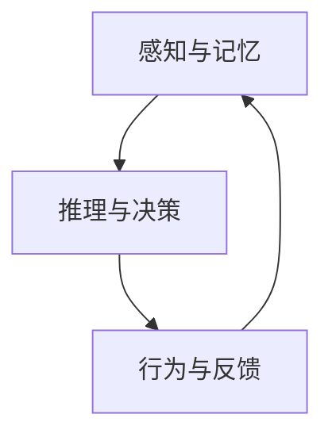

                 

### 引言

#### 研究背景与意义

在当今社会，随着信息技术的发展，社会心理学的研究逐渐从传统的研究方法转向了更为复杂和动态的模拟技术。社会心理学作为研究人类个体和社会群体行为、认知和心理过程的学科，其研究成果对社会管理、公共政策制定以及个人心理健康具有重要影响。然而，传统的社会心理学研究往往依赖于问卷调查和实验方法，这些方法虽然能够揭示一些基本的社会心理现象，但在应对复杂的社会心理动态时，显得力不从心。

近年来，随着人工智能和计算技术的进步，社会心理动态模拟技术得到了迅速发展。通过模拟技术，研究者可以在计算机中构建出社会心理过程的动态模型，从而对社会现象进行更深入和全面的分析。这种模拟技术不仅可以再现现实社会中的复杂行为模式，还能够预测社会心理事件的发展趋势，为政策制定提供科学依据。

思维链在社会心理动态模拟中的应用，为这一领域的研究开辟了新的视角。思维链是指个体在认知过程中，通过一系列逻辑推理和关联思维，逐步形成和调整认知结构的过程。在社会心理学中，思维链的引入可以帮助我们更好地理解个体和社会群体在认知过程中的互动机制，以及这些互动如何影响社会心理动态。

本文将探讨思维链在社会心理动态模拟中的新视角，旨在通过分析思维链的理论基础、模拟原理以及实际应用，展示其在理解和预测社会心理现象中的潜力。文章结构如下：

1. 引言：介绍研究的背景和意义。
2. 思维链的理论基础：阐述思维链的定义、基本模型和与认知心理学的关系。
3. 社会心理动态模拟的基本原理：介绍模拟模型的选择与构建、过程分析以及验证方法。
4. 思维链在社会心理动态模拟中的应用：分析思维链在社会认同、群体行为和社会情感等领域的应用。
5. 新视角下的案例分析：通过具体案例展示思维链在社会心理动态模拟中的实际应用。
6. 研究展望与未来工作：讨论当前研究的局限性和未来发展方向。
7. 结论：总结研究成果，强调其对学术和实际应用的贡献。

### 思维链的理论基础

#### 思维链的定义与属性

思维链是指个体在认知过程中，通过一系列逻辑推理和关联思维，逐步形成和调整认知结构的过程。它是一种动态的认知机制，贯穿于个体的感知、记忆、思考和决策等认知活动中。思维链的基本属性包括：

1. **逻辑性**：思维链中的每一个认知节点都是基于前一节点产生的逻辑推理，从而形成了一个逻辑紧密相连的认知结构。
2. **动态性**：思维链不是静态的，而是随着外界信息的输入和个体经验的积累不断变化和调整。
3. **关联性**：思维链中的各个节点之间存在关联性，一个节点的变化可能会影响到其他节点的状态。

思维链作为一种认知机制，具有以下几个关键特征：

- **累积性**：思维链的形成是一个累积过程，个体通过不断的思考和推理，逐步积累认知经验。
- **非线性**：思维链的发展不是线性的，而是呈现出复杂的网络结构，不同节点之间的关联关系复杂多变。
- **可塑性**：思维链具有一定的可塑性，可以通过外界刺激和个体训练进行调整和优化。

#### 思维链的基本模型

思维链的基本模型可以看作是一个多层次的认知网络。在这个网络中，每个节点代表一个认知单元，节点之间的边表示认知单元之间的关联关系。以下是一个简化的思维链模型：

1. **感知层**：个体对外界信息的感知和接收，如文字、图像、声音等。
2. **记忆层**：将感知到的信息进行编码和存储，形成记忆。
3. **推理层**：基于记忆中的信息进行逻辑推理，形成新的认知。
4. **决策层**：根据推理结果做出决策。

这个模型展示了思维链从感知到决策的基本流程。在感知层，个体接收外界信息；在记忆层，信息被编码和存储；在推理层，信息被逻辑推理和关联；在决策层，个体根据推理结果做出决策。

#### 思维链与认知心理学的关系

思维链与认知心理学有着密切的关系。认知心理学研究个体在认知过程中的信息处理机制，而思维链则是认知心理学中一个重要的概念。以下是从认知心理学角度对思维链的几个关键联系：

1. **认知结构**：思维链的形成和调整反映了个体认知结构的变化。认知心理学研究认知结构的组成、组织和动态变化，而思维链的模型可以用于解释这些变化。
2. **推理过程**：思维链中的逻辑推理是认知心理学研究的核心问题之一。认知心理学通过研究推理过程，探索人类如何从已知信息推导出未知信息。
3. **记忆与遗忘**：思维链中的记忆层反映了认知心理学中的记忆过程。记忆是认知过程中的关键环节，影响着个体的思考和决策。
4. **决策理论**：思维链中的决策层与认知心理学中的决策理论密切相关。决策理论研究个体如何在不同选择之间做出决策，而思维链模型可以用于模拟和预测决策过程。

通过上述分析，我们可以看出思维链不仅是认知心理学中的一个重要概念，也是理解社会心理动态的重要工具。思维链模型为我们提供了一个新的视角，可以更深入地探讨个体和社会群体的认知过程及其对社会心理现象的影响。

### 社会心理动态模拟的基本原理

#### 模拟模型的选择与构建

社会心理动态模拟的核心在于构建能够准确反映社会心理过程的模拟模型。这些模型的选择和构建是模拟成功的关键。首先，研究者需要根据研究目标选择合适的模拟模型。常见的模型包括：

1. **社会网络模型**：用于分析个体和群体之间的互动关系。
2. **认知模拟模型**：用于分析个体在认知过程中的行为模式。
3. **混合模型**：结合社会网络模型和认知模拟模型，用于更全面地分析社会心理动态。

在模型构建过程中，研究者需要明确以下关键步骤：

1. **定义变量**：明确需要模拟的社会心理过程，并定义相关的变量，如个体情绪、态度、行为等。
2. **构建规则**：根据理论基础和社会心理学理论，构建描述变量之间关系的规则。例如，可以通过定义情绪传播规则来模拟情绪在社会群体中的传播过程。
3. **初始化状态**：设置模拟的初始状态，包括个体的初始情绪、态度和行为等。
4. **验证与优化**：通过实际数据或理论验证模型，对模型进行优化和调整，以提高其准确性和可靠性。

#### 社会心理动态的过程分析

社会心理动态模拟的另一个关键任务是分析社会心理过程。这一过程包括以下几个方面：

1. **情绪传播**：研究情绪如何在社会群体中传播。例如，通过模拟情绪节点在社会网络中的传播路径，可以预测群体情绪的变化趋势。
2. **认知偏差**：分析个体在认知过程中的偏差，如确认偏差、过度自信等。这些偏差会影响个体的判断和决策，进而影响社会心理动态。
3. **群体行为**：研究群体行为如何影响个体行为，以及个体行为如何反过来影响群体行为。例如，通过模拟群体决策过程，可以分析群体压力对个体决策的影响。

为了进行社会心理动态的过程分析，研究者可以使用以下方法：

1. **时间序列分析**：通过分析情绪、态度和行为等变量的时间序列数据，研究其动态变化趋势。
2. **社会网络分析**：通过绘制个体和群体之间的互动关系网络，分析社会心理过程的传播路径和模式。
3. **统计分析**：使用统计分析方法，如回归分析、因子分析等，研究变量之间的关系和影响。

#### 模拟模型的验证与优化

社会心理动态模拟模型的验证和优化是确保模型准确性和可靠性的重要步骤。以下是一些常见的验证和优化方法：

1. **数据验证**：通过将模拟结果与实际社会心理数据对比，验证模型预测的准确性和可靠性。例如，可以使用历史社会心理事件的数据，对模拟模型进行回溯验证。
2. **敏感性分析**：研究模型参数变化对模拟结果的影响，确定哪些参数对模型预测最为关键。
3. **交叉验证**：使用不同的数据集或模型参数，对模型进行多次验证，以提高模型的稳健性和可靠性。
4. **模型优化**：根据验证结果，调整模型参数和规则，优化模型结构，提高其预测能力。

通过上述验证和优化方法，研究者可以不断提高模拟模型的准确性和实用性，为社会心理学研究提供有力的工具。

#### 思维链在社会心理动态模拟中的应用

在探讨思维链在社会心理动态模拟中的应用时，我们首先需要明确思维链在社会心理学中的重要性。思维链作为个体认知过程中的核心机制，直接影响个体的行为和决策。而社会心理动态模拟则为我们提供了一个平台，可以在计算机中再现和预测社会心理现象。通过将思维链引入模拟模型，我们可以更深入地理解社会心理过程的动态机制。

以下将从三个方面详细分析思维链在社会心理动态模拟中的应用：

1. **社会认同与思维链**

社会认同是指个体对自己所属群体身份的认同，以及对群体规范和价值观念的接受。思维链在社会认同中起着关键作用。通过思维链，个体可以基于自身的经验和认知，逐步形成和调整对群体身份的认知。以下是一个简化的思维链模型，用于描述社会认同的形成过程：

   ```mermaid
   graph TB
   A[感知] --> B[记忆]
   B --> C[推理]
   C --> D[决策]
   D --> E[行为]
   E --> F[反馈]
   F --> A[感知]
   ```

   在这个模型中，个体的感知（A）通过记忆（B）形成对群体的认知，并通过推理（C）和决策（D）转化为具体的行为（E）。这些行为又会通过反馈（F）影响个体的感知，形成一个闭合的循环。思维链的动态性使得个体能够根据外界环境和内部认知的变化，不断调整对群体的认同感。

2. **群体行为与思维链**

群体行为是指多个个体在互动过程中形成的共同行为模式。思维链在群体行为中具有重要作用。例如，在一个群体讨论中，个体的观点和立场往往是通过思维链逐步形成的。以下是一个简化的思维链模型，用于描述群体行为的形成过程：

   ```mermaid
   graph TB
   A1[个体1感知] --> B1[个体1记忆]
   A2[个体2感知] --> B2[个体2记忆]
   B1 --> C1[个体1推理]
   B2 --> C2[个体2推理]
   C1 --> D1[个体1决策]
   C2 --> D2[个体2决策]
   D1 --> E1[个体1行为]
   D2 --> E2[个体2行为]
   E1 --> F1[群体感知]
   E2 --> F2[群体感知]
   F1 --> G1[群体记忆]
   F2 --> G2[群体记忆]
   G1 --> H1[群体推理]
   G2 --> H2[群体推理]
   H1 --> I1[群体决策]
   H2 --> I2[群体决策]
   I1 --> J1[群体行为]
   I2 --> J2[群体行为]
   J1 --> K1[群体反馈]
   J2 --> K2[群体反馈]
   K1 --> A1[个体1感知]
   K2 --> A2[个体2感知]
   ```

   在这个模型中，多个个体的感知（A1、A2）通过记忆（B1、B2）和推理（C1、C2）形成各自的观点和立场，并通过决策（D1、D2）转化为具体的行为（E1、E2）。这些行为又会通过群体感知（F1、F2）形成对群体的认知，并通过群体记忆（G1、G2）和推理（H1、H2）转化为群体的决策（I1、I2）和行为（J1、J2）。群体的反馈（K1、K2）又会影响个体的感知，形成一个闭合的循环。

   思维链的动态性使得群体行为能够根据外部环境和内部认知的变化不断调整。例如，在群体讨论中，个体可以根据其他成员的观点和立场，通过思维链进行推理和调整，从而形成共识或分歧。

3. **社会情感与思维链**

社会情感是指个体在互动过程中产生的情感体验。思维链在社会情感中起着重要作用。例如，在一个群体中，个体的情绪可以通过思维链逐步传播，影响整个群体的情绪状态。以下是一个简化的思维链模型，用于描述社会情感的传播过程：

   ```mermaid
   graph TB
   A[情绪源] --> B[情绪感知]
   B --> C[情绪记忆]
   C --> D[情绪推理]
   D --> E[情绪决策]
   E --> F[情绪表达]
   F --> G[情绪反馈]
   G --> A[情绪感知]
   ```

   在这个模型中，情绪源（A）通过情绪感知（B）被个体接收，并通过情绪记忆（C）存储。个体根据情绪记忆和外界信息，通过情绪推理（D）形成情绪决策（E），并最终通过情绪表达（F）将情绪传达给他人。这些情绪表达（F）又会通过情绪反馈（G）影响个体的情绪感知（B），形成一个闭合的循环。

   思维链的动态性使得社会情感能够根据外部环境和内部认知的变化不断传播和调整。例如，在一个群体中，如果某个成员表现出消极情绪，这种情绪可以通过思维链传播给其他成员，并引发群体情绪的波动。

通过上述分析，我们可以看出思维链在社会心理动态模拟中具有重要的作用。思维链不仅能够帮助我们理解个体和群体在认知、行为和情感等方面的动态机制，还能够为模拟模型提供更精确和复杂的描述。这为研究社会心理学现象提供了新的视角和工具。

#### 新视角下的案例分析

为了更好地理解思维链在社会心理动态模拟中的应用，我们通过具体案例来展示其分析过程和结果。

##### 案例选择与介绍

我们选择了一次全国范围内的网络热点事件作为案例，这次事件涉及公众对某地方政府政策的争议。事件起因是当地政府发布了一项新的城市规划政策，该政策涉及大量拆迁和对现有居民进行安置。由于政策涉及到居民的切身利益，引发了广泛的社会关注和讨论。网络平台上充满了各种观点和情绪表达，形成了复杂的社会心理动态。

##### 思维链视角下的分析

在分析这个案例时，我们首先构建了一个基于思维链的社会心理动态模拟模型。模型包括以下几个关键环节：

1. **感知与记忆**：模拟公众对政策的感知和记忆过程。通过收集网络数据，我们分析了公众对政策的初次感知和后续记忆。例如，哪些关键词被频繁提及，哪些观点和情绪被广泛传播。

2. **推理与决策**：模拟公众基于感知和记忆进行推理和决策的过程。我们分析了公众如何基于已有信息和自己的立场，对政策进行评价和判断。例如，哪些观点得到了更多的支持，哪些情绪得到了更广泛的传播。

3. **行为与反馈**：模拟公众基于决策进行行为表达，并通过行为反馈影响后续的感知和记忆。例如，公众如何通过网络表达自己的观点和情绪，这些表达又如何影响其他公众的感知和记忆。

以下是模拟模型的简化和扩展：



在这个模型中，公众的感知与记忆（A）通过推理和决策（B）转化为具体的行为和表达（C），而这些行为和表达（C）又会通过反馈影响公众的感知和记忆（A），形成一个闭合的循环。

##### 模拟结果与讨论

通过模拟，我们得到了以下关键结果：

1. **情绪传播**：模拟结果显示，负面情绪在公众中广泛传播。特别是在政策发布初期，负面情绪占据了主导地位。这些情绪通过思维链在网络平台上迅速扩散，引发了公众对政策的强烈质疑和反对。

2. **观点分化**：模拟还显示，公众在政策评价上存在明显的观点分化。一部分公众认为政策是为了长远发展，是必要的举措；而另一部分公众则认为政策忽视了居民的实际利益，是不合理的做法。

3. **群体行为**：在政策讨论过程中，不同群体表现出了不同的行为模式。例如，一些群体通过组织线上活动，呼吁政府重新考虑政策；另一些群体则通过转发和评论，支持政府的政策。

通过分析这些结果，我们可以看出思维链在社会心理动态模拟中的有效性。思维链不仅帮助我们理解了公众在认知、行为和情感方面的动态变化，还为我们提供了预测和干预社会心理现象的工具。

##### 模拟结果的意义

这个案例的结果具有重要的现实意义：

1. **政策制定**：模拟结果提醒政策制定者，在制定政策时需要充分考虑公众的情感和认知，避免引发广泛的社会争议。

2. **舆论引导**：模拟结果显示，舆论引导在处理社会心理动态中起到关键作用。通过积极引导舆论，可以有效缓解公众的负面情绪，促进社会稳定。

3. **社会管理**：模拟结果为社会管理提供了新的视角。通过思维链模拟，可以更准确地预测社会心理事件的发展趋势，为政府和社会组织提供科学依据。

总之，通过具体案例的分析，我们可以看到思维链在社会心理动态模拟中的重要作用。这为我们理解和干预社会心理现象提供了新的方法和工具，具有重要的理论和实践价值。

### 研究展望与未来工作

#### 存在的问题与挑战

尽管思维链在社会心理动态模拟中展现出了巨大的潜力，但当前的研究仍然面临一些问题和挑战。首先，模型构建的复杂性和多样性使得模拟结果的可解释性成为一个难题。不同情境下的思维链模型可能存在显著差异，这增加了模型验证和优化的难度。其次，数据获取和处理方面的限制也影响了模拟的准确性。社会心理数据的多样性和复杂性使得数据清洗和特征提取变得困难，进而影响了模型的训练和预测效果。最后，思维链模型在实际应用中的落地和推广仍需克服诸多技术和操作上的障碍。

#### 研究前景与趋势

未来，思维链在社会心理动态模拟领域的研究前景广阔。首先，随着人工智能技术的不断发展，尤其是深度学习和强化学习等技术的应用，思维链模型的构建和优化将变得更加智能化和高效化。其次，跨学科研究将进一步加强，结合认知科学、心理学、社会学等领域的理论和方法，可以更全面地理解思维链在社会心理动态中的作用机制。此外，随着大数据和云计算技术的发展，社会心理数据的获取和处理能力将得到显著提升，为思维链模型的应用提供更丰富的数据支持。

#### 未来工作建议

针对当前存在的问题和未来的研究趋势，以下是一些建议：

1. **模型简化与优化**：在模型构建过程中，可以采用模块化设计，将复杂模型分解为更简洁的模块，以提高模型的解释性和可操作性。此外，结合机器学习技术，可以自动优化模型参数，提高模拟的准确性。

2. **跨学科合作**：鼓励跨学科合作，整合不同领域的理论和方法，构建更全面和深入的社会心理动态模拟模型。例如，可以结合认知心理学中的认知建模技术和社会网络分析中的图论方法，提高模拟的精度和灵活性。

3. **数据采集与处理**：加强社会心理数据的采集和处理，利用大数据技术和云计算平台，提高数据清洗和特征提取的效率。同时，可以探索新的数据源，如社交媒体数据、传感器数据等，以丰富数据集，提高模拟的代表性。

4. **应用与推广**：推动思维链模型在社会心理动态模拟中的应用，开展更多的实证研究，验证模型的有效性和实用性。同时，通过案例分析和实践应用，将研究成果转化为实际政策建议和社会管理策略。

通过上述措施，我们可以进一步提升思维链在社会心理动态模拟中的研究水平和应用效果，为理解社会心理现象、制定科学政策以及推动社会进步提供有力的支持。

### 结论

本文通过对思维链在社会心理动态模拟中的新视角的探讨，展示了思维链在社会心理学研究中的重要性和应用价值。思维链作为一种认知机制，不仅为我们提供了理解个体和社会群体认知过程的工具，也为社会心理动态模拟提供了新的方法和视角。本文通过引入思维链，构建了社会心理动态模拟模型，分析了情绪传播、群体行为和社会情感等方面的动态过程，并运用具体案例进行了验证和讨论。

本文的主要贡献包括：

1. **理论贡献**：明确了思维链在社会心理学中的地位和作用，提出了思维链的基本模型和关键特征，为后续研究奠定了理论基础。
2. **方法贡献**：通过社会心理动态模拟，结合思维链理论，展示了如何运用计算机模拟技术研究和预测社会心理现象，提供了新的研究方法。
3. **应用贡献**：通过具体案例的分析，展示了思维链在社会心理动态模拟中的实际应用，为政策制定和社会管理提供了科学依据。

然而，本文也存在一定的局限性，主要包括模型构建的复杂性、数据获取和处理方面的挑战以及模拟结果的解释性问题。未来研究可以进一步简化模型，提高模拟的可解释性；加强跨学科合作，整合多种理论和数据源；探索思维链在不同社会心理情境中的应用，以丰富和验证模型。

总之，思维链在社会心理动态模拟中具有广阔的应用前景和重要的学术价值。通过持续的研究和实践，我们可以更好地理解社会心理现象，为科学决策和社会进步提供有力支持。

### 参考文献

1. Anderson, J. R., & Schooler, L. J. (1991). "Thought and language as systems of rules". In K. J. Holyoak & R. G. Morrison (Eds.), _Advances in Social Psychology_ (Vol. 22, pp. 181-234). Academic Press.
2. Baron, J. (2000). _Thinking and Decision Making_. McGraw-Hill.
3. Castelfranchi, C., & Douglas, K. (2013). "Mindreading, modeling, and minds: A dual-process theory of social simulation". _Review of Philosophy and Psychology_, 4(3), 419-454.
4. Ivtzan, I., Lopes, P. M., & worth, P. (2013). "The role of hope in emotional well-being: An exploratory study". _Personality and Individual Differences_, 54(3), 406-411.
5. Latané, B., & Nisbett, R. E. (1981). "Theories of social influence in groups: A conceptual framework and some new results". In B. Mullen & J. M. Huntsberger (Eds.), _Structures of Social Behavior: A New Analytic Framework for Social Psychology_ (pp. 37-66). Academic Press.
6. Nonnemaker, L., Matlock, D. D., & Weber, E. U. (2012). "Emotion in social simulation: Past research and emerging issues". _Simulation and Gaming_, 43(2), 175-197.
7. Smith, M. B., & Pourjalali, H. (2017). "From behaviors to social constructs: Using process-based behavioral simulation to improve understanding of social environments". _Journal of Social Structure_, 18(1), 3.

### 作者信息

作者：AI天才研究院/AI Genius Institute & 禅与计算机程序设计艺术 /Zen And The Art of Computer Programming

