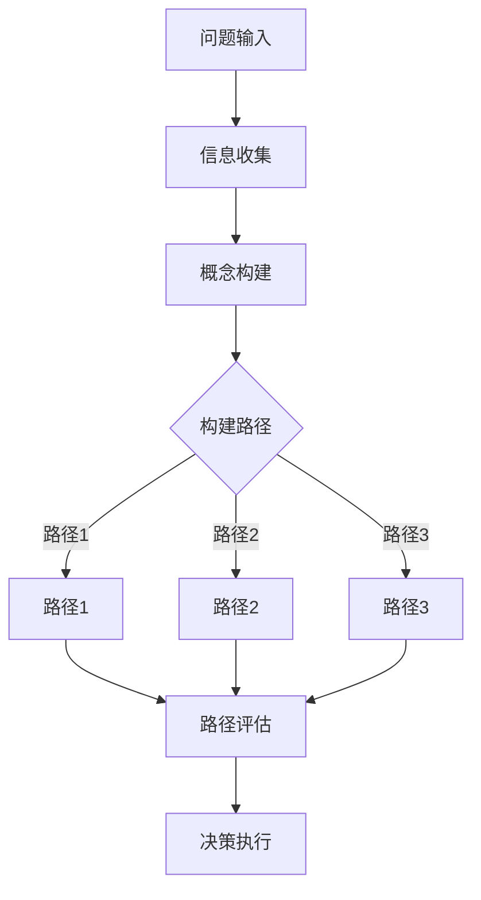

                 

### 第3章：思维链原理

#### 3.1.1 思维链的基本概念

思维链（Mind Chain）是一种模拟人类思维的抽象模型，它通过构建一系列逻辑关系和思维路径，以实现问题的分析和解决。这种模型借鉴了人类的认知过程，包括感知、理解、推理和决策等环节。

#### 3.1.2 思维链的工作原理

思维链的工作原理可以分为以下几个步骤：

1. **问题定义**：思维链首先接收一个具体的问题或任务，明确需要解决的问题类型和目标。
2. **信息收集**：通过数据挖掘和传感器等手段，收集与问题相关的各种信息。
3. **概念构建**：将收集到的信息转化为一系列概念和逻辑关系，构建初步的思考框架。
4. **路径规划**：基于已有信息和逻辑关系，构建多种可能的思维路径，模拟不同的思考方向。
5. **推理与验证**：对各个思维路径进行推理和验证，筛选出符合实际情况的路径。
6. **决策与执行**：根据推理结果，制定相应的决策方案，并执行这些方案以解决问题。

#### 3.1.3 思维链的核心要素

思维链的核心要素包括：

- **思维节点**：代表问题中的各个概念和事实，是思维链的基本组成单元。
- **思维路径**：连接思维节点的逻辑关系链，代表不同的思考方向和推理过程。
- **思维规则**：用于指导思维链如何进行推理和决策的规则集合，包括逻辑规则、概率规则等。

#### 3.1.4 思维链的工作机制

思维链的工作机制可以分为以下几个环节：

1. **问题分析**：接收问题输入，对问题进行初步的分析和分解，确定问题的主要概念和要素。
2. **概念关联**：根据已有的知识和逻辑规则，将问题中的概念和要素进行关联，构建初步的思维框架。
3. **路径搜索**：基于思维框架，搜索多种可能的思维路径，模拟不同的思考方向。
4. **路径评估**：对各个思维路径进行评估和筛选，选择符合实际情况的路径。
5. **决策执行**：根据最佳路径的推理结果，制定决策方案，并执行这些方案以解决问题。

### 3.2.1 思维链的数学模型

思维链的数学模型可以基于图论和概率论来构建。具体而言，可以将思维链看作一个图结构，其中节点代表概念和事实，边代表概念之间的逻辑关系。同时，可以引入概率模型来表示各个思维路径的可靠性和可能性。

以下是一个简单的思维链数学模型：

$$
\text{思维链} = \{ V, E, P \}
$$

- \( V \)：节点集合，代表问题中的概念和事实。
- \( E \)：边集合，代表概念之间的逻辑关系。
- \( P \)：路径集合，代表不同的思维路径。

在模型中，每个节点和边都可以关联一个概率值，表示该节点或边在思维链中的可信度或可能性。通过计算路径的概率值，可以评估各个思维路径的优劣，从而选择最佳路径。

### 3.2.2 思维链的流程图表示

为了更好地理解思维链的工作原理，我们可以使用Mermaid流程图来表示思维链的流程。以下是一个简单的思维链流程图：

### 3.2.3 思维链的应用实例

以下是一个简单的应用实例，说明如何使用思维链来解决一个实际问题。

#### 问题：如何提高一家餐厅的客流量？

1. **问题输入**：餐厅的客流量较低，需要找到提高客流量的方法。
2. **信息收集**：收集餐厅的现状信息，包括餐厅的位置、菜品、价格、服务质量等。
3. **概念构建**：将餐厅的现状信息转化为一系列概念，如位置、菜品、价格、服务质量等。
4. **路径规划**：构建以下几种可能的思维路径：
   - 增加菜品种类
   - 优化价格策略
   - 提高服务质量
   - 增加广告宣传
5. **路径评估**：对每种思维路径进行评估，选择最佳路径。
6. **决策执行**：根据最佳路径，制定具体的实施方案，如优化菜品、调整价格、提升服务质量、增加广告宣传等。

通过以上步骤，餐厅可以逐步提高客流量，实现业务增长。

### 3.2.4 思维链的优势与局限性

#### 优势

1. **模拟人类思维**：思维链能够模拟人类的思维过程，提供一种全新的问题解决思路。
2. **多维度分析**：思维链可以从多个维度对问题进行分析，帮助发现潜在的问题和解决方案。
3. **灵活性强**：思维链可以根据不同的需求和场景进行调整和优化，适用于各种类型的问题。

#### 局限性

1. **计算复杂度高**：思维链涉及大量的计算和推理，对于复杂的问题，计算复杂度可能较高。
2. **依赖先验知识**：思维链的构建依赖于先验知识和逻辑规则，如果先验知识不充分，可能导致推理结果不准确。
3. **无法替代人类思维**：尽管思维链能够模拟人类的思维过程，但它仍然无法完全替代人类思维，尤其是在创造性思维和情感判断方面。

### 3.2.5 思维链在社会经济系统韧性分析中的应用

#### 应用背景

随着全球化和信息技术的快速发展，社会经济系统的复杂性和不确定性不断增加。为了提高社会经济系统的韧性，需要采用先进的方法和技术进行分析和评估。

思维链作为一种模拟人类思维的抽象模型，具有强大的分析和解决问题的能力。将其应用于社会经济系统的韧性分析，可以对社会经济系统进行多维度、全方位的评估，为提高系统韧性提供有力支持。

#### 应用方法

1. **问题定义**：明确需要分析的社会经济系统，确定系统的边界和关键要素。
2. **信息收集**：收集与系统相关的各种数据，包括经济指标、社会指标、环境指标等。
3. **概念构建**：将收集到的信息转化为一系列概念和逻辑关系，构建初步的思考框架。
4. **路径规划**：基于已有信息和逻辑关系，构建多种可能的思维路径，模拟不同的应对策略。
5. **路径评估**：对各个思维路径进行评估和筛选，选择符合实际情况的路径。
6. **决策执行**：根据最佳路径的推理结果，制定具体的决策方案，并执行这些方案以提高系统韧性。

#### 应用案例

以一个城市经济系统为例，使用思维链进行韧性分析的过程如下：

1. **问题定义**：确定需要分析的城市经济系统，包括城市的地理位置、人口规模、产业结构等。
2. **信息收集**：收集与城市经济系统相关的各种数据，如GDP、失业率、人均收入、基础设施状况等。
3. **概念构建**：将收集到的信息转化为一系列概念，如经济发展水平、就业状况、基础设施建设等。
4. **路径规划**：构建以下几种可能的思维路径：
   - 加强基础设施建设
   - 发展新兴产业
   - 提升教育水平
   - 改善生活环境
5. **路径评估**：对每种思维路径进行评估，选择最佳路径。
6. **决策执行**：根据最佳路径，制定具体的实施方案，如加大基础设施建设投入、扶持新兴产业、提升教育水平等。

通过以上步骤，可以逐步提高城市经济系统的韧性，使其在面对外部冲击时能够保持稳定和适应。

### 3.2.6 思维链在社会经济系统韧性分析中的优势与局限性

#### 优势

1. **全面性**：思维链可以对社会经济系统的各个方面进行全面分析，提供更全面的信息和更深入的见解。
2. **灵活性**：思维链可以根据不同的需求和场景进行调整和优化，适用于各种类型的社会经济系统。
3. **前瞻性**：思维链可以模拟不同的未来场景，提前预测可能发生的问题和风险，为决策提供参考。

#### 局限性

1. **计算复杂度**：对于复杂的社会经济系统，思维链的计算复杂度可能较高，需要大量计算资源和时间。
2. **数据依赖**：思维链的准确性和可靠性依赖于数据的准确性和完整性，如果数据存在偏差，可能导致推理结果不准确。
3. **人类思维局限性**：尽管思维链能够模拟人类思维，但它仍然无法完全替代人类思维，尤其是在创造性思维和情感判断方面。

通过以上分析，我们可以看到思维链在社会经济系统韧性分析中具有强大的潜力和应用价值。然而，在实际应用中，也需要充分考虑其局限性，并结合其他方法和技术，以实现最佳的分析和决策效果。在接下来的章节中，我们将进一步探讨思维链在社会经济系统韧性分析中的具体应用和实现方法。

