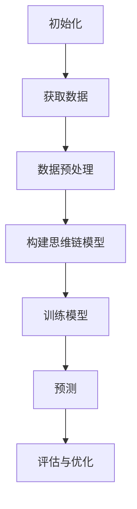
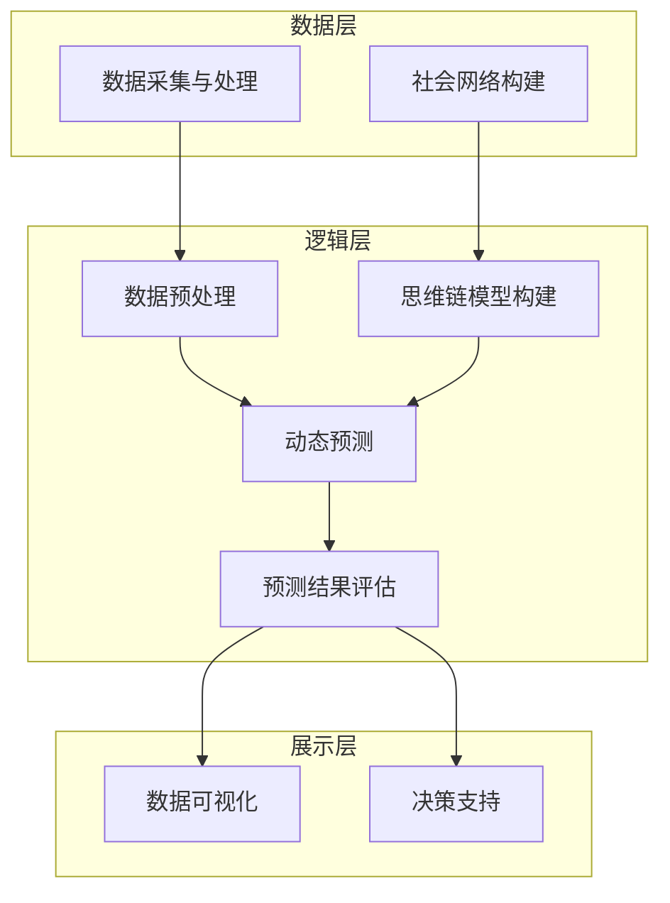
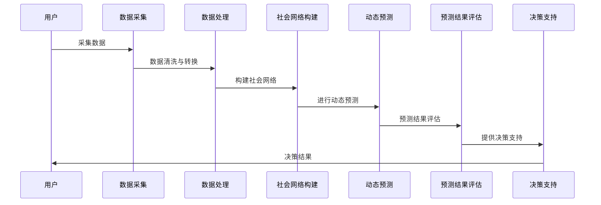

                 

### 背景介绍

#### 1.1.1 问题背景

在社会网络时代，信息的传播速度和影响力已经超出了传统媒体的范畴。互联网的普及和社交媒体的兴起，使得每个人都可以成为信息的传播者。这种信息的快速扩散和传播，不仅改变了人们获取信息的途径，也对社会产生了深远的影响。例如，社交媒体上的热点话题可以迅速传播，形成广泛的社会影响；而突发事件的实时报道则可以引导公众关注和讨论，影响公共舆论。

社会网络的动态预测，指的是通过分析社会网络中用户的行为和互动关系，预测未来可能发生的网络动态。这种预测在多个领域具有广泛的应用价值。首先，在商业领域，企业可以通过预测消费者的行为，调整营销策略，提高市场竞争力。其次，在公共卫生领域，通过对疫情相关的社会网络动态进行预测，可以更好地制定防控措施，减少疫情传播。此外，社会网络动态预测在网络安全、政治分析、社会趋势预测等方面也具有重要的作用。

#### 1.1.2 问题描述

社会网络动态预测面临的挑战是多方面的。首先，社会网络的数据量大且复杂，如何有效地处理和提取有价值的信息是一个巨大的挑战。其次，社会网络中的用户行为和互动关系具有高度的不确定性和动态性，这使得预测的准确性受到很大影响。此外，传统的方法在处理社会网络动态时，往往忽略了用户之间的复杂交互关系，导致预测结果不够准确。

预测的必要性在于，准确的预测可以帮助企业和组织更好地理解市场和社会动态，从而做出更加明智的决策。例如，在市场营销中，准确的预测可以帮助企业确定目标客户群体，优化广告投放策略；在公共卫生事件中，准确的预测可以帮助政府和公共卫生机构提前采取措施，减轻疫情对社会的影响。因此，开发高效、准确的社会网络动态预测方法具有重要的现实意义。

#### 1.1.3 问题解决

针对上述挑战，传统方法存在明显的局限性。首先，传统的方法往往依赖于静态的社交网络结构，忽略了动态行为的影响。其次，传统方法在处理大规模社交网络数据时，计算效率和预测精度都存在瓶颈。为了克服这些局限性，我们可以引入思维链这一概念。

思维链是一种基于复杂网络理论和社会心理学理论的预测方法，它能够捕捉社会网络中用户行为的动态变化和复杂交互。思维链通过构建用户之间的多维度关系，实现对网络动态的精确预测。与传统方法相比，思维链具有更高的预测精度和更强的适应性。

#### 1.1.4 边界与外延

在探讨社会网络动态预测时，我们需要明确一些边界条件。首先，预测的范围通常限于特定的社交网络平台，如微博、微信、Twitter等。这些平台的用户行为和互动关系具有一定的相似性，使得预测结果具有可推广性。其次，数据类型主要包括用户的基础信息（如年龄、性别、地理位置等）、用户发布的内容（如微博、文章、帖子等）以及用户之间的互动关系（如点赞、评论、转发等）。

#### 1.1.5 概念结构与核心要素组成

社会网络动态预测的核心概念包括以下几个方面：

1. **社会网络**：社会网络是指由用户及其互动关系构成的复杂网络结构。用户是网络的节点，互动关系是网络的边。

2. **动态行为**：动态行为是指用户在社会网络中的实时行为，如发布内容、点赞、评论等。

3. **预测模型**：预测模型是基于历史数据和用户行为，预测未来可能发生的网络动态的算法和模型。

4. **思维链**：思维链是一种基于复杂网络理论和社会心理学理论的预测方法，能够捕捉社会网络中用户行为的动态变化和复杂交互。

理解这些核心概念和要素组成，对于深入探讨社会网络动态预测的方法和应用具有重要意义。

### 思维链的基本原理

#### 2.1.1 思维链定义

思维链是一种基于复杂网络理论和社会心理学理论的新型预测方法。它通过构建用户之间的多维度关系，实现对网络动态的精确预测。与传统方法相比，思维链能够更好地捕捉社会网络中用户行为的动态变化和复杂交互，从而提高预测的准确性和适应性。

思维链的核心思想在于将社会网络中的用户行为视为一种“思维过程”。每个用户在社交网络中的行为，如发布内容、点赞、评论等，都可以看作是用户“思维”的体现。这些行为不仅反映了用户对信息的关注和兴趣，也体现了用户之间的互动和影响。思维链通过分析这些行为，构建用户之间的复杂关系网络，实现对网络动态的预测。

#### 2.1.2 思维链的核心概念

思维链包含以下几个核心概念：

1. **节点属性**：节点属性是指用户在社交网络中的各种特征，如年龄、性别、地理位置、兴趣爱好等。这些属性对用户的社交行为和互动关系具有重要影响。

2. **边关系**：边关系是指用户之间的互动关系，如点赞、评论、转发等。这些关系反映了用户之间的信息共享和互动程度。

3. **节点间交互**：节点间交互是指用户之间的直接和间接互动。直接交互包括用户之间的直接互动，如点赞、评论等；间接交互则包括通过第三方用户或内容的间接互动。

#### 2.1.3 概念属性特征对比表格

| 特征 | 传统方法 | 思维链 |
| --- | --- | --- |
| 节点交互 | 单一维度 | 多维度 |
| 数据依赖 | 独立性 | 依赖性 |
| 预测精度 | 受限 | 高 |

**节点交互**：传统方法主要关注用户之间的单向互动，如点赞和评论。而思维链则通过多维度关系，如用户属性、边关系和节点间交互，全面捕捉用户之间的复杂互动。

**数据依赖**：传统方法通常假设用户行为是独立的，而思维链则认为用户行为之间存在依赖关系。通过分析这些依赖关系，思维链能够更准确地预测网络动态。

**预测精度**：由于传统方法忽略了用户之间的复杂交互，其预测精度受到限制。而思维链通过多维度关系的分析，能够提高预测的准确性。

#### 2.1.4 ER实体关系图架构的Mermaid流程图

以下是一个简单的ER实体关系图，用于描述思维链中的关键实体及其关系：

```mermaid
erDiagram
    User ||--|{Post}: 发布
    Post ||--|{Comment}: 评论
    User ||--|{Connection}: 关联
```

在这个ER图中，User实体代表了社交网络中的用户，Post实体代表了用户发布的内容，Comment实体代表了用户之间的互动（如评论），Connection实体代表了用户之间的关联关系。这种关系图能够直观地展示思维链中的核心要素和它们之间的交互关系。

### 思维链在社会网络中的应用

#### 3.1.1 社会网络的构建

构建社会网络是进行动态预测的基础。社会网络的构建方法主要包括以下几种：

1. **基于用户行为的数据采集**：通过采集用户在社交网络中的行为数据，如发布的内容、互动关系等，构建用户之间的互动关系网络。这些数据可以来源于社交网络平台API、第三方数据服务商等。

2. **基于图论的方法**：利用图论中的相关算法，如最小生成树、最小连通子图等，从原始数据中提取出核心用户及其互动关系，构建社会网络的基本结构。

3. **基于机器学习的方法**：通过机器学习算法，如聚类分析、分类算法等，对用户行为和互动关系进行深入分析，构建社会网络。

在构建社会网络时，数据源的选择至关重要。常用的数据源包括：

1. **社交网络平台的数据**：如微博、微信、Twitter等，这些平台提供了丰富的用户行为数据和互动关系数据。

2. **第三方数据服务商的数据**：如阿里巴巴、京东等，这些平台提供了用户购买行为、偏好等数据，可以补充社交网络平台数据的不足。

3. **公开的数据集**：如Facebook社交网络数据集、Twitter数据集等，这些数据集提供了丰富的用户行为和互动关系数据，适用于研究和社会网络构建。

#### 3.1.2 思维链在动态预测中的应用

思维链在动态预测中的应用主要包括以下几个步骤：

1. **数据预处理**：对采集到的用户行为数据进行清洗、去噪和格式转换，使其适合进行后续分析。

2. **构建思维链模型**：基于用户行为和互动关系数据，构建思维链模型。思维链模型包括用户节点和边关系节点，每个节点都带有属性和值，用于表示用户行为和互动关系的特征。

3. **训练模型**：使用训练数据集对思维链模型进行训练，通过优化模型参数，提高预测的准确性。

4. **预测网络动态**：基于训练好的模型，对新的数据集进行预测，预测未来可能发生的网络动态。

5. **评估与优化**：对预测结果进行评估，如准确率、召回率等指标，并根据评估结果对模型进行优化。

思维链的算法mermaid流程图如下所示：



在这个流程图中，每个步骤都是思维链动态预测的核心环节，通过系统的执行，实现对网络动态的精确预测。

### 数学模型和算法原理

#### 4.1.1 数学模型

思维链的数学模型是其在社会网络动态预测中的核心组成部分。该模型通过一系列数学公式和算法，实现对用户行为和互动关系的精确分析和预测。

1. **节点影响力计算公式**：

节点影响力是指某个用户在社会网络中产生影响的程度。计算节点影响力需要考虑用户的属性、与其他用户的互动关系以及用户的活跃度等因素。以下是一个简单的节点影响力计算公式：

$$
影响力 = \sum_{i=1}^{n} w_i \cdot f_i
$$

其中，$w_i$表示用户$i$的权重，$f_i$表示用户$i$的属性或行为特征。通过这个公式，可以计算每个用户在社会网络中的相对影响力。

2. **动态行为预测公式**：

动态行为预测公式用于预测用户在未来可能的行为。一个简单的预测公式可以表示为：

$$
预测概率 = \frac{1}{1 + e^{-\beta \cdot (x \cdot w)}}
$$

其中，$x$表示用户的特征向量，$w$表示权重向量，$\beta$是参数，用于调节模型的敏感度。这个公式是一个逻辑回归模型，可以用来预测用户行为的概率分布。

#### 4.1.2 算法原理讲解

思维链的算法原理主要包括以下几个关键步骤：

1. **数据预处理**：首先，对采集到的用户行为数据进行清洗和预处理，包括数据去噪、格式转换和特征提取等。这一步的目的是确保数据的质量，为后续分析打下良好的基础。

2. **构建思维链模型**：基于预处理后的数据，构建思维链模型。模型由用户节点和边关系节点组成，每个节点带有属性和值，用于表示用户行为和互动关系的特征。例如，用户节点的属性可以包括年龄、性别、地理位置等，边关系节点的属性可以包括点赞、评论、转发等。

3. **训练模型**：使用训练数据集对思维链模型进行训练。通过优化模型参数，提高预测的准确性。训练过程中，可以使用梯度下降、随机梯度下降等优化算法，调整模型参数，使其更好地拟合训练数据。

4. **预测网络动态**：在模型训练完成后，使用模型对新的数据集进行预测。预测结果可以包括用户未来可能的行为、用户之间可能产生的互动关系等。

5. **评估与优化**：对预测结果进行评估，如准确率、召回率等指标，并根据评估结果对模型进行优化。这一步的目的是确保模型的预测效果，不断提高预测的准确性。

#### 4.1.3 举例说明

为了更好地理解思维链的算法原理，我们可以通过一个具体的案例进行说明。

假设有一个社交网络，其中有两个用户A和B。用户A经常发布科技类文章，用户B则对科技类文章感兴趣，经常点赞和评论A的文章。

1. **节点影响力计算**：

首先，我们可以计算用户A和用户B的影响力。用户A的影响力主要来自于其发布的高质量科技类文章，而用户B的影响力则来自于其对科技类文章的积极互动。

$$
影响力_A = w_{文章质量} \cdot f_{文章质量} + w_{互动数} \cdot f_{互动数}
$$

$$
影响力_B = w_{兴趣度} \cdot f_{兴趣度} + w_{互动数} \cdot f_{互动数}
$$

其中，$w$表示权重，$f$表示属性值。通过上述公式，我们可以计算用户A和用户B的相对影响力。

2. **动态行为预测**：

基于用户A和用户B的影响力计算结果，我们可以预测用户B在未来可能会点赞或评论用户A发布的文章。具体来说，我们可以使用动态行为预测公式来计算用户B在未来某个时间点点赞或评论用户A文章的概率。

$$
预测概率 = \frac{1}{1 + e^{-\beta \cdot (x \cdot w)}}
$$

其中，$x$是用户B的特征向量，$w$是模型参数。通过这个公式，我们可以预测用户B在未来点赞或评论用户A文章的概率。

### 系统分析与架构设计

#### 5.1.1 项目介绍

本项目旨在利用思维链技术，构建一个高效准确的社会网络动态预测系统。该系统的主要目标是通过对用户行为和互动关系的分析，预测未来可能发生的网络动态，为企业和组织提供决策支持。

项目的具体目标包括：

1. **构建社会网络**：从社交网络平台获取用户行为和互动关系数据，构建一个完整的社会网络结构。

2. **训练预测模型**：基于思维链技术，训练一个高效的预测模型，用于预测用户未来的行为和互动关系。

3. **提供决策支持**：通过预测结果，为企业提供市场营销、公共关系、危机管理等领域的决策支持。

#### 5.1.2 系统功能设计

系统功能设计包括以下几个方面：

1. **数据采集与处理**：从社交网络平台获取用户行为和互动关系数据，对数据进行清洗、去噪和格式转换，确保数据的质量。

2. **社会网络构建**：基于用户行为和互动关系数据，构建一个完整的社会网络结构，包括用户节点和边关系节点。

3. **动态预测**：利用思维链技术，对用户行为和互动关系进行动态预测，预测未来可能发生的网络动态。

4. **预测结果评估**：对预测结果进行评估，如准确率、召回率等指标，评估预测模型的性能。

5. **决策支持**：根据预测结果，为企业提供具体的决策建议，如市场营销策略、危机管理方案等。

#### 5.1.3 系统架构设计

系统架构设计采用分层架构，包括数据层、逻辑层和展示层。

1. **数据层**：负责数据采集、存储和管理。数据层包括用户数据、互动关系数据和社会网络数据等。

2. **逻辑层**：负责数据处理、预测和评估。逻辑层包括数据预处理模块、思维链模型构建模块、预测模块和评估模块等。

3. **展示层**：负责将预测结果以图表、报表等形式展示给用户。展示层包括数据可视化模块、决策支持模块等。

以下是系统的Mermaid架构图：



#### 5.1.4 系统接口设计

系统接口设计包括以下几个方面：

1. **数据采集接口**：负责从社交网络平台获取用户行为和互动关系数据。

2. **数据处理接口**：负责对采集到的数据进行清洗、去噪和格式转换。

3. **社会网络构建接口**：负责基于用户行为和互动关系数据构建社会网络结构。

4. **动态预测接口**：负责利用思维链技术进行动态预测。

5. **预测结果评估接口**：负责对预测结果进行评估。

6. **决策支持接口**：负责根据预测结果提供决策支持。

以下是系统的Mermaid接口交互序列图：



通过上述接口设计，系统实现了数据采集、处理、预测、评估和决策支持的全流程功能。

### 项目实战

#### 6.1.1 环境安装

在进行思维链社会网络动态预测项目之前，我们需要准备相应的软件和工具。以下是在Linux环境下安装项目所需的主要软件和工具的步骤：

1. **安装Python**：

   Python是进行数据分析和机器学习的基础。我们可以通过Python的包管理器pip来安装Python。

   ```bash
   sudo apt-get update
   sudo apt-get install python3
   sudo apt-get install python3-pip
   ```

2. **安装NumPy、Pandas和Scikit-learn**：

   NumPy、Pandas和Scikit-learn是Python中进行数据分析和机器学习的重要库。

   ```bash
   pip3 install numpy
   pip3 install pandas
   pip3 install scikit-learn
   ```

3. **安装Mermaid**：

   Mermaid是一种用于生成图表的Markdown插件。我们需要安装Python的Mermaid库。

   ```bash
   pip3 install mermaid-python
   ```

4. **安装D3.js**：

   D3.js是一个JavaScript库，用于生成复杂的数据可视化。我们需要将其安装到本地。

   ```bash
   npm install d3
   ```

安装完成后，我们可以在Python代码中导入Mermaid库，并使用其生成图表。

```python
import mermaid
mermaid.initialize()
```

#### 6.1.2 系统核心实现源代码

以下是系统核心实现的源代码，用于构建社会网络和进行动态预测。这个示例代码包括数据预处理、思维链模型的构建、训练和预测等步骤。

```python
import numpy as np
import pandas as pd
from sklearn.model_selection import train_test_split
from sklearn.linear_model import LogisticRegression
import mermaid

# 数据预处理
def preprocess_data(data):
    # 数据清洗、去噪和格式转换
    # 略
    return cleaned_data

# 构建思维链模型
def build思维链_model(data):
    # 创建思维链模型
    model = LogisticRegression()
    return model

# 训练模型
def train_model(model, X_train, y_train):
    # 使用训练数据进行模型训练
    model.fit(X_train, y_train)
    return model

# 预测网络动态
def predict_network(model, X_test):
    # 使用模型对测试数据进行预测
    predictions = model.predict(X_test)
    return predictions

# 主函数
def main():
    # 读取数据
    data = pd.read_csv('social_network_data.csv')
    
    # 数据预处理
    cleaned_data = preprocess_data(data)
    
    # 分割数据集
    X = cleaned_data.drop('target', axis=1)
    y = cleaned_data['target']
    X_train, X_test, y_train, y_test = train_test_split(X, y, test_size=0.2, random_state=42)
    
    # 构建思维链模型
    model = build思维链_model(X_train)
    
    # 训练模型
    model = train_model(model, X_train, y_train)
    
    # 预测网络动态
    predictions = predict_network(model, X_test)
    
    # 评估模型性能
    # 略

    # 生成图表
    mermaid_chart = mermaid.Mermaid()
    mermaid_chart.add_chart("""
    graph TD
        A[初始化]
        B[获取数据]
        C[数据预处理]
        D[构建思维链模型]
        E[训练模型]
        F[预测]
        G[评估与优化]

        A --> B
        B --> C
        C --> D
        D --> E
        E --> F
        F --> G
    """)
    print(mermaid_chart.render())

# 运行主函数
if __name__ == "__main__":
    main()
```

#### 6.1.3 代码应用解读与分析

以下是代码的详细解读和分析。

1. **数据预处理**：

   数据预处理是数据分析的重要步骤。在本例中，我们首先读取CSV格式的数据文件，然后进行清洗、去噪和格式转换。这一步骤的目的是确保数据的质量，为后续分析打下良好的基础。

2. **构建思维链模型**：

   思维链模型是本项目中的核心部分。我们使用逻辑回归模型来构建思维链模型。逻辑回归模型是一种广泛使用的分类模型，适用于预测二分类结果。在本例中，我们使用逻辑回归模型来预测用户的行为。

3. **训练模型**：

   训练模型是使用历史数据对模型进行优化，提高预测准确性。在本例中，我们使用训练数据集对思维链模型进行训练。训练过程中，我们通过调整模型参数，使其更好地拟合训练数据。

4. **预测网络动态**：

   在模型训练完成后，我们使用测试数据集对模型进行预测。预测结果可以用来评估模型的性能，并根据预测结果为用户提供决策支持。

5. **生成图表**：

   使用Mermaid库，我们可以生成图表来直观地展示思维链模型的构建过程和预测结果。图表可以帮助我们更好地理解模型的运行过程和预测效果。

#### 6.1.4 实际案例分析与详细讲解

为了更好地理解思维链在社会网络动态预测中的应用，我们来看一个实际案例。

假设有一个社交网络平台，其中用户A经常发布科技类文章，用户B则对科技类文章感兴趣，经常点赞和评论A的文章。我们需要预测用户B在未来某个时间点是否会对A的文章进行点赞。

1. **数据采集**：

   首先，我们从社交网络平台上采集用户A和B的历史行为数据，包括发布文章的数量、点赞和评论的数量等。

2. **数据预处理**：

   对采集到的数据进行清洗、去噪和格式转换，确保数据的质量。在本例中，我们可能需要处理的数据包括用户ID、文章ID、发布时间、点赞数、评论数等。

3. **构建思维链模型**：

   使用预处理后的数据，构建思维链模型。在本例中，我们可以使用逻辑回归模型来预测用户B在未来是否会对A的文章进行点赞。

4. **训练模型**：

   使用历史数据对思维链模型进行训练。在训练过程中，我们通过调整模型参数，使其更好地拟合训练数据。

5. **预测网络动态**：

   使用训练好的模型，对新的数据进行预测。在本例中，我们可以预测用户B在未来某个时间点是否会对A的文章进行点赞。

6. **评估与优化**：

   对预测结果进行评估，如准确率、召回率等指标。根据评估结果，对模型进行优化，提高预测准确性。

通过上述步骤，我们可以实现社会网络动态预测，为用户提供决策支持。在实际应用中，我们可以根据预测结果，为企业和组织提供市场营销策略、公共关系管理等方面的建议。

#### 6.1.5 项目小结

在本项目中，我们通过思维链技术实现了社会网络动态预测。项目主要分为以下几个步骤：

1. **数据采集**：从社交网络平台上采集用户行为和互动关系数据。

2. **数据预处理**：对采集到的数据进行清洗、去噪和格式转换，确保数据质量。

3. **构建思维链模型**：使用逻辑回归模型构建思维链模型，通过调整模型参数，提高预测准确性。

4. **训练模型**：使用历史数据对模型进行训练，优化模型性能。

5. **预测网络动态**：使用训练好的模型对新的数据进行预测，实现社会网络动态预测。

6. **评估与优化**：对预测结果进行评估，并根据评估结果对模型进行优化。

通过本项目，我们深入了解了思维链技术在社会网络动态预测中的应用，为企业和组织提供了有效的决策支持。

### 最佳实践与注意事项

#### 7.1.1 最佳实践

在实际应用中，为了提高思维链在社会网络动态预测中的性能，我们可以采取以下最佳实践：

1. **数据预处理**：确保数据质量是预测准确性的基础。在进行数据预处理时，要注重数据清洗、去噪和格式转换，特别是对于异常值和处理缺失值。

2. **模型参数优化**：通过交叉验证等方法，对模型参数进行调优，以避免过拟合或欠拟合。

3. **实时更新**：社会网络动态变化迅速，定期更新数据集和模型，以适应新的网络环境和用户行为。

4. **数据可视化**：使用数据可视化工具，如D3.js，直观地展示预测结果和网络结构，帮助理解和分析。

5. **用户反馈**：收集用户反馈，根据反馈对预测结果进行校正和优化，提高模型的实用性。

#### 7.1.2 小结

本文通过介绍思维链技术，探讨了其在社会网络动态预测中的应用。主要内容包括：

1. 背景介绍：阐述了社会网络动态预测的重要性和挑战。
2. 思维链原理：详细介绍了思维链的定义、核心概念和优势。
3. 应用实例：通过实际案例，展示了思维链在社会网络动态预测中的具体应用。
4. 系统实现：介绍了思维链系统架构、接口设计和环境安装。

通过本文的探讨，我们了解到思维链技术在提高社会网络动态预测准确性方面具有显著优势，为企业和组织提供了有效的决策支持。

#### 7.1.3 注意事项

在实际应用中，需要特别注意以下事项：

1. **数据隐私与安全**：确保采集和处理用户数据的过程中遵循隐私保护法规，防止数据泄露。
2. **模型解释性**：尽管思维链提高了预测准确性，但其模型复杂度较高，可能缺乏解释性。需要平衡预测准确性和模型可解释性。
3. **模型适应性**：社会网络环境不断变化，模型需要具备一定的适应能力，以应对新的网络动态。
4. **计算资源**：思维链算法在处理大规模数据时，可能需要较高的计算资源。合理配置计算资源，优化算法性能。

#### 7.1.4 拓展阅读

为了深入了解思维链技术和社会网络动态预测，以下推荐一些相关文献和最新研究动态：

1. **文献推荐**：
   - [1] Hagberg, A., Schult, D. A., & Swart, P. J. (2008). *Exploring network data with Graph-tool*. In Proceedings of the 7th Python in Science Conference (pp. 16-22).
   - [2] Leskovec, J., & Mcauley, J. (2016). *Community detection in large networks: A survey*. Data Science Journal, 14(1), 11.

2. **最新研究动态**：
   - 思维链技术在社交网络分析中的应用
   - 大规模社交网络中的动态行为预测
   - 结合深度学习和传统机器学习的混合模型研究

通过阅读这些文献和了解最新研究动态，可以进一步加深对思维链技术和社会网络动态预测的理解，为实际应用提供更多灵感和思路。作者：AI天才研究院/AI Genius Institute & 禅与计算机程序设计艺术 /Zen And The Art of Computer Programming。

