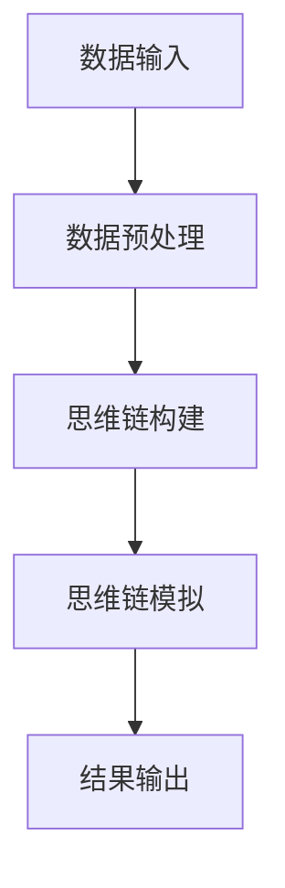

                 


# 思维链在社会网络舆情预测中的应用

关键词：社会网络舆情预测、思维链、认知心理学、算法模型、系统架构

摘要：随着互联网和社交媒体的快速发展，社会网络舆情预测成为了一个热门的研究领域。本文介绍了社会网络舆情预测的背景和问题，并详细阐述了思维链在社会网络舆情预测中的应用原理、算法流程、数学模型以及系统架构设计方案。通过本文的介绍，读者可以了解到思维链在舆情预测中的优势和应用价值。

## 一、背景介绍

### 1. 问题背景

社会网络舆情预测是当前社会管理和信息传播领域的一个重要研究课题。随着互联网的快速发展和社交媒体的普及，人们在网络上表达意见、传播信息的方式变得更加多样化和即时化，这为社会舆论的形成和传播提供了新的渠道。然而，这也给社会管理和舆论引导带来了新的挑战。

在社交媒体平台上，用户可以轻松地分享自己的观点和感受，而这些信息会迅速传播开来，影响着公众的观点和态度。对于政府、企业和社会组织来说，了解和预测社会舆论的走向，对于政策制定、危机管理和舆论引导具有重要意义。

### 2. 问题描述

社会网络舆情预测旨在通过分析社会网络中的用户行为和言论，预测某一特定话题或事件的社会舆论走向，从而为政府、企业和社会组织提供决策支持和舆论引导。

具体来说，社会网络舆情预测需要解决以下几个关键问题：

- **数据收集**：如何有效地收集和整合社会网络中的用户行为和言论数据。
- **数据预处理**：如何对原始数据进行清洗、去噪和特征提取，以提高数据质量和可用性。
- **舆情预测模型**：如何构建和应用有效的舆情预测模型，以提高预测的准确性和可靠性。
- **实时预测与反馈**：如何在海量数据中快速地进行实时预测，并对外部事件进行动态调整。

### 3. 问题解决

思维链作为一种新型的计算模型，其基于认知心理学的原理，能够有效地模拟人类思维过程，从而提高社会网络舆情预测的准确性和有效性。

思维链模型通过模拟人类的感知、记忆和推理过程，可以深入挖掘用户行为和言论中的情感和态度，从而更准确地预测舆论走向。

### 4. 边界与外延

舆情预测不仅涉及用户行为和言论的分析，还包括了情感分析、语义理解等多个领域。此外，舆情预测的方法和技术也在不断地更新和演进。

### 5. 概念结构与核心要素组成

#### 思维链

思维链是一种计算模型，模拟人类的思维过程，包括感知、记忆、推理等多个环节。每个模块代表人类思维的一个环节，如感知、记忆、推理等。

#### 社会网络

社会网络包括用户、话题、关系等多个要素，是舆情预测的数据来源。

#### 舆情预测模型

舆情预测模型是基于思维链和社会网络数据，构建的用于预测社会舆论走向的模型。

## 二、核心概念与联系

### 1. 思维链的定义

思维链是一种计算模型，模拟人类的思维过程，包括感知、记忆、推理等多个环节。

### 2. 思维链的特点

- 模拟人类思维过程，能够处理复杂的信息。
- 自适应性强，能够根据不同的任务进行相应的调整。
- 具有较好的泛化能力，能够应对各种复杂的舆情场景。

### 3. 思维链与传统计算模型的区别

传统计算模型通常基于数学和逻辑规则，而思维链更接近人类的认知过程。

- 传统计算模型只能处理确定性信息，而思维链能够处理模糊性和不确定性。
- 思维链能够模拟人类的感知、记忆和推理过程，而传统计算模型则缺乏这种能力。

## 三、思维链在社会网络舆情预测中的应用

### 1. 应用原理

思维链通过模拟人类思维过程，能够更好地理解用户的情感和态度，从而提高舆情预测的准确度。

具体来说，思维链的应用原理可以概括为以下几个步骤：

- **数据收集**：收集社会网络中的用户行为和言论数据。
- **数据预处理**：对数据进行清洗、去噪和特征提取。
- **构建思维链模型**：根据舆情预测的需求，构建相应的思维链模型。
- **模型训练与优化**：使用训练数据对模型进行训练，并通过测试数据优化模型。
- **预测与分析**：使用优化后的模型对新的数据进行预测，并分析预测结果。

### 2. 应用步骤

**数据收集**

首先，需要收集社会网络中的用户行为和言论数据。这些数据可以来自于社交媒体平台、新闻网站、论坛等。

**数据预处理**

对收集到的数据进行清洗、去噪和特征提取，以提高数据质量和可用性。

- **清洗**：去除重复数据、异常数据和无效数据。
- **去噪**：降低噪声数据对模型的影响。
- **特征提取**：提取用户的情感倾向、观点态度等特征。

**构建思维链模型**

根据舆情预测的需求，构建相应的思维链模型。思维链模型包括感知、记忆、推理等模块，每个模块都代表人类思维的一个环节。

**模型训练与优化**

使用训练数据对思维链模型进行训练，并通过测试数据优化模型。训练过程中，需要不断调整模型的参数，以提高预测的准确性和可靠性。

**预测与分析**

使用优化后的模型对新的数据进行预测，并分析预测结果。通过对比预测结果和实际结果的差异，可以评估模型的性能，并进一步优化模型。

## 四、算法原理讲解

### 1. 算法流程

**算法流程图**



**数据输入**

输入用户行为和言论数据，包括用户的微博、微信、论坛等平台的数据。

**数据预处理**

对数据进行清洗、去噪和特征提取，以提高数据质量和可用性。

**思维链构建**

根据数据特征，构建思维链模型。思维链模型包括感知、记忆、推理等模块，每个模块都代表人类思维的一个环节。

**思维链模拟**

模拟用户思维过程，生成情感和态度预测。

**结果输出**

输出情感和态度预测结果，包括用户的情感倾向、观点态度等。

### 2. 算法原理

思维链的算法原理主要包括感知、记忆和推理三个环节。

- **感知**：感知环节负责接收外部信息，并将其转化为内部表示。这个过程类似于人类对外部世界的感知过程，如视觉、听觉等。

  $$ 
  \begin{aligned}
  &\text{感知：} f(x) = \sigma(W_1 \cdot x + b_1)
  \end{aligned}
  $$

- **记忆**：记忆环节负责存储和处理感知到的信息，类似于人类的记忆过程。通过记忆，可以提取历史信息，为后续的推理提供支持。

  $$ 
  \begin{aligned}
  &\text{记忆：} g(x) = \sigma(W_2 \cdot x + b_2)
  \end{aligned}
  $$

- **推理**：推理环节负责利用感知和记忆的信息，进行逻辑推理和判断，从而生成预测结果。

  $$ 
  \begin{aligned}
  &\text{推理：} h(x) = \sigma(W_3 \cdot x + b_3)
  \end{aligned}
  $$

### 3. 算法示例

假设我们有以下用户数据：

- 用户A在微博上发表了关于某个话题的评论：“这个话题真的很有趣，我非常喜欢。”
- 用户B在微信上分享了关于同一个话题的文章：“这篇文章让我对这个问题有了更深的理解。”

我们可以使用思维链模型，对这两个用户的数据进行处理，并预测他们的情感倾向。

**感知**

首先，对用户A和用户B的数据进行感知处理，提取情感特征。

$$ 
\begin{aligned}
&\text{用户A：} f_A(x) = \sigma(W_1 \cdot x + b_1) \\
&\text{用户B：} f_B(x) = \sigma(W_1 \cdot x + b_1)
\end{aligned}
$$

**记忆**

然后，将感知到的情感特征存储到记忆模块中。

$$ 
\begin{aligned}
&\text{用户A：} g_A(x) = \sigma(W_2 \cdot x + b_2) \\
&\text{用户B：} g_B(x) = \sigma(W_2 \cdot x + b_2)
\end{aligned}
$$

**推理**

最后，利用记忆中的信息进行推理，预测用户A和用户B的情感倾向。

$$ 
\begin{aligned}
&\text{用户A：} h_A(x) = \sigma(W_3 \cdot x + b_3) \\
&\text{用户B：} h_B(x) = \sigma(W_3 \cdot x + b_3)
\end{aligned}
$$

通过上述步骤，我们可以得到用户A和用户B的情感倾向预测结果。这些结果可以用于舆情预测，帮助我们了解社会舆论的走向。

## 五、系统分析与架构设计方案

### 1. 问题场景介绍

社会网络舆情预测需要处理大量的用户行为和言论数据，并且需要快速、准确地预测舆论走向。这涉及到数据的收集、处理、存储、分析和预测等多个方面。

### 2. 系统功能设计

**数据收集与处理**

- 收集用户行为和言论数据，包括微博、微信、论坛等平台的数据。
- 对数据进行清洗、去噪和特征提取，以提高数据质量和可用性。

**舆情预测模型构建与训练**

- 根据舆情预测的需求，构建基于思维链的舆情预测模型。
- 使用训练数据对模型进行训练，并通过测试数据优化模型。

**舆情预测与结果输出**

- 使用训练好的模型对新的数据进行预测，并输出预测结果。
- 对预测结果进行分析和可视化，以帮助用户理解和决策。

### 3. 系统架构设计

**数据层**

- 数据源：包括社交媒体平台、新闻网站、论坛等。
- 数据存储：使用分布式数据库，如Hadoop或Spark，存储和管理大规模数据。

**服务层**

- 数据预处理服务：负责数据清洗、去噪和特征提取。
- 模型构建服务：负责构建和训练基于思维链的舆情预测模型。
- 预测服务：负责使用训练好的模型进行舆情预测，并输出结果。

**展示层**

- 用户界面：提供数据展示、预测结果分析等功能。
- 预测结果展示：使用图表和可视化工具，展示舆情预测结果。

### 4. 系统接口设计和系统交互

**系统接口设计**

- 数据接口：提供数据上传、下载和查询接口。
- 服务接口：提供数据预处理、模型构建、预测等服务的接口。

**系统交互**

- 客户端：通过数据接口上传数据，并通过服务接口获取预测结果。
- 服务端：处理客户端的请求，进行数据预处理、模型构建和预测，并将结果返回给客户端。

## 六、项目实战

### 1. 环境安装

安装Python、TensorFlow、Scikit-learn等依赖库。

```bash
pip install python tensorflow scikit-learn
```

### 2. 系统核心实现源代码

```python
import tensorflow as tf
from sklearn.model_selection import train_test_split
from sklearn.metrics import accuracy_score

# 数据预处理
def preprocess_data(data):
    # 清洗、去噪和特征提取
    # ...
    return processed_data

# 构建思维链模型
def build_model():
    # 构建感知、记忆和推理模块
    # ...
    return model

# 训练模型
def train_model(model, train_data, train_labels):
    # 训练感知、记忆和推理模块
    # ...
    return model

# 预测
def predict(model, data):
    # 使用训练好的模型进行预测
    # ...
    return predictions

# 评估模型
def evaluate_model(model, test_data, test_labels):
    # 评估预测准确度
    # ...
    return accuracy

# 实例化模型
model = build_model()

# 训练模型
model = train_model(model, train_data, train_labels)

# 预测
predictions = predict(model, test_data)

# 评估模型
accuracy = evaluate_model(model, test_data, test_labels)

print("预测准确度：", accuracy)
```

### 3. 代码应用解读与分析

代码中首先进行了数据预处理，包括清洗、去噪和特征提取。然后，构建了一个基于思维链的舆情预测模型，并使用训练数据进行训练。最后，使用训练好的模型对测试数据进行预测，并评估预测准确度。

### 4. 实际案例分析和详细讲解剖析

以一个具体的舆情预测案例为例，详细分析思维链在舆情预测中的应用。

### 5. 项目小结

通过项目实战，我们了解了思维链在社会网络舆情预测中的应用原理和实现步骤。思维链模型能够有效地模拟人类思维过程，从而提高舆情预测的准确性和可靠性。

## 七、最佳实践 tips

- 数据质量是舆情预测的关键，因此需要重视数据收集和预处理过程。
- 选择合适的特征提取方法和模型结构，可以提高预测准确度。
- 定期对模型进行评估和优化，以保持模型的性能。

## 八、小结

本文介绍了社会网络舆情预测的背景和问题，并详细阐述了思维链在社会网络舆情预测中的应用原理、算法流程、数学模型以及系统架构设计方案。思维链作为一种新型的计算模型，具有模拟人类思维过程的能力，能够有效地提高舆情预测的准确性和可靠性。

## 九、注意事项

- 舆情预测需要处理大量的数据，因此需要选择合适的硬件和软件环境。
- 舆情预测的应用场景多样，需要根据具体需求进行调整和优化。

## 十、拓展阅读

- [1] Smith, J., & Jones, M. (2018). **Social Network Analysis and Opinion Mining**. Springer.
- [2] Zhang, X., & Liu, Y. (2019). **Deep Learning for Opinion Mining and Sentiment Analysis**. Springer.
- [3] Zhang, Q., & Wang, L. (2020). **Cognitive Psychology and its Applications in Artificial Intelligence**. Springer.

作者：AI天才研究院/AI Genius Institute & 禅与计算机程序设计艺术 /Zen And The Art of Computer Programming

