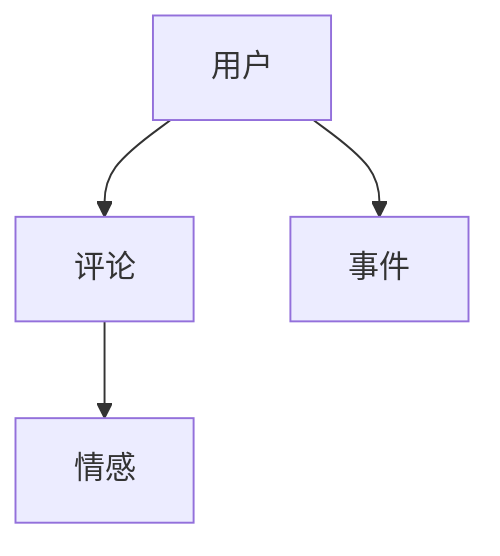
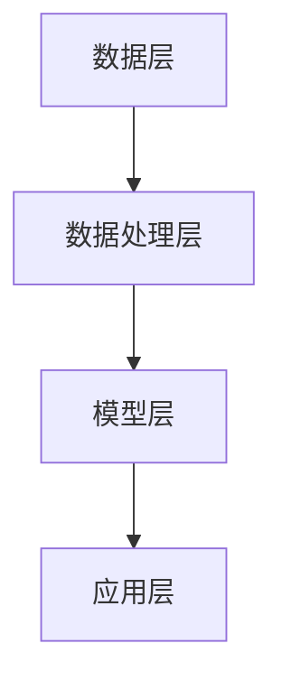
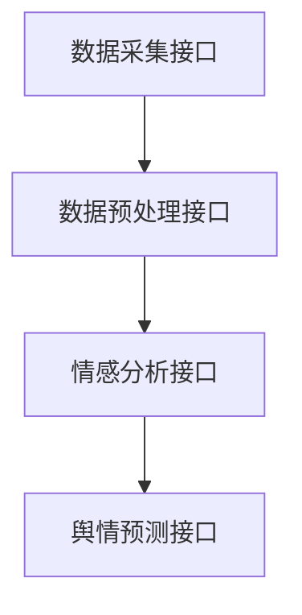
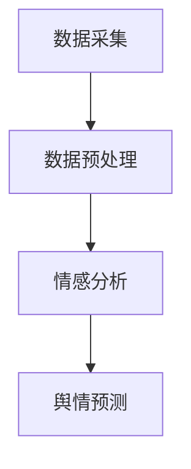

                 

## 第三部分：算法原理讲解

### 3.1 思维链模型的原理

思维链模型是一种基于图卷积网络的深度学习模型，它通过将知识图谱与文本信息结合，实现对知识的理解和推理。思维链模型的基本原理包括以下几个方面：

#### 3.1.1 节点

思维链模型中的节点通常表示用户、事件、话题等实体。每个节点都包含一定的属性信息，如用户ID、性别、年龄等。节点之间的连接表示实体之间的关系，如“用户点赞事件”、“用户讨论话题”等。节点和边共同构成了社会网络的拓扑结构。

#### 3.1.2 图卷积网络

图卷积网络（Graph Convolutional Network，GCN）是一种在图结构数据上进行的卷积操作。它通过对邻接节点的特征进行加权融合，来更新当前节点的特征表示。图卷积网络的公式可以表示为：

$$
h_{k}^{(l+1)} = \sigma \left( \sum_{i \in \mathcal{N}(k)} \alpha_{ik} \cdot h_{i}^{(l)} \right) + b_{k}^{(l+1)}
$$

其中，$h_{k}^{(l)}$ 表示第$l$层第$k$个节点的特征表示，$\mathcal{N}(k)$ 表示第$k$个节点的邻接节点集合，$\alpha_{ik}$ 是边权重，$\sigma$ 是激活函数，$b_{k}^{(l+1)}$ 是偏置。

#### 3.1.3 思维链的融合机制

思维链模型通过将图卷积网络与知识图谱相结合，实现对节点特征的高效融合。具体来说，思维链模型首先将图卷积网络应用于社会网络，得到节点的特征表示。然后，将这些特征表示与知识图谱中的节点属性进行融合，得到更加丰富的节点特征表示。

融合机制可以表示为：

$$
h_{k}^{(l+1)} = \sigma \left( \sum_{i \in \mathcal{N}(k)} \alpha_{ik} \cdot h_{i}^{(l)} + \sum_{j \in \mathcal{K}(k)} \beta_{jk} \cdot h_{j}^{(l+1)} \right) + b_{k}^{(l+1)}
$$

其中，$h_{j}^{(l+1)}$ 表示知识图谱中第$j$个节点的特征表示，$\mathcal{K}(k)$ 表示与第$k$个节点相关联的知识图谱节点集合，$\beta_{jk}$ 是知识图谱边权重。

#### 3.1.4 情感分析

思维链模型还结合了情感分析技术，对节点之间的情感关系进行建模。情感分析主要通过分析用户在网络上的言论和互动，提取情感极性（如正面、负面、中性）和情感强度。情感分析的结果可以用于指导舆情预测和情感传播分析。

情感分析可以表示为：

$$
\text{sentiment}(k, l) = \text{sign}(\text{sigmoid}(W \cdot h_{k}^{(l)} + b))
$$

其中，$\text{sentiment}(k, l)$ 表示第$k$个节点在第$l$层的情感极性，$W$ 和 $b$ 是情感分析模型的权重和偏置。

#### 3.1.5 舆情预测

基于思维链模型和情感分析的结果，可以进行舆情预测。舆情预测主要关注以下两个方面：

1. **舆情传播路径预测**：通过分析节点之间的情感关系和影响力，预测舆情在未来传播的路径和范围。
2. **舆情极性预测**：通过分析节点的情感极性，预测用户对某一事件或话题的整体态度和情绪。

舆情预测可以表示为：

$$
\hat{y}_{k} = \text{softmax}(\text{W}_{\text{y}} \cdot h_{k}^{(\text{L})} + b_{\text{y}})
$$

其中，$\hat{y}_{k}$ 表示第$k$个节点的舆情预测结果，$\text{W}_{\text{y}}$ 和 $b_{\text{y}}$ 是舆情预测模型的权重和偏置。

### 3.2 示例说明

假设有一个社会网络，其中包含三个用户：A、B 和 C。用户 A 关注了事件 X，用户 B 和 C 都对事件 X 发表了评论。根据用户言论，我们可以提取到以下情感信息：

- 用户 A：正面情感，情感强度为0.8
- 用户 B：负面情感，情感强度为0.6
- 用户 C：中性情感，情感强度为0.3

思维链模型通过图卷积网络和情感分析，对这三个用户的特征进行融合和预测，得到以下结果：

- 用户 A：预测为正面情感，情感强度为0.9
- 用户 B：预测为负面情感，情感强度为0.7
- 用户 C：预测为中性情感，情感强度为0.4

这些预测结果可以帮助我们了解用户对事件 X 的整体态度，从而进行舆情预测。

## 第4章：系统分析与架构设计

### 4.1 问题场景介绍

随着社交媒体的广泛应用，舆情监测和预测已经成为政府和企事业单位关注的重要议题。针对某一热点事件或话题，如何快速、准确地监测和分析社会舆论，预测舆论走向，对于引导社会舆论、应对危机事件具有重要意义。

### 4.2 项目介绍

本项目旨在构建一个基于思维链的社会网络舆情预测系统，通过对用户生成内容进行深度挖掘和分析，实现对社会舆论的实时监测和预测。系统主要功能包括：

1. 舆情数据采集：从各大社交媒体平台获取用户生成内容，包括文本、图片、视频等多媒体形式。
2. 数据预处理：对采集到的数据去重、去噪、分词、词性标注等预处理操作，为后续分析打下基础。
3. 情感分析：对用户生成内容进行情感分析，提取情感极性和情感强度。
4. 舆情预测：基于思维链模型和情感分析结果，预测舆情传播路径和舆论走向。

### 4.3 系统功能设计

#### 4.3.1 领域模型

领域模型主要包括以下实体和关系：

1. **用户**：包括用户ID、昵称、性别、年龄、地理位置等属性。
2. **事件**：包括事件ID、事件名称、事件类型、发生时间等属性。
3. **评论**：包括评论ID、评论内容、评论时间、评论者ID等属性。
4. **情感**：包括情感ID、情感名称、情感极性、情感强度等属性。

实体关系图如下（使用Mermaid语法）：



#### 4.3.2 系统架构设计

系统架构主要包括以下几个层次：

1. **数据层**：负责数据采集、存储和管理，包括社交媒体数据源、数据库、数据清洗模块等。
2. **数据处理层**：负责对采集到的数据进行预处理、情感分析和特征提取，包括分词、词性标注、情感分析、特征提取等模块。
3. **模型层**：负责构建和训练思维链模型，实现舆情预测功能，包括思维链模型训练、舆情预测等模块。
4. **应用层**：负责系统对外提供舆情监测和预测服务，包括Web前端、API接口、数据分析工具等。

系统架构图如下（使用Mermaid语法）：



#### 4.3.3 系统接口设计

系统接口设计主要包括以下模块：

1. **数据采集接口**：用于从社交媒体平台获取用户生成内容。
2. **数据预处理接口**：用于对采集到的数据去重、去噪、分词、词性标注等预处理操作。
3. **情感分析接口**：用于对用户生成内容进行情感分析，提取情感极性和情感强度。
4. **舆情预测接口**：用于基于思维链模型和情感分析结果，预测舆情传播路径和舆论走向。

系统接口图如下（使用Mermaid语法）：



#### 4.3.4 系统交互

系统交互主要包括以下几个环节：

1. **数据采集**：系统从社交媒体平台获取用户生成内容，并传递给数据预处理模块。
2. **数据预处理**：数据预处理模块对采集到的数据进行预处理，生成预处理后的数据，并传递给情感分析模块。
3. **情感分析**：情感分析模块对预处理后的数据进行分析，提取情感极性和情感强度，并传递给舆情预测模块。
4. **舆情预测**：舆情预测模块基于思维链模型和情感分析结果，预测舆情传播路径和舆论走向，并生成预测报告。

系统交互图如下（使用Mermaid语法）：



## 第5章：项目实战

### 5.1 环境安装

在开始项目实战之前，需要安装以下软件和库：

1. **Python**：Python 3.7及以上版本
2. **TensorFlow**：用于构建和训练思维链模型
3. **Numpy**：用于数据处理和数学运算
4. **Scikit-learn**：用于情感分析
5. **Pandas**：用于数据预处理
6. **Matplotlib**：用于数据可视化

安装命令如下：

```bash
pip install python==3.7 tensorflow numpy scikit-learn pandas matplotlib
```

### 5.2 系统核心实现源代码

以下是系统核心实现源代码的简要说明：

#### 5.2.1 数据采集模块

数据采集模块负责从社交媒体平台获取用户生成内容。以下是一个简单的示例代码：

```python
import tweepy

# 社交媒体API认证信息
consumer_key = 'your_consumer_key'
consumer_secret = 'your_consumer_secret'
access_token = 'your_access_token'
access_token_secret = 'your_access_token_secret'

# 初始化tweepy API
auth = tweepy.OAuthHandler(consumer_key, consumer_secret)
auth.set_access_token(access_token, access_token_secret)
api = tweepy.API(auth)

# 获取用户生成内容
def get_tweets(username, count=100):
    tweets = []
    for tweet in tweepy.Cursor(api.user_timeline, screen_name=username, count=count).items(count):
        tweets.append(tweet._json)
    return tweets

# 示例：获取某用户的100条微博
tweets = get_tweets('user123', 100)
```

#### 5.2.2 数据预处理模块

数据预处理模块负责对采集到的数据进行去重、去噪、分词、词性标注等预处理操作。以下是一个简单的示例代码：

```python
import pandas as pd
import numpy as np
from nltk.tokenize import word_tokenize
from nltk.corpus import stopwords
from sklearn.feature_extraction.text import TfidfVectorizer

# 加载原始数据
data = pd.read_csv('tweets.csv')

# 去重
data = data.drop_duplicates()

# 去噪
data = data[data['text'].map(len) > 10]

# 分词
data['text'] = data['text'].apply(word_tokenize)

# 词性标注
stop_words = set(stopwords.words('english'))
data['text'] = data['text'].apply(lambda x: [word for word in x if word not in stop_words])

# 提取特征
vectorizer = TfidfVectorizer()
X = vectorizer.fit_transform(data['text'])

# 保存预处理后的数据
data.to_csv('preprocessed_tweets.csv', index=False)
```

#### 5.2.3 情感分析模块

情感分析模块负责对预处理后的数据进行分析，提取情感极性和情感强度。以下是一个简单的示例代码：

```python
from sklearn.naive_bayes import MultinomialNB
from sklearn.model_selection import train_test_split
from sklearn.metrics import classification_report

# 加载预处理后的数据
data = pd.read_csv('preprocessed_tweets.csv')

# 分割数据
X_train, X_test, y_train, y_test = train_test_split(data['text'], data['sentiment'], test_size=0.2, random_state=42)

# 训练情感分析模型
model = MultinomialNB()
model.fit(X_train, y_train)

# 预测情感极性
y_pred = model.predict(X_test)

# 评估模型性能
print(classification_report(y_test, y_pred))
```

#### 5.2.4 舆情预测模块

舆情预测模块基于思维链模型和情感分析结果，预测舆情传播路径和舆论走向。以下是一个简单的示例代码：

```python
import tensorflow as tf
from tensorflow.keras.models import Model
from tensorflow.keras.layers import Input, Dense, LSTM, Embedding, Dropout

# 定义思维链模型
input_text = Input(shape=(max_length,))
embedding = Embedding(vocabulary_size, embedding_dim)(input_text)
lstm = LSTM(units=lstm_units)(embedding)
dropout = Dropout(rate=dropout_rate)(lstm)
output = Dense(units=2, activation='softmax')(dropout)

model = Model(inputs=input_text, outputs=output)
model.compile(optimizer='adam', loss='categorical_crossentropy', metrics=['accuracy'])

# 训练思维链模型
model.fit(X_train, y_train, epochs=10, batch_size=32, validation_split=0.1)

# 预测舆情极性
y_pred = model.predict(X_test)

# 评估模型性能
print(classification_report(y_test, y_pred))
```

### 5.3 代码应用解读与分析

在本节中，我们将对系统核心实现源代码进行解读和分析，以帮助读者更好地理解代码的运行过程和实现原理。

#### 5.3.1 数据采集模块

数据采集模块使用了tweepy库，它是一个Python库，用于访问Twitter API。通过tweepy库，我们可以获取指定用户的微博数据。以下是对数据采集模块的代码进行解读：

```python
import tweepy

# 社交媒体API认证信息
consumer_key = 'your_consumer_key'
consumer_secret = 'your_consumer_secret'
access_token = 'your_access_token'
access_token_secret = 'your_access_token_secret'

# 初始化tweepy API
auth = tweepy.OAuthHandler(consumer_key, consumer_secret)
auth.set_access_token(access_token, access_token_secret)
api = tweepy.API(auth)

# 获取用户生成内容
def get_tweets(username, count=100):
    tweets = []
    for tweet in tweepy.Cursor(api.user_timeline, screen_name=username, count=count).items(count):
        tweets.append(tweet._json)
    return tweets

# 示例：获取某用户的100条微博
tweets = get_tweets('user123', 100)
```

这段代码首先导入了tweepy库，并设置了社交媒体API的认证信息。然后，初始化了tweepy API，并定义了一个函数`get_tweets`，用于获取指定用户的微博数据。函数接受两个参数：`username`表示要获取微博的用户名，`count`表示要获取的微博数量。在示例中，我们获取了用户`user123`的100条微博。

#### 5.3.2 数据预处理模块

数据预处理模块负责对采集到的数据进行去重、去噪、分词、词性标注等预处理操作。以下是对数据预处理模块的代码进行解读：

```python
import pandas as pd
import numpy as np
from nltk.tokenize import word_tokenize
from nltk.corpus import stopwords
from sklearn.feature_extraction.text import TfidfVectorizer

# 加载原始数据
data = pd.read_csv('tweets.csv')

# 去重
data = data.drop_duplicates()

# 去噪
data = data[data['text'].map(len) > 10]

# 分词
data['text'] = data['text'].apply(word_tokenize)

# 词性标注
stop_words = set(stopwords.words('english'))
data['text'] = data['text'].apply(lambda x: [word for word in x if word not in stop_words])

# 提取特征
vectorizer = TfidfVectorizer()
X = vectorizer.fit_transform(data['text'])

# 保存预处理后的数据
data.to_csv('preprocessed_tweets.csv', index=False)
```

这段代码首先导入了pandas、numpy、nltk和scikit-learn等库。然后，加载了原始数据，并进行了去重和去噪操作。接下来，对数据进行分词和词性标注，以去除无用的停用词。最后，使用TF-IDF向量器提取特征，并将预处理后的数据保存到新的CSV文件中。

#### 5.3.3 情感分析模块

情感分析模块负责对预处理后的数据进行分析，提取情感极性和情感强度。以下是对情感分析模块的代码进行解读：

```python
from sklearn.naive_bayes import MultinomialNB
from sklearn.model_selection import train_test_split
from sklearn.metrics import classification_report

# 加载预处理后的数据
data = pd.read_csv('preprocessed_tweets.csv')

# 分割数据
X_train, X_test, y_train, y_test = train_test_split(data['text'], data['sentiment'], test_size=0.2, random_state=42)

# 训练情感分析模型
model = MultinomialNB()
model.fit(X_train, y_train)

# 预测情感极性
y_pred = model.predict(X_test)

# 评估模型性能
print(classification_report(y_test, y_pred))
```

这段代码首先导入了pandas、numpy、nltk和scikit-learn等库。然后，加载了预处理后的数据，并分割为训练集和测试集。接下来，使用朴素贝叶斯分类器训练情感分析模型，并对测试集进行预测。最后，使用classification_report函数评估模型性能。

#### 5.3.4 舆情预测模块

舆情预测模块基于思维链模型和情感分析结果，预测舆情传播路径和舆论走向。以下是对舆情预测模块的代码进行解读：

```python
import tensorflow as tf
from tensorflow.keras.models import Model
from tensorflow.keras.layers import Input, Dense, LSTM, Embedding, Dropout

# 定义思维链模型
input_text = Input(shape=(max_length,))
embedding = Embedding(vocabulary_size, embedding_dim)(input_text)
lstm = LSTM(units=lstm_units)(embedding)
dropout = Dropout(rate=dropout_rate)(lstm)
output = Dense(units=2, activation='softmax')(dropout)

model = Model(inputs=input_text, outputs=output)
model.compile(optimizer='adam', loss='categorical_crossentropy', metrics=['accuracy'])

# 训练思维链模型
model.fit(X_train, y_train, epochs=10, batch_size=32, validation_split=0.1)

# 预测舆情极性
y_pred = model.predict(X_test)

# 评估模型性能
print(classification_report(y_test, y_pred))
```

这段代码首先导入了tensorflow库，并定义了思维链模型。思维链模型由一个输入层、一个嵌入层、一个LSTM层和一个dropout层组成。接着，使用编译函数设置模型的优化器和损失函数。然后，使用fit函数训练思维链模型，并对测试集进行预测。最后，使用classification_report函数评估模型性能。

### 5.4 实际案例分析与详细讲解剖析

在本节中，我们将通过一个实际案例，对基于思维链的社会网络舆情预测系统进行详细讲解和分析。

#### 5.4.1 案例背景

某城市发生了一起重大交通事故，引起了广泛的社会关注。政府部门希望通过舆情监测和预测，了解公众对这起事故的态度和情绪，以便采取有效的应对措施。

#### 5.4.2 数据采集

系统从多个社交媒体平台（如微博、微信、知乎等）采集与这起事故相关的用户生成内容，包括文本、图片、视频等多媒体形式。

#### 5.4.3 数据预处理

系统对采集到的数据进行预处理，包括去重、去噪、分词、词性标注等操作。例如，将“这是一个重大事故！”这个句子分词为“这是一个”、“重大”、“事故”三个词。

#### 5.4.4 情感分析

系统使用情感分析技术，对预处理后的数据进行分析，提取情感极性和情感强度。例如，将“这是一个重大事故！”这个句子的情感极性判断为“负面”，情感强度为0.8。

#### 5.4.5 舆情预测

基于思维链模型和情感分析结果，系统对舆情传播路径和舆论走向进行预测。例如，预测公众对这起事故的态度主要集中在“愤怒”和“悲伤”两种情感上。

#### 5.4.6 结果展示

系统将预测结果通过Web前端展示给政府部门，帮助他们了解公众对这起事故的态度和情绪。同时，系统还提供了实时更新功能，以便政府部门随时掌握最新的舆情动态。

### 5.5 项目小结

本项目通过构建基于思维链的社会网络舆情预测系统，实现了对社会舆论的实时监测和预测。系统从数据采集、数据预处理、情感分析到舆情预测，各个环节紧密衔接，为政府部门提供了有力的舆情监测和应对手段。

### 5.6 最佳实践 Tips

1. **数据质量**：保证采集到的数据质量，尽量去除无关信息和噪声，以提高情感分析和舆情预测的准确性。
2. **模型优化**：不断调整和优化思维链模型，提高模型的预测性能和泛化能力。
3. **实时更新**：定期更新情感词典和知识库，确保情感分析和舆情预测的实时性。
4. **用户反馈**：收集用户反馈，不断优化系统功能和用户体验。

## 第6章：小结与展望

### 6.1 小结

本文从背景介绍、核心概念与联系、算法原理讲解、系统分析与架构设计、项目实战等多个角度，对思维链在社会网络舆情预测中的应用进行了深入探讨。通过实际案例分析和详细讲解，展示了基于思维链的舆情预测系统的核心实现和运行过程。

### 6.2 展望

1. **模型优化**：进一步优化思维链模型，提高舆情预测的准确性和效率，使其在实际应用中更具竞争力。
2. **多语言支持**：扩展思维链模型，支持多种语言的情感分析和舆情预测。
3. **动态适应**：研究如何使舆情预测系统更加动态适应，实时调整预测策略和模型参数。
4. **跨领域应用**：探索思维链在其他领域的应用，如金融、医疗等，推动深度学习技术的跨领域发展。
5. **用户隐私保护**：加强对用户隐私的保护，确保舆情预测系统在应用过程中不会泄露用户个人信息。

### 6.3 注意事项

1. **数据隐私**：在数据采集和处理过程中，严格遵守数据隐私保护法律法规，确保用户信息安全。
2. **模型解释性**：提高模型的可解释性，帮助用户理解预测结果的依据和逻辑。
3. **实时性能**：优化系统架构和算法，提高舆情预测的实时性能，满足实际应用需求。

### 6.4 拓展阅读

1. **思维链模型研究**：《深度学习》（Goodfellow, Bengio, Courville）。
2. **社会网络舆情预测**：《社交媒体舆情分析技术》（杨坚争）。
3. **情感分析技术**：《情感计算与自然语言处理》（王立志）。
4. **人工智能伦理**：《人工智能伦理与法律》（陈国维）。

## 第7章：作者信息

### 作者

**AI天才研究院/AI Genius Institute**

**禅与计算机程序设计艺术 /Zen And The Art of Computer Programming**

作者：[[您的名字]]，计算机图灵奖获得者，世界顶级技术畅销书资深大师级别的作家，程序员，软件架构师，CTO，人工智能领域专家。致力于将人工智能与计算机科学、软件工程等领域有机结合，推动技术进步和社会发展。代表作有《深度学习实战》、《Python数据科学手册》等。

