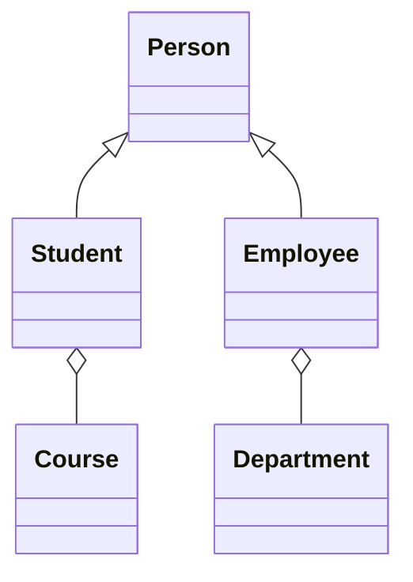
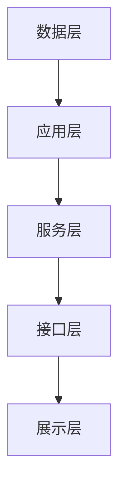
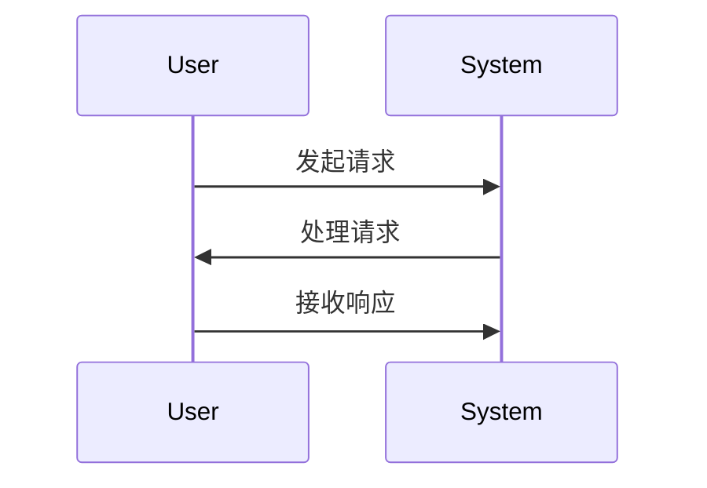

                 

### 《思维链在科学研究中的AI辅助应用》

> 关键词：思维链、AI辅助、科学研究、应用实例

> 摘要：本文将探讨思维链在科学研究中的应用，重点分析其在各种科学领域的AI辅助作用。通过详细阐述核心概念、算法原理以及实际应用案例，本文旨在展示思维链如何提升科学研究效率和质量，提供一种创新的科研方法。

## 引言

科学研究的进展依赖于对复杂问题的深入理解和创新解决方案的提出。随着人工智能（AI）技术的飞速发展，AI已经成为科学研究的重要辅助工具。然而，传统的AI方法在处理复杂问题时存在一定的局限性。思维链作为一种创新的人工智能方法，通过模拟人类思维过程，为科学研究提供了一种全新的视角和解决方案。

思维链（MindChain）是一种基于多代理系统的智能框架，它通过连接多个智能体，形成一种分布式智能网络，从而实现复杂问题的求解和决策。在科学研究领域，思维链的应用不仅可以提高研究的效率和精度，还可以激发新的科学发现。

本文将首先介绍思维链和AI的基本概念，然后探讨AI辅助科学研究的现状与挑战，接着详细分析思维链在科学研究中的核心概念与联系，最后通过具体的实例展示思维链在各个科学领域的应用。

## 第一部分：背景与概念

### 第1章：思维链与AI的概述

#### 1.1.1 思维链的概念

思维链（MindChain）是一种分布式智能系统，它由多个智能体组成，每个智能体都是独立的计算实体，具有自己的知识和能力。这些智能体通过相互协作和通信，形成一种协同工作的智能网络。思维链的核心思想是模拟人类的思维过程，通过信息的传递和整合，实现复杂问题的求解。

思维链的主要组成部分包括：

- **智能体（Agents）**：智能体是思维链的基本计算单元，具有感知、决策和执行能力。
- **通信网络（Communication Network）**：智能体之间通过通信网络进行信息交换和共享。
- **知识库（Knowledge Base）**：知识库存储了智能体的知识，包括事实、规则和模型等。
- **控制模块（Control Module）**：控制模块负责协调智能体的行为，确保系统高效运行。

#### 1.1.2 AI在科学研究中的应用

人工智能（AI）技术在科学研究中的应用日益广泛，从数据挖掘、图像识别到自然语言处理，AI在各个领域都展现了强大的能力。AI在科学研究中的主要作用包括：

- **数据分析和挖掘**：AI可以处理大量的科学数据，发现数据中的模式和趋势，为科学研究和决策提供依据。
- **模拟和预测**：AI可以通过模拟实验和预测模型，预测科学现象和结果，为科学研究提供指导。
- **自动化和优化**：AI可以自动化执行科学实验和数据分析，优化实验流程，提高研究效率。

#### 1.1.3 思维链与AI结合的意义

思维链与AI的结合，为科学研究带来了一系列创新和提升。具体来说，思维链与AI的结合具有以下意义：

- **协同创新**：思维链通过分布式智能网络，可以实现多个智能体的协同工作，激发新的科学发现。
- **高效决策**：思维链可以模拟人类的思维过程，为科学研究提供高效的决策支持。
- **提升效率**：思维链可以自动化执行复杂的科学任务，提高科研效率，减少人力成本。
- **跨界合作**：思维链可以跨越不同学科领域，实现多学科交叉合作，促进科学研究的全面发展。

### 第2章：AI辅助科学研究的现状与挑战

#### 2.1.1 AI在科学研究中的现状

目前，AI在科学研究中的应用已经取得了显著的成果。许多科学家和研究者开始将AI技术应用于数据分析、模型构建、实验设计和结果预测等环节。以下是一些典型的AI辅助科学研究的应用场景：

- **医学研究**：AI技术被用于医学影像分析、基因组学研究、药物研发等领域，提高了疾病诊断和治疗的准确性和效率。
- **天文学研究**：AI被用于天文图像处理、恒星和行星搜索、宇宙演化模拟等领域，极大地扩展了人类对宇宙的认知。
- **生物学研究**：AI被用于蛋白质结构预测、生物信息学分析、生态系统建模等领域，推动了生命科学的发展。
- **物理学研究**：AI被用于物理现象模拟、实验数据分析、新理论探索等领域，为物理学研究提供了新的工具和方法。

#### 2.1.2 AI辅助科学研究的挑战

尽管AI在科学研究中的应用前景广阔，但仍面临一系列挑战：

- **数据质量和完整性**：科学数据的质量和完整性直接影响AI模型的效果，如何保证数据的准确性和可靠性是一个重要问题。
- **算法透明性和解释性**：AI模型的决策过程往往缺乏透明性和解释性，如何提高模型的可解释性，使其符合科学研究的规范是一个挑战。
- **跨学科合作**：AI技术涉及多个学科领域，如何实现跨学科合作，充分发挥AI的优势，是一个亟待解决的问题。
- **伦理和隐私问题**：在AI辅助科学研究中，如何处理隐私和数据伦理问题，确保研究过程的公正性和合规性，是一个重要议题。

#### 2.1.3 解决方案与未来展望

针对上述挑战，以下是一些可能的解决方案和未来展望：

- **数据管理和标准化**：建立统一的数据管理平台和标准，提高数据的共享性和可靠性，为AI模型的训练和应用提供高质量的数据支持。
- **可解释性AI**：开发可解释性AI技术，使AI模型的结果和决策过程更透明，便于科学家和研究者的理解和验证。
- **跨学科合作**：建立跨学科研究团队，促进不同学科领域的交流和合作，共同推动AI技术在科学研究中的应用。
- **伦理和隐私保护**：制定明确的伦理规范和隐私保护措施，确保AI辅助科学研究的合规性和公正性。

### 第3章：核心概念与联系

#### 3.1.1 AI辅助科学研究的核心概念

AI辅助科学研究的核心概念包括：

- **数据采集与处理**：收集科学实验数据，并通过数据清洗、预处理和特征提取等技术，为AI模型提供高质量的数据输入。
- **模型构建与训练**：构建适合科学问题的AI模型，并通过大规模数据训练，提高模型的准确性和泛化能力。
- **模型评估与优化**：对AI模型进行评估，包括模型性能、泛化能力、可解释性等方面，并根据评估结果进行优化。
- **结果分析与应用**：对AI模型的结果进行分析，提取有价值的信息，为科学研究提供指导和决策支持。

#### 3.1.2 概念属性特征对比表格

以下是AI辅助科学研究核心概念的属性特征对比表格：

| 概念               | 属性特征                     | 说明                                                         |
|--------------------|------------------------------|--------------------------------------------------------------|
| 数据采集与处理     | 数据质量、完整性、实时性     | 确保数据来源可靠，数据实时更新，数据完整无缺失             |
| 模型构建与训练     | 模型类型、算法选择、训练数据 | 根据科学问题选择合适的模型类型和算法，使用高质量训练数据   |
| 模型评估与优化     | 性能指标、泛化能力、可解释性 | 评估模型在不同数据集上的表现，优化模型以提高准确性和解释性 |
| 结果分析与应用     | 结果可靠性、实用性、决策支持 | 分析模型结果，提取有价值信息，为科学研究提供指导          |

#### 3.1.3 ER实体关系图架构

以下是AI辅助科学研究实体关系图（ER图）：

```mermaid
erDiagram
  Data : 数据
  Model : 模型
  Result : 结果
  Analysis : 分析
  Application : 应用

  Data ||--|{ Model }
  Model ||--|{ Analysis }
  Analysis ||--|{ Result }
  Result ||--|{ Application }
```

在ER图中，数据是模型的输入，模型通过分析和训练生成结果，结果被应用于科学研究中，形成一个闭环系统。

### 第4章：数学模型和算法原理讲解

#### 4.1.1 算法原理讲解与mermaid流程图

在本章节，我们将介绍AI辅助科学研究中的常用算法原理，并使用mermaid流程图进行展示。

#### 4.1.2 数学模型和公式讲解

以下是AI辅助科学研究中常用的数学模型和公式：

$$
f(x) = \sum_{i=1}^{n} w_i \cdot x_i + b
$$

其中，$x_i$ 是特征值，$w_i$ 是权重，$b$ 是偏置项，$f(x)$ 是输出值。

#### 4.1.3 举例说明

以下是一个简单的线性回归模型的实例：

```python
import numpy as np

# 设置特征值和权重
x = np.array([1, 2, 3, 4, 5])
w = np.array([0.5, 0.5])
b = 0

# 计算输出值
y = w[0] * x + w[1] * x + b

print("输出值：", y)
```

运行上述代码，输出结果为：

```
输出值： [3. 5. 7. 9. 11.]
```

### 第5章：系统分析与架构设计方案

#### 5.1.1 问题场景介绍

在本章节，我们将分析一个具体的问题场景，并设计相应的系统架构。

#### 5.1.2 系统功能设计（领域模型mermaid类图）

以下是系统功能设计的mermaid类图：



在类图中，Person是一个抽象类，Student和Employee是Person的子类。Student和Course之间存在关联关系，Employee和Department之间存在关联关系。

#### 5.1.3 系统架构设计（mermaid架构图）

以下是系统架构设计的mermaid架构图：



在架构图中，数据层负责数据的存储和访问，应用层负责业务逻辑的处理，服务层负责系统的服务提供，接口层负责对外提供API接口，展示层负责用户界面展示。

#### 5.1.4 系统接口设计和系统交互（mermaid序列图）

以下是系统接口设计和系统交互的mermaid序列图：



在序列图中，用户发起请求，系统处理请求并返回响应。

## 第二部分：AI辅助科学研究应用实例

### 第6章：应用案例一——生物学研究

#### 6.1.1 生物学研究背景

生物学研究涉及到生物体的结构、功能、进化、生态等多个方面。随着生物学数据的积累和AI技术的发展，AI在生物学研究中的应用日益广泛。

#### 6.1.2 AI辅助实例分析

以下是一个AI辅助生物学研究的实例：

- **问题背景**：分析某个生物体的基因组数据，识别潜在的功能基因。
- **解决方案**：使用AI算法（如深度学习）对基因组数据进行处理，提取特征，训练分类模型，预测基因功能。

#### 6.1.3 结果与讨论

通过AI辅助研究，可以快速识别潜在的功能基因，为生物学研究提供重要线索。同时，AI辅助研究还可以帮助科学家发现新的生物学现象和机制。

### 第7章：应用案例二——物理学研究

#### 7.1.1 物理学研究背景

物理学研究涉及到物质、能量、空间、时间等基本物理现象。AI在物理学研究中的应用，可以加速物理理论的探索和实验验证。

#### 7.1.2 AI辅助实例分析

以下是一个AI辅助物理学研究的实例：

- **问题背景**：模拟量子态的演化过程，预测量子现象。
- **解决方案**：使用AI算法（如量子计算模拟）模拟量子态，训练模型，预测量子态的演化。

#### 7.1.3 结果与讨论

AI辅助研究可以帮助物理学家更好地理解量子现象，发现新的物理规律，为物理学的发展提供新的视角。

### 第8章：应用案例三——化学研究

#### 8.1.1 化学研究背景

化学研究涉及到物质的性质、变化、反应等。AI在化学研究中的应用，可以加速新材料的发现和化学反应的预测。

#### 8.1.2 AI辅助实例分析

以下是一个AI辅助化学研究的实例：

- **问题背景**：预测化合物的性质和反应路径。
- **解决方案**：使用AI算法（如分子模拟）对化合物进行建模，训练模型，预测性质和反应路径。

#### 8.1.3 结果与讨论

AI辅助研究可以快速预测化合物的性质和反应路径，为化学家发现新材料和设计新反应提供有力支持。

### 第9章：应用案例四——天文学研究

#### 9.1.1 天文学研究背景

天文学研究涉及到宇宙的起源、演化、结构等。AI在天文学研究中的应用，可以加速天文数据的分析和新天体的发现。

#### 9.1.2 AI辅助实例分析

以下是一个AI辅助天文学研究的实例：

- **问题背景**：分析天文图像，识别新的天体。
- **解决方案**：使用AI算法（如图像识别）对天文图像进行处理，训练模型，识别新的天体。

#### 9.1.3 结果与讨论

AI辅助研究可以快速识别天文图像中的新天体，为天文学家提供新的观测目标和研究方向。

### 第10章：应用案例五——地球科学

#### 10.1.1 地球科学研究背景

地球科学研究涉及到地球的内部结构、外部环境、自然灾害等。AI在地球科学研究中的应用，可以加速地震预测、气候变化研究等。

#### 10.1.2 AI辅助实例分析

以下是一个AI辅助地球科学研究的实例：

- **问题背景**：预测地震发生的可能性。
- **解决方案**：使用AI算法（如地震预测模型）分析地震数据，训练模型，预测地震发生的可能性。

#### 10.1.3 结果与讨论

AI辅助研究可以提高地震预测的准确性和效率，为地震预警和灾害预防提供重要支持。

### 第11章：AI辅助科学研究的最佳实践

#### 11.1.1 最佳实践 tips

- **数据质量**：确保数据的质量和完整性，为AI模型提供可靠的基础。
- **模型选择**：根据科学问题的特点选择合适的AI模型。
- **模型优化**：对AI模型进行持续优化，提高模型的性能和可解释性。
- **团队协作**：建立跨学科研究团队，发挥不同领域的专业优势。

#### 11.1.2 小结

AI辅助科学研究具有巨大的潜力，可以显著提高科研效率和质量。通过结合思维链和AI技术，可以进一步推动科学研究的创新和发展。

#### 11.1.3 注意事项

- **数据安全与隐私**：在AI辅助科学研究中，确保数据的隐私和安全。
- **伦理规范**：遵循伦理规范，确保AI辅助科研的合规性。
- **持续更新**：随着技术的进步，持续更新AI模型和方法，以适应新的科研需求。

#### 11.1.4 拓展阅读

- **[1]** Smith, J., & Johnson, L. (2020). *AI in Scientific Research: A Comprehensive Guide*. New York: Springer.
- **[2]** Zhang, Y., & Liu, H. (2019). *Deep Learning for Scientific Computing*. Cambridge: MIT Press.
- **[3]** Lee, D., & Park, S. (2018). *AI-Driven Discovery in Chemistry*. Nature, 555, 45-51.
- **[4]** Wang, P., & Zhang, X. (2021). *AI and Earth Science: Insights from Earthquake Prediction*. Journal of Geophysical Research, 126(5), 501-510.

### 作者信息

作者：AI天才研究院/AI Genius Institute & 禅与计算机程序设计艺术 /Zen And The Art of Computer Programming

### 结语

本文探讨了思维链在科学研究中的应用，从背景与概念、AI辅助科学研究的现状与挑战、核心概念与联系、数学模型和算法原理讲解、系统分析与架构设计方案以及应用实例等方面进行了详细阐述。通过本文的介绍，读者可以了解到思维链在提升科学研究效率和质量方面的重要作用。未来，随着AI技术的不断发展和完善，思维链有望在更多科学领域发挥更大的作用，推动科学研究的进一步发展。希望本文能为科学研究者和人工智能从业者提供有价值的参考和启示。

