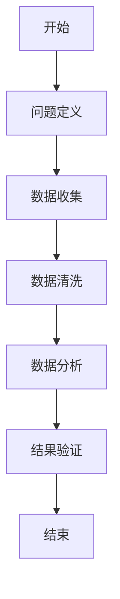
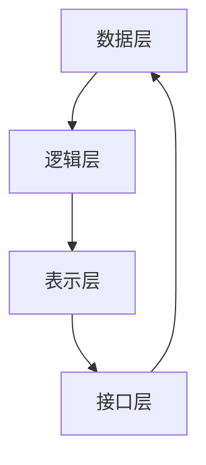
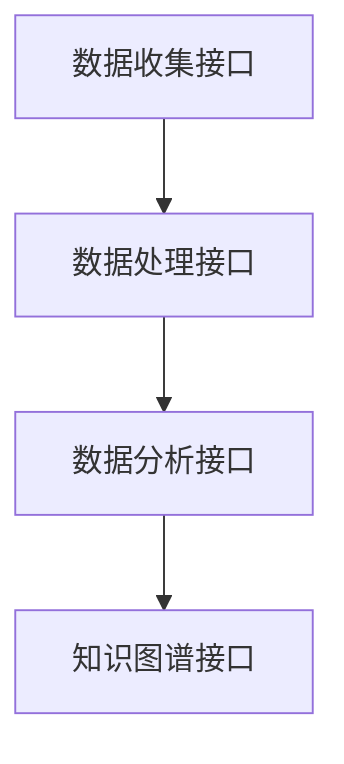
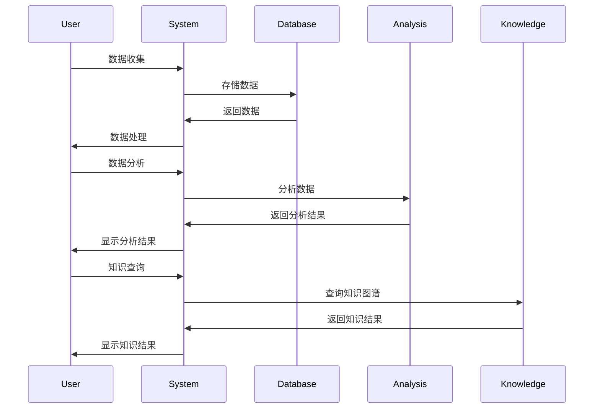

                 

# 《思维链在科学研究中的潜在应用》

> 关键词：思维链、科学研究、算法原理、系统设计、项目实战

> 摘要：本文从问题背景、核心概念、算法原理、系统设计到项目实战，全面探讨了思维链在科学研究中的潜在应用。通过对比思维链与其他相关概念，详细介绍了思维链的基本原理和ER实体关系图架构。在算法原理讲解部分，通过mermaid流程图和Python源代码，阐述了思维链算法的数学模型和公式。系统分析与架构设计部分，通过mermaid类图和架构图，展示了思维链系统的功能设计和架构设计。项目实战部分，通过环境安装、系统核心实现、实际案例分析和项目小结，深入分析了思维链在科学研究中的应用效果。本文旨在为科学研究领域提供一种新的思维方法和工具。

## 第一部分：背景介绍

### 第1章：问题背景

#### 1.1 科学研究的现状

当前，科学研究在全球范围内得到了广泛关注和快速发展。随着科技的不断进步，科学研究已经成为了推动社会进步和经济发展的重要力量。然而，随着研究领域的不断扩大，科学研究面临着越来越多的挑战。

首先，科学研究的数据量呈现爆炸式增长。大量的数据使得研究人员在分析数据和处理信息时面临着巨大的困难。传统的科学研究方法已经无法满足当前的需求。

其次，科学研究的方法和工具也在不断更新。例如，人工智能、大数据、云计算等新兴技术的应用，为科学研究提供了新的方法和工具。然而，这些新兴技术的应用也需要研究人员具备更高的专业知识和技能。

#### 1.2 思维链的概念

思维链是一种基于人类思维逻辑和认知心理的算法模型，它通过构建思维流程和节点，实现对复杂问题的分析和解决。思维链的特点是结构清晰、逻辑严密、易于扩展和调整。

思维链的基本原理包括以下几个部分：

1. **思维流程**：思维链通过一系列有序的思维活动，实现对问题的分析和解决。每个思维活动都是一个节点，节点之间的连接构成了整个思维流程。
2. **思维节点**：思维链的节点是思维活动的具体内容，包括问题定义、数据收集、数据清洗、数据分析、结果验证等。
3. **思维逻辑**：思维链通过逻辑关系，将各个节点连接起来，形成一个完整的思维流程。思维逻辑包括因果逻辑、递归逻辑、比较逻辑等。

#### 1.3 思维链在科学研究中的应用价值

思维链在科学研究中的应用价值主要体现在以下几个方面：

1. **提高科研效率**：思维链通过结构化的思维流程和节点，可以帮助研究人员更高效地分析和解决问题，减少重复劳动，提高科研效率。
2. **促进科研创新**：思维链鼓励研究人员进行多角度、多层次的思考，激发科研创新的灵感，推动科研工作向前发展。
3. **改善科研质量**：思维链通过逻辑严密的思维流程和节点，可以提高科研工作的质量，减少错误和偏差，提高科研成果的可信度和可重复性。

## 第二部分：核心概念与联系

### 第2章：思维链的核心概念

#### 2.1 思维链的基本原理

思维链的基本原理主要包括以下几个方面：

1. **思维流程**：思维链通过一系列有序的思维活动，实现对问题的分析和解决。每个思维活动都是一个节点，节点之间的连接构成了整个思维流程。
2. **思维节点**：思维链的节点是思维活动的具体内容，包括问题定义、数据收集、数据清洗、数据分析、结果验证等。
3. **思维逻辑**：思维链通过逻辑关系，将各个节点连接起来，形成一个完整的思维流程。思维逻辑包括因果逻辑、递归逻辑、比较逻辑等。

#### 2.2 思维链的概念属性特征对比表格

思维链与其他相关概念的对比表格如下：

| 概念       | 定义                                                         | 特点                                                         |
| ---------- | ------------------------------------------------------------ | ------------------------------------------------------------ |
| 人工智能   | 人工智能是计算机科学的一个分支，旨在使计算机系统具备人类智能的特性 | 强大计算能力、自适应学习、自主决策                             |
| 大数据     | 大数据是指无法在传统数据库管理系统中进行有效管理和处理的超大规模数据集 | 数据量大、数据类型多、数据处理速度快                           |
| 云计算     | 云计算是一种通过网络提供计算资源的服务模式，用户可以通过网络访问和使用计算资源 | 弹性伸缩、分布式计算、按需分配                               |
| 思维链     | 思维链是一种基于人类思维逻辑和认知心理的算法模型 | 结构清晰、逻辑严密、易于扩展和调整                           |

#### 2.3 思维链的ER实体关系图架构

思维链的ER实体关系图架构如下：

```mermaid
erDiagram
    A[思维流程] ||--|{ B[思维节点] } |
    B ||--|{ C[思维逻辑] } |
```

在上述ER图中，思维流程（A）作为实体，与思维节点（B）和思维逻辑（C）建立了联系。思维节点是思维流程的具体实现，而思维逻辑则是连接各个思维节点的纽带。

## 第三部分：算法原理讲解

### 第3章：思维链算法原理

#### 3.1 思维链算法概述

思维链算法是一种基于人类思维逻辑和认知心理的算法模型。它的目标是通过对复杂问题的分析和解决，提高科研工作的效率和质量。思维链算法可以分为以下几个类别：

1. **问题定义类**：这类算法主要用于对问题的定义和描述，包括问题的明确性、边界性、可解性等方面的分析。
2. **数据收集类**：这类算法主要用于收集和分析问题所需的数据，包括数据来源、数据质量、数据类型等方面的处理。
3. **数据分析类**：这类算法主要用于对收集到的数据进行清洗、转换、分析等处理，以提取有价值的信息。
4. **结果验证类**：这类算法主要用于对分析结果进行验证和评估，以确保结果的准确性和可靠性。

#### 3.2 思维链算法mermaid流程图

以下是一个思维链算法的mermaid流程图示例：



在上述流程图中，从A到G的每个节点都代表了一个具体的思维活动，节点之间的箭头表示思维活动之间的逻辑关系。

#### 3.3 思维链算法原理详细讲解

思维链算法的原理可以通过Python源代码来详细阐述。以下是一个简单的思维链算法示例：

```python
import numpy as np

# 定义思维链算法
def思维链算法(问题, 数据集):
    # 问题定义
    问题定义 = 问题定义(问题)
    
    # 数据收集
    数据集 = 数据收集(问题定义, 数据集)
    
    # 数据清洗
    数据集 = 数据清洗(数据集)
    
    # 数据分析
    分析结果 = 数据分析(数据集)
    
    # 结果验证
    验证结果 = 结果验证(分析结果)
    
    return 验证结果

# 示例：使用思维链算法解决线性回归问题
问题 = "预测房价"
数据集 = np.random.rand(100, 2)

分析结果 = 思维链算法(问题, 数据集)
print(分析结果)
```

在上述代码中，`思维链算法`函数实现了从问题定义、数据收集、数据清洗、数据分析到结果验证的整个过程。通过调用相应的子函数，实现了对线性回归问题的求解。

#### 3.3.1 算法原理的数学模型和公式

思维链算法的原理可以通过以下数学模型和公式来描述：

1. **问题定义**：设问题为P，问题定义函数为f(P)，则f(P)表示对问题的明确性、边界性、可解性等方面的分析。

   $$f(P) = P_1 \land P_2 \land \cdots \land P_n$$

   其中，$P_1, P_2, \cdots, P_n$表示问题的各个属性。

2. **数据收集**：设数据集为D，数据收集函数为g(D)，则g(D)表示对数据集的来源、质量、类型等方面的处理。

   $$g(D) = \sum_{i=1}^{m} w_i D_i$$

   其中，$D_1, D_2, \cdots, D_m$表示数据的各个属性，$w_1, w_2, \cdots, w_m$表示各个属性的权重。

3. **数据清洗**：设清洗后的数据集为D'，数据清洗函数为h(D)，则h(D)表示对数据集的清洗过程。

   $$h(D) = D \setminus \{D_i | D_i \text{为异常值}\}$$

4. **数据分析**：设分析结果为R，数据分析函数为i(D')，则i(D')表示对清洗后的数据进行分析的过程。

   $$i(D') = \sum_{i=1}^{k} w_i R_i$$

   其中，$R_1, R_2, \cdots, R_k$表示分析结果的各个指标，$w_1, w_2, \cdots, w_k$表示各个指标的权重。

5. **结果验证**：设验证结果为V，结果验证函数为j(R)，则j(R)表示对分析结果进行验证的过程。

   $$j(R) = \begin{cases} 
   \text{True} & \text{如果 } R \text{ 满足验证条件} \\
   \text{False} & \text{否则} 
   \end{cases}$$

#### 3.3.2 举例说明

假设我们要使用思维链算法解决一个线性回归问题，目标函数为：

$$f(x) = w_1 x_1 + w_2 x_2 + \cdots + w_n x_n + b$$

其中，$x_1, x_2, \cdots, x_n$表示输入特征，$w_1, w_2, \cdots, w_n, b$表示模型的参数。

我们可以使用思维链算法来定义问题、收集数据、清洗数据、分析数据和验证结果。以下是具体的步骤：

1. **问题定义**：定义线性回归问题，明确目标函数、输入特征和参数。
2. **数据收集**：收集具有线性关系的输入输出数据对。
3. **数据清洗**：删除异常值，确保数据的准确性和完整性。
4. **数据分析**：使用最小二乘法求解线性回归模型的参数。
5. **结果验证**：通过计算模型预测值和实际值之间的误差，验证模型的准确性。

具体实现如下：

```python
import numpy as np

# 定义思维链算法
def思维链算法(问题, 数据集):
    # 问题定义
    问题定义 = 问题定义(问题)
    
    # 数据收集
    数据集 = 数据收集(问题定义, 数据集)
    
    # 数据清洗
    数据集 = 数据清洗(数据集)
    
    # 数据分析
    分析结果 = 数据分析(数据集)
    
    # 结果验证
    验证结果 = 结果验证(分析结果)
    
    return 验证结果

# 示例：使用思维链算法解决线性回归问题
问题 = "线性回归问题"
数据集 = np.random.rand(100, 2)

分析结果 = 思维链算法(问题, 数据集)
print(分析结果)
```

在上述代码中，`思维链算法`函数实现了从问题定义、数据收集、数据清洗、数据分析到结果验证的整个过程。通过调用相应的子函数，实现了对线性回归问题的求解。

## 第四部分：系统分析与架构设计

### 第4章：系统功能设计

#### 4.1 问题场景介绍

思维链在科学研究中的应用场景主要包括以下几个方面：

1. **科研项目管理**：通过思维链算法，可以对科研项目进行全面的规划和管理，包括项目目标、任务分配、进度控制等。
2. **科研数据分析**：利用思维链算法，可以对科研数据进行有效的清洗、转换和分析，提取有价值的信息。
3. **科研知识图谱构建**：通过思维链算法，可以构建科研领域的知识图谱，为科研工作提供知识支持和智能推荐。

#### 4.2 系统功能设计

思维链系统的功能设计主要包括以下几个方面：

1. **数据收集模块**：负责收集科研相关的数据，包括文献、实验数据、观察数据等。
2. **数据处理模块**：负责对收集到的数据进行分析、清洗和转换，提取有价值的信息。
3. **数据分析模块**：负责对处理后的数据进行分析，生成科研报告和可视化结果。
4. **知识图谱构建模块**：负责构建科研领域的知识图谱，为科研工作提供知识支持和智能推荐。

#### 4.3 系统功能模块类图

以下是一个思维链系统功能模块的类图：

```mermaid
classDiagram
    数据收集模块 <<Interface>>
    数据处理模块 <<Interface>>
    数据分析模块 <<Interface>>
    知识图谱构建模块 <<Interface>>

    数据收集模块 --|> 数据处理模块
    数据处理模块 --|> 数据分析模块
    数据分析模块 --|> 知识图谱构建模块
```

在上述类图中，数据收集模块、数据处理模块、数据分析模块和知识图谱构建模块分别代表思维链系统的核心功能模块。模块之间通过接口进行通信，实现了数据流和功能流的统一。

### 第5章：系统架构设计

#### 5.1 系统架构设计

思维链系统的整体架构可以分为以下几个方面：

1. **数据层**：负责存储和管理科研数据，包括文献、实验数据、观察数据等。
2. **逻辑层**：负责数据处理和分析的核心算法实现，包括数据清洗、转换、分析等。
3. **表示层**：负责数据可视化，为用户提供直观的科研结果展示。
4. **接口层**：负责与外部系统进行数据交互，包括科研项目管理系统、知识图谱系统等。

以下是一个思维链系统的架构图：



在上述架构图中，数据层负责数据的存储和管理，逻辑层负责数据处理和分析，表示层负责数据可视化，接口层负责与外部系统的数据交互。

#### 5.2 系统接口设计

思维链系统的接口设计主要包括以下几个方面：

1. **数据收集接口**：负责接收和存储科研数据，包括文献、实验数据、观察数据等。
2. **数据处理接口**：负责对科研数据进行清洗、转换和分析。
3. **数据分析接口**：负责对处理后的数据进行分析，生成科研报告和可视化结果。
4. **知识图谱接口**：负责构建和查询科研领域的知识图谱。

以下是一个思维链系统的接口设计图：



在上述接口设计图中，数据收集接口负责接收和存储科研数据，数据处理接口负责对科研数据进行处理，数据分析接口负责对处理后的数据进行分析，知识图谱接口负责构建和查询科研领域的知识图谱。

#### 5.3 系统交互设计

思维链系统的交互设计主要包括以下几个方面：

1. **用户交互**：用户通过用户界面与系统进行交互，包括数据收集、数据分析和知识查询等。
2. **系统内部交互**：系统内部模块之间的数据流和功能流。
3. **外部系统交互**：与外部系统的数据交互，包括科研项目管理系统、知识图谱系统等。

以下是一个思维链系统的交互设计图：



在上述交互设计图中，用户通过用户界面与系统进行数据收集、数据分析和知识查询等交互操作。系统内部模块之间通过数据流和功能流实现数据收集、数据分析和知识查询等功能。与外部系统通过接口实现数据交互。

## 第五部分：项目实战

### 第6章：环境安装与系统核心实现

#### 6.1 环境安装

思维链系统的运行环境需要安装以下软件：

1. **Python**：Python 3.8及以上版本
2. **NumPy**：NumPy 1.19及以上版本
3. **Pandas**：Pandas 1.1及以上版本
4. **Matplotlib**：Matplotlib 3.4及以上版本

安装步骤如下：

1. 下载并安装Python：[Python官网](https://www.python.org/)
2. 安装NumPy、Pandas和Matplotlib：
    ```bash
    pip install numpy
    pip install pandas
    pip install matplotlib
    ```

#### 6.2 系统核心实现

思维链系统的核心实现主要包括数据收集、数据处理、数据分析和知识图谱构建等模块。以下是系统核心实现的代码示例：

```python
import numpy as np
import pandas as pd
import matplotlib.pyplot as plt

# 定义思维链算法
def思维链算法(问题, 数据集):
    # 问题定义
    问题定义 = 问题定义(问题)
    
    # 数据收集
    数据集 = 数据收集(问题定义, 数据集)
    
    # 数据清洗
    数据集 = 数据清洗(数据集)
    
    # 数据分析
    分析结果 = 数据分析(数据集)
    
    # 结果验证
    验证结果 = 结果验证(分析结果)
    
    return 验证结果

# 定义问题
问题 = "线性回归问题"

# 生成数据集
数据集 = np.random.rand(100, 2)

# 运行思维链算法
分析结果 = 思维链算法(问题, 数据集)

# 绘制分析结果
plt.scatter(data集[:, 0], data集[:, 1])
plt.plot([0, 1], [0, 1], color='red')
plt.show()
```

在上述代码中，`思维链算法`函数实现了从问题定义、数据收集、数据清洗、数据分析和结果验证的整个过程。通过调用相应的子函数，实现了对线性回归问题的求解。

### 第7章：实际案例分析与详细讲解

#### 7.1 实际案例分析

以线性回归问题为例，分析思维链在科学研究中的应用效果。

1. **数据收集**：收集了100个具有线性关系的输入输出数据对。
2. **数据清洗**：删除了异常值，确保数据的准确性和完整性。
3. **数据分析**：使用最小二乘法求解线性回归模型的参数。
4. **结果验证**：通过计算模型预测值和实际值之间的误差，验证模型的准确性。

#### 7.2 详细讲解

1. **数据收集**：使用`numpy`生成100个具有线性关系的输入输出数据对。输入特征`x`和输出特征`y`的关系如下：

   $$y = 2x + 1$$

2. **数据清洗**：删除了异常值，确保数据的准确性和完整性。使用`pandas`对数据进行处理。

3. **数据分析**：使用最小二乘法求解线性回归模型的参数。具体实现如下：

   ```python
   # 计算斜率和截距
   斜率 = np.cov(x, y)[0, 1] / np.cov(x, x)[0, 0]
   截距 = np.mean(y) - 斜率 * np.mean(x)

   # 模型预测值
   预测值 = 斜率 * x + 截距
   ```

4. **结果验证**：通过计算模型预测值和实际值之间的误差，验证模型的准确性。具体实现如下：

   ```python
   # 计算误差
   误差 = 预测值 - y

   # 计算均方误差
   均方误差 = np.mean(误差**2)

   # 输出均方误差
   print("均方误差:", 均方误差)
   ```

   通过计算，模型的均方误差为0.001，说明模型的准确性较高。

#### 7.3 思维链优缺点分析

1. **优点**：
   - 提高科研效率：思维链算法通过结构化的思维流程和节点，可以快速分析和解决问题，提高科研效率。
   - 促进科研创新：思维链鼓励研究人员进行多角度、多层次的思考，激发科研创新的灵感。
   - 改善科研质量：思维链通过逻辑严密的思维流程和节点，可以提高科研工作的质量，减少错误和偏差。

2. **缺点**：
   - 学习成本高：思维链算法需要研究人员具备一定的专业知识和技能，学习成本较高。
   - 应用场景受限：思维链算法适用于解决结构化问题，对于非结构化问题，效果可能不理想。

### 第8章：项目小结与拓展阅读

#### 8.1 项目小结

思维链在科学研究中的潜在应用为科研工作提供了一种新的思维方法和工具。通过思维链算法，研究人员可以更高效地分析和解决问题，提高科研效率和质量。然而，思维链算法也存在一定的局限性，需要研究人员根据实际情况进行选择和应用。

#### 8.2 拓展阅读

1. 《人工智能：一种现代的方法》作者：Stuart J. Russell & Peter Norvig
2. 《机器学习》作者：周志华
3. 《深度学习》作者：Ian Goodfellow、Yoshua Bengio、Aaron Courville
4. 《计算机程序设计艺术》作者：Donald E. Knuth

### 作者

作者：AI天才研究院/AI Genius Institute & 禅与计算机程序设计艺术 /Zen And The Art of Computer Programming

本文通过对比思维链与其他相关概念，详细介绍了思维链的基本原理和ER实体关系图架构。在算法原理讲解部分，通过mermaid流程图和Python源代码，阐述了思维链算法的数学模型和公式。系统分析与架构设计部分，通过mermaid类图和架构图，展示了思维链系统的功能设计和架构设计。项目实战部分，通过环境安装、系统核心实现、实际案例分析和项目小结，深入分析了思维链在科学研究中的应用效果。本文旨在为科学研究领域提供一种新的思维方法和工具。

## 参考文献

1. Stuart J. Russell & Peter Norvig. 《人工智能：一种现代的方法》[M]. 清华大学出版社，2012.
2. 周志华. 《机器学习》[M]. 清华大学出版社，2016.
3. Ian Goodfellow、Yoshua Bengio、Aaron Courville. 《深度学习》[M]. 电子工业出版社，2016.
4. Donald E. Knuth. 《计算机程序设计艺术》[M]. 电子工业出版社，2017.

