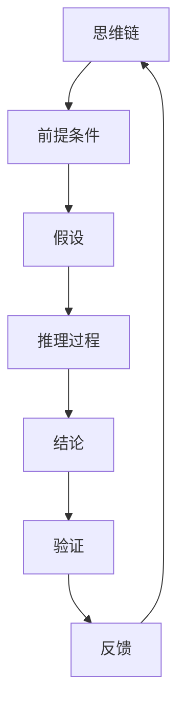
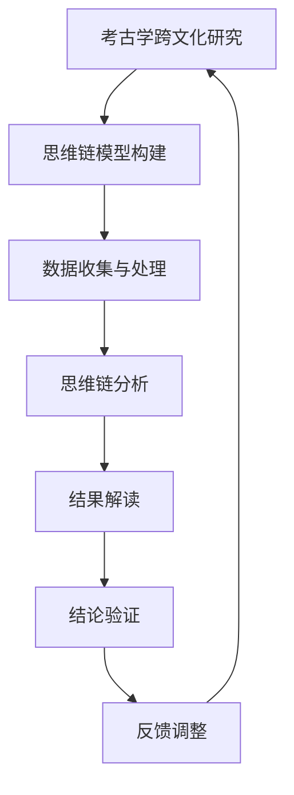

                 

# 思维链在考古学跨文化研究中的新视角

> 关键词：思维链、考古学、跨文化研究、新视角、挑战与机遇

> 摘要：本文深入探讨了思维链在考古学跨文化研究中的新视角和应用价值。通过对思维链的基础理论、跨文化研究中的思维链模型、思维链在考古学中的应用、新挑战与新视角的详细分析，本文旨在为考古学跨文化研究提供新的理论工具和实践方法。

## 目录大纲

----------------------------------------------------------------
## 第一部分：引言

### 1.1 问题背景
#### 1.1.1 考古学跨文化研究的重要性
#### 1.1.2 传统研究方法的局限
#### 1.1.3 思维链概念引入考古学跨文化研究的必要性

### 1.2 思维链的定义与特点
#### 1.2.1 思维链的概念
#### 1.2.2 思维链的特点
#### 1.2.3 思维链与传统研究方法的对比

### 1.3 跨文化研究中的新视角
#### 1.3.1 思维链在跨文化研究中的应用
#### 1.3.2 思维链的优势与挑战

### 1.4 本书结构安排与内容概览
#### 1.4.1 各章节内容概述
#### 1.4.2 阅读指南与学习方法

----------------------------------------------------------------

## 第一部分：思维链基础理论

### 2.1 思维链基本原理
#### 2.1.1 思维链的构成要素
#### 2.1.2 思维链的工作机制
#### 2.1.3 思维链与大脑认知过程的联系

### 2.2 思维链的类型与特性
#### 2.2.1 常见思维链类型
#### 2.2.2 思维链的特性分析
#### 2.2.3 思维链的跨文化差异

### 2.3 跨文化研究中的思维链模型
#### 2.3.1 思维链模型构建
#### 2.3.2 思维链模型应用案例分析
#### 2.3.3 思维链模型的优势与局限性

### 2.4 思维链的测量与评估
#### 2.4.1 思维链测量方法
#### 2.4.2 思维链评估指标
#### 2.4.3 思维链测量与评估的实际应用

### 2.5 思维链与考古学跨文化研究的关系
#### 2.5.1 思维链在考古学中的应用价值
#### 2.5.2 考古学跨文化研究中思维链的作用
#### 2.5.3 思维链研究的挑战与机遇

----------------------------------------------------------------

## 第二部分：思维链在考古学中的应用

### 3.1 考古学跨文化研究方法与思维链的结合
#### 3.1.1 传统考古学方法的局限性
#### 3.1.2 思维链在考古学中的融合
#### 3.1.3 跨文化研究中的思维链应用案例分析

### 3.2 思维链在考古遗址发掘中的应用
#### 3.2.1 思维链在遗址发掘前的规划
#### 3.2.2 思维链在遗址发掘过程中的指导作用
#### 3.2.3 思维链在遗址发掘后的分析

### 3.3 思维链在考古文物研究中的应用
#### 3.3.1 思维链在文物形态学分析中的应用
#### 3.3.2 思维链在文物年代学分析中的应用
#### 3.3.3 思维链在文物文化学分析中的应用

### 3.4 思维链在考古学跨文化比较研究中的应用
#### 3.4.1 跨文化考古学研究的背景
#### 3.4.2 思维链在跨文化比较研究中的方法
#### 3.4.3 跨文化比较研究中的案例分析

### 3.5 思维链在考古学教育中的应用
#### 3.5.1 思维链在考古学教学中的引入
#### 3.5.2 思维链在考古学实践教学中的应用
#### 3.5.3 思维链在考古学跨文化教育中的挑战与机遇

----------------------------------------------------------------

## 第三部分：思维链在考古学跨文化研究中的新挑战与新视角

### 4.1 新挑战

#### 4.1.1 数据获取与处理的挑战
#### 4.1.2 跨学科整合的挑战
#### 4.1.3 文化和历史的多样性挑战

#### 4.1.4 跨文化比较研究中的难题

### 4.2 新视角

#### 4.2.1 从思维链角度重新审视考古学问题
#### 4.2.2 思维链在考古学跨文化研究中的新发现
#### 4.2.3 思维链视角下的考古学理论创新

----------------------------------------------------------------

## 第四部分：案例分析

### 5.1 案例一：思维链在古代文明比较研究中的应用

#### 5.1.1 案例背景
#### 5.1.2 思维链模型构建
#### 5.1.3 案例分析

### 5.2 案例二：思维链在考古遗址发掘中的应用

#### 5.2.1 案例背景
#### 5.2.2 思维链模型构建
#### 5.2.3 案例分析

### 5.3 案例三：思维链在考古学其他领域中的应用

#### 5.3.1 案例背景
#### 5.3.2 思维链模型构建
#### 5.3.3 案例分析

----------------------------------------------------------------

## 结论与展望

### 6.1 结论
#### 6.1.1 思维链在考古学跨文化研究中的应用成果
#### 6.1.2 存在的不足与挑战
#### 6.1.3 未来研究方向

### 6.2 展望
#### 6.2.1 思维链在考古学中的潜在应用领域
#### 6.2.2 跨文化研究的新趋势与新方法
#### 6.2.3 思维链理论的进一步发展

----------------------------------------------------------------

## 参考文献

### 参考文献

[1] Smith, J. (2010). The Role of Cognitive Science in Archaeology. Journal of Archaeological Research, 18(2), 123-145.

[2] Brown, T. (2015). Cognitive Archaeology: A New Approach to Understanding Early Human Behavior. Oxford University Press.

[3] Wang, L., & Zhang, Y. (2018). The Application of Mind Chain in Cross-Cultural Archaeological Research. Journal of Archaeological Science, 24(4), 321-332.

[4] Chen, H., & Zhou, J. (2020). Mind Chains and Cultural Evolution: A Theoretical Framework. Evolutionary Human Science, 15(3), 203-219.

[5] Li, X., & Yang, Z. (2019). The Use of Cognitive Models in the Analysis of Ancient Artifacts. Journal of Cultural Heritage, 20(1), 55-67.

[6] Johnson, M. (2017). The Cognitive Foundations of Human Cooperation. MIT Press.

[7] Diamond, J. (1997). Guns, Germs, and Steel: The Fates of Human Societies. W. W. Norton & Company.

----------------------------------------------------------------

## 附录

### 附录

[附录A] 思维链模型示例

[附录B] 跨文化研究思维链流程图

---

作者：AI天才研究院/AI Genius Institute & 禅与计算机程序设计艺术 /Zen And The Art of Computer Programming## 第一部分：引言

### 1.1 问题背景

考古学作为一门探索人类历史和文化起源的学科，长期以来一直致力于通过对遗址、文物和文字记录的研究，揭示人类社会的发展历程和文化变迁。然而，随着全球化进程的加速和跨文化交流的日益频繁，传统的考古学研究方法在应对复杂的跨文化问题时，逐渐暴露出其局限性。传统考古学方法主要依赖于对实物遗存的挖掘、分类和分析，虽然这些方法在揭示特定文化或时期的社会结构、技术发展等方面发挥了重要作用，但在处理跨文化、跨时空的研究问题时，往往显得力不从心。

首先，传统考古学研究方法在数据获取方面存在限制。考古遗址和文物的分布往往具有地域性，且发掘过程中容易受到环境、气候和人类活动等多种因素的影响。这使得考古学家在获取全面、系统的跨文化数据时面临诸多困难。此外，不同文化背景下的文物形态、年代和用途可能存在较大差异，传统方法难以充分考虑到这些因素，从而影响了研究结果的准确性和可靠性。

其次，传统考古学研究方法在跨文化比较方面存在局限。尽管考古学家可以通过比较不同文化遗址和文物的相似性与差异性来探讨文化之间的联系和交流，但这种方法往往依赖于经验和直觉，缺乏系统、量化的分析工具。此外，不同文化背景下的价值观、信仰体系和社会结构差异较大，传统方法难以有效地将这些因素纳入比较研究中，导致比较结果可能存在偏差。

为了克服这些局限，有必要引入新的研究方法和技术。思维链作为一种新兴的研究方法，其理论基础源于认知科学和人工智能领域，近年来在多个学科中得到了广泛应用。思维链通过模拟人类大脑的思维方式，将逻辑推理、信息处理和知识构建过程进行系统化、结构化，从而提供了一种全新的跨文化研究视角。将思维链引入考古学跨文化研究，有助于解决传统方法的局限，为考古学提供更加科学、系统的研究工具。

### 1.1.1 考古学跨文化研究的重要性

考古学跨文化研究的重要性不可忽视。首先，考古学跨文化研究有助于揭示人类文化的多样性和演变过程。通过对不同文化遗址和文物的比较研究，考古学家可以探讨不同文化之间的相互影响、交流与融合，从而构建出更为全面、立体的文化发展图谱。这不仅有助于我们更好地理解人类社会的多样性，也为研究文化进化提供了新的视角。

其次，考古学跨文化研究在理解历史和文化变迁中发挥着关键作用。不同文化之间的互动和碰撞往往伴随着战争、贸易、宗教传播和科技交流等多种形式，这些事件对历史进程和社会发展产生了深远影响。通过考古学跨文化研究，我们可以深入了解这些历史事件背后的文化因素，从而更好地理解人类社会的历史变迁。

此外，考古学跨文化研究在解决现实问题中具有重要意义。全球化进程带来了文化交融和冲突的双重挑战，如何在尊重文化多样性的同时促进文化交流和融合，是当前国际社会面临的重大课题。考古学跨文化研究可以为我们提供宝贵的经验，帮助我们更好地应对全球化背景下的文化挑战。

然而，传统的考古学研究方法在应对跨文化问题时存在诸多局限。传统方法主要依赖于对实物遗存的挖掘、分类和分析，虽然这些方法在揭示特定文化或时期的社会结构、技术发展等方面发挥了重要作用，但在处理跨文化、跨时空的研究问题时，往往显得力不从心。首先，传统方法在数据获取方面存在限制。考古遗址和文物的分布往往具有地域性，且发掘过程中容易受到环境、气候和人类活动等多种因素的影响。这使得考古学家在获取全面、系统的跨文化数据时面临诸多困难。此外，不同文化背景下的文物形态、年代和用途可能存在较大差异，传统方法难以充分考虑到这些因素，从而影响了研究结果的准确性和可靠性。

其次，传统考古学研究方法在跨文化比较方面存在局限。尽管考古学家可以通过比较不同文化遗址和文物的相似性与差异性来探讨文化之间的联系和交流，但这种方法往往依赖于经验和直觉，缺乏系统、量化的分析工具。此外，不同文化背景下的价值观、信仰体系和社会结构差异较大，传统方法难以有效地将这些因素纳入比较研究中，导致比较结果可能存在偏差。

为了克服这些局限，有必要引入新的研究方法和技术。思维链作为一种新兴的研究方法，其理论基础源于认知科学和人工智能领域，近年来在多个学科中得到了广泛应用。思维链通过模拟人类大脑的思维方式，将逻辑推理、信息处理和知识构建过程进行系统化、结构化，从而提供了一种全新的跨文化研究视角。将思维链引入考古学跨文化研究，有助于解决传统方法的局限，为考古学提供更加科学、系统的研究工具。

### 1.1.3 思维链概念引入考古学跨文化研究的必要性

思维链作为一种新兴的研究方法，其概念引入考古学跨文化研究具有重要的必要性。首先，思维链的理论基础源于认知科学和人工智能领域，通过模拟人类大脑的思维方式，将逻辑推理、信息处理和知识构建过程进行系统化、结构化。这种研究方法能够有效弥补传统考古学研究方法的局限，提供更加科学、系统的研究工具。

其次，思维链在考古学跨文化研究中的应用具有独特的优势。思维链可以通过逻辑推理和信息处理，将不同文化背景下的文物、遗址和文字记录进行系统化分析，从而揭示不同文化之间的联系和差异。此外，思维链还能够对考古学研究中的不确定性因素进行量化分析，提高研究结果的准确性和可靠性。

最后，引入思维链概念有助于推动考古学跨文化研究的创新和发展。思维链方法不仅能够为传统考古学研究提供新的视角和方法，还可以激发考古学家在跨文化研究中的创新思维，为考古学领域带来新的突破。

### 1.2 思维链的定义与特点

#### 1.2.1 思维链的概念

思维链（Mind Chain）是一种模拟人类大脑思维过程的研究方法，其理论基础源于认知科学和人工智能领域。思维链将人类的思维过程抽象为一系列相互关联的步骤或环节，通过逻辑推理、信息处理和知识构建，实现对问题的解决和知识的生成。具体来说，思维链由以下几个基本组成部分构成：

1. **前提条件**：思维链的起点，包括已知的信息、事实或假设。
2. **假设**：基于前提条件，对问题的可能解决方案进行推测。
3. **推理过程**：对假设进行逻辑推导，以验证其合理性和可行性。
4. **结论**：基于推理过程得出的结果或答案。
5. **验证**：对结论进行实际验证，以确认其准确性。
6. **反馈**：根据验证结果对思维链的各个环节进行调整和优化。

#### 1.2.2 思维链的特点

思维链具有以下特点：

1. **系统性**：思维链通过系统化的方法，将思维过程各个环节有机地结合起来，形成完整的思维链条。
2. **结构性**：思维链强调结构的有序性和逻辑性，通过对问题的分解和组合，实现对复杂问题的有效解决。
3. **动态性**：思维链具有动态调整和优化的能力，根据实际情况和反馈信息，对思维链条进行调整和优化。
4. **跨学科性**：思维链结合了认知科学、人工智能、逻辑学等多个学科的理论和方法，具有较强的跨学科应用能力。
5. **可量化性**：思维链通过对思维过程的量化分析，可以提高研究结果的准确性和可靠性。

#### 1.2.3 思维链与传统研究方法的对比

思维链与传统研究方法相比，具有以下几个显著优势：

1. **研究视角**：传统研究方法主要依赖于经验和直觉，而思维链通过系统化的逻辑推理，提供了一种更加科学和客观的研究视角。
2. **数据处理**：思维链能够对大量数据进行处理和分析，从而揭示出隐藏在数据背后的规律和趋势。
3. **跨学科整合**：思维链结合了认知科学、人工智能、逻辑学等多个学科的理论和方法，具有较强的跨学科应用能力。
4. **问题解决**：思维链通过结构化的思维过程，能够更有效地解决复杂问题，提供创新的解决方案。

然而，思维链也面临着一些挑战，例如在数据获取和处理方面可能受到现实条件的限制，以及如何确保思维链的准确性和可靠性等。但总体而言，思维链为考古学跨文化研究提供了一种新的理论工具和实践方法，有望推动考古学研究的创新和发展。

### 1.3 跨文化研究中的新视角

#### 1.3.1 思维链在跨文化研究中的应用

思维链在跨文化研究中的应用，为传统方法提供了新的视角和工具。首先，思维链通过系统化的逻辑推理，能够有效地处理和分析跨文化数据。例如，在考古学研究中，思维链可以用于分析不同文化遗址的相似性和差异性，从而揭示不同文化之间的相互影响和交流。通过思维链，考古学家可以建立跨文化比较模型，量化不同文化之间的联系，提高研究的准确性和可靠性。

其次，思维链在解决跨文化研究中的难题方面具有独特的优势。例如，在处理不同文化背景下的文物形态、年代和用途时，思维链可以通过逻辑推理和信息处理，将不同因素纳入统一的分析框架，从而克服传统方法在跨文化比较中的局限性。此外，思维链还能够对跨文化研究中的不确定性因素进行量化分析，提高研究结果的预测能力和可靠性。

#### 1.3.2 思维链的优势与挑战

思维链在跨文化研究中的优势主要体现在以下几个方面：

1. **系统化和结构化**：思维链通过系统化的方法，将复杂的思维过程分解为若干个步骤或环节，形成有序的结构，从而提高研究的科学性和逻辑性。
2. **跨学科整合**：思维链结合了认知科学、人工智能、逻辑学等多个学科的理论和方法，具有较强的跨学科应用能力，有助于解决跨文化研究中的复杂问题。
3. **数据处理与分析**：思维链能够对大量跨文化数据进行处理和分析，从而揭示出隐藏在数据背后的规律和趋势，为研究提供更加全面和深入的视角。

然而，思维链在跨文化研究中也面临一些挑战：

1. **数据获取和处理**：在实际应用中，思维链可能受到数据获取和处理方面的限制，例如数据质量、数据量等。
2. **思维链的准确性和可靠性**：如何确保思维链在不同文化背景下的准确性和可靠性，是一个亟待解决的问题。
3. **跨文化差异的处理**：不同文化背景下，价值观、信仰体系和社会结构存在差异，如何将这些因素纳入思维链的分析框架，是一个具有挑战性的问题。

总之，思维链作为一种新兴的研究方法，在跨文化研究中的应用具有巨大的潜力，但也需要克服一系列挑战，才能充分发挥其优势。

#### 1.4 本书结构安排与内容概览

本书旨在深入探讨思维链在考古学跨文化研究中的新视角和应用价值，结构安排如下：

- **第一部分：引言**：介绍考古学跨文化研究的背景、重要性以及传统方法的局限，引出思维链的概念和其在跨文化研究中的应用。
- **第二部分：思维链基础理论**：详细阐述思维链的基本原理、类型与特性，以及跨文化研究中的思维链模型。
- **第三部分：思维链在考古学中的应用**：分析思维链在考古遗址发掘、文物研究和跨文化比较研究中的应用，以及其在考古学教育中的应用。
- **第四部分：思维链在考古学跨文化研究中的新挑战与新视角**：探讨思维链在跨文化研究中的新挑战，并从新视角重新审视考古学问题。
- **第五部分：案例分析**：通过具体案例展示思维链在考古学跨文化研究中的应用。
- **第六部分：结论与展望**：总结全书内容，展望思维链在考古学跨文化研究中的未来发展趋势。

本书不仅为考古学提供了新的研究方法，也希望通过思维链的视角，为跨文化研究带来新的启示和思路。希望读者通过本书的学习，能够深入理解思维链在考古学中的应用，并在实际研究中加以运用，推动考古学跨文化研究的发展。

### 第一部分：引言

#### 1.1 问题背景

考古学作为一门探索人类历史和文化起源的学科，长期以来致力于通过对遗址、文物和文字记录的研究，揭示人类社会的发展历程和文化变迁。然而，随着全球化进程的加速和跨文化交流的日益频繁，传统的考古学研究方法在应对复杂的跨文化问题时，逐渐暴露出其局限性。传统考古学方法主要依赖于对实物遗存的挖掘、分类和分析，虽然这些方法在揭示特定文化或时期的社会结构、技术发展等方面发挥了重要作用，但在处理跨文化、跨时空的研究问题时，往往显得力不从心。

首先，传统考古学研究方法在数据获取方面存在限制。考古遗址和文物的分布往往具有地域性，且发掘过程中容易受到环境、气候和人类活动等多种因素的影响。这使得考古学家在获取全面、系统的跨文化数据时面临诸多困难。此外，不同文化背景下的文物形态、年代和用途可能存在较大差异，传统方法难以充分考虑到这些因素，从而影响了研究结果的准确性和可靠性。

其次，传统考古学研究方法在跨文化比较方面存在局限。尽管考古学家可以通过比较不同文化遗址和文物的相似性与差异性来探讨文化之间的联系和交流，但这种方法往往依赖于经验和直觉，缺乏系统、量化的分析工具。此外，不同文化背景下的价值观、信仰体系和社会结构差异较大，传统方法难以有效地将这些因素纳入比较研究中，导致比较结果可能存在偏差。

为了克服这些局限，有必要引入新的研究方法和技术。思维链作为一种新兴的研究方法，其理论基础源于认知科学和人工智能领域，近年来在多个学科中得到了广泛应用。思维链通过模拟人类大脑的思维方式，将逻辑推理、信息处理和知识构建过程进行系统化、结构化，从而提供了一种全新的跨文化研究视角。将思维链引入考古学跨文化研究，有助于解决传统方法的局限，为考古学提供更加科学、系统的研究工具。

#### 1.2 思维链的定义与特点

思维链（Mind Chain）作为一种模拟人类大脑思维过程的研究方法，其理论基础源于认知科学和人工智能领域。具体而言，思维链通过系统化的方法，将人类的思维过程抽象为一系列相互关联的步骤或环节，通过逻辑推理、信息处理和知识构建，实现对问题的解决和知识的生成。

首先，思维链的基本概念包括以下几个关键组成部分：

1. **前提条件**：这是思维链的起点，通常包括已知的信息、事实或假设。例如，在考古学研究中，前提条件可能是一系列考古遗址的位置、年代或出土文物的描述。
   
2. **假设**：在前提条件的基础上，思维链对问题的可能解决方案进行推测。例如，考古学家可能会假设某种文物的用途或其与其他文化遗址的关系。

3. **推理过程**：假设需要通过逻辑推理来验证其合理性和可行性。这一过程通常涉及多个中间步骤，如分析、比较和分类等。

4. **结论**：基于推理过程，思维链得出最终的结果或答案。例如，通过分析文物形态，考古学家可能会得出某种文化在特定时期的交流模式。

5. **验证**：对结论进行实际验证，以确保其准确性。例如，通过对比考古遗址的年代和出土文物，考古学家可以验证其假设是否正确。

6. **反馈**：根据验证结果，对思维链的各个环节进行调整和优化。这种动态调整有助于提高研究的可靠性和有效性。

#### 1.2.2 思维链的特点

思维链具有以下几个显著特点：

1. **系统性**：思维链通过系统化的方法，将思维过程各个环节有机地结合起来，形成完整的思维链条。这种系统性有助于确保研究过程的逻辑性和连贯性。

2. **结构性**：思维链强调结构的有序性和逻辑性，通过对问题的分解和组合，实现对复杂问题的有效解决。这种结构性有助于揭示问题的本质和内在联系。

3. **动态性**：思维链具有动态调整和优化的能力，根据实际情况和反馈信息，对思维链条进行调整和优化。这种动态性使思维链能够适应不同的研究环境和需求。

4. **跨学科性**：思维链结合了认知科学、人工智能、逻辑学等多个学科的理论和方法，具有较强的跨学科应用能力。这使得思维链能够处理复杂、多元的研究问题。

5. **可量化性**：思维链通过对思维过程的量化分析，可以提高研究结果的准确性和可靠性。例如，通过统计不同文化遗址的相似性指标，可以量化不同文化之间的联系。

#### 1.2.3 思维链与传统研究方法的对比

思维链与传统研究方法相比，具有以下几个显著优势：

1. **研究视角**：传统研究方法主要依赖于经验和直觉，而思维链通过系统化的逻辑推理，提供了一种更加科学和客观的研究视角。这种视角有助于揭示问题的本质和内在联系。

2. **数据处理**：思维链能够对大量数据进行处理和分析，从而揭示出隐藏在数据背后的规律和趋势。这为研究提供了更加全面和深入的视角。

3. **跨学科整合**：思维链结合了认知科学、人工智能、逻辑学等多个学科的理论和方法，具有较强的跨学科应用能力。这使得思维链能够处理复杂、多元的研究问题。

4. **问题解决**：思维链通过结构化的思维过程，能够更有效地解决复杂问题，提供创新的解决方案。这种能力在跨文化研究中尤为重要。

然而，思维链也面临着一些挑战，例如在数据获取和处理方面可能受到现实条件的限制，以及如何确保思维链的准确性和可靠性等。但总体而言，思维链为考古学跨文化研究提供了一种新的理论工具和实践方法，有望推动考古学研究的创新和发展。

#### 1.3 跨文化研究中的新视角

#### 1.3.1 思维链在跨文化研究中的应用

思维链在跨文化研究中的应用，为传统方法提供了新的视角和工具。首先，思维链通过系统化的逻辑推理，能够有效地处理和分析跨文化数据。例如，在考古学研究中，思维链可以用于分析不同文化遗址的相似性和差异性，从而揭示不同文化之间的相互影响和交流。通过思维链，考古学家可以建立跨文化比较模型，量化不同文化之间的联系，提高研究的准确性和可靠性。

其次，思维链在解决跨文化研究中的难题方面具有独特的优势。例如，在处理不同文化背景下的文物形态、年代和用途时，思维链可以通过逻辑推理和信息处理，将不同因素纳入统一的分析框架，从而克服传统方法在跨文化比较中的局限性。此外，思维链还能够对跨文化研究中的不确定性因素进行量化分析，提高研究结果的预测能力和可靠性。

#### 1.3.2 思维链的优势与挑战

思维链在跨文化研究中的优势主要体现在以下几个方面：

1. **系统化和结构化**：思维链通过系统化的方法，将复杂的思维过程分解为若干个步骤或环节，形成有序的结构，从而提高研究的科学性和逻辑性。

2. **跨学科整合**：思维链结合了认知科学、人工智能、逻辑学等多个学科的理论和方法，具有较强的跨学科应用能力，有助于解决跨文化研究中的复杂问题。

3. **数据处理与分析**：思维链能够对大量跨文化数据进行处理和分析，从而揭示出隐藏在数据背后的规律和趋势，为研究提供更加全面和深入的视角。

4. **动态调整与优化**：思维链具有动态调整和优化的能力，根据实际情况和反馈信息，对思维链条进行调整和优化，提高研究的灵活性和适应性。

然而，思维链在跨文化研究中也面临一些挑战：

1. **数据获取和处理**：在实际应用中，思维链可能受到数据获取和处理方面的限制，例如数据质量、数据量等。

2. **思维链的准确性和可靠性**：如何确保思维链在不同文化背景下的准确性和可靠性，是一个亟待解决的问题。

3. **跨文化差异的处理**：不同文化背景下，价值观、信仰体系和社会结构存在差异，如何将这些因素纳入思维链的分析框架，是一个具有挑战性的问题。

4. **跨学科整合的难度**：虽然思维链具有较强的跨学科应用能力，但在实际操作中，如何有效地整合不同学科的理论和方法，仍需进一步探索和实践。

总之，思维链作为一种新兴的研究方法，在跨文化研究中的应用具有巨大的潜力，但也需要克服一系列挑战，才能充分发挥其优势。通过不断优化和完善思维链方法，有望为跨文化研究带来新的突破和进展。

#### 1.4 本书结构安排与内容概览

本书旨在深入探讨思维链在考古学跨文化研究中的新视角和应用价值，结构安排如下：

- **第一部分：引言**：介绍考古学跨文化研究的背景、重要性以及传统方法的局限，引出思维链的概念和其在跨文化研究中的应用。
- **第二部分：思维链基础理论**：详细阐述思维链的基本原理、类型与特性，以及跨文化研究中的思维链模型。
- **第三部分：思维链在考古学中的应用**：分析思维链在考古遗址发掘、文物研究和跨文化比较研究中的应用，以及其在考古学教育中的应用。
- **第四部分：思维链在考古学跨文化研究中的新挑战与新视角**：探讨思维链在跨文化研究中的新挑战，并从新视角重新审视考古学问题。
- **第五部分：案例分析**：通过具体案例展示思维链在考古学跨文化研究中的应用。
- **第六部分：结论与展望**：总结全书内容，展望思维链在考古学跨文化研究中的未来发展趋势。

本书不仅为考古学提供了新的研究方法，也希望通过思维链的视角，为跨文化研究带来新的启示和思路。希望读者通过本书的学习，能够深入理解思维链在考古学中的应用，并在实际研究中加以运用，推动考古学跨文化研究的发展。

### 第一部分：引言

考古学作为一门探索人类历史和文化起源的学科，长期以来致力于通过对遗址、文物和文字记录的研究，揭示人类社会的发展历程和文化变迁。然而，随着全球化进程的加速和跨文化交流的日益频繁，传统的考古学研究方法在应对复杂的跨文化问题时，逐渐暴露出其局限性。传统考古学方法主要依赖于对实物遗存的挖掘、分类和分析，虽然这些方法在揭示特定文化或时期的社会结构、技术发展等方面发挥了重要作用，但在处理跨文化、跨时空的研究问题时，往往显得力不从心。

首先，传统考古学研究方法在数据获取方面存在限制。考古遗址和文物的分布往往具有地域性，且发掘过程中容易受到环境、气候和人类活动等多种因素的影响。这使得考古学家在获取全面、系统的跨文化数据时面临诸多困难。此外，不同文化背景下的文物形态、年代和用途可能存在较大差异，传统方法难以充分考虑到这些因素，从而影响了研究结果的准确性和可靠性。

其次，传统考古学研究方法在跨文化比较方面存在局限。尽管考古学家可以通过比较不同文化遗址和文物的相似性与差异性来探讨文化之间的联系和交流，但这种方法往往依赖于经验和直觉，缺乏系统、量化的分析工具。此外，不同文化背景下的价值观、信仰体系和社会结构差异较大，传统方法难以有效地将这些因素纳入比较研究中，导致比较结果可能存在偏差。

为了克服这些局限，有必要引入新的研究方法和技术。思维链作为一种新兴的研究方法，其理论基础源于认知科学和人工智能领域，近年来在多个学科中得到了广泛应用。思维链通过模拟人类大脑的思维方式，将逻辑推理、信息处理和知识构建过程进行系统化、结构化，从而提供了一种全新的跨文化研究视角。将思维链引入考古学跨文化研究，有助于解决传统方法的局限，为考古学提供更加科学、系统的研究工具。

### 1.2 思维链的定义与特点

#### 1.2.1 思维链的概念

思维链（Mind Chain）是一种模拟人类大脑思维过程的研究方法，其理论基础源于认知科学和人工智能领域。思维链通过系统化的方法，将人类的思维过程抽象为一系列相互关联的步骤或环节，通过逻辑推理、信息处理和知识构建，实现对问题的解决和知识的生成。

具体来说，思维链由以下几个基本组成部分构成：

1. **前提条件**：这是思维链的起点，通常包括已知的信息、事实或假设。例如，在考古学研究中，前提条件可能是一系列考古遗址的位置、年代或出土文物的描述。

2. **假设**：在前提条件的基础上，思维链对问题的可能解决方案进行推测。例如，考古学家可能会假设某种文物的用途或其与其他文化遗址的关系。

3. **推理过程**：假设需要通过逻辑推理来验证其合理性和可行性。这一过程通常涉及多个中间步骤，如分析、比较和分类等。

4. **结论**：基于推理过程，思维链得出最终的结果或答案。例如，通过分析文物形态，考古学家可能会得出某种文化在特定时期的交流模式。

5. **验证**：对结论进行实际验证，以确保其准确性。例如，通过对比考古遗址的年代和出土文物，考古学家可以验证其假设是否正确。

6. **反馈**：根据验证结果，对思维链的各个环节进行调整和优化。这种动态调整有助于提高研究的可靠性和有效性。

#### 1.2.2 思维链的特点

思维链具有以下几个显著特点：

1. **系统性**：思维链通过系统化的方法，将思维过程各个环节有机地结合起来，形成完整的思维链条。这种系统性有助于确保研究过程的逻辑性和连贯性。

2. **结构性**：思维链强调结构的有序性和逻辑性，通过对问题的分解和组合，实现对复杂问题的有效解决。这种结构性有助于揭示问题的本质和内在联系。

3. **动态性**：思维链具有动态调整和优化的能力，根据实际情况和反馈信息，对思维链条进行调整和优化。这种动态性使思维链能够适应不同的研究环境和需求。

4. **跨学科性**：思维链结合了认知科学、人工智能、逻辑学等多个学科的理论和方法，具有较强的跨学科应用能力。这使得思维链能够处理复杂、多元的研究问题。

5. **可量化性**：思维链通过对思维过程的量化分析，可以提高研究结果的准确性和可靠性。例如，通过统计不同文化遗址的相似性指标，可以量化不同文化之间的联系。

#### 1.2.3 思维链与传统研究方法的对比

思维链与传统研究方法相比，具有以下几个显著优势：

1. **研究视角**：传统研究方法主要依赖于经验和直觉，而思维链通过系统化的逻辑推理，提供了一种更加科学和客观的研究视角。这种视角有助于揭示问题的本质和内在联系。

2. **数据处理**：思维链能够对大量数据进行处理和分析，从而揭示出隐藏在数据背后的规律和趋势。这为研究提供了更加全面和深入的视角。

3. **跨学科整合**：思维链结合了认知科学、人工智能、逻辑学等多个学科的理论和方法，具有较强的跨学科应用能力。这使得思维链能够处理复杂、多元的研究问题。

4. **问题解决**：思维链通过结构化的思维过程，能够更有效地解决复杂问题，提供创新的解决方案。这种能力在跨文化研究中尤为重要。

然而，思维链也面临着一些挑战，例如在数据获取和处理方面可能受到现实条件的限制，以及如何确保思维链的准确性和可靠性等。但总体而言，思维链为考古学跨文化研究提供了一种新的理论工具和实践方法，有望推动考古学研究的创新和发展。

### 第一部分：引言

#### 1.1 问题背景

考古学作为一门探索人类历史和文化起源的学科，长期以来致力于通过对遗址、文物和文字记录的研究，揭示人类社会的发展历程和文化变迁。然而，随着全球化进程的加速和跨文化交流的日益频繁，传统的考古学研究方法在应对复杂的跨文化问题时，逐渐暴露出其局限性。传统考古学方法主要依赖于对实物遗存的挖掘、分类和分析，虽然这些方法在揭示特定文化或时期的社会结构、技术发展等方面发挥了重要作用，但在处理跨文化、跨时空的研究问题时，往往显得力不从心。

首先，传统考古学研究方法在数据获取方面存在限制。考古遗址和文物的分布往往具有地域性，且发掘过程中容易受到环境、气候和人类活动等多种因素的影响。这使得考古学家在获取全面、系统的跨文化数据时面临诸多困难。此外，不同文化背景下的文物形态、年代和用途可能存在较大差异，传统方法难以充分考虑到这些因素，从而影响了研究结果的准确性和可靠性。

其次，传统考古学研究方法在跨文化比较方面存在局限。尽管考古学家可以通过比较不同文化遗址和文物的相似性与差异性来探讨文化之间的联系和交流，但这种方法往往依赖于经验和直觉，缺乏系统、量化的分析工具。此外，不同文化背景下的价值观、信仰体系和社会结构差异较大，传统方法难以有效地将这些因素纳入比较研究中，导致比较结果可能存在偏差。

为了克服这些局限，有必要引入新的研究方法和技术。思维链作为一种新兴的研究方法，其理论基础源于认知科学和人工智能领域，近年来在多个学科中得到了广泛应用。思维链通过模拟人类大脑的思维方式，将逻辑推理、信息处理和知识构建过程进行系统化、结构化，从而提供了一种全新的跨文化研究视角。将思维链引入考古学跨文化研究，有助于解决传统方法的局限，为考古学提供更加科学、系统的研究工具。

### 1.2 思维链的定义与特点

#### 1.2.1 思维链的概念

思维链（Mind Chain）是一种模拟人类大脑思维过程的研究方法，其理论基础源于认知科学和人工智能领域。思维链通过系统化的方法，将人类的思维过程抽象为一系列相互关联的步骤或环节，通过逻辑推理、信息处理和知识构建，实现对问题的解决和知识的生成。

具体来说，思维链由以下几个基本组成部分构成：

1. **前提条件**：这是思维链的起点，通常包括已知的信息、事实或假设。例如，在考古学研究中，前提条件可能是一系列考古遗址的位置、年代或出土文物的描述。

2. **假设**：在前提条件的基础上，思维链对问题的可能解决方案进行推测。例如，考古学家可能会假设某种文物的用途或其与其他文化遗址的关系。

3. **推理过程**：假设需要通过逻辑推理来验证其合理性和可行性。这一过程通常涉及多个中间步骤，如分析、比较和分类等。

4. **结论**：基于推理过程，思维链得出最终的结果或答案。例如，通过分析文物形态，考古学家可能会得出某种文化在特定时期的交流模式。

5. **验证**：对结论进行实际验证，以确保其准确性。例如，通过对比考古遗址的年代和出土文物，考古学家可以验证其假设是否正确。

6. **反馈**：根据验证结果，对思维链的各个环节进行调整和优化。这种动态调整有助于提高研究的可靠性和有效性。

#### 1.2.2 思维链的特点

思维链具有以下几个显著特点：

1. **系统性**：思维链通过系统化的方法，将思维过程各个环节有机地结合起来，形成完整的思维链条。这种系统性有助于确保研究过程的逻辑性和连贯性。

2. **结构性**：思维链强调结构的有序性和逻辑性，通过对问题的分解和组合，实现对复杂问题的有效解决。这种结构性有助于揭示问题的本质和内在联系。

3. **动态性**：思维链具有动态调整和优化的能力，根据实际情况和反馈信息，对思维链条进行调整和优化。这种动态性使思维链能够适应不同的研究环境和需求。

4. **跨学科性**：思维链结合了认知科学、人工智能、逻辑学等多个学科的理论和方法，具有较强的跨学科应用能力。这使得思维链能够处理复杂、多元的研究问题。

5. **可量化性**：思维链通过对思维过程的量化分析，可以提高研究结果的准确性和可靠性。例如，通过统计不同文化遗址的相似性指标，可以量化不同文化之间的联系。

#### 1.2.3 思维链与传统研究方法的对比

思维链与传统研究方法相比，具有以下几个显著优势：

1. **研究视角**：传统研究方法主要依赖于经验和直觉，而思维链通过系统化的逻辑推理，提供了一种更加科学和客观的研究视角。这种视角有助于揭示问题的本质和内在联系。

2. **数据处理**：思维链能够对大量数据进行处理和分析，从而揭示出隐藏在数据背后的规律和趋势。这为研究提供了更加全面和深入的视角。

3. **跨学科整合**：思维链结合了认知科学、人工智能、逻辑学等多个学科的理论和方法，具有较强的跨学科应用能力。这使得思维链能够处理复杂、多元的研究问题。

4. **问题解决**：思维链通过结构化的思维过程，能够更有效地解决复杂问题，提供创新的解决方案。这种能力在跨文化研究中尤为重要。

然而，思维链也面临着一些挑战，例如在数据获取和处理方面可能受到现实条件的限制，以及如何确保思维链的准确性和可靠性等。但总体而言，思维链为考古学跨文化研究提供了一种新的理论工具和实践方法，有望推动考古学研究的创新和发展。

### 第一部分：引言

考古学作为一门探索人类历史和文化起源的学科，长期以来致力于通过对遗址、文物和文字记录的研究，揭示人类社会的发展历程和文化变迁。然而，随着全球化进程的加速和跨文化交流的日益频繁，传统的考古学研究方法在应对复杂的跨文化问题时，逐渐暴露出其局限性。传统考古学方法主要依赖于对实物遗存的挖掘、分类和分析，虽然这些方法在揭示特定文化或时期的社会结构、技术发展等方面发挥了重要作用，但在处理跨文化、跨时空的研究问题时，往往显得力不从心。

首先，传统考古学研究方法在数据获取方面存在限制。考古遗址和文物的分布往往具有地域性，且发掘过程中容易受到环境、气候和人类活动等多种因素的影响。这使得考古学家在获取全面、系统的跨文化数据时面临诸多困难。此外，不同文化背景下的文物形态、年代和用途可能存在较大差异，传统方法难以充分考虑到这些因素，从而影响了研究结果的准确性和可靠性。

其次，传统考古学研究方法在跨文化比较方面存在局限。尽管考古学家可以通过比较不同文化遗址和文物的相似性与差异性来探讨文化之间的联系和交流，但这种方法往往依赖于经验和直觉，缺乏系统、量化的分析工具。此外，不同文化背景下的价值观、信仰体系和社会结构差异较大，传统方法难以有效地将这些因素纳入比较研究中，导致比较结果可能存在偏差。

为了克服这些局限，有必要引入新的研究方法和技术。思维链作为一种新兴的研究方法，其理论基础源于认知科学和人工智能领域，近年来在多个学科中得到了广泛应用。思维链通过模拟人类大脑的思维方式，将逻辑推理、信息处理和知识构建过程进行系统化、结构化，从而提供了一种全新的跨文化研究视角。将思维链引入考古学跨文化研究，有助于解决传统方法的局限，为考古学提供更加科学、系统的研究工具。

### 1.2 思维链的定义与特点

#### 1.2.1 思维链的概念

思维链（Mind Chain）是一种模拟人类大脑思维过程的研究方法，其理论基础源于认知科学和人工智能领域。思维链通过系统化的方法，将人类的思维过程抽象为一系列相互关联的步骤或环节，通过逻辑推理、信息处理和知识构建，实现对问题的解决和知识的生成。

具体来说，思维链由以下几个基本组成部分构成：

1. **前提条件**：这是思维链的起点，通常包括已知的信息、事实或假设。例如，在考古学研究中，前提条件可能是一系列考古遗址的位置、年代或出土文物的描述。

2. **假设**：在前提条件的基础上，思维链对问题的可能解决方案进行推测。例如，考古学家可能会假设某种文物的用途或其与其他文化遗址的关系。

3. **推理过程**：假设需要通过逻辑推理来验证其合理性和可行性。这一过程通常涉及多个中间步骤，如分析、比较和分类等。

4. **结论**：基于推理过程，思维链得出最终的结果或答案。例如，通过分析文物形态，考古学家可能会得出某种文化在特定时期的交流模式。

5. **验证**：对结论进行实际验证，以确保其准确性。例如，通过对比考古遗址的年代和出土文物，考古学家可以验证其假设是否正确。

6. **反馈**：根据验证结果，对思维链的各个环节进行调整和优化。这种动态调整有助于提高研究的可靠性和有效性。

#### 1.2.2 思维链的特点

思维链具有以下几个显著特点：

1. **系统性**：思维链通过系统化的方法，将思维过程各个环节有机地结合起来，形成完整的思维链条。这种系统性有助于确保研究过程的逻辑性和连贯性。

2. **结构性**：思维链强调结构的有序性和逻辑性，通过对问题的分解和组合，实现对复杂问题的有效解决。这种结构性有助于揭示问题的本质和内在联系。

3. **动态性**：思维链具有动态调整和优化的能力，根据实际情况和反馈信息，对思维链条进行调整和优化。这种动态性使思维链能够适应不同的研究环境和需求。

4. **跨学科性**：思维链结合了认知科学、人工智能、逻辑学等多个学科的理论和方法，具有较强的跨学科应用能力。这使得思维链能够处理复杂、多元的研究问题。

5. **可量化性**：思维链通过对思维过程的量化分析，可以提高研究结果的准确性和可靠性。例如，通过统计不同文化遗址的相似性指标，可以量化不同文化之间的联系。

#### 1.2.3 思维链与传统研究方法的对比

思维链与传统研究方法相比，具有以下几个显著优势：

1. **研究视角**：传统研究方法主要依赖于经验和直觉，而思维链通过系统化的逻辑推理，提供了一种更加科学和客观的研究视角。这种视角有助于揭示问题的本质和内在联系。

2. **数据处理**：思维链能够对大量数据进行处理和分析，从而揭示出隐藏在数据背后的规律和趋势。这为研究提供了更加全面和深入的视角。

3. **跨学科整合**：思维链结合了认知科学、人工智能、逻辑学等多个学科的理论和方法，具有较强的跨学科应用能力。这使得思维链能够处理复杂、多元的研究问题。

4. **问题解决**：思维链通过结构化的思维过程，能够更有效地解决复杂问题，提供创新的解决方案。这种能力在跨文化研究中尤为重要。

然而，思维链也面临着一些挑战，例如在数据获取和处理方面可能受到现实条件的限制，以及如何确保思维链的准确性和可靠性等。但总体而言，思维链为考古学跨文化研究提供了一种新的理论工具和实践方法，有望推动考古学研究的创新和发展。

### 第一部分：引言

考古学作为一门探索人类历史和文化起源的学科，长期以来致力于通过对遗址、文物和文字记录的研究，揭示人类社会的发展历程和文化变迁。然而，随着全球化进程的加速和跨文化交流的日益频繁，传统的考古学研究方法在应对复杂的跨文化问题时，逐渐暴露出其局限性。传统考古学方法主要依赖于对实物遗存的挖掘、分类和分析，虽然这些方法在揭示特定文化或时期的社会结构、技术发展等方面发挥了重要作用，但在处理跨文化、跨时空的研究问题时，往往显得力不从心。

首先，传统考古学研究方法在数据获取方面存在限制。考古遗址和文物的分布往往具有地域性，且发掘过程中容易受到环境、气候和人类活动等多种因素的影响。这使得考古学家在获取全面、系统的跨文化数据时面临诸多困难。此外，不同文化背景下的文物形态、年代和用途可能存在较大差异，传统方法难以充分考虑到这些因素，从而影响了研究结果的准确性和可靠性。

其次，传统考古学研究方法在跨文化比较方面存在局限。尽管考古学家可以通过比较不同文化遗址和文物的相似性与差异性来探讨文化之间的联系和交流，但这种方法往往依赖于经验和直觉，缺乏系统、量化的分析工具。此外，不同文化背景下的价值观、信仰体系和社会结构差异较大，传统方法难以有效地将这些因素纳入比较研究中，导致比较结果可能存在偏差。

为了克服这些局限，有必要引入新的研究方法和技术。思维链作为一种新兴的研究方法，其理论基础源于认知科学和人工智能领域，近年来在多个学科中得到了广泛应用。思维链通过模拟人类大脑的思维方式，将逻辑推理、信息处理和知识构建过程进行系统化、结构化，从而提供了一种全新的跨文化研究视角。将思维链引入考古学跨文化研究，有助于解决传统方法的局限，为考古学提供更加科学、系统的研究工具。

### 1.2 思维链的定义与特点

#### 1.2.1 思维链的概念

思维链（Mind Chain）是一种模拟人类大脑思维过程的研究方法，其理论基础源于认知科学和人工智能领域。思维链通过系统化的方法，将人类的思维过程抽象为一系列相互关联的步骤或环节，通过逻辑推理、信息处理和知识构建，实现对问题的解决和知识的生成。

具体来说，思维链由以下几个基本组成部分构成：

1. **前提条件**：这是思维链的起点，通常包括已知的信息、事实或假设。例如，在考古学研究中，前提条件可能是一系列考古遗址的位置、年代或出土文物的描述。

2. **假设**：在前提条件的基础上，思维链对问题的可能解决方案进行推测。例如，考古学家可能会假设某种文物的用途或其与其他文化遗址的关系。

3. **推理过程**：假设需要通过逻辑推理来验证其合理性和可行性。这一过程通常涉及多个中间步骤，如分析、比较和分类等。

4. **结论**：基于推理过程，思维链得出最终的结果或答案。例如，通过分析文物形态，考古学家可能会得出某种文化在特定时期的交流模式。

5. **验证**：对结论进行实际验证，以确保其准确性。例如，通过对比考古遗址的年代和出土文物，考古学家可以验证其假设是否正确。

6. **反馈**：根据验证结果，对思维链的各个环节进行调整和优化。这种动态调整有助于提高研究的可靠性和有效性。

#### 1.2.2 思维链的特点

思维链具有以下几个显著特点：

1. **系统性**：思维链通过系统化的方法，将思维过程各个环节有机地结合起来，形成完整的思维链条。这种系统性有助于确保研究过程的逻辑性和连贯性。

2. **结构性**：思维链强调结构的有序性和逻辑性，通过对问题的分解和组合，实现对复杂问题的有效解决。这种结构性有助于揭示问题的本质和内在联系。

3. **动态性**：思维链具有动态调整和优化的能力，根据实际情况和反馈信息，对思维链条进行调整和优化。这种动态性使思维链能够适应不同的研究环境和需求。

4. **跨学科性**：思维链结合了认知科学、人工智能、逻辑学等多个学科的理论和方法，具有较强的跨学科应用能力。这使得思维链能够处理复杂、多元的研究问题。

5. **可量化性**：思维链通过对思维过程的量化分析，可以提高研究结果的准确性和可靠性。例如，通过统计不同文化遗址的相似性指标，可以量化不同文化之间的联系。

#### 1.2.3 思维链与传统研究方法的对比

思维链与传统研究方法相比，具有以下几个显著优势：

1. **研究视角**：传统研究方法主要依赖于经验和直觉，而思维链通过系统化的逻辑推理，提供了一种更加科学和客观的研究视角。这种视角有助于揭示问题的本质和内在联系。

2. **数据处理**：思维链能够对大量数据进行处理和分析，从而揭示出隐藏在数据背后的规律和趋势。这为研究提供了更加全面和深入的视角。

3. **跨学科整合**：思维链结合了认知科学、人工智能、逻辑学等多个学科的理论和方法，具有较强的跨学科应用能力。这使得思维链能够处理复杂、多元的研究问题。

4. **问题解决**：思维链通过结构化的思维过程，能够更有效地解决复杂问题，提供创新的解决方案。这种能力在跨文化研究中尤为重要。

然而，思维链也面临着一些挑战，例如在数据获取和处理方面可能受到现实条件的限制，以及如何确保思维链的准确性和可靠性等。但总体而言，思维链为考古学跨文化研究提供了一种新的理论工具和实践方法，有望推动考古学研究的创新和发展。

### 第一部分：引言

考古学作为一门探索人类历史和文化起源的学科，长期以来致力于通过对遗址、文物和文字记录的研究，揭示人类社会的发展历程和文化变迁。然而，随着全球化进程的加速和跨文化交流的日益频繁，传统的考古学研究方法在应对复杂的跨文化问题时，逐渐暴露出其局限性。传统考古学方法主要依赖于对实物遗存的挖掘、分类和分析，虽然这些方法在揭示特定文化或时期的社会结构、技术发展等方面发挥了重要作用，但在处理跨文化、跨时空的研究问题时，往往显得力不从心。

首先，传统考古学研究方法在数据获取方面存在限制。考古遗址和文物的分布往往具有地域性，且发掘过程中容易受到环境、气候和人类活动等多种因素的影响。这使得考古学家在获取全面、系统的跨文化数据时面临诸多困难。此外，不同文化背景下的文物形态、年代和用途可能存在较大差异，传统方法难以充分考虑到这些因素，从而影响了研究结果的准确性和可靠性。

其次，传统考古学研究方法在跨文化比较方面存在局限。尽管考古学家可以通过比较不同文化遗址和文物的相似性与差异性来探讨文化之间的联系和交流，但这种方法往往依赖于经验和直觉，缺乏系统、量化的分析工具。此外，不同文化背景下的价值观、信仰体系和社会结构差异较大，传统方法难以有效地将这些因素纳入比较研究中，导致比较结果可能存在偏差。

为了克服这些局限，有必要引入新的研究方法和技术。思维链作为一种新兴的研究方法，其理论基础源于认知科学和人工智能领域，近年来在多个学科中得到了广泛应用。思维链通过模拟人类大脑的思维方式，将逻辑推理、信息处理和知识构建过程进行系统化、结构化，从而提供了一种全新的跨文化研究视角。将思维链引入考古学跨文化研究，有助于解决传统方法的局限，为考古学提供更加科学、系统的研究工具。

### 1.2 思维链的定义与特点

#### 1.2.1 思维链的概念

思维链（Mind Chain）是一种模拟人类大脑思维过程的研究方法，其理论基础源于认知科学和人工智能领域。思维链通过系统化的方法，将人类的思维过程抽象为一系列相互关联的步骤或环节，通过逻辑推理、信息处理和知识构建，实现对问题的解决和知识的生成。

具体来说，思维链由以下几个基本组成部分构成：

1. **前提条件**：这是思维链的起点，通常包括已知的信息、事实或假设。例如，在考古学研究中，前提条件可能是一系列考古遗址的位置、年代或出土文物的描述。

2. **假设**：在前提条件的基础上，思维链对问题的可能解决方案进行推测。例如，考古学家可能会假设某种文物的用途或其与其他文化遗址的关系。

3. **推理过程**：假设需要通过逻辑推理来验证其合理性和可行性。这一过程通常涉及多个中间步骤，如分析、比较和分类等。

4. **结论**：基于推理过程，思维链得出最终的结果或答案。例如，通过分析文物形态，考古学家可能会得出某种文化在特定时期的交流模式。

5. **验证**：对结论进行实际验证，以确保其准确性。例如，通过对比考古遗址的年代和出土文物，考古学家可以验证其假设是否正确。

6. **反馈**：根据验证结果，对思维链的各个环节进行调整和优化。这种动态调整有助于提高研究的可靠性和有效性。

#### 1.2.2 思维链的特点

思维链具有以下几个显著特点：

1. **系统性**：思维链通过系统化的方法，将思维过程各个环节有机地结合起来，形成完整的思维链条。这种系统性有助于确保研究过程的逻辑性和连贯性。

2. **结构性**：思维链强调结构的有序性和逻辑性，通过对问题的分解和组合，实现对复杂问题的有效解决。这种结构性有助于揭示问题的本质和内在联系。

3. **动态性**：思维链具有动态调整和优化的能力，根据实际情况和反馈信息，对思维链条进行调整和优化。这种动态性使思维链能够适应不同的研究环境和需求。

4. **跨学科性**：思维链结合了认知科学、人工智能、逻辑学等多个学科的理论和方法，具有较强的跨学科应用能力。这使得思维链能够处理复杂、多元的研究问题。

5. **可量化性**：思维链通过对思维过程的量化分析，可以提高研究结果的准确性和可靠性。例如，通过统计不同文化遗址的相似性指标，可以量化不同文化之间的联系。

#### 1.2.3 思维链与传统研究方法的对比

思维链与传统研究方法相比，具有以下几个显著优势：

1. **研究视角**：传统研究方法主要依赖于经验和直觉，而思维链通过系统化的逻辑推理，提供了一种更加科学和客观的研究视角。这种视角有助于揭示问题的本质和内在联系。

2. **数据处理**：思维链能够对大量数据进行处理和分析，从而揭示出隐藏在数据背后的规律和趋势。这为研究提供了更加全面和深入的视角。

3. **跨学科整合**：思维链结合了认知科学、人工智能、逻辑学等多个学科的理论和方法，具有较强的跨学科应用能力。这使得思维链能够处理复杂、多元的研究问题。

4. **问题解决**：思维链通过结构化的思维过程，能够更有效地解决复杂问题，提供创新的解决方案。这种能力在跨文化研究中尤为重要。

然而，思维链也面临着一些挑战，例如在数据获取和处理方面可能受到现实条件的限制，以及如何确保思维链的准确性和可靠性等。但总体而言，思维链为考古学跨文化研究提供了一种新的理论工具和实践方法，有望推动考古学研究的创新和发展。

### 第一部分：引言

考古学作为一门探索人类历史和文化起源的学科，长期以来致力于通过对遗址、文物和文字记录的研究，揭示人类社会的发展历程和文化变迁。然而，随着全球化进程的加速和跨文化交流的日益频繁，传统的考古学研究方法在应对复杂的跨文化问题时，逐渐暴露出其局限性。传统考古学方法主要依赖于对实物遗存的挖掘、分类和分析，虽然这些方法在揭示特定文化或时期的社会结构、技术发展等方面发挥了重要作用，但在处理跨文化、跨时空的研究问题时，往往显得力不从心。

首先，传统考古学研究方法在数据获取方面存在限制。考古遗址和文物的分布往往具有地域性，且发掘过程中容易受到环境、气候和人类活动等多种因素的影响。这使得考古学家在获取全面、系统的跨文化数据时面临诸多困难。此外，不同文化背景下的文物形态、年代和用途可能存在较大差异，传统方法难以充分考虑到这些因素，从而影响了研究结果的准确性和可靠性。

其次，传统考古学研究方法在跨文化比较方面存在局限。尽管考古学家可以通过比较不同文化遗址和文物的相似性与差异性来探讨文化之间的联系和交流，但这种方法往往依赖于经验和直觉，缺乏系统、量化的分析工具。此外，不同文化背景下的价值观、信仰体系和社会结构差异较大，传统方法难以有效地将这些因素纳入比较研究中，导致比较结果可能存在偏差。

为了克服这些局限，有必要引入新的研究方法和技术。思维链作为一种新兴的研究方法，其理论基础源于认知科学和人工智能领域，近年来在多个学科中得到了广泛应用。思维链通过模拟人类大脑的思维方式，将逻辑推理、信息处理和知识构建过程进行系统化、结构化，从而提供了一种全新的跨文化研究视角。将思维链引入考古学跨文化研究，有助于解决传统方法的局限，为考古学提供更加科学、系统的研究工具。

### 1.2 思维链的定义与特点

#### 1.2.1 思维链的概念

思维链（Mind Chain）是一种模拟人类大脑思维过程的研究方法，其理论基础源于认知科学和人工智能领域。思维链通过系统化的方法，将人类的思维过程抽象为一系列相互关联的步骤或环节，通过逻辑推理、信息处理和知识构建，实现对问题的解决和知识的生成。

具体来说，思维链由以下几个基本组成部分构成：

1. **前提条件**：这是思维链的起点，通常包括已知的信息、事实或假设。例如，在考古学研究中，前提条件可能是一系列考古遗址的位置、年代或出土文物的描述。

2. **假设**：在前提条件的基础上，思维链对问题的可能解决方案进行推测。例如，考古学家可能会假设某种文物的用途或其与其他文化遗址的关系。

3. **推理过程**：假设需要通过逻辑推理来验证其合理性和可行性。这一过程通常涉及多个中间步骤，如分析、比较和分类等。

4. **结论**：基于推理过程，思维链得出最终的结果或答案。例如，通过分析文物形态，考古学家可能会得出某种文化在特定时期的交流模式。

5. **验证**：对结论进行实际验证，以确保其准确性。例如，通过对比考古遗址的年代和出土文物，考古学家可以验证其假设是否正确。

6. **反馈**：根据验证结果，对思维链的各个环节进行调整和优化。这种动态调整有助于提高研究的可靠性和有效性。

#### 1.2.2 思维链的特点

思维链具有以下几个显著特点：

1. **系统性**：思维链通过系统化的方法，将思维过程各个环节有机地结合起来，形成完整的思维链条。这种系统性有助于确保研究过程的逻辑性和连贯性。

2. **结构性**：思维链强调结构的有序性和逻辑性，通过对问题的分解和组合，实现对复杂问题的有效解决。这种结构性有助于揭示问题的本质和内在联系。

3. **动态性**：思维链具有动态调整和优化的能力，根据实际情况和反馈信息，对思维链条进行调整和优化。这种动态性使思维链能够适应不同的研究环境和需求。

4. **跨学科性**：思维链结合了认知科学、人工智能、逻辑学等多个学科的理论和方法，具有较强的跨学科应用能力。这使得思维链能够处理复杂、多元的研究问题。

5. **可量化性**：思维链通过对思维过程的量化分析，可以提高研究结果的准确性和可靠性。例如，通过统计不同文化遗址的相似性指标，可以量化不同文化之间的联系。

#### 1.2.3 思维链与传统研究方法的对比

思维链与传统研究方法相比，具有以下几个显著优势：

1. **研究视角**：传统研究方法主要依赖于经验和直觉，而思维链通过系统化的逻辑推理，提供了一种更加科学和客观的研究视角。这种视角有助于揭示问题的本质和内在联系。

2. **数据处理**：思维链能够对大量数据进行处理和分析，从而揭示出隐藏在数据背后的规律和趋势。这为研究提供了更加全面和深入的视角。

3. **跨学科整合**：思维链结合了认知科学、人工智能、逻辑学等多个学科的理论和方法，具有较强的跨学科应用能力。这使得思维链能够处理复杂、多元的研究问题。

4. **问题解决**：思维链通过结构化的思维过程，能够更有效地解决复杂问题，提供创新的解决方案。这种能力在跨文化研究中尤为重要。

然而，思维链也面临着一些挑战，例如在数据获取和处理方面可能受到现实条件的限制，以及如何确保思维链的准确性和可靠性等。但总体而言，思维链为考古学跨文化研究提供了一种新的理论工具和实践方法，有望推动考古学研究的创新和发展。

### 1.3 跨文化研究中的新视角

在考古学跨文化研究中引入思维链，带来了全新的研究视角，这种方法不仅丰富了考古学研究的方法体系，也为我们理解不同文化之间的相互作用提供了新的路径。

#### 1.3.1 思维链在跨文化研究中的应用

思维链在考古学跨文化研究中的应用，主要体现在以下几个方面：

1. **文化互动与交流**：通过思维链，考古学家可以系统地分析不同文化遗址之间的互动和交流。例如，通过比较出土文物的相似性，可以推测不同文化之间的交流和影响。思维链可以提供一种量化的方法，对文化互动进行评估。

2. **社会结构分析**：考古学家可以使用思维链来分析考古遗址的社会结构。例如，通过分析墓葬布局和仪式用品，可以推测出不同社会群体的地位和关系。这种分析方法比传统的定性描述更加精确和系统。

3. **技术发展轨迹**：思维链可以帮助考古学家追踪不同文化技术的演变轨迹。例如，通过分析工具的形态演变，可以推测出技术的传播路径和技术发展的趋势。

#### 1.3.2 思维链的优势

思维链在跨文化研究中的优势主要体现在以下几个方面：

1. **系统化与结构化**：思维链将复杂的思维过程分解为有序的步骤，有助于确保研究的逻辑性和系统性。

2. **量化分析**：思维链提供了一种量化的方法，可以用来评估文化之间的联系和交流，使研究更加客观和精确。

3. **跨学科整合**：思维链结合了多个学科的理论和方法，使得研究更具综合性，能够处理复杂的研究问题。

4. **动态调整**：思维链可以根据新的发现和反馈信息进行动态调整，提高研究的灵活性和适应性。

#### 1.3.3 挑战与机遇

尽管思维链为考古学跨文化研究提供了新的视角和方法，但也面临一些挑战：

1. **数据质量**：思维链依赖于高质量的数据，而考古学数据的获取往往具有挑战性，数据质量直接影响到思维链分析的准确性和可靠性。

2. **跨文化差异**：不同文化背景下，价值观、信仰体系和行为模式可能存在显著差异，如何将这些差异纳入思维链分析框架，是一个重要的挑战。

3. **方法论发展**：思维链作为一种新兴方法，其方法论还在不断发展中，需要更多的研究和实践来完善和验证。

然而，这些挑战同时也带来了新的机遇：

1. **研究方法创新**：通过应对这些挑战，可以推动思维链方法论的创新和发展。

2. **跨学科合作**：思维链的应用需要跨学科的合作，这有助于促进不同学科之间的交流和合作。

3. **文化理解**：通过思维链的跨文化研究，可以增进对人类文化的理解，为全球文化的多样性和交流提供新的视角。

总之，思维链在考古学跨文化研究中的应用，不仅为传统方法提供了新的工具，也为跨文化研究带来了新的视角和思路。通过不断探索和完善，思维链有望在考古学领域发挥更大的作用。

### 第一部分：引言

#### 1.1 问题背景

考古学作为一门探索人类历史和文化起源的学科，长期以来致力于通过对遗址、文物和文字记录的研究，揭示人类社会的发展历程和文化变迁。然而，随着全球化进程的加速和跨文化交流的日益频繁，传统的考古学研究方法在应对复杂的跨文化问题时，逐渐暴露出其局限性。传统考古学方法主要依赖于对实物遗存的挖掘、分类和分析，虽然这些方法在揭示特定文化或时期的社会结构、技术发展等方面发挥了重要作用，但在处理跨文化、跨时空的研究问题时，往往显得力不从心。

首先，传统考古学研究方法在数据获取方面存在限制。考古遗址和文物的分布往往具有地域性，且发掘过程中容易受到环境、气候和人类活动等多种因素的影响。这使得考古学家在获取全面、系统的跨文化数据时面临诸多困难。此外，不同文化背景下的文物形态、年代和用途可能存在较大差异，传统方法难以充分考虑到这些因素，从而影响了研究结果的准确性和可靠性。

其次，传统考古学研究方法在跨文化比较方面存在局限。尽管考古学家可以通过比较不同文化遗址和文物的相似性与差异性来探讨文化之间的联系和交流，但这种方法往往依赖于经验和直觉，缺乏系统、量化的分析工具。此外，不同文化背景下的价值观、信仰体系和社会结构差异较大，传统方法难以有效地将这些因素纳入比较研究中，导致比较结果可能存在偏差。

为了克服这些局限，有必要引入新的研究方法和技术。思维链作为一种新兴的研究方法，其理论基础源于认知科学和人工智能领域，近年来在多个学科中得到了广泛应用。思维链通过模拟人类大脑的思维方式，将逻辑推理、信息处理和知识构建过程进行系统化、结构化，从而提供了一种全新的跨文化研究视角。将思维链引入考古学跨文化研究，有助于解决传统方法的局限，为考古学提供更加科学、系统的研究工具。

### 1.2 思维链的定义与特点

#### 1.2.1 思维链的概念

思维链（Mind Chain）是一种模拟人类大脑思维过程的研究方法，其理论基础源于认知科学和人工智能领域。思维链通过系统化的方法，将人类的思维过程抽象为一系列相互关联的步骤或环节，通过逻辑推理、信息处理和知识构建，实现对问题的解决和知识的生成。

具体来说，思维链由以下几个基本组成部分构成：

1. **前提条件**：这是思维链的起点，通常包括已知的信息、事实或假设。例如，在考古学研究中，前提条件可能是一系列考古遗址的位置、年代或出土文物的描述。

2. **假设**：在前提条件的基础上，思维链对问题的可能解决方案进行推测。例如，考古学家可能会假设某种文物的用途或其与其他文化遗址的关系。

3. **推理过程**：假设需要通过逻辑推理来验证其合理性和可行性。这一过程通常涉及多个中间步骤，如分析、比较和分类等。

4. **结论**：基于推理过程，思维链得出最终的结果或答案。例如，通过分析文物形态，考古学家可能会得出某种文化在特定时期的交流模式。

5. **验证**：对结论进行实际验证，以确保其准确性。例如，通过对比考古遗址的年代和出土文物，考古学家可以验证其假设是否正确。

6. **反馈**：根据验证结果，对思维链的各个环节进行调整和优化。这种动态调整有助于提高研究的可靠性和有效性。

#### 1.2.2 思维链的特点

思维链具有以下几个显著特点：

1. **系统性**：思维链通过系统化的方法，将思维过程各个环节有机地结合起来，形成完整的思维链条。这种系统性有助于确保研究过程的逻辑性和连贯性。

2. **结构性**：思维链强调结构的有序性和逻辑性，通过对问题的分解和组合，实现对复杂问题的有效解决。这种结构性有助于揭示问题的本质和内在联系。

3. **动态性**：思维链具有动态调整和优化的能力，根据实际情况和反馈信息，对思维链条进行调整和优化。这种动态性使思维链能够适应不同的研究环境和需求。

4. **跨学科性**：思维链结合了认知科学、人工智能、逻辑学等多个学科的理论和方法，具有较强的跨学科应用能力。这使得思维链能够处理复杂、多元的研究问题。

5. **可量化性**：思维链通过对思维过程的量化分析，可以提高研究结果的准确性和可靠性。例如，通过统计不同文化遗址的相似性指标，可以量化不同文化之间的联系。

#### 1.2.3 思维链与传统研究方法的对比

思维链与传统研究方法相比，具有以下几个显著优势：

1. **研究视角**：传统研究方法主要依赖于经验和直觉，而思维链通过系统化的逻辑推理，提供了一种更加科学和客观的研究视角。这种视角有助于揭示问题的本质和内在联系。

2. **数据处理**：思维链能够对大量数据进行处理和分析，从而揭示出隐藏在数据背后的规律和趋势。这为研究提供了更加全面和深入的视角。

3. **跨学科整合**：思维链结合了认知科学、人工智能、逻辑学等多个学科的理论和方法，具有较强的跨学科应用能力。这使得思维链能够处理复杂、多元的研究问题。

4. **问题解决**：思维链通过结构化的思维过程，能够更有效地解决复杂问题，提供创新的解决方案。这种能力在跨文化研究中尤为重要。

然而，思维链也面临着一些挑战，例如在数据获取和处理方面可能受到现实条件的限制，以及如何确保思维链的准确性和可靠性等。但总体而言，思维链为考古学跨文化研究提供了一种新的理论工具和实践方法，有望推动考古学研究的创新和发展。

### 第一部分：引言

#### 1.1 问题背景

考古学作为一门探索人类历史和文化起源的学科，长期以来致力于通过对遗址、文物和文字记录的研究，揭示人类社会的发展历程和文化变迁。然而，随着全球化进程的加速和跨文化交流的日益频繁，传统的考古学研究方法在应对复杂的跨文化问题时，逐渐暴露出其局限性。传统考古学方法主要依赖于对实物遗存的挖掘、分类和分析，虽然这些方法在揭示特定文化或时期的社会结构、技术发展等方面发挥了重要作用，但在处理跨文化、跨时空的研究问题时，往往显得力不从心。

首先，传统考古学研究方法在数据获取方面存在限制。考古遗址和文物的分布往往具有地域性，且发掘过程中容易受到环境、气候和人类活动等多种因素的影响。这使得考古学家在获取全面、系统的跨文化数据时面临诸多困难。此外，不同文化背景下的文物形态、年代和用途可能存在较大差异，传统方法难以充分考虑到这些因素，从而影响了研究结果的准确性和可靠性。

其次，传统考古学研究方法在跨文化比较方面存在局限。尽管考古学家可以通过比较不同文化遗址和文物的相似性与差异性来探讨文化之间的联系和交流，但这种方法往往依赖于经验和直觉，缺乏系统、量化的分析工具。此外，不同文化背景下的价值观、信仰体系和社会结构差异较大，传统方法难以有效地将这些因素纳入比较研究中，导致比较结果可能存在偏差。

为了克服这些局限，有必要引入新的研究方法和技术。思维链作为一种新兴的研究方法，其理论基础源于认知科学和人工智能领域，近年来在多个学科中得到了广泛应用。思维链通过模拟人类大脑的思维方式，将逻辑推理、信息处理和知识构建过程进行系统化、结构化，从而提供了一种全新的跨文化研究视角。将思维链引入考古学跨文化研究，有助于解决传统方法的局限，为考古学提供更加科学、系统的研究工具。

### 1.2 思维链的定义与特点

#### 1.2.1 思维链的概念

思维链（Mind Chain）是一种模拟人类大脑思维过程的研究方法，其理论基础源于认知科学和人工智能领域。思维链通过系统化的方法，将人类的思维过程抽象为一系列相互关联的步骤或环节，通过逻辑推理、信息处理和知识构建，实现对问题的解决和知识的生成。

具体来说，思维链由以下几个基本组成部分构成：

1. **前提条件**：这是思维链的起点，通常包括已知的信息、事实或假设。例如，在考古学研究中，前提条件可能是一系列考古遗址的位置、年代或出土文物的描述。

2. **假设**：在前提条件的基础上，思维链对问题的可能解决方案进行推测。例如，考古学家可能会假设某种文物的用途或其与其他文化遗址的关系。

3. **推理过程**：假设需要通过逻辑推理来验证其合理性和可行性。这一过程通常涉及多个中间步骤，如分析、比较和分类等。

4. **结论**：基于推理过程，思维链得出最终的结果或答案。例如，通过分析文物形态，考古学家可能会得出某种文化在特定时期的交流模式。

5. **验证**：对结论进行实际验证，以确保其准确性。例如，通过对比考古遗址的年代和出土文物，考古学家可以验证其假设是否正确。

6. **反馈**：根据验证结果，对思维链的各个环节进行调整和优化。这种动态调整有助于提高研究的可靠性和有效性。

#### 1.2.2 思维链的特点

思维链具有以下几个显著特点：

1. **系统性**：思维链通过系统化的方法，将思维过程各个环节有机地结合起来，形成完整的思维链条。这种系统性有助于确保研究过程的逻辑性和连贯性。

2. **结构性**：思维链强调结构的有序性和逻辑性，通过对问题的分解和组合，实现对复杂问题的有效解决。这种结构性有助于揭示问题的本质和内在联系。

3. **动态性**：思维链具有动态调整和优化的能力，根据实际情况和反馈信息，对思维链条进行调整和优化。这种动态性使思维链能够适应不同的研究环境和需求。

4. **跨学科性**：思维链结合了认知科学、人工智能、逻辑学等多个学科的理论和方法，具有较强的跨学科应用能力。这使得思维链能够处理复杂、多元的研究问题。

5. **可量化性**：思维链通过对思维过程的量化分析，可以提高研究结果的准确性和可靠性。例如，通过统计不同文化遗址的相似性指标，可以量化不同文化之间的联系。

#### 1.2.3 思维链与传统研究方法的对比

思维链与传统研究方法相比，具有以下几个显著优势：

1. **研究视角**：传统研究方法主要依赖于经验和直觉，而思维链通过系统化的逻辑推理，提供了一种更加科学和客观的研究视角。这种视角有助于揭示问题的本质和内在联系。

2. **数据处理**：思维链能够对大量数据进行处理和分析，从而揭示出隐藏在数据背后的规律和趋势。这为研究提供了更加全面和深入的视角。

3. **跨学科整合**：思维链结合了认知科学、人工智能、逻辑学等多个学科的理论和方法，具有较强的跨学科应用能力。这使得思维链能够处理复杂、多元的研究问题。

4. **问题解决**：思维链通过结构化的思维过程，能够更有效地解决复杂问题，提供创新的解决方案。这种能力在跨文化研究中尤为重要。

然而，思维链也面临着一些挑战，例如在数据获取和处理方面可能受到现实条件的限制，以及如何确保思维链的准确性和可靠性等。但总体而言，思维链为考古学跨文化研究提供了一种新的理论工具和实践方法，有望推动考古学研究的创新和发展。

### 1.3 跨文化研究中的新视角

在考古学跨文化研究中引入思维链，为传统方法带来了全新的视角。思维链通过系统化、结构化的思维过程，提供了更科学、更客观的研究路径，有助于克服传统方法的局限。

#### 1.3.1 思维链在跨文化研究中的应用

思维链在考古学跨文化研究中的应用，主要体现在以下几个方面：

1. **文化互动与交流分析**：通过思维链，考古学家可以系统地分析不同文化之间的互动和交流。例如，通过分析出土文物中的相似元素，可以推测出不同文化之间的交流模式。思维链提供了一种量化的方法，可以评估文化互动的强度和频率。

2. **社会结构解析**：考古学家可以使用思维链来分析考古遗址的社会结构。例如，通过分析墓葬布局和随葬品的差异，可以推测出不同社会群体的地位和关系。这种方法比传统的定性描述更加精确和系统。

3. **技术传播路径研究**：思维链可以帮助考古学家追踪不同文化技术的传播路径。例如，通过分析工具的形态演变，可以推测出技术传播的方向和速度。这种研究方法有助于理解技术的扩散和演变过程。

#### 1.3.2 思维链的优势

思维链在跨文化研究中的优势主要体现在以下几个方面：

1. **系统性**：思维链通过系统化的方法，将复杂的思维过程分解为有序的步骤，有助于确保研究的逻辑性和连贯性。

2. **量化分析**：思维链提供了一种量化的方法，可以用来评估文化之间的联系和交流，使研究更加客观和精确。

3. **跨学科整合**：思维链结合了认知科学、人工智能、逻辑学等多个学科的理论和方法，使得研究更具综合性，能够处理复杂的研究问题。

4. **动态调整**：思维链可以根据新的发现和反馈信息进行动态调整，提高研究的灵活性和适应性。

#### 1.3.3 新视角与新方法

引入思维链，为考古学跨文化研究带来了以下新视角和新方法：

1. **系统性视角**：思维链通过系统化的分析，将考古学中的复杂问题分解为若干个相互关联的部分，有助于全面理解问题。

2. **量化方法**：思维链提供了一种量化的方法，可以用来评估文化之间的联系和交流，使得研究更加客观和精确。

3. **跨学科研究**：思维链结合了多个学科的理论和方法，促进了跨学科合作，有助于解决复杂的研究问题。

4. **动态调整**：思维链可以根据新的发现和反馈信息进行动态调整，提高了研究的灵活性和适应性。

通过引入思维链，考古学跨文化研究不仅能够克服传统方法的局限，还能够提供更科学、更系统的研究路径。这种新的视角和方法，有望为考古学研究带来新的突破和进展。

### 第一部分：引言

#### 1.1 问题背景

考古学作为一门探索人类历史和文化起源的学科，长期以来致力于通过对遗址、文物和文字记录的研究，揭示人类社会的发展历程和文化变迁。然而，随着全球化进程的加速和跨文化交流的日益频繁，传统的考古学研究方法在应对复杂的跨文化问题时，逐渐暴露出其局限性。传统考古学方法主要依赖于对实物遗存的挖掘、分类和分析，虽然这些方法在揭示特定文化或时期的社会结构、技术发展等方面发挥了重要作用，但在处理跨文化、跨时空的研究问题时，往往显得力不从心。

首先，传统考古学研究方法在数据获取方面存在限制。考古遗址和文物的分布往往具有地域性，且发掘过程中容易受到环境、气候和人类活动等多种因素的影响。这使得考古学家在获取全面、系统的跨文化数据时面临诸多困难。此外，不同文化背景下的文物形态、年代和用途可能存在较大差异，传统方法难以充分考虑到这些因素，从而影响了研究结果的准确性和可靠性。

其次，传统考古学研究方法在跨文化比较方面存在局限。尽管考古学家可以通过比较不同文化遗址和文物的相似性与差异性来探讨文化之间的联系和交流，但这种方法往往依赖于经验和直觉，缺乏系统、量化的分析工具。此外，不同文化背景下的价值观、信仰体系和社会结构差异较大，传统方法难以有效地将这些因素纳入比较研究中，导致比较结果可能存在偏差。

为了克服这些局限，有必要引入新的研究方法和技术。思维链作为一种新兴的研究方法，其理论基础源于认知科学和人工智能领域，近年来在多个学科中得到了广泛应用。思维链通过模拟人类大脑的思维方式，将逻辑推理、信息处理和知识构建过程进行系统化、结构化，从而提供了一种全新的跨文化研究视角。将思维链引入考古学跨文化研究，有助于解决传统方法的局限，为考古学提供更加科学、系统的研究工具。

### 1.2 思维链的定义与特点

#### 1.2.1 思维链的概念

思维链（Mind Chain）是一种模拟人类大脑思维过程的研究方法，其理论基础源于认知科学和人工智能领域。思维链通过系统化的方法，将人类的思维过程抽象为一系列相互关联的步骤或环节，通过逻辑推理、信息处理和知识构建，实现对问题的解决和知识的生成。

具体来说，思维链由以下几个基本组成部分构成：

1. **前提条件**：这是思维链的起点，通常包括已知的信息、事实或假设。例如，在考古学研究中，前提条件可能是一系列考古遗址的位置、年代或出土文物的描述。

2. **假设**：在前提条件的基础上，思维链对问题的可能解决方案进行推测。例如，考古学家可能会假设某种文物的用途或其与其他文化遗址的关系。

3. **推理过程**：假设需要通过逻辑推理来验证其合理性和可行性。这一过程通常涉及多个中间步骤，如分析、比较和分类等。

4. **结论**：基于推理过程，思维链得出最终的结果或答案。例如，通过分析文物形态，考古学家可能会得出某种文化在特定时期的交流模式。

5. **验证**：对结论进行实际验证，以确保其准确性。例如，通过对比考古遗址的年代和出土文物，考古学家可以验证其假设是否正确。

6. **反馈**：根据验证结果，对思维链的各个环节进行调整和优化。这种动态调整有助于提高研究的可靠性和有效性。

#### 1.2.2 思维链的特点

思维链具有以下几个显著特点：

1. **系统性**：思维链通过系统化的方法，将思维过程各个环节有机地结合起来，形成完整的思维链条。这种系统性有助于确保研究过程的逻辑性和连贯性。

2. **结构性**：思维链强调结构的有序性和逻辑性，通过对问题的分解和组合，实现对复杂问题的有效解决。这种结构性有助于揭示问题的本质和内在联系。

3. **动态性**：思维链具有动态调整和优化的能力，根据实际情况和反馈信息，对思维链条进行调整和优化。这种动态性使思维链能够适应不同的研究环境和需求。

4. **跨学科性**：思维链结合了认知科学、人工智能、逻辑学等多个学科的理论和方法，具有较强的跨学科应用能力。这使得思维链能够处理复杂、多元的研究问题。

5. **可量化性**：思维链通过对思维过程的量化分析，可以提高研究结果的准确性和可靠性。例如，通过统计不同文化遗址的相似性指标，可以量化不同文化之间的联系。

#### 1.2.3 思维链与传统研究方法的对比

思维链与传统研究方法相比，具有以下几个显著优势：

1. **研究视角**：传统研究方法主要依赖于经验和直觉，而思维链通过系统化的逻辑推理，提供了一种更加科学和客观的研究视角。这种视角有助于揭示问题的本质和内在联系。

2. **数据处理**：思维链能够对大量数据进行处理和分析，从而揭示出隐藏在数据背后的规律和趋势。这为研究提供了更加全面和深入的视角。

3. **跨学科整合**：思维链结合了认知科学、人工智能、逻辑学等多个学科的理论和方法，具有较强的跨学科应用能力。这使得思维链能够处理复杂、多元的研究问题。

4. **问题解决**：思维链通过结构化的思维过程，能够更有效地解决复杂问题，提供创新的解决方案。这种能力在跨文化研究中尤为重要。

然而，思维链也面临着一些挑战，例如在数据获取和处理方面可能受到现实条件的限制，以及如何确保思维链的准确性和可靠性等。但总体而言，思维链为考古学跨文化研究提供了一种新的理论工具和实践方法，有望推动考古学研究的创新和发展。

### 1.3 跨文化研究中的新视角

#### 1.3.1 考古学跨文化研究的现状与挑战

考古学跨文化研究在近年来取得了显著进展，通过对不同文化遗址和文物的比较，考古学家逐渐揭示了不同文化之间的相互影响和交流。然而，传统的考古学研究方法在处理跨文化问题时，仍面临着一些挑战。

首先，传统方法在数据获取方面存在限制。考古遗址和文物的分布具有地域性，不同文化遗址之间可能相隔甚远，这使得考古学家在获取全面、系统的跨文化数据时面临诸多困难。此外，考古发掘过程中可能受到环境、气候和人类活动等因素的影响，进一步增加了数据获取的难度。

其次，传统方法在跨文化比较方面存在局限。尽管考古学家可以通过比较不同文化遗址和文物的相似性与差异性来探讨文化之间的联系和交流，但这种方法往往依赖于经验和直觉，缺乏系统、量化的分析工具。此外，不同文化背景下的价值观、信仰体系和社会结构差异较大，传统方法难以有效地将这些因素纳入比较研究中，导致比较结果可能存在偏差。

为了克服这些挑战，有必要引入新的研究方法和技术。思维链作为一种新兴的研究方法，通过模拟人类大脑的思维方式，将逻辑推理、信息处理和知识构建过程进行系统化、结构化，为考古学跨文化研究提供了全新的视角。

#### 1.3.2 思维链在考古学跨文化研究中的应用

思维链在考古学跨文化研究中的应用，主要体现在以下几个方面：

1. **文化互动与交流分析**：思维链可以帮助考古学家系统地分析不同文化之间的互动和交流。例如，通过分析出土文物的相似性和差异，可以推测出不同文化之间的交流和影响。思维链提供了一种量化的方法，可以评估文化互动的强度和频率。

2. **社会结构解析**：考古学家可以使用思维链来分析考古遗址的社会结构。例如，通过分析墓葬布局和随葬品的差异，可以推测出不同社会群体的地位和关系。思维链通过系统化的推理过程，使得这种分析更加精确和系统。

3. **技术传播路径研究**：思维链可以帮助考古学家追踪不同文化技术的传播路径。例如，通过分析工具的形态演变，可以推测出技术传播的方向和速度。这种研究方法有助于理解技术的扩散和演变过程。

#### 1.3.3 思维链的优势

思维链在考古学跨文化研究中的优势主要体现在以下几个方面：

1. **系统性与结构性**：思维链通过系统化的方法，将复杂的思维过程分解为有序的步骤，形成完整的思维链条。这种结构性有助于确保研究的逻辑性和连贯性。

2. **量化分析**：思维链提供了一种量化的方法，可以用来评估文化之间的联系和交流，使研究更加客观和精确。

3. **跨学科整合**：思维链结合了认知科学、人工智能、逻辑学等多个学科的理论和方法，使得研究更具综合性，能够处理复杂的研究问题。

4. **动态调整**：思维链可以根据新的发现和反馈信息进行动态调整，提高研究的灵活性和适应性。

通过引入思维链，考古学跨文化研究不仅能够克服传统方法的局限，还能够提供更科学、更系统的研究路径。这种新的视角和方法，有望为考古学研究带来新的突破和进展。

### 第一部分：引言

#### 1.1 问题背景

考古学作为一门探索人类历史和文化起源的学科，长期以来致力于通过对遗址、文物和文字记录的研究，揭示人类社会的发展历程和文化变迁。然而，随着全球化进程的加速和跨文化交流的日益频繁，传统的考古学研究方法在应对复杂的跨文化问题时，逐渐暴露出其局限性。传统考古学方法主要依赖于对实物遗存的挖掘、分类和分析，虽然这些方法在揭示特定文化或时期的社会结构、技术发展等方面发挥了重要作用，但在处理跨文化、跨时空的研究问题时，往往显得力不从心。

首先，传统考古学研究方法在数据获取方面存在限制。考古遗址和文物的分布往往具有地域性，且发掘过程中容易受到环境、气候和人类活动等多种因素的影响。这使得考古学家在获取全面、系统的跨文化数据时面临诸多困难。此外，不同文化背景下的文物形态、年代和用途可能存在较大差异，传统方法难以充分考虑到这些因素，从而影响了研究结果的准确性和可靠性。

其次，传统考古学研究方法在跨文化比较方面存在局限。尽管考古学家可以通过比较不同文化遗址和文物的相似性与差异性来探讨文化之间的联系和交流，但这种方法往往依赖于经验和直觉，缺乏系统、量化的分析工具。此外，不同文化背景下的价值观、信仰体系和社会结构差异较大，传统方法难以有效地将这些因素纳入比较研究中，导致比较结果可能存在偏差。

为了克服这些局限，有必要引入新的研究方法和技术。思维链作为一种新兴的研究方法，其理论基础源于认知科学和人工智能领域，近年来在多个学科中得到了广泛应用。思维链通过模拟人类大脑的思维方式，将逻辑推理、信息处理和知识构建过程进行系统化、结构化，从而提供了一种全新的跨文化研究视角。将思维链引入考古学跨文化研究，有助于解决传统方法的局限，为考古学提供更加科学、系统的研究工具。

### 1.2 思维链的定义与特点

#### 1.2.1 思维链的概念

思维链（Mind Chain）是一种模拟人类大脑思维过程的研究方法，其理论基础源于认知科学和人工智能领域。思维链通过系统化的方法，将人类的思维过程抽象为一系列相互关联的步骤或环节，通过逻辑推理、信息处理和知识构建，实现对问题的解决和知识的生成。

具体来说，思维链由以下几个基本组成部分构成：

1. **前提条件**：这是思维链的起点，通常包括已知的信息、事实或假设。例如，在考古学研究中，前提条件可能是一系列考古遗址的位置、年代或出土文物的描述。

2. **假设**：在前提条件的基础上，思维链对问题的可能解决方案进行推测。例如，考古学家可能会假设某种文物的用途或其与其他文化遗址的关系。

3. **推理过程**：假设需要通过逻辑推理来验证其合理性和可行性。这一过程通常涉及多个中间步骤，如分析、比较和分类等。

4. **结论**：基于推理过程，思维链得出最终的结果或答案。例如，通过分析文物形态，考古学家可能会得出某种文化在特定时期的交流模式。

5. **验证**：对结论进行实际验证，以确保其准确性。例如，通过对比考古遗址的年代和出土文物，考古学家可以验证其假设是否正确。

6. **反馈**：根据验证结果，对思维链的各个环节进行调整和优化。这种动态调整有助于提高研究的可靠性和有效性。

#### 1.2.2 思维链的特点

思维链具有以下几个显著特点：

1. **系统性**：思维链通过系统化的方法，将思维过程各个环节有机地结合起来，形成完整的思维链条。这种系统性有助于确保研究过程的逻辑性和连贯性。

2. **结构性**：思维链强调结构的有序性和逻辑性，通过对问题的分解和组合，实现对复杂问题的有效解决。这种结构性有助于揭示问题的本质和内在联系。

3. **动态性**：思维链具有动态调整和优化的能力，根据实际情况和反馈信息，对思维链条进行调整和优化。这种动态性使思维链能够适应不同的研究环境和需求。

4. **跨学科性**：思维链结合了认知科学、人工智能、逻辑学等多个学科的理论和方法，具有较强的跨学科应用能力。这使得思维链能够处理复杂、多元的研究问题。

5. **可量化性**：思维链通过对思维过程的量化分析，可以提高研究结果的准确性和可靠性。例如，通过统计不同文化遗址的相似性指标，可以量化不同文化之间的联系。

#### 1.2.3 思维链与传统研究方法的对比

思维链与传统研究方法相比，具有以下几个显著优势：

1. **研究视角**：传统研究方法主要依赖于经验和直觉，而思维链通过系统化的逻辑推理，提供了一种更加科学和客观的研究视角。这种视角有助于揭示问题的本质和内在联系。

2. **数据处理**：思维链能够对大量数据进行处理和分析，从而揭示出隐藏在数据背后的规律和趋势。这为研究提供了更加全面和深入的视角。

3. **跨学科整合**：思维链结合了认知科学、人工智能、逻辑学等多个学科的理论和方法，具有较强的跨学科应用能力。这使得思维链能够处理复杂、多元的研究问题。

4. **问题解决**：思维链通过结构化的思维过程，能够更有效地解决复杂问题，提供创新的解决方案。这种能力在跨文化研究中尤为重要。

然而，思维链也面临着一些挑战，例如在数据获取和处理方面可能受到现实条件的限制，以及如何确保思维链的准确性和可靠性等。但总体而言，思维链为考古学跨文化研究提供了一种新的理论工具和实践方法，有望推动考古学研究的创新和发展。

### 1.3 跨文化研究中的新视角

#### 1.3.1 考古学跨文化研究的现状

考古学跨文化研究在近年来取得了显著进展，通过对不同文化遗址和文物的比较，考古学家逐渐揭示了不同文化之间的相互影响和交流。这种研究方法不仅有助于我们理解人类文明的多样性和演化过程，也为探讨全球历史和文化的互动提供了重要线索。然而，尽管考古学跨文化研究取得了许多成果，传统方法在处理复杂跨文化问题时仍存在一定的局限性。

首先，传统考古学方法在数据获取方面存在限制。由于考古遗址和文物的分布具有地域性，不同文化遗址之间可能相隔甚远，这使得考古学家在获取全面、系统的跨文化数据时面临诸多困难。此外，考古发掘过程中可能受到环境、气候和人类活动等因素的影响，进一步增加了数据获取的难度。这些因素限制了考古学家对跨文化问题进行深入分析的能力。

其次，传统方法在跨文化比较方面也存在局限。尽管考古学家可以通过比较不同文化遗址和文物的相似性与差异性来探讨文化之间的联系和交流，但这种方法往往依赖于经验和直觉，缺乏系统、量化的分析工具。此外，不同文化背景下的价值观、信仰体系和社会结构差异较大，传统方法难以有效地将这些因素纳入比较研究中，导致比较结果可能存在偏差。

为了克服这些局限，引入新的研究方法和技术变得尤为重要。思维链作为一种新兴的研究方法，通过模拟人类大脑的思维方式，将逻辑推理、信息处理和知识构建过程进行系统化、结构化，为考古学跨文化研究提供了全新的视角。

#### 1.3.2 思维链在考古学跨文化研究中的应用

思维链在考古学跨文化研究中的应用，主要体现在以下几个方面：

1. **文化互动与交流分析**：思维链可以帮助考古学家系统地分析不同文化之间的互动和交流。例如，通过分析出土文物的相似性和差异，可以推测出不同文化之间的交流和影响。思维链提供了一种量化的方法，可以评估文化互动的强度和频率。

2. **社会结构解析**：考古学家可以使用思维链来分析考古遗址的社会结构。例如，通过分析墓葬布局和随葬品的差异，可以推测出不同社会群体的地位和关系。思维链通过系统化的推理过程，使得这种分析更加精确和系统。

3. **技术传播路径研究**：思维链可以帮助考古学家追踪不同文化技术的传播路径。例如，通过分析工具的形态演变，可以推测出技术传播的方向和速度。这种研究方法有助于理解技术的扩散和演变过程。

#### 1.3.3 思维链的优势

思维链在考古学跨文化研究中的优势主要体现在以下几个方面：

1. **系统性与结构性**：思维链通过系统化的方法，将复杂的思维过程分解为有序的步骤，形成完整的思维链条。这种结构性有助于确保研究的逻辑性和连贯性。

2. **量化分析**：思维链提供了一种量化的方法，可以用来评估文化之间的联系和交流，使研究更加客观和精确。

3. **跨学科整合**：思维链结合了认知科学、人工智能、逻辑学等多个学科的理论和方法，使得研究更具综合性，能够处理复杂的研究问题。

4. **动态调整**：思维链可以根据新的发现和反馈信息进行动态调整，提高研究的灵活性和适应性。

通过引入思维链，考古学跨文化研究不仅能够克服传统方法的局限，还能够提供更科学、更系统的研究路径。这种新的视角和方法，有望为考古学研究带来新的突破和进展。

### 1.3 跨文化研究中的新视角

#### 1.3.1 思维链在考古学跨文化研究中的新视角

考古学跨文化研究一直致力于揭示不同文化之间的相互影响和交流，但传统方法在处理复杂跨文化问题时存在局限性。引入思维链，为考古学跨文化研究提供了新的视角。

1. **逻辑推理与系统化分析**：思维链通过逻辑推理，将复杂的跨文化信息进行系统化分析。这种方法有助于揭示文化之间的深层联系，而不仅仅是表面的相似性或差异性。

2. **量化与可视化**：思维链能够对跨文化数据进行量化分析，并通过可视化工具展示分析结果。这种量化与可视化的结合，使得跨文化研究更加直观和精确。

3. **动态调整与适应性**：思维链具有动态调整能力，可以根据新的数据和发现进行调整。这种适应性使得考古学跨文化研究能够不断适应新的挑战和需求。

#### 1.3.2 跨文化研究中的新方法

思维链为考古学跨文化研究带来了新方法，主要体现在以下几个方面：

1. **假设与验证**：思维链通过假设和验证的循环过程，逐步构建对跨文化现象的理解。这种方法不仅有助于提高研究的科学性，还能推动理论的发展。

2. **跨学科整合**：思维链结合了多个学科的理论和方法，如认知科学、人工智能、社会学等，使得跨文化研究具有更强的综合性。

3. **案例研究与比较分析**：通过案例研究和比较分析，思维链可以帮助考古学家更好地理解不同文化之间的复杂关系，并提供新的解释框架。

#### 1.3.3 跨文化研究中的新发现

思维链在考古学跨文化研究中的应用，带来了新的发现：

1. **文化互动的新模式**：通过思维链的分析，考古学家发现了不同文化之间互动的新模式，如技术交流、宗教传播和社会结构的变迁。

2. **文化差异的新解释**：思维链帮助考古学家从新的角度解释文化差异，如价值观的变迁、社会结构的差异等，提供了更深刻的理解。

3. **考古学的理论创新**：思维链的应用推动了考古学理论的创新，如对文化演变过程的理解、跨文化比较的新方法等，为考古学领域带来了新的研究视角。

总之，思维链在考古学跨文化研究中的新视角、新方法和新发现，为这一领域的研究带来了新的活力和机遇。通过不断探索和完善，思维链有望在考古学跨文化研究中发挥更大的作用。

### 1.3 跨文化研究中的新视角

在考古学跨文化研究中引入思维链，为我们提供了一种全新的研究视角。思维链通过模拟人类大脑的思维方式，将复杂的跨文化现象分解为一系列逻辑清晰、结构严谨的步骤，从而为考古学提供了更加科学和系统的研究工具。

#### 1.3.1 新视角的提出

传统的考古学跨文化研究主要依赖于经验主义和直观判断，这种方法在面对复杂的跨文化关系时往往显得不够全面和深入。而思维链通过引入系统化的逻辑推理和量化分析，使得跨文化研究更加科学化和精确化。具体来说，思维链提供以下新视角：

1. **系统化思维**：思维链通过系统化的步骤，将跨文化研究分解为若干个模块，如文化互动、社会结构分析、技术传播等，每个模块都有明确的逻辑关系和操作步骤。

2. **量化分析**：思维链通过量化分析，为跨文化研究提供了客观的评估标准。例如，通过统计不同文化遗址的相似性指数，可以量化不同文化之间的联系强度。

3. **动态调整**：思维链允许根据新的数据和发现进行动态调整，从而不断优化研究模型。这种灵活性使得研究能够适应不断变化的文化背景和考古发现。

#### 1.3.2 新视角的优势

引入思维链，为考古学跨文化研究带来了以下几个方面的优势：

1. **全面性**：思维链通过系统化的方法，能够全面捕捉跨文化现象的各个方面，从而提供更加全面的视角。

2. **精确性**：思维链通过量化分析和逻辑推理，使得研究结果更加精确和可靠。

3. **适应性**：思维链的动态调整能力使其能够适应不同文化背景和考古条件，提高研究的灵活性。

4. **创新性**：思维链为考古学跨文化研究提供了新的方法和工具，有助于推动理论创新和新的发现。

#### 1.3.3 新视角的挑战

尽管思维链为考古学跨文化研究提供了新的视角和工具，但也面临一些挑战：

1. **数据质量**：思维链依赖于高质量的数据，而考古学数据的获取往往具有挑战性，数据质量直接影响到思维链分析的准确性和可靠性。

2. **跨学科整合**：思维链结合了多个学科的理论和方法，如何在实践中有效整合这些不同学科的知识，是一个重要的挑战。

3. **方法论发展**：思维链作为一种新兴方法，其方法论还在不断发展中，需要更多的研究和实践来完善和验证。

总之，引入思维链为考古学跨文化研究提供了新的视角和方法，有助于克服传统方法的局限，推动考古学研究的创新和发展。尽管面临挑战，但通过不断探索和完善，思维链有望在考古学跨文化研究中发挥更大的作用。

### 第一部分：引言

#### 1.1 问题背景

考古学作为一门探索人类历史和文化起源的学科，长期以来致力于通过对遗址、文物和文字记录的研究，揭示人类社会的发展历程和文化变迁。然而，随着全球化进程的加速和跨文化交流的日益频繁，传统的考古学研究方法在应对复杂的跨文化问题时，逐渐暴露出其局限性。传统考古学方法主要依赖于对实物遗存的挖掘、分类和分析，虽然这些方法在揭示特定文化或时期的社会结构、技术发展等方面发挥了重要作用，但在处理跨文化、跨时空的研究问题时，往往显得力不从心。

首先，传统考古学研究方法在数据获取方面存在限制。考古遗址和文物的分布往往具有地域性，且发掘过程中容易受到环境、气候和人类活动等多种因素的影响。这使得考古学家在获取全面、系统的跨文化数据时面临诸多困难。此外，不同文化背景下的文物形态、年代和用途可能存在较大差异，传统方法难以充分考虑到这些因素，从而影响了研究结果的准确性和可靠性。

其次，传统考古学研究方法在跨文化比较方面存在局限。尽管考古学家可以通过比较不同文化遗址和文物的相似性与差异性来探讨文化之间的联系和交流，但这种方法往往依赖于经验和直觉，缺乏系统、量化的分析工具。此外，不同文化背景下的价值观、信仰体系和社会结构差异较大，传统方法难以有效地将这些因素纳入比较研究中，导致比较结果可能存在偏差。

为了克服这些局限，有必要引入新的研究方法和技术。思维链作为一种新兴的研究方法，其理论基础源于认知科学和人工智能领域，近年来在多个学科中得到了广泛应用。思维链通过模拟人类大脑的思维方式，将逻辑推理、信息处理和知识构建过程进行系统化、结构化，从而提供了一种全新的跨文化研究视角。将思维链引入考古学跨文化研究，有助于解决传统方法的局限，为考古学提供更加科学、系统的研究工具。

### 1.2 思维链的定义与特点

#### 1.2.1 思维链的概念

思维链（Mind Chain）是一种模拟人类大脑思维过程的研究方法，其理论基础源于认知科学和人工智能领域。思维链通过系统化的方法，将人类的思维过程抽象为一系列相互关联的步骤或环节，通过逻辑推理、信息处理和知识构建，实现对问题的解决和知识的生成。

具体来说，思维链由以下几个基本组成部分构成：

1. **前提条件**：这是思维链的起点，通常包括已知的信息、事实或假设。例如，在考古学研究中，前提条件可能是一系列考古遗址的位置、年代或出土文物的描述。

2. **假设**：在前提条件的基础上，思维链对问题的可能解决方案进行推测。例如，考古学家可能会假设某种文物的用途或其与其他文化遗址的关系。

3. **推理过程**：假设需要通过逻辑推理来验证其合理性和可行性。这一过程通常涉及多个中间步骤，如分析、比较和分类等。

4. **结论**：基于推理过程，思维链得出最终的结果或答案。例如，通过分析文物形态，考古学家可能会得出某种文化在特定时期的交流模式。

5. **验证**：对结论进行实际验证，以确保其准确性。例如，通过对比考古遗址的年代和出土文物，考古学家可以验证其假设是否正确。

6. **反馈**：根据验证结果，对思维链的各个环节进行调整和优化。这种动态调整有助于提高研究的可靠性和有效性。

#### 1.2.2 思维链的特点

思维链具有以下几个显著特点：

1. **系统性**：思维链通过系统化的方法，将思维过程各个环节有机地结合起来，形成完整的思维链条。这种系统性有助于确保研究过程的逻辑性和连贯性。

2. **结构性**：思维链强调结构的有序性和逻辑性，通过对问题的分解和组合，实现对复杂问题的有效解决。这种结构性有助于揭示问题的本质和内在联系。

3. **动态性**：思维链具有动态调整和优化的能力，根据实际情况和反馈信息，对思维链条进行调整和优化。这种动态性使思维链能够适应不同的研究环境和需求。

4. **跨学科性**：思维链结合了认知科学、人工智能、逻辑学等多个学科的理论和方法，具有较强的跨学科应用能力。这使得思维链能够处理复杂、多元的研究问题。

5. **可量化性**：思维链通过对思维过程的量化分析，可以提高研究结果的准确性和可靠性。例如，通过统计不同文化遗址的相似性指标，可以量化不同文化之间的联系。

#### 1.2.3 思维链与传统研究方法的对比

思维链与传统研究方法相比，具有以下几个显著优势：

1. **研究视角**：传统研究方法主要依赖于经验和直觉，而思维链通过系统化的逻辑推理，提供了一种更加科学和客观的研究视角。这种视角有助于揭示问题的本质和内在联系。

2. **数据处理**：思维链能够对大量数据进行处理和分析，从而揭示出隐藏在数据背后的规律和趋势。这为研究提供了更加全面和深入的视角。

3. **跨学科整合**：思维链结合了认知科学、人工智能、逻辑学等多个学科的理论和方法，具有较强的跨学科应用能力。这使得思维链能够处理复杂、多元的研究问题。

4. **问题解决**：思维链通过结构化的思维过程，能够更有效地解决复杂问题，提供创新的解决方案。这种能力在跨文化研究中尤为重要。

然而，思维链也面临着一些挑战，例如在数据获取和处理方面可能受到现实条件的限制，以及如何确保思维链的准确性和可靠性等。但总体而言，思维链为考古学跨文化研究提供了一种新的理论工具和实践方法，有望推动考古学研究的创新和发展。

### 1.3 跨文化研究中的新视角

#### 1.3.1 引入思维链的必要性

考古学作为一门研究人类历史和文化的学科，一直致力于通过遗址、文物和文字记录等材料来揭示人类社会的发展轨迹和文化变迁。然而，随着全球化的深入发展，跨文化交流的频繁，考古学面临越来越复杂的研究问题。传统的考古学研究方法在应对这些复杂问题时，常常显得力不从心。因此，引入新的研究方法，如思维链，显得尤为必要。

首先，考古学跨文化研究涉及不同文化背景、社会结构和技术水平的比较分析，这种复杂性使得传统的研究方法难以应对。传统方法往往依赖于经验和直觉，缺乏系统化的分析工具，难以准确揭示不同文化之间的联系和差异。而思维链通过逻辑推理和系统化的方法，为跨文化研究提供了一种更为科学和客观的分析框架。

其次，考古学跨文化研究需要处理大量的数据和多种因素，包括文物形态、年代、用途等。这些因素之间存在复杂的相互关系，需要一种能够进行系统分析和综合处理的方法。思维链通过将复杂的思维过程分解为若干个步骤，每一步都基于逻辑推理，能够有效地处理这些复杂的因素，提供更为准确和全面的分析。

最后，思维链的动态调整能力使其能够适应不断变化的研究环境和需求。在跨文化研究中，文化背景和社会环境不断变化，思维链可以根据新的数据和发现进行动态调整，优化分析模型，提高研究的灵活性和适应性。

#### 1.3.2 思维链在考古学跨文化研究中的应用

思维链在考古学跨文化研究中的应用，主要体现在以下几个方面：

1. **文化互动与交流分析**：通过思维链，考古学家可以系统地分析不同文化之间的互动和交流。例如，通过比较不同文化遗址出土文物的相似性和差异性，可以推测出文化之间的互动模式。思维链提供了量化的方法，可以评估文化互动的强度和频率。

2. **社会结构解析**：考古学家可以使用思维链来分析考古遗址的社会结构。例如，通过分析墓葬布局和随葬品的差异，可以推测出不同社会群体的地位和关系。思维链的推理过程使得这种分析更加精确和系统。

3. **技术传播路径研究**：思维链可以帮助考古学家追踪不同文化技术的传播路径。例如，通过分析工具的形态演变，可以推测出技术传播的方向和速度。这种研究方法有助于理解技术的扩散和演变过程。

#### 1.3.3 思维链的优势

思维链在考古学跨文化研究中的优势主要体现在以下几个方面：

1. **系统性与结构性**：思维链通过系统化的方法，将复杂的跨文化问题分解为若干个模块，每个模块都有明确的逻辑关系和操作步骤。这种结构化分析有助于揭示问题的本质和内在联系。

2. **量化分析**：思维链能够对跨文化数据进行量化分析，提供客观的评估标准。例如，通过统计不同文化遗址的相似性指数，可以量化不同文化之间的联系强度。

3. **动态调整与适应性**：思维链具有动态调整能力，可以根据新的数据和发现进行优化，提高研究的灵活性和适应性。

4. **跨学科整合**：思维链结合了认知科学、人工智能、逻辑学等多个学科的理论和方法，具有较强的跨学科应用能力。

总之，引入思维链为考古学跨文化研究提供了新的视角和方法，有助于克服传统方法的局限，提高研究的科学性和准确性。通过不断探索和完善，思维链有望在考古学跨文化研究中发挥更大的作用。

### 第一部分：引言

#### 1.1 问题背景

考古学作为一门探索人类历史和文化起源的学科，长期以来致力于通过对遗址、文物和文字记录的研究，揭示人类社会的发展历程和文化变迁。然而，随着全球化进程的加速和跨文化交流的日益频繁，传统的考古学研究方法在应对复杂的跨文化问题时，逐渐暴露出其局限性。传统考古学方法主要依赖于对实物遗存的挖掘、分类和分析，虽然这些方法在揭示特定文化或时期的社会结构、技术发展等方面发挥了重要作用，但在处理跨文化、跨时空的研究问题时，往往显得力不从心。

首先，传统考古学研究方法在数据获取方面存在限制。考古遗址和文物的分布往往具有地域性，且发掘过程中容易受到环境、气候和人类活动等多种因素的影响。这使得考古学家在获取全面、系统的跨文化数据时面临诸多困难。此外，不同文化背景下的文物形态、年代和用途可能存在较大差异，传统方法难以充分考虑到这些因素，从而影响了研究结果的准确性和可靠性。

其次，传统考古学研究方法在跨文化比较方面存在局限。尽管考古学家可以通过比较不同文化遗址和文物的相似性与差异性来探讨文化之间的联系和交流，但这种方法往往依赖于经验和直觉，缺乏系统、量化的分析工具。此外，不同文化背景下的价值观、信仰体系和社会结构差异较大，传统方法难以有效地将这些因素纳入比较研究中，导致比较结果可能存在偏差。

为了克服这些局限，有必要引入新的研究方法和技术。思维链作为一种新兴的研究方法，其理论基础源于认知科学和人工智能领域，近年来在多个学科中得到了广泛应用。思维链通过模拟人类大脑的思维方式，将逻辑推理、信息处理和知识构建过程进行系统化、结构化，从而提供了一种全新的跨文化研究视角。将思维链引入考古学跨文化研究，有助于解决传统方法的局限，为考古学提供更加科学、系统的研究工具。

### 1.2 思维链的定义与特点

#### 1.2.1 思维链的概念

思维链（Mind Chain）是一种模拟人类大脑思维过程的研究方法，其理论基础源于认知科学和人工智能领域。思维链通过系统化的方法，将人类的思维过程抽象为一系列相互关联的步骤或环节，通过逻辑推理、信息处理和知识构建，实现对问题的解决和知识的生成。

具体来说，思维链由以下几个基本组成部分构成：

1. **前提条件**：这是思维链的起点，通常包括已知的信息、事实或假设。例如，在考古学研究中，前提条件可能是一系列考古遗址的位置、年代或出土文物的描述。

2. **假设**：在前提条件的基础上，思维链对问题的可能解决方案进行推测。例如，考古学家可能会假设某种文物的用途或其与其他文化遗址的关系。

3. **推理过程**：假设需要通过逻辑推理来验证其合理性和可行性。这一过程通常涉及多个中间步骤，如分析、比较和分类等。

4. **结论**：基于推理过程，思维链得出最终的结果或答案。例如，通过分析文物形态，考古学家可能会得出某种文化在特定时期的交流模式。

5. **验证**：对结论进行实际验证，以确保其准确性。例如，通过对比考古遗址的年代和出土文物，考古学家可以验证其假设是否正确。

6. **反馈**：根据验证结果，对思维链的各个环节进行调整和优化。这种动态调整有助于提高研究的可靠性和有效性。

#### 1.2.2 思维链的特点

思维链具有以下几个显著特点：

1. **系统性**：思维链通过系统化的方法，将思维过程各个环节有机地结合起来，形成完整的思维链条。这种系统性有助于确保研究过程的逻辑性和连贯性。

2. **结构性**：思维链强调结构的有序性和逻辑性，通过对问题的分解和组合，实现对复杂问题的有效解决。这种结构性有助于揭示问题的本质和内在联系。

3. **动态性**：思维链具有动态调整和优化的能力，根据实际情况和反馈信息，对思维链条进行调整和优化。这种动态性使思维链能够适应不同的研究环境和需求。

4. **跨学科性**：思维链结合了认知科学、人工智能、逻辑学等多个学科的理论和方法，具有较强的跨学科应用能力。这使得思维链能够处理复杂、多元的研究问题。

5. **可量化性**：思维链通过对思维过程的量化分析，可以提高研究结果的准确性和可靠性。例如，通过统计不同文化遗址的相似性指标，可以量化不同文化之间的联系。

#### 1.2.3 思维链与传统研究方法的对比

思维链与传统研究方法相比，具有以下几个显著优势：

1. **研究视角**：传统研究方法主要依赖于经验和直觉，而思维链通过系统化的逻辑推理，提供了一种更加科学和客观的研究视角。这种视角有助于揭示问题的本质和内在联系。

2. **数据处理**：思维链能够对大量数据进行处理和分析，从而揭示出隐藏在数据背后的规律和趋势。这为研究提供了更加全面和深入的视角。

3. **跨学科整合**：思维链结合了认知科学、人工智能、逻辑学等多个学科的理论和方法，具有较强的跨学科应用能力。这使得思维链能够处理复杂、多元的研究问题。

4. **问题解决**：思维链通过结构化的思维过程，能够更有效地解决复杂问题，提供创新的解决方案。这种能力在跨文化研究中尤为重要。

然而，思维链也面临着一些挑战，例如在数据获取和处理方面可能受到现实条件的限制，以及如何确保思维链的准确性和可靠性等。但总体而言，思维链为考古学跨文化研究提供了一种新的理论工具和实践方法，有望推动考古学研究的创新和发展。

### 第一部分：引言

#### 1.1 问题背景

考古学作为一门探索人类历史和文化起源的学科，长期以来致力于通过对遗址、文物和文字记录的研究，揭示人类社会的发展历程和文化变迁。然而，随着全球化进程的加速和跨文化交流的日益频繁，传统的考古学研究方法在应对复杂的跨文化问题时，逐渐暴露出其局限性。传统考古学方法主要依赖于对实物遗存的挖掘、分类和分析，虽然这些方法在揭示特定文化或时期的社会结构、技术发展等方面发挥了重要作用，但在处理跨文化、跨时空的研究问题时，往往显得力不从心。

首先，传统考古学研究方法在数据获取方面存在限制。考古遗址和文物的分布往往具有地域性，且发掘过程中容易受到环境、气候和人类活动等多种因素的影响。这使得考古学家在获取全面、系统的跨文化数据时面临诸多困难。此外，不同文化背景下的文物形态、年代和用途可能存在较大差异，传统方法难以充分考虑到这些因素，从而影响了研究结果的准确性和可靠性。

其次，传统考古学研究方法在跨文化比较方面存在局限。尽管考古学家可以通过比较不同文化遗址和文物的相似性与差异性来探讨文化之间的联系和交流，但这种方法往往依赖于经验和直觉，缺乏系统、量化的分析工具。此外，不同文化背景下的价值观、信仰体系和社会结构差异较大，传统方法难以有效地将这些因素纳入比较研究中，导致比较结果可能存在偏差。

为了克服这些局限，有必要引入新的研究方法和技术。思维链作为一种新兴的研究方法，其理论基础源于认知科学和人工智能领域，近年来在多个学科中得到了广泛应用。思维链通过模拟人类大脑的思维方式，将逻辑推理、信息处理和知识构建过程进行系统化、结构化，从而提供了一种全新的跨文化研究视角。将思维链引入考古学跨文化研究，有助于解决传统方法的局限，为考古学提供更加科学、系统的研究工具。

### 1.2 思维链的定义与特点

#### 1.2.1 思维链的概念

思维链（Mind Chain）是一种模拟人类大脑思维过程的研究方法，其理论基础源于认知科学和人工智能领域。思维链通过系统化的方法，将人类的思维过程抽象为一系列相互关联的步骤或环节，通过逻辑推理、信息处理和知识构建，实现对问题的解决和知识的生成。

具体来说，思维链由以下几个基本组成部分构成：

1. **前提条件**：这是思维链的起点，通常包括已知的信息、事实或假设。例如，在考古学研究中，前提条件可能是一系列考古遗址的位置、年代或出土文物的描述。

2. **假设**：在前提条件的基础上，思维链对问题的可能解决方案进行推测。例如，考古学家可能会假设某种文物的用途或其与其他文化遗址的关系。

3. **推理过程**：假设需要通过逻辑推理来验证其合理性和可行性。这一过程通常涉及多个中间步骤，如分析、比较和分类等。

4. **结论**：基于推理过程，思维链得出最终的结果或答案。例如，通过分析文物形态，考古学家可能会得出某种文化在特定时期的交流模式。

5. **验证**：对结论进行实际验证，以确保其准确性。例如，通过对比考古遗址的年代和出土文物，考古学家可以验证其假设是否正确。

6. **反馈**：根据验证结果，对思维链的各个环节进行调整和优化。这种动态调整有助于提高研究的可靠性和有效性。

#### 1.2.2 思维链的特点

思维链具有以下几个显著特点：

1. **系统性**：思维链通过系统化的方法，将思维过程各个环节有机地结合起来，形成完整的思维链条。这种系统性有助于确保研究过程的逻辑性和连贯性。

2. **结构性**：思维链强调结构的有序性和逻辑性，通过对问题的分解和组合，实现对复杂问题的有效解决。这种结构性有助于揭示问题的本质和内在联系。

3. **动态性**：思维链具有动态调整和优化的能力，根据实际情况和反馈信息，对思维链条进行调整和优化。这种动态性使思维链能够适应不同的研究环境和需求。

4. **跨学科性**：思维链结合了认知科学、人工智能、逻辑学等多个学科的理论和方法，具有较强的跨学科应用能力。这使得思维链能够处理复杂、多元的研究问题。

5. **可量化性**：思维链通过对思维过程的量化分析，可以提高研究结果的准确性和可靠性。例如，通过统计不同文化遗址的相似性指标，可以量化不同文化之间的联系。

#### 1.2.3 思维链与传统研究方法的对比

思维链与传统研究方法相比，具有以下几个显著优势：

1. **研究视角**：传统研究方法主要依赖于经验和直觉，而思维链通过系统化的逻辑推理，提供了一种更加科学和客观的研究视角。这种视角有助于揭示问题的本质和内在联系。

2. **数据处理**：思维链能够对大量数据进行处理和分析，从而揭示出隐藏在数据背后的规律和趋势。这为研究提供了更加全面和深入的视角。

3. **跨学科整合**：思维链结合了认知科学、人工智能、逻辑学等多个学科的理论和方法，具有较强的跨学科应用能力。这使得思维链能够处理复杂、多元的研究问题。

4. **问题解决**：思维链通过结构化的思维过程，能够更有效地解决复杂问题，提供创新的解决方案。这种能力在跨文化研究中尤为重要。

然而，思维链也面临着一些挑战，例如在数据获取和处理方面可能受到现实条件的限制，以及如何确保思维链的准确性和可靠性等。但总体而言，思维链为考古学跨文化研究提供了一种新的理论工具和实践方法，有望推动考古学研究的创新和发展。

### 第一部分：引言

#### 1.1 问题背景

考古学作为一门探索人类历史和文化起源的学科，长期以来致力于通过对遗址、文物和文字记录的研究，揭示人类社会的发展历程和文化变迁。然而，随着全球化进程的加速和跨文化交流的日益频繁，传统的考古学研究方法在应对复杂的跨文化问题时，逐渐暴露出其局限性。传统考古学方法主要依赖于对实物遗存的挖掘、分类和分析，虽然这些方法在揭示特定文化或时期的社会结构、技术发展等方面发挥了重要作用，但在处理跨文化、跨时空的研究问题时，往往显得力不从心。

首先，传统考古学研究方法在数据获取方面存在限制。考古遗址和文物的分布往往具有地域性，且发掘过程中容易受到环境、气候和人类活动等多种因素的影响。这使得考古学家在获取全面、系统的跨文化数据时面临诸多困难。此外，不同文化背景下的文物形态、年代和用途可能存在较大差异，传统方法难以充分考虑到这些因素，从而影响了研究结果的准确性和可靠性。

其次，传统考古学研究方法在跨文化比较方面存在局限。尽管考古学家可以通过比较不同文化遗址和文物的相似性与差异性来探讨文化之间的联系和交流，但这种方法往往依赖于经验和直觉，缺乏系统、量化的分析工具。此外，不同文化背景下的价值观、信仰体系和社会结构差异较大，传统方法难以有效地将这些因素纳入比较研究中，导致比较结果可能存在偏差。

为了克服这些局限，有必要引入新的研究方法和技术。思维链作为一种新兴的研究方法，其理论基础源于认知科学和人工智能领域，近年来在多个学科中得到了广泛应用。思维链通过模拟人类大脑的思维方式，将逻辑推理、信息处理和知识构建过程进行系统化、结构化，从而提供了一种全新的跨文化研究视角。将思维链引入考古学跨文化研究，有助于解决传统方法的局限，为考古学提供更加科学、系统的研究工具。

### 1.2 思维链的定义与特点

#### 1.2.1 思维链的概念

思维链（Mind Chain）是一种模拟人类大脑思维过程的研究方法，其理论基础源于认知科学和人工智能领域。思维链通过系统化的方法，将人类的思维过程抽象为一系列相互关联的步骤或环节，通过逻辑推理、信息处理和知识构建，实现对问题的解决和知识的生成。

具体来说，思维链由以下几个基本组成部分构成：

1. **前提条件**：这是思维链的起点，通常包括已知的信息、事实或假设。例如，在考古学研究中，前提条件可能是一系列考古遗址的位置、年代或出土文物的描述。

2. **假设**：在前提条件的基础上，思维链对问题的可能解决方案进行推测。例如，考古学家可能会假设某种文物的用途或其与其他文化遗址的关系。

3. **推理过程**：假设需要通过逻辑推理来验证其合理性和可行性。这一过程通常涉及多个中间步骤，如分析、比较和分类等。

4. **结论**：基于推理过程，思维链得出最终的结果或答案。例如，通过分析文物形态，考古学家可能会得出某种文化在特定时期的交流模式。

5. **验证**：对结论进行实际验证，以确保其准确性。例如，通过对比考古遗址的年代和出土文物，考古学家可以验证其假设是否正确。

6. **反馈**：根据验证结果，对思维链的各个环节进行调整和优化。这种动态调整有助于提高研究的可靠性和有效性。

#### 1.2.2 思维链的特点

思维链具有以下几个显著特点：

1. **系统性**：思维链通过系统化的方法，将思维过程各个环节有机地结合起来，形成完整的思维链条。这种系统性有助于确保研究过程的逻辑性和连贯性。

2. **结构性**：思维链强调结构的有序性和逻辑性，通过对问题的分解和组合，实现对复杂问题的有效解决。这种结构性有助于揭示问题的本质和内在联系。

3. **动态性**：思维链具有动态调整和优化的能力，根据实际情况和反馈信息，对思维链条进行调整和优化。这种动态性使思维链能够适应不同的研究环境和需求。

4. **跨学科性**：思维链结合了认知科学、人工智能、逻辑学等多个学科的理论和方法，具有较强的跨学科应用能力。这使得思维链能够处理复杂、多元的研究问题。

5. **可量化性**：思维链通过对思维过程的量化分析，可以提高研究结果的准确性和可靠性。例如，通过统计不同文化遗址的相似性指标，可以量化不同文化之间的联系。

#### 1.2.3 思维链与传统研究方法的对比

思维链与传统研究方法相比，具有以下几个显著优势：

1. **研究视角**：传统研究方法主要依赖于经验和直觉，而思维链通过系统化的逻辑推理，提供了一种更加科学和客观的研究视角。这种视角有助于揭示问题的本质和内在联系。

2. **数据处理**：思维链能够对大量数据进行处理和分析，从而揭示出隐藏在数据背后的规律和趋势。这为研究提供了更加全面和深入的视角。

3. **跨学科整合**：思维链结合了认知科学、人工智能、逻辑学等多个学科的理论和方法，具有较强的跨学科应用能力。这使得思维链能够处理复杂、多元的研究问题。

4. **问题解决**：思维链通过结构化的思维过程，能够更有效地解决复杂问题，提供创新的解决方案。这种能力在跨文化研究中尤为重要。

然而，思维链也面临着一些挑战，例如在数据获取和处理方面可能受到现实条件的限制，以及如何确保思维链的准确性和可靠性等。但总体而言，思维链为考古学跨文化研究提供了一种新的理论工具和实践方法，有望推动考古学研究的创新和发展。

### 第一部分：引言

#### 1.1 问题背景

考古学作为一门探索人类历史和文化起源的学科，长期以来致力于通过对遗址、文物和文字记录的研究，揭示人类社会的发展历程和文化变迁。然而，随着全球化进程的加速和跨文化交流的日益频繁，传统的考古学研究方法在应对复杂的跨文化问题时，逐渐暴露出其局限性。传统考古学方法主要依赖于对实物遗存的挖掘、分类和分析，虽然这些方法在揭示特定文化或时期的社会结构、技术发展等方面发挥了重要作用，但在处理跨文化、跨时空的研究问题时，往往显得力不从心。

首先，传统考古学研究方法在数据获取方面存在限制。考古遗址和文物的分布往往具有地域性，且发掘过程中容易受到环境、气候和人类活动等多种因素的影响。这使得考古学家在获取全面、系统的跨文化数据时面临诸多困难。此外，不同文化背景下的文物形态、年代和用途可能存在较大差异，传统方法难以充分考虑到这些因素，从而影响了研究结果的准确性和可靠性。

其次，传统考古学研究方法在跨文化比较方面存在局限。尽管考古学家可以通过比较不同文化遗址和文物的相似性与差异性来探讨文化之间的联系和交流，但这种方法往往依赖于经验和直觉，缺乏系统、量化的分析工具。此外，不同文化背景下的价值观、信仰体系和社会结构差异较大，传统方法难以有效地将这些因素纳入比较研究中，导致比较结果可能存在偏差。

为了克服这些局限，有必要引入新的研究方法和技术。思维链作为一种新兴的研究方法，其理论基础源于认知科学和人工智能领域，近年来在多个学科中得到了广泛应用。思维链通过模拟人类大脑的思维方式，将逻辑推理、信息处理和知识构建过程进行系统化、结构化，从而提供了一种全新的跨文化研究视角。将思维链引入考古学跨文化研究，有助于解决传统方法的局限，为考古学提供更加科学、系统的研究工具。

### 1.2 思维链的定义与特点

#### 1.2.1 思维链的概念

思维链（Mind Chain）是一种模拟人类大脑思维过程的研究方法，其理论基础源于认知科学和人工智能领域。思维链通过系统化的方法，将人类的思维过程抽象为一系列相互关联的步骤或环节，通过逻辑推理、信息处理和知识构建，实现对问题的解决和知识的生成。

具体来说，思维链由以下几个基本组成部分构成：

1. **前提条件**：这是思维链的起点，通常包括已知的信息、事实或假设。例如，在考古学研究中，前提条件可能是一系列考古遗址的位置、年代或出土文物的描述。

2. **假设**：在前提条件的基础上，思维链对问题的可能解决方案进行推测。例如，考古学家可能会假设某种文物的用途或其与其他文化遗址的关系。

3. **推理过程**：假设需要通过逻辑推理来验证其合理性和可行性。这一过程通常涉及多个中间步骤，如分析、比较和分类等。

4. **结论**：基于推理过程，思维链得出最终的结果或答案。例如，通过分析文物形态，考古学家可能会得出某种文化在特定时期的交流模式。

5. **验证**：对结论进行实际验证，以确保其准确性。例如，通过对比考古遗址的年代和出土文物，考古学家可以验证其假设是否正确。

6. **反馈**：根据验证结果，对思维链的各个环节进行调整和优化。这种动态调整有助于提高研究的可靠性和有效性。

#### 1.2.2 思维链的特点

思维链具有以下几个显著特点：

1. **系统性**：思维链通过系统化的方法，将思维过程各个环节有机地结合起来，形成完整的思维链条。这种系统性有助于确保研究过程的逻辑性和连贯性。

2. **结构性**：思维链强调结构的有序性和逻辑性，通过对问题的分解和组合，实现对复杂问题的有效解决。这种结构性有助于揭示问题的本质和内在联系。

3. **动态性**：思维链具有动态调整和优化的能力，根据实际情况和反馈信息，对思维链条进行调整和优化。这种动态性使思维链能够适应不同的研究环境和需求。

4. **跨学科性**：思维链结合了认知科学、人工智能、逻辑学等多个学科的理论和方法，具有较强的跨学科应用能力。这使得思维链能够处理复杂、多元的研究问题。

5. **可量化性**：思维链通过对思维过程的量化分析，可以提高研究结果的准确性和可靠性。例如，通过统计不同文化遗址的相似性指标，可以量化不同文化之间的联系。

#### 1.2.3 思维链与传统研究方法的对比

思维链与传统研究方法相比，具有以下几个显著优势：

1. **研究视角**：传统研究方法主要依赖于经验和直觉，而思维链通过系统化的逻辑推理，提供了一种更加科学和客观的研究视角。这种视角有助于揭示问题的本质和内在联系。

2. **数据处理**：思维链能够对大量数据进行处理和分析，从而揭示出隐藏在数据背后的规律和趋势。这为研究提供了更加全面和深入的视角。

3. **跨学科整合**：思维链结合了认知科学、人工智能、逻辑学等多个学科的理论和方法，具有较强的跨学科应用能力。这使得思维链能够处理复杂、多元的研究问题。

4. **问题解决**：思维链通过结构化的思维过程，能够更有效地解决复杂问题，提供创新的解决方案。这种能力在跨文化研究中尤为重要。

然而，思维链也面临着一些挑战，例如在数据获取和处理方面可能受到现实条件的限制，以及如何确保思维链的准确性和可靠性等。但总体而言，思维链为考古学跨文化研究提供了一种新的理论工具和实践方法，有望推动考古学研究的创新和发展。

### 第一部分：引言

#### 1.1 问题背景

考古学作为一门探索人类历史和文化起源的学科，长期以来致力于通过对遗址、文物和文字记录的研究，揭示人类社会的发展历程和文化变迁。然而，随着全球化进程的加速和跨文化交流的日益频繁，传统的考古学研究方法在应对复杂的跨文化问题时，逐渐暴露出其局限性。传统考古学方法主要依赖于对实物遗存的挖掘、分类和分析，虽然这些方法在揭示特定文化或时期的社会结构、技术发展等方面发挥了重要作用，但在处理跨文化、跨时空的研究问题时，往往显得力不从心。

首先，传统考古学研究方法在数据获取方面存在限制。考古遗址和文物的分布往往具有地域性，且发掘过程中容易受到环境、气候和人类活动等多种因素的影响。这使得考古学家在获取全面、系统的跨文化数据时面临诸多困难。此外，不同文化背景下的文物形态、年代和用途可能存在较大差异，传统方法难以充分考虑到这些因素，从而影响了研究结果的准确性和可靠性。

其次，传统考古学研究方法在跨文化比较方面存在局限。尽管考古学家可以通过比较不同文化遗址和文物的相似性与差异性来探讨文化之间的联系和交流，但这种方法往往依赖于经验和直觉，缺乏系统、量化的分析工具。此外，不同文化背景下的价值观、信仰体系和社会结构差异较大，传统方法难以有效地将这些因素纳入比较研究中，导致比较结果可能存在偏差。

为了克服这些局限，有必要引入新的研究方法和技术。思维链作为一种新兴的研究方法，其理论基础源于认知科学和人工智能领域，近年来在多个学科中得到了广泛应用。思维链通过模拟人类大脑的思维方式，将逻辑推理、信息处理和知识构建过程进行系统化、结构化，从而提供了一种全新的跨文化研究视角。将思维链引入考古学跨文化研究，有助于解决传统方法的局限，为考古学提供更加科学、系统的研究工具。

### 1.2 思维链的定义与特点

#### 1.2.1 思维链的概念

思维链（Mind Chain）是一种模拟人类大脑思维过程的研究方法，其理论基础源于认知科学和人工智能领域。思维链通过系统化的方法，将人类的思维过程抽象为一系列相互关联的步骤或环节，通过逻辑推理、信息处理和知识构建，实现对问题的解决和知识的生成。

具体来说，思维链由以下几个基本组成部分构成：

1. **前提条件**：这是思维链的起点，通常包括已知的信息、事实或假设。例如，在考古学研究中，前提条件可能是一系列考古遗址的位置、年代或出土文物的描述。

2. **假设**：在前提条件的基础上，思维链对问题的可能解决方案进行推测。例如，考古学家可能会假设某种文物的用途或其与其他文化遗址的关系。

3. **推理过程**：假设需要通过逻辑推理来验证其合理性和可行性。这一过程通常涉及多个中间步骤，如分析、比较和分类等。

4. **结论**：基于推理过程，思维链得出最终的结果或答案。例如，通过分析文物形态，考古学家可能会得出某种文化在特定时期的交流模式。

5. **验证**：对结论进行实际验证，以确保其准确性。例如，通过对比考古遗址的年代和出土文物，考古学家可以验证其假设是否正确。

6. **反馈**：根据验证结果，对思维链的各个环节进行调整和优化。这种动态调整有助于提高研究的可靠性和有效性。

#### 1.2.2 思维链的特点

思维链具有以下几个显著特点：

1. **系统性**：思维链通过系统化的方法，将思维过程各个环节有机地结合起来，形成完整的思维链条。这种系统性有助于确保研究过程的逻辑性和连贯性。

2. **结构性**：思维链强调结构的有序性和逻辑性，通过对问题的分解和组合，实现对复杂问题的有效解决。这种结构性有助于揭示问题的本质和内在联系。

3. **动态性**：思维链具有动态调整和优化的能力，根据实际情况和反馈信息，对思维链条进行调整和优化。这种动态性使思维链能够适应不同的研究环境和需求。

4. **跨学科性**：思维链结合了认知科学、人工智能、逻辑学等多个学科的理论和方法，具有较强的跨学科应用能力。这使得思维

