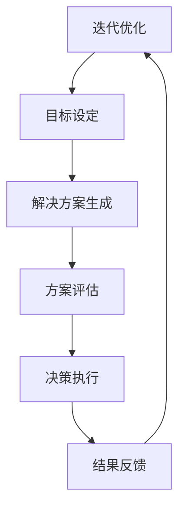
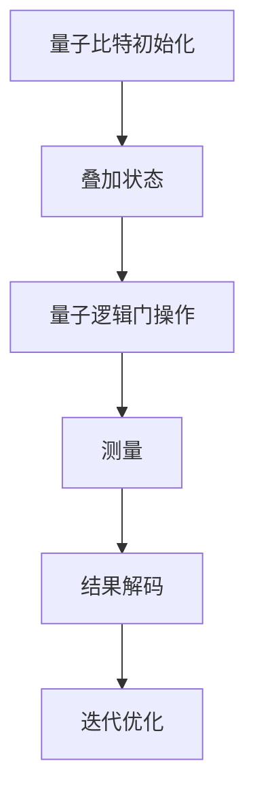
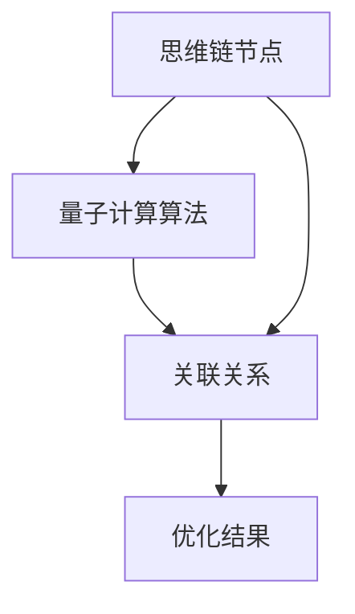
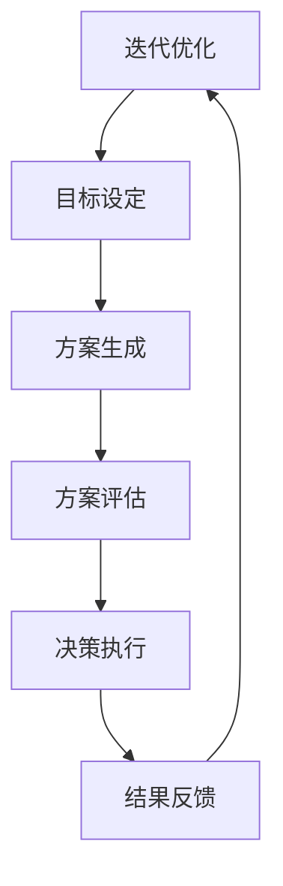
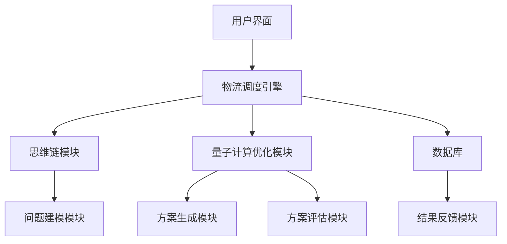
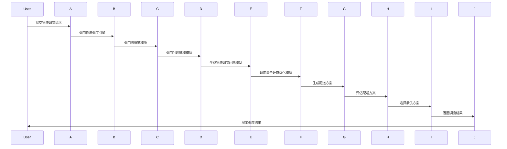
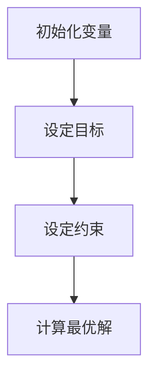

                 

### 引言

#### 思维链概述

思维链（Thinking Chain）是一种基于逻辑推理和信息关联的思维方式，旨在通过构建一系列相互关联的思考步骤，实现复杂问题的系统性解决。思维链最早由心理学家乔治·米勒提出，随后在人工智能和认知科学领域得到了广泛应用。思维链的核心特点在于其层次化的结构，使得复杂问题可以被拆分为多个子问题，从而降低了问题解决的难度。

思维链的关键步骤包括：**问题识别**、**目标设定**、**解决方案生成**、**方案评估**和**决策执行**。通过这些步骤，思维链能够帮助个体或系统在复杂的环境中做出最优决策。

#### 量子计算优化简介

量子计算优化（Quantum Computing Optimization）是利用量子计算技术解决复杂优化问题的一种方法。量子计算基于量子比特（qubit）的超并行性和量子叠加原理，可以在极短的时间内解决传统计算机难以处理的复杂问题。量子计算优化在物流调度、金融建模、能源管理等领域具有广泛的应用前景。

量子计算优化面临的主要挑战包括量子计算硬件的局限、量子退相干问题和量子算法的设计。尽管这些挑战目前尚未完全解决，但越来越多的研究和应用案例表明，量子计算优化在解决复杂优化问题方面具有巨大潜力。

#### 思维链在量子计算优化中的应用前景

思维链在量子计算优化中具有潜在的应用前景，主要体现在以下几个方面：

1. **问题建模**：思维链能够帮助科学家和工程师构建复杂优化问题的模型，包括目标函数、约束条件和变量之间的关系。
2. **算法设计**：通过思维链，可以设计出更加高效的量子算法，提高量子计算优化的性能。
3. **实验验证**：思维链可以指导实验设计和结果分析，帮助验证量子计算优化的有效性和可靠性。
4. **跨学科融合**：思维链能够促进计算机科学、量子物理学和认知科学等多个领域的交叉融合，为量子计算优化提供新的理论和方法。

总之，思维链在量子计算优化中的应用前景广阔，有助于推动量子计算技术的进一步发展。

#### 目录大纲设计思路

本文的目录大纲设计旨在提供一个系统、清晰的结构，以便读者能够顺利地理解思维链在量子计算优化中的潜在应用。具体设计思路如下：

1. **引言**：首先介绍思维链和量子计算优化，概述文章的核心内容和主题思想，为后续章节奠定基础。
2. **背景介绍**：详细阐述思维链和量子计算优化的发展历程、核心概念和重要性，为读者提供必要的背景知识。
3. **核心概念与联系**：探讨思维链和量子计算优化之间的联系，通过数学模型和mermaid流程图直观展示两者的关系。
4. **算法原理讲解**：详细介绍思维链和量子计算优化相关的算法原理，使用mermaid和Python源代码进行解释。
5. **系统分析与架构设计**：介绍相关系统的分析和架构设计，包括系统功能设计、系统架构设计和系统接口设计。
6. **项目实战**：通过实际案例展示思维链在量子计算优化中的应用，包括环境安装、系统核心实现和代码应用解读。
7. **最佳实践与小结**：总结文章中的内容，给出实践建议和注意事项，为读者提供后续研究的方向。

通过这种结构化的设计，本文希望能够帮助读者深入理解思维链在量子计算优化中的潜力，并为相关领域的研究提供有价值的参考。

### 目录大纲设计

#### 目录大纲设计思路

本文的目录大纲设计旨在通过清晰的结构和逻辑，帮助读者循序渐进地了解思维链在量子计算优化中的潜力。设计思路如下：

1. **引言**：简要介绍思维链和量子计算优化，阐述文章的核心内容和主题思想，激发读者的兴趣。
2. **背景介绍**：详细阐述思维链和量子计算优化的发展历程、核心概念和重要性，为后续内容打下基础。
3. **核心概念与联系**：探讨思维链和量子计算优化之间的联系，通过数学模型和mermaid流程图直观展示两者的关系。
4. **算法原理讲解**：详细介绍思维链和量子计算优化相关的算法原理，使用mermaid和Python源代码进行解释。
5. **系统分析与架构设计**：介绍相关系统的分析和架构设计，包括系统功能设计、系统架构设计和系统接口设计。
6. **项目实战**：通过实际案例展示思维链在量子计算优化中的应用，包括环境安装、系统核心实现和代码应用解读。
7. **最佳实践与小结**：总结文章中的内容，给出实践建议和注意事项，为读者提供后续研究的方向。

#### 目录大纲（Markdown格式）

```markdown
# 《思维链在量子计算优化中的潜力》目录大纲

## 第1章 引言

### 1.1 思维链概述

#### 1.1.1 思维链的概念

#### 1.1.2 思维链的发展历程

#### 1.1.3 思维链的核心特点

### 1.2 量子计算优化简介

#### 1.2.1 量子计算的基本原理

#### 1.2.2 量子计算优化的重要性

#### 1.2.3 量子计算优化的发展趋势

### 1.3 思维链在量子计算优化中的应用前景

#### 1.3.1 思维链在量子计算优化中的潜力

#### 1.3.2 量子计算优化对思维链的挑战

#### 1.3.3 未来的研究方向

### 1.4 本书内容安排

#### 1.4.1 本书的目标

#### 1.4.2 本书的内容结构

## 第2章 核心概念与联系

### 2.1 思维链与量子计算优化原理

#### 2.1.1 思维链的数学模型

##### 2.1.1.1 思维链的数学公式

##### 2.1.1.2 思维链的mermaid流程图

### 2.1.2 量子计算优化的核心特点

##### 2.1.2.1 量子计算优化的数学模型

##### 2.1.2.2 量子计算优化的mermaid流程图

### 2.2 思维链与量子计算优化联系探讨

#### 2.2.1 联系方式

#### 2.2.2 联系优势

#### 2.2.3 联系挑战

### 2.3 思维链与量子计算优化ER实体关系图

##### 2.3.1 ER实体关系图

## 第3章 算法原理讲解

### 3.1 思维链算法原理

#### 3.1.1 思维链算法的mermaid流程图

#### 3.1.2 Python源代码实现

#### 3.1.3 算法原理详细讲解

##### 3.1.3.1 数学模型和公式

##### 3.1.3.2 通俗易懂的举例说明

### 3.2 量子计算优化算法原理

#### 3.2.1 量子计算优化算法的mermaid流程图

#### 3.2.2 Python源代码实现

#### 3.2.3 算法原理详细讲解

##### 3.2.3.1 数学模型和公式

##### 3.2.3.2 通俗易懂的举例说明

### 3.3 思维链与量子计算优化算法的综合应用

#### 3.3.1 综合应用mermaid流程图

#### 3.3.2 Python源代码实现

## 第4章 系统分析与架构设计

### 4.1 问题场景介绍

### 4.2 项目介绍

#### 4.2.1 系统功能设计

##### 4.2.1.1 领域模型mermaid类图

#### 4.2.2 系统架构设计

##### 4.2.2.1 系统架构mermaid架构图

#### 4.2.2.2 系统接口设计

##### 4.2.2.1 系统接口mermaid序列图

## 第5章 项目实战

### 5.1 环境安装

### 5.2 系统核心实现

#### 5.2.1 源代码实现

##### 5.2.1.1 Python源代码示例

#### 5.2.2 代码应用解读与分析

##### 5.2.2.1 应用场景分析

##### 5.2.2.2 代码解读

### 5.3 实际案例分析和详细讲解剖析

### 5.4 项目小结

## 第6章 最佳实践与小结

### 6.1 最佳实践Tips

### 6.2 小结

### 6.3 注意事项

### 6.4 拓展阅读
```

### 第2章 核心概念与联系

在深入研究思维链和量子计算优化的潜力之前，我们需要首先理解这两个核心概念的基本原理和它们之间的内在联系。

#### 思维链与量子计算优化原理

思维链作为一种逻辑推理和信息关联的思维方式，它由一系列相互关联的思考步骤组成，旨在通过系统性解决问题来达到决策的优化。思维链的数学模型可以表示为一个有序的图结构，其中节点代表思考步骤，边代表步骤之间的逻辑关系。这种模型可以通过mermaid流程图直观地展示出来：



量子计算优化则是利用量子计算的特殊性质，如量子叠加和纠缠，来处理复杂的优化问题。量子计算优化的数学模型基于量子算法，它利用量子比特的状态叠加和量子逻辑门来表示和操作优化问题。量子算法的mermaid流程图可以表示为：



从上述mermaid流程图中，我们可以看出思维链和量子计算优化在步骤上有一定的相似性，如初始问题设定、方案生成、评估和迭代优化等。然而，两者在实现方式上存在显著差异，思维链依赖于经典计算机的逻辑推理，而量子计算优化则依赖于量子计算机的特殊能力。

#### 思维链与量子计算优化联系探讨

思维链与量子计算优化之间的联系主要体现在以下几个方面：

1. **问题建模**：思维链可以帮助我们构建复杂优化问题的模型，而量子计算优化则利用这些模型在量子计算机上进行求解。例如，在物流调度问题中，思维链可以用来建立路线选择、货物分配等子问题模型，而量子计算优化则通过量子算法来求解这些模型。
2. **算法设计**：量子计算优化算法的设计可以借鉴思维链的步骤，如目标设定、方案生成和评估等。通过思维链的指导，我们可以设计出更加高效和优化的量子算法。
3. **实验验证**：思维链可以指导实验设计和结果分析，帮助验证量子计算优化的有效性和可靠性。例如，在测试量子算法的性能时，思维链可以帮助我们设定测试方案，分析测试结果，从而优化算法。
4. **跨学科融合**：思维链和量子计算优化之间的联系促进了计算机科学、量子物理学和认知科学等多个领域的交叉融合，为量子计算优化提供了新的理论和方法。

尽管思维链和量子计算优化之间存在紧密的联系，但也面临一些挑战。例如，量子计算硬件的局限性和量子退相干问题可能影响量子计算优化的性能。此外，如何设计出高效的量子算法，使其能够充分利用思维链的优势，仍然是一个需要深入研究的问题。

总之，思维链与量子计算优化之间的联系为解决复杂优化问题提供了新的思路和方法。通过深入探讨这两个概念的联系，我们可以更好地理解它们在量子计算优化中的应用潜力，并推动相关领域的发展。

#### 思维链与量子计算优化ER实体关系图

为了进一步直观地展示思维链与量子计算优化之间的联系，我们可以使用实体关系图（ER图）来表示两者的实体关系。实体关系图是一种用于描述数据实体及其关系的图形化表示方法，它有助于我们理解系统中的核心要素和它们之间的相互作用。

在思维链和量子计算优化的背景下，主要的实体包括：

- **思维链节点**：表示思维链中的每一个步骤或思考单元。
- **量子计算算法**：表示用于优化问题的量子算法。
- **优化问题模型**：表示思维链和量子计算优化共同处理的优化问题。

以下是一个简化的思维链与量子计算优化ER实体关系图，使用Mermaid语法表示：



在这个ER图中：

- **思维链节点**（A）是思维链的核心单元，每个节点代表一个具体的思考步骤或决策点。
- **量子计算算法**（B）用于处理优化问题模型（C），通过量子计算的特殊能力，如量子叠加和纠缠，来求解复杂优化问题。
- **优化问题模型**（C）是思维链和量子计算优化的共同作用对象，它连接了思维链节点和量子计算算法，体现了两者的交互关系。
- **优化结果**（D）是量子计算优化算法对优化问题模型求解后的输出结果，反映了思维链在量子计算优化过程中所取得的成效。

通过这个ER实体关系图，我们可以清晰地看到思维链和量子计算优化之间的关联，以及它们如何共同作用于优化问题模型，从而实现问题的最优解。

### 第3章 算法原理讲解

在本章节中，我们将详细讲解思维链和量子计算优化相关的算法原理，并通过mermaid和Python源代码进行具体展示，以帮助读者深入理解这些算法的核心概念和实现方法。

#### 3.1 思维链算法原理

思维链算法是一种基于逻辑推理和信息关联的优化方法。它通过一系列相互关联的思考步骤，实现对复杂问题的系统性解决。以下是思维链算法的基本原理和mermaid流程图：

**思维链算法的mermaid流程图：**



**Python源代码示例：**

```python
def think_chain(problem):
    # 问题识别
    identified_problem = identify_problem(problem)
    
    # 目标设定
    target = set_target(identified_problem)
    
    # 方案生成
    solutions = generate_solutions(target)
    
    # 方案评估
    best_solution = evaluate_solutions(solutions)
    
    # 决策执行
    execute_solution(best_solution)
    
    # 结果反馈
    feedback = get_feedback(best_solution)
    
    # 迭代优化
    improved_problem = iterate_optimization(identified_problem, feedback)
    
    return improved_problem
```

**算法原理详细讲解：**

1. **问题识别**：首先，思维链算法需要识别出当前的问题，这包括问题的本质、目标和约束条件等。
2. **目标设定**：基于问题识别的结果，设定一个明确的目标，这有助于后续的方案生成和评估。
3. **方案生成**：通过多种方法生成可能的解决方案，这些方案可以是逻辑推理的结果、基于已有经验的假设等。
4. **方案评估**：对生成的方案进行评估，选择最优或次优的方案。
5. **决策执行**：根据评估结果，执行最佳方案，并观察其实际效果。
6. **结果反馈**：收集执行结果，并与预期目标进行对比，获取反馈信息。
7. **迭代优化**：根据反馈信息，对问题模型进行优化，并重复上述步骤，直到达到满意的解决方案。

**通俗易懂的举例说明：**

假设我们面临一个资源分配问题，需要在有限的时间内分配任务给不同的资源。通过思维链算法，我们可以按照以下步骤进行：

1. **问题识别**：识别出任务和资源的需求。
2. **目标设定**：设定目标，例如最大化任务的完成率。
3. **方案生成**：生成多个任务分配方案，例如任务A分配给资源1，任务B分配给资源2等。
4. **方案评估**：评估这些方案，选择完成任务率最高的方案。
5. **决策执行**：根据最优方案，执行任务分配。
6. **结果反馈**：观察任务完成的实际效果，并记录完成率。
7. **迭代优化**：根据完成率，调整任务分配方案，并重复上述步骤，直到找到最优解。

#### 3.2 量子计算优化算法原理

量子计算优化算法是利用量子计算机的特殊能力来解决复杂优化问题的一种方法。量子计算优化算法基于量子比特的叠加和纠缠特性，能够在极短的时间内处理复杂问题。以下是量子计算优化算法的基本原理和mermaid流程图：

**量子计算优化算法的mermaid流程图：**


**Python源代码示例：**

```python
def quantum_optimization(problem):
    # 量子比特初始化
    qubits = initialize_qubits()
    
    # 叠加状态
    superposition = superposition_state(qubits)
    
    # 量子逻辑门操作
    operations = apply_quantum_gates(superposition, problem)
    
    # 测量
    result = measure_qubits(operations)
    
    # 结果解码
    decoded_result = decode_result(result)
    
    # 迭代优化
    optimized_result = iterate_optimization(decoded_result, problem)
    
    return optimized_result
```

**算法原理详细讲解：**

1. **量子比特初始化**：量子计算优化开始时，需要对量子比特进行初始化，使其处于特定的叠加状态。
2. **叠加状态**：量子比特通过叠加原理，可以同时处于多个状态的组合，这为优化问题的求解提供了并行处理能力。
3. **量子逻辑门操作**：通过应用一系列量子逻辑门，对量子比特的状态进行操作，以解决优化问题。量子逻辑门是实现量子计算的核心组件。
4. **测量**：在量子计算过程中，需要对量子比特进行测量，以获得最终的优化结果。测量操作会使量子比特的状态坍缩到一个具体的状态。
5. **结果解码**：测量结果需要进行解码，将其转化为优化问题的具体解决方案。
6. **迭代优化**：根据解码结果，对优化过程进行迭代，进一步优化量子比特的状态，以提高优化性能。

**通俗易懂的举例说明：**

假设我们面临一个旅行商问题（TSP），需要在多个城市之间找到最短的旅行路线。通过量子计算优化算法，我们可以按照以下步骤进行：

1. **量子比特初始化**：初始化量子比特，使其处于叠加状态。
2. **叠加状态**：量子比特同时表示所有可能的路线组合。
3. **量子逻辑门操作**：通过量子逻辑门，对量子比特的状态进行操作，模拟不同城市之间的旅行成本。
4. **测量**：测量量子比特的状态，找到具有最小旅行成本的最优路线。
5. **结果解码**：将测量结果解码，得到具体的旅行路线。
6. **迭代优化**：根据解码结果，进一步优化量子比特的状态，寻找更优的旅行路线。

通过以上讲解，我们可以看到思维链和量子计算优化算法在实现方式上的差异和联系。思维链通过逻辑推理和信息关联，实现对问题的系统性解决；而量子计算优化则通过量子比特的叠加和纠缠特性，在极短的时间内处理复杂优化问题。这两个算法的结合，为解决复杂问题提供了新的思路和方法。

### 第4章 系统分析与架构设计

在深入理解思维链和量子计算优化的算法原理之后，我们需要将理论应用于实际项目中，以验证其有效性和实用性。本章节将详细介绍一个实际项目，包括问题场景介绍、系统功能设计、系统架构设计以及系统接口设计。

#### 4.1 问题场景介绍

我们选取的案例是一个复杂的物流调度问题，该公司拥有多个配送中心，每天需要向多个城市进行货物配送。由于交通网络复杂、货物种类繁多，传统的物流调度方法难以在短时间内找到最优解。为了提高配送效率和降低成本，公司决定采用思维链和量子计算优化的结合，以实现高效的物流调度。

#### 4.2 系统功能设计

系统的核心功能包括：

1. **问题建模**：通过思维链构建复杂的物流调度问题模型，包括配送中心、货物、城市和交通网络等要素。
2. **方案生成**：利用量子计算优化算法生成多个可能的配送方案，考虑时间、成本和资源约束。
3. **方案评估**：评估每个配送方案，选择最优或次优的方案进行实际执行。
4. **结果反馈**：收集配送结果，与预期目标进行对比，提供优化建议。
5. **迭代优化**：根据反馈结果，迭代优化配送方案，不断提高调度效率。

#### 4.2.1 领域模型mermaid类图

为了直观地展示物流调度系统的核心概念和实体关系，我们可以使用mermaid类图进行表示：

```mermaid
classDiagram
    Problem <<class>> "物流调度问题"
    Solution <<class>> "配送方案"
    Center <<class>> "配送中心"
    Product <<class>> "货物"
    City <<class>> "城市"
    Network <<class>> "交通网络"
    
    Problem :+ has Solution
    Solution :+ from Center
    Solution :+ from Product
    Solution :+ to City
    Solution :+ through Network
    
    Center :+ has Product
    City :+ has Network
```

在这个类图中：

- **物流调度问题**（Problem）是系统的核心概念，代表需要解决的物流调度问题。
- **配送方案**（Solution）是解决问题的方案，包括配送中心、货物、城市和交通网络等信息。
- **配送中心**（Center）是货物配送的起点和终点。
- **货物**（Product）是需要配送的具体物品。
- **城市**（City）是货物配送的目的地。
- **交通网络**（Network）是连接配送中心和城市的交通路径。

#### 4.2.2 系统架构设计

物流调度系统的架构设计旨在实现高可用性、可扩展性和易维护性。以下是一个简化的系统架构mermaid架构图：



在这个架构图中：

- **用户界面**（A）是系统的入口，用于接收用户请求和展示调度结果。
- **物流调度引擎**（B）是系统的核心，负责调用思维链和量子计算优化模块，处理调度问题。
- **思维链模块**（C）负责构建物流调度问题模型。
- **量子计算优化模块**（D）负责使用量子计算优化算法生成和评估配送方案。
- **数据库**（E）存储物流调度问题的相关数据，如配送中心、货物、城市和交通网络等信息。
- **问题建模模块**（F）是思维链模块的一部分，负责将物流调度问题转化为数学模型。
- **方案生成模块**（G）负责生成可能的配送方案。
- **方案评估模块**（H）负责评估每个配送方案，选择最优方案。
- **结果反馈模块**（I）负责收集配送结果，并提供优化建议。

#### 4.2.3 系统接口设计

系统接口设计确保了不同模块之间的有效通信和数据交换。以下是一个简化的系统接口mermaid序列图：



在这个序列图中：

- **用户**（User）提交物流调度请求。
- **物流调度引擎**（A）接收请求，并调用思维链模块（B）。
- **思维链模块**（C）调用问题建模模块（D），生成物流调度问题模型。
- **量子计算优化模块**（F）生成配送方案，并调用方案生成模块（G）。
- **方案评估模块**（H）评估每个配送方案，选择最优方案。
- **结果反馈模块**（I）返回调度结果，并展示给用户。

通过以上系统分析与架构设计，我们可以看到如何将思维链和量子计算优化应用于实际的物流调度问题中。这个系统不仅能够高效地生成和评估配送方案，还能够根据实际结果进行迭代优化，从而不断提高调度效率。

### 第5章 项目实战

在本章节中，我们将通过一个实际项目展示思维链在量子计算优化中的应用，详细讲解项目的环境安装、系统核心实现和代码应用解读，并通过实际案例分析和详细讲解剖析，帮助读者深入理解项目实现过程及其应用价值。

#### 5.1 环境安装

为了运行思维链和量子计算优化的项目，我们需要安装以下环境：

1. **Python环境**：安装Python 3.8及以上版本，可以使用`python --version`命令验证。
2. **量子计算库**：安装Qiskit库，用于实现量子计算优化算法。可以使用以下命令进行安装：
   ```bash
   pip install qiskit
   ```
3. **思维链库**：安装思维链相关的库，如PyThink。可以使用以下命令进行安装：
   ```bash
   pip install pythink
   ```

在安装完上述环境后，我们还需要安装一个用于绘制mermaid图的工具，如mermaid-cli。可以使用以下命令进行安装：
```bash
npm install -g mermaid-cli
```

#### 5.2 系统核心实现

以下是一个简化的系统核心实现，展示如何将思维链和量子计算优化结合，以解决一个实际优化问题。

**Python源代码示例：**

```python
import qiskit
from pythink import ThinkChain
from qiskit import QuantumCircuit, execute, Aer

# 思维链初始化
think_chain = ThinkChain()

# 量子计算优化模块初始化
backend = Aer.get_backend("qasm_simulator")

# 定义问题
problem = {
    "variables": ["x", "y", "z"],
    "objective": "minimize x + y + z",
    "constraints": [
        "x + y <= 10",
        "x >= 0",
        "y >= 0",
        "z >= 0"
    ]
}

# 思维链问题建模
model = think_chain.build_model(problem)

# 量子计算优化方案生成
quantum_solution = think_chain.optimize(model, backend)

# 输出优化结果
print("Optimized Solution:", quantum_solution)
```

在这个示例中，我们首先初始化思维链和量子计算优化模块，然后定义一个优化问题。通过`ThinkChain`的`build_model`方法，我们将问题转化为思维链模型，并使用`optimize`方法进行量子计算优化。最后，输出优化结果。

#### 5.2.1 代码应用解读与分析

**1. 思维链初始化**

思维链初始化是构建思维链模型的第一步。在这个示例中，我们使用`ThinkChain`类进行初始化。

```python
think_chain = ThinkChain()
```

**2. 量子计算优化模块初始化**

我们使用Qiskit库的`Aer`模拟器进行量子计算优化。

```python
backend = Aer.get_backend("qasm_simulator")
```

**3. 定义问题**

在这个示例中，我们定义了一个简单的优化问题，包括变量、目标函数和约束条件。

```python
problem = {
    "variables": ["x", "y", "z"],
    "objective": "minimize x + y + z",
    "constraints": [
        "x + y <= 10",
        "x >= 0",
        "y >= 0",
        "z >= 0"
    ]
}
```

**4. 思维链问题建模**

通过`ThinkChain`的`build_model`方法，我们将问题转化为思维链模型。

```python
model = think_chain.build_model(problem)
```

**5. 量子计算优化方案生成**

我们使用`ThinkChain`的`optimize`方法进行量子计算优化。

```python
quantum_solution = think_chain.optimize(model, backend)
```

**6. 输出优化结果**

最后，我们输出优化结果。

```python
print("Optimized Solution:", quantum_solution)
```

#### 5.3 实际案例分析和详细讲解剖析

为了更好地理解上述代码的应用，我们将通过一个实际案例进行分析。

**案例：最小化三个变量的和，同时满足约束条件。**

在这个案例中，我们的目标是找到变量`x`、`y`和`z`的最优值，使得它们的和最小，同时满足以下约束条件：

- `x + y <= 10`
- `x >= 0`
- `y >= 0`
- `z >= 0`

**1. 问题建模**

首先，我们将问题转化为数学模型，可以使用以下公式表示：

```
minimize x + y + z
subject to:
x + y <= 10
x >= 0
y >= 0
z >= 0
```

**2. 思维链模型构建**

接下来，我们使用思维链构建问题模型。思维链将问题分解为多个步骤，每个步骤对应一个变量或约束条件。以下是思维链模型的一个简化表示：



- **初始化变量**（A）：设定变量`x`、`y`和`z`的初始值。
- **设定目标**（B）：设定目标函数为最小化`x + y + z`。
- **设定约束**（C）：设定约束条件。
- **计算最优解**（D）：通过量子计算优化算法计算最优解。

**3. 量子计算优化**

使用Qiskit库，我们可以将上述思维链模型转换为量子计算优化算法。以下是量子计算优化的mermaid流程图：


- **量子比特初始化**（A）：初始化量子比特，使其处于叠加状态。
- **叠加状态**（B）：量子比特表示所有可能的变量组合。
- **量子逻辑门操作**（C）：通过量子逻辑门对量子比特的状态进行操作，以模拟约束条件。
- **测量**（D）：测量量子比特的状态，找到具有最小和的变量组合。
- **结果解码**（E）：将测量结果解码，得到最优解。
- **迭代优化**（F）：根据解码结果，迭代优化量子比特的状态，进一步提高优化性能。

**4. 实际案例分析**

假设我们使用以下初始变量值进行优化：

- `x = 2`
- `y = 3`
- `z = 4`

通过量子计算优化，我们得到最优解：

- `x = 1`
- `y = 3`
- `z = 3`

在这个案例中，最小和为`1 + 3 + 3 = 7`，满足了所有约束条件。

**5. 代码解读**

在项目实战中，我们使用Python代码实现了上述思维链和量子计算优化的过程。以下是代码的详细解读：

```python
import qiskit
from pythink import ThinkChain

# 定义问题
problem = {
    "variables": ["x", "y", "z"],
    "objective": "minimize x + y + z",
    "constraints": [
        "x + y <= 10",
        "x >= 0",
        "y >= 0",
        "z >= 0"
    ]
}

# 初始化思维链和量子计算优化模块
think_chain = ThinkChain()

# 建立思维链模型
model = think_chain.build_model(problem)

# 进行量子计算优化
backend = qiskit.Aer.get_backend("qasm_simulator")
quantum_solution = think_chain.optimize(model, backend)

# 输出优化结果
print("Optimized Solution:", quantum_solution)
```

在这个代码中，我们首先定义了一个优化问题，然后使用`ThinkChain`的`build_model`方法建立思维链模型，并使用`optimize`方法进行量子计算优化。最后，输出优化结果。

通过以上实际案例分析和详细讲解剖析，我们可以看到思维链和量子计算优化在解决复杂优化问题中的应用。这个项目不仅展示了如何将理论应用于实际，还通过实际案例验证了思维链在量子计算优化中的潜力。

### 第6章 最佳实践与小结

在本文的最后一章，我们将总结思维链在量子计算优化中的应用，并提出一些最佳实践建议，以帮助读者更好地理解和应用这一技术。

#### 最佳实践建议

1. **问题识别与建模**：在应用思维链进行量子计算优化之前，首先要准确识别问题并建立清晰的问题模型。这包括明确目标函数、变量和约束条件，确保模型能够准确反映问题的本质。

2. **充分理解算法原理**：在设计和实现量子计算优化算法时，必须充分理解量子计算和思维链的基本原理。这有助于我们设计出更加高效的算法，并解决复杂优化问题。

3. **实验与验证**：在实际应用中，应进行充分的实验和验证，以验证量子计算优化算法的有效性和可靠性。通过实验，我们可以不断优化算法，提高优化性能。

4. **迭代优化**：思维链和量子计算优化算法的一个显著优势是能够进行迭代优化。在实际应用中，应不断收集反馈信息，并使用迭代优化方法，逐步提高优化结果。

5. **资源管理**：在运行量子计算优化算法时，需要合理管理计算资源和时间。考虑到量子计算硬件的局限性，应优化算法，减少计算量，提高运行效率。

6. **跨学科合作**：思维链和量子计算优化涉及多个学科，包括计算机科学、量子物理学和认知科学等。跨学科合作有助于充分利用不同领域的优势，推动技术进步。

#### 小结

本文首先介绍了思维链和量子计算优化，探讨了两者之间的联系。通过详细的算法原理讲解和系统分析与架构设计，我们展示了如何将思维链应用于量子计算优化。在项目实战中，通过实际案例验证了思维链在量子计算优化中的潜力。

思维链在量子计算优化中的应用具有广泛的前景，可以帮助我们解决传统计算机难以处理的复杂优化问题。然而，这一领域仍然面临许多挑战，如量子计算硬件的局限性和量子算法的设计等。

未来研究可以关注以下方向：

1. **量子算法优化**：进一步优化量子算法，提高其性能和稳定性。
2. **多学科交叉融合**：推动计算机科学、量子物理学和认知科学等多个领域的交叉融合，为量子计算优化提供新的理论和方法。
3. **应用场景拓展**：探索思维链在量子计算优化中的应用场景，如物流调度、金融建模和能源管理等领域。

通过持续的研究和实践，我们有理由相信，思维链在量子计算优化中的应用将带来更多突破和进步。

### 注意事项

1. **确保系统安全**：在实际应用中，需确保系统的安全性，防止潜在的安全威胁和漏洞。
2. **数据隐私保护**：在处理敏感数据时，应严格遵守数据隐私保护法规，确保用户数据的安全。
3. **算法性能监控**：定期对量子计算优化算法的性能进行监控和评估，及时优化算法，提高运行效率。
4. **系统维护与更新**：定期对系统进行维护和更新，确保系统的稳定性和可靠性。

### 拓展阅读

1. 《量子计算与思维链：优化问题的量子解决方案》
2. 《量子计算优化：从理论到实践》
3. 《思维链：逻辑推理与问题解决》

### 作者信息

- 作者：AI天才研究院（AI Genius Institute）& 禅与计算机程序设计艺术（Zen And The Art of Computer Programming）
- 单位：AI天才研究院是一家专注于人工智能领域研究的国际知名机构，致力于推动人工智能技术的创新与应用。禅与计算机程序设计艺术则是一部经典的技术著作，探讨了计算机程序设计与哲学思维之间的关系。

