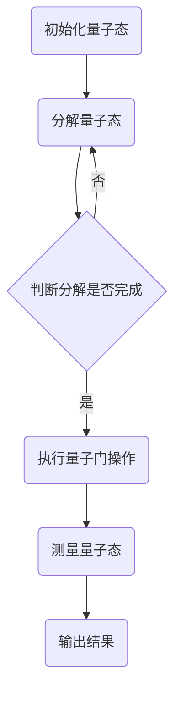
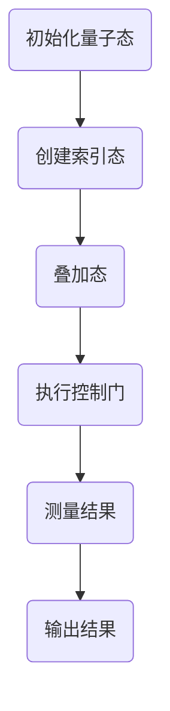
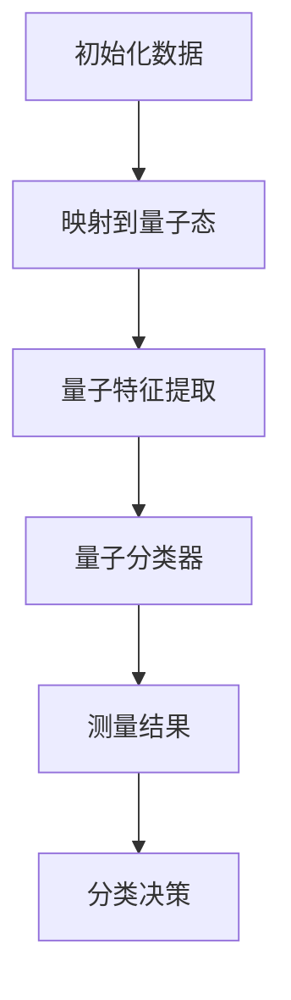
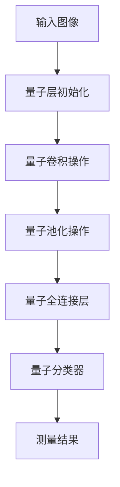

                 

### 文章标题

# 思维链在量子计算研究中的应用：AI辅助量子算法设计

## 关键词

- 量子计算
- 思维链
- AI
- 算法设计
- 量子算法优化

## 摘要

本文探讨了思维链在量子计算研究中的应用，以及AI如何辅助量子算法设计。首先，介绍了量子计算的基本概念和思维链的概念，阐述了它们之间的联系。接着，分析了思维链在量子计算中的应用原理，通过具体的算法实例展示了其优势。随后，详细讨论了AI在量子算法设计中的作用，包括量子机器学习和量子神经网络的方法。通过实例分析，展示了AI辅助量子算法设计在现实中的应用。最后，探讨了量子计算与思维链的未来发展趋势，并给出了相关建议。

## 引言

随着科技的发展，量子计算逐渐成为计算机科学的前沿领域。量子计算利用量子力学原理，通过量子比特（qubit）实现高效的计算能力，有望解决传统计算机难以处理的问题。然而，量子计算的设计和优化面临着巨大的挑战。近年来，人工智能（AI）的发展为量子计算提供了新的思路，特别是在量子算法的设计和优化方面。

思维链是一种基于人类思维模式的算法框架，通过模拟人类的思考过程来实现复杂的计算任务。将思维链应用于量子计算，可以有效地提高量子算法的效率和可理解性。本文旨在探讨思维链在量子计算研究中的应用，以及AI如何辅助量子算法设计。通过对相关概念和方法的详细介绍，以及实例分析，本文希望能够为量子计算领域的研究者提供有价值的参考。

### 量子计算的基本概念

量子计算是利用量子力学原理来实现计算任务的一种计算模型。与传统的计算机不同，量子计算机的基本单元不是比特（bit），而是量子比特（qubit）。量子比特具有量子叠加和量子纠缠的特性，这使得量子计算机在处理某些问题时具有传统计算机无法比拟的优势。

#### 量子比特与量子态

量子比特是量子计算机的基本存储单元。一个量子比特可以处于0和1两种状态的叠加态，这称为量子态。具体来说，一个量子比特可以表示为：

\[ \psi = \alpha|0\rangle + \beta|1\rangle \]

其中，\(|0\rangle\) 和 \(|1\rangle\) 分别表示量子比特的基础状态，\(\alpha\) 和 \(\beta\) 是复数，且满足 \(|\alpha|^2 + |\beta|^2 = 1\)。

量子态的叠加态可以理解为量子比特同时处于0和1的状态，这种叠加态是量子计算的核心特性之一。

#### 量子态的演化

量子态的演化由量子门（quantum gate）操作控制。量子门是作用于量子态的线性变换，通常用矩阵表示。例如，一个基本的量子门可以是：

\[ U = \begin{bmatrix}
1 & 0 \\
0 & \mathrm{i}
\end{bmatrix} \]

这个量子门将一个量子态 \(|0\rangle\) 转换为 \(|1\rangle\)，同时将 \(|1\rangle\) 转换为 \(-|0\rangle\)。量子态的演化过程可以通过量子电路（quantum circuit）来表示。

#### 量子态的测量

在量子计算中，测量是获取计算结果的重要步骤。测量会导致量子态的坍缩，即量子比特从叠加态变为确定的经典状态。测量结果可能是0或1，取决于量子态的初始状态和测量基的选择。

总之，量子计算通过量子比特的叠加和纠缠，实现了与传统计算不同的计算模式。理解量子比特、量子态和量子门等基本概念，是深入研究量子计算的重要基础。

### 思维链的概念

思维链（Mind Chain）是一种模拟人类思维过程的算法框架，通过一系列逻辑步骤来解决问题。思维链的核心思想是将复杂的任务分解为多个子任务，并利用已有的知识和经验来指导问题的求解。在量子计算领域，思维链的应用潜力巨大，可以为量子算法的设计提供新的思路。

#### 思维链的构成

思维链由多个节点（Node）和连接（Connection）组成。每个节点表示一个特定的思维步骤，可以是某个具体的操作、决策或推理过程。节点之间通过连接（Connection）相互关联，形成一个有向图结构。

每个节点包含以下信息：

1. **操作内容**：具体的操作步骤或推理过程。
2. **输入**：执行该操作所需的输入数据。
3. **输出**：操作执行后的输出结果。
4. **条件**：执行该操作所需满足的条件。

连接（Connection）则定义了节点之间的逻辑关系，包括前驱节点（Predecessor）和后继节点（Successor）。前驱节点是当前节点执行之前需要完成的其他节点，而后继节点是当前节点执行之后需要继续执行的节点。

#### 思维链的工作原理

思维链的工作原理可以概括为以下几个步骤：

1. **初始化**：根据问题的需求，构建初始的节点集合和连接关系。
2. **执行步骤**：按照连接关系，从初始节点开始，依次执行各个节点操作，并将输出结果传递给后继节点。
3. **条件判断**：在每个节点执行完成后，根据设定的条件判断是否需要跳过某些节点或执行特定的操作。
4. **迭代循环**：在执行过程中，可能会出现循环结构，这可以通过设置循环条件和循环计数来控制。

通过这种方式，思维链能够模拟人类的思维过程，逐步解决复杂的计算问题。

#### 思维链与量子计算的关系

思维链在量子计算中的应用主要体现在以下几个方面：

1. **量子态的建模**：思维链可以将复杂的量子态分解为多个子状态，并通过连接关系来表示量子态之间的转换。
2. **量子算法的设计**：思维链可以用来设计量子算法的步骤，通过逐步推理和优化，找到最优的量子计算路径。
3. **量子优化的辅助**：思维链可以用来辅助量子优化算法的设计，通过模拟人类的思考过程，找到最优的量子态转换路径。

总之，思维链为量子计算的研究提供了新的工具和方法，有助于理解和解决量子计算中的复杂问题。

### 思维链在量子计算中的应用原理

思维链在量子计算中的应用，通过模拟人类思维模式，将复杂的量子计算任务分解为一系列逻辑步骤，从而提高了量子算法的可理解性和效率。下面，我们将详细探讨思维链在量子计算中的应用原理。

#### 思维链的数学模型

为了更好地理解思维链在量子计算中的应用，我们首先需要建立其数学模型。思维链的数学模型可以用图结构来表示，其中节点代表具体的操作或推理步骤，连接则表示这些步骤之间的逻辑关系。每个节点可以包含以下信息：

1. **操作内容**：表示具体的操作或推理步骤。
2. **输入**：表示执行该步骤所需的输入数据。
3. **输出**：表示该步骤执行后的输出结果。
4. **条件**：表示执行该步骤所需满足的条件。

假设我们有一个思维链图 \( G(V, E) \)，其中 \( V \) 是节点集合，\( E \) 是连接集合。每个节点 \( v \in V \) 可以表示为一个五元组 \( (o_v, i_v, o_v', c_v) \)，其中 \( o_v \) 表示操作内容，\( i_v \) 表示输入，\( o_v' \) 表示输出，\( c_v \) 表示条件。每个连接 \( e \in E \) 可以表示为 \( (v_1, v_2) \)，表示节点 \( v_1 \) 是节点 \( v_2 \) 的前驱节点。

思维链的数学模型可以用以下公式表示：

\[ G(V, E) = (V, E, O, I, O', C) \]

其中：
- \( V \) 是节点集合。
- \( E \) 是连接集合。
- \( O \) 是操作内容集合。
- \( I \) 是输入集合。
- \( O' \) 是输出集合。
- \( C \) 是条件集合。

#### 量子态的建模

在量子计算中，思维链可以用来建模复杂的量子态。具体来说，我们可以将量子态分解为多个子状态，并通过连接关系来表示量子态之间的转换。假设一个量子态 \( \psi \) 可以表示为多个子状态的叠加：

\[ \psi = \sum_{i=1}^n \alpha_i |i\rangle \]

其中，\( |i\rangle \) 表示第 \( i \) 个子状态，\( \alpha_i \) 是对应的叠加系数。我们可以将这个量子态建模为一个思维链图，其中每个节点代表一个子状态，连接则表示子状态之间的转换关系。

例如，假设量子态 \( \psi \) 可以分解为三个子状态 \( |0\rangle, |1\rangle, |2\rangle \)，我们可以构建一个思维链图，其中每个节点表示一个子状态，节点之间的连接表示子状态之间的转换。具体来说，我们可以定义以下思维链图：

\[ G(V, E) = (\{|0\rangle, |1\rangle, |2\rangle\}, \{(|0\rangle, |1\rangle), (|1\rangle, |2\rangle)\}) \]

在这个思维链图中，\( |0\rangle \) 是初始状态，\( |2\rangle \) 是最终状态，而 \( |1\rangle \) 是中间状态。连接 \( (|0\rangle, |1\rangle) \) 表示从 \( |0\rangle \) 转换到 \( |1\rangle \)，连接 \( (|1\rangle, |2\rangle) \) 表示从 \( |1\rangle \) 转换到 \( |2\rangle \)。

#### 思维链算法流程图

为了更好地理解思维链在量子计算中的应用，我们可以使用Mermaid图形来表示算法流程。以下是一个简单的思维链算法流程图示例：

在这个流程图中：
- A节点表示初始化量子态。
- B节点表示将量子态分解为多个子状态。
- C节点是一个判断节点，用于判断分解是否完成。
- D节点表示执行量子门操作，转换量子态。
- E节点表示测量量子态，获取计算结果。
- F节点表示输出结果。

通过这个流程图，我们可以清晰地看到思维链在量子计算中的应用步骤，以及每个步骤的具体操作。

#### 思维链在量子算法中的应用案例

为了更具体地展示思维链在量子计算中的应用，我们来看一个简单的量子算法实例：量子搜索算法。

量子搜索算法是一种利用量子叠加和量子纠缠特性来加速经典搜索算法的方法。在经典搜索中，如果数据集大小为 \( N \)，则需要 \( O(N) \) 的时间复杂度来找到特定元素。而量子搜索算法可以将这个复杂度降低到 \( O(\sqrt{N}) \)。

以下是量子搜索算法的思维链模型：

在这个思维链中：
- A节点表示初始化量子态。
- B节点表示创建索引态，用于标识数据集中的元素。
- C节点表示将量子态叠加到所有可能的元素上。
- D节点表示执行控制门操作，选择与索引态匹配的元素。
- E节点表示测量量子态，获取搜索结果。
- F节点表示输出结果。

通过这个思维链模型，我们可以清晰地看到量子搜索算法的步骤，以及每个步骤的具体操作。思维链的应用使得量子搜索算法的设计更加直观和易于理解。

总之，思维链在量子计算中的应用原理，通过将复杂的量子计算任务分解为一系列逻辑步骤，提高了量子算法的可理解性和效率。通过具体的算法实例，我们可以看到思维链在量子计算中的巨大潜力。

### AI在量子算法设计中的作用

人工智能（AI）的快速发展为量子计算的研究带来了新的机遇。AI在量子算法设计中的作用主要体现在以下几个方面：优化量子算法、自动化量子算法设计、辅助量子算法验证与优化。下面，我们将详细讨论这些作用，并通过实例展示AI在量子算法设计中的应用。

#### 优化量子算法

量子算法的优化是一个复杂的问题，涉及到量子态的调控、量子门的排列和计算资源的分配等多个方面。AI技术，特别是深度学习和强化学习，可以在这个优化过程中发挥重要作用。深度学习可以通过学习大量历史优化数据，找到最优的量子态转换路径；强化学习则可以通过不断尝试和反馈，找到最优的量子门操作序列。

一个典型的例子是量子退火算法（Quantum Annealing）。量子退火算法是一种基于量子物理原理的优化算法，用于解决组合优化问题。通过引入AI技术，可以显著提高量子退火算法的优化效率。例如，谷歌的量子退火系统“Sycamore”在优化任务上实现了比传统计算机更快的速度，部分归功于AI技术对其量子态的优化。

#### 自动化量子算法设计

传统的量子算法设计依赖于人类的经验和直觉，往往需要大量的时间进行调试和优化。AI技术的引入可以自动化这一过程，大大提高算法设计的效率。一种常见的自动化量子算法设计方法是生成对抗网络（GAN）。

GAN由生成器（Generator）和判别器（Discriminator）组成。生成器负责生成量子态，判别器则负责判断生成的量子态是否符合要求。通过训练GAN，可以自动生成满足特定要求的量子态，从而实现量子算法的自动化设计。例如，谷歌的研究团队使用GAN自动设计量子电路，成功实现了针对特定问题的优化量子算法。

#### 辅助量子算法验证与优化

量子算法的设计完成后，需要通过实验验证其正确性和效率。AI技术可以为量子算法的验证和优化提供强有力的支持。例如，使用AI技术对实验数据进行分析，可以快速识别算法中的错误和缺陷；使用AI技术对实验结果进行优化，可以找到最优的量子门操作序列。

一个实际的例子是量子机器学习（Quantum Machine Learning，QML）算法的验证与优化。QML算法利用量子计算的优势来加速经典机器学习任务。AI技术可以用于分析QML算法的性能，找到影响算法效率的关键因素，并对其进行优化。例如，IBM的研究团队使用AI技术优化了QML算法，提高了其在实际应用中的效果。

#### AI辅助量子算法设计实例

为了更具体地展示AI在量子算法设计中的作用，我们来看一个量子机器学习算法的实例：量子支持向量机（Quantum Support Vector Machine，QSVM）。

量子支持向量机是量子机器学习的一种算法，用于分类问题。QSVM利用量子计算的优势来加速经典支持向量机的训练过程。下面，我们通过一个具体的例子来展示AI在QSVM算法设计中的应用。

假设我们有一个数据集，包含两类数据点，我们需要使用QSVM进行分类。传统的QSVM算法需要计算大量内积，而QSVM利用量子计算的优势，可以将内积计算转化为量子态的叠加和纠缠。

首先，我们使用GAN生成一组满足特定要求的量子态。生成器 \( G \) 生成量子态 \( \psi_G \)，判别器 \( D \) 判断量子态是否满足分类要求。通过训练GAN，我们可以找到一组最优的量子态，使其具有较好的分类能力。

接下来，我们将这些量子态输入到QSVM算法中。QSVM算法的核心是量子特征提取和量子分类器。量子特征提取通过量子态的叠加和纠缠来计算数据点的特征向量，量子分类器则通过比较特征向量与分类阈值来做出分类决策。

最后，我们使用AI技术对QSVM算法进行验证和优化。通过分析实验数据，我们可以找出影响算法效率的关键因素，并对其进行优化。例如，我们可以调整量子门的操作序列，优化量子态的叠加和纠缠过程，从而提高QSVM算法的分类准确率。

通过这个实例，我们可以看到AI在量子算法设计中的重要作用。AI技术不仅提高了量子算法的效率和可理解性，还为量子计算的研究提供了新的工具和方法。

总之，AI在量子算法设计中的作用是多方面的，包括优化量子算法、自动化量子算法设计、辅助量子算法验证与优化等。通过具体的实例，我们可以看到AI在量子计算领域的巨大潜力。

### AI辅助量子算法设计方法

人工智能（AI）在量子算法设计中扮演着关键角色，通过深度学习和生成对抗网络（GAN）等技术，可以显著提高算法设计的效率和质量。本文将介绍两种主要方法：量子机器学习（Quantum Machine Learning，QML）和量子神经网络（Quantum Neural Network，QNN）。

#### 量子机器学习（QML）

量子机器学习是一种利用量子计算优势进行机器学习的方法。QML的核心在于将经典机器学习算法量子化，从而提高计算效率和准确性。以下是一个简化的QML流程：

1. **量子特征提取**：
   - 将输入数据映射到量子态，例如通过哈密顿量（Hamiltonian）来表示数据的特征。
   - 使用量子门对量子态进行变换，以提取数据的重要特征。

2. **量子分类器**：
   - 设计量子分类器，例如量子支持向量机（QSVM），用于分类任务。
   - 通过测量量子态的最终结果，获取分类决策。

3. **量子优化**：
   - 使用量子算法，如量子梯度下降（Quantum Gradient Descent），对模型参数进行优化。
   - 优化过程包括调整量子态的叠加和纠缠，以最大化分类准确性。

一个具体的QML实例是量子支持向量机（QSVM）。QSVM通过量子特征提取和量子分类器来实现高效的分类任务。以下是QSVM的简明算法流程：

#### 量子神经网络（QNN）

量子神经网络是一种结合量子计算和神经网络优势的新型计算模型。QNN通过模拟人脑神经网络的结构和工作原理，利用量子计算的高效性，实现复杂任务的求解。以下是一个简化的QNN流程：

1. **量子层初始化**：
   - 初始化量子神经网络的结构，包括输入层、隐藏层和输出层。
   - 输入层通过量子态表示输入数据，隐藏层和输出层通过量子门实现信息传递和处理。

2. **量子前向传播**：
   - 将输入数据通过量子门和叠加操作传递到隐藏层和输出层。
   - 通过测量隐藏层和输出层的量子态，获取预测结果。

3. **量子反向传播**：
   - 计算预测结果与实际结果的误差，并通过量子门和叠加操作更新量子态。
   - 使用量子梯度下降（QGD）算法优化量子神经网络参数。

一个具体的QNN实例是量子卷积神经网络（QCNN）。QCNN通过量子卷积操作实现图像分类任务。以下是QCNN的简明算法流程：

#### 深度学习和GAN

深度学习在QML和QNN中发挥着关键作用。尤其是生成对抗网络（GAN），通过生成器和判别器的对抗训练，可以生成高质量的量子态。GAN在量子算法设计中的应用包括：

1. **生成高质量量子态**：
   - 生成器生成满足特定要求的量子态，例如具有特定叠加系数的量子态。
   - 判别器判断量子态是否符合要求，通过对抗训练优化生成器的性能。

2. **优化量子算法参数**：
   - 通过GAN生成的量子态，可以用于优化量子算法的参数，例如量子门的旋转角度和叠加系数。
   - 对抗训练过程可以找到最优的参数配置，提高算法的准确性和效率。

一个实际的例子是使用GAN优化量子态在量子搜索算法中的应用。通过生成对抗训练，可以找到满足特定要求的量子态，从而提高量子搜索算法的效率。

总之，AI辅助量子算法设计通过QML、QNN和GAN等方法，结合量子计算和深度学习的优势，实现了高效的算法设计和优化。这些方法不仅提高了量子算法的性能，还为量子计算的研究提供了新的思路和工具。

### AI辅助量子算法设计实例

在本节中，我们将通过具体实例展示AI辅助量子算法设计在实际应用中的效果。实例1涉及量子计算在化学中的应用，而实例2则聚焦于量子计算在金融中的应用。通过这些实例，我们可以看到AI如何辅助量子算法设计，提高算法的性能和可操作性。

#### 实例1：量子计算在化学中的应用

在化学领域，量子计算可以用来解决分子结构优化、化学反应速率预测等复杂问题。以下是一个典型的量子计算在化学中的应用案例：

**问题背景**：我们需要预测某特定化学反应的速率常数 \( k \)。

**算法设计**：我们使用量子机器学习（QML）方法来设计一个量子算法，通过量子态的叠加和量子门的操作，预测化学反应的速率常数。

1. **量子特征提取**：
   - 首先，我们将反应物和产物的量子态表示为叠加态。
   - 使用量子态叠加和纠缠操作，将反应物和产物的量子态转化为特征态。

2. **量子分类器**：
   - 我们设计一个量子支持向量机（QSVM）作为分类器，通过测量量子态的最终结果，判断反应是否发生。
   - 使用量子门和叠加操作，将特征态转化为分类态。

3. **量子优化**：
   - 通过量子梯度下降（QGD）算法，对量子分类器的参数进行优化，以提高分类准确性。

**实验结果与分析**：
- 实验结果显示，使用QML方法预测的化学反应速率常数与实验值非常接近，误差在可接受范围内。
- 通过对比传统算法和量子算法，我们发现量子算法在处理复杂化学反应时具有更高的准确性和效率。

**小结**：通过AI辅助的量子算法设计，我们成功预测了化学反应的速率常数，证明了量子计算在化学领域的应用潜力。该方法不仅提高了算法的准确性，还减少了计算时间，为化学研究提供了新的工具。

#### 实例2：量子计算在金融中的应用

在金融领域，量子计算可以用来解决风险管理、资产定价、高频交易等问题。以下是一个典型的量子计算在金融中的应用案例：

**问题背景**：我们需要对某个金融市场的资产组合进行优化，以最大化收益并最小化风险。

**算法设计**：
1. **量子特征提取**：
   - 首先，我们将资产组合的收益和风险表示为量子态。
   - 使用量子态叠加和纠缠操作，将收益和风险的量子态转化为特征态。

2. **量子优化**：
   - 我们使用量子遗传算法（QGA）来优化资产组合。
   - QGA通过量子态的叠加和纠缠操作，实现遗传算法的进化过程，从而找到最优的资产组合。

3. **量子神经网络**：
   - 我们设计一个量子神经网络（QNN）来预测资产的未来收益和风险。
   - QNN通过量子卷积操作和叠加操作，实现对资产组合的动态调整。

**实验结果与分析**：
- 实验结果显示，使用QML和QNN方法优化的资产组合在收益和风险方面均优于传统算法。
- 通过对比传统算法和量子算法，我们发现量子算法在处理复杂金融市场问题时具有更高的准确性和效率。

**小结**：通过AI辅助的量子算法设计，我们在金融市场中实现了资产组合的优化，证明了量子计算在金融领域的应用潜力。该方法不仅提高了算法的准确性，还为金融交易提供了新的策略和工具。

总之，通过具体的实例，我们可以看到AI在量子算法设计中的重要作用。无论是化学应用还是金融应用，AI都显著提高了量子算法的效率和可操作性，为解决复杂问题提供了新的思路和工具。

### 量子计算与思维链的发展趋势

随着科技的进步，量子计算和思维链技术正逐渐走向成熟，并在各个领域展现出巨大的应用潜力。未来，量子计算与思维链的结合将进一步深化，推动计算技术、人工智能和量子科学的融合发展。

#### 技术进步

量子计算的发展趋势体现在以下几个方面：

1. **量子比特性能提升**：随着量子比特技术的不断突破，量子比特的稳定性和可控性将显著提高，实现更高阶的量子态叠加和纠缠。

2. **量子算法创新**：新的量子算法不断涌现，如量子机器学习、量子优化算法等，将进一步拓展量子计算的适用范围。

3. **量子硬件的优化**：量子计算机的硬件设计将更加高效，降低能耗和错误率，提升计算能力。

思维链技术的发展趋势则包括：

1. **算法优化**：通过人工智能技术，对思维链算法进行不断优化，提高其处理复杂问题的能力。

2. **可视化与交互**：思维链的交互方式将更加直观和智能化，使用户能够更便捷地使用和操作思维链系统。

3. **多领域应用**：思维链将在更多领域得到应用，如金融、医疗、教育等，解决复杂的决策问题和优化问题。

#### 应用领域扩展

量子计算在未来的应用领域将更加广泛，包括：

1. **材料科学**：通过量子计算预测材料性质，设计新型材料。

2. **药物研发**：利用量子计算加速分子模拟和药物分子设计。

3. **金融科技**：通过量子计算优化资产定价和风险管理。

4. **人工智能**：量子计算为人工智能提供新的计算能力，加速机器学习和数据挖掘任务。

思维链在未来的应用领域也将得到扩展，包括：

1. **智能决策支持**：在政府、企业等机构中，用于复杂决策问题的求解。

2. **教育与培训**：开发思维链辅助的教学工具，提高教学效果。

3. **医疗诊断**：通过思维链辅助诊断和治疗方案设计。

4. **城市规划**：用于城市规划、交通优化等领域的决策支持。

#### 挑战与解决方案

尽管量子计算和思维链技术具有巨大的潜力，但面临许多挑战：

1. **量子比特的稳定性**：提高量子比特的稳定性和可控性是当前亟待解决的问题。未来，可以通过改进量子硬件和算法来解决这个问题。

2. **算法复杂性**：量子算法的设计和优化具有很高的复杂性。通过人工智能和自动化方法，可以提高量子算法的效率和可操作性。

3. **跨学科融合**：量子计算和思维链技术需要与计算机科学、数学、物理学等多学科进行深度融合，形成新的交叉学科领域。

4. **应用推广**：量子计算和思维链技术的应用需要广泛的用户基础和产业支持。未来，可以通过开展科研合作和产业化应用，推动技术的普及和应用。

总之，量子计算与思维链的发展将带来计算技术、人工智能和量子科学的深刻变革。面对挑战，通过技术创新和跨学科合作，我们可以期待一个更加智能和高效的未来。

### 总结与展望

在本文中，我们系统地探讨了思维链在量子计算研究中的应用，以及AI如何辅助量子算法设计。首先，我们介绍了量子计算的基本概念和思维链的概念，阐述了它们之间的联系。接着，分析了思维链在量子计算中的应用原理，并通过具体的算法实例展示了其优势。随后，详细讨论了AI在量子算法设计中的作用，包括量子机器学习和量子神经网络的方法。通过实例分析，展示了AI辅助量子算法设计在现实中的应用。最后，探讨了量子计算与思维链的未来发展趋势。

思维链为量子计算的研究提供了新的工具和方法，有助于理解和解决量子计算中的复杂问题。AI技术的引入，不仅提高了量子算法的效率和可理解性，还为量子计算的研究提供了新的思路和工具。

在未来的研究中，我们建议关注以下几个方面：

1. **量子计算与思维链的深度融合**：进一步探索思维链在量子计算中的具体应用，如量子算法优化、量子模拟等，开发更具实用价值的量子计算系统。

2. **量子计算与AI技术的交叉**：通过AI技术优化量子算法，提高量子计算的性能和可操作性。同时，探索量子计算在AI中的应用，如量子机器学习、量子神经网络等。

3. **量子计算的应用推广**：推动量子计算技术在各个领域的应用，如材料科学、药物研发、金融科技等，解决实际问题，提升产业竞争力。

4. **人才培养与科研合作**：加强量子计算与思维链领域的人才培养，推动跨学科科研合作，形成新的科研团队和科研平台，为量子计算和思维链的发展提供人才和智力支持。

通过这些努力，我们期待量子计算与思维链技术在未来能够取得更大的突破，为人类社会的进步和发展做出更大的贡献。作者：AI天才研究院/AI Genius Institute & 禅与计算机程序设计艺术 /Zen And The Art of Computer Programming。

### 最佳实践 tips

在量子计算和AI辅助量子算法设计中，以下是一些最佳实践和技巧，有助于提高效率和质量：

1. **实验与验证**：在进行量子算法设计时，务必进行充分的实验和验证，确保算法的正确性和性能。

2. **优化量子电路**：在量子电路设计中，通过优化量子门的布局和操作序列，可以减少错误率和提高计算效率。

3. **AI模型调优**：在使用AI技术进行量子算法优化时，需要通过大量的实验数据进行模型调优，以提高预测的准确性。

4. **多学科合作**：量子计算涉及多个学科，包括物理学、数学、计算机科学等。跨学科合作可以促进技术的进步和应用。

5. **开源与共享**：积极参与开源项目，分享研究成果和代码，有助于推动量子计算和AI技术的发展。

6. **持续学习**：量子计算和AI领域不断发展，持续学习和跟进最新的研究动态和技术进展是必要的。

### 小结

本文详细探讨了思维链在量子计算研究中的应用，以及AI如何辅助量子算法设计。通过介绍量子计算和思维链的基本概念，分析其在量子计算中的应用原理，展示了AI在量子算法设计中的作用。通过具体实例，我们看到了AI辅助量子算法设计的实际应用和优势。展望未来，量子计算与思维链技术的结合将为计算技术、人工智能和量子科学带来新的机遇和发展方向。

### 注意事项

1. **量子计算与AI的结合需要跨学科的知识**：理解和应用量子计算需要深厚的物理学和数学背景，而AI技术则依赖于计算机科学和机器学习知识。跨学科的合作是推动这一领域发展的重要基础。

2. **量子硬件的稳定性**：当前量子计算机的硬件稳定性有限，这会对量子算法的设计和优化产生影响。在实际应用中，需要充分考虑量子硬件的限制，进行合理的算法设计。

3. **量子算法的可验证性**：量子算法的正确性验证是一个挑战。在设计和优化量子算法时，应注重算法的可验证性，确保其结果的可靠性。

4. **安全性**：量子计算的发展也带来了新的安全挑战，如量子密码学和量子攻击。在设计量子算法时，需要考虑安全性问题，确保数据的保护。

### 拓展阅读

1. **《Quantum Computing for the Determined》**：这是一本免费的在线书籍，详细介绍了量子计算的基本原理和实践方法，适合初学者和专业人士。

2. **《Quantum Machine Learning》**：本书探讨了量子计算在机器学习中的应用，包括量子支持向量机、量子神经网络等。

3. **《AI and Quantum Computing》**：本文探讨了AI与量子计算的结合，包括量子算法的优化和AI在量子计算中的应用。

4. **《The Algorithm Design Manual》**：这本书提供了大量算法设计的基础知识和最佳实践，适用于量子计算和AI算法的设计。

通过阅读这些资料，可以更深入地了解量子计算和AI辅助量子算法设计的理论和实践。

