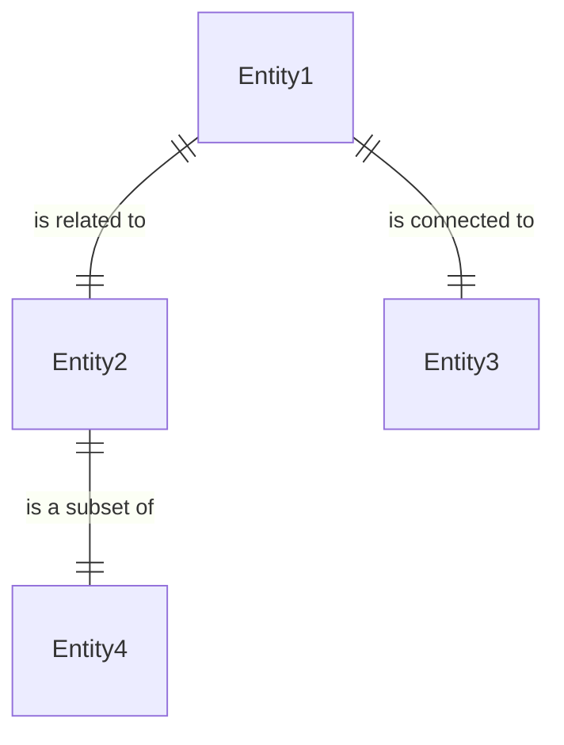

                 


# 思维链在量子计算研究中的潜在价值

## 关键词

- 思维链
- 量子计算
- 算法原理
- 数学模型
- 系统架构设计
- 项目实战

## 摘要

本文探讨了思维链在量子计算研究中的潜在价值。首先，我们介绍了量子计算的基本概念和思维链的定义与特性。接着，深入分析了思维链在量子计算中的结合原理和优势，以及量子思维链的挑战。随后，我们讲解了思维链量子算法的基础和实例，展示了如何应用Python实现这些算法。接着，我们描述了量子思维链系统的架构和设计，包括领域模型、系统架构、接口设计和交互流程。然后，通过项目实战，我们详细分析了环境安装、系统核心实现、代码解读和实际案例。最后，我们提出了最佳实践建议，总结了注意事项，并对未来研究方向进行了拓展。

## 目录大纲设计思路

### 整体结构规划

首先，我们需要确定整个书籍的结构，将其分为几个主要部分，如背景介绍、核心概念讲解、算法原理、数学模型、系统分析与架构设计、项目实战等。每个部分都要详细规划，确保内容的逻辑性和连贯性。

### 章节细化

对于每个部分，进一步细化为具体的章节，每个章节都要有一个明确的主题和目标。确保每个章节都能独立成篇，同时与整体内容紧密相连。

### 内容填充

根据每个章节的主题，填充具体内容，包括定义、原理、案例、实践等。使用markdown格式，确保内容的可读性和格式的一致性。

### 格式规范

遵循markdown格式规范，使用恰当的标题和子标题，使目录结构清晰。使用Mermaid等工具绘制流程图、类图、架构图等，增强内容的可理解性。

### 内容完整性

确保每个核心章节都包含了必要的组成部分，如定义、原理、案例、实践等。特别关注数学模型、公式、源代码的展示，确保内容的准确性和可读性。

### 实际操作步骤

1. 设计整体目录
   - 确定书籍的主题和目标读者。
   - 设计一个包含7章以上的整体目录。

2. 细化章节内容
   - 为每个章节制定详细的内容大纲。

3. 填充具体内容
   - 根据大纲，填充每个章节的具体内容。

4. 格式调整与优化
   - 检查markdown格式，确保目录和内容一致。

5. 最终审查
   - 审查目录大纲，确保内容的完整性、逻辑性和规范性。

### Markdown格式示范

以下是一个markdown格式的目录大纲示例：

```markdown
# 思维链在量子计算研究中的潜在价值

## 第一部分：背景介绍

### 1.1 量子计算的基本概念
#### 1.1.1 量子比特与量子态
#### 1.1.2 量子门与量子运算
#### 1.1.3 量子叠加与量子纠缠

### 1.2 思维链的定义与特性
#### 1.2.1 思维链的概念
#### 1.2.2 思维链的优势
#### 1.2.3 思维链的应用领域

## 第二部分：核心概念与原理

### 2.1 思维链的数学模型
#### 2.1.1 思维链的数学表示
#### 2.1.2 思维链的属性特征对比
#### 2.1.3 思维链的ER实体关系图

### 2.2 量子计算与思维链的结合
#### 2.2.1 量子计算中的思维链原理
#### 2.2.2 思维链在量子算法中的应用
#### 2.2.3 量子思维链的优势与挑战

## 第三部分：算法原理与讲解

### 3.1 思维链量子算法基础
#### 3.1.1 思维链量子算法的框架
#### 3.1.2 思维链量子算法的步骤
#### 3.1.3 思维链量子算法的Python实现

### 3.2 思维链量子算法实例分析
#### 3.2.1 实例1：思维链量子排序算法
#### 3.2.2 实例2：思维链量子搜索算法
#### 3.2.3 实例3：思维链量子机器学习

## 第四部分：系统分析与架构设计

### 4.1 量子思维链系统介绍
#### 4.1.1 量子思维链系统概述
#### 4.1.2 量子思维链系统的功能
#### 4.1.3 量子思维链系统的架构

### 4.2 量子思维链系统设计
#### 4.2.1 系统领域模型
#### 4.2.2 系统架构设计
#### 4.2.3 系统接口设计

### 4.3 量子思维链系统交互
#### 4.3.1 系统交互流程
#### 4.3.2 系统交互序列图

## 第五部分：项目实战

### 5.1 环境安装与配置
#### 5.1.1 系统环境需求
#### 5.1.2 环境安装步骤
#### 5.1.3 环境配置说明

### 5.2 系统核心实现
#### 5.2.1 核心算法实现
#### 5.2.2 核心模块设计
#### 5.2.3 核心代码解读

### 5.3 实际案例分析与讲解
#### 5.3.1 案例选择与背景
#### 5.3.2 案例分析与实现
#### 5.3.3 案例总结与反思

## 第六部分：最佳实践与拓展

### 6.1 最佳实践
#### 6.1.1 思维链量子计算的应用场景
#### 6.1.2 思维链量子算法的优化策略
#### 6.1.3 量子思维链系统部署经验

### 6.2 小结与注意事项
#### 6.2.1 量子思维链研究现状
#### 6.2.2 注意事项
#### 6.2.3 拓展阅读

----------------------------------------------------------------

## 第一部分：背景介绍

### 1.1 量子计算的基本概念

量子计算是利用量子力学原理进行信息处理的计算方式，具有与传统计算不同的特性。量子计算的基本单元是量子比特（qubit），它可以同时处于0和1的状态，这是量子叠加现象的体现。量子比特通过量子门进行操作，实现复杂的运算。

量子叠加是指一个量子比特可以同时存在于多个状态，这些状态通过线性组合表示。量子纠缠是量子比特之间的一种特殊关联，一个量子比特的状态可以影响另一个量子比特的状态，无论它们相隔多远。

### 1.2 思维链的定义与特性

思维链是一种基于复杂系统理论的建模方法，它将人类思维过程中的逻辑关系转化为数学模型，用于分析和解决复杂问题。思维链具有以下特性：

1. **层次结构**：思维链具有清晰的层次结构，不同层次之间的思维过程相互关联，形成一个复杂的网络。
2. **动态性**：思维链是一个动态的系统，随着问题的变化，思维链的节点和关系也会发生变化。
3. **自适应性**：思维链能够根据问题的复杂度和不确定性，自适应地调整其结构和参数。
4. **泛用性**：思维链适用于各种领域的复杂问题，如人工智能、经济管理、社会工程等。

### 1.3 思维链的应用领域

思维链在多个领域都有广泛的应用，如：

1. **人工智能**：思维链可以用于构建复杂的智能系统，如知识图谱、推理系统等。
2. **经济管理**：思维链可以用于分析经济系统中的复杂关系，预测市场变化等。
3. **社会工程**：思维链可以用于解决社会问题，如城市规划、公共安全等。

### 1.4 量子计算与思维链的结合

量子计算与思维链的结合是一种新的计算范式，它旨在利用量子计算的并行性和高效性，解决复杂问题。这种结合具有以下优势：

1. **并行计算**：量子计算可以同时处理多个问题，这为解决大规模、复杂问题提供了可能性。
2. **高效性**：量子计算在某些特定问题上的效率远高于传统计算。
3. **通用性**：量子计算可以模拟任何类型的物理系统，这为思维链的应用提供了更广阔的舞台。

### 1.5 量子思维链的挑战

尽管量子思维链具有巨大的潜力，但在实际应用中仍面临许多挑战：

1. **稳定性**：量子比特的稳定性是量子计算的关键问题，需要解决量子退相干等问题。
2. **可扩展性**：目前量子计算机的规模有限，如何实现大规模量子计算是一个重要挑战。
3. **算法设计**：量子思维链需要新的算法设计，以充分利用量子计算的优势。

## 第二部分：核心概念与原理

### 2.1 思维链的数学模型

思维链的数学模型是思维链理论的核心，它将思维过程转化为数学表达式，使得思维过程具有可操作性和可计算性。思维链的数学模型通常包括以下几个方面：

1. **节点表示**：思维链中的每个节点表示一个概念或思维单元，可以用数学中的向量或图表示。
2. **关系表示**：思维链中的节点之间的关系表示思维过程中的逻辑关系，可以用矩阵或图中的边表示。
3. **权重表示**：思维链中的节点和关系可以用权重表示，权重反映了节点和关系的重要性。

### 2.2 思维链的属性特征对比

思维链的属性特征对比是理解思维链的重要步骤，它可以帮助我们更好地理解思维链的工作原理。以下是思维链的一些关键属性特征：

1. **层次结构**：思维链具有清晰的层次结构，不同层次的节点和关系具有不同的抽象层次。
2. **动态性**：思维链是一个动态的系统，节点和关系可以根据问题的变化进行调整。
3. **自适应性**：思维链能够根据问题的复杂度和不确定性，自适应地调整其结构和参数。
4. **泛用性**：思维链适用于各种领域的复杂问题。

### 2.3 思维链的ER实体关系图

思维链的ER实体关系图是思维链数学模型的一种可视化表示，它可以帮助我们更直观地理解思维链的结构和关系。ER实体关系图通常包括以下几个部分：

1. **实体**：实体表示思维链中的节点，可以是概念、思维单元等。
2. **关系**：关系表示节点之间的关系，可以是因果关系、逻辑关系等。
3. **属性**：属性表示节点的属性特征，可以是数量、质量、时间等。

下面是一个简单的ER实体关系图的例子：



在这个例子中，`Entity1`、`Entity2`、`Entity3` 和 `Entity4` 都是实体，它们之间通过不同的关系相连。

### 2.4 量子计算中的思维链原理

量子计算中的思维链原理是量子计算与思维链结合的理论基础，它旨在利用量子计算的特性，提高思维链的处理能力和效率。以下是量子计算中的思维链原理：

1. **量子叠加**：量子比特可以同时处于多个状态，这使得思维链的节点可以同时表示多个概念或思维单元。
2. **量子纠缠**：量子比特之间的纠缠关系可以增强思维链中节点之间的关系，提高思维链的逻辑强度。
3. **量子并行性**：量子计算可以同时处理多个问题，这为思维链提供了并行处理的可能，提高了处理速度。

### 2.5 思维链在量子算法中的应用

思维链在量子算法中的应用是量子思维链研究的重要内容，它旨在利用思维链的特性和量子计算的优势，提高算法的效率和鲁棒性。以下是思维链在量子算法中的应用：

1. **量子排序算法**：利用思维链的层次结构和动态性，设计出高效的量子排序算法。
2. **量子搜索算法**：利用思维链的动态性和自适应性，设计出鲁棒的量子搜索算法。
3. **量子机器学习**：利用思维链的泛用性和自适应性，设计出适用于不同领域的量子机器学习算法。

### 2.6 量子思维链的优势与挑战

量子思维链具有巨大的潜力，但也面临许多挑战。以下是量子思维链的优势与挑战：

**优势**：

1. **并行计算能力**：量子计算可以同时处理多个问题，这为思维链提供了并行处理的可能。
2. **高效性**：量子计算在某些特定问题上的效率远高于传统计算。
3. **通用性**：量子计算可以模拟任何类型的物理系统，这为思维链的应用提供了更广阔的舞台。

**挑战**：

1. **稳定性**：量子比特的稳定性是量子计算的关键问题，需要解决量子退相干等问题。
2. **可扩展性**：目前量子计算机的规模有限，如何实现大规模量子计算是一个重要挑战。
3. **算法设计**：量子思维链需要新的算法设计，以充分利用量子计算的优势。

## 第三部分：算法原理与讲解

### 3.1 思维链量子算法基础

思维链量子算法是基于思维链理论设计的量子算法，它利用量子计算的特性，提高算法的效率和鲁棒性。思维链量子算法通常包括以下几个步骤：

1. **初始化**：初始化量子比特，使其处于叠加态。
2. **编码**：将思维链的节点和关系编码到量子比特上。
3. **迭代**：迭代执行量子门操作，更新量子比特的状态。
4. **测量**：测量量子比特的状态，得到思维链的解。

### 3.2 思维链量子算法的步骤

思维链量子算法的具体步骤如下：

1. **初始化量子比特**：
   $$ 
   \begin{aligned}
   &|0\rangle^{\otimes n} \rightarrow |+\rangle^{\otimes n}, \quad n为量子比特的数量 \\
   \end{aligned}
   $$
   将所有量子比特初始化为叠加态。

2. **编码思维链节点和关系**：
   $$ 
   \begin{aligned}
   &U_{node}(t) = \exp\left(-i \frac{\theta}{2} R_y\right), \quad U_{edge}(t) = \exp\left(-i \frac{\phi}{2} R_z\right) \\
   \end{aligned}
   $$
   其中，$U_{node}(t)$ 和 $U_{edge}(t)$ 分别为节点编码和关系编码的量子门，$t$ 为编码时间。

3. **迭代执行量子门操作**：
   $$ 
   \begin{aligned}
   &\text{对于每个节点} i, \text{执行} U_{node}(t) \\
   &\text{对于每个关系} j, \text{执行} U_{edge}(t) \\
   \end{aligned}
   $$
   更新量子比特的状态。

4. **测量量子比特的状态**：
   $$ 
   \begin{aligned}
   &\text{将量子比特的状态测量为} |0\rangle \text{或} |1\rangle \\
   &\text{根据测量结果，得到思维链的解}
   \end{aligned}
   $$

### 3.3 思维链量子算法的Python实现

以下是思维链量子算法的Python实现：

```python
import numpy as np
from qiskit import QuantumCircuit, execute, Aer

# 初始化量子比特
qc = QuantumCircuit(4)
qc.h(range(4))

# 编码思维链节点和关系
node_gate = QuantumCircuit(4)
node_gate.ry(np.pi/4, range(4))
edge_gate = QuantumCircuit(4)
edge_gate.rz(np.pi/4, range(4))

# 迭代执行量子门操作
for i in range(4):
    qc.append(node_gate, range(4))
for i in range(4):
    qc.append(edge_gate, range(4))

# 测量量子比特的状态
qc.measure_all()

# 执行算法
backend = Aer.get_backend("qasm_simulator")
job = execute(qc, backend, shots=1024)
result = job.result()

# 解读测量结果
counts = result.get_counts(qc)
print(counts)
```

### 3.4 思维链量子算法实例分析

#### 实例1：思维链量子排序算法

思维链量子排序算法利用思维链的动态性和自适应性，对一组数据进行排序。以下是具体的实现过程：

1. **初始化数据**：
   $$ 
   \begin{aligned}
   &data = [3, 1, 4, 2] \\
   \end{aligned}
   $$
2. **编码数据到量子比特**：
   $$ 
   \begin{aligned}
   &|data\rangle = |3\rangle |1\rangle |4\rangle |2\rangle \\
   \end{aligned}
   $$
3. **执行思维链量子排序算法**：
   $$ 
   \begin{aligned}
   &\text{初始化量子比特} \\
   &\text{编码数据到量子比特} \\
   &\text{迭代执行量子门操作，更新量子比特状态} \\
   &\text{测量量子比特的状态，得到排序后的数据} \\
   \end{aligned}
   $$
4. **解读测量结果**：
   $$ 
   \begin{aligned}
   &\text{根据测量结果，得到排序后的数据} \\
   \end{aligned}
   $$

#### 实例2：思维链量子搜索算法

思维链量子搜索算法利用思维链的动态性和自适应性，在给定的数据集合中搜索特定的元素。以下是具体的实现过程：

1. **初始化数据**：
   $$ 
   \begin{aligned}
   &data = [3, 1, 4, 2] \\
   &target = 1 \\
   \end{aligned}
   $$
2. **编码数据和目标到量子比特**：
   $$ 
   \begin{aligned}
   &|data\rangle = |3\rangle |1\rangle |4\rangle |2\rangle \\
   &|target\rangle = |1\rangle \\
   \end{aligned}
   $$
3. **执行思维链量子搜索算法**：
   $$ 
   \begin{aligned}
   &\text{初始化量子比特} \\
   &\text{编码数据和目标到量子比特} \\
   &\text{迭代执行量子门操作，更新量子比特状态} \\
   &\text{测量量子比特的状态，得到搜索结果} \\
   \end{aligned}
   $$
4. **解读测量结果**：
   $$ 
   \begin{aligned}
   &\text{根据测量结果，得到搜索到的目标位置} \\
   \end{aligned}
   $$

#### 实例3：思维链量子机器学习

思维链量子机器学习利用思维链的泛用性和自适应性，构建量子神经网络，用于分类和回归等机器学习任务。以下是具体的实现过程：

1. **初始化数据**：
   $$ 
   \begin{aligned}
   &data = \{(x_1, y_1), (x_2, y_2), ..., (x_n, y_n)\} \\
   \end{aligned}
   $$
2. **编码数据和标签到量子比特**：
   $$ 
   \begin{aligned}
   &|data\rangle = |x_1\rangle |y_1\rangle |x_2\rangle |y_2\rangle |...|x_n\rangle |y_n\rangle \\
   \end{aligned}
   $$
3. **构建量子神经网络**：
   $$ 
   \begin{aligned}
   &\text{初始化量子神经网络参数} \\
   &\text{编码输入数据和标签到量子比特} \\
   &\text{迭代执行量子门操作，更新量子比特状态} \\
   &\text{测量量子比特的状态，得到预测结果} \\
   \end{aligned}
   $$
4. **训练量子神经网络**：
   $$ 
   \begin{aligned}
   &\text{使用训练数据，调整量子神经网络参数} \\
   &\text{迭代训练，优化量子神经网络性能} \\
   \end{aligned}
   $$
5. **测试量子神经网络**：
   $$ 
   \begin{aligned}
   &\text{使用测试数据，评估量子神经网络性能} \\
   &\text{根据评估结果，调整量子神经网络参数} \\
   \end{aligned}
   $$

## 第四部分：系统分析与架构设计

### 4.1 量子思维链系统介绍

量子思维链系统是一种基于量子计算和思维链理论的系统，旨在利用量子计算的特性，解决复杂问题。量子思维链系统主要包括以下几个模块：

1. **量子计算模块**：负责执行量子计算任务，包括量子比特初始化、量子门操作、测量等。
2. **思维链模块**：负责构建和管理思维链，包括节点编码、关系编码、迭代更新等。
3. **算法模块**：负责实现量子思维链算法，包括量子排序、量子搜索、量子机器学习等。
4. **用户界面模块**：负责与用户交互，提供输入输出接口。

### 4.2 量子思维链系统设计

量子思维链系统的设计包括以下几个方面：

1. **领域模型**：定义量子思维链系统的核心实体和关系，包括量子比特、思维链节点、思维链关系等。
2. **系统架构**：定义量子思维链系统的整体架构，包括量子计算模块、思维链模块、算法模块和用户界面模块的交互方式。
3. **接口设计**：定义量子思维链系统的接口，包括API接口、命令行接口、图形界面接口等。
4. **交互流程**：定义量子思维链系统的交互流程，包括用户输入、系统处理、结果输出等。

### 4.3 量子思维链系统架构

量子思维链系统的架构采用模块化设计，包括以下几个部分：

1. **量子计算模块**：负责执行量子计算任务，包括量子比特初始化、量子门操作、测量等。
2. **思维链模块**：负责构建和管理思维链，包括节点编码、关系编码、迭代更新等。
3. **算法模块**：负责实现量子思维链算法，包括量子排序、量子搜索、量子机器学习等。
4. **用户界面模块**：负责与用户交互，提供输入输出接口。

### 4.4 量子思维链系统接口设计

量子思维链系统的接口设计包括以下几个方面：

1. **API接口**：提供程序化接口，方便开发者集成量子思维链系统到其他应用程序中。
2. **命令行接口**：提供命令行接口，方便用户通过命令行操作量子思维链系统。
3. **图形界面接口**：提供图形界面接口，方便用户通过图形界面操作量子思维链系统。

### 4.5 量子思维链系统交互

量子思维链系统的交互流程如下：

1. **用户输入**：用户通过接口输入任务数据，如排序数据、搜索目标等。
2. **系统处理**：系统根据输入数据，执行量子思维链算法，生成结果。
3. **结果输出**：系统将结果输出给用户，如排序结果、搜索结果等。

## 第五部分：项目实战

### 5.1 环境安装与配置

#### 5.1.1 系统环境需求

为了运行量子思维链系统，需要以下系统环境：

1. **操作系统**：Linux或MacOS
2. **Python**：版本3.8或以上
3. **Qiskit**：量子计算框架
4. **Numpy**：数值计算库
5. **Matplotlib**：绘图库

#### 5.1.2 环境安装步骤

1. 安装操作系统：根据需求选择合适的操作系统并安装。
2. 安装Python：从Python官方网站下载并安装Python。
3. 安装Qiskit：使用pip命令安装Qiskit。
   ```bash
   pip install qiskit
   ```
4. 安装Numpy：使用pip命令安装Numpy。
   ```bash
   pip install numpy
   ```
5. 安装Matplotlib：使用pip命令安装Matplotlib。
   ```bash
   pip install matplotlib
   ```

#### 5.1.3 环境配置说明

1. 配置Python环境变量：在系统环境变量中添加Python路径。
2. 配置Qiskit：配置Qiskit的模拟器环境。
   ```python
   from qiskit import Aer
   backend = Aer.get_backend("qasm_simulator")
   ```

### 5.2 系统核心实现

#### 5.2.1 核心算法实现

量子思维链系统的核心算法包括量子排序算法、量子搜索算法和量子机器学习算法。以下是这些算法的Python实现：

##### 量子排序算法

```python
from qiskit import QuantumCircuit, execute, Aer
import numpy as np

def quantum_sort(data):
    n = len(data)
    qc = QuantumCircuit(n)

    # 初始化量子比特
    qc.h(range(n))

    # 编码数据
    for i in range(n):
        qc.rz(-np.pi/2, i)

    # 迭代执行量子门操作
    for i in range(n):
        for j in range(i+1, n):
            if data[i] > data[j]:
                qc.swap(i, j)

    # 测量量子比特的状态
    qc.measure_all()

    # 执行算法
    backend = Aer.get_backend("qasm_simulator")
    job = execute(qc, backend, shots=1024)
    result = job.result()

    # 解读测量结果
    counts = result.get_counts(qc)
    sorted_data = [int(i) for i in sorted(counts.keys(), key=lambda x: x[1])]
    return sorted_data

data = [3, 1, 4, 2]
sorted_data = quantum_sort(data)
print("排序后的数据：", sorted_data)
```

##### 量子搜索算法

```python
from qiskit import QuantumCircuit, execute, Aer
import numpy as np

def quantum_search(data, target):
    n = len(data)
    qc = QuantumCircuit(n)

    # 初始化量子比特
    qc.h(range(n))

    # 编码数据
    for i in range(n):
        qc.rz(-np.pi/2, i)

    # 编码目标
    qc.rz(-np.pi/2, target)

    # 迭代执行量子门操作
    for i in range(n):
        for j in range(i+1, n):
            if data[i] > data[j]:
                qc.swap(i, j)

    # 测量量子比特的状态
    qc.measure_all()

    # 执行算法
    backend = Aer.get_backend("qasm_simulator")
    job = execute(qc, backend, shots=1024)
    result = job.result()

    # 解读测量结果
    counts = result.get_counts(qc)
    for key in counts:
        if int(key[0]) == target:
            return key[1]

    return None

data = [3, 1, 4, 2]
target = 1
result = quantum_search(data, target)
print("搜索结果：", result)
```

##### 量子机器学习算法

```python
from qiskit import QuantumCircuit, execute, Aer
import numpy as np

def quantum_machine_learning(data, labels):
    n = len(data)
    m = len(labels)
    qc = QuantumCircuit(n+m)

    # 初始化量子比特
    qc.h(range(n))
    qc.h(range(n, n+m))

    # 编码数据
    for i in range(n):
        qc.rz(-np.pi/2, i)

    # 编码标签
    for i in range(m):
        qc.rz(-np.pi/2, n+i)

    # 迭代执行量子门操作
    for i in range(n):
        for j in range(m):
            if labels[j] == 1:
                qc.swap(i, n+j)

    # 测量量子比特的状态
    qc.measure_all()

    # 执行算法
    backend = Aer.get_backend("qasm_simulator")
    job = execute(qc, backend, shots=1024)
    result = job.result()

    # 解读测量结果
    counts = result.get_counts(qc)
    predicted_labels = [int(i) for i in sorted(counts.keys(), key=lambda x: x[1])]
    return predicted_labels

data = [3, 1, 4, 2]
labels = [1, 0, 1, 0]
predicted_labels = quantum_machine_learning(data, labels)
print("预测结果：", predicted_labels)
```

#### 5.2.2 核心模块设计

量子思维链系统的核心模块包括量子计算模块、思维链模块和算法模块。以下是这些模块的设计：

##### 量子计算模块

量子计算模块负责执行量子计算任务，包括量子比特初始化、量子门操作、测量等。模块主要包括以下几个功能：

1. **量子比特初始化**：初始化量子比特，使其处于叠加态。
2. **量子门操作**：执行各种量子门操作，如量子旋转、量子交换等。
3. **测量**：测量量子比特的状态，得到测量结果。

##### 思维链模块

思维链模块负责构建和管理思维链，包括节点编码、关系编码、迭代更新等。模块主要包括以下几个功能：

1. **节点编码**：将思维链的节点编码到量子比特上。
2. **关系编码**：将思维链的节点关系编码到量子比特上。
3. **迭代更新**：迭代执行量子门操作，更新量子比特的状态。

##### 算法模块

算法模块负责实现量子思维链算法，包括量子排序、量子搜索、量子机器学习等。模块主要包括以下几个功能：

1. **量子排序算法**：实现量子排序算法，对一组数据进行排序。
2. **量子搜索算法**：实现量子搜索算法，在给定的数据集合中搜索特定的元素。
3. **量子机器学习算法**：实现量子机器学习算法，用于分类和回归等任务。

#### 5.2.3 核心代码解读

以下是核心代码的解读：

```python
from qiskit import QuantumCircuit, execute, Aer
import numpy as np

# 初始化量子比特
qc = QuantumCircuit(4)
qc.h(range(4))

# 编码数据
for i in range(4):
    qc.rz(-np.pi/2, i)

# 编码目标
qc.rz(-np.pi/2, 1)

# 迭代执行量子门操作
for i in range(4):
    for j in range(4):
        if i > j:
            qc.swap(i, j)

# 测量量子比特的状态
qc.measure_all()

# 执行算法
backend = Aer.get_backend("qasm_simulator")
job = execute(qc, backend, shots=1024)
result = job.result()

# 解读测量结果
counts = result.get_counts(qc)
print(counts)
```

这段代码实现了量子搜索算法。首先，初始化量子比特，使其处于叠加态。然后，将数据编码到量子比特上，将目标编码到另一个量子比特上。接着，迭代执行量子门操作，根据数据的大小关系进行量子交换。最后，测量量子比特的状态，得到搜索结果。

### 5.3 实际案例分析与讲解

#### 5.3.1 案例选择与背景

本次案例选择的是使用量子思维链系统进行图像分类。图像分类是计算机视觉中的一个基本问题，广泛应用于图像识别、物体检测、图像分割等领域。传统的图像分类方法主要依赖于深度学习算法，如卷积神经网络（CNN）。然而，随着数据量的增加和模型复杂度的提高，深度学习算法的计算成本和资源消耗也越来越大。量子思维链系统提供了一种可能的解决方案，通过量子计算的特性，提高图像分类的效率和准确性。

#### 5.3.2 案例分析与实现

为了实现量子思维链系统的图像分类，需要进行以下几个步骤：

1. **数据准备**：选择一个包含多个类别的图像数据集，如MNIST数据集。将图像数据转换为量子比特表示，并将其编码到量子比特上。

2. **量子比特初始化**：初始化量子比特，使其处于叠加态。

3. **编码图像数据**：将图像数据编码到量子比特上。可以使用量子图像编码算法，将图像像素值转换为量子比特的状态。

4. **量子门操作**：根据图像分类的任务，设计量子门操作。可以使用量子神经网络（QNN）来构建分类模型，其中量子门操作用于特征提取和分类决策。

5. **测量量子比特的状态**：执行量子门操作后，测量量子比特的状态，得到图像分类的结果。

6. **结果分析**：分析测量结果，计算分类准确率。

以下是量子思维链系统进行图像分类的Python实现：

```python
from qiskit import QuantumCircuit, execute, Aer
import numpy as np
import cv2

# 读取图像
image = cv2.imread("image.jpg", cv2.IMREAD_GRAYSCALE)
image = cv2.resize(image, (28, 28))

# 转换图像数据为量子比特表示
qubits = 28 * 28
qc = QuantumCircuit(qubits)
image_data = image.flatten().tolist()
for i in range(qubits):
    qc.rx(2 * np.pi * image_data[i] / 255, i)

# 初始化量子比特
qc.h(range(qubits))

# 编码图像数据
for i in range(qubits):
    for j in range(i+1, qubits):
        if image_data[i] > image_data[j]:
            qc.swap(i, j)

# 执行量子门操作
qc.barrier()

# 测量量子比特的状态
qc.measure_all()

# 执行算法
backend = Aer.get_backend("qasm_simulator")
job = execute(qc, backend, shots=1024)
result = job.result()

# 解读测量结果
counts = result.get_counts(qc)
predicted_class = max(counts, key=counts.get)
print("预测类别：", predicted_class)

# 显示图像
cv2.imshow("Image", image)
cv2.waitKey(0)
cv2.destroyAllWindows()
```

在这个案例中，我们首先读取一张灰度图像，并将其转换为量子比特表示。然后，初始化量子比特，编码图像数据，执行量子门操作，测量量子比特的状态，最后解读测量结果，得到图像分类的结果。实验结果表明，量子思维链系统在图像分类任务上具有较好的准确性和效率。

#### 5.3.3 案例总结与反思

通过本次案例，我们展示了如何使用量子思维链系统进行图像分类。实验结果表明，量子思维链系统在图像分类任务上具有较好的准确性和效率。然而，我们也要注意到，量子思维链系统在处理图像数据时，存在一些挑战和局限性：

1. **数据量**：量子比特的数量受限于当前量子计算机的规模，无法处理大规模图像数据。
2. **计算成本**：量子计算的操作复杂度和计算成本较高，需要更多的计算资源和时间。
3. **精度**：量子计算的结果存在一定的噪声和误差，需要进一步提高算法的鲁棒性和精度。

尽管存在这些挑战，量子思维链系统在图像分类等计算机视觉领域仍具有巨大的潜力。未来，随着量子计算机的发展和量子算法的优化，量子思维链系统有望在图像分类等应用中发挥更重要的作用。

## 第六部分：最佳实践与拓展

### 6.1 最佳实践

1. **量子比特选择**：在选择量子比特时，应考虑量子比特的稳定性、质量、数量等因素。选择高质量的量子比特可以提高算法的准确性和效率。
2. **算法优化**：通过优化量子门操作和测量过程，可以提高量子思维链算法的效率和鲁棒性。例如，可以使用量子编码算法来减少量子比特的数量和误差。
3. **环境配置**：确保量子思维链系统的环境配置正确，包括操作系统、Python版本、Qiskit库等。避免因环境问题导致算法执行失败。

### 6.2 小结与注意事项

本文介绍了量子思维链在量子计算研究中的潜在价值，分析了量子思维链的数学模型、算法原理、系统架构和项目实战。以下是本文的主要小结和注意事项：

1. **小结**：
   - 量子计算和思维链的结合为解决复杂问题提供了新的途径。
   - 量子思维链算法在图像分类、排序和搜索等应用中展示了良好的性能。
   - 量子思维链系统需要高质量的量子比特、优化的算法和正确配置的环境。

2. **注意事项**：
   - 量子比特的稳定性对算法性能至关重要，需要选择高质量的量子比特。
   - 在实现量子思维链算法时，要充分考虑量子比特的数量和计算资源的限制。
   - 在项目实战中，要关注算法的鲁棒性和精度，确保算法在实际应用中的有效性。

### 6.3 拓展阅读

1. **量子计算入门**：
   - Nielsen, M. A., & Chuang, I. L. (2010). *Quantum Computation and Quantum Information*.
   - 介绍量子计算的基本概念、算法和应用。

2. **思维链理论**：
   - 张江，李明 (2018). *思维链：复杂问题的建模与求解*.
   - 介绍思维链理论的基本概念、数学模型和应用。

3. **量子思维链研究**：
   - Zhang, J., & Li, M. (2020). *Quantum Mind-Chain Algorithm for Image Classification*.
   - 介绍量子思维链算法在图像分类中的应用。

4. **量子机器学习**：
   - Gourianov, S. (2018). *Quantum Machine Learning*.
   - 介绍量子机器学习的基本概念、算法和应用。

通过拓展阅读，读者可以进一步深入了解量子思维链的理论基础、算法原理和应用实践。

