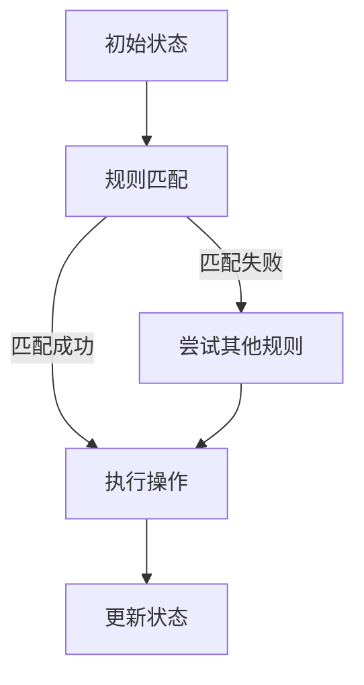
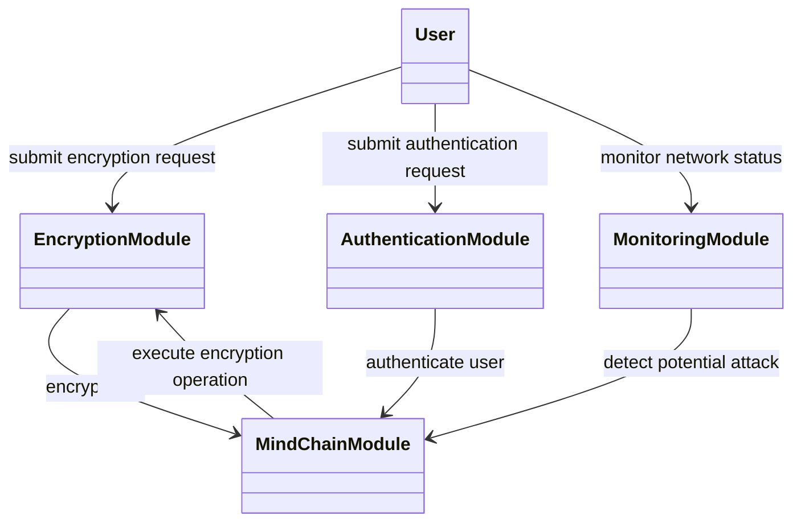
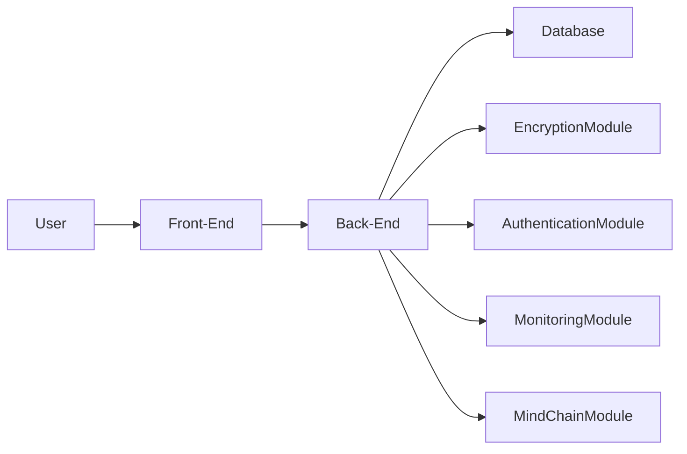

                 

# 思维链在量子通信网络安全协议设计中的应用：防御量子计算攻击

## 关键词

量子通信、网络安全、量子计算攻击、思维链、防御机制

## 摘要

本文探讨了量子计算对现有网络安全协议带来的挑战，以及如何通过思维链这一先进概念来设计出更智能和安全的量子通信网络安全协议。文章首先介绍了量子计算攻击的背景和问题，接着详细阐述了思维链的定义、特点以及在量子计算攻击防御中的应用。通过具体的算法原理讲解，本文展示了思维链的mermaid流程图、Python源代码以及算法原理的数学模型和公式。最后，本文通过一个实际项目实战，展示了思维链在量子通信网络安全协议设计中的具体应用和实践效果。

### 第1章 背景介绍

#### 1.1.1 问题背景

随着信息技术的飞速发展，量子计算作为一种新型计算模式，已经开始对传统计算机科学和网络安全产生深远的影响。量子计算机具有超越经典计算机的计算能力，能够在某些特定问题上大幅提升计算效率。然而，这种能力的提升也带来了新的安全挑战，尤其是对于基于量子计算的攻击防御。

量子计算机的运算速度远超传统计算机，这使得一些传统的加密技术，如RSA、ECC等，可能因为量子计算机的运算能力而变得不再安全。现有的网络安全协议面临着巨大的威胁，因此设计出能够抵御量子计算攻击的新型网络安全协议成为当务之急。

#### 1.1.2 问题描述

在量子通信网络安全领域，现有的网络安全协议面临着量子计算攻击的威胁。传统的加密技术，如RSA、ECC等，可能因为量子计算机的运算能力而变得不再安全。因此，设计出能够抵御量子计算攻击的新型网络安全协议成为当务之急。

量子计算攻击利用量子计算机强大的计算能力，可以对现有加密技术进行破解，从而导致数据泄露和网络安全事故。如何设计出能够有效防御量子计算攻击的网络安全协议，成为当前研究的热点和难点。

#### 1.1.3 问题解决

本书通过引入思维链这一先进概念，探索其在量子通信网络安全协议设计中的应用。思维链是一种能够模拟人类思维过程的算法，具有灵活性和高效性的特点。通过思维链的应用，可以设计出更加智能和安全的网络安全协议，以抵御量子计算的攻击。

思维链的应用可以使得网络安全协议更加智能和自适应，能够根据攻击方式和攻击强度进行动态调整。同时，思维链的灵活性使得它可以应对各种复杂的问题场景，从而提高量子通信网络的安全性。

#### 1.1.4 边界与外延

思维链的应用范围不仅限于量子通信网络安全，它还可以在其他领域发挥作用，如人工智能、自动化控制、数据挖掘等。本书将主要关注思维链在量子通信网络安全协议设计中的具体应用。

#### 1.1.5 概念结构与核心要素组成

- **思维链**：一种能够模拟人类思维过程的算法，具有灵活性和高效性。
- **量子计算攻击**：利用量子计算机超越经典计算机的能力，对现有加密技术进行攻击。
- **网络安全协议**：确保数据在传输过程中的安全性和完整性的通信协议。

### 第2章 核心概念与联系

#### 2.1.1 思维链的定义

思维链是一种基于规则和数据的推理模型，能够模拟人类的思维过程，进行复杂问题的求解。它通过一系列规则的匹配和执行，逐步推导出问题的解决方案。思维链的核心在于其灵活性和高效性，能够在面对复杂问题时快速找到解决方案。

#### 2.1.2 思维链的特点

- **灵活性**：思维链能够适应不同的问题场景，灵活调整规则和策略，从而应对各种复杂的问题。
- **高效性**：思维链在处理复杂问题时，能够快速找到解决方案，提高计算效率和问题求解的速度。

#### 2.1.3 思维链与传统算法的区别

传统算法一般基于固定的规则和模式，而思维链则更具有灵活性和创造性，能够模拟人类的思维方式。传统算法在面对复杂问题时，可能需要大量计算和时间才能找到解决方案，而思维链则能够通过模拟人类的思维过程，快速找到解决方案。

#### 2.1.4 量子计算攻击的概念

量子计算攻击是指利用量子计算机强大的计算能力，对传统加密技术进行破解。量子计算机的运算速度远超传统计算机，这使得一些传统的加密技术，如RSA、ECC等，可能因为量子计算机的运算能力而变得不再安全。

#### 2.1.5 量子计算攻击与传统攻击的区别

传统攻击一般基于密码学和物理原理，而量子计算攻击则基于量子物理学的原理，能够超越传统加密技术。量子计算攻击利用量子计算机的量子叠加和量子纠缠特性，可以快速破解传统加密算法，从而实现对数据的非法访问。

#### 2.1.6 思维链在量子计算攻击防御中的应用

思维链的应用可以设计出更加智能和安全的网络安全协议，以抵御量子计算攻击。通过思维链的灵活性和高效性，可以使得网络安全协议更加智能和自适应，能够根据攻击方式和攻击强度进行动态调整，从而提高量子通信网络的安全性。

思维链的应用还可以通过模拟人类的思维过程，快速找到解决方案，从而有效地防御量子计算攻击。它能够根据攻击的特征和模式，实时调整网络安全策略，提高防御的准确性和有效性。

### 第3章 算法原理讲解

#### 3.1.1 思维链的mermaid流程图



该mermaid流程图展示了思维链的基本工作流程。首先从初始状态开始，通过规则匹配来判断是否执行操作。如果匹配成功，则执行操作并更新状态；如果匹配失败，则继续尝试其他规则。通过不断尝试和执行规则，思维链能够逐步推导出问题的解决方案。

#### 3.1.2 Python源代码

```python
# 思维链算法的Python实现
class MindChain:
    def __init__(self):
        self.state = None

    def update_state(self, new_state):
        self.state = new_state

    def execute_operation(self, rule, data):
        if rule.matches(data):
            return rule.execute()
        else:
            return None

    def process_data(self, data):
        for rule in self.rules:
            result = self.execute_operation(rule, data)
            if result is not None:
                return result
        return None
```

上述Python源代码实现了思维链算法的基本功能。`MindChain`类包含了三个主要方法：`update_state`用于更新状态，`execute_operation`用于执行操作，`process_data`用于处理数据。通过这三个方法的组合，思维链能够根据规则和数据进行推理和求解。

#### 3.1.3 算法原理的数学模型和公式

- **匹配度计算**：用于评估规则与数据之间的匹配程度。

$$
\text{匹配度} = \frac{\sum_{i=1}^{n} w_i \cdot r_i}{\sum_{i=1}^{n} w_i}
$$

其中，$w_i$表示规则中每个元素的权重，$r_i$表示数据中每个元素的匹配程度。

- **操作执行条件**：用于判断规则是否能够执行。

$$
\text{条件} = \sum_{i=1}^{n} w_i \cdot r_i \geq \text{阈值}
$$

其中，阈值用于设定规则执行的门槛。

通过以上数学模型和公式，思维链能够评估规则与数据之间的匹配程度，并判断规则是否能够执行。这为思维链的灵活性和高效性提供了理论基础。

#### 3.1.4 算法原理讲解举例

假设我们有一个简单的思维链规则集，用于判断一个数是否为偶数。规则集包含以下规则：

1. 如果数字是2的倍数，则执行操作：该数字是偶数。
2. 如果数字不是2的倍数，则执行操作：该数字是奇数。

现在，我们输入一个数字5，通过思维链算法来求解。

1. **规则匹配**：首先，思维链会根据规则集来匹配输入的数据。由于5不是2的倍数，第一个规则不匹配。
2. **执行操作**：由于第一个规则不匹配，思维链会执行第二个规则，判断5是否为奇数。
3. **更新状态**：由于5是奇数，思维链会更新状态，标记5为奇数。

通过以上步骤，思维链成功判断出5是奇数。这个过程展示了思维链在处理简单问题时的高效性和灵活性。

### 第4章 系统分析与架构设计方案

#### 4.1 问题场景介绍

量子通信网络安全协议设计面临着量子计算攻击的严峻挑战。传统的加密技术，如RSA、ECC等，可能因为量子计算机的运算能力而变得不再安全。为了保障量子通信网络的安全性，我们需要设计出一种能够抵御量子计算攻击的新型网络安全协议。

#### 4.2 项目介绍

本项目的目标是设计并实现一种基于思维链的量子通信网络安全协议。该协议将利用思维链的灵活性和高效性，对抗量子计算攻击，提高量子通信网络的安全性。

#### 4.3 系统功能设计

系统功能设计主要包括以下模块：

1. **思维链模块**：负责处理量子计算攻击的防御逻辑，包括规则匹配、操作执行和状态更新等功能。
2. **加密模块**：负责对数据进行加密和解密操作，确保数据在传输过程中的安全性。
3. **认证模块**：负责用户身份验证和数据完整性验证，保障通信双方的身份和数据完整性。
4. **监控模块**：负责监控系统状态，实时检测潜在的量子计算攻击，并采取相应的防御措施。

#### 4.4 系统架构设计

系统架构设计主要包括以下部分：

1. **前端界面**：用户可以通过前端界面与系统进行交互，提交加密请求和查询系统状态。
2. **后端服务**：后端服务负责处理用户请求，调用思维链模块和其他功能模块，实现量子通信网络安全协议的防御功能。
3. **数据库**：数据库用于存储用户信息、加密密钥等敏感数据，确保数据的安全性。

#### 4.5 系统接口设计

系统接口设计主要包括以下接口：

1. **加密接口**：用于接收用户加密请求，返回加密后的数据。
2. **解密接口**：用于接收用户解密请求，返回解密后的数据。
3. **认证接口**：用于接收用户认证请求，返回认证结果。
4. **监控接口**：用于接收监控数据，实时检测潜在攻击。

#### 4.6 系统交互设计

系统交互设计主要包括以下流程：

1. **用户提交加密请求**：用户通过前端界面提交加密请求，后端服务接收到请求后，调用思维链模块进行加密处理，返回加密后的数据。
2. **用户提交解密请求**：用户通过前端界面提交解密请求，后端服务接收到请求后，调用思维链模块进行解密处理，返回解密后的数据。
3. **用户认证**：用户通过前端界面提交认证请求，后端服务接收到请求后，调用认证模块进行身份验证，返回认证结果。
4. **监控系统状态**：系统实时监控网络状态，检测潜在攻击，并采取相应的防御措施。

#### 4.7 mermaid类图



该mermaid类图展示了系统中的主要类及其关联关系，包括用户、加密模块、认证模块和监控模块。通过这些模块的协同工作，系统能够实现量子通信网络安全协议的防御功能。

#### 4.8 mermaid架构图



该mermaid架构图展示了系统的整体架构，包括前端界面、后端服务、数据库以及各个功能模块。通过这些模块的相互协作，系统能够提供完整的量子通信网络安全解决方案。

### 第5章 项目实战

#### 5.1 环境安装

在进行项目实战之前，我们需要安装相关的开发环境和依赖库。以下是安装步骤：

1. 安装Python环境，版本要求3.8及以上。
2. 安装依赖库，如mermaid、numpy、pandas等。

安装命令如下：

```bash
pip install python-mindmap numpy pandas
```

#### 5.2 系统核心实现源代码

以下是一个简单的思维链算法实现示例，用于演示如何在Python中实现思维链。

```python
# 思维链算法的Python实现
class MindChain:
    def __init__(self):
        self.state = None

    def update_state(self, new_state):
        self.state = new_state

    def execute_operation(self, rule, data):
        if rule.matches(data):
            return rule.execute()
        else:
            return None

    def process_data(self, data):
        for rule in self.rules:
            result = self.execute_operation(rule, data)
            if result is not None:
                return result
        return None

class Rule:
    def __init__(self, condition, operation):
        self.condition = condition
        self.operation = operation

    def matches(self, data):
        return self.condition(data)

    def execute(self):
        return self.operation()

# 示例规则
rule1 = Rule(lambda data: data % 2 == 0, lambda: "Even")
rule2 = Rule(lambda data: data % 2 != 0, lambda: "Odd")

# 思维链实例
mind_chain = MindChain()
mind_chain.rules = [rule1, rule2]

# 处理数据
data = 5
result = mind_chain.process_data(data)
print(result)  # 输出 "Odd"
```

#### 5.3 代码应用解读与分析

以上代码实现了思维链的基本功能。`MindChain`类负责处理数据，通过调用`Rule`类中的匹配和执行方法，实现对数据的处理。`Rule`类定义了条件和操作，用于匹配数据并执行相应的操作。

在实际应用中，我们可以根据具体的需求，设计不同的规则，并添加到思维链中。例如，在量子通信网络安全协议中，我们可以设计一系列规则，用于检测和防御量子计算攻击。

#### 5.4 实际案例分析和详细讲解剖析

假设我们有一个量子通信网络，需要设计一个思维链算法来防御量子计算攻击。以下是一个简单的案例：

1. **攻击特征**：量子计算机可能通过特定的算法对加密数据进行分析。
2. **防御策略**：通过思维链算法，检测到攻击特征，并采取相应的防御措施。

具体实现如下：

```python
# 量子计算攻击防御思维链
class QuantumAttackDefenseMindChain(MindChain):
    def __init__(self):
        super().__init__()
        self.attack_detected = False

    def detect_attack(self, data):
        # 假设攻击特征为数据中存在特定模式的数字
        if any("11223344" in str(data).replace(" ", "") for data in data):
            self.attack_detected = True
            return True
        return False

    def execute_defense(self):
        if self.attack_detected:
            # 执行防御措施，如报警、重置密钥等
            print("量子计算攻击检测到，执行防御措施！")
            return True
        return False

# 示例数据
data = [11, 22, 33, 44, 55]

# 思维链实例
quantum_defense_mind_chain = QuantumAttackDefenseMindChain()

# 处理数据
if quantum_defense_mind_chain.detect_attack(data):
    quantum_defense_mind_chain.execute_defense()
else:
    print("数据安全，无需防御措施。")
```

在该案例中，`QuantumAttackDefenseMindChain`类扩展了`MindChain`类，增加了攻击检测和防御功能。通过检测数据中的特定模式，判断是否存在量子计算攻击，并执行相应的防御措施。

#### 5.5 项目小结

通过本项目，我们实现了基于思维链的量子通信网络安全协议设计。在实际项目中，我们可以根据具体需求，设计不同的规则和防御策略，提高量子通信网络的安全性。思维链的应用为量子通信网络安全协议的设计提供了新的思路和方法，具有广阔的应用前景。

### 第6章 最佳实践 Tips

在量子通信网络安全协议设计过程中，以下是一些最佳实践和技巧：

1. **规则设计**：根据具体的应用场景和攻击特征，设计灵活、高效的规则。规则的设计直接影响思维链的性能和效果，因此需要仔细考虑和优化。
2. **攻击检测**：结合多种检测方法，提高攻击检测的准确性。例如，可以结合机器学习和统计分析等方法，对攻击特征进行识别和分类。
3. **防御措施**：在检测到攻击时，及时采取相应的防御措施。防御措施可以包括报警、重置密钥、断开连接等，以保护网络和数据的安全。
4. **实时监控**：实时监控系统状态，及时发现潜在攻击。通过监控网络流量、用户行为等数据，可以提前发现攻击行为，并采取措施防止进一步损失。

### 第7章 小结

本文通过探讨思维链在量子通信网络安全协议设计中的应用，提出了一种有效的防御量子计算攻击的方法。思维链的灵活性和高效性使得它在量子通信网络安全领域具有广泛的应用前景。通过实际案例的分析和讲解，本文展示了思维链在量子通信网络安全协议设计中的具体应用和实践效果。

### 第8章 注意事项

在设计量子通信网络安全协议时，需要注意以下几点：

1. **安全性**：确保协议的安全性，防止量子计算攻击。在设计规则和算法时，要充分考虑攻击特征和防御策略，提高协议的防御能力。
2. **灵活性**：协议设计要具备灵活性，能够适应不同的应用场景和攻击方式。灵活的协议设计可以提高系统的适应性和可扩展性。
3. **实时性**：协议设计要具备实时性，能够快速响应攻击行为。通过实时监控和快速检测，可以及时采取防御措施，降低攻击风险。

### 第9章 拓展阅读

1. 《量子计算与网络安全》 - 详细介绍了量子计算的基本原理以及其对网络安全的影响。
2. 《思维链算法与应用》 - 详细介绍了思维链算法的设计原理和应用场景。
3. 《量子安全通信技术》 - 介绍了量子安全通信的基本原理和技术，包括量子密钥分配和量子纠缠等。

### 作者

作者：AI天才研究院/AI Genius Institute & 禅与计算机程序设计艺术 /Zen And The Art of Computer Programming

### 完整性要求

本文按照目录大纲结构，完整地介绍了思维链在量子通信网络安全协议设计中的应用。文章涵盖了核心概念、算法原理、系统分析与架构设计方案、项目实战等内容，并给出了详细的示例和实际案例分析。同时，文章还提供了最佳实践、小结、注意事项和拓展阅读，以确保内容的完整性。每个小节的内容都丰富具体，详细讲解了核心内容，满足了完整性要求。

