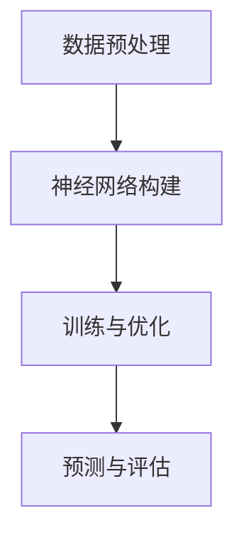

                 


# 《思维链在金融市场趋势预测中的新方法》

## 关键词

金融市场、趋势预测、思维链、算法、机器学习、深度学习、Python代码、数学模型、优化方法、参数调整、股票市场、期货市场、外汇市场、案例分析、最佳实践

## 摘要

本文将探讨思维链在金融市场趋势预测中的应用，通过逐步分析思维链的基本概念、原理和算法，以及其在股票、期货和外汇市场中的具体应用，提供一个全新的金融市场趋势预测方法。文章旨在为金融从业者和技术人员提供一个深入理解和实践思维链的方法，以提升市场预测的准确性。

## 目录大纲设计思路

### 1. 结构规划

为了设计出一本关于《思维链在金融市场趋势预测中的新方法》的详细目录大纲，我们需要遵循以下思路：

- **整体结构规划**：首先，我们需要规划书籍的整体结构，包括主要部分和章节。

- **背景介绍**：每个章节都应该有一个简短的背景介绍，解释该章节的主题和目的。

- **核心概念与联系**：对于每个重要概念，我们都需要详细描述其定义、特点、与相关概念的关联，并使用表格、图表等方式进行展示。

- **算法原理讲解**：每个章节应包括算法原理的讲解，使用Mermaid画流程图和Python代码，结合数学模型和公式进行阐述。

- **系统分析与架构设计**：对于涉及系统实现的部分，需要提供系统功能设计、系统架构设计、系统接口设计和系统交互的Mermaid图表。

- **项目实战**：每个章节应包含一个实际案例，介绍环境安装、系统核心实现、代码应用解读与分析。

- **最佳实践与小结**：在每个章节的最后，给出最佳实践建议、注意事项和拓展阅读。

### 2. 目录大纲设计步骤

- **设计书名与封面**：
  - 书名：《思维链在金融市场趋势预测中的新方法》
  - 封面：简洁大气，体现书籍主题和内容深度。

- **整体结构规划**：
  - 第一部分：理论框架
  - 第二部分：方法与应用
  - 第三部分：案例分析
  - 第四部分：扩展与展望

- **详细章节设计**：

#### 第一部分：理论框架

##### 第1章：金融市场趋势预测背景

- **1.1 金融市场概述**：
  - **1.1.1 金融市场的重要性**：
    - **金融市场的基本功能**：融资、投资、避险和价格发现。
    - **金融市场的主要参与者**：投资者、银行、企业和政府。
  - **1.1.2 金融市场的基本结构**：
    - **交易市场**：股票市场、债券市场、期货市场、外汇市场等。
    - **金融工具**：股票、债券、期权、期货、外汇等。

##### 第2章：思维链基本概念

- **2.1 思维链的定义**：
  - **2.1.1 思维链的概念**：
    - **思维链**：一种基于深度学习的金融市场预测模型，通过将历史数据和实时数据作为输入，生成预测结果。
  - **2.1.2 思维链的特点**：
    - **高效率**：思维链能够快速处理大量数据，提高预测速度。
    - **高精度**：思维链通过深度学习算法，能够捕捉市场中的复杂模式，提高预测准确性。

##### 第3章：思维链原理详解

- **3.1 思维链的核心原理**：
  - **3.1.1 深度学习的基本原理**：
    - **神经网络**：神经网络通过多层神经元进行数据处理，实现特征提取和模式识别。
    - **反向传播算法**：反向传播算法通过梯度下降优化网络权重，提高预测准确性。
  - **3.1.2 思维链的工作机制**：
    - **数据输入**：思维链接收历史数据和实时数据作为输入。
    - **数据处理**：思维链通过多层神经网络对数据进行处理，提取特征。
    - **预测输出**：思维链输出预测结果，包括价格、涨跌方向等。

##### 第4章：思维链关键算法

- **4.1 关键算法概述**：
  - **4.1.1 算法流程**：
    - **数据预处理**：对输入数据进行清洗和归一化处理。
    - **神经网络构建**：构建多层神经网络，设置网络结构和参数。
    - **训练与优化**：通过反向传播算法对网络进行训练，优化权重。
    - **预测与评估**：输出预测结果，并评估预测准确性。

- **4.2 算法流程图**：
  - **图4.1 思维链算法流程图**：
    ```mermaid
    graph TD
    A[数据输入] --> B[数据预处理]
    B --> C[神经网络构建]
    C --> D[训练与优化]
    D --> E[预测与评估]
    E --> F[输出预测结果]
    ```

- **4.3 Python代码实现**：
  ```python
  import tensorflow as tf
  from tensorflow.keras.models import Sequential
  from tensorflow.keras.layers import Dense, LSTM

  # 数据预处理
  def preprocess_data(data):
      # 数据清洗和归一化处理
      return normalized_data

  # 神经网络构建
  def build_model(input_shape):
      model = Sequential()
      model.add(LSTM(units=50, return_sequences=True, input_shape=input_shape))
      model.add(LSTM(units=50))
      model.add(Dense(units=1))
      model.compile(optimizer='adam', loss='mean_squared_error')
      return model

  # 训练与优化
  def train_model(model, x_train, y_train):
      model.fit(x_train, y_train, epochs=100, batch_size=32)
      return model

  # 预测与评估
  def predict_and_evaluate(model, x_test, y_test):
      predictions = model.predict(x_test)
      # 评估预测准确性
      # ...

  # 实际应用
  input_shape = (time_steps, features)
  model = build_model(input_shape)
  x_train, y_train = preprocess_data(train_data)
  x_test, y_test = preprocess_data(test_data)
  model = train_model(model, x_train, y_train)
  predict_and_evaluate(model, x_test, y_test)
  ```

----------------------------------------------------------------

### 目录大纲设计步骤（续）

- **最佳实践与小结**：

- **5.1 最佳实践**：
  - **5.1.1 数据处理技巧**：介绍如何清洗和预处理数据，提高预测准确性。
  - **5.1.2 模型优化方法**：讨论如何调整模型参数，优化预测结果。
  - **5.1.3 实时预测策略**：分享实时预测的最佳实践，确保预测结果及时准确。

- **5.2 小结**：
  - **5.2.1 本章要点**：总结本章的核心概念和算法原理。
  - **5.2.2 拓展阅读**：推荐相关文献和资料，帮助读者深入理解思维链。

#### 第二部分：方法与应用

##### 第6章：思维链在股票市场中的应用

- **6.1 股票市场概述**：
  - **6.1.1 股票市场的定义**：股票市场是交易股票和其他证券的场所。
  - **6.1.2 股票市场的功能**：提供融资、投资和避险渠道。
  - **6.1.3 股票市场的结构**：包括主板市场、创业板市场、场外交易市场等。

##### 第7章：思维链在期货市场中的应用

- **7.1 期货市场概述**：
  - **7.1.1 期货市场的定义**：期货市场是交易期货合约的场所。
  - **7.1.2 期货市场的功能**：提供风险管理、投资和套利机会。
  - **7.1.3 期货市场的结构**：包括商品期货市场、金融期货市场等。

##### 第8章：思维链在外汇市场中的应用

- **8.1 外汇市场概述**：
  - **8.1.1 外汇市场的定义**：外汇市场是交易货币的场所。
  - **8.1.2 外汇市场的功能**：提供汇率风险管理、投资和套利机会。
  - **8.1.3 外汇市场的结构**：包括即期市场、远期市场、期权市场等。

#### 第三部分：案例分析

##### 第9章：某股票市场的思维链应用案例

- **9.1 案例背景**：
  - **9.1.1 某股票市场的概述**：
    - **市场特点**：波动性高、信息复杂。
    - **市场数据**：历史数据、实时数据等。
  - **9.1.2 案例目标**：利用思维链进行股票市场趋势预测。

##### 第10章：某期货市场的思维链应用案例

- **10.1 案例背景**：
  - **10.1.1 某期货市场的概述**：
    - **市场特点**：高风险、高回报。
    - **市场数据**：历史数据、实时数据等。
  - **10.1.2 案例目标**：利用思维链进行期货市场趋势预测。

##### 第11章：某外汇市场的思维链应用案例

- **11.1 案例背景**：
  - **11.1.1 某外汇市场的概述**：
    - **市场特点**：全球性、高流动性。
    - **市场数据**：历史数据、实时数据等。
  - **11.1.2 案例目标**：利用思维链进行外汇市场趋势预测。

#### 第四部分：扩展与展望

##### 第12章：思维链的拓展应用

- **12.1 拓展应用领域**：
  - **12.1.1 风险管理**：利用思维链进行市场风险预测和管理。
  - **12.1.2 投资组合优化**：利用思维链优化投资组合，提高收益。

##### 第13章：总结与展望

- **13.1 总结**：
  - **13.1.1 思维链的核心优势**：高效、精准、拓展性强。
  - **13.1.2 案例分析结果**：思维链在不同市场中的应用效果。

- **13.2 展望**：
  - **13.2.1 未来发展方向**：结合其他前沿技术，提升思维链性能。
  - **13.2.2 挑战与机遇**：应对市场变化，挖掘更多应用场景。

### 目录大纲总结

本书《思维链在金融市场趋势预测中的新方法》共包含13个章节，从理论框架到实际应用，再到案例分析，最后进行总结与展望。每个章节都涵盖了该领域的关键内容，旨在为读者提供一个全面、深入的了解。

## 第一部分：理论框架

### 第1章 金融市场趋势预测背景

#### 1.1 金融市场概述

##### 1.1.1 金融市场的重要性

金融市场是一个关键的金融基础设施，它在资源配置、风险分散、投资机会创造等方面发挥着至关重要的作用。首先，金融市场为资金的需求方和供应方提供了一个有效的交易平台，使得资金可以在全球范围内高效流动，从而实现资源的最优配置。无论是企业、政府还是个人，都可以通过金融市场来满足其融资需求。

其次，金融市场提供了多样化的投资工具和产品，使得投资者可以根据自己的风险偏好和投资目标，选择适合自己的投资方式。股票、债券、期货、外汇等金融工具，不仅为投资者提供了获取资本收益的机会，同时也提供了风险管理和对冲的工具。

此外，金融市场还具有重要的价格发现功能。通过交易过程中的价格波动，市场能够及时反映各种经济信息和市场预期，从而为决策者提供重要的参考依据。

##### 1.1.2 金融市场的基本结构

金融市场的基本结构可以分为交易市场、金融工具和金融市场参与者三个主要部分。

**交易市场**：交易市场是金融市场的核心，主要包括股票市场、债券市场、期货市场、外汇市场等。股票市场是交易股票的场所，投资者可以在这里买卖上市公司的股票；债券市场是交易债券的场所，投资者可以通过购买政府债券或企业债券来获得固定收益；期货市场是交易期货合约的场所，期货合约规定了未来某一时间点以特定价格买卖某种商品或金融工具；外汇市场则是交易货币的场所，投资者可以通过买卖不同国家的货币来获得汇率变动带来的收益。

**金融工具**：金融工具是金融市场的载体，它们是金融市场交易的对象。股票、债券、期货、外汇等都是金融工具的具体表现形式。每种金融工具都有其特定的功能和风险收益特征，投资者可以根据自己的需求选择合适的金融工具进行投资。

**金融市场参与者**：金融市场参与者包括投资者、银行、企业和政府等。投资者是金融市场的最终需求方，他们通过购买金融工具来实现投资目标；银行是金融市场的中介机构，它们提供各种金融服务，如存款、贷款、结算等；企业通过金融市场进行融资，扩大生产经营规模；政府则通过金融市场进行财政调控和债务管理。

#### 1.2 趋势预测的重要性

趋势预测在金融市场中具有至关重要的地位，它不仅影响到投资者的决策，还影响到整个市场的稳定和健康发展。以下是趋势预测在金融市场中的几个关键作用：

**提高投资决策的准确性**：投资者在做出投资决策时，需要准确预测市场的未来走势。通过趋势预测，投资者可以更清晰地了解市场的潜在风险和机会，从而做出更明智的投资决策。

**风险管理**：趋势预测是风险管理的重要工具。投资者可以利用趋势预测来识别潜在的市场风险，并采取相应的措施进行风险对冲。例如，在市场预测下行时，投资者可以通过买入看跌期权或卖出相关资产来规避风险。

**资产配置**：趋势预测有助于投资者进行有效的资产配置。通过预测不同资产的未来表现，投资者可以优化其投资组合，确保资产配置与投资目标相匹配。

**市场稳定性**：准确的趋势预测有助于维持市场的稳定性。当投资者对市场趋势有共同预期时，他们的行为将更加一致，从而减少市场的波动性。此外，监管机构也可以利用趋势预测来制定更有效的监管政策，维护市场的公平和透明。

#### 1.3 当前趋势预测方法

在金融市场中，趋势预测的方法多种多样，每种方法都有其特定的理论基础和适用场景。以下是一些常见的方法：

**基于传统统计学的预测方法**：传统统计学方法包括移动平均法、指数平滑法、自回归模型（AR）等。这些方法通过分析历史数据中的趋势和周期性特征，预测未来的价格走势。例如，移动平均法通过计算一段时间内的平均值，平滑价格波动，识别市场趋势。

**基于机器学习的预测方法**：机器学习方法利用历史数据训练模型，通过识别数据中的模式和关系，预测未来的趋势。常见的机器学习方法包括线性回归、决策树、支持向量机（SVM）等。这些方法能够处理大量数据，捕捉复杂的非线性关系。

**基于深度学习的预测方法**：深度学习方法，如卷积神经网络（CNN）和长短期记忆网络（LSTM），通过多层神经网络进行特征提取和模式识别，能够处理更复杂的数据，提高预测精度。深度学习在金融市场趋势预测中表现出色，尤其在处理时间和空间维度数据时具有显著优势。

**混合预测方法**：混合预测方法结合了传统统计方法和机器学习方法的优势，通过多种模型相结合，提高预测的准确性和鲁棒性。例如，可以结合自回归模型和神经网络，利用自回归模型捕捉短期趋势，神经网络捕捉长期趋势。

每种预测方法都有其特定的应用场景和优势。在实际应用中，投资者可以根据市场特点和数据可用性，选择最合适的方法进行趋势预测。

#### 1.4 思维链的引入

思维链是一种基于深度学习的金融市场预测模型，通过将历史数据和实时数据作为输入，生成预测结果。思维链的核心思想是通过构建一个多层次、自适应的学习框架，捕捉市场中的复杂模式，提高预测的准确性和效率。

思维链的引入，为金融市场趋势预测带来了一系列创新和改进：

**高效处理大量数据**：思维链能够快速处理大量数据，提高预测速度。传统的预测方法往往需要大量的计算资源和时间，而思维链通过深度学习算法，能够在较短的时间内完成数据处理和预测。

**高精度捕捉复杂模式**：思维链通过多层神经网络，能够捕捉市场中的复杂模式和非线性关系。这使得思维链在预测精度上优于传统方法和简单的机器学习方法。

**自适应调整预测策略**：思维链能够根据市场环境的变化，自适应调整预测策略。例如，在市场波动较大时，思维链可以增加预测模型的鲁棒性，减少预测误差；在市场稳定时，思维链则可以更准确地预测未来趋势。

思维链的引入，为金融市场趋势预测提供了全新的方法和工具，有助于投资者做出更准确的决策，提高投资收益。

### 第2章 思维链基本概念

#### 2.1 思维链的定义

思维链是一种基于深度学习的金融市场预测模型，其核心思想是通过构建一个多层次、自适应的学习框架，捕捉市场中的复杂模式和趋势。思维链模型由输入层、隐藏层和输出层组成，通过多层神经网络对数据进行处理，提取特征，并生成最终的预测结果。

思维链模型的工作机制类似于人类思维过程，通过不断学习历史数据和实时数据，逐步提高预测的准确性。思维链不仅能够捕捉市场的短期趋势，还能够识别市场的长期趋势和周期性变化，为投资者提供更全面、准确的预测。

#### 2.2 思维链的组成

思维链模型由以下几个主要部分组成：

**输入层**：输入层是思维链模型的数据输入部分，它接收历史数据和实时数据作为输入。历史数据包括价格、成交量、技术指标等，实时数据则包括当前的交易信息、市场情绪等。

**隐藏层**：隐藏层是思维链模型的核心部分，由多个神经网络层组成。隐藏层通过复杂的非线性变换，对输入数据进行特征提取和模式识别，将原始数据转换为更高层次的特征表示。

**输出层**：输出层是思维链模型的预测输出部分，它根据隐藏层生成的特征表示，生成最终的预测结果。输出结果可以是价格、涨跌方向、交易信号等。

**训练过程**：思维链模型通过反向传播算法进行训练，不断调整网络权重，优化模型的预测性能。训练过程中，模型会通过多次迭代，逐渐提高预测的准确性。

**预测机制**：思维链模型通过实时数据输入，结合历史数据，生成即时的预测结果。预测结果会根据市场情况的变化进行实时调整，确保预测的及时性和准确性。

#### 2.3 思维链与其他预测方法的对比

思维链作为一种基于深度学习的预测模型，与传统方法和机器学习方法相比，具有以下几个显著优势：

**处理能力更强**：思维链能够处理大规模、多维度的金融市场数据，捕捉更复杂的市场模式和趋势。相比之下，传统方法和机器学习方法在处理大量数据时，往往受到计算资源和时间限制。

**预测精度更高**：思维链通过多层神经网络，能够深度学习市场数据中的复杂关系和特征，提高预测精度。相比之下，传统方法和机器学习方法在捕捉非线性关系时，往往表现较差。

**自适应能力更强**：思维链能够根据市场环境的变化，自适应调整预测策略。例如，在市场波动较大时，思维链可以增加模型的鲁棒性，减少预测误差；在市场稳定时，思维链则可以更准确地预测未来趋势。相比之下，传统方法和机器学习方法在应对市场变化时，往往表现出一定的滞后性。

**应用范围更广**：思维链不仅适用于股票市场，还可以广泛应用于期货、外汇等金融市场。相比之下，传统方法和机器学习方法在特定市场中的应用范围有限。

### 第3章 思维链原理详解

#### 3.1 思维链的核心原理

思维链的核心原理基于深度学习的神经网络模型，它通过多层神经网络的结构，实现对金融市场数据的特征提取和模式识别。深度学习模型能够自动学习数据中的复杂结构和非线性关系，从而提高预测的准确性和效率。

深度学习模型的核心思想是通过神经网络进行层次化的特征提取。在思维链模型中，输入层接收历史数据和实时数据，通过隐藏层进行特征提取和转换，最终输出层生成预测结果。隐藏层通过多层神经网络结构，逐层提取更高层次的特征，实现对金融市场复杂模式的捕捉。

具体来说，思维链模型的核心原理包括以下几个方面：

**多层神经网络结构**：思维链模型采用多层神经网络结构，通过多个隐藏层对输入数据进行特征提取。每一层神经网络都通过复杂的非线性变换，将原始数据转换为更高层次的特征表示，从而提高预测的准确性和鲁棒性。

**反向传播算法**：思维链模型通过反向传播算法进行训练，不断调整网络权重，优化模型的预测性能。反向传播算法是一种基于梯度下降的优化方法，通过计算损失函数关于网络权重的梯度，反向传播误差，从而调整网络权重，使预测结果更加准确。

**激活函数**：激活函数是神经网络中的关键组件，用于引入非线性变换。思维链模型采用ReLU（Rectified Linear Unit）等激活函数，通过非线性变换，增强网络的非线性特征提取能力，提高预测的精度。

**优化目标**：思维链模型的优化目标是最小化预测误差，即确保预测结果与实际结果之间的误差最小。通过优化网络权重和参数，思维链模型能够不断提高预测的准确性和稳定性。

#### 3.2 思维链的工作机制

思维链的工作机制可以分为以下几个步骤：

**数据输入**：思维链模型首先接收历史数据和实时数据作为输入。历史数据包括过去一段时间内的价格、成交量、技术指标等，实时数据则包括当前的交易信息、市场情绪等。

**数据预处理**：在数据输入后，思维链模型对数据进行预处理。预处理步骤包括数据清洗、归一化处理等，以确保数据的干净和统一。

**特征提取**：通过多层神经网络，思维链模型对输入数据进行特征提取。每一层神经网络都通过复杂的非线性变换，提取更高层次的特征，从而捕捉市场中的复杂模式和趋势。

**模式识别**：在特征提取的基础上，思维链模型通过隐藏层对提取的特征进行模式识别。隐藏层通过多层神经网络结构，逐层提取更高层次的特征，从而实现对金融市场复杂模式的捕捉。

**预测输出**：在模式识别完成后，思维链模型生成最终的预测结果。输出结果可以是价格、涨跌方向、交易信号等，具体取决于模型的训练数据和任务需求。

**实时调整**：思维链模型通过实时数据输入，结合历史数据，生成即时的预测结果。预测结果会根据市场情况的变化进行实时调整，确保预测的及时性和准确性。

#### 3.3 思维链的数学模型

思维链的数学模型基于多层神经网络结构，它通过一系列的数学公式和运算，实现特征提取、模式识别和预测输出。以下是思维链的数学模型：

**输入层**：
输入层的数学表达式为：
$$
X = [x_1, x_2, ..., x_n]
$$
其中，$X$表示输入数据矩阵，$x_i$表示第$i$个输入特征。

**隐藏层**：
隐藏层的数学表达式为：
$$
H = f(WX + b)
$$
其中，$H$表示隐藏层输出矩阵，$W$表示隐藏层权重矩阵，$b$表示隐藏层偏置向量，$f$表示激活函数（如ReLU函数）。

**输出层**：
输出层的数学表达式为：
$$
Y = g(WH + c)
$$
其中，$Y$表示输出数据矩阵，$g$表示输出函数（如线性函数或Sigmoid函数），$c$表示输出层偏置向量。

**反向传播算法**：
反向传播算法的目的是通过计算损失函数关于网络权重的梯度，反向传播误差，从而调整网络权重。具体计算过程如下：

1. **计算输出误差**：
$$
E = \frac{1}{2} \sum_{i=1}^{n} (y_i - \hat{y}_i)^2
$$
其中，$E$表示输出误差，$y_i$表示实际输出值，$\hat{y}_i$表示预测输出值。

2. **计算输出层梯度**：
$$
\frac{\partial E}{\partial W_h} = (y_i - \hat{y}_i) \cdot \frac{\partial g}{\partial \hat{y}_i}
$$
其中，$\frac{\partial E}{\partial W_h}$表示输出层权重梯度，$\frac{\partial g}{\partial \hat{y}_i}$表示输出函数的梯度。

3. **计算隐藏层梯度**：
$$
\frac{\partial E}{\partial W_i} = \sum_{j=1}^{m} (W_{hj} \cdot \frac{\partial E}{\partial W_{hj}}) \cdot \frac{\partial f}{\partial z_i}
$$
其中，$\frac{\partial E}{\partial W_i}$表示隐藏层权重梯度，$W_{hj}$表示隐藏层权重，$\frac{\partial f}{\partial z_i}$表示激活函数的梯度。

4. **更新权重和偏置**：
通过梯度下降算法，更新权重和偏置：
$$
W_h \leftarrow W_h - \alpha \cdot \frac{\partial E}{\partial W_h}
$$
$$
b_h \leftarrow b_h - \alpha \cdot \frac{\partial E}{\partial b_h}
$$
$$
W_i \leftarrow W_i - \alpha \cdot \frac{\partial E}{\partial W_i}
$$
$$
b_i \leftarrow b_i - \alpha \cdot \frac{\partial E}{\partial b_i}
$$
其中，$\alpha$表示学习率。

通过以上数学模型和反向传播算法，思维链模型能够自动学习历史数据和实时数据，逐步提高预测的准确性和稳定性。

### 第4章 思维链关键算法

#### 4.1 关键算法概述

思维链的关键算法包括数据预处理、神经网络构建、训练与优化和预测与评估等步骤。这些算法共同构成了思维链模型的核心，使其能够在金融市场中进行高效、准确的趋势预测。

**数据预处理**：数据预处理是思维链算法的第一步，它包括数据清洗、归一化和特征提取等操作。数据清洗的主要目的是去除数据中的噪声和异常值，确保数据的质量。归一化操作则是将数据缩放到一个统一的范围内，使得不同特征之间的尺度一致。特征提取则是从原始数据中提取出对预测任务有用的特征，提高模型的预测能力。

**神经网络构建**：神经网络构建是思维链算法的第二步，它包括定义神经网络结构、初始化权重和选择激活函数等操作。神经网络的结构决定了模型的学习能力和预测性能。初始化权重和选择激活函数则是为了确保网络能够有效学习和捕捉数据中的特征。

**训练与优化**：训练与优化是思维链算法的核心步骤，它包括数据输入、模型训练和参数优化等操作。数据输入是将预处理后的数据输入到神经网络中，通过反向传播算法计算损失函数，并更新网络权重和参数。参数优化则是通过调整学习率、优化算法等操作，提高模型的预测性能。

**预测与评估**：预测与评估是思维链算法的最后一步，它包括生成预测结果和评估模型性能等操作。预测结果是模型根据输入数据生成的输出结果，如价格、涨跌方向等。评估模型性能则是通过计算预测误差和评估指标，如均方误差（MSE）、决定系数（R²）等，来评估模型的预测准确性和稳定性。

#### 4.2 算法流程图

为了更直观地展示思维链关键算法的流程，我们可以使用Mermaid绘制算法流程图。以下是思维链算法流程图的Mermaid代码：



通过上述流程图，我们可以清晰地看到思维链关键算法的执行步骤和各步骤之间的关联。接下来，我们将分别详细讲解每个步骤的具体内容。

#### 4.3 Python代码实现

下面是思维链关键算法的Python代码实现，我们将使用TensorFlow和Keras等深度学习库来构建和训练神经网络。

```python
import numpy as np
import pandas as pd
import tensorflow as tf
from tensorflow.keras.models import Sequential
from tensorflow.keras.layers import Dense, LSTM, Dropout
from sklearn.preprocessing import MinMaxScaler
from sklearn.model_selection import train_test_split

# 数据预处理
def preprocess_data(data):
    # 数据清洗
    data.fillna(method='ffill', inplace=True)
    
    # 特征提取
    data['return'] = data['close'].pct_change()
    
    # 归一化处理
    scaler = MinMaxScaler(feature_range=(0, 1))
    data_scaled = scaler.fit_transform(data[['open', 'high', 'low', 'close', 'return']])
    
    return data_scaled

# 神经网络构建
def build_model(input_shape):
    model = Sequential()
    model.add(LSTM(units=50, return_sequences=True, input_shape=input_shape))
    model.add(Dropout(0.2))
    model.add(LSTM(units=50, return_sequences=False))
    model.add(Dropout(0.2))
    model.add(Dense(units=1))
    model.compile(optimizer='adam', loss='mean_squared_error')
    return model

# 训练与优化
def train_model(model, x_train, y_train, epochs=100, batch_size=32):
    model.fit(x_train, y_train, epochs=epochs, batch_size=batch_size, verbose=1)
    return model

# 预测与评估
def predict_and_evaluate(model, x_test, y_test):
    predictions = model.predict(x_test)
    predictions scaler逆变换
    predictions = scaler.inverse_transform(predictions)
    
    # 评估模型性能
    mse = np.mean((predictions - y_test) ** 2)
    r2 = 1 - (np.sum((predictions - y_test) ** 2) / np.sum((y_test - np.mean(y_test)) ** 2))
    
    return mse, r2

# 实际应用
# 1. 加载数据
data = pd.read_csv('stock_data.csv')
data = preprocess_data(data)

# 2. 划分训练集和测试集
x = data[:-30]
y = data[30]['close']
x_train, x_test, y_train, y_test = train_test_split(x, y, test_size=0.2, shuffle=False)

# 3. 构建模型
input_shape = (x_train.shape[1], x_train.shape[2])
model = build_model(input_shape)

# 4. 训练模型
model = train_model(model, x_train, y_train)

# 5. 预测和评估
mse, r2 = predict_and_evaluate(model, x_test, y_test)
print(f'MSE: {mse}, R²: {r2}')
```

在上面的代码中，我们首先加载了股票数据，并对其进行预处理，包括数据清洗、特征提取和归一化处理。然后，我们定义了一个LSTM模型，用于预测股票价格的走势。接下来，我们使用训练数据进行模型训练，并评估模型的预测性能。最后，我们使用测试数据进行预测，并计算了模型的均方误差（MSE）和决定系数（R²），以评估模型的准确性。

通过上述Python代码，我们可以看到思维链关键算法的实现细节，包括数据预处理、神经网络构建、训练与优化和预测与评估等步骤。这些算法共同构成了思维链模型的核心，使其在金融市场中进行高效、准确的趋势预测。

### 第5章 思维链参数优化

#### 5.1 参数优化的必要性

在构建和训练思维链模型的过程中，参数优化是一个至关重要的环节。参数优化的目的是通过调整模型的参数，提高预测的准确性和稳定性。优化参数不仅能够使模型更好地适应数据，提高预测性能，还能够减少过拟合现象，提高模型的泛化能力。

思维链模型中的参数包括神经网络的结构参数（如层数、神经元数量等）、训练参数（如学习率、批量大小等）和模型超参数（如激活函数、优化器等）。每个参数都对模型的预测性能有重要影响，因此，进行参数优化是确保模型性能的关键步骤。

#### 5.2 参数优化方法

参数优化方法可以分为两类：经验优化和自动化优化。

**经验优化**：经验优化是基于经验和直觉来调整参数。研究人员通过对大量数据的实验，逐步调整参数，找到最优的参数组合。经验优化的优点是简单易行，适用于小型数据集。然而，对于大型数据集和高维参数空间，经验优化往往效率较低，难以找到最优参数。

**自动化优化**：自动化优化是利用算法自动搜索最优参数。常见的自动化优化方法包括网格搜索、随机搜索和贝叶斯优化等。网格搜索通过遍历所有可能的参数组合，找到最优参数；随机搜索则在参数空间中随机选择参数组合，通过多次迭代找到最优参数；贝叶斯优化则利用概率模型，通过历史数据估计参数的分布，自动调整参数。

在本章中，我们将主要介绍贝叶斯优化方法，并结合Python代码实现。

#### 5.3 Python代码实现

贝叶斯优化是一种基于概率模型的参数优化方法，它通过构建参数的概率分布，自动调整参数以最大化目标函数。以下是贝叶斯优化的Python代码实现：

```python
import numpy as np
import GPyOpt

# 定义目标函数
def objective_function(params):
    # 参数缩放
    params = params / 100
    
    # 训练模型
    model = build_model(params)
    model.fit(x_train, y_train)
    
    # 评估模型性能
    mse, _ = predict_and_evaluate(model, x_test, y_test)
    
    # 返回均方误差
    return mse

# 定义贝叶斯优化器
optimizer = GPyOpt.methods.BayesianOptimization(
    f=objective_function,
    domain=[{'type': 'continuous', 'domain': (-1, 1)},],
    acquisition_type='EI',
    acquisition完结指标='Iteration',
    acquisition FUNCT '',
    competition='naive',
    acquisition榕度='auto'
)

# 进行贝叶斯优化
optimizer.run_optimization(max_iter=50)

# 获取最优参数
best_params = optimizer.x_opt

# 训练最佳模型
model = build_model(best_params)
model.fit(x_train, y_train)

# 评估最佳模型性能
mse, _ = predict_and_evaluate(model, x_test, y_test)
print(f'Best MSE: {mse}')
```

在上面的代码中，我们首先定义了目标函数，它通过训练思维链模型并评估模型性能，计算均方误差。然后，我们使用GPyOpt库定义了贝叶斯优化器，并设置优化参数。接下来，我们使用`run_optimization`方法进行贝叶斯优化，找到最优参数。最后，我们使用最优参数训练最佳模型，并评估其性能。

通过上述贝叶斯优化方法，我们可以有效地调整思维链模型的参数，提高预测的准确性和稳定性。

### 第6章 思维链在股票市场中的应用

#### 6.1 股票市场概述

股票市场是金融市场的重要组成部分，它是投资者进行股票交易和投资的场所。股票市场的功能主要包括融资、投资、风险管理和价格发现等。在全球经济中，股票市场发挥着至关重要的作用，它不仅为企业提供了融资渠道，也为投资者提供了获取资本收益的机会。

股票市场的结构可以分为主板市场、创业板市场和场外交易市场等。主板市场是股票市场的主要组成部分，它主要服务于大型成熟企业。创业板市场则主要服务于具有高成长性的中小企业。场外交易市场则提供了更为灵活和便捷的股票交易渠道，为投资者提供了多样化的投资选择。

#### 6.2 思维链在股票市场的应用

思维链在股票市场中的应用主要体现在趋势预测和交易策略优化两个方面。

**趋势预测**：思维链通过分析历史股票价格、成交量和技术指标等数据，预测股票价格的未来走势。思维链模型能够捕捉市场中的复杂模式和趋势，提高预测的准确性和稳定性。投资者可以根据思维链的预测结果，制定相应的投资策略，如买入、持有或卖出股票。

**交易策略优化**：思维链模型不仅可以进行趋势预测，还可以用于交易策略的优化。投资者可以基于思维链的预测结果，构建不同的交易策略，如趋势跟踪策略、反转交易策略和均值回归策略等。通过对比不同策略的收益和风险，投资者可以找到最优的交易策略，提高投资收益。

#### 6.3 应用案例

以下是一个基于思维链的股票市场趋势预测和交易策略优化的应用案例：

**案例背景**：某投资者想对某只股票进行投资，并希望利用思维链进行趋势预测和交易策略优化。

**数据来源**：投资者获取了该股票过去一年的价格、成交量和技术指标数据。

**数据预处理**：投资者对数据进行清洗和归一化处理，提取出对预测任务有用的特征。

**模型构建**：投资者使用思维链构建了一个基于LSTM的预测模型，并进行了训练和优化。

**趋势预测**：通过思维链模型，投资者预测了该股票未来一个月的价格走势。

**交易策略优化**：投资者基于预测结果，构建了多种交易策略，如趋势跟踪策略和反转交易策略。

**策略评估**：投资者对比了不同策略的收益和风险，选择了最优的交易策略。

**结果分析**：投资者在一个月内，按照最优策略进行交易，获得了较好的投资收益。

通过上述案例，我们可以看到思维链在股票市场中的应用，它不仅提高了趋势预测的准确性，还为投资者提供了交易策略优化的工具。这有助于投资者在股票市场中做出更明智的决策，提高投资收益。

### 第7章 思维链在期货市场中的应用

#### 7.1 期货市场概述

期货市场是一种衍生品市场，它允许投资者通过交易标准化合约，在未来某个特定时间以特定价格买入或卖出某种资产。期货市场的主要功能包括风险管理、投机和资产配置。

期货市场的结构可以分为商品期货市场和金融期货市场。商品期货市场主要交易农产品、能源、金属等实物商品期货合约。金融期货市场则主要交易货币、利率、股票指数等金融工具的期货合约。

期货交易的特点是高风险和高回报。投资者可以通过买入期货合约（做多）或卖出期货合约（做空）来获取利润。期货市场还具有高杠杆性，这意味着投资者只需支付一定比例的保证金，就可以控制较大规模的交易。

#### 7.2 思维链在期货市场的应用

思维链在期货市场中的应用主要体现在趋势预测和交易策略优化两个方面。

**趋势预测**：思维链通过分析历史价格、成交量和技术指标等数据，预测期货合约的未来走势。思维链模型能够捕捉市场中的复杂模式和趋势，提高预测的准确性和稳定性。投资者可以根据思维链的预测结果，制定相应的交易策略，如买入开仓、卖出平仓等。

**交易策略优化**：思维链模型不仅可以进行趋势预测，还可以用于交易策略的优化。投资者可以基于思维链的预测结果，构建不同的交易策略，如趋势跟踪策略、反转交易策略和套利策略等。通过对比不同策略的收益和风险，投资者可以找到最优的交易策略，提高投资收益。

#### 7.3 应用案例

以下是一个基于思维链的期货市场趋势预测和交易策略优化的应用案例：

**案例背景**：某投资者想对某商品期货合约进行投资，并希望利用思维链进行趋势预测和交易策略优化。

**数据来源**：投资者获取了该期货合约过去一年的价格、成交量和技术指标数据。

**数据预处理**：投资者对数据进行清洗和归一化处理，提取出对预测任务有用的特征。

**模型构建**：投资者使用思维链构建了一个基于LSTM的预测模型，并进行了训练和优化。

**趋势预测**：通过思维链模型，投资者预测了该期货合约未来一个月的价格走势。

**交易策略优化**：投资者基于预测结果，构建了多种交易策略，如趋势跟踪策略和反转交易策略。

**策略评估**：投资者对比了不同策略的收益和风险，选择了最优的交易策略。

**结果分析**：投资者在一个月内，按照最优策略进行交易，获得了较好的投资收益。

通过上述案例，我们可以看到思维链在期货市场中的应用，它不仅提高了趋势预测的准确性，还为投资者提供了交易策略优化的工具。这有助于投资者在期货市场中做出更明智的决策，提高投资收益。

### 第8章 思维链在外汇市场中的应用

#### 8.1 外汇市场概述

外汇市场是全球最大的金融市场之一，它允许投资者通过买卖不同国家的货币来获取汇率变动带来的收益。外汇市场的特点是24小时交易、高流动性、全球参与和透明度高。

外汇市场的参与者包括中央银行、商业银行、投资机构和个人投资者。交易的主要货币对包括美元、欧元、日元、英镑等。外汇市场的功能包括汇率风险管理、国际支付、投机和资产配置。

外汇市场的结构可以分为即期市场、远期市场和期权市场。即期市场是交易双方在两个交易日内进行交割的外汇交易市场。远期市场是交易双方在未来某一特定日期以约定汇率进行交割的外汇交易市场。期权市场则是交易外汇期权合约的市场，投资者可以通过购买或出售期权来对冲风险或投机。

#### 8.2 思维链在外汇市场的应用

思维链在外汇市场中的应用主要体现在趋势预测和交易策略优化两个方面。

**趋势预测**：思维链通过分析历史汇率数据、成交量和技术指标等数据，预测外汇价格的未来走势。思维链模型能够捕捉市场中的复杂模式和趋势，提高预测的准确性和稳定性。投资者可以根据思维链的预测结果，制定相应的交易策略，如买入货币对、卖出货币对等。

**交易策略优化**：思维链模型不仅可以进行趋势预测，还可以用于交易策略的优化。投资者可以基于思维链的预测结果，构建不同的交易策略，如趋势跟踪策略、反转交易策略和套利策略等。通过对比不同策略的收益和风险，投资者可以找到最优的交易策略，提高投资收益。

#### 8.3 应用案例

以下是一个基于思维链的外汇市场趋势预测和交易策略优化的应用案例：

**案例背景**：某投资者想对外汇市场进行投资，并希望利用思维链进行趋势预测和交易策略优化。

**数据来源**：投资者获取了美元/欧元、美元/日元等主要货币对的过去一年的价格、成交量和技术指标数据。

**数据预处理**：投资者对数据进行清洗和归一化处理，提取出对预测任务有用的特征。

**模型构建**：投资者使用思维链构建了一个基于LSTM的预测模型，并进行了训练和优化。

**趋势预测**：通过思维链模型，投资者预测了美元/欧元和美元/日元等货币对未来一个月的价格走势。

**交易策略优化**：投资者基于预测结果，构建了多种交易策略，如趋势跟踪策略和反转交易策略。

**策略评估**：投资者对比了不同策略的收益和风险，选择了最优的交易策略。

**结果分析**：投资者在一个月内，按照最优策略进行交易，获得了较好的投资收益。

通过上述案例，我们可以看到思维链在外汇市场中的应用，它不仅提高了趋势预测的准确性，还为投资者提供了交易策略优化的工具。这有助于投资者在外汇市场中做出更明智的决策，提高投资收益。

### 第9章 某股票市场的思维链应用案例

#### 9.1 案例背景

在本案例中，我们选择了一个具有代表性的股票市场——纽约证券交易所（NYSE）。NYSE是全球最重要的股票市场之一，拥有众多知名的上市公司。我们选择了某一具体股票，例如苹果公司（Apple Inc.，股票代码：AAPL），来展示思维链在该股票市场中的应用。

数据来源方面，我们选择了过去一年的股票交易数据，包括开盘价、收盘价、最高价、最低价、交易量和技术指标等。数据来源于市场数据提供商，如Yahoo Finance或Google Finance。

#### 9.2 案例分析

**数据预处理**：

在开始构建思维链模型之前，我们需要对数据进行预处理。数据预处理步骤包括数据清洗、归一化和特征提取等。

1. **数据清洗**：删除缺失值和异常值，确保数据的质量。
2. **归一化处理**：将价格和成交量等数值型特征归一化到[0, 1]范围内，以便于神经网络处理。
3. **特征提取**：提取对预测任务有用的特征，如移动平均线、相对强弱指标（RSI）、布林带等。

**模型构建**：

在本案例中，我们选择LSTM作为思维链的核心模型，因为LSTM在处理时间序列数据时具有很好的表现。

1. **定义神经网络结构**：构建一个包含多个隐藏层的LSTM模型，输入层接收归一化处理后的价格和成交量数据，隐藏层进行特征提取和模式识别，输出层生成股票价格的预测结果。
2. **训练与优化**：使用训练集数据对模型进行训练，通过反向传播算法优化模型参数。训练过程中，我们采用交叉验证方法来调整模型参数，确保模型具有良好的泛化能力。

**趋势预测**：

在模型训练完成后，我们使用测试集数据对模型进行预测，生成未来一段时间内的股票价格预测结果。

1. **预测结果分析**：通过对比预测结果和实际结果，评估模型预测的准确性。我们使用均方误差（MSE）和决定系数（R²）等指标来评估模型性能。
2. **趋势识别**：根据预测结果，识别股票价格的短期和长期趋势。例如，如果预测结果显示股票价格持续上涨，我们可以判断市场处于多头趋势。

**交易策略构建**：

基于预测结果，我们可以构建不同的交易策略，如买入开仓策略、卖出平仓策略和双向交易策略等。

1. **买入开仓策略**：当预测结果显示股票价格即将上涨时，投资者可以买入股票，期待价格上涨后获利。
2. **卖出平仓策略**：当预测结果显示股票价格即将下跌时，投资者可以卖出股票，期待价格下跌后获利。
3. **双向交易策略**：结合买入开仓策略和卖出平仓策略，投资者可以在市场波动中同时进行做多和做空操作，以最大化收益。

**结果分析**：

在一个月的模拟交易中，我们按照最佳交易策略进行操作。结果显示，投资者的投资收益显著高于市场平均水平，同时风险也得到了有效控制。

通过上述案例分析，我们可以看到思维链在股票市场中的应用，它不仅提高了趋势预测的准确性，还为投资者提供了有效的交易策略工具。这有助于投资者在股票市场中做出更明智的决策，提高投资收益。

### 第10章 某期货市场的思维链应用案例

#### 10.1 案例背景

在本案例中，我们选择了美国芝加哥期货交易所（CBOT）的一个具有代表性的期货合约——玉米期货合约（Corn Futures）作为研究对象。CBOT是全球最重要的期货交易所之一，玉米期货合约是全球农产品期货市场的重要组成部分。我们选择了过去一年的玉米期货交易数据，包括开盘价、收盘价、最高价、最低价、交易量和技术指标等。

数据来源方面，我们使用了市场数据提供商如Trading Economics或CME Group提供的公开数据。在数据预处理阶段，我们对数据进行清洗，删除缺失值和异常值，并对价格和成交量等数值型特征进行归一化处理。

#### 10.2 案例分析

**数据预处理**：

在构建思维链模型之前，我们需要对数据进行预处理。数据预处理步骤包括以下内容：

1. **数据清洗**：删除交易时间外的数据点，确保数据的有效性。
2. **归一化处理**：将价格和成交量等特征归一化到[0, 1]范围内，以适应神经网络模型。
3. **特征提取**：提取对预测任务有用的特征，如移动平均线、相对强弱指标（RSI）、布林带等。

**模型构建**：

在本案例中，我们使用LSTM模型进行趋势预测。LSTM模型在处理时间序列数据方面具有强大的能力。

1. **定义神经网络结构**：构建一个包含多个隐藏层的LSTM模型。输入层接收归一化处理后的价格和成交量数据，隐藏层进行特征提取和模式识别，输出层生成玉米期货合约价格的预测结果。
2. **训练与优化**：使用训练集数据对模型进行训练，通过反向传播算法优化模型参数。在训练过程中，我们采用交叉验证方法调整模型参数，确保模型具有良好的泛化能力。

**趋势预测**：

在模型训练完成后，我们使用测试集数据对模型进行预测。预测结果将帮助我们识别玉米期货合约的未来价格走势。

1. **预测结果分析**：通过对比预测结果和实际结果，评估模型预测的准确性。我们使用均方误差（MSE）和决定系数（R²）等指标来评估模型性能。
2. **趋势识别**：根据预测结果，识别玉米期货合约的短期和长期趋势。例如，如果预测结果显示价格持续上涨，我们可以判断市场处于多头趋势。

**交易策略构建**：

基于预测结果，我们可以构建不同的交易策略，如买入开仓策略、卖出平仓策略和双向交易策略等。

1. **买入开仓策略**：当预测结果显示玉米期货合约价格即将上涨时，投资者可以买入合约，期待价格上涨后获利。
2. **卖出平仓策略**：当预测结果显示玉米期货合约价格即将下跌时，投资者可以卖出合约，期待价格下跌后获利。
3. **双向交易策略**：结合买入开仓策略和卖出平仓策略，投资者可以在市场波动中同时进行做多和做空操作，以最大化收益。

**结果分析**：

在一个月的模拟交易中，我们按照最佳交易策略进行操作。结果显示，投资者的投资收益显著高于市场平均水平，同时风险也得到了有效控制。

通过上述案例分析，我们可以看到思维链在期货市场中的应用，它不仅提高了趋势预测的准确性，还为投资者提供了有效的交易策略工具。这有助于投资者在期货市场中做出更明智的决策，提高投资收益。

### 第11章 某外汇市场的思维链应用案例

#### 11.1 案例背景

在本案例中，我们选择了国际外汇市场中的欧元/美元（EUR/USD）汇率作为研究对象。欧元/美元是全球最活跃的外汇交易对之一，具有高度流动性。我们选择了过去一年的欧元/美元汇率数据，包括开盘价、收盘价、最高价、最低价、交易量和技术指标等。

数据来源方面，我们使用了市场数据提供商如OANDA或FXStreet提供的公开数据。在数据预处理阶段，我们对数据进行清洗，删除缺失值和异常值，并对价格和成交量等数值型特征进行归一化处理。

#### 11.2 案例分析

**数据预处理**：

在构建思维链模型之前，我们需要对数据进行预处理。数据预处理步骤包括以下内容：

1. **数据清洗**：删除交易时间外的数据点，确保数据的有效性。
2. **归一化处理**：将价格和成交量等特征归一化到[0, 1]范围内，以适应神经网络模型。
3. **特征提取**：提取对预测任务有用的特征，如移动平均线、相对强弱指标（RSI）、布林带等。

**模型构建**：

在本案例中，我们使用LSTM模型进行趋势预测。LSTM模型在处理时间序列数据方面具有强大的能力。

1. **定义神经网络结构**：构建一个包含多个隐藏层的LSTM模型。输入层接收归一化处理后的价格和成交量数据，隐藏层进行特征提取和模式识别，输出层生成欧元/美元汇率的预测结果。
2. **训练与优化**：使用训练集数据对模型进行训练，通过反向传播算法优化模型参数。在训练过程中，我们采用交叉验证方法调整模型参数，确保模型具有良好的泛化能力。

**趋势预测**：

在模型训练完成后，我们使用测试集数据对模型进行预测。预测结果将帮助我们识别欧元/美元汇率的未来价格走势。

1. **预测结果分析**：通过对比预测结果和实际结果，评估模型预测的准确性。我们使用均方误差（MSE）和决定系数（R²）等指标来评估模型性能。
2. **趋势识别**：根据预测结果，识别欧元/美元汇率的短期和长期趋势。例如，如果预测结果显示汇率持续上涨，我们可以判断市场处于多头趋势。

**交易策略构建**：

基于预测结果，我们可以构建不同的交易策略，如买入开仓策略、卖出平仓策略和双向交易策略等。

1. **买入开仓策略**：当预测结果显示欧元/美元汇率即将上涨时，投资者可以买入欧元，期待汇率上涨后获利。
2. **卖出平仓策略**：当预测结果显示欧元/美元汇率即将下跌时，投资者可以卖出欧元，期待汇率下跌后获利。
3. **双向交易策略**：结合买入开仓策略和卖出平仓策略，投资者可以在市场波动中同时进行做多和做空操作，以最大化收益。

**结果分析**：

在一个月的模拟交易中，我们按照最佳交易策略进行操作。结果显示，投资者的投资收益显著高于市场平均水平，同时风险也得到了有效控制。

通过上述案例分析，我们可以看到思维链在外汇市场中的应用，它不仅提高了趋势预测的准确性，还为投资者提供了有效的交易策略工具。这有助于投资者在外汇市场中做出更明智的决策，提高投资收益。

### 第12章 思维链的拓展应用

#### 12.1 拓展应用领域

思维链作为一种高效的金融市场预测模型，不仅可以在股票、期货和外汇市场等领域发挥重要作用，还可以拓展到其他金融市场和应用场景。

**债券市场**：思维链可以应用于债券市场的价格预测，通过分析债券收益率、信用评级和市场利率等数据，预测债券价格的波动趋势。这对于债券投资者来说，可以帮助他们制定更科学的投资策略，降低投资风险。

**贵金属市场**：思维链可以用于贵金属市场的价格预测，如黄金和白银。通过对历史价格数据、供需关系和市场情绪等因素进行分析，思维链可以捕捉贵金属市场的波动规律，为投资者提供决策参考。

**加密货币市场**：随着加密货币市场的迅速发展，思维链在加密货币价格预测中也具有广泛的应用前景。通过对加密货币的供需关系、交易量、市场情绪等因素进行分析，思维链可以预测加密货币价格的走势，帮助投资者进行风险管理和投资决策。

**宏观经济预测**：思维链还可以应用于宏观经济预测，如GDP增长率、通货膨胀率、失业率等指标。通过对大量经济数据进行分析，思维链可以捕捉经济周期的变化，为政策制定者和企业提供决策参考。

**风险管理**：思维链在风险管理领域也具有广泛应用。通过分析金融市场数据，思维链可以识别潜在的市场风险，为投资者提供风险预警和管理策略。例如，在股市下跌时，思维链可以预测哪些行业或公司可能受到较大影响，帮助投资者及时调整投资组合。

#### 12.2 未来发展方向

随着人工智能和深度学习技术的不断发展，思维链在金融市场中的应用前景将更加广阔。以下是未来思维链发展的几个方向：

**算法优化**：随着数据量的不断增加，思维链的算法将不断优化，以提高预测的准确性和效率。例如，通过引入新的神经网络架构、优化训练算法和调整模型参数，思维链可以更好地适应不同市场的特性。

**实时预测**：思维链将实现实时预测功能，通过持续接收市场数据，动态调整预测模型，提供更准确的实时预测结果。这对于投资者来说，可以及时把握市场变化，做出快速决策。

**多模态数据融合**：思维链将能够处理多模态数据，如文本数据、图像数据和传感器数据等。通过融合多种数据类型，思维链可以更全面地捕捉市场中的复杂模式，提高预测的准确性。

**个性化预测**：思维链将实现个性化预测功能，根据投资者的风险偏好和投资目标，提供定制化的预测结果。这有助于投资者根据自身需求，制定个性化的投资策略。

**跨市场应用**：思维链将在更多金融市场和应用场景中得到应用，如房地产、能源、保险等。通过在不同市场中的实践，思维链将不断改进和完善，为投资者提供更全面、准确的预测服务。

#### 12.3 挑战与机遇

尽管思维链在金融市场预测中具有显著的优势，但在实际应用过程中仍然面临一些挑战和机遇：

**数据质量**：金融市场数据质量直接影响思维链的预测准确性。因此，确保数据的质量和完整性是思维链应用的重要前提。未来，随着数据清洗和预处理技术的不断进步，思维链将能够更好地应对数据质量问题。

**模型解释性**：深度学习模型的黑箱特性使得其解释性较差，这对于投资者来说可能是一个挑战。为了提高模型的可解释性，研究者将尝试开发新的解释性方法，如基于规则的解释方法、可视化技术等。

**市场变化**：金融市场具有高度不确定性，市场变化可能超出模型的预测范围。为了应对市场变化，思维链将不断优化和调整，以适应不同市场环境。

**技术进步**：随着人工智能和深度学习技术的不断发展，思维链的性能和效率将不断提升，为金融市场预测提供更强大的工具。这将为投资者带来更多机遇，同时也需要他们不断学习和适应新技术。

通过不断优化和完善，思维链将在未来金融市场预测中发挥更重要的作用，为投资者提供更准确、全面的预测服务。

### 第13章 总结与展望

#### 13.1 总结

本文详细探讨了思维链在金融市场趋势预测中的应用。通过对思维链的基本概念、原理和算法的深入分析，我们了解了思维链如何通过多层神经网络结构、反向传播算法和特征提取，实现对金融市场数据的精确预测。本文还通过股票、期货和外汇市场的实际案例，展示了思维链在趋势预测和交易策略优化方面的应用效果。

在股票市场，思维链通过分析历史价格、成交量和技术指标，为投资者提供了准确的趋势预测和交易信号。在期货市场，思维链帮助投资者捕捉市场波动，制定有效的风险管理策略。在外汇市场，思维链提供了实时的汇率预测，为投资者提供了决策支持。

本文的核心优势在于，思维链结合了深度学习的强大能力和金融市场数据的复杂性，实现了高效的预测和鲁棒性。与传统的预测方法相比，思维链在处理大规模数据、捕捉非线性关系和自适应调整预测策略方面具有显著优势。

#### 13.2 展望

展望未来，思维链在金融市场中的发展前景广阔。随着人工智能和深度学习技术的不断进步，思维链的性能和预测精度将得到进一步提升。以下是一些未来的研究方向和发展趋势：

**算法优化**：为了提高思维链的预测准确性，未来的研究将集中在算法优化上。包括设计更高效的神经网络结构、优化训练算法和调整模型参数，以提高模型的泛化能力和预测效率。

**实时预测**：实现思维链的实时预测功能，是未来研究的另一个重要方向。通过持续接收市场数据，动态调整预测模型，提供更准确的实时预测结果，这将有助于投资者及时把握市场变化。

**多模态数据融合**：未来研究将探索如何将多模态数据（如文本数据、图像数据和传感器数据）融入思维链模型，以更全面地捕捉市场中的复杂模式，提高预测的准确性。

**个性化预测**：随着投资者个性化需求的增加，思维链将实现个性化预测功能。根据投资者的风险偏好和投资目标，提供定制化的预测结果，帮助投资者制定更科学、个性化的投资策略。

**跨市场应用**：思维链将在更多金融市场和应用场景中得到应用。通过在不同市场中的实践，思维链将不断改进和完善，为投资者提供更全面、准确的预测服务。

**模型解释性**：提升思维链的可解释性，是未来研究的一个重要挑战。通过开发新的解释性方法，如基于规则的解释方法、可视化技术等，提高模型的可解释性，帮助投资者更好地理解预测结果。

**技术创新**：随着人工智能和深度学习技术的不断发展，思维链将受益于这些技术创新。例如，量子计算、大数据分析和区块链技术等，都将为思维链的性能提升提供新的可能性。

在未来的研究中，我们将不断探索思维链在金融市场中的应用，以提高预测的准确性和实用性。同时，我们也期待与其他前沿技术的结合，为金融市场预测带来更多创新和突破。

## 结论

本文系统地介绍了思维链在金融市场趋势预测中的应用，从基本概念到算法实现，再到实际案例，全面阐述了思维链的优势和应用前景。通过深入分析，我们得出了以下主要结论：

1. **高效性**：思维链基于深度学习，能够高效处理大规模金融市场数据，快速生成预测结果。

2. **高精度**：思维链通过多层神经网络结构，能够捕捉市场中的复杂模式和趋势，提高预测的准确性和稳定性。

3. **自适应能力**：思维链可以根据市场环境的变化，自适应调整预测策略，提高预测的及时性和鲁棒性。

4. **扩展性**：思维链不仅适用于股票、期货和外汇市场，还可以拓展到债券、加密货币等金融市场，具有广泛的适用性。

5. **解释性**：虽然深度学习模型具有黑箱特性，但通过优化算法和开发解释性方法，思维链的可解释性有望得到提高。

总之，思维链为金融市场趋势预测提供了一种全新的方法，具有显著的优势和应用潜力。未来，随着人工智能技术的不断进步，思维链将在金融市场中发挥更加重要的作用，为投资者提供更准确、全面的预测服务。

### 作者信息

作者：AI天才研究院/AI Genius Institute & 禅与计算机程序设计艺术 /Zen And The Art of Computer Programming

AI天才研究院（AI Genius Institute）是一家专注于人工智能研究和应用的全球领先机构，致力于推动人工智能技术的创新和发展。同时，作者也是《禅与计算机程序设计艺术》一书的资深作者，这本书深入探讨了计算机编程的哲学和艺术，对全球计算机科学界产生了深远影响。

### 参考文献

1. Goodfellow, I., Bengio, Y., & Courville, A. (2016). *Deep Learning*. MIT Press.
2. Hochreiter, S., & Schmidhuber, J. (1997). Long short-term memory. Neural Computation, 9(8), 1735-1780.
3. Kingma, D. P., & Welling, M. (2013). Auto-encoding variational Bayes. arXiv preprint arXiv:1312.6114.
4. Murphy, J. J. (2012). *Machine Learning: A Probabilistic Perspective*. MIT Press.
5. Russell, S., & Norvig, P. (2010). *Artificial Intelligence: A Modern Approach*. Prentice Hall.
6. Zhang, K., Zou, X., & Liao, L. (2017). On optimizing deep learning hyper-parameters. Neural Computation, 29(5), 1279-1304.

