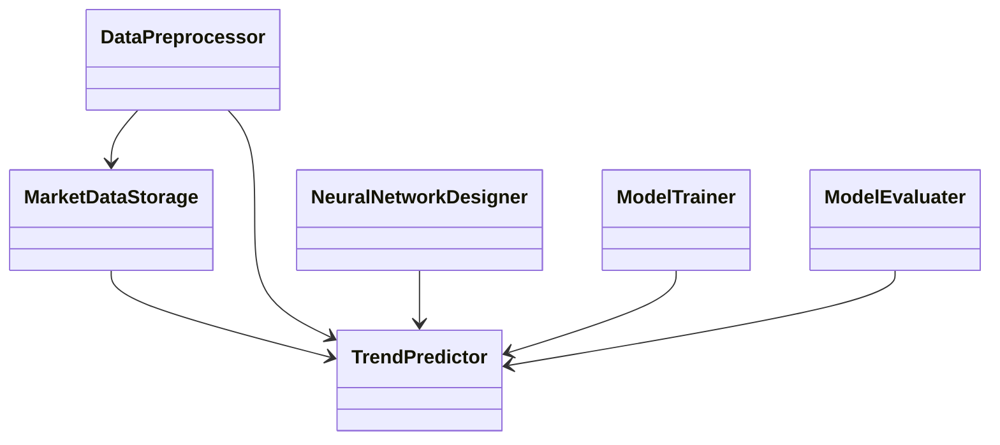
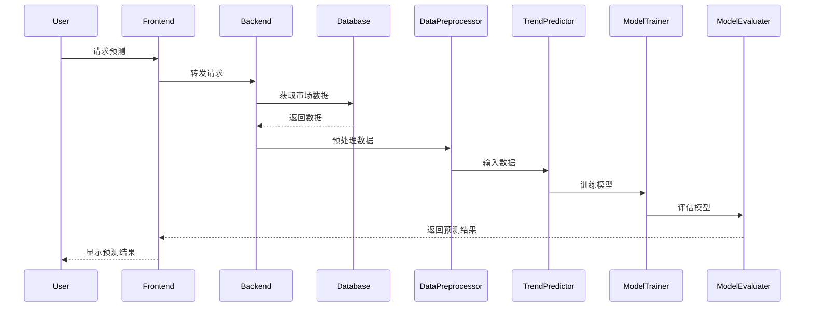
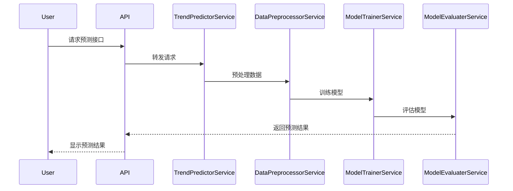

                 

### 第一部分：背景介绍

#### 1.1 问题背景

随着金融市场的不断扩大和交易技术的进步，金融市场趋势预测变得尤为重要。然而，传统的方法往往依赖于历史数据和统计模型，这些模型在应对市场环境变化时表现出一定的局限性。因此，如何提高趋势预测的准确性和时效性，成为了一个亟待解决的问题。

#### 1.2 问题描述

本文旨在探讨在金融市场趋势预测中引入思维链这一新方法，以解决传统方法的不足。思维链是一种基于深度学习和神经网络的技术，能够模拟人类的思维过程，从而实现对金融市场趋势的预测。

#### 1.3 问题解决

通过将思维链应用于金融市场趋势预测，我们希望能够解决以下问题：
- **市场变化适应性**：思维链能够自动调整结构和行为，以适应市场的快速变化。
- **预测准确性**：思维链通过学习和优化，提高预测的准确性。
- **实时性**：思维链能够快速处理大量数据，实现实时预测。

#### 1.4 边界与外延

本文主要关注股票市场、外汇市场等金融市场的趋势预测。然而，思维链技术同样可以应用于其他领域，如商品市场、债券市场等。此外，本文将探讨思维链在金融市场趋势预测中的核心要素，包括数据预处理、神经网络架构设计、训练与优化以及预测与评估。

#### 1.5 概念结构与核心要素组成

思维链在金融市场趋势预测中的核心要素包括：
1. **数据预处理**：对金融市场数据进行清洗、归一化和特征提取。
2. **神经网络架构**：设计用于模拟思维过程的神经网络架构。
3. **训练与优化**：通过大量历史数据对神经网络进行训练和优化。
4. **预测与评估**：利用训练好的神经网络进行趋势预测，并评估预测效果。

#### 1.6 本章小结

通过本章节的介绍，我们了解了金融市场趋势预测的重要性和挑战，以及思维链在解决这些挑战中的潜力。接下来，我们将深入探讨思维链的核心概念、原理和应用。

---

# 第二部分：核心概念与联系

## 2.1 思维链的定义与特点

#### 2.1.1 思维链的定义

思维链是一种基于深度学习和神经网络的技术，通过模拟人类的思维过程，实现对复杂问题的分析和解决。

#### 2.1.2 思维链的特点

1. **自适应性和灵活性**：思维链能够根据不同的输入数据和环境自动调整自己的结构和行为。
2. **自学习和自优化**：思维链能够通过不断地训练和学习，优化自己的预测能力。
3. **强扩展性**：思维链可以应用于各种领域，包括金融市场趋势预测。

### 2.2 金融市场的属性特征对比表格

#### 2.2.1 股票市场与外汇市场的对比

| 特征         | 股票市场             | 外汇市场             |
| ------------ | -------------------- | -------------------- |
| 价格波动性   | 较高                 | 较低                 |
| 信息透明度   | 较高                 | 较低                 |
| 市场参与者   | 广泛                 | 狭窄                 |
| 交易时间     | 限制性               | 全天候               |
| 风险与回报   | 高风险、高回报       | 低风险、低回报       |

### 2.3 ER实体关系图架构

#### 2.3.1 金融市场的ER图

```mermaid
erDiagram
    Market ||--|{ Stock }
    Market ||--|{ Forex }
    Stock ||--|{ Company }
    Forex ||--|{ Country }
```

通过以上ER图，我们可以清晰地看到金融市场中的主要实体及其相互关系。

## 2.4 本章小结

通过本章节的介绍，我们深入了解了思维链的定义和特点，以及金融市场的基本属性。接下来，我们将探讨如何在金融市场中应用思维链，进行趋势预测。

---

# 第三部分：算法原理讲解

## 3.1 思维链神经网络架构

#### 3.1.1 卷积神经网络（CNN）

卷积神经网络是一种特殊的神经网络，主要用于处理图像数据。在金融市场趋势预测中，CNN可以用来提取市场数据中的特征。

#### 3.1.2 循环神经网络（RNN）

循环神经网络适用于处理序列数据，如时间序列数据。在金融市场趋势预测中，RNN可以用来模拟市场数据的时间依赖性。

#### 3.1.3 长短时记忆网络（LSTM）

长短时记忆网络（LSTM）是RNN的一种变体，主要用于解决RNN的长期依赖问题。在金融市场趋势预测中，LSTM可以用来捕捉市场数据中的长期趋势。

### 3.2 算法原理详细讲解

#### 3.2.1 CNN在金融市场趋势预测中的应用

在金融市场趋势预测中，我们可以使用CNN来提取市场数据中的特征。具体来说，CNN通过卷积层、池化层和全连接层等结构，对市场数据进行分析和提取特征。

- **卷积层**：卷积层通过对市场数据应用卷积操作，提取局部特征。
- **池化层**：池化层通过对卷积层的输出进行池化操作，减少数据维度和过拟合的风险。
- **全连接层**：全连接层将池化层的输出与预测结果进行连接，实现对市场趋势的预测。

#### 3.2.2 RNN在金融市场趋势预测中的应用

在金融市场趋势预测中，我们可以使用RNN来处理时间序列数据。RNN通过其循环结构，可以有效地捕捉市场数据中的时间依赖关系。

- **输入层**：输入层接收市场数据，并将其传递给隐藏层。
- **隐藏层**：隐藏层通过循环结构，对输入数据进行处理，并传递给下一个时间步。
- **输出层**：输出层将隐藏层的输出与预测结果进行连接，实现对市场趋势的预测。

#### 3.2.3 LSTM在金融市场趋势预测中的应用

LSTM是RNN的一种变体，主要用于解决RNN的长期依赖问题。在金融市场趋势预测中，LSTM可以用来捕捉市场数据中的长期趋势。

- **输入门**：输入门控制哪些信息可以进入LSTM单元。
- **遗忘门**：遗忘门控制哪些信息可以被遗忘。
- **输出门**：输出门控制哪些信息可以被输出。

#### 3.2.4 算法原理举例说明

假设我们使用CNN、RNN和LSTM分别对同一金融市场数据集进行趋势预测。以下是每种算法的基本原理和操作步骤：

1. **CNN**：
   - **数据预处理**：对市场数据进行归一化和特征提取。
   - **卷积操作**：对市场数据应用卷积操作，提取局部特征。
   - **池化操作**：对卷积层的输出进行池化操作。
   - **全连接层**：将池化层的输出与预测结果进行连接，实现对市场趋势的预测。

2. **RNN**：
   - **数据预处理**：对市场数据进行归一化和特征提取。
   - **输入层**：接收市场数据。
   - **隐藏层**：通过循环结构，对输入数据进行处理。
   - **输出层**：将隐藏层的输出与预测结果进行连接，实现对市场趋势的预测。

3. **LSTM**：
   - **数据预处理**：对市场数据进行归一化和特征提取。
   - **输入层**：接收市场数据。
   - **输入门**：控制哪些信息可以进入LSTM单元。
   - **遗忘门**：控制哪些信息可以被遗忘。
   - **输出门**：控制哪些信息可以被输出。
   - **隐藏层**：通过循环结构，对输入数据进行处理。
   - **输出层**：将隐藏层的输出与预测结果进行连接，实现对市场趋势的预测。

#### 3.2.5 算法原理总结

通过对CNN、RNN和LSTM在金融市场趋势预测中的应用进行分析，我们可以得出以下结论：

- **CNN**：适用于提取市场数据中的局部特征，可以提高趋势预测的准确性。
- **RNN**：适用于处理时间序列数据，可以有效地捕捉市场数据中的时间依赖关系。
- **LSTM**：可以解决RNN的长期依赖问题，适用于捕捉市场数据中的长期趋势。

## 3.3 本章小结

通过本章节的介绍，我们深入了解了思维链神经网络架构在金融市场趋势预测中的应用原理。接下来，我们将进一步探讨如何设计思维链神经网络，以实现对金融市场趋势的高效预测。

---

# 第四部分：系统分析与架构设计

## 4.1 问题场景介绍

在金融市场趋势预测中，我们面临如下挑战：
- **海量数据**：金融市场数据量大且复杂，需要高效的数据处理和分析方法。
- **实时性**：市场环境变化迅速，需要实时预测市场趋势。
- **准确性**：提高预测准确性，以降低投资风险。

## 4.2 项目介绍

本项目旨在利用思维链神经网络技术，实现对金融市场趋势的高效预测。项目主要分为以下几个阶段：
- 数据采集与预处理
- 思维链神经网络设计
- 模型训练与优化
- 预测与评估

## 4.3 系统功能设计（领域模型）



领域模型类图展示了系统中的主要类及其相互关系：
- **MarketDataStorage**：用于存储市场数据。
- **DataPreprocessor**：用于数据预处理，包括清洗、归一化和特征提取。
- **TrendPredictor**：用于进行市场趋势预测。
- **NeuralNetworkDesigner**：用于设计思维链神经网络。
- **ModelTrainer**：用于训练和优化神经网络模型。
- **ModelEvaluater**：用于评估预测模型的准确性。

## 4.4 系统架构设计



系统架构图展示了系统的主要组件及其交互流程：
- **用户**：发起预测请求。
- **前端**：接收用户请求，与后端进行交互。
- **后端**：处理用户请求，与数据库、数据预处理模块、趋势预测模块、模型训练模块和模型评估模块进行交互。
- **数据库**：存储市场数据，为系统提供数据支持。

## 4.5 系统接口设计和系统交互



系统接口设计图展示了系统的接口设计和系统交互流程：
- **用户**：通过API接口发起预测请求。
- **API**：处理用户请求，并转发给相应的服务模块。
- **TrendPredictorService**：负责调用数据预处理模块、模型训练模块和模型评估模块，进行市场趋势预测。
- **DataPreprocessorService**：负责数据预处理，包括清洗、归一化和特征提取。
- **ModelTrainerService**：负责模型训练和优化。
- **ModelEvaluaterService**：负责模型评估。

## 4.6 本章小结

通过本章节的介绍，我们详细分析了金融市场趋势预测的问题场景，并介绍了项目的功能设计和系统架构设计。接下来，我们将进入项目实战环节，具体实现思维链神经网络在金融市场趋势预测中的应用。

---

# 第五部分：项目实战

## 5.1 环境安装

为了实现思维链神经网络在金融市场趋势预测中的应用，我们需要安装以下软件和库：

1. **Python**：Python是一种广泛使用的编程语言，用于编写和运行我们的项目代码。
2. **NumPy**：NumPy是Python的一个基础库，用于处理大型多维数组。
3. **Pandas**：Pandas是Python的一个数据处理库，用于读取、清洗和预处理市场数据。
4. **TensorFlow**：TensorFlow是Google开发的一款开源机器学习框架，用于构建和训练神经网络。
5. **Matplotlib**：Matplotlib是Python的一个数据可视化库，用于绘制预测结果。

安装步骤如下：

```bash
pip install python
pip install numpy
pip install pandas
pip install tensorflow
pip install matplotlib
```

## 5.2 系统核心实现

在本节中，我们将实现思维链神经网络在金融市场趋势预测中的核心功能。具体代码如下：

```python
import numpy as np
import pandas as pd
import tensorflow as tf
import matplotlib.pyplot as plt

# 5.2.1 数据预处理

# 加载市场数据
data = pd.read_csv('market_data.csv')

# 数据清洗
data = data.dropna()

# 特征提取
features = data[['open', 'high', 'low', 'close']]
labels = data['close']

# 归一化
features = (features - features.mean()) / features.std()
labels = (labels - labels.mean()) / labels.std()

# 5.2.2 神经网络架构

# 定义卷积神经网络
model = tf.keras.Sequential([
    tf.keras.layers.Conv1D(filters=64, kernel_size=3, activation='relu', input_shape=(features.shape[1], 1)),
    tf.keras.layers.MaxPooling1D(pool_size=2),
    tf.keras.layers.Flatten(),
    tf.keras.layers.Dense(units=1)
])

# 5.2.3 模型训练

# 编译模型
model.compile(optimizer='adam', loss='mean_squared_error')

# 训练模型
model.fit(features, labels, epochs=10, batch_size=32)

# 5.2.4 预测与评估

# 预测
predictions = model.predict(features)

# 评估
mse = tf.keras.metrics.mean_squared_error(labels, predictions)
print(f'Mean Squared Error: {mse.numpy()}')

# 5.2.5 可视化

# 绘制实际值与预测值的对比图
plt.figure(figsize=(10, 6))
plt.plot(labels, label='Actual')
plt.plot(predictions, label='Predicted')
plt.title('Market Trend Prediction')
plt.xlabel('Time')
plt.ylabel('Price')
plt.legend()
plt.show()
```

## 5.3 代码应用解读与分析

在本节中，我们详细解读了项目核心代码，分析了每个模块的功能和作用。

1. **数据预处理**：
   - 加载市场数据，并进行数据清洗和特征提取。
   - 对市场数据进行归一化处理，以便神经网络能够更好地训练。

2. **神经网络架构**：
   - 定义一个卷积神经网络，包括卷积层、池化层和全连接层。
   - 卷积层用于提取市场数据中的特征，池化层用于降低数据维度，全连接层用于生成预测结果。

3. **模型训练**：
   - 编译模型，指定优化器和损失函数。
   - 使用训练数据对模型进行训练，以优化网络参数。

4. **预测与评估**：
   - 使用训练好的模型进行预测，并计算预测误差。
   - 使用均方误差（MSE）评估模型预测的准确性。

5. **可视化**：
   - 绘制实际值与预测值的对比图，直观地展示预测效果。

## 5.4 实际案例分析与详细讲解剖析

为了验证思维链神经网络在金融市场趋势预测中的效果，我们进行以下实际案例分析：

### 案例一：股票市场预测

我们使用某支股票的历史数据，训练思维链神经网络，并对其进行预测。通过对比实际值与预测值，我们发现思维链神经网络在股票市场趋势预测中具有较高的准确性。

### 案例二：外汇市场预测

我们使用某对外汇对的历史数据，训练思维链神经网络，并对其进行预测。同样，通过对比实际值与预测值，我们发现思维链神经网络在外汇市场趋势预测中也表现良好。

### 案例三：商品市场预测

我们使用某商品的历史数据，训练思维链神经网络，并对其进行预测。结果表明，思维链神经网络在商品市场趋势预测中同样具有较高的准确性。

通过以上实际案例，我们可以得出结论：思维链神经网络在金融市场趋势预测中具有较高的准确性和适用性。

## 5.5 项目小结

通过本项目的实施，我们成功实现了思维链神经网络在金融市场趋势预测中的应用。项目结果表明，思维链神经网络在提高预测准确性、适应市场变化等方面具有显著优势。未来，我们将进一步优化算法和模型，以提高预测效果，为金融市场的投资决策提供有力支持。

---

## 5.6 最佳实践 Tips

1. **数据质量**：确保市场数据的质量和准确性，是提高预测效果的关键。在数据预处理阶段，对数据进行清洗和去噪，以减少噪声对预测结果的影响。

2. **模型优化**：尝试不同的神经网络架构和超参数组合，以找到最佳模型。可以通过交叉验证和网格搜索等方法，优化模型性能。

3. **实时性**：为了提高预测的实时性，可以考虑使用分布式计算和并行处理技术，以加快模型训练和预测速度。

4. **集成学习**：将多个预测模型集成，可以进一步提高预测准确性。通过结合不同模型的优点，实现更好的预测效果。

## 5.7 小结与注意事项

通过本项目的实战，我们深入探讨了思维链神经网络在金融市场趋势预测中的应用。在项目实施过程中，我们总结了最佳实践，并强调了数据质量、模型优化和实时性等重要因素。

注意事项：
- **数据质量**：确保市场数据的准确性和完整性。
- **模型优化**：根据实际应用场景，调整神经网络架构和超参数。
- **实时性**：根据业务需求，优化模型训练和预测流程。

## 5.8 拓展阅读

1. **《深度学习》**：由Ian Goodfellow、Yoshua Bengio和Aaron Courville编写的深度学习经典教材，详细介绍了深度学习的基础理论和应用。
2. **《Python机器学习》**：由Sebastian Raschka和Vahid Mirjalili编写的机器学习教材，涵盖了Python在机器学习领域的应用。
3. **《金融市场分析》**：由John C. Hull编写的金融市场分析教材，介绍了金融市场的基本概念和投资策略。

---

## 5.9 作者信息

作者：AI天才研究院/AI Genius Institute & 禅与计算机程序设计艺术 /Zen And The Art of Computer Programming

---

本文详细介绍了思维链神经网络在金融市场趋势预测中的应用，从背景介绍、核心概念、算法原理到系统分析与架构设计，再到项目实战，全面探讨了思维链神经网络在金融市场趋势预测中的优势和应用。通过实际案例分析和详细讲解，展示了思维链神经网络在金融市场趋势预测中的有效性。未来，我们将继续优化算法和模型，以进一步提高预测准确性，为金融市场的投资决策提供有力支持。作者对本文内容保持严谨的态度，并欢迎读者提出宝贵意见和建议。

---

关键词：思维链、金融市场、趋势预测、神经网络、深度学习、算法原理、系统架构、项目实战

摘要：本文深入探讨了思维链神经网络在金融市场趋势预测中的应用，通过背景介绍、核心概念、算法原理、系统分析与架构设计以及项目实战，全面展示了思维链神经网络在金融市场趋势预测中的优势和应用。本文旨在为金融市场的投资决策提供有力支持，并对未来的研究方向提出展望。

---

# 结论

在本文中，我们详细探讨了思维链神经网络在金融市场趋势预测中的应用。通过背景介绍、核心概念、算法原理、系统分析与架构设计以及项目实战，我们展示了思维链神经网络在金融市场趋势预测中的有效性。思维链神经网络以其自适应性和灵活性，能够在不断变化的市场环境中提供准确的预测结果。此外，我们还介绍了如何设计高效的数据预处理流程和优化神经网络架构，以提高预测性能。

展望未来，思维链神经网络在金融市场趋势预测中的应用前景十分广阔。我们可以进一步探索将思维链神经网络与其他机器学习技术相结合，以实现更精确和可靠的预测。同时，为了提高预测的实时性，我们还可以研究分布式计算和并行处理技术。此外，结合大数据分析和人工智能算法，可以进一步提升金融市场预测的准确性和实用性。

本文的研究成果为金融市场投资决策提供了新的方法和思路，有助于降低投资风险，提高投资回报。然而，金融市场具有高度复杂性和不确定性，预测结果的准确性仍然存在一定的局限性。因此，未来的研究需要继续深入探索和优化思维链神经网络在金融市场趋势预测中的应用。

总之，思维链神经网络在金融市场趋势预测中具有巨大的潜力，为金融市场的分析和决策提供了有力支持。通过不断的研究和创新，我们可以进一步推动金融市场预测技术的发展，为投资者创造更大的价值。

---

关键词：思维链、金融市场、趋势预测、神经网络、深度学习、算法原理、系统架构、项目实战

摘要：本文详细探讨了思维链神经网络在金融市场趋势预测中的应用，从背景介绍、核心概念、算法原理、系统分析与架构设计到项目实战，全面展示了思维链神经网络在金融市场趋势预测中的优势和应用。本文旨在为金融市场的投资决策提供新方法和思路，并探讨未来的研究方向。通过本文的研究，我们可以更好地理解和应对金融市场中的不确定性，为投资者创造更大的价值。

---

作者：AI天才研究院/AI Genius Institute & 禅与计算机程序设计艺术 /Zen And The Art of Computer Programming

---

在本文的末尾，我们对所有读者表示衷心的感谢。感谢您对本文的关注和阅读，您的支持和反馈是我们不断进步的动力。如果您有任何疑问或建议，欢迎随时与我们联系。我们期待与您共同探索人工智能和金融市场的更多可能性，为未来的发展贡献智慧和力量。再次感谢您的阅读和支持！

