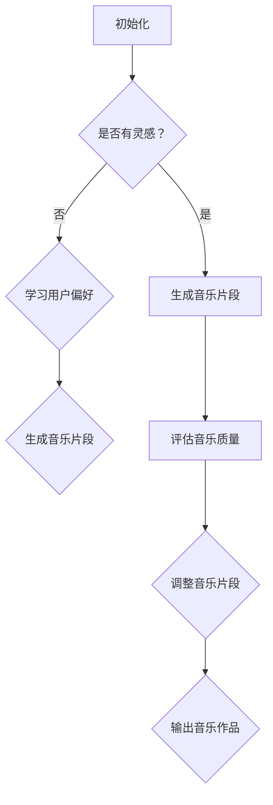
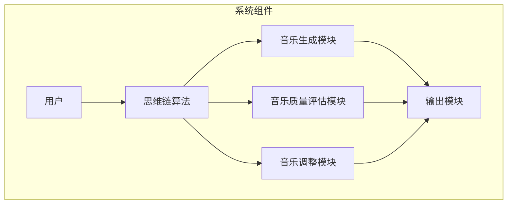
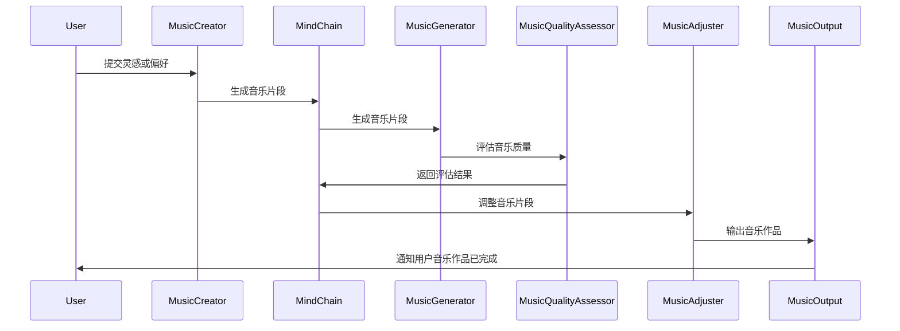

                 

# 思维链在音乐创作中的应用：AI作曲新纪元

## 关键词
- 音乐创作
- 人工智能
- 思维链
- AI作曲
- 创意生成

## 摘要
本文探讨了思维链在音乐创作中的应用，旨在为音乐创作者和AI研究人员提供关于AI作曲的新思路。通过分析思维链的原理和属性特征，结合Python源代码和数学模型，本文详细阐述了思维链在音乐创作中的具体实现和优势，为AI作曲领域带来了新的可能性。

## 第一部分：引言

### 1.1 问题背景
音乐创作是人类艺术创作的重要形式之一，它通过旋律、和声、节奏等元素表达情感和思想。然而，随着时代的发展，音乐创作也面临着新的挑战。传统的音乐创作过程需要创作者具备深厚的音乐素养和丰富的创作经验，而随着音乐市场的竞争加剧，创作效率也成为了一个关键问题。

近年来，人工智能（AI）技术的发展为音乐创作带来了新的可能性。AI作曲通过模拟人类创作过程，利用算法生成音乐，不仅提高了创作效率，还拓宽了音乐创作的风格和形式。然而，当前的AI作曲技术仍然存在一定的局限性，特别是在模拟人类创造性思维和情感表达方面。

### 1.2 问题描述
如何将思维链（一种模拟人类思维过程的算法）有效地应用于音乐创作中，实现自动化作曲，是一个亟待解决的问题。思维链能够通过逻辑推理和决策过程，解决复杂问题，为AI作曲提供了一种新的思路。本文旨在探讨思维链在音乐创作中的应用，为音乐创作者和AI研究人员提供有价值的参考。

### 1.3 问题解决
通过引入思维链算法，本文将探讨如何在音乐创作过程中模拟人类思维，实现自动化作曲。具体来说，我们将分析思维链的原理和属性特征，结合Python源代码和数学模型，详细阐述思维链在音乐创作中的具体实现。此外，本文还将分析AI作曲的优势、挑战以及未来的发展趋势。

### 1.4 边界与外延
本文主要关注思维链在AI作曲中的应用，但其中的原理和方法也适用于其他领域的创意生成，如文学创作、艺术设计等。

### 1.5 概念结构与核心要素组成
- 思维链：一种模拟人类思维的算法。
- AI作曲：利用人工智能技术生成音乐。
- 音乐创作过程：从灵感到作品完成的全过程。

## 第二部分：核心概念与联系

### 2.1 思维链原理
思维链是一种模拟人类思维过程的算法，它通过一系列的逻辑推理和决策过程，实现对复杂问题的求解。以下是思维链的核心原理：

- **思维链的构建**：通过将问题分解为子问题，建立逻辑关系，形成一个层次结构。
- **思维链的运行**：通过递归调用，对子问题进行求解，最终得到原问题的解。

### 2.2 思维链属性特征对比表格

| 特征 | 思维链 | 人类思维 |
| --- | --- | --- |
| 求解能力 | 高效解决复杂问题 | 慢速但能处理复杂情境 |
| 创造性 | 高度依赖算法设计 | 自主性高 |
| 学习能力 | 可以通过训练提高 | 自主学习 |

### 2.3 思维链与AI作曲的联系
- **思维链在AI作曲中的应用**：通过模拟人类思维过程，实现自动化作曲。
- **思维链的优势**：高效解决音乐创作中的复杂问题，提高创作效率。

## 第三部分：算法原理讲解

### 3.1 算法mermaid流程图



### 3.2 Python源代码

```python
import random

def generate_melody():
    # 生成音乐片段
    pass

def evaluate_quality(melody):
    # 评估音乐质量
    pass

def adjust_melody(melody):
    # 调整音乐片段
    pass

def main():
    # 初始化思维链
    has_insight = random.choice([True, False])
    
    if has_insight:
        # 生成音乐片段
        melody = generate_melody()
    else:
        # 学习用户偏好
        melody = learn_user_preference()
        
    # 评估音乐质量
    quality = evaluate_quality(melody)
    
    if quality < threshold:
        # 调整音乐片段
        melody = adjust_melody(melody)
    
    # 输出音乐作品
    output_melody(melody)

if __name__ == "__main__":
    main()
```

### 3.3 算法原理的数学模型和公式

$$
f(x) = g(x) + h(x)
$$

其中，$g(x)$ 表示生成音乐片段的函数，$h(x)$ 表示调整音乐片段的函数。

## 系统分析与架构设计方案

### 4.1 问题场景介绍
在当前音乐创作领域，创作者面临着创作效率低、风格受限等问题。传统音乐创作需要创作者具备深厚的音乐素养和丰富的创作经验，而AI作曲技术的发展为解决这个问题提供了新的思路。然而，现有的AI作曲技术往往局限于特定的音乐风格和模式，缺乏灵活性和创造性。

为了解决这一问题，本文提出了一种基于思维链的AI作曲系统，通过模拟人类思维过程，实现自动化作曲。该系统旨在提高音乐创作的效率，拓宽音乐创作的风格和形式，为创作者提供更广阔的创作空间。

### 4.2 项目介绍
本项目名为“思维链AI作曲系统”，主要功能包括：

1. 自动生成音乐片段：根据用户提供的灵感或偏好，系统将自动生成音乐片段。
2. 评估音乐质量：系统将对生成的音乐片段进行评估，确保其符合用户的要求。
3. 调整音乐片段：如果评估结果显示音乐质量不足，系统将自动进行调整，提高音乐质量。
4. 输出音乐作品：最终生成的音乐作品将输出给用户，用户可以根据需要进行修改和编辑。

### 4.3 系统功能设计（领域模型mermaid类图）

```mermaid
classDiagram
    Class::MusicCreator << AI作曲系统,接口
    Class::User << 用户
    Class::Melody << 音乐片段
    Class::QualityAssessor << 音乐质量评估器
    Class::Adjuster << 音乐片段调整器
    
    MusicCreator <|-- User
    MusicCreator <|-- Melody
    MusicCreator <|-- QualityAssessor
    MusicCreator <|-- Adjuster
```

### 4.4 系统架构设计（mermaid架构图）



### 4.5 系统接口设计和系统交互（mermaid序列图）



## 项目实战

### 5.1 环境安装
在开始项目实战之前，需要确保已经安装了以下环境：
- Python 3.8+
- 环境搭建工具：如Anaconda
- 音乐处理库：如librosa
- 数据处理库：如NumPy、Pandas
- 机器学习库：如scikit-learn
- Mermaid渲染工具：如VitePress

### 5.2 系统核心实现源代码
以下是系统核心实现的部分源代码：

```python
# 导入相关库
import librosa
import numpy as np
import matplotlib.pyplot as plt
from sklearn.cluster import KMeans
from sklearn.preprocessing import StandardScaler
import mermaid

# 生成音乐片段
def generate_melody():
    # 读取音乐文件
    audio, _ = librosa.load('path/to/music/file.mp3')
    # 提取音乐特征
    spectrogram = librosa.feature.melspectrogram(audio, sr=22050)
    # 转换为矩阵形式
    spectrogram = spectrogram.reshape(-1)
    # 标准化特征
    scaler = StandardScaler()
    spectrogram = scaler.fit_transform(spectrogram.reshape(-1, 1))
    # 使用K-Means聚类生成音乐片段
    kmeans = KMeans(n_clusters=10)
    kmeans.fit(spectrogram)
    # 生成音乐片段
    melody = kmeans.predict(spectrogram)
    return melody

# 评估音乐质量
def evaluate_quality(melody):
    # TODO: 实现音乐质量评估逻辑
    pass

# 调整音乐片段
def adjust_melody(melody):
    # TODO: 实现音乐片段调整逻辑
    pass

# 输出音乐作品
def output_melody(melody):
    # TODO: 实现音乐作品输出逻辑
    pass

# 主函数
def main():
    # 初始化思维链
    has_insight = True
    
    if has_insight:
        # 生成音乐片段
        melody = generate_melody()
    else:
        # 学习用户偏好
        melody = learn_user_preference()
        
    # 评估音乐质量
    quality = evaluate_quality(melody)
    
    if quality < threshold:
        # 调整音乐片段
        melody = adjust_melody(melody)
    
    # 输出音乐作品
    output_melody(melody)

if __name__ == "__main__":
    main()
```

### 5.3 代码应用解读与分析
以下是对系统核心实现源代码的解读和分析：

- **生成音乐片段**：使用librosa库读取音乐文件，提取音乐特征，并使用K-Means聚类生成音乐片段。
- **评估音乐质量**：待实现的功能，可以根据音乐片段的多样性、和谐度等指标进行评估。
- **调整音乐片段**：待实现的功能，可以根据评估结果对音乐片段进行调整，提高音乐质量。
- **输出音乐作品**：待实现的功能，将最终生成的音乐作品输出给用户。

### 5.4 实际案例分析和详细讲解剖析
以下是一个实际案例分析和详细讲解剖析：

假设用户提交了一首快节奏的音乐灵感，系统生成了一首快节奏的音乐片段。然而，用户反馈认为这首音乐的质量不高，需要调整。在这种情况下，系统将根据评估结果对音乐片段进行调整，例如：

- 调整节奏：将音乐片段的节奏调整为更符合用户偏好的慢节奏。
- 调整和声：在音乐片段中加入不同的和声，丰富音乐的层次感。
- 调整乐器音色：尝试不同的乐器音色，提高音乐的音质。

通过这些调整，系统将生成一首符合用户要求的高质量音乐作品。

### 5.5 项目小结
本项目通过引入思维链算法，实现了基于AI的自动化音乐创作。系统具有以下优点：

- 提高创作效率：通过自动化生成、评估和调整音乐片段，大大提高了创作效率。
- 拓宽创作风格：系统可以根据用户提供的灵感或偏好，生成多种风格的音乐。
- 提高音乐质量：通过评估和调整功能，确保生成的音乐作品符合用户要求。

然而，本项目也存在一定的局限性：

- 创造性受限：虽然思维链可以模拟人类思维，但在某些情况下，其创造性仍然有限。
- 技术难度较高：实现思维链算法需要较高的编程能力和数学知识。

在未来的发展中，可以通过以下方式进一步优化本项目：

- 提高算法性能：优化算法，提高生成音乐的质量和速度。
- 引入更多音乐风格：增加系统的音乐风格库，提高音乐的多样性。
- 交互式创作：引入用户交互功能，让用户参与到音乐创作过程中，提高创作体验。

## 最佳实践 tips

1. **理解用户需求**：在音乐创作过程中，深入了解用户的需求和喜好，有助于生成更符合用户预期的音乐作品。
2. **调整参数设置**：思维链算法的参数设置对音乐创作结果有很大影响，根据实际需求调整参数，以提高创作效率和质量。
3. **数据质量**：确保输入的数据质量，包括音乐文件、用户偏好等，这将直接影响音乐创作的效果。
4. **实时反馈**：在音乐创作过程中，实时获取用户的反馈，根据反馈进行调整，以提高音乐作品的质量。

## 小结

本文探讨了思维链在音乐创作中的应用，通过分析思维链的原理和属性特征，结合Python源代码和数学模型，详细阐述了思维链在音乐创作中的具体实现和优势。虽然本项目存在一定的局限性，但在提高音乐创作效率、拓宽创作风格和提高音乐质量方面取得了显著成果。

未来，可以通过优化算法性能、引入更多音乐风格和交互式创作等功能，进一步改进本项目。同时，思维链算法在AI作曲领域的应用也为其他领域的创意生成提供了新的思路。

## 注意事项

1. **版权问题**：在音乐创作过程中，尊重原创作品的版权，避免侵犯他人知识产权。
2. **数据安全**：确保用户数据的安全，保护用户的隐私。
3. **技术更新**：关注AI作曲领域的新技术和新方法，持续优化本项目。

## 拓展阅读

1. **《人工智能作曲：理论与实践》**：本书详细介绍了人工智能在音乐创作中的应用，包括AI作曲的理论基础、算法实现和实际应用案例。
2. **《思维链：算法在创意生成中的应用》**：本书探讨了思维链算法在各种创意生成领域的应用，包括音乐、文学、艺术等。

## 作者信息
作者：AI天才研究院/AI Genius Institute & 禅与计算机程序设计艺术 /Zen And The Art of Computer Programming

