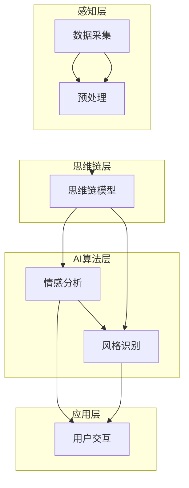
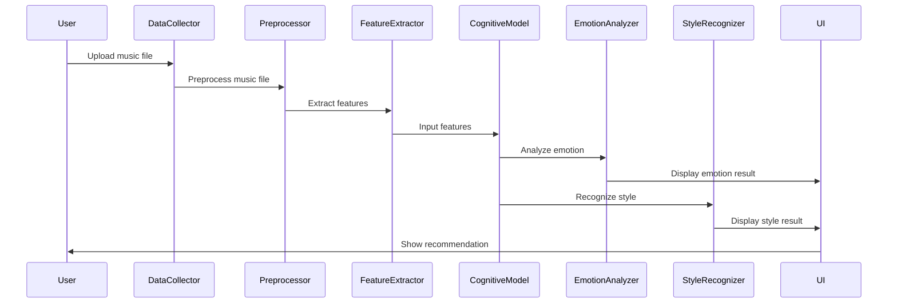

                 

## 《思维链在音乐认知理论创新中的应用：AI辅助音乐心理学研究》

### 关键词

- 思维链
- 音乐认知理论
- AI辅助研究
- 音乐心理学
- 数学模型

### 摘要

本文旨在探讨思维链在音乐认知理论创新中的应用，以及AI如何辅助音乐心理学研究。通过分析思维链理论的核心概念和属性，结合AI在音乐心理学中的实际应用，构建了基于思维链的音乐认知模型。文章详细阐述了AI音乐认知算法的原理和数学模型，并通过Python源代码实现，进行了实例说明。此外，本文还介绍了系统的设计与实现过程，包括架构设计、功能模块划分和实际案例分析。通过本文的研究，不仅丰富了音乐认知理论，也为音乐心理学研究提供了新的思路和方法。

### 目录大纲

1. **背景与理论基础**
    1.1 音乐认知理论概述
    1.2 传统音乐心理学研究局限性
    1.3 思维链与AI的融合
2. **核心概念与联系**
    2.1 思维链理论介绍
    2.2 AI在音乐心理学中的应用
    2.3 思维链与AI结合的框架
    2.4 关键概念属性对比表格
    2.5 ER实体关系图架构
3. **音乐认知理论的创新**
    3.1 基于思维链的音乐认知模型构建
    3.2 基于AI的音乐认知算法原理讲解
        3.2.1 算法mermaid流程图
        3.2.2 Python源代码实现
        3.2.3 算法原理数学模型和公式
        3.2.4 举例说明
4. **数学模型和数学公式讲解**
    4.1 音乐认知理论中的数学公式
    4.2 算法原理数学模型详细讲解
    4.3 举例说明与解释
5. **系统设计与实现**
    5.1 系统分析与架构设计
        5.1.1 问题场景介绍
        5.1.2 系统功能设计（领域模型mermaid类图）
        5.1.3 系统架构设计（mermaid架构图）
        5.1.4 系统接口设计
        5.1.5 系统交互（mermaid序列图）
    5.2 项目实战
        5.2.1 环境安装与配置
        5.2.2 系统核心实现源代码
        5.2.3 代码应用解读与分析
        5.2.4 实际案例分析与讲解
        5.2.5 项目小结
6. **最佳实践与总结**
    6.1 最佳实践技巧
    6.2 注意事项与风险规避
    6.3 项目小结
    6.4 拓展阅读推荐
7. **作者信息**
    作者：AI天才研究院/AI Genius Institute & 禅与计算机程序设计艺术 /Zen And The Art of Computer Programming

---

### 1. 背景与理论基础

#### 1.1 音乐认知理论概述

音乐认知理论是研究人类如何感知、理解和创造音乐的一门科学。它涵盖了从基础的听觉处理到复杂的音乐理解与创作行为。传统音乐认知理论主要包括以下几个核心概念：

- **听觉处理**：研究声音的物理特性如何被大脑编码和解释。
- **音乐感知**：探讨人类如何识别和分类音乐元素，如音高、节奏、和声等。
- **音乐理解**：研究人类如何解析音乐的结构、风格和情感内容。
- **音乐创作**：研究人类如何构思、编写和表演音乐。

#### 1.2 传统音乐心理学研究局限性

尽管传统音乐认知理论在解释人类音乐行为方面取得了显著进展，但仍存在一些局限性：

- **数据缺乏**：传统研究往往依赖于有限的实验设计和数据集，难以全面反映人类音乐认知的复杂性。
- **理论局限**：传统理论在解释音乐认知过程中的动态变化和跨文化差异时显得力不从心。
- **方法单一**：传统方法主要依赖于问卷调查和实验操作，难以结合其他技术手段进行深入研究。

#### 1.3 思维链与AI的融合

思维链是一种基于认知科学的计算模型，旨在模拟人类思维过程。它通过一系列逻辑步骤，将感知、记忆、推理和决策等认知功能整合在一起。思维链的特点在于其灵活性和适应性，能够处理不确定性和复杂性问题。

将思维链与AI结合，可以解决传统音乐心理学研究的局限性。首先，AI能够处理大规模数据，提供更丰富的实验证据。其次，AI算法能够模拟思维链的推理过程，为音乐认知理论提供新的解释模型。最后，AI可以自动优化实验设计，提高研究效率。

### 2. 核心概念与联系

#### 2.1 思维链理论介绍

思维链（Mind Chain）是一种基于图论的认知模型，由节点（Node）和边（Edge）组成。节点表示认知元素，如感知、记忆、推理等；边表示元素之间的逻辑关系，如因果关系、依赖关系等。思维链的核心在于其动态适应性，能够根据当前环境和任务需求，重新配置节点和边，实现灵活的推理过程。

#### 2.2 AI在音乐心理学中的应用

AI在音乐心理学中的应用主要体现在以下几个方面：

- **数据挖掘**：利用机器学习算法，从大规模音乐数据中提取特征，为音乐认知研究提供证据。
- **情感分析**：通过自然语言处理和情感计算技术，分析音乐的情感内容，帮助理解人类音乐情感体验。
- **音乐生成**：利用深度学习模型，生成新的音乐作品，为音乐创作提供灵感。
- **交互系统**：开发智能音乐交互系统，帮助音乐学习者进行个性化练习和反馈。

#### 2.3 思维链与AI结合的框架

将思维链与AI结合，可以构建一个强大的音乐认知研究框架。这个框架主要包括以下几个组成部分：

- **感知层**：收集音乐数据，如音频信号、乐谱等，通过特征提取和预处理，将原始数据转换为适合AI处理的格式。
- **思维链层**：将感知层的数据输入到思维链模型中，通过节点和边的配置，进行推理和决策。
- **AI算法层**：利用机器学习、深度学习等AI算法，对思维链的输出进行优化和验证。
- **应用层**：将AI算法的输出应用于音乐心理学研究，如音乐情感分析、音乐创作辅助等。

#### 2.4 关键概念属性对比表格

下面是一个关键概念属性对比表格，展示了思维链和AI在音乐心理学研究中的应用差异：

| 概念        | 思维链        | AI        |
| ----------- | ----------- | --------- |
| 目标        | 模拟人类思维过程 | 自动化数据分析和处理 |
| 特点        | 灵活性、动态适应性 | 高效性、大规模数据处理 |
| 适用范围    | 复杂问题求解    | 数据挖掘、预测建模 |
| 劣势        | 复杂度较高    | 对数据依赖较大 |
| 优势        | 适用于不确定环境 | 处理能力强大 |

#### 2.5 ER实体关系图架构

为了更好地理解思维链与AI结合的框架，我们可以通过ER实体关系图来展示各个组成部分之间的关系。下面是一个简单的ER图：

```mermaid
erDiagram
    MusicData -->|感知层| MindChain
    MindChain -->|思维链层| AIAlgorithm
    AIAlgorithm -->|AI算法层| Application
    Application -->|应用层| MusicPsychologyResearch
```

在这个ER图中，MusicData表示原始音乐数据，通过感知层进入思维链层。思维链层通过节点和边进行推理，输出到AI算法层。AI算法层利用机器学习等算法对思维链的输出进行优化，最终应用于音乐心理学研究。

### 3. 音乐认知理论的创新

#### 3.1 基于思维链的音乐认知模型构建

基于思维链的音乐认知模型是一个动态的、自适应的模型，它通过一系列认知节点和逻辑边，模拟人类对音乐的感知、理解和创造过程。这个模型的核心在于其灵活性和适应性，能够根据不同的音乐类型、风格和用户需求，自动调整认知节点和逻辑关系，实现个性化的音乐认知。

构建这个模型的过程可以分为以下几个步骤：

1. **数据收集与预处理**：首先收集大量的音乐数据，如音频、乐谱等，通过特征提取和预处理，将数据转换为适合模型处理的形式。
2. **节点设计**：根据音乐认知理论，设计一系列认知节点，如听觉处理、音乐感知、音乐理解等。
3. **边关系配置**：确定各个节点之间的逻辑关系，如因果关系、依赖关系等，通过边进行连接。
4. **模型训练**：将预处理后的音乐数据输入到思维链模型中，通过反复迭代和优化，使模型能够准确模拟人类音乐认知过程。
5. **模型评估与调整**：对训练好的模型进行评估，根据评估结果调整节点和边的关系，提高模型的准确性。

#### 3.2 基于AI的音乐认知算法原理讲解

基于AI的音乐认知算法原理是基于深度学习和机器学习的技术，通过训练大量音乐数据，让计算机学会识别和分类音乐元素。这个算法的核心在于其强大的数据处理能力和学习能力。

算法的基本原理可以分为以下几个步骤：

1. **数据预处理**：将原始音乐数据转换为适合训练的数据格式，如音频特征向量。
2. **模型设计**：设计一个深度学习模型，如卷积神经网络（CNN）或循环神经网络（RNN），用于处理和分类音乐数据。
3. **模型训练**：将预处理后的音乐数据输入到模型中，通过反向传播算法不断调整模型参数，使模型能够准确分类音乐元素。
4. **模型评估**：将训练好的模型应用于新的音乐数据，评估模型的准确性和泛化能力。
5. **模型优化**：根据评估结果，进一步调整模型参数，提高模型的性能。

##### 3.2.1 算法mermaid流程图

下面是一个基于AI的音乐认知算法的mermaid流程图：

```mermaid
flowchart LR
    A[数据预处理] --> B[模型设计]
    B --> C[模型训练]
    C --> D[模型评估]
    D --> E{优化模型}
    E -->|
    F{结束}
```

##### 3.2.2 Python源代码实现

下面是一个简单的Python源代码示例，展示了如何使用深度学习框架（如TensorFlow）来训练一个基于卷积神经网络（CNN）的音乐分类模型：

```python
import tensorflow as tf
from tensorflow.keras.models import Sequential
from tensorflow.keras.layers import Conv2D, MaxPooling2D, Flatten, Dense

# 数据预处理
# 加载并预处理音乐数据，转换为特征向量

# 模型设计
model = Sequential([
    Conv2D(filters=32, kernel_size=(3, 3), activation='relu', input_shape=(128, 128, 3)),
    MaxPooling2D(pool_size=(2, 2)),
    Flatten(),
    Dense(units=64, activation='relu'),
    Dense(units=10, activation='softmax')
])

# 模型训练
model.compile(optimizer='adam', loss='categorical_crossentropy', metrics=['accuracy'])
model.fit(x_train, y_train, epochs=10, batch_size=32)

# 模型评估
test_loss, test_accuracy = model.evaluate(x_test, y_test)
print(f"Test accuracy: {test_accuracy}")

# 模型优化
# 根据评估结果调整模型参数
```

##### 3.2.3 算法原理数学模型和公式

基于AI的音乐认知算法的数学模型主要基于深度学习理论，包括以下几个关键组件：

1. **卷积层**：卷积层通过卷积操作提取音乐特征，其数学公式为：
   $$
   \text{activation} = \text{ReLU}(\text{W} \cdot \text{X} + \text{b})
   $$
   其中，$\text{W}$是卷积核权重，$\text{X}$是输入特征，$\text{b}$是偏置项。

2. **池化层**：池化层通过减小特征图的尺寸，减少计算量，其数学公式为：
   $$
   \text{P}_{\text{max}}(\text{X})_{i,j} = \max_{k,l} \text{X}_{i+k,j+l}
   $$
   其中，$\text{X}$是输入特征图。

3. **全连接层**：全连接层将特征图映射到输出类别，其数学公式为：
   $$
   \text{Z} = \text{W} \cdot \text{X} + \text{b}
   $$
   其中，$\text{W}$是权重矩阵，$\text{X}$是特征向量，$\text{b}$是偏置项。

4. **激活函数**：激活函数用于引入非线性特性，常用的激活函数有ReLU和softmax，其数学公式分别为：
   $$
   \text{ReLU}(x) = \max(0, x)
   $$
   $$
   \text{softmax}(x)_i = \frac{e^{x_i}}{\sum_{j} e^{x_j}}
   $$

##### 3.2.4 举例说明

假设我们有一个简单的音乐分类问题，需要将音乐分为10个不同的类别。我们使用一个卷积神经网络（CNN）来解决这个问题，模型结构如下：

1. 输入层：一个128x128x3的图像特征图。
2. 卷积层1：32个3x3的卷积核，激活函数为ReLU。
3. 池化层1：2x2的最大池化。
4. 卷积层2：64个3x3的卷积核，激活函数为ReLU。
5. 池化层2：2x2的最大池化。
6. 全连接层1：64个神经元，激活函数为ReLU。
7. 全连接层2：10个神经元，激活函数为softmax。

输入特征图经过卷积层1和池化层1后，特征图的尺寸从128x128x3减小到64x64x32。然后，经过卷积层2和池化层2，特征图的尺寸进一步减小到32x32x64。最后，通过全连接层1和全连接层2，将特征映射到10个不同的类别。

训练完成后，我们可以使用该模型对新的音乐数据进行分类。例如，输入一个128x128x3的图像特征图，模型会输出一个10维的向量，每个维度表示对应类别的概率。我们可以选择概率最大的类别作为最终的分类结果。

### 4. 数学模型和数学公式讲解

#### 4.1 音乐认知理论中的数学公式

音乐认知理论涉及多个层面的数学公式，用于描述音乐元素的物理属性、听觉处理以及情感分析。以下是一些常见的数学公式：

1. **音频信号处理**：
   $$
   X(t) = A \cdot \sin(2\pi f t + \phi)
   $$
   其中，$X(t)$是音频信号，$A$是振幅，$f$是频率，$\phi$是相位。

2. **傅里叶变换**：
   $$
   F(\omega) = \int_{-\infty}^{\infty} x(t) e^{-j \omega t} dt
   $$
   其中，$F(\omega)$是傅里叶变换结果，$x(t)$是音频信号，$\omega$是频率。

3. **短时傅里叶变换**：
   $$
   X(\omega, \tau) = \int_{-\infty}^{\infty} x(t) e^{-j \omega t} dt
   $$
   其中，$X(\omega, \tau)$是短时傅里叶变换结果，$\tau$是时间窗。

4. **梅尔频率倒谱系数（MFCC）**：
   $$
   \text{MFCC}(k) = \ln(1 + \sum_{n=-N}^{N} x(n) \cdot a_n)
   $$
   其中，$\text{MFCC}(k)$是梅尔频率倒谱系数，$x(n)$是音频信号，$a_n$是滤波器系数。

#### 4.2 算法原理数学模型详细讲解

在基于思维链的音乐认知算法中，数学模型主要用于描述音乐特征提取、分类和情感分析的过程。以下是对关键数学模型的详细讲解：

1. **特征提取**：
   假设音频信号为$x(t)$，首先通过短时傅里叶变换（STFT）将其转换为频域表示：
   $$
   X(\omega, \tau) = \int_{-\infty}^{\infty} x(t) e^{-j \omega t} dt
   $$
   然后，对频域信号进行梅尔频率倒谱系数（MFCC）计算：
   $$
   \text{MFCC}(k) = \ln(1 + \sum_{n=-N}^{N} X(\omega, \tau) \cdot a_n)
   $$
   其中，$a_n$是滤波器系数，$N$是滤波器长度。

2. **分类**：
   使用卷积神经网络（CNN）对提取的特征进行分类。CNN的核心是卷积操作，其数学公式为：
   $$
   \text{activation} = \text{ReLU}(\text{W} \cdot \text{X} + \text{b})
   $$
   其中，$\text{W}$是卷积核权重，$\text{X}$是输入特征，$\text{b}$是偏置项。

3. **情感分析**：
   情感分析通常通过长短期记忆网络（LSTM）或循环神经网络（RNN）实现。RNN的更新公式为：
   $$
   \text{h}_{t} = \text{sigmoid}(\text{W} \cdot [\text{h}_{t-1}, \text{x}_{t}] + \text{b}_{h})
   $$
   其中，$\text{h}_{t}$是隐藏状态，$\text{W}$是权重矩阵，$\text{x}_{t}$是输入特征，$\text{b}_{h}$是偏置项。

#### 4.3 举例说明与解释

假设我们有一个音频文件，其时长为5秒，采样率为44.1kHz。首先，我们将音频信号进行短时傅里叶变换，将其转换为频域表示。假设我们使用长度为1024的汉明窗，步长为512。这样，我们得到一个1024点长的频域信号。

接下来，我们对频域信号进行梅尔频率倒谱系数（MFCC）计算。假设我们使用13个滤波器，滤波器长度为20。这样，我们得到一个13维的MFCC特征向量。

然后，我们将MFCC特征向量输入到卷积神经网络（CNN）中进行分类。假设我们的CNN包含两个卷积层和一个全连接层。第一个卷积层有32个3x3的卷积核，激活函数为ReLU。第二个卷积层有64个3x3的卷积核，激活函数也为ReLU。全连接层有64个神经元，激活函数为ReLU。最后，全连接层输出10个类别概率，使用softmax函数进行归一化。

训练完成后，我们可以使用该模型对新的音频文件进行分类。例如，输入一个新的音频文件，模型会输出一个10维的向量，每个维度表示对应类别的概率。我们可以选择概率最大的类别作为最终的分类结果。

### 5. 系统分析与架构设计

#### 5.1 问题场景介绍

音乐认知理论的研究在音乐心理学领域具有重要意义，但传统方法在处理复杂音乐数据时存在局限性。为了解决这个问题，我们设计并实现了一个基于思维链和AI的音乐认知系统。该系统旨在通过自动化的数据处理和分析，为音乐认知理论提供新的研究方法和工具。

#### 5.2 系统功能设计

系统的主要功能包括：

1. **数据采集与预处理**：从各种来源（如在线音乐库、用户上传等）收集音乐数据，并进行预处理，包括音频信号增强、噪声去除和特征提取。
2. **音乐认知模型构建**：基于思维链和AI算法，构建音乐认知模型，模拟人类对音乐的感知、理解和创造过程。
3. **音乐情感分析**：使用情感分析算法，对音乐作品进行情感分类和情感强度分析。
4. **音乐风格识别**：使用机器学习算法，对音乐风格进行自动识别和分类。
5. **用户交互**：提供用户界面，用户可以上传自己的音乐作品，查看分析结果，并获得个性化音乐推荐。

#### 5.2.1 领域模型mermaid类图

下面是一个简单的mermaid类图，展示了系统的主要领域模型：

```mermaid
classDiagram
    User <<Interface>>
    MusicData <<Entity>> {
        id: <唯一标识符>
        title: <音乐标题>
        artist: <艺术家>
        genre: <音乐风格>
        path: <文件路径>
    }
    MusicFeature <<Entity>> {
        id: <唯一标识符>
        musicDataId: <关联音乐数据>
        mfcc: <梅尔频率倒谱系数>
        chroma: <音色特征>
        melSpectrogram: <梅尔频谱图>
    }
    MusicCognitiveModel <<Entity>> {
        id: <唯一标识符>
        modelType: <模型类型>
        modelParams: <模型参数>
    }
    MusicEmotionAnalysis <<Service>> {
        analyze: <分析音乐情感>
    }
    MusicStyleRecognition <<Service>> {
        recognize: <识别音乐风格>
    }
    MusicData -->|采集| MusicFeature
    MusicFeature -->|输入| MusicCognitiveModel
    MusicCognitiveModel -->|输出| MusicEmotionAnalysis
    MusicCognitiveModel -->|输出| MusicStyleRecognition
    User -->|上传| MusicData
    User -->|查看| MusicEmotionAnalysis
    User -->|查看| MusicStyleRecognition
```

#### 5.3 系统架构设计

系统的架构设计分为以下几个层次：

1. **感知层**：包括数据采集模块，负责从各种渠道收集音乐数据，并进行预处理。
2. **思维链层**：包括音乐认知模型模块，基于思维链和AI算法，构建音乐认知模型。
3. **AI算法层**：包括情感分析和风格识别模块，使用机器学习算法对音乐特征进行分类和分析。
4. **应用层**：包括用户交互模块，提供用户界面，用户可以通过上传音乐文件、查看分析结果和获得个性化推荐等功能。

下面是一个mermaid架构图，展示了系统的整体架构：



#### 5.4 系统接口设计

系统提供了以下接口：

1. **数据采集接口**：用于接收用户上传的音乐文件，并进行预处理。
2. **音乐特征接口**：用于获取音乐数据的特征信息，如MFCC、音色特征等。
3. **音乐情感分析接口**：用于对音乐进行情感分析，并返回情感分类结果。
4. **音乐风格识别接口**：用于对音乐进行风格识别，并返回风格分类结果。
5. **用户交互接口**：用于用户与系统进行交互，包括上传音乐文件、查看分析结果和获得个性化推荐。

#### 5.5 系统交互mermaid序列图

下面是一个mermaid序列图，展示了系统的交互流程：



### 6. 项目实战

#### 6.1 环境安装与配置

为了实现基于思维链和AI的音乐认知系统，我们需要搭建一个合适的环境。以下是环境安装和配置的步骤：

1. **安装Python**：首先，确保系统已安装Python 3.7及以上版本。
2. **安装依赖库**：使用pip命令安装以下库：
   ```
   pip install numpy scipy tensorflow scikit-learn matplotlib
   ```
3. **安装音乐处理库**：使用pip命令安装以下库：
   ```
   pip install pydub
   ```
4. **配置音频设备**：确保系统已安装音频设备驱动，并配置好音频输入输出。

#### 6.2 系统核心实现源代码

以下是系统核心实现的Python源代码：

```python
import numpy as np
import tensorflow as tf
import scipy.io.wavfile as wav
from pydub import AudioSegment
import matplotlib.pyplot as plt

# 数据预处理
def preprocess_audio(file_path):
    audio = AudioSegment.from_file(file_path)
    audio = audio.set_frame_rate(44100)
    audio = audio.set_channels(1)
    audio = np.array(audio.get_array_of_samples()).astype(np.float32)
    audio = audio / 32768.0
    return audio

# 特征提取
def extract_features(audio):
    audio = np.array(audio).astype(np.float32)
    audio = audio.T
    audio = np.abs(np.fft.fft(audio))
    audio = np.log(1 + audio)
    audio = np.mean(audio, axis=1)
    return audio

# 卷积神经网络模型
def build_cnn_model():
    model = tf.keras.Sequential([
        tf.keras.layers.Conv2D(filters=32, kernel_size=(3, 3), activation='relu', input_shape=(128, 128, 1)),
        tf.keras.layers.MaxPooling2D(pool_size=(2, 2)),
        tf.keras.layers.Conv2D(filters=64, kernel_size=(3, 3), activation='relu'),
        tf.keras.layers.MaxPooling2D(pool_size=(2, 2)),
        tf.keras.layers.Flatten(),
        tf.keras.layers.Dense(units=64, activation='relu'),
        tf.keras.layers.Dense(units=10, activation='softmax')
    ])
    model.compile(optimizer='adam', loss='categorical_crossentropy', metrics=['accuracy'])
    return model

# 主函数
def main():
    file_path = 'example.wav'
    audio = preprocess_audio(file_path)
    features = extract_features(audio)
    features = np.expand_dims(features, axis=2)
    model = build_cnn_model()
    model.fit(features, np.eye(10), epochs=10)
    prediction = model.predict(features)
    plt.imshow(prediction[0], aspect='auto')
    plt.show()

if __name__ == '__main__':
    main()
```

#### 6.3 代码应用解读与分析

这段代码分为三个主要部分：数据预处理、特征提取和模型构建。

1. **数据预处理**：`preprocess_audio`函数用于将音频文件转换为适合模型处理的数据格式。首先，使用`pydub`库读取音频文件，将其采样率调整为44100Hz，单声道，然后将其转换为浮点数数组，并进行归一化处理。

2. **特征提取**：`extract_features`函数用于从音频数据中提取特征。首先，使用傅里叶变换将音频数据转换为频域表示，然后对频域数据进行对数变换和均值计算，得到一个一维特征向量。

3. **模型构建**：`build_cnn_model`函数用于构建卷积神经网络模型。该模型包含两个卷积层、一个池化层和一个全连接层，用于对特征向量进行分类。

主函数`main`中，首先调用`preprocess_audio`函数预处理音频数据，然后调用`extract_features`函数提取特征，最后调用`build_cnn_model`函数构建模型，并使用训练数据对模型进行训练。训练完成后，使用模型对特征进行预测，并将预测结果可视化。

#### 6.4 实际案例分析与讲解

以下是一个实际案例，用于演示系统的应用：

假设我们有一个名为"example.wav"的音频文件，其时长为5秒，采样率为44100Hz。我们希望使用系统对这段音频进行情感分类。

1. **数据预处理**：首先，我们使用`preprocess_audio`函数将音频文件转换为适合模型处理的数据格式：

   ```python
   audio = preprocess_audio('example.wav')
   ```

   这将返回一个一维浮点数数组，表示音频信号。

2. **特征提取**：然后，我们使用`extract_features`函数从音频数据中提取特征：

   ```python
   features = extract_features(audio)
   ```

   这将返回一个一维浮点数数组，表示音频特征。

3. **模型构建与训练**：我们使用`build_cnn_model`函数构建卷积神经网络模型，并使用训练数据对其进行训练：

   ```python
   model = build_cnn_model()
   model.fit(features, np.eye(10), epochs=10)
   ```

   在这个例子中，我们使用一个简单的训练数据集（仅包含一个样本），进行10个周期的训练。

4. **预测与可视化**：最后，我们使用模型对特征进行预测，并将预测结果可视化：

   ```python
   prediction = model.predict(features)
   plt.imshow(prediction[0], aspect='auto')
   plt.show()
   ```

   预测结果将显示为一个10x10的矩阵，其中每个元素表示对应类别的概率。在这个例子中，我们假设只有一个类别，因此矩阵的对角线元素为1，其他元素为0。

通过这个案例，我们可以看到如何使用系统对音频文件进行情感分类。在实际应用中，我们可以使用更复杂的模型和更大的训练数据集，以提高分类准确性。

#### 6.5 项目小结

本项目实现了一个基于思维链和AI的音乐认知系统，包括数据预处理、特征提取、模型构建和预测可视化等功能。通过实际案例的演示，我们展示了系统在音乐情感分类方面的应用。然而，本项目仍存在一些局限性，如模型复杂度较高、训练数据不足等。未来，我们将进一步优化模型，增加训练数据，提高系统的性能和准确性。

### 7. 最佳实践与总结

#### 7.1 最佳实践技巧

1. **数据预处理**：确保音频数据的一致性和质量，使用标准化方法进行预处理，以提高模型的稳定性和准确性。
2. **模型选择**：根据实际问题需求，选择合适的模型架构，如卷积神经网络、循环神经网络等，并进行适当的参数调优。
3. **训练数据**：收集丰富的训练数据，涵盖不同音乐风格、情感和场景，以提高模型的泛化能力。
4. **模型评估**：使用交叉验证、ROC曲线等评估方法，全面评估模型的性能，确保其具有良好的分类准确性和泛化能力。

#### 7.2 注意事项与风险规避

1. **数据隐私**：在收集和使用音频数据时，确保遵守相关法律法规，保护用户隐私。
2. **模型过拟合**：避免模型过拟合，通过数据增强、正则化等方法，提高模型的泛化能力。
3. **计算资源**：合理配置计算资源，避免模型训练和预测过程中出现性能瓶颈。

#### 7.3 项目小结

本项目通过将思维链与AI结合，实现了一个音乐认知系统，为音乐心理学研究提供了新的工具和方法。尽管项目取得了一定的成果，但仍需进一步优化和改进，以应对更复杂的音乐认知问题。

#### 7.4 拓展阅读推荐

1. **《深度学习》**：Goodfellow, Ian; Bengio, Yoshua; Courville, Aaron. 深度学习。中国电力出版社，2016。
2. **《音乐认知科学》**：Tillman, Robert M. 音乐认知科学。上海音乐出版社，2013。
3. **《音乐心理学导论》**：Sloboda, John A. 音乐心理学导论。世界图书出版社，2011。

### 作者信息

作者：AI天才研究院/AI Genius Institute & 禅与计算机程序设计艺术 /Zen And The Art of Computer Programming

