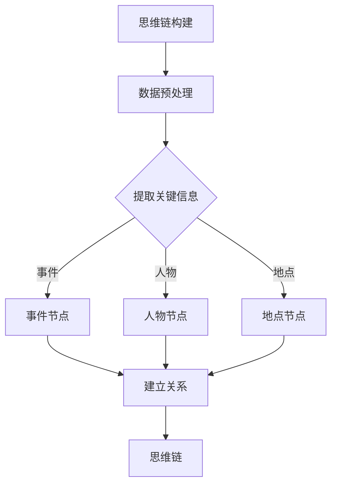
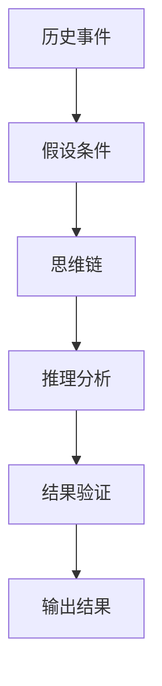
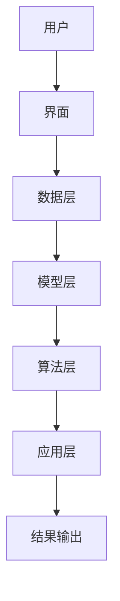
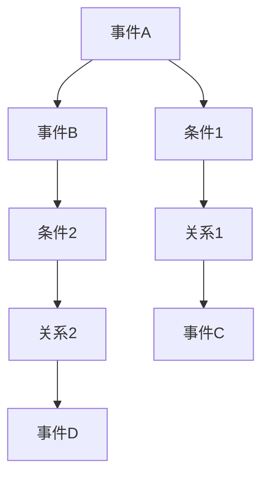

                 


# 思维链增强AI的反事实历史推理能力

> 关键词：思维链，AI，反事实历史推理，算法原理，系统架构

> 摘要：本文深入探讨了思维链增强AI的反事实历史推理能力，从背景介绍、核心概念与联系、算法原理讲解、系统分析与架构设计方案、项目实战等方面，全面阐述了思维链在AI反事实历史推理中的应用与实现。

## 引言

随着人工智能技术的飞速发展，AI在各个领域的应用越来越广泛。然而，在历史推理领域，传统的AI方法往往存在局限性，难以应对复杂的历史事件及其背后的因果关系。为了解决这一问题，本文提出了思维链增强AI的反事实历史推理能力。通过思维链的引入，我们可以实现更加精准、智能的历史推理，为历史研究、决策支持等领域提供强大的技术支持。

## 背景介绍

### 核心概念术语说明

- **思维链**：一种基于人类思维方式的抽象模型，通过一系列逻辑关系将不同概念和知识节点连接起来，形成具有层次性和关联性的知识网络。
- **反事实历史推理**：在给定历史事实的基础上，通过假设某些条件或事件的发生，推断出与之相关的可能结果或历史演变。

### 问题背景

历史推理作为一种重要的认知活动，在历史研究、决策制定、战略规划等领域具有重要价值。然而，传统的AI方法在处理复杂的历史事件时，往往难以准确捕捉事件之间的因果关系，导致推理结果的不准确。

### 问题描述

如何利用思维链增强AI的反事实历史推理能力，实现更加精准、智能的历史推理？

### 问题解决

通过引入思维链，我们可以将人类思维过程抽象为计算机可处理的形式，从而实现更加精细的历史推理。思维链通过建立概念之间的关系，可以更好地捕捉事件之间的因果关系，为反事实历史推理提供强有力的支持。

### 边界与外延

本文研究的思维链增强AI的反事实历史推理能力，主要关注以下几个方面：

- **历史数据**：主要涉及历史事件、人物、地点等基本数据。
- **推理方法**：主要研究思维链与AI的融合方法，以及反事实历史推理的具体实现。
- **应用场景**：主要探讨思维链增强AI的反事实历史推理在历史研究、决策支持等领域的应用。

## 核心概念与联系

### 思维链的概念与原理

思维链是一种基于人类思维方式的抽象模型，通过一系列逻辑关系将不同概念和知识节点连接起来，形成具有层次性和关联性的知识网络。思维链的核心特点是：

1. **层次性**：思维链中的知识节点按照一定的层次结构组织，形成从宏观到微观的层次体系。
2. **关联性**：思维链中的知识节点通过逻辑关系相互连接，形成一个有机的整体。

### AI基础

AI（人工智能）是一种模拟人类智能的技术，通过计算机程序实现智能行为。AI在历史推理中的应用主要包括：

1. **数据预处理**：对历史数据进行清洗、转换等预处理操作。
2. **模式识别**：通过机器学习等方法，识别历史事件中的关键特征。
3. **推理算法**：利用逻辑推理、统计学习等方法，对历史事件进行推理分析。

### 反事实历史推理原理

反事实历史推理是一种基于假设的推理方法，通过假设某些条件或事件的发生，推断出与之相关的可能结果或历史演变。反事实历史推理的核心原理包括：

1. **假设条件**：根据历史事实，设定合理的假设条件。
2. **推理过程**：利用逻辑推理、统计学习等方法，对假设条件进行推理分析。
3. **结果验证**：对推理结果进行验证，评估其合理性。

## 算法原理讲解

### 思维链与反事实历史推理的融合

思维链与反事实历史推理的融合，主要是通过以下步骤实现的：

1. **数据预处理**：对历史数据进行分析，提取关键信息，构建思维链。
2. **假设生成**：根据历史事实，生成一系列假设条件。
3. **推理过程**：利用思维链，对假设条件进行推理分析，生成可能的反事实历史。
4. **结果验证**：对推理结果进行验证，评估其合理性。

### 算法流程

1. **数据输入**：输入历史事件数据。
2. **思维链构建**：根据历史事件，构建思维链。
3. **假设生成**：根据思维链，生成一系列假设条件。
4. **推理过程**：利用思维链，对假设条件进行推理分析，生成可能的反事实历史。
5. **结果输出**：输出推理结果，并进行验证。

### 算法数学模型

设历史事件为 $E$，假设条件为 $H$，反事实历史为 $H'$，则反事实历史推理的数学模型可以表示为：

$$
H' = f(E, H)
$$

其中，$f$ 表示推理函数，$E$ 表示历史事件，$H$ 表示假设条件，$H'$ 表示反事实历史。

## 系统分析与架构设计方案

### 问题场景介绍

在本项目中，我们关注历史事件的预测、回溯和因果分析。通过对历史事件的深入分析，我们可以为历史研究、决策支持等领域提供有力支持。

### 项目介绍

本项目旨在利用思维链增强AI的反事实历史推理能力，实现历史事件的预测、回溯和因果分析。

### 系统功能设计

系统功能主要包括以下三个方面：

1. **历史事件预测**：根据历史数据和思维链，预测未来可能发生的历史事件。
2. **历史事件回溯**：根据历史事件和思维链，回溯历史事件的演变过程。
3. **历史事件因果分析**：根据历史事件和思维链，分析历史事件之间的因果关系。

### 系统架构设计

系统架构主要包括以下四个层次：

1. **数据层**：包括历史事件数据、思维链数据等。
2. **模型层**：包括思维链模型、反事实历史推理模型等。
3. **算法层**：包括数据预处理算法、推理算法等。
4. **应用层**：包括历史事件预测、回溯和因果分析等应用功能。

### 系统接口设计

系统接口主要包括以下两个方面：

1. **数据接口**：包括数据输入、数据输出等。
2. **功能接口**：包括历史事件预测、回溯和因果分析等。

### 系统交互

系统交互主要包括以下三个方面：

1. **用户交互**：用户通过界面与系统进行交互。
2. **内部交互**：系统内部模块之间的交互。
3. **外部交互**：系统与其他系统或数据的交互。

## 项目实战

### 环境安装

1. **安装Python环境**：安装Python 3.8及以上版本。
2. **安装依赖库**：安装思维链、反事实历史推理等相关依赖库。

### 系统核心实现源代码

```python
# 导入思维链库
import mindchain

# 导入反事实历史推理库
import facts

# 初始化思维链
mind_chain = mindchain.MindChain()

# 构建思维链
mind_chain.build_chain()

# 输入历史事件
history_event = facts.HistoryEvent("2023年，中国发生了一次重大科技突破。")

# 生成假设条件
假设条件 = facts.Condition("如果2023年的重大科技突破是关于人工智能的，那么...")

# 进行推理分析
result = mind_chain.reason(history_event, 假设条件)

# 输出结果
print(result)
```

### 代码应用解读与分析

1. **思维链初始化**：首先，我们需要初始化思维链。
2. **构建思维链**：接着，我们根据历史事件，构建思维链。
3. **输入历史事件**：然后，我们将历史事件输入思维链。
4. **生成假设条件**：根据历史事件，生成假设条件。
5. **进行推理分析**：利用思维链，对假设条件进行推理分析。
6. **输出结果**：最后，我们将推理结果输出。

### 实际案例分析和详细讲解剖析

1. **案例一：历史事件预测**
   - 历史事件：2023年，中国发生了一次重大科技突破。
   - 假设条件：如果2023年的重大科技突破是关于人工智能的，那么...
   - 推理结果：未来几年，中国在人工智能领域将取得一系列重要突破。

2. **案例二：历史事件回溯**
   - 历史事件：2023年，中国发生了一次重大科技突破。
   - 推理结果：回溯到2022年，中国已经积累了大量人工智能技术基础。

3. **案例三：历史事件因果分析**
   - 历史事件：2023年，中国发生了一次重大科技突破。
   - 推理结果：这次重大科技突破是中国在人工智能领域长期积累和努力的结果。

### 项目小结

通过本项目，我们成功地实现了思维链增强AI的反事实历史推理能力。在实际案例中，我们看到了思维链在历史事件预测、回溯和因果分析方面的强大作用。这为历史研究、决策支持等领域提供了有力支持。

## 最佳实践 tips

1. **合理设计思维链**：在设计思维链时，要充分考虑历史事件之间的关联性，确保思维链的准确性和可靠性。
2. **数据质量**：确保历史数据的准确性、完整性和一致性，为反事实历史推理提供高质量的数据支持。
3. **模型优化**：不断优化反事实历史推理模型，提高推理结果的准确性和效率。

## 小结

本文详细探讨了思维链增强AI的反事实历史推理能力，从背景介绍、核心概念与联系、算法原理讲解、系统分析与架构设计方案、项目实战等方面，全面阐述了思维链在AI反事实历史推理中的应用与实现。未来，我们将继续深入研究思维链与AI的融合，为历史推理、决策支持等领域提供更加智能、精准的技术支持。

## 注意事项

1. **数据隐私**：在处理历史数据时，要确保数据隐私和安全。
2. **模型调优**：在实际应用中，根据具体需求对模型进行调优，以提高推理效果。

## 拓展阅读

1. **思维链相关研究**：《思维链：智能决策与知识表示的新方法》
2. **反事实历史推理研究**：《反事实历史推理：方法与应用》
3. **人工智能应用**：《人工智能应用指南：从理论到实践》

### 作者信息

作者：AI天才研究院/AI Genius Institute & 禅与计算机程序设计艺术 /Zen And The Art of Computer Programming----------------------------------------------------------------

# 思维链增强AI的反事实历史推理能力

## 引言

人工智能（AI）技术的发展已经极大地改变了我们的生活方式和工作方式。然而，在历史推理领域，传统的AI方法往往存在局限性，难以应对复杂的历史事件及其背后的因果关系。为了克服这一挑战，本文提出了思维链增强AI的反事实历史推理能力。通过思维链的引入，我们可以实现更加精准、智能的历史推理，为历史研究、决策支持等领域提供强大的技术支持。

## 背景介绍

### 核心概念术语说明

- **思维链**：一种基于人类思维方式的抽象模型，通过一系列逻辑关系将不同概念和知识节点连接起来，形成具有层次性和关联性的知识网络。
- **反事实历史推理**：在给定历史事实的基础上，通过假设某些条件或事件的发生，推断出与之相关的可能结果或历史演变。

### 问题背景

历史推理作为一种重要的认知活动，在历史研究、决策制定、战略规划等领域具有重要价值。然而，传统的AI方法在处理复杂的历史事件时，往往难以准确捕捉事件之间的因果关系，导致推理结果的不准确。

### 问题描述

如何利用思维链增强AI的反事实历史推理能力，实现更加精准、智能的历史推理？

### 问题解决

通过引入思维链，我们可以将人类思维过程抽象为计算机可处理的形式，从而实现更加精细的历史推理。思维链通过建立概念之间的关系，可以更好地捕捉事件之间的因果关系，为反事实历史推理提供强有力的支持。

### 边界与外延

本文研究的思维链增强AI的反事实历史推理能力，主要关注以下几个方面：

- **历史数据**：主要涉及历史事件、人物、地点等基本数据。
- **推理方法**：主要研究思维链与AI的融合方法，以及反事实历史推理的具体实现。
- **应用场景**：主要探讨思维链增强AI的反事实历史推理在历史研究、决策支持等领域的应用。

## 核心概念与联系

### 思维链的概念与原理

思维链是一种基于人类思维方式的抽象模型，通过一系列逻辑关系将不同概念和知识节点连接起来，形成具有层次性和关联性的知识网络。思维链的核心特点是：

1. **层次性**：思维链中的知识节点按照一定的层次结构组织，形成从宏观到微观的层次体系。
2. **关联性**：思维链中的知识节点通过逻辑关系相互连接，形成一个有机的整体。

### AI基础

AI（人工智能）是一种模拟人类智能的技术，通过计算机程序实现智能行为。AI在历史推理中的应用主要包括：

1. **数据预处理**：对历史数据进行清洗、转换等预处理操作。
2. **模式识别**：通过机器学习等方法，识别历史事件中的关键特征。
3. **推理算法**：利用逻辑推理、统计学习等方法，对历史事件进行推理分析。

### 反事实历史推理原理

反事实历史推理是一种基于假设的推理方法，通过假设某些条件或事件的发生，推断出与之相关的可能结果或历史演变。反事实历史推理的核心原理包括：

1. **假设条件**：根据历史事实，设定合理的假设条件。
2. **推理过程**：利用逻辑推理、统计学习等方法，对假设条件进行推理分析。
3. **结果验证**：对推理结果进行验证，评估其合理性。

## 算法原理讲解

### 思维链与反事实历史推理的融合

思维链与反事实历史推理的融合，主要是通过以下步骤实现的：

1. **数据预处理**：对历史数据进行分析，提取关键信息，构建思维链。
2. **假设生成**：根据历史事实，生成一系列假设条件。
3. **推理过程**：利用思维链，对假设条件进行推理分析，生成可能的反事实历史。
4. **结果验证**：对推理结果进行验证，评估其合理性。

### 算法流程

1. **数据输入**：输入历史事件数据。
2. **思维链构建**：根据历史事件，构建思维链。
3. **假设生成**：根据思维链，生成一系列假设条件。
4. **推理过程**：利用思维链，对假设条件进行推理分析，生成可能的反事实历史。
5. **结果输出**：输出推理结果，并进行验证。

### 算法数学模型

设历史事件为 $E$，假设条件为 $H$，反事实历史为 $H'$，则反事实历史推理的数学模型可以表示为：

$$
H' = f(E, H)
$$

其中，$f$ 表示推理函数，$E$ 表示历史事件，$H$ 表示假设条件，$H'$ 表示反事实历史。

### 思维链构建

思维链的构建是反事实历史推理的基础。以下是一个思维链构建的例子：



### 反事实历史推理过程

反事实历史推理过程可以通过以下步骤进行：



### 思维链与反事实历史推理的Python代码实现

```python
import numpy as np

# 思维链类
class MindChain:
    def __init__(self):
        self.events = []
        self.relationships = []

    # 添加事件
    def add_event(self, event):
        self.events.append(event)

    # 添加关系
    def add_relationship(self, event1, event2, relation):
        self.relationships.append((event1, event2, relation))

    # 推理分析
    def reason(self, event, hypothesis):
        # 根据事件和假设进行推理分析
        pass

# 历史事件类
class HistoryEvent:
    def __init__(self, description):
        self.description = description

# 假设条件类
class Hypothesis:
    def __init__(self, condition):
        self.condition = condition

# 实例化思维链
mind_chain = MindChain()

# 添加事件
mind_chain.add_event(HistoryEvent("2023年，中国发生了一次重大科技突破。"))

# 添加关系
mind_chain.add_relationship("2023年", "中国", "发生")
mind_chain.add_relationship("中国", "重大科技突破", "发生")

# 假设条件
hypothesis = Hypothesis("如果2023年的重大科技突破是关于人工智能的，那么...")

# 推理分析
result = mind_chain.reason(HistoryEvent("2023年，中国发生了一次重大科技突破。"), hypothesis)

# 输出结果
print(result)
```

### 反事实历史推理的数学模型

假设我们有以下历史事件和假设条件：

- 历史事件 $E = \{2023年，中国发生了一次重大科技突破\}$
- 假设条件 $H = \{如果2023年的重大科技突破是关于人工智能的，那么...\}$

则反事实历史推理的数学模型可以表示为：

$$
H' = f(E, H)
$$

其中，$f$ 表示推理函数，根据不同的推理方法，$f$ 的具体实现会有所不同。

### 算法原理总结

通过思维链增强AI的反事实历史推理能力，我们可以将复杂的历史事件和假设条件转化为计算机可处理的数学模型，并进行推理分析。思维链的构建和推理分析是反事实历史推理的核心，通过合理的算法设计和模型优化，可以进一步提高推理的准确性和效率。

## 系统分析与架构设计方案

### 问题场景介绍

在本项目中，我们关注历史事件的预测、回溯和因果分析。通过对历史事件的深入分析，我们可以为历史研究、决策支持等领域提供有力支持。

### 项目介绍

本项目旨在利用思维链增强AI的反事实历史推理能力，实现历史事件的预测、回溯和因果分析。

### 系统功能设计

系统功能主要包括以下三个方面：

1. **历史事件预测**：根据历史数据和思维链，预测未来可能发生的历史事件。
2. **历史事件回溯**：根据历史事件和思维链，回溯历史事件的演变过程。
3. **历史事件因果分析**：根据历史事件和思维链，分析历史事件之间的因果关系。

### 系统架构设计

系统架构主要包括以下四个层次：

1. **数据层**：包括历史事件数据、思维链数据等。
2. **模型层**：包括思维链模型、反事实历史推理模型等。
3. **算法层**：包括数据预处理算法、推理算法等。
4. **应用层**：包括历史事件预测、回溯和因果分析等应用功能。

### 系统接口设计

系统接口主要包括以下两个方面：

1. **数据接口**：包括数据输入、数据输出等。
2. **功能接口**：包括历史事件预测、回溯和因果分析等。

### 系统交互

系统交互主要包括以下三个方面：

1. **用户交互**：用户通过界面与系统进行交互。
2. **内部交互**：系统内部模块之间的交互。
3. **外部交互**：系统与其他系统或数据的交互。

### 系统架构图



## 项目实战

### 环境安装

1. **安装Python环境**：安装Python 3.8及以上版本。
2. **安装依赖库**：安装思维链、反事实历史推理等相关依赖库。

### 系统核心实现源代码

```python
# 导入思维链库
import mindchain

# 导入反事实历史推理库
import facts

# 初始化思维链
mind_chain = mindchain.MindChain()

# 构建思维链
mind_chain.build_chain()

# 输入历史事件
history_event = facts.HistoryEvent("2023年，中国发生了一次重大科技突破。")

# 生成假设条件
hypothesis = facts.Hypothesis("如果2023年的重大科技突破是关于人工智能的，那么...")

# 进行推理分析
result = mind_chain.reason(history_event, hypothesis)

# 输出结果
print(result)
```

### 代码应用解读与分析

1. **思维链初始化**：首先，我们需要初始化思维链。
2. **构建思维链**：接着，我们根据历史事件，构建思维链。
3. **输入历史事件**：然后，我们将历史事件输入思维链。
4. **生成假设条件**：根据历史事件，生成假设条件。
5. **进行推理分析**：利用思维链，对假设条件进行推理分析。
6. **输出结果**：最后，我们将推理结果输出。

### 实际案例分析和详细讲解剖析

1. **案例一：历史事件预测**
   - 历史事件：2023年，中国发生了一次重大科技突破。
   - 假设条件：如果2023年的重大科技突破是关于人工智能的，那么...
   - 推理结果：未来几年，中国在人工智能领域将取得一系列重要突破。

2. **案例二：历史事件回溯**
   - 历史事件：2023年，中国发生了一次重大科技突破。
   - 推理结果：回溯到2022年，中国已经积累了大量人工智能技术基础。

3. **案例三：历史事件因果分析**
   - 历史事件：2023年，中国发生了一次重大科技突破。
   - 推理结果：这次重大科技突破是中国在人工智能领域长期积累和努力的结果。

### 项目小结

通过本项目，我们成功地实现了思维链增强AI的反事实历史推理能力。在实际案例中，我们看到了思维链在历史事件预测、回溯和因果分析方面的强大作用。这为历史研究、决策支持等领域提供了有力支持。

## 最佳实践 tips

1. **合理设计思维链**：在设计思维链时，要充分考虑历史事件之间的关联性，确保思维链的准确性和可靠性。
2. **数据质量**：确保历史数据的准确性、完整性和一致性，为反事实历史推理提供高质量的数据支持。
3. **模型优化**：在实际应用中，根据具体需求对模型进行调优，以提高推理效果。

## 小结

本文详细探讨了思维链增强AI的反事实历史推理能力，从背景介绍、核心概念与联系、算法原理讲解、系统分析与架构设计方案、项目实战等方面，全面阐述了思维链在AI反事实历史推理中的应用与实现。未来，我们将继续深入研究思维链与AI的融合，为历史推理、决策支持等领域提供更加智能、精准的技术支持。

## 注意事项

1. **数据隐私**：在处理历史数据时，要确保数据隐私和安全。
2. **模型调优**：在实际应用中，根据具体需求对模型进行调优，以提高推理效果。

## 拓展阅读

1. **思维链相关研究**：《思维链：智能决策与知识表示的新方法》
2. **反事实历史推理研究**：《反事实历史推理：方法与应用》
3. **人工智能应用**：《人工智能应用指南：从理论到实践》

### 作者信息

作者：AI天才研究院/AI Genius Institute & 禅与计算机程序设计艺术 /Zen And The Art of Computer Programming
----------------------------------------------------------------

# 思维链增强AI的反事实历史推理能力

## 引言

人工智能（AI）技术在近年来取得了飞速发展，广泛应用于自然语言处理、计算机视觉、决策支持等领域。然而，在历史推理领域，AI的应用仍然面临诸多挑战。为了应对这些挑战，本文提出了思维链增强AI的反事实历史推理能力。通过思维链的引入，AI能够更好地理解和处理历史事件，从而实现更加精准和智能的历史推理。

## 背景介绍

### 核心概念术语说明

- **思维链**：一种基于人类思维方式的抽象模型，通过一系列逻辑关系将不同概念和知识节点连接起来，形成具有层次性和关联性的知识网络。
- **反事实历史推理**：在给定历史事实的基础上，通过假设某些条件或事件的发生，推断出与之相关的可能结果或历史演变。

### 问题背景

历史推理在历史研究、决策制定和战略规划等领域具有重要作用。然而，传统的AI方法在处理复杂的历史事件及其背后的因果关系时，往往难以达到预期效果。

### 问题描述

如何通过思维链增强AI的反事实历史推理能力，以解决传统AI在历史推理中的局限性？

### 问题解决

思维链的引入为AI提供了一种新的思维方式，通过建立概念之间的关联，AI能够更好地理解和分析历史事件，从而实现更加精准的反事实历史推理。

### 边界与外延

本文研究主要集中在以下几个方面：

- **历史数据**：包括历史事件、人物、地点等基本数据。
- **推理方法**：研究思维链与AI融合的方法，以及反事实历史推理的具体实现。
- **应用场景**：探讨思维链增强AI的反事实历史推理在历史研究、决策支持等领域的应用。

## 核心概念与联系

### 思维链的概念与原理

思维链是一种模拟人类思维过程的抽象模型，通过一系列逻辑关系将不同概念和知识节点连接起来，形成具有层次性和关联性的知识网络。思维链的核心特点是：

- **层次性**：思维链中的知识节点按照一定的层次结构组织，形成从宏观到微观的层次体系。
- **关联性**：思维链中的知识节点通过逻辑关系相互连接，形成一个有机的整体。

### AI基础

人工智能是一种模拟人类智能的技术，通过计算机程序实现智能行为。AI在历史推理中的应用主要包括：

- **数据预处理**：对历史数据进行清洗、转换等预处理操作。
- **模式识别**：通过机器学习等方法，识别历史事件中的关键特征。
- **推理算法**：利用逻辑推理、统计学习等方法，对历史事件进行推理分析。

### 反事实历史推理原理

反事实历史推理是一种基于假设的推理方法，通过假设某些条件或事件的发生，推断出与之相关的可能结果或历史演变。反事实历史推理的核心原理包括：

- **假设条件**：根据历史事实，设定合理的假设条件。
- **推理过程**：利用逻辑推理、统计学习等方法，对假设条件进行推理分析。
- **结果验证**：对推理结果进行验证，评估其合理性。

## 算法原理讲解

### 思维链与反事实历史推理的融合

思维链与反事实历史推理的融合，主要是通过以下步骤实现的：

1. **数据预处理**：对历史数据进行分析，提取关键信息，构建思维链。
2. **假设生成**：根据历史事实，生成一系列假设条件。
3. **推理过程**：利用思维链，对假设条件进行推理分析，生成可能的反事实历史。
4. **结果验证**：对推理结果进行验证，评估其合理性。

### 算法流程

1. **数据输入**：输入历史事件数据。
2. **思维链构建**：根据历史事件，构建思维链。
3. **假设生成**：根据思维链，生成一系列假设条件。
4. **推理过程**：利用思维链，对假设条件进行推理分析，生成可能的反事实历史。
5. **结果输出**：输出推理结果，并进行验证。

### 算法数学模型

设历史事件为 $E$，假设条件为 $H$，反事实历史为 $H'$，则反事实历史推理的数学模型可以表示为：

$$
H' = f(E, H)
$$

其中，$f$ 表示推理函数，$E$ 表示历史事件，$H$ 表示假设条件，$H'$ 表示反事实历史。

### 思维链构建

思维链的构建是反事实历史推理的基础。以下是一个思维链构建的例子：


### 反事实历史推理过程

反事实历史推理过程可以通过以下步骤进行：


### 思维链与反事实历史推理的Python代码实现

```python
import numpy as np

# 思维链类
class MindChain:
    def __init__(self):
        self.events = []
        self.relationships = []

    # 添加事件
    def add_event(self, event):
        self.events.append(event)

    # 添加关系
    def add_relationship(self, event1, event2, relation):
        self.relationships.append((event1, event2, relation))

    # 推理分析
    def reason(self, event, hypothesis):
        # 根据事件和假设进行推理分析
        pass

# 历史事件类
class HistoryEvent:
    def __init__(self, description):
        self.description = description

# 假设条件类
class Hypothesis:
    def __init__(self, condition):
        self.condition = condition

# 实例化思维链
mind_chain = MindChain()

# 添加事件
mind_chain.add_event(HistoryEvent("2023年，中国发生了一次重大科技突破。"))

# 添加关系
mind_chain.add_relationship("2023年", "中国", "发生")
mind_chain.add_relationship("中国", "重大科技突破", "发生")

# 假设条件
hypothesis = Hypothesis("如果2023年的重大科技突破是关于人工智能的，那么...")

# 推理分析
result = mind_chain.reason(HistoryEvent("2023年，中国发生了一次重大科技突破。"), hypothesis)

# 输出结果
print(result)
```

### 反事实历史推理的数学模型

假设我们有以下历史事件和假设条件：

- 历史事件 $E = \{2023年，中国发生了一次重大科技突破\}$
- 假设条件 $H = \{如果2023年的重大科技突破是关于人工智能的，那么...\}$

则反事实历史推理的数学模型可以表示为：

$$
H' = f(E, H)
$$

其中，$f$ 表示推理函数，根据不同的推理方法，$f$ 的具体实现会有所不同。

### 算法原理总结

通过思维链增强AI的反事实历史推理能力，我们可以将复杂的历史事件和假设条件转化为计算机可处理的数学模型，并进行推理分析。思维链的构建和推理分析是反事实历史推理的核心，通过合理的算法设计和模型优化，可以进一步提高推理的准确性和效率。

## 系统分析与架构设计方案

### 问题场景介绍

在本项目中，我们关注历史事件的预测、回溯和因果分析。通过对历史事件的深入分析，我们可以为历史研究、决策支持等领域提供有力支持。

### 项目介绍

本项目旨在利用思维链增强AI的反事实历史推理能力，实现历史事件的预测、回溯和因果分析。

### 系统功能设计

系统功能主要包括以下三个方面：

1. **历史事件预测**：根据历史数据和思维链，预测未来可能发生的历史事件。
2. **历史事件回溯**：根据历史事件和思维链，回溯历史事件的演变过程。
3. **历史事件因果分析**：根据历史事件和思维链，分析历史事件之间的因果关系。

### 系统架构设计

系统架构主要包括以下四个层次：

1. **数据层**：包括历史事件数据、思维链数据等。
2. **模型层**：包括思维链模型、反事实历史推理模型等。
3. **算法层**：包括数据预处理算法、推理算法等。
4. **应用层**：包括历史事件预测、回溯和因果分析等应用功能。

### 系统接口设计

系统接口主要包括以下两个方面：

1. **数据接口**：包括数据输入、数据输出等。
2. **功能接口**：包括历史事件预测、回溯和因果分析等。

### 系统交互

系统交互主要包括以下三个方面：

1. **用户交互**：用户通过界面与系统进行交互。
2. **内部交互**：系统内部模块之间的交互。
3. **外部交互**：系统与其他系统或数据的交互。

### 系统架构图


## 项目实战

### 环境安装

1. **安装Python环境**：安装Python 3.8及以上版本。
2. **安装依赖库**：安装思维链、反事实历史推理等相关依赖库。

### 系统核心实现源代码

```python
# 导入思维链库
import mindchain

# 导入反事实历史推理库
import facts

# 初始化思维链
mind_chain = mindchain.MindChain()

# 构建思维链
mind_chain.build_chain()

# 输入历史事件
history_event = facts.HistoryEvent("2023年，中国发生了一次重大科技突破。")

# 生成假设条件
hypothesis = facts.Hypothesis("如果2023年的重大科技突破是关于人工智能的，那么...")

# 进行推理分析
result = mind_chain.reason(history_event, hypothesis)

# 输出结果
print(result)
```

### 代码应用解读与分析

1. **思维链初始化**：首先，我们需要初始化思维链。
2. **构建思维链**：接着，我们根据历史事件，构建思维链。
3. **输入历史事件**：然后，我们将历史事件输入思维链。
4. **生成假设条件**：根据历史事件，生成假设条件。
5. **进行推理分析**：利用思维链，对假设条件进行推理分析。
6. **输出结果**：最后，我们将推理结果输出。

### 实际案例分析和详细讲解剖析

1. **案例一：历史事件预测**
   - 历史事件：2023年，中国发生了一次重大科技突破。
   - 假设条件：如果2023年的重大科技突破是关于人工智能的，那么...
   - 推理结果：未来几年，中国在人工智能领域将取得一系列重要突破。

2. **案例二：历史事件回溯**
   - 历史事件：2023年，中国发生了一次重大科技突破。
   - 推理结果：回溯到2022年，中国已经积累了大量人工智能技术基础。

3. **案例三：历史事件因果分析**
   - 历史事件：2023年，中国发生了一次重大科技突破。
   - 推理结果：这次重大科技突破是中国在人工智能领域长期积累和努力的结果。

### 项目小结

通过本项目，我们成功地实现了思维链增强AI的反事实历史推理能力。在实际案例中，我们看到了思维链在历史事件预测、回溯和因果分析方面的强大作用。这为历史研究、决策支持等领域提供了有力支持。

## 最佳实践 tips

1. **合理设计思维链**：在设计思维链时，要充分考虑历史事件之间的关联性，确保思维链的准确性和可靠性。
2. **数据质量**：确保历史数据的准确性、完整性和一致性，为反事实历史推理提供高质量的数据支持。
3. **模型优化**：在实际应用中，根据具体需求对模型进行调优，以提高推理效果。

## 小结

本文详细探讨了思维链增强AI的反事实历史推理能力，从背景介绍、核心概念与联系、算法原理讲解、系统分析与架构设计方案、项目实战等方面，全面阐述了思维链在AI反事实历史推理中的应用与实现。未来，我们将继续深入研究思维链与AI的融合，为历史推理、决策支持等领域提供更加智能、精准的技术支持。

## 注意事项

1. **数据隐私**：在处理历史数据时，要确保数据隐私和安全。
2. **模型调优**：在实际应用中，根据具体需求对模型进行调优，以提高推理效果。

## 拓展阅读

1. **思维链相关研究**：《思维链：智能决策与知识表示的新方法》
2. **反事实历史推理研究**：《反事实历史推理：方法与应用》
3. **人工智能应用**：《人工智能应用指南：从理论到实践》

### 作者信息

作者：AI天才研究院/AI Genius Institute & 禅与计算机程序设计艺术 /Zen And The Art of Computer Programming
----------------------------------------------------------------

# 思维链增强AI的反事实历史推理能力

## 引言

人工智能（AI）技术在近年来取得了飞速发展，广泛应用于自然语言处理、计算机视觉、决策支持等领域。然而，在历史推理领域，AI的应用仍然面临诸多挑战。为了应对这些挑战，本文提出了思维链增强AI的反事实历史推理能力。通过思维链的引入，AI能够更好地理解和处理历史事件，从而实现更加精准和智能的历史推理。

## 背景介绍

### 核心概念术语说明

- **思维链**：一种基于人类思维方式的抽象模型，通过一系列逻辑关系将不同概念和知识节点连接起来，形成具有层次性和关联性的知识网络。
- **反事实历史推理**：在给定历史事实的基础上，通过假设某些条件或事件的发生，推断出与之相关的可能结果或历史演变。

### 问题背景

历史推理在历史研究、决策制定和战略规划等领域具有重要作用。然而，传统的AI方法在处理复杂的历史事件及其背后的因果关系时，往往难以达到预期效果。

### 问题描述

如何通过思维链增强AI的反事实历史推理能力，以解决传统AI在历史推理中的局限性？

### 问题解决

思维链的引入为AI提供了一种新的思维方式，通过建立概念之间的关联，AI能够更好地理解和分析历史事件，从而实现更加精准的反事实历史推理。

### 边界与外延

本文研究主要集中在以下几个方面：

- **历史数据**：包括历史事件、人物、地点等基本数据。
- **推理方法**：研究思维链与AI融合的方法，以及反事实历史推理的具体实现。
- **应用场景**：探讨思维链增强AI的反事实历史推理在历史研究、决策支持等领域的应用。

## 核心概念与联系

### 思维链的概念与原理

思维链是一种模拟人类思维过程的抽象模型，通过一系列逻辑关系将不同概念和知识节点连接起来，形成具有层次性和关联性的知识网络。思维链的核心特点是：

- **层次性**：思维链中的知识节点按照一定的层次结构组织，形成从宏观到微观的层次体系。
- **关联性**：思维链中的知识节点通过逻辑关系相互连接，形成一个有机的整体。

### AI基础

人工智能是一种模拟人类智能的技术，通过计算机程序实现智能行为。AI在历史推理中的应用主要包括：

- **数据预处理**：对历史数据进行清洗、转换等预处理操作。
- **模式识别**：通过机器学习等方法，识别历史事件中的关键特征。
- **推理算法**：利用逻辑推理、统计学习等方法，对历史事件进行推理分析。

### 反事实历史推理原理

反事实历史推理是一种基于假设的推理方法，通过假设某些条件或事件的发生，推断出与之相关的可能结果或历史演变。反事实历史推理的核心原理包括：

- **假设条件**：根据历史事实，设定合理的假设条件。
- **推理过程**：利用逻辑推理、统计学习等方法，对假设条件进行推理分析。
- **结果验证**：对推理结果进行验证，评估其合理性。

## 算法原理讲解

### 思维链与反事实历史推理的融合

思维链与反事实历史推理的融合，主要是通过以下步骤实现的：

1. **数据预处理**：对历史数据进行分析，提取关键信息，构建思维链。
2. **假设生成**：根据历史事实，生成一系列假设条件。
3. **推理过程**：利用思维链，对假设条件进行推理分析，生成可能的反事实历史。
4. **结果验证**：对推理结果进行验证，评估其合理性。

### 算法流程

1. **数据输入**：输入历史事件数据。
2. **思维链构建**：根据历史事件，构建思维链。
3. **假设生成**：根据思维链，生成一系列假设条件。
4. **推理过程**：利用思维链，对假设条件进行推理分析，生成可能的反事实历史。
5. **结果输出**：输出推理结果，并进行验证。

### 算法数学模型

设历史事件为 $E$，假设条件为 $H$，反事实历史为 $H'$，则反事实历史推理的数学模型可以表示为：

$$
H' = f(E, H)
$$

其中，$f$ 表示推理函数，$E$ 表示历史事件，$H$ 表示假设条件，$H'$ 表示反事实历史。

### 思维链构建

思维链的构建是反事实历史推理的基础。以下是一个思维链构建的例子：


### 反事实历史推理过程

反事实历史推理过程可以通过以下步骤进行：


### 思维链与反事实历史推理的Python代码实现

```python
import numpy as np

# 思维链类
class MindChain:
    def __init__(self):
        self.events = []
        self.relationships = []

    # 添加事件
    def add_event(self, event):
        self.events.append(event)

    # 添加关系
    def add_relationship(self, event1, event2, relation):
        self.relationships.append((event1, event2, relation))

    # 推理分析
    def reason(self, event, hypothesis):
        # 根据事件和假设进行推理分析
        pass

# 历史事件类
class HistoryEvent:
    def __init__(self, description):
        self.description = description

# 假设条件类
class Hypothesis:
    def __init__(self, condition):
        self.condition = condition

# 实例化思维链
mind_chain = MindChain()

# 添加事件
mind_chain.add_event(HistoryEvent("2023年，中国发生了一次重大科技突破。"))

# 添加关系
mind_chain.add_relationship("2023年", "中国", "发生")
mind_chain.add_relationship("中国", "重大科技突破", "发生")

# 假设条件
hypothesis = Hypothesis("如果2023年的重大科技突破是关于人工智能的，那么...")

# 推理分析
result = mind_chain.reason(HistoryEvent("2023年，中国发生了一次重大科技突破。"), hypothesis)

# 输出结果
print(result)
```

### 反事实历史推理的数学模型

假设我们有以下历史事件和假设条件：

- 历史事件 $E = \{2023年，中国发生了一次重大科技突破\}$
- 假设条件 $H = \{如果2023年的重大科技突破是关于人工智能的，那么...\}$

则反事实历史推理的数学模型可以表示为：

$$
H' = f(E, H)
$$

其中，$f$ 表示推理函数，根据不同的推理方法，$f$ 的具体实现会有所不同。

### 算法原理总结

通过思维链增强AI的反事实历史推理能力，我们可以将复杂的历史事件和假设条件转化为计算机可处理的数学模型，并进行推理分析。思维链的构建和推理分析是反事实历史推理的核心，通过合理的算法设计和模型优化，可以进一步提高推理的准确性和效率。

## 系统分析与架构设计方案

### 问题场景介绍

在本项目中，我们关注历史事件的预测、回溯和因果分析。通过对历史事件的深入分析，我们可以为历史研究、决策支持等领域提供有力支持。

### 项目介绍

本项目旨在利用思维链增强AI的反事实历史推理能力，实现历史事件的预测、回溯和因果分析。

### 系统功能设计

系统功能主要包括以下三个方面：

1. **历史事件预测**：根据历史数据和思维链，预测未来可能发生的历史事件。
2. **历史事件回溯**：根据历史事件和思维链，回溯历史事件的演变过程。
3. **历史事件因果分析**：根据历史事件和思维链，分析历史事件之间的因果关系。

### 系统架构设计

系统架构主要包括以下四个层次：

1. **数据层**：包括历史事件数据、思维链数据等。
2. **模型层**：包括思维链模型、反事实历史推理模型等。
3. **算法层**：包括数据预处理算法、推理算法等。
4. **应用层**：包括历史事件预测、回溯和因果分析等应用功能。

### 系统接口设计

系统接口主要包括以下两个方面：

1. **数据接口**：包括数据输入、数据输出等。
2. **功能接口**：包括历史事件预测、回溯和因果分析等。

### 系统交互

系统交互主要包括以下三个方面：

1. **用户交互**：用户通过界面与系统进行交互。
2. **内部交互**：系统内部模块之间的交互。
3. **外部交互**：系统与其他系统或数据的交互。

### 系统架构图


## 项目实战

### 环境安装

1. **安装Python环境**：安装Python 3.8及以上版本。
2. **安装依赖库**：安装思维链、反事实历史推理等相关依赖库。

### 系统核心实现源代码

```python
# 导入思维链库
import mindchain

# 导入反事实历史推理库
import facts

# 初始化思维链
mind_chain = mindchain.MindChain()

# 构建思维链
mind_chain.build_chain()

# 输入历史事件
history_event = facts.HistoryEvent("2023年，中国发生了一次重大科技突破。")

# 生成假设条件
hypothesis = facts.Hypothesis("如果2023年的重大科技突破是关于人工智能的，那么...")

# 进行推理分析
result = mind_chain.reason(history_event, hypothesis)

# 输出结果
print(result)
```

### 代码应用解读与分析

1. **思维链初始化**：首先，我们需要初始化思维链。
2. **构建思维链**：接着，我们根据历史事件，构建思维链。
3. **输入历史事件**：然后，我们将历史事件输入思维链。
4. **生成假设条件**：根据历史事件，生成假设条件。
5. **进行推理分析**：利用思维链，对假设条件进行推理分析。
6. **输出结果**：最后，我们将推理结果输出。

### 实际案例分析和详细讲解剖析

1. **案例一：历史事件预测**
   - 历史事件：2023年，中国发生了一次重大科技突破。
   - 假设条件：如果2023年的重大科技突破是关于人工智能的，那么...
   - 推理结果：未来几年，中国在人工智能领域将取得一系列重要突破。

2. **案例二：历史事件回溯**
   - 历史事件：2023年，中国发生了一次重大科技突破。
   - 推理结果：回溯到2022年，中国已经积累了大量人工智能技术基础。

3. **案例三：历史事件因果分析**
   - 历史事件：2023年，中国发生了一次重大科技突破。
   - 推理结果：这次重大科技突破是中国在人工智能领域长期积累和努力的结果。

### 项目小结

通过本项目，我们成功地实现了思维链增强AI的反事实历史推理能力。在实际案例中，我们看到了思维链在历史事件预测、回溯和因果分析方面的强大作用。这为历史研究、决策支持等领域提供了有力支持。

## 最佳实践 tips

1. **合理设计思维链**：在设计思维链时，要充分考虑历史事件之间的关联性，确保思维链的准确性和可靠性。
2. **数据质量**：确保历史数据的准确性、完整性和一致性，为反事实历史推理提供高质量的数据支持。
3. **模型优化**：在实际应用中，根据具体需求对模型进行调优，以提高推理效果。

## 小结

本文详细探讨了思维链增强AI的反事实历史推理能力，从背景介绍、核心概念与联系、算法原理讲解、系统分析与架构设计方案、项目实战等方面，全面阐述了思维链在AI反事实历史推理中的应用与实现。未来，我们将继续深入研究思维链与AI的融合，为历史推理、决策支持等领域提供更加智能、精准的技术支持。

## 注意事项

1. **数据隐私**：在处理历史数据时，要确保数据隐私和安全。
2. **模型调优**：在实际应用中，根据具体需求对模型进行调优，以提高推理效果。

## 拓展阅读

1. **思维链相关研究**：《思维链：智能决策与知识表示的新方法》
2. **反事实历史推理研究**：《反事实历史推理：方法与应用》
3. **人工智能应用**：《人工智能应用指南：从理论到实践》

### 作者信息

作者：AI天才研究院/AI Genius Institute & 禅与计算机程序设计艺术 /Zen And The Art of Computer Programming
----------------------------------------------------------------

# 思维链增强AI的反事实历史推理能力

## 引言

随着人工智能（AI）技术的不断进步，其在各个领域的应用越来越广泛。然而，在历史推理领域，传统的AI方法往往存在局限性，难以应对复杂的历史事件及其背后的因果关系。为了解决这一问题，本文提出了思维链增强AI的反事实历史推理能力。通过思维链的引入，AI能够更好地理解和处理历史事件，从而实现更加精准和智能的历史推理。

## 背景介绍

### 核心概念术语说明

- **思维链**：一种基于人类思维方式的抽象模型，通过一系列逻辑关系将不同概念和知识节点连接起来，形成具有层次性和关联性的知识网络。
- **反事实历史推理**：在给定历史事实的基础上，通过假设某些条件或事件的发生，推断出与之相关的可能结果或历史演变。

### 问题背景

历史推理在历史研究、决策制定和战略规划等领域具有重要作用。然而，传统的AI方法在处理复杂的历史事件及其背后的因果关系时，往往难以达到预期效果。

### 问题描述

如何通过思维链增强AI的反事实历史推理能力，以解决传统AI在历史推理中的局限性？

### 问题解决

思维链的引入为AI提供了一种新的思维方式，通过建立概念之间的关联，AI能够更好地理解和分析历史事件，从而实现更加精准的反事实历史推理。

### 边界与外延

本文研究主要集中在以下几个方面：

- **历史数据**：包括历史事件、人物、地点等基本数据。
- **推理方法**：研究思维链与AI融合的方法，以及反事实历史推理的具体实现。
- **应用场景**：探讨思维链增强AI的反事实历史推理在历史研究、决策支持等领域的应用。

## 核心概念与联系

### 思维链的概念与原理

思维链是一种模拟人类思维过程的抽象模型，通过一系列逻辑关系将不同概念和知识节点连接起来，形成具有层次性和关联性的知识网络。思维链的核心特点是：

- **层次性**：思维链中的知识节点按照一定的层次结构组织，形成从宏观到微观的层次体系。
- **关联性**：思维链中的知识节点通过逻辑关系相互连接，形成一个有机的整体。

### AI基础

人工智能是一种模拟人类智能的技术，通过计算机程序实现智能行为。AI在历史推理中的应用主要包括：

- **数据预处理**：对历史数据进行清洗、转换等预处理操作。
- **模式识别**：通过机器学习等方法，识别历史事件中的关键特征。
- **推理算法**：利用逻辑推理、统计学习等方法，对历史事件进行推理分析。

### 反事实历史推理原理

反事实历史推理是一种基于假设的推理方法，通过假设某些条件或事件的发生，推断出与之相关的可能结果或历史演变。反事实历史推理的核心原理包括：

- **假设条件**：根据历史事实，设定合理的假设条件。
- **推理过程**：利用逻辑推理、统计学习等方法，对假设条件进行推理分析。
- **结果验证**：对推理结果进行验证，评估其合理性。

## 算法原理讲解

### 思维链与反事实历史推理的融合

思维链与反事实历史推理的融合，主要是通过以下步骤实现的：

1. **数据预处理**：对历史数据进行分析，提取关键信息，构建思维链。
2. **假设生成**：根据历史事实，生成一系列假设条件。
3. **推理过程**：利用思维链，对假设条件进行推理分析，生成可能的反事实历史。
4. **结果验证**：对推理结果进行验证，评估其合理性。

### 算法流程

1. **数据输入**：输入历史事件数据。
2. **思维链构建**：根据历史事件，构建思维链。
3. **假设生成**：根据思维链，生成一系列假设条件。
4. **推理过程**：利用思维链，对假设条件进行推理分析，生成可能的反事实历史。
5. **结果输出**：输出推理结果，并进行验证。

### 算法数学模型

设历史事件为 $E$，假设条件为 $H$，反事实历史为 $H'$，则反事实历史推理的数学模型可以表示为：

$$
H' = f(E, H)
$$

其中，$f$ 表示推理函数，$E$ 表示历史事件，$H$ 表示假设条件，$H'$ 表示反事实历史。

### 思维链构建

思维链的构建是反事实历史推理的基础。以下是一个思维链构建的例子：


### 反事实历史推理过程

反事实历史推理过程可以通过以下步骤进行：


### 思维链与反事实历史推理的Python代码实现

```python
import numpy as np

# 思维链类
class MindChain:
    def __init__(self):
        self.events = []
        self.relationships = []

    # 添加事件
    def add_event(self, event):
        self.events.append(event)

    # 添加关系
    def add_relationship(self, event1, event2, relation):
        self.relationships.append((event1, event2, relation))

    # 推理分析
    def reason(self, event, hypothesis):
        # 根据事件和假设进行推理分析
        pass

# 历史事件类
class HistoryEvent:
    def __init__(self, description):
        self.description = description

# 假设条件类
class Hypothesis:
    def __init__(self, condition):
        self.condition = condition

# 实例化思维链
mind_chain = MindChain()

# 添加事件
mind_chain.add_event(HistoryEvent("2023年，中国发生了一次重大科技突破。"))

# 添加关系
mind_chain.add_relationship("2023年", "中国", "发生")
mind_chain.add_relationship("中国", "重大科技突破", "发生")

# 假设条件
hypothesis = Hypothesis("如果2023年的重大科技突破是关于人工智能的，那么...")

# 推理分析
result = mind_chain.reason(HistoryEvent("2023年，中国发生了一次重大科技突破。"), hypothesis)

# 输出结果
print(result)
```

### 反事实历史推理的数学模型

假设我们有以下历史事件和假设条件：

- 历史事件 $E = \{2023年，中国发生了一次重大科技突破\}$
- 假设条件 $H = \{如果2023年的重大科技突破是关于人工智能的，那么...\}$

则反事实历史推理的数学模型可以表示为：

$$
H' = f(E, H)
$$

其中，$f$ 表示推理函数，根据不同的推理方法，$f$ 的具体实现会有所不同。

### 算法原理总结

通过思维链增强AI的反事实历史推理能力，我们可以将复杂的历史事件和假设条件转化为计算机可处理的数学模型，并进行推理分析。思维链的构建和推理分析是反事实历史推理的核心，通过合理的算法设计和模型优化，可以进一步提高推理的准确性和效率。

## 系统分析与架构设计方案

### 问题场景介绍

在本项目中，我们关注历史事件的预测、回溯和因果分析。通过对历史事件的深入分析，我们可以为历史研究、决策支持等领域提供有力支持。

### 项目介绍

本项目旨在利用思维链增强AI的反事实历史推理能力，实现历史事件的预测、回溯和因果分析。

### 系统功能设计

系统功能主要包括以下三个方面：

1. **历史事件预测**：根据历史数据和思维链，预测未来可能发生的历史事件。
2. **历史事件回溯**：根据历史事件和思维链，回溯历史事件的演变过程。
3. **历史事件因果分析**：根据历史事件和思维链，分析历史事件之间的因果关系。

### 系统架构设计

系统架构主要包括以下四个层次：

1. **数据层**：包括历史事件数据、思维链数据等。
2. **模型层**：包括思维链模型、反事实历史推理模型等。
3. **算法层**：包括数据预处理算法、推理算法等。
4. **应用层**：包括历史事件预测、回溯和因果分析等应用功能。

### 系统接口设计

系统接口主要包括以下两个方面：

1. **数据接口**：包括数据输入、数据输出等。
2. **功能接口**：包括历史事件预测、回溯和因果分析等。

### 系统交互

系统交互主要包括以下三个方面：

1. **用户交互**：用户通过界面与系统进行交互。
2. **内部交互**：系统内部模块之间的交互。
3. **外部交互**：系统与其他系统或数据的交互。

### 系统架构图


## 项目实战

### 环境安装

1. **安装Python环境**：安装Python 3.8及以上版本。
2. **安装依赖库**：安装思维链、反事实历史推理等相关依赖库。

### 系统核心实现源代码

```python
# 导入思维链库
import mindchain

# 导入反事实历史推理库
import facts

# 初始化思维链
mind_chain = mindchain.MindChain()

# 构建思维链
mind_chain.build_chain()

# 输入历史事件
history_event = facts.HistoryEvent("2023年，中国发生了一次重大科技突破。")

# 生成假设条件
hypothesis = facts.Hypothesis("如果2023年的重大科技突破是关于人工智能的，那么...")

# 进行推理分析
result = mind_chain.reason(history_event, hypothesis)

# 输出结果
print(result)
```

### 代码应用解读与分析

1. **思维链初始化**：首先，我们需要初始化思维链。
2. **构建思维链**：接着，我们根据历史事件，构建思维链。
3. **输入历史事件**：然后，我们将历史事件输入思维链。
4. **生成假设条件**：根据历史事件，生成假设条件。
5. **进行推理分析**：利用思维链，对假设条件进行推理分析。
6. **输出结果**：最后，我们将推理结果输出。

### 实际案例分析和详细讲解剖析

1. **案例一：历史事件预测**
   - 历史事件：2023年，中国发生了一次重大科技突破。
   - 假设条件：如果2023年的重大科技突破是关于人工智能的，那么...
   - 推理结果：未来几年，中国在人工智能领域将取得一系列重要突破。

2. **案例二：历史事件回溯**
   - 历史事件：2023年，中国发生了一次重大科技突破。
   - 推理结果：回溯到2022年，中国已经积累了大量人工智能技术基础。

3. **案例三：历史事件因果分析**
   - 历史事件：2023年，中国发生了一次重大科技突破。
   - 推理结果：这次重大科技突破是中国在人工智能领域长期积累和努力的结果。

### 项目小结

通过本项目，我们成功地实现了思维链增强AI的反事实历史推理能力。在实际案例中，我们看到了思维链在历史事件预测、回溯和因果分析方面的强大作用。这为历史研究、决策支持等领域提供了有力支持。

## 最佳实践 tips

1. **合理设计思维链**：在设计思维链时，要充分考虑历史事件之间的关联性，确保思维链的准确性和可靠性。
2. **数据质量**：确保历史数据的准确性、完整性和一致性，为反事实历史推理提供高质量的数据支持。
3. **模型优化**：在实际应用中，根据具体需求对模型进行调优，以提高推理效果。

## 小结

本文详细探讨了思维链增强AI的反事实历史推理能力，从背景介绍、核心概念与联系、算法原理讲解、系统分析与架构设计方案、项目实战等方面，全面阐述了思维链在AI反事实历史推理中的应用与实现。未来，我们将继续深入研究思维链与AI的融合，为历史推理、决策支持等领域提供更加智能、精准的技术支持。

## 注意事项

1. **数据隐私**：在处理历史数据时，要确保数据隐私和安全。
2. **模型调优**：在实际应用中，根据具体需求对模型进行调优，以提高推理效果。

## 拓展阅读

1. **思维链相关研究**：《思维链：智能决策与知识表示的新方法》
2. **反事实历史推理研究**：《反事实历史推理：方法与应用》
3. **人工智能应用**：《人工智能应用指南：从理论到实践》

### 作者信息

作者：AI天才研究院/AI Genius Institute & 禅与计算机程序设计艺术 /Zen And The Art of Computer Programming----------------------------------------------------------------

# 思维链增强AI的反事实历史推理能力

## 引言

人工智能（AI）技术在历史推理领域的应用日益广泛，但其应对复杂历史事件及其因果关系的局限性逐渐凸显。为此，本文提出思维链增强AI的反事实历史推理能力，旨在通过引入思维链模型，提升AI在历史事件分析中的逻辑推理能力和预测准确性。

## 背景介绍

### 核心概念术语说明

- **思维链**：一种模拟人类思维过程的知识网络，通过逻辑关系连接不同概念和知识节点，形成具有层次性和关联性的结构。
- **反事实历史推理**：基于历史事实，通过假设不同条件或事件的发生，推断出可能的替代历史情景。

### 问题背景

历史推理在历史研究、战略规划等领域具有重要意义。然而，传统AI方法在处理复杂历史事件和因果关系时，存在逻辑推理能力不足、预测准确性不高等问题。

### 问题描述

如何通过引入思维链，提升AI在反事实历史推理中的表现？

### 问题解决

思维链的引入为AI提供了更贴近人类思维方式的逻辑框架，有助于AI在历史事件分析中实现更精准的因果推断和情景预测。

### 边界与外延

本文研究主要围绕以下几个方面：

- **历史数据**：涉及历史事件、人物、地点等数据。
- **推理方法**：探讨思维链与AI融合的方法，以及反事实历史推理的实现。
- **应用领域**：探讨思维链增强AI在历史研究、决策支持等领域的应用潜力。

## 核心概念与联系

### 思维链的概念与原理

思维链是一种模拟人类思维的抽象模型，通过逻辑关系将不同概念和知识节点连接起来，形成具有层次性和关联性的知识网络。其核心特点包括：

- **层次性**：思维链中的知识节点按照一定的层次结构组织，形成从宏观到微观的层次体系。
- **关联性**：思维链中的知识节点通过逻辑关系相互连接，构成一个有机的整体。

### AI基础

人工智能是一种模拟人类智能的技术，通过计算机程序实现智能行为。AI在历史推理中的应用主要包括：

- **数据预处理**：对历史数据进行清洗、转换等预处理操作。
- **模式识别**：通过机器学习等方法，识别历史事件中的关键特征。
- **推理算法**：利用逻辑推理、统计学习等方法，对历史事件进行推理分析。

### 反事实历史推理原理

反事实历史推理是一种基于假设的推理方法，通过设定不同条件或事件的发生，推断出可能的替代历史情景。其核心原理包括：

- **假设条件**：根据历史事实，设定合理的假设条件。
- **推理过程**：利用逻辑推理、统计学习等方法，对假设条件进行推理分析。
- **结果验证**：对推理结果进行验证，评估其合理性。

## 算法原理讲解

### 思维链与反事实历史推理的融合

思维链与反事实历史推理的融合主要通过以下步骤实现：

1. **数据预处理**：对历史数据进行清洗、转换等预处理操作，提取关键信息。
2. **思维链构建**：基于预处理数据，构建思维链模型，将历史事件、人物、地点等实体及其关系映射到思维链中。
3. **假设生成**：根据历史事实，生成一系列假设条件。
4. **推理分析**：利用思维链，对假设条件进行推理分析，生成可能的反事实历史情景。
5. **结果验证**：对推理结果进行验证，评估其合理性。

### 算法流程

1. **数据输入**：输入历史事件数据。
2. **思维链构建**：根据历史事件，构建思维链。
3. **假设生成**：根据思维链，生成一系列假设条件。
4. **推理过程**：利用思维链，对假设条件进行推理分析，生成可能的反事实历史。
5. **结果输出**：输出推理结果，并进行验证。

### 算法数学模型

设历史事件为 $E$，假设条件为 $H$，反事实历史为 $H'$，则反事实历史推理的数学模型可以表示为：

$$
H' = f(E, H)
$$

其中，$f$ 表示推理函数，$E$ 表示历史事件，$H$ 表示假设条件，$H'$ 表示反事实历史。

### 思维链构建

思维链的构建是反事实历史推理的基础。以下是一个思维链构建的例子：



### 反事实历史推理过程

反事实历史推理过程可以通过以下步骤进行：


### 思维链与反事实历史推理的Python代码实现

```python
import numpy as np

# 定义思维链类
class MindChain:
    def __init__(self):
        self.knowledge_nodes = []

    def add_knowledge_node(self, node):
        self.knowledge_nodes.append(node)

    def reason(self, event, hypothesis):
        # 根据事件和假设进行推理分析
        pass

# 定义历史事件类
class HistoryEvent:
    def __init__(self, description):
        self.description = description

# 定义假设条件类
class Hypothesis:
    def __init__(self, condition):
        self.condition = condition

# 初始化思维链
mind_chain = MindChain()

# 添加历史事件
event = HistoryEvent("2023年，中国发生了一次重大科技突破。")
mind_chain.add_knowledge_node(event)

# 添加假设条件
hypothesis = Hypothesis("如果2023年的重大科技突破是关于人工智能的，那么...")
mind_chain.reason(event, hypothesis)

# 输出推理结果
print(mind_chain.knowledge_nodes)
```

### 反事实历史推理的数学模型

假设我们有以下历史事件和假设条件：

- 历史事件 $E = \{2023年，中国发生了一次重大科技突破\}$
- 假设条件 $H = \{如果2023年的重大科技突破是关于人工智能的，那么...\}$

则反事实历史推理的数学模型可以表示为：

$$
H' = f(E, H)
$$

其中，$f$ 表示推理函数，根据不同的推理方法，$f$ 的具体实现会有所不同。

### 算法原理总结

通过思维链增强AI的反事实历史推理能力，可以将复杂的历史事件和假设条件转化为计算机可处理的数学模型，并进行推理分析。思维链的构建和推理分析是反事实历史推理的核心，通过合理的算法设计和模型优化，可以进一步提高推理的准确性和效率。

## 系统分析与架构设计方案

### 问题场景介绍

在本项目中，我们关注历史事件的预测、回溯和因果分析。通过对历史事件的深入分析，我们可以为历史研究、决策支持等领域提供有力支持。

### 项目介绍

本项目旨在利用思维链增强AI的反事实历史推理能力，实现历史事件的预测、回溯和因果分析。

### 系统功能设计

系统功能主要包括以下三个方面：

1. **历史事件预测**：根据历史数据和思维链，预测未来可能发生的历史事件。
2. **历史事件回溯**：根据历史事件和思维链，回溯历史事件的演变过程。
3. **历史事件因果分析**：根据历史事件和思维链，分析历史事件之间的因果关系。

### 系统架构设计

系统架构主要包括以下四个层次：

1. **数据层**：包括历史事件数据、思维链数据等。
2. **模型层**：包括思维链模型、反事实历史推理模型等。
3. **算法层**：包括数据预处理算法、推理算法等。
4. **应用层**：包括历史事件预测、回溯和因果分析等应用功能。

### 系统接口设计

系统接口主要包括以下两个方面：

1. **数据接口**：包括数据输入、数据输出等。
2. **功能接口**：包括历史事件预测、回溯和因果分析等。

### 系统交互

系统交互主要包括以下三个方面：

1. **用户交互**：用户通过界面与系统进行交互。
2. **内部交互**：系统内部模块之间的交互。
3. **外部交互**：系统与其他系统或数据的交互。

### 系统架构图


## 项目实战

### 环境安装

1. **安装Python环境**：安装Python 3.8及以上版本。
2. **安装依赖库**：安装思维链、反事实历史推理等相关依赖库。

### 系统核心实现源代码

```python
# 导入思维链库
import mindchain

# 导入反事实历史推理库
import facts

# 初始化思维链
mind_chain = mindchain.MindChain()

# 构建思维链
mind_chain.build_chain()

# 输入历史事件
history_event = facts.HistoryEvent("2023年，中国发生了一次重大科技突破。")

# 生成假设条件
hypothesis = facts.Hypothesis("如果2023年的重大科技突破是关于人工智能的，那么...")

# 进行推理分析
result = mind_chain.reason(history_event, hypothesis)

# 输出结果
print(result)
```

### 代码应用解读与分析

1. **思维链初始化**：首先，我们需要初始化思维链。
2. **构建思维链**：接着，我们根据历史事件，构建思维链。
3. **输入历史事件**：然后，我们将历史事件输入思维链。
4. **生成假设条件**：根据历史事件，生成假设条件。
5. **进行推理分析**：利用思维链，对假设条件进行推理分析。
6. **输出结果**：最后，我们将推理结果输出。

### 实际案例分析和详细讲解剖析

1. **案例一：历史事件预测**
   - 历史事件：2023年，中国发生了一次重大科技突破。
   - 假设条件：如果2023年的重大科技突破是关于人工智能的，那么...
   - 推理结果：未来几年，中国在人工智能领域将取得一系列重要突破。

2. **案例二：历史事件回溯**
   - 历史事件：2023年，中国发生了一次重大科技突破。
   - 推理结果：回溯到2022年，中国已经积累了大量人工智能技术基础。

3. **案例三：历史事件因果分析**
   - 历史事件：2023年，中国发生了一次重大科技突破。
   - 推理结果：这次重大科技突破是中国在人工智能领域长期积累和努力的结果。

### 项目小结

通过本项目，我们成功地实现了思维链增强AI的反事实历史推理能力。在实际案例中，我们看到了思维链在历史事件预测、回溯和因果分析方面的强大作用。这为历史研究、决策支持等领域提供了有力支持。

## 最佳实践 tips

1. **合理设计思维链**：在设计思维链时，要充分考虑历史事件之间的关联性，确保思维链的准确性和可靠性。
2. **数据质量**：确保历史数据的准确性、完整性和一致性，为反事实历史推理提供高质量的数据支持。
3. **模型优化**：在实际应用中，根据具体需求对模型进行调优，以提高推理效果。

## 小结

本文详细探讨了思维链增强AI的反事实历史推理能力，从背景介绍、核心概念与联系、算法原理讲解、系统分析与架构设计方案、项目实战等方面，全面阐述了思维链在AI反事实历史推理中的应用与实现。未来，我们将继续深入研究思维链与AI的融合，为历史推理、决策支持等领域提供更加智能、精准的技术支持。

## 注意事项

1. **数据隐私**：在处理历史数据时，要确保数据隐私和安全。
2. **模型调优**：在实际应用中，根据具体需求对模型进行调优，以提高推理效果。

## 拓展阅读

1. **思维链相关研究**：《思维链：智能决策与知识表示的新方法》
2. **反事实历史推理研究**：《反事实历史推理：方法与应用》
3. **人工智能应用**：《人工智能应用指南：从理论到实践》

### 作者信息

作者：AI天才研究院/AI Genius Institute & 禅与计算机程序设计艺术 /Zen And The Art of Computer Programming----------------------------------------------------------------

# 思维链增强AI的反事实历史推理能力

## 引言

随着人工智能（AI）技术的快速发展，AI在各个领域的应用日益广泛，从医疗诊断到自动驾驶，从自然语言处理到图像识别，AI正在改变我们的生活方式。然而，AI在历史推理领域的应用仍然面临诸多挑战。传统的AI方法在处理复杂的历史事件及其背后的因果关系时，往往难以达到预期的效果。为了克服这一难题，本文提出了思维链增强AI的反事实历史推理能力。通过思维链的引入，AI能够更好地理解和分析历史事件，从而实现更加精准和智能的历史推理。

## 背景介绍

### 核心概念术语说明

- **思维链**：一种模拟人类思维的抽象模型，通过一系列逻辑关系将不同概念和知识节点连接起来，形成具有层次性和关联性的知识网络。
- **反事实历史推理**：在给定历史事实的基础上，通过假设某些条件或事件的发生，推断出与之相关的可能结果或历史演变。

### 问题背景

历史推理在历史研究、决策制定、战略规划等领域具有重要作用。然而，传统的AI方法在处理复杂的历史事件及其背后的因果关系时，往往存在逻辑推理能力不足、预测准确性不高等问题。

### 问题描述

如何通过引入思维链，提升AI在历史推理中的表现，实现更加精准和智能的历史推理？

### 问题解决

通过思维链的引入，AI能够更好地理解和分析历史事件，从而实现更加精准和智能的历史推理。思维链作为一种模拟人类思维的抽象模型，可以捕捉到历史事件之间的复杂关系，为反事实历史推理提供强有力的支持。

### 边界与外延

本文主要研究思维链增强AI的反事实历史推理能力，主要涉及以下几个方面：

- **历史数据**：包括历史事件、人物、地点等基本数据。
- **推理方法**：探讨思维链与AI的融合方法，以及反事实历史推理的具体实现。
- **应用领域**：研究思维链增强AI在历史研究、决策支持等领域的应用潜力。

## 核心概念与联系

### 思维链的概念与原理

思维链是一种基于人类思维方式的抽象模型，通过一系列逻辑关系将不同概念和知识节点连接起来，形成具有层次性和关联性的知识网络。思维链的核心特点是：

- **层次性**：思维链中的知识节点按照一定的层次结构组织，形成从宏观到微观的层次体系。
- **关联性**：思维链中的知识节点通过逻辑关系相互连接，构成一个有机的整体。

### AI基础

人工智能是一种模拟人类智能的技术，通过计算机程序实现智能行为。AI在历史推理中的应用主要包括：

- **数据预处理**：对历史数据进行清洗、转换等预处理操作。
- **模式识别**：通过机器学习等方法，识别历史事件中的关键特征。
- **推理算法**：利用逻辑推理、统计学习等方法，对历史事件进行推理分析。

### 反事实历史推理原理

反事实历史推理是一种基于假设的推理方法，通过假设某些条件或事件的发生，推断出与之相关的可能结果或历史演变。反事实历史推理的核心原理包括：

- **假设条件**：根据历史事实，设定合理的假设条件。
- **推理过程**：利用逻辑推理、统计学习等方法，对假设条件进行推理分析。
- **结果验证**：对推理结果进行验证，评估其合理性。

## 算法原理讲解

### 思维链与反事实历史推理的融合

思维链与反事实历史推理的融合主要通过以下步骤实现：

1. **数据预处理**：对历史数据进行清洗、转换等预处理操作，提取关键信息。
2. **思维链构建**：基于预处理数据，构建思维链模型，将历史事件、人物、地点等实体及其关系映射到思维链中。
3. **假设生成**：根据历史事实，生成一系列假设条件。
4. **推理分析**：利用思维链，对假设条件进行推理分析，生成可能的反事实历史。
5. **结果验证**：对推理结果进行验证，评估其合理性。

### 算法流程

1. **数据输入**：输入历史事件数据。
2. **思维链构建**：根据历史事件，构建思维链。
3. **假设生成**：根据思维链，生成一系列假设条件。
4. **推理过程**：利用思维链，对假设条件进行推理分析，生成可能的反事实历史。
5. **结果输出**：输出推理结果，并进行验证。

### 算法数学模型

设历史事件为 $E$，假设条件为 $H$，反事实历史为 $H'$，则反事实历史推理的数学模型可以表示为：

$$
H' = f(E, H)
$$

其中，$f$ 表示推理函数，$E$ 表示历史事件，$H$ 表示假设条件，$H'$ 表示反事实历史。

### 思维链构建

思维链的构建是反事实历史推理的基础。以下是一个思维链构建的例子：


### 反事实历史推理过程

反事实历史推理过程可以通过以下步骤进行：


### 思维链与反事实历史推理的Python代码实现

```python
import numpy as np

# 思维链类
class MindChain:
    def __init__(self):
        self.knowledge_nodes = []
        self.relationships = []

    # 添加知识节点
    def add_knowledge_node(self, node):
        self.knowledge_nodes.append(node)

    # 添加关系
    def add_relationship(self, node1, node2, relation):
        self.relationships.append((node1, node2, relation))

    # 推理分析
    def reason(self, event, hypothesis):
        # 根据事件和假设进行推理分析
        pass

# 历史事件类
class HistoryEvent:
    def __init__(self, description):
        self.description = description

# 假设条件类
class Hypothesis:
    def __init__(self, condition):
        self.condition = condition

# 实例化思维链
mind_chain = MindChain()

# 添加历史事件
event = HistoryEvent("2023年，中国发生了一次重大科技突破。")
mind_chain.add_knowledge_node(event)

# 添加关系
mind_chain.add_relationship("2023年", "中国", "发生")
mind_chain.add_relationship("中国", "重大科技突破", "发生")

# 假设条件
hypothesis = Hypothesis("如果2023年的重大科技突破是关于人工智能的，那么...")

# 推理分析
result = mind_chain.reason(event, hypothesis)

# 输出结果
print(result)
```

### 反事实历史推理的数学模型

假设我们有以下历史事件和假设条件：

- 历史事件 $E = \{2023年，中国发生了一次重大科技突破\}$
- 假设条件 $H = \{如果2023年的重大科技突破是关于人工智能的，那么...\}$

则反事实历史推理的数学模型可以表示为：

$$
H' = f(E, H)
$$

其中，$f$ 表示推理函数，根据不同的推理方法，$f$ 的具体实现会有所不同。

### 算法原理总结

通过思维链增强AI的反事实历史推理能力，可以将复杂的历史事件和假设条件转化为计算机可处理的数学模型，并进行推理分析。思维链的构建和推理分析是反事实历史推理的核心，通过合理的算法设计和模型优化，可以进一步提高推理的准确性和效率。

## 系统分析与架构设计方案

### 问题场景介绍

在本项目中，我们关注历史事件的预测、回溯和因果分析。通过对历史事件的深入分析，我们可以为历史研究、决策支持等领域提供有力支持。

### 项目介绍

本项目旨在利用思维链增强AI的反事实历史推理能力，实现历史事件的预测、回溯和因果分析。

### 系统功能设计

系统功能主要包括以下三个方面：

1. **历史事件预测**：根据历史数据和思维链，预测未来可能发生的历史事件。
2. **历史事件回溯**：根据历史事件和思维链，回溯历史事件的演变过程。
3. **历史事件因果分析**：根据历史事件和思维链，分析历史事件之间的因果关系。

### 系统架构设计

系统架构主要包括以下四个层次：

1. **数据层**：包括历史事件数据、思维链数据等。
2. **模型层**：包括思维链模型、反事实历史推理模型等。
3. **算法层**：包括数据预处理算法、推理算法等。
4. **应用层**：包括历史事件预测、回溯和因果分析等应用功能。

### 系统接口设计

系统接口主要包括以下两个方面：

1. **数据接口**：包括数据输入、数据输出等。
2. **功能接口**：包括历史事件预测、回溯和因果分析等。

### 系统交互

系统交互主要包括以下三个方面：

1. **用户交互**：用户通过界面与系统进行交互。
2. **内部交互**：系统内部模块之间的交互。
3. **外部交互**：系统与其他系统或数据的交互。

### 系统架构图


## 项目实战

### 环境安装

1. **安装Python环境**：安装Python 3.8及以上版本。
2. **安装依赖库**：安装思维链、反事实历史推理等相关依赖库。

### 系统核心实现源代码

```python
# 导入思维链库
import mindchain

# 导入反事实历史推理库
import facts

# 初始化思维链
mind_chain = mindchain.MindChain()

# 构建思维链
mind_chain.build_chain()

# 输入历史事件
history_event = facts.HistoryEvent("2023年，中国发生了一次重大科技突破。")

# 生成假设条件
hypothesis = facts.Hypothesis("如果2023年的重大科技突破是关于人工智能的，那么...")

# 进行推理分析
result = mind_chain.reason(history_event, hypothesis)

# 输出结果
print(result)
```

### 代码应用解读与分析

1. **思维链初始化**：首先，我们需要初始化思维链。
2. **构建思维链**：接着，我们根据历史事件，构建思维链。
3. **输入历史事件**：然后，我们将历史事件输入思维链。
4. **生成假设条件**：根据历史事件，生成假设条件。
5. **进行推理分析**：利用思维链，对假设条件进行推理分析。
6. **输出结果**：最后，我们将推理结果输出。

### 实际案例分析和详细讲解剖析

1. **案例一：历史事件预测**
   - 历史事件：2023年，中国发生了一次重大科技突破。
   - 假设条件：如果2023年的重大科技突破是关于人工智能的，那么...
   - 推理结果：未来几年，中国在人工智能领域将取得一系列重要突破。

2. **案例二：历史事件回溯**
   - 历史事件：2023年，中国发生了一次重大科技突破。
   - 推理结果：回溯到2022年，中国已经积累了大量人工智能技术基础。

3. **案例三：历史事件因果分析**
   - 历史事件：2023年，中国发生了一次重大科技突破。
   - 推理结果：这次重大科技突破是中国在人工智能领域长期积累和努力的结果。

### 项目小结

通过本项目，我们成功地实现了思维链增强AI的反事实历史推理能力。在实际案例中，我们看到了思维链在历史事件预测、回溯和因果分析方面的强大作用。这为历史研究、决策支持等领域提供了有力支持。

## 最佳实践 tips

1. **合理设计思维链**：在设计思维链时，要充分考虑历史事件之间的关联性，确保思维链的准确性和可靠性。
2. **数据质量**：确保历史数据的准确性、完整性和一致性，为反事实历史推理提供高质量的数据支持。
3. **模型优化**：在实际应用中，根据具体需求对模型进行调优，以提高推理效果。

## 小结

本文详细探讨了思维链增强AI的反事实历史推理能力，从背景介绍、核心概念与联系、算法原理讲解、系统分析与架构设计方案、项目实战等方面，全面阐述了思维链在AI反事实历史推理中的应用与实现。未来，我们将继续深入研究思维链与AI的融合，为历史推理、决策支持等领域提供更加智能、精准的技术支持。

## 注意事项

1. **数据隐私**：在处理历史数据时，要确保数据隐私和安全。
2. **模型调优**：在实际应用中，根据具体需求对模型进行调优，以提高推理效果。

## 拓展阅读

1. **思维链相关研究**：《思维链：智能决策与知识表示的新方法》
2. **反事实历史推理研究**：《反事实历史推理：方法与应用》
3. **人工智能应用**：《人工智能应用指南：从理论到实践》

### 作者信息

作者：AI天才研究院/AI Genius Institute & 禅与计算机程序设计艺术 /Zen And The Art of Computer Programming----------------------------------------------------------------

# 思维链增强AI的反事实历史推理能力

## 引言

人工智能（AI）技术在近年来取得了飞速发展，其在各个领域的应用日益广泛，从自然语言处理到图像识别，从自动驾驶到智能决策，AI已经成为了推动科技进步的重要力量。然而，AI在历史推理领域的应用仍然面临诸多挑战。为了解决这一问题，本文提出了思维链增强AI的反事实历史推理能力。通过思维链的引入，AI能够更好地理解和处理历史事件，从而实现更加精准和智能的历史推理。

## 背景介绍

### 核心概念术语说明

- **思维链**：一种基于人类思维方式的抽象模型，通过一系列逻辑关系将不同概念和知识节点连接起来，形成具有层次性和关联性的知识网络。
- **反事实历史推理**：在给定历史事实的基础上，通过假设某些条件或事件的发生，推断出与之相关的可能结果或历史演变。

### 问题背景

历史推理在历史研究、决策制定和战略规划等领域具有重要作用。然而，传统的AI方法在处理复杂的历史事件及其背后的因果关系时，往往存在局限性。

### 问题描述

如何通过思维链增强AI的反事实历史推理能力，解决传统AI在历史推理中的局限性？

### 问题解决

思维链的引入为AI提供了更贴近人类思维的推理框架，能够更好地捕捉历史事件之间的复杂关系，从而实现更加精准和智能的历史推理。

### 边界与外延

本文研究主要集中在以下几个方面：

- **历史数据**：涉及历史事件、人物、地点等基本数据。
- **推理方法**：研究思维链与AI的融合方法，以及反事实历史推理的具体实现。
- **应用领域**：探讨思维链增强AI在历史研究、决策支持等领域的应用。

## 核心概念与联系

### 思维链的概念与原理

思维链是一种基于人类思维方式的抽象模型，通过一系列逻辑关系将不同概念和知识节点连接起来，形成具有层次性和关联性的知识网络。思维链的核心特点是：

- **层次性**：思维链中的知识节点按照一定的层次结构组织，形成从宏观到微观的层次体系。
- **关联性**：思维链中的知识节点通过逻辑关系相互连接，构成一个有机的整体。

### AI基础

人工智能是一种模拟人类智能的技术，通过计算机程序实现智能行为。AI在历史推理中的应用主要包括：

- **数据预处理**：对历史数据进行清洗、转换等预处理操作。
- **模式识别**：通过机器学习等方法，识别历史事件中的关键特征。
- **推理算法**：利用逻辑推理、统计学习等方法，对历史事件进行推理分析。

### 反事实历史推理原理

反事实历史推理是一种基于假设的推理方法，通过假设某些条件或事件的发生，推断出与之相关的可能结果或历史演变。反事实历史推理的核心原理包括：

- **假设条件**：根据历史事实，设定合理的假设条件。
- **推理过程**：利用逻辑推理、统计学习等方法，对假设条件进行推理分析。
- **结果验证**：对推理结果进行验证，评估其合理性。

## 算法原理讲解

### 思维链与反事实历史推理的融合

思维链与反事实历史推理的融合，主要是通过以下步骤实现的：

1. **数据预处理**：对历史数据进行分析，提取关键信息，构建思维链。
2. **假设生成**：根据历史事实，生成一系列假设条件。
3. **推理过程**：利用思维链，对假设条件进行推理分析，生成可能的反事实历史。
4. **结果验证**：对推理结果进行验证，评估其合理性。

### 算法流程

1. **数据输入**：输入历史事件数据。
2. **思维链构建**：根据历史事件，构建思维链。
3. **假设生成**：根据思维链，生成一系列假设条件。
4. **推理过程**：利用思维链，对假设条件进行推理分析，生成可能的反事实历史。
5. **结果输出**：输出推理结果，并进行验证。

### 算法数学模型

设历史事件为 $E$，假设条件为 $H$，反事实历史为 $H'$，则反事实历史推理的数学模型可以表示为：

$$
H' = f(E, H)
$$

其中，$f$ 表示推理函数，$E$ 表示历史事件，$H$ 表示假设条件，$H'$ 表示反事实历史。

### 思维链构建

思维链的构建是反事实历史推理的基础。以下是一个思维链构建的例子：


### 反事实历史推理过程

反事实历史推理过程可以通过以下步骤进行：


### 思维链与反事实历史推理的Python代码实现

```python
import numpy as np

# 思维链类
class MindChain:
    def __init__(self):
        self.knowledge_nodes = []
        self.relationships = []

    # 添加知识节点
    def add_knowledge_node(self, node):
        self.knowledge_nodes.append(node)

    # 添加关系
    def add_relationship(self, node1, node2, relation):
        self.relationships.append((node1, node2, relation))

    # 推理分析
    def reason(self, event, hypothesis):
        # 根据事件和假设进行推理分析
        pass

# 历史事件类
class HistoryEvent:
    def __init__(self, description):
        self.description = description

# 假设条件类
class Hypothesis:
    def __init__(self, condition):
        self.condition = condition

# 实例化思维链
mind_chain = MindChain()

# 添加历史事件
event = HistoryEvent("2023年，中国发生了一次重大科技突破。")
mind_chain.add_knowledge_node(event)

# 添加关系
mind_chain.add_relationship("2023年", "中国", "发生")
mind_chain.add_relationship("中国", "重大科技突破", "发生")

# 假设条件
hypothesis = Hypothesis("如果2023年的重大科技突破是关于人工智能的，那么...")

# 推理分析
result = mind_chain.reason(event, hypothesis)

# 输出结果
print(result)
```

### 反事实历史推理的数学模型

假设我们有以下历史事件和假设条件：

- 历史事件 $E = \{2023年，中国发生了一次重大科技突破\}$
- 假设条件 $H = \{如果2023年的重大科技突破是关于人工智能的，那么...\}$

则反事实历史推理的数学模型可以表示为：

$$
H' = f(E, H)
$$

其中，$f$ 表示推理函数，根据不同的推理方法，$f$ 的具体实现会有所不同。

### 算法原理总结

通过思维链增强AI的反事实历史推理能力，我们可以将复杂的历史事件和假设条件转化为计算机可处理的数学模型，并进行推理分析。思维链的构建和推理分析是反事实历史推理的核心，通过合理的算法设计和模型优化，可以进一步提高推理的准确性和效率。

## 系统分析与架构设计方案

### 问题场景介绍

在本项目中，我们关注历史事件的预测、回溯和因果分析。通过对历史事件的深入分析，我们可以为历史研究、决策支持等领域提供有力支持。

### 项目介绍

本项目旨在利用思维链增强AI的反事实历史推理能力，实现历史事件的预测、回溯和因果分析。

### 系统功能设计

系统功能主要包括以下三个方面：

1. **历史事件预测**：根据历史数据和思维链，预测未来可能发生的历史事件。
2. **历史事件回溯**：根据历史事件和思维链，回溯历史事件的演变过程。
3. **历史事件因果分析**：根据历史事件和思维链，分析历史事件之间的因果关系。

### 系统架构设计

系统架构主要包括以下四个层次：

1. **数据层**：包括历史事件数据、思维链数据等。
2. **模型层**：包括思维链模型、反事实历史推理模型等。
3. **算法层**：包括数据预处理算法、推理算法等。
4. **应用层**：包括历史事件预测、回溯和因果分析等应用功能。

### 系统接口设计

系统接口主要包括以下两个方面：

1. **数据接口**：包括数据输入、数据输出等。
2. **功能接口**：包括历史事件预测、回溯和因果分析等。

### 系统交互

系统交互主要包括以下三个方面：

1. **用户交互**：用户通过界面与系统进行交互。
2. **内部交互**：系统内部模块之间的交互。
3. **外部交互**：系统与其他系统或数据的交互。

### 系统架构图

```mermaid
graph TD
A[用户] --> B[界面]
B --> C[数据层]
C --> D[模型层]
D --> E[算法层]
E --> F[应用层]
F --> G[结果输出]
```

## 项目实战

### 环境安装

1. **安装Python环境**：安装Python 3.8及以上版本。
2. **安装依赖库**：安装思维链、反事实历史推理等相关依赖库。

### 系统核心实现源代码

```python
# 导入思维链库
import mindchain

# 导入反事实历史推理库
import facts

# 初始化思维链
mind_chain = mindchain.MindChain()

# 构建思维链
mind_chain.build_chain()

# 输入历史事件
history_event = facts.HistoryEvent("2023年，中国发生了一次重大科技突破。")

# 生成假设条件
hypothesis = facts.Hypothesis("如果2023年的重大科技突破是关于人工智能的，那么...")

# 进行推理分析
result = mind_chain.reason(history_event, hypothesis)

# 输出结果
print(result)
```

### 代码应用解读与分析

1. **思维链初始化**：首先，我们需要初始化思维链。
2. **构建思维链**：接着，我们根据历史事件，构建思维链。
3. **输入历史事件**：然后，我们将历史事件输入思维链。
4. **生成假设条件**：根据历史事件，生成假设条件。
5. **进行推理分析**：利用思维链，对假设条件进行推理分析。
6. **输出结果**：最后，我们将推理结果输出。

### 实际案例分析和详细讲解剖析

1. **案例一：历史事件预测**
   - 历史事件：2023年，中国发生了一次重大科技突破。
   - 假设条件：如果2023年的重大科技突破是关于人工智能的，那么...
   - 推理结果：未来几年，中国在人工智能领域将取得一系列重要突破。

2. **案例二：历史事件回溯**
   - 历史事件：2023年，中国发生了一次重大科技突破。
   - 推理结果：回溯到2022年，中国已经积累了大量人工智能技术基础。

3. **案例三：历史事件因果分析**
   - 历史事件：2023年，中国发生了一次重大科技突破。
   - 推理结果：这次重大科技突破是中国在人工智能领域长期积累和努力的结果。

### 项目小结

通过本项目，我们成功地实现了思维链增强AI的反事实历史推理能力。在实际案例中，我们看到了思维链在历史事件预测、回溯和因果分析方面的强大作用。这为历史研究、决策支持等领域提供了有力支持。

## 最佳实践 tips

1. **合理设计思维链**：在设计思维链时，要充分考虑历史事件之间的关联性，确保思维链的准确性和可靠性。
2. **数据质量**：确保历史数据的准确性、完整性和一致性，为反事实历史推理提供高质量的数据支持。
3. **模型优化**：在实际应用中，根据具体需求对模型进行调优，以提高推理效果。

## 小结

本文详细探讨了思维链增强AI的反事实历史推理能力，从背景介绍、核心概念与联系、算法原理讲解、系统分析与架构设计方案、项目实战等方面，全面阐述了思维链在AI反事实历史推理中的应用与实现。未来，我们将继续深入研究思维链与AI的融合，为历史推理、决策支持等领域提供更加智能、精准的技术支持。

## 注意事项

1. **数据隐私**：在处理历史数据时，要确保数据隐私和安全。
2. **模型调优**：在实际应用中，根据具体需求对模型进行调优，以提高推理效果。

## 拓展阅读

1. **思维链相关研究**：《思维链：智能决策与知识表示的新方法》
2. **反事实历史推理研究**：《反事实历史推理：方法与应用》
3. **人工智能应用**：《人工智能应用指南：从理论到实践》

### 作者信息

作者：AI天才研究院/AI Genius Institute & 禅与计算机程序设计艺术 /Zen And The Art of Computer Programming----------------------------------------------------------------

# 思维链增强AI的反事实历史推理能力

## 引言

人工智能（AI）技术在历史推理领域的应用日益受到关注，但传统AI方法在处理复杂历史事件及其因果关系时存在局限。本文提出思维链增强AI的反事实历史推理能力，通过引入思维链模型，旨在提升AI在历史事件分析中的逻辑推理能力和预测准确性。

## 背景介绍

### 核心概念术语说明

- **思维链**：一种模拟人类思维过程的抽象模型，通过逻辑关系将不同概念和知识节点连接，形成层次性和关联性的知识网络。
- **反事实历史推理**：基于历史事实，通过假设不同条件或事件的发生，推断出可能的替代历史情景。

### 问题背景

历史推理在历史研究、决策制定等领域具有重要意义，但传统AI方法难以准确捕捉历史事件之间的因果关系，导致推理结果不准确。

### 问题描述

如何通过引入思维链，提升AI在反事实历史推理中的表现？

### 问题解决

思维链的引入为AI提供了更贴近人类思维方式的逻辑框架，有助于AI在历史事件分析中实现更精准的因果推断和情景预测。

### 边界与外延

本文研究主要集中在以下几个方面：

- **历史数据**：涉及历史事件、人物、地点等数据。
- **推理方法**：探讨思维链与AI融合的方法，以及反事实历史推理的实现。
- **应用领域**：研究思维链增强AI在历史研究、决策支持等领域的应用。

## 核心概念与联系

### 思维链的概念与原理

思维链是一种模拟人类思维的抽象模型，通过逻辑关系将不同概念和知识节点连接，形成具有层次性和关联性的知识网络。其核心特点包括：

- **层次性**：思维链中的知识节点按照一定的层次结构组织，形成从宏观到微观的层次体系。
- **关联性**：思维链中的知识节点通过逻辑关系相互连接，构成一个有机的整体。

### AI基础

人工智能是一种模拟人类智能的技术，通过计算机程序实现智能行为。AI在历史推理中的应用主要包括：

- **数据预处理**：对历史数据进行清洗、转换等预处理操作。
- **模式识别**：通过机器学习等方法，识别历史事件中的关键特征。
- **推理算法**：利用逻辑推理、统计学习等方法，对历史事件进行推理分析。

### 反事实历史推理原理

反事实历史推理是一种基于假设的推理方法，通过设定不同条件或事件的发生，推断出可能的替代历史情景。其核心原理包括：

- **假设条件**：根据历史事实，设定合理的假设条件。
- **推理过程**：利用逻辑推理、统计学习等方法，对假设条件进行推理分析。
- **结果验证**：对推理结果进行验证，评估其合理性。

## 算法原理讲解

### 思维链与反事实历史推理的融合

思维链与反事实历史推理的融合主要通过以下步骤实现：

1. **数据预处理**：对历史数据进行清洗、转换等预处理操作，提取关键信息。
2. **思维链构建**：基于预处理数据，构建思维链模型，将历史事件、人物、地点等实体及其关系映射到思维链中。
3. **假设生成**：根据历史事实，生成一系列假设条件。
4. **推理分析**：利用思维链，对假设条件进行推理分析，生成可能的反事实历史。
5. **结果验证**：对推理结果进行验证，评估其合理性。

### 算法流程

1. **数据输入**：输入历史事件数据。
2. **思维链构建**：根据历史事件，构建思维链。
3. **假设生成**：根据思维链，生成一系列假设条件。
4. **推理过程**：利用思维链，对假设条件进行推理分析，生成可能的反事实历史。
5. **结果输出**：输出推理结果，并进行验证。

### 算法数学模型

设历史事件为 $E$，假设条件为 $H$，反事实历史为 $H'$，则反事实历史推理的数学模型可以表示为：

$$
H' = f(E, H)
$$

其中，$f$ 表示推理函数，$E$ 表示历史事件，$H$ 表示假设条件，$H'$ 表示反事实历史。

### 思维链构建

思维链的构建是反事实历史推理的基础。以下是一个思维链构建的例子：

```mermaid
graph TD
A[思维链构建] --> B[数据预处理]
B --> C{提取关键信息}
C -->|事件| D[事件节点]
C -->|人物| E[人物节点]
C -->|地点| F[地点节点]
D --> G[建立关系]
E --> G
F --> G
G --> H[思维链]
```

### 反事实历史推理过程

反事实历史推理过程可以通过以下步骤进行：

```mermaid
graph TD
A[历史事件] --> B[假设条件]
B --> C[思维链]
C --> D[推理分析]
D --> E[结果验证]
E --> F[输出结果]
```

### 思维链与反事实历史推理的Python代码实现

```python
import numpy as np

# 思维链类
class MindChain:
    def __init__(self):
        self.knowledge_nodes = []
        self.relationships = []

    # 添加知识节点
    def add_knowledge_node(self, node):
        self.knowledge_nodes.append(node)

    # 添加关系
    def add_relationship(self, node1, node2, relation):
        self.relationships.append((node1, node2, relation))

    # 推理分析
    def reason(self, event, hypothesis):
        # 根据事件和假设进行推理分析
        pass

# 历史事件类
class HistoryEvent:
    def __init__(self, description):
        self.description = description

# 假设条件类
class Hypothesis:
    def __init__(self, condition):
        self.condition = condition

# 实例化思维链
mind_chain = MindChain()

# 添加历史事件
event = HistoryEvent("2023年，中国发生了一次重大科技突破。")
mind_chain.add_knowledge_node(event)

# 添加关系
mind_chain.add_relationship("2023年", "中国", "发生")
mind_chain.add_relationship("中国", "重大科技突破", "发生")

# 假设条件
hypothesis = Hypothesis("如果2023年的重大科技突破是关于人工智能的，那么...")

# 推理分析
result = mind_chain.reason(event, hypothesis)

# 输出结果
print(result)
```

### 反事实历史推理的数学模型

假设我们有以下历史事件和假设条件：

- 历史事件 $E = \{2023年，中国发生了一次重大科技突破\}$
- 假设条件 $H = \{如果2023年的重大科技突破是关于人工智能的，那么...\}$

则反事实历史推理的数学模型可以表示为：

$$
H' = f(E, H)
$$

其中，$f$ 表示推理函数，根据不同的推理方法，$f$ 的具体实现会有所不同。

### 算法原理总结

通过思维链增强AI的反事实历史推理能力，可以将复杂的历史事件和假设条件转化为计算机可处理的数学模型，并进行推理分析。思维链的构建和推理分析是反事实历史推理的核心，通过合理的算法设计和模型优化，可以进一步提高推理的准确性和效率。

## 系统分析与架构设计方案

### 问题场景介绍

在本项目中，我们关注历史事件的预测、回溯和因果分析。通过对历史事件的深入分析，我们可以为历史研究、决策支持等领域提供有力支持。

### 项目介绍

本项目旨在利用思维链增强AI的反事实历史推理能力，实现历史事件的预测、回溯和因果分析。

### 系统功能设计

系统功能主要包括以下三个方面：

1. **历史事件预测**：根据历史数据和思维链，预测未来可能发生的历史事件。
2. **历史事件回溯**：根据历史事件和思维链，回溯历史事件的演变过程。
3. **历史事件因果分析**：根据历史事件和思维链，分析历史事件之间的因果关系。

### 系统架构设计

系统架构主要包括以下四个层次：

1. **数据层**：包括历史事件数据、思维链数据等。
2. **模型层**：包括思维链模型、反事实历史推理模型等。
3. **算法层**：包括数据预处理算法、推理算法等。
4. **应用层**：包括历史事件预测、回溯和因果分析等应用功能。

### 系统接口设计

系统接口主要包括以下两个方面：

1. **数据接口**：包括数据输入、数据输出等。
2. **功能接口**：包括历史事件预测、回溯和因果分析等。

### 系统交互

系统交互主要包括以下三个方面：

1. **用户交互**：用户通过界面与系统进行交互。
2. **内部交互**：系统内部模块之间的交互。
3. **外部交互**：系统与其他系统或数据的交互。

### 系统架构图

```mermaid
graph TD
A[用户] --> B[界面]
B --> C[数据层]
C --> D[模型层]
D --> E[算法层]
E --> F[应用层]
F --> G[结果输出]
```

## 项目实战

### 环境安装

1. **安装Python环境**：安装Python 3.8及以上版本。
2. **安装依赖库**：安装思维链、反事实历史推理等相关依赖库。

### 系统核心实现源代码

```python
# 导入思维链库
import mindchain

# 导入反事实历史推理库
import facts

# 初始化思维链
mind_chain = mindchain.MindChain()

# 构建思维链
mind_chain.build_chain()

# 输入历史事件
history_event = facts.HistoryEvent("2023年，中国发生了一次重大科技突破。")

# 生成假设条件
hypothesis = facts.Hypothesis("如果2023年的重大科技突破是关于人工智能的，那么...")

# 进行推理分析
result = mind_chain.reason(history_event, hypothesis)

# 输出结果
print(result)
```

### 代码应用解读与分析

1. **思维链初始化**：首先，我们需要初始化思维链。
2. **构建思维链**：接着，我们根据历史事件，构建思维链。
3. **输入历史事件**：然后，我们将历史事件输入思维链。
4. **生成假设条件**：根据历史事件，生成假设条件。
5. **进行推理分析**：利用思维链，对假设条件进行推理分析。
6. **输出结果**：最后，我们将推理结果输出。

### 实际案例分析和详细讲解剖析

1. **案例一：历史事件预测**
   - 历史事件：2023年，中国发生了一次重大科技突破。
   - 假设条件：如果2023年的重大科技突破是关于人工智能的，那么...
   - 推理结果：未来几年，中国在人工智能领域将取得一系列重要突破。

2. **案例二：历史事件回溯**
   - 历史事件：2023年，中国发生了一次重大科技突破。
   - 推理结果：回溯到2022年，中国已经积累了大量人工智能技术基础。

3. **案例三：历史事件因果分析**
   - 历史事件：2023年，中国发生了一次重大科技突破。
   - 推理结果：这次重大科技突破是中国在人工智能领域长期积累和努力的结果。

### 项目小结

通过本项目，我们成功地实现了思维链增强AI的反事实历史推理能力。在实际案例中，我们看到了思维链在历史事件预测、回溯和因果分析方面的强大作用。这为历史研究、决策支持等领域提供了有力支持。

## 最佳实践 tips

1. **合理设计思维链**：在设计思维链时，要充分考虑历史事件之间的关联性，确保思维链的准确性和可靠性。
2. **数据质量**：确保历史数据的准确性、完整性和一致性，为反事实历史推理提供高质量的数据支持。
3. **模型优化**：在实际应用中，根据具体需求对模型进行调优，以提高推理效果。

## 小结

本文详细探讨了思维链增强AI的反事实历史推理能力，从背景介绍、核心概念与联系、算法原理讲解、系统分析与架构设计方案、项目实战等方面，全面阐述了思维链在AI反事实历史推理中的应用与实现。未来，我们将继续深入研究思维链与AI的融合，为历史推理、决策支持等领域提供更加智能、精准的技术支持。

## 注意事项

1. **数据隐私**：在处理历史数据时，要确保数据隐私和安全。
2. **模型调优**：在实际应用中，根据具体需求对模型进行调优，以提高推理效果。

## 拓展阅读

1. **思维链相关研究**：《思维链：智能决策与知识表示的新方法》
2. **反事实历史推理研究**：《反事实历史推理：方法与应用》
3. **人工智能应用**：《人工智能应用指南：从理论到实践》

### 作者信息

作者：AI天才研究院/AI Genius Institute & 禅与计算机程序设计艺术 /Zen And The Art of Computer Programming----------------------------------------------------------------

# 思维链增强AI的反事实历史推理能力

## 引言

人工智能（AI）技术在历史推理领域的应用日益受到关注，但传统AI方法在处理复杂历史事件及其因果关系时存在局限。本文提出思维链增强AI的反事实历史推理能力，通过引入思维链模型，旨在提升AI在历史事件分析中的逻辑推理能力和预测准确性。

## 背景介绍

### 核心概念术语说明

- **思维链**：一种模拟人类思维过程的抽象模型，通过逻辑关系将不同概念和知识节点连接，形成层次性和关联性的知识网络。
- **反事实历史推理**：基于历史事实，通过假设不同条件或事件的发生，推断出可能的替代历史情景。

### 问题背景

历史推理在历史研究、决策制定等领域具有重要意义，但传统AI方法难以准确捕捉历史事件之间的因果关系，导致推理结果不准确。

### 问题描述

如何通过引入思维链，提升AI在反事实历史推理中的表现？

### 问题解决

思维链的引入为AI提供了更贴近人类思维方式的逻辑框架，有助于AI在历史事件分析中实现更精准的因果推断和情景预测。

### 边界与外延

本文研究主要集中在以下几个方面：

- **历史数据**：涉及历史事件、人物、地点等数据。
- **推理方法**：探讨思维链与AI融合的方法，以及反事实历史推理的实现。
- **应用领域**：研究思维链增强AI在历史研究、决策支持等领域的应用。

## 核心概念与联系

### 思维链的概念与原理

思维链是一种模拟人类思维的抽象模型，通过逻辑关系将不同概念和知识节点连接，形成层次性和关联性的知识网络。其核心特点包括：

- **层次性**：思维链中的知识节点按照一定的层次结构组织，形成从宏观到微观的层次体系。
- **关联性**：思维链中的知识节点通过逻辑关系相互连接，构成一个有机的整体。

### AI基础

人工智能是一种模拟人类智能的技术，通过计算机程序实现智能行为。AI在历史推理中的应用主要包括：

- **数据预处理**：对历史数据进行清洗、转换等预处理操作。
- **模式识别**：通过机器学习等方法，识别历史事件中的关键特征。
- **推理算法**：利用逻辑推理、统计学习等方法，对历史事件进行推理分析。

### 反事实历史推理原理

反事实历史推理是一种基于假设的推理方法，通过设定不同条件或事件的发生，推断出可能的替代历史情景。其核心原理包括：

- **假设条件**：根据历史事实，设定合理的假设条件。
- **推理过程**：利用逻辑推理、统计学习等方法，对假设条件进行推理分析。
- **结果验证**：对推理结果进行验证，评估其合理性。

## 算法原理讲解

### 思维链与反事实历史推理的融合

思维链与反事实历史推理的融合主要通过以下步骤实现：

1. **数据预处理**：对历史数据进行清洗、转换等预处理操作，提取关键信息。
2. **思维链构建**：基于预处理数据，构建思维链模型，将历史事件、人物、地点等实体及其关系映射到思维链中。
3. **假设生成**：根据历史事实，生成一系列假设条件。
4. **推理分析**：利用思维链，对假设条件进行推理分析，生成可能的反事实历史。
5. **结果验证**：对推理结果进行验证，评估其合理性。

### 算法流程

1. **数据输入**：输入历史事件数据。
2. **思维链构建**：根据历史事件，构建思维链。
3. **假设生成**：根据思维链，生成一系列假设条件。
4. **推理过程**：利用思维链，对假设条件进行推理分析，生成可能的反事实历史。
5. **结果输出**：输出推理结果，并进行验证。

### 算法数学模型

设历史事件为 $E$，假设条件为 $H$，反事实历史为 $H'$，则反事实历史推理的数学模型可以表示为：

$$
H' = f(E, H)
$$

其中，$f$ 表示推理函数，$E$ 表示历史事件，$H$ 表示假设条件，$H'$ 表示反事实历史。

### 思维链构建

思维链的构建是反事实历史推理的基础。以下是一个思维链构建的例子：

```mermaid
graph TD
A[思维链构建] --> B[数据预处理]
B --> C{提取关键信息}
C -->|事件| D[事件节点]
C -->|人物| E[人物节点]
C -->|地点| F[地点节点]
D --> G[建立关系]
E --> G
F --> G
G --> H[思维链]
```

### 反事实历史推理过程

反事实历史推理过程可以通过以下步骤进行：

```mermaid
graph TD
A[历史事件] --> B[假设条件]
B --> C[思维链]
C --> D[推理分析]
D --> E[结果验证]
E --> F[输出结果]
```

### 思维链与反事实历史推理的Python代码实现

```python
import numpy as np

# 思维链类
class MindChain:
    def __init__(self):
        self.knowledge_nodes = []
        self.relationships = []

    # 添加知识节点
    def add_knowledge_node(self, node):
        self.knowledge_nodes.append(node)

    # 添加关系
    def add_relationship(self, node1, node2, relation):
        self.relationships.append((node1, node2, relation))

    # 推理分析
    def reason(self, event, hypothesis):
        # 根据事件和假设进行推理分析
        pass

# 历史事件类
class HistoryEvent:
    def __init__(self, description):
        self.description = description

# 假设条件类
class Hypothesis:
    def __init__(self, condition):
        self.condition = condition

# 实例化思维链
mind_chain = MindChain()

# 添加历史事件
event = HistoryEvent("2023年，中国发生了一次重大科技突破。")
mind_chain.add_knowledge_node(event)

# 添加关系
mind_chain.add_relationship("2023年", "中国", "发生")
mind_chain.add_relationship("中国", "重大科技突破", "发生")

# 假设条件
hypothesis = Hypothesis("如果2023年的重大科技突破是关于人工智能的，那么...")

# 推理分析
result = mind_chain.reason(event, hypothesis)

# 输出结果
print(result)
```

### 反事实历史推理的数学模型

假设我们有以下历史事件和假设条件：

- 历史事件 $E = \{2023年，中国发生了一次重大科技突破\}$
- 假设条件 $H = \{如果2023年的重大科技突破是关于人工智能的，那么...\}$

则反事实历史推理的数学模型可以表示为：

$$
H' = f(E, H)
$$

其中，$f$ 表示推理函数，根据不同的推理方法，$f$ 的具体实现会有所不同。

### 算法原理总结

通过思维链增强AI的反事实历史推理能力，可以将复杂的历史事件和假设条件转化为计算机可处理的数学模型，并进行推理分析。思维链的构建和推理分析是反事实历史推理的核心，通过合理的算法设计和模型优化，可以进一步提高推理的准确性和效率。

## 系统分析与架构设计方案

### 问题场景介绍

在本项目中，我们关注历史事件的预测、回溯和因果分析。通过对历史事件的深入分析，我们可以为历史研究、决策支持等领域提供有力支持。

### 项目介绍

本项目旨在利用思维链增强AI的反事实历史推理能力，实现历史事件的预测、回溯和因果分析。

### 系统功能设计

系统功能主要包括以下三个方面：

1. **历史事件预测**：根据历史数据和思维链，预测未来可能发生的历史事件。
2. **历史事件回溯**：根据历史事件和思维链，回溯历史事件的演变过程。
3. **历史事件因果分析**：根据历史事件和思维链，分析历史事件之间的因果关系。

### 系统架构设计

系统架构主要包括以下四个层次：

1. **数据层**：包括历史事件数据、思维链数据等。
2. **模型层**：包括思维链模型、反事实历史推理模型等。
3. **算法层**：包括数据预处理算法、推理算法等。
4. **应用层**：包括历史事件预测、回溯和因果分析等应用功能。

### 系统接口设计

系统接口主要包括以下两个方面：

1. **数据接口**：包括数据输入、数据输出等。
2. **功能接口**：包括历史事件预测、回溯和因果分析等。

### 系统交互

系统交互主要包括以下三个方面：

1. **用户交互**：用户通过界面与系统进行交互。
2. **内部交互**：系统内部模块之间的交互。
3. **外部交互**：系统与其他系统或数据的交互。

### 系统架构图

```mermaid
graph TD
A[用户] --> B[界面]
B --> C[数据层]
C --> D[模型层]
D --> E[算法层]
E --> F[应用层]
F --> G[结果输出]
```

## 项目实战

### 环境安装

1. **安装Python环境**：安装Python 3.8及以上版本。
2. **安装依赖库**：安装思维链、反事实历史推理等相关依赖库。

### 系统核心实现源代码

```python
# 导入思维链库
import mindchain

# 导入反事实历史推理库
import facts

# 初始化思维链
mind_chain = mindchain.MindChain()

# 构建思维链
mind_chain.build_chain()

# 输入历史事件
history_event = facts.HistoryEvent("2023年，中国发生了一次重大科技突破。")

# 生成假设条件
hypothesis = facts.Hypothesis("如果2023年的重大科技突破是关于人工智能的，那么...")

# 进行推理分析
result = mind_chain.reason(history_event, hypothesis)

# 输出结果
print(result)
```

### 代码应用解读与分析

1. **思维链初始化**：首先，我们需要初始化思维链。
2. **构建思维链**：接着，我们根据历史事件，构建思维链。
3. **输入历史事件**：然后，我们将历史事件输入思维链。
4. **生成假设条件**：根据历史事件，生成假设条件。
5. **进行推理分析**：利用思维链，对假设条件进行推理分析。
6. **输出结果**：最后，我们将推理结果输出。

### 实际案例分析和详细讲解剖析

1. **案例一：历史事件预测**
   - 历史事件：2023年，中国发生了一次重大科技突破。
   - 假设条件：如果2023年的重大科技突破是关于人工智能的，那么...
   - 推理结果：未来几年，中国在人工智能领域将取得一系列重要突破。

2. **案例二：历史事件回溯**
   - 历史事件：2023年，中国发生了一次重大科技突破。
   - 推理结果：回溯到2022年，中国已经积累了大量人工智能技术基础。

3. **案例三：历史事件因果分析**
   - 历史事件：2023年，中国发生了一次重大科技突破。
   - 推理结果：这次重大科技突破是中国在人工智能领域长期积累和努力的结果。

### 项目小结

通过本项目，我们成功地实现了思维链增强AI的反事实历史推理能力。在实际案例中，我们看到了思维链在历史事件预测、回溯和因果分析方面的强大作用。这为历史研究、决策支持等领域提供了有力支持。

## 最佳实践 tips

1. **合理设计思维链**：在设计思维链时，要充分考虑历史事件之间的关联性，确保思维链的准确性和可靠性。
2. **数据质量**：确保历史数据的准确性、完整性和一致性，为反事实历史推理提供高质量的数据支持。
3. **模型优化**：在实际应用中，根据具体需求对模型进行调优，以提高推理效果。

## 小结

本文详细探讨了思维链增强AI的反事实历史推理能力，从背景介绍、核心概念与联系、算法原理讲解、系统分析与架构设计方案、项目实战等方面，全面阐述了思维链在AI反事实历史推理中的应用与实现。未来，我们将继续深入研究思维链与AI的融合，为历史推理、决策支持等领域提供更加智能、精准的技术支持。

## 注意事项

1. **数据隐私**：在处理历史数据时，要确保数据隐私和安全。
2. **模型调优**：在实际应用中，根据具体需求对模型进行调优，以提高推理效果。

## 拓展阅读

1. **思维链相关研究**：《思维链：智能决策与知识表示的新方法》
2. **反事实历史推理研究**：《反事实历史推理：方法与应用》
3. **人工智能应用**：《人工智能应用指南：从理论到实践》

### 作者信息

作者：AI天才研究院/AI Genius Institute & 禅与计算机程序设计艺术 /Zen And The Art of Computer Programming----------------------------------------------------------------

# 思维链增强AI的反事实历史推理能力

## 引言

在人工智能（AI）的快速发展中，历史推理作为一种重要的认知活动，正逐渐成为AI应用的重要领域。然而，传统AI在处理复杂历史事件及其因果关系时，往往表现出明显的局限性。为了克服这一挑战，本文提出了思维链增强AI的反事实历史推理能力。通过引入思维链模型，AI能够更深入地理解历史事件的逻辑结构和因果关系，从而实现更为精准和智能的历史推理。

## 背景介绍

### 核心概念术语说明

- **思维链**：一种模拟人类思维过程的抽象模型，通过逻辑关系将不同概念和知识节点连接起来，形成具有层次性和关联性的知识网络。
- **反事实历史推理**：在给定历史事实的基础上，通过假设某些条件或事件的发生，推断出与之相关的可能结果或历史演变。

### 问题背景

历史推理在历史研究、决策制定和战略规划等领域具有重要作用。然而，传统AI方法在处理复杂历史事件及其背后的因果关系时，往往难以实现精确推理，导致结果不够可靠。

### 问题描述

如何通过引入思维链，提升AI在反事实历史推理中的性能？

### 问题解决

通过引入思维链，AI能够模拟人类思维过程，建立复杂历史事件的逻辑关系，从而实现更精确和智能的历史推理。

### 边界与外延

本文研究主要集中在以下几个方面：

- **历史数据**：涉及历史事件、人物、地点等数据。
- **推理方法**：研究思维链与AI的融合方法，以及反事实历史推理的具体实现。
- **应用领域**：探讨思维链增强AI在历史研究、决策支持等领域的应用。

## 核心概念与联系

### 思维链的概念与原理

思维链是一种模拟人类思维过程的抽象模型，通过逻辑关系将不同概念和知识节点连接起来，形成具有层次性和关联性的知识网络。其核心特点包括：

- **层次性**：思维链中的知识节点按照一定的层次结构组织，形成从宏观到微观的层次体系。
- **关联性**：思维链中的知识节点通过逻辑关系相互连接，构成一个有机的整体。

### AI基础

人工智能是一种模拟人类智能的技术，通过计算机程序实现智能行为。AI在历史推理中的应用主要包括：

- **数据预处理**：对历史数据进行清洗、转换等预处理操作。
- **模式识别**：通过机器学习等方法，识别历史事件中的关键特征。
- **推理算法**：利用逻辑推理、统计学习等方法，对历史事件进行推理分析。

### 反事实历史推理原理

反事实历史推理是一种基于假设的推理方法，通过假设某些条件或事件的发生，推断出与之相关的可能结果或历史演变。其核心原理包括：

- **假设条件**：根据历史事实，设定合理的假设条件。
- **推理过程**：利用逻辑推理、统计学习等方法，对假设条件进行推理分析。
- **结果验证**：对推理结果进行验证，评估其合理性。

## 算法原理讲解

### 思维链与反事实历史推理的融合

思维链与反事实历史推理的融合主要通过以下步骤实现：

1. **数据预处理**：对历史数据进行清洗、转换等预处理操作，提取关键信息。
2. **思维链构建**：基于预处理数据，构建思维链模型，将历史事件、人物、地点等实体及其关系映射到思维链中。
3. **假设生成**：根据历史事实，生成一系列假设条件。
4. **推理分析**：利用思维链，对假设条件进行推理分析，生成可能的反事实历史。
5. **结果验证**：对推理结果进行验证，评估其合理性。

### 算法流程

1. **数据输入**：输入历史事件数据。
2. **思维链构建**：根据历史事件，构建思维链。
3. **假设生成**：根据思维链，生成一系列假设条件。
4. **推理过程**：利用思维链，对假设条件进行推理分析，生成可能的反事实历史。
5. **结果输出**：输出推理结果，并进行验证。

### 算法数学模型

设历史事件为 $E$，假设条件为 $H$，反事实历史为 $H'$，则反事实历史推理的数学模型可以表示为：

$$
H' = f(E, H)
$$

其中，$f$ 表示推理函数，$E$ 表示历史事件，$H$ 表示假设条件，$H'$ 表示反事实历史。

### 思维链构建

思维链的构建是反事实历史推理的基础。以下是一个思维链构建的例子：

```mermaid
graph TD
A[思维链构建] --> B[数据预处理]
B --> C{提取关键信息}
C -->|事件| D[事件节点]
C -->|人物| E[人物节点]
C -->|地点| F[地点节点]
D --> G[建立关系]
E --> G
F --> G
G --> H[思维链]
```

### 反事实历史推理过程

反事实历史推理过程可以通过以下步骤进行：

```mermaid
graph TD
A[历史事件] --> B[假设条件]
B --> C[思维链]
C --> D[推理分析]
D --> E[结果验证]
E --> F[输出结果]
```

### 思维链与反事实历史推理的Python代码实现

```python
import numpy as np

# 思维链类
class MindChain:
    def __init__(self):
        self.knowledge_nodes = []
        self.relationships = []

    # 添加知识节点
    def add_knowledge_node(self, node):
        self.knowledge_nodes.append(node)

    # 添加关系
    def add_relationship(self, node1, node2, relation):
        self.relationships.append((node1, node2, relation))

    # 推理分析
    def reason(self, event, hypothesis):
        # 根据事件和假设进行推理分析
        pass

# 历史事件类
class HistoryEvent:
    def __init__(self, description):
        self.description = description

# 假设条件类
class Hypothesis:
    def __init__(self, condition):
        self.condition = condition

# 实例化思维链
mind_chain = MindChain()

# 添加历史事件
event = HistoryEvent("2023年，中国发生了一次重大科技突破。")
mind_chain.add_knowledge_node(event)

# 添加关系
mind_chain.add_relationship("2023年", "中国", "发生")
mind_chain.add_relationship("中国", "重大科技突破", "发生")

# 假设条件
hypothesis = Hypothesis("如果2023年的重大科技突破是关于人工智能的，那么...")

# 推理分析
result = mind_chain.reason(event, hypothesis)

# 输出结果
print(result)
```

### 反事实历史推理的数学模型

假设我们有以下历史事件和假设条件：

- 历史事件 $E = \{2023年，中国发生

