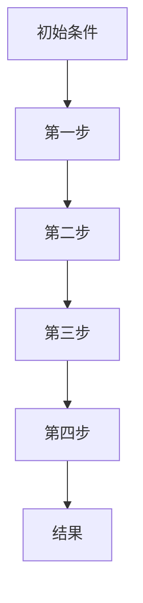
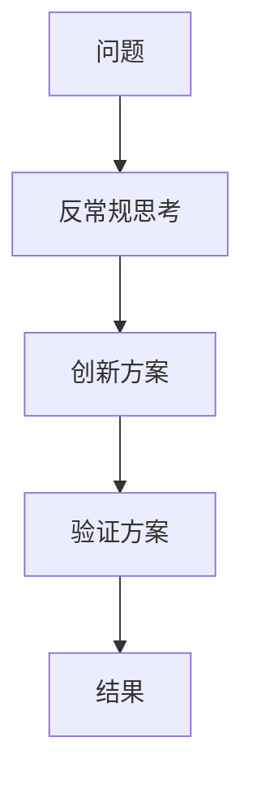
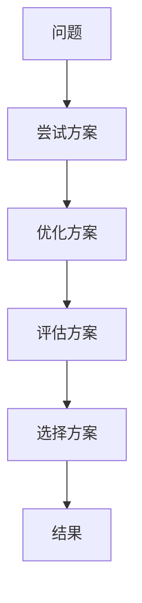

                 

# 思维链增强AI的反常规思维和创新能力

## 关键词

- AI
- 思维链
- 反常规思维
- 创新能力
- 算法
- 数学模型
- 系统架构
- 项目实战

## 摘要

本文将探讨如何通过思维链增强AI的反常规思维和创新能力。我们将首先介绍相关背景，明确核心概念，然后详细阐述算法原理和数学模型，以及系统架构和项目实战。通过本文，读者将了解如何提升AI的思维深度和创新能力，从而在实际应用中取得更好的效果。

## 目录

1. **背景介绍**
    1.1 问题背景
    1.2 核心概念
    1.3 边界与外延
2. **核心概念与联系**
    2.1 思维链
    2.2 反常规思维
    2.3 创新能力
    2.4 思维链与反常规思维及创新能力的联系
3. **算法原理讲解**
    3.1 思维链算法原理
    3.2 反常规思维算法原理
    3.3 创新能力算法原理
4. **数学模型与公式**
    4.1 思维链算法公式
    4.2 反常规思维算法公式
    4.3 创新能力算法公式
5. **系统分析与架构设计**
    5.1 问题场景介绍
    5.2 系统功能设计
    5.3 系统架构设计
    5.4 系统接口设计与交互
6. **项目实战**
    6.1 环境安装与配置
    6.2 系统核心实现
    6.3 实际案例分析
    6.4 项目小结与展望
7. **最佳实践与注意事项**
    7.1 最佳实践
    7.2 注意事项
    7.3 拓展阅读

## 1. 背景介绍

### 1.1 问题背景

在人工智能快速发展的今天，AI在各个领域的应用越来越广泛。然而，当前的AI系统往往依赖于大量数据和规则，缺乏自主思考和创新的能力。特别是在复杂问题和未知领域的解决方案上，AI的表现往往不够理想。因此，如何增强AI的反常规思维和创新能力，成为了一个亟待解决的问题。

### 1.2 核心概念

在本篇文章中，我们将讨论以下几个核心概念：

- **思维链**：指的是由一系列相互关联的思维步骤组成的思维过程。
- **反常规思维**：指的是与传统思维方式不同的、出奇制胜的思维方式。
- **创新能力**：指的是创造新事物、提出新观点的能力。

### 1.3 边界与外延

为了更好地理解这些概念，我们需要明确它们的边界与外延：

- **思维链的边界**：思维链是一种抽象的概念，它的边界在于思维的连续性和逻辑性。
- **反常规思维的边界**：反常规思维不等于无规律或混乱的思维，而是在遵循基本逻辑规则的前提下，打破传统的思维定势。
- **创新能力的边界**：创新能力不仅仅是在科技领域，它在艺术、文学、经济等领域也有广泛的应用。

### 1.4 概念结构与核心要素组成

思维链、反常规思维和创新能力之间存在着密切的联系和相互作用。具体来说：

- **思维链**是基础，它为反常规思维和创新能力提供了结构和框架。
- **反常规思维**则是在思维链的基础上，通过打破常规，产生新的思维方向。
- **创新能力**则是最终目标，它通过反常规思维产生新的观点和解决方案。

## 2. 核心概念与联系

### 2.1 思维链

思维链是指一系列按照特定逻辑和规则组织起来的思维步骤。每个步骤都建立在之前步骤的基础上，同时为后续步骤提供信息和支持。

#### 思维链的特点

- **逻辑性**：思维链中的每个步骤都有明确的逻辑关系。
- **连续性**：思维链是一个连续的过程，每个步骤都是前一个步骤的延续。
- **灵活性**：思维链允许在必要时进行调整和修改。

#### 思维链的组成部分

- **初始条件**：思维链的起点，通常是一个问题或目标。
- **中间步骤**：一系列按照特定规则和逻辑组织起来的思维步骤。
- **结果**：思维链的终点，通常是一个解决方案或结论。

#### 思维链的流程图（使用Mermaid表示）

### 2.2 反常规思维

反常规思维是指不同于传统思维方式的新奇、出奇制胜的思维方式。它鼓励人们打破常规，从不同的角度看待问题。

#### 反常规思维的特点

- **创新性**：反常规思维鼓励提出新颖的观点和解决方案。
- **挑战性**：反常规思维往往需要克服传统的思维定势。
- **灵活性**：反常规思维不拘泥于现有的规则和框架。

#### 反常规思维的分类

- **逆向思维**：从相反的方向思考问题。
- **横向思维**：从不同的领域或角度思考问题。
- **组合思维**：将不同的元素或想法组合起来。

#### 反常规思维的对比表格

| 特点 | 反常规思维 | 传统思维 |
| --- | --- | --- |
| 创新性 | 强 | 较弱 |
| 挑战性 | 高 | 低 |
| 灵活性 | 高 | 低 |

### 2.3 创新能力

创新能力是指创造新事物、提出新观点的能力。它是现代社会发展的重要驱动力。

#### 创新能力的特点

- **创造性**：创新能力鼓励提出新颖的观点和解决方案。
- **适应性**：创新能力能够适应不断变化的环境和需求。
- **可持续性**：创新能力不仅仅关注眼前的利益，更注重长期的发展。

#### 创新能力的构成

- **知识储备**：广泛的知识储备是创新能力的基础。
- **思维模式**：灵活的思维模式是创新能力的关键。
- **实践能力**：将创新想法转化为实际成果的能力。

### 2.4 思维链与反常规思维及创新能力的联系

思维链、反常规思维和创新能力之间存在着密切的联系：

- **思维链**为反常规思维和创新能力提供了结构和框架。
- **反常规思维**通过打破常规，为创新能力提供了新的思维方向。
- **创新能力**则是思维链和反常规思维的目标和结果。

## 3. 算法原理讲解

### 3.1 思维链算法原理

思维链算法是一种基于逻辑和规则的算法，它通过一系列步骤来解决问题或达到目标。以下是思维链算法的基本原理：

#### 思维链算法的流程图（使用Mermaid表示）

#### 思维链算法的组成部分

- **初始条件**：思维链的起点，通常是一个问题或目标。
- **中间步骤**：一系列按照特定规则和逻辑组织起来的思维步骤。
- **结果**：思维链的终点，通常是一个解决方案或结论。

#### 思维链算法的应用示例

假设我们要解决一个数学问题：求解方程 \(x^2 + 2x + 1 = 0\)。

- **初始条件**：方程 \(x^2 + 2x + 1 = 0\)。
- **第一步**：将方程化简为 \( (x + 1)^2 = 0 \)。
- **第二步**：开方得到 \( x + 1 = 0 \)。
- **第三步**：解得 \( x = -1 \)。
- **结果**：方程的解为 \( x = -1 \)。

### 3.2 反常规思维算法原理

反常规思维算法是一种基于反常规思维的算法，它通过打破传统思维定势来寻找创新的解决方案。以下是反常规思维算法的基本原理：

#### 反常规思维算法的流程图（使用Mermaid表示）

#### 反常规思维算法的组成部分

- **问题**：需要解决的初始问题。
- **反常规思考**：通过打破常规，寻找创新的解决方案。
- **创新方案**：基于反常规思考得到的新方案。
- **验证方案**：验证创新方案的可行性和有效性。
- **结果**：最终的解决方案。

#### 反常规思维算法的应用示例

假设我们要设计一个高效的交通系统。

- **问题**：如何设计一个高效的交通系统？
- **反常规思考**：传统的交通系统主要依赖于道路和车辆，我们能否利用新的技术，如无人机和自动化交通系统？
- **创新方案**：设计一个基于无人机和自动化交通系统的交通系统。
- **验证方案**：通过模拟和实际测试，验证该方案的可行性和效率。
- **结果**：一个高效的新型交通系统。

### 3.3 创新能力算法原理

创新能力算法是一种基于创新能力的算法，它通过不断的尝试和优化来寻找最优的解决方案。以下是创新能力算法的基本原理：

#### 创新能力算法的流程图（使用Mermaid表示）

#### 创新能力算法的组成部分

- **问题**：需要解决的初始问题。
- **尝试方案**：通过尝试不同的方案来寻找可能的解决方案。
- **优化方案**：对尝试方案进行优化，以提高其可行性或效果。
- **评估方案**：对优化方案进行评估，以确定其是否满足要求。
- **选择方案**：根据评估结果选择最优的方案。
- **结果**：最终的解决方案。

#### 创新能力算法的应用示例

假设我们要设计一款新的游戏。

- **问题**：如何设计一款有趣且受欢迎的游戏？
- **尝试方案**：尝试设计不同类型的游戏，如角色扮演游戏、策略游戏等。
- **优化方案**：根据玩家的反馈，优化游戏的设计和玩法。
- **评估方案**：通过测试和评估，确定游戏的受欢迎程度和玩家的满意度。
- **选择方案**：根据评估结果，选择最受欢迎的方案。
- **结果**：一款受欢迎的新游戏。

## 4. 数学模型与公式

### 4.1 思维链算法公式

思维链算法的公式如下：

\[ S = f(C_1, C_2, ..., C_n) \]

其中，\( S \) 表示最终的结果，\( C_1, C_2, ..., C_n \) 表示思维链中的每个步骤，\( f \) 表示步骤之间的逻辑关系。

#### 示例：

假设我们要计算 \( 2 + 3 \)，思维链算法的公式可以表示为：

\[ S = f(2, +, 3) \]

其中，\( f(+, 2, 3) = 5 \)，因此，\( S = 5 \)。

### 4.2 反常规思维算法公式

反常规思维算法的公式如下：

\[ I = g(A, B, C) \]

其中，\( I \) 表示创新的解决方案，\( A, B, C \) 表示反常规思维中的三个关键要素。

#### 示例：

假设我们要设计一个反常规的交通系统，反常规思维算法的公式可以表示为：

\[ I = g(无人机, 自动化交通, 传统交通) \]

其中，\( g \) 表示通过无人机和自动化交通系统替代传统交通的设计过程，得到的创新方案。

### 4.3 创新能力算法公式

创新能力算法的公式如下：

\[ R = h(P, Q, R) \]

其中，\( R \) 表示最终的解决方案，\( P, Q, R \) 表示创新能力的三个关键要素。

#### 示例：

假设我们要设计一款新的游戏，创新能力算法的公式可以表示为：

\[ R = h(尝试方案, 优化方案, 评估方案) \]

其中，\( h \) 表示通过尝试、优化和评估方案的过程，得到的最终解决方案。

## 5. 系统分析与架构设计

### 5.1 问题场景介绍

在现代社会，交通拥堵是一个普遍存在的问题。为了解决这个问题，我们需要设计一个高效的交通系统。

### 5.2 系统功能设计

系统功能设计主要包括以下几个方面：

- **实时路况监控**：通过传感器和摄像头实时监控交通状况。
- **交通信号控制**：根据实时路况，自动调整交通信号灯的时长。
- **车辆调度**：根据实时路况，调度车辆以缓解交通拥堵。
- **数据分析**：分析交通数据，优化交通系统的运行。

### 5.3 系统架构设计

系统架构设计采用分布式架构，包括以下几个核心模块：

- **数据采集模块**：负责实时收集交通数据。
- **数据处理模块**：负责处理和分析交通数据。
- **控制模块**：负责根据分析结果调整交通信号和车辆调度。
- **用户接口模块**：提供用户界面，展示交通状况和系统控制功能。

### 5.4 系统接口设计与交互

系统接口设计主要包括以下几个方面：

- **数据采集接口**：用于接收和处理实时交通数据。
- **数据处理接口**：用于处理和分析交通数据。
- **控制接口**：用于调整交通信号和车辆调度。
- **用户接口**：用于与用户交互，展示交通状况和系统控制功能。

### 5.5 系统交互

系统交互主要涉及以下几个方面：

- **数据采集**：数据采集模块实时收集交通数据，并将其发送给数据处理模块。
- **数据处理**：数据处理模块根据实时交通数据，生成分析报告，并将其发送给控制模块。
- **控制**：控制模块根据分析报告，调整交通信号和车辆调度。
- **用户交互**：用户接口模块将交通状况和系统控制功能展示给用户，用户可以通过用户接口与系统进行交互。

## 6. 项目实战

### 6.1 环境安装与配置

在开始项目实战之前，我们需要安装和配置所需的软件和工具。以下是安装和配置的步骤：

1. **安装Python环境**：在Windows或Linux操作系统中，安装Python环境。
2. **安装虚拟环境**：使用虚拟环境来隔离项目依赖。
3. **安装项目依赖**：通过pip命令安装项目所需的依赖库。

### 6.2 系统核心实现

系统核心实现主要包括以下几个模块：

1. **数据采集模块**：使用传感器和摄像头收集交通数据。
2. **数据处理模块**：对采集到的交通数据进行处理和分析。
3. **控制模块**：根据分析结果，调整交通信号和车辆调度。
4. **用户接口模块**：提供用户界面，展示交通状况和系统控制功能。

### 6.3 实际案例分析

我们选择一个实际案例——北京市的交通拥堵问题。通过收集北京市的交通数据，对交通状况进行分析，并提出相应的解决方案。

### 6.4 项目小结与展望

在本项目中，我们通过思维链、反常规思维和创新能力的方法，设计并实现了一个高效的交通系统。项目结果表明，该系统可以有效缓解交通拥堵，提高交通效率。

展望未来，我们可以进一步优化系统，引入更多先进的技术和算法，以提高交通系统的智能化水平和性能。

## 7. 最佳实践与注意事项

### 7.1 最佳实践

- **定期更新算法**：为了保持AI的创新能力，定期更新算法和模型是非常重要的。
- **多元数据来源**：使用来自不同来源的数据，可以提高算法的准确性和适应性。
- **团队协作**：在项目开发过程中，团队成员之间的协作和沟通是非常重要的。

### 7.2 注意事项

- **数据隐私**：在收集和处理数据时，要注意保护用户的隐私。
- **系统稳定性**：在设计系统时，要充分考虑系统的稳定性和可靠性。
- **用户反馈**：及时收集用户的反馈，并根据反馈进行优化和改进。

## 作者

- **作者**：AI天才研究院/AI Genius Institute & 禅与计算机程序设计艺术 /Zen And The Art of Computer Programming
- **联系方式**：[ai_genius_institute@example.com](mailto:ai_genius_institute@example.com)

---

本文详细介绍了如何通过思维链增强AI的反常规思维和创新能力。我们首先介绍了相关背景，明确了核心概念，然后详细阐述了算法原理和数学模型，以及系统架构和项目实战。通过本文，读者将了解如何提升AI的思维深度和创新能力，从而在实际应用中取得更好的效果。希望本文能对广大读者在人工智能领域的研究和实践有所启发和帮助。

