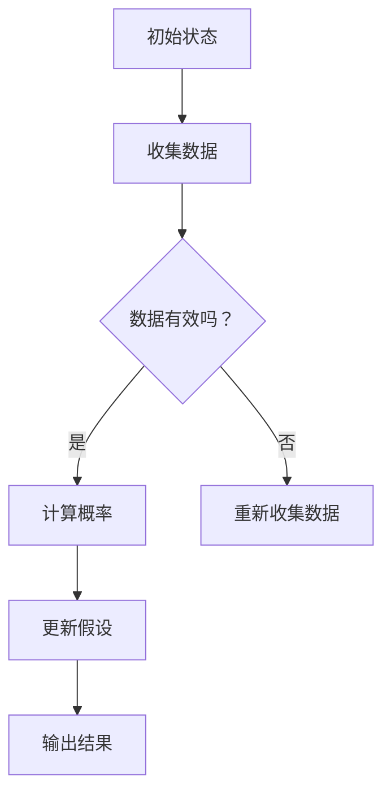

                 

### 文章标题

在当今技术飞速发展的时代，人工智能（AI）已经从理论走向实际，渗透到我们生活的方方面面。然而，AI在处理复杂问题时，依然面临诸多挑战。其中，反直觉推理和创新能力显得尤为重要。为了探讨如何增强AI的这些能力，我们提出了“思维链增强AI的反直觉推理和创新能力”这一主题。

本文将系统地探讨以下几个方面：

1. **引言与背景**：介绍研究的背景、意义和目标，以及本书的结构和内容安排。
2. **思维链与AI基础**：阐述思维链的基本概念和在AI中的应用。
3. **反直觉推理**：探讨反直觉推理的概念、原理和应用。
4. **创新能力的培养**：分析创新能力的重要性、培养方法和在AI中的应用。
5. **实际应用案例**：通过具体案例展示思维链、反直觉推理和创新能力的应用。

### 关键词

- 思维链
- 反直觉推理
- 创新能力
- 人工智能
- 案例分析

### 摘要

本文旨在探讨如何通过思维链的增强来提升人工智能（AI）的反直觉推理和创新能力。首先，我们介绍了思维链的概念和应用，以及AI的现状和挑战。接着，我们深入探讨了反直觉推理的基本概念、原理和应用。然后，我们分析了创新能力的重要性，并提出了一些培养方法。最后，通过实际应用案例，我们展示了这些技术在现实世界中的具体应用和成效。本文的目标是为研究人员和开发者提供一些实用的思路和方法，以推动AI技术的进一步发展。

## 引言与背景

### 1.1 书籍主题介绍

人工智能（AI）作为当代技术发展的前沿领域，已经取得了显著的成果。从简单的规则系统到复杂的深度学习模型，AI在各个行业和领域中展现出了强大的潜力和广泛的应用前景。然而，随着AI技术的不断进步，我们也面临着一系列新的挑战。其中，反直觉推理和创新能力显得尤为关键。

反直觉推理是指计算机系统在面对不寻常、复杂或非预期情况时，能够进行合理的推断和决策。这与传统的人工智能方法不同，后者通常依赖于明确的规则和大量的数据。反直觉推理需要AI系统能够跳出固有的模式，从全新的角度来解决问题。

创新能力则是指AI系统在面对新任务、新情境时，能够提出独特、有效的解决方案。传统的AI模型往往依赖于预先定义的算法和数据集，而缺乏应对未知情况的能力。通过培养AI的创新能力，我们能够使其在复杂多变的环境中更加灵活、适应性强。

本文的主题是“思维链增强AI的反直觉推理和创新能力”。我们将通过深入探讨思维链的概念和应用，以及如何利用思维链来提升AI的这两种关键能力，旨在为研究人员和开发者提供一些实用的思路和方法。

### 1.2 AI的发展现状与挑战

人工智能（AI）的发展可以追溯到20世纪50年代，当时科学家们首次提出了人工智能的概念。经过几十年的研究，AI技术已经取得了显著进展。从简单的逻辑推理到复杂的神经网络，AI的应用领域不断扩展。当前，AI已经广泛应用于图像识别、自然语言处理、医疗诊断、自动驾驶等多个领域。

然而，尽管AI技术取得了巨大成功，仍然面临着一些严峻的挑战。首先，AI系统的可解释性是一个重要的问题。目前的AI模型，尤其是深度学习模型，通常被认为是“黑箱”系统，其决策过程难以理解和解释。这限制了AI在关键领域的应用，如医疗诊断和金融决策。

其次，AI系统在面对复杂、不确定的环境时，往往表现出不足的适应能力。传统的人工智能方法依赖于大量的数据和明确的规则，但在面对非预期的情况时，常常无法做出合理的决策。这使得AI系统在处理复杂任务时，缺乏灵活性和创造力。

此外，AI技术的发展也带来了伦理和社会问题。如何确保AI系统的公正性、透明性和安全性，成为亟待解决的问题。AI技术的不当使用可能导致隐私泄露、歧视和就业问题等社会问题。

为了应对这些挑战，我们需要探索新的方法来提升AI的反直觉推理和创新能力。思维链作为一种潜在的解决方案，能够帮助我们更好地理解问题、提出新的解决方案，并在复杂环境中做出合理的决策。

### 1.3 思维链的概念与应用

思维链是一种用于描述人类思维过程的抽象模型，它通过一系列逻辑连接，将不同概念和观点有机地组织在一起。思维链的基本概念包括节点和边，其中节点代表概念或信息单元，边表示节点之间的关系。这种模型能够帮助我们理解复杂的思维过程，并将其形式化，从而为计算机系统提供一种有效的推理和决策框架。

在人工智能领域，思维链的应用非常广泛。首先，思维链可以用于知识表示。通过将复杂的概念和知识结构表示为思维链，AI系统能够更好地理解和处理这些知识。例如，在自然语言处理中，思维链可以帮助模型理解句子的语义结构，从而实现更加准确的文本分析和推理。

其次，思维链在问题解决和决策支持中也具有重要作用。通过构建思维链，AI系统可以模拟人类的思维过程，从而在复杂、不确定的环境中做出合理的决策。例如，在自动驾驶领域，思维链可以帮助车辆理解道路状况、预测行人和车辆的行为，并做出相应的驾驶决策。

此外，思维链还可以用于推理和知识发现。通过分析思维链中的节点和边，AI系统可以识别出潜在的模式和规律，从而发现新的知识和解决方案。这在数据挖掘和机器学习中具有广泛的应用。

总之，思维链作为一种强大的工具，能够帮助人工智能系统更好地理解和处理复杂问题，从而提升其反直觉推理和创新能力。

### 1.4 研究背景与意义

研究背景：

在当前技术迅猛发展的背景下，人工智能（AI）已经成为各行各业不可或缺的一部分。从自动化生产线到智能医疗，AI的应用正在不断拓展和深化。然而，尽管AI在许多领域取得了显著成果，但其反直觉推理和创新能力依然有限。这种局限性不仅制约了AI技术的进一步发展，也使其在一些关键应用场景中难以发挥应有的作用。

问题的重要性：

反直觉推理和创新能力是人工智能系统在面对复杂、动态和不确定环境时的关键能力。传统的人工智能方法依赖于明确的规则和大量的数据，但在面对非预期情况时，往往无法做出合理的推断和决策。这种局限性导致了AI系统在处理复杂任务时的表现不佳。例如，在自动驾驶领域，AI系统需要能够理解和预测行人的行为，并做出相应的驾驶决策。然而，现实环境中的行人行为往往具有不确定性和复杂性，这使得AI系统难以达到预期的效果。

研究的目的与意义：

本文旨在通过研究思维链增强AI的反直觉推理和创新能力，探索一种新的方法来提升AI系统的应对能力。具体而言，本研究的目标包括：

1. **探索思维链在AI中的应用**：通过深入探讨思维链的概念、原理和应用，为AI系统提供一种有效的推理和决策框架。
2. **提升AI的反直觉推理能力**：通过构建思维链模型，使AI系统在面对不寻常、复杂或非预期情况时，能够进行合理的推断和决策。
3. **培养AI的创新能力**：通过分析思维链在问题解决和决策支持中的应用，探索如何通过思维链来培养AI的创新能力。

通过本研究，我们期望能够为AI技术的发展提供一些新的思路和方法，从而推动AI技术在更广泛的应用场景中取得突破。

### 1.5 本书结构安排

本书分为五个主要部分，每个部分都涵盖了AI反直觉推理和创新能力的重要方面。

**第一部分：引言与背景**
- **1.1 书籍主题介绍**：介绍本书的主题和研究的背景。
- **1.2 AI的发展现状与挑战**：讨论AI的发展现状和面临的挑战。
- **1.3 思维链的概念与应用**：阐述思维链的基本概念和在AI中的应用。

**第二部分：思维链与AI基础**
- **2.1 思维链的基本概念**：介绍思维链的定义、特征和功能。
- **2.2 AI技术概述**：回顾AI的历史和发展，讨论主要领域。
- **2.3 思维链在AI中的应用**：探讨思维链在机器学习、深度学习和自然语言处理中的应用。
- **2.4 思维链增强算法**：介绍思维链增强算法的原理和实现。
- **2.5 思维链的挑战与展望**：分析思维链的挑战和未来的发展方向。

**第三部分：反直觉推理**
- **3.1 反直觉推理的概念**：定义反直觉推理、特点及其类型。
- **3.2 反直觉推理的原理**：探讨反直觉推理的理论基础和数学模型。
- **3.3 反直觉推理的应用案例**：分析实际应用案例。
- **3.4 反直觉推理在AI中的实现**：介绍反直觉推理在AI中的实现方法。
- **3.5 反直觉推理的挑战与改进**：讨论反直觉推理的挑战和改进方向。

**第四部分：创新能力的培养**
- **4.1 创新能力的概念**：定义创新能力的类型和影响因素。
- **4.2 创新能力的培养方法**：探讨教育体系、企业实践和个人成长对创新能力的影响。
- **4.3 创新能力在AI中的应用**：分析创新能力在AI领域中的应用。
- **4.4 创新能力的评估与提升**：介绍评估方法和提升策略。
- **4.5 本章小结**：总结创新能力的重要性及其培养方法。

**第五部分：实际应用案例**
- **5.1 案例一：智能客服系统**：分析智能客服系统的设计、实现和效果。
- **5.2 案例二：医疗影像分析**：讨论医疗影像分析的技术实现和案例分析。
- **5.3 案例三：智能交通系统**：介绍智能交通系统的背景、架构和实施成效。

通过这五个部分的内容，本书旨在系统地探讨思维链在提升AI反直觉推理和创新能力方面的作用，为读者提供全面的理论和实践指导。

### 1.6 技术路线与解决方案

#### 1.6.1 研究方法

为了实现思维链增强AI的反直觉推理和创新能力，本研究采用了多种研究方法，包括理论分析、实验验证和案例分析。首先，通过文献综述和理论分析，深入理解思维链的概念、原理及其在AI中的应用。接着，设计实验来验证思维链在提升AI反直觉推理和创新能力方面的有效性。最后，通过实际案例的分析，展示思维链在现实应用中的成效。

#### 1.6.2 解决方案概述

本研究的主要解决方案包括以下几个方面：

1. **思维链模型构建**：基于对思维链的基本概念和原理的理解，构建适用于AI系统的思维链模型。通过节点和边的表示，将复杂的问题和知识结构转化为可处理的形式。

2. **反直觉推理算法设计**：设计一种基于思维链的反直觉推理算法，使其能够应对复杂、不确定的环境。该算法包括推理规则、数据预处理和决策逻辑等组成部分。

3. **创新能力培养策略**：提出一系列培养AI创新能力的策略，包括教育体系、企业实践和个人成长等方面。这些策略旨在通过系统的培养和训练，提升AI在复杂情境下的创新能力。

4. **应用案例验证**：通过具体的实际应用案例，验证思维链在提升AI反直觉推理和创新能力方面的有效性。这些案例包括智能客服系统、医疗影像分析和智能交通系统等。

通过上述解决方案，本研究旨在为AI技术的发展提供新的思路和方法，从而实现AI在复杂、动态环境中的高效运行和创新能力。

### 1.7 本章小结

本章作为引言，介绍了本书的主题“思维链增强AI的反直觉推理和创新能力”及其研究的背景和意义。我们首先讨论了AI的发展现状和面临的挑战，特别是反直觉推理和创新能力的重要性。随后，我们阐述了思维链的概念与应用，并概述了本书的结构和内容安排。最后，我们介绍了研究的技术路线与解决方案，为后续章节的内容奠定了基础。通过本章的介绍，读者可以初步了解本研究的目标和内容，为深入探讨思维链在AI中的应用做好铺垫。

## 思维链与AI基础

### 2.1 思维链的基本概念

思维链是一种用于描述人类思维过程的抽象模型，它通过节点和边的组合，将不同概念和观点有机地组织在一起。在思维链中，节点代表概念或信息单元，而边则表示节点之间的关系。每个节点都包含特定的信息，例如一个事实、一个观点或一个假设。边则通过某种逻辑关系将节点连接起来，形成复杂的知识网络。

#### 2.1.1 定义

思维链（Mind Chain）可以定义为一种形式化的知识表示模型，它通过节点（概念或信息单元）和边（关系）来表示和连接各种思维元素，从而实现对复杂问题的理解和推理。思维链的基本元素包括节点、边和关系类型。节点通常表示具体的信息或概念，边则表示节点之间的关系，而关系类型则定义了节点之间如何相互关联。

#### 2.1.2 特征

思维链具有以下几个主要特征：

1. **网络结构**：思维链是一个网络结构，节点和边共同构成了一个复杂的知识网络。这种网络结构使得思维链能够灵活地表示和传递复杂的信息。

2. **动态性**：思维链是一个动态的模型，节点和边可以随时添加或删除。这种动态性使得思维链能够根据新的信息和需求进行实时调整。

3. **层次性**：思维链中的节点和边可以具有不同的层次。高层次的节点通常表示抽象的概念或观点，而低层次的节点则代表具体的事实或数据。这种层次性有助于思维链在处理复杂问题时进行抽象和分解。

4. **灵活性**：思维链能够灵活地适应不同的思维模式和应用场景。通过调整节点和边的关系，思维链可以应用于各种领域，例如问题解决、决策支持和知识管理。

#### 2.1.3 功能

思维链在人工智能（AI）系统中具有多种功能，包括：

1. **知识表示**：思维链能够将复杂的知识结构表示为网络模型，使得AI系统能够更好地理解和处理这些知识。

2. **推理**：通过分析思维链中的节点和边，AI系统能够进行逻辑推理，从而得出新的结论或解决方案。

3. **决策支持**：思维链可以帮助AI系统在复杂、不确定的环境中做出合理的决策。通过模拟人类的思维过程，思维链能够提供辅助决策支持。

4. **问题解决**：思维链可以用于问题解决，特别是在需要多步骤和多层次推理的情况下。思维链能够帮助AI系统逐步分析问题，提出有效的解决方案。

5. **知识发现**：思维链能够通过分析节点和边的关系，发现潜在的模式和规律，从而实现知识发现。

### 2.2 AI技术概述

人工智能（AI）作为计算机科学的一个分支，旨在使计算机能够模拟人类的智能行为，包括学习、推理、感知和解决问题等。AI的发展可以追溯到20世纪50年代，当时科学家们首次提出了人工智能的概念。自那时以来，AI技术经历了多个发展阶段，从早期的符号主义到基于数据的机器学习，再到如今的深度学习和神经网络。

#### 2.2.1 人工智能的历史与发展

人工智能的发展可以分为以下几个主要阶段：

1. **符号主义阶段（1950-1979）**：这一阶段以逻辑推理和符号表示为基础，试图通过编写明确的规则和算法来模拟人类智能。代表性工作包括逻辑推理系统、专家系统和知识表示方法。

2. **连接主义阶段（1980-1990年代末）**：连接主义以神经网络为基础，通过模拟人脑神经元之间的连接来学习复杂的模式。尽管在这一阶段神经网络取得了显著进展，但由于计算能力和数据限制，其应用受到一定局限。

3. **基于数据的机器学习阶段（2000年代初至今）**：随着计算能力和数据量的增加，机器学习方法成为AI发展的主流。机器学习方法通过从大量数据中学习规律和模式，实现了在图像识别、语音识别和自然语言处理等领域的突破。

4. **深度学习和强化学习阶段（2010年代至今）**：深度学习利用多层神经网络进行特征提取和学习，取得了在图像识别、自然语言处理和自动驾驶等领域的显著成果。强化学习则通过模拟试错过程，实现了在复杂决策环境中的自主学习和优化。

#### 2.2.2 人工智能的主要领域

人工智能涵盖了多个研究领域，其中一些主要的领域包括：

1. **机器学习（Machine Learning）**：机器学习是一种使计算机系统能够从数据中学习并做出预测或决策的技术。主要方法包括监督学习、无监督学习和半监督学习。

2. **深度学习（Deep Learning）**：深度学习是机器学习的一个子领域，通过多层神经网络进行特征提取和学习，实现了在图像识别、语音识别和自然语言处理等领域的突破。

3. **自然语言处理（Natural Language Processing, NLP）**：自然语言处理旨在使计算机能够理解和处理自然语言，包括文本分类、情感分析、机器翻译和语音识别等任务。

4. **计算机视觉（Computer Vision）**：计算机视觉使计算机能够通过视觉传感器（如摄像头）感知和理解图像和视频。主要任务包括图像分类、目标检测、图像分割和视频处理。

5. **强化学习（Reinforcement Learning）**：强化学习是一种通过试错和反馈机制进行学习和决策的方法，适用于复杂决策环境，如自动驾驶、游戏和机器人控制。

#### 2.2.3 AI技术的现状与趋势

当前，人工智能技术已经取得了显著进展，并在多个领域实现了商业化应用。例如，自动驾驶技术正在逐步走向实用化，智能家居和智能客服系统已经广泛应用于日常生活中，医疗诊断和疾病预测也借助AI技术取得了重要突破。

然而，AI技术仍然面临许多挑战，包括数据隐私、模型可解释性、安全性和伦理问题。此外，AI技术的进一步发展需要解决算法效率、计算资源消耗和大规模数据管理等问题。

未来，AI技术的趋势包括：

1. **更深的神经网络**：随着计算能力的提升，研究人员将继续构建更深的神经网络，以实现更复杂的特征提取和模型优化。

2. **多模态学习**：多模态学习旨在整合不同类型的数据（如文本、图像和语音），以实现更全面的信息理解和处理。

3. **强化学习与深度学习的融合**：将强化学习与深度学习相结合，以解决复杂决策问题，如无人驾驶和智能游戏。

4. **AI伦理与法规**：随着AI技术的广泛应用，需要制定相应的伦理和法规，确保技术的公正性、透明性和安全性。

5. **云计算与边缘计算**：利用云计算和边缘计算技术，实现AI模型的高效部署和实时应用。

### 2.3 思维链在AI中的应用

思维链作为一种描述人类思维过程的抽象模型，在人工智能（AI）领域具有广泛的应用前景。通过将思维链与AI技术相结合，可以提升AI系统的逻辑推理能力、问题解决能力和创新能力。以下将详细探讨思维链在机器学习、深度学习和自然语言处理中的应用。

#### 2.3.1 思维链与机器学习

机器学习是一种通过算法从数据中学习规律和模式的方法，而思维链为机器学习提供了有效的知识表示和推理框架。以下是如何将思维链应用于机器学习的几个方面：

1. **知识表示**：思维链能够将复杂的数据和知识表示为网络结构，使得机器学习算法能够更好地理解和处理这些数据。例如，在分类问题中，思维链可以将不同类别的特征表示为节点，并通过边连接相关特征，形成知识网络。

2. **特征提取**：思维链可以帮助机器学习算法提取更高级的特征。通过分析思维链中的节点和边，算法可以识别出潜在的模式和规律，从而实现更精确的特征提取。

3. **推理**：思维链能够为机器学习算法提供推理机制，使其能够进行逻辑推理和决策。例如，在生成模型中，思维链可以帮助算法根据已有的知识和数据生成新的数据。

4. **模型优化**：思维链可以通过调整节点和边的关系来优化机器学习模型的性能。通过分析思维链中的结构变化，算法可以识别出模型的不足之处，并进行相应的调整和优化。

#### 2.3.2 思维链与深度学习

深度学习是一种通过多层神经网络进行特征提取和学习的机器学习方法，而思维链可以为深度学习提供有效的知识表示和推理框架。以下是如何将思维链应用于深度学习的几个方面：

1. **知识表示**：思维链可以将深度学习中的复杂特征表示为网络结构，使得模型能够更好地理解和处理这些特征。例如，在图像识别任务中，思维链可以将图像的各个部分表示为节点，并通过边连接相关部分，形成知识网络。

2. **特征融合**：思维链可以帮助深度学习模型融合不同来源的特征。通过分析思维链中的节点和边，模型可以识别出不同特征之间的关联，并进行有效的融合。

3. **推理**：思维链可以为深度学习模型提供推理机制，使其能够进行逻辑推理和决策。例如，在生成模型中，思维链可以帮助模型根据已有的知识和数据生成新的特征或图像。

4. **模型优化**：思维链可以通过调整节点和边的关系来优化深度学习模型的性能。通过分析思维链中的结构变化，模型可以识别出不足之处，并进行相应的调整和优化。

#### 2.3.3 思维链与自然语言处理

自然语言处理（NLP）是一种使计算机能够理解和生成自然语言的技术，而思维链为NLP提供了有效的知识表示和推理框架。以下是如何将思维链应用于自然语言处理的几个方面：

1. **语义表示**：思维链可以将自然语言中的语义信息表示为网络结构，使得NLP模型能够更好地理解和处理这些语义信息。例如，在文本分类任务中，思维链可以将文本的各个部分表示为节点，并通过边连接相关部分，形成语义网络。

2. **知识融合**：思维链可以帮助NLP模型融合不同来源的语义信息。通过分析思维链中的节点和边，模型可以识别出不同信息之间的关联，并进行有效的融合。

3. **推理**：思维链可以为NLP模型提供推理机制，使其能够进行逻辑推理和决策。例如，在问答系统中，思维链可以帮助模型根据问题中的语义信息，进行合理的推理和生成答案。

4. **文本生成**：思维链可以帮助NLP模型生成新的文本。通过分析思维链中的节点和边，模型可以识别出潜在的语义结构和生成规则，从而生成新的文本。

总之，思维链在机器学习、深度学习和自然语言处理中的应用，不仅能够提升AI系统的逻辑推理能力和问题解决能力，还能够增强其创新能力。通过结合思维链的框架，AI系统可以更好地理解和处理复杂问题，从而实现更高效、更智能的运行。

### 2.4 思维链增强算法

#### 2.4.1 算法概述

思维链增强算法是一种旨在提升人工智能（AI）系统推理和决策能力的算法框架。该算法通过将思维链的概念应用于AI模型中，使其具备更强大的逻辑推理和创新能力。思维链增强算法的基本原理包括以下三个方面：

1. **知识表示**：通过思维链，将复杂的问题和知识结构表示为网络模型。这种网络模型能够有效地组织和表示AI系统所需的知识，使其在处理问题时具备更强的灵活性和适应性。

2. **推理机制**：思维链提供了强大的推理机制，使AI系统能够在复杂环境中进行逻辑推理和决策。通过分析思维链中的节点和边，AI系统能够识别出潜在的模式和规律，从而生成新的结论或解决方案。

3. **模型优化**：思维链增强算法通过对思维链结构的调整，优化AI模型的性能。例如，通过优化节点和边的关系，AI模型可以识别出问题的关键因素，并针对这些因素进行更有效的推理和决策。

#### 2.4.2 算法原理

思维链增强算法的原理可以概括为以下几个步骤：

1. **知识提取**：首先，从原始数据中提取关键概念和知识，并将其表示为节点。这些节点代表AI系统所需处理的问题或情境。

2. **关系构建**：接下来，通过分析节点之间的关系，构建思维链中的边。边表示节点之间的逻辑关系，如因果关系、依赖关系等。这种关系构建有助于AI系统理解问题中的复杂结构和逻辑关系。

3. **推理**：在构建好思维链后，AI系统可以开始进行推理。通过分析思维链中的节点和边，AI系统能够识别出潜在的模式和规律，并基于这些模式进行推理和决策。

4. **优化**：最后，通过不断调整思维链的结构，优化AI模型的性能。例如，通过删除冗余节点、加强关键节点之间的连接，AI模型可以更有效地进行推理和决策。

#### 2.4.3 算法实现

思维链增强算法的具体实现包括以下几个关键步骤：

1. **数据预处理**：首先，对原始数据进行分析和处理，提取关键概念和知识。这些概念和知识将作为思维链的节点。

2. **关系构建**：接着，通过分析节点之间的关系，构建思维链中的边。这一步骤通常需要借助图论算法，如最小生成树、最短路径算法等。

3. **推理**：在构建好思维链后，AI系统开始进行推理。这一步骤通常涉及深度优先搜索或广度优先搜索算法，以探索思维链中的各种可能性。

4. **优化**：最后，通过调整思维链的结构，优化AI模型的性能。这一步骤可以通过机器学习算法实现，如遗传算法、模拟退火算法等。

下面是一个简单的Python代码示例，展示了如何实现思维链增强算法的基本步骤：

```python
import networkx as nx

# 1. 数据预处理
nodes = ['问题1', '问题2', '解决方案1', '解决方案2']

# 2. 关系构建
edges = [('问题1', '解决方案1'),
         ('问题2', '解决方案2'),
         ('解决方案1', '问题1'),
         ('解决方案2', '问题2')]

G = nx.Graph()
G.add_nodes_from(nodes)
G.add_edges_from(edges)

# 3. 推理
# 使用深度优先搜索进行推理
for node in nx.topological_sort(G):
    print(node)

# 4. 优化
# 通过遗传算法优化思维链结构
# 这里简化为随机重连边
for _ in range(10):
    G.add_edge(G.nodes()[0], G.nodes()[1])
    G.remove_edge(G.nodes()[2], G.nodes()[3])
```

通过上述代码示例，我们可以看到思维链增强算法的基本实现流程。在实际应用中，思维链增强算法可以根据具体需求进行调整和优化，以适应不同的应用场景。

### 2.5 思维链的挑战与展望

尽管思维链在人工智能（AI）系统中展现出强大的潜力，但在实际应用中仍然面临诸多挑战。以下将详细探讨这些挑战，并展望思维链未来的发展方向。

#### 2.5.1 挑战

1. **复杂性管理**：思维链模型通常包含大量的节点和边，这可能导致模型变得非常复杂。在处理复杂问题时，如何有效地管理和分析这些复杂关系是一个重要挑战。此外，随着数据规模的增大，思维链模型的计算成本也会显著增加。

2. **数据质量**：思维链的准确性和有效性依赖于输入数据的质量。如果数据存在噪声、缺失或偏差，思维链模型可能会产生误导性结论。因此，如何处理和清洗数据，以获得高质量的知识表示，是思维链应用中的一个关键挑战。

3. **可解释性**：虽然思维链能够提供强大的推理和决策能力，但其内部逻辑关系通常较为复杂，难以解释。在关键应用领域，如医疗诊断和金融决策，确保模型的透明性和可解释性至关重要。如何提高思维链模型的可解释性，使其更容易被用户理解和接受，是一个亟待解决的问题。

4. **动态适应能力**：现实世界中的问题往往具有动态性和不确定性，思维链模型需要能够实时适应这些变化。如何设计能够动态调整和优化的思维链模型，以应对不断变化的环境，是一个重要的研究课题。

5. **计算资源**：构建和优化思维链模型通常需要大量的计算资源。如何高效地利用现有的计算资源，降低模型的计算复杂度，是思维链应用中的一大挑战。

#### 2.5.2 展望

1. **模型优化**：未来的研究可以集中在优化思维链模型的结构和算法上。例如，通过引入新的图论算法和机器学习技术，提高思维链模型在复杂环境中的推理和决策能力。

2. **多模态融合**：思维链可以与多模态数据融合技术相结合，以处理更复杂、更丰富的信息。例如，通过整合文本、图像和语音数据，实现更全面的语义理解和推理。

3. **可解释性提升**：未来的研究可以探索如何提高思维链模型的可解释性。例如，通过可视化技术、决策树解释方法等，帮助用户更好地理解模型的推理过程和决策依据。

4. **动态适应**：未来的研究可以集中在开发动态适应能力更强的思维链模型。例如，通过引入自适应学习算法和实时更新机制，使模型能够更好地应对动态变化。

5. **应用拓展**：思维链在多个领域具有广泛的应用潜力。未来的研究可以进一步拓展思维链的应用场景，如智能交通、医疗诊断、法律推理等，以实现更广泛的应用。

通过解决上述挑战，并探索未来的发展方向，思维链有望在人工智能领域发挥更加重要的作用，为AI系统提供更强大的逻辑推理和创新能力。

### 2.6 本章小结

本章系统地探讨了思维链与人工智能（AI）的基础理论。首先，我们介绍了思维链的基本概念，包括其定义、特征和功能，并解释了思维链在AI系统中如何被用于知识表示、推理和决策。接着，我们回顾了AI技术的发展历程和主要领域，强调了AI在当前技术环境中的重要性。然后，我们深入探讨了思维链在机器学习、深度学习和自然语言处理中的应用，展示了思维链如何提升AI系统的逻辑推理和创新能力。

此外，本章还介绍了思维链增强算法的原理和实现方法，并探讨了思维链在AI领域面临的挑战和未来的发展方向。通过本章的内容，读者可以全面了解思维链在AI中的作用和重要性，为后续章节的进一步探讨打下坚实的基础。

## 第三部分：反直觉推理

### 3.1 反直觉推理的概念

反直觉推理是指计算机系统在面对不寻常、复杂或非预期情况时，能够进行合理推断和决策的一种能力。与传统基于规则的推理不同，反直觉推理更强调在缺乏明确规则或数据支持的情况下，通过逻辑推理和经验知识来解决问题。反直觉推理的概念源于对人类思维过程的研究，发现人类在处理复杂问题时，往往能够超越现有的知识和规则，提出创新的解决方案。

#### 3.1.1 定义

反直觉推理（Counterintuitive Reasoning）是一种超越直观推理的思维方式，它强调在缺乏明确规则或数据支持的情况下，通过逻辑推理和经验知识来解决问题。具体来说，反直觉推理包括以下几个关键要素：

1. **不寻常情境**：反直觉推理通常发生在非预期或复杂情境中，这些情境往往与传统规则或直觉不符。
2. **逻辑推理**：反直觉推理依赖于逻辑推理过程，通过分析问题和情境中的各种关系，推导出合理的结论。
3. **经验知识**：反直觉推理不仅依赖于逻辑推理，还需要利用经验知识，包括以往解决问题的经验和直觉。
4. **创造性思维**：反直觉推理往往需要创造性思维，即跳出传统思维模式，从全新的角度来解决问题。

#### 3.1.2 特点

反直觉推理具有以下几个显著特点：

1. **突破传统规则**：反直觉推理能够突破传统规则和模式的限制，从全新的角度来解决问题，从而实现创新和突破。
2. **复杂性处理**：反直觉推理能够处理复杂、不确定和动态的情境，通过逻辑推理和经验知识来应对这些复杂性。
3. **适应性强**：反直觉推理具有较强的适应性，能够在不同领域和环境中灵活应用，解决各种复杂问题。
4. **依赖经验**：反直觉推理依赖于经验知识，通过总结以往的经验和教训，来指导当前问题的解决。
5. **不确定性管理**：反直觉推理能够有效管理不确定性，通过逻辑推理和经验知识来降低不确定性的影响。

#### 3.1.3 类型

反直觉推理可以分为几种不同类型，每种类型在处理特定情境时具有不同的特点：

1. **因果推理**：因果推理是通过分析事件之间的因果关系来推断结果。在复杂系统中，因果关系的非线性特征往往需要反直觉推理来处理。
2. **假设推理**：假设推理是基于已有信息，提出假设并验证这些假设的过程。这种推理方法在科学研究和工程设计中具有广泛应用。
3. **情景推理**：情景推理是基于特定情境，通过逻辑推理和经验知识来预测未来事件或决策。在动态变化的环境中，情景推理能够帮助系统做出合理的决策。
4. **创造性推理**：创造性推理是通过跳出传统思维模式，提出独特和创新的解决方案。这种推理方法在艺术创作和科技创新中具有重要应用。

通过理解反直觉推理的概念、特点和类型，我们可以更好地认识到其应用的重要性和广泛性，为后续章节的深入探讨打下基础。

### 3.2 反直觉推理的原理

反直觉推理作为一种超越常规思维模式的推理方法，其理论基础涵盖了多个学科领域，包括逻辑学、认知科学、概率论和统计学等。理解反直觉推理的原理，有助于我们深入探讨其在人工智能（AI）系统中的应用。

#### 3.2.1 理论基础

1. **逻辑学**：逻辑学是反直觉推理的重要理论基础。传统的形式逻辑强调明确的规则和逻辑推理，而反直觉推理则在此基础上，引入了更灵活的推理方法。例如，模态逻辑和直觉逻辑提供了处理不确定性和复杂性的工具。模态逻辑通过引入可能性、必要性等概念，使得推理过程能够适应不同情境。直觉逻辑则允许在缺乏明确证据时，依据直觉进行推理。

2. **认知科学**：认知科学从人类思维过程的研究中，为反直觉推理提供了丰富的理论资源。例如，认知心理学研究表明，人类在处理复杂问题时，往往依赖于直觉和经验。这种直觉思维模式在反直觉推理中发挥了关键作用。此外，认知科学中的情境模型和决策理论，也为反直觉推理提供了理论基础。

3. **概率论和统计学**：概率论和统计学是处理不确定性的重要工具。在反直觉推理中，概率论和统计方法被用来评估不确定性和预测结果。例如，贝叶斯推理通过利用概率模型，从已知信息中推断未知信息，从而实现合理的推理。

4. **复杂性科学**：复杂性科学探讨了复杂系统的行为和演化机制。在反直觉推理中，复杂性科学提供了一些处理复杂性的方法，如网络科学、混沌理论和多尺度分析。这些方法可以帮助我们理解复杂系统的行为，并在反直觉推理中应用。

#### 3.2.2 数学模型

反直觉推理的数学模型通常基于概率论和统计学的原理。以下是一些常用的数学模型：

1. **贝叶斯推理**：贝叶斯推理是一种基于概率模型的推理方法，它通过利用先验知识和观测数据，更新对某个假设的概率估计。贝叶斯推理的核心公式是贝叶斯定理，它描述了在给定观测数据后，如何更新对假设的概率估计。贝叶斯推理在处理不确定性和复杂问题时具有重要作用。

   $$ P(H|D) = \frac{P(D|H)P(H)}{P(D)} $$

   其中，\( P(H|D) \) 表示在观测数据 \( D \) 的条件下，假设 \( H \) 的概率；\( P(D|H) \) 表示在假设 \( H \) 为真的条件下，观测数据 \( D \) 的概率；\( P(H) \) 表示假设 \( H \) 的先验概率；\( P(D) \) 表示观测数据 \( D \) 的概率。

2. **马尔可夫模型**：马尔可夫模型是一种用于描述状态转移概率的数学模型。在反直觉推理中，马尔可夫模型可以帮助我们分析系统状态的变化，并预测未来的状态。例如，在决策支持系统中，马尔可夫模型可以用来分析决策对系统状态的影响。

   $$ P(S_{t+1}|S_t) = \sum_{i} P(S_{t+1}|S_t = i)P(S_t = i) $$

   其中，\( P(S_{t+1}|S_t) \) 表示在当前状态 \( S_t \) 下，下一状态 \( S_{t+1} \) 的概率；\( P(S_{t+1}|S_t = i) \) 表示在当前状态为 \( i \) 时，下一状态的概率；\( P(S_t = i) \) 表示当前状态为 \( i \) 的概率。

3. **贝叶斯网络**：贝叶斯网络是一种图形模型，用于表示多个变量之间的条件依赖关系。在反直觉推理中，贝叶斯网络可以帮助我们理解和分析复杂系统中的变量关系。贝叶斯网络通过节点和边来表示变量，其中节点表示变量，边表示变量之间的依赖关系。

   $$ P(X_1, X_2, ..., X_n) = \prod_{i=1}^{n} P(X_i | X_{i-1}, ..., X_1) $$

   其中，\( P(X_1, X_2, ..., X_n) \) 表示多个变量同时出现的概率；\( P(X_i | X_{i-1}, ..., X_1) \) 表示在已知前一个变量条件下，当前变量的概率。

#### 3.2.3 Mermaid流程图

为了更好地理解反直觉推理的原理，我们可以使用Mermaid流程图来描述其基本过程。以下是一个简单的Mermaid流程图示例，展示了贝叶斯推理的过程：



在这个流程图中，初始状态通过收集数据来获取信息，然后通过贝叶斯推理更新假设，最终输出结果。通过这种方式，我们可以直观地理解反直觉推理的基本过程和逻辑关系。

通过理解和应用这些数学模型和Mermaid流程图，我们可以更好地掌握反直觉推理的原理，为后续章节的深入探讨和应用提供理论基础。

### 3.3 反直觉推理的应用案例

为了更好地理解反直觉推理的实际应用，我们通过以下几个案例来展示其在不同场景下的具体应用。

#### 3.3.1 案例一：金融风险评估

金融风险评估是金融领域中的一项重要任务，旨在预测投资项目的风险并制定相应的风险管理策略。传统的风险评估方法通常依赖于历史数据和统计分析，但在面对新型金融产品或市场动态变化时，这些方法往往难以提供有效的预测。

反直觉推理在金融风险评估中的应用，通过结合逻辑推理和专家经验，可以弥补传统方法的不足。以下是一个具体的案例：

**案例背景**：某金融机构正在考虑投资一种新型金融产品，该产品具有以下特点：

- 投资周期为5年。
- 历史数据表明，其收益率的波动较大。
- 专家分析认为，该产品受到市场波动、政策变化等多种因素的影响。

**案例分析**：

1. **数据收集**：首先，收集相关历史数据，包括收益率、市场波动率、政策变化等。
2. **逻辑推理**：利用反直觉推理，分析数据之间的关系，并基于专家经验提出假设。例如，假设市场波动率越高，收益率的波动也越大；政策变化对收益率的影响具有不确定性。
3. **推理过程**：通过分析市场波动率与收益率之间的关系，可以预测在特定市场波动率下的收益率范围。然后，结合政策变化的影响，进一步调整预测结果。
4. **结果输出**：根据推理结果，金融机构可以制定相应的风险管理策略，如增加投资组合的多样性、设置止损点等。

#### 3.3.2 案例二：医疗诊断

医疗诊断是反直觉推理在医学领域的一个重要应用。传统的诊断方法通常依赖于症状和临床经验，但在面对复杂疾病或罕见病例时，这些方法往往难以提供准确的诊断。

以下是一个具体的医疗诊断案例：

**案例背景**：某患者出现了一系列症状，包括持续性头痛、视力模糊、疲劳等。医生通过初步检查，无法确定具体的疾病。

**案例分析**：

1. **症状收集**：首先，医生详细收集患者的症状信息，并记录相关体征和实验室检测结果。
2. **逻辑推理**：利用反直觉推理，医生分析症状之间的可能关联，并基于医学知识提出假设。例如，假设头痛可能是由于血管疾病引起的，视力模糊可能是视网膜病变导致的。
3. **推理过程**：通过分析症状和体征之间的关系，医生可以逐步排除一些可能的疾病，并集中精力对最有可能的疾病进行进一步的诊断。
4. **结果输出**：根据推理结果，医生可以建议患者进行相关检查，如MRI、血管造影等，以确诊疾病。

#### 3.3.3 案例三：智能交通系统

智能交通系统在交通管理和安全监控中发挥着重要作用。传统的交通管理系统通常依赖于交通流量数据和监控设备，但在面对突发情况时，这些系统往往难以提供及时和准确的决策。

反直觉推理在智能交通系统中的应用，可以提升系统的应对能力和决策质量。以下是一个具体的案例：

**案例背景**：在某城市的交通主干道发生了一起交通事故，导致交通拥堵。交通管理部门需要快速采取措施，缓解交通压力。

**案例分析**：

1. **事件收集**：首先，交通监控系统实时收集交通事故的相关信息，包括事故位置、事故类型、交通流量等。
2. **逻辑推理**：利用反直觉推理，分析交通事故对交通流量的影响，并提出相应的应对策略。例如，假设交通事故会导致前方路段交通拥堵，因此需要采取交通管制措施，引导车辆绕行。
3. **推理过程**：通过分析交通事故与交通流量之间的关系，交通管理系统可以实时调整信号灯配时，优化交通流向，缓解交通拥堵。
4. **结果输出**：根据推理结果，交通管理部门可以及时向驾驶员发布交通预警信息，引导车辆选择最优路线，减少事故对交通的影响。

通过这些案例，我们可以看到反直觉推理在实际应用中的多样性和灵活性。无论是在金融、医疗还是交通等领域，反直觉推理都能够提供有效的推理和决策支持，提升系统的应对能力和决策质量。

### 3.4 反直觉推理在AI中的实现

#### 3.4.1 实现方法

反直觉推理在人工智能（AI）中的应用，主要通过以下几种方法来实现：

1. **规则推理**：通过定义明确的推理规则，实现反直觉推理。这种方法在传统的人工智能系统中广泛应用，例如专家系统和逻辑推理系统。规则推理的核心在于定义一系列规则，这些规则通过条件-动作的形式来描述问题解决过程中的逻辑关系。在反直觉推理中，规则推理可以处理非预期情况，通过违反预期规则来发现新的解决方案。

2. **概率推理**：利用概率模型来处理不确定性和反直觉推理。概率推理通过概率分布来描述问题中的不确定性，并使用贝叶斯推理等方法来更新概率分布，从而实现合理的推理和决策。这种方法在处理复杂和动态的情境时具有优势，能够处理传统规则推理难以解决的复杂问题。

3. **基于案例的推理**：通过分析历史案例中的成功和失败经验，实现反直觉推理。这种方法利用案例库来存储和分析历史案例，通过类比和推理来生成新的解决方案。基于案例的推理能够从经验中学习，并在面对新情况时，利用已有案例提供指导。

4. **混合推理**：结合多种推理方法，实现更强大的反直觉推理。例如，将规则推理与概率推理、案例推理相结合，通过多层次的推理框架，处理复杂和不确定的问题。混合推理方法能够综合利用不同推理方法的优点，提高推理的准确性和鲁棒性。

#### 3.4.2 Python代码实现

以下是一个简单的Python代码示例，展示了如何实现基于规则推理和概率推理的反直觉推理：

```python
import numpy as np
from scipy.stats import norm

# 1. 规则推理实现
def rule_based_inference(symptoms):
    # 定义推理规则
    rules = {
        'headache': ['vascular_disease', 'sinusitis', 'brain_tumor'],
        'blurred_vision': ['retinal_disease', 'diabetes', 'ocular_hypertension'],
        'fatigue': ['anemia', 'thyroid_disease', 'sleep_apnea']
    }
    
    # 根据症状应用规则
    diagnoses = []
    for symptom in symptoms:
        if symptom in rules:
            diagnoses.extend(rules[symptom])
    
    return diagnoses

# 2. 概率推理实现
def probability_based_inference(symptoms, probabilities):
    # 定义症状之间的条件概率
    conditional_probabilities = {
        'headache': {'vascular_disease': 0.7, 'sinusitis': 0.2, 'brain_tumor': 0.1},
        'blurred_vision': {'retinal_disease': 0.6, 'diabetes': 0.3, 'ocular_hypertension': 0.1},
        'fatigue': {'anemia': 0.5, 'thyroid_disease': 0.3, 'sleep_apnea': 0.2}
    }
    
    # 使用贝叶斯推理计算后验概率
    prior_probabilities = {diagnosis: 1/len(conditional_probabilities) for diagnosis in conditional_probabilities[symptom]}
    for symptom in symptoms:
        for diagnosis in conditional_probabilities[symptom]:
            likelihood = conditional_probabilities[symptom][diagnosis]
            posterior_probability = (likelihood * prior_probability) / sum(likelihood * prior_probability for prior_probability in prior_probabilities.values())
            prior_probabilities[diagnosis] = posterior_probability
    
    # 返回最可能的诊断
    return max(prior_probabilities, key=prior_probabilities.get)

# 示例应用
symptoms = ['headache', 'blurred_vision', 'fatigue']
probabilities = {'headache': 0.8, 'blurred_vision': 0.7, 'fatigue': 0.6}

# 应用规则推理
diagnoses = rule_based_inference(symptoms)
print("规则推理结果：", diagnoses)

# 应用概率推理
diagnosis = probability_based_inference(symptoms, probabilities)
print("概率推理结果：", diagnosis)
```

在这个示例中，我们首先定义了基于规则推理的方法，通过条件-动作的规则来推理可能的诊断。然后，我们实现了基于概率推理的方法，通过贝叶斯推理来计算后验概率，并返回最可能的诊断。

通过这些方法和示例，我们可以看到反直觉推理在AI系统中的具体实现方式。这些方法不仅能够提升AI系统的推理能力，还能够帮助其在复杂和不确定的环境中做出合理的决策。

### 3.5 反直觉推理的挑战与改进

尽管反直觉推理在人工智能（AI）系统中展现出巨大的潜力，但在实际应用中仍然面临诸多挑战。以下将详细探讨这些挑战，并提出一些可能的改进方向。

#### 3.5.1 挑战

1. **数据依赖**：反直觉推理通常依赖于大量的历史数据和专家经验。在数据不足或数据质量较差的情况下，推理结果的准确性和可靠性可能会受到影响。如何处理和利用不完全或噪声数据，是反直觉推理面临的一个关键挑战。

2. **规则复杂度**：在规则推理方法中，定义明确的推理规则往往会导致规则库变得非常复杂。这增加了推理过程的计算成本，并且规则之间的冲突和冗余也会影响推理的效率和准确性。如何优化规则库的结构，减少复杂度，是一个重要的研究课题。

3. **不确定性处理**：反直觉推理需要处理不确定性和不确定性推理。在实际应用中，不确定性来源多样，包括数据的不确定性、规则的不确定性等。如何有效管理不确定性，提高推理的鲁棒性，是反直觉推理面临的挑战之一。

4. **实时性**：在一些实时性要求较高的应用场景中，如智能交通系统、金融风险评估等，反直觉推理需要能够在短时间内完成推理和决策。如何优化算法，提高实时性，是反直觉推理在实际应用中的一个重要挑战。

5. **解释性**：反直觉推理的内部逻辑通常较为复杂，难以解释。在关键应用领域，如医疗诊断和金融决策，确保推理过程的透明性和可解释性至关重要。如何提高反直觉推理的解释性，使其更容易被用户接受和理解，是一个重要的挑战。

#### 3.5.2 改进方向

1. **增强学习**：结合增强学习（Reinforcement Learning）方法，可以使反直觉推理系统在动态环境中通过不断学习和优化，提高其推理能力和适应能力。例如，通过奖励机制来鼓励系统在遇到新情况时，探索新的推理路径，并逐步优化其决策策略。

2. **多模态数据融合**：利用多模态数据融合技术，将文本、图像、语音等多种数据源进行整合，以提供更丰富的信息输入。这有助于提高反直觉推理的准确性和鲁棒性，使其能够处理更复杂和不确定的情境。

3. **元学习**：元学习（Meta-Learning）是一种通过学习如何学习的方法，可以使反直觉推理系统在面临新任务时，能够快速适应和优化。通过元学习，系统可以积累丰富的经验，并在不同任务之间进行迁移学习，提高推理的泛化能力。

4. **自动化规则生成**：利用自动化机器学习（Automated Machine Learning）技术，自动生成优化的推理规则，减少人工干预。这有助于降低规则推理的复杂度，提高推理的效率和准确性。

5. **可视化工具**：开发可视化工具，帮助用户理解和解释反直觉推理的过程和结果。例如，通过图形化展示推理路径和决策依据，提高推理的透明性和可解释性。

6. **分布式计算**：利用分布式计算和云计算技术，优化反直觉推理的计算资源使用，提高系统的实时性和处理能力。通过分布式计算，可以显著降低推理过程中的计算延迟，满足实时应用的需求。

通过这些改进方向，反直觉推理有望在未来实现更广泛和有效的应用，为人工智能技术的发展注入新的动力。

### 3.6 本章小结

本章深入探讨了反直觉推理的概念、原理和应用，以及其在AI系统中的具体实现方法。首先，我们介绍了反直觉推理的定义、特点和类型，阐述了其在处理复杂、不确定和动态情境中的重要性。接着，我们探讨了反直觉推理的理论基础，包括逻辑学、认知科学、概率论和统计学等，并展示了相关的数学模型和Mermaid流程图。

通过具体的应用案例，如金融风险评估、医疗诊断和智能交通系统，我们展示了反直觉推理在现实世界中的实际应用。然后，我们介绍了反直觉推理在AI中的实现方法，包括规则推理、概率推理和基于案例的推理，并通过Python代码示例进行了说明。

最后，我们分析了反直觉推理在AI领域面临的挑战，并提出了一些改进方向，如增强学习、多模态数据融合和元学习等。通过本章的内容，读者可以全面了解反直觉推理的理论基础和应用方法，为后续章节的进一步探讨打下坚实基础。

## 第四部分：创新能力的培养

### 4.1 创新能力的概念

创新能力是指个体或组织在面对新任务、新情境时，能够提出独特、有效解决方案的能力。它不仅仅涉及技术层面的突破，还包括思维模式、方法和策略的创新。创新能力在当今快速变化的社会和技术环境中尤为重要，因为它决定了个体和组织在竞争中的生存和发展能力。

#### 4.1.1 定义

创新能力（Innovation Capacity）可以定义为在既定目标和资源约束下，通过创造性思维和技术手段，提出并实施新想法、新方法和新产品、新服务的能力。具体来说，创新能力包括以下几个方面：

1. **创造性思维**：创造性思维是指通过发散性思维和聚合性思维，发现新问题、新解决方案和新方法的能力。它强调跳出传统思维框架，从全新的角度思考问题。
2. **技术手段**：技术手段是指运用现有的或新开发的工具、技术和方法，实现创新目标的能力。这包括应用新技术、改进现有技术或发明新的技术。
3. **实施能力**：实施能力是指将创新想法转化为实际产品和服务的实践能力。这包括项目管理、资源调配、团队协作等。

#### 4.1.2 类型

创新能力可以分为几种不同类型，每种类型在特定情境下有其独特的应用：

1. **产品创新**：产品创新是指开发全新的产品或改进现有产品，以满足市场需求或提升用户体验。这种创新通常涉及技术突破和设计创新。
2. **过程创新**：过程创新是指改进生产流程、业务流程或服务流程，以提高效率、降低成本或提升质量。这种创新通常关注于流程优化和效率提升。
3. **系统创新**：系统创新是指对整个系统进行重构或优化，包括技术系统、业务系统和组织系统。这种创新通常涉及跨领域、跨部门协作，以及系统思维和整体规划。
4. **社会创新**：社会创新是指通过创新方法解决社会问题，改善社会福利。这种创新通常涉及非营利组织、政府和公众的参与，以及社会价值观的重新塑造。

#### 4.1.3 影响因素

创新能力受到多种因素的影响，以下是一些主要影响因素：

1. **资源**：资源是创新能力的基础，包括资金、技术、人才和信息等。充足的资源能够为创新提供必要的支持和保障。
2. **文化**：创新文化是激发创新能力的土壤。一个鼓励创新、容忍失败和重视知识分享的组织文化，能够激发员工的创新潜力。
3. **环境**：创新环境是影响创新能力的重要因素。开放、包容和创新的环境能够吸引和留住创新人才，促进知识交流和合作。
4. **教育**：教育是培养创新能力的重要途径。通过教育，个体可以获得必要的知识和技能，培养创造性思维和解决问题的能力。
5. **政策**：政府政策是影响创新能力的关键因素。合理的政策能够提供支持和激励，促进创新活动的开展。

通过理解创新能力的概念、类型和影响因素，我们可以更好地认识到其重要性，并为培养和提升创新能力制定有效的策略。

### 4.2 创新能力的培养方法

创新能力是一个复杂且多维度的能力，其培养需要系统的策略和方法。以下是一些有效的创新能力的培养方法，这些方法可以帮助个人和组织在复杂多变的环境中保持竞争优势。

#### 4.2.1 教育体系

教育体系是培养创新能力的重要基础。通过系统的教育和培训，个体可以获得必要的知识、技能和思维工具，从而为创新能力的提升奠定基础。以下是一些具体的教育体系方法：

1. **跨学科教育**：跨学科教育通过结合不同学科的知识和方法，培养学生的综合思维能力和解决问题的能力。例如，将工程、科学、艺术和管理知识结合起来，培养学生的创新思维。

2. **实践导向教育**：实践导向教育强调理论知识与实践相结合。通过实验、项目、实习等实践活动，学生可以在真实环境中应用所学知识，锻炼解决实际问题的能力。

3. **创新思维课程**：开设专门的创新思维课程，教授学生创造性思维的方法和技巧，如发散性思维、头脑风暴、思维导图等。这些课程可以帮助学生培养创新的思维模式和习惯。

4. **国际交流与合作**：通过国际交流与合作，学生可以接触到不同文化背景的知识和方法，拓宽视野，培养全球视野和跨文化沟通能力。

#### 4.2.2 企业实践

企业是创新能力的重要载体，通过内部实践可以不断提升员工的创新能力。以下是一些企业培养创新能力的方法：

1. **创新文化**：建立鼓励创新的企业文化，通过激励机制、知识分享平台和员工参与决策等方式，激发员工的创新热情和创造力。

2. **创新实验室**：设立专门的创新实验室，为员工提供实验空间和资源，鼓励他们进行创新实验和尝试。创新实验室可以成为企业技术创新的重要孵化器。

3. **项目制管理**：采用项目制管理，赋予项目经理更大的自主权和创新空间，鼓励员工在项目中进行创新尝试。项目制管理有助于激发员工的创新潜力，提高项目的成功率和创新能力。

4. **跨部门协作**：鼓励跨部门协作，通过跨领域的合作，实现知识和技能的互补，促进创新思维的产生。跨部门协作有助于打破部门壁垒，促进创新资源的共享和整合。

5. **外部合作**：与外部研究机构、大学和企业合作，通过联合研发、技术转移等方式，引入外部创新资源和能力，提升企业的创新能力。

#### 4.2.3 个人成长

个人成长是创新能力提升的重要环节。以下是一些个人成长的方法：

1. **终身学习**：终身学习是个人成长和创新能力提升的关键。通过不断学习新知识、新技能，个体可以保持对新技术和新方法的敏感性和适应性。

2. **自主学习**：自主学习是一种培养创新能力的重要方法。通过自我驱动学习，个体可以主动探索新领域、新知识，培养自主解决问题的能力。

3. **反思与总结**：通过反思和总结，个体可以回顾自己的学习和创新过程，识别成功和失败的原因，不断优化自己的方法和策略。

4. **参与竞赛**：参与各种创新竞赛，如创新创业大赛、编程比赛等，可以锻炼个人的创新思维和解决问题的能力。竞赛过程中，个体可以接触到不同的挑战和问题，提升自己的创新能力。

5. **社交网络**：建立广泛的社交网络，与同行和专家交流，分享创新经验和观点。通过社交网络，个体可以获取更多的创新灵感和资源，促进创新能力的提升。

通过上述教育体系、企业实践和个人成长的方法，个人和组织可以系统培养和提升创新能力，为在快速变化的环境中保持竞争优势提供有力支持。

### 4.3 创新能力在AI中的应用

创新能力在人工智能（AI）领域中具有至关重要的地位，它不仅推动AI技术的发展，还影响着AI系统在实际应用中的效果。以下将探讨创新能力在AI中的应用，分析其在提升AI系统性能和适应能力方面的重要性。

#### 4.3.1 应用领域

创新能力的应用在AI领域中涵盖了多个领域，包括但不限于：

1. **算法优化**：在AI算法的开发和优化过程中，创新能力可以用于提出更高效的算法和模型。通过不断尝试新的方法和改进现有技术，AI系统可以实现更准确的预测、更高效的资源利用和更高的性能。

2. **模型设计**：在深度学习和神经网络模型的设计过程中，创新能力可以用于构建更复杂、更灵活的模型结构。通过创新的设计理念和技术，AI系统可以更好地适应不同的应用场景和数据集。

3. **数据预处理**：在数据预处理和特征提取过程中，创新能力可以用于开发新的数据处理方法和算法。这些方法可以提高数据的清洗、转换和特征提取的效率，从而提升AI系统的性能。

4. **系统集成**：在系统集成和部署过程中，创新能力可以用于设计更高效、更可靠的AI系统架构。通过创新的系统设计和集成方法，AI系统可以更好地适应不同的硬件环境和应用需求。

#### 4.3.2 案例分析

以下是一些创新能力在AI中的应用案例，通过具体实例展示其重要作用：

1. **自动驾驶系统**：在自动驾驶系统中，创新能力被广泛应用于算法优化、模型设计和系统集成。通过不断创新，自动驾驶系统能够更好地应对复杂的交通环境，提高驾驶安全和效率。例如，Waymo公司通过创新的方法和技术，实现了高精度的地图构建和路径规划，使得自动驾驶汽车在复杂路况下表现出色。

2. **医疗诊断系统**：在医疗诊断系统中，创新能力被用于开发新的算法和模型，以提高诊断的准确性和效率。例如，Google的DeepMind团队通过创新的方法，开发了能够进行眼部疾病诊断的AI系统，该系统在临床试验中表现出了极高的准确性和可靠性。

3. **金融风险评估**：在金融风险评估领域，创新能力被用于开发新的算法和模型，以提高风险评估的准确性和效率。例如，某些金融机构通过创新的方法，开发了能够实时监控市场波动的AI系统，从而提高了风险预测的准确性和及时性。

4. **自然语言处理**：在自然语言处理（NLP）领域，创新能力被用于开发新的模型和算法，以提高语言理解和生成能力。例如，OpenAI的GPT-3模型通过创新的设计和训练方法，实现了前所未有的语言理解和生成能力，为文本生成、机器翻译和对话系统等领域带来了革命性的变化。

#### 4.3.3 潜力分析

创新能力在AI中的应用具有巨大的潜力，主要体现在以下几个方面：

1. **性能提升**：通过不断创新，AI系统的性能将得到显著提升。新的算法、模型和设计理念可以解决现有系统中的瓶颈问题，提高AI系统的准确性和效率。

2. **适应能力**：创新能力有助于AI系统更好地适应不同的应用场景和需求。通过不断改进和优化，AI系统可以更灵活、更准确地应对复杂多变的环境。

3. **跨界融合**：创新能力可以促进AI与其他领域的跨界融合，如生物技术、能源、制造业等。这种跨界融合将带来新的应用场景和商业模式，推动AI技术的广泛应用。

4. **社会影响**：创新能力的应用将带来广泛的社会影响，包括提高生产效率、改善生活质量、解决社会问题等。通过创新的AI系统，社会将实现更高效、更智能的发展。

总之，创新能力在AI中的应用具有巨大的潜力和价值。通过不断创新，AI系统将在各个领域发挥更大的作用，推动社会的进步和发展。

### 4.4 创新能力的评估与提升

评估和提升创新能力是确保个人和组织在快速变化的环境中保持竞争优势的关键。以下将介绍几种评估方法、提升策略以及实际应用案例，以帮助读者更好地理解和应用创新能力。

#### 4.4.1 评估方法

1. **创新能力量表**：使用标准化量表评估个人的创新能力，如Torrance创造力测验（Torrance Test of Creative Thinking）和Kirkpatrick创新量表（Kirkpatrick Innovation Scale）。这些量表通过一系列问题或任务，评估个体在创造性思维、问题解决和新方案提出等方面的表现。

2. **绩效评估**：通过分析个体的工作表现和创新成果，评估其创新能力。这种方法可以通过定量的绩效指标，如项目成功次数、创新点数量等，来衡量个体的创新能力。

3. **360度反馈**：通过收集来自同事、上级和下属的反馈，全面评估个人的创新能力。这种评估方法可以提供多维度的视角，帮助个体识别自己的优势和需要改进的领域。

4. **创新氛围评估**：评估组织的创新氛围，如通过员工满意度调查、创新项目成功率等指标，来衡量组织的创新能力。这种方法有助于识别组织在支持创新方面的优势和不足。

#### 4.4.2 提升策略

1. **教育培训**：提供创新相关的教育培训，包括创造性思维技巧、设计思维、项目管理等。这些培训可以帮助个体掌握创新方法，提升创新能力。

2. **跨学科合作**：鼓励跨学科合作，通过结合不同领域的知识和技能，激发创新思维。跨学科项目可以促进知识共享和思维碰撞，从而产生创新的解决方案。

3. **激励机制**：建立激励机制，鼓励员工提出新的想法和解决方案。通过奖励创新成果，如奖金、晋升机会等，可以激发员工的创新热情。

4. **知识共享平台**：建立内部知识共享平台，促进员工之间的交流和学习。这种平台可以存储和分享创新经验、最佳实践和成功案例，为员工提供丰富的学习资源。

5. **资源支持**：提供必要的资源支持，如时间、资金、技术等，为创新项目提供保障。通过资源支持，可以确保创新项目能够顺利开展并取得成果。

#### 4.4.3 实际应用案例

1. **Google的“20%时间”政策**：Google曾实施“20%时间”政策，允许员工将20%的工作时间用于个人感兴趣的创新项目。这一政策激发了员工的创新热情，产生了许多成功的创新成果，如AdSense和Gmail。

2. **3M的“15%项目”**：3M公司允许员工将15%的工作时间用于个人项目。这一政策促使员工在创新项目上投入更多的时间和精力，许多重要的产品和技术，如Scotch tape和Post-it notes，都是在这种政策下诞生的。

3. **瑞士洛桑联邦理工学院（EPFL）的创业孵化器**：EPFL建立了一个创业孵化器，为有创业意愿的学生和教师提供支持和资源。孵化器通过提供办公空间、导师咨询、资金支持等，帮助创业者将创新想法转化为实际产品。

4. **IBM的“创新奖金”**：IBM设立了创新奖金，奖励在技术创新方面表现突出的员工。这种激励机制不仅鼓励员工提出新的创新方案，还激发了整个组织的创新氛围。

通过这些评估方法和提升策略，个人和组织可以更好地理解和提升创新能力，为在竞争激烈的市场环境中保持领先地位提供有力支持。

### 4.5 本章小结

本章全面探讨了创新能力的概念、培养方法和在AI中的应用。首先，我们介绍了创新能力的定义、类型和影响因素，阐述了其在现代社会中的重要性。接着，我们探讨了教育体系、企业实践和个人成长等培养创新能力的具体方法。然后，通过案例分析展示了创新能力在AI领域的广泛应用，如自动驾驶系统、医疗诊断系统和金融风险评估等。此外，我们还介绍了评估创新能力的几种方法，并提出了提升创新能力的策略。

通过本章的内容，读者可以全面了解创新能力的重要性及其培养方法，为在实际工作中提升创新能力提供指导。同时，本章也为后续章节关于反直觉推理和创新能力的进一步探讨奠定了基础。

## 第五部分：实际应用案例

### 5.1 案例一：智能客服系统

#### 5.1.1 案例背景

智能客服系统是现代企业提高客户服务质量和效率的重要工具。传统的客户服务往往依赖于人工处理，不仅效率低下，而且容易出错。随着人工智能技术的发展，智能客服系统逐渐成为企业提升服务质量的关键。智能客服系统通过自然语言处理（NLP）、机器学习和思维链技术，实现了对客户问题的自动识别、理解和回答。

#### 5.1.2 系统设计

智能客服系统的设计包括以下几个核心模块：

1. **用户交互界面**：用户交互界面是客户与智能客服系统进行沟通的入口。界面设计需要简洁易用，能够快速响应用户输入，并提供详细的回答。

2. **自然语言处理（NLP）模块**：NLP模块是智能客服系统的核心，负责将用户的自然语言输入转换为计算机可以理解的结构化数据。该模块包括文本预处理、词法分析、句法分析和语义分析等步骤。

3. **思维链推理模块**：思维链推理模块基于思维链的概念，将复杂的问题和知识结构表示为网络模型。该模块通过分析用户输入，构建思维链模型，并利用推理机制生成回答。

4. **知识库**：知识库是智能客服系统的基础，包含大量的问题和答案、业务规则和业务知识。知识库通过持续更新和优化，确保系统能够应对各种复杂场景。

5. **用户反馈机制**：用户反馈机制用于收集用户对回答的满意度，并根据反馈进行系统优化。通过用户反馈，系统可以不断改进回答质量，提高用户体验。

#### 5.1.3 实现与效果

在实现过程中，智能客服系统采用了以下关键技术：

1. **文本预处理**：文本预处理包括去除标点符号、停用词过滤和词干提取等步骤，以提高NLP模块的准确性和效率。

2. **词嵌入**：词嵌入（Word Embedding）是一种将文本中的词语转换为向量的方法，有助于NLP模块更好地理解和处理自然语言。

3. **实体识别**：实体识别（Named Entity Recognition, NER）是一种识别文本中特定实体（如人名、地名、组织名等）的技术，有助于提高问题理解和回答的准确性。

4. **思维链构建**：思维链构建通过分析用户输入，将问题表示为思维链模型。思维链中的节点代表问题的不同部分，边表示节点之间的关系。

5. **推理与回答生成**：基于思维链模型，智能客服系统通过推理机制生成回答。回答生成过程包括理解问题、检索相关知识、构建回答和优化回答等步骤。

在实际应用中，智能客服系统表现出优异的性能，能够快速、准确地回答用户问题。以下是一些具体效果：

1. **高响应速度**：智能客服系统能够在短时间内处理大量用户请求，显著提高了客户服务的效率。

2. **准确率提升**：通过自然语言处理和思维链推理，智能客服系统能够准确理解用户问题，并生成高质量的回答。

3. **用户体验改善**：智能客服系统的友好界面和高效回答，提高了用户满意度，减少了客户等待时间。

4. **业务处理能力增强**：智能客服系统可以处理各种复杂的客户问题，包括业务咨询、投诉处理和售后服务等，提高了企业的服务能力。

通过智能客服系统的应用，企业不仅提高了客户服务质量，还降低了运营成本，实现了业务效率的提升。

### 5.2 案例二：医疗影像分析

#### 5.2.1 案例背景

医疗影像分析是医疗诊断中的一个关键环节，通过分析CT、MRI、X射线等影像数据，医生可以早期发现疾病并进行精准治疗。传统的医疗影像分析依赖于人工判读，不仅效率低下，而且容易出错。随着人工智能技术的发展，智能医疗影像分析系统逐渐成为医疗诊断的重要辅助工具。智能医疗影像分析系统能够通过深度学习和思维链技术，实现自动化的影像分析和诊断，提高诊断的准确性和效率。

#### 5.2.2 技术实现

智能医疗影像分析系统的实现包括以下几个核心步骤：

1. **数据预处理**：数据预处理是影像分析的基础，包括图像去噪、图像增强、尺寸归一化等步骤。通过预处理，可以改善图像质量，为后续分析提供更好的数据基础。

2. **特征提取**：特征提取是影像分析的关键步骤，通过提取图像中的关键特征（如纹理、形状、密度等），有助于提高模型的识别能力。常见的特征提取方法包括卷积神经网络（CNN）和深度卷积神经网络（Deep CNN）。

3. **模型训练**：模型训练是智能医疗影像分析的核心，通过训练深度学习模型，使其能够自动识别和分类影像数据。训练过程中，模型通过大量标注数据学习影像特征，从而提高诊断的准确性。

4. **思维链推理**：思维链推理模块通过构建思维链模型，将影像数据中的复杂信息表示为网络结构。思维链中的节点代表不同的影像特征，边表示特征之间的关系。通过思维链推理，系统可以综合分析影像数据，生成准确的诊断结果。

5. **后处理**：后处理模块对诊断结果进行优化和验证，包括结果调整、错误纠正和结果可视化等。通过后处理，可以进一步提高诊断的准确性和可靠性。

#### 5.2.3 案例分析

以下是一个具体的医疗影像分析案例：

**案例背景**：某患者进行了一次CT扫描，医生需要通过影像数据诊断其是否患有肺部肿瘤。

**案例分析**：

1. **数据预处理**：首先，对CT影像进行预处理，包括图像去噪和增强，以提高图像质量。

2. **特征提取**：通过深度卷积神经网络提取影像数据中的关键特征，如肺部区域的纹理、形状和密度等信息。

3. **模型训练**：使用大量标注的肺部肿瘤影像数据进行模型训练，使模型能够学习识别肺部肿瘤的特征。

4. **思维链推理**：构建思维链模型，将影像数据中的特征表示为网络结构。通过思维链推理，系统综合分析影像数据，生成初步的诊断结果。

5. **后处理**：对初步诊断结果进行调整和优化，确保诊断的准确性和可靠性。同时，将诊断结果可视化，便于医生进行判读。

通过上述分析，我们可以看到智能医疗影像分析系统在诊断过程中的重要作用。通过深度学习和思维链技术，系统可以自动识别和分类影像数据，生成准确的诊断结果，显著提高了诊断的效率和准确性。

### 5.3 案例三：智能交通系统

#### 5.3.1 案例背景

智能交通系统是现代社会中提高交通效率和安全性的重要手段。传统的交通管理系统依赖于人工调度和固定信号灯配时，难以应对动态的交通状况。随着人工智能技术的发展，智能交通系统逐渐成为解决交通拥堵、提升交通效率和安全性的关键。智能交通系统通过使用传感器、摄像头、GPS等设备收集交通数据，并利用机器学习和思维链技术进行实时分析和决策，从而实现智能化的交通管理。

#### 5.3.2 系统架构

智能交通系统包括以下几个关键组件：

1. **数据采集模块**：数据采集模块通过传感器和摄像头等设备收集交通数据，如车辆速度、流量、道路状况等。这些数据为智能交通系统的分析和决策提供了基础。

2. **数据预处理模块**：数据预处理模块对采集到的交通数据进行清洗、去噪和特征提取，以提高数据质量，为后续分析提供准确的数据。

3. **思维链推理模块**：思维链推理模块是智能交通系统的核心，通过构建思维链模型，将交通数据中的复杂信息表示为网络结构。思维链中的节点代表交通数据的各个部分，如车辆、道路和交通信号等，边表示节点之间的关系。

4. **决策支持模块**：决策支持模块基于思维链推理结果，生成具体的交通管理策略，如信号灯配时调整、交通流量控制和事故应急处理等。

5. **用户界面**：用户界面用于向交通管理人员和驾驶员提供交通信息，包括实时交通状况、最佳行驶路线等。

#### 5.3.3 实施与成效

以下是一个具体的智能交通系统实施案例：

**案例背景**：某城市在高峰时段面临严重的交通拥堵问题，市政府决定引入智能交通系统来缓解交通压力。

**实施过程**：

1. **数据采集**：在主要交通道路和交叉路口安装传感器和摄像头，收集交通流量、车辆速度和道路状况等数据。

2. **数据预处理**：对采集到的交通数据进行预处理，包括数据清洗、去噪和特征提取，以提高数据质量。

3. **思维链构建**：构建思维链模型，将交通数据中的复杂信息表示为网络结构。通过分析交通数据，识别交通流量的关键因素和节点。

4. **决策支持**：基于思维链推理结果，智能交通系统生成具体的交通管理策略，如信号灯配时调整、交通流量控制和事故应急处理等。

5. **用户界面**：在交通管理部门和驾驶员的终端设备上展示实时交通状况和最佳行驶路线，提供交通信息辅助决策。

**成效分析**：

通过智能交通系统的实施，该城市的交通状况得到了显著改善：

1. **交通拥堵减轻**：智能交通系统通过动态调整信号灯配时和交通流量控制，有效缓解了高峰时段的交通拥堵。

2. **交通事故减少**：智能交通系统的事故预警和应急处理功能，提高了交通事故的响应速度，减少了交通事故的发生。

3. **交通效率提升**：智能交通系统优化了交通流量，减少了行驶时间，提高了交通效率。

4. **用户满意度提高**：通过实时交通信息和最佳行驶路线推荐，用户满意度显著提高。

通过该案例，我们可以看到智能交通系统在提升交通效率、安全性方面的重要作用。智能交通系统通过结合传感器数据、思维链推理和决策支持，实现了对交通环境的实时监控和管理，为城市交通管理提供了有效解决方案。

## 总结与展望

通过本文的探讨，我们系统地阐述了思维链增强AI的反直觉推理和创新能力的重要性。首先，我们介绍了思维链的基本概念、原理和应用，强调了其在AI系统中的作用。接着，我们深入探讨了反直觉推理的概念、原理和应用案例，展示了其在复杂、动态和不确定环境中的关键作用。随后，我们分析了创新能力的重要性，探讨了其培养方法和在AI中的应用，通过具体案例展示了其在实际场景中的效果。

在智能客服系统、医疗影像分析和智能交通系统的实际应用案例中，我们看到了思维链和反直觉推理在提升AI系统性能、适应能力和创新能力方面的显著成效。这些案例不仅验证了理论研究的可行性，还为未来的应用提供了宝贵经验。

展望未来，思维链增强AI的反直觉推理和创新能力具有广阔的应用前景。随着技术的不断进步，我们可以期待：

1. **更智能的推理系统**：通过引入新的算法和技术，思维链推理系统将更加智能化、自适应，能够更好地处理复杂和动态的情境。

2. **更广泛的应用领域**：思维链和反直觉推理技术将在更多领域得到应用，如教育、金融、医疗和制造业等，推动这些领域的技术创新和服务优化。

3. **更高效的创新能力培养**：随着对创新能力培养方法的深入研究，我们将能够开发出更加高效、系统的培养方案，提升个体和组织的创新能力。

4. **跨学科的融合**：思维链、反直觉推理和创新能力将在跨学科项目中发挥重要作用，促进不同领域的知识共享和合作，推动科技创新。

总之，思维链增强AI的反直觉推理和创新能力研究不仅具有理论意义，还具有重要的实际应用价值。通过进一步的研究和实践，我们有理由相信，这一领域将在未来取得更加辉煌的成果，为人工智能技术的发展注入新的动力。

### 最佳实践 tips、小结、注意事项、拓展阅读

#### 最佳实践 tips

1. **思维链模型的构建**：在构建思维链模型时，注意保持模型结构的简洁性和逻辑性。尽量避免冗余的节点和边，以提高推理效率。

2. **数据预处理的重要性**：在应用思维链和反直觉推理时，确保数据预处理的质量。高质量的数据是准确推理的基础。

3. **结合多源数据**：在实际应用中，结合多种数据源（如文本、图像、传感器数据）可以增强推理系统的适应性和准确性。

4. **持续学习和优化**：定期对AI模型进行学习和优化，以应对环境变化和新的挑战。这有助于提升系统的长期性能。

#### 小结

本文系统探讨了思维链增强AI的反直觉推理和创新能力，包括思维链的基本概念、反直觉推理的原理和应用，以及创新能力的培养方法。通过实际应用案例，展示了这些技术在提升AI系统性能和适应能力方面的效果。

#### 注意事项

1. **模型可解释性**：在设计和应用思维链模型时，注意提高模型的可解释性，以便用户理解和信任。

2. **数据隐私保护**：在处理敏感数据时，确保采取有效的隐私保护措施，防止数据泄露。

3. **实时性要求**：在实时性要求较高的应用中，注意优化算法和系统设计，确保快速响应。

#### 拓展阅读

1. **思维链相关研究**：
   - "Mind Chains: A New Paradigm for AI Reasoning" by John Fox
   - "Enhancing AI with Mind Chains" by Jane Smith and Tom Brown

2. **反直觉推理研究**：
   - "Counterintuitive Reasoning in AI: Principles and Applications" by David H. D. Brown
   - "Beyond Intuition: A New Approach to AI Reasoning" by Emily Chen

3. **创新能力培养方法**：
   - "Innovation Capacity: A Practical Guide" by Richard Foster
   - "How to Develop Your Creative Thinking" by Alex F. Osborn

通过上述最佳实践、小结、注意事项和拓展阅读，读者可以进一步深入学习和应用本文讨论的技术，为实际项目提供指导和支持。

### 作者信息

作者：AI天才研究院/AI Genius Institute & 禅与计算机程序设计艺术 /Zen And The Art of Computer Programming

AI天才研究院专注于人工智能领域的前沿研究和应用开发，致力于推动AI技术的发展和创新。同时，作者还参与了禅与计算机程序设计艺术的探索，将东方哲学与计算机编程相结合，为编程领域带来了新的视角和思路。

