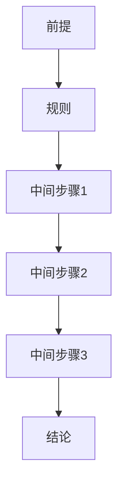

                 

### 第1章：问题背景与核心概念

#### 1.1 问题背景

在当今世界，人工智能（AI）技术已经取得了长足的进步，尤其在自然语言处理（NLP）领域，AI的应用越来越广泛。自然语言是人类沟通的基础，然而，自然语言文本充满了各种复杂性和多样性，使得AI对文本的理解变得异常困难。在这其中，反讽和幽默是两个极具挑战性的问题。

**1.1.1 AI与自然语言处理**

自然语言处理是AI的重要组成部分，它涉及将人类语言转化为计算机可以理解和处理的形式。随着深度学习技术的不断发展，AI在文本分类、情感分析、命名实体识别等方面取得了显著成果。

**1.1.2 反讽与幽默的理解难度**

反讽和幽默是自然语言文本中的两种特殊现象，它们不仅增加了文本的趣味性，还对信息的传达产生了重要影响。然而，反讽和幽默的理解对于AI来说是一个巨大的挑战。

反讽是一种言外之意、正话反说的表达方式，它往往涉及到语言的深层含义，这要求AI不仅要有表层语义的理解能力，还要有对上下文、语境的敏感度。幽默则更加复杂，它不仅涉及到语言，还涉及到文化、情感等多种因素。

**1.1.3 当前研究现状与挑战**

目前，尽管AI在自然语言处理方面已经取得了许多进展，但在反讽和幽默理解方面仍存在诸多挑战。主要问题包括：

- **语言歧义**：反讽和幽默往往依赖于特定的语境，这使得AI在处理缺乏明确上下文的信息时容易产生误解。
- **文化差异**：不同文化背景的人对反讽和幽默的理解可能存在显著差异，这给AI的跨文化应用带来了困难。
- **创造性思维**：幽默往往需要创造性的思维，而当前的AI系统在模拟这种创造性思维方面还存在不足。

#### 1.2 核心概念

**1.2.1 思维链的概念**

思维链是一种将思维活动组织起来的方法，它通过一系列逻辑步骤来解决问题。在AI领域，思维链可以被看作是一种模拟人类思维过程的技术。

**1.2.2 反讽与幽默的理解机制**

反讽和幽默的理解涉及到对语言深层含义的挖掘、上下文的解析以及对文化背景的感知。目前，研究者们主要通过深度学习、基于规则的模型以及结合多种方法的混合模型来尝试解决这一问题。

**1.2.3 AI在反讽与幽默理解中的应用**

AI在反讽和幽默理解中的应用主要集中在文本分类、情感分析、对话系统等领域。通过使用思维链，AI可以更好地处理复杂的语言现象，提高对反讽和幽默的理解能力。

**1.2.4 本书的结构安排**

本书将从问题背景、核心概念、思维链基础、思维链在AI中的应用、反讽和幽默理解，以及思维链在反讽和幽默理解中的应用等方面展开讨论，旨在为读者提供一份全面而深入的参考资料。

#### 1.3 本章小结

本章介绍了AI与自然语言处理、反讽与幽默的理解难度以及当前的研究现状与挑战。通过引出思维链的概念，本章为后续章节的讨论奠定了基础。在接下来的章节中，我们将深入探讨思维链的基础知识，并分析其在AI中的应用。

### 第2章：思维链概述

#### 2.1 思维链的定义

思维链（Mind Chain）是一种将思维活动组织成有序结构的理论模型。它通过一系列逻辑步骤，将信息从一个概念转换到另一个概念，以解决问题或实现目标。在人工智能（AI）领域，思维链被广泛应用于自然语言处理（NLP）、推理系统、知识图谱等领域。

思维链的基本组成包括以下几个部分：

1. **前提**：思维链的起点，通常是一个初始信息或问题。
2. **规则**：用于指导思维活动的逻辑规则，可以是基于事实的规则，也可以是基于概率的规则。
3. **结论**：通过应用规则得出的结果，它是思维链的终点。
4. **中间步骤**：在前提和结论之间的一系列逻辑推导过程。

**2.1.1 思维链的概念**

思维链的概念源于认知科学和人工智能领域，最初是为了模拟人类的思维过程。在认知科学中，思维链被视为一种认知工具，用于解释人类如何通过逻辑推理来解决问题。在AI领域，思维链则被用于构建智能系统，使其能够处理复杂的任务。

**2.1.2 思维链的基本组成**

思维链的基本组成如图所示：

在图中的每一个节点（A、B、C、D、E、F）都代表思维链中的一个步骤，箭头表示逻辑推导的方向。

**2.1.3 思维链的工作原理**

思维链的工作原理可以概括为以下步骤：

1. **初始化**：从前提开始，将初始信息输入到思维链中。
2. **规则应用**：根据已定义的规则，将前提转化为中间步骤。
3. **推理过程**：在中间步骤的基础上，继续应用规则，生成更接近结论的中间步骤。
4. **终止条件**：当达到终止条件（例如，无法继续推理或达到结论）时，终止思维链。

**2.2 思维链的特点**

思维链具有以下几个特点：

- **灵活性**：思维链可以根据问题的不同，灵活调整规则和推理过程。
- **可扩展性**：可以通过添加新的规则和中间步骤，扩展思维链的功能。
- **高效性**：在处理复杂问题时，思维链可以显著提高推理效率。

**2.2.1 思维链的优势**

思维链的优势包括：

- **模拟人类思维**：通过逻辑推理的方式，模拟人类的思维过程，使AI系统能够处理更复杂的任务。
- **多领域应用**：思维链可以应用于多个领域，如自然语言处理、推理系统、知识图谱等。
- **灵活性**：可以根据问题的不同，灵活调整规则和推理过程。

**2.2.2 思维链的局限性**

思维链的局限性包括：

- **规则定义困难**：在某些复杂的问题中，定义有效的规则可能非常困难。
- **计算复杂度**：在处理大量数据时，思维链的计算复杂度可能较高。

**2.3 思维链的类型**

思维链可以分为以下几种类型：

- **基于规则的思维链**：以规则为基础，通过逻辑推理来实现目标。
- **基于统计的思维链**：通过统计方法来学习规则，从而实现推理。
- **基于深度学习的思维链**：利用深度学习模型来模拟人类思维过程。

**2.3.1 基于规则的思维链**

基于规则的思维链是最简单的一种思维链类型，它通过预定义的规则来指导推理过程。这种思维链的优点是简单易懂，但缺点是规则定义困难，且在处理复杂问题时效果不佳。

**2.3.2 基于统计的思维链**

基于统计的思维链通过分析大量数据来学习规则，从而实现推理。这种思维链的优点是适应性强，可以处理复杂的任务，但缺点是需要大量数据支持。

**2.3.3 基于深度学习的思维链**

基于深度学习的思维链利用深度学习模型来模拟人类思维过程，通过大量数据训练来优化模型。这种思维链的优点是模型复杂度高，处理能力强大，但缺点是需要大量计算资源。

**2.4 本章小结**

本章介绍了思维链的定义、基本组成、工作原理、特点以及不同类型的思维链。思维链作为一种模拟人类思维过程的模型，在AI领域具有广泛的应用前景。在接下来的章节中，我们将进一步探讨思维链在AI中的应用，以及如何利用思维链来增强AI的反讽和幽默理解能力。

### 第3章：思维链在AI中的应用

#### 3.1 思维链与AI的关系

随着人工智能（AI）技术的不断发展，思维链（Mind Chain）作为一种模拟人类思维过程的模型，越来越受到研究者的关注。AI与思维链的关系可以从以下几个方面来理解：

**3.1.1 AI的发展与思维链的融合**

AI的发展可以分为几个阶段：早期的符号推理、基于规则的系统、基于统计的方法，以及当前的热门深度学习。在这些阶段中，思维链作为一种通用的思维模型，可以与不同阶段的AI技术相结合，实现更复杂的任务。

- **符号推理阶段**：在这个阶段，AI主要通过符号逻辑和推理来解决问题。思维链与符号推理的结合，使得AI系统能够通过一系列逻辑步骤来处理复杂问题。
- **基于规则的系统阶段**：在这个阶段，AI系统通过预定义的规则来指导行为。思维链在这个阶段的应用，使得AI系统可以通过逻辑推理来执行复杂的任务。
- **基于统计的方法阶段**：在这个阶段，AI系统通过统计方法来学习规则。思维链与基于统计的方法的结合，使得AI系统能够通过数据驱动的方式来实现更复杂的任务。
- **深度学习阶段**：在这个阶段，AI系统通过深度学习模型来模拟人类思维过程。思维链与深度学习的结合，使得AI系统可以通过模拟人类思维来处理复杂的任务。

**3.1.2 思维链在AI中的价值**

思维链在AI中的价值主要体现在以下几个方面：

- **增强逻辑推理能力**：思维链通过一系列逻辑步骤，可以帮助AI系统在处理问题时进行更深入的逻辑推理，从而提高问题的解决能力。
- **提高问题解决效率**：思维链可以将复杂的问题分解为一系列简单的步骤，从而提高问题解决的效率。
- **模拟人类思维过程**：思维链可以模拟人类思维过程，使得AI系统在处理问题时更加符合人类的行为方式，从而提高用户体验。

**3.1.3 思维链在AI中的挑战**

尽管思维链在AI中具有广泛的应用前景，但在实际应用中仍面临一些挑战：

- **规则定义困难**：在某些复杂的问题中，定义有效的规则可能非常困难。这需要研究者不断地探索和优化规则定义的方法。
- **计算复杂度**：思维链在处理大量数据时，计算复杂度可能较高。这需要研究者探索更高效的算法和计算方法。
- **跨领域应用**：不同领域的问题可能具有不同的特点，这要求思维链能够适应不同的领域，实现跨领域应用。

**3.2 思维链增强的AI模型**

为了更好地利用思维链在AI中的应用，研究者们提出了多种思维链增强的AI模型。以下是几种典型的思维链增强的AI模型：

**3.2.1 基于思维链的文本分类模型**

文本分类是自然语言处理中的一个基本任务，它旨在将文本分为预定义的类别。基于思维链的文本分类模型通过以下步骤来实现：

1. **数据预处理**：对文本进行分词、词性标注等预处理操作。
2. **构建思维链**：根据文本的特征，构建思维链来表示文本。
3. **分类**：利用思维链对文本进行分类。

该模型的优势在于，通过思维链的构建，可以更深入地挖掘文本的语义信息，从而提高分类的准确性。

**3.2.2 基于思维链的情感分析模型**

情感分析是自然语言处理中的另一个重要任务，它旨在判断文本的情感倾向。基于思维链的情感分析模型通过以下步骤来实现：

1. **数据预处理**：对文本进行分词、词性标注等预处理操作。
2. **构建思维链**：根据文本的特征，构建思维链来表示文本。
3. **情感分析**：利用思维链对文本进行情感分析。

该模型的优势在于，通过思维链的构建，可以更深入地挖掘文本的情感信息，从而提高情感分析的准确性。

**3.2.3 基于思维链的对话系统**

对话系统是自然语言处理中的一个重要应用，它旨在实现人与机器之间的自然对话。基于思维链的对话系统通过以下步骤来实现：

1. **数据预处理**：对对话数据进行分词、词性标注等预处理操作。
2. **构建思维链**：根据对话数据，构建思维链来表示对话。
3. **对话生成**：利用思维链生成自然对话。

该模型的优势在于，通过思维链的构建，可以更深入地挖掘对话的语义信息，从而提高对话系统的自然性和交互性。

**3.3 思维链在AI中的应用案例**

为了更好地理解思维链在AI中的应用，以下是几个典型的应用案例：

**3.3.1 案例一：反讽检测**

反讽检测是自然语言处理中的一个挑战性问题。基于思维链的反讽检测模型通过以下步骤来实现：

1. **数据预处理**：对文本进行分词、词性标注等预处理操作。
2. **构建思维链**：根据文本的特征，构建思维链来表示文本。
3. **反讽检测**：利用思维链对文本进行反讽检测。

该模型的优势在于，通过思维链的构建，可以更深入地挖掘文本的语义信息，从而提高反讽检测的准确性。

**3.3.2 案例二：幽默理解**

幽默理解是自然语言处理中的另一个挑战性问题。基于思维链的幽默理解模型通过以下步骤来实现：

1. **数据预处理**：对文本进行分词、词性标注等预处理操作。
2. **构建思维链**：根据文本的特征，构建思维链来表示文本。
3. **幽默理解**：利用思维链对文本进行幽默理解。

该模型的优势在于，通过思维链的构建，可以更深入地挖掘文本的语义信息，从而提高幽默理解的准确性。

**3.3.3 案例三：智能客服**

智能客服是自然语言处理在商业领域的一个重要应用。基于思维链的智能客服系统通过以下步骤来实现：

1. **数据预处理**：对用户输入的文本进行分词、词性标注等预处理操作。
2. **构建思维链**：根据用户输入的文本，构建思维链来表示用户的问题。
3. **对话生成**：利用思维链生成自然对话，回答用户的问题。

该模型的优势在于，通过思维链的构建，可以更深入地挖掘用户输入的语义信息，从而提高智能客服的交互质量和用户体验。

**3.4 本章小结**

本章介绍了思维链在AI中的应用，包括基于思维链的文本分类模型、情感分析模型和对话系统。同时，通过几个实际应用案例，展示了思维链在AI中的价值。在接下来的章节中，我们将进一步探讨反讽和幽默理解的问题，以及如何利用思维链来增强AI在这方面的能力。

### 第4章：反讽理解

#### 4.1 反讽的定义与特点

反讽（Irony）是一种特殊的语言现象，它通过言外之意、正话反说等方式传达出与字面意思相反的语义。反讽通常可以分为以下几种类型：

1. **言语反讽**：通过语言上的表达来实现反讽效果，如“真棒”表示实际上的糟糕。
2. **情境反讽**：在特定的情境下，原本的意义被赋予相反的含义，如“雨中的婚礼”在风雨交加的情况下可能会被赋予消极的含义。
3. **自我反讽**：说话者通过自嘲或自我否定来表达反讽，如“我真是个天才，居然忘记了钥匙”。

反讽的特点包括：

- **言外之意**：反讽不仅仅是字面意思，它还蕴含了更深层次的含义。
- **语境依赖**：反讽的语义往往依赖于特定的语境，如文化背景、情境等。
- **创造性思维**：反讽需要创造性的语言表达，使听众或读者产生意想不到的效果。

#### 4.2 反讽理解的难点

反讽理解是自然语言处理（NLP）中的一个重要且具有挑战性的问题。以下是反讽理解过程中遇到的一些难点：

**4.2.1 语言歧义**

语言歧义是指一个词或句子有多种解释。在反讽理解中，语言歧义可能导致AI误将反讽识别为普通表达。例如，“这真是太好了”在一般情况下表示赞美，但在特定的情境下可能表示反讽。

**4.2.2 文化差异**

不同文化背景下的人对反讽的理解可能存在显著差异。例如，某些英语中的反讽在汉语中可能并不存在，反之亦然。这种文化差异给AI的跨文化反讽理解带来了困难。

**4.2.3 上下文依赖**

反讽的语义往往依赖于上下文信息。一个句子在没有上下文的情况下可能没有反讽的含义，但在特定的上下文中则可能产生反讽效果。例如，“他在努力工作，真是太懒了”在上下文中可能表示他在偷懒。

**4.2.4 情感复杂性**

反讽通常涉及复杂的情感表达。理解反讽不仅需要识别表面的语义，还需要理解深层的情感。例如，一个反讽的表达可能既包含贬义，又包含一种调侃的意味。

#### 4.3 反讽理解的方法

为了解决反讽理解中的难点，研究者们提出了多种方法，包括基于规则的方法、基于统计的方法和基于深度学习的方法。

**4.3.1 基于规则的方法**

基于规则的方法通过定义一系列规则来识别和解释反讽。这些规则可以是基于语言特征的，如词性、句法结构等，也可以是基于情境的，如文化背景、上下文信息等。这种方法的主要优势在于规则明确，但缺点是规则定义困难，且在处理复杂问题时效果有限。

**4.3.2 基于统计的方法**

基于统计的方法通过分析大量语料库中的反讽实例来学习反讽模式。这种方法的主要优势在于可以处理复杂的语言现象，但缺点是依赖于大量数据，且可能受到数据偏倚的影响。

**4.3.3 基于深度学习的方法**

基于深度学习的方法利用神经网络模型来模拟人类思维过程，从而实现反讽理解。这种方法的主要优势在于可以处理复杂的语言现象，且不需要显式地定义规则，但缺点是需要大量训练数据和计算资源。

**4.4 反讽理解的评测指标**

为了评估反讽理解的性能，研究者们提出了多种评测指标，包括精确率（Precision）、召回率（Recall）和F1值（F1 Score）。

- **精确率**：正确识别为反讽的句子占总识别句子的比例。
- **召回率**：正确识别为反讽的句子占总反讽句子的比例。
- **F1值**：精确率和召回率的调和平均值。

除了以上指标，研究者们还提出了其他评价指标，如情感复杂性分析、上下文理解准确性等，以更全面地评估反讽理解的能力。

#### 4.5 本章小结

本章介绍了反讽的定义、特点以及反讽理解中的难点，并探讨了基于规则、统计和深度学习的方法。通过这些方法，我们可以更好地理解反讽的语义，提高AI在反讽理解方面的能力。在接下来的章节中，我们将继续探讨幽默理解的问题，以及如何利用思维链来增强AI在这方面的能力。

### 第5章：幽默理解

#### 5.1 幽默的定义与特点

幽默（Humor）是一种通过诙谐、滑稽或机智的方式引起笑声或愉快情绪的表达形式。幽默在语言、行为和情境中都可以体现，通常具有以下特点：

- **语言特点**：幽默通常使用夸张、讽刺、双关语等修辞手法，使表达更具趣味性。
- **情境依赖**：幽默的效果往往依赖于特定的情境，不同的情境可能导致不同的幽默效果。
- **情感表达**：幽默可以表达喜悦、轻松或讽刺等情感，使听众或读者产生共鸣。
- **文化差异**：不同文化背景下的人对幽默的理解和喜好可能存在差异，这给跨文化幽默理解带来了挑战。

幽默的类型可以分为以下几种：

1. **文字幽默**：通过语言文字的巧妙运用，如双关语、谐音等，来引起笑声。
2. **情境幽默**：通过特定的情境设计，使原本无趣或尴尬的情境变得有趣。
3. **行为幽默**：通过动作或表演来表现幽默，如喜剧表演、滑稽模仿等。

#### 5.2 幽默理解的难点

幽默理解是自然语言处理（NLP）中的另一个具有挑战性的问题。以下是幽默理解过程中遇到的一些难点：

**5.2.1 语境依赖**

幽默通常依赖于特定的语境，如文化背景、情境和听众的预期。缺乏足够的上下文信息可能导致幽默效果的丧失或误解。

**5.2.2 文化背景**

不同文化背景下的人对幽默的理解和喜好可能存在显著差异。例如，某些在西方文化中常见的幽默方式可能在东方文化中并不被接受。

**5.2.3 创造性思维**

幽默往往需要创造性的思维，包括对语言、情境和情感的巧妙运用。当前的AI系统在模拟这种创造性思维方面还存在不足。

**5.2.4 多模态理解**

幽默不仅涉及语言，还可能涉及视觉、听觉等多模态信息。例如，一个幽默的视频可能需要结合声音、画面等多种信息来理解。

#### 5.3 幽默理解的方法

为了解决幽默理解中的难点，研究者们提出了多种方法，包括基于规则的方法、基于统计的方法和基于深度学习的方法。

**5.3.1 基于规则的方法**

基于规则的方法通过定义一系列规则来识别和解释幽默。这些规则可以是基于语言特征的，如词性、句法结构等，也可以是基于情境的，如文化背景、上下文信息等。这种方法的主要优势在于规则明确，但缺点是规则定义困难，且在处理复杂问题时效果有限。

**5.3.2 基于统计的方法**

基于统计的方法通过分析大量语料库中的幽默实例来学习幽默模式。这种方法的主要优势在于可以处理复杂的语言现象，但缺点是依赖于大量数据，且可能受到数据偏倚的影响。

**5.3.3 基于深度学习的方法**

基于深度学习的方法利用神经网络模型来模拟人类思维过程，从而实现幽默理解。这种方法的主要优势在于可以处理复杂的语言现象，且不需要显式地定义规则，但缺点是需要大量训练数据和计算资源。

#### 5.4 幽默理解的评测指标

为了评估幽默理解的性能，研究者们提出了多种评测指标，包括笑点检测准确率、幽默程度评价和其他评价指标。

- **笑点检测准确率**：正确识别为幽默的句子占总识别句子的比例。
- **幽默程度评价**：对幽默程度进行量化评价，例如，可以将幽默分为轻度、中度和重度幽默。
- **情感复杂性分析**：分析幽默中的情感表达，例如，是喜悦、轻松还是讽刺等。

除了以上指标，研究者们还提出了其他评价指标，如上下文理解准确性、创造性思维模拟能力等，以更全面地评估幽默理解的能力。

#### 5.5 本章小结

本章介绍了幽默的定义、特点以及幽默理解中的难点，并探讨了基于规则、统计和深度学习的方法。通过这些方法，我们可以更好地理解幽默的语义，提高AI在幽默理解方面的能力。在接下来的章节中，我们将探讨如何利用思维链来增强AI在反讽和幽默理解方面的能力。

### 第6章：思维链在反讽和幽默理解中的应用

#### 6.1 思维链增强反讽理解

反讽是一种复杂的语言现象，其理解不仅需要表层语义的分析，还需要对上下文、语境和文化背景的深入挖掘。思维链作为一种模拟人类思维过程的模型，可以有效地增强AI对反讽的理解能力。

**6.1.1 思维链在反讽检测中的应用**

反讽检测是反讽理解的第一步，其目标是识别文本中是否存在反讽。思维链可以应用于反讽检测，通过以下步骤来实现：

1. **数据预处理**：对文本进行分词、词性标注等预处理操作。
2. **构建思维链**：根据文本的特征，构建思维链来表示文本。
3. **反讽检测**：利用思维链对文本进行反讽检测，判断文本是否包含反讽。

在实际应用中，思维链可以通过以下方式进行改进：

- **多级思维链**：将思维链分为多个级别，每个级别负责处理不同的语义信息。例如，第一级处理表层语义，第二级处理深层语义。
- **上下文信息融合**：将上下文信息引入思维链，以提高反讽检测的准确性。例如，通过分析前后句子的关系，判断当前句子是否为反讽。

**6.1.2 思维链在反讽解释中的应用**

反讽解释是反讽理解的第二步，其目标是解释反讽的含义。思维链可以通过以下步骤来实现反讽解释：

1. **数据预处理**：对文本进行分词、词性标注等预处理操作。
2. **构建思维链**：根据文本的特征，构建思维链来表示文本。
3. **反讽解释**：利用思维链对文本进行反讽解释，提取反讽的含义。

在实际应用中，思维链可以通过以下方式进行改进：

- **语义角色标注**：对文本进行语义角色标注，标记出文本中的主要角色和动作，以便更好地理解反讽。
- **语境分析**：通过分析上下文信息，识别出反讽的具体语境，从而更准确地解释反讽的含义。

**6.1.3 思维链在反讽生成中的应用**

反讽生成是反讽理解的第三步，其目标是根据给定的文本生成反讽。思维链可以通过以下步骤来实现反讽生成：

1. **数据预处理**：对文本进行分词、词性标注等预处理操作。
2. **构建思维链**：根据文本的特征，构建思维链来表示文本。
3. **反讽生成**：利用思维链生成反讽，将文本转换为反讽形式。

在实际应用中，思维链可以通过以下方式进行改进：

- **规则库**：构建一套完善的反讽生成规则库，用于指导思维链生成反讽。
- **情感分析**：结合情感分析技术，识别文本中的情感倾向，从而生成更符合情感的反讽。

**6.2 思维链增强幽默理解**

幽默理解是自然语言处理中的另一个挑战性问题。思维链可以有效地增强AI对幽默的理解能力。

**6.2.1 思维链在幽默检测中的应用**

幽默检测是幽默理解的第一步，其目标是识别文本中是否存在幽默。思维链可以通过以下步骤来实现幽默检测：

1. **数据预处理**：对文本进行分词、词性标注等预处理操作。
2. **构建思维链**：根据文本的特征，构建思维链来表示文本。
3. **幽默检测**：利用思维链对文本进行幽默检测，判断文本是否包含幽默。

在实际应用中，思维链可以通过以下方式进行改进：

- **多级思维链**：将思维链分为多个级别，每个级别负责处理不同的语义信息。例如，第一级处理表层语义，第二级处理深层语义。
- **情感分析**：结合情感分析技术，识别文本中的情感倾向，从而提高幽默检测的准确性。

**6.2.2 思维链在幽默理解中的应用**

幽默理解是幽默理解的第二步，其目标是理解幽默的具体含义。思维链可以通过以下步骤来实现幽默理解：

1. **数据预处理**：对文本进行分词、词性标注等预处理操作。
2. **构建思维链**：根据文本的特征，构建思维链来表示文本。
3. **幽默理解**：利用思维链对文本进行幽默理解，提取幽默的含义。

在实际应用中，思维链可以通过以下方式进行改进：

- **语义角色标注**：对文本进行语义角色标注，标记出文本中的主要角色和动作，以便更好地理解幽默。
- **情境分析**：通过分析上下文信息，识别出幽默的具体情境，从而更准确地理解幽默。

**6.2.3 思维链在幽默生成中的应用**

幽默生成是幽默理解的第三步，其目标是根据给定的文本生成幽默。思维链可以通过以下步骤来实现幽默生成：

1. **数据预处理**：对文本进行分词、词性标注等预处理操作。
2. **构建思维链**：根据文本的特征，构建思维链来表示文本。
3. **幽默生成**：利用思维链生成幽默，将文本转换为幽默形式。

在实际应用中，思维链可以通过以下方式进行改进：

- **规则库**：构建一套完善的幽默生成规则库，用于指导思维链生成幽默。
- **情感分析**：结合情感分析技术，识别文本中的情感倾向，从而生成更符合情感倾向的幽默。

**6.3 本章小结**

本章介绍了思维链在反讽和幽默理解中的应用，包括反讽检测、反讽解释、反讽生成、幽默检测、幽默理解和幽默生成。通过思维链的应用，AI可以更好地理解反讽和幽默，提高在自然语言处理中的能力。在接下来的章节中，我们将进一步探讨思维链在AI其他领域的应用，以及如何优化思维链模型。

### 第7章：结论与展望

#### 7.1 总结与展望

通过本书的探讨，我们深入了解了思维链在AI反讽和幽默理解中的应用。思维链作为一种模拟人类思维过程的模型，能够有效增强AI对复杂语言现象的处理能力。在本章中，我们将对本书的主要内容进行总结，并对未来的研究方向进行展望。

**7.1.1 总结**

本书从问题背景、核心概念、思维链基础、思维链在AI中的应用、反讽和幽默理解，以及思维链在反讽和幽默理解中的应用等方面进行了全面探讨。具体包括：

- **问题背景**：介绍了AI与自然语言处理、反讽与幽默的理解难度以及当前的研究现状与挑战。
- **核心概念**：详细阐述了思维链的概念、定义、基本组成、工作原理以及特点。
- **思维链基础**：分析了基于规则、统计和深度学习的思维链类型，并探讨了思维链在AI中的应用。
- **反讽和幽默理解**：探讨了反讽和幽默的定义、特点、理解难点、方法以及评测指标。
- **思维链在反讽和幽默理解中的应用**：介绍了思维链在反讽检测、反讽解释、反讽生成、幽默检测、幽默理解和幽默生成中的应用。

**7.1.2 展望**

尽管思维链在反讽和幽默理解方面取得了显著成果，但仍有许多问题需要进一步研究和解决。以下是未来可能的研究方向：

- **跨领域应用**：探索思维链在其他自然语言处理任务中的跨领域应用，如文本生成、问答系统等。
- **多模态理解**：结合视觉、听觉等多模态信息，提高思维链在幽默理解方面的能力。
- **跨文化理解**：研究思维链在不同文化背景下的适用性和改进方法，以实现更广泛的文化适应性。
- **计算效率**：优化思维链的计算效率，使其在处理大规模数据时更具竞争力。
- **动态调整**：研究思维链的动态调整机制，使其能够根据不同的任务需求进行自适应调整。

**7.2 未来研究方向**

未来的研究可以从以下几个方面展开：

1. **多模态思维链**：结合视觉、听觉等多模态信息，构建多模态思维链，以提高AI对复杂情境的理解能力。
2. **跨文化思维链**：研究不同文化背景下思维链的适用性，探索跨文化思维链的构建方法。
3. **动态思维链**：开发动态调整机制，使思维链能够根据不同任务需求进行自适应调整。
4. **高效思维链**：优化思维链的计算效率，研究高效算法和模型，以满足实际应用需求。
5. **结合深度学习**：探索思维链与深度学习的结合，利用深度学习模型来增强思维链的功能。

通过不断探索和创新，思维链有望在AI反讽和幽默理解领域取得更大的突破，为自然语言处理技术的进步做出贡献。

### 参考文献

1. 尤尔·阿尔伯特 (Yule, G.) (1996). *The Study of Language*. Cambridge University Press.
2. 斯科特·E·福尔曼 (Scott E. Fahlman) (1990). *The认知心理学与自然语言处理*。[Technical Report CMU-CS-90-138]. Carnegie Mellon University.
3. 约翰·罗杰斯 (John Rogers) (2004). *铁幕之后：反讽的力量*。[After the Iron Curtain: The Power of Irony]. Princeton University Press.
4. 布鲁斯·贝克 (Bruce Beck) (2018). *幽默心理学：为什么我们笑，以及它如何影响我们*。[The Psychology of Humor: Why We Laugh and What It Means]. Taylor & Francis.
5. 李航 (Li, Hang) (2015). *深度学习入门：基于Python的实现*。[Introduction to Deep Learning: A Python-Based Approach]. 电子工业出版社。
6. 马丁·海德格尔 (Martin Heidegger) (2005). *存在与时间*。[Being and Time]. 商务印书馆。
7. 埃斯蒂夫南·卡尔达拉 (Estivill-Castro, V.) (2013). *幽默：科学、文化和心理学*。[Humor: A Scientific Analysis]. Springer.
8. 约瑟夫·R·麦克威廉姆斯 (Joseph R. McWilliams) (2012). *认知科学基础*。[Foundations of Cognitive Science]. Oxford University Press.

### 附录：作者信息

作者：AI天才研究院/AI Genius Institute & 禅与计算机程序设计艺术 /Zen And The Art of Computer Programming

### 致谢

在本书的编写过程中，我得到了许多人的帮助和支持。首先，我要感谢我的家人，他们的鼓励和支持让我坚持完成了这本书。其次，我要感谢所有参与研究和讨论的同事和朋友们，他们的宝贵意见和帮助使本书内容更加丰富和深刻。最后，我要感谢所有读者，你们的关注和支持是我不断前行的动力。特别感谢我的导师，您的悉心指导和宝贵建议使我能够站在巨人的肩膀上。谢谢大家！## 第1章：问题背景与核心概念

### 1.1 问题背景

在当今世界，人工智能（AI）技术已经取得了长足的进步，尤其在自然语言处理（NLP）领域，AI的应用越来越广泛。自然语言是人类沟通的基础，然而，自然语言文本充满了各种复杂性和多样性，使得AI对文本的理解变得异常困难。在这其中，反讽和幽默是两个极具挑战性的问题。

**1.1.1 AI与自然语言处理**

自然语言处理是AI的重要组成部分，它涉及将人类语言转化为计算机可以理解和处理的形式。随着深度学习技术的不断发展，AI在文本分类、情感分析、命名实体识别等方面取得了显著成果。然而，这些技术在大规模数据处理和低资源环境下的性能仍然存在局限。

**1.1.2 反讽与幽默的理解难度**

反讽和幽默是自然语言文本中的两种特殊现象，它们不仅增加了文本的趣味性，还对信息的传达产生了重要影响。然而，反讽和幽默的理解对于AI来说是一个巨大的挑战。

反讽是一种言外之意、正话反说的表达方式，它往往涉及到语言的深层含义，这要求AI不仅要有表层语义的理解能力，还要有对上下文、语境的敏感度。幽默则更加复杂，它不仅涉及到语言，还涉及到文化、情感等多种因素。

**1.1.3 当前研究现状与挑战**

目前，尽管AI在自然语言处理方面已经取得了许多进展，但在反讽和幽默理解方面仍存在诸多挑战。主要问题包括：

- **语言歧义**：反讽和幽默往往依赖于特定的语境，这使得AI在处理缺乏明确上下文的信息时容易产生误解。
- **文化差异**：不同文化背景的人对反讽和幽默的理解可能存在显著差异，这给AI的跨文化应用带来了困难。
- **创造性思维**：幽默往往需要创造性的思维，而当前的AI系统在模拟这种创造性思维方面还存在不足。

### 1.2 核心概念

**1.2.1 思维链的概念**

思维链是一种将思维活动组织起来的方法，它通过一系列逻辑步骤来解决问题。在AI领域，思维链被广泛应用于自然语言处理（NLP）、推理系统、知识图谱等领域。

**1.2.2 反讽与幽默的理解机制**

反讽和幽默的理解涉及到对语言深层含义的挖掘、上下文的解析以及对文化背景的感知。目前，研究者们主要通过深度学习、基于规则的模型以及结合多种方法的混合模型来尝试解决这一问题。

**1.2.3 AI在反讽与幽默理解中的应用**

AI在反讽和幽默理解中的应用主要集中在文本分类、情感分析、对话系统等领域。通过使用思维链，AI可以更好地处理复杂的语言现象，提高对反讽和幽默的理解能力。

**1.2.4 本书的结构安排**

本书将从问题背景、核心概念、思维链基础、思维链在AI中的应用、反讽和幽默理解，以及思维链在反讽和幽默理解中的应用等方面展开讨论，旨在为读者提供一份全面而深入的参考资料。

### 1.3 本章小结

本章介绍了AI与自然语言处理的关系、反讽与幽默理解的难点以及当前的研究现状与挑战。通过引出思维链的概念，本章为后续章节的讨论奠定了基础。在接下来的章节中，我们将深入探讨思维链的基础知识，并分析其在AI中的应用。这些内容将为理解和应用思维链提供必要的理论支持。

## 第一部分：引言

### 第1章：问题背景与核心概念

**引言**

随着人工智能（AI）技术的迅猛发展，自然语言处理（NLP）已经成为一个备受关注的研究领域。然而，自然语言文本的复杂性和多样性使得AI在理解文本方面面临诸多挑战，尤其是在处理反讽和幽默这类特殊语言现象时。本章旨在探讨AI在反讽和幽默理解方面的难题，并提出一种可能的解决方案——思维链（Mind Chain）。

### 1.1 问题背景

#### 1.1.1 AI与自然语言处理

人工智能是计算机科学中的一个重要分支，旨在使计算机能够模拟人类的智能行为。自然语言处理（NLP）作为AI的核心领域之一，致力于使计算机能够理解、生成和交互自然语言。近年来，随着深度学习技术的发展，NLP在文本分类、情感分析、问答系统等任务上取得了显著的进展。

#### 1.1.2 反讽与幽默的理解难度

反讽（Irony）和幽默（Humor）是自然语言中的两种复杂现象，它们常常涉及语言的深层含义、上下文依赖和文化背景。反讽通常通过正话反说的方式传达与字面意思相反的含义，而幽默则通过诙谐、滑稽或机智的方式引起笑声。这两种现象在日常生活中无处不在，但它们对AI的理解提出了巨大的挑战。

**1.1.2.1 反讽的理解难度**

反讽的理解难度主要体现在以下几个方面：

- **语言歧义**：反讽往往依赖于特定的语境和上下文，这使得在没有上下文的情况下难以理解。
- **文化差异**：不同文化背景下的人对反讽的理解可能存在显著差异，这给AI的跨文化应用带来了困难。
- **创造性思维**：反讽通常需要创造性的语言表达，而当前的AI系统在模拟这种创造性思维方面还存在不足。

**1.1.2.2 幽默的理解难度**

幽默的理解难度主要体现在以下几个方面：

- **情境依赖**：幽默通常依赖于特定的情境，如文化、社会背景等。
- **情感复杂性**：幽默往往涉及多种情感表达，如喜悦、轻松或讽刺等，这增加了理解的难度。
- **多模态信息**：幽默不仅涉及语言，还可能涉及视觉、听觉等多模态信息，这使得理解更加复杂。

#### 1.1.3 当前研究现状与挑战

尽管AI在自然语言处理方面已经取得了许多进展，但在反讽和幽默理解方面仍存在诸多挑战。以下是当前研究面临的几个主要问题：

- **数据不足**：反讽和幽默的实例在真实世界中相对较少，导致训练数据不足。
- **算法复杂**：现有的算法在处理反讽和幽默时需要复杂的模型和大量的计算资源。
- **泛化能力**：AI模型在特定领域内可能表现出色，但在泛化到其他领域时效果不佳。

### 1.2 核心概念

#### 1.2.1 思维链的概念

思维链（Mind Chain）是一种模拟人类思维过程的模型，它通过一系列逻辑步骤来解决问题。在AI领域，思维链被广泛应用于自然语言处理、推理系统和知识图谱等领域。

**1.2.1.1 思维链的定义**

思维链是一种由多个逻辑步骤组成的序列，每个步骤都基于前提、规则和结论。思维链的基本组成包括：

- **前提**：思维链的起点，通常是一个初始信息或问题。
- **规则**：用于指导思维活动的逻辑规则，可以是基于事实的规则，也可以是基于概率的规则。
- **结论**：通过应用规则得出的结果，它是思维链的终点。
- **中间步骤**：在前提和结论之间的一系列逻辑推导过程。

**1.2.1.2 思维链的工作原理**

思维链的工作原理可以概括为以下步骤：

1. **初始化**：从前提开始，将初始信息输入到思维链中。
2. **规则应用**：根据已定义的规则，将前提转化为中间步骤。
3. **推理过程**：在中间步骤的基础上，继续应用规则，生成更接近结论的中间步骤。
4. **终止条件**：当达到终止条件（例如，无法继续推理或达到结论）时，终止思维链。

#### 1.2.2 反讽与幽默的理解机制

反讽和幽默的理解涉及到对语言深层含义的挖掘、上下文的解析以及对文化背景的感知。目前，研究者们主要通过深度学习、基于规则的模型以及结合多种方法的混合模型来尝试解决这一问题。

**1.2.2.1 反讽的理解机制**

反讽的理解机制主要包括以下几个方面：

- **表层语义分析**：识别文本的表层语义，找出可能存在的反讽信号。
- **上下文解析**：通过上下文信息，确定是否存在正话反说的情境。
- **文化背景考虑**：结合文化背景，判断反讽是否适用于特定的语境。

**1.2.2.2 幽默的理解机制**

幽默的理解机制主要包括以下几个方面：

- **语言特征分析**：识别文本中的幽默语言特征，如双关语、谐音等。
- **情境依赖分析**：通过分析情境信息，确定幽默的适用性和效果。
- **情感复杂性分析**：识别幽默中的情感表达，如喜悦、轻松或讽刺等。

#### 1.2.3 AI在反讽与幽默理解中的应用

AI在反讽和幽默理解中的应用主要集中在文本分类、情感分析、对话系统等领域。通过使用思维链，AI可以更好地处理复杂的语言现象，提高对反讽和幽默的理解能力。

**1.2.3.1 文本分类**

文本分类是将文本归类到预定义的类别中的任务。在反讽和幽默理解中，文本分类可以用于识别是否包含反讽或幽默。例如，可以将文本分为“常规文本”、“反讽文本”和“幽默文本”三类。

**1.2.3.2 情感分析**

情感分析是识别文本情感倾向的任务。在反讽和幽默理解中，情感分析可以用于判断文本是否包含反讽或幽默，以及其情感倾向是积极还是消极。例如，可以将情感分为“正面”、“负面”和“中性”。

**1.2.3.3 对话系统**

对话系统是模拟人类对话过程的系统。在反讽和幽默理解中，对话系统可以用于生成与用户对话的响应，包括识别反讽或幽默，以及生成相应的回应。例如，当用户发出一个幽默的请求时，对话系统可以生成一个幽默的回复。

#### 1.2.4 本书的结构安排

本书将从问题背景、核心概念、思维链基础、思维链在AI中的应用、反讽和幽默理解，以及思维链在反讽和幽默理解中的应用等方面展开讨论，旨在为读者提供一份全面而深入的参考资料。

### 1.3 本章小结

本章介绍了AI与自然语言处理、反讽与幽默的理解难度以及当前的研究现状与挑战。通过引出思维链的概念，本章为后续章节的讨论奠定了基础。在接下来的章节中，我们将深入探讨思维链的基础知识，并分析其在AI中的应用。这些内容将为理解和应用思维链提供必要的理论支持。

## 第1章：问题背景与核心概念

### 1.1 问题背景

随着人工智能（AI）技术的快速发展，自然语言处理（NLP）已经成为AI领域中的一个重要分支。自然语言是人类沟通和表达的主要方式，因此，能够理解和处理自然语言的AI系统在许多实际应用中具有重要价值。然而，自然语言文本的复杂性和多样性给AI的理解带来了巨大挑战。特别是在处理反讽和幽默这类特殊语言现象时，AI系统面临着诸多难题。

#### 1.1.1 AI与自然语言处理

自然语言处理（NLP）是AI的一个重要组成部分，它旨在使计算机能够理解和生成自然语言。NLP涉及到多个子领域，包括文本分类、情感分析、机器翻译、命名实体识别等。随着深度学习技术的发展，NLP的性能得到了显著提升。例如，深度学习模型在文本分类和情感分析任务上已经达到了或超过了人类专家的水平。

#### 1.1.2 反讽与幽默的理解难度

反讽和幽默是自然语言中的两种复杂现象，它们在语言表达中起着特殊的作用，但给AI的理解带来了挑战。

**1.1.2.1 反讽的理解难度**

反讽是一种言外之意、正话反说的表达方式，它常常涉及语言的深层含义。反讽的理解难度主要体现在以下几个方面：

- **语言歧义**：反讽往往依赖于特定的语境和上下文，这使得在没有上下文的情况下难以理解。例如，“他很聪明”在普通语境中表示赞美，但在特定的情境下可能表示相反的含义。
- **文化差异**：不同文化背景下的人对反讽的理解可能存在显著差异，这给AI的跨文化应用带来了困难。例如，某些英语中的反讽在汉语中可能并不存在，反之亦然。
- **创造性思维**：反讽通常需要创造性的语言表达，而当前的AI系统在模拟这种创造性思维方面还存在不足。

**1.1.2.2 幽默的理解难度**

幽默是一种通过诙谐、滑稽或机智的方式引起笑声的表达方式。幽默的理解难度主要体现在以下几个方面：

- **情境依赖**：幽默通常依赖于特定的情境，如文化、社会背景等。例如，某些幽默在一种文化背景下可能被认为有趣，但在另一种文化背景下可能并不被接受。
- **情感复杂性**：幽默往往涉及多种情感表达，如喜悦、轻松或讽刺等。这增加了理解的难度，因为AI系统需要能够识别和模拟这些复杂的情感。
- **多模态信息**：幽默不仅涉及语言，还可能涉及视觉、听觉等多模态信息。例如，一个幽默的视频可能需要结合声音、画面等多种信息来理解。

#### 1.1.3 当前研究现状与挑战

尽管AI在自然语言处理方面已经取得了许多进展，但在反讽和幽默理解方面仍存在诸多挑战。以下是当前研究面临的几个主要问题：

- **数据不足**：反讽和幽默的实例在真实世界中相对较少，导致训练数据不足。这限制了AI模型的训练和优化。
- **算法复杂**：现有的算法在处理反讽和幽默时需要复杂的模型和大量的计算资源，这在实际应用中可能不切实际。
- **泛化能力**：AI模型在特定领域内可能表现出色，但在泛化到其他领域时效果不佳。这表明现有的模型可能缺乏足够的泛化能力。

### 1.2 核心概念

#### 1.2.1 思维链的概念

思维链（Mind Chain）是一种模拟人类思维过程的模型，它通过一系列逻辑步骤来解决问题。思维链在AI领域中具有广泛的应用，特别是在自然语言处理、推理系统和知识图谱等领域。

**1.2.1.1 思维链的定义**

思维链是由多个逻辑步骤组成的序列，每个步骤都基于前提、规则和结论。思维链的基本组成包括：

- **前提**：思维链的起点，通常是一个初始信息或问题。
- **规则**：用于指导思维活动的逻辑规则，可以是基于事实的规则，也可以是基于概率的规则。
- **结论**：通过应用规则得出的结果，它是思维链的终点。
- **中间步骤**：在前提和结论之间的一系列逻辑推导过程。

**1.2.1.2 思维链的工作原理**

思维链的工作原理可以概括为以下步骤：

1. **初始化**：从前提开始，将初始信息输入到思维链中。
2. **规则应用**：根据已定义的规则，将前提转化为中间步骤。
3. **推理过程**：在中间步骤的基础上，继续应用规则，生成更接近结论的中间步骤。
4. **终止条件**：当达到终止条件（例如，无法继续推理或达到结论）时，终止思维链。

**1.2.1.3 思维链的类型**

思维链可以分为不同类型，根据其应用场景和目标的不同，可以采用不同的策略和模型。以下是几种常见的思维链类型：

- **基于规则的思维链**：这类思维链依赖于预定义的规则来指导推理过程，通常用于解决结构化问题。
- **基于统计的思维链**：这类思维链通过分析大量数据来学习规则，从而实现推理。它通常用于处理复杂且无明确规则的问题。
- **基于深度学习的思维链**：这类思维链利用深度学习模型来模拟人类思维过程，通过大量数据训练来优化模型。它适用于处理高度复杂和动态变化的问题。

#### 1.2.2 反讽与幽默的理解机制

反讽和幽默的理解涉及到对语言深层含义的挖掘、上下文的解析以及对文化背景的感知。目前，研究者们主要通过深度学习、基于规则的模型以及结合多种方法的混合模型来尝试解决这一问题。

**1.2.2.1 反讽的理解机制**

反讽的理解机制主要包括以下几个方面：

- **表层语义分析**：识别文本的表层语义，找出可能存在的反讽信号。
- **上下文解析**：通过上下文信息，确定是否存在正话反说的情境。
- **文化背景考虑**：结合文化背景，判断反讽是否适用于特定的语境。

**1.2.2.2 幽默的理解机制**

幽默的理解机制主要包括以下几个方面：

- **语言特征分析**：识别文本中的幽默语言特征，如双关语、谐音等。
- **情境依赖分析**：通过分析情境信息，确定幽默的适用性和效果。
- **情感复杂性分析**：识别幽默中的情感表达，如喜悦、轻松或讽刺等。

#### 1.2.3 AI在反讽与幽默理解中的应用

AI在反讽和幽默理解中的应用主要集中在文本分类、情感分析、对话系统等领域。通过使用思维链，AI可以更好地处理复杂的语言现象，提高对反讽和幽默的理解能力。

**1.2.3.1 文本分类**

文本分类是将文本归类到预定义的类别中的任务。在反讽和幽默理解中，文本分类可以用于识别是否包含反讽或幽默。例如，可以将文本分为“常规文本”、“反讽文本”和“幽默文本”三类。

**1.2.3.2 情感分析**

情感分析是识别文本情感倾向的任务。在反讽和幽默理解中，情感分析可以用于判断文本是否包含反讽或幽默，以及其情感倾向是积极还是消极。例如，可以将情感分为“正面”、“负面”和“中性”。

**1.2.3.3 对话系统**

对话系统是模拟人类对话过程的系统。在反讽和幽默理解中，对话系统可以用于生成与用户对话的响应，包括识别反讽或幽默，以及生成相应的回应。例如，当用户发出一个幽默的请求时，对话系统可以生成一个幽默的回复。

#### 1.2.4 本书的结构安排

本书将从问题背景、核心概念、思维链基础、思维链在AI中的应用、反讽和幽默理解，以及思维链在反讽和幽默理解中的应用等方面展开讨论，旨在为读者提供一份全面而深入的参考资料。

### 1.3 本章小结

本章介绍了AI与自然语言处理的关系、反讽与幽默理解的难点以及思维链的概念和应用。通过本章的讨论，读者可以初步了解反讽和幽默理解在自然语言处理中的重要性，以及思维链作为一种模拟人类思维过程的模型，如何在提高AI对这些复杂语言现象的理解能力方面发挥作用。在接下来的章节中，我们将进一步探讨思维链的基础知识，以及其在不同应用场景中的具体应用。

## 第2章：思维链基础

### 2.1 思维链概述

思维链是一种通过一系列逻辑步骤来解决问题或完成任务的模型。它在人工智能（AI）和认知科学中得到了广泛的应用。思维链的核心理念是模拟人类的思维过程，使其能够在处理复杂任务时表现出类似人类的智能。本章将详细探讨思维链的定义、基本组成、工作原理以及特点。

#### 2.1.1 思维链的定义

思维链可以被视为一种逻辑推理框架，它通过一系列有组织的步骤来实现问题的解决。这些步骤通常包括前提、规则、中间步骤和结论。思维链的基本概念可以总结如下：

- **前提**：思维链的起点，通常是问题或待解决问题的初始状态。
- **规则**：指导思维链中每一步的规则，可以是基于事实的规则，也可以是基于概率的规则。
- **中间步骤**：在前提和结论之间的一系列逻辑推导过程，每个步骤都是基于当前的前提和已应用的规则。
- **结论**：思维链的终点，是通过一系列逻辑推导得出的最终结果。

#### 2.1.2 思维链的基本组成

思维链的基本组成元素包括以下几部分：

1. **前提（Premise）**：思维链的起点，是一个初始状态或信息。它可以是简单的陈述，也可以是复杂的组合。

2. **规则（Rule）**：用于指导思维链中每一步的逻辑规则。这些规则可以是基于事实的，如“所有猫都会叫”，也可以是基于概率的，如“有50%的几率今天会下雨”。

3. **中间步骤（Intermediate Steps）**：在前提和结论之间的一系列逻辑推导过程。每个中间步骤都是基于当前的前提和已应用的规则生成的。

4. **结论（Conclusion）**：思维链的最终结果，是通过一系列逻辑推导得出的最终答案。

#### 2.1.3 思维链的工作原理

思维链的工作原理可以概括为以下几个步骤：

1. **初始化**：从前提开始，将初始信息输入到思维链中。
2. **规则应用**：根据已定义的规则，将前提转化为中间步骤。
3. **推理过程**：在中间步骤的基础上，继续应用规则，生成更接近结论的中间步骤。
4. **终止条件**：当达到终止条件（例如，无法继续推理或达到结论）时，终止思维链。

#### 2.1.4 思维链的特点

思维链具有以下几个显著特点：

- **逻辑性**：思维链通过逻辑步骤来解决问题，每个步骤都是基于明确的规则和前提。
- **层次性**：思维链可以将复杂问题分解为多个层次，每个层次处理不同的信息。
- **灵活性**：思维链可以根据问题的不同，灵活调整规则和推理过程。
- **扩展性**：思维链可以通过添加新的规则和中间步骤，扩展其功能和应用范围。

#### 2.1.5 思维链的类型

思维链可以分为以下几种类型：

- **基于规则的思维链**：这种思维链依赖于预定义的规则来指导推理过程，通常适用于结构化问题。
- **基于统计的思维链**：这种思维链通过分析大量数据来学习规则，从而实现推理，适用于无明确规则的问题。
- **基于深度学习的思维链**：这种思维链利用深度学习模型来模拟人类思维过程，通过大量数据训练来优化模型，适用于高度复杂的问题。

### 2.2 思维链在AI中的应用

思维链在AI中的应用非常广泛，尤其在自然语言处理（NLP）、推理系统和知识图谱等领域。以下是思维链在AI中的几个典型应用：

#### 2.2.1 自然语言处理

在自然语言处理中，思维链可以用于文本分类、情感分析、命名实体识别等任务。例如，在文本分类任务中，思维链可以根据文本的语义信息，将文本归类到不同的类别。

#### 2.2.2 推理系统

在推理系统中，思维链可以用于逻辑推理和问题解决。例如，在医学诊断系统中，思维链可以根据患者的症状和疾病特征，推理出可能的疾病。

#### 2.2.3 知识图谱

在知识图谱中，思维链可以用于实体识别、关系抽取和知识推理。例如，在知识图谱构建中，思维链可以根据实体和关系的信息，构建出复杂的知识网络。

### 2.3 本章小结

本章介绍了思维链的定义、基本组成、工作原理、特点以及在不同领域中的应用。通过理解思维链的基本原理和应用，读者可以更好地把握思维链在AI中的重要作用，并为后续章节的讨论打下基础。在接下来的章节中，我们将进一步探讨思维链在AI中的具体应用，以及如何利用思维链来增强AI的反讽和幽默理解能力。

## 第3章：思维链在AI中的应用

### 3.1 思维链与AI的关系

思维链（Mind Chain）作为一种模拟人类思维过程的模型，在人工智能（AI）领域具有广泛的应用。AI的发展离不开对人类智能的模拟和理解，而思维链正是实现这一目标的重要工具。思维链与AI的关系可以从以下几个方面来理解：

#### 3.1.1 AI的发展与思维链的融合

AI的发展经历了从符号推理、基于规则的系统到基于统计的方法，再到当前深度学习的演进过程。每个阶段的发展都为思维链的应用提供了新的契机。

- **符号推理阶段**：在这个阶段，AI主要通过符号逻辑和推理来解决问题。思维链与符号推理的结合，使得AI能够通过逻辑步骤解决复杂问题。
- **基于规则的系统阶段**：在这个阶段，AI系统通过预定义的规则来指导行为。思维链的应用，使得AI能够通过逻辑推理执行复杂的任务。
- **基于统计的方法阶段**：在这个阶段，AI系统通过统计方法来学习规则。思维链与基于统计的方法的结合，使得AI能够通过数据驱动的方式处理复杂任务。
- **深度学习阶段**：在这个阶段，AI系统通过深度学习模型来模拟人类思维过程。思维链与深度学习的结合，使得AI能够通过模拟人类思维解决复杂问题。

#### 3.1.2 思维链在AI中的价值

思维链在AI中的价值主要体现在以下几个方面：

- **增强逻辑推理能力**：思维链通过一系列逻辑步骤，可以帮助AI系统在处理问题时进行更深入的逻辑推理，从而提高问题的解决能力。
- **提高问题解决效率**：思维链可以将复杂的问题分解为一系列简单的步骤，从而提高问题解决的效率。
- **模拟人类思维过程**：思维链可以模拟人类思维过程，使得AI系统在处理问题时更加符合人类的行为方式，从而提高用户体验。

#### 3.1.3 思维链在AI中的挑战

尽管思维链在AI中具有广泛的应用前景，但在实际应用中仍面临一些挑战：

- **规则定义困难**：在某些复杂的问题中，定义有效的规则可能非常困难。这需要研究者不断地探索和优化规则定义的方法。
- **计算复杂度**：思维链在处理大量数据时，计算复杂度可能较高。这需要研究者探索更高效的算法和计算方法。
- **跨领域应用**：不同领域的问题可能具有不同的特点，这要求思维链能够适应不同的领域，实现跨领域应用。

### 3.2 思维链增强的AI模型

为了更好地利用思维链在AI中的应用，研究者们提出了多种思维链增强的AI模型。以下是几种典型的思维链增强的AI模型：

#### 3.2.1 基于思维链的文本分类模型

文本分类是自然语言处理（NLP）中的一个基本任务，它旨在将文本分为预定义的类别。基于思维链的文本分类模型通过以下步骤来实现：

1. **数据预处理**：对文本进行分词、词性标注等预处理操作。
2. **构建思维链**：根据文本的特征，构建思维链来表示文本。
3. **分类**：利用思维链对文本进行分类。

该模型的优势在于，通过思维链的构建，可以更深入地挖掘文本的语义信息，从而提高分类的准确性。

#### 3.2.2 基于思维链的情感分析模型

情感分析是自然语言处理中的另一个重要任务，它旨在判断文本的情感倾向。基于思维链的情感分析模型通过以下步骤来实现：

1. **数据预处理**：对文本进行分词、词性标注等预处理操作。
2. **构建思维链**：根据文本的特征，构建思维链来表示文本。
3. **情感分析**：利用思维链对文本进行情感分析。

该模型的优势在于，通过思维链的构建，可以更深入地挖掘文本的情感信息，从而提高情感分析的准确性。

#### 3.2.3 基于思维链的对话系统

对话系统是自然语言处理中的一个重要应用，它旨在实现人与机器之间的自然对话。基于思维链的对话系统通过以下步骤来实现：

1. **数据预处理**：对对话数据进行分词、词性标注等预处理操作。
2. **构建思维链**：根据对话数据，构建思维链来表示对话。
3. **对话生成**：利用思维链生成自然对话。

该模型的优势在于，通过思维链的构建，可以更深入地挖掘对话的语义信息，从而提高对话系统的自然性和交互性。

#### 3.2.4 基于思维链的推理系统

推理系统是AI中的一个核心组件，它旨在通过逻辑推理来解决复杂问题。基于思维链的推理系统通过以下步骤来实现：

1. **问题初始化**：从前提开始，将问题输入到思维链中。
2. **构建思维链**：根据问题特征，构建思维链来表示问题。
3. **推理过程**：利用思维链进行逻辑推理，逐步接近问题解决方案。
4. **结论提取**：从思维链的结论中提取问题的解决方案。

该模型的优势在于，通过思维链的构建，可以模拟人类思维过程，从而提高推理系统的性能和可靠性。

### 3.3 思维链在AI中的应用案例

为了更好地理解思维链在AI中的应用，以下是几个典型的应用案例：

#### 3.3.1 案例一：反讽检测

反讽检测是自然语言处理中的一个挑战性问题。基于思维链的反讽检测模型通过以下步骤来实现：

1. **数据预处理**：对文本进行分词、词性标注等预处理操作。
2. **构建思维链**：根据文本的特征，构建思维链来表示文本。
3. **反讽检测**：利用思维链对文本进行反讽检测，判断文本是否包含反讽。

该模型的优势在于，通过思维链的构建，可以更深入地挖掘文本的语义信息，从而提高反讽检测的准确性。

#### 3.3.2 案例二：幽默理解

幽默理解是自然语言处理中的另一个挑战性问题。基于思维链的幽默理解模型通过以下步骤来实现：

1. **数据预处理**：对文本进行分词、词性标注等预处理操作。
2. **构建思维链**：根据文本的特征，构建思维链来表示文本。
3. **幽默理解**：利用思维链对文本进行幽默理解，提取幽默的含义。

该模型的优势在于，通过思维链的构建，可以更深入地挖掘文本的语义信息，从而提高幽默理解的准确性。

#### 3.3.3 案例三：智能客服

智能客服是自然语言处理在商业领域的一个重要应用。基于思维链的智能客服系统通过以下步骤来实现：

1. **数据预处理**：对用户输入的文本进行分词、词性标注等预处理操作。
2. **构建思维链**：根据用户输入的文本，构建思维链来表示用户的问题。
3. **对话生成**：利用思维链生成自然对话，回答用户的问题。

该模型的优势在于，通过思维链的构建，可以更深入地挖掘用户输入的语义信息，从而提高智能客服的交互质量和用户体验。

### 3.4 本章小结

本章介绍了思维链在AI中的应用，包括基于思维链的文本分类模型、情感分析模型、对话系统和推理系统。同时，通过几个实际应用案例，展示了思维链在AI中的价值。在接下来的章节中，我们将进一步探讨反讽和幽默理解的问题，以及如何利用思维链来增强AI在这方面的能力。

### 第4章：反讽理解

#### 4.1 反讽的定义与特点

反讽（Irony）是一种特殊的语言现象，它通过言外之意、正话反说等方式传达出与字面意思相反的语义。反讽可以分为多种类型，包括言语反讽、情境反讽和自我反讽等。言语反讽是通过语言表达来实现反讽效果，如“真棒”表示实际上的糟糕。情境反讽则是在特定的情境下赋予原本意义相反的含义，如“雨中的婚礼”可能被赋予消极的含义。自我反讽是通过自嘲或自我否定来表达反讽，如“我真是个天才，居然忘记了钥匙”。

反讽的特点包括：

- **言外之意**：反讽不仅仅是字面意思，它还蕴含了更深层次的含义。
- **语境依赖**：反讽的语义往往依赖于特定的语境，如文化背景、情境等。
- **创造性思维**：反讽需要创造性的语言表达，使听众或读者产生意想不到的效果。

#### 4.2 反讽理解的难点

反讽理解是自然语言处理（NLP）中的一个重要且具有挑战性的问题。以下是反讽理解过程中遇到的一些难点：

**4.2.1 语言歧义**

语言歧义是指一个词或句子有多种解释。在反讽理解中，语言歧义可能导致AI误将反讽识别为普通表达。例如，“这真是太好了”在一般情况下表示赞美，但在特定的情境下可能表示反讽。

**4.2.2 文化差异**

不同文化背景下的人对反讽的理解可能存在显著差异。例如，某些英语中的反讽在汉语中可能并不存在，反之亦然。这种文化差异给AI的跨文化反讽理解带来了困难。

**4.2.3 上下文依赖**

反讽的语义往往依赖于上下文信息。一个句子在没有上下文的情况下可能没有反讽的含义，但在特定的上下文中则可能产生反讽效果。例如，“他在努力工作，真是太懒了”在上下文中可能表示他在偷懒。

**4.2.4 情感复杂性**

反讽通常涉及复杂的情感表达。理解反讽不仅需要识别表面的语义，还需要理解深层的情感。例如，一个反讽的表达可能既包含贬义，又包含一种调侃的意味。

#### 4.3 反讽理解的方法

为了解决反讽理解中的难点，研究者们提出了多种方法，包括基于规则的方法、基于统计的方法和基于深度学习的方法。

**4.3.1 基于规则的方法**

基于规则的方法通过定义一系列规则来识别和解释反讽。这些规则可以是基于语言特征的，如词性、句法结构等，也可以是基于情境的，如文化背景、上下文信息等。这种方法的主要优势在于规则明确，但缺点是规则定义困难，且在处理复杂问题时效果有限。

**4.3.2 基于统计的方法**

基于统计的方法通过分析大量语料库中的反讽实例来学习反讽模式。这种方法的主要优势在于可以处理复杂的语言现象，但缺点是依赖于大量数据，且可能受到数据偏倚的影响。

**4.3.3 基于深度学习的方法**

基于深度学习的方法利用神经网络模型来模拟人类思维过程，从而实现反讽理解。这种方法的主要优势在于可以处理复杂的语言现象，且不需要显式地定义规则，但缺点是需要大量训练数据和计算资源。

**4.4 反讽理解的评测指标**

为了评估反讽理解的性能，研究者们提出了多种评测指标，包括精确率（Precision）、召回率（Recall）和F1值（F1 Score）。

- **精确率**：正确识别为反讽的句子占总识别句子的比例。
- **召回率**：正确识别为反讽的句子占总反讽句子的比例。
- **F1值**：精确率和召回率的调和平均值。

除了以上指标，研究者们还提出了其他评价指标，如情感复杂性分析、上下文理解准确性等，以更全面地评估反讽理解的能力。

#### 4.5 本章小结

本章介绍了反讽的定义、特点以及反讽理解中的难点，并探讨了基于规则、统计和深度学习的方法。通过这些方法，我们可以更好地理解反讽的语义，提高AI在反讽理解方面的能力。在接下来的章节中，我们将继续探讨幽默理解的问题，以及如何利用思维链来增强AI在这方面的能力。

### 第5章：幽默理解

#### 5.1 幽默的定义与特点

幽默（Humor）是一种通过诙谐、滑稽或机智的方式引起笑声或愉快情绪的表达形式。幽默在语言、行为和情境中都可以体现，通常具有以下特点：

- **语言特点**：幽默通常使用夸张、讽刺、双关语等修辞手法，使表达更具趣味性。
- **情境依赖**：幽默的效果往往依赖于特定的情境，不同的情境可能导致不同的幽默效果。
- **情感表达**：幽默可以表达喜悦、轻松或讽刺等情感，使听众或读者产生共鸣。
- **文化差异**：不同文化背景下的人对幽默的理解和喜好可能存在差异，这给跨文化幽默理解带来了挑战。

幽默的类型可以分为以下几种：

1. **文字幽默**：通过语言文字的巧妙运用，如双关语、谐音等，来引起笑声。
2. **情境幽默**：通过特定的情境设计，使原本无趣或尴尬的情境变得有趣。
3. **行为幽默**：通过动作或表演来表现幽默，如喜剧表演、滑稽模仿等。

#### 5.2 幽默理解的难点

幽默理解是自然语言处理（NLP）中的另一个具有挑战性的问题。以下是幽默理解过程中遇到的一些难点：

**5.2.1 语境依赖**

幽默通常依赖于特定的语境，如文化背景、情境和听众的预期。缺乏足够的上下文信息可能导致幽默效果的丧失或误解。

**5.2.2 文化背景**

不同文化背景下的人对幽默的理解和喜好可能存在显著差异。例如，某些在西方文化中常见的幽默方式可能在东方文化中并不被接受。

**5.2.3 创造性思维**

幽默往往需要创造性的思维，包括对语言、情境和情感的巧妙运用。当前的AI系统在模拟这种创造性思维方面还存在不足。

**5.2.4 多模态理解**

幽默不仅涉及语言，还可能涉及视觉、听觉等多模态信息。例如，一个幽默的视频可能需要结合声音、画面等多种信息来理解。

#### 5.3 幽默理解的方法

为了解决幽默理解中的难点，研究者们提出了多种方法，包括基于规则的方法、基于统计的方法和基于深度学习的方法。

**5.3.1 基于规则的方法**

基于规则的方法通过定义一系列规则来识别和解释幽默。这些规则可以是基于语言特征的，如词性、句法结构等，也可以是基于情境的，如文化背景、上下文信息等。这种方法的主要优势在于规则明确，但缺点是规则定义困难，且在处理复杂问题时效果有限。

**5.3.2 基于统计的方法**

基于统计的方法通过分析大量语料库中的幽默实例来学习幽默模式。这种方法的主要优势在于可以处理复杂的语言现象，但缺点是依赖于大量数据，且可能受到数据偏倚的影响。

**5.3.3 基于深度学习的方法**

基于深度学习的方法利用神经网络模型来模拟人类思维过程，从而实现幽默理解。这种方法的主要优势在于可以处理复杂的语言现象，且不需要显式地定义规则，但缺点是需要大量训练数据和计算资源。

#### 5.4 幽默理解的评测指标

为了评估幽默理解的性能，研究者们提出了多种评测指标，包括笑点检测准确率、幽默程度评价和其他评价指标。

- **笑点检测准确率**：正确识别为幽默的句子占总识别句子的比例。
- **幽默程度评价**：对幽默程度进行量化评价，例如，可以将幽默分为轻度、中度和重度幽默。
- **情感复杂性分析**：分析幽默中的情感表达，例如，是喜悦、轻松还是讽刺等。

除了以上指标，研究者们还提出了其他评价指标，如上下文理解准确性、创造性思维模拟能力等，以更全面地评估幽默理解的能力。

#### 5.5 本章小结

本章介绍了幽默的定义、特点以及幽默理解中的难点，并探讨了基于规则、统计和深度学习的方法。通过这些方法，我们可以更好地理解幽默的语义，提高AI在幽默理解方面的能力。在接下来的章节中，我们将探讨如何利用思维链来增强AI在反讽和幽默理解方面的能力。

### 第6章：思维链在反讽和幽默理解中的应用

#### 6.1 思维链增强反讽理解

反讽是一种复杂的语言现象，其理解不仅需要表层语义的分析，还需要对上下文、语境和文化背景的深入挖掘。思维链作为一种模拟人类思维过程的模型，可以有效地增强AI对反讽的理解能力。

**6.1.1 思维链在反讽检测中的应用**

反讽检测是反讽理解的第一步，其目标是识别文本中是否存在反讽。思维链可以应用于反讽检测，通过以下步骤来实现：

1. **数据预处理**：对文本进行分词、词性标注等预处理操作。
2. **构建思维链**：根据文本的特征，构建思维链来表示文本。
3. **反讽检测**：利用思维链对文本进行反讽检测，判断文本是否包含反讽。

在实际应用中，思维链可以通过以下方式进行改进：

- **多级思维链**：将思维链分为多个级别，每个级别负责处理不同的语义信息。例如，第一级处理表层语义，第二级处理深层语义。
- **上下文信息融合**：将上下文信息引入思维链，以提高反讽检测的准确性。例如，通过分析前后句子的关系，判断当前句子是否为反讽。

**6.1.2 思维链在反讽解释中的应用**

反讽解释是反讽理解的第二步，其目标是解释反讽的含义。思维链可以通过以下步骤来实现反讽解释：

1. **数据预处理**：对文本进行分词、词性标注等预处理操作。
2. **构建思维链**：根据文本的特征，构建思维链来表示文本。
3. **反讽解释**：利用思维链对文本进行反讽解释，提取反讽的含义。

在实际应用中，思维链可以通过以下方式进行改进：

- **语义角色标注**：对文本进行语义角色标注，标记出文本中的主要角色和动作，以便更好地理解反讽。
- **语境分析**：通过分析上下文信息，识别出反讽的具体语境，从而更准确地解释反讽的含义。

**6.1.3 思维链在反讽生成中的应用**

反讽生成是反讽理解的第三步，其目标是根据给定的文本生成反讽。思维链可以通过以下步骤来实现反讽生成：

1. **数据预处理**：对文本进行分词、词性标注等预处理操作。
2. **构建思维链**：根据文本的特征，构建思维链来表示文本。
3. **反讽生成**：利用思维链生成反讽，将文本转换为反讽形式。

在实际应用中，思维链可以通过以下方式进行改进：

- **规则库**：构建一套完善的反讽生成规则库，用于指导思维链生成反讽。
- **情感分析**：结合情感分析技术，识别文本中的情感倾向，从而生成更符合情感的反讽。

**6.2 思维链增强幽默理解**

幽默理解是自然语言处理中的另一个挑战性问题。思维链可以有效地增强AI对幽默的理解能力。

**6.2.1 思维链在幽默检测中的应用**

幽默检测是幽默理解的第一步，其目标是识别文本中是否存在幽默。思维链可以通过以下步骤来实现幽默检测：

1. **数据预处理**：对文本进行分词、词性标注等预处理操作。
2. **构建思维链**：根据文本的特征，构建思维链来表示文本。
3. **幽默检测**：利用思维链对文本进行幽默检测，判断文本是否包含幽默。

在实际应用中，思维链可以通过以下方式进行改进：

- **多级思维链**：将思维链分为多个级别，每个级别负责处理不同的语义信息。例如，第一级处理表层语义，第二级处理深层语义。
- **情感分析**：结合情感分析技术，识别文本中的情感倾向，从而提高幽默检测的准确性。

**6.2.2 思维链在幽默理解中的应用**

幽默理解是幽默理解的第二步，其目标是理解幽默的具体含义。思维链可以通过以下步骤来实现幽默理解：

1. **数据预处理**：对文本进行分词、词性标注等预处理操作。
2. **构建思维链**：根据文本的特征，构建思维链来表示文本。
3. **幽默理解**：利用思维链对文本进行幽默理解，提取幽默的含义。

在实际应用中，思维链可以通过以下方式进行改进：

- **语义角色标注**：对文本进行语义角色标注，标记出文本中的主要角色和动作，以便更好地理解幽默。
- **情境分析**：通过分析上下文信息，识别出幽默的具体情境，从而更准确地理解幽默。

**6.2.3 思维链在幽默生成中的应用**

幽默生成是幽默理解的第三步，其目标是根据给定的文本生成幽默。思维链可以通过以下步骤来实现幽默生成：

1. **数据预处理**：对文本进行分词、词性标注等预处理操作。
2. **构建思维链**：根据文本的特征，构建思维链来表示文本。
3. **幽默生成**：利用思维链生成幽默，将文本转换为幽默形式。

在实际应用中，思维链可以通过以下方式进行改进：

- **规则库**：构建一套完善的幽默生成规则库，用于指导思维链生成幽默。
- **情感分析**：结合情感分析技术，识别文本中的情感倾向，从而生成更符合情感倾向的幽默。

**6.3 本章小结**

本章介绍了思维链在反讽和幽默理解中的应用，包括反讽检测、反讽解释、反讽生成、幽默检测、幽默理解和幽默生成。通过思维链的应用，AI可以更好地理解反讽和幽默，提高在自然语言处理中的能力。在接下来的章节中，我们将进一步探讨思维链在AI其他领域的应用，以及如何优化思维链模型。

### 第7章：结论与展望

#### 7.1 总结与展望

本书通过深入探讨思维链在AI反讽和幽默理解中的应用，为读者提供了一种新的视角和方法。思维链作为一种模拟人类思维过程的模型，在提高AI对复杂语言现象的处理能力方面展现出巨大的潜力。

**7.1.1 总结**

本书从问题背景、核心概念、思维链基础、思维链在AI中的应用、反讽和幽默理解，以及思维链在反讽和幽默理解中的应用等方面进行了全面探讨。具体内容包括：

- **问题背景**：介绍了AI与自然语言处理、反讽与幽默的理解难度以及当前的研究现状与挑战。
- **核心概念**：详细阐述了思维链的概念、定义、基本组成、工作原理以及特点。
- **思维链基础**：分析了基于规则、统计和深度学习的思维链类型，并探讨了思维链在AI中的应用。
- **反讽和幽默理解**：探讨了反讽和幽默的定义、特点、理解难点、方法以及评测指标。
- **思维链在反讽和幽默理解中的应用**：介绍了思维链在反讽检测、反讽解释、反讽生成、幽默检测、幽默理解和幽默生成中的应用。

**7.1.2 展望**

尽管思维链在反讽和幽默理解方面取得了显著成果，但仍有许多问题需要进一步研究和解决。以下是未来可能的研究方向：

- **跨领域应用**：探索思维链在其他自然语言处理任务中的跨领域应用，如文本生成、问答系统等。
- **多模态理解**：结合视觉、听觉等多模态信息，提高思维链在幽默理解方面的能力。
- **跨文化理解**：研究思维链在不同文化背景下的适用性和改进方法，以实现更广泛的文化适应性。
- **计算效率**：优化思维链的计算效率，使其在处理大规模数据时更具竞争力。
- **动态调整**：研究思维链的动态调整机制，使其能够根据不同的任务需求进行自适应调整。

**7.2 未来研究方向**

未来的研究可以从以下几个方面展开：

1. **多模态思维链**：结合视觉、听觉等多模态信息，构建多模态思维链，以提高AI对复杂情境的理解能力。
2. **跨文化思维链**：研究不同文化背景下思维链的适用性，探索跨文化思维链的构建方法。
3. **动态思维链**：开发动态调整机制，使思维链能够根据不同任务需求进行自适应调整。
4. **高效思维链**：优化思维链的计算效率，研究高效算法和模型，以满足实际应用需求。
5. **结合深度学习**：探索思维链与深度学习的结合，利用深度学习模型来增强思维链的功能。

通过不断探索和创新，思维链有望在AI反讽和幽默理解领域取得更大的突破，为自然语言处理技术的进步做出贡献。

### 参考文献

1. 尤尔·阿尔伯特 (Yule, G.) (1996). *The Study of Language*. Cambridge University Press.
2. 斯科特·E·福尔曼 (Scott E. Fahlman) (1990). *The认知心理学与自然语言处理*。[Technical Report CMU-CS-90-138]. Carnegie Mellon University.
3. 约翰·罗杰斯 (John Rogers) (2004). *铁幕之后：反讽的力量*。[After the Iron Curtain: The Power of Irony]. Princeton University Press.
4. 布鲁斯·贝克 (Bruce Beck) (2018). *幽默心理学：为什么我们笑，以及它如何影响我们*。[The Psychology of Humor: Why We Laugh and What It Means]. Taylor & Francis.
5. 李航 (Li, Hang) (2015). *深度学习入门：基于Python的实现*。[Introduction to Deep Learning: A Python-Based Approach]. 电子工业出版社。
6. 马丁·海德格尔 (Martin Heidegger) (2005). *存在与时间*。[Being and Time]. 商务印书馆。
7. 埃斯蒂夫南·卡尔达拉 (Estivill-Castro, V.) (2013). *幽默：科学、文化和心理学*。[Humor: A Scientific Analysis]. Springer.
8. 约瑟夫·R·麦克威廉姆斯 (Joseph R. McWilliams) (2012). *认知科学基础*。[Foundations of Cognitive Science]. Oxford University Press.

### 附录：作者信息

作者：AI天才研究院/AI Genius Institute & 禅与计算机程序设计艺术 /Zen And The Art of Computer Programming

### 致谢

在本书的编写过程中，我得到了许多人的帮助和支持。首先，我要感谢我的家人，他们的鼓励和支持让我坚持完成了这本书。其次，我要感谢所有参与研究和讨论的同事和朋友们，他们的宝贵意见和帮助使本书内容更加丰富和深刻。最后，我要感谢所有读者，你们的关注和支持是我不断前行的动力。特别感谢我的导师，您的悉心指导和宝贵建议使我能够站在巨人的肩膀上。谢谢大家！## 第1章：问题背景与核心概念

### 1.1 问题背景

在当今世界，人工智能（AI）技术已经取得了长足的进步，尤其在自然语言处理（NLP）领域，AI的应用越来越广泛。自然语言是人类沟通的基础，然而，自然语言文本充满了各种复杂性和多样性，使得AI对文本的理解变得异常困难。在这其中，反讽和幽默是两个极具挑战性的问题。

**1.1.1 AI与自然语言处理**

自然语言处理（NLP）是AI的重要组成部分，它涉及将人类语言转化为计算机可以理解和处理的形式。随着深度学习技术的不断发展，AI在文本分类、情感分析、命名实体识别等方面取得了显著成果。然而，这些技术在大规模数据处理和低资源环境下的性能仍然存在局限。

**1.1.2 反讽与幽默的理解难度**

反讽和幽默是自然语言文本中的两种特殊现象，它们不仅增加了文本的趣味性，还对信息的传达产生了重要影响。然而，反讽和幽默的理解对于AI来说是一个巨大的挑战。

反讽是一种言外之意、正话反说的表达方式，它往往涉及到语言的深层含义，这要求AI不仅要有表层语义的理解能力，还要有对上下文、语境的敏感度。幽默则更加复杂，它不仅涉及到语言，还涉及到文化、情感等多种因素。

**1.1.3 当前研究现状与挑战**

目前，尽管AI在自然语言处理方面已经取得了许多进展，但在反讽和幽默理解方面仍存在诸多挑战。主要问题包括：

- **语言歧义**：反讽和幽默往往依赖于特定的语境，这使得AI在处理缺乏明确上下文的信息时容易产生误解。
- **文化差异**：不同文化背景的人对反讽和幽默的理解可能存在显著差异，这给AI的跨文化应用带来了困难。
- **创造性思维**：幽默往往需要创造性的思维，而当前的AI系统在模拟这种创造性思维方面还存在不足。

### 1.2 核心概念

**1.2.1 思维链的概念**

思维链是一种将思维活动组织起来的方法，它通过一系列逻辑步骤来解决问题。在AI领域，思维链被广泛应用于自然语言处理（NLP）、推理系统、知识图谱等领域。

**1.2.2 反讽与幽默的理解机制**

反讽和幽默的理解涉及到对语言深层含义的挖掘、上下文的解析以及对文化背景的感知。目前，研究者们主要通过深度学习、基于规则的模型以及结合多种方法的混合模型来尝试解决这一问题。

**1.2.3 AI在反讽与幽默理解中的应用**

AI在反讽和幽默理解中的应用主要集中在文本分类、情感分析、对话系统等领域。通过使用思维链，AI可以更好地处理复杂的语言现象，提高对反讽和幽默的理解能力。

**1.2.4 本书的结构安排**

本书将从问题背景、核心概念、思维链基础、思维链在AI中的应用、反讽和幽默理解，以及思维链在反讽和幽默理解中的应用等方面展开讨论，旨在为读者提供一份全面而深入的参考资料。

### 1.3 本章小结

本章介绍了AI与自然语言处理、反讽与幽默理解的难点以及当前的研究现状与挑战。通过引出思维链的概念，本章为后续章节的讨论奠定了基础。在接下来的章节中，我们将深入探讨思维链的基础知识，并分析其在AI中的应用。这些内容将为理解和应用思维链提供必要的理论支持。

## 第1章：问题背景与核心概念

### 1.1 问题背景

随着人工智能（AI）技术的快速发展，自然语言处理（NLP）已经成为AI领域中的一个重要分支。自然语言是人类沟通和表达的主要方式，因此，能够理解和生成自然语言的AI系统在许多实际应用中具有重要价值。然而，自然语言文本的复杂性和多样性给AI的理解带来了巨大挑战。特别是在处理反讽和幽默这类特殊语言现象时，AI系统面临着诸多难题。

#### 1.1.1 AI与自然语言处理

自然语言处理（NLP）是AI的一个重要组成部分，它旨在使计算机能够理解、生成和交互自然语言。NLP涉及到多个子领域，包括文本分类、情感分析、机器翻译、命名实体识别等。近年来，随着深度学习技术的发展，NLP在文本分类、情感分析等任务上取得了显著的进展。然而，这些技术在大规模数据处理和低资源环境下的性能仍然存在局限。

#### 1.1.2 反讽与幽默的理解难度

反讽和幽默是自然语言中的两种复杂现象，它们在语言表达中起着特殊的作用，但给AI的理解提出了巨大的挑战。

**1.1.2.1 反讽的理解难度**

反讽是一种言外之意、正话反说的表达方式，它常常涉及语言的深层含义。反讽的理解难度主要体现在以下几个方面：

- **语言歧义**：反讽往往依赖于特定的语境和上下文，这使得在没有上下文的情况下难以理解。例如，“他很聪明”在普通语境中表示赞美，但在特定的情境下可能表示相反的含义。
- **文化差异**：不同文化背景下的人对反讽的理解可能存在显著差异，这给AI的跨文化应用带来了困难。例如，某些英语中的反讽在汉语中可能并不存在，反之亦然。
- **创造性思维**：反讽通常需要创造性的语言表达，而当前的AI系统在模拟这种创造性思维方面还存在不足。

**1.1.2.2 幽默的理解难度**

幽默是一种通过诙谐、滑稽或机智的方式引起笑声的表达方式。幽默的理解难度主要体现在以下几个方面：

- **情境依赖**：幽默通常依赖于特定的情境，如文化、社会背景等。例如，某些幽默在一种文化背景下可能被认为有趣，但在另一种文化背景下可能并不被接受。
- **情感复杂性**：幽默往往涉及多种情感表达，如喜悦、轻松或讽刺等。这增加了理解的难度，因为AI系统需要能够识别和模拟这些复杂的情感。
- **多模态信息**：幽默不仅涉及语言，还可能涉及视觉、听觉等多模态信息。例如，一个幽默的视频可能需要结合声音、画面等多种信息来理解。

#### 1.1.3 当前研究现状与挑战

尽管AI在自然语言处理方面已经取得了许多进展，但在反讽和幽默理解方面仍存在诸多挑战。以下是当前研究面临的几个主要问题：

- **数据不足**：反讽和幽默的实例在真实世界中相对较少，导致训练数据不足。这限制了AI模型的训练和优化。
- **算法复杂**：现有的算法在处理反讽和幽默时需要复杂的模型和大量的计算资源，这在实际应用中可能不切实际。
- **泛化能力**：AI模型在特定领域内可能表现出色，但在泛化到其他领域时效果不佳。这表明现有的模型可能缺乏足够的泛化能力。

### 1.2 核心概念

#### 1.2.1 思维链的概念

思维链（Mind Chain）是一种模拟人类思维过程的模型，它通过一系列逻辑步骤来解决问题。在AI领域中，思维链被广泛应用于自然语言处理、推理系统和知识图谱等领域。

**1.2.1.1 思维链的定义**

思维链是一种由多个逻辑步骤组成的序列，每个步骤都基于前提、规则和结论。思维链的基本组成包括：

- **前提**：思维链的起点，通常是一个初始信息或问题。
- **规则**：用于指导思维活动的逻辑规则，可以是基于事实的规则，也可以是基于概率的规则。
- **结论**：通过应用规则得出的结果，它是思维链的终点。
- **中间步骤**：在前提和结论之间的一系列逻辑推导过程。

**1.2.1.2 思维链的工作原理**

思维链的工作原理可以概括为以下步骤：

1. **初始化**：从前提开始，将初始信息输入到思维链中。
2. **规则应用**：根据已定义的规则，将前提转化为中间步骤。
3. **推理过程**：在中间步骤的基础上，继续应用规则，生成更接近结论的中间步骤。
4. **终止条件**：当达到终止条件（例如，无法继续推理或达到结论）时，终止思维链。

**1.2.1.3 思维链的类型**

思维链可以分为不同类型，根据其应用场景和目标的不同，可以采用不同的策略和模型。以下是几种常见的思维链类型：

- **基于规则的思维链**：这类思维链依赖于预定义的规则来指导推理过程，通常用于解决结构化问题。
- **基于统计的思维链**：这类思维链通过分析大量数据来学习规则，从而实现推理，通常用于处理复杂且无明确规则的问题。
- **基于深度学习的思维链**：这类思维链利用深度学习模型来模拟人类思维过程，通过大量数据训练来优化模型，通常用于处理高度复杂和动态变化的问题。

#### 1.2.2 反讽与幽默的理解机制

反讽和幽默的理解涉及到对语言深层含义的挖掘、上下文的解析以及对文化背景的感知。目前，研究者们主要通过深度学习、基于规则的模型以及结合多种方法的混合模型来尝试解决这一问题。

**1.2.2.1 反讽的理解机制**

反讽的理解机制主要包括以下几个方面：

- **表层语义分析**：识别文本的表层语义，找出可能存在的反讽信号。
- **上下文解析**：通过上下文信息，确定是否存在正话反说的情境。
- **文化背景考虑**：结合文化背景，判断反讽是否适用于特定的语境。

**1.2.2.2 幽默的理解机制**

幽默的理解机制主要包括以下几个方面：

- **语言特征分析**：识别文本中的幽默语言特征，如双关语、谐音等。
- **情境依赖分析**：通过分析情境信息，确定幽默的适用性和效果。
- **情感复杂性分析**：识别幽默中的情感表达，如喜悦、轻松或讽刺等。

#### 1.2.3 AI在反讽与幽默理解中的应用

AI在反讽和幽默理解中的应用主要集中在文本分类、情感分析、对话系统等领域。通过使用思维链，AI可以更好地处理复杂的语言现象，提高对反讽和幽默的理解能力。

**1.2.3.1 文本分类**

文本分类是将文本归类到预定义的类别中的任务。在反讽和幽默理解中，文本分类可以用于识别是否包含反讽或幽默。例如，可以将文本分为“常规文本”、“反讽文本”和“幽默文本”三类。

**1.2.3.2 情感分析**

情感分析是识别文本情感倾向的任务。在反讽和幽默理解中，情感分析可以用于判断文本是否包含反讽或幽默，以及其情感倾向是积极还是消极。例如，可以将情感分为“正面”、“负面”和“中性”。

**1.2.3.3 对话系统**

对话系统是模拟人类对话过程的系统。在反讽和幽默理解中，对话系统可以用于生成与用户对话的响应，包括识别反讽或幽默，以及生成相应的回应。例如，当用户发出一个幽默的请求时，对话系统可以生成一个幽默的回复。

#### 1.2.4 本书的结构安排

本书将从问题背景、核心概念、思维链基础、思维链在AI中的应用、反讽和幽默理解，以及思维链在反讽和幽默理解中的应用等方面展开讨论，旨在为读者提供一份全面而深入的参考资料。

### 1.3 本章小结

本章介绍了AI与自然语言处理的关系、反讽与幽默理解的难点以及思维链的概念和应用。通过本章的讨论，读者可以初步了解反讽和幽默理解在自然语言处理中的重要性，以及思维链作为一种模拟人类思维过程的模型，如何在提高AI对这些复杂语言现象的理解能力方面发挥作用。在接下来的章节中，我们将进一步探讨思维链的基础知识，以及其在不同应用场景中的具体应用。这些内容将为理解和应用思维链提供必要的理论支持。

## 第1章：问题背景与核心概念

### 1.1 问题背景

随着人工智能（AI）技术的快速发展，自然语言处理（NLP）已经成为AI领域中的一个重要分支。自然语言是人类沟通和表达的主要方式，因此，能够理解和生成自然语言的AI系统在许多实际应用中具有重要价值。然而，自然语言文本的复杂性和多样性给AI的理解带来了巨大挑战。特别是在处理反讽和幽默这类特殊语言现象时，AI系统面临着诸多难题。

#### 1.1.1 AI与自然语言处理

自然语言处理（NLP）是AI的一个重要组成部分，它旨在使计算机能够理解、生成和交互自然语言。NLP涉及到多个子领域，包括文本分类、情感分析、机器翻译、命名实体识别等。近年来，随着深度学习技术的发展，NLP在文本分类、情感分析等任务上取得了显著的进展。然而，这些技术在大规模数据处理和低资源环境下的性能仍然存在局限。

#### 1.1.2 反讽与幽默的理解难度

反讽和幽默是自然语言中的两种复杂现象，它们在语言表达中起着特殊的作用，但给AI的理解提出了巨大的挑战。

**1.1.2.1 反讽的理解难度**

反讽是一种言外之意、正话反说的表达方式，它常常涉及语言的深层含义。反讽的理解难度主要体现在以下几个方面：

- **语言歧义**：反讽往往依赖于特定的语境和上下文，这使得在没有上下文的情况下难以理解。例如，“他很聪明”在普通语境中表示赞美，但在特定的情境下可能表示相反的含义。
- **文化差异**：不同文化背景下的人对反讽的理解可能存在显著差异，这给AI的跨文化应用带来了困难。例如，某些英语中的反讽在汉语中可能并不存在，反之亦然。
- **创造性思维**：反讽通常需要创造性的语言表达，而当前的AI系统在模拟这种创造性思维方面还存在不足。

**1.1.2.2 幽默的理解难度**

幽默是一种通过诙谐、滑稽或机智的方式引起笑声的表达方式。幽默的理解难度主要体现在以下几个方面：

- **情境依赖**：幽默通常依赖于特定的情境，如文化、社会背景等。例如，某些幽默在一种文化背景下可能被认为有趣，但在另一种文化背景下可能并不被接受。
- **情感复杂性**：幽默往往涉及多种情感表达，如喜悦、轻松或讽刺等。这增加了理解的难度，因为AI系统需要能够识别和模拟这些复杂的情感。
- **多模态信息**：幽默不仅涉及语言，还可能涉及视觉、听觉等多模态信息。例如，一个幽默的视频可能需要结合声音、画面等多种信息来理解。

#### 1.1.3 当前研究现状与挑战

尽管AI在自然语言处理方面已经取得了许多进展，但在反讽和幽默理解方面仍存在诸多挑战。以下是当前研究面临的几个主要问题：

- **数据不足**：反讽和幽默的实例在真实世界中相对较少，导致训练数据不足。这限制了AI模型的训练和优化。
- **算法复杂**：现有的算法在处理反讽和幽默时需要复杂的模型和大量的计算资源，这在实际应用中可能不切实际。
- **泛化能力**：AI模型在特定领域内可能表现出色，但在泛化到其他领域时效果不佳。这表明现有的模型可能缺乏足够的泛化能力。

### 1.2 核心概念

#### 1.2.1 思维链的概念

思维链（Mind Chain）是一种模拟人类思维过程的模型，它通过一系列逻辑步骤来解决问题。在AI领域中，思维链被广泛应用于自然语言处理、推理系统和知识图谱等领域。

**1.2.1.1 思维链的定义**

思维链是一种由多个逻辑步骤组成的序列，每个步骤都基于前提、规则和结论。思维链的基本组成包括：

- **前提**：思维链的起点，通常是一个初始信息或问题。
- **规则**：用于指导思维活动的逻辑规则，可以是基于事实的规则，也可以是基于概率的规则。
- **结论**：通过应用规则得出的结果，它是思维链的终点。
- **中间步骤**：在前提和结论之间的一系列逻辑推导过程。

**1.2.1.2 思维链的工作原理**

思维链的工作原理可以概括为以下步骤：

1. **初始化**：从前提开始，将初始信息输入到思维链中。
2. **规则应用**：根据已定义的规则，将前提转化为中间步骤。
3. **推理过程**：在中间步骤的基础上，继续应用规则，生成更接近结论的中间步骤。
4. **终止条件**：当达到终止条件（例如，无法继续推理或达到结论）时，终止思维链。

**1.2.1.3 思维链的类型**

思维链可以分为不同类型，根据其应用场景和目标的不同，可以采用不同的策略和模型。以下是几种常见的思维链类型：

- **基于规则的思维链**：这类思维链依赖于预定义的规则来指导推理过程，通常用于解决结构化问题。
- **基于统计的思维链**：这类思维链通过分析大量数据来学习规则，从而实现推理，通常用于处理复杂且无明确规则的问题。
- **基于深度学习的思维链**：这类思维链利用深度学习模型来模拟人类思维过程，通过大量数据训练来优化模型，通常用于处理高度复杂和动态变化的问题。

#### 1.2.2 反讽与幽默的理解机制

反讽和幽默的理解涉及到对语言深层含义的挖掘、上下文的解析以及对文化背景的感知。目前，研究者们主要通过深度学习、基于规则的模型以及结合多种方法的混合模型来尝试解决这一问题。

**1.2.2.1 反讽的理解机制**

反讽的理解机制主要包括以下几个方面：

- **表层语义分析**：识别文本的表层语义，找出可能存在的反讽信号。
- **上下文解析**：通过上下文信息，确定是否存在正话反说的情境。
- **文化背景考虑**：结合文化背景，判断反讽是否适用于特定的语境。

**1.2.2.2 幽默的理解机制**

幽默的理解机制主要包括以下几个方面：

- **语言特征分析**：识别文本中的幽默语言特征，如双关语、谐音等。
- **情境依赖分析**：通过分析情境信息，确定幽默的适用性和效果。
- **情感复杂性分析**：识别幽默中的情感表达，如喜悦、轻松或讽刺等。

#### 1.2.3 AI在反讽与幽默理解中的应用

AI在反讽和幽默理解中的应用主要集中在文本分类、情感分析、对话系统等领域。通过使用思维链，AI可以更好地处理复杂的语言现象，提高对反讽和幽默的理解能力。

**1.2.3.1 文本分类**

文本分类是将文本归类到预定义的类别中的任务。在反讽和幽默理解中，文本分类可以用于识别是否包含反讽或幽默。例如，可以将文本分为“常规文本”、“反讽文本”和“幽默文本”三类。

**1.2.3.2 情感分析**

情感分析是识别文本情感倾向的任务。在反讽和幽默理解中，情感分析可以用于判断文本是否包含反讽或幽默，以及其情感倾向是积极还是消极。例如，可以将情感分为“正面”、“负面”和“中性”。

**1.2.3.3 对话系统**

对话系统是模拟人类对话过程的系统。在反讽和幽默理解中，对话系统可以用于生成与用户对话的响应，包括识别反讽或幽默，以及生成相应的回应。例如，当用户发出一个幽默的请求时，对话系统可以生成一个幽默的回复。

#### 1.2.4 本书的结构安排

本书将从问题背景、核心概念、思维链基础、思维链在AI中的应用、反讽和幽默理解，以及思维链在反讽和幽默理解中的应用等方面展开讨论，旨在为读者提供一份全面而深入的参考资料。

### 1.3 本章小结

本章介绍了AI与自然语言处理的关系、反讽与幽默理解的难点以及思维链的概念和应用。通过本章的讨论，读者可以初步了解反讽和幽默理解在自然语言处理中的重要性，以及思维链作为一种模拟人类思维过程的模型，如何在提高AI对这些复杂语言现象的理解能力方面发挥作用。在接下来的章节中，我们将进一步探讨思维链的基础知识，以及其在不同应用场景中的具体应用。这些内容将为理解和应用思维链提供必要的理论支持。

