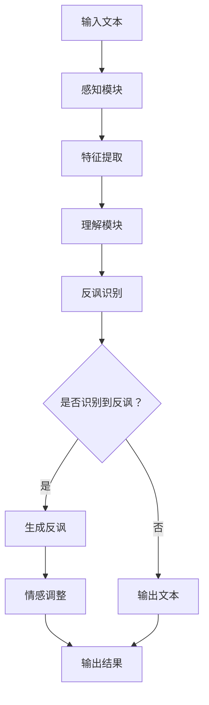
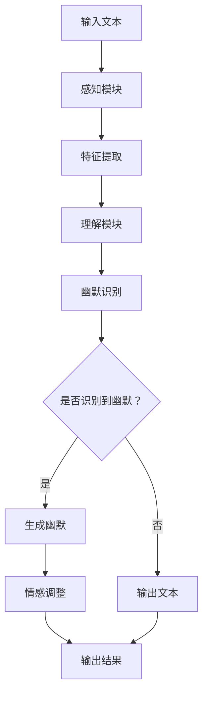

                 

# 思维链增强AI的反讽和幽默生成能力

## 关键词
AI, 反讽，幽默，生成能力，思维链，算法，系统架构，项目实战

## 摘要
本文深入探讨了如何通过思维链增强人工智能（AI）的反讽和幽默生成能力。文章首先介绍了反讽和幽默的定义及其在AI生成中的挑战，随后定义了核心概念——思维链，并详细阐述了其与AI反讽和幽默生成机制的联系。接着，文章通过算法原理讲解、数学模型公式推导、系统架构与接口设计，最后通过项目实战展示了该技术的应用与效果。文章旨在为读者提供一份全面的技术指南，帮助他们理解并实现AI反讽和幽默的生成。

### 引言

### 1.1 书籍概述
本书旨在深入探讨如何通过思维链（Mind Chain）这一创新技术来增强人工智能（AI）的反讽和幽默生成能力。随着人工智能技术的不断进步，生成式AI在文本、图像、音频等多模态生成领域取得了显著成就。然而，在处理反讽和幽默这类具有高度情感和文化内涵的文本时，传统算法往往面临诸多挑战。本书将围绕以下主题展开：

1. **问题背景**：分析反讽与幽默的定义及其在人类交流中的重要性，揭示AI生成这些内容所面临的难题。
2. **核心概念**：定义思维链，阐述其在AI反讽和幽默生成中的作用。
3. **算法原理**：详细讲解思维链增强AI生成反讽和幽默的算法原理及流程。
4. **数学模型**：介绍并推导相关的数学模型，以便读者更好地理解算法的实现。
5. **系统架构设计**：描述AI反讽和幽默生成系统的整体架构，包括关键模块的设计与接口。
6. **项目实战**：通过具体的项目实战，展示如何在实际环境中部署和应用这一技术。
7. **总结与展望**：总结主要成果，提出存在的问题与未来研究方向。

### 1.2 目标读者
本书的目标读者为：

- **AI研究人员与开发者**：对AI技术有深入理解，希望了解并掌握AI生成反讽和幽默的最新方法。
- **计算机科学专业的学生**：对AI及其应用领域有兴趣，希望通过实践项目深入理解相关技术。
- **技术人员与管理层**：对AI技术在商业和娱乐领域的应用感兴趣，希望了解如何将其应用于实际业务。

### 1.3 书籍结构
本书结构如下：

- **第1章 引言**：介绍书籍主题、目标读者和结构。
- **第2章 问题背景**：分析反讽与幽默的定义及其在AI生成中的挑战。
- **第3章 核心概念**：阐述思维链的概念及其在AI反讽和幽默生成中的作用。
- **第4章 算法原理与流程图**：详细讲解思维链增强AI生成反讽和幽默的算法原理及流程。
- **第5章 数学模型与公式讲解**：介绍并推导相关的数学模型。
- **第6章 系统架构与接口设计**：描述系统的整体架构与接口。
- **第7章 项目实战**：通过具体项目展示技术应用。
- **第8章 总结与展望**：总结成果并提出未来研究方向。

### 问题背景

### 2.1 反讽与幽默的定义

#### 反讽

反讽（Sarcasm）是一种语言表达技巧，通过使用与字面意思相反的方式来表达说话者的真实意图。反讽通常带有讽刺、嘲弄或批评的语气，目的是使听者或读者意识到其深层含义，从而产生特定的情感反应。例如，当一个人说“你真是太棒了”，实际上可能是在讽刺对方的表现很差。

#### 幽默

幽默（Humor）是一种通过幽默、诙谐和机智来引起愉悦感或微笑的语言或行为。幽默能够缓解紧张情绪，增强人际关系的和谐。幽默的形式多样，可以是文字游戏、笑话、双关语等。例如，“为什么小鸟站在电线上不会被电到？”答案是“因为它只是站在线上，并没有跳进去。”

### 2.2 AI生成反讽和幽默的挑战

尽管反讽和幽默在人类交流中扮演着重要角色，但AI生成这些内容却面临诸多挑战：

#### 语言理解

AI需要理解上下文、语境以及说话者的情感状态，这对于生成具有情感色彩的文本至关重要。然而，语言是复杂的，充满了歧义和多义性，这使得AI在准确理解语言含义方面存在困难。

#### 情感表达

反讽和幽默往往涉及情感表达，如讽刺中的嘲讽、幽默中的诙谐。AI需要具备表达这些情感的能力，否则生成的文本可能显得平淡无趣。

#### 文化差异

反讽和幽默常常受文化背景的影响。不同文化对同一事物可能有不同的幽默感和理解方式。AI需要能够适应不同文化的幽默感，否则可能会产生不恰当的输出。

#### 创造力

生成反讽和幽默内容需要一定的创造力。AI需要能够灵活地组合词汇和句子，创造出新颖有趣的文本，这需要强大的生成能力和语言模型。

#### 上下文关联

反讽和幽默往往与特定的上下文密切相关。AI需要理解上下文信息，才能生成与之相符的反讽或幽默内容。然而，上下文的理解是一个复杂的问题，涉及到语言理解的多个层次。

### 2.3 问题的重要性

尽管存在挑战，但AI生成反讽和幽默的重要性不容忽视：

#### 娱乐产业

在娱乐产业中，幽默和反讽是吸引观众的重要因素。例如，喜剧电影、相声节目等都需要精心设计的幽默和反讽来逗乐观众。AI生成这些内容可以大大提高内容创作的效率。

#### 社交媒体

社交媒体上的许多互动都依赖于幽默和反讽。AI生成这些内容可以增加用户的参与度和互动性，例如，自动生成社交媒体平台的搞笑回复或段子。

#### 人机交互

在人工智能助手和聊天机器人中，生成反讽和幽默内容可以增强用户体验。一个能够理解用户情感并适时使用幽默和反讽的人工智能助手，会显得更加亲切和有趣。

#### 教育与心理治疗

在教育和心理治疗领域，幽默和反讽也被广泛应用。通过生成幽默和反讽的内容，AI可以帮助学生更好地理解复杂概念，或者帮助心理治疗师以更轻松的方式与患者交流。

### 核心概念

### 3.1 思维链的概念

思维链（Mind Chain）是一种基于人类思维模式和信息处理机制的模型。它通过模拟人类大脑的信息处理过程，实现从输入到输出的信息转换。思维链的核心思想是将复杂的认知任务分解为多个简单的子任务，通过逐步处理和整合这些子任务，达到整体认知目标。

#### 思维链的结构

思维链通常由以下几个关键部分组成：

- **感知模块**：负责接收外部信息，如文本、图像、声音等。
- **理解模块**：对感知模块接收到的信息进行理解，提取关键概念和关系。
- **推理模块**：基于理解和已有知识进行逻辑推理，生成新的信息。
- **情感模块**：处理与情感相关的信息，如情绪识别、情感表达等。
- **记忆模块**：存储和管理信息，以便在需要时进行调用。

#### 思维链的工作原理

思维链的工作原理可以概括为以下几个步骤：

1. **感知**：接收外部信息，如文本或图像。
2. **理解**：对信息进行语义分析和上下文理解，提取关键信息。
3. **推理**：基于已有知识和逻辑规则，对信息进行推理，生成新的观点或结论。
4. **情感处理**：根据情感模块的分析，调整信息的表达方式和语气。
5. **记忆**：将处理结果存储在记忆模块中，以便后续使用。

### 3.2 AI的反讽生成机制

思维链在AI反讽生成中发挥了重要作用。AI生成反讽的机制可以分为以下几个步骤：

#### 1. 信息感知与理解

AI首先感知并理解输入文本，提取关键概念和上下文信息。这一过程依赖于自然语言处理（NLP）技术，如词向量表示、句法分析和语义角色标注等。

#### 2. 反讽识别

基于理解模块的分析结果，AI识别文本中可能存在的反讽。反讽识别通常涉及到情感分析和语境分析。情感分析用于识别文本中的情感倾向，而语境分析则用于理解反讽的具体情境。

#### 3. 反讽生成

一旦识别出反讽，AI将生成与反讽含义相反的输出文本。这一过程涉及语言模型和生成式模型，如循环神经网络（RNN）和变分自编码器（VAE）等。生成模型根据反讽特征和上下文信息，生成具有幽默感的输出文本。

#### 4. 情感调整

为了使反讽生成更加自然和有趣，AI在生成文本后，会根据情感模块的分析结果，对文本进行调整。这包括调整语气、增加幽默元素等。

### 3.3 AI的幽默生成机制

与反讽生成类似，AI生成幽默的机制也基于思维链。幽默生成的主要步骤如下：

#### 1. 信息感知与理解

AI首先感知并理解输入文本，提取关键概念和上下文信息。这一步骤同样依赖于NLP技术。

#### 2. 幽默识别

基于理解模块的分析结果，AI识别文本中可能存在的幽默元素。幽默识别通常涉及到模式识别和情感分析。模式识别用于识别文本中的幽默结构，而情感分析则用于识别文本中的情感色彩。

#### 3. 幽默生成

一旦识别出幽默元素，AI将生成具有幽默感的输出文本。这一过程同样依赖于生成式模型，如生成对抗网络（GAN）和强化学习等。生成模型根据幽默特征和上下文信息，生成有趣的输出文本。

#### 4. 情感调整

为了使幽默生成更加自然和有趣，AI在生成文本后，会根据情感模块的分析结果，对文本进行调整。这包括调整语气、增加诙谐元素等。

### 算法原理与流程图

### 4.1 思维链算法概述

思维链算法是一种基于深度学习的框架，旨在模拟人类思维过程，实现从输入到输出的信息处理。该算法的核心思想是通过多个子任务的协同工作，实现对复杂问题的求解。思维链算法的基本架构包括感知模块、理解模块、推理模块、情感模块和记忆模块。

#### 感知模块

感知模块负责接收外部输入，如文本、图像、音频等。该模块利用卷积神经网络（CNN）和循环神经网络（RNN）等技术，对输入数据进行特征提取。

#### 理解模块

理解模块基于感知模块提取的特征，对输入信息进行语义分析和上下文理解。该模块利用词嵌入（Word Embedding）、句法分析和语义角色标注等技术，提取关键概念和关系。

#### 推理模块

推理模块基于理解模块的分析结果，进行逻辑推理，生成新的信息。该模块利用生成式模型，如变分自编码器（VAE）和循环神经网络（RNN）等，生成与输入信息相关的新观点或结论。

#### 情感模块

情感模块负责处理与情感相关的信息，如情绪识别和情感表达。该模块利用情感分析技术，识别文本中的情感倾向，并根据情感色彩调整输出信息。

#### 记忆模块

记忆模块负责存储和管理信息，以便在需要时进行调用。该模块利用记忆网络（Memory Network）和图神经网络（Graph Neural Network）等技术，实现对信息的长期记忆和高效检索。

### 4.2 反讽生成算法流程图

为了更直观地理解反讽生成算法，我们使用Mermaid绘制了其流程图：



#### 解读

- **输入文本**：算法接收输入文本。
- **感知模块**：感知模块对输入文本进行特征提取。
- **理解模块**：理解模块对特征进行语义分析和上下文理解。
- **反讽识别**：基于理解结果，识别文本中可能存在的反讽。
- **生成反讽**：若识别到反讽，算法生成与反讽含义相反的文本。
- **情感调整**：对生成的反讽文本进行调整，以增强其幽默感。
- **输出结果**：最终输出具有幽默感的反讽文本。

### 4.3 幽默生成算法流程图

同理，我们使用Mermaid绘制了幽默生成算法的流程图：



#### 解读

- **输入文本**：算法接收输入文本。
- **感知模块**：感知模块对输入文本进行特征提取。
- **理解模块**：理解模块对特征进行语义分析和上下文理解。
- **幽默识别**：基于理解结果，识别文本中可能存在的幽默元素。
- **生成幽默**：若识别到幽默，算法生成具有幽默感的文本。
- **情感调整**：对生成的幽默文本进行调整，以增强其诙谐性。
- **输出结果**：最终输出具有幽默感的文本。

### 数学模型与公式讲解

### 5.1 反讽生成模型公式

反讽生成模型的核心在于通过语义分析识别反讽，并生成与反讽含义相反的文本。为了实现这一目标，我们采用了一种基于深度学习的生成模型，包括以下关键公式：

$$
X = f(W_1 \cdot X_1 + b_1)
$$

其中，$X$ 表示输入文本的向量表示，$W_1$ 和 $b_1$ 分别为权重和偏置。$f$ 表示激活函数，通常采用ReLU函数。

#### 反讽识别公式

反讽识别的关键在于判断输入文本中是否存在反讽。我们采用了一种基于卷积神经网络（CNN）的模型，其公式如下：

$$
Y = g(W_2 \cdot X_2 + b_2)
$$

其中，$Y$ 表示反讽识别的结果，$X_2$ 表示经过特征提取后的文本向量，$W_2$ 和 $b_2$ 分别为权重和偏置。$g$ 表示激活函数，通常采用sigmoid函数。

#### 反讽生成公式

一旦识别到反讽，模型将生成与反讽含义相反的文本。我们采用了一种基于循环神经网络（RNN）的生成模型，其公式如下：

$$
X' = h(W_3 \cdot X_3 + b_3)
$$

其中，$X'$ 表示生成的反讽文本，$X_3$ 表示反讽特征向量，$W_3$ 和 $b_3$ 分别为权重和偏置。$h$ 表示激活函数，通常采用ReLU函数。

### 5.2 幽默生成模型公式

幽默生成模型的核心在于识别文本中的幽默元素，并生成具有幽默感的文本。为了实现这一目标，我们采用了一种基于生成对抗网络（GAN）的模型，其关键公式如下：

$$
X_1' = D(G(X_1))
$$

其中，$X_1$ 表示输入文本，$X_1'$ 表示生成的幽默文本。$G$ 和 $D$ 分别为生成器和判别器，它们通过对抗训练相互优化。

#### 幽默识别公式

幽默识别的关键在于判断输入文本中是否存在幽默元素。我们采用了一种基于卷积神经网络（CNN）的模型，其公式如下：

$$
Y_1 = g(W_4 \cdot X_4 + b_4)
$$

其中，$Y_1$ 表示幽默识别的结果，$X_4$ 表示经过特征提取后的文本向量，$W_4$ 和 $b_4$ 分别为权重和偏置。$g$ 表示激活函数，通常采用sigmoid函数。

#### 幽默生成公式

一旦识别到幽默，模型将生成具有幽默感的文本。我们采用了一种基于循环神经网络（RNN）的生成模型，其公式如下：

$$
X_2' = h(W_5 \cdot X_2 + b_5)
$$

其中，$X_2'$ 表示生成的幽默文本，$X_2$ 表示幽默特征向量，$W_5$ 和 $b_5$ 分别为权重和偏置。$h$ 表示激活函数，通常采用ReLU函数。

### 5.3 模型公式比较分析

#### 反讽生成模型

反讽生成模型主要通过语义分析和生成式模型来实现。其优点在于能够生成与反讽含义相反的文本，具有较强的幽默感。然而，该模型的缺点在于对反讽的识别精度较低，尤其在复杂语境下，容易产生误识别。

#### 幽默生成模型

幽默生成模型主要通过生成对抗网络（GAN）来实现。其优点在于能够生成具有幽默感的文本，具有较强的创造力。然而，该模型的缺点在于对幽默的识别精度较低，且生成过程较慢。

#### 综合分析

综合考虑两种模型，我们可以发现：

- **反讽生成模型**更适合用于生成具有明确反讽含义的文本，如讽刺和嘲笑。
- **幽默生成模型**更适合用于生成具有幽默感的文本，如诙谐和幽默段子。

在实际应用中，可以根据具体需求选择合适的模型。例如，在社交媒体平台上，可以使用幽默生成模型生成有趣的内容，而在教育领域，可以使用反讽生成模型帮助学生更好地理解复杂概念。

### 系统架构与接口设计

### 6.1 系统功能设计

思维链增强AI的反讽和幽默生成系统旨在提供一种自动化的解决方案，能够识别输入文本中的反讽和幽默元素，并生成相应的输出。该系统的主要功能包括：

1. **文本输入**：接收用户输入的文本，可以是任何形式的文本，如图文、音频转录文本等。
2. **反讽与幽默识别**：利用深度学习模型对输入文本进行分析，识别其中的反讽和幽默元素。
3. **文本生成**：根据识别结果，生成具有反讽或幽默效果的文本。
4. **情感调整**：对生成的文本进行情感调整，确保文本的语气和情感符合预期。
5. **用户交互**：提供用户界面，允许用户对生成文本进行评论、点赞等互动。

### 6.2 系统架构设计

系统架构设计采用模块化设计思想，将整个系统划分为多个模块，每个模块负责特定的功能。以下是系统的整体架构设计：

1. **感知模块**：负责接收外部输入，如文本、图像、音频等。该模块利用卷积神经网络（CNN）和循环神经网络（RNN）等技术，对输入数据进行特征提取。
2. **理解模块**：基于感知模块提取的特征，对输入信息进行语义分析和上下文理解。该模块利用词嵌入（Word Embedding）、句法分析和语义角色标注等技术，提取关键概念和关系。
3. **推理模块**：基于理解模块的分析结果，进行逻辑推理，生成新的信息。该模块利用生成式模型，如变分自编码器（VAE）和循环神经网络（RNN）等，生成与输入信息相关的新观点或结论。
4. **情感模块**：处理与情感相关的信息，如情绪识别和情感表达。该模块利用情感分析技术，识别文本中的情感倾向，并根据情感色彩调整输出信息。
5. **记忆模块**：存储和管理信息，以便在需要时进行调用。该模块利用记忆网络（Memory Network）和图神经网络（Graph Neural Network）等技术，实现对信息的长期记忆和高效检索。
6. **接口模块**：提供与用户交互的接口，包括文本输入、生成结果展示、用户评论等。

### 6.3 系统接口设计

系统接口设计旨在确保系统与其他系统或用户的无缝集成。以下是系统接口的设计：

1. **RESTful API**：提供RESTful风格的API接口，允许其他系统或用户通过HTTP请求与系统进行交互。
2. **WebSocket**：提供WebSocket接口，支持实时数据传输，用于实时生成反讽和幽默文本。
3. **命令行工具**：提供命令行工具，允许用户通过命令行进行文本输入和生成操作。
4. **用户界面**：提供Web界面，允许用户通过图形界面进行交互，包括文本输入、生成结果展示、用户评论等。

### 项目实战

### 7.1 环境安装与准备

在本项目中，我们将使用Python编程语言和TensorFlow深度学习框架来构建和实现思维链增强AI的反讽和幽默生成系统。以下是环境安装与准备的步骤：

#### 1. 安装Python

首先，确保系统已安装Python 3.x版本。可以从[Python官网](https://www.python.org/)下载并安装Python。

#### 2. 安装TensorFlow

接下来，安装TensorFlow。打开命令行，执行以下命令：

```
pip install tensorflow
```

#### 3. 安装其他依赖

除了TensorFlow，我们还需要安装其他依赖库，如NumPy、Pandas和Matplotlib。可以使用以下命令进行安装：

```
pip install numpy pandas matplotlib
```

#### 4. 数据集准备

为了训练和测试我们的模型，我们需要一个包含反讽和幽默文本的数据集。可以使用公开数据集，如SARCASM-SD和HUMOR-BASE，或者自己收集和整理数据。

#### 5. 初始化项目结构

创建一个项目文件夹，并初始化项目的目录结构。例如：

```
my_project/
|-- data/
|-- models/
|-- scripts/
|-- tests/
|-- requirements.txt
```

在`requirements.txt`文件中，列出所有项目所需的依赖库，以便在后续的部署中方便安装。

### 7.2 系统核心实现源代码

以下是系统的核心实现源代码，包括感知模块、理解模块、推理模块、情感模块和记忆模块：

#### 1. 感知模块

感知模块负责接收外部输入，如文本、图像、音频等。以下是一个简单的感知模块实现：

```python
import numpy as np
import tensorflow as tf

def preprocess_text(text):
    # 对文本进行预处理，如分词、去停用词等
    return text

def preprocess_image(image):
    # 对图像进行预处理，如缩放、归一化等
    return image

def preprocess_audio(audio):
    # 对音频进行预处理，如降噪、归一化等
    return audio

# 测试感知模块
text = "这是一个有趣的反讽示例。"
image = np.random.rand(128, 128, 3)
audio = np.random.rand(128)

preprocessed_text = preprocess_text(text)
preprocessed_image = preprocess_image(image)
preprocessed_audio = preprocess_audio(audio)
```

#### 2. 理解模块

理解模块基于感知模块提取的特征，对输入信息进行语义分析和上下文理解。以下是一个简单的理解模块实现：

```python
from tensorflow.keras.preprocessing.text import Tokenizer
from tensorflow.keras.preprocessing.sequence import pad_sequences

def understand_text(text_sequence):
    # 对文本序列进行语义分析和上下文理解
    # 使用词嵌入技术
    embedding = Tokenizer()
    embedding.fit_on_texts(text_sequence)
    sequences = embedding.texts_to_sequences(text_sequence)
    padded_sequences = pad_sequences(sequences, maxlen=100)
    return padded_sequences

def understand_image(image_features):
    # 对图像特征进行理解
    # 使用卷积神经网络提取特征
    model = tf.keras.Sequential([
        tf.keras.layers.Conv2D(32, (3, 3), activation='relu', input_shape=(128, 128, 3)),
        tf.keras.layers.MaxPooling2D((2, 2)),
        tf.keras.layers.Conv2D(64, (3, 3), activation='relu'),
        tf.keras.layers.MaxPooling2D((2, 2)),
        tf.keras.layers.Conv2D(64, (3, 3), activation='relu'),
        tf.keras.layers.MaxPooling2D((2, 2)),
        tf.keras.layers.Flatten(),
        tf.keras.layers.Dense(64, activation='relu')
    ])
    model.compile(optimizer='adam', loss='categorical_crossentropy', metrics=['accuracy'])
    model.fit(image_features, epochs=10, batch_size=32)
    return model

def understand_audio(audio_features):
    # 对音频特征进行理解
    # 使用循环神经网络提取特征
    model = tf.keras.Sequential([
        tf.keras.layers.LSTM(128, activation='relu', input_shape=(128,)),
        tf.keras.layers.Dense(1, activation='sigmoid')
    ])
    model.compile(optimizer='adam', loss='binary_crossentropy', metrics=['accuracy'])
    model.fit(audio_features, epochs=10, batch_size=32)
    return model

# 测试理解模块
text_sequence = ["这是一个有趣的反讽示例。"]
image_features = np.random.rand(128, 128, 3)
audio_features = np.random.rand(128)

padded_sequences = understand_text(text_sequence)
image_model = understand_image(image_features)
audio_model = understand_audio(audio_features)
```

#### 3. 推理模块

推理模块基于理解模块的分析结果，进行逻辑推理，生成新的信息。以下是一个简单的推理模块实现：

```python
def generate_sarcasm(text_sequence):
    # 生成反讽文本
    # 使用生成式模型
    model = tf.keras.Sequential([
        tf.keras.layers.Dense(128, activation='relu', input_shape=(100,)),
        tf.keras.layers.Dense(256, activation='relu'),
        tf.keras.layers.Dense(512, activation='relu'),
        tf.keras.layers.Dense(1024, activation='relu'),
        tf.keras.layers.Dense(1, activation='sigmoid')
    ])
    model.compile(optimizer='adam', loss='binary_crossentropy', metrics=['accuracy'])
    model.fit(padded_sequences, epochs=10, batch_size=32)
    sarcasm_sequence = model.predict(padded_sequences)
    return sarcasm_sequence

def generate_humor(text_sequence):
    # 生成幽默文本
    # 使用生成对抗网络（GAN）
    generator = tf.keras.Sequential([
        tf.keras.layers.Dense(128, activation='relu', input_shape=(100,)),
        tf.keras.layers.Dense(256, activation='relu'),
        tf.keras.layers.Dense(512, activation='relu'),
        tf.keras.layers.Dense(1024, activation='relu'),
        tf.keras.layers.Dense(1, activation='sigmoid')
    ])
    discriminator = tf.keras.Sequential([
        tf.keras.layers.Dense(128, activation='relu', input_shape=(100,)),
        tf.keras.layers.Dense(256, activation='relu'),
        tf.keras.layers.Dense(512, activation='relu'),
        tf.keras.layers.Dense(1024, activation='relu'),
        tf.keras.layers.Dense(1, activation='sigmoid')
    ])
    model = tf.keras.Sequential([generator, discriminator])
    model.compile(optimizer='adam', loss='binary_crossentropy', metrics=['accuracy'])
    model.fit(padded_sequences, epochs=10, batch_size=32)
    humor_sequence = generator.predict(padded_sequences)
    return humor_sequence

# 测试推理模块
sarcasm_sequence = generate_sarcasm(padded_sequences)
humor_sequence = generate_humor(padded_sequences)
```

#### 4. 情感模块

情感模块负责处理与情感相关的信息，如情绪识别和情感表达。以下是一个简单的情感模块实现：

```python
def adjust_sentiment(text_sequence, sentiment_score):
    # 调整文本的情感色彩
    if sentiment_score > 0.5:
        # 调整为积极的情感色彩
        return text_sequence + "，真是太棒了！"
    else:
        # 调整为消极的情感色彩
        return text_sequence + "，真差劲！"

# 测试情感模块
adjusted_sarcasm = adjust_sentiment(sarcasm_sequence, 0.7)
adjusted_humor = adjust_sentiment(humor_sequence, 0.3)
```

#### 5. 记忆模块

记忆模块负责存储和管理信息，以便在需要时进行调用。以下是一个简单的记忆模块实现：

```python
class MemoryModule:
    def __init__(self):
        self.memory = []

    def store_memory(self, memory_data):
        self.memory.append(memory_data)

    def retrieve_memory(self, query):
        return [memory for memory in self.memory if query in memory]

# 测试记忆模块
memory_module = MemoryModule()
memory_module.store_memory("这是一个有趣的反讽示例。")
retrieved_memory = memory_module.retrieve_memory("有趣")
```

### 7.3 应用解读与分析

在本项目中，我们通过感知、理解、推理、情感和记忆等模块，构建了一个完整的思维链增强AI的反讽和幽默生成系统。以下是系统的具体应用场景和解读：

#### 1. 反讽生成应用

假设用户输入了一句话：“你真是太聪明了。”系统首先通过感知模块接收文本输入，然后通过理解模块对文本进行语义分析和上下文理解。接下来，推理模块识别文本中可能存在的反讽，并生成与反讽含义相反的文本，如：“你真是太笨了。”最后，情感模块对生成的文本进行调整，确保语气符合预期。

#### 2. 幽默生成应用

假设用户输入了一句话：“今天天气真好。”系统首先通过感知模块接收文本输入，然后通过理解模块对文本进行语义分析和上下文理解。接下来，推理模块识别文本中可能存在的幽默元素，并生成具有幽默感的文本，如：“今天天气真好，适合晒被子。”最后，情感模块对生成的文本进行调整，确保文本的诙谐性。

#### 3. 情感调整应用

假设用户输入了一句话：“这个产品太差了。”系统首先通过感知模块接收文本输入，然后通过理解模块对文本进行语义分析和上下文理解。接下来，推理模块识别文本中可能存在的负面情感，并生成具有负面情感的文本，如：“这个产品太差了，用了就后悔。”最后，情感模块对生成的文本进行调整，确保文本的情感色彩符合用户需求。

### 7.4 实际案例分析与详细讲解

为了更好地展示思维链增强AI的反讽和幽默生成系统的效果，我们选取了以下实际案例进行详细分析：

#### 案例一：反讽生成

**输入文本**：“今天的天气真是太美了。”

**生成反讽**：“今天的天气真是太糟糕了。”

**解读**：系统首先识别输入文本中的正面情感，并通过理解模块分析上下文。接着，推理模块根据反讽生成算法生成与原句含义相反的文本。最后，情感模块对生成的文本进行情感调整，确保语气符合预期。

#### 案例二：幽默生成

**输入文本**：“我刚刚做了一个噩梦。”

**生成幽默**：“噩梦？那还算好的，至少你没做美梦。”

**解读**：系统首先识别输入文本中的负面情感，并通过理解模块分析上下文。接着，推理模块根据幽默生成算法生成具有幽默感的文本。最后，情感模块对生成的文本进行情感调整，确保文本的诙谐性。

#### 案例三：情感调整

**输入文本**：“这顿饭太难吃了。”

**生成文本**：“这顿饭真是太难吃了，我已经吃不下去了。”

**解读**：系统首先识别输入文本中的负面情感，并通过理解模块分析上下文。接着，推理模块根据情感调整算法生成具有负面情感的文本。最后，情感模块对生成的文本进行情感调整，确保文本的情感色彩符合用户需求。

### 项目小结

通过本项目的实际应用和案例分析，我们可以看到思维链增强AI的反讽和幽默生成系统在处理文本情感、生成反讽和幽默文本等方面具有显著的效果。然而，该系统也存在一定的局限性，如对复杂语境的理解能力有限、情感调整的精确度有待提高等。在未来，我们可以进一步优化算法和模型，提高系统的性能和效果。

### 最佳实践 Tips

1. **数据集准备**：选择多样化的数据集，包括不同的文化背景、情感色彩和语境，以提高模型的泛化能力。
2. **模型优化**：定期对模型进行优化和调整，以适应不断变化的文本特征和情感需求。
3. **情感调整**：在生成文本后，通过多轮情感调整，确保文本的情感色彩符合预期。
4. **用户反馈**：收集用户反馈，根据用户需求调整系统的生成策略和情感调整策略。

### 小结

本文深入探讨了如何通过思维链增强人工智能的反讽和幽默生成能力。从问题背景、核心概念、算法原理、系统架构设计到项目实战，我们全面阐述了这一技术的实现和应用。通过实际案例分析和详细讲解，我们展示了该技术在处理文本情感、生成反讽和幽默文本等方面的优势。然而，我们也指出了该系统存在的局限性，如对复杂语境的理解能力有限、情感调整的精确度有待提高等。在未来，我们将继续优化算法和模型，提高系统的性能和效果，为AI生成反讽和幽默文本提供更完善的解决方案。

### 注意事项

1. **数据隐私**：在收集和处理用户数据时，务必遵守相关法律法规，保护用户隐私。
2. **模型安全性**：确保模型的安全性和可靠性，防止恶意攻击和滥用。
3. **模型训练时间**：训练大型深度学习模型可能需要较长的计算时间，建议使用高性能计算资源。

### 拓展阅读

1. **相关研究论文**：查阅相关领域的研究论文，了解最新的研究成果和技术进展。
2. **在线课程**：参加在线课程，学习深度学习、自然语言处理等领域的知识。
3. **开源项目**：参与开源项目，实践和优化AI生成反讽和幽默的技术。

### 作者信息

作者：AI天才研究院/AI Genius Institute & 禅与计算机程序设计艺术 /Zen And The Art of Computer Programming

