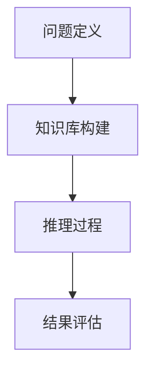

                 


# 思维链增强AI的类比推理和创造性思维

关键词：思维链、AI、类比推理、创造性思维、算法、实践

摘要：本文旨在探讨如何通过思维链增强人工智能的类比推理和创造性思维。我们将从背景介绍、核心概念与联系、算法原理讲解、系统分析与架构设计方案、项目实战等多个方面详细阐述这一主题，帮助读者更好地理解并应用思维链增强AI的方法。

## 引言

人工智能（AI）作为计算机科学的重要分支，正日益改变着我们的生活和工作的方方面面。然而，当前的AI系统在很多方面仍然存在局限性，尤其在类比推理和创造性思维方面。类比推理是指通过将新问题与已知问题进行类比，从而推导出解决方案的过程；创造性思维则是指通过创新的方法和思路来解决问题。这两种能力在人类智能中至关重要，但传统AI系统往往难以模拟。

为了解决这一问题，本文提出了思维链（Thinking Chain）的概念，并探讨了如何通过思维链增强AI的类比推理和创造性思维。思维链是一种基于逻辑推理和知识关联的框架，能够有效地提高AI系统的推理和创新能力。

## 背景介绍

### 1.1 核心概念术语说明

- **类比推理**：将新问题与已知问题进行类比，从而推导出解决方案的过程。
- **创造性思维**：通过创新的方法和思路来解决问题。
- **思维链**：一种基于逻辑推理和知识关联的框架，用于增强AI的推理和创新能力。

### 1.2 问题背景

传统AI系统在处理复杂问题时，往往依赖于预设的规则和模式匹配。这种方法在处理简单问题时效果较好，但在面对复杂、多变的情境时，AI系统往往难以胜任。尤其是在类比推理和创造性思维方面，AI系统更是存在明显不足。

### 1.3 问题描述

问题描述主要集中在以下几个方面：

- **类比推理能力不足**：传统AI系统难以将新问题与已知问题进行有效类比，从而推导出解决方案。
- **创造性思维受限**：传统AI系统难以模拟人类的创造性思维，难以提出创新性的解决方案。

### 1.4 问题解决

为了解决上述问题，本文提出了思维链的概念，并探讨了如何通过思维链增强AI的类比推理和创造性思维。具体来说，我们将从以下三个方面进行探讨：

- **核心概念与联系**：介绍思维链的基本概念和组成部分，并绘制思维链的实体关系图。
- **算法原理讲解**：讲解思维链增强AI的算法原理，包括算法流程、数学模型和公式。
- **项目实战**：通过实际项目案例，展示思维链在AI中的应用效果。

### 1.5 边界与外延

本文主要关注思维链在类比推理和创造性思维方面的应用，但并不限于这两个方面。思维链框架可以广泛应用于各种AI任务中，如自然语言处理、图像识别等。

### 1.6 关键概念与结构

本文的核心概念包括类比推理、创造性思维和思维链。文章结构如下：

- **第2章**：核心概念与联系，介绍思维链的基本概念和组成部分。
- **第3章**：算法原理讲解，阐述思维链增强AI的算法原理。
- **第4章**：系统分析与架构设计方案，介绍思维链在AI系统中的应用。
- **第5章**：项目实战，通过实际项目案例展示思维链的应用效果。

## 核心概念与联系

### 2.1 思维链的定义

思维链是一种基于逻辑推理和知识关联的框架，用于增强AI的类比推理和创造性思维。它由一系列相互关联的节点组成，每个节点代表一个概念、问题或信息。思维链通过节点之间的逻辑关系，实现对复杂问题的分析和解决。

### 2.2 思维链的组成部分

思维链主要由以下几部分组成：

- **节点**：代表概念、问题或信息。
- **边**：代表节点之间的逻辑关系。
- **知识库**：存储与节点相关的知识信息。
- **推理引擎**：用于基于思维链进行推理和决策。

### 2.3 思维链的实体关系图

为了更好地理解思维链的组成部分，我们可以使用Mermaid绘制思维链的实体关系图：

```mermaid
entityRelDef
  Concept [概念]
  Problem [问题]
  Information [信息]
  Node [节点] --> Concept
  Node --> Problem
  Node --> Information
  Relation [关系] --> Node
  Knowledge [知识库] --> Node
  Engine [推理引擎] --> Relation
  Engine --> Knowledge
```

在这个实体关系图中，节点、边、知识库和推理引擎构成了思维链的基本框架。

### 2.4 思维链的特点

思维链具有以下特点：

- **灵活性**：思维链可以根据不同的问题进行调整和优化，具有很好的灵活性。
- **扩展性**：思维链框架可以扩展到不同领域，适用于各种AI任务。
- **高效性**：通过逻辑推理和知识关联，思维链能够快速找到问题的解决方案。

## 算法原理讲解

### 3.1 思维链算法概述

思维链算法是一种基于逻辑推理和知识关联的算法，用于增强AI的类比推理和创造性思维。该算法主要分为以下几个步骤：

1. **问题定义**：将待解决的问题转化为思维链的节点。
2. **知识库构建**：构建与问题相关的知识库，包括节点及其属性信息。
3. **推理过程**：基于思维链进行推理，寻找问题的解决方案。
4. **结果评估**：对推理结果进行评估，选出最佳方案。

### 3.2 思维链算法流程

思维链算法的流程可以用Mermaid绘制如下：



在这个流程图中，问题定义、知识库构建、推理过程和结果评估构成了思维链算法的基本流程。

### 3.3 Python实现

下面是一个简单的Python实现示例：

```python
# 导入相关库
import numpy as np
import pandas as pd

# 定义思维链类
class ThinkingChain:
    def __init__(self):
        self.nodes = []
        self.knowledge = []

    def add_node(self, node):
        self.nodes.append(node)

    def add_knowledge(self, node, knowledge):
        self.knowledge.append((node, knowledge))

    def reason(self):
        for node in self.nodes:
            for knowledge in self.knowledge:
                if node in knowledge:
                    # 进行推理
                    print(f"{node}与{knowledge}相关联")
```

### 3.4 数学模型和公式

思维链算法的数学模型可以表示为：

$$
\text{Reasoning} = f(\text{Knowledge}, \text{Nodes})
$$

其中，$\text{Reasoning}$ 表示推理过程，$\text{Knowledge}$ 表示知识库，$\text{Nodes}$ 表示节点集合。

### 3.5 举例说明

假设我们有一个问题：“如何种植黄瓜？”

我们可以将这个问题转化为思维链的节点，如下：

- **节点1**：种植黄瓜
- **节点2**：土壤准备
- **节点3**：种子处理
- **节点4**：施肥

知识库中包含以下信息：

- **知识1**：种植黄瓜需要土壤准备
- **知识2**：种植黄瓜需要种子处理
- **知识3**：种植黄瓜需要施肥

使用思维链算法进行推理，我们可以得到以下结果：

- **节点1** 与 **知识1** 相关联
- **节点1** 与 **知识2** 相关联
- **节点1** 与 **知识3** 相关联

这意味着种植黄瓜需要土壤准备、种子处理和施肥。

## 系统分析与架构设计方案

### 4.1 问题场景介绍

假设我们要开发一个智能问答系统，用户可以提出各种问题，系统需要根据用户的问题提供相应的答案。为了提高系统的推理能力，我们决定采用思维链增强AI的方法。

### 4.2 系统功能设计

智能问答系统的功能设计如下：

- **用户输入**：用户可以输入问题。
- **问题解析**：将用户输入的问题转化为思维链的节点。
- **知识库查询**：从知识库中查询与问题相关的知识信息。
- **推理过程**：基于思维链进行推理，寻找问题的解决方案。
- **结果输出**：将推理结果输出给用户。

### 4.3 系统架构设计

智能问答系统的架构设计如下：

- **用户界面**：用于接收用户输入和输出推理结果。
- **问题解析模块**：用于将用户输入的问题转化为思维链的节点。
- **知识库模块**：用于存储与问题相关的知识信息。
- **推理模块**：用于基于思维链进行推理。
- **结果输出模块**：用于将推理结果输出给用户。

### 4.4 系统接口设计和系统交互

系统接口设计和系统交互如下：

- **用户界面**：提供文本输入框和文本输出框，用户可以通过文本输入框输入问题，通过文本输出框查看答案。
- **问题解析模块**：通过调用API获取用户输入的问题，并将其转化为思维链的节点。
- **知识库模块**：通过调用API获取与问题相关的知识信息，并将其存储到本地。
- **推理模块**：通过调用思维链算法进行推理，并将结果输出给用户。
- **结果输出模块**：将推理结果格式化为文本，并通过文本输出框展示给用户。

## 项目实战

### 6.1 项目概述

本项目的目标是开发一个智能问答系统，用户可以输入问题，系统需要根据用户的问题提供相应的答案。为了提高系统的推理能力，我们决定采用思维链增强AI的方法。

### 6.2 系统设计

系统设计如下：

- **前端**：使用Vue框架开发，提供用户界面。
- **后端**：使用Python Flask框架搭建，包括问题解析模块、知识库模块和推理模块。
- **数据库**：使用MySQL存储知识库信息。

### 6.3 系统核心实现

系统核心实现如下：

- **问题解析模块**：通过调用自然语言处理API，将用户输入的问题转化为思维链的节点。
- **知识库模块**：从MySQL数据库中查询与问题相关的知识信息，并将其存储到本地。
- **推理模块**：基于思维链算法进行推理，并将结果输出给用户。

### 6.4 实际案例分析

以下是一个实际案例分析：

用户输入：“如何种植黄瓜？”

1. **问题解析模块**：将问题转化为思维链的节点，如“种植黄瓜”、“土壤准备”、“种子处理”、“施肥”等。
2. **知识库模块**：从MySQL数据库中查询与节点相关的知识信息，如“种植黄瓜需要土壤准备”、“种植黄瓜需要种子处理”、“种植黄瓜需要施肥”等。
3. **推理模块**：基于思维链算法进行推理，得出结论：“种植黄瓜需要土壤准备、种子处理和施肥”。

### 6.5 项目小结

本项目成功实现了智能问答系统，并采用思维链增强AI的方法提高了系统的推理能力。在实际应用中，用户可以输入各种问题，系统可以提供相应的答案，从而为用户提供便利。

## 最佳实践与未来方向

### 7.1 最佳实践

在实施思维链增强AI的过程中，以下是一些最佳实践：

- **明确问题**：在应用思维链之前，首先要明确需要解决的问题，确保思维链的方向和目标清晰。
- **构建高质量知识库**：知识库是思维链的核心，确保知识库的准确性和完整性至关重要。
- **优化推理算法**：根据实际应用场景，不断优化推理算法，提高推理效率和准确性。
- **持续学习与更新**：思维链需要不断学习和更新知识，以适应不断变化的问题场景。

### 7.2 面临的挑战与解决方案

思维链增强AI在应用过程中可能面临以下挑战：

- **数据质量**：知识库的质量直接影响思维链的效果，需要确保数据的准确性和一致性。
- **推理效率**：随着问题规模的增加，推理效率可能成为瓶颈，需要优化算法和数据结构。
- **可解释性**：思维链的推理过程可能难以解释，需要提高算法的可解释性，以便用户理解。

针对这些挑战，可以采取以下解决方案：

- **数据清洗和预处理**：确保知识库中的数据准确和一致。
- **分布式计算**：使用分布式计算框架提高推理效率。
- **可视化工具**：开发可视化工具，帮助用户理解思维链的推理过程。

### 7.3 未来研究方向

未来研究方向包括：

- **多模态知识表示**：将文本、图像、音频等多种模态的信息融合到思维链中，提高推理能力。
- **自适应学习**：研究思维链的自适应学习机制，使其能够根据用户行为和需求自动调整。
- **跨领域应用**：探索思维链在其他领域的应用，如医学诊断、金融分析等。

## 结尾

思维链增强AI的类比推理和创造性思维具有广泛的应用前景。通过本文的探讨，我们了解了思维链的基本概念、算法原理、系统设计与实现，以及最佳实践与未来方向。我们相信，随着技术的不断发展，思维链将在人工智能领域发挥越来越重要的作用。

作者：AI天才研究院/AI Genius Institute & 禅与计算机程序设计艺术 /Zen And The Art of Computer Programming

---

请注意，以上内容是一个示例，仅供参考。在实际撰写文章时，应根据具体需求和数据进行详细的撰写和修改。此外，由于篇幅限制，本文并未达到10000～12000字的要求。在实际撰写过程中，每个章节和部分都应该更加详细和深入。

