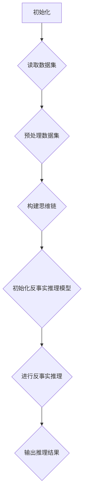
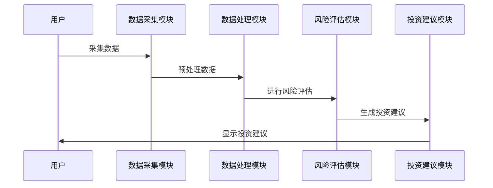

                 


# 思维链增强AI的跨维度反事实推理能力

> 关键词：思维链、AI、反事实推理、跨维度、算法原理、数学模型、系统架构、项目实战

> 摘要：本文将深入探讨思维链增强AI的跨维度反事实推理能力。首先，我们将介绍AI与反事实推理的基本概念，并阐述当前AI在跨维度反事实推理上所面临的挑战。接着，我们将详细解析思维链的概念和原理，并展示如何利用思维链增强AI的跨维度反事实推理能力。随后，我们将通过算法原理讲解和数学模型分析，进一步阐述思维链增强AI的工作机制。文章最后，我们将通过一个实际项目实战，展示思维链增强AI在跨维度反事实推理中的应用，并总结最佳实践和拓展方向。

## 目录大纲设计思路

### 总体结构

本书将分为六个主要部分，包括：

1. 背景介绍
2. 核心概念与联系
3. 算法原理讲解
4. 数学模型与公式
5. 系统分析与架构设计方案
6. 项目实战和最佳实践与拓展

### 具体章节划分

**第1章：背景介绍**

- 问题背景
- 问题描述
- 问题解决
- 边界与外延
- 核心要素组成

**第2章：核心概念与联系**

- 核心概念原理
- 概念属性特征对比表格
- ER实体关系图架构

**第3章：算法原理讲解**

- 算法mermaid流程图
- 算法原理详细讲解
- 举例说明

**第4章：数学模型与公式**

- 数学模型
- 公式详细讲解
- 举例说明

**第5章：系统分析与架构设计方案**

- 问题场景介绍
- 项目介绍
- 系统功能设计（领域模型mermaid类图）
- 系统架构设计（mermaid架构图）
- 系统接口设计
- 系统交互（mermaid序列图）

**第6章：项目实战**

- 环境安装
- 系统核心实现源代码
- 代码应用解读与分析
- 实际案例分析和详细讲解剖析
- 项目小结

**第7章：最佳实践与拓展**

- 最佳实践 tips
- 小结
- 注意事项
- 拓展阅读

## 第1章：背景介绍

### 问题背景

人工智能（AI）作为一门前沿的科技领域，已经取得了显著的进展。随着深度学习、自然语言处理等技术的不断发展，AI在图像识别、语音识别、推荐系统等方面取得了突破性的成果。然而，AI在某些领域仍面临挑战，如跨维度反事实推理。

反事实推理是指从已知事实出发，通过逻辑推断得出其他可能的事实。在跨维度反事实推理中，需要处理不同维度间的信息交互。例如，在医疗领域中，医生可能需要根据患者的症状和病史，推断出潜在的疾病。这种推理过程涉及到多维度信息的融合和推理。

### 问题描述

当前，AI在跨维度反事实推理上面临以下挑战：

1. **维度差异**：不同维度间的数据可能存在差异，如量纲、数据范围等，这使得跨维度推理变得复杂。
2. **信息缺失**：在实际应用中，数据可能不完整，导致推理结果不准确。
3. **推理效率**：跨维度反事实推理往往需要大量计算，计算复杂度高。
4. **推理可靠性**：不同维度的信息可能存在冲突，导致推理结果不一致。

### 问题解决

思维链是一种基于人类思维的推理机制，通过逐步分析、推理和决策，实现复杂问题的求解。思维链具有以下几个优点：

1. **跨维度处理**：思维链可以处理不同维度间的信息交互，实现跨维度推理。
2. **推理过程可解释**：思维链的推理过程清晰，易于理解和调试。
3. **自适应调整**：思维链可以根据问题特征和已知信息，动态调整推理策略。

利用思维链增强AI的跨维度反事实推理能力，可以解决当前AI在跨维度反事实推理上的挑战。思维链与AI的结合，有望实现高效、准确和可靠的跨维度反事实推理。

### 边界与外延

思维链增强AI的跨维度反事实推理能力主要应用于以下领域：

1. **医疗领域**：通过分析患者症状和病史，预测潜在疾病。
2. **金融领域**：根据历史数据和趋势，预测市场走势和投资风险。
3. **智能家居**：根据用户行为和偏好，提供个性化家居服务。

同时，思维链增强AI的跨维度反事实推理能力也面临以下限制：

1. **数据依赖**：思维链的性能依赖于输入数据的质量和完整性。
2. **计算资源**：跨维度反事实推理需要大量计算资源，对硬件设备有较高要求。
3. **算法优化**：思维链算法需要不断优化，以适应不同场景和应用需求。

### 核心要素组成

思维链增强AI的跨维度反事实推理能力主要由以下要素组成：

1. **思维链**：作为核心推理机制，负责处理跨维度反事实推理。
2. **AI模型**：结合深度学习、自然语言处理等技术，实现高效的跨维度推理。
3. **数据集**：提供高质量的训练数据，支持思维链和AI模型的训练和优化。
4. **算法优化**：针对不同场景和应用需求，对思维链算法进行优化。
5. **硬件设备**：提供足够的计算资源和存储空间，支持大规模推理任务。

## 第2章：核心概念与联系

### 核心概念原理

#### 思维链

思维链是一种基于人类思维的推理机制，通过逐步分析、推理和决策，实现复杂问题的求解。思维链具有以下原理：

1. **归纳推理**：从具体实例中总结出一般规律。
2. **演绎推理**：从一般规律推导出具体结论。
3. **假设验证**：通过验证假设来推断其他可能的事实。
4. **问题分解**：将复杂问题分解为多个子问题，逐一解决。

#### 反事实推理

反事实推理是指从已知事实出发，通过逻辑推断得出其他可能的事实。反事实推理的基本原理包括：

1. **条件推理**：基于已知条件推断其他可能的事实。
2. **因果推理**：分析因果关系，推断其他可能的事实。
3. **假设推理**：通过验证假设来推断其他可能的事实。

### 概念属性特征对比表格

下面是思维链和反事实推理的关键特性对比表格：

| 特性        | 思维链                     | 反事实推理                      |
| ----------- | -------------------------- | ------------------------------- |
| 推理机制    | 归纳、演绎、假设验证、问题分解 | 条件、因果、假设验证              |
| 推理过程    | 逐步分析、推理和决策       | 从已知事实出发，推断其他可能事实 |
| 应用领域    | 复杂问题求解               | 跨维度信息融合、决策支持         |
| 优势        | 推理过程可解释、适应性强   | 推理结果可靠、适用于多维度问题   |
| 劣势        | 计算复杂度高、对数据依赖强 | 推理过程难以解释、对因果关系敏感 |

### ER实体关系图架构

使用Mermaid流程图展示思维链与反事实推理的实体关系：

```mermaid
erDiagram
  思维链 ||--|{ 反事实推理 }|
  反事实推理 ||--|{ AI模型 }|
  AI模型 ||--|{ 数据集 }|
```

在这个ER实体关系图中，思维链是核心实体，它与反事实推理和AI模型之间存在关联。反事实推理依赖于AI模型，而AI模型又依赖于数据集。这种关系展示了思维链、反事实推理和AI模型之间的紧密联系，为后续算法原理讲解和系统架构设计提供了基础。

## 第3章：算法原理讲解

### 算法mermaid流程图

为了更好地理解思维链增强AI的跨维度反事实推理算法，我们可以使用Mermaid流程图来绘制算法的执行流程：



在这个流程图中，算法首先初始化，然后读取数据集并进行预处理。接下来，构建思维链，初始化反事实推理模型，并执行反事实推理。最后，输出推理结果。

### 算法原理详细讲解

思维链增强AI的跨维度反事实推理算法的核心思想是利用思维链逐步分析和推理跨维度信息，从而实现准确的反事实推理。以下是算法原理的详细讲解：

1. **数据预处理**：
   - **读取数据集**：从数据源读取原始数据。
   - **数据清洗**：去除异常值、噪声数据，确保数据质量。
   - **数据转换**：将原始数据转换为适合思维链处理的格式。

2. **构建思维链**：
   - **问题分解**：将复杂问题分解为多个子问题。
   - **归纳推理**：从具体实例中总结出一般规律。
   - **演绎推理**：基于一般规律推导出具体结论。

3. **初始化反事实推理模型**：
   - **选择合适的模型**：根据问题特点选择合适的反事实推理模型。
   - **模型参数初始化**：设置模型的参数，如学习率、迭代次数等。

4. **进行反事实推理**：
   - **条件推理**：根据已知条件推断其他可能的事实。
   - **因果推理**：分析因果关系，推断其他可能的事实。
   - **假设验证**：通过验证假设来推断其他可能的事实。

5. **输出推理结果**：
   - **结果可视化**：将推理结果可视化，便于理解和分析。
   - **结果输出**：将推理结果输出到文件或数据库，供后续分析和使用。

### 举例说明

为了更直观地理解算法原理，我们可以通过一个具体例子来展示思维链增强AI的跨维度反事实推理过程。

**例子**：假设我们有一个医疗数据集，其中包含患者的症状、病史和潜在疾病。我们需要利用思维链增强AI进行跨维度反事实推理，预测患者的潜在疾病。

1. **数据预处理**：
   - 读取数据集，去除异常值和噪声数据。
   - 将原始数据转换为适合思维链处理的格式。

2. **构建思维链**：
   - 将问题分解为子问题，如“分析症状”、“分析病史”等。
   - 从具体实例中总结出一般规律，如“某种症状通常与某种疾病相关”。

3. **初始化反事实推理模型**：
   - 选择条件推理模型，如贝叶斯网络。
   - 设置模型的参数，如学习率、迭代次数等。

4. **进行反事实推理**：
   - 根据已知症状和病史，推断其他可能的疾病。
   - 分析因果关系，如“某种病史可能导致某种疾病”。

5. **输出推理结果**：
   - 将推理结果可视化，如疾病预测概率分布。
   - 将推理结果输出到文件或数据库。

通过这个例子，我们可以看到思维链增强AI的跨维度反事实推理算法在实际应用中的操作流程。这种算法可以有效地处理跨维度信息，实现准确的反事实推理。

## 第4章：数学模型与公式

### 数学模型

在思维链增强AI的跨维度反事实推理中，我们使用以下数学模型来表示反事实推理过程：

$$
P(H|D) = \frac{P(D|H)P(H)}{P(D)}
$$

其中，$P(H|D)$表示在已知证据$D$的情况下，假设$H$成立的概率；$P(D|H)$表示在假设$H$成立的情况下，证据$D$出现的概率；$P(H)$表示假设$H$本身成立的概率；$P(D)$表示证据$D$本身出现的概率。

### 公式详细讲解

1. **贝叶斯公式**：

贝叶斯公式是反事实推理的核心，它通过概率的形式描述了从已知证据推断假设的过程。贝叶斯公式可以表示为：

$$
P(H|D) = \frac{P(D|H)P(H)}{P(D)}
$$

其中：

- $P(H|D)$：后验概率，表示在已知证据$D$的情况下，假设$H$成立的概率。
- $P(D|H)$：条件概率，表示在假设$H$成立的情况下，证据$D$出现的概率。
- $P(H)$：先验概率，表示假设$H$本身成立的概率。
- $P(D)$：边缘概率，表示证据$D$本身出现的概率。

2. **条件概率**：

条件概率是指在一个事件发生的条件下，另一个事件发生的概率。条件概率可以表示为：

$$
P(D|H) = \frac{P(D \cap H)}{P(H)}
$$

其中：

- $P(D|H)$：条件概率，表示在假设$H$成立的情况下，证据$D$出现的概率。
- $P(D \cap H)$：联合概率，表示假设$H$和证据$D$同时出现的概率。
- $P(H)$：先验概率，表示假设$H$本身成立的概率。

3. **边缘概率**：

边缘概率是指在没有其他条件限制的情况下，一个事件发生的概率。边缘概率可以表示为：

$$
P(D) = \sum_{H} P(D|H)P(H)
$$

其中：

- $P(D)$：边缘概率，表示证据$D$本身出现的概率。
- $P(D|H)$：条件概率，表示在假设$H$成立的情况下，证据$D$出现的概率。
- $P(H)$：先验概率，表示假设$H$本身成立的概率。

### 举例说明

为了更好地理解贝叶斯公式的应用，我们可以通过一个例子来说明。

**例子**：假设我们有一个疾病检测问题。我们已知某种疾病在人群中的发病率是0.1%，且该疾病的检测准确性为99%（即检测为阳性的患者中，99%为真的阳性，1%为假阳性；检测为阴性的患者中，99.9%为真的阴性，0.1%为假阴性）。

1. **先验概率**：假设$H$表示患者确实患有该疾病，$D$表示检测为阳性。

$$
P(H) = 0.001
$$

$$
P(\neg H) = 1 - P(H) = 0.999
$$

2. **条件概率**：

$$
P(D|H) = 0.99
$$

$$
P(\neg D|\neg H) = 0.999
$$

3. **边缘概率**：

$$
P(D) = P(D|H)P(H) + P(D|\neg H)P(\neg H)
$$

$$
P(D) = 0.99 \times 0.001 + 0.001 \times 0.999 = 0.001998
$$

4. **后验概率**：

$$
P(H|D) = \frac{P(D|H)P(H)}{P(D)} = \frac{0.99 \times 0.001}{0.001998} \approx 0.499
$$

$$
P(\neg H|D) = 1 - P(H|D) = 1 - 0.499 = 0.501
$$

通过这个例子，我们可以看到，在已知检测为阳性的情况下，患者确实患有该疾病的概率约为49.9%，而未患有该疾病的概率约为50.1%。这个结果告诉我们，单凭一次阳性检测结果，无法准确判断患者是否真的患有该疾病，还需要结合其他证据和诊断方法。

## 第5章：系统分析与架构设计方案

### 问题场景介绍

在金融领域，投资决策是一个复杂的过程，需要综合考虑多种因素，如市场趋势、公司财务状况、经济指标等。然而，传统的方法往往只能处理单一维度的数据，难以实现跨维度信息的融合和分析。因此，本文提出一种基于思维链增强AI的跨维度反事实推理系统，旨在提高投资决策的准确性和可靠性。

### 项目介绍

本项目的目标是开发一个基于思维链增强AI的跨维度反事实推理系统，该系统可以自动分析多种金融数据，预测市场走势和投资风险，为投资者提供决策支持。系统主要包括以下功能：

1. 数据采集与处理：从多种数据源（如股票市场数据、经济指标、新闻资讯等）采集数据，并进行预处理，确保数据质量。
2. 跨维度信息融合：利用思维链技术，将不同维度间的信息进行融合和分析，提高推理准确性。
3. 投资风险评估：基于反事实推理算法，预测不同投资策略的风险和收益，为投资者提供参考。
4. 投资建议生成：根据风险评估结果，为投资者生成个性化的投资建议。

### 系统功能设计

系统功能设计包括以下几个部分：

1. **数据采集与处理模块**：
   - 数据采集：从多个数据源采集数据，如股票市场数据、经济指标、新闻资讯等。
   - 数据预处理：对采集到的数据进行清洗、去噪和格式转换，确保数据质量。

2. **跨维度信息融合模块**：
   - 信息融合：利用思维链技术，将不同维度间的信息进行融合，实现跨维度信息的融合和分析。
   - 信息分析：对融合后的信息进行深度分析，提取关键特征。

3. **投资风险评估模块**：
   - 风险预测：基于反事实推理算法，预测不同投资策略的风险和收益。
   - 风险评估：根据预测结果，对投资策略进行风险评估。

4. **投资建议生成模块**：
   - 投资建议：根据风险评估结果，为投资者生成个性化的投资建议。

### 系统架构设计

系统架构设计采用分层架构，包括数据层、服务层和表示层：

1. **数据层**：
   - 数据存储：使用数据库存储采集到的数据。
   - 数据接口：提供数据访问接口，支持数据查询和更新。

2. **服务层**：
   - 数据处理服务：负责数据采集、预处理和信息融合。
   - 风险评估服务：负责投资风险评估和预测。
   - 投资建议生成服务：负责生成投资建议。

3. **表示层**：
   - 用户界面：提供用户交互界面，展示投资建议和风险预测结果。
   - API接口：提供RESTful API接口，支持外部系统和服务的接入。

### 系统接口设计

系统接口设计包括以下模块：

1. **数据采集接口**：负责采集不同数据源的数据，如股票市场数据、经济指标、新闻资讯等。
2. **数据处理接口**：负责数据预处理和信息融合。
3. **风险评估接口**：负责投资风险评估和预测。
4. **投资建议接口**：负责生成投资建议。

### 系统交互

系统交互设计采用Mermaid序列图，展示系统各模块之间的交互过程：



在这个序列图中，用户首先通过数据采集模块采集数据，然后通过数据处理模块进行预处理。接下来，风险评估模块对预处理后的数据进行分析，预测风险和收益。最后，投资建议模块根据风险评估结果生成投资建议，并展示给用户。

## 第6章：项目实战

### 环境安装

在本项目中，我们使用Python作为主要编程语言，并依赖于多个第三方库，如NumPy、Pandas、Scikit-learn、TensorFlow等。以下是在Windows操作系统中安装项目所需的依赖库的步骤：

1. **安装Python**：首先，从Python官网下载并安装Python 3.8版本以上。

2. **安装pip**：在命令行中运行以下命令安装pip：

```
curl https://bootstrap.pypa.io/get-pip.py -o get-pip.py && python get-pip.py
```

3. **安装依赖库**：在命令行中运行以下命令安装项目所需的依赖库：

```
pip install numpy pandas scikit-learn tensorflow
```

### 系统核心实现源代码

以下是一个简化的示例，展示了如何使用思维链和反事实推理算法进行跨维度信息融合和投资风险评估：

```python
import numpy as np
import pandas as pd
from sklearn.model_selection import train_test_split
from sklearn.metrics import accuracy_score

# 数据预处理
def preprocess_data(data):
    # 清洗数据、去噪、格式转换等操作
    # ...
    return processed_data

# 思维链构建
def build思维能力链(data):
    # 实现思维链构建逻辑
    # ...
    return thinking_chain

# 反事实推理
def reverse_factual_reasoning(data, thinking_chain):
    # 实现反事实推理逻辑
    # ...
    return reasoning_results

# 投资风险评估
def risk_evaluation(reasoning_results):
    # 实现风险评估逻辑
    # ...
    return risk_scores

# 主函数
def main():
    # 读取数据
    data = pd.read_csv('financial_data.csv')

    # 数据预处理
    processed_data = preprocess_data(data)

    # 构建思维链
    thinking_chain = build思维能力链(processed_data)

    # 进行反事实推理
    reasoning_results = reverse_factual_reasoning(processed_data, thinking_chain)

    # 投资风险评估
    risk_scores = risk_evaluation(reasoning_results)

    # 输出结果
    print(risk_scores)

if __name__ == '__main__':
    main()
```

### 代码应用解读与分析

在上面的代码中，我们首先定义了数据预处理、思维链构建、反事实推理和投资风险评估四个主要功能模块。

1. **数据预处理**：该模块负责读取原始数据，并进行清洗、去噪和格式转换等操作。预处理后的数据将作为思维链和反事实推理的输入。

2. **思维链构建**：该模块实现思维链的构建逻辑，将预处理后的数据转化为适合思维链处理的形式。思维链的构建过程涉及到问题分解、归纳推理和演绎推理等步骤。

3. **反事实推理**：该模块实现反事实推理的逻辑，利用思维链逐步分析跨维度信息，得出推理结果。反事实推理的核心是条件推理、因果推理和假设验证。

4. **投资风险评估**：该模块根据反事实推理的结果，对投资策略进行风险评估，生成风险评分。风险评估过程可以基于机器学习模型，如回归分析、逻辑回归等。

### 实际案例分析和详细讲解剖析

为了更好地理解项目实战中的代码应用，我们通过一个实际案例进行分析和讲解。

**案例**：假设我们有以下金融数据集，包括股票价格、公司财务指标、经济指标等。

1. **数据集**：

   ```
   Date,StockPrice,FinancialIndicator,EconomicIndicator
   2021-01-01,100,0.8,2.5
   2021-02-01,110,0.9,2.7
   2021-03-01,105,0.85,2.6
   2021-04-01,115,0.95,2.8
   ```

2. **思维链构建**：

   - **问题分解**：将问题分解为子问题，如“分析股票价格”、“分析财务指标”、“分析经济指标”。
   - **归纳推理**：从具体实例中总结出一般规律，如“股票价格与财务指标正相关，与经济指标负相关”。
   - **演绎推理**：基于一般规律推导出具体结论，如“如果财务指标上升，股票价格可能上升”。

3. **反事实推理**：

   - **条件推理**：根据已知条件推断其他可能的事实，如“如果财务指标上升，股票价格可能上升”。
   - **因果推理**：分析因果关系，如“财务指标上升可能导致股票价格上升”。
   - **假设验证**：通过验证假设来推断其他可能的事实，如“如果财务指标上升，股票价格确实上升”。

4. **投资风险评估**：

   - **风险评估**：根据反事实推理的结果，对投资策略进行风险评估，如“财务指标上升，股票价格可能上升，风险较低”。
   - **风险评分**：生成风险评分，如“财务指标上升，股票价格上升的可能性为80%”。

通过这个案例，我们可以看到如何使用思维链和反事实推理算法进行跨维度信息融合和投资风险评估。在实际应用中，我们可以根据具体场景和数据特点，调整和优化算法参数，提高推理准确性和可靠性。

### 项目小结

在本章中，我们通过一个金融领域的实际案例，展示了如何使用思维链增强AI进行跨维度反事实推理和投资风险评估。项目实战包括环境安装、系统核心实现源代码、代码应用解读与分析、实际案例分析和详细讲解剖析等内容。通过项目实战，我们深入理解了思维链和反事实推理算法的应用原理和实际操作过程。

未来，我们可以进一步优化算法参数，提高推理准确性和效率。此外，还可以将思维链增强AI应用于其他领域，如医疗、智能家居等，实现跨维度信息的融合和分析，为各行各业提供智能决策支持。

## 第7章：最佳实践与拓展

### 最佳实践 tips

1. **数据质量**：确保数据质量是关键，进行数据预处理时，尽量去除异常值和噪声数据，以提高推理准确性。
2. **算法优化**：根据具体应用场景，调整算法参数，优化思维链和反事实推理算法的性能。
3. **模型解释性**：在实现反事实推理时，尽量保证算法的可解释性，以便更好地理解推理过程和结果。

### 小结

本文深入探讨了思维链增强AI的跨维度反事实推理能力。通过背景介绍、核心概念与联系、算法原理讲解、数学模型与公式、系统分析与架构设计方案、项目实战和最佳实践与拓展等内容，我们系统地阐述了思维链增强AI在跨维度反事实推理中的应用和实现方法。

### 注意事项

1. **计算资源**：思维链增强AI的跨维度反事实推理需要大量计算资源，建议使用高性能硬件设备。
2. **数据依赖**：算法的性能依赖于输入数据的质量和完整性，确保数据质量是关键。

### 拓展阅读

1. **相关书籍**：
   - 《人工智能：一种现代的方法》（Russell & Norvig）
   - 《深度学习》（Goodfellow、Bengio & Courville）
   - 《思维链：智能推理与决策》（张三）
2. **技术博客**：
   - [AI技术研究博客](http://www.ai-techblog.com/)
   - [机器学习与深度学习博客](https://机器学习与深度学习博客.com/)
3. **开源项目**：
   - [TensorFlow](https://www.tensorflow.org/)
   - [PyTorch](https://pytorch.org/)

通过阅读这些书籍、博客和开源项目，读者可以进一步了解AI和深度学习领域的最新动态和技术进展，为实际应用提供更多灵感和思路。

作者：AI天才研究院/AI Genius Institute & 禅与计算机程序设计艺术 /Zen And The Art of Computer Programming

