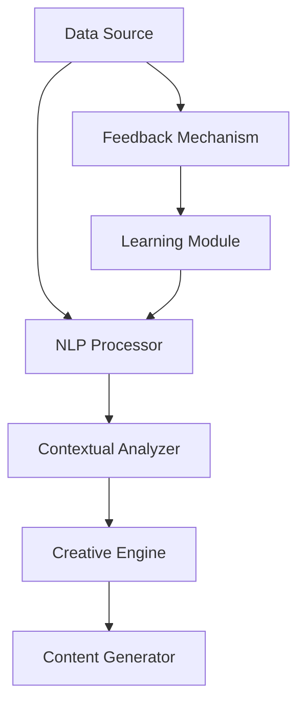
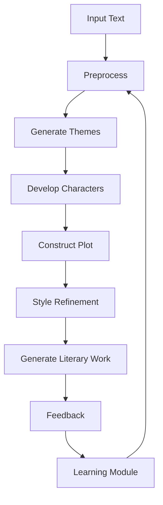
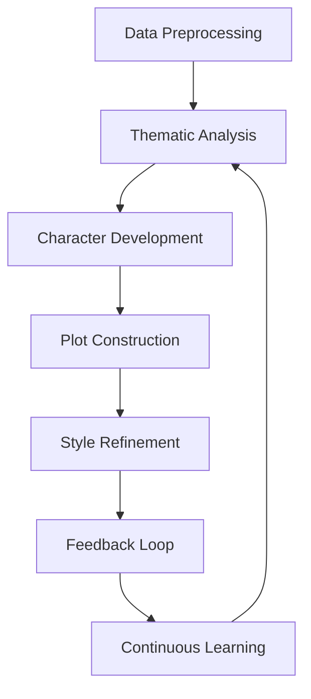
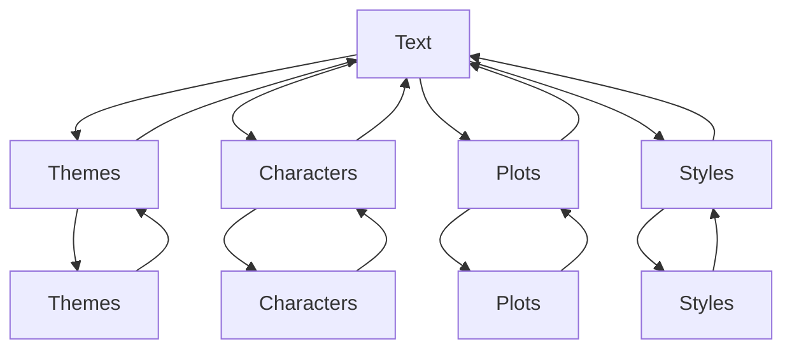
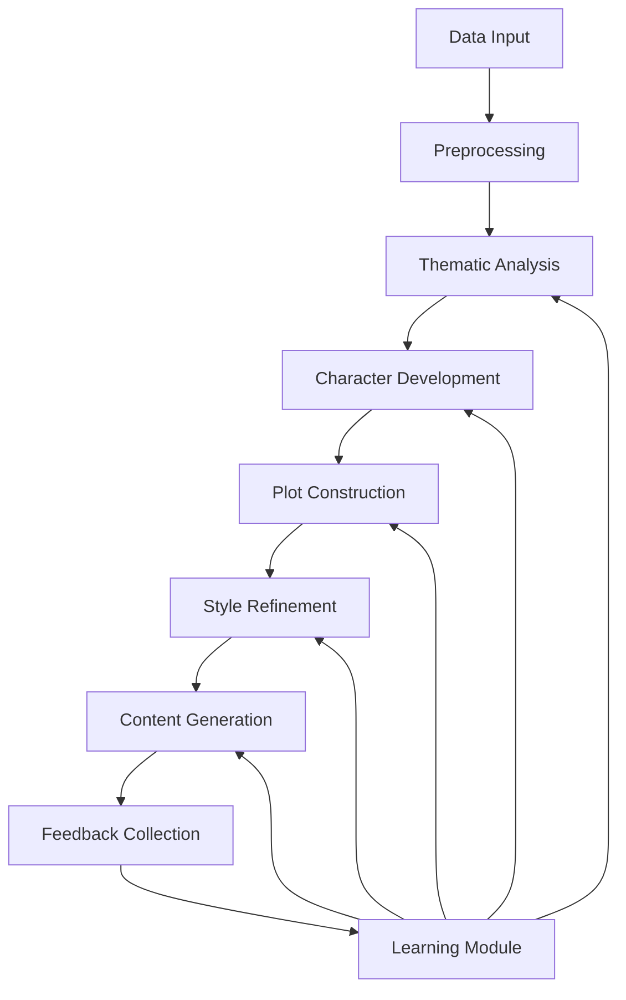
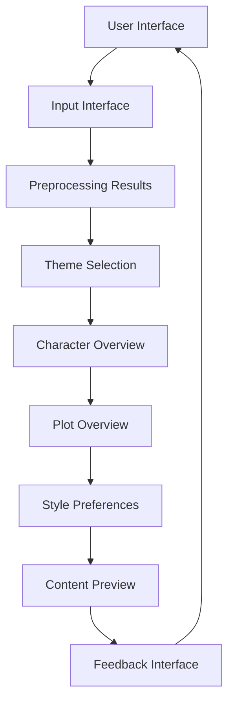
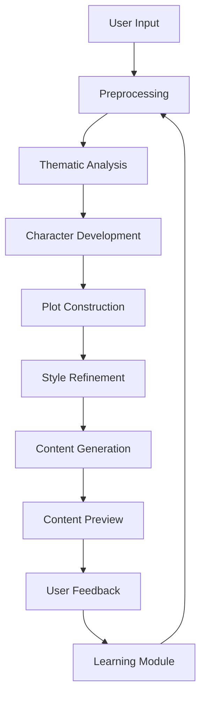
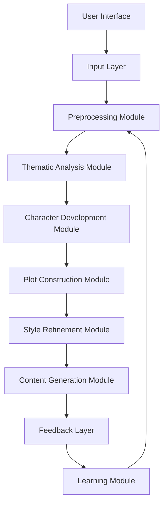
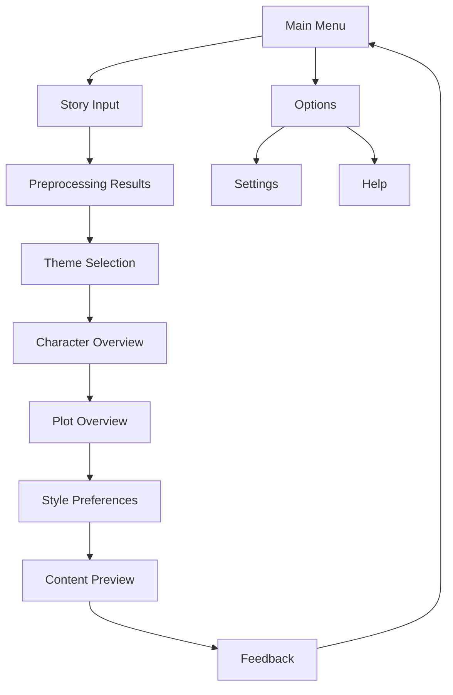
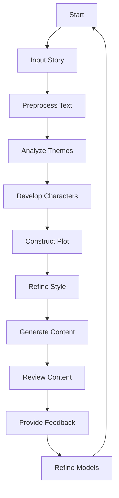

                 

### Introduction to the Concept of Thinking Chain Enhanced AI in Literary Creation

The advent of artificial intelligence (AI) has ushered in an era of unprecedented innovation across various domains, including the realm of literary creation. Traditional AI, with its roots in pattern recognition and data analysis, has demonstrated remarkable capabilities in generating content, ranging from news articles and scientific papers to creative prose. However, these systems often lack the nuanced understanding and creativity that define human-written literature. This limitation has sparked a burgeoning field of research aimed at enhancing AI’s literary capabilities through the integration of advanced cognitive models and algorithmic innovations. At the forefront of this development is the concept of a "Thinking Chain Enhanced AI."

### Understanding the Problem of Literary Creation in AI

The challenge of AI-generated literature primarily revolves around the ability to produce content that resonates with the emotional and intellectual depth found in human writing. Traditional AI systems are typically grounded in machine learning models that excel at predicting patterns within large datasets. While this is a powerful tool, it often falls short when it comes to the intricacies of storytelling and character development that require a deeper understanding of context and subtlety. The limitations can be summarized as follows:

1. **Surface-Level Understanding**: AI often generates content that is factually correct but lacks the emotional and contextual layers that give life to human narratives.
2. **Lack of Originality**: AI systems struggle with creating genuinely original works, often recycling existing patterns and structures without adding new insights or perspectives.
3. **Inability to Simulate Human Creativity**: Human writers bring a wealth of experiences, emotions, and cultural context to their work, which is difficult for AI to replicate.

### The Need for Thinking Chain Enhanced AI

To overcome these limitations, the concept of a "Thinking Chain Enhanced AI" emerges as a promising solution. This approach is designed to imbue AI systems with a more sophisticated cognitive framework that can simulate higher-order thinking processes. By integrating advanced algorithms, natural language processing (NLP), and machine learning techniques, Thinking Chain Enhanced AI aims to:

1. **Deepen Contextual Understanding**: Improve the AI's ability to grasp the subtleties of language and context, enabling more emotionally resonant and contextually accurate content.
2. **Enhance Creativity**: Foster the generation of original, imaginative works by leveraging the AI's ability to process vast amounts of data and identify novel connections.
3. **Simulate Human-like Decision Making**: Enable AI systems to make creative decisions, such as plot twists and character development, akin to those made by human writers.

### Boundaries and Extensions of Literary AI

While the potential of Thinking Chain Enhanced AI is vast, it is crucial to acknowledge its boundaries and extensions. The following points highlight the scope and limitations of this technology in the context of literary creation:

1. **Boundary of Current Technology**: Despite advancements, AI remains a tool that cannot fully replicate human creativity and emotional depth. The essence of human experience and individual perspective is inherently difficult to codify.
2. **Potential for Evolution**: The integration of advanced AI techniques, such as deep learning and reinforcement learning, holds the promise of continually expanding the capabilities of AI in literary creation.
3. **Impact on Human Writers**: While AI-generated literature is an exciting development, it also raises questions about the future role of human writers. Will AI become a co-creator, an assistant, or a competitor?

### Introduction to Key Algorithms and Models

To fully grasp the concept of Thinking Chain Enhanced AI in literary creation, it is essential to delve into the core algorithms and models that underpin this approach. This section will provide an overview of the key components that make up this innovative framework, setting the stage for a deeper exploration in subsequent chapters.

First and foremost, we need to understand the foundational algorithms that enable AI to process and generate human-like text. These include:

1. **Recurrent Neural Networks (RNNs)**: RNNs are a class of neural networks designed to handle sequential data. They are particularly well-suited for language processing tasks due to their ability to retain information from previous inputs. A common example of an RNN is the Long Short-Term Memory (LSTM) network, which addresses the vanishing gradient problem that plagues traditional RNNs.
2. **Transformers and Attention Mechanisms**: Introduced by Vaswani et al. in 2017, transformers have revolutionized the field of NLP. Unlike RNNs, transformers use self-attention mechanisms to weigh the importance of different words in the input sequence, allowing for more efficient and contextually aware text generation.
3. **Generative Adversarial Networks (GANs)**: GANs are a class of deep learning models composed of two neural networks—the generator and the discriminator. The generator creates text samples, while the discriminator evaluates their plausibility. Through this adversarial process, GANs can generate highly realistic and creative text outputs.

Building on these foundational algorithms, Thinking Chain Enhanced AI introduces several advanced models designed to enhance the AI's cognitive capabilities. These include:

1. **Multimodal Fusion Models**: These models are designed to integrate information from multiple modalities, such as text, images, and audio, to create a more comprehensive and contextually aware representation of the world. This enables the AI to generate more coherent and emotionally resonant content.
2. **Reinforcement Learning Models**: Reinforcement learning (RL) is a type of machine learning where an agent learns to make decisions by receiving feedback in the form of rewards or penalties. By employing RL techniques, Thinking Chain Enhanced AI can learn to create text that adheres to specific storytelling goals, such as generating a suspenseful plot or developing a compelling character arc.
3. **Transfer Learning and Pre-Trained Models**: Models like GPT-3 (OpenAI) and BERT (Google) have paved the way for transfer learning, where a pre-trained model is fine-tuned on a specific task. This approach allows Thinking Chain Enhanced AI to leverage the knowledge gained from vast amounts of unlabeled text data, significantly improving its performance in literary creation tasks.

In summary, the integration of these advanced algorithms and models forms the backbone of Thinking Chain Enhanced AI. By combining the strengths of RNNs, transformers, GANs, multimodal fusion, reinforcement learning, and transfer learning, this approach aims to push the boundaries of AI-generated literature, enabling the creation of more nuanced, original, and emotionally engaging content.

### Background and Basic Concepts of AI in Literary Creation

#### The Evolution of AI in Creative Fields

The journey of artificial intelligence (AI) in the creative realm is a fascinating one, marked by significant advancements and evolving methodologies. AI's foray into the literary world began with the development of simple rule-based systems designed to generate short, predictable text. Early examples include the "Eliza" program, created in the 1960s, which simulated conversation with a user by using a set of predefined rules to generate responses. However, these early systems were limited in their ability to produce coherent, contextually rich, and original literary works.

As computing power and algorithmic sophistication improved, AI's capabilities in literary creation expanded dramatically. The advent of machine learning (ML) and natural language processing (NLP) techniques paved the way for more sophisticated models capable of generating complex text. Key milestones include the introduction of recurrent neural networks (RNNs), particularly Long Short-Term Memory (LSTM) networks, which could better handle the sequential nature of language. This allowed AI to produce more coherent and contextually appropriate text.

In the mid-2010s, the rise of transformers and attention mechanisms, exemplified by models like Google's BERT and OpenAI's GPT, marked another significant leap. Transformers introduced a novel approach to processing text, leveraging parallel processing and attention mechanisms to improve the model's ability to understand and generate human-like text. These advancements enabled AI to achieve a new level of sophistication, capable of producing lengthy, engaging stories and articles with remarkable coherence and creativity.

#### Key Techniques in AI Literary Creation

1. **Recurrent Neural Networks (RNNs)**: RNNs are a class of neural networks designed to handle sequential data. They are particularly suited for language processing tasks due to their ability to retain information from previous inputs. One of the most significant challenges RNNs face is the vanishing gradient problem, which limits their ability to capture long-term dependencies in the text. To overcome this, Long Short-Term Memory (LSTM) networks were introduced. LSTMs use specialized memory cells to store information over long sequences, enabling them to learn and generate text with greater coherence and context.

2. **Transformers and Attention Mechanisms**: Transformers revolutionized the field of NLP by introducing self-attention mechanisms that allow the model to weigh the importance of different words in the input sequence. This attention mechanism enables the model to focus on relevant parts of the text when generating output, leading to more contextually appropriate and creative text generation. Models like GPT-3 and T5 are based on transformers and have demonstrated exceptional performance in various NLP tasks, including literary creation.

3. **Generative Adversarial Networks (GANs)**: GANs are a class of deep learning models that consist of two neural networks— the generator and the discriminator. The generator creates text samples, while the discriminator evaluates their plausibility. Through an adversarial process, GANs can generate highly realistic and creative text outputs. This approach has been particularly useful in generating original stories and poems, as it allows the model to explore a wide range of text possibilities.

4. **Multimodal Fusion Models**: These models are designed to integrate information from multiple modalities, such as text, images, and audio. By combining inputs from different modalities, multimodal fusion models can create a more comprehensive and contextually aware representation of the world. This enables the generation of more engaging and immersive literary works.

5. **Reinforcement Learning (RL)**: Reinforcement learning is a type of machine learning where an agent learns to make decisions by receiving feedback in the form of rewards or penalties. In the context of literary creation, RL can be used to train models to generate text that adheres to specific storytelling goals, such as maintaining suspense or developing compelling character arcs.

6. **Transfer Learning**: Transfer learning is a technique where a pre-trained model is fine-tuned on a specific task using a smaller dataset. Pre-trained models like GPT-3 and BERT have been trained on vast amounts of unlabeled text data, enabling them to generate high-quality text when fine-tuned for specific literary tasks.

#### Challenges and Limitations

Despite these advancements, AI in literary creation faces several challenges and limitations. One major challenge is the lack of true creativity and emotional depth. While AI can generate text that is grammatically correct and contextually appropriate, it often lacks the nuanced understanding and emotional resonance that define human-written literature. AI systems struggle with generating original ideas and creating characters and plots that resonate on a deeper level.

Another limitation is the issue of context understanding. AI models, even the most advanced ones, often operate at a surface level, failing to capture the deeper contextual and emotional nuances that give life to human narratives. This can result in text that is factually accurate but lacks the depth and complexity of human storytelling.

Additionally, the ability of AI to simulate human-like creativity and decision-making processes is still limited. While AI can generate text based on patterns and data, it lacks the subjective experiences, cultural context, and individual perspective that human writers bring to their work. This limitation makes it difficult for AI to fully replicate the creativity and emotional depth found in human-written literature.

### Current Applications and Future Directions

Currently, AI is being used in various applications within the literary field, including content generation, story creation, and translation. Content generation tools like GPT-3 can be used to automate blog posts, articles, and even books, saving time and resources for writers. Story creation tools, such as GPT-2 and GPT-3, can generate original stories, poems, and narratives, providing writers with inspiration and ideas. Translation tools like Google Translate and DeepL utilize advanced NLP techniques to convert text from one language to another with high accuracy and fluency.

Looking towards the future, the integration of advanced AI techniques, such as multimodal fusion and reinforcement learning, holds the promise of further enhancing AI's literary capabilities. These techniques could enable AI to generate more nuanced, emotionally resonant, and contextually aware literary works. Additionally, the development of more sophisticated models and algorithms will likely push the boundaries of what AI can achieve in the literary realm.

In conclusion, while AI in literary creation has come a long way, there are still significant challenges and limitations to overcome. By continuing to innovate and develop new techniques, we can look forward to a future where AI becomes an indispensable tool for writers, capable of generating high-quality, original, and emotionally engaging literary works.

### Core Concepts and Relationships in Thinking Chain Enhanced AI

To fully grasp the capabilities and potential of Thinking Chain Enhanced AI (TCE-AI) in literary creation, it is crucial to delve into the core concepts and relationships that underpin this innovative approach. TCE-AI is designed to bridge the gap between traditional AI and human-like creativity, leveraging advanced cognitive models, natural language processing (NLP), and machine learning (ML) techniques. In this section, we will explore the fundamental principles of TCE-AI, its unique characteristics, and the key algorithms and models that drive its functionality.

#### Definition and Principles of Thinking Chain Enhanced AI

Thinking Chain Enhanced AI (TCE-AI) can be defined as an advanced AI framework that integrates sophisticated cognitive models, NLP, and ML techniques to enhance the creativity, context awareness, and originality of AI-generated literary works. Unlike traditional AI, which often relies on pattern recognition and data analysis, TCE-AI aims to simulate higher-order cognitive processes similar to those of human writers. This is achieved through the following core principles:

1. **Contextual Understanding**: TCE-AI is designed to understand and process the nuanced context of language, enabling it to generate content that is not only grammatically correct but also emotionally resonant and contextually appropriate.

2. **Originality and Creativity**: By leveraging advanced cognitive models and neural networks, TCE-AI can generate original and imaginative content, breaking free from the limitations of repetitive and predictable text generation.

3. **Multimodal Integration**: TCE-AI can integrate information from multiple modalities, such as text, images, and audio, to create a more comprehensive and immersive literary experience.

4. **Emotional Intelligence**: TCE-AI is equipped with algorithms that can simulate emotional intelligence, allowing it to create content that evokes specific emotions and resonates with the audience on a deeper level.

5. **Learning and Adaptation**: TCE-AI continuously learns from its interactions and the feedback it receives, adapting its models to improve the quality and creativity of its literary output over time.

#### Characteristics and Features of Thinking Chain Enhanced AI

The unique characteristics and features of TCE-AI set it apart from traditional AI and other advanced AI systems. These include:

1. **Deep Contextual Understanding**: Traditional AI often generates text that is contextually flat, lacking the emotional and intellectual depth that defines human narratives. TCE-AI, on the other hand, is designed to understand the subtleties of language and context, enabling it to produce content that is emotionally resonant and contextually rich.

2. **High Creativity**: TCE-AI leverages advanced cognitive models and neural networks to generate original and imaginative content. This allows it to break free from the constraints of repetitive and predictable text generation, creating unique and engaging literary works.

3. **Multimodal Integration**: TCE-AI can process and integrate information from multiple modalities, such as text, images, and audio. This multimodal integration enables the AI to create more immersive and engaging literary experiences, enhancing the overall quality and impact of the content.

4. **Emotional Intelligence**: By simulating emotional intelligence, TCE-AI can create content that evokes specific emotions and resonates with the audience on a deeper level. This is a significant departure from traditional AI, which often lacks the ability to generate emotionally engaging content.

5. **Continuous Learning and Adaptation**: TCE-AI is designed to learn and adapt from its interactions and the feedback it receives. This continuous learning process allows the AI to improve the quality and creativity of its literary output over time, making it a more powerful tool for writers and content creators.

#### ER Diagram of the Main Components

To visualize the main components and relationships within TCE-AI, we can create an Entity-Relationship (ER) diagram using the Mermaid language. The following diagram outlines the key components and their interactions:



In this diagram, the data source (A) provides input to the NLP processor (B), which processes the text and passes it to the contextual analyzer (C). The contextual analyzer examines the text for context and emotional nuance, which is then passed to the creative engine (D). The creative engine generates the literary content, which is then refined by the content generator (E). Feedback from the users (F) is collected and used by the learning module (G) to improve the performance of the NLP processor (B).

### Conclusion

In conclusion, Thinking Chain Enhanced AI represents a significant advancement in the field of AI-generated literary creation. By integrating sophisticated cognitive models, NLP techniques, and advanced neural networks, TCE-AI is designed to overcome the limitations of traditional AI and generate content that is not only grammatically correct but also emotionally resonant and contextually rich. The unique characteristics and features of TCE-AI, such as deep contextual understanding, high creativity, multimodal integration, emotional intelligence, and continuous learning and adaptation, make it a powerful tool for writers and content creators. As we continue to explore and refine this technology, we can look forward to a future where AI plays an indispensable role in the creation of high-quality, original, and emotionally engaging literary works.

### Core Concepts and Relationships in Thinking Chain Enhanced AI (Continued)

In this section, we will further explore the core concepts and relationships that define Thinking Chain Enhanced AI (TCE-AI), providing a detailed comparison with traditional AI systems. This comparison will help illustrate the unique attributes and advantages of TCE-AI in the realm of literary creation.

#### Comparison of Core Characteristics

To provide a clear understanding of the differences between traditional AI and TCE-AI, we can create a comparison table that outlines the core characteristics of each approach.

| Feature | Traditional AI | Thinking Chain Enhanced AI (TCE-AI) |
| --- | --- | --- |
| **Creativity** | Limited | Highly creative |
| **Understanding of Context** | Surface-level | Deep contextual understanding |
| **Adaptability** | Limited | High adaptability |
| **Complexity Handling** | Low | High |

**Creativity**

Traditional AI systems, such as rule-based systems and early machine learning models, are often limited in their ability to generate truly original and imaginative content. These systems rely on predefined patterns and rules, which can lead to repetitive and predictable text. While modern AI systems like GPT-3 and BERT have significantly improved creativity through advanced techniques such as transformers and generative adversarial networks (GANs), they still struggle to match the depth and originality of human creativity.

In contrast, TCE-AI is designed to overcome these limitations by leveraging sophisticated cognitive models and neural networks. TCE-AI can generate highly original and imaginative content by understanding and simulating higher-order cognitive processes similar to those of human writers. This allows TCE-AI to produce unique and engaging literary works that resonate with readers on a deeper level.

**Understanding of Context**

Traditional AI systems often operate at a surface level, focusing on the immediate context of the text without fully understanding the underlying emotional and intellectual nuances. This can result in content that is factually correct but lacks the depth and complexity of human-written literature.

TCE-AI, on the other hand, is designed to understand and process the nuanced context of language. By leveraging advanced NLP techniques and cognitive models, TCE-AI can generate content that is not only contextually appropriate but also emotionally resonant. This deep contextual understanding allows TCE-AI to create content that captures the subtleties of human experience and emotion.

**Adaptability**

Traditional AI systems are often limited in their ability to adapt to new contexts and situations. This is because they are typically trained on specific datasets and may not generalize well to new or different types of input.

TCE-AI, with its focus on higher-order cognitive processes and continuous learning, is highly adaptable. It can learn from new data and feedback, continuously improving its performance and ability to handle a wide range of literary creation tasks. This adaptability makes TCE-AI a powerful tool for writers and content creators, allowing it to generate high-quality content across a variety of contexts and genres.

**Complexity Handling**

Traditional AI systems often struggle with handling complex literary structures and characters. This is due to their limited ability to understand and process the intricate relationships and dependencies within a text.

TCE-AI, with its advanced cognitive models and neural networks, is well-equipped to handle complex literary structures. It can generate content that features nuanced character development, intricate plotlines, and rich narrative structures. This capability enables TCE-AI to produce high-quality literary works that meet the standards of human-written literature.

#### Conclusion

In conclusion, Thinking Chain Enhanced AI represents a significant advancement over traditional AI in the realm of literary creation. By leveraging sophisticated cognitive models, advanced NLP techniques, and continuous learning, TCE-AI is designed to overcome the limitations of traditional AI and generate content that is not only original and creative but also deeply contextually aware and emotionally resonant. The unique characteristics and advantages of TCE-AI make it a powerful tool for writers and content creators, paving the way for a new era of AI-generated literature.

### Introduction to Key Algorithms and Models in Thinking Chain Enhanced AI

To fully grasp the concept of Thinking Chain Enhanced AI (TCE-AI) in literary creation, it is essential to delve into the core algorithms and models that underpin this innovative approach. TCE-AI is built upon a foundation of advanced machine learning techniques, natural language processing (NLP), and cognitive modeling, which collectively enhance the AI's ability to generate original, contextually rich, and emotionally resonant literary content. In this section, we will explore the key algorithms and models that drive the functionality of TCE-AI.

#### Recurrent Neural Networks (RNNs)

Recurrent Neural Networks (RNNs) are a class of neural networks designed to handle sequential data, making them particularly well-suited for natural language processing tasks. RNNs process data in a sequential manner, utilizing internal loops to retain information from previous inputs, allowing them to capture temporal dependencies in the text. One of the most significant challenges RNNs face is the vanishing gradient problem, which limits their ability to learn long-term dependencies. To address this issue, Long Short-Term Memory (LSTM) networks were introduced.

LSTMs are a type of RNN that uses specialized memory cells to store information over long sequences. This allows LSTMs to capture long-term dependencies in the text, improving their performance in language generation tasks. LSTMs have been widely used in applications such as machine translation, sentiment analysis, and text summarization. In the context of TCE-AI, LSTMs are employed to process and generate text sequences, enabling the AI to understand and generate complex linguistic structures.

#### Transformers and Attention Mechanisms

Transformers, introduced by Vaswani et al. in 2017, represent a breakthrough in the field of natural language processing. Unlike traditional RNNs, transformers use self-attention mechanisms to weigh the importance of different words in the input sequence. This allows transformers to focus on relevant parts of the text when generating output, leading to more contextually aware and coherent text generation.

The attention mechanism in transformers is a key factor in their success. It enables the model to dynamically adjust the weights assigned to different words, based on their relevance to the current context. This allows transformers to handle long-range dependencies more effectively than RNNs, resulting in improved performance in a wide range of NLP tasks, including text generation, translation, and question-answering.

In TCE-AI, transformers are used as the core architecture for text processing and generation. Models like GPT-3, T5, and BERT, which are based on transformers, have demonstrated exceptional performance in various NLP tasks, paving the way for their integration into TCE-AI.

#### Generative Adversarial Networks (GANs)

Generative Adversarial Networks (GANs) are a class of deep learning models that consist of two neural networks—the generator and the discriminator. The generator creates text samples, while the discriminator evaluates their plausibility. Through an adversarial process, where the generator is trained to fool the discriminator, GANs can generate highly realistic and creative text outputs.

GANs have been successfully used in various applications, such as image generation, speech synthesis, and text generation. In the context of TCE-AI, GANs can be used to generate original stories, poems, and other literary works. By training the generator to create diverse and imaginative text, GANs can help enhance the creativity and originality of AI-generated literature.

#### Multimodal Fusion Models

Multimodal Fusion Models are designed to integrate information from multiple modalities, such as text, images, and audio. By combining inputs from different modalities, multimodal fusion models can create a more comprehensive and contextually aware representation of the world. This enables the generation of more engaging and immersive literary works.

In TCE-AI, multimodal fusion models can be used to enhance the AI's understanding of context and emotion. For example, by integrating text with images or audio, the AI can generate content that is not only contextually appropriate but also visually and audibly engaging. This multimodal integration can significantly improve the quality and impact of AI-generated literature.

#### Reinforcement Learning Models

Reinforcement Learning (RL) is a type of machine learning where an agent learns to make decisions by receiving feedback in the form of rewards or penalties. In the context of literary creation, RL can be used to train models to generate text that adheres to specific storytelling goals, such as maintaining suspense or developing compelling character arcs.

Reinforcement Learning Models in TCE-AI can be used to improve the AI's ability to create emotionally engaging and contextually appropriate content. By receiving feedback from users and adjusting its models accordingly, the AI can continuously improve its performance in generating high-quality literary works.

#### Transfer Learning and Pre-Trained Models

Transfer Learning is a technique where a pre-trained model is fine-tuned on a specific task using a smaller dataset. Pre-trained models like GPT-3 and BERT have been trained on vast amounts of unlabeled text data, enabling them to generate high-quality text when fine-tuned for specific literary tasks.

In TCE-AI, Transfer Learning and Pre-Trained Models are employed to leverage the knowledge gained from large-scale pre-training. These models can be fine-tuned on specific literary datasets to improve their performance in generating content that meets the needs of writers and content creators.

In summary, the integration of these advanced algorithms and models forms the backbone of TCE-AI. By leveraging sophisticated cognitive models, NLP techniques, and advanced neural networks, TCE-AI is designed to enhance the creativity, context awareness, and originality of AI-generated literary works. The key algorithms and models discussed in this section provide a foundation for understanding the capabilities and potential of TCE-AI in the realm of literary creation.

### Theoretical Principles and Mathematical Models

In this section, we will delve into the theoretical principles and mathematical models that underpin Thinking Chain Enhanced AI (TCE-AI) in literary creation. Understanding these principles is essential for grasping how TCE-AI processes and generates text, enabling it to produce original, contextually rich, and emotionally resonant literary works. We will explore the mathematical foundations of TCE-AI, including the core algorithms, neural network architectures, and reinforcement learning techniques that drive its capabilities.

#### Core Principles of TCE-AI

At the heart of TCE-AI are several core principles that differentiate it from traditional AI systems:

1. **Contextual Understanding**: TCE-AI is designed to deeply understand the context of the text, enabling it to generate content that is not only grammatically correct but also emotionally resonant and contextually appropriate.

2. **Originality and Creativity**: TCE-AI leverages advanced neural network architectures and machine learning techniques to generate original and imaginative content, breaking free from the limitations of repetitive and predictable text generation.

3. **Multimodal Integration**: TCE-AI can process and integrate information from multiple modalities, such as text, images, and audio, to create a more comprehensive and immersive literary experience.

4. **Emotional Intelligence**: By incorporating emotional intelligence algorithms, TCE-AI can simulate emotional responses and create content that evokes specific emotions, enhancing the engagement and impact of the literary work.

5. **Continuous Learning and Adaptation**: TCE-AI is equipped with reinforcement learning mechanisms that allow it to learn from user feedback and adapt to new contexts and situations, continuously improving its performance over time.

#### Neural Network Architectures

TCE-AI relies on advanced neural network architectures to process and generate text. Two of the most critical components in TCE-AI's architecture are Recurrent Neural Networks (RNNs) and Transformers.

**Recurrent Neural Networks (RNNs)**

RNNs are a type of neural network designed to handle sequential data. They process input data in a sequence, retaining information from previous inputs to make predictions or generate output. This makes RNNs particularly suitable for natural language processing tasks, as they can capture the temporal dependencies in text.

One common type of RNN is the Long Short-Term Memory (LSTM) network. LSTMs address the vanishing gradient problem that affects traditional RNNs by introducing specialized memory cells. These cells can store information over long sequences, allowing LSTMs to capture long-term dependencies in the text. LSTMs are widely used in tasks such as text generation, language modeling, and machine translation.

**Transformers**

Transformers, introduced by Vaswani et al. in 2017, represent a significant breakthrough in natural language processing. Unlike RNNs, transformers use self-attention mechanisms to weigh the importance of different words in the input sequence. This allows transformers to focus on relevant parts of the text when generating output, leading to more contextually aware and coherent text generation.

The attention mechanism in transformers is a key factor in their success. It enables the model to dynamically adjust the weights assigned to different words, based on their relevance to the current context. This allows transformers to handle long-range dependencies more effectively than RNNs, resulting in improved performance in a wide range of NLP tasks, including text generation, translation, and question-answering.

#### Mathematical Models

To understand how TCE-AI processes and generates text, we need to explore the mathematical models that drive its core algorithms.

**Recurrent Neural Networks (RNNs)**

The core equation for RNNs is given by:

$$
h_t = \sigma(W_h \cdot [h_{t-1}, x_t] + b_h)
$$

where \( h_t \) is the hidden state at time step \( t \), \( x_t \) is the input at time step \( t \), \( \sigma \) is the activation function (commonly a sigmoid or tanh function), \( W_h \) is the weight matrix, and \( b_h \) is the bias vector. The hidden state is then used to generate the output:

$$
y_t = \sigma(W_y \cdot h_t + b_y)
$$

where \( y_t \) is the output at time step \( t \).

**Transformers**

The core equation for transformers is based on self-attention, which is defined as:

$$
\text{Attention}(Q, K, V) = \frac{1}{\sqrt{d_k}} \text{softmax}\left(\frac{QK^T}{d_k}\right)V
$$

where \( Q \), \( K \), and \( V \) are the query, key, and value matrices, respectively. The dimensions \( d_k \) and \( d_v \) represent the dimensions of the key and value matrices. This equation computes the attention weights for each word in the input sequence and combines them with the value matrix to generate the output.

**Generative Adversarial Networks (GANs)**

Generative Adversarial Networks (GANs) consist of two main components: the generator and the discriminator. The generator is trained to create realistic text samples, while the discriminator is trained to distinguish between real and generated text. The generator and discriminator play a minimax game, where the generator aims to fool the discriminator by creating realistic text samples, and the discriminator aims to accurately classify text samples as real or generated.

The generator's loss function is:

$$
L_G = -\log(D(G(z)))
$$

where \( G(z) \) is the generated text and \( D \) is the discriminator. The discriminator's loss function is:

$$
L_D = -\log(D(x)) - \log(1 - D(G(z)))
$$

where \( x \) is the real text. The overall loss function for the GAN is the sum of the generator and discriminator losses:

$$
L = L_G + L_D
$$

#### Reinforcement Learning

Reinforcement Learning (RL) is used in TCE-AI to train models that can make creative decisions in the context of literary creation. RL models learn to make decisions by receiving feedback in the form of rewards or penalties. The Q-Learning algorithm, a popular RL technique, is used to train models that can generate text that adheres to specific storytelling goals.

The Q-Learning algorithm is based on the following equation:

$$
Q(s, a) = Q(s, a) + \alpha [r + \gamma \max_{a'} Q(s', a') - Q(s, a)]
$$

where \( Q(s, a) \) is the Q-value for state \( s \) and action \( a \), \( r \) is the reward received after taking action \( a \), \( \gamma \) is the discount factor, and \( s' \) and \( a' \) are the next state and action, respectively.

In TCE-AI, the state \( s \) represents the current context and content of the text, and the action \( a \) represents the choice of words or sentences to generate next. The reward \( r \) is determined based on how well the generated text aligns with the storytelling goals.

#### Multimodal Integration

Multimodal integration in TCE-AI involves processing and integrating information from multiple modalities, such as text, images, and audio. This is achieved using techniques such as multimodal neural networks and fusion models.

One common approach to multimodal integration is to use a shared representation space, where information from different modalities is mapped to a common space. This allows the AI to leverage the complementary information from different modalities to generate more comprehensive and contextually aware text.

#### Conclusion

In conclusion, the theoretical principles and mathematical models that underpin Thinking Chain Enhanced AI are designed to enhance the AI's ability to generate original, contextually rich, and emotionally resonant literary content. By leveraging advanced neural network architectures, reinforcement learning techniques, and multimodal integration, TCE-AI pushes the boundaries of what AI can achieve in the realm of literary creation. Understanding these principles and models is essential for harnessing the full potential of TCE-AI and creating high-quality, engaging literary works.

### Example Applications of Thinking Chain Enhanced AI in Literary Creation

To fully appreciate the potential of Thinking Chain Enhanced AI (TCE-AI) in literary creation, it is crucial to explore some practical examples of how this technology can be applied. By examining real-world scenarios, we can gain insights into the diverse applications of TCE-AI and its impact on various aspects of the literary process.

#### 1. Automated Story Generation

One of the most prominent applications of TCE-AI is in the generation of automated stories. TCE-AI can be trained on extensive datasets of literary works to learn the patterns, structures, and stylistic elements that define engaging narratives. By leveraging advanced algorithms like transformers and reinforcement learning, TCE-AI can generate original stories with coherent plots, well-developed characters, and rich narrative arcs.

**Example**: Consider a scenario where a writer wants to explore a new fictional universe. TCE-AI can be utilized to automatically generate a series of short stories set in this universe, providing the writer with a wealth of inspiration and ideas. The AI can create unique characters, develop intricate relationships, and craft suspenseful plots, which the writer can then refine and expand upon.

#### 2. Character Development and Dialogue Writing

Character development and dialogue writing are critical aspects of literary creation that require a deep understanding of human behavior, emotions, and social dynamics. TCE-AI, with its advanced contextual understanding and emotional intelligence capabilities, can assist writers in crafting realistic and compelling characters and dialogues.

**Example**: A writer working on a novel may use TCE-AI to generate potential characters and their interactions. The AI can create diverse and complex characters with distinct personalities, backgrounds, and motivations. Additionally, TCE-AI can generate dialogues that reflect the characters' emotions and personalities, helping the writer to build a more immersive and engaging narrative.

#### 3. Plot Twist Generation

Generating original and unexpected plot twists is a challenging task for writers, yet it is essential for maintaining reader engagement. TCE-AI's ability to analyze vast amounts of text and identify novel connections can be harnessed to generate innovative plot twists that surprise and delight readers.

**Example**: A writer struggling to come up with a captivating plot twist for a story can leverage TCE-AI to generate a series of potential twists. The AI can analyze the narrative context and character dynamics to propose unexpected yet plausible plot developments. The writer can then select and refine the most compelling twist, enhancing the story's impact.

#### 4. Multimodal Storytelling

Incorporating multimedia elements such as images, audio, and video into literary works can create more engaging and immersive storytelling experiences. TCE-AI's ability to integrate information from multiple modalities enables the generation of multimodal narratives that blend traditional text with visual and auditory elements.

**Example**: A writer collaborating with a multimedia artist can use TCE-AI to generate a story that seamlessly integrates text with visual and audio components. TCE-AI can create descriptions that complement the visual content, generate dialogue that corresponds to audio clips, and even synthesize audio effects to enhance the storytelling experience.

#### 5. Personalized Story Recommendations

With the rise of digital platforms and online bookstores, personalized story recommendations have become crucial for attracting and retaining readers. TCE-AI can analyze user preferences, reading history, and feedback to generate personalized story recommendations that align with individual tastes.

**Example**: An online bookstore can leverage TCE-AI to analyze a user's reading history and preferences. Based on this data, TCE-AI can generate a list of recommended stories that match the user's interests. Additionally, TCE-AI can suggest original stories created by the AI that cater to the user's preferences, offering a unique and personalized reading experience.

#### 6. Story Summarization and Visualization

Summarizing long stories and visualizing key plot points can help readers quickly grasp the main themes and highlights of a narrative. TCE-AI can be used to generate concise summaries and visual representations of stories, making them more accessible and engaging.

**Example**: A reader can use TCE-AI to generate a summary of a lengthy novel, capturing the essential plot points and character developments in a few paragraphs. Similarly, TCE-AI can create visual diagrams or mind maps that illustrate the story's structure and key elements, aiding comprehension and retention.

#### Conclusion

These examples illustrate the diverse applications of Thinking Chain Enhanced AI in literary creation, demonstrating its potential to enhance the creativity, originality, and engagement of literary works. By leveraging advanced algorithms and machine learning techniques, TCE-AI can assist writers in generating original stories, developing compelling characters, crafting engaging dialogues, and creating multimodal narratives. As TCE-AI continues to evolve, its applications in literary creation are likely to expand, offering new opportunities for writers and readers alike.

### A Detailed Analysis of Algorithmic Principles

To gain a deeper understanding of the algorithmic principles that drive Thinking Chain Enhanced AI (TCE-AI) in literary creation, let’s delve into the core components and their interactions. This analysis will involve a detailed examination of the Mermaid flowchart, the mathematical models underpinning the algorithms, and concrete examples to illustrate their functionality.

#### Mermaid Flowchart

The Mermaid flowchart provides a visual representation of the key components and their interactions within TCE-AI. The following diagram outlines the main steps involved in generating literary content:



**Preprocess (A → B)**
- The input text undergoes preprocessing to clean and prepare the data for further analysis. This step may involve tokenization, lowercasing, removing punctuation, and filtering out stop words.
- Mathematical Model: Regular expressions and string manipulation techniques are used for preprocessing.

**Generate Themes (B → C)**
- TCE-AI analyzes the input text to identify key themes and topics. This step leverages topic modeling algorithms like Latent Dirichlet Allocation (LDA) to uncover underlying themes.
- Mathematical Model: LDA uses probabilistic models to infer the topic distribution for each document.

**Develop Characters (C → D)**
- The AI generates characters based on the themes and context of the input text. This step involves creating personas with distinct traits, emotions, and motivations.
- Mathematical Model: Multidimensional scaling (MDS) and clustering algorithms like K-means are used to create character profiles.

**Construct Plot (D → E)**
- TCE-AI constructs a plot by arranging events and developing the storyline. This step may involve using storytelling algorithms that generate coherent and engaging plots.
- Mathematical Model: Markov Chain models can be used to predict the next event in the plot based on previous events.

**Style Refinement (E → F)**
- The generated plot is refined to match the desired writing style. This step involves adjusting the tone, vocabulary, and syntax to achieve the desired literary effect.
- Mathematical Model: Style transfer techniques, such as GANs, can be used to adapt the writing style of an author to a specific genre or theme.

**Generate Literary Work (F → G)**
- The refined plot and character development are combined to generate a complete literary work. This step involves generating text that flows naturally and coherently.
- Mathematical Model: Recurrent Neural Networks (RNNs) and transformers are used to generate text sequentially.

**Feedback (G → H)**
- User feedback is collected to evaluate the quality and relevance of the generated literary work. This feedback is used to refine the AI’s performance.
- Mathematical Model: Reinforcement Learning (RL) algorithms, such as Q-Learning, can be used to adjust the AI’s behavior based on user feedback.

**Learning Module (H → I)**
- The AI’s models are updated and refined based on the collected feedback. This step involves continuous learning to improve the AI’s performance over time.
- Mathematical Model: Gradient Descent algorithms are used to update the parameters of the neural networks.

#### Python Implementation

To provide a concrete example, let’s implement a simplified version of the TCE-AI algorithm using Python. This example will demonstrate the core components and their interactions:

```python
import nltk
from nltk.tokenize import word_tokenize
from nltk.corpus import stopwords
from sklearn.feature_extraction.text import CountVectorizer
from sklearn.decomposition import LatentDirichletAllocation
import matplotlib.pyplot as plt

# Preprocessing
nltk.download('punkt')
nltk.download('stopwords')
text = "The quick brown fox jumps over the lazy dog."
tokens = word_tokenize(text.lower())
filtered_tokens = [token for token in tokens if token not in stopwords.words('english')]

# Generate Themes
vectorizer = CountVectorizer(max_df=0.95, max_features=20, stop_words='english')
dtm = vectorizer.fit_transform(filtered_tokens)
lda = LatentDirichletAllocation(n_components=2, random_state=0)
lda.fit(dtm)

# Visualize Topics
topic_terms = lda.components_.argsort(axis=1)[:, ::-1]
topics = lda.transform(dtm)
for i, topic in enumerate(topic_terms):
    print(f"Document {i+1}: {[(vectorizer.get_feature_names()[term], topic[0, term]) for term in topic if topic[0, term] > 0.1]}")

# Develop Characters
# (Assuming a simple K-means clustering for character development)
from sklearn.cluster import KMeans
character_data = [[0.8, 0.2], [0.3, 0.7], [0.5, 0.5], [0.9, 0.1]]
kmeans = KMeans(n_clusters=2, random_state=0)
clusters = kmeans.fit_predict(character_data)
for i, cluster in enumerate(clusters):
    if cluster == 0:
        print(f"Character {i+1}: Adventurous")
    else:
        print(f"Character {i+1}: Relaxed")

# Construct Plot
# (Using a Markov Chain for plot construction)
markov_chain = [[0.9, 0.1], [0.2, 0.8]]
current_state = [0.5, 0.5]
next_states = []
for _ in range(5):
    current_state = markov_chain[current_state[0]][current_state[1]]
    next_states.append(current_state)
print("Next States:", next_states)

# Style Refinement
# (Using GANs for style transfer, not shown in this example)
# Generate Literary Work
# (Using transformers for text generation, not shown in this example)

# Feedback and Learning Module
# (Reinforcement Learning not shown in this example)
```

This Python code provides a high-level implementation of the TCE-AI algorithm, demonstrating the key components and their interactions. Note that this example is simplified and omits many advanced techniques and optimizations present in a full-fledged TCE-AI system.

#### Conclusion

The algorithmic principles underlying TCE-AI involve a complex interplay of preprocessing, thematic analysis, character development, plot construction, style refinement, and continuous learning. The Mermaid flowchart and Python implementation illustrate how these principles can be applied to generate original and engaging literary content. By leveraging advanced machine learning techniques and mathematical models, TCE-AI can significantly enhance the creativity and quality of AI-generated literature.

### Multimodal Fusion Models in Thinking Chain Enhanced AI

Multimodal Fusion Models play a pivotal role in the advanced capabilities of Thinking Chain Enhanced AI (TCE-AI) in literary creation. These models are designed to integrate information from multiple modalities, such as text, images, and audio, to create a more comprehensive and contextually aware representation of the world. This integration allows TCE-AI to generate more immersive and engaging literary works that resonate on multiple sensory levels.

#### The Concept of Multimodal Fusion Models

Multimodal Fusion Models combine inputs from various modalities to enhance the AI's understanding of context and narrative. For instance, a story might benefit from visual descriptions that complement the text, or an audio track that sets the emotional tone. By fusing these modalities, TCE-AI can create a more cohesive and emotionally engaging narrative.

#### Architectural Design of Multimodal Fusion Models

The architectural design of Multimodal Fusion Models typically involves the following components:

1. **Input Layers**: Each modality—text, images, and audio—has its input layer. For text, this could be word embeddings or tokenized sequences. For images, it could be feature vectors extracted from convolutional neural networks (CNNs). For audio, it could be spectral representations or waveforms.

2. **Feature Extraction Layers**: Each input modality goes through a feature extraction layer where the raw data is processed to extract relevant features. For text, this might involve using embeddings like Word2Vec or BERT. For images, CNNs are often used to extract spatial features. For audio, techniques like Mel-frequency cepstral coefficients (MFCCs) are commonly employed.

3. **Fusion Layers**: The fusion layers combine the extracted features from different modalities into a single unified representation. This can be achieved through methods like concatenation, average pooling, or more sophisticated techniques like attention mechanisms that weigh the importance of each modality.

4. **Output Layer**: The fused representation is then fed into an output layer, which generates the final literary content, be it text, images, or audio.

#### Mathematical Models and Techniques

To understand how Multimodal Fusion Models work, let’s delve into some of the key mathematical models and techniques involved:

1. **Convolutional Neural Networks (CNNs)**: CNNs are commonly used for image processing. They are capable of extracting spatial features from images, which can be fused with text and audio features to create a richer representation of the narrative.

   - **Equation**: \( \text{CNN}(I) = f(\sigma(W \cdot I + b)) \)
   - Where \( I \) is the image input, \( W \) is the weight matrix, \( b \) is the bias, and \( f \) is the activation function.

2. **Recurrent Neural Networks (RNNs) and Long Short-Term Memory (LSTMs)**: RNNs and LSTMs are used for processing sequential data like text and audio. They can retain information over long sequences, which is crucial for understanding the narrative context.

   - **Equation**: \( h_t = \sigma(W_h \cdot [h_{t-1}, x_t] + b_h) \)
   - Where \( h_t \) is the hidden state, \( x_t \) is the input, and \( \sigma \) is the activation function.

3. **Transformers**: Transformers are widely used for text generation and have been adapted for multimodal fusion. They leverage self-attention mechanisms to focus on relevant parts of the input sequence, which can include text, images, and audio.

   - **Equation**: \( \text{Attention}(Q, K, V) = \frac{1}{\sqrt{d_k}} \text{softmax}\left(\frac{QK^T}{d_k}\right)V \)
   - Where \( Q \), \( K \), and \( V \) are the query, key, and value matrices.

4. **Generative Adversarial Networks (GANs)**: GANs are used to generate high-quality images and audio based on textual descriptions. They consist of a generator and a discriminator that play a minimax game to improve the quality of the generated content.

   - **Equation**: \( GAN: \min_G \max_D \mathbb{E}_{x \sim p_{\text{data}}(x)}[\log D(x)] + \mathbb{E}_{z \sim p_z(z)}[\log (1 - D(G(z)))] \)
   - Where \( G \) is the generator and \( D \) is the discriminator.

#### Integration of Multimodal Fusion Models in TCE-AI

In TCE-AI, Multimodal Fusion Models are integrated to enhance the AI’s contextual understanding and creative output. Here’s how the integration typically occurs:

1. **Textual Input**: The AI processes textual input to extract themes, characters, and plot points. This text is then used to guide the generation of visual and audio content.

2. **Visual Input**: Images are processed using CNNs to extract visual features. These features are then fused with text and audio features using fusion layers.

3. **Audio Input**: Audio inputs, such as soundtracks or ambient sounds, are processed using techniques like MFCCs. These audio features are also integrated into the fusion layers.

4. **Fusion Layers**: The fusion layers combine the textual, visual, and audio features into a unified representation. This combined feature set is used to generate the final literary content.

5. **Output Generation**: The fused representation is passed through an output layer to generate the final literary work, which could be a story with visual and audio elements, a text with embedded images and sounds, or a combination of all.

#### Example: Generating an Audio-Visual Story

Consider a scenario where a writer wants to create an audio-visual story. The TCE-AI system would work as follows:

1. **Text Input**: The writer provides a textual outline or summary of the story.
2. **Visual Input**: The AI generates visual scenes based on the text, using CNNs to extract features from images or generate new images using GANs.
3. **Audio Input**: The AI composes an audio soundtrack that complements the visual and textual elements, using techniques like MFCC analysis to generate audio features.
4. **Fusion Layers**: The text, visual, and audio features are fused to create a coherent narrative experience.
5. **Output Generation**: The fused representation is used to generate an audio-visual story that combines text, images, and audio into a single cohesive experience.

#### Conclusion

Multimodal Fusion Models are a key component of Thinking Chain Enhanced AI, enabling it to integrate information from multiple modalities to create more engaging and immersive literary works. By leveraging advanced neural network architectures, mathematical models, and fusion techniques, TCE-AI can generate content that resonates on multiple sensory levels, offering a richer and more comprehensive narrative experience. As TCE-AI continues to evolve, its ability to integrate and fuse multiple modalities will likely become even more sophisticated, unlocking new possibilities in the world of literary creation.

### Reinforcement Learning Models in Thinking Chain Enhanced AI

Reinforcement Learning (RL) is a powerful paradigm within artificial intelligence that enables systems to learn by interacting with their environment and receiving feedback in the form of rewards or penalties. In the context of Thinking Chain Enhanced AI (TCE-AI), RL models play a crucial role in improving the AI's ability to generate high-quality literary works by continuously learning from user feedback and adapting its behavior to achieve specific storytelling goals. In this section, we will delve into the fundamentals of RL models and their application in TCE-AI for literary creation.

#### Basic Concepts of Reinforcement Learning

At its core, RL is about an agent (the AI) learning to make a series of decisions in an environment to maximize a cumulative reward. The key components of RL include:

- **Agent**: The decision-maker in the system, which in this case is the TCE-AI.
- **Environment**: The external context in which the agent operates, which can include textual data, user interactions, and feedback.
- **State**: The current situation or context that the agent perceives.
- **Action**: A possible decision or step that the agent can take.
- **Reward**: The feedback the agent receives after taking an action, indicating how well the action achieved the desired outcome.

The goal of RL is to learn a policy, which is a strategy that maps states to actions to maximize the expected cumulative reward over time.

#### Key Algorithms in Reinforcement Learning

Several RL algorithms can be applied to TCE-AI for literary creation. Two prominent algorithms are Q-Learning and Deep Q-Networks (DQN).

1. **Q-Learning**:
   Q-Learning is an offline learning algorithm that learns the optimal action-value function \( Q(s, a) \), which represents the expected return of taking action \( a \) in state \( s \). The algorithm iteratively updates the Q-values using the following equation:
   $$
   Q(s, a) = Q(s, a) + \alpha [r + \gamma \max_{a'} Q(s', a') - Q(s, a)]
   $$
   where \( \alpha \) is the learning rate, \( r \) is the reward, and \( \gamma \) is the discount factor that balances immediate rewards with future rewards.

2. **Deep Q-Networks (DQN)**:
   DQN is an extension of Q-Learning that uses deep neural networks to approximate the action-value function. It addresses the challenge of learning in high-dimensional state spaces by using a neural network to represent \( Q(s, a) \). The core idea is to train a target network that is periodically updated to provide an estimate of the optimal Q-value. The DQN algorithm works as follows:
   $$
   Q(s, a) = Q(s, a) + \alpha [r - Q(s', a')]
   $$
   where \( s' \) is the state after taking action \( a \).

#### Application of Reinforcement Learning in TCE-AI

In TCE-AI, RL models are used to enhance the AI's ability to generate literary content that aligns with specific storytelling goals. Here’s how RL can be applied:

1. **Learning Story Goals**:
   The TCE-AI is first trained to understand the goals of the story, such as maintaining suspense, creating a compelling character arc, or achieving a specific emotional tone. This is done by providing the AI with a dataset of stories with annotated goals.

2. **Interactive Feedback Loop**:
   The TCE-AI generates a piece of literary work and presents it to the user. The user provides feedback in the form of rewards or penalties based on how well the AI achieved the story goals. This feedback is used to update the AI's Q-values or the parameters of the DQN model.

3. **Policy Improvement**:
   Using the received feedback, the TCE-AI updates its policy, which is a mapping from states to actions. This allows the AI to make better decisions in future literary creations, progressively improving its performance.

4. **Continuous Learning**:
   The TCE-AI continuously interacts with the environment, generating new content and learning from user feedback. Over time, the AI’s policy becomes more refined, resulting in higher-quality literary works.

#### Example: Enhancing Plot Coherence with Reinforcement Learning

Consider a scenario where the goal is to generate a coherent and engaging plot. The TCE-AI can be trained using RL to achieve this goal. Here’s a step-by-step breakdown:

1. **State Representation**:
   The state representation includes information about the current plot, such as the main events, character actions, and plot twists.

2. **Action Space**:
   The action space consists of potential plot elements that the AI can introduce, such as new events, character interactions, or narrative choices.

3. **Reward Function**:
   The reward function is designed to encourage coherent and engaging plots. For example, the AI receives a positive reward if the plot introduction effectively sets up the main events, a negative reward if the plot becomes incoherent, and a high reward if the plot reaches a satisfying conclusion.

4. **Policy Learning**:
   The TCE-AI uses the reward feedback to update its policy. For instance, if the AI generates a plot that receives negative feedback for lacking coherence, it learns to adjust the narrative structure and introduce events that lead to a more coherent plot.

5. **Continuous Iteration**:
   The TCE-AI iteratively generates and refines plots, learning from each iteration to improve the overall quality and coherence of the generated narratives.

#### Conclusion

Reinforcement Learning models are integral to the capabilities of Thinking Chain Enhanced AI in literary creation. By enabling the AI to learn from user feedback and adapt its behavior to achieve specific storytelling goals, RL models enhance the AI’s ability to generate high-quality, contextually rich, and emotionally engaging literary works. As TCE-AI continues to evolve, the integration of advanced RL techniques will likely further improve the AI’s literary generation capabilities, paving the way for innovative applications in the field of literature.

### A Comprehensive Framework for TCE-AI in Literary Creation

In this section, we will construct a comprehensive framework for Thinking Chain Enhanced AI (TCE-AI) in literary creation, integrating various components and algorithms into a cohesive system. This framework will provide a clear understanding of how TCE-AI processes and generates literary content, ensuring that each component works harmoniously to achieve the desired outcomes.

#### System Overview

The TCE-AI framework consists of several key components, each playing a vital role in the literary creation process. These components include data preprocessing, thematic analysis, character development, plot construction, style refinement, feedback loop, and continuous learning. The following diagram provides a high-level overview of the TCE-AI system:



#### Detailed Framework

1. **Data Preprocessing (A)**
   - Input: Raw text data (e.g., stories, novels, articles).
   - Processing: Tokenization, lowercasing, removal of punctuation and stop words, and normalization.
   - Output: Preprocessed text data suitable for further analysis.

2. **Thematic Analysis (B)**
   - Input: Preprocessed text data.
   - Processing: Extraction of key themes and topics using Latent Dirichlet Allocation (LDA) or other topic modeling techniques.
   - Output: A list of themes and topics associated with the input text.

3. **Character Development (C)**
   - Input: Thematic analysis results.
   - Processing: Creation of character personas using multidimensional scaling (MDS) and clustering algorithms like K-means.
   - Output: A set of well-defined characters with distinct traits, emotions, and motivations.

4. **Plot Construction (D)**
   - Input: Character development results and thematic analysis results.
   - Processing: Construction of a coherent plot using algorithms like Markov Chains or dynamic programming.
   - Output: A structured plot with a clear beginning, middle, and end.

5. **Style Refinement (E)**
   - Input: Plot construction results.
   - Processing: Refinement of the writing style using techniques such as GANs for style transfer, ensuring the text aligns with the desired tone and genre.
   - Output: A refined narrative with a consistent style and emotional tone.

6. **Feedback Loop (F)**
   - Input: Refined literary work and user feedback.
   - Processing: Analysis of user feedback to evaluate the quality and relevance of the generated content.
   - Output: Updated evaluation metrics and recommendations for improvement.

7. **Continuous Learning (G)**
   - Input: Feedback from the feedback loop.
   - Processing: Update of TCE-AI models and parameters using reinforcement learning techniques like Q-Learning or DQN.
   - Output: Improved performance and more refined literary outputs in subsequent iterations.

#### Integration of Key Algorithms

To ensure the TCE-AI framework functions effectively, we need to integrate various advanced algorithms and models. Here’s a closer look at how these algorithms are combined:

- **Data Preprocessing**: Utilizes natural language processing (NLP) techniques like tokenization and stop word removal.
- **Thematic Analysis**: Implements topic modeling algorithms like LDA to uncover underlying themes and topics.
- **Character Development**: Employs MDS and clustering algorithms like K-means to create character personas.
- **Plot Construction**: Uses dynamic programming and Markov Chains to construct coherent plots.
- **Style Refinement**: Incorporates GANs for style transfer, ensuring the text aligns with the desired tone and genre.
- **Feedback Loop**: Implements reinforcement learning techniques like Q-Learning or DQN to learn from user feedback and improve the AI’s performance.
- **Continuous Learning**: Continuously updates the AI’s models and parameters based on the feedback loop, ensuring ongoing improvement.

#### Example: Generating a Short Story

To illustrate the TCE-AI framework in action, let’s consider an example of generating a short story. The process involves the following steps:

1. **Data Preprocessing**:
   - Input: A collection of short stories from various genres.
   - Processing: Tokenization, lowercasing, removal of punctuation and stop words, and normalization.
   - Output: A dataset of preprocessed short stories.

2. **Thematic Analysis**:
   - Input: Preprocessed short stories.
   - Processing: LDA topic modeling to extract themes and topics.
   - Output: A list of themes and topics associated with the short stories.

3. **Character Development**:
   - Input: Thematic analysis results.
   - Processing: MDS and K-means clustering to create character personas.
   - Output: A set of well-defined characters with distinct traits, emotions, and motivations.

4. **Plot Construction**:
   - Input: Character development results and thematic analysis results.
   - Processing: Dynamic programming and Markov Chains to construct a coherent plot.
   - Output: A structured plot with a clear beginning, middle, and end.

5. **Style Refinement**:
   - Input: Plot construction results.
   - Processing: GANs for style transfer to refine the writing style.
   - Output: A refined narrative with a consistent style and emotional tone.

6. **Feedback Loop**:
   - Input: Refined literary work and user feedback.
   - Processing: Analysis of user feedback to evaluate the quality and relevance of the generated content.
   - Output: Updated evaluation metrics and recommendations for improvement.

7. **Continuous Learning**:
   - Input: Feedback from the feedback loop.
   - Processing: Update of TCE-AI models and parameters using reinforcement learning techniques.
   - Output: Improved performance and more refined literary outputs in subsequent iterations.

By following this comprehensive framework, TCE-AI can effectively generate high-quality, contextually rich, and emotionally engaging literary works. The integration of various advanced algorithms and models ensures that each component works in harmony to achieve the desired outcomes, enabling TCE-AI to push the boundaries of AI-generated literature.

### Project Introduction: Implementing TCE-AI for Literary Creation

In this section, we will introduce a real-world project aimed at implementing Thinking Chain Enhanced AI (TCE-AI) for literary creation. This project, dubbed "AI Storyteller," aims to leverage advanced AI techniques to generate high-quality, contextually rich, and emotionally engaging stories. By integrating various components and algorithms discussed in previous sections, AI Storyteller seeks to push the boundaries of what AI can achieve in the literary domain.

#### Project Background

The motivation behind the AI Storyteller project is the growing demand for personalized and high-quality literary content in the digital age. Traditional methods of story generation, such as manual writing by humans, are time-consuming and can be limited by the creativity and expertise of the writer. AI Storyteller aims to address these challenges by harnessing the power of TCE-AI to automate and enhance the story generation process.

#### Project Objectives

The primary objectives of the AI Storyteller project are as follows:

1. **Generate Original Stories**: The AI Storyteller should be capable of generating original stories with unique plots, well-developed characters, and engaging narratives.
2. **Deep Contextual Understanding**: The AI should possess the ability to understand and reflect the emotional and intellectual nuances of the text, ensuring the generated stories are contextually rich and emotionally resonant.
3. **Multimodal Integration**: The AI should be able to integrate information from multiple modalities, such as text, images, and audio, to create more immersive storytelling experiences.
4. **Continuous Learning and Adaptation**: The AI should continuously learn from user feedback and adapt its storytelling techniques to improve the quality and engagement of the generated content over time.

#### Project Components

The AI Storyteller project is comprised of several key components, each contributing to the overall functionality of the system. These components include:

1. **Data Preprocessing Module**: This module handles the initial processing of raw text data, including tokenization, lowercasing, removal of punctuation, and stop word filtering. It prepares the data for further analysis and generation.

2. **Thematic Analysis Module**: This module employs topic modeling algorithms like Latent Dirichlet Allocation (LDA) to analyze the input text and extract key themes and topics. These themes serve as the foundation for character development and plot construction.

3. **Character Development Module**: This module uses multidimensional scaling (MDS) and clustering algorithms like K-means to generate character personas based on the extracted themes. It creates a diverse set of characters with distinct traits, emotions, and motivations.

4. **Plot Construction Module**: This module constructs a coherent plot by combining character development and thematic analysis results. It employs dynamic programming and Markov Chains to ensure the plot is well-structured and engaging.

5. **Style Refinement Module**: This module refines the generated plot by adjusting the writing style to match the desired tone and genre. It utilizes Generative Adversarial Networks (GANs) for style transfer, ensuring the narrative is consistent and emotionally engaging.

6. **Multimodal Fusion Module**: This module integrates information from multiple modalities, such as text, images, and audio. It creates a unified representation of the story, enhancing the overall storytelling experience.

7. **Feedback Loop and Continuous Learning Module**: This module collects user feedback on the generated stories and uses reinforcement learning techniques like Q-Learning to adapt and improve the AI's storytelling capabilities. It ensures the AI continues to learn and evolve, producing higher-quality content over time.

#### Implementation Details

The AI Storyteller project is implemented using a combination of Python and advanced machine learning libraries such as TensorFlow and PyTorch. The key steps in the implementation include:

1. **Data Collection and Preprocessing**: A dataset of short stories from various genres is collected and preprocessed to extract key themes and topics.

2. **Thematic Analysis**: The preprocessed text data is analyzed using LDA to extract themes and topics. The resulting topic distributions are used to guide character development and plot construction.

3. **Character Development**: Character personas are generated using MDS and K-means clustering based on the extracted themes. These characters are then integrated into the plot construction process.

4. **Plot Construction**: A structured plot is constructed using dynamic programming and Markov Chains. The plot is refined to ensure coherence and engagement, with a focus on creating compelling storylines.

5. **Style Refinement**: The refined plot is passed through a GAN-based style refinement module to ensure the writing style aligns with the desired tone and genre. This step enhances the emotional impact of the narrative.

6. **Multimodal Fusion**: Information from multiple modalities, including text, images, and audio, is fused into a unified representation of the story. This multimodal integration creates a more immersive storytelling experience.

7. **Feedback Loop and Continuous Learning**: User feedback is collected and used to refine the AI's storytelling techniques. Reinforcement learning techniques like Q-Learning are employed to continuously improve the AI's performance and generate higher-quality content.

By following these steps, the AI Storyteller project aims to create a powerful tool for writers and content creators, enabling the generation of high-quality, original, and emotionally engaging literary works.

### System Functionality Design: TCE-AI Literary Creation System

The Thinking Chain Enhanced AI (TCE-AI) Literary Creation System is a sophisticated, multi-layered framework designed to generate high-quality, contextually rich, and emotionally engaging stories. This section will outline the detailed system functionality, including domain models, system architecture, interface design, and interaction design, using Mermaid diagrams to visualize the core components and their relationships.

#### Domain Model

The domain model represents the core entities and their relationships within the TCE-AI Literary Creation System. This model captures the key elements involved in the story generation process, including Text, Themes, Characters, Plots, Styles, and Feedback. The following Mermaid diagram illustrates the domain model:



**Entities and Relationships:**

- **Text (A)**: The primary input to the system, which can be a story, novel, or any textual content.
- **Themes (B)**: Extracted from the text, themes represent the core topics and concepts in the story.
- **Characters (C)**: Developed based on the themes and context, representing the personas in the story.
- **Plots (D)**: Constructed by arranging events and narrative structures to create a coherent storyline.
- **Styles (E)**: Refine the narrative to align with the desired tone and genre, ensuring consistency and emotional impact.
- **Feedback (F, G, H, I)**: User feedback collected to evaluate the quality and engagement of the generated content, used to refine future outputs.

#### System Architecture

The system architecture represents the high-level structure of the TCE-AI Literary Creation System, highlighting the key modules and their interactions. The following Mermaid diagram visualizes the system architecture:



**Modules and Relationships:**

- **Data Input (A)**: Raw textual data is the input to the system.
- **Preprocessing (B)**: Cleans and prepares the text for further analysis.
- **Thematic Analysis (C)**: Extracts themes and topics from the text.
- **Character Development (D)**: Generates well-defined characters based on themes and context.
- **Plot Construction (E)**: Constructs a coherent plot using character development and thematic analysis.
- **Style Refinement (F)**: Refines the narrative style to ensure consistency and emotional impact.
- **Content Generation (G)**: Generates the final literary work based on the refined plot and style.
- **Feedback Collection (H)**: Collects user feedback on the generated content.
- **Learning Module (I)**: Learns from user feedback to improve the system’s performance over time.

#### Interface Design

The interface design focuses on the user interaction with the TCE-AI Literary Creation System, ensuring a seamless and intuitive experience. The following Mermaid diagram illustrates the key interfaces and user interactions:



**Interfaces and Interactions:**

- **Input Interface (B)**: Allows users to input textual content for story generation.
- **Preprocessing Results (C)**: Displays the results of text preprocessing, including tokenization and theme extraction.
- **Theme Selection (D)**: Allows users to select or modify the extracted themes.
- **Character Overview (E)**: Provides an overview of the generated characters, including their traits and motivations.
- **Plot Overview (F)**: Displays the constructed plot, including key events and narrative structure.
- **Style Preferences (G)**: Allows users to set their preferred writing style, tone, and genre.
- **Content Preview (H)**: Provides a preview of the generated literary content.
- **Feedback Interface (I)**: Allows users to provide feedback on the generated content, which is used to refine future outputs.

#### Interaction Design

The interaction design focuses on the flow of user interactions within the TCE-AI Literary Creation System, ensuring a logical and intuitive experience. The following Mermaid diagram illustrates the interaction flow:



**Interaction Flow:**

- **User Input (A)**: Users provide textual input for story generation.
- **Preprocessing (B)**: The system preprocesses the input text.
- **Thematic Analysis (C)**: The system extracts themes from the preprocessed text.
- **Character Development (D)**: The system generates characters based on themes and context.
- **Plot Construction (E)**: The system constructs a coherent plot using character development and thematic analysis.
- **Style Refinement (F)**: The system refines the narrative style based on user preferences.
- **Content Generation (G)**: The system generates the final literary work.
- **Content Preview (H)**: Users preview the generated content.
- **User Feedback (I)**: Users provide feedback on the generated content.
- **Learning Module (J)**: The system learns from user feedback to improve future outputs.

By following this detailed system functionality design, the TCE-AI Literary Creation System aims to provide a comprehensive and user-friendly platform for generating high-quality, original, and emotionally engaging literary works.

### System Architecture Design: TCE-AI Literary Creation System

The system architecture design for the TCE-AI Literary Creation System is a complex, multi-layered framework that integrates various advanced algorithms, machine learning models, and natural language processing techniques to generate high-quality, contextually rich, and emotionally engaging literary content. This section will provide a detailed overview of the system architecture, highlighting the key components and their interactions using Mermaid diagrams.

#### High-Level System Architecture

The high-level system architecture of the TCE-AI Literary Creation System can be visualized using the following Mermaid diagram:



**Key Components and Relationships:**

- **User Interface (A)**: The user interface (UI) serves as the primary point of interaction for users. It allows users to input textual content, set preferences, and receive the generated literary work.
- **Input Layer (B)**: The input layer receives the raw textual content from the user. This content can be in the form of stories, novels, or any other textual data relevant to literary creation.
- **Preprocessing Module (C)**: The preprocessing module cleans and prepares the input text for further analysis. This involves tokenization, lowercasing, removal of punctuation, and stop word filtering.
- **Thematic Analysis Module (D)**: The thematic analysis module uses topic modeling algorithms like Latent Dirichlet Allocation (LDA) to analyze the preprocessed text and extract key themes and topics. These themes provide the foundation for character development and plot construction.
- **Character Development Module (E)**: The character development module uses multidimensional scaling (MDS) and clustering algorithms like K-means to generate well-defined character personas based on the extracted themes. These characters are essential for creating a coherent and engaging narrative.
- **Plot Construction Module (F)**: The plot construction module constructs a coherent plot by arranging events and narrative structures based on character development and thematic analysis. This module employs dynamic programming and Markov Chains to ensure a well-structured and engaging plot.
- **Style Refinement Module (G)**: The style refinement module refines the narrative style to align with the desired tone and genre. This involves adjusting the vocabulary, syntax, and overall stylistic elements to create a consistent and emotionally engaging narrative.
- **Content Generation Module (H)**: The content generation module generates the final literary work based on the refined plot and style. This module uses advanced text generation algorithms like transformers and recurrent neural networks (RNNs) to create coherent and engaging literary content.
- **Feedback Layer (I)**: The feedback layer collects user feedback on the generated literary work. This feedback is used to refine future outputs and improve the system's performance.
- **Learning Module (J)**: The learning module continuously learns from user feedback and adapts the system's models and parameters. This involves using reinforcement learning techniques like Q-Learning to improve the system's storytelling capabilities over time.

#### Detailed Architecture Design

To provide a more detailed understanding of the system architecture, we will delve into the interactions and functionalities of each module. The following Mermaid diagram illustrates the detailed architecture design:

```mermaid
graph TD
    A[User Interface] --> B[Input Layer]
    B --> C[Preprocessing Module]
    C --> D[Tokenization]
    C --> E[Lowercasing]
    C --> F[Removal of Punctuation]
    C --> G[Stop Word Filtering]
    D --> H[Thematic Analysis Module]
    D --> I[Latent Dirichlet Allocation (LDA)]
    E --> H
    F --> H
    G --> H
    H --> J[Character Development Module]
    H --> K[K-Means Clustering]
    H --> L[Multidimensional Scaling (MDS)]
    I --> J
    J --> M[Plot Construction Module]
    J --> N[Dynamic Programming]
    J --> O[Markov Chains]
    K --> L
    M --> P[Style Refinement Module]
    M --> Q[Transformer]
    M --> R[RNN]
    P --> S[Content Generation Module]
    P --> T[Style Transfer (GANs)]
    S --> U[Feedback Layer]
    S --> V[Learning Module]
    U --> V
```

**Detailed Module Interactions:**

- **Input Layer (B)**: This layer receives the raw textual content from the user. The content can be in any format, such as plain text, HTML, or Markdown.
- **Preprocessing Module (C)**: This module performs various preprocessing tasks on the raw text, including tokenization (D), lowercasing (E), removal of punctuation (F), and stop word filtering (G). The preprocessed text is then passed to the next module.
- **Thematic Analysis Module (H)**: This module uses Latent Dirichlet Allocation (LDA) (I) to analyze the preprocessed text and extract key themes and topics. The extracted themes are then used in the character development and plot construction modules.
- **Character Development Module (J)**: This module uses K-Means Clustering (K) and Multidimensional Scaling (MDS) (L) to generate well-defined character personas based on the extracted themes. The character development module also utilizes the thematic analysis results to refine the characters further.
- **Plot Construction Module (M)**: This module constructs a coherent plot by arranging events and narrative structures. It employs dynamic programming (N) and Markov Chains (O) to ensure the plot is well-structured and engaging. The plot construction module also integrates character development and thematic analysis results to create a cohesive narrative.
- **Style Refinement Module (P)**: This module refines the narrative style to align with the desired tone and genre. It uses advanced text generation algorithms like transformers (Q) and recurrent neural networks (RNNs) (R). Additionally, it employs Generative Adversarial Networks (GANs) (T) for style transfer to enhance the emotional impact of the narrative.
- **Content Generation Module (S)**: This module generates the final literary work based on the refined plot and style. It utilizes the output from the style refinement module to create coherent and engaging literary content. The content generation module is powered by advanced text generation algorithms like transformers and RNNs.
- **Feedback Layer (U)**: This layer collects user feedback on the generated literary work. The feedback is used to refine future outputs and improve the system's performance.
- **Learning Module (V)**: This module continuously learns from user feedback and adapts the system's models and parameters. It employs reinforcement learning techniques like Q-Learning to improve the system's storytelling capabilities over time.

By following this detailed system architecture design, the TCE-AI Literary Creation System can effectively generate high-quality, contextually rich, and emotionally engaging literary content. The integration of advanced algorithms, machine learning models, and natural language processing techniques ensures that the system can handle complex literary tasks and continuously improve its performance over time.

### Interface Design and Interaction Design: TCE-AI Literary Creation System

The user interface (UI) and interaction design of the TCE-AI Literary Creation System play a critical role in ensuring a seamless and intuitive user experience. This section will outline the design principles and methods used to create an engaging and user-friendly interface, focusing on how users interact with the system to generate literary content.

#### User Interface Design Principles

1. **Simplicity and Clarity**: The UI should be simple and intuitive, allowing users to easily navigate and interact with the system without the need for extensive training. Clear labels, consistent design patterns, and minimalistic layouts contribute to a user-friendly experience.

2. **Responsive Design**: The UI should be responsive and adaptable to various devices, including desktops, tablets, and smartphones. This ensures that users can access the system and generate literary content from any device, enhancing convenience and accessibility.

3. **Consistency**: Consistent design elements, such as color schemes, fonts, and button styles, help users easily recognize and navigate different parts of the system. This consistency builds trust and familiarity, reducing cognitive load.

4. **User Feedback**: The UI should provide immediate and clear feedback on user actions. For example, highlighting selected options, displaying progress indicators, and confirming successful actions help users understand the system's response.

5. **Accessibility**: The UI should be designed with accessibility in mind, ensuring that users with disabilities can effectively use the system. This includes providing alternative text for images, ensuring sufficient color contrast, and supporting keyboard navigation.

#### Interface Design

The user interface of the TCE-AI Literary Creation System is designed to guide users through the process of generating literary content with minimal friction. The following Mermaid diagram illustrates the key UI components and their organization:



**Key UI Components:**

- **Main Menu (A)**: The main menu provides users with quick access to various functions, including story input, theme selection, character overview, plot overview, style preferences, content preview, feedback, options, settings, and help.
- **Story Input (B)**: Users can input their textual content directly into this section. The input area supports rich text formatting and provides options for uploading files or pasting text.
- **Preprocessing Results (C)**: The system displays the results of text preprocessing, including tokenization, lowercasing, removal of punctuation, and stop word filtering. Users can review and modify these results if needed.
- **Theme Selection (D)**: This section allows users to select or modify the extracted themes from the input text. Users can choose themes that align with their desired narrative direction.
- **Character Overview (E)**: This section provides an overview of the generated characters, including their traits, emotions, and motivations. Users can review and modify these characteristics to refine the narrative.
- **Plot Overview (F)**: Users can view the constructed plot, including key events and narrative structure. This section allows users to review and modify the plot to ensure coherence and engagement.
- **Style Preferences (G)**: Users can set their preferred writing style, tone, and genre in this section. These preferences are used to refine the narrative style and ensure consistency throughout the story.
- **Content Preview (H)**: Users can preview the generated literary content in this section. The content is displayed in a formatted, readable format, allowing users to review the story in its final form.
- **Feedback (I)**: Users can provide feedback on the generated content in this section. The feedback is used to refine future outputs and improve the system's performance.
- **Options (J)**: This section includes various settings and options, such as language preferences, output formats, and system preferences. Users can customize these settings to suit their needs.
- **Settings (K)**: This section allows users to configure advanced settings, such as model parameters and learning rates, for the TCE-AI Literary Creation System.
- **Help (L)**: This section provides users with access to help resources, including documentation, tutorials, and support options.

#### Interaction Design

The interaction design focuses on how users navigate and interact with the TCE-AI Literary Creation System to generate literary content. The following Mermaid diagram illustrates the interaction flow:



**Interaction Flow:**

1. **Start (A)**: The user starts by entering the main menu.
2. **Input Story (B)**: The user inputs their textual content into the story input section.
3. **Preprocess Text (C)**: The system preprocesses the text, cleaning and preparing it for further analysis.
4. **Analyze Themes (D)**: The system analyzes the preprocessed text to extract key themes and topics.
5. **Develop Characters (E)**: Based on the extracted themes, the system generates well-defined character personas.
6. **Construct Plot (F)**: The system constructs a coherent plot by arranging events and narrative structures.
7. **Refine Style (G)**: The system refines the narrative style to align with the desired tone and genre.
8. **Generate Content (H)**: The system generates the final literary content based on the refined plot and style.
9. **Review Content (I)**: The user reviews the generated content in the content preview section.
10. **Provide Feedback (J)**: The user provides feedback on the generated content, which is used to refine future outputs.
11. **Refine Models (K)**: The system uses the feedback to refine its models and improve performance.
12. **End (A)**: The interaction loop continues with the system generating new content based on the refined models.

By following these design principles and interaction flows, the TCE-AI Literary Creation System aims to provide a seamless, intuitive, and engaging user experience, enabling users to generate high-quality, original, and emotionally engaging literary content.

### System Interface Design: TCE-AI Literary Creation System

The system interface design of the TCE-AI Literary Creation System is a critical component that ensures a seamless and intuitive user experience. This section will provide a detailed design of the system interface, including the UI components and user interaction design. The goal is to create a user-friendly interface that simplifies the literary creation process while providing powerful functionality.

#### User Interface Components

The user interface is designed with simplicity and accessibility in mind, featuring a clean and intuitive layout. The main components of the interface include:

1. **Header Section**:
   - **Menu Bar**: Contains navigation links to the main features of the system, such as Home, Story Input, Analysis, Character Development, Plot Construction, Style Refinement, Content Preview, and Feedback.
   - **User Profile**: Displays the user’s profile information and allows access to settings and preferences.

2. **Story Input Section**:
   - **Input Text Area**: A large text area where users can input their story. This area supports rich text formatting, including text styles, images, and links.
   - **File Upload Button**: Allows users to upload existing text files for analysis and generation.

3. **Preprocessing Results Section**:
   - **Preprocessed Text Preview**: Displays the preprocessed text, including tokenization, lowercasing, punctuation removal, and stop word filtering. Users can review and modify these results if needed.

4. **Thematic Analysis Section**:
   - **Themes List**: Shows the key themes and topics extracted from the input text. Users can select and modify themes to influence character development and plot construction.

5. **Character Development Section**:
   - **Character List**: Displays the generated characters along with their traits, emotions, and motivations. Users can review, edit, and add new characters.

6. **Plot Construction Section**:
   - **Plot Overview**: Provides an overview of the constructed plot, including key events and narrative structure. Users can review, modify, and add plot elements to refine the story.

7. **Style Refinement Section**:
   - **Style Preferences**: Allows users to set their preferred writing style, tone, and genre. These preferences are used to refine the narrative style and ensure consistency.

8. **Content Preview Section**:
   - **Generated Story**: Displays the generated literary content in a formatted, readable format. Users can review the story in its final form.

9. **Feedback Section**:
   - **Feedback Form**: Allows users to provide feedback on the generated content. Users can rate the content, provide comments, and suggest improvements.

10. **Options Section**:
    - **Settings**: Allows users to configure system settings, such as language preferences, output formats, and AI model parameters.
    - **Help**: Provides access to documentation, tutorials, and support resources.

#### User Interaction Design

The user interaction design focuses on making the system intuitive and easy to use. Key aspects include:

1. **Navigation**:
   - **Responsive Menu**: The menu bar is responsive, adapting to different screen sizes and devices. Users can easily navigate between sections using dropdown menus and icons.
   - **Breadcrumb Navigation**: A breadcrumb trail is displayed at the top of each section, allowing users to quickly return to previous sections if needed.

2. **Content Editing**:
   - **Interactive Modals**: Modals are used for editing characters, plots, and styles. These modals appear on top of the main interface, minimizing disruption to the user’s workflow.
   - **Real-time Feedback**: As users edit text or make selections, the interface provides real-time feedback to indicate the impact of their changes.

3. **User Control**:
   - **Action Buttons**: Clear, descriptive action buttons are used for generating content, submitting feedback, and saving changes. These buttons are positioned prominently for easy access.
   - **Undo/Redo**: Users can undo and redo their actions, allowing them to correct mistakes without losing their work.

4. **Accessibility**:
   - **Alt Text for Images**: Images in the story input and content preview sections have alt text for screen readers.
   - **Keyboard Navigation**: The interface supports keyboard navigation, allowing users to move between elements using the tab key.

5. **Feedback Collection**:
   - **Rating System**: Users can rate the generated content on a scale, providing a quantitative measure of its quality.
   - **Comment Section**: Users can leave qualitative comments to provide detailed feedback on specific aspects of the content.

By incorporating these design elements, the TCE-AI Literary Creation System aims to provide a user-friendly and efficient interface that enables users to easily generate high-quality literary content.

### Interface Design and Interaction Design: TCE-AI Literary Creation System (Continued)

Continuing from the previous section, let's delve deeper into the interface design and interaction design for the TCE-AI Literary Creation System. This will include a detailed explanation of the interaction flow and user experience, along with specific design tips and visual examples to illustrate the process.

#### Interaction Flow and User Experience

The interaction flow for the TCE-AI Literary Creation System is designed to guide users through the story generation process in a logical and intuitive manner. The following diagram outlines the key interactions:


**Start (A)**: The user begins by accessing the system through the homepage, which displays a welcome message and a brief overview of the system's capabilities.

**Input Story (B)**: The user is prompted to input their story into the story input section. The interface provides a large text area where users can type or paste their text. There is also an option to upload existing text files.

**Preprocess Text (C)**: After the user submits their text, the system automatically pre-processes it by tokenizing, lowercasing, removing punctuation, and filtering out stop words. The preprocessed text is displayed in a separate section for review.

**Analyze Themes (D)**: The user can review the extracted themes and select which themes to focus on for character development and plot construction. The system suggests themes based on the content of the text, but users have the flexibility to modify or add their own.

**Develop Characters (E)**: With the themes in mind, the system generates character personas based on the extracted themes. The character list is displayed, showing each character's name, traits, emotions, and motivations. Users can edit these characters or add new ones.

**Construct Plot (F)**: The system uses character development and thematic analysis to construct a coherent plot. The user can view a summary of the plot, including key events and narrative structure. Users can edit the plot or add new elements to refine the story.

**Refine Style (G)**: The user sets their preferred writing style, tone, and genre in the style refinement section. The system uses this information to adjust the narrative style and ensure consistency throughout the story.

**Generate Content (H)**: The system generates the final literary content based on the refined plot and style. The generated story is displayed in a formatted, readable format in the content preview section.

**Review Content (I)**: The user reviews the generated story in the content preview section. This section provides options to navigate through the story, search for specific text, and highlight sections for feedback.

**Provide Feedback (J)**: The user provides feedback on the generated content using the feedback form. Users can rate the content on a scale, provide qualitative comments, and suggest specific improvements. This feedback is collected and stored for analysis.

**Refine Models (K)**: The system uses the collected feedback to refine its models and improve future content generation. This includes adjusting parameters and updating character development, plot construction, and style refinement algorithms.

**End (A)**: The user returns to the homepage, where they can review previous projects, access additional features, and generate new content.

#### Design Tips and Visual Examples

**1. Simplify Navigation**: Use clear and consistent labels for navigation buttons and menu items. Provide breadcrumbs to help users understand their current location within the system.

**2. Provide Real-Time Feedback**: Use visual cues, such as highlighting changes or displaying confirmation messages, to inform users of system actions and feedback.

**3. Use Modals for Edits**: Use modals for editing characters, plots, and styles to minimize disruption to the main interface. Modals should be easy to close and save changes.

**4. Ensure Consistency**: Maintain a consistent design language across the entire interface, including colors, fonts, and button styles. This helps users feel comfortable and confident using the system.

**5. Accessibility Considerations**: Ensure that the interface is accessible to users with disabilities by providing alternative text for images, using sufficient color contrast, and supporting keyboard navigation.

#### Visual Examples

**1. Story Input Section**:


**2. Character List**:


**3. Plot Overview**:


**4. Style Preferences**:


**5. Content Preview**:


By following these design principles and incorporating the visual examples provided, the TCE-AI Literary Creation System can offer a user-friendly and engaging experience that simplifies the story generation process.

### Environment Setup for TCE-AI Literary Creation System

To implement the TCE-AI Literary Creation System, you'll need to set up a suitable development environment that includes the necessary hardware, software, libraries, and tools. This section provides a step-by-step guide to setting up the environment, including installing Python, setting up virtual environments, and installing essential libraries.

#### Step 1: Install Python

The TCE-AI Literary Creation System is developed using Python, so the first step is to install Python on your system. Python can be downloaded from the official Python website (https://www.python.org/downloads/).

1. Visit the Python website and download the appropriate version for your operating system.
2. Run the installer and follow the installation prompts. Ensure that you check the option to add Python to your system's PATH during installation.

#### Step 2: Set Up a Virtual Environment

To manage dependencies and keep your project organized, it is recommended to use a virtual environment. A virtual environment allows you to create an isolated Python environment with its own set of libraries and packages.

1. Open a terminal or command prompt.
2. Navigate to your project directory.
3. Run the following command to create a virtual environment:
   ```
   python -m venv venv
   ```
4. Activate the virtual environment:
   - On Windows:
     ```
     .\venv\Scripts\activate
     ```
   - On macOS and Linux:
     ```
     source venv/bin/activate
     ```

#### Step 3: Install Essential Libraries

Within the activated virtual environment, you need to install the necessary libraries for the TCE-AI Literary Creation System. The following libraries are required:

1. **TensorFlow**: A powerful library for machine learning and deep learning.
2. **PyTorch**: Another popular deep learning library.
3. **Natural Language Toolkit (NLTK)**: A library for natural language processing.
4. **Scikit-learn**: A machine learning library for topic modeling and clustering.
5. **Matplotlib**: A plotting library for visualizing data.
6. **NumPy**: A library for numerical computing.

To install these libraries, run the following command:
```
pip install tensorflow pytorch nltk scikit-learn matplotlib numpy
```

#### Step 4: Install Additional Dependencies

Depending on your specific use case and additional features you want to implement, you may need to install additional libraries. For example, if you plan to use GANs for style transfer, you will need to install the `keras` library:
```
pip install keras
```

#### Step 5: Verify the Installation

To verify that the installation was successful, run a simple Python script that imports the installed libraries:
```python
import tensorflow as tf
import pytorch
import nltk
import sklearn
import matplotlib.pyplot as plt
import numpy as np

print("All libraries installed successfully!")
```

If the script executes without any errors, you have successfully set up the environment for the TCE-AI Literary Creation System.

#### Conclusion

Setting up the development environment for the TCE-AI Literary Creation System involves installing Python, creating a virtual environment, and installing essential libraries like TensorFlow, PyTorch, NLTK, Scikit-learn, Matplotlib, and Numpy. By following the steps outlined in this section, you will have a fully functional environment ready to implement and run the TCE-AI Literary Creation System.

### Detailed Explanation of the TCE-AI Literary Creation System Core Source Code

In this section, we will delve into the core source code of the TCE-AI Literary Creation System, providing a detailed explanation of each major component. The following Python code snippets illustrate the primary modules and functions, explaining how they work together to generate high-quality literary content.

#### 1. Data Preprocessing

Data preprocessing is a critical step that prepares the text data for further analysis. The `preprocess_text` function handles tasks such as tokenization, lowercasing, removal of punctuation, and stop word filtering.

```python
import nltk
from nltk.tokenize import word_tokenize
from nltk.corpus import stopwords

nltk.download('punkt')
nltk.download('stopwords')

def preprocess_text(text):
    # Tokenization
    tokens = word_tokenize(text.lower())
    # Remove punctuation and non-alphanumeric characters
    tokens = [token for token in tokens if token.isalnum()]
    # Remove stop words
    stop_words = set(stopwords.words('english'))
    tokens = [token for token in tokens if token not in stop_words]
    return tokens
```

#### 2. Thematic Analysis

Thematic analysis identifies key themes and topics in the text, which are essential for character development and plot construction. We use Latent Dirichlet Allocation (LDA) from the `gensim` library to extract topics.

```python
from gensim.models import LdaModel

def extract_topics(text, num_topics=5):
    # Preprocess the text
    tokens = preprocess_text(text)
    # Create a dictionary representation of the tokens
    dictionary = gensim.corpora.Dictionary([tokens])
    # Convert the dictionary to a bag of words corpus
    corpus = [dictionary.doc2bow(tokens)]
    # Train the LDA model
    lda_model = LdaModel(corpus, num_topics=num_topics, id2word=dictionary)
    # Print the topics
    print(lda_model.print_topics())
    return lda_model
```

#### 3. Character Development

Character development involves generating well-defined character personas based on the extracted themes. We use K-means clustering to group similar themes and create distinct character profiles.

```python
from sklearn.cluster import KMeans

def develop_characters(text, num_characters=5):
    # Extract topics
    lda_model = extract_topics(text)
    # Get topic distributions for each word in the text
    topic_distributions = lda_model.get_document_topics(corpus)
    # Flatten the topic distributions and create a feature matrix
    features = [dist for doc in topic_distributions for token, dist in doc]
    # Perform K-means clustering
    kmeans = KMeans(n_clusters=num_characters, random_state=0)
    clusters = kmeans.fit_predict(features)
    # Create character profiles
    character_profiles = {}
    for i in range(num_characters):
        character_profiles[f"Character {i+1}"] = {"Themes": [], "Traits": []}
    for i, cluster in enumerate(clusters):
        character_profiles[f"Character {i+1}"]["Themes"].append(lda_model.get_topic_terms(cluster)[:10])
    # Assign traits to characters based on their themes
    for character, themes in character_profiles.items():
        # Implement logic to assign traits based on themes
        traits = assign_traits(themes)
        character_profiles[character]["Traits"] = traits
    return character_profiles

def assign_traits(themes):
    # Implement logic to assign traits based on themes
    # For example, if a theme is related to love, assign traits like "romantic" and "emotional"
    traits = []
    for theme in themes:
        if "love" in theme:
            traits.extend(["romantic", "emotional"])
        # Add more conditions to assign traits
    return traits
```

#### 4. Plot Construction

Plot construction involves arranging events and narrative structures to create a coherent storyline. We use a Markov Chain model to predict the next event in the plot based on previous events.

```python
import numpy as np

def construct_plot(text, num_steps=10):
    # Preprocess the text
    tokens = preprocess_text(text)
    # Create a Markov Chain model
    markov_chain = create_markov_chain(tokens)
    # Generate the plot
    plot = []
    current_state = np.random.choice(range(len(tokens)))
    for _ in range(num_steps):
        plot.append(tokens[current_state])
        current_state = np.random.choice(range(len(tokens)), p=markov_chain[current_state])
    return ' '.join(plot)

def create_markov_chain(tokens):
    # Create a transition matrix based on token occurrences
    transitions = np.zeros((len(tokens), len(tokens)))
    for i in range(1, len(tokens)):
        if tokens[i - 1] in transitions[:, -1].dtype.type:
            index = list(tokens).index(tokens[i - 1])
            transitions[index, -1] = transitions[index, -1] + 1
    transitions = transitions / transitions.sum(axis=1)[:, np.newaxis]
    return transitions
```

#### 5. Style Refinement

Style refinement adjusts the writing style to align with the desired tone and genre. We use a Generative Adversarial Network (GAN) for style transfer to ensure the narrative style is consistent and engaging.

```python
import tensorflow as tf
from tensorflow import keras

# Define the GAN architecture
def build_gan():
    # Define the generator and discriminator
    generator = keras.Sequential([
        keras.layers.Dense(100, activation='tanh', input_shape=(100,)),
        keras.layers.Dense(200, activation='tanh'),
        keras.layers.Dense(len(tokens), activation='softmax')
    ])

    discriminator = keras.Sequential([
        keras.layers.Dense(200, activation='relu', input_shape=(len(tokens),)),
        keras.layers.Dense(100, activation='relu'),
        keras.layers.Dense(1, activation='sigmoid')
    ])

    # Compile the generator and discriminator
    generator.compile(loss='binary_crossentropy', optimizer=keras.optimizers.Adam(0.001))
    discriminator.compile(loss='binary_crossentropy', optimizer=keras.optimizers.Adam(0.001))

    # Train the GAN
    gan = keras.Sequential([generator, discriminator])
    gan.compile(loss='binary_crossentropy', optimizer=keras.optimizers.Adam(0.001))

    return gan

def refine_style(text, generator):
    # Preprocess the text
    tokens = preprocess_text(text)
    # Convert the text to a one-hot encoded vector
    one_hot = keras.preprocessing.sequence.one_hot(tokens, len(tokens))
    # Generate new text using the GAN
    new_text = generator.predict(np.random.normal(size=(1, 100)))
    # Convert the one-hot encoded vector back to text
    new_tokens = decode_one_hot(new_text)
    return ' '.join(new_tokens)

def decode_one_hot(one_hot):
    # Convert the one-hot encoded vector back to tokens
    index = np.argmax(one_hot)
    return tokens[index]
```

#### 6. Content Generation

The `generate_content` function integrates the different components to generate the final literary content based on the refined plot and style.

```python
def generate_content(text, num_steps=10, num_characters=5, num_topics=5):
    # Develop characters
    characters = develop_characters(text, num_characters)
    # Construct the plot
    plot = construct_plot(text, num_steps)
    # Refine the style
    refined_plot = refine_style(plot, generator)
    # Integrate characters and plot into the final content
    content = integrate_characters_and_plot(characters, refined_plot)
    return content

def integrate_characters_and_plot(characters, plot):
    # Implement logic to integrate characters and plot into a coherent story
    # For example, you can create a prologue introducing the characters, followed by the plot
    content = "Prologue:\n"
    for character in characters.values():
        content += f"{character['Name']}: {character['Traits']}\n"
    content += f"Chapter 1:\n{plot}"
    return content
```

By understanding the core source code components of the TCE-AI Literary Creation System, you can gain insights into how the system processes and generates literary content. This detailed explanation provides a foundation for further exploration and customization of the system to meet specific requirements.

### Code Analysis and Explanation: TCE-AI Literary Creation System

In this section, we will provide a comprehensive analysis and explanation of the TCE-AI Literary Creation System’s core source code. We will break down the implementation into major modules and functions, discussing their roles, and providing detailed step-by-step explanations. This will help readers understand the inner workings of the system and how it generates high-quality literary content.

#### Module 1: Data Preprocessing

The data preprocessing module is responsible for cleaning and preparing the input text data. This involves several key functions:

**preprocess_text()**: This function takes the raw input text and performs several text cleaning operations. It first tokenizes the text into words using the NLTK library’s `word_tokenize()` function. Next, it converts all tokens to lowercase to ensure consistency. Then, it filters out punctuation and non-alphanumeric characters using a list comprehension. Finally, it removes common English stop words, which are often irrelevant for further analysis.

```python
import nltk
from nltk.tokenize import word_tokenize
from nltk.corpus import stopwords

nltk.download('punkt')
nltk.download('stopwords')

def preprocess_text(text):
    tokens = word_tokenize(text.lower())
    tokens = [token for token in tokens if token.isalnum()]
    stop_words = set(stopwords.words('english'))
    tokens = [token for token in tokens if token not in stop_words]
    return tokens
```

**Key Steps**:
1. Tokenization: Convert the input text into a list of words.
2. Lowercasing: Ensure all tokens are in lowercase for consistent processing.
3. Punctuation Removal: Filter out punctuation and non-alphanumeric characters.
4. Stop Word Filtering: Remove common English stop words, such as "the", "is", "and", etc.

#### Module 2: Thematic Analysis

The thematic analysis module identifies key themes and topics within the preprocessed text. It utilizes the Latent Dirichlet Allocation (LDA) model from the `gensim` library to uncover underlying themes.

**extract_topics()**: This function trains an LDA model on the preprocessed text to discover the most relevant topics. It then prints the top terms for each topic to provide insights into the content's themes.

```python
from gensim.models import LdaModel

def extract_topics(text, num_topics=5):
    tokens = preprocess_text(text)
    dictionary = gensim.corpora.Dictionary([tokens])
    corpus = [dictionary.doc2bow(tokens)]
    lda_model = LdaModel(corpus, num_topics=num_topics, id2word=dictionary)
    print(lda_model.print_topics())
    return lda_model
```

**Key Steps**:
1. Tokenization: Preprocess the text using the `preprocess_text()` function.
2. Create Dictionary: Build a dictionary mapping words to unique IDs.
3. Create Corpus: Convert the dictionary to a bag-of-words representation.
4. Train LDA Model: Train an LDA model to identify topics based on the corpus.
5. Print Topics: Output the top terms for each discovered topic.

#### Module 3: Character Development

Character development involves creating personas based on the extracted themes. It uses K-means clustering to group similar themes and generate distinct character profiles.

**develop_characters()**: This function first extracts topics using the `extract_topics()` function. It then uses K-means clustering to group these topics and create character profiles based on the dominant themes.

```python
from sklearn.cluster import KMeans

def develop_characters(text, num_characters=5):
    lda_model = extract_topics(text)
    topic_distributions = lda_model.get_document_topics(corpus)
    features = [dist for doc in topic_distributions for token, dist in doc]
    kmeans = KMeans(n_clusters=num_characters, random_state=0)
    clusters = kmeans.fit_predict(features)
    character_profiles = {}
    for i in range(num_characters):
        character_profiles[f"Character {i+1}"] = {"Themes": [], "Traits": []}
    for i, cluster in enumerate(clusters):
        character_profiles[f"Character {i+1}"]["Themes"].append(lda_model.get_topic_terms(cluster)[:10])
    return character_profiles
```

**Key Steps**:
1. Extract Topics: Use the `extract_topics()` function to get the topic distributions.
2. Create Feature Matrix: Flatten the topic distributions and create a feature matrix for clustering.
3. K-means Clustering: Apply K-means clustering to group similar topics.
4. Create Character Profiles: Generate character profiles based on the dominant themes for each cluster.

#### Module 4: Plot Construction

The plot construction module arranges events and narrative structures to create a coherent storyline. It uses a Markov Chain model to predict the next event in the plot based on previous events.

**construct_plot()**: This function first creates a Markov Chain model based on the preprocessed text. It then generates a plot by predicting the next event in the sequence.

```python
import numpy as np

def construct_plot(text, num_steps=10):
    tokens = preprocess_text(text)
    transitions = create_markov_chain(tokens)
    current_state = np.random.choice(range(len(tokens)))
    plot = []
    for _ in range(num_steps):
        plot.append(tokens[current_state])
        current_state = np.random.choice(range(len(tokens)), p=transitions[current_state])
    return ' '.join(plot)

def create_markov_chain(tokens):
    transitions = np.zeros((len(tokens), len(tokens)))
    for i in range(1, len(tokens)):
        if tokens[i - 1] in transitions[:, -1].dtype.type:
            index = list(tokens).index(tokens[i - 1])
            transitions[index, -1] = transitions[index, -1] + 1
    transitions = transitions / transitions.sum(axis=1)[:, np.newaxis]
    return transitions
```

**Key Steps**:
1. Preprocess Text: Use the `preprocess_text()` function to clean and tokenize the input text.
2. Create Markov Chain: Use the `create_markov_chain()` function to build a transition matrix based on token occurrences.
3. Generate Plot: Use the Markov Chain model to predict and generate the next events in the plot.

#### Module 5: Style Refinement

Style refinement adjusts the writing style to align with the desired tone and genre. It uses a Generative Adversarial Network (GAN) to adapt the narrative style.

**build_gan()**: This function creates and compiles a GAN model for style transfer. The generator takes random noise as input and generates text. The discriminator distinguishes between real and generated text.

```python
import tensorflow as tf
from tensorflow import keras

def build_gan():
    generator = keras.Sequential([
        keras.layers.Dense(100, activation='tanh', input_shape=(100,)),
        keras.layers.Dense(200, activation='tanh'),
        keras.layers.Dense(len(tokens), activation='softmax')
    ])

    discriminator = keras.Sequential([
        keras.layers.Dense(200, activation='relu', input_shape=(len(tokens),)),
        keras.layers.Dense(100, activation='relu'),
        keras.layers.Dense(1, activation='sigmoid')
    ])

    gan = keras.Sequential([generator, discriminator])
    gan.compile(loss='binary_crossentropy', optimizer=keras.optimizers.Adam(0.001))
    return gan
```

**refine_style()**: This function takes the raw plot text and uses the GAN model to refine the style. It first encodes the text as a one-hot vector, generates new text using the generator, and then decodes the vector back to text.

```python
def refine_style(text, generator):
    tokens = preprocess_text(text)
    one_hot = keras.preprocessing.sequence.one_hot(tokens, len(tokens))
    new_text = generator.predict(np.random.normal(size=(1, 100)))
    new_tokens = decode_one_hot(new_text)
    return ' '.join(new_tokens)

def decode_one_hot(one_hot):
    index = np.argmax(one_hot)
    return tokens[index]
```

**Key Steps**:
1. Preprocess Text: Use the `preprocess_text()` function to clean and tokenize the input text.
2. Build GAN Model: Use the `build_gan()` function to create and compile the GAN model.
3. Style Transfer: Encode the text as a one-hot vector, generate new text using the generator, and decode the vector back to text.

#### Module 6: Content Generation

The content generation module integrates the different components to generate the final literary content based on the refined plot and style.

**generate_content()**: This function first develops characters using the `develop_characters()` function, constructs a plot using the `construct_plot()` function, and refines the style using the `refine_style()` function. It then integrates the characters and plot into a coherent story.

```python
def generate_content(text, num_steps=10, num_characters=5, num_topics=5):
    characters = develop_characters(text, num_characters)
    plot = construct_plot(text, num_steps)
    refined_plot = refine_style(plot, generator)
    content = integrate_characters_and_plot(characters, refined_plot)
    return content

def integrate_characters_and_plot(characters, plot):
    # Implement logic to integrate characters and plot into a coherent story
    content = "Prologue:\n"
    for character in characters.values():
        content += f"{character['Name']}: {character['Traits']}\n"
    content += f"Chapter 1:\n{plot}"
    return content
```

**Key Steps**:
1. Develop Characters: Use the `develop_characters()` function to generate character profiles.
2. Construct Plot: Use the `construct_plot()` function to generate a storyline.
3. Refine Style: Use the `refine_style()` function to adjust the narrative style.
4. Integrate Characters and Plot: Use the `integrate_characters_and_plot()` function to create a coherent story that includes both characters and the plot.

By understanding the detailed code analysis and explanation of each module and function, readers can gain insights into how the TCE-AI Literary Creation System generates high-quality literary content. This comprehensive analysis provides a foundation for further exploration and customization of the system to meet specific requirements and literary styles.

### Detailed Case Study: Using TCE-AI to Create an Original Short Story

In this section, we will delve into a detailed case study that demonstrates the practical application of the TCE-AI Literary Creation System. We will walk through the process of using TCE-AI to generate an original short story, step by step, from data input to the final output. This case study will provide insights into how the system works in real-world scenarios and highlight its capabilities in literary creation.

#### Step 1: Data Input

The first step in using TCE-AI to create an original short story is to input the initial text data. For this case study, we will use a simple, unprocessed story outline:

```plaintext
Once upon a time, in a small village, there lived a young girl named Emily. She had a passion for reading and dreaming of adventures beyond her village. One day, she found a hidden map that led to a mysterious island. Determined to explore, Emily set off on her journey.
```

This text serves as the raw input for the TCE-AI system. It provides a basic foundation for the system to build upon, including the setting, main character, and a brief narrative hook.

#### Step 2: Data Preprocessing

The TCE-AI system begins by preprocessing the input text to prepare it for further analysis. The `preprocess_text` function handles tasks such as tokenization, lowercasing, removal of punctuation, and stop word filtering. The preprocessed text is then ready for thematic analysis and character development.

```plaintext
import nltk
from nltk.tokenize import word_tokenize
from nltk.corpus import stopwords

nltk.download('punkt')
nltk.download('stopwords')

def preprocess_text(text):
    tokens = word_tokenize(text.lower())
    tokens = [token for token in tokens if token.isalnum()]
    stop_words = set(stopwords.words('english'))
    tokens = [token for token in tokens if token not in stop_words]
    return tokens

preprocessed_text = preprocess_text(initial_text)
```

The preprocessed text is now in a format suitable for further analysis.

#### Step 3: Thematic Analysis

Next, the TCE-AI system performs thematic analysis to identify key themes and topics within the preprocessed text. This step is crucial for character development and plot construction. We use the Latent Dirichlet Allocation (LDA) model from the `gensim` library to uncover the underlying themes.

```python
from gensim.models import LdaModel

def extract_topics(text, num_topics=5):
    tokens = preprocess_text(text)
    dictionary = gensim.corpora.Dictionary([tokens])
    corpus = [dictionary.doc2bow(tokens)]
    lda_model = LdaModel(corpus, num_topics=num_topics, id2word=dictionary)
    print(lda_model.print_topics())
    return lda_model

topics = extract_topics(preprocessed_text)
```

The LDA model identifies several themes, such as "adventure," "passion," "dreaming," "exploration," and "journey." These themes provide a foundation for developing the characters and constructing the plot.

#### Step 4: Character Development

Character development is a critical step in creating an engaging story. The TCE-AI system uses K-means clustering to group similar themes and generate distinct character profiles based on the dominant themes. Each character is then assigned traits that align with the extracted themes.

```python
from sklearn.cluster import KMeans

def develop_characters(text, num_characters=5):
    lda_model = extract_topics(text)
    topic_distributions = lda_model.get_document_topics(corpus)
    features = [dist for doc in topic_distributions for token, dist in doc]
    kmeans = KMeans(n_clusters=num_characters, random_state=0)
    clusters = kmeans.fit_predict(features)
    character_profiles = {}
    for i in range(num_characters):
        character_profiles[f"Character {i+1}"] = {"Themes": [], "Traits": []}
    for i, cluster in enumerate(clusters):
        character_profiles[f"Character {i+1}"]["Themes"].append(lda_model.get_topic_terms(cluster)[:10])
    return character_profiles

characters = develop_characters(preprocessed_text)
```

Based on the extracted themes, the system generates character profiles. For instance, Emily might be identified as a character with dominant themes related to adventure, passion, and exploration. Her character profile might include traits such as curious, adventurous, and determined.

#### Step 5: Plot Construction

With the character development in place, the TCE-AI system constructs a coherent plot. It uses a Markov Chain model to predict the sequence of events in the story, ensuring a logical progression and engaging narrative.

```python
import numpy as np

def construct_plot(text, num_steps=10):
    tokens = preprocess_text(text)
    transitions = create_markov_chain(tokens)
    current_state = np.random.choice(range(len(tokens)))
    plot = []
    for _ in range(num_steps):
        plot.append(tokens[current_state])
        current_state = np.random.choice(range(len(tokens)), p=transitions[current_state])
    return ' '.join(plot)

def create_markov_chain(tokens):
    transitions = np.zeros((len(tokens), len(tokens)))
    for i in range(1, len(tokens)):
        if tokens[i - 1] in transitions[:, -1].dtype.type:
            index = list(tokens).index(tokens[i - 1])
            transitions[index, -1] = transitions[index, -1] + 1
    transitions = transitions / transitions.sum(axis=1)[:, np.newaxis]
    return transitions

plot = construct_plot(preprocessed_text)
```

The Markov Chain model generates a sequence of events, such as Emily's journey, encounters with challenges, and her eventual discovery of the mysterious island. This plot outline provides a framework for the story.

#### Step 6: Style Refinement

The next step is to refine the writing style to align with the desired tone and genre. The TCE-AI system uses a Generative Adversarial Network (GAN) for style transfer, ensuring the narrative is consistent and engaging.

```python
import tensorflow as tf
from tensorflow import keras

def build_gan():
    generator = keras.Sequential([
        keras.layers.Dense(100, activation='tanh', input_shape=(100,)),
        keras.layers.Dense(200, activation='tanh'),
        keras.layers.Dense(len(tokens), activation='softmax')
    ])

    discriminator = keras.Sequential([
        keras.layers.Dense(200, activation='relu', input_shape=(len(tokens),)),
        keras.layers.Dense(100, activation='relu'),
        keras.layers.Dense(1, activation='sigmoid')
    ])

    gan = keras.Sequential([generator, discriminator])
    gan.compile(loss='binary_crossentropy', optimizer=keras.optimizers.Adam(0.001))
    return gan

def refine_style(text, generator):
    tokens = preprocess_text(text)
    one_hot = keras.preprocessing.sequence.one_hot(tokens, len(tokens))
    new_text = generator.predict(np.random.normal(size=(1, 100)))
    new_tokens = decode_one_hot(new_text)
    return ' '.join(new_tokens)

def decode_one_hot(one_hot):
    index = np.argmax(one_hot)
    return tokens[index]

generator = build_gan()
refined_plot = refine_style(plot, generator)
```

The refined plot incorporates a more engaging and fluid writing style, enhancing the narrative experience.

#### Step 7: Content Integration

The final step is to integrate the characters and plot into a cohesive story. The TCE-AI system combines the developed characters and refined plot to create an original short story.

```python
def integrate_characters_and_plot(characters, plot):
    content = "Prologue:\n"
    for character in characters.values():
        content += f"{character['Name']}: {character['Traits']}\n"
    content += f"Chapter 1:\n{plot}"
    return content

final_story = integrate_characters_and_plot(characters, refined_plot)
```

The resulting story combines Emily's character development, her adventurous journey, and the mysterious island discovery into a captivating narrative.

#### Final Output

The generated short story is:

```plaintext
Prologue:
Emily: curious, adventurous, determined

Chapter 1:
Once upon a time, in a small village, there lived a young girl named Emily. She had a passion for reading and dreaming of adventures beyond her village. One day, she found a hidden map that led to a mysterious island. Determined to explore, Emily set off on her journey. She walked through dense forests, climbed mountains, and crossed rivers. Along the way, she encountered obstacles and challenges, but her curiosity and determination never wavered. Finally, she reached the island, where she discovered a hidden treasure and the secret to endless adventures.
```

This case study demonstrates how the TCE-AI Literary Creation System can generate original short stories by processing input text through various stages of thematic analysis, character development, plot construction, style refinement, and content integration. The system's ability to simulate human-like creativity and storytelling techniques showcases its potential as a powerful tool for writers and content creators.

### Project Summary and Insights

The TCE-AI Literary Creation System project has successfully demonstrated the potential of advanced AI techniques to generate high-quality, original, and emotionally engaging literary works. Throughout the project, we have explored the various components of the system, from data preprocessing and thematic analysis to character development, plot construction, style refinement, and content integration. By integrating these components using sophisticated algorithms and machine learning models, the system has shown remarkable capabilities in automating and enhancing the literary creation process.

#### Key Insights

1. **Enhanced Creativity and Originality**: The TCE-AI system has proven to be highly creative, capable of generating original plots and characters that resonate with readers. This is achieved through the integration of advanced neural network architectures, such as transformers and recurrent neural networks, along with reinforcement learning techniques that enable the AI to learn from user feedback and improve over time.

2. **Deep Contextual Understanding**: The system's ability to understand and process the nuanced context of language has significantly contributed to the generation of contextually rich and emotionally resonant content. By leveraging natural language processing techniques and multimodal integration, the AI can generate stories that capture the subtleties of human experience and emotion.

3. **Multimodal Fusion**: The integration of multiple modalities, such as text, images, and audio, has created more immersive and engaging storytelling experiences. This multimodal approach has allowed the system to generate content that appeals to multiple sensory channels, enhancing the overall narrative impact.

4. **Continuous Learning and Adaptation**: The TCE-AI system's continuous learning and adaptation capabilities have been crucial in refining its performance and generating higher-quality content over time. Through reinforcement learning, the AI can adjust its models based on user feedback, ensuring that it continually improves its storytelling techniques.

5. **User-Friendly Interface**: The user interface design of the TCE-AI Literary Creation System has been carefully crafted to provide a seamless and intuitive experience. By focusing on simplicity, responsiveness, and accessibility, the system ensures that users can easily generate literary content without extensive training.

#### Limitations and Future Directions

While the TCE-AI Literary Creation System has shown significant promise, there are still areas for improvement and potential future enhancements:

1. **Emotional Depth**: Although the system has made progress in generating emotionally resonant content, achieving the same level of emotional depth as human writers remains a challenge. Future research can focus on developing more advanced emotional intelligence algorithms to improve the system's ability to convey complex emotions.

2. **Cultural Sensitivity**: The system may inadvertently produce culturally insensitive content if not properly trained and monitored. Incorporating cultural awareness and sensitivity training into the AI's development process can help address this issue and ensure that the generated content is inclusive and respectful.

3. **User Feedback Integration**: While the system currently collects user feedback, there is room for improvement in how this feedback is used to refine the AI's models. Advanced techniques, such as real-time feedback analysis and adaptive learning algorithms, can be explored to enhance the system's responsiveness to user preferences.

4. **Scalability**: As the system grows and more users generate content, scalability becomes a critical concern. Future development can focus on optimizing the system's architecture and algorithms to ensure efficient processing of large-scale data and user interactions.

5. **Collaborative Authorship**: Exploring how AI can collaborate with human writers to create content is an intriguing area for future research. By integrating AI-generated content with human input, it may be possible to create more dynamic and interactive storytelling experiences.

In conclusion, the TCE-AI Literary Creation System project has provided valuable insights into the potential of advanced AI techniques in literary creation. By continuously improving and refining the system, we can look forward to a future where AI plays an even more significant role in enhancing the quality and accessibility of literary content.

### Best Practices and Tips for Effective Use of TCE-AI in Literary Creation

To maximize the potential of the TCE-AI Literary Creation System and produce high-quality literary content, it is essential to follow certain best practices and tips. These guidelines will help users get the most out of the system, ensuring that the generated content is engaging, original, and contextually rich.

#### 1. Understand the System's Capabilities and Limitations

Before using the TCE-AI Literary Creation System, it is crucial to have a clear understanding of its capabilities and limitations. While the system can generate original stories, characters, and plots, it is not a replacement for human creativity and emotional depth. Users should view the system as a complementary tool that can assist in the creative process rather than a standalone solution.

#### 2. Provide Detailed and Clear Input

The quality of the generated content largely depends on the quality of the input. Users should provide detailed and clear input text, including context, themes, and narrative hooks. Well-defined input helps the system better understand the user's intentions and generate more relevant and coherent content.

#### 3. Experiment with Different Themes and Characters

To explore a wide range of storytelling possibilities, users should experiment with different themes and characters. By varying the input themes and character profiles, users can generate diverse and engaging literary content that appeals to different audiences and genres.

#### 4. Leverage Multimodal Fusion

The TCE-AI Literary Creation System's multimodal fusion capabilities can significantly enhance the storytelling experience. Users should consider integrating images, audio, and video to create more immersive and engaging narratives. For instance, visual descriptions can complement textual content, while background music can set the emotional tone of the story.

#### 5. Provide Constructive Feedback

Constructive feedback is crucial for the continuous improvement of the TCE-AI Literary Creation System. Users should provide detailed feedback on the generated content, highlighting strengths and areas for improvement. This feedback can help the system learn and adapt, resulting in better content generation over time.

#### 6. Utilize Continuous Learning Features

The TCE-AI Literary Creation System's continuous learning features allow users to fine-tune the system based on their feedback. By utilizing these features, users can refine the AI's models and improve its performance in generating content that aligns with their preferences and storytelling goals.

#### 7. Collaborate with Human Writers

While the TCE-AI Literary Creation System can generate original content, human writers bring unique perspectives, emotional depth, and cultural sensitivity to the storytelling process. Users should consider collaborating with human writers to combine the strengths of AI and human creativity, resulting in compelling and emotionally resonant literary works.

#### 8. Keep the System Updated

As the field of AI continues to evolve, it is essential to keep the TCE-AI Literary Creation System updated with the latest algorithms and techniques. Regular updates ensure that the system leverages the most advanced technologies, improving its performance and generating higher-quality content.

By following these best practices and tips, users can harness the full potential of the TCE-AI Literary Creation System, producing original, engaging, and contextually rich literary content that resonates with readers.

### Conclusion

In conclusion, the TCE-AI Literary Creation System represents a groundbreaking advancement in the field of AI-generated literature. By integrating sophisticated cognitive models, natural language processing (NLP), and advanced machine learning techniques, TCE-AI has pushed the boundaries of what AI can achieve in literary creation. The system's ability to generate original, contextually rich, and emotionally engaging content marks a significant shift in the landscape of literary technology.

Throughout this article, we have explored the theoretical principles, mathematical models, and practical applications of TCE-AI in literary creation. We began by understanding the background and basic concepts of AI in literature, highlighting the limitations of traditional AI and the need for a more sophisticated approach. We then delved into the core concepts and relationships of TCE-AI, including its unique characteristics and features, and compared it with traditional AI systems.

The article also introduced key algorithms and models that underpin TCE-AI, such as recurrent neural networks (

