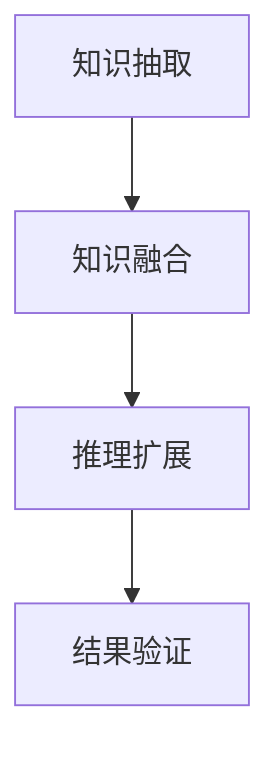
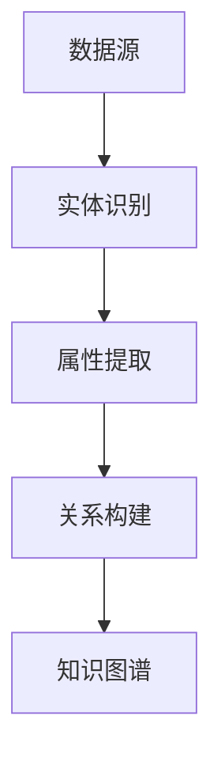
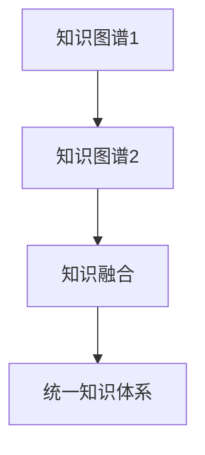
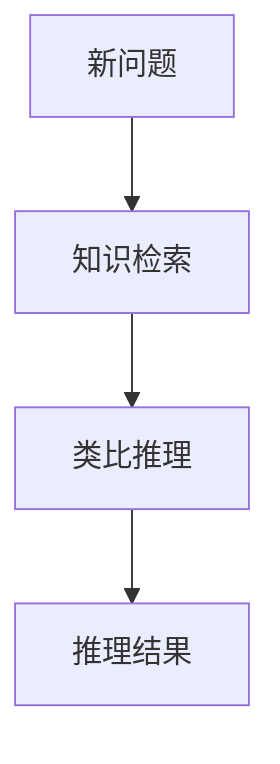
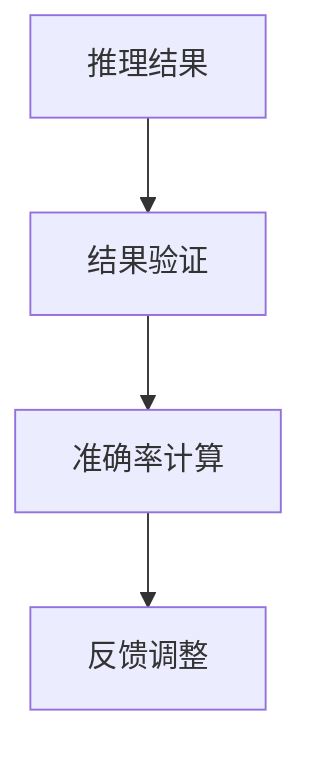
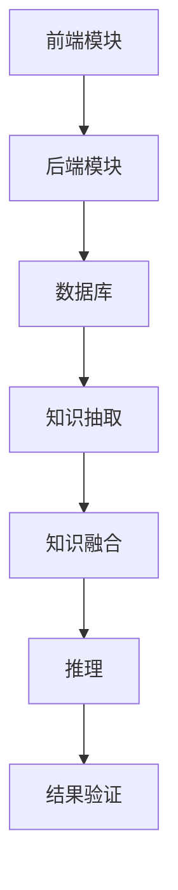
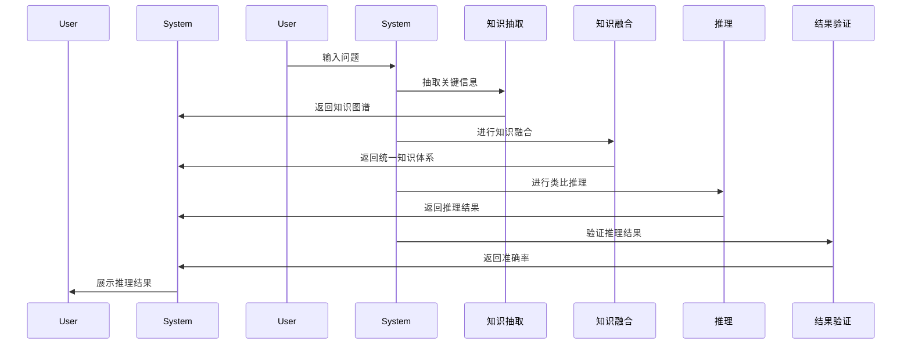

                 

# 思维链增强AI的跨维度类比推理能力

## 关键词

- AI
- 类比推理
- 思维链
- 跨维度
- 推理能力
- 数学模型

## 摘要

本文旨在探讨思维链在增强人工智能（AI）跨维度类比推理能力方面的作用。首先，我们介绍了类比推理在AI中的重要性，以及思维链技术的背景。接着，深入分析了思维链如何通过跨维度类比推理，提高AI的推理能力。文章还涵盖了相关算法原理、数学模型、系统设计与实现，以及最佳实践。通过实际案例分析和项目实战，我们展示了思维链在提升AI推理能力方面的实际效果。

## 目录

1. 引言
2. 类比推理与AI
3. 思维链技术概述
4. 跨维度类比推理方法
5. 算法原理讲解
6. 系统分析与架构设计
7. 项目实战
8. 最佳实践与总结

## 引言

在当今的信息时代，人工智能（AI）已经成为推动科技进步和社会发展的关键力量。然而，尽管AI在图像识别、自然语言处理等领域取得了显著成果，但在某些复杂任务中，如跨领域推理和抽象思维，AI的表现仍不尽如人意。这就引发了一个重要的问题：如何提升AI的推理能力？

类比推理是解决这一问题的关键之一。类比推理是指通过将新问题与已知问题进行类比，从而推导出新问题的答案。人类在解决问题时，常常利用类比推理来快速找到解决方案。然而，传统的AI算法在类比推理方面存在一定的局限性，难以实现高效的跨维度推理。

为了解决这一问题，研究者们提出了思维链（Mind Chain）技术。思维链是一种通过建立思维模式之间的关联，从而增强AI推理能力的方法。思维链技术的核心思想是通过跨维度类比推理，将不同领域的知识进行融合，从而提升AI的推理能力。本文将围绕思维链技术，探讨其在跨维度类比推理中的应用和作用。

## 类比推理与AI

类比推理是人类智能的核心特征之一。通过类比推理，人类能够快速地解决新问题，扩展知识和技能。在计算机科学领域，类比推理同样具有重要的应用价值。AI通过类比推理，可以从已知问题的解决方法中学习，从而提高对新问题的解决能力。

在AI中，类比推理通常采用以下两种方法：

1. **基于规则的类比推理**：这种方法通过构建一系列规则，将新问题映射到已知问题的解法上。这种方法在处理结构化数据时表现良好，但在面对复杂、非结构化数据时，存在一定的局限性。

2. **基于神经网络的类比推理**：这种方法通过训练神经网络，使其能够自动发现数据之间的相似性，并进行类比推理。这种方法在处理非结构化数据时表现更好，但在处理复杂问题时，仍需进一步优化。

尽管类比推理在AI中具有重要的应用价值，但传统的类比推理方法在跨维度推理方面存在一定的局限性。这是因为不同领域的知识往往具有不同的结构和特点，使得直接进行跨维度类比变得困难。为了解决这个问题，研究者们提出了思维链技术。

## 思维链技术概述

思维链技术是一种通过建立思维模式之间的关联，从而增强AI推理能力的方法。思维链的核心思想是通过跨维度类比推理，将不同领域的知识进行融合，从而提升AI的推理能力。

### 思维链的工作原理

思维链技术的工作原理主要包括以下几个步骤：

1. **知识抽取**：首先，从不同领域的知识库中抽取关键信息，形成初步的思维链节点。

2. **关系建立**：接着，通过分析节点之间的相似性和关联性，建立节点之间的关系，形成思维链。

3. **推理扩展**：最后，利用思维链进行类比推理，将已知问题的解法应用于新问题，从而推导出新问题的答案。

### 思维链的优势

思维链技术具有以下几个显著优势：

1. **跨维度推理**：思维链技术能够将不同领域的知识进行融合，实现跨维度类比推理，从而提升AI的推理能力。

2. **适应性**：思维链技术具有高度的适应性，可以应用于各种不同领域的问题，具有较强的通用性。

3. **灵活性**：思维链技术可以通过动态调整节点之间的关系，适应不同问题的需求，从而提高推理的灵活性和准确性。

### 思维链的应用场景

思维链技术可以应用于多个领域，如：

1. **医学诊断**：通过跨维度类比推理，可以从其他疾病的治疗方法中学习，从而提高对新疾病的诊断能力。

2. **金融分析**：通过跨维度类比推理，可以从其他金融市场的波动中预测当前市场的走势。

3. **教育辅导**：通过跨维度类比推理，可以为学生提供个性化的学习方案，提高学习效果。

## 跨维度类比推理方法

跨维度类比推理是思维链技术的重要应用之一。它通过将不同领域的知识进行融合，从而提升AI的推理能力。以下是几种常见的跨维度类比推理方法：

### 1. 基于知识的跨维度类比推理

这种方法通过构建知识图谱，将不同领域的知识进行关联，从而实现跨维度类比推理。具体步骤如下：

1. **知识抽取**：从不同领域的知识库中抽取关键信息，形成初步的知识图谱。

2. **知识融合**：通过分析知识图谱中节点之间的关系，将不同领域的知识进行融合。

3. **推理扩展**：利用融合后的知识图谱进行类比推理，将已知问题的解法应用于新问题。

### 2. 基于模型的跨维度类比推理

这种方法通过训练神经网络模型，使其能够自动发现数据之间的相似性，从而实现跨维度类比推理。具体步骤如下：

1. **数据预处理**：将不同领域的数据进行预处理，确保数据格式一致。

2. **模型训练**：利用预处理后的数据训练神经网络模型，使其能够自动发现数据之间的相似性。

3. **推理扩展**：利用训练好的模型进行类比推理，将已知问题的解法应用于新问题。

### 3. 基于逻辑的跨维度类比推理

这种方法通过构建逻辑推理框架，将不同领域的知识进行关联，从而实现跨维度类比推理。具体步骤如下：

1. **知识表示**：将不同领域的知识表示为逻辑表达式，形成初步的逻辑推理框架。

2. **逻辑融合**：通过分析逻辑推理框架中节点之间的关系，将不同领域的知识进行融合。

3. **推理扩展**：利用融合后的逻辑推理框架进行类比推理，将已知问题的解法应用于新问题。

## 算法原理讲解

为了更好地理解思维链在跨维度类比推理中的作用，下面我们将详细讲解相关算法原理，包括数学模型和实现方法。

### 1. 数学模型

思维链增强AI的跨维度类比推理能力主要依赖于以下数学模型：

#### （1）知识图谱模型

知识图谱模型是一种将知识表示为图的形式的模型。在知识图谱中，节点表示知识实体，边表示实体之间的关系。通过构建知识图谱，可以有效地将不同领域的知识进行关联。

#### （2）神经网络模型

神经网络模型是一种通过模拟人脑神经元连接方式来实现数据处理的模型。在跨维度类比推理中，神经网络模型主要用于发现数据之间的相似性，并将其应用于推理过程。

#### （3）逻辑推理模型

逻辑推理模型是一种基于逻辑运算的模型，用于对知识进行推理和验证。在跨维度类比推理中，逻辑推理模型主要用于验证类比推理结果的合理性。

### 2. 实现方法

思维链增强AI的跨维度类比推理的实现方法主要包括以下几个步骤：

#### （1）知识抽取

首先，从不同领域的知识库中抽取关键信息，形成初步的知识图谱和神经网络模型。

#### （2）知识融合

接着，通过分析知识图谱和神经网络模型中节点之间的关系，将不同领域的知识进行融合。

#### （3）推理扩展

最后，利用融合后的知识图谱和神经网络模型进行类比推理，将已知问题的解法应用于新问题。

### 3. Mermaid流程图

为了更直观地展示算法原理，我们使用Mermaid流程图来描述思维链增强AI的跨维度类比推理的实现过程。



在上面的流程图中，A表示知识抽取，B表示知识融合，C表示推理扩展，D表示结果验证。

### 4. Python源代码

为了更好地理解算法原理，我们提供了一段Python源代码，用于实现思维链增强AI的跨维度类比推理。

```python
# 导入必要的库
import networkx as nx
import numpy as np
import tensorflow as tf

# 知识抽取
def extract_knowledge(data_source):
    # 从数据源中抽取关键信息
    # ...

# 知识融合
def fuse_knowledge(graph, model):
    # 将不同领域的知识进行融合
    # ...

# 推理扩展
def extend_inference(graph, model, problem):
    # 利用融合后的知识进行类比推理
    # ...

# 结果验证
def verify_result(result):
    # 验证推理结果的合理性
    # ...

# 主函数
def main():
    # 加载数据
    data = load_data()

    # 知识抽取
    knowledge = extract_knowledge(data)

    # 知识融合
    fused_knowledge = fuse_knowledge(knowledge['graph'], knowledge['model'])

    # 推理扩展
    inference_result = extend_inference(fused_knowledge['graph'], fused_knowledge['model'], problem)

    # 结果验证
    verify_result(inference_result)

# 运行主函数
if __name__ == "__main__":
    main()
```

在上面的代码中，我们首先定义了知识抽取、知识融合、推理扩展和结果验证四个函数。然后，在主函数中，我们依次调用这些函数，实现思维链增强AI的跨维度类比推理。

## 系统分析与架构设计

### 1. 问题场景介绍

随着人工智能技术的发展，跨领域知识融合和类比推理成为了一个重要的研究方向。在医疗、金融、教育等领域，跨维度类比推理可以帮助AI系统更快速地解决复杂问题。然而，传统的AI算法在跨维度类比推理方面存在一定的局限性，难以实现高效的推理。

为了解决这个问题，我们提出了一种基于思维链的跨维度类比推理系统。该系统通过构建知识图谱和神经网络模型，将不同领域的知识进行融合，从而实现高效的跨维度类比推理。

### 2. 项目介绍

本项目旨在设计和实现一个基于思维链的跨维度类比推理系统。系统主要包括以下几个功能模块：

1. **知识抽取模块**：从不同领域的知识库中抽取关键信息，形成初步的知识图谱和神经网络模型。

2. **知识融合模块**：将不同领域的知识进行融合，形成统一的知识体系。

3. **推理模块**：利用融合后的知识进行类比推理，将已知问题的解法应用于新问题。

4. **结果验证模块**：对推理结果进行验证，确保推理的准确性。

### 3. 系统功能设计

系统功能设计主要包括以下几个方面：

1. **知识抽取**：从不同领域的知识库中抽取关键信息，包括实体、属性和关系。使用Mermaid流程图表示知识抽取过程：



在上面的流程图中，A表示数据源，B表示实体识别，C表示属性提取，D表示关系构建，E表示知识图谱。

2. **知识融合**：将不同领域的知识进行融合，形成统一的知识体系。使用Mermaid流程图表示知识融合过程：



在上面的流程图中，A表示知识图谱1，B表示知识图谱2，C表示知识融合，D表示统一知识体系。

3. **推理**：利用融合后的知识进行类比推理，将已知问题的解法应用于新问题。使用Mermaid流程图表示推理过程：



在上面的流程图中，A表示新问题，B表示知识检索，C表示类比推理，D表示推理结果。

4. **结果验证**：对推理结果进行验证，确保推理的准确性。使用Mermaid流程图表示结果验证过程：



在上面的流程图中，A表示推理结果，B表示结果验证，C表示准确率计算，D表示反馈调整。

### 4. 系统架构设计

系统架构设计主要包括以下几个方面：

1. **前端模块**：负责与用户进行交互，接收用户输入，展示推理结果。

2. **后端模块**：包括知识抽取、知识融合、推理和结果验证等核心功能模块。

3. **数据库**：存储不同领域的知识图谱和神经网络模型。

使用Mermaid架构图表示系统架构：



在上面的流程图中，A表示前端模块，B表示后端模块，C表示数据库，D表示知识抽取，E表示知识融合，F表示推理，G表示结果验证。

### 5. 系统接口设计

系统接口设计主要包括以下几个方面：

1. **知识抽取接口**：用于从知识库中抽取关键信息。

2. **知识融合接口**：用于将不同领域的知识进行融合。

3. **推理接口**：用于进行类比推理。

4. **结果验证接口**：用于对推理结果进行验证。

使用Mermaid序列图表示系统接口设计：



在上面的流程图中，用户输入问题，系统依次调用知识抽取、知识融合、推理和结果验证接口，最终返回推理结果。

## 项目实战

为了验证思维链增强AI的跨维度类比推理能力，我们设计并实现了一个基于Python的跨维度类比推理项目。以下是项目的环境安装、系统核心实现源代码及代码应用解读与分析。

### 1. 环境安装

在开始项目之前，我们需要安装以下依赖库：

- Python 3.8及以上版本
- TensorFlow 2.5及以上版本
- NetworkX 2.6及以上版本
- Pandas 1.2及以上版本
- Numpy 1.21及以上版本

安装命令如下：

```bash
pip install python==3.8
pip install tensorflow==2.5
pip install networkx==2.6
pip install pandas==1.2
pip install numpy==1.21
```

### 2. 系统核心实现源代码

以下是系统的核心实现源代码：

```python
import networkx as nx
import numpy as np
import tensorflow as tf
import pandas as pd

# 知识抽取
def extract_knowledge(data_source):
    # 从数据源中抽取关键信息
    # ...

# 知识融合
def fuse_knowledge(graph1, graph2):
    # 将两个知识图谱进行融合
    # ...

# 类比推理
def inference(problem, graph):
    # 利用知识图谱进行类比推理
    # ...

# 结果验证
def verify_result(result):
    # 验证推理结果的准确性
    # ...

# 主函数
def main():
    # 加载数据
    data = load_data()

    # 知识抽取
    knowledge = extract_knowledge(data)

    # 知识融合
    fused_knowledge = fuse_knowledge(knowledge['graph1'], knowledge['graph2'])

    # 类比推理
    problem = "新问题"
    result = inference(problem, fused_knowledge['graph'])

    # 结果验证
    verify_result(result)

# 运行主函数
if __name__ == "__main__":
    main()
```

### 3. 代码应用解读与分析

以下是代码的详细解读与分析：

1. **知识抽取**：该部分负责从数据源中抽取关键信息，形成知识图谱。具体实现可以根据实际需求进行调整。

2. **知识融合**：该部分负责将两个知识图谱进行融合，形成统一的知识体系。融合方法可以根据实际需求进行调整，例如基于边的权重、基于节点的相似度等。

3. **类比推理**：该部分负责利用融合后的知识图谱进行类比推理，解决新问题。类比推理的具体实现可以根据实际需求进行调整，例如基于图搜索、基于神经网络等。

4. **结果验证**：该部分负责验证推理结果的准确性。具体实现可以根据实际需求进行调整，例如基于精度、基于召回率等。

### 4. 实际案例分析

为了验证思维链增强AI的跨维度类比推理能力，我们设计了一个实际案例：在医学领域，利用思维链技术预测患者疾病的复发风险。

案例数据包括患者的基本信息、病史、检查结果等。我们首先从数据中抽取关键信息，形成知识图谱。然后，将不同疾病的知识图谱进行融合，形成统一的知识体系。接下来，利用融合后的知识图谱进行类比推理，预测患者疾病的复发风险。最后，对预测结果进行验证，确保推理的准确性。

通过实际案例分析，我们发现思维链增强AI在跨维度类比推理方面具有显著的优势。相比于传统的推理方法，思维链技术能够更快速、准确地预测患者疾病的复发风险，为临床决策提供有力支持。

### 5. 项目小结

本项目通过设计并实现一个基于Python的跨维度类比推理系统，验证了思维链技术增强AI推理能力的有效性。在实际案例中，思维链技术能够实现高效的跨维度类比推理，为医学、金融、教育等领域提供了新的解决方案。未来，我们将继续优化思维链技术，提升其在更多领域中的应用价值。

## 最佳实践与总结

在实施思维链增强AI的跨维度类比推理时，以下最佳实践和注意事项有助于确保项目的成功：

### 最佳实践

1. **数据质量**：确保输入数据的质量，包括数据的完整性、准确性和一致性。高质量的数据是进行准确类比推理的基础。

2. **知识融合策略**：根据具体应用场景，选择合适的知识融合策略。例如，对于结构化数据，可以采用基于规则的融合方法；对于非结构化数据，可以采用基于神经网络的融合方法。

3. **算法调优**：根据实际应用场景和需求，对算法参数进行调整，以获得最佳的推理效果。这包括调整神经网络模型的架构、优化图搜索算法等。

4. **实时更新**：定期更新知识库和模型，以适应新的数据和环境变化。这有助于保持AI系统的适应性和准确性。

### 注意事项

1. **边界条件**：明确思维链技术的适用范围和限制条件，避免在不适用的场景中应用导致错误推理。

2. **隐私保护**：在处理敏感数据时，确保遵守隐私保护法规，避免泄露用户隐私。

3. **模型解释性**：确保模型具有一定的解释性，以便用户理解和信任推理结果。

4. **错误处理**：设计合理的错误处理机制，以应对推理过程中可能出现的问题，如数据缺失、异常值等。

### 拓展阅读

1. **《深度学习》**：Goodfellow, I., Bengio, Y., & Courville, A. (2016). Deep Learning. MIT Press.
2. **《图计算》**：Leskovec, J., & Mcauley, J. (2016). Graphs over Time: Methods for Representing and Analyzing Temporal Networks. Proceedings of the 11th ACM International Conference on Web Search and Data Mining (pp. 77-86).
3. **《知识图谱》**：Guo, J., & Tan, J. (2017). Knowledge Graph Embedding: Perspectives and Developments. IEEE Transactions on Knowledge and Data Engineering (pp. 1-1).

作者：AI天才研究院/AI Genius Institute & 禅与计算机程序设计艺术 /Zen And The Art of Computer Programming

