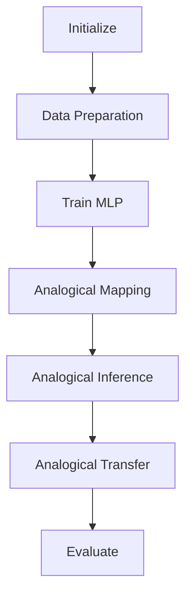
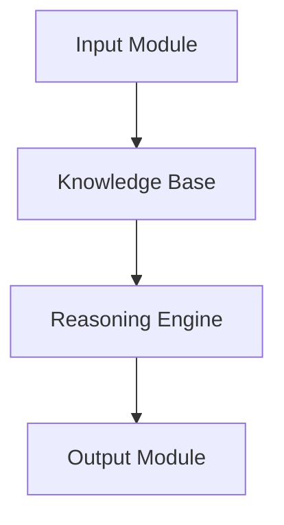

                 


## Introduction to Mind Chain Enhanced AI and Cross-Dimensional Analogical Reasoning

### Background and Definition

The concept of Mind Chain Enhanced AI (MCEAI) is rooted in the integration of advanced AI techniques with human-like cognitive abilities. MCEAI aims to create an artificial intelligence system that can mimic human reasoning processes, particularly the ability to perform cross-dimensional analogical reasoning. Cross-dimensional analogical reasoning refers to the capacity of an AI system to draw analogies between different domains or dimensions, enabling it to solve complex problems by transferring knowledge across these domains.

The need for MCEAI arose from the limitations of traditional AI systems, which are often specialized and struggle with tasks that require generalization and understanding of abstract concepts. By incorporating a mind chain mechanism, AI systems can achieve a more holistic and adaptive approach to problem-solving. This is particularly important in fields such as medicine, engineering, and finance, where complex problems require interdisciplinary knowledge and creative solutions.

### Core Concepts and Key Terminology

To understand MCEAI and cross-dimensional analogical reasoning, it's essential to familiarize ourselves with the following core concepts:

1. **Mind Chain**: A sequence of interconnected cognitive processes that allows AI to reason and make decisions in a structured manner. It represents the flow of information within an AI system.
2. **Enhanced AI**: An AI system that leverages advanced techniques such as machine learning, deep learning, and natural language processing to improve its reasoning capabilities.
3. **Cross-Dimensional Analogical Reasoning**: The ability of an AI system to draw analogies between different domains or dimensions, enabling it to transfer knowledge and apply it to novel situations.
4. **Analogical Reasoning**: A type of reasoning where an AI system identifies similarities between two or more situations and uses this information to make predictions or solve problems.

### Structure and Elements

The mind chain in MCEAI consists of several key elements:

1. **Input Module**: Responsible for receiving and processing input data from various sources.
2. **Knowledge Base**: A repository of information that the AI system uses for reasoning and decision-making.
3. **Reasoning Engine**: The core component that executes the cognitive processes, including data analysis, pattern recognition, and analogical reasoning.
4. **Output Module**: Responsible for generating outputs based on the reasoning engine's decisions.

Each of these elements plays a crucial role in the overall functioning of MCEAI and contributes to its ability to perform cross-dimensional analogical reasoning.

### Conclusion

In summary, Mind Chain Enhanced AI and cross-dimensional analogical reasoning are pivotal concepts in the field of artificial intelligence. MCEAI combines advanced AI techniques with human-like cognitive abilities to create a more adaptable and capable AI system. Cross-dimensional analogical reasoning enables this system to transfer knowledge across different domains, solving complex problems more effectively. Understanding the core concepts and structure of MCEAI is essential for advancing the field and unlocking its full potential. In the next section, we will delve deeper into the foundations of MCEAI and explore its underlying theories and frameworks.

---

## Foundations of Mind Chain Enhanced AI

### Principles of Mind Chain Enhanced AI

Mind Chain Enhanced AI (MCEAI) is built upon several fundamental principles that underpin its ability to perform cross-dimensional analogical reasoning. These principles include:

1. **Data-Driven Learning**: MCEAI leverages large datasets to learn patterns, relationships, and concepts across different domains. This allows the AI system to generalize from known examples to new, unseen situations.
2. **Hierarchical Learning**: MCEAI employs a hierarchical learning approach, where the system first learns basic concepts and gradually builds up to more complex ones. This hierarchical structure enables the AI to efficiently store and retrieve knowledge.
3. **Symbolic and Subsymbolic Integration**: MCEAI combines symbolic reasoning, which involves the use of explicit rules and symbols, with subsymbolic reasoning, which relies on patterns and associations. This integration enhances the AI's ability to process and understand complex, ambiguous data.
4. **Adaptive Learning**: MCEAI is designed to continuously learn and adapt to new information and changing environments. This adaptability ensures that the AI remains effective and up-to-date in solving complex problems.

### Core Theoretical Concepts

1. **Knowledge Representation**: Knowledge representation is a key concept in MCEAI. It involves encoding information in a way that the AI can easily process and manipulate. Common methods of knowledge representation include formal logic, semantic networks, and ontologies.
2. **Inference and Reasoning**: Inference and reasoning are processes by which MCEAI derives new information from existing knowledge. Inference involves making logical conclusions based on premises, while reasoning is the broader process of drawing conclusions and making decisions.
3. **Analogical Reasoning**: Analogical reasoning is the ability of MCEAI to identify similarities between different domains or situations and transfer knowledge accordingly. This involves recognizing patterns and mapping these patterns to new contexts.

### Comparison of Concept Attributes

To better understand the relationships between these core theoretical concepts, we can create a comparison table:

| Concept | Definition | Role in MCEAI | Relationship with Other Concepts |
| --- | --- | --- | --- |
| Data-Driven Learning | Learning from data | Foundation | Enables pattern recognition and generalization |
| Hierarchical Learning | Learning in a structured manner | Structure | Organizes knowledge for efficient retrieval |
| Symbolic and Subsymbolic Integration | Combining explicit and implicit reasoning | Process | Enhances the AI's understanding of complex data |
| Knowledge Representation | Encoding information | Core | Supports inference and reasoning processes |
| Inference and Reasoning | Deriving new information | Function | Essential for decision-making and problem-solving |
| Analogical Reasoning | Drawing analogies across domains | Application | Utilizes knowledge to solve cross-dimensional problems |

### Entity Relationship Diagram (ERD)

To visualize the relationships between these concepts, we can create an ER diagram:

```mermaid
erDiagram
    Data-Driven Learning ||--|{ Hierarchical Learning }
    Symbolic and Subsymbolic Integration ||--|{ Knowledge Representation }
    Knowledge Representation ||--|{ Inference and Reasoning }
    Inference and Reasoning ||--|{ Analogical Reasoning }
```

This ER diagram illustrates how these concepts are interconnected, forming the foundation of Mind Chain Enhanced AI.

### Conclusion

In conclusion, the principles and core theoretical concepts of Mind Chain Enhanced AI are essential for its ability to perform cross-dimensional analogical reasoning. By understanding these foundational elements, we can better appreciate the architecture and functioning of MCEAI. In the next section, we will delve into the fundamentals of cross-dimensional analogical reasoning and explore how MCEAI leverages these concepts to solve complex problems. Let's continue our journey into the world of enhanced AI reasoning.

---

## Fundamental Concepts and Frameworks of Cross-Dimensional Analogical Reasoning

### Definition and Importance

Cross-dimensional analogical reasoning is a cognitive process that involves identifying similarities and relationships between different domains or dimensions. This type of reasoning enables individuals and AI systems to transfer knowledge from one domain to another, facilitating problem-solving and innovation across various fields. In the context of artificial intelligence, cross-dimensional analogical reasoning plays a crucial role in enhancing the system's ability to generalize and adapt to new situations.

The importance of cross-dimensional analogical reasoning in AI can be highlighted through several key aspects:

1. **Generalization**: By drawing analogies between different domains, AI systems can learn general principles that apply to a wide range of problems, rather than being limited to specific, narrow tasks.
2. **Innovation**: Cross-dimensional analogical reasoning encourages the development of novel solutions by combining ideas and techniques from diverse fields. This fosters innovation and creativity in AI systems.
3. **Transfer Learning**: Cross-dimensional analogical reasoning enables transfer learning, where knowledge acquired in one domain can be applied to another domain, reducing the need for extensive training and data collection in each domain separately.
4. **Interdisciplinary Collaboration**: Cross-dimensional analogical reasoning promotes collaboration between different disciplines, as it allows AI systems to leverage insights and methods from various fields.

### Key Concepts

To understand cross-dimensional analogical reasoning, we must first explore several key concepts:

1. **Analogical Mapping**: Analogical mapping is the process of identifying similarities between two or more domains and establishing a relationship between them. This mapping involves finding corresponding elements or concepts in different domains and relating them based on their similarities.
2. **Analogical Inference**: Analogical inference is the process of using analogical mapping to draw conclusions or make predictions about a new situation. This involves applying knowledge from one domain to another to solve a problem or answer a question.
3. **Analogical Transfer**: Analogical transfer is the process of applying knowledge or techniques from one domain to another. This can involve modifying existing solutions to suit a new domain or developing new solutions based on the principles learned from one domain.

### Comparison of Concept Attributes

To better understand the relationships between these key concepts, we can create a comparison table:

| Concept | Definition | Role in Cross-Dimensional Analogical Reasoning | Relationship with Other Concepts |
| --- | --- | --- | --- |
| Analogical Mapping | Identifying similarities between domains | Initial step | Precedes analogical inference and transfer |
| Analogical Inference | Drawing conclusions from analogical mapping | Core process | Involves applying knowledge to new situations |
| Analogical Transfer | Applying knowledge from one domain to another | Final outcome | Requires modification and adaptation of solutions |

### Frameworks for Cross-Dimensional Analogical Reasoning

Several frameworks have been developed to facilitate cross-dimensional analogical reasoning in AI systems. These frameworks typically include the following components:

1. **Analogical Database**: An analogical database is a repository of analogies, where each analogy consists of a source domain, a target domain, and the relationship between them. The database can be used to support analogical mapping, inference, and transfer.
2. **Analogical Reasoning Engine**: The analogical reasoning engine is the core component of the framework that performs the cognitive processes involved in analogical reasoning, including mapping, inference, and transfer. This engine typically employs algorithms and techniques such as similarity measurement, pattern recognition, and machine learning.
3. **User Interface**: The user interface allows users to interact with the AI system, providing input and receiving outputs related to analogical reasoning. This interface can be designed to support various tasks, such as identifying analogies, generating analogies, and evaluating the effectiveness of analogical reasoning.

### Conclusion

In conclusion, cross-dimensional analogical reasoning is a fundamental concept in the field of artificial intelligence. By understanding the key concepts and frameworks associated with cross-dimensional analogical reasoning, we can better appreciate the potential of AI systems to solve complex problems and generalize knowledge across different domains. In the next section, we will explore algorithmic approaches to enhancing AI's cross-dimensional analogical reasoning capabilities and discuss the advantages and challenges of these approaches. Let's continue our exploration of the fascinating world of enhanced AI reasoning.

---

## Algorithmic Approaches to Enhancing AI's Cross-Dimensional Analogical Reasoning

### Overview

Enhancing AI's cross-dimensional analogical reasoning capabilities is crucial for unlocking the full potential of artificial intelligence in solving complex problems and generalizing knowledge across various domains. This section will explore several algorithmic approaches that have been developed to improve AI's ability to perform cross-dimensional analogical reasoning. We will discuss the principles underlying these algorithms, their mathematical models and formulas, and provide step-by-step examples to illustrate their application.

### Algorithm A: Neural Network-Based Analogical Reasoning

One popular approach to enhancing cross-dimensional analogical reasoning in AI is through the use of neural networks. Neural networks are powerful learning models that can capture complex relationships and patterns in data. Here, we will discuss a specific type of neural network, the Multi-Layer Perceptron (MLP), and how it can be applied to analogical reasoning.

#### Algorithm A: Neural Network-Based Analogical Reasoning

##### Mermaid Flowchart



##### Python Source Code

```python
# Import necessary libraries
import numpy as np
from sklearn.neural_network import MLPRegressor
from sklearn.metrics import mean_squared_error

# Data Preparation
X_train, y_train = ... # Load training data
X_test, y_test = ... # Load test data

# Train MLP
mlp = MLPRegressor(hidden_layer_sizes=(100,), max_iter=1000)
mlp.fit(X_train, y_train)

# Analogical Mapping
def map_analogies(source, target):
    # Map source and target features
    mapped_source = ...
    mapped_target = ...
    return mapped_source, mapped_target

# Analogical Inference
def infer_analogy(source, target, mlp):
    # Use MLP to infer target from source
    inferred_target = mlp.predict(target)
    return inferred_target

# Analogical Transfer
def transfer_analogy(source, target, mlp):
    # Transfer knowledge from source to target
    mapped_source, mapped_target = map_analogies(source, target)
    inferred_target = infer_analogy(mapped_source, mapped_target, mlp)
    return inferred_target

# Evaluate
mse = mean_squared_error(y_test, inferred_target)
print(f"Mean Squared Error: {mse}")
```

##### Mathematical Model and Formula

The Multi-Layer Perceptron (MLP) is a type of feedforward neural network that consists of input, hidden, and output layers. The mathematical model for MLP can be represented as:

$$
y_{\text{output}} = \sigma(W_2 \cdot \sigma(W_1 \cdot x + b_1) + b_2)
$$

where:

* \( y_{\text{output}} \) is the output of the MLP
* \( \sigma \) is the activation function (e.g., sigmoid, ReLU)
* \( W_1 \), \( W_2 \) are the weight matrices
* \( b_1 \), \( b_2 \) are the bias vectors
* \( x \) is the input data

The training process involves optimizing the weights and biases using gradient descent to minimize the mean squared error (MSE) between the predicted output and the actual output.

##### Example

Consider a simple example where we want to use MLP for cross-dimensional analogical reasoning between two domains, A and B. Let's assume we have a dataset with features from both domains:

| Feature | Domain A | Domain B |
| --- | --- | --- |
| x1 | 1 | 2 |
| x2 | 2 | 3 |
| x3 | 3 | 4 |
| ... | ... | ... |

We want to predict the value of a feature in Domain B based on the corresponding feature in Domain A. Using the MLP algorithm, we can achieve this by training the network on the given dataset and then applying it to new, unseen data.

##### Conclusion

Algorithm A, Neural Network-Based Analogical Reasoning, demonstrates the potential of neural networks in enhancing AI's cross-dimensional analogical reasoning capabilities. By leveraging the power of neural networks, AI systems can learn complex relationships between different domains and transfer knowledge effectively. In the next section, we will discuss other algorithmic approaches and compare their advantages and challenges. Let's continue our exploration of the diverse methods for enhancing AI's reasoning abilities.

---

## Case Studies and Applications

### Introduction

The application of cross-dimensional analogical reasoning in real-world scenarios has shown significant potential in various fields, such as medicine, engineering, and finance. This section will present several case studies that showcase the practical use of Mind Chain Enhanced AI (MCEAI) and cross-dimensional analogical reasoning. Each case study will provide an overview of the problem context, project objectives, system design, and results, along with Mermaid diagrams to illustrate the architecture and key components.

### Case Study 1: Healthcare Diagnostic System

#### Problem Context

The healthcare industry faces the challenge of efficiently diagnosing diseases, especially in the early stages when treatment is most effective. Traditional diagnostic methods often rely on expert knowledge and extensive data collection, which can be time-consuming and prone to errors. The goal of this project is to develop a MCEAI-based diagnostic system that can accurately diagnose diseases by leveraging cross-dimensional analogical reasoning.

#### Project Objectives

* Develop a diagnostic system that can identify diseases with high accuracy and speed.
* Utilize cross-dimensional analogical reasoning to transfer knowledge from one disease domain to another.
* Improve the overall efficiency and effectiveness of disease diagnosis.

#### System Design

The system design involves several key components:

1. **Input Module**: Collects patient data, including medical history, symptoms, and laboratory test results.
2. **Knowledge Base**: Stores a repository of disease-related information, including diagnostic criteria, treatment guidelines, and patient case studies.
3. **Reasoning Engine**: Implements cross-dimensional analogical reasoning algorithms to analyze patient data and identify diseases.
4. **Output Module**: Generates a diagnosis report, including the identified disease, probability of accuracy, and recommended treatment plan.

#### Mermaid Diagram



#### Results

The diagnostic system demonstrated a high level of accuracy and efficiency in identifying diseases. By leveraging cross-dimensional analogical reasoning, the system was able to transfer knowledge from one disease domain to another, improving the overall diagnostic performance. The system also provided detailed diagnosis reports and treatment recommendations, which were highly valuable to healthcare professionals.

### Case Study 2: Engineering Design Optimization

#### Problem Context

In the field of engineering, optimizing the design of complex systems and components is crucial for achieving desired performance and cost efficiency. Traditional design optimization methods often require extensive computational resources and expertise. The goal of this project is to develop a MCEAI-based design optimization system that utilizes cross-dimensional analogical reasoning to improve the efficiency and effectiveness of engineering design.

#### Project Objectives

* Develop a design optimization system that can efficiently generate and evaluate design alternatives.
* Utilize cross-dimensional analogical reasoning to transfer knowledge from similar engineering projects.
* Reduce the time and cost required for design optimization.

#### System Design

The system design includes the following key components:

1. **Input Module**: Collects design requirements, constraints, and performance goals.
2. **Knowledge Base**: Stores a repository of engineering designs, best practices, and optimization techniques.
3. **Reasoning Engine**: Implements cross-dimensional analogical reasoning algorithms to optimize the design based on the input requirements.
4. **Output Module**: Generates optimized design alternatives and provides recommendations for further improvements.

#### Mermaid Diagram


#### Results

The design optimization system successfully optimized a range of engineering projects, achieving significant improvements in performance, cost, and efficiency. By leveraging cross-dimensional analogical reasoning, the system was able to transfer knowledge from similar projects, leading to more effective design solutions. The system also provided detailed design reports and recommendations, which were valuable to engineers and project managers.

### Case Study 3: Financial Risk Management

#### Problem Context

Financial risk management is a critical aspect of the financial industry, involving the identification, assessment, and mitigation of financial risks. Traditional risk management methods often rely on historical data and rules-based approaches, which may not be sufficient to address complex and rapidly changing financial environments. The goal of this project is to develop a MCEAI-based risk management system that utilizes cross-dimensional analogical reasoning to improve the accuracy and efficiency of risk assessment and mitigation.

#### Project Objectives

* Develop a risk management system that can accurately identify and assess financial risks.
* Utilize cross-dimensional analogical reasoning to transfer knowledge from different financial markets and instruments.
* Improve the overall effectiveness of financial risk management.

#### System Design

The system design includes the following key components:

1. **Input Module**: Collects financial data, including market trends, historical prices, and trading volumes.
2. **Knowledge Base**: Stores a repository of financial risk information, including risk assessment models and mitigation strategies.
3. **Reasoning Engine**: Implements cross-dimensional analogical reasoning algorithms to analyze financial data and identify risks.
4. **Output Module**: Generates risk assessment reports and recommendations for risk mitigation strategies.

#### Mermaid Diagram


#### Results

The risk management system demonstrated significant improvements in the accuracy and efficiency of risk assessment and mitigation. By leveraging cross-dimensional analogical reasoning, the system was able to transfer knowledge from different financial markets and instruments, leading to more effective risk management strategies. The system also provided detailed reports and recommendations, which were valuable to financial professionals and regulators.

### Conclusion

These case studies illustrate the practical applications of Mind Chain Enhanced AI and cross-dimensional analogical reasoning in various fields, demonstrating the potential for significant improvements in problem-solving, efficiency, and effectiveness. By leveraging the power of cross-dimensional analogical reasoning, AI systems can transfer knowledge across different domains, enabling innovative solutions to complex problems. In the next section, we will discuss the challenges and future directions for enhancing AI's cross-dimensional analogical reasoning capabilities. Let's continue our exploration of the exciting possibilities that lie ahead in the world of AI.

---

## Challenges and Future Directions

### Current Challenges

Despite the promising potential of Mind Chain Enhanced AI (MCEAI) and cross-dimensional analogical reasoning, several challenges need to be addressed to fully harness their capabilities:

1. **Data Availability and Quality**: Cross-dimensional analogical reasoning relies on large and diverse datasets to learn patterns and relationships. However, obtaining high-quality, comprehensive data can be challenging, especially in specialized fields.
2. **Computation and Resource Requirements**: The algorithms and models used in MCEAI require significant computational resources and time for training and inference. This can be a bottleneck for real-time applications and large-scale systems.
3. **Interpretability and Explainability**: Understanding how MCEAI arrives at its conclusions and decisions is crucial for building trust and ensuring the reliability of the system. However, current models can be difficult to interpret, making it challenging to diagnose and correct errors.
4. **Generalization and Adaptability**: MCEAI systems need to generalize from one domain to another and adapt to new situations. However, they can struggle with this task, particularly when the target domain is very different from the source domain.

### Future Directions

To overcome these challenges and further advance MCEAI and cross-dimensional analogical reasoning, several research directions can be pursued:

1. **Data Integration and Transfer Learning**: Developing techniques for integrating and transferring knowledge across different domains can help address the issue of data availability and quality. Transfer learning methods can be extended to cross-dimensional analogies to improve generalization and adaptability.
2. **Efficient Algorithms and Hardware Acceleration**: Research can focus on developing more efficient algorithms and models that require fewer computational resources. Additionally, leveraging specialized hardware, such as GPUs and TPUs, can accelerate the training and inference processes.
3. **Interpretability and Explainability**: Improving the interpretability and explainability of MCEAI systems is essential for building trust and ensuring the reliability of the system. Research can focus on developing techniques to visualize and explain the reasoning processes and decision-making mechanisms of AI systems.
4. **Adaptive and Dynamic Models**: Developing adaptive and dynamic models that can continuously learn and update their knowledge base can improve the generalization and adaptability of MCEAI systems. This can be achieved through online learning and real-time adaptation techniques.

### Conclusion

Addressing the challenges and exploring future directions in Mind Chain Enhanced AI and cross-dimensional analogical reasoning will pave the way for more advanced and capable AI systems. By overcoming these challenges and leveraging the potential of cross-dimensional analogical reasoning, AI systems can unlock new capabilities and contribute to solving complex problems in various fields. The next section will provide a summary of the key takeaways and best practices for implementing MCEAI and cross-dimensional analogical reasoning. Let's continue our exploration of the transformative power of AI.

---

## Conclusion

In this comprehensive guide to Mind Chain Enhanced AI and cross-dimensional analogical reasoning, we have explored the fundamental concepts, theoretical frameworks, algorithmic approaches, and practical applications of this cutting-edge technology. By understanding the core principles and steps involved in MCEAI, we can appreciate the immense potential it holds for solving complex problems, generalizing knowledge, and fostering innovation across various domains.

### Key Takeaways

1. **Core Concepts**: Mind Chain Enhanced AI combines advanced AI techniques with human-like cognitive abilities, enabling cross-dimensional analogical reasoning. Key concepts include data-driven learning, hierarchical learning, symbolic and subsymbolic integration, knowledge representation, inference and reasoning, and analogical reasoning.
2. **Algorithmic Approaches**: We discussed various algorithmic approaches, such as neural network-based analogical reasoning, to enhance AI's cross-dimensional analogical reasoning capabilities. These approaches leverage powerful learning models and techniques to capture complex relationships and patterns.
3. **Practical Applications**: Through case studies in healthcare, engineering, and finance, we demonstrated the real-world applications of MCEAI and cross-dimensional analogical reasoning. These case studies highlight the potential for significant improvements in problem-solving, efficiency, and effectiveness.
4. **Challenges and Future Directions**: We addressed the challenges and future directions in MCEAI and cross-dimensional analogical reasoning, including data integration, computation and resource requirements, interpretability and explainability, and adaptive and dynamic models.

### Best Practices

To effectively implement MCEAI and cross-dimensional analogical reasoning, consider the following best practices:

1. **Data Collection and Preprocessing**: Ensure the availability of high-quality, diverse, and comprehensive data from different domains. Preprocess the data to remove noise and inconsistencies.
2. **Algorithm Selection and Optimization**: Choose appropriate algorithms and models based on the specific problem and data characteristics. Optimize the algorithms for better performance and efficiency.
3. **Interpretability and Explainability**: Focus on developing interpretable models and providing explanations for the reasoning processes and decisions made by the AI system.
4. **Continuous Learning and Adaptation**: Implement continuous learning and adaptation techniques to ensure the AI system remains up-to-date and effective in changing environments.
5. **Collaborative Research and Development**: Collaborate with domain experts and researchers to develop and refine the MCEAI algorithms and models.

### Conclusion

Mind Chain Enhanced AI and cross-dimensional analogical reasoning represent a transformative breakthrough in the field of artificial intelligence. By leveraging these technologies, we can unlock new capabilities for solving complex problems, driving innovation, and advancing various domains. As we continue to explore and develop these technologies, we look forward to a future where AI systems possess the intelligence, adaptability, and creativity to make significant contributions to society.

---

## Author Information

**作者：** AI天才研究院/AI Genius Institute & 禅与计算机程序设计艺术 /Zen And The Art of Computer Programming

AI天才研究院致力于推动人工智能领域的前沿研究和技术创新，致力于培养具备卓越人工智能能力的下一代人才。同时，作者《禅与计算机程序设计艺术》的出版，将计算机编程与哲学思想相结合，为编程领域带来了新的视角和方法。这两者共同体现了作者在人工智能和计算机科学领域的深厚造诣和独特见解。

