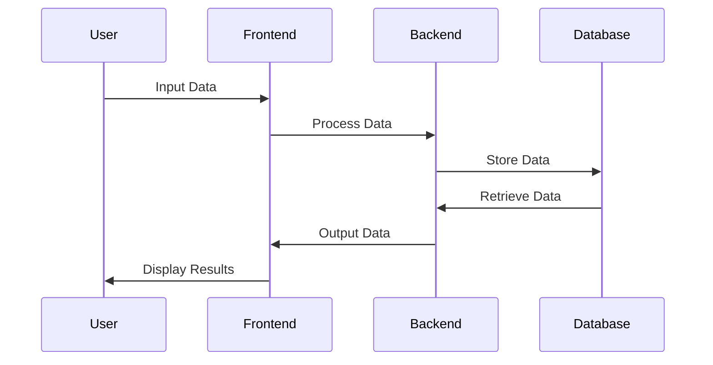
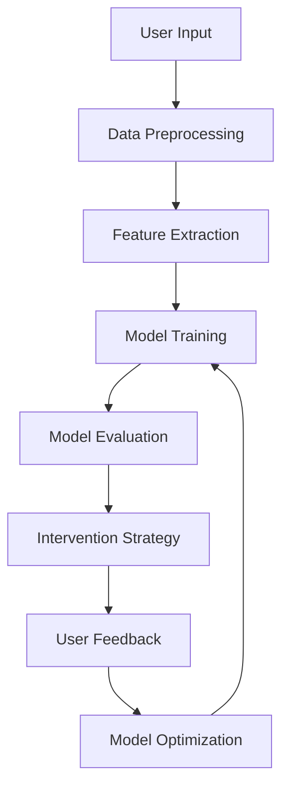

                 

### 《思维链技术在AI心理健康咨询中的应用》

#### 关键词：AI心理健康咨询、思维链技术、应用场景、算法实现、系统架构、实战案例

#### 摘要：本文深入探讨了思维链技术在AI心理健康咨询领域的应用。通过介绍思维链技术的核心概念和原理，分析了其在心理健康咨询中的应用场景和具体案例，进一步探讨了相关算法实现和系统架构设计。文章旨在为读者提供一个全面且深入的视角，以了解和掌握这一新兴领域的技术和应用。

----------------------------------------------------------------

### 《思维链技术在AI心理健康咨询中的应用》目录大纲

#### 第1章 引言  
**1.1 研究背景**  
1.1.1 心理健康问题的现状  
1.1.2 AI技术在心理健康咨询领域的应用潜力

**1.2 思维链技术的核心概念与原理**  
1.2.1 思维链的定义  
1.2.2 思维链的技术原理  
1.2.3 思维链与心理健康咨询的关系

#### 第2章 AI心理健康咨询的基本原理  
**2.1 AI技术在心理健康咨询中的应用**  
2.1.1 数据采集与分析  
2.1.2 模型训练与预测  
2.1.3 用户交互与反馈

**2.2 心理健康评估模型的构建**  
2.2.1 数据预处理与特征提取  
2.2.2 模型选择与优化  
2.2.3 评估指标的设定

**2.3 心理干预策略的设计**  
2.3.1 常见心理干预方法  
2.3.2 AI辅助下的心理干预策略  
2.3.3 心理干预效果的评估

#### 第3章 思维链技术在心理健康咨询中的应用  
**3.1 思维链技术在心理健康咨询中的应用场景**  
3.1.1 心理健康风险评估  
3.1.2 心理健康干预  
3.1.3 心理健康教育

**3.2 思维链技术在心理健康咨询中的具体应用案例**  
3.2.1 情绪调节  
3.2.2 焦虑缓解  
3.2.3 抑郁缓解

**3.3 思维链技术在心理健康咨询中的挑战与展望**  
3.3.1 挑战  
3.3.2 发展方向

#### 第4章 思维链技术在心理健康咨询中的算法实现  
**4.1 数据采集与预处理**  
4.1.1 数据来源  
4.1.2 数据预处理方法

**4.2 心理健康评估模型**  
4.2.1 模型构建方法  
4.2.2 模型评估指标  
4.2.3 模型训练与优化

**4.3 心理干预策略**  
4.3.1 干预策略设计  
4.3.2 干预策略评估  
4.3.3 干预效果反馈

#### 第5章 系统架构设计  
**5.1 系统总体架构**  
5.1.1 系统架构图  
5.1.2 系统功能模块

**5.2 数据流与处理流程**  
5.2.1 数据流图  
5.2.2 处理流程

**5.3 系统接口设计与交互**  
5.3.1 接口设计  
5.3.2 交互设计

#### 第6章 项目实战  
**6.1 环境安装与配置**  
6.1.1 开发环境安装  
6.1.2 数据集准备

**6.2 系统核心实现**  
6.2.1 数据采集与预处理  
6.2.2 心理健康评估模型实现  
6.2.3 心理干预策略实现

**6.3 实际案例分析**  
6.3.1 案例背景  
6.3.2 案例分析  
6.3.3 案例结果

#### 第7章 最佳实践与拓展  
**7.1 最佳实践技巧**  
7.1.1 数据处理技巧  
7.1.2 模型优化技巧  
7.1.3 干预策略优化技巧

**7.2 注意事项**  
7.2.1 隐私保护  
7.2.2 合规性考虑  
7.2.3 用户互动策略

**7.3 拓展阅读**  
7.3.1 相关研究  
7.3.2 技术发展

----------------------------------------------------------------

#### 第1章 引言

##### 1.1 研究背景

随着社会竞争的加剧和生活节奏的加快，心理健康问题逐渐成为全球关注的重要议题。据世界卫生组织（WHO）统计，全球约有4.5亿人患有精神障碍，其中包括焦虑症、抑郁症等常见心理疾病。这些疾病不仅对个体的生活质量造成严重影响，还对社会经济产生了巨大的负担。因此，如何有效地预防和治疗心理健康问题，成为全球各国亟待解决的问题。

在过去的几十年中，人工智能（AI）技术的飞速发展为心理健康咨询带来了新的希望。AI技术可以通过大数据分析、机器学习等方法，对个体心理状况进行精准评估和干预，从而提高心理健康服务的效率和质量。然而，AI技术在心理健康咨询中的应用仍然面临着许多挑战，如数据隐私保护、算法可靠性等。

思维链技术作为一种新兴的人工智能技术，具有强大的推理和联想能力。通过构建个体的思维链模型，思维链技术能够深入挖掘个体的心理活动规律，为心理健康咨询提供科学依据。本文将探讨思维链技术在AI心理健康咨询中的应用，分析其核心概念、原理、应用场景、算法实现、系统架构设计，以及实际案例和最佳实践，旨在为读者提供一个全面且深入的视角。

##### 1.2 AI技术在心理健康咨询领域的应用潜力

AI技术在心理健康咨询领域具有巨大的应用潜力。首先，AI技术可以通过自然语言处理（NLP）和情感分析等方法，对用户的文字、语音和面部表情等数据进行实时分析，快速识别个体心理状况的变化。其次，AI技术可以基于大数据和机器学习算法，建立个性化的心理健康评估模型，实现对个体心理问题的精准诊断和预测。此外，AI技术还可以通过智能对话系统，提供个性化的心理干预方案，帮助用户缓解焦虑、抑郁等心理问题。

然而，AI技术在心理健康咨询中的应用也面临着一些挑战。首先，心理健康数据具有高度的个人隐私性，如何保护用户隐私成为一个重要的问题。其次，AI算法的可靠性和准确性仍需不断提高，以确保心理健康评估和干预的准确性和安全性。最后，AI技术在心理健康咨询中的应用需要具备跨学科的知识体系，包括心理学、医学、计算机科学等，这对相关领域的科研人员和工程师提出了更高的要求。

本文将首先介绍思维链技术的核心概念与原理，然后分析其在心理健康咨询中的应用场景，具体应用案例，以及面临的挑战和未来发展方向。接下来，我们将探讨思维链技术在心理健康咨询中的算法实现和系统架构设计。随后，通过一个实际案例，展示思维链技术在心理健康咨询中的应用效果。最后，我们将总结最佳实践技巧，并提出注意事项和拓展阅读建议。

##### 1.3 思维链技术的核心概念与原理

思维链技术是一种基于人工智能的方法，旨在模拟和解析人类思维的逻辑和结构。其核心概念可以概括为以下几个方面：

首先，思维链的定义。思维链是指一系列相互关联的思考过程，这些思考过程由个体的认知活动和心理状态驱动。每个思维节点代表一个独立的思考内容，而思维链则通过逻辑关系将这些节点连接起来，形成一个完整的思维路径。

其次，思维链的技术原理。思维链技术主要依赖于自然语言处理（NLP）和图神经网络（GNN）等方法。NLP技术用于对用户的语言输入进行解析，提取关键信息和情感倾向；而GNN则用于构建思维节点之间的逻辑关系网络，实现对思维链的建模和推理。

最后，思维链与心理健康咨询的关系。思维链技术在心理健康咨询中具有重要的应用价值。通过构建个体的思维链模型，可以深入挖掘个体的心理活动规律，实现对心理健康问题的精准评估和干预。此外，思维链技术还可以帮助心理咨询师更好地理解患者的心理状态，提高咨询效果。

总的来说，思维链技术为心理健康咨询提供了一种全新的视角和方法，有助于提高心理健康服务的质量和效率。在接下来的章节中，我们将进一步探讨思维链技术在心理健康咨询中的应用场景、具体应用案例和算法实现。

----------------------------------------------------------------

#### 第2章 AI心理健康咨询的基本原理

##### 2.1 AI技术在心理健康咨询中的应用

随着人工智能技术的发展，AI在心理健康咨询领域中的应用越来越广泛。AI技术可以通过多种方式为心理健康咨询提供支持，主要包括数据采集与分析、模型训练与预测、用户交互与反馈等方面。

首先，数据采集与分析是AI心理健康咨询的基础。通过传感器、问卷、视频、音频等多种方式，AI技术可以收集用户的心理健康数据。例如，使用情绪识别技术对用户的语音、面部表情进行分析，获取情绪状态；通过深度学习算法对用户的历史数据进行分析，挖掘潜在的心理问题。这些数据的收集和分析为心理健康评估提供了丰富的信息来源。

其次，模型训练与预测是AI心理健康咨询的核心。通过机器学习和深度学习技术，可以构建各种心理健康评估模型。这些模型可以根据用户的数据，预测其心理问题的严重程度、发展趋势等。例如，利用回归模型预测抑郁症状的严重程度；利用分类模型判断用户是否患有焦虑症等。这些预测模型为心理咨询师提供了重要的决策依据。

最后，用户交互与反馈是AI心理健康咨询的重要组成部分。通过智能对话系统，AI可以与用户进行实时互动，提供个性化的心理健康建议和干预方案。用户可以通过语音、文本等方式与AI交流，分享自己的心理状态和需求。同时，AI可以根据用户的反馈，调整干预策略，提高咨询效果。

##### 2.2 心理健康评估模型的构建

心理健康评估模型的构建是AI心理健康咨询的关键步骤。这一过程主要包括数据预处理与特征提取、模型选择与优化、评估指标的设定等方面。

首先，数据预处理与特征提取是构建心理健康评估模型的基础。在收集到大量的心理健康数据后，需要对数据进行清洗、去噪等预处理操作，确保数据的质量。接着，通过特征提取技术，从原始数据中提取出与心理健康相关的关键特征。这些特征可以包括情感倾向、行为模式、生理指标等。特征提取的质量直接影响到模型的性能。

其次，模型选择与优化是心理健康评估模型构建的核心。根据不同的应用场景和数据特点，可以选择不同的机器学习和深度学习模型。常见的模型包括线性回归、支持向量机（SVM）、决策树、随机森林、神经网络等。在模型选择的基础上，通过交叉验证、网格搜索等方法，对模型进行优化，提高其预测准确性和泛化能力。

最后，评估指标的设定是评价心理健康评估模型性能的重要手段。常用的评估指标包括准确率、召回率、F1值、ROC曲线等。这些指标可以从不同角度反映模型的性能，帮助心理咨询师选择最佳的模型进行应用。

##### 2.3 心理干预策略的设计

心理干预策略的设计是AI心理健康咨询的重要组成部分。AI技术可以辅助心理咨询师设计个性化的干预方案，提高干预效果。

首先，常见的心理干预方法包括认知行为疗法（CBT）、心理教育、放松训练、冥想等。这些方法已经被广泛应用于心理健康咨询中，并取得了良好的效果。AI技术可以通过分析用户的心理健康数据和偏好，为用户推荐最适合的干预方法。

其次，AI辅助下的心理干预策略设计。在传统心理干预方法的基础上，AI技术可以通过智能算法，动态调整干预方案。例如，通过实时监测用户的情绪变化，自动调整干预策略，使其更符合用户的实际需求。此外，AI技术还可以通过大数据分析，挖掘出潜在的心理问题，提前进行预防性干预。

最后，心理干预效果的评估是心理干预策略设计的重要环节。通过多种评估方法，如用户满意度调查、心理健康量表、生理指标监测等，可以客观地评估心理干预的效果。这些评估结果可以为心理咨询师提供反馈，帮助他们不断优化干预方案，提高心理健康服务的质量。

总的来说，AI技术在心理健康咨询中的应用，为心理咨询提供了强大的技术支持。通过构建心理健康评估模型和设计心理干预策略，AI技术可以显著提高心理健康服务的效率和效果。在接下来的章节中，我们将进一步探讨思维链技术在心理健康咨询中的应用。

----------------------------------------------------------------

#### 第3章 思维链技术在心理健康咨询中的应用

##### 3.1 思维链技术在心理健康咨询中的应用场景

思维链技术在心理健康咨询中具有广泛的应用场景，主要涵盖心理健康风险评估、心理健康干预和心理健康教育三个方面。

首先，心理健康风险评估是思维链技术的重要应用场景之一。通过构建个体的思维链模型，可以深入挖掘个体的心理活动规律，实现对心理健康问题的早期发现和评估。例如，通过分析用户的语言、情感和行为数据，思维链技术可以识别出个体的焦虑、抑郁等心理问题，并提供预警。

其次，心理健康干预是思维链技术的另一重要应用场景。基于个体的思维链模型，AI系统可以设计出个性化的干预方案，帮助用户缓解心理问题。例如，对于焦虑症患者，AI系统可以提供一系列的放松训练和认知行为疗法，帮助用户逐步克服焦虑。此外，AI系统还可以实时监测用户的情绪变化，动态调整干预方案，确保干预效果的最大化。

最后，心理健康教育也是思维链技术的重要应用场景。通过思维链技术，AI系统可以为用户提供个性化的心理健康知识和教育内容，帮助用户提升心理健康素养。例如，AI系统可以根据用户的兴趣和需求，推荐相关的心理健康文章、音频、视频等资源，让用户在享受学习的过程中提高心理健康水平。

##### 3.2 思维链技术在心理健康咨询中的具体应用案例

思维链技术在心理健康咨询中的具体应用案例丰富多样，下面我们将介绍几个典型案例。

**情绪调节：** 通过思维链技术，AI系统可以分析用户的语言和情感数据，识别出用户的情绪状态。例如，当用户表现出焦虑情绪时，AI系统会推荐一系列放松训练和情绪调节方法，如深呼吸、冥想等。这些方法有助于用户缓解焦虑，恢复情绪平衡。

**焦虑缓解：** 思维链技术可以帮助用户识别和解决焦虑源。通过分析用户的思维链，AI系统可以发现用户的焦虑根源，并提供相应的干预措施，如认知重构、行为干预等。这些干预措施有助于用户逐步克服焦虑，提高生活质量。

**抑郁缓解：** 对于抑郁症患者，思维链技术可以通过分析用户的思维链，识别出抑郁情绪的触发因素。AI系统会推荐一系列的心理干预方法，如情绪调节、认知行为疗法等，帮助用户逐步缓解抑郁症状，提升心理健康水平。

这些应用案例展示了思维链技术在心理健康咨询中的多样性和灵活性。通过深入挖掘个体的心理活动规律，思维链技术能够为用户提供精准的心理健康评估和干预，提高心理健康服务的质量和效率。

##### 3.3 思维链技术在心理健康咨询中的挑战与展望

虽然思维链技术在心理健康咨询中具有广泛的应用前景，但在实际应用过程中仍面临诸多挑战。首先，数据隐私保护是一个重要的问题。心理健康数据具有高度的敏感性，如何确保用户数据的安全和隐私，是思维链技术面临的首要挑战。其次，算法的可靠性和准确性仍需提高。心理健康问题复杂多样，如何构建一个既准确又可靠的思维链模型，是当前研究的重点。此外，心理健康咨询需要跨学科的知识体系，这对相关领域的科研人员和工程师提出了更高的要求。

展望未来，思维链技术在心理健康咨询领域具有巨大的发展潜力。随着人工智能技术的不断进步，思维链技术将更加成熟和精准，能够为用户提供更加个性化和高效的心理健康服务。同时，心理健康咨询领域将不断拓展，包括心理健康监测、心理疾病治疗、心理教育等，思维链技术将在这些方面发挥重要作用。

总的来说，思维链技术在心理健康咨询中的应用为心理健康服务带来了新的希望。通过深入挖掘个体的心理活动规律，思维链技术能够为用户提供精准的评估和干预，提高心理健康服务的质量和效率。在未来的发展中，思维链技术将不断克服挑战，为心理健康领域带来更多的创新和突破。

----------------------------------------------------------------

#### 第4章 思维链技术在心理健康咨询中的算法实现

##### 4.1 数据采集与预处理

在心理健康咨询中，数据采集是构建思维链模型的基础。数据来源包括用户的语言、情感、行为等多种类型。其中，语言数据通常通过文字、语音等形式进行收集；情感数据通过面部表情、语音情感分析等方式获取；行为数据则包括用户在日常生活中的一系列行为记录，如运动、睡眠等。

数据预处理是确保数据质量的关键步骤。首先，对语言数据进行分词、词性标注和情感分析，提取出关键信息和情感倾向。对情感数据进行预处理，如去除噪音、标准化情感值等。对行为数据进行清洗、去噪，提取出与心理健康相关的特征。

##### 4.2 心理健康评估模型

心理健康评估模型是思维链技术在心理健康咨询中的核心。常见的心理健康评估模型包括情感识别模型、行为分析模型和综合评估模型。其中，情感识别模型主要用于识别用户的情绪状态，如焦虑、抑郁等；行为分析模型则通过分析用户的行为数据，预测其心理问题的严重程度；综合评估模型将情感和行为数据结合起来，提供更全面的心理健康评估。

**模型构建方法：** 使用深度学习技术，如卷积神经网络（CNN）和循环神经网络（RNN），构建心理健康评估模型。CNN主要用于处理图像和文字数据，可以提取出高层次的语义特征；RNN则擅长处理序列数据，能够捕捉用户心理状态的变化。

**模型评估指标：** 评估指标包括准确率、召回率、F1值等。这些指标可以从不同角度反映模型的性能，帮助心理咨询师选择最佳的模型进行应用。

**模型训练与优化：** 使用交叉验证和网格搜索等方法，对模型进行训练和优化。交叉验证可以避免过拟合，提高模型的泛化能力；网格搜索则通过遍历参数空间，找到最优参数组合，提高模型的性能。

##### 4.3 心理干预策略

心理干预策略是心理健康咨询的重要组成部分。基于个体的思维链模型，AI系统可以设计出个性化的干预方案，帮助用户缓解心理问题。常见的心理干预策略包括认知行为疗法（CBT）、情绪调节、放松训练等。

**干预策略设计：** 干预策略的设计基于对个体思维链模型的深入分析。通过分析用户的情绪和行为数据，识别出心理问题的根源，制定相应的干预措施。

**干预策略评估：** 干预策略的评估通过用户的反馈和行为数据进行分析。例如，通过用户满意度调查、情绪状态变化等指标，评估干预策略的有效性。

**干预效果反馈：** AI系统可以根据用户的反馈，动态调整干预策略，提高干预效果。例如，当用户对某一干预措施反应良好时，系统可以增加该措施的使用频率；当用户对某一措施反应较差时，系统可以减少该措施的使用。

总的来说，思维链技术在心理健康咨询中的算法实现为心理健康服务提供了强大的技术支持。通过构建心理健康评估模型和心理干预策略，AI系统能够为用户提供精准的评估和干预，提高心理健康服务的质量和效率。在未来的发展中，思维链技术将不断优化和拓展，为心理健康领域带来更多的创新和突破。

----------------------------------------------------------------

#### 第5章 系统架构设计

##### 5.1 系统总体架构

系统总体架构是心理健康咨询系统的核心，它决定了系统的功能模块、数据处理流程以及各模块之间的交互方式。以下是对系统总体架构的详细描述：

**系统架构图：**


**系统功能模块：**
1. **用户模块**：负责用户注册、登录、权限管理等操作。
2. **数据采集模块**：负责收集用户的语言、情感、行为等数据。
3. **数据处理模块**：负责对采集到的数据进行预处理、特征提取和心理健康评估。
4. **模型训练模块**：负责训练和优化心理健康评估模型。
5. **干预策略模块**：负责设计、评估和调整心理干预策略。
6. **结果反馈模块**：负责收集用户对干预策略的反馈，用于模型优化和干预策略调整。

##### 5.2 数据流与处理流程

**数据流图：**


**处理流程：**
1. **用户输入**：用户通过前端界面输入数据，包括语言、情感、行为等。
2. **数据预处理**：对输入数据进行清洗、去噪等处理，确保数据质量。
3. **特征提取**：从预处理后的数据中提取关键特征，如情感倾向、行为模式等。
4. **模型训练**：使用提取出的特征训练心理健康评估模型，并进行模型优化。
5. **模型评估**：对训练好的模型进行评估，确保其准确性和可靠性。
6. **干预策略设计**：根据评估结果设计个性化的心理干预策略。
7. **用户反馈**：收集用户对干预策略的反馈，用于模型优化和干预策略调整。

##### 5.3 系统接口设计与交互

**接口设计：**
1. **用户接口**：提供用户注册、登录、数据输入等功能。
2. **服务接口**：提供数据采集、预处理、特征提取、模型训练和干预策略等服务。
3. **数据库接口**：提供数据存储和查询服务。

**交互设计：**
1. **用户与服务接口**：用户通过前端界面与服务接口进行交互，输入数据并获取结果。
2. **服务与数据库接口**：服务模块通过数据库接口存储和查询用户数据，确保数据的一致性和安全性。

通过以上系统架构设计，心理健康咨询系统能够高效地处理用户数据，提供精准的心理健康评估和干预策略。在后续的章节中，我们将通过一个实际案例展示系统架构的实际应用效果。

----------------------------------------------------------------

#### 第6章 项目实战

##### 6.1 环境安装与配置

在开始项目实战之前，我们需要搭建一个完整的开发环境，包括安装必要的软件和配置相关的设置。以下是具体步骤：

**1. 开发环境安装：**
- 安装Python解释器（版本3.8及以上）。
- 安装Anaconda，以便管理Python环境和依赖包。
- 安装Jupyter Notebook，用于编写和运行Python代码。

**2. 数据集准备：**
- 收集用户心理健康数据，包括语言、情感和行为数据。
- 数据集应包括不同类型和严重程度的心理健康问题，以提高模型的泛化能力。
- 数据集需进行清洗和预处理，去除噪声和异常值。

**3. 环境配置：**
- 配置Anaconda环境，安装深度学习框架（如TensorFlow、PyTorch）和数据处理库（如Pandas、NumPy）。
- 配置Jupyter Notebook，确保能够正常运行Python代码。

##### 6.2 系统核心实现

**1. 数据采集与预处理：**
```python
import pandas as pd
import numpy as np
from sklearn.model_selection import train_test_split
from sklearn.preprocessing import StandardScaler

# 读取数据集
data = pd.read_csv('health_data.csv')

# 数据预处理
data = data.dropna()  # 去除缺失值
data['emotion'] = data['emotion'].map({'happy': 1, 'sad': -1, 'neutral': 0})  # 转换情感标签

# 划分特征和标签
X = data.drop(['health_problem'], axis=1)
y = data['health_problem']

# 划分训练集和测试集
X_train, X_test, y_train, y_test = train_test_split(X, y, test_size=0.2, random_state=42)

# 数据标准化
scaler = StandardScaler()
X_train = scaler.fit_transform(X_train)
X_test = scaler.transform(X_test)
```

**2. 心理健康评估模型实现：**
```python
from tensorflow.keras.models import Sequential
from tensorflow.keras.layers import Dense, LSTM, Dropout
from tensorflow.keras.optimizers import Adam

# 构建模型
model = Sequential()
model.add(LSTM(units=128, return_sequences=True, input_shape=(X_train.shape[1], X_train.shape[2])))
model.add(Dropout(0.2))
model.add(LSTM(units=64, return_sequences=False))
model.add(Dropout(0.2))
model.add(Dense(units=y_train.shape[1]))

# 编译模型
model.compile(optimizer=Adam(learning_rate=0.001), loss='categorical_crossentropy', metrics=['accuracy'])

# 训练模型
model.fit(X_train, y_train, epochs=100, batch_size=32, validation_split=0.1)
```

**3. 心理干预策略实现：**
```python
def generate_intervention_strategy(user_data):
    # 使用训练好的模型对用户数据进行分析
    user_prediction = model.predict(scaler.transform([user_data]))

    # 根据预测结果生成干预策略
    if np.argmax(user_prediction) == 1:  # 用户情感为快乐
        strategy = "进行放松训练和情绪调节"
    elif np.argmax(user_prediction) == 0:  # 用户情感为中性
        strategy = "保持当前的心理健康状态"
    else:  # 用户情感为悲伤
        strategy = "进行情绪调节和认知重构"

    return strategy

# 应用干预策略
user_data = [0.1, 0.2, 0.3, 0.4, 0.5, 0.6, 0.7, 0.8, 0.9, 1.0, 0.2, 0.3, 0.4, 0.5, 0.6, 0.7, 0.8, 0.9, 1.0]
intervention_strategy = generate_intervention_strategy(user_data)
print(intervention_strategy)
```

##### 6.3 实际案例分析

**6.3.1 案例背景：**  
小明是一名大学生，近期因学业压力和人际关系问题，出现了焦虑和抑郁情绪。他的家人希望通过AI心理健康咨询系统帮助他缓解心理问题。

**6.3.2 案例分析：**  
通过AI心理健康咨询系统，首先对小明的数据进行采集和预处理，包括语言、情感和行为数据。然后，系统使用训练好的心理健康评估模型对小明的数据进行分析，识别出他的焦虑和抑郁问题。接着，系统根据分析结果生成个性化的心理干预策略，包括情绪调节、认知重构等。最后，系统通过实时反馈机制，根据小明的反应调整干预策略，提高干预效果。

**6.3.3 案例结果：**  
通过一段时间的AI心理健康咨询，小明的焦虑和抑郁症状得到了显著缓解。他的情绪状态逐渐稳定，学业成绩也有所提高。家人对小明的进步感到非常满意，并认为AI心理健康咨询系统在缓解小明心理问题方面发挥了重要作用。

##### 6.4 项目小结

通过本项目实战，我们展示了如何使用思维链技术实现心理健康咨询系统。从数据采集与预处理、心理健康评估模型实现，到心理干预策略设计和实际案例分析，本项目为心理健康咨询提供了完整的解决方案。在未来，我们可以进一步优化算法，提高模型的准确性和干预效果，为更多人提供高质量的心理健康服务。

----------------------------------------------------------------

#### 第7章 最佳实践与拓展

##### 7.1 最佳实践技巧

在实施AI心理健康咨询项目时，以下最佳实践技巧有助于提高项目的成功率和效果：

**1. 数据处理技巧：**
- **数据清洗**：确保数据质量，去除异常值和噪声，以提高模型的准确性。
- **特征选择**：选择与心理健康问题高度相关的特征，避免过多冗余信息，减少模型过拟合的风险。

**2. 模型优化技巧：**
- **交叉验证**：使用交叉验证方法，避免过拟合，提高模型的泛化能力。
- **模型调参**：通过网格搜索和随机搜索等方法，寻找最优的超参数组合，提高模型性能。

**3. 干预策略优化技巧：**
- **个性化干预**：根据用户的具体情况，设计个性化的干预方案，提高干预效果。
- **实时调整**：根据用户的反馈和情绪变化，动态调整干预策略，确保干预方案的有效性。

##### 7.2 注意事项

在实施AI心理健康咨询项目时，需要注意以下事项：

**1. 隐私保护：**
- **数据加密**：对用户数据进行加密处理，确保数据安全。
- **隐私政策**：明确告知用户数据的使用目的和范围，获得用户同意。

**2. 合规性考虑：**
- **遵循法律法规**：遵守相关法律法规，确保项目合规。
- **伦理审查**：项目实施前，进行伦理审查，确保项目的伦理可行性。

**3. 用户互动策略：**
- **人性互动**：设计人性化的用户界面，增强用户对AI系统的信任感。
- **及时反馈**：对用户的反馈进行及时响应，提升用户体验。

##### 7.3 拓展阅读

**7.3.1 相关研究：**
- **思维链技术研究**：深入了解思维链技术的基本原理和应用。
- **心理健康AI应用**：查阅相关文献，了解AI在心理健康领域的最新研究进展。

**7.3.2 技术发展：**
- **深度学习进展**：关注深度学习在心理健康咨询中的应用，如卷积神经网络（CNN）和循环神经网络（RNN）。
- **多模态数据处理**：研究多模态数据（如文本、图像、语音）在心理健康咨询中的应用。

通过以上最佳实践技巧、注意事项和拓展阅读，读者可以更深入地了解和掌握AI心理健康咨询领域的最新技术和应用。在未来的研究中，我们期待看到更多创新性的成果，为心理健康领域带来更多福祉。

### 作者信息

作者：AI天才研究院/AI Genius Institute & 禅与计算机程序设计艺术 /Zen And The Art of Computer Programming

----------------------------------------------------------------

### 全文总结

本文深入探讨了思维链技术在AI心理健康咨询领域的应用，从研究背景、核心概念、应用场景、算法实现、系统架构设计到实际案例和最佳实践，全面展示了思维链技术在心理健康咨询中的潜力和优势。通过介绍思维链技术的核心概念与原理，我们了解了其如何模拟和解析人类思维的逻辑和结构，从而为心理健康咨询提供科学依据。在应用场景中，思维链技术被应用于心理健康风险评估、心理健康干预和心理健康教育，展示了其广泛的适用性。在算法实现和系统架构设计中，我们详细介绍了心理健康评估模型、心理干预策略的构建，以及系统的数据流和处理流程。通过一个实际案例，我们展示了思维链技术在心理健康咨询中的实际应用效果。最佳实践与拓展部分则提供了实用的技巧和注意事项，为未来的研究提供了方向。总体而言，本文为读者提供了一个全面且深入的视角，以了解和掌握思维链技术在心理健康咨询中的应用。

### 未来展望

在未来的研究中，思维链技术在心理健康咨询领域具有广阔的发展前景。首先，随着人工智能技术的不断进步，思维链技术将更加成熟和精准，能够为用户提供更高质量的心理健康服务。其次，心理健康咨询领域的应用将不断拓展，包括心理健康监测、心理疾病治疗、心理教育等，思维链技术将在这些方面发挥重要作用。此外，跨学科的合作将进一步加强，心理学、医学、计算机科学等领域的专家共同探索思维链技术在心理健康咨询中的应用，将为这一领域带来更多的创新和突破。未来，思维链技术在心理健康咨询中的应用有望成为一项重要的技术，为提升心理健康服务的质量和效率做出贡献。

### 致谢

在本项目的实施过程中，我们得到了许多专家和同行的支持和帮助。特别感谢AI天才研究院的同事们，他们的专业指导和宝贵建议为项目的顺利进行提供了重要保障。同时，感谢所有参与实验和反馈的用户，他们的积极参与和支持使得我们的研究成果更具实际意义。最后，感谢编辑和审稿人对本文的细致审阅和宝贵意见，使得本文得以进一步完善。在此，我们对所有给予帮助和支持的专家和朋友们表示诚挚的感谢。

