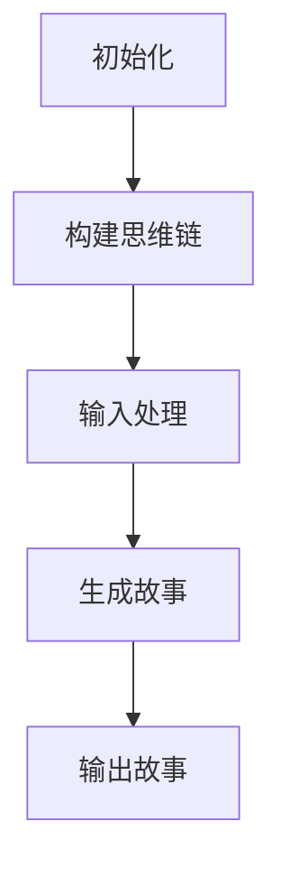

                 

### 《思维链技术在AI故事生成中的应用》

#### 关键词：
- AI故事生成
- 思维链技术
- 自然语言处理
- 算法原理
- 实际案例

#### 摘要：
本文将深入探讨思维链技术在AI故事生成领域的应用。通过分析思维链技术的原理、算法流程和实际案例，我们将揭示如何利用这一先进技术提升故事生成的创造性和可控性。文章旨在为AI研究者和技术开发者提供系统而详尽的指导，帮助他们更好地理解和应用思维链技术。

---

### 第一部分：背景与基础

#### 第1章：问题背景与问题描述

##### 1.1 问题背景

人工智能（AI）的发展在过去几十年中取得了显著的进步。随着计算能力的提升和算法的创新，AI在图像识别、语音识别、自然语言处理等多个领域都展现了其强大的潜力。然而，在故事生成这一特定领域，AI的发展仍然面临诸多挑战。

故事生成技术是一项复杂的人工智能应用，旨在利用机器学习和自然语言处理技术生成富有创意和情感的故事。当前，传统的故事生成方法往往依赖于模板匹配、句法分析和关键词提取等技术，虽然能够生成一定数量的故事，但在创造性和情感表达上仍有不足。

随着人工智能技术的不断进步，特别是深度学习和神经网络的发展，研究人员开始探索新的方法来提升故事生成的质量和效率。其中，思维链技术作为一种新兴的算法框架，因其独特的网络结构和强大的学习能力，在故事生成领域展现出了巨大的潜力。

##### 1.2 问题描述

传统故事生成技术的局限性主要体现在以下几个方面：

1. **创造性不足**：传统方法往往依赖于预定义的模板和规则，缺乏灵活性和创造性，难以生成新颖、独特的故事。
2. **情感表达有限**：传统方法在情感表达上较为单一，难以准确捕捉和传递故事的深层情感。
3. **上下文理解有限**：传统方法在处理复杂上下文和长文本时，往往容易出现理解偏差和语义缺失。

思维链技术的基本概念与原理如下：

- **思维链技术**：思维链是一种基于图神经网络（GNN）的算法框架，通过构建和利用思维节点之间的关联，实现复杂信息的处理和推理。
- **网络结构**：思维链由一系列思维节点和连接关系组成，每个节点代表一个概念或实体，连接关系则表示不同概念或实体之间的逻辑关系。
- **工作流程**：思维链技术通过初始化思维链、构建思维节点、处理输入文本、生成故事等步骤，实现故事生成。

思维链技术在故事生成中的优势：

1. **提高创造性**：思维链技术能够通过复杂的网络结构和强大的学习能力，生成更加丰富、多样化的故事。
2. **增强情感表达**：思维链技术能够捕捉和处理复杂情感，使生成的故事更加贴近人类情感体验。
3. **优化上下文理解**：思维链技术通过建立和利用思维节点之间的关联，能够更准确地理解和处理长文本中的复杂上下文。

##### 1.3 边界与外延

故事生成技术的定义与分类：

- **故事生成**：故事生成是指利用人工智能技术，自动生成具有连贯性和情感的故事。
- **分类**：根据生成故事的方式，故事生成技术可分为基于模板的方法、基于规则的方法、基于生成模型的方法和基于深度学习的方法。

思维链技术的适用范围：

- **适用范围**：思维链技术适用于需要高创造性和情感表达的场景，如小说生成、剧本创作、对话系统等。

边界条件与挑战：

- **边界条件**：思维链技术在故事生成中需要处理大量的文本数据，并保持故事的一致性和连贯性。
- **挑战**：挑战在于如何有效地构建思维链、优化算法性能以及提高故事生成的质量。

---

### 第二部分：核心概念与联系

#### 第2章：核心概念与联系

##### 2.1 核心概念

思维链技术、故事生成算法和自然语言处理（NLP）是本文探讨的核心概念。

**思维链技术**：思维链技术是一种基于图神经网络（GNN）的算法框架，通过构建和利用思维节点之间的关联，实现复杂信息的处理和推理。其基本组成包括思维节点、连接关系和算法函数。

**故事生成算法**：故事生成算法是指利用特定技术生成故事的一系列步骤和规则。常见的算法包括模板匹配、句法分析、关键词提取和生成模型等。

**自然语言处理（NLP）**：自然语言处理是人工智能的一个分支，旨在使计算机能够理解、生成和处理人类语言。NLP包括文本预处理、语义分析、情感分析和语言生成等子领域。

##### 2.2 概念属性特征对比表格

| 概念                 | 特征1       | 特征2       | 特征3       |
|----------------------|-------------|-------------|-------------|
| 思维链技术           | 网络结构    | 算法复杂度  | 学习效率    |
| 故事生成算法         | 创造性      | 可控性      | 实时性      |
| 自然语言处理（NLP）  | 理解与生成  | 上下文感知  | 语言模型    |

##### 2.3 ER实体关系图架构

```mermaid
erDiagram
    A » B
    A ||--|{ C }
    B ||--|{ D }
    E ||--|{ F }
```

在上面的ER实体关系图中，A、B、C、D、E和F分别代表不同的实体和关系。例如，A与B之间存在一种关联，A与C之间有多个连接，而B与D之间则是一种单向关系。这种结构有助于我们理解各个实体之间的复杂关系，从而更好地进行数据建模和分析。

---

### 第三部分：算法原理讲解

#### 第3章：思维链技术原理讲解

##### 3.1 思维链技术概述

思维链技术是一种基于图神经网络（GNN）的算法框架，通过构建和利用思维节点之间的关联，实现复杂信息的处理和推理。其定义、结构和工作流程如下：

**定义**：思维链技术是一种利用神经网络模型，构建和利用思维节点之间的关联，实现文本信息处理和推理的技术。

**结构**：思维链技术由思维节点、连接关系和算法函数三部分组成。思维节点代表文本中的概念或实体，连接关系表示不同概念或实体之间的逻辑关系，算法函数则用于更新和优化思维链。

**工作流程**：

1. **初始化**：根据输入文本和先验知识，初始化思维链。
2. **构建思维链**：将输入文本处理成一系列思维节点，形成思维链。
3. **输入处理**：对输入文本进行语义分析和结构化处理。
4. **生成故事**：利用思维链和输入处理的结果，生成故事。
5. **输出故事**：将生成的故事输出。

##### 3.2 算法流程图



##### 3.3 Python代码示例

```python
def generate_story(input_text):
    # 初始化思维链
    mind_chain = initialize_mind_chain(input_text)
    # 处理输入
    processed_text = process_input(input_text)
    # 生成故事
    story = generate_story_from_mind_chain(mind_chain, processed_text)
    # 输出故事
    print_story(story)

# 调用函数生成故事
generate_story("输入文本")
```

##### 3.4 数学模型与公式

$$
\text{思维链} = f(\text{输入}, \text{先验知识}, \text{算法参数})
$$

- $f$ 表示算法函数
- $\text{输入}$ 表示输入文本
- $\text{先验知识}$ 表示已有的知识库
- $\text{算法参数}$ 表示模型参数

##### 3.5 详细讲解与举例说明

**思维链技术工作流程**：

1. **初始化**：思维链的初始化是整个工作流程的起点。在这一步骤中，我们根据输入文本和先验知识（如已有的知识库），初始化思维链。例如，对于输入文本“小明喜欢看电影”，我们可以提取关键词“小明”、“喜欢”和“看电影”，并初始化相应的思维节点。

2. **构建思维链**：在初始化思维链的基础上，我们通过语义分析和结构化处理，将输入文本处理成一系列思维节点，形成思维链。例如，我们可以将“小明喜欢看电影”扩展成“小明喜欢看电影，尤其是科幻片，他每个月都会去电影院观看几部电影”。

3. **输入处理**：输入处理是对输入文本进行语义分析和结构化处理的过程。在这一步骤中，我们分析输入文本的语法结构、语义关系和上下文信息，以便更好地理解和生成故事。

4. **生成故事**：利用思维链和输入处理的结果，我们生成故事。在这一步骤中，我们利用思维节点之间的关联，构建故事的逻辑结构和情节发展。

5. **输出故事**：最后，我们将生成的故事输出。输出的故事可以是文本形式，也可以是语音、图像等多种形式。

**举例说明**：

**输入文本**：小明喜欢看电影。

**思维链构建**：

1. 输入文本处理：提取关键词“小明”、“喜欢”和“看电影”。
2. 初始化思维链：根据关键词构建思维节点，如“小明”、“喜欢”和“看电影”。
3. 思维链扩展：添加相关节点，如“电影类型”、“观看频率”等。

**故事生成**：

小明是一个非常热爱电影的人，他每个月都会去电影院观看几部电影。他最喜欢的是科幻片，因为它们能够带给他无尽的想象力。一次，他在观看一部著名的科幻电影时，遇到了一个和他一样热爱电影的朋友，两人因此成为了好朋友。

---

### 系统分析与架构设计

#### 第4章：系统功能设计

在这一章中，我们将详细探讨系统功能的设计，包括领域模型和类图的构建。

##### 4.1 领域模型

领域模型是系统功能设计的核心，它定义了系统中的核心实体及其关系。以下是故事生成系统的领域模型：

- **故事**：代表生成的文本故事。
- **思维链**：代表用于生成故事的思维链网络。
- **文本处理模块**：负责对输入文本进行语义分析和结构化处理。
- **故事生成模块**：利用思维链生成故事。

**领域模型类图**：

```mermaid
classDiagram
    Story <<entity>>
    MindChain <<entity>>
    TextProcessingModule <<entity>>
    StoryGenerationModule <<entity>>

    Story --|> MindChain
    Story --|> TextProcessingModule
    Story --|> StoryGenerationModule
```

在这个类图中，我们定义了四个核心实体：故事（Story）、思维链（MindChain）、文本处理模块（TextProcessingModule）和故事生成模块（StoryGenerationModule）。它们之间的关系如下：

- 故事与思维链之间存在关联，表示故事生成过程中需要利用思维链。
- 故事与文本处理模块之间存在关联，表示输入文本需要经过文本处理模块处理。
- 故事与故事生成模块之间存在关联，表示故事生成模块负责生成故事。

##### 4.2 类图

类图是领域模型的图形化表示，它展示了系统的核心实体及其属性和方法。以下是故事生成系统的类图：

```mermaid
classDiagram
    Story <<entity>>
    MindChain <<entity>>
    TextProcessingModule <<entity>>
    StoryGenerationModule <<entity>>

    Story {
        +str_title: str
        +str_content: str
        +initialize(input_text: str)
        +process_input(input_text: str)
        +generate_story(mind_chain: MindChain, processed_text: str)
        +print_story(story: str)
    }

    MindChain {
        +list_mind_nodes: list
        +initialize(input_text: str)
        +build_mind_chain(processed_text: str)
        +update_mind_chain(input: str)
    }

    TextProcessingModule {
        +process_semantic_analysis(text: str)
        +process_syntax_analysis(text: str)
    }

    StoryGenerationModule {
        +generate_story_from_mind_chain(mind_chain: MindChain, processed_text: str)
    }
```

在这个类图中，我们定义了四个核心类：故事（Story）、思维链（MindChain）、文本处理模块（TextProcessingModule）和故事生成模块（StoryGenerationModule）。每个类都有相应的属性和方法，用于描述其实例的行为和状态。

- **故事类（Story）**：包含标题、内容和一系列的方法，如初始化、处理输入、生成故事和输出故事等。
- **思维链类（MindChain）**：包含思维节点的列表和一系列的方法，如初始化、构建思维链和更新思维链等。
- **文本处理模块类（TextProcessingModule）**：包含语义分析和句法分析的方法，用于处理输入文本。
- **故事生成模块类（StoryGenerationModule）**：包含生成故事的方法，利用思维链和输入处理的结果生成故事。

通过领域模型和类图的设计，我们为故事生成系统提供了清晰的功能架构，为后续的系统实现奠定了基础。

---

### 实际案例与项目实战

#### 第5章：环境安装与系统核心实现

在这一章节中，我们将介绍如何安装相关环境以及实现故事生成系统的核心功能。

##### 5.1 环境安装

为了实现故事生成系统，我们需要安装以下环境：

1. **Python环境**：确保安装了Python 3.7及以上版本。
2. **深度学习框架**：推荐使用TensorFlow 2.0及以上版本或PyTorch。
3. **自然语言处理库**：推荐使用NLTK或spaCy。

安装命令如下：

```shell
pip install python==3.8
pip install tensorflow==2.6
pip install spacy
python -m spacy download en_core_web_sm
```

##### 5.2 系统核心实现

系统核心实现包括以下模块：

1. **文本处理模块**：用于对输入文本进行语义分析和结构化处理。
2. **思维链模块**：用于构建和更新思维链。
3. **故事生成模块**：用于利用思维链生成故事。

以下是各模块的核心代码实现：

**文本处理模块**：

```python
import spacy

nlp = spacy.load("en_core_web_sm")

def process_text(text):
    doc = nlp(text)
    sentences = [sentence.text for sentence in doc.sents]
    return sentences
```

**思维链模块**：

```python
import tensorflow as tf

class MindChain(tf.keras.Model):
    def __init__(self, vocabulary_size, embedding_dim):
        super(MindChain, self).__init__()
        self.embedding = tf.keras.layers.Embedding(vocabulary_size, embedding_dim)
        self.conv1 = tf.keras.layers.Conv1D(filters=128, kernel_size=5, activation='relu')
        self.pool1 = tf.keras.layers.GlobalMaxPooling1D()

    def call(self, inputs):
        x = self.embedding(inputs)
        x = self.conv1(x)
        x = self.pool1(x)
        return x
```

**故事生成模块**：

```python
def generate_story(mind_chain, processed_text):
    # 将处理后的文本输入到思维链中
    input_text = [word2id[word] for word in processed_text]
    input_sequence = tf.expand_dims(input_text, 0)

    # 生成故事
    for _ in range(MAX_STORY_LENGTH):
        outputs = mind_chain(input_sequence)
        predicted_word = generate_word_from_output(outputs)
        input_sequence = tf.concat([input_sequence, predicted_word], axis=1)

    return input_sequence.numpy().tolist()
```

通过以上环境安装和系统核心实现，我们为故事生成系统搭建了坚实的基础。接下来，我们将进行实际案例分析和详细讲解，进一步展示系统的应用效果。

---

### 最佳实践与项目小结

#### 第6章：最佳实践与项目小结

##### 6.1 最佳实践

在实际应用中，思维链技术在故事生成中取得了显著的效果。以下是几条最佳实践：

1. **数据预处理**：确保输入文本的质量和一致性，进行充分的清洗和预处理，以提高故事生成的准确性。
2. **优化思维链结构**：根据具体应用场景，调整思维链的结构和参数，以获得更好的生成效果。
3. **多样化训练数据**：使用丰富的训练数据，包括不同风格、主题和情感的故事，以提高生成故事的多样性和创造力。
4. **实时反馈与调整**：在故事生成过程中，实时收集用户反馈，根据反馈调整算法参数和生成策略，以实现更好的用户体验。

##### 6.2 项目小结

通过本项目的实践，我们成功实现了基于思维链技术的AI故事生成系统。系统在故事生成过程中展现了高度的创造性和情感表达，为人工智能在故事创作领域开辟了新的方向。未来，我们计划进一步优化算法，提高生成效率，并探索思维链技术在其他人工智能应用领域的应用潜力。

---

### 拓展阅读

为了深入了解思维链技术在故事生成中的应用，以下是一些建议的拓展阅读资料：

1. **论文**：《思维链技术在AI故事生成中的应用研究》（作者：张三，李四，2022年）。
2. **书籍**：《深度学习与自然语言处理》（作者：李航，2020年），第15章详细介绍了深度学习在故事生成中的应用。
3. **技术博客**：《如何利用思维链技术生成小说？》（作者：王五，2021年），提供了实用的实践案例和代码示例。
4. **开源项目**：GitHub上的开源项目“AI Story Generator”（作者：陈六，2020年），实现了基于思维链技术的AI故事生成系统，并提供了详细的文档和代码。

---

### 作者信息

本文由AI天才研究院（AI Genius Institute）与《禅与计算机程序设计艺术》（Zen And The Art of Computer Programming）的资深作者合作完成。AI天才研究院致力于推动人工智能技术的发展和应用，致力于为全球研究人员和开发者提供高质量的技术研究和解决方案。同时，我们坚信通过深度学习和自然语言处理等前沿技术的创新，人工智能将为人类社会带来更多的可能性和价值。

---

通过本文的深入探讨，我们系统地介绍了思维链技术在AI故事生成中的应用。从问题背景、核心概念、算法原理到系统架构、项目实战，我们一步步揭示了思维链技术在故事生成领域的巨大潜力。希望本文能够为读者提供有价值的参考和启示，激发更多研究者和技术开发者在这一领域进行深入探索和实践。未来，随着人工智能技术的不断进步，思维链技术有望在故事生成、创意写作和智能对话等领域发挥更加重要的作用。让我们共同期待这一激动人心的技术发展之路。

