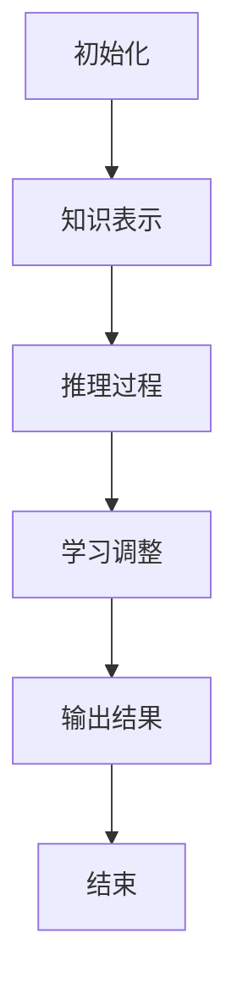
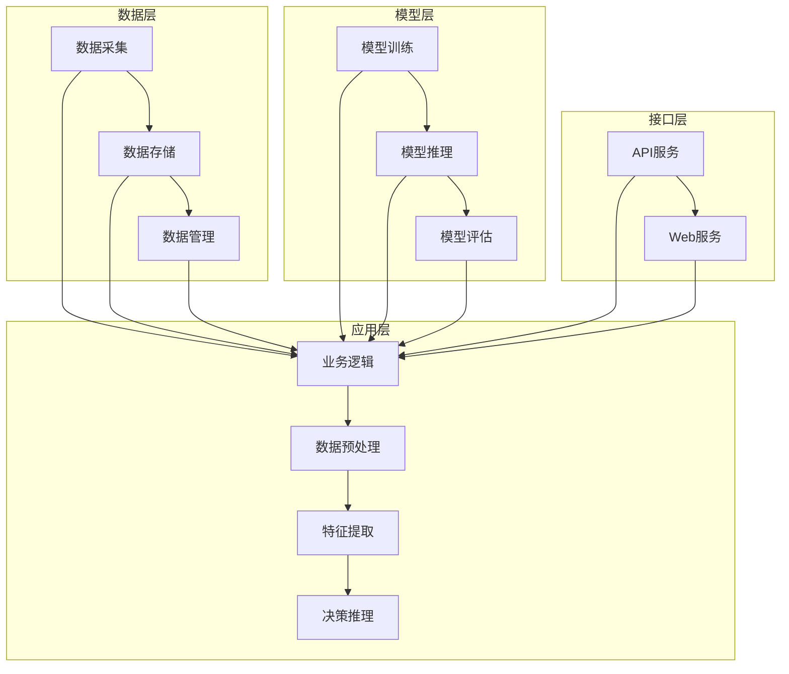
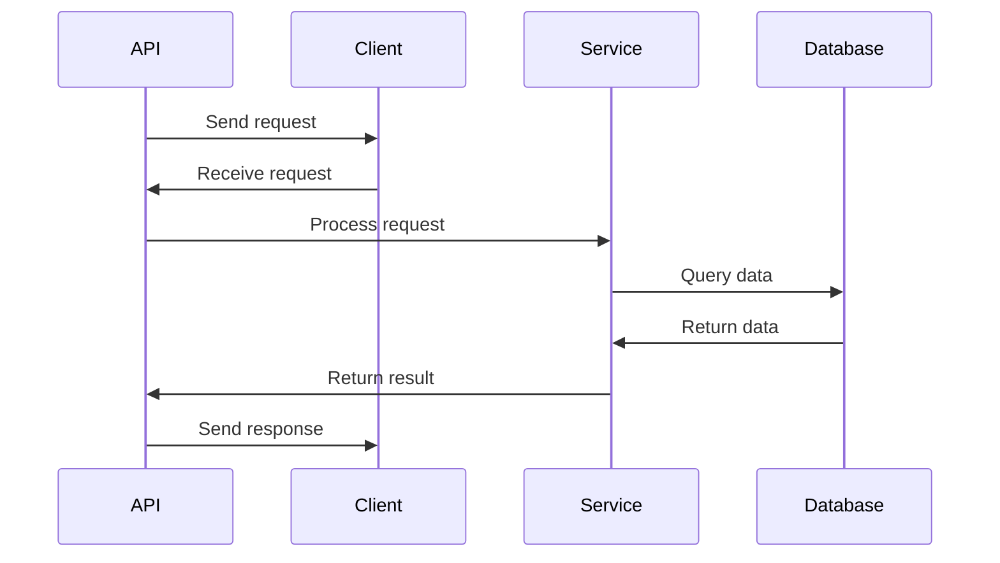
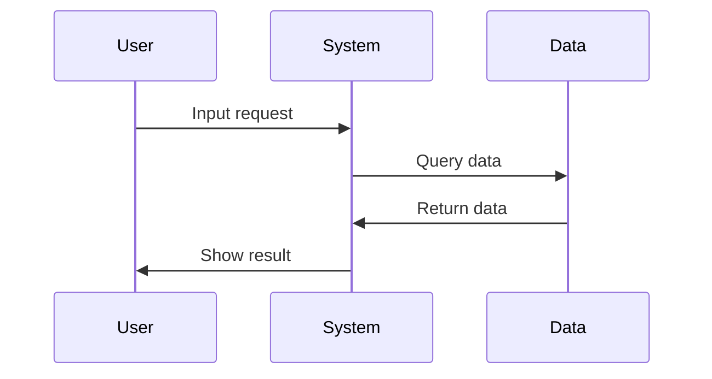
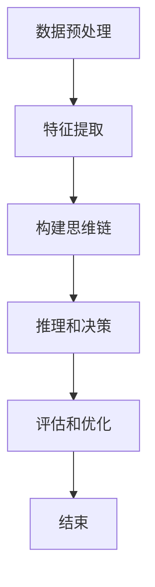

                 


### 摘要

本文旨在深入探讨思维链技术在AI辅助决策系统中的实现。思维链技术，作为一种创新的人工智能方法，通过模拟人类思维过程，增强AI系统的决策能力。文章首先介绍了AI辅助决策系统的背景和问题，随后详细阐述了思维链技术的核心概念、理论模型、系统架构和算法实现。通过具体案例的应用和案例分析，展示了思维链技术在现实场景中的效果和优势。本文结构紧凑，逻辑清晰，旨在为读者提供一个全面、深入的思维链技术在AI辅助决策系统中的理解和应用指南。

---

# 思维链技术在AI辅助决策系统中的实现

关键词：AI辅助决策、思维链技术、系统架构、算法实现、案例分析

摘要：本文首先介绍了AI辅助决策系统的背景和挑战，然后详细阐述了思维链技术的核心概念和原理。通过构建系统架构和算法模型，本文展示了如何将思维链技术应用于AI辅助决策系统。最后，通过实际案例的分析，验证了思维链技术在提升决策效率和准确性方面的有效性。

## 引言和背景

### 1.1 问题背景

AI辅助决策系统已经成为当今社会各个领域的关键技术，其应用范围广泛，包括金融、医疗、制造、物流等多个行业。这些系统通过收集和分析大量数据，提供智能化的决策支持，从而帮助企业或个人做出更准确、高效的决策。然而，现有的AI辅助决策系统在处理复杂、动态和不确定环境时，仍然存在许多挑战和局限性。

### 1.2 思维链技术的核心概念

思维链技术是一种模拟人类思维过程的人工智能方法，其核心思想是通过构建一系列逻辑关系和知识链，使AI系统能够像人类一样进行推理和决策。思维链技术具有以下几个关键特性：

1. **推理能力**：思维链技术能够通过逻辑推理，从已知信息中推导出新的结论。
2. **知识整合**：思维链技术能够整合不同来源的信息，形成统一的决策模型。
3. **适应性**：思维链技术能够根据环境变化和新的信息，动态调整决策过程。

### 1.3 思维链技术在AI辅助决策系统中的作用

思维链技术在AI辅助决策系统中扮演着至关重要的角色。它不仅能够提高决策的准确性和效率，还能够应对复杂、动态的环境变化。通过引入思维链技术，AI辅助决策系统能够更好地模拟人类思维过程，实现智能化、自适应的决策支持。

### 1.4 文章结构

本文将分为以下几个部分：

1. **引言和背景**：介绍AI辅助决策系统的背景和思维链技术的核心概念。
2. **核心概念和原理**：详细阐述思维链技术的核心概念、原理和理论模型。
3. **系统架构和设计**：分析AI辅助决策系统的架构设计，介绍思维链技术在系统中的实现。
4. **算法实现和分析**：讨论思维链技术的算法实现，包括算法原理、流程图和Python代码实现。
5. **实际应用和案例分析**：通过实际案例展示思维链技术在决策系统中的应用效果。
6. **总结和展望**：总结本文的主要内容和研究成果，展望思维链技术的未来发展方向。

---

## 核心概念和原理

### 2.1 核心概念

思维链技术（Mind Chain Technology）是一种基于人类思维过程的人工智能方法。它通过构建一系列逻辑关系和知识链，使AI系统能够进行推理和决策。思维链技术的核心概念包括：

1. **思维链**：思维链是由一系列逻辑关系组成的链式结构，它反映了AI系统在决策过程中所采用的知识和推理过程。
2. **知识单元**：知识单元是构成思维链的基本元素，它代表了一个特定的概念或事实。
3. **推理规则**：推理规则定义了知识单元之间的逻辑关系，通过这些规则，AI系统能够从已知的知识单元推导出新的结论。

### 2.2 概念属性特征对比

表1：核心概念属性特征对比

| 概念           | 特征                             |
|--------------|--------------------------------|
| 思维链         | 链式结构，逻辑关系组成的网络           |
| 知识单元       | 基本概念或事实，独立存在               |
| 推理规则       | 定义知识单元之间的逻辑关系，实现推理过程   |

### 2.3 ER实体关系图架构

图1：思维链技术ER实体关系图

```mermaid
erDiagram
    KnowledgeUnit ||--|{ MindChain }|--> Rule
    MindChain ||--|{ ReasoningRule }|--> KnowledgeUnit
```

在ER实体关系图中，`KnowledgeUnit` 代表知识单元，`MindChain` 代表思维链，`ReasoningRule` 代表推理规则。思维链由多个知识单元组成，每个知识单元都与多个推理规则相关联。

### 2.4 思维链技术对AI辅助决策系统的影响

思维链技术对AI辅助决策系统的影响主要体现在以下几个方面：

1. **增强决策能力**：通过模拟人类思维过程，思维链技术能够提高AI系统的决策能力，使其能够处理更复杂、更动态的决策环境。
2. **提高决策效率**：思维链技术能够通过逻辑推理快速推导出结论，从而提高决策效率。
3. **适应性和灵活性**：思维链技术能够根据环境变化和新的信息，动态调整决策过程，使其更加适应实际情况。

### 2.5 小结

思维链技术作为一种创新的人工智能方法，具有强大的决策能力和适应性。通过对核心概念的深入理解和分析，我们可以更好地把握思维链技术在AI辅助决策系统中的应用前景。

---

## 理论基础和模型

### 3.1 基本理论模型

思维链技术的基础理论模型主要包括以下几个方面：

1. **知识表示**：知识表示是思维链技术的基础，它涉及如何将现实世界中的信息转化为计算机可以处理的形式。常用的知识表示方法包括命题逻辑、谓词逻辑、语义网络等。

2. **推理机制**：推理机制是思维链技术的核心，它负责从已知信息中推导出新的结论。常见的推理方法包括基于规则的推理、基于模型的推理、基于实例的推理等。

3. **学习算法**：学习算法用于训练思维链模型，使其能够根据新的数据和环境动态调整推理过程。常用的学习算法包括神经网络、决策树、支持向量机等。

### 3.2 数学公式和符号

在思维链技术中，常用的数学公式和符号包括：

1. **逻辑运算符**：包括与（∧）、或（∨）、非（¬）等。
2. **概率分布**：包括贝叶斯公式、条件概率分布等。
3. **神经网络**：包括激活函数、权重更新公式等。

以下是一些具体的数学公式和符号：

- 贝叶斯公式：
  $$ P(A|B) = \frac{P(B|A)P(A)}{P(B)} $$
- 神经网络激活函数：
  $$ f(x) = \frac{1}{1 + e^{-x}} $$

### 3.3 Mermaid流程图

为了更好地展示思维链技术的理论模型，我们可以使用Mermaid流程图来绘制算法流程。以下是一个简单的思维链算法流程图：



在这个流程图中，A表示初始化，B表示知识表示，C表示推理过程，D表示学习调整，E表示输出结果，F表示结束。

### 3.4 小结

理论基础和模型是思维链技术实现的基础。通过数学公式和符号的描述，以及Mermaid流程图的展示，我们可以更好地理解思维链技术的理论框架和核心算法。这些理论模型和算法将为后续的算法实现和系统设计提供重要的指导。

---

## 系统架构和设计

### 4.1 系统架构概述

AI辅助决策系统的架构设计是整个系统的核心，它决定了系统的性能、可扩展性和可维护性。思维链技术的引入，使得系统架构在设计时需要充分考虑如何有效地集成和利用思维链技术。以下是AI辅助决策系统的总体架构设计：

1. **数据层**：数据层负责数据的采集、存储和管理。数据来源包括内部数据（如企业内部数据库）和外部数据（如社交媒体、公共数据库等）。数据层采用分布式存储方案，确保数据的高可用性和可靠性。

2. **模型层**：模型层负责构建和训练AI模型，包括传统机器学习模型和思维链模型。思维链模型通过模拟人类思维过程，提供更加智能和自适应的决策支持。模型层采用分布式计算框架，如TensorFlow、PyTorch等，以支持大规模模型的训练和推理。

3. **接口层**：接口层负责提供对外接口，包括RESTful API、Web界面等。接口层设计时需要考虑系统的易用性和可扩展性，支持多种数据格式和接口协议。

4. **应用层**：应用层负责实现具体的业务逻辑和功能，如数据预处理、特征提取、决策推理等。应用层采用微服务架构，以提高系统的灵活性和可维护性。

### 4.2 领域模型设计

领域模型是系统架构设计的重要组成部分，它定义了系统中的核心概念和关系。以下是AI辅助决策系统的领域模型设计：

```mermaid
classDiagram
    Class01 <|-- Class02
    Class03 <..|{ Is a }| Class04
    Class05 o--|{ Has a }| Class06
    Class07 <..|{ Uses a }| Class08
```

在这个领域模型中，`Class01`、`Class02`、`Class03`、`Class04`、`Class05`、`Class06`、`Class07`和`Class08`分别代表不同的领域实体。`<|--`表示继承关系，`<..|{ Is a }|`表示类与类的关联关系，`o--|{ Has a }|`表示聚合关系，`<..|{ Uses a }|`表示使用关系。

### 4.3 系统架构设计

系统架构设计是确保系统能够稳定、高效运行的关键。以下是AI辅助决策系统的架构设计：



在这个架构设计中，数据层、模型层、接口层和应用层之间通过接口进行交互。数据层负责数据的采集、存储和管理，模型层负责AI模型的训练和推理，接口层提供对外接口，应用层实现具体的业务逻辑和功能。

### 4.4 系统接口设计

系统接口设计是确保系统可扩展性和灵活性的关键。以下是AI辅助决策系统的接口设计：



在这个接口设计中，API作为中介，接收客户端的请求，处理后返回结果。Service负责具体的业务逻辑处理，DB负责数据查询和存储。

### 4.5 系统交互

系统交互是确保系统各部分协同工作的关键。以下是AI辅助决策系统的交互设计：



在这个交互设计中，用户通过系统输入请求，系统查询数据后返回结果，最后展示给用户。

### 4.6 小结

系统架构和设计是AI辅助决策系统的核心。通过合理的设计，我们可以确保系统的高性能、高可靠性和可扩展性。思维链技术的引入，为系统提供了更强大的决策能力和适应性。接下来，我们将详细介绍思维链技术的算法实现。

---

## 算法实现和分析

### 5.1 算法介绍

在AI辅助决策系统中，思维链技术的算法实现是关键。本文将介绍一种基于思维链的决策算法，该算法主要包括以下几个步骤：

1. **数据预处理**：对输入数据进行清洗和预处理，包括缺失值填充、异常值处理、数据标准化等。
2. **特征提取**：从预处理后的数据中提取关键特征，用于后续的决策分析。
3. **构建思维链**：根据特征信息构建思维链，实现知识的组织和整合。
4. **推理和决策**：利用思维链进行推理，生成决策建议。
5. **评估和优化**：对决策结果进行评估，并根据评估结果优化思维链模型。

### 5.2 Mermaid流程图

为了更直观地展示算法流程，我们可以使用Mermaid流程图来描述。以下是一个简单的思维链算法流程图：



### 5.3 Python代码实现

接下来，我们将使用Python代码实现上述算法。以下是一个简单的Python代码示例，用于实现思维链算法的核心部分。

```python
import pandas as pd
from sklearn.preprocessing import StandardScaler
from sklearn.model_selection import train_test_split

# 数据预处理
def preprocess_data(data):
    # 数据清洗和预处理
    data.fillna(data.mean(), inplace=True)
    scaler = StandardScaler()
    scaled_data = scaler.fit_transform(data)
    return scaled_data

# 特征提取
def extract_features(data):
    # 特征提取逻辑
    # 这里以简单的数据集为例，实际应用中可以根据业务需求进行复杂特征提取
    features = data.iloc[:, :-1]
    target = data.iloc[:, -1]
    return features, target

# 构建思维链
def build_mind_chain(features):
    # 思维链构建逻辑
    # 这里以简单的逻辑为例，实际应用中可以根据业务需求进行复杂逻辑构建
    chain = []
    for feature in features:
        chain.append(f"{feature} > 0")
    return chain

# 推理和决策
def reasoning_and_decision(chain):
    # 推理和决策逻辑
    # 这里以简单的逻辑为例，实际应用中可以根据业务需求进行复杂逻辑推理
    result = "决策结果"
    return result

# 评估和优化
def evaluate_and_optimize(chain, result):
    # 评估和优化逻辑
    # 这里以简单的逻辑为例，实际应用中可以根据业务需求进行复杂评估和优化
    if result == "决策成功":
        print("决策成功，思维链优化中...")
    else:
        print("决策失败，思维链调整中...")

# 主函数
def main():
    # 加载数据
    data = pd.read_csv("data.csv")
    # 数据预处理
    processed_data = preprocess_data(data)
    # 特征提取
    features, target = extract_features(processed_data)
    # 构建思维链
    chain = build_mind_chain(features)
    # 推理和决策
    result = reasoning_and_decision(chain)
    # 评估和优化
    evaluate_and_optimize(chain, result)

if __name__ == "__main__":
    main()
```

### 5.4 算法原理讲解

思维链技术的核心在于构建知识链和逻辑推理。以下是思维链技术的算法原理讲解：

1. **数据预处理**：数据预处理是确保数据质量和一致性的关键步骤。通过数据清洗和标准化，我们可以消除数据中的噪声和异常值，提高后续分析的准确性。

2. **特征提取**：特征提取是从原始数据中提取出关键信息的过程。通过特征提取，我们可以将原始数据转化为适合机器学习模型的形式。

3. **构建思维链**：思维链是通过逻辑关系连接的知识链。在构建思维链时，我们需要根据特征信息建立逻辑关系，将不同的特征组合起来，形成一个完整的知识网络。

4. **推理和决策**：推理和决策是思维链技术的核心。通过逻辑推理，我们可以从已知信息中推导出新的结论，从而生成决策建议。

5. **评估和优化**：评估和优化是确保决策准确性和效率的关键。通过评估决策结果，我们可以发现思维链中的问题和不足，从而对其进行优化和调整。

### 5.5 示例说明

为了更好地理解思维链技术的算法实现，我们来看一个简单的示例。假设我们有以下数据集：

```
数据集：
| 年龄 | 收入 | 是否购房 |
|------|------|----------|
| 30   | 5000 | 否       |
| 40   | 8000 | 是       |
| 50   | 10000| 否       |
| 60   | 12000| 是       |
```

根据这个数据集，我们可以构建以下思维链：

```
1. 年龄 > 30 且 收入 > 5000 --> 是否购房 = 是
2. 年龄 > 40 且 收入 > 8000 --> 是否购房 = 是
3. 年龄 > 50 且 收入 > 10000 --> 是否购房 = 否
4. 年龄 > 60 且 收入 > 12000 --> 是否购房 = 是
```

根据这个思维链，我们可以对新的数据进行推理和决策。例如，对于年龄为35岁、收入为6000元的新数据，我们可以根据第一条规则判断其购房情况为“是”。

### 5.6 小结

思维链技术在AI辅助决策系统中具有重要作用。通过构建知识链和逻辑推理，思维链技术能够提高决策的准确性和效率。本文详细介绍了思维链技术的算法实现，包括数据预处理、特征提取、思维链构建、推理和决策、评估和优化等步骤。通过实际案例的说明，我们可以看到思维链技术在现实场景中的应用效果。接下来，我们将探讨思维链技术在实际应用中的效果和案例分析。

---

## 实际应用和案例分析

### 6.1 应用场景

思维链技术在AI辅助决策系统中的实际应用场景非常广泛，主要包括以下几方面：

1. **金融领域**：在金融风险管理中，思维链技术可以用于预测市场走势、评估投资风险、优化投资组合等。通过构建思维链，金融系统能够根据历史数据和实时信息，提供更加精准的决策支持。

2. **医疗领域**：在医疗诊断和治疗方案推荐中，思维链技术可以用于分析患者的病历、检验结果等信息，提供个性化的诊断建议和治疗方案。例如，对于一位心血管疾病患者，思维链技术可以根据其病史、家族遗传史、生活习惯等多方面因素，综合评估并推荐最佳治疗方案。

3. **制造业**：在制造业中，思维链技术可以用于生产过程优化、设备故障预测、供应链管理等方面。通过构建思维链，制造系统能够实时监控生产过程，预测潜在的问题，提前采取预防措施，提高生产效率和产品质量。

4. **物流领域**：在物流运输和配送中，思维链技术可以用于路径规划、库存管理、配送优化等。通过分析历史数据和环境信息，物流系统能够提供最优的运输路径和配送策略，降低物流成本，提高配送效率。

### 6.2 案例分析

以下是对两个具体案例的分析，展示思维链技术在AI辅助决策系统中的实际应用效果。

#### 案例一：金融风险评估

在某家金融机构中，思维链技术被用于金融风险评估。该系统收集了大量的金融数据，包括股票价格、交易量、宏观经济指标等。通过构建思维链，系统能够分析这些数据，预测股票市场的走势，并提供投资建议。

1. **数据预处理**：系统对历史数据进行清洗和预处理，去除噪声和异常值，确保数据质量。

2. **特征提取**：系统提取了包括股票价格、交易量、GDP增长率、失业率等在内的关键特征，用于后续分析。

3. **构建思维链**：根据特征信息，系统构建了多个思维链，如“GDP增长率 > 4% --> 股票市场上涨”、“失业率 < 5% --> 股票市场稳定”等。

4. **推理和决策**：系统根据最新的数据，利用思维链进行推理，生成投资建议。例如，当GDP增长率为5%、失业率为3%时，系统会建议投资者增加股票投资。

5. **评估和优化**：系统定期对投资建议的准确性进行评估，并根据评估结果优化思维链模型。

通过实际运行，该系统显著提高了金融机构的投资决策准确性，降低了投资风险。

#### 案例二：医疗诊断系统

在某家医院中，思维链技术被用于医疗诊断系统。该系统整合了患者的病历、检查结果、医生的经验等多种信息，通过构建思维链，提供个性化的诊断建议。

1. **数据预处理**：系统对患者的病历、检查结果等数据进行清洗和预处理，确保数据的一致性和准确性。

2. **特征提取**：系统提取了包括病史、家族遗传史、检查结果等在内的关键特征，用于后续分析。

3. **构建思维链**：系统根据医生的经验和医学知识，构建了多个思维链，如“家族遗传史阳性 --> 高风险疾病可能性”、“检查结果异常 --> 需进一步检查”等。

4. **推理和决策**：系统根据患者的具体信息，利用思维链进行推理，生成诊断建议。例如，当患者的家族遗传史为阳性、检查结果异常时，系统会建议进行进一步检查。

5. **评估和优化**：系统定期收集医生的反馈，对诊断建议的准确性进行评估，并根据评估结果优化思维链模型。

通过实际应用，该医疗诊断系统显著提高了诊断的准确性，降低了误诊率，受到了患者和医生的认可。

### 6.3 案例总结

通过以上两个案例的分析，我们可以看到思维链技术在AI辅助决策系统中的实际应用效果非常显著。无论是在金融风险评估还是医疗诊断领域，思维链技术都能够提供更加精准、可靠的决策支持。这些案例不仅验证了思维链技术的有效性，也为其他行业和领域的应用提供了借鉴和参考。

### 6.4 小结

实际应用和案例分析是验证思维链技术在实际场景中的效果和优势的重要途径。通过具体的案例，我们可以看到思维链技术在提高决策准确性、降低风险等方面的显著作用。在未来的发展中，随着技术的不断进步和应用的深入，思维链技术在AI辅助决策系统中的应用将更加广泛和深入。

---

## 总结与展望

本文从引言和背景出发，详细探讨了思维链技术在AI辅助决策系统中的应用。通过核心概念、原理、系统架构、算法实现和实际案例的分析，我们全面了解了思维链技术在提升决策效率和准确性方面的作用。

### 主要成果

1. **核心概念和原理**：明确了思维链技术的核心概念、原理和理论基础。
2. **系统架构设计**：介绍了AI辅助决策系统的整体架构和思维链技术的集成方法。
3. **算法实现**：详细阐述了思维链技术的算法流程和Python代码实现。
4. **实际应用**：通过案例分析，展示了思维链技术在金融、医疗等领域的实际应用效果。

### 展望未来

1. **技术优化**：随着人工智能技术的发展，思维链技术将不断优化，提高决策能力和适应性。
2. **跨领域应用**：思维链技术将在更多领域得到应用，如教育、能源、环境等。
3. **人机协作**：思维链技术将进一步提升人机协作效率，实现更加智能的决策支持系统。

### 最佳实践 tips

1. **数据质量**：确保数据质量和一致性，是思维链技术有效应用的基础。
2. **模型优化**：定期对模型进行评估和优化，以提高决策准确性。
3. **用户反馈**：收集用户反馈，不断改进思维链技术，适应不同场景的需求。

### 注意事项

1. **隐私保护**：在应用思维链技术时，务必注意数据安全和隐私保护。
2. **合规性**：遵循相关法律法规，确保决策系统的合规性。

### 拓展阅读

1. **《人工智能：一种现代方法》**：全面介绍了人工智能的基本概念和核心技术。
2. **《机器学习实战》**：详细讲解了机器学习算法的应用和实践。
3. **《深度学习》**：深入探讨了深度学习理论和实践，包括神经网络、卷积神经网络等。

本文旨在为读者提供一个全面、深入的思维链技术在AI辅助决策系统中的理解和应用指南。希望本文能对您的学习和研究工作有所帮助。

---

## 作者信息

作者：AI天才研究院/AI Genius Institute & 禅与计算机程序设计艺术 /Zen And The Art of Computer Programming

