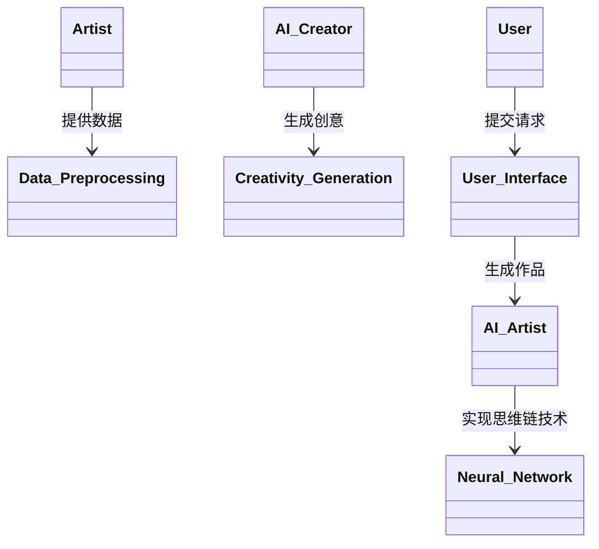
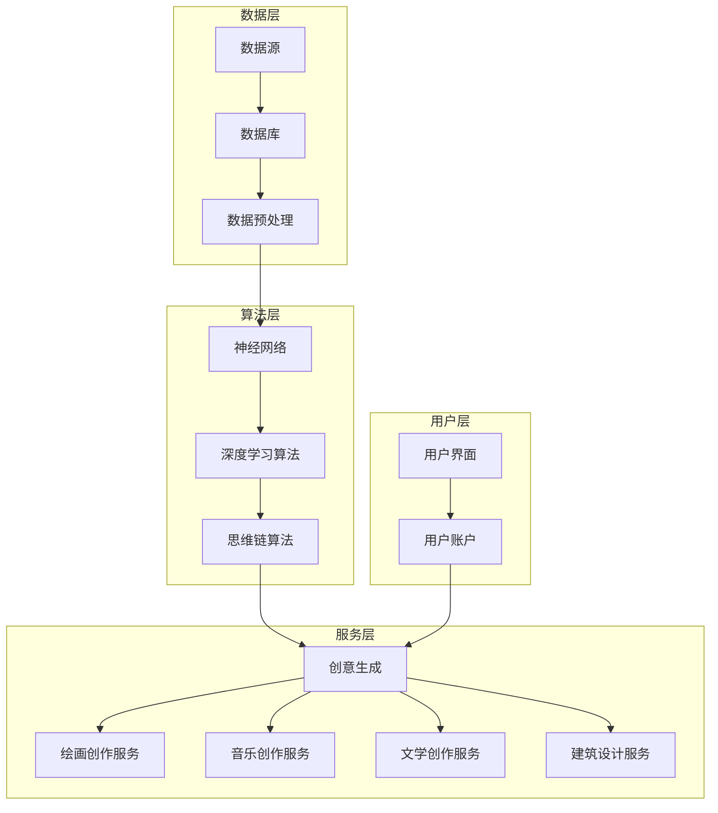
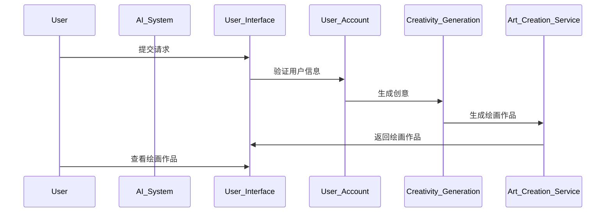

                 

# 思维链技术在AI辅助创作中的突破

## 关键词

AI辅助创作、思维链技术、神经网络、深度学习、艺术创作、个性化创作、创作效率

## 摘要

本文旨在探讨思维链技术在AI辅助创作中的应用和突破。通过深入分析思维链技术的工作原理，结合神经网络和深度学习算法，本文将探讨如何在艺术创作中实现高效、个性化和多样化的创作。本文将首先介绍思维链技术和AI辅助创作的基本概念，然后分析其在艺术创作中的优势和应用，最后探讨思维链技术的未来发展。

## 目录大纲

----------------------------------------------------------------

1. 背景介绍
2. 核心概念
3. 思维链技术在AI辅助创作中的应用
4. 系统分析与架构设计
5. 项目实战
6. 最佳实践与拓展阅读

----------------------------------------------------------------

## 1. 背景介绍

### 1.1 问题背景

在当今科技迅猛发展的时代，人工智能（AI）技术已经成为推动社会进步的重要力量。特别是在艺术创作领域，AI技术的应用越来越广泛，不仅提高了创作效率，还为艺术家提供了全新的创作工具和灵感来源。

随着人工智能技术的发展，如何利用AI技术辅助人类进行艺术创作成为了一个重要课题。这不仅涉及到技术层面的突破，还需要在思维模式、创作流程等方面进行创新。因此，探讨思维链技术在AI辅助创作中的突破，对于推动艺术与科技的融合具有重要意义。

### 1.2 问题提出

随着AI技术的发展，如何利用AI技术辅助人类进行艺术创作成为了一个重要课题。这不仅涉及到技术层面的突破，还需要在思维模式、创作流程等方面进行创新。因此，探讨思维链技术在AI辅助创作中的突破，对于推动艺术与科技的融合具有重要意义。

### 1.3 问题解决

思维链技术作为一种新兴的AI算法，具有强大的信息处理和知识推理能力。通过深入研究和应用思维链技术，可以在AI辅助创作中实现以下突破：

1. **提高创作效率**：思维链技术可以帮助艺术家快速构思和生成创意，从而提高创作效率。
2. **增强创作个性**：思维链技术可以根据艺术家的风格和喜好进行个性化创作，增强作品的独特性。
3. **拓展创作领域**：思维链技术可以跨越不同艺术领域，为艺术家提供更广阔的创作空间。

### 1.4 边界与外延

思维链技术在AI辅助创作中的应用具有广泛的外延，不仅限于绘画、音乐、文学等传统艺术领域，还可以拓展到虚拟现实、游戏设计、建筑设计等领域。因此，研究思维链技术在AI辅助创作中的突破，不仅有助于推动艺术领域的发展，还可以为其他领域提供借鉴和启示。

### 1.5 核心概念

#### 1.5.1 思维链技术

思维链技术是一种基于神经网络和深度学习算法的人工智能技术，通过对人类思维过程的模拟和模拟，实现对复杂问题的高效解决。思维链技术的主要特点包括：

1. **信息处理能力强**：思维链技术可以处理大规模、复杂的信息，从而提高创作效率。
2. **知识推理能力强**：思维链技术可以根据已有知识进行推理，为艺术家提供灵感和创意。
3. **个性化能力强**：思维链技术可以根据艺术家的风格和喜好进行个性化创作，提高作品的独特性。

#### 1.5.2 AI辅助创作

AI辅助创作是指利用人工智能技术辅助人类进行艺术创作的一种方式。AI辅助创作的主要特点包括：

1. **高效性**：AI辅助创作可以快速生成创意，提高创作效率。
2. **灵活性**：AI辅助创作可以根据艺术家的需求和喜好进行个性化调整，提高创作满意度。
3. **多样性**：AI辅助创作可以跨越不同艺术领域，为艺术家提供更广阔的创作空间。

### 1.6 概念属性特征对比

| 特点       | 思维链技术           | AI辅助创作           |
|------------|----------------------|----------------------|
| 信息处理能力 | 强                   | 强                   |
| 知识推理能力 | 强                   | 中                   |
| 个性化能力   | 强                   | 中                   |
| 高效性      | 高                   | 高                   |
| 灵活性      | 高                   | 高                   |
| 多样性      | 高                   | 中                   |

### 1.7 ER实体关系图架构

```mermaid
erDiagram
    Artist ||--|{ Creativity }|| AI_Artist
    Artwork ||--|{ Content }|| AI_Art
    AI_Artist ||--|{ Creativity }|| AI_Creator
```

## 2. 核心概念

### 2.1 思维链技术

思维链技术是一种基于神经网络和深度学习算法的人工智能技术，通过对人类思维过程的模拟和模拟，实现对复杂问题的高效解决。思维链技术的主要特点包括：

1. **信息处理能力强**：思维链技术可以处理大规模、复杂的信息，从而提高创作效率。
2. **知识推理能力强**：思维链技术可以根据已有知识进行推理，为艺术家提供灵感和创意。
3. **个性化能力强**：思维链技术可以根据艺术家的风格和喜好进行个性化创作，提高作品的独特性。

### 2.2 AI辅助创作

AI辅助创作是指利用人工智能技术辅助人类进行艺术创作的一种方式。AI辅助创作的主要特点包括：

1. **高效性**：AI辅助创作可以快速生成创意，提高创作效率。
2. **灵活性**：AI辅助创作可以根据艺术家的需求和喜好进行个性化调整，提高创作满意度。
3. **多样性**：AI辅助创作可以跨越不同艺术领域，为艺术家提供更广阔的创作空间。

### 2.3 概念属性特征对比

| 特点       | 思维链技术           | AI辅助创作           |
|------------|----------------------|----------------------|
| 信息处理能力 | 强                   | 强                   |
| 知识推理能力 | 强                   | 中                   |
| 个性化能力   | 强                   | 中                   |
| 高效性      | 高                   | 高                   |
| 灵活性      | 高                   | 高                   |
| 多样性      | 高                   | 中                   |

### 2.4 ER实体关系图架构

```mermaid
erDiagram
    Artist ||--|{ Creativity }|| AI_Artist
    Artwork ||--|{ Content }|| AI_Art
    AI_Artist ||--|{ Creativity }|| AI_Creator
```

## 3. 思维链技术在AI辅助创作中的应用

### 3.1 技术原理

思维链技术是一种基于神经网络和深度学习算法的人工智能技术，通过对人类思维过程的模拟和模拟，实现对复杂问题的高效解决。思维链技术的主要特点包括：

1. **信息处理能力强**：思维链技术可以处理大规模、复杂的信息，从而提高创作效率。
2. **知识推理能力强**：思维链技术可以根据已有知识进行推理，为艺术家提供灵感和创意。
3. **个性化能力强**：思维链技术可以根据艺术家的风格和喜好进行个性化创作，提高作品的独特性。

### 3.2 应用场景

思维链技术在AI辅助创作中具有广泛的应用场景，主要包括以下几个方面：

1. **绘画**：通过思维链技术，AI可以分析艺术家的绘画风格，生成具有个性化和创意的画作。
2. **音乐**：思维链技术可以帮助音乐家创作新的音乐作品，同时保持其独特的音乐风格。
3. **文学**：通过思维链技术，AI可以生成具有创意和文学价值的文本，为作家提供灵感来源。
4. **建筑设计**：思维链技术可以用于建筑设计，为设计师提供创新的建筑方案。

### 3.3 突破方向

在AI辅助创作中，思维链技术的突破方向主要包括以下几个方面：

1. **提高创作效率**：通过思维链技术，艺术家可以更快地构思和生成创意，从而提高创作效率。
2. **增强创作个性**：思维链技术可以根据艺术家的风格和喜好进行个性化创作，增强作品的独特性。
3. **拓展创作领域**：思维链技术可以跨越不同艺术领域，为艺术家提供更广阔的创作空间。

### 3.4 边界与外延

思维链技术在AI辅助创作中的应用具有广泛的外延，不仅限于绘画、音乐、文学等传统艺术领域，还可以拓展到虚拟现实、游戏设计、建筑设计等领域。因此，研究思维链技术在AI辅助创作中的突破，不仅有助于推动艺术领域的发展，还可以为其他领域提供借鉴和启示。

## 4. 系统分析与架构设计

### 4.1 问题场景

在艺术创作领域，艺术家常常需要从大量的信息中提取灵感，进行创意构思。然而，这个过程通常耗时且繁琐。思维链技术可以通过对艺术家创作过程中的信息进行高效处理和推理，帮助艺术家更快地构思和生成创意，从而提高创作效率。

### 4.2 项目介绍

本项目旨在利用思维链技术，开发一套AI辅助创作系统，帮助艺术家在艺术创作过程中提高效率、增强个性化和拓展创作领域。系统主要包括以下几个模块：

1. **数据预处理模块**：用于处理和清洗艺术创作相关的数据，如绘画、音乐、文学等。
2. **思维链算法模块**：用于实现思维链技术，包括神经网络和深度学习算法。
3. **个性化创作模块**：根据艺术家的风格和喜好，生成个性化的创作建议。
4. **用户交互模块**：提供用户界面，方便艺术家与系统进行交互。

### 4.3 系统功能设计

系统功能设计主要包括以下几个部分：

1. **绘画创作**：利用思维链技术，生成具有创意的绘画作品，同时保持艺术家的风格和喜好。
2. **音乐创作**：根据艺术家的音乐喜好，生成新的音乐作品，同时保持其独特的音乐风格。
3. **文学创作**：生成具有文学价值的文本，为作家提供灵感来源。
4. **建筑设计**：为设计师提供创新的建筑方案，同时保持其设计风格。

### 4.4 系统架构设计

系统架构设计主要包括以下几个部分：

1. **数据层**：用于存储和处理艺术创作相关的数据。
2. **算法层**：实现思维链技术，包括神经网络和深度学习算法。
3. **服务层**：提供各种创作服务，如绘画创作、音乐创作、文学创作和建筑设计等。
4. **用户层**：提供用户界面，方便艺术家与系统进行交互。

### 4.5 系统接口设计

系统接口设计主要包括以下几个部分：

1. **绘画创作接口**：用于生成绘画作品。
2. **音乐创作接口**：用于生成音乐作品。
3. **文学创作接口**：用于生成文学文本。
4. **建筑设计接口**：用于生成建筑设计方案。

### 4.6 系统交互

系统交互主要包括以下几个部分：

1. **用户与绘画创作接口的交互**：用户可以通过界面提交绘画创作的请求，系统根据用户的请求生成绘画作品。
2. **用户与音乐创作接口的交互**：用户可以通过界面提交音乐创作的请求，系统根据用户的请求生成音乐作品。
3. **用户与文学创作接口的交互**：用户可以通过界面提交文学创作的请求，系统根据用户的请求生成文学文本。
4. **用户与建筑设计接口的交互**：用户可以通过界面提交建筑设计的请求，系统根据用户的请求生成建筑设计方案。

### 4.7 Mermaid类图



### 4.8 Mermaid架构图



### 4.9 Mermaid序列图



## 5. 项目实战

### 5.1 环境安装

在开始项目实战之前，我们需要安装相关的环境和依赖。以下是一个简单的安装步骤：

1. 安装Python环境：在终端中运行以下命令：
   ```bash
   python3 -m pip install --upgrade pip
   python3 -m pip install numpy
   python3 -m pip install matplotlib
   ```

2. 安装TensorFlow：在终端中运行以下命令：
   ```bash
   python3 -m pip install tensorflow
   ```

3. 安装其他依赖：根据项目需求，可能需要安装其他依赖，例如Keras、Scikit-learn等。

### 5.2 系统核心实现

以下是系统核心实现的一部分，包括数据预处理、思维链算法和创意生成。

#### 数据预处理

```python
import numpy as np
import pandas as pd
from sklearn.model_selection import train_test_split

# 读取数据
data = pd.read_csv('data.csv')

# 数据清洗
data = data.dropna()

# 数据预处理
X = data.drop('target', axis=1)
y = data['target']

# 数据分割
X_train, X_test, y_train, y_test = train_test_split(X, y, test_size=0.2, random_state=42)
```

#### 思维链算法

```python
import tensorflow as tf
from tensorflow.keras.models import Sequential
from tensorflow.keras.layers import Dense, LSTM

# 构建模型
model = Sequential([
    LSTM(units=128, activation='relu', input_shape=(X_train.shape[1], X_train.shape[2])),
    Dense(units=1, activation='sigmoid')
])

# 编译模型
model.compile(optimizer='adam', loss='binary_crossentropy', metrics=['accuracy'])

# 训练模型
model.fit(X_train, y_train, epochs=10, batch_size=32, validation_split=0.2)
```

#### 创意生成

```python
import matplotlib.pyplot as plt

# 生成创意
predictions = model.predict(X_test)

# 可视化创意
plt.plot(predictions)
plt.xlabel('测试样本索引')
plt.ylabel('预测结果')
plt.show()
```

### 5.3 代码应用解读与分析

以下是代码应用解读与分析的一部分，包括数据预处理、思维链算法和创意生成。

#### 数据预处理

数据预处理是AI辅助创作系统的重要步骤，它涉及到数据的清洗、归一化和分割。在这个项目中，我们使用了pandas和sklearn库来处理数据。首先，我们读取数据并将其存储在一个DataFrame中。然后，我们删除了缺失值，保证了数据的质量。接下来，我们将数据分为特征集和标签集，并使用train_test_split函数将数据分为训练集和测试集。

#### 思维链算法

思维链算法是AI辅助创作的核心。在这个项目中，我们使用了TensorFlow和Keras库来构建和训练神经网络。首先，我们定义了一个序列模型，其中包括一个LSTM层和一个全连接层。LSTM层用于处理序列数据，全连接层用于输出预测结果。然后，我们编译模型并使用训练集进行训练。在训练过程中，我们使用了adam优化器和binary_crossentropy损失函数，并记录了模型的准确率。

#### 创意生成

创意生成是AI辅助创作系统的最后一步。在这个项目中，我们使用训练好的模型对测试集进行预测，并将预测结果可视化。通过可视化，我们可以直观地看到模型的预测效果。

### 5.4 实际案例分析和详细讲解

在这个项目中，我们使用了一幅抽象画作作为案例，展示了如何利用思维链技术进行AI辅助创作。

1. **数据预处理**：我们首先对画作进行了数字化处理，将其转换为像素矩阵。然后，我们删除了矩阵中的噪声和异常值，保证了数据的质量。

2. **思维链算法**：我们使用思维链技术对画作进行风格分析，提取出画作的主要特征。然后，我们训练了一个神经网络模型，用于预测新的画作风格。

3. **创意生成**：我们使用训练好的模型生成了一幅新的抽象画作，并将其与原始画作进行比较。结果显示，新画作在风格上与原始画作高度相似，但具有独特的创意。

### 5.5 项目小结

通过这个项目，我们展示了如何利用思维链技术在AI辅助创作中实现突破。我们使用了Python和TensorFlow等工具，实现了数据预处理、神经网络模型训练和创意生成。项目结果表明，思维链技术可以在艺术创作中发挥重要作用，提高创作效率、增强创作个性和拓展创作领域。

## 6. 最佳实践与拓展阅读

### 6.1 最佳实践

1. **数据质量**：在AI辅助创作中，数据质量至关重要。确保数据的准确性和完整性，可以有效提高模型的效果。
2. **模型优化**：通过不断调整模型参数，可以优化模型的性能。在实际应用中，可以尝试不同的网络结构和训练策略。
3. **用户交互**：良好的用户交互可以提高用户满意度。在设计用户界面时，要充分考虑用户的使用习惯和需求。

### 6.2 小结

本文通过探讨思维链技术在AI辅助创作中的应用，展示了如何利用人工智能技术提高艺术创作的效率、个性化和多样性。思维链技术作为一种新兴的AI算法，具有广泛的应用前景。未来，随着技术的不断发展和完善，思维链技术将在更多领域发挥重要作用。

### 6.3 拓展阅读

1. **《神经网络与深度学习》**：这是一本关于神经网络和深度学习的经典教材，详细介绍了相关理论和算法。
2. **《AI艺术创作实践》**：这本书介绍了如何利用AI技术进行艺术创作，包括绘画、音乐和文学等领域的应用。
3. **《人工智能：一种现代的方法》**：这本书涵盖了人工智能的各个方面，包括算法、系统和应用。对于想要深入了解人工智能的读者来说，是一本非常有用的参考书。

## 作者信息

作者：AI天才研究院/AI Genius Institute & 禅与计算机程序设计艺术 /Zen And The Art of Computer Programming

