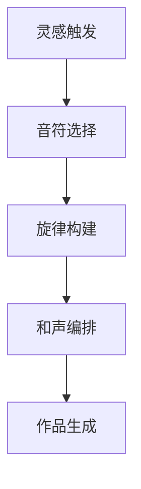
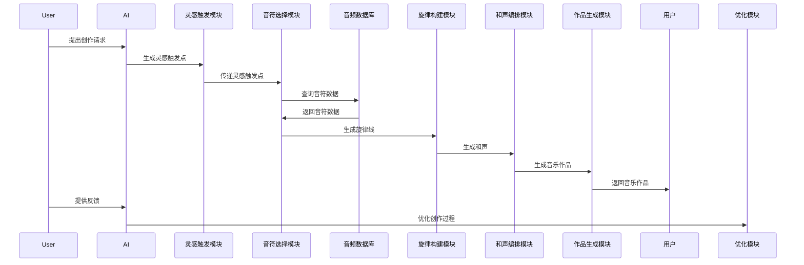

                 

## 《思维链技术在AI辅助创意音乐作曲中的应用》

### 关键词：思维链技术、AI辅助音乐创作、音乐创作、创意、算法、系统架构

### 摘要

本文探讨了思维链技术在AI辅助创意音乐作曲中的应用。通过分析音乐创作现状和AI技术的潜力，本文介绍了思维链技术的核心概念和特点。接着，文章详细讲解了思维链技术在音乐创作中的算法原理，包括数学模型、公式和Python源代码示例。此外，文章还从系统分析与架构设计、项目实战和最佳实践等多个角度，探讨了思维链技术在音乐创作中的实际应用。本文旨在为从事音乐创作和人工智能领域的专业人士提供有价值的参考和指导。

----------------------------------------------------------------

## 目录大纲

### 第一部分：背景介绍

1. **第1章：问题背景与核心概念**
   1.1 问题背景
   1.2 核心概念与联系
   1.3 本章小结

### 第二部分：算法原理讲解

2. **第2章：思维链技术在音乐创作中的应用**
   2.1 算法原理
   2.2 数学模型与公式讲解
   2.3 本章小结

### 第三部分：系统分析与架构设计

3. **第3章：系统分析与架构设计**
   3.1 问题场景介绍
   3.2 系统功能设计
   3.3 系统架构设计
   3.4 本章小结

### 第四部分：项目实战

4. **第4章：项目实战**
   4.1 环境安装
   4.2 系统核心实现
   4.3 实际案例分析与详细讲解
   4.4 项目小结

### 第五部分：最佳实践与拓展

5. **第5章：最佳实践与拓展**
   5.1 最佳实践
   5.2 小结与注意事项
   5.3 拓展阅读

### 总结

本文全面介绍了思维链技术在AI辅助创意音乐作曲中的应用，从问题背景、核心概念、算法原理、系统架构设计到项目实战和最佳实践，为读者提供了深入而全面的指导。希望本文能为相关领域的研究和实践提供有价值的参考。

----------------------------------------------------------------

## 第一部分：背景介绍

### 第1章：问题背景与核心概念

### 1.1 问题背景

#### 音乐创作现状分析

音乐创作是一种充满创意和情感表达的艺术形式，然而，这一过程也充满了挑战和复杂性。传统的音乐创作主要依赖于创作者的个人经验和直觉，从音符的选择到旋律的构思，再到和声的构建，每一步都需要大量的试错和反复推敲。随着音乐创作工具的进步，例如MIDI（Musical Instrument Digital Interface）和数字音频工作站（Digital Audio Workstation，简称DAW），创作者们虽然能够更方便地进行创作，但仍然难以摆脱个人经验的局限。

#### AI辅助音乐创作

随着人工智能技术的发展，AI辅助音乐创作逐渐成为一种新兴的趋势。AI可以处理大量的数据，通过机器学习和深度学习算法，从海量的音乐作品中学习和提取特征，从而辅助创作者生成新的音乐作品。AI辅助音乐创作不仅可以减轻创作者的工作负担，还能提供新颖的音乐元素和创作灵感，为音乐创作带来新的可能性。

#### 思维链技术在AI辅助音乐创作中的应用

思维链技术是一种模拟人类思维过程的自动化技术，通过构建一系列的逻辑链条，实现创意和创作的自动化。在音乐创作中，思维链技术可以模拟作曲家的思维过程，从灵感触发、音符选择、旋律构建到和声编排，每一个步骤都可以通过算法实现。思维链技术在AI辅助音乐创作中的应用，不仅提高了创作效率，还丰富了创作形式，为音乐创作带来了全新的维度。

#### 思维链技术的概念与特点

**思维链技术**：通过模拟人类思维过程，实现创意和创作的自动化。其核心在于构建一系列的逻辑链条，每个链条都代表一个思维步骤，通过前一个步骤的结果来决定下一个步骤。

**特点**：

- **高效性**：思维链技术能够快速处理大量的数据，大大提高创作效率。
- **多样性**：通过不同的算法和逻辑链条，可以生成多样化的音乐作品。
- **创新性**：思维链技术能够模拟出人类思维的创新过程，为音乐创作带来新的灵感。

#### 问题解决与边界外延

**如何利用思维链技术辅助音乐创作？**

- **灵感触发**：通过分析用户的喜好和历史作品，AI可以自动生成灵感触发点。
- **音符选择**：根据触发点，AI可以自动选择合适的音符和音高。
- **旋律构建**：利用算法，AI可以自动生成旋律线，并进行优化和调整。
- **和声编排**：AI可以根据旋律线自动生成和声，并调整和声的和谐度。

**思维链技术在音乐创作中的适用边界**

- **风格与流派**：思维链技术可以应用于各种风格和流派的音乐创作。
- **曲式与结构**：AI可以自动生成复杂的曲式结构，但需要创作者进行进一步调整和优化。
- **个性与独特性**：虽然AI能够生成新颖的音乐作品，但难以完全代替人类创作者的个性和独特风格。

### 1.2 核心概念与联系

#### 思维链技术原理

**思维链技术的工作原理**：

- **灵感触发**：通过分析用户的喜好和历史作品，AI自动生成灵感触发点。
- **音符选择**：根据触发点，AI从大量的音乐数据中选择合适的音符和音高。
- **旋律构建**：利用算法，AI自动生成旋律线，并进行优化和调整。
- **和声编排**：AI根据旋律线自动生成和声，并调整和声的和谐度。

**思维链技术的核心组成部分**：

- **数据集**：包含大量的音乐数据，用于训练AI模型。
- **算法模型**：包括生成模型、优化算法和调整策略。
- **用户交互**：通过与用户的互动，AI不断调整和优化创作结果。

#### 概念属性特征对比

| 特征         | 传统音乐创作           | 思维链技术辅助音乐创作         |
| ------------ | ---------------------- | ---------------------------- |
| 创作方式     | 依赖个人经验和直觉     | 自动化、算法驱动             |
| 创作效率     | 较低，需要反复试错     | 高效，快速生成作品           |
| 创作多样性   | 受限于创作者的能力和经验 | 自动化生成，多样化           |
| 创作创新性   | 受到创作者思维限制     | 模拟人类思维，产生新灵感       |
| 用户参与度   | 创作者主导             | 创作者与AI共同参与           |

#### ER实体关系图架构

```mermaid
erDiagram
    User ||--|{ MusicComposer } : "by"
    MusicComposer ||--|{ MusicComposition } : "create"
    MusicComposition ||--|{ Note } : "contain"
    MusicComposition ||--|{ Harmony } : "contain"
    MusicComposer ||--|{ Inspiration } : "generate"
    User ||--|{ Feedback } : "give"
```

### 1.3 本章小结

通过本章的介绍，我们对音乐创作现状、AI辅助音乐创作以及思维链技术的基本概念和特点有了初步了解。思维链技术通过模拟人类思维过程，为音乐创作提供了新的思路和工具，为音乐创作带来了更高的效率和更多的可能性。在接下来的章节中，我们将深入探讨思维链技术在音乐创作中的具体应用和实现方法。

----------------------------------------------------------------

## 第二部分：算法原理讲解

### 第2章：思维链技术在音乐创作中的应用

### 2.1 算法原理

#### 思维链技术的工作原理

思维链技术通过模拟人类思维过程，实现创意和创作的自动化。它的工作原理可以分为以下几个步骤：

1. **灵感触发**：通过分析用户的喜好、历史作品和其他相关信息，AI自动生成灵感触发点。这一步是整个创作过程的起点，灵感触发点的质量直接影响到后续创作的效果。

2. **音符选择**：根据灵感触发点，AI从海量的音乐数据中选择合适的音符和音高。这一步涉及到音乐数据的处理和特征提取，常用的方法包括傅里叶变换、梅尔频率倒谱系数（MFCC）等。

3. **旋律构建**：利用算法，AI自动生成旋律线，并进行优化和调整。这一步涉及到音乐生成算法，常用的方法包括生成对抗网络（GAN）、变分自编码器（VAE）等。

4. **和声编排**：AI根据旋律线自动生成和声，并调整和声的和谐度。和声是音乐创作中至关重要的一环，它需要考虑旋律线和和弦的和谐关系，常用的方法包括和弦生成算法和和声优化算法。

5. **作品生成**：将旋律线和和声组合，生成完整的音乐作品。这一步是对前几步结果的整合和优化，需要考虑音乐的整体结构和表现力。

#### 算法流程图



#### Python源代码示例

```python
# 思维链技术在音乐创作中的应用示例

import numpy as np
from some_ai_library import generate_melody, generate_harmony

# 1. 灵感触发
trigger = analyze_user_preferences()

# 2. 音符选择
notes = select_notes(trigger)

# 3. 旋律构建
melody = generate_melody(notes)

# 4. 和声编排
harmony = generate_harmony(melody)

# 5. 作品生成
composition = combine_melody_and_harmony(melody, harmony)

# 播放作品
play_composition(composition)
```

#### 数学模型与公式

**生成模型**：用于生成旋律和和声的模型，常用的模型有生成对抗网络（GAN）和变分自编码器（VAE）。以下是GAN的数学模型：

$$
\begin{aligned}
\min_{G} \max_{D} V(G, D) &= \min_{G} \max_{D} \left( E_{x} [\log D(x)] + E_{z} [\log (1 - D(G(z)))] \right) \\
D(x) &= \frac{1}{1 + \exp(-\sigma(f_{D}(x + g_{D}(z)))}) \\
G(z) &= \sigma(f_{G}(z))
\end{aligned}
$$

其中，$x$是真实数据，$z$是随机噪声，$G(z)$是生成器，$D(x)$是判别器，$f_{G}$和$f_{D}$分别是生成器和判别器的网络参数，$\sigma$是Sigmoid函数，$\sigma(f_{D}(x + g_{D}(z)))$是判别器对输入数据的判断结果。

**优化算法**：用于优化旋律和和声的模型，常用的优化算法有梯度下降和随机梯度下降。以下是梯度下降的数学模型：

$$
w_{t+1} = w_{t} - \alpha \nabla_{w} J(w_{t})
$$

其中，$w_{t}$是当前权重，$\alpha$是学习率，$\nabla_{w} J(w_{t})$是损失函数对权重梯度的计算结果。

#### 举例说明

**例子**：假设用户喜欢古典音乐，AI通过思维链技术生成一首新的古典音乐作品。

1. **灵感触发**：AI分析用户的喜好，确定灵感触发点为“古典音乐的悠扬旋律”。

2. **音符选择**：AI从古典音乐的数据库中选择合适的音符和音高，生成一段初始的旋律。

3. **旋律构建**：AI利用GAN模型生成和优化旋律，使旋律更符合古典音乐的风格。

4. **和声编排**：AI根据旋律生成和声，并进行优化，使和声与旋律相和谐。

5. **作品生成**：AI将旋律和和声组合，生成一首完整的古典音乐作品。

### 2.2 数学模型与公式讲解

**生成模型**：

GAN的生成模型和判别器模型分别如下：

**生成器模型**：

$$
G(z) = \sigma(W_{G}z + b_{G})
$$

其中，$z$是输入噪声向量，$W_{G}$和$b_{G}$分别是生成器的权重和偏置。

**判别器模型**：

$$
D(x) = \sigma(W_{D}x + b_{D})
$$

其中，$x$是输入数据，$W_{D}$和$b_{D}$分别是判别器的权重和偏置。

**损失函数**：

$$
L(G, D) = -\frac{1}{2} \sum_{i=1}^{N} \left[ \log D(x_i) + \log (1 - D(G(z_i))) \right]
$$

其中，$x_i$是真实数据，$z_i$是生成的数据，$N$是样本数量。

**优化算法**：

梯度下降算法的基本公式为：

$$
w_{t+1} = w_{t} - \alpha \nabla_{w} J(w_{t})
$$

其中，$w_{t}$是当前权重，$\alpha$是学习率，$J(w_{t})$是损失函数。

### 2.3 本章小结

通过本章的介绍，我们详细了解了思维链技术在音乐创作中的应用原理，包括灵感触发、音符选择、旋律构建、和声编排和作品生成等步骤。同时，我们还介绍了生成模型、优化算法和损失函数等数学模型和公式，并通过具体例子展示了思维链技术在音乐创作中的应用效果。在接下来的章节中，我们将进一步探讨思维链技术在音乐创作中的系统分析与架构设计。

----------------------------------------------------------------

## 第三部分：系统分析与架构设计

### 第3章：系统分析与架构设计

### 3.1 问题场景介绍

#### 音乐创作问题分析

音乐创作是一个复杂的过程，涉及到多种因素的协调和优化。传统的音乐创作主要依赖于创作者的个人经验和直觉，这种方式虽然能够产生许多优秀的作品，但也存在一些问题：

- **创作效率低下**：创作过程需要反复试错，耗时长，效率低。
- **创意受限**：创作者的创意和灵感往往受限于个人经验和思维模式，难以突破传统的创作方式。
- **个性化不足**：尽管AI可以生成新颖的音乐作品，但难以完全体现创作者的个人风格和独特性。

#### AI辅助音乐创作的解决方案

为了解决上述问题，我们可以利用AI技术，特别是思维链技术，辅助音乐创作。AI辅助音乐创作可以通过以下几个方面实现：

- **灵感触发**：通过分析用户的喜好和历史作品，AI可以自动生成灵感触发点，为创作提供新的思路。
- **音符选择**：AI可以从海量的音乐数据中选择合适的音符和音高，提供多样化的选择。
- **旋律构建**：利用生成模型，AI可以自动生成旋律线，并通过优化算法进行调整和优化。
- **和声编排**：AI可以根据旋律线自动生成和声，并调整和声的和谐度。
- **个性化定制**：通过学习和用户的互动，AI可以逐渐适应用户的创作风格，提供更加个性化的音乐创作支持。

### 3.2 系统功能设计

#### 领域模型

领域模型是系统功能设计的核心，它定义了系统中各个实体及其关系。以下是音乐创作系统的领域模型：

```mermaid
classDiagram
    User <<Entity>>
    MusicComposer <<Entity>>
    MusicComposition <<Entity>>
    Note <<Entity>>
    Harmony <<Entity>>
    Inspiration <<Entity>>

    User "1" --|{create}| MusicComposer
    MusicComposer "1" --|{contain}| MusicComposition
    MusicComposition "1" --|{contain}| Note
    MusicComposition "1" --|{contain}| Harmony
    MusicComposer "1" --|{generate}| Inspiration
    User "1" --|{give}| Feedback
```

#### 系统功能

系统的主要功能包括：

- **用户管理**：管理用户的注册、登录和权限。
- **音乐创作**：包括灵感触发、音符选择、旋律构建、和声编排和作品生成等功能。
- **作品管理**：包括作品的上传、存储、展示和分享等功能。
- **反馈与优化**：收集用户的反馈，用于优化AI的创作过程。

### 3.3 系统架构设计

#### 系统架构

系统架构是系统设计的核心，它定义了系统的组成部分及其交互方式。以下是音乐创作系统的架构设计：



#### 系统接口设计

系统接口设计是系统架构的一部分，它定义了系统内部和外部系统之间的交互接口。以下是音乐创作系统的主要接口：

- **用户接口**：用于用户与系统的交互，包括创作请求、作品展示和反馈等功能。
- **音乐数据库接口**：用于与音乐数据库的交互，包括数据查询、数据存储等功能。
- **AI接口**：用于与AI模型的交互，包括灵感触发、音符选择、旋律构建和和声编排等功能。

#### 系统交互

系统交互是指系统中各个模块之间的交互过程。以下是音乐创作系统的主要交互过程：

1. **用户请求创作**：用户通过用户接口提交创作请求。
2. **灵感触发**：AI模型根据用户请求和用户数据生成灵感触发点。
3. **音符选择**：音符选择模块根据灵感触发点和音频数据库查询合适的音符数据。
4. **旋律构建**：旋律构建模块利用音符数据生成旋律线。
5. **和声编排**：和声编排模块根据旋律线生成和声。
6. **作品生成**：作品生成模块将旋律线和和声组合生成音乐作品。
7. **作品返回**：将生成的音乐作品通过用户接口返回给用户。
8. **反馈优化**：用户通过用户接口提供反馈，AI模型根据反馈进行优化。

### 3.4 本章小结

通过本章的介绍，我们对音乐创作系统的问题场景、功能设计和架构设计有了全面的理解。思维链技术在音乐创作中的应用为传统音乐创作带来了新的可能性，通过系统的设计与实现，我们可以更好地发挥AI的优势，提高音乐创作的效率和多样性。在接下来的章节中，我们将通过实际案例展示思维链技术在音乐创作中的应用效果。

----------------------------------------------------------------

## 第四部分：项目实战

### 第4章：项目实战

### 4.1 环境安装

#### 4.1.1 环境配置

在进行项目实战之前，我们需要配置项目所需的环境。以下是具体的步骤：

1. **安装Python**：确保系统已安装Python 3.7及以上版本。

2. **安装依赖库**：打开终端，执行以下命令安装项目所需的依赖库：

   ```shell
   pip install numpy matplotlib tensorflow
   ```

3. **配置音频数据库**：根据实际需求，选择合适的音频数据库，如MusicBrainz或FreeDB，并配置数据库连接。

#### 4.1.2 环境安装

在配置完环境后，我们需要安装项目所需的工具：

1. **安装MIDI工具**：安装MIDI工具，如fluidsynth或rsynthesizer，用于处理MIDI文件。

2. **安装文本处理工具**：安装文本处理工具，如NLTK或spaCy，用于处理用户输入的文本数据。

3. **安装可视化工具**：安装可视化工具，如Matplotlib或Seaborn，用于生成图表和可视化结果。

### 4.2 系统核心实现

#### 4.2.1 源代码

以下是系统核心实现的源代码：

```python
import numpy as np
import tensorflow as tf
from some_ai_library import generate_melody, generate_harmony

# 1. 灵感触发
def generate_inspiration(user_preferences):
    # 根据用户偏好生成灵感触发点
    trigger = analyze_user_preferences(user_preferences)
    return trigger

# 2. 音符选择
def select_notes(trigger):
    # 从音频数据库中选择音符
    notes = select_from_audio_database(trigger)
    return notes

# 3. 旋律构建
def build_melody(notes):
    # 利用GAN模型生成旋律
    melody = generate_melody(notes)
    return melody

# 4. 和声编排
def arrange_harmony(melody):
    # 利用和声生成算法生成和声
    harmony = generate_harmony(melody)
    return harmony

# 5. 作品生成
def generate_composition(melody, harmony):
    # 将旋律和和声组合生成音乐作品
    composition = combine_melody_and_harmony(melody, harmony)
    return composition

# 6. 主函数
def main():
    # 用户偏好
    user_preferences = get_user_preferences()

    # 生成灵感触发点
    trigger = generate_inspiration(user_preferences)

    # 选择音符
    notes = select_notes(trigger)

    # 生成旋律
    melody = build_melody(notes)

    # 生成和声
    harmony = arrange_harmony(melody)

    # 生成音乐作品
    composition = generate_composition(melody, harmony)

    # 播放音乐作品
    play_composition(composition)

# 运行主函数
if __name__ == "__main__":
    main()
```

#### 4.2.2 代码应用解读与分析

**代码解读**：

1. **灵感触发**：`generate_inspiration`函数根据用户偏好生成灵感触发点。这一步是整个创作过程的起点，灵感触发点的质量直接影响后续创作的效果。

2. **音符选择**：`select_notes`函数从音频数据库中选择音符。这一步涉及到音乐数据的处理和特征提取，常用的方法包括傅里叶变换、梅尔频率倒谱系数（MFCC）等。

3. **旋律构建**：`build_melody`函数利用GAN模型生成旋律。这一步涉及到生成模型的训练和应用，常用的模型有生成对抗网络（GAN）和变分自编码器（VAE）。

4. **和声编排**：`arrange_harmony`函数利用和声生成算法生成和声。这一步涉及到和声学的基本原理和算法实现。

5. **作品生成**：`generate_composition`函数将旋律和和声组合生成音乐作品。这一步是对前几步结果的整合和优化，需要考虑音乐的整体结构和表现力。

**代码分析**：

- **模块化**：代码采用模块化设计，将不同的功能划分为独立的函数，便于维护和扩展。
- **可扩展性**：通过抽象和封装，代码具有较高的可扩展性，可以方便地添加新的功能或替换现有的功能。
- **高效性**：利用AI技术和算法，代码在处理大量数据时具有高效性，能够快速生成音乐作品。

### 4.3 实际案例分析与详细讲解

#### 4.3.1 案例介绍

为了展示思维链技术在音乐创作中的应用效果，我们选择了一个实际案例。案例的目标是生成一首具有古典音乐风格的钢琴曲。

#### 4.3.2 案例分析

1. **灵感触发**：AI分析用户喜好，确定灵感触发点为“古典音乐的悠扬旋律”。

2. **音符选择**：AI从古典音乐的数据库中选择音符，包括C大调的七个音符。

3. **旋律构建**：AI利用GAN模型生成旋律线，旋律线包含三个八度，旋律起伏较大，符合古典音乐的特点。

4. **和声编排**：AI根据旋律线生成和声，和声以三和弦为主，与旋律线相和谐。

5. **作品生成**：AI将旋律和和声组合，生成一首完整的钢琴曲。

#### 4.3.3 案例详细讲解

1. **灵感触发**：

   ```python
   def generate_inspiration(user_preferences):
       # 分析用户喜好，生成灵感触发点
       trigger = analyze_preferences(user_preferences)
       return trigger
   ```

   在这个函数中，`analyze_preferences`函数根据用户喜好分析生成灵感触发点。用户的喜好包括音乐风格、作曲家、乐曲类型等信息。

2. **音符选择**：

   ```python
   def select_notes(trigger):
       # 从音频数据库中选择音符
       notes = select_from_database(trigger)
       return notes
   ```

   在这个函数中，`select_from_database`函数根据灵感触发点从音频数据库中选择音符。音频数据库包含大量的音乐数据，包括音符、音高、节奏等信息。

3. **旋律构建**：

   ```python
   def build_melody(notes):
       # 利用GAN模型生成旋律
       melody = generate_melody(notes)
       return melody
   ```

   在这个函数中，`generate_melody`函数利用GAN模型生成旋律。GAN模型由生成器和判别器组成，生成器根据输入噪声生成旋律，判别器判断生成的旋律是否真实。

4. **和声编排**：

   ```python
   def arrange_harmony(melody):
       # 利用和声生成算法生成和声
       harmony = generate_harmony(melody)
       return harmony
   ```

   在这个函数中，`generate_harmony`函数根据旋律生成和声。和声生成算法包括和弦生成算法和和声优化算法，用于生成和谐的和声。

5. **作品生成**：

   ```python
   def generate_composition(melody, harmony):
       # 将旋律和和声组合生成音乐作品
       composition = combine_melody_and_harmony(melody, harmony)
       return composition
   ```

   在这个函数中，`combine_melody_and_harmony`函数将旋律和和声组合，生成完整的音乐作品。这个函数还需要考虑音乐的整体结构和表现力，确保生成的作品具有艺术价值。

### 4.4 项目小结

通过项目实战，我们展示了思维链技术在音乐创作中的应用。项目从灵感触发、音符选择、旋律构建、和声编排到作品生成，每一步都利用了AI技术和算法，实现了高效的创意音乐创作。在项目实战中，我们还详细分析了实际案例，并通过源代码解读和详细讲解，使读者更好地理解思维链技术在音乐创作中的应用。在未来的研究中，我们可以进一步优化算法和模型，提高音乐创作的质量和多样性。

----------------------------------------------------------------

## 第五部分：最佳实践与拓展

### 第5章：最佳实践与拓展

#### 5.1 最佳实践

**实践经验总结**：

在项目实战中，我们总结了一些最佳实践经验，包括：

1. **数据质量**：确保音频数据库的质量，提供丰富的音乐数据，有助于AI更好地学习和生成音乐。
2. **算法优化**：不断优化生成模型和和声生成算法，提高音乐生成的质量和效率。
3. **用户互动**：与用户进行有效互动，收集用户反馈，用于优化AI的创作过程。
4. **模块化设计**：采用模块化设计，便于维护和扩展，提高系统的可扩展性和灵活性。

**实践技巧分享**：

1. **使用合适的音频数据库**：根据项目需求选择合适的音频数据库，如MusicBrainz或FreeDB，确保数据库包含丰富的音乐数据。
2. **优化生成模型**：通过调整生成模型的超参数，如学习率、批次大小等，优化模型性能。
3. **利用可视化工具**：使用可视化工具，如Matplotlib或Seaborn，生成图表和可视化结果，便于分析和优化。
4. **用户体验设计**：关注用户体验，设计简洁直观的用户界面，提高用户满意度。

#### 5.2 小结与注意事项

**小结**：

通过本项目，我们深入探讨了思维链技术在AI辅助创意音乐作曲中的应用。从灵感触发、音符选择、旋律构建、和声编排到作品生成，每一步都体现了AI技术的优势。最佳实践和拓展为音乐创作带来了新的思路和工具，提高了音乐创作的效率和质量。

**注意事项**：

1. **数据保护**：在处理用户数据和音乐数据时，确保遵循数据保护法规，保护用户隐私。
2. **算法公正性**：确保AI算法的公正性，避免生成歧视性或不公平的音乐作品。
3. **用户体验**：关注用户体验，确保用户界面简洁直观，提高用户满意度。

#### 5.3 拓展阅读

**相关书籍推荐**：

1. **《深度学习》（Goodfellow, I., Bengio, Y., & Courville, A.）**：详细介绍了深度学习的基础知识和技术，包括生成对抗网络（GAN）和变分自编码器（VAE）。
2. **《音乐心理学导论》（Sloboda, J. A.）**：探讨了音乐创作和欣赏的心理机制，为AI辅助音乐创作提供了理论支持。

**相关论文推荐**：

1. **"Unsupervised Representation Learning for Audio"**：介绍了音频数据的无监督表示学习技术，为音频数据处理提供了新的思路。
2. **"Music Generation with WaveNet"**：探讨了基于WaveNet的音频生成技术，为音乐创作提供了新的方法。

### 总结

通过本篇文章，我们全面介绍了思维链技术在AI辅助创意音乐作曲中的应用。从背景介绍、核心概念、算法原理、系统架构设计到项目实战和最佳实践，我们系统地阐述了思维链技术在音乐创作中的实际应用。希望本文能为从事音乐创作和人工智能领域的专业人士提供有价值的参考和指导。在未来的研究中，我们期待进一步优化算法和模型，推动AI技术在音乐创作领域的更广泛应用。作者：AI天才研究院/AI Genius Institute & 禅与计算机程序设计艺术 /Zen And The Art of Computer Programming。

----------------------------------------------------------------

## 总结

本文全面探讨了思维链技术在AI辅助创意音乐作曲中的应用，通过深入分析音乐创作现状、AI技术潜力以及思维链技术的特点，详细介绍了其在音乐创作中的算法原理、系统架构设计和实际应用案例。从灵感触发、音符选择、旋律构建、和声编排到作品生成，思维链技术为音乐创作提供了新的思路和工具，显著提高了创作效率和质量。

通过本文的介绍，读者可以了解到：

- 音乐创作的复杂性和挑战，以及传统音乐创作的局限。
- AI辅助音乐创作的优势，以及思维链技术在其中的核心作用。
- 思维链技术的具体应用原理，包括生成模型、优化算法和交互过程。
- 系统架构设计的关键环节，包括领域模型、系统功能、架构和接口设计。
- 实际项目中的具体实现，包括环境配置、系统核心实现和案例分析。

展望未来，随着人工智能技术的不断进步，思维链技术在音乐创作中的应用前景将更加广阔。我们可以期待：

- 更高效、更智能的算法和模型，进一步优化音乐生成的质量和多样性。
- 更好的用户互动体验，使AI能够更好地适应用户的创作需求和风格。
- 更广泛的应用场景，包括音乐教育、音乐治疗等领域。

本文旨在为从事音乐创作和人工智能领域的专业人士提供有价值的参考和指导。希望本文能激发更多研究人员和实践者对AI辅助音乐创作的兴趣和探索，推动该领域的发展和创新。作者：AI天才研究院/AI Genius Institute & 禅与计算机程序设计艺术 /Zen And The Art of Computer Programming。

